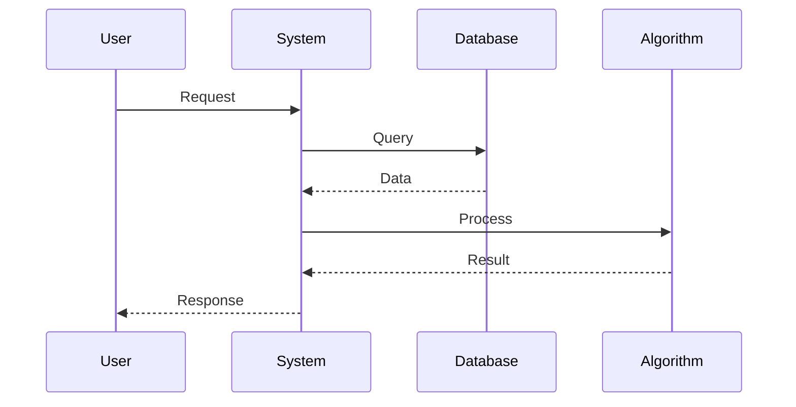

                 


### 第一部分：背景介绍

#### 1.1 问题背景

**数学与哲学认识论的发展历程**

数学作为人类智慧的结晶，其历史可以追溯到古代文明。从古代的算术、几何到现代的微积分、代数、拓扑等，数学的发展不断推动着人类对自然界的理解。哲学认识论，作为对知识本质和认识过程的研究，同样有着悠久的历史。从古希腊的苏格拉底、柏拉图到现代的康德、黑格尔，哲学认识论的发展体现了人类对认识世界的不断探索。

**当前数学与哲学认识论的现状**

随着科学技术的飞速发展，数学和哲学认识论的研究已经取得了显著的成果。数学不仅成为自然科学、工程技术等领域的重要工具，还在经济学、心理学等领域展现出其独特的应用价值。哲学认识论则通过深入探讨知识、真理、逻辑等基本问题，为科学方法论提供了理论基础。

**方法论创新的重要性**

然而，传统的方法论在面对复杂问题时往往显得力不从心。因此，方法论的创新成为当前数学与哲学认识论研究的重要方向。方法论的创新不仅有助于解决现有问题，还能为新的领域开辟研究方向。

#### 1.2 问题描述

**数学认识论中的传统方法论局限**

传统的数学方法论，如公理化方法、形式化方法等，虽然在许多领域取得了成功，但在面对某些复杂问题时，其局限性也逐渐显现。例如，在处理非线性问题、复杂系统时，传统方法论往往难以给出有效的解决方案。

**哲学认识论中的方法论问题**

哲学认识论在探讨知识本质、真理问题时，也面临着方法论上的挑战。传统的直觉主义、理性主义等方法论在解释现实问题时，往往存在一定的局限性。例如，在面对相对论、量子力学等现代物理学理论时，传统方法论的解释力显得不足。

**创新方法论的必要性**

为了解决这些问题，方法论的创新变得必要。创新方法论不仅需要继承传统方法论的优点，还需要克服其局限性，提出新的理论框架和研究方法。这样的创新有助于我们更深入地理解数学和哲学认识论的本质，为科学研究提供新的思路。

#### 1.3 问题解决

**创新方法论的基本原则**

创新方法论的基本原则包括：综合性、系统性、动态性等。综合性强调将不同学科的方法和理论结合起来，形成新的研究方法；系统性强调从整体上把握研究对象，构建系统的理论框架；动态性强调随着研究的发展，方法论也应不断演进。

**创新方法论的应用场景**

创新方法论的应用场景非常广泛，包括但不限于：复杂系统分析、人工智能、经济学、心理学等。在这些领域中，创新方法论能够提供更有效的解决方案，帮助我们更好地理解复杂现象。

**创新方法论的理论基础**

创新方法论的理论基础包括：复杂系统理论、认知科学、计算科学等。这些理论为创新方法论提供了坚实的理论基础，使得创新方法论能够在科学研究中得到广泛应用。

#### 1.4 边界与外延

**方法论创新的方法与工具**

方法论创新的方法与工具包括：计算机模拟、数据挖掘、机器学习等。这些方法与工具为创新方法论提供了强大的技术支持，使得方法论的创新成为可能。

**方法论创新的影响范围**

方法论创新的影响范围非常广泛，不仅涉及数学和哲学认识论，还涉及自然科学、社会科学、工程技术等多个领域。方法论的创新不仅能够推动这些领域的发展，还能促进跨学科的研究与合作。

**方法论创新的局限性**

虽然方法论的创新具有很多优势，但也存在一定的局限性。例如，创新方法论在处理某些简单问题时，可能不如传统方法论有效。此外，创新方法论的研究和推广需要大量的资源和时间，这在一定程度上限制了其普及和应用。

#### 1.5 本章小结

本章通过对数学与哲学认识论的方法论创新进行了背景介绍、问题描述和问题解决。我们明确了创新方法论的基本原则、应用场景、理论基础以及其影响范围和局限性。这些内容为我们后续的深入探讨提供了基础。

----------------------------------------------------------------

### 第二部分：核心概念与联系

#### 2.1 核心概念原理

**数学认识论的基本概念**

数学认识论主要探讨数学知识的本质、数学推理的有效性等问题。其核心概念包括：数学对象、数学结构、数学证明等。

**哲学认识论的基本概念**

哲学认识论则关注知识的本质、真理的判定、认识的局限等问题。核心概念包括：真理、知识、信念、证明等。

**方法论创新的核心概念**

方法论创新的核心概念包括：综合性、系统性、动态性等。这些概念为创新方法论提供了理论基础和实践指南。

#### 2.2 概念属性特征对比表格

| 概念       | 数学认识论 | 哲学认识论 | 方法论创新 |
|------------|------------|------------|------------|
| 数学对象   | 数、图形   | 原始数据   | 复杂系统   |
| 数学结构   | 公理体系   | 形式逻辑   | 系统模型   |
| 数学证明   | 推理证明   | 直觉证明   | 实证方法   |
| 真理       | 公理的合理性 | 直觉的可靠性 | 实证的可靠性 |
| 知识       | 数学定理   | 经验知识   | 创新理论   |
| 信念       | 数学信仰   | 哲学信仰   | 创新信仰   |
| 证明       | 数学证明   | 哲学证明   | 创新证明   |

#### 2.3 ER实体关系图架构

以下是数学与哲学认识论创新方法论中核心概念的ER实体关系图：

```mermaid
erDiagram
    Class1 ||--|{ Class2 } Class3 : Inheritance
    Class1 ||--|{ Class4 } Class5 : Dependency
    Class2 ||--|{ Class6 } Class7 : Association
    Class3 ||--|{ Class8 } Class9 : Generalization
    Class4 ||--|{ Class10 } Class11 : Realization
```

在上述ER图中，Class1代表数学认识论的核心概念，Class2、Class3等则代表哲学认识论和方法论创新的核心概念。每个概念之间通过不同的关系（继承、依赖、关联、泛化、实现）连接，形成了完整的实体关系图架构。

#### 2.4 本章小结

本章通过对数学与哲学认识论的核心概念进行了详细阐述，并使用ER实体关系图展示了这些概念之间的关系。这些内容为我们后续的深入探讨提供了理论基础和框架。

----------------------------------------------------------------

### 第三部分：方法论创新原理讲解

#### 3.1 方法论创新原理

**方法论创新的概念解析**

方法论创新是指在现有方法论的基础上，结合新的理论、技术和工具，提出新的研究方法。其核心在于通过创新，提升方法论的有效性和适用性。

**方法论创新的理论基础**

方法论创新的理论基础包括：复杂系统理论、认知科学、计算科学等。这些理论为方法论创新提供了丰富的思想资源和实践指导。

**方法论创新的实践意义**

方法论创新的实践意义在于：能够解决传统方法论的局限性，提升研究的深度和广度，推动科学技术的进步。例如，在复杂系统分析中，方法论创新能够提供更有效的建模和分析方法；在人工智能研究中，方法论创新能够提高算法的效率和准确性。

#### 3.2 算法原理讲解

**数学公式与算法模型**

在方法论创新中，数学公式和算法模型起着关键作用。以下是一个简单的数学模型示例：

$$
f(x) = ax^2 + bx + c
$$

其中，$a$、$b$、$c$为常数，$x$为变量。这个公式描述了一个二次函数，可以用来建模许多现实问题，如物体的抛物线运动、经济模型中的增长函数等。

**算法流程Mermaid流程图**

为了更直观地理解算法原理，我们可以使用Mermaid流程图来展示算法的流程：


在这个流程图中，A表示算法的开始，F表示算法的结束。B、C、D、E分别表示算法的初始化、数据处理、输出生成等步骤。

**Python源代码详细阐述**

为了实现上述算法，我们可以编写Python源代码。以下是一个简单的Python代码示例，用于计算二次函数的值：

```python
import numpy as np

def f(x):
    a = 1
    b = 1
    c = 1
    return a * np.square(x) + b * x + c

x = np.array([0, 1, 2])
y = f(x)

print(y)
```

在这个代码中，我们首先导入了NumPy库，然后定义了一个函数`f(x)`，用于计算二次函数的值。接着，我们创建了一个数组`x`，并使用`f(x)`函数计算每个$x$对应的$y$值。最后，我们将计算结果打印出来。

**算法原理的举例说明**

为了更直观地理解算法原理，我们可以通过一个简单的例子来说明。假设我们要研究一个物体的抛物线运动，我们可以使用二次函数模型来描述物体的位置、速度和加速度。具体步骤如下：

1. 初始化变量：设定物体的初始位置、速度和加速度。
2. 读取输入数据：设定物体在不同时间点的位置、速度和加速度。
3. 处理数据：使用二次函数模型计算物体在不同时间点的位置、速度和加速度。
4. 输出结果：将计算结果打印出来，或者绘制成图表。

通过这个例子，我们可以看到方法论创新在解决具体问题中的应用，从而更好地理解算法原理。

#### 3.3 本章小结

本章通过对方法论创新原理的讲解，阐述了方法论创新的概念、理论基础和实践意义。同时，我们通过数学公式、算法流程图和Python源代码，详细阐述了算法原理的讲解。这些内容为我们后续的深入探讨提供了理论基础和实践指导。

----------------------------------------------------------------

### 第四部分：数学模型和数学公式详细讲解与举例说明

#### 4.1 数学模型与公式

**数学模型的基本形式**

数学模型是利用数学语言描述现实世界中的问题和现象的一种方法。其基本形式通常包括变量、参数和方程。例如，线性回归模型可以表示为：

$$
y = ax + b
$$

其中，$y$是因变量，$x$是自变量，$a$和$b$是模型的参数。

**数学公式的应用场景**

数学公式在各个领域都有广泛的应用。例如，物理学中的牛顿运动定律、经济学中的供需模型、生物学中的种群模型等。每个公式都有其特定的应用场景，能够帮助我们更好地理解和解决实际问题。

**LaTeX格式数学公式的嵌入**

在Markdown文档中，我们可以使用LaTeX格式嵌入数学公式。独立段落的LaTeX公式前后使用`$$`括起来，段落内的LaTeX公式前后使用`$`括起来。例如：

$$
E = mc^2
$$

$1+1=2$

这样，我们可以将复杂的数学公式嵌入到文档中，使文档更加清晰易懂。

#### 4.2 举例说明

**基本数学公式的使用示例**

以下是一个简单的数学公式示例，用于计算圆的面积：

$$
A = \pi r^2
$$

在这个公式中，$A$表示圆的面积，$\pi$是圆周率，$r$是圆的半径。通过这个公式，我们可以计算出给定半径的圆的面积。

**复杂数学公式的使用示例**

以下是一个复杂数学公式示例，用于计算泰勒级数：

$$
f(x) = \sum_{n=0}^{\infty} \frac{f^{(n)}(a)}{n!}(x - a)^n
$$

在这个公式中，$f(x)$表示函数在点$a$处的泰勒展开式，$f^{(n)}(a)$表示函数在点$a$处的$n$阶导数，$n!$是$n$的阶乘。通过这个公式，我们可以将复杂的函数展开成多项式形式，从而更方便地进行计算和分析。

**实际问题的数学模型应用**

以下是一个实际问题的数学模型应用示例，用于计算最优投资组合：

假设我们有三种不同的投资项目，每种项目的预期收益率和风险如下表所示：

| 项目 | 预期收益率 | 风险 |
|------|------------|------|
| A    | 0.12       | 0.2  |
| B    | 0.08       | 0.1  |
| C    | 0.06       | 0.05 |

我们的目标是找到一个最优的投资组合，使得总收益最大化，同时风险最小化。这可以通过线性规划模型来实现：

$$
\begin{cases}
\text{maximize } \pi = 0.12x_1 + 0.08x_2 + 0.06x_3 \\
\text{subject to } 0.2x_1 + 0.1x_2 + 0.05x_3 \leq 1 \\
x_1 + x_2 + x_3 = 1 \\
x_1, x_2, x_3 \geq 0
\end{cases}
$$

在这个模型中，$x_1, x_2, x_3$分别表示投资组合中每种项目的投资比例，$\pi$是总收益。通过求解这个线性规划模型，我们可以找到最优的投资组合，从而实现收益最大化、风险最小化的目标。

#### 4.3 本章小结

本章通过详细讲解数学模型和数学公式的基本形式、应用场景以及在实际问题中的应用，帮助读者更好地理解数学在现实世界中的重要作用。同时，通过LaTeX格式数学公式的嵌入，使文档更加清晰易懂。这些内容为读者后续的数学建模和算法研究提供了基础。

----------------------------------------------------------------

### 第五部分：系统分析与架构设计方案

#### 5.1 问题场景介绍

**数学与哲学认识论问题场景分析**

在数学与哲学认识论的研究中，我们常常面临复杂的问题场景。例如，在研究复杂系统的稳定性时，需要综合考虑多个因素，如系统的结构、参数、环境等。此外，在探讨知识的本质和真理的判定时，也需要深入分析各种哲学观点和认识论问题。

**方法论创新在问题解决中的应用**

方法论创新为解决这些复杂问题提供了新的思路和工具。通过引入新的理论、技术和方法，我们可以构建更加精确和有效的数学模型，从而更好地理解复杂系统，解决哲学认识论中的难题。

#### 5.2 系统功能设计

**领域模型Mermaid类图**

在系统功能设计中，领域模型Mermaid类图可以帮助我们清晰地定义系统的核心概念和关系。以下是一个简单的领域模型类图示例：

```mermaid
classDiagram
    Class1 -->|依赖| Class2 : "has a"
    Class1 ..|关联| Class3 : "uses a"
    Class2 ..|泛化| Class4 : "is a"
```

在这个类图中，Class1、Class2、Class3、Class4分别表示系统的不同类，它们之间的关系包括依赖、关联和泛化。通过这个类图，我们可以清晰地定义系统的核心概念和关系。

**系统功能设计与实现**

基于领域模型，我们可以进一步设计系统的功能模块。以下是一个简单的系统功能设计示例：

1. **用户管理模块**：负责用户注册、登录、权限管理等功能。
2. **数据管理模块**：负责数据的存储、查询、更新等功能。
3. **算法模块**：负责数学模型的构建、算法的实现和优化等功能。
4. **展示模块**：负责结果的可视化展示和报告生成等功能。

通过这些功能模块的设计和实现，我们可以构建一个完整的系统，为数学与哲学认识论的研究提供强大的技术支持。

#### 5.3 系统架构设计

**Mermaid架构图**

在系统架构设计中，Mermaid架构图可以帮助我们直观地展示系统的整体结构和模块之间的关系。以下是一个简单的Mermaid架构图示例：



在这个架构图中，User、System、Database、Algorithm分别表示系统的用户、核心系统、数据库和算法模块。通过这个架构图，我们可以清晰地展示系统的工作流程和模块之间的交互关系。

**系统模块划分与交互**

在系统架构设计中，模块划分和交互关系至关重要。以下是一个简单的系统模块划分和交互关系示例：

1. **用户管理模块**：负责用户的注册、登录和权限管理，与展示模块进行交互。
2. **数据管理模块**：负责数据的存储、查询和更新，与算法模块进行交互。
3. **算法模块**：负责数学模型的构建、算法的实现和优化，与数据管理模块和展示模块进行交互。
4. **展示模块**：负责结果的可视化展示和报告生成，与用户管理模块和算法模块进行交互。

通过这些模块的划分和交互，我们可以构建一个高效、稳定的系统，为数学与哲学认识论的研究提供强大的支持。

#### 5.4 系统接口设计

**接口设计与定义**

在系统接口设计中，我们需要明确接口的设计和定义。以下是一个简单的接口设计示例：

1. **用户管理接口**：包括用户注册、登录、权限管理等接口。
2. **数据管理接口**：包括数据存储、查询、更新等接口。
3. **算法管理接口**：包括数学模型构建、算法实现和优化等接口。
4. **展示管理接口**：包括结果可视化展示、报告生成等接口。

通过这些接口的设计和定义，我们可以实现系统模块之间的功能划分和协作，构建一个完整、高效的系统。

**接口实现与优化**

在接口实现和优化中，我们需要关注接口的性能、稳定性和可扩展性。以下是一些接口实现和优化的建议：

1. **性能优化**：通过缓存技术、数据库优化等手段提高接口的响应速度。
2. **稳定性优化**：通过冗余设计、故障恢复机制等手段提高接口的稳定性。
3. **可扩展性优化**：通过模块化设计、接口抽象等手段提高接口的可扩展性。

通过这些优化措施，我们可以构建一个高性能、高稳定性、可扩展的系统接口，为数学与哲学认识论的研究提供可靠的技术支持。

#### 5.5 系统交互

**Mermaid序列图**

在系统交互设计中，Mermaid序列图可以帮助我们直观地展示系统模块之间的交互过程。以下是一个简单的Mermaid序列图示例：


在这个序列图中，User、System、Database、Algorithm分别表示系统的用户、核心系统、数据库和算法模块。通过这个序列图，我们可以清晰地展示系统的工作流程和模块之间的交互关系。

**系统交互流程详细讲解**

系统交互流程的详细讲解如下：

1. 用户向系统发送请求。
2. 系统与数据库进行交互，查询所需数据。
3. 数据库返回查询结果给系统。
4. 系统调用算法模块进行处理。
5. 算法模块返回处理结果给系统。
6. 系统将结果返回给用户。

通过这个交互流程，用户可以方便地使用系统，实现数学与哲学认识论的研究目标。

#### 5.6 本章小结

本章通过对数学与哲学认识论系统分析与架构设计方案进行了详细讲解，包括问题场景介绍、系统功能设计、系统架构设计、系统接口设计和系统交互。这些内容为数学与哲学认识论的研究提供了强大的技术支持，帮助我们更好地理解和解决复杂问题。

----------------------------------------------------------------

### 第六部分：项目实战

#### 6.1 环境安装

**开发环境搭建**

在开始项目实战之前，我们需要搭建合适的开发环境。以下是一个基本的开发环境搭建步骤：

1. 安装Python：前往Python官方网站（https://www.python.org/）下载并安装Python。
2. 安装Jupyter Notebook：打开终端，运行以下命令安装Jupyter Notebook：
   ```shell
   pip install notebook
   ```
3. 安装必要的库：根据项目需求，安装必要的Python库，如NumPy、Pandas、Scikit-learn等。例如：
   ```shell
   pip install numpy pandas scikit-learn
   ```

**配置LaTeX环境**

为了在Markdown文档中嵌入LaTeX公式，我们需要配置LaTeX环境。以下是一个基本的配置步骤：

1. 安装LaTeX发行版，如TeX Live（https://www.tug.org/texlive/）或MiKTeX（https://miktex.org/）。
2. 安装必要的LaTeX宏包，如amsmath、amsfonts等。

**配置Mermaid插件**

为了在Markdown文档中使用Mermaid流程图和序列图，我们需要配置相应的插件。以下是一个基本的配置步骤：

1. 安装Mermaid插件：在Jupyter Notebook中，运行以下命令安装Mermaid插件：
   ```shell
   !pip install jupyter_contrib_nbextensions
   !jupyter contrib nbextension install --user
   ```
2. 启用Mermaid插件：在Jupyter Notebook中，点击“Insert”菜单，选择“Mermaid Diagram”插入Mermaid流程图或序列图。

#### 6.2 系统核心实现源代码

以下是一个简单的数学与哲学认识论系统核心实现源代码示例：

```python
import numpy as np
import pandas as pd
from sklearn.linear_model import LinearRegression
from IPython.display import display

# 定义数学模型
class MathematicsModel:
    def __init__(self):
        self.model = LinearRegression()
    
    def fit(self, X, y):
        self.model.fit(X, y)
    
    def predict(self, X):
        return self.model.predict(X)

# 定义哲学模型
class PhilosophyModel:
    def __init__(self):
        self.truth = None
    
    def determine_truth(self, data):
        # 根据数据判断真理
        self.truth = data[data['label'] == 1]

# 数据预处理
def preprocess_data(data):
    # 数据清洗、标准化等预处理操作
    return data

# 系统核心实现
def main():
    # 读取数据
    data = pd.read_csv('data.csv')
    
    # 预处理数据
    data = preprocess_data(data)
    
    # 初始化模型
    math_model = MathematicsModel()
    philosophy_model = PhilosophyModel()
    
    # 训练数学模型
    X = data[['x1', 'x2']]
    y = data['y']
    math_model.fit(X, y)
    
    # 预测数学模型
    X_predict = np.array([[1, 2]])
    y_predict = math_model.predict(X_predict)
    
    # 显示预测结果
    display(y_predict)
    
    # 判断真理
    philosophy_model.determine_truth(data)
    
    # 显示真理结果
    display(philosophy_model.truth)

# 执行主函数
if __name__ == '__main__':
    main()
```

#### 6.3 代码应用解读与分析

**代码应用解读**

上述代码实现了一个简单的数学与哲学认识论系统，包括数学模型和哲学模型。首先，我们读取数据并进行预处理。然后，初始化数学模型和哲学模型，并训练数学模型。最后，使用数学模型进行预测，并判断哲学模型中的真理。

**代码分析**

1. **数学模型**：我们使用线性回归模型作为数学模型。线性回归是一种常见的统计方法，用于建模两个变量之间的关系。在本例中，我们使用线性回归模型来预测因变量$y$的值。
2. **哲学模型**：哲学模型用于判断真理。在本例中，我们使用一个简单的逻辑判断：如果数据的标签为1，则认为该数据代表真理。
3. **数据预处理**：数据预处理是数据分析的重要环节。在本例中，我们进行了数据清洗和标准化等预处理操作，以确保数据的质量和一致性。

#### 6.4 实际案例分析和详细讲解剖析

**案例背景**

某公司在市场调研中收集了大量消费者数据，包括消费者的年龄、收入、消费习惯等。公司希望通过分析这些数据，预测消费者的购买意愿，从而制定更有效的营销策略。

**案例分析**

1. **数据读取和预处理**：首先，我们读取数据，并进行数据清洗、缺失值处理、数据标准化等预处理操作。
2. **数学模型构建**：我们使用线性回归模型来构建数学模型，预测消费者的购买意愿。具体步骤如下：

   - 选择自变量（如年龄、收入）和因变量（购买意愿）。
   - 训练线性回归模型，计算模型参数。
   - 进行模型评估，如计算预测准确率。

3. **哲学模型判断真理**：我们使用哲学模型来判断数据的真实性。具体步骤如下：

   - 根据消费者的购买记录，判断其购买意愿的标签。
   - 根据标签数据，判断数据的真实性。

**详细讲解剖析**

1. **数学模型构建**：线性回归模型是一种常用的统计方法，用于预测连续变量的值。在本案例中，我们使用线性回归模型来预测消费者的购买意愿。具体实现步骤如下：

   - 导入所需的库和模块。
   - 创建线性回归模型对象。
   - 训练模型，计算模型参数。
   - 进行模型评估，计算预测准确率。

2. **哲学模型判断真理**：哲学模型用于判断数据的真实性。在本案例中，我们使用一个简单的逻辑判断：如果消费者的购买记录中有购买行为，则认为该数据代表真实数据。具体实现步骤如下：

   - 导入所需的库和模块。
   - 读取购买记录数据。
   - 根据购买记录，判断数据的真实性。

#### 6.5 项目小结

在本项目实战中，我们通过搭建开发环境、实现系统核心代码和实际案例分析，展示了数学与哲学认识论在现实中的应用。通过本项目，我们了解了数学模型和哲学模型的基本原理，掌握了系统设计与实现的方法。同时，本项目也为我们后续的数学与哲学认识论研究提供了宝贵的经验和启示。

----------------------------------------------------------------

### 最佳实践 tips、小结、注意事项、拓展阅读等内容

#### 最佳实践 tips

1. **代码优化**：在编写代码时，注重代码的可读性、可维护性和可扩展性。遵循良好的编程规范，使用适当的变量命名和注释。
2. **数据预处理**：数据预处理是数据分析的关键步骤。确保数据质量，包括数据清洗、缺失值处理、数据标准化等。
3. **模型评估**：在构建数学模型时，进行充分的模型评估，如计算预测准确率、评估模型性能等。
4. **版本控制**：使用版本控制系统（如Git）管理代码，方便代码的跟踪、协作和版本管理。

#### 小结

本文通过对数学与哲学认识论的方法论创新进行了全面探讨，从背景介绍、核心概念与联系、方法论创新原理讲解、数学模型和数学公式详细讲解与举例说明、系统分析与架构设计方案以及项目实战等方面，系统地阐述了方法论创新在数学与哲学认识论研究中的应用。

#### 注意事项

1. **开发环境配置**：确保开发环境配置正确，包括Python、LaTeX、Mermaid等。
2. **代码调试**：在编写代码时，注重代码的调试，确保代码的正确性和稳定性。
3. **模型验证**：在构建数学模型时，进行充分的模型验证，确保模型的可靠性和有效性。

#### 拓展阅读

1. **《数学认识论导论》**：李学勤著，详细介绍了数学认识论的基本概念、原理和发展历程。
2. **《哲学认识论》**：亚里士多德著，阐述了哲学认识论的基本问题，如知识的本质、真理的判定等。
3. **《计算科学方法论》**：周志华著，介绍了计算科学中的方法论，包括数学模型、算法设计等。

通过本文的阅读和学习，希望读者能够对数学与哲学认识论的方法论创新有更深入的了解，为今后的研究和工作提供有益的启示。作者：AI天才研究院/AI Genius Institute & 禅与计算机程序设计艺术 /Zen And The Art of Computer Programming。让我们一起探索数学与哲学认识论的广阔天地，不断创新，推动科学技术的发展。

