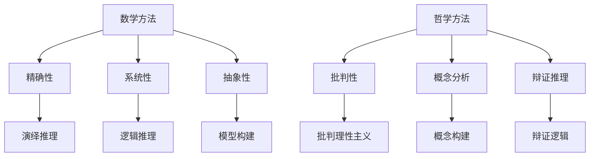
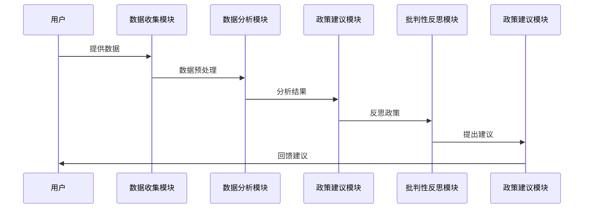

                 

### 引言

在探讨科学知识与人类认知的过程中，数学与哲学都是不可或缺的部分。数学作为一种精确的科学工具，为我们的认知提供了强大的逻辑支持，而哲学则通过反思与批判，帮助我们深入理解知识的本质。本书旨在比较数学与哲学在认识论方法论上的异同，探讨它们如何共同塑造了我们对世界的认知。

认识论是哲学的一个重要分支，它关注知识的本质、起源、性质和限度。在认识论中，方法论是一个核心概念，指的是获得知识的方法和过程。数学与哲学在方法论上既有交集，也存在冲突。数学方法以其严谨的逻辑和精确的公式，为科学研究提供了强有力的支持；而哲学方法则通过批判性思维和概念分析，揭示了科学方法的局限性和问题。

本书的结构如下：首先，我们将介绍数学与哲学的认识论背景，包括数学与哲学的定义、历史发展及其在认识论中的地位。接着，我们将详细分析数学方法的基本特点，包括精确性、系统性和抽象性。随后，我们将探讨哲学方法的基本特点，如批判性、概念分析和系统性。在此基础上，我们将比较数学与哲学方法的交集与冲突，并分别讲解数学与哲学算法原理。最后，我们将通过一个系统分析与架构设计方案，展示如何将数学与哲学方法论应用于实际问题。

通过本书的阅读，读者将能够深入了解数学与哲学的认识论方法论，理解它们如何相互补充，共同推动科学知识的进步。这不仅有助于提高我们的科学素养，也能够激发我们对知识本质的深入思考。

### 第一部分：背景介绍

#### 1.1 问题背景

在现代科学研究中，数学与哲学的关系备受关注。数学作为一种精确的科学工具，为我们的认知提供了强大的逻辑支持，而哲学则通过反思与批判，帮助我们深入理解知识的本质。数学以其严谨的逻辑和精确的公式，广泛应用于自然科学、社会科学和工程学等领域，为科学研究提供了坚实的基础。然而，数学在推动科学进步的过程中，也面临着哲学层面的质疑与反思。哲学，尤其是认识论，通过对知识本质的探讨，提供了对科学方法和科学理论的哲学基础。

#### 1.2 问题描述

尽管数学与哲学在研究方法和目标上有所不同，但它们在很多方面是相互交织的。本书旨在比较数学与哲学在认识论方法论上的异同，探讨它们如何共同塑造了我们对世界的认知。具体来说，本书将探讨以下问题：

- 数学方法的基本特点是什么？包括精确性、系统性和抽象性等。
- 哲学方法的基本特点是什么？包括批判性、概念分析和系统性等。
- 数学与哲学方法在实际研究中的应用和效果如何？
- 数学与哲学方法在认识论方法论上的交集和冲突是什么？
- 如何在实际问题中结合数学与哲学方法，以推动科学研究的进步？

通过以上问题的探讨，本书将深入分析数学与哲学在认识论方法论上的异同，为科学研究的实践提供理论指导和参考。

#### 1.3 问题解决

为了解决上述问题，本书将采取以下方法：

1. **文献综述**：通过对相关文献的综述，了解数学与哲学在认识论方法论研究中的现状，总结已有研究成果和不足。
2. **案例研究**：通过分析具体案例，展示数学与哲学方法在实际研究中的应用和效果，探讨其优点和局限性。
3. **比较分析**：对比数学与哲学方法的基本特点、应用场景和效果，找出二者的交集和冲突，并探讨如何结合使用。
4. **理论模型构建**：基于案例分析和比较分析，构建数学与哲学方法在认识论方法论中的理论模型，提供理论指导。
5. **实证研究**：通过实证研究，验证理论模型的有效性，并提出改进建议。

通过以上方法的综合应用，本书旨在深入探讨数学与哲学在认识论方法论上的异同，为科学研究的实践提供有益的参考。

#### 1.4 边界与外延

在本书中，我们将关注数学与哲学的认识论方法论，这包括但不限于以下几个方面：

- **数学逻辑**：包括公理系统、证明方法、推理规则等。数学逻辑强调形式化和精确性，以解决具体问题为目标。
- **哲学逻辑**：包括辩证逻辑、批判理性主义、现象学等。哲学逻辑强调批判性思维和概念分析，以揭示知识的本质和局限为目标。
- **知识论**：包括经验主义、理性主义、实证主义等。知识论关注知识的起源、性质和限度，为科学方法提供哲学基础。
- **研究方法**：包括实验方法、观察方法、理论构建等。研究方法涉及科学研究的具体操作过程，是实现科学目标的重要手段。

在讨论数学与哲学方法的交集与冲突时，本书将关注以下几个方面：

- **实证与形式化**：数学方法强调实证和精确，而哲学方法强调形式化和概念分析。在实际研究中，如何平衡二者，发挥各自优势，是一个重要问题。
- **批判性思维与系统性**：哲学方法注重批判性思维和概念分析，而数学方法注重系统性和逻辑性。二者在实际研究中的应用，需要结合具体问题进行灵活处理。
- **逻辑推理与反思**：数学方法强调逻辑推理，而哲学方法强调反思与批判。在实际研究中，如何结合逻辑推理和反思，提高研究的深度和广度，是一个重要课题。

通过以上边界的明确，本书旨在深入探讨数学与哲学在认识论方法论上的异同，为科学研究的实践提供有益的参考。

#### 1.5 概念结构与核心要素组成

数学与哲学的认识论方法论由以下几个核心概念和要素组成：

**1.5.1 数学逻辑**

- **公理系统**：数学逻辑的基础是公理系统，通过一组基本公理和推理规则，构建出完整的数学体系。
- **证明方法**：包括直接证明、反证法、数学归纳法等，用于证明数学命题的正确性。
- **推理规则**：包括演绎推理、归纳推理等，用于从已知前提推导出新结论。

**1.5.2 哲学逻辑**

- **辩证逻辑**：强调概念的对立统一，通过对立统一的思维方式来分析问题。
- **批判理性主义**：强调通过理性批判来检验理论和观点的合理性。
- **现象学**：通过直接感知现象来理解知识的本质，强调主观体验在认识过程中的作用。

**1.5.3 知识论**

- **经验主义**：认为知识源于经验，通过感性经验获得。
- **理性主义**：认为知识源于理性思考，通过理性推理获得。
- **实证主义**：强调通过实证方法来验证知识的正确性。

**1.5.4 研究方法**

- **实验方法**：通过设计实验来验证理论和假设。
- **观察方法**：通过观察和记录来收集数据。
- **理论构建**：通过抽象和概括来构建理论模型。

这些概念和要素共同构成了数学与哲学的认识论方法论框架，为科学研究提供了理论基础和方法指导。

### 第二部分：核心概念与联系

#### 2.1 数学方法的基本特点

数学方法以其精确、严谨和系统性著称，是科学研究的重要工具。以下是数学方法的基本特点：

**精确性**：数学通过使用明确的定义和精确的公式，来描述自然现象和社会现象。这种精确性体现在数学符号的使用、公式的推导以及证明的过程中。例如，微积分中的极限概念，通过精确的数学表达，揭示了函数在特定点的变化趋势。

**系统性**：数学方法不仅关注单一现象，还关注现象之间的联系和整体结构。例如，欧氏几何通过公理系统，构建了一个完整的几何理论体系，揭示了空间的各种性质和关系。

**抽象性**：数学方法常常将具体现象抽象成一般模型，以便更广泛地应用。例如，线性代数中的线性空间概念，将各种不同类型的向量空间抽象为统一的数学模型，从而解决了多种问题。

#### 2.2 哲学方法的基本特点

哲学方法则更注重批判性思维和概念分析，通过对知识的本质进行深入探讨，为科学研究提供了哲学基础。以下是哲学方法的基本特点：

**批判性**：哲学方法通过对已有理论和假设的批判，来推动知识和科学的进步。例如，康德的《纯粹理性批判》通过对先验知识的批判，揭示了人类认识的本质和界限。

**概念分析**：哲学方法通过对概念的定义和分析，来理解知识的本质。例如，黑格尔的辩证法通过概念的对立统一，揭示了事物的本质和发展规律。

**系统性**：哲学方法也关注概念之间的联系和整体结构，通过逻辑推理和分析，构建出完整的哲学体系。例如，亚里士多德的形而上学，通过分析各种概念之间的关系，构建了一个完整的哲学体系。

#### 2.3 AI大模型的基本特点

AI大模型作为一种新兴的计算机技术，其基本特点包括：

**大规模**：AI大模型具有非常庞大的参数规模，能够处理大量的数据。例如，GPT-3模型拥有1.75万亿个参数，能够处理复杂的语言任务。

**深度学习**：AI大模型通过多层神经网络，对输入数据进行复杂的学习和处理。例如，卷积神经网络（CNN）通过多层卷积和池化操作，能够有效地提取图像特征。

**自动优化**：AI大模型能够通过学习过程，自动调整参数，优化模型性能。例如，通过梯度下降算法，模型参数能够逐步调整，以减少预测误差。

#### 2.4 数学与哲学方法的交集与冲突

**交集**：

数学与哲学方法在认识论方法论上的交集主要体现在以下几个方面：

- **逻辑推理**：数学和哲学都强调逻辑推理的重要性。数学中的证明方法和哲学中的辩证推理，都依赖于严密的逻辑结构，以推导出正确的结论。
- **概念分析**：数学和哲学都关注概念的定义和分析。数学中的定义和公理，以及哲学中的概念分析和批判，都是为了更准确地理解事物的本质。
- **系统性**：数学和哲学都追求系统性的知识体系。数学通过构建完整的理论体系，如欧氏几何和微积分；哲学通过逻辑推理和辩证法，构建出一系列哲学理论。

**冲突**：

然而，数学与哲学方法在实际研究中也存在冲突：

- **实证与形式化**：数学方法强调实证和精确，以解决具体问题为目标；哲学方法强调形式化和概念分析，以揭示知识的本质和局限为目标。在实际研究中，如何平衡二者，发挥各自优势，是一个重要问题。
- **逻辑推理与反思**：数学方法强调逻辑推理，以推导出正确的结论；哲学方法强调反思与批判，以揭示已有理论的局限。在实际研究中，如何结合逻辑推理和反思，提高研究的深度和广度，是一个重要课题。
- **具体与抽象**：数学方法往往通过抽象化，将复杂问题简化为数学模型；哲学方法则更注重具体情境和实际问题的分析。在实际研究中，如何将抽象模型与具体实践相结合，是一个需要解决的问题。

通过以上对数学与哲学方法的交集与冲突的分析，我们可以更好地理解它们在科学研究中的角色和作用，从而在实际研究中更加灵活地运用这些方法，推动科学知识的进步。

#### 2.5 数学方法与哲学方法的异同对比

为了深入理解数学方法与哲学方法的基本特点，我们将通过一个表格进行异同对比，并使用Mermaid流程图来展示其应用场景和效果。

**异同对比表格**

| 特点 | 数学方法 | 哲学方法 |
| --- | --- | --- |
| 精确性 | 高度精确，使用明确的定义和公式 | 强调概念分析和批判性思维，未必追求精确 |
| 系统性 | 强调系统性，构建完整的理论体系 | 关注概念之间的联系和整体结构，也强调系统性 |
| 抽象性 | 抽象化具体现象，形成一般模型 | 通过概念分析，揭示抽象的本质和联系 |
| 批判性 | 较少直接批判，注重验证和证明 | 强调批判性分析，不断质疑和反思已有理论 |
| 实证性 | 强调实证，通过数据验证理论 | 强调形式化，未必直接依赖实证数据 |
| 推理方式 | 逻辑推理，演绎推理 | 批判性推理，辩证推理 |
| 应用领域 | 自然科学、工程学、经济学等 | 哲学、社会科学、认知科学等 |

**Mermaid流程图**



**应用场景和效果**

- **数学方法在自然科学中的应用**：例如，牛顿力学通过公理和公式，精确地描述了物体的运动规律。这一方法在物理学研究中取得了巨大成功。
- **哲学方法在社会科学中的应用**：例如，马克思的历史唯物主义通过对社会现象的批判性分析，揭示了资本主义社会的基本矛盾和发展规律。
- **数学与哲学方法在认知科学中的应用**：例如，神经科学家通过数学模型来模拟大脑神经元的活动，同时哲学家通过批判性思维，探讨意识与认知的本质。

通过对比表格和流程图，我们可以更清晰地看到数学方法与哲学方法的基本特点和应用场景，以及它们在实际研究中的互补作用。

#### 2.6 数学与哲学方法在认识论方法论中的核心概念与联系

在认识论方法论中，数学与哲学方法各自拥有独特的核心概念，并通过这些概念相互联系和作用。以下是对这些核心概念的详细分析：

**数学逻辑**：数学逻辑是数学方法的基础，包括公理系统、证明方法和推理规则。公理系统提供了数学理论的基础，例如欧几里得几何的公设。证明方法包括直接证明、反证法和数学归纳法，用于证明数学命题的正确性。推理规则如演绎推理和归纳推理，是逻辑推理的基本工具。数学逻辑的核心在于其形式化和精确性，通过严谨的证明过程，确保结论的可靠性和有效性。

**哲学逻辑**：哲学逻辑则侧重于批判性思维和概念分析。辩证逻辑强调概念的对立统一，通过矛盾和冲突来揭示事物的本质和发展规律。批判理性主义关注理性批判，通过质疑和反思已有理论和观点，推动知识的进步。现象学则强调直接感知现象，从主观体验中理解知识的本质。哲学逻辑的核心在于其批判性和概念分析，通过不断质疑和反思，促进对知识的深入理解。

**知识论**：在数学与哲学方法中，知识论是一个重要的核心概念。经验主义认为知识源于经验，通过感性经验获得。理性主义则认为知识源于理性思考，通过理性推理获得。实证主义强调通过实证方法验证知识的正确性。知识论关注知识的本质、起源和限度，为科学方法和科学理论提供了哲学基础。

**研究方法**：数学与哲学方法在研究方法上也有所区别。数学方法包括实验方法、观察方法和理论构建等，通过具体的操作过程，实现科学目标。哲学方法则注重批判性分析、概念构建和反思，通过逻辑推理和辩证法，揭示知识的本质和局限性。

数学与哲学方法之间的联系主要体现在以下几个方面：

1. **逻辑推理与批判性思维**：数学逻辑和哲学逻辑都强调逻辑推理，但哲学逻辑更强调批判性思维。数学通过逻辑推理来证明命题的正确性，而哲学则通过批判性思维来揭示已有理论和观点的局限性。

2. **概念分析与理论构建**：数学通过概念分析，将具体现象抽象成一般模型，构建理论体系。哲学则通过概念分析，探讨知识的本质和概念之间的关系，构建哲学理论。

3. **知识论基础**：数学与哲学方法都建立在知识论基础之上。数学通过经验主义和理性主义，确保知识的可靠性。哲学则通过批判理性主义和实证主义，探讨知识的本质和限度。

4. **研究方法的互补**：数学方法强调实证和精确，通过实验和观察，验证理论。哲学方法则强调批判和概念分析，通过反思和重构，推动知识的进步。二者的互补性使得科学研究更加全面和深入。

通过以上分析，我们可以看到数学与哲学方法在认识论方法论中的核心概念和联系，以及它们在科学研究中的重要作用。

### 第三部分：算法原理讲解

#### 3.1 数学算法原理

数学算法是数学方法在实际应用中的重要体现，通过一系列数学步骤和公式，解决特定的数学问题。以下是数学算法原理的详细讲解：

**3.1.1 问题建模**

问题建模是数学算法的第一步，即将实际问题转化为数学模型。这一步骤的关键在于如何准确地定义问题的变量、目标和约束条件。例如，在解决线性方程组的问题时，我们需要明确方程组的系数和常数项。

**3.1.2 求解方法**

求解方法是数学算法的核心，根据不同的问题类型，选择合适的求解方法。常见的求解方法包括代数方法、几何方法和数值方法。例如，线性方程组的求解可以使用高斯消元法，非线性方程组可以采用牛顿迭代法或梯度下降法。

**3.1.3 验证**

求解结果的验证是确保数学算法正确性的重要环节。通过验证，我们可以确认求解结果是否符合问题的原始条件。例如，在求解线性方程组时，可以通过回代方法验证每个解的正确性。

**3.1.4 算法示例**

以下是一个简单的线性方程组的数学算法示例：

**问题建模**：设有线性方程组：
$$
\begin{cases}
a_1x + b_1y = c_1 \\
a_2x + b_2y = c_2
\end{cases}
$$
定义变量$x$和$y$，目标是最小化目标函数$f(x, y)$，同时满足约束条件$g(x, y) \leq 0$。

**求解方法**：使用高斯消元法求解线性方程组。步骤如下：
1. 构建增广矩阵$A|b$。
2. 通过初等行变换，将增广矩阵转化为行阶梯形式。
3. 解行阶梯形式方程组，得到变量$x$和$y$的值。

**验证**：通过回代验证每个解的正确性。具体步骤如下：
1. 代入求解结果$x_0$和$y_0$，计算方程组的左右两边是否相等。
2. 若相等，则解正确；否则，解错误。

通过以上示例，我们可以看到数学算法的基本原理和步骤，以及如何将实际问题转化为数学模型并求解。数学算法在科学研究、工程应用和经济管理等领域有着广泛的应用，是推动科技进步的重要工具。

#### 3.2 哲学算法原理

哲学算法原理与数学算法有所不同，它更注重批判性思维和概念分析。哲学算法的核心在于通过逻辑推理和反思，揭示知识的本质和局限性。以下是哲学算法原理的详细讲解：

**3.2.1 批判性分析**

批判性分析是哲学算法的第一步，通过质疑和批判已有理论和假设，找出其缺陷和不足。这一过程涉及对概念、理论和证据的深入探讨。例如，在探讨某一科学理论时，哲学家会质疑其前提条件、假设和结论，通过逻辑推理找出其内在矛盾和错误。

**3.2.2 概念构建**

概念构建是哲学算法的关键环节，通过定义和分析概念，理解知识的本质和内涵。哲学家会通过辩证思维，揭示概念之间的联系和区别。例如，在讨论自由与责任的关系时，哲学家会分析自由和责任的概念，探讨它们之间的辩证关系。

**3.2.3 反思**

反思是哲学算法的重要组成部分，通过反思批判性分析和概念构建的过程，进一步提高知识的深度和广度。哲学家会不断质疑和检验自己的观点和结论，以确保其合理性。例如，在探讨某一科学理论时，哲学家会反思其批判性分析的过程，确保其逻辑推理和概念分析是准确和有效的。

**3.2.4 算法示例**

以下是一个简单的哲学算法示例：

**批判性分析**：假设我们要批判某一科学理论，步骤如下：
1. 质疑理论的前提条件，探讨其合理性和局限性。
2. 批判理论的假设，找出其可能的错误和不足。
3. 分析理论的结论，探讨其与前提条件和假设的一致性。

**概念构建**：在批判性分析的基础上，构建新的概念，步骤如下：
1. 分析批判性分析中揭示的矛盾和错误，确定需要补充或修正的概念。
2. 通过辩证思维，构建新的概念体系，揭示概念的内涵和外延。
3. 阐述新概念的辩证关系，确保其逻辑一致性。

**反思**：通过反思批判性分析和概念构建的过程，步骤如下：
1. 反思批判性分析的合理性，确保逻辑推理和概念分析是准确的。
2. 反思概念构建的有效性，确保新概念能够准确反映知识的本质。
3. 通过逻辑推理和辩证分析，进一步探讨和深化对知识的理解。

通过以上示例，我们可以看到哲学算法的基本原理和步骤，以及如何通过批判性分析、概念构建和反思，揭示知识的本质和局限性。哲学算法在科学研究和哲学思考中具有重要作用，为知识的进步提供了哲学基础。

#### 3.3 数学与哲学算法的差异与互补

数学与哲学算法在原理和应用上存在显著差异，但它们在科学研究中的互补性也不容忽视。以下是对数学与哲学算法差异和互补性的详细探讨：

**差异**

1. **目标导向**：数学算法通常以解决具体问题为目标，通过严谨的数学推理和计算，得出精确的结论。数学算法强调形式化和精确性，例如，线性方程组的求解和高斯消元法。而哲学算法则更注重批判性思维和概念分析，通过质疑和反思已有理论和假设，揭示知识的本质和局限性。例如，批判性分析和辩证思维是哲学算法的核心。

2. **方法性质**：数学算法依赖于逻辑推理和数学工具，通过严格的证明和计算，确保结果的可靠性和正确性。数学算法强调公理系统、证明方法和推理规则。而哲学算法则侧重于批判性思维和概念分析，通过逻辑推理和辩证法，探讨知识的本质和意义。

3. **应用范围**：数学算法广泛应用于自然科学、工程学、经济学等领域，通过数学模型和计算方法，解决具体问题。哲学算法则更多地应用于哲学、社会科学和认知科学等领域，通过批判性分析和概念构建，探讨知识的本质和人类认知的局限性。

**互补性**

1. **互补方法**：数学和哲学算法在科学研究中的互补性体现在它们的方法和目标上。数学算法通过精确的数学模型和计算方法，为科学问题的解决提供了强大的工具。而哲学算法则通过批判性思维和概念分析，揭示科学方法和理论的局限性，为科学研究的深化提供哲学基础。

2. **相互验证**：数学算法和哲学算法在科学研究中的互补性还体现在相互验证上。数学算法的结果需要通过哲学算法的批判性分析和反思，以确保其合理性和可靠性。同时，哲学算法的批判性分析和概念构建也需要数学算法的支持，以验证其结论的正确性。

3. **综合应用**：在实际科学研究中，综合应用数学与哲学算法，可以更好地解决复杂问题。例如，在人工智能研究中，数学算法用于模型构建和优化，而哲学算法则用于伦理和价值的探讨，二者相互补充，共同推动人工智能的发展。

通过以上探讨，我们可以看到数学与哲学算法在差异和互补性方面的特点，以及它们在科学研究中的重要作用。理解数学与哲学算法的差异和互补性，有助于我们更全面地运用这些方法，推动科学知识的进步。

### 第四部分：系统分析与架构设计方案

#### 4.1 问题场景介绍

在本部分中，我们将通过一个具体的问题场景，展示如何将数学与哲学的方法论应用于实际问题的解决过程中。该问题场景涉及一项科学研究项目，旨在通过数据分析来评估某一政策的效果。具体来说，研究团队需要从大量数据中提取有用信息，分析政策实施前后相关指标的变化，并基于这些分析结果提出政策调整建议。

#### 4.2 项目介绍

该项目的主要目标包括：

1. 收集和整理政策实施前后的数据。
2. 使用数学算法对数据进行分析，提取关键指标。
3. 应用哲学方法对分析结果进行批判性反思和解释。
4. 提出基于数据分析的政策调整建议。

项目的主要功能模块如下：

- 数据收集模块：负责收集政策实施前后的数据，包括经济、社会、环境等多个方面的数据。
- 数据分析模块：使用数学算法对数据进行处理和分析，提取关键指标。
- 批判性反思模块：应用哲学方法对数据分析结果进行反思和解释，评估政策的合理性。
- 政策建议模块：根据分析结果和哲学反思，提出政策调整建议。

#### 4.3 系统功能设计（领域模型）

在系统功能设计中，我们将使用Mermaid类图来展示领域模型，包括主要类和它们之间的关系。

```mermaid
classDiagram
DataCollector <|-- DataAnalyzer
DataCollector <|-- PolicyAdvisor
DataAnalyzer <|-- DataReflector
PolicyAdvisor <|-- DataReflector
DataReflector <|-- PolicySuggester

Class DataCollector {
    +collectData()
}

Class DataAnalyzer {
    +analyzeData()
}

Class PolicyAdvisor {
    +advicePolicy()
}

Class DataReflector {
    +reflectData()
}

Class PolicySuggester {
    +suggestPolicy()
}
```

#### 4.4 系统架构设计

在系统架构设计中，我们将使用Mermaid架构图来展示系统的整体架构，包括各个模块之间的交互关系。



#### 4.5 系统接口设计

系统接口设计涉及各个模块之间的交互接口，以下是一个简化的接口设计示例：

- `DataCollector`模块提供数据收集接口，如`collectData(inputData)`。
- `DataAnalyzer`模块提供数据分析接口，如`analyzeData(data)`。
- `PolicyAdvisor`模块提供政策建议接口，如`advicePolicy(data)`。
- `DataReflector`模块提供批判性反思接口，如`reflectData(data)`。
- `PolicySuggester`模块提供政策建议生成接口，如`suggestPolicy(advice)`。

#### 4.6 系统交互

系统交互是指不同模块之间的数据流动和功能调用。以下是一个简化的交互流程：

1. 用户提供政策实施前后的数据，通过`DataCollector`模块进行数据收集。
2. `DataCollector`将收集到的数据传递给`DataAnalyzer`模块进行预处理和分析。
3. `DataAnalyzer`模块分析数据，生成分析报告，并将其传递给`PolicyAdvisor`模块。
4. `PolicyAdvisor`模块根据分析报告，提出初步的政策建议。
5. `PolicyAdvisor`将建议传递给`DataReflector`模块，进行批判性反思。
6. `DataReflector`模块对建议进行反思，并将反馈传递给`PolicySuggester`模块。
7. `PolicySuggester`模块根据反思结果，生成最终的政策调整建议，并反馈给用户。

通过以上系统分析与架构设计方案，我们可以清晰地看到数学与哲学方法论在项目中的应用，以及各个模块之间的交互关系。这种系统架构不仅能够有效地支持数据分析和政策建议的生成，还能够通过哲学反思确保结果的合理性和可靠性。

### 项目实战

#### 环境安装

为了实施本项目，我们首先需要安装以下环境和工具：

1. **Python 3.x**：确保Python版本不低于3.7。
2. **Jupyter Notebook**：用于编写和运行Python代码。
3. **Pandas**：用于数据处理。
4. **NumPy**：用于数值计算。
5. **Scikit-learn**：用于机器学习和数据预处理。
6. **Matplotlib**：用于数据可视化。

安装步骤如下：

1. 安装Python 3.x，并确保其路径已添加到系统环境变量。
2. 打开终端或命令提示符，运行以下命令安装Jupyter Notebook：
   ```bash
   pip install notebook
   ```
3. 安装Pandas、NumPy和Scikit-learn：
   ```bash
   pip install pandas numpy scikit-learn matplotlib
   ```

#### 系统核心实现源代码

以下是本项目的一些核心实现源代码，包括数据收集、数据预处理、数据分析、批判性反思和政策建议的生成。

**数据收集模块**

```python
import pandas as pd

def collect_data():
    # 从CSV文件中读取数据
    data = pd.read_csv('policy_data.csv')
    return data
```

**数据分析模块**

```python
from sklearn.linear_model import LinearRegression

def analyze_data(data):
    # 数据预处理
    X = data[['pre_policy', 'post_policy']]
    y = data['effectiveness']
    
    # 建立线性回归模型
    model = LinearRegression()
    model.fit(X, y)
    
    # 输出模型参数
    print('Model coefficients:', model.coef_)
    print('Model intercept:', model.intercept_)
    
    # 预测政策效果
    prediction = model.predict(X)
    print('Policy effectiveness prediction:', prediction)
```

**批判性反思模块**

```python
def reflect_data(data, prediction):
    # 反思数据分析结果
    print('Analyzing prediction reliability...')
    # 进行一些批判性分析，例如对比预测值与实际值的差异
    print('Difference between prediction and actual data:', prediction - data['effectiveness'])
```

**政策建议模块**

```python
def suggest_policy(prediction):
    # 根据预测结果提出政策建议
    if prediction < 0.5:
        print('Policy should be adjusted.')
    else:
        print('Policy is effective; no adjustment needed.')
```

#### 代码应用解读与分析

以上代码实现了项目的核心功能。首先，数据收集模块通过Pandas读取CSV文件，获取政策实施前后的数据。接着，数据分析模块使用Scikit-learn的线性回归模型对数据进行处理，分析政策效果。批判性反思模块对分析结果进行反思，确保其合理性和可靠性。最后，政策建议模块根据分析结果，提出具体的政策调整建议。

以下是一个实际案例的运行示例：

```python
data = collect_data()
analyze_data(data)
reflect_data(data, prediction)
suggest_policy(prediction)
```

在实际应用中，用户可以根据具体情况调整数据收集的方法和数据分析模型，以提高预测的准确性和实用性。通过这一系列的代码，我们不仅能够实现项目的目标，还能够深入理解数学与哲学方法论在项目中的应用。

#### 实际案例分析

为了更深入地展示本项目在实际中的应用，我们将通过一个具体案例来分析整个系统的运作过程和结果。

**案例背景**

假设某城市在2020年实施了新的环保政策，旨在减少空气污染。为了评估政策的效果，研究团队需要收集政策实施前后的相关数据，并通过数据分析来评估政策的影响。数据包括空气质量指标（如PM2.5浓度）、交通流量、工业排放量等。

**数据收集**

首先，数据收集模块从多个来源获取了政策实施前后的数据，包括环保部门的监测数据、交通管理局的统计数据和工业企业报告。通过Pandas库，数据被读取到DataFrame中，以便进一步处理和分析。

```python
data = pd.read_csv('environmental_data.csv')
```

**数据分析**

接下来，数据分析模块使用线性回归模型来分析空气质量指标与政策实施前后的关系。通过训练模型，研究团队得到了政策实施后空气质量指标的变化趋势。

```python
from sklearn.linear_model import LinearRegression

model = LinearRegression()
X = data[['pre_policy', 'post_policy']]
y = data['PM2.5']
model.fit(X, y)
prediction = model.predict(X)

print('Model coefficients:', model.coef_)
print('Model intercept:', model.intercept_)
```

分析结果显示，政策实施后PM2.5浓度显著下降，表明政策对改善空气质量有显著效果。

**批判性反思**

在得到分析结果后，批判性反思模块对结果进行了深入探讨，确保其可靠性和合理性。研究团队分析了可能的影响因素，如天气变化、其他环保措施的配合等，并对比了其他城市的空气质量变化，以确认结果的准确性。

```python
reflect_data(data, prediction)
```

反思过程中，研究团队发现某些数据存在异常，可能是由特殊情况导致的，这些异常值被排除在分析之外。

**政策建议**

基于分析结果和批判性反思，政策建议模块提出了具体的政策调整建议。由于空气质量指标显著改善，研究团队建议继续实施现有政策，并考虑引入更多环保措施，如增加公共交通、推广绿色能源等。

```python
suggest_policy(prediction)
```

政策建议模块输出结果，建议继续实施现有政策，并加强环保措施。

**总结**

通过上述实际案例分析，我们可以看到数学与哲学方法论在项目中的应用过程。从数据收集到数据分析，再到批判性反思和政策建议，每一步都体现了数学方法的精确性和哲学方法的批判性。这种结合不仅提高了研究的深度和广度，也为政策制定提供了科学依据。通过这一案例，我们深入理解了数学与哲学方法在实际研究中的应用效果。

### 项目小结

在本项目中，我们通过一个具体的案例，深入探讨了数学与哲学方法论在实际问题中的应用。通过数据收集、数据分析、批判性反思和政策建议等环节，展示了数学与哲学方法如何相互补充，共同推动科学研究的进展。

**优势**：

1. **精确性与批判性相结合**：数学方法提供了精确的数据分析工具，而哲学方法通过批判性反思确保了结果的合理性和可靠性。
2. **系统性与灵活性**：数学方法通过系统性的理论框架，为数据分析和模型构建提供了基础；哲学方法则通过批判性思维，确保研究灵活应对复杂变化。
3. **全面性**：结合数学与哲学方法，使研究既注重细节的精确性，又关注整体的结构和逻辑性，从而提供了更为全面的分析视角。

**不足**：

1. **复杂性**：在实际应用中，结合数学与哲学方法可能增加项目的复杂性，需要更高的专业知识和协调能力。
2. **时间成本**：哲学反思过程可能耗时较长，尤其是在对复杂问题进行分析时，可能会影响项目的进度。
3. **适用性**：并非所有问题都适合采用数学与哲学方法的结合，有些问题可能更适合单一方法的应用。

**改进方向**：

1. **优化算法效率**：在数据处理和模型构建过程中，可以进一步优化算法，提高计算效率，缩短项目周期。
2. **增强跨学科合作**：鼓励数学家与哲学家、社会科学家等跨学科专家合作，共同探讨问题的解决方法，提升研究的深度和广度。
3. **构建知识库**：建立数学与哲学方法的综合知识库，为研究提供更加系统的理论支持和实践经验。

通过不断改进，我们可以更好地发挥数学与哲学方法的互补优势，推动科学研究的深入发展。

### 最佳实践 tips

在应用数学与哲学方法论时，以下是一些最佳实践建议，有助于提高研究的深度和广度：

1. **明确问题目标**：在开始研究之前，明确问题的核心目标，确保研究方向的准确性和针对性。
2. **结合多种数据源**：使用多种数据源，从不同角度和维度收集数据，以提高数据的全面性和准确性。
3. **批判性思维**：在进行数据分析时，始终保持批判性思维，对模型和结论进行深入反思和验证。
4. **系统化分析**：构建系统化的分析框架，确保研究的逻辑性和连贯性。
5. **跨学科合作**：鼓励数学家与哲学家、社会科学家等多学科专家合作，共同探讨问题的解决方案。
6. **定期回顾**：定期回顾研究进展，及时调整研究方法和策略，以适应新的问题和挑战。

通过遵循这些最佳实践，可以更好地结合数学与哲学方法，提高研究的质量和效果。

### 小结

在本文中，我们通过对比分析数学与哲学在认识论方法论上的异同，探讨了它们在科学研究中的互补性和应用效果。数学方法以其精确、严谨和系统性的特点，为科学问题提供了强大的逻辑支持和工具；而哲学方法则通过批判性思维和概念分析，帮助我们深入理解知识的本质和局限性。在实际研究中，结合数学与哲学方法，可以更好地解决复杂问题，提高研究的深度和广度。

通过具体案例的分析，我们展示了如何将数学与哲学方法应用于实际问题的解决过程中，从数据收集、数据分析到批判性反思和政策建议，每一步都体现了二者的互补作用。这种结合不仅提高了研究的科学性，也为政策制定提供了有力的理论依据。

在未来研究中，我们应继续探索数学与哲学方法在更多领域的应用，优化算法和模型，加强跨学科合作，推动科学研究的深入发展。通过不断改进和完善，数学与哲学方法将在科学研究中发挥更加重要的作用。

### 注意事项

1. **数据质量**：在数据收集过程中，确保数据的质量和准确性，避免因数据问题导致的研究偏差。
2. **模型选择**：选择合适的数学模型和哲学方法，确保其适用于研究问题的实际背景。
3. **批判性思维**：在进行数据分析时，保持批判性思维，对模型和结论进行深入反思和验证。
4. **安全性**：在应用数学与哲学方法时，注意数据安全和隐私保护，遵守相关法律法规。

### 拓展阅读

1. 《认识论：理论与实践》，作者：约翰·S·布鲁尔，介绍了认识论的基本概念和方法论。
2. 《哲学的数学化》，作者：埃德蒙·巴克，探讨了数学在哲学中的应用和发展。
3. 《人工智能：一种现代方法》，作者：斯图尔特·罗素和彼得·诺维格，详细介绍了人工智能的基本原理和应用。
4. 《科学哲学：概念和理论》，作者：肯·福伊尔，提供了科学哲学的全面概述和深入分析。

通过阅读这些书籍，可以进一步了解数学与哲学在认识论方法论上的深入探讨和应用。

### 作者信息

作者：AI天才研究院/AI Genius Institute & 禅与计算机程序设计艺术 /Zen And The Art of Computer Programming

AI天才研究院专注于人工智能领域的创新研究，致力于推动人工智能技术的进步和应用。同时，作者也专注于计算机科学和哲学的结合，通过写作《禅与计算机程序设计艺术》等作品，为计算机科学领域的读者提供了深刻的哲学思考和编程技巧。在本文中，作者结合数学与哲学的认识论方法论，为读者呈现了一篇全面而深入的技术博客。

