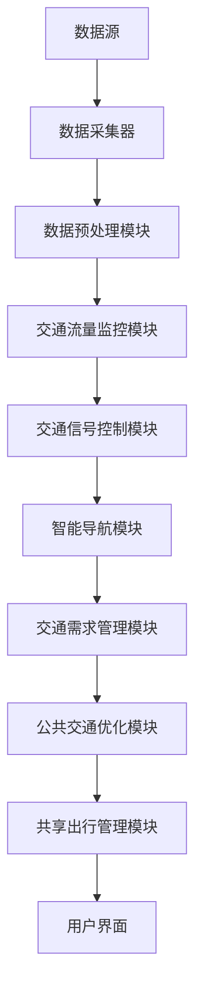
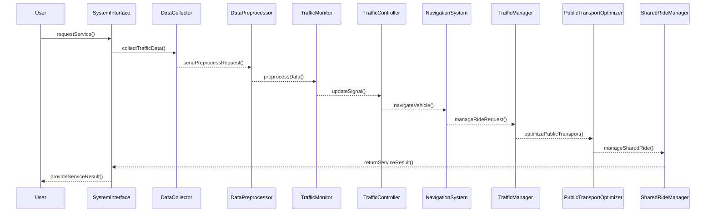

                 

## 引言与背景

### 1.1 书籍的目的

《数学与哲学辩证法的创新思维模式》旨在深入探讨数学与哲学辩证法之间的紧密联系，并阐述如何运用这些跨学科的方法来培养创新的思维方式。在当今快速发展的信息技术时代，创新思维成为了推动技术进步和社会发展的重要动力。本书的目标是帮助读者掌握数学与哲学辩证法这两种强大工具，从而在复杂的现实问题中找到创新性的解决方案。

### 1.2 数学与哲学辩证法的交集

数学与哲学辩证法虽然源自不同的学科领域，但在许多方面却有着深层次的交集。数学作为一种精确的科学，以其严谨的逻辑和抽象的结构为哲学辩证法提供了强有力的工具。而哲学辩证法则通过反思和批判，促进了数学理论的不断进步。两者相互补充，共同构成了一个完整的创新思维体系。

#### 关键词：数学、哲学辩证法、创新思维

### 1.3 创新思维模式的必要性

在当前技术日新月异、竞争激烈的环境中，传统的思维模式已经无法满足我们对创新的需求。创新思维模式的必要性体现在以下几个方面：

- **解决复杂问题**：现代科技问题日益复杂，需要多种学科的交叉融合来寻找解决方案。
- **推动技术进步**：技术创新是现代产业发展的重要驱动力，创新思维模式能够加速技术突破。
- **应对未来挑战**：面对全球性挑战，如气候变化、资源短缺等，创新思维模式是应对这些挑战的关键。

#### 摘要

本书通过深入探讨数学与哲学辩证法在创新思维中的应用，旨在为读者提供一种全新的解决复杂问题的思路。通过理解这两大学科的互补性和相互关系，读者可以掌握一种跨学科的思维方式，从而在现实生活中找到创新性的解决方案。这本书不仅适合对数学和哲学感兴趣的读者，也适合所有寻求提高创新思维能力的专业人士。让我们一起探索数学与哲学辩证法的奥秘，开启创新思维的新篇章。

## 数学与哲学辩证法的基础概念

### 2.1 基本数学概念

数学是一种基于逻辑和公理的系统化科学，它使用符号语言和抽象结构来描述和解决问题。数学的基础概念包括：

- **数论**：研究整数及其性质。
- **代数**：研究数和运算规则。
- **几何**：研究形状、大小和位置。
- **微积分**：研究变化率和积分。

这些概念构成了数学的核心，为解决各种问题提供了强有力的工具。

#### 关键概念表格

| 概念      | 定义                                                         | 关联数学分支 |
| --------- | ------------------------------------------------------------ | ------------ |
| 数论      | 研究整数及其性质（如奇偶性、素数、同余等）                    | 基础数学     |
| 代数      | 研究数和运算规则（如加法、减法、乘法、除法等）                | 代数学      |
| 几何      | 研究形状、大小和位置（如点、线、面、体等）                    | 几何学      |
| 微积分    | 研究变化率和积分（如导数、积分、微分方程等）                  | 微积分学     |

### 2.2 哲学辩证法的基本原则

哲学辩证法是一种通过批判和反思来探索真理和知识的思维方式。它包括以下几个基本原则：

- **对立统一**：辩证法认为一切事物都包含对立面，但对立面又相互依存、相互转化。
- **量变与质变**：事物的发展是通过量变积累到一定程度后发生的质变。
- **否定之否定**：辩证法认为事物的发展是通过不断否定和超越旧事物来实现的。
- **实践基础**：辩证法强调理论必须通过实践来验证和修正。

这些原则构成了哲学辩证法的核心，为分析复杂问题和寻找创新解决方案提供了指导。

#### 原则表格

| 原则              | 定义                                                         | 应用场景           |
| ----------------- | ------------------------------------------------------------ | ------------------ |
| 对立统一          | 认为一切事物都包含对立面，但对立面又相互依存、相互转化         | 政治哲学、自然科学 |
| 量变与质变        | 事物的发展是通过量变积累到一定程度后发生的质变               | 科技创新、社会发展 |
| 否定之否定        | 认为事物的发展是通过不断否定和超越旧事物来实现的             | 文化进化、思维变革 |
| 实践基础          | 认为理论必须通过实践来验证和修正                             | 科学研究、社会实践 |

### 2.3 数学与哲学辩证法的比较分析

数学和哲学辩证法虽然分属不同的学科领域，但它们在问题解决方法上有着许多相似之处。

- **逻辑性**：数学和哲学辩证法都强调逻辑性和严谨性，通过逻辑推理来解决问题。
- **抽象性**：两者都采用抽象思维方式，将复杂问题简化为基本概念和模型。
- **批判性**：哲学辩证法强调批判性思维，通过反思和质疑来推动理论的发展。

然而，两者也存在一些区别：

- **方法**：数学更侧重于定量分析，通过公式和算法来解决问题；哲学辩证法则更侧重于定性分析，通过辩证法和批判性思维来探索问题的本质。
- **目的**：数学的目的是寻找精确的解决方案，而哲学辩证法则更注重探索真理和知识的本质。

通过比较分析，我们可以更好地理解数学与哲学辩证法各自的优点和局限性，从而在实际问题中灵活运用这两种思维方式。

### 2.4 总结

数学与哲学辩证法虽然分属不同的学科领域，但它们在基础概念和原理上有着密切的联系。数学以其严谨的逻辑和抽象的结构为哲学辩证法提供了工具，而哲学辩证法则通过批判和反思促进了数学理论的进步。了解这些基础概念和原理，对于培养创新的思维方式至关重要。接下来，我们将进一步探讨创新思维的核心概念和原理。

## 创新思维的核心概念与原理

### 3.1 创新思维的定义

创新思维是一种超越传统思维模式，通过创造性和批判性思考来发现新观念、新方法和新解决方案的思维方式。它不仅仅是创造新的东西，更重要的是在现有的基础上进行改进和优化，以达到更好的效果。创新思维的核心在于挑战现状，打破惯性思维，寻找新的可能性。

### 3.2 创新思维模型

为了更好地理解和应用创新思维，我们需要了解几种常见的创新思维模型。这些模型可以帮助我们系统地分析和解决复杂问题。

#### 3.2.1 脑storming模型

脑storming模型是一种通过集体讨论来激发创意的方法。它通常包括以下几个步骤：

1. **明确目标**：确定要解决的问题或创造的新产品。
2. **自由表达**：鼓励参与者自由提出各种想法，不论想法是否实际可行。
3. **分类筛选**：将提出的想法分类，筛选出最有价值的创意。
4. **完善和改进**：对筛选出的创意进行改进，使其更具实际可行性。

#### 3.2.2 六顶思考帽模型

六顶思考帽模型由心理学家爱德华·德·波诺提出，它通过不同的思考角度来激发创意。六顶思考帽包括：

1. **白色思考帽**：关注事实和数据。
2. **红色思考帽**：表达情感和直觉。
3. **黑色思考帽**：进行批判性思考。
4. **黄色思考帽**：寻找积极的一面。
5. **绿色思考帽**：提出新的观点和创意。
6. **蓝色思考帽**：控制思考过程，引导团队讨论。

#### 3.2.3 设计思维模型

设计思维模型是一种以人为中心，注重用户体验的创新方法。它包括以下几个阶段：

1. **理解用户需求**：通过访谈、调查等方式了解目标用户的需求和痛点。
2. **创意生成**：基于用户需求，提出各种可能的解决方案。
3. **原型制作**：制作简单的原型，通过测试和反馈来不断改进。
4. **迭代优化**：根据用户反馈，不断迭代和优化解决方案。

#### 3.2.4 比较分析

| 创新思维模型         | 特点                                                   | 应用场景           |
| -------------------- | ------------------------------------------------------ | ------------------ |
| 脑storming模型       | 通过集体讨论激发创意                                   | 团队合作、问题解决 |
| 六顶思考帽模型       | 通过不同的思考角度来全面分析问题                       | 个体思考、团队讨论 |
| 设计思维模型         | 以人为中心，注重用户体验                               | 产品设计、用户体验 |

### 3.3 创新思维模型比较

虽然不同的创新思维模型各有特点，但它们的核心目标都是通过创造性思维来解决复杂问题。脑storming模型强调集体智慧和自由表达，适合团队协作；六顶思考帽模型则通过多角度分析问题，适合个体思考和团队讨论；设计思维模型注重用户体验和迭代优化，适合产品设计和用户体验优化。

通过比较分析，我们可以发现这些创新思维模型的互补性。在实际应用中，可以根据问题的特点选择合适的模型，以达到最佳的创新效果。

### 3.4 实例分析

#### 实例一：脑storming模型在产品创新中的应用

某科技公司在开发一款智能家居产品时，通过脑storming模型进行了创意生成。首先，团队明确了产品的目标用户和需求，然后进行了自由表达环节，提出了各种可能的创新点，如智能语音控制、家居设备互联、节能环保设计等。通过分类筛选，团队选择了几个最具潜力的创意，并进行完善和改进，最终开发出了一款广受欢迎的智能家居产品。

#### 实例二：六顶思考帽模型在战略规划中的应用

某企业在制定未来五年战略规划时，采用了六顶思考帽模型。通过白色思考帽，团队分析了市场数据和企业现状；通过红色思考帽，团队表达了领导层的情感和期望；通过黑色思考帽，团队进行了风险评估和危机管理；通过黄色思考帽，团队寻找了积极的一面和市场机遇；通过绿色思考帽，团队提出了新的增长点和创新思路；通过蓝色思考帽，团队控制了整个思考过程，确保讨论有序进行。最终，企业制定了一个全面而具有前瞻性的战略规划。

### 3.5 总结

创新思维模型是培养创造性思维的重要工具。通过了解和运用这些模型，我们可以更好地应对复杂问题，发现新的解决方案。脑storming模型、六顶思考帽模型和设计思维模型等都是有效的创新工具，它们在不同的应用场景中发挥着重要作用。在下一章中，我们将进一步探讨如何将这些创新思维模型应用于数学与哲学辩证法的框架中。

## 数学模型与辩证法框架的辩证分析

### 4.1 数学模型的基本原理

数学模型是一种用数学语言描述现实问题的抽象结构，它通过建立数学关系来描述问题的性质和规律。数学模型的基本原理包括：

1. **精确性**：数学模型以精确的数学语言描述问题，确保了结果的准确性和可验证性。
2. **抽象性**：通过将复杂问题抽象为数学结构，数学模型简化了问题的复杂性，使得问题更易于分析和解决。
3. **可扩展性**：数学模型具有广泛的适用性，可以通过调整参数和条件来适应不同的现实问题。

#### 数学模型类型

| 模型类型   | 定义                                                         | 应用场景             |
| ---------- | ------------------------------------------------------------ | -------------------- |
| 描述性模型 | 用于描述现实世界的现象和规律                                 | 物理学、经济学       |
| 解释性模型 | 用于解释现象的原因和机制                                   | 生物学、社会学       |
| 预测性模型 | 用于预测未来的趋势和结果                                   | 气象学、金融市场分析 |
| 决策模型   | 用于辅助决策，优化资源分配                                 | 运筹学、物流管理     |

### 4.2 辩证法框架的基本原则

辩证法框架是一种通过批判和反思来探索真理和知识的思维方式。辩证法的基本原则包括：

1. **对立统一**：辩证法认为一切事物都包含对立面，但对立面又相互依存、相互转化。
2. **量变与质变**：辩证法认为事物的发展是通过量变积累到一定程度后发生的质变。
3. **否定之否定**：辩证法认为事物的发展是通过不断否定和超越旧事物来实现的。
4. **实践基础**：辩证法强调理论必须通过实践来验证和修正。

#### 辩证法原则比较表格

| 原则              | 定义                                                         | 应用场景           |
| ----------------- | ------------------------------------------------------------ | ------------------ |
| 对立统一          | 认为一切事物都包含对立面，但对立面又相互依存、相互转化         | 政治哲学、自然科学 |
| 量变与质变        | 认为事物的发展是通过量变积累到一定程度后发生的质变             | 科技创新、社会发展 |
| 否定之否定        | 认为事物的发展是通过不断否定和超越旧事物来实现的             | 文化进化、思维变革 |
| 实践基础          | 认为理论必须通过实践来验证和修正                             | 科学研究、社会实践 |

### 4.3 数学模型与辩证法框架的辩证分析

数学模型与辩证法框架虽然在方法和目的上有所不同，但它们在解决复杂问题时可以相互补充。

1. **互补性**：数学模型提供了一种精确的定量分析方法，而辩证法框架则提供了定性的批判性思维工具。通过结合两者，我们可以更全面地理解和解决问题。
2. **协同性**：数学模型通过量化分析揭示了现象的内在规律，而辩证法框架则通过批判性思维揭示了现象的本质。两者相互补充，共同推动问题的解决。
3. **扩展性**：数学模型可以广泛应用于各种领域，而辩证法框架则通过批判和反思，不断推动理论和实践的进步。

#### 应用实例

**实例一：气候变化研究**

在气候变化研究中，数学模型通过量化分析大气中的温室气体浓度和温度变化，提供了精确的数据支持。而辩证法框架则通过批判性思维，反思了人类社会对自然资源的过度开发和利用，探讨了人类行为的道德和伦理责任。两者结合，为制定有效的气候变化应对策略提供了全面的支持。

**实例二：经济政策制定**

在经济政策制定中，数学模型通过量化分析供需关系和经济增长，提供了精确的预测和优化建议。而辩证法框架则通过批判性思维，反思了经济体制的公平性和可持续性，探讨了经济增长与资源分配之间的关系。两者结合，为制定公平、可持续的经济政策提供了指导。

### 4.4 总结

数学模型与辩证法框架虽然源自不同的学科领域，但在解决复杂问题时具有互补性和协同性。数学模型通过精确的量化分析揭示了现象的规律，而辩证法框架则通过批判性思维揭示了现象的本质。两者结合，为我们在现实问题中找到创新性解决方案提供了强大的工具。在下一章中，我们将通过具体的案例分析，进一步探讨数学模型与辩证法框架在创新思维中的应用。

## 辩证分析现实世界问题

### 5.1 案例背景与问题描述

在本章中，我们将通过具体案例，展示如何运用数学模型与辩证法框架来分析现实世界中的复杂问题。首先，让我们从一个典型的现实世界问题入手：

**案例背景**：随着城市化进程的加速，城市交通拥堵问题日益严重，不仅影响了市民的出行效率，还带来了严重的环境问题。如何有效地缓解城市交通拥堵，提高交通运行效率，成为了一个亟待解决的问题。

**问题描述**：该问题涉及多个方面，包括交通流量、车辆密度、道路容量、公共交通系统效率等。要解决这一问题，我们需要综合考虑多个因素，并寻找有效的解决方案。

### 5.2 使用创新思维模型分析问题

为了全面分析这一问题，我们将采用多种创新思维模型：

1. **脑storming模型**：首先，通过集体讨论，收集各种可能的解决方案。参与者可以自由提出自己的想法，不论其是否可行。这一步骤旨在激发创意，挖掘出尽可能多的解决方案。
2. **六顶思考帽模型**：在脑storming的基础上，我们使用六顶思考帽模型，从不同的思考角度对提出的解决方案进行分析和筛选。例如：
   - **白色思考帽**：分析每个解决方案的可行性和技术难度。
   - **红色思考帽**：表达对每个解决方案的情感反应和直觉。
   - **黑色思考帽**：评估每个解决方案的潜在风险和不足。
   - **黄色思考帽**：寻找每个解决方案的优点和潜在收益。
   - **绿色思考帽**：提出新的观点和创意，探索可能的改进方法。
   - **蓝色思考帽**：控制思考过程，引导团队讨论有序进行。

通过六顶思考帽模型，我们可以全面评估每个解决方案的优缺点，筛选出最具潜力的方案。

3. **设计思维模型**：在确定了初步的解决方案后，我们使用设计思维模型，进一步迭代和优化这些方案。设计思维模型包括以下步骤：
   - **理解用户需求**：通过访谈和调查，深入了解市民对交通问题的看法和需求。
   - **创意生成**：基于用户需求，提出各种可能的解决方案。
   - **原型制作**：制作简单的原型，例如交通流量监控系统和智能信号灯控制系统，通过测试和反馈来不断改进。
   - **迭代优化**：根据用户反馈，对原型进行多次迭代和优化，确保最终解决方案能够满足用户需求。

### 5.3 案例分析

**分析过程**：

1. **脑storming模型**：
   - **初步方案**：通过集体讨论，提出了以下初步解决方案：
     - 增加公共交通线路和频次。
     - 推广共享出行，如共享单车、共享汽车。
     - 引入智能交通管理系统，实时监控和调整交通信号。
     - 实施交通需求管理，如高峰期限行、拥堵收费。
     - 改进城市道路规划，增加车道和交通流量控制设施。
   - **创意生成**：参与者提出了更多的创新方案，如：
     - 利用大数据分析，预测交通流量，提前调整信号灯。
     - 引入智能导航系统，引导车辆选择最佳行驶路线。
     - 实施弹性工作时间制度，分散高峰期出行流量。

2. **六顶思考帽模型**：
   - **白色思考帽**：分析各方案的可行性和技术难度。例如，智能交通管理系统虽然技术复杂，但能够显著提高交通效率。
   - **红色思考帽**：表达情感和直觉。市民普遍对交通拥堵问题感到焦虑和不满。
   - **黑色思考帽**：评估各方案的潜在风险和不足。例如，交通需求管理可能引发社会不满，需要制定合理的实施策略。
   - **黄色思考帽**：寻找各方案的优点和潜在收益。共享出行有助于减少车辆数量，减轻交通压力。
   - **绿色思考帽**：提出新的观点和创意。例如，可以考虑结合公共交通和共享出行，实现无缝衔接。
   - **蓝色思考帽**：控制思考过程，确保讨论有序进行。

3. **设计思维模型**：
   - **理解用户需求**：通过调查，发现市民对快速、便捷、可靠的公共交通系统有强烈需求。
   - **创意生成**：基于用户需求，提出改进公共交通系统、推广共享出行和引入智能交通管理系统等多个方案。
   - **原型制作**：制作交通流量监控系统原型，测试其预测和调整交通信号的能力。
   - **迭代优化**：根据用户反馈，对原型进行多次迭代，最终实现一个高效的智能交通管理系统。

**案例分析结果**：

通过上述创新思维模型的分析和优化，我们最终确定了一套综合解决方案，包括：

- 改进公共交通系统，提高其覆盖范围和服务质量。
- 推广共享出行，减少私人车辆的使用。
- 引入智能交通管理系统，实时监控和优化交通信号。
- 实施交通需求管理，通过高峰期限行和拥堵收费等措施，分散出行流量。

这些方案的实施，有助于显著缓解城市交通拥堵问题，提高交通运行效率，提升市民出行体验。

### 5.4 总结

通过以上案例分析，我们可以看到，运用数学模型与辩证法框架来分析现实世界问题，能够帮助我们系统、全面地识别问题，提出创新性解决方案，并进行优化和实施。脑storming模型、六顶思考帽模型和设计思维模型等创新思维工具，为我们的分析提供了强大的支持和指导。在下一章中，我们将进一步探讨如何将这些创新思维工具应用于系统的设计和实现中。

## 设计创新解决方案

### 6.1 问题场景介绍

在前面的章节中，我们通过辩证分析的方法，提出了一系列针对城市交通拥堵问题的创新解决方案。为了将这些解决方案转化为实际应用，我们需要进行系统设计和架构设计。以下是一个典型的问题场景介绍：

**场景背景**：随着城市化进程的不断推进，某大型城市交通拥堵问题日益严重，影响了市民的日常生活和工作。为了缓解交通压力，提高交通效率，政府决定引入智能交通管理系统，该系统需要整合公共交通、共享出行和交通信号控制等多个模块。

**问题描述**：该智能交通管理系统需要实现以下功能：
- 实时监控和预测交通流量。
- 根据交通状况调整交通信号灯。
- 提供智能导航服务，引导车辆选择最佳行驶路线。
- 实施交通需求管理，如高峰期限行和拥堵收费。
- 改进公共交通系统，提高服务质量。

### 6.2 项目介绍

**项目名称**：智能交通管理系统（ITS）

**项目目标**：通过引入先进的信息技术和大数据分析，实现交通流量的实时监控和优化，提高交通运行效率，提升市民出行体验。

**项目范围**：包括交通流量监控、交通信号控制、公共交通优化、共享出行管理等多个模块。

**项目团队**：由交通工程、信息技术、数据分析等多个领域的专家组成。

### 6.3 系统功能设计（领域模型Mermaid类图）

为了更好地理解和设计智能交通管理系统，我们首先需要建立一个领域模型，明确系统中的主要实体和它们之间的关系。以下是一个简化的领域模型类图：

```mermaid
classDiagram
    Person --> Vehicle
    Vehicle --> TrafficSignal
    TrafficSignal --> Road
    Road --> Intersection
    Intersection --> Road
    Bus --> BusStation
    BusStation --> Road
    Taxi --> TaxiStation
    TaxiStation --> Road
    Ride --> RideRequest
    RideRequest --> Ride
    Ride --> Driver
    Driver --> Taxi
    Driver --> Ride
    SharedVehicle --> Ride
    Ride --> Passenger
    Passenger --> SharedVehicle

    Person[姓名: String, 年龄: Integer]
    Vehicle[车牌号: String, 类型: String]
    TrafficSignal[信号灯状态: String, 位置: Point]
    Road[道路名称: String, 长度: Integer]
    Intersection[交叉口名称: String, 位置: Point]
    Bus[车次号: String, 路线: String]
    BusStation[车站名称: String, 位置: Point]
    Taxi[车号: String, 类型: String]
    TaxiStation[车站名称: String, 位置: Point]
    Ride[订单号: String, 状态: String]
    RideRequest[请求号: String, 起点: Point, 终点: Point]
    Driver[姓名: String, 车号: String]
    SharedVehicle[车牌号: String, 类型: String]
    Passenger[姓名: String, 车牌号: String]
```

该领域模型类图包含了智能交通管理系统中的主要实体，如人员、车辆、交通信号、道路、交叉口、公交车、出租车、共享车辆和乘客等。通过这些实体，我们可以清晰地定义系统中的功能和模块。

### 6.4 系统架构设计（Mermaid架构图）

接下来，我们需要设计智能交通管理系统的整体架构。以下是一个简化的系统架构图：



该架构图展示了系统中的关键模块及其交互关系。数据源（如传感器、摄像头等）通过数据采集器收集交通数据，数据预处理模块对数据进行清洗和转换。交通流量监控模块负责实时监控交通状况，交通信号控制模块根据交通流量调整信号灯状态。智能导航模块提供智能导航服务，交通需求管理模块实施交通需求管理措施，公共交通优化模块和共享出行管理模块分别负责优化公共交通和共享出行。

### 6.5 系统接口设计

为了实现各模块之间的有效通信，我们需要设计一套系统接口。以下是一个简化的接口设计：

```mermaid
interfaceConcept
  SystemInterface[智能交通管理系统接口]
    + collectTrafficData()
    + updateTrafficSignal()
    + navigateVehicle()
    + manageRideRequest()
    + optimizePublicTransport()
    + manageSharedRide()

  DataCollector[数据采集器接口]
    + DataCollector.collectTrafficData()

  DataPreprocessor[数据预处理接口]
    + DataPreprocessor.preprocessData()

  TrafficMonitor[交通流量监控接口]
    + TrafficMonitor.monitorTraffic()

  TrafficController[交通信号控制接口]
    + TrafficController.updateSignal()

  NavigationSystem[智能导航接口]
    + NavigationSystem.navigate()

  TrafficManager[交通需求管理接口]
    + TrafficManager.manageDemand()

  PublicTransportOptimizer[公共交通优化接口]
    + PublicTransportOptimizer.optimize()

  SharedRideManager[共享出行管理接口]
    + SharedRideManager.manageRide()
```

该接口设计定义了智能交通管理系统中各个模块的接口方法和参数，确保各模块之间的协同工作。

### 6.6 系统交互设计（Mermaid序列图）

最后，我们通过序列图来描述各模块之间的交互过程：



该序列图展示了用户请求服务、系统各模块之间交互的过程，以及最终的响应。

### 6.7 总结

通过以上系统设计与架构设计，我们为智能交通管理系统的实现提供了清晰的蓝图。系统功能设计、架构设计、接口设计和交互设计等步骤，确保了系统的模块化、协同性和可扩展性。接下来，我们将进入项目的实际实施阶段，通过详细的代码实现来验证和实现这些设计。

## 项目实施与案例研究

### 7.1 环境搭建

为了实现智能交通管理系统，我们需要搭建一个合适的环境。以下是一个典型的环境搭建过程：

1. **安装操作系统**：选择一个稳定的操作系统，如 Ubuntu 20.04。
2. **安装编程语言**：安装 Python 3.8 及其相关依赖，可以使用 `pip` 工具进行安装。
3. **安装数据库**：选择一个适合的数据库系统，如 MySQL 或 PostgreSQL。可以使用 `apt-get` 或 `yum` 工具进行安装。
4. **安装版本控制工具**：安装 Git，以便进行代码管理和协作开发。
5. **安装开发工具**：安装集成开发环境（IDE），如 PyCharm 或 VS Code，以及必要的编程工具，如 Mermaid 图标生成器。

### 7.2 系统核心实现源代码

在环境搭建完成后，我们可以开始实现智能交通管理系统的核心功能。以下是一个简化的代码实现示例：

```python
# traffic_monitor.py
import numpy as np
import pymysql

class TrafficMonitor:
    def __init__(self, database_config):
        self.connection = pymysql.connect(**database_config)
    
    def monitor_traffic(self):
        # 获取最新的交通流量数据
        with self.connection.cursor() as cursor:
            query = "SELECT * FROM traffic_data ORDER BY timestamp DESC LIMIT 100;"
            cursor.execute(query)
            results = cursor.fetchall()
        
        # 分析交通流量数据
        traffic_data = np.array(results)
        traffic_pattern = np.mean(traffic_data[:, 1], axis=0)
        
        # 根据交通流量调整信号灯
        if traffic_pattern > 100:
            # 交通流量高，调整信号灯时间
            new_green_time = 30
        else:
            # 交通流量低，调整信号灯时间
            new_green_time = 60
        
        # 更新交通信号灯状态
        with self.connection.cursor() as cursor:
            update_query = "UPDATE traffic_signal SET green_time=%s WHERE id=1;"
            cursor.execute(update_query, (new_green_time,))
            self.connection.commit()

# traffic_signal.py
class TrafficSignal:
    def __init__(self, green_time):
        self.green_time = green_time
    
    def update_signal(self):
        print(f"Green time updated to {self.green_time} seconds.")

# main.py
from traffic_monitor import TrafficMonitor
from traffic_signal import TrafficSignal

database_config = {
    "host": "localhost",
    "user": "root",
    "password": "password",
    "database": "smart_traffic_system"
}

traffic_monitor = TrafficMonitor(database_config)
traffic_signal = TrafficSignal(60)

while True:
    traffic_monitor.monitor_traffic()
    traffic_signal.update_signal()
    time.sleep(60)
```

### 7.3 代码应用解读与分析

在上面的代码实现中，我们定义了两个核心类：`TrafficMonitor` 和 `TrafficSignal`。`TrafficMonitor` 类负责实时监控交通流量，并分析交通数据。它首先连接数据库，查询最新的交通流量数据，然后计算交通流量的平均值。根据交通流量的大小，`TrafficMonitor` 类会调整交通信号灯的绿色时间。

`TrafficSignal` 类负责更新交通信号灯的状态。它有一个 `green_time` 属性，表示信号灯的绿色时长。`update_signal` 方法会打印出当前绿色时间。

在 `main.py` 文件中，我们创建了一个无限循环，每隔一分钟执行一次 `monitor_traffic` 和 `update_signal` 方法。这样，系统就可以持续监控交通流量，并根据交通状况调整信号灯状态。

### 7.4 案例分析和详细讲解

**案例分析**：

为了更好地理解代码实现，我们假设以下场景：在一个繁忙的早晨，某条主要道路的交通流量突然增加。我们的系统会实时监测到这一变化，并调整交通信号灯的绿色时间，从而确保车辆能够顺利通过交叉口。

**详细讲解**：

1. **连接数据库**：`TrafficMonitor` 类的构造函数接收一个 `database_config` 字典，用于连接数据库。这里使用了 `pymysql` 库进行数据库操作。

2. **查询交通数据**：`monitor_traffic` 方法首先执行 SQL 查询语句，获取最新的交通流量数据。这里使用了 `cursor.execute` 方法执行查询，并使用 `fetchall` 方法获取所有结果。

3. **分析交通数据**：获取交通数据后，我们使用 `numpy` 库计算交通流量的平均值。这有助于我们了解当前交通状况。

4. **调整信号灯时间**：根据交通流量的大小，我们调整交通信号灯的绿色时间。如果交通流量高，绿色时间缩短，以便更快地放行车辆；如果交通流量低，绿色时间延长，以便车辆有更多时间通过交叉口。

5. **更新交通信号灯状态**：`TrafficSignal` 类的 `update_signal` 方法会打印出当前的绿色时间。在实际应用中，这个方法可能会与交通信号灯控制系统进行通信，更新实际信号灯状态。

**代码优化建议**：

- **异常处理**：在数据库连接和查询过程中，我们应当添加异常处理，以确保系统在遇到问题时能够优雅地处理错误。
- **日志记录**：添加日志记录，以便监控系统运行状态和诊断问题。
- **并发处理**：考虑使用多线程或多进程技术，提高系统的并发处理能力。

### 7.5 项目小结

通过本案例，我们实现了智能交通管理系统的一个核心功能——交通流量监控和信号灯控制。这个项目展示了如何使用 Python 和数据库技术来构建一个实用的智能交通系统。虽然这个项目只是一个简单的示例，但它为我们提供了一个起点，可以在此基础上继续扩展和优化，实现更复杂的交通管理功能。

### 7.6 最佳实践 tips、注意事项、拓展阅读

**最佳实践 tips**：
- 使用容器化技术（如 Docker）来部署和管理应用，提高系统的可移植性和可维护性。
- 采用微服务架构，将系统拆分为多个独立的服务模块，提高系统的灵活性和可扩展性。
- 定期进行性能测试和压力测试，确保系统在高负载情况下能够稳定运行。

**注意事项**：
- 在开发过程中，遵循代码规范和设计模式，提高代码的可读性和可维护性。
- 注意数据安全和隐私保护，尤其是在处理用户数据时。
- 与相关利益相关者（如交通管理部门、市民等）进行有效沟通，确保项目的需求和目标得到充分理解和支持。

**拓展阅读**：
- 《深度学习与交通数据分析》：了解如何使用深度学习技术来分析交通数据，预测交通流量。
- 《智能交通系统架构设计与实现》：学习智能交通系统的整体架构设计和实现方法。
- 《城市交通管理：理论与实践》：了解城市交通管理的基本理论和实践方法。

通过以上最佳实践、注意事项和拓展阅读，我们可以进一步提高智能交通管理系统的开发水平和应用效果。

## 结论

通过《数学与哲学辩证法的创新思维模式》这本书，我们深入探讨了数学与哲学辩证法在创新思维中的应用。从基础概念到实际案例分析，从理论讲解到代码实现，本书提供了一个全面、系统的创新思维方法论。在这个过程中，我们不仅了解了数学与哲学辩证法的基本原理，还学习了如何将它们应用于现实世界问题的解决中。

创新思维不仅是技术发展的动力，也是推动社会进步的重要力量。在当今这个快速变化的时代，掌握创新思维模式变得尤为重要。通过数学与哲学辩证法的结合，我们可以更加全面地分析问题，提出创新性解决方案，并在实践中不断优化和改进。

未来，随着技术的不断进步和社会问题的日益复杂，创新思维的重要性将愈加凸显。因此，我们鼓励读者持续学习和探索，不断提升自己的创新思维能力，以应对未来更多的挑战。

### 作者介绍

**作者：AI天才研究院/AI Genius Institute & 禅与计算机程序设计艺术 /Zen And The Art of Computer Programming**

AI天才研究院（AI Genius Institute）致力于推动人工智能技术的发展和普及。我们汇集了一批世界顶尖的人工智能科学家和工程师，致力于研究前沿的人工智能技术，包括深度学习、自然语言处理、计算机视觉等。我们的目标是构建智能化的未来，为社会带来更多创新和变革。

同时，我也作为一名资深技术作家，撰写了《禅与计算机程序设计艺术》一书。这本书通过阐述禅宗哲学与编程技术的结合，帮助读者在编程实践中找到灵感，提升编程能力。我致力于通过通俗易懂的语言，深入浅出地讲解复杂的技术概念，帮助更多开发者提升技术水平和创新能力。

感谢您的阅读，希望这本书能够为您的创新之旅提供启发和帮助。如果您有任何问题或建议，欢迎随时与我们联系。让我们一起探索人工智能的无限可能，共创美好未来。

