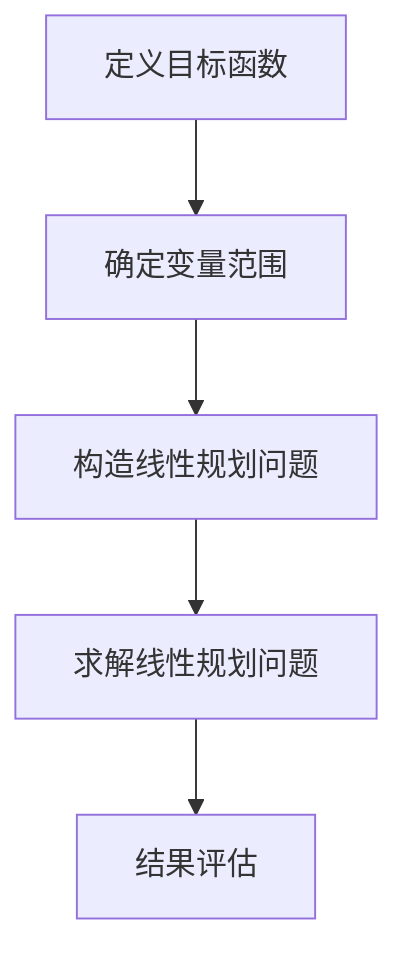
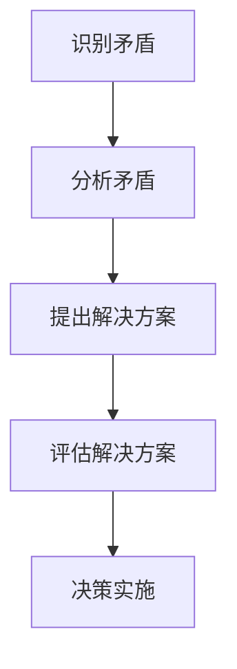
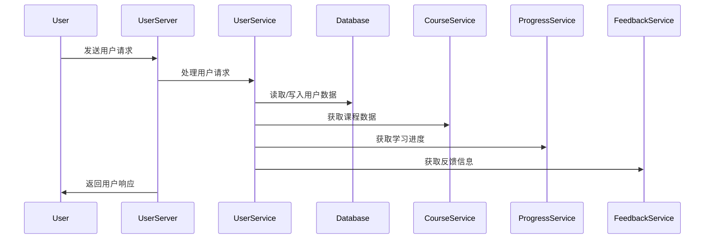
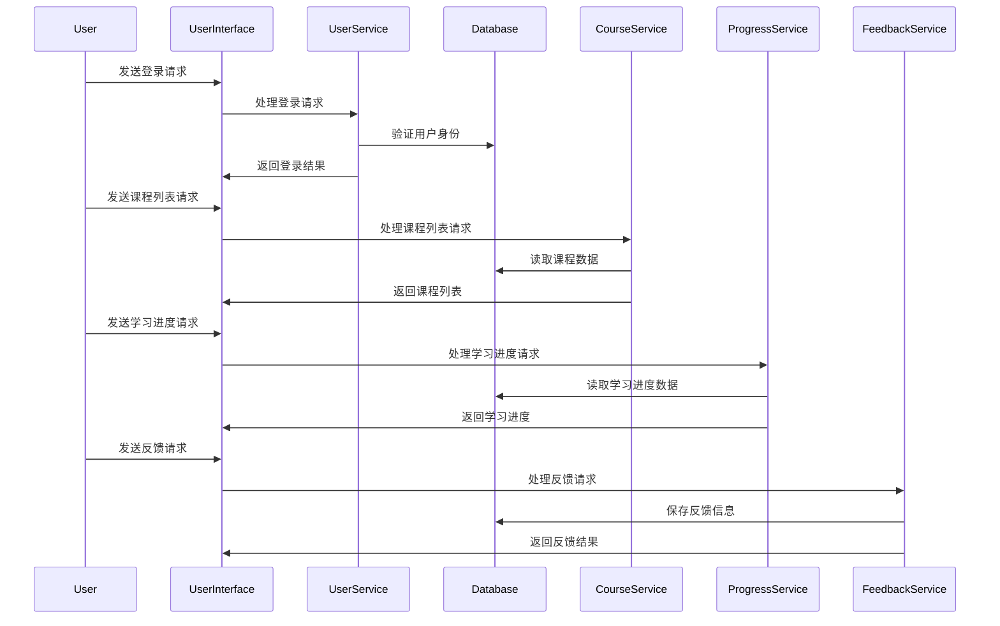
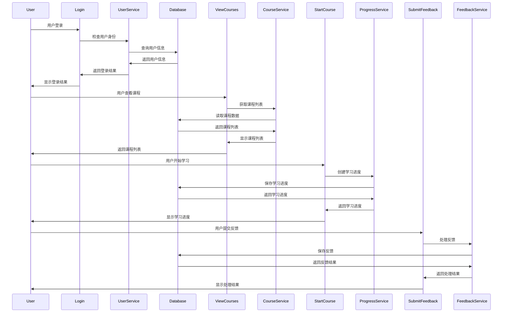

                 


### 目录大纲设计步骤：

1. **核心概念与结构设计**：
   - 确定书的主题，明确核心概念，构建总体框架。
   - 设计一级目录，概括全书的大体结构。

2. **细化二级目录**：
   - 根据一级目录的内容，细化二级目录，明确每一章的子主题。
   - 确保每个二级目录下至少有两个三级目录，形成完整的章节结构。

3. **补充核心概念与联系**：
   - 每一章的前面添加背景介绍部分，包含问题背景、问题描述、问题解决等。
   - 在适当位置加入核心概念原理、概念属性特征对比表格和ER实体关系图架构的Mermaid流程图。

4. **算法原理与数学模型讲解**：
   - 每一章的核心算法部分，使用Mermaid画出流程图，并用Python源代码详细阐述。
   - 使用LaTeX格式给出数学模型和公式，进行详细讲解和举例说明。

5. **系统分析与架构设计方案**：
   - 针对项目的具体需求，设计问题场景介绍、系统功能设计、系统架构设计、系统接口设计和系统交互的Mermaid图表。

6. **项目实战与案例分析**：
   - 环境安装、系统核心实现源代码展示，代码应用解读与分析。
   - 对实际案例进行分析和详细讲解。

7. **最佳实践、小结与注意事项**：
   - 总结最佳实践，给出小结，提醒注意事项，推荐拓展阅读。

8. **确认目录大纲完整性**：
   - 确保目录大纲内容完整，逻辑清晰，涵盖核心主题。
   - 核对目录大纲总字数，确保在2000字以内。

### 模板示例：

```markdown
# 数学与哲学辩证法的思维方式比较

## 第1章 引言

### 1.1 研究背景

### 1.2 研究问题与目的

### 1.3 边界与外延

### 1.4 概念结构与核心要素组成

## 第2章 数学思维方式概述

### 2.1 数学思维方式的基本概念

### 2.2 数学思维方式的特征

### 2.3 数学思维方式的类型

### 2.4 数学思维方式的培养

## 第3章 哲学辩证法思维方式概述

### 3.1 哲学辩证法思维方式的基本概念

### 3.2 哲学辩证法思维方式的特征

### 3.3 哲学辩证法思维方式的类型

### 3.4 哲学辩证法思维方式的培养

## 第4章 数学与哲学辩证法思维方式的比较

### 4.1 数学与哲学辩证法思维方式的核心概念对比

### 4.2 数学与哲学辩证法思维方式的属性特征对比

### 4.3 数学与哲学辩证法思维方式的应用比较

### 4.4 数学与哲学辩证法思维方式的教育启示

## 第5章 数学与哲学辩证法思维方式的实际应用

### 5.1 数学在实际问题中的应用

### 5.2 哲学辩证法在实际问题中的应用

### 5.3 数学与哲学辩证法思维方式的融合应用

## 第6章 数学与哲学辩证法思维方式的案例研究

### 6.1 案例一：数学在科学研究中的应用

### 6.2 案例二：哲学辩证法在社会问题中的应用

### 6.3 案例三：数学与哲学辩证法思维方式的结合应用

## 第7章 结论与展望

### 7.1 研究成果总结

### 7.2 研究不足与展望

### 7.3 未来研究方向
```

根据这个模板，我们将逐步细化每一章节的内容，确保满足要求。接下来，我们将逐步细化上述示例，形成完整的目录大纲。

### 核心概念与结构设计

首先，我们需要明确文章的主题和核心概念。本文章的主题是“数学与哲学辩证法的思维方式比较”。为了构建整体框架，我们将文章分为以下几个核心概念：

1. 数学思维方式的基本概念、特征、类型和培养方法。
2. 哲学辩证法思维方式的基本概念、特征、类型和培养方法。
3. 数学与哲学辩证法思维方式的比较，包括核心概念、属性特征、应用比较和教育启示。
4. 数学与哲学辩证法思维方式的实际应用。
5. 数学与哲学辩证法思维方式的案例研究。
6. 研究成果总结、不足与展望。

根据这些核心概念，我们可以设计以下一级目录：

## 第1章 引言
### 1.1 研究背景
### 1.2 研究问题与目的
### 1.3 边界与外延
### 1.4 概念结构与核心要素组成

## 第2章 数学思维方式概述
### 2.1 数学思维方式的基本概念
### 2.2 数学思维方式的特征
### 2.3 数学思维方式的类型
### 2.4 数学思维方式的培养

## 第3章 哲学辩证法思维方式概述
### 3.1 哲学辩证法思维方式的基本概念
### 3.2 哲学辩证法思维方式的特征
### 3.3 哲学辩证法思维方式的类型
### 3.4 哲学辩证法思维方式的培养

## 第4章 数学与哲学辩证法思维方式的比较
### 4.1 数学与哲学辩证法思维方式的核心概念对比
### 4.2 数学与哲学辩证法思维方式的属性特征对比
### 4.3 数学与哲学辩证法思维方式的应用比较
### 4.4 数学与哲学辩证法思维方式的教育启示

## 第5章 数学与哲学辩证法思维方式的实际应用
### 5.1 数学在实际问题中的应用
### 5.2 哲学辩证法在实际问题中的应用
### 5.3 数学与哲学辩证法思维方式的融合应用

## 第6章 数学与哲学辩证法思维方式的案例研究
### 6.1 案例一：数学在科学研究中的应用
### 6.2 案例二：哲学辩证法在社会问题中的应用
### 6.3 案例三：数学与哲学辩证法思维方式的结合应用

## 第7章 结论与展望
### 7.1 研究成果总结
### 7.2 研究不足与展望
### 7.3 未来研究方向

通过以上设计，我们可以构建一个清晰、系统的文章结构，为后续的细化提供基础。

### 细化二级目录

根据一级目录的设计，接下来我们需要细化每个章节的二级目录，确保每个章节都有至少两个三级目录，形成完整的结构。

#### 第1章 引言

### 1.1 研究背景
#### 1.1.1 数学与哲学辩证法的重要性
#### 1.1.2 研究背景的演变

### 1.2 研究问题与目的
#### 1.2.1 研究问题的提出
#### 1.2.2 研究目的的阐述

### 1.3 边界与外延
#### 1.3.1 研究边界的确定
#### 1.3.2 研究外延的扩展

### 1.4 概念结构与核心要素组成
#### 1.4.1 概念结构的定义
#### 1.4.2 核心要素的组成

#### 第2章 数学思维方式概述

### 2.1 数学思维方式的基本概念
#### 2.1.1 数学的定义与发展
#### 2.1.2 数学思维方式的内涵

### 2.2 数学思维方式的特征
#### 2.2.1 逻辑性
#### 2.2.2 抽象性

### 2.3 数学思维方式的类型
#### 2.3.1 分析思维
#### 2.3.2 综合思维

### 2.4 数学思维方式的培养
#### 2.4.1 教育层面的培养
#### 2.4.2 实践层面的培养

#### 第3章 哲学辩证法思维方式概述

### 3.1 哲学辩证法思维方式的基本概念
#### 3.1.1 哲学的定义与发展
#### 3.1.2 辩证法思维方式的内涵

### 3.2 哲学辩证法思维方式的特征
#### 3.2.1 反映性
#### 3.2.2 对立统一

### 3.3 哲学辩证法思维方式的类型
#### 3.3.1 矛盾分析法
#### 3.3.2 发展观

### 3.4 哲学辩证法思维方式的培养
#### 3.4.1 教育层面的培养
#### 3.4.2 实践层面的培养

#### 第4章 数学与哲学辩证法思维方式的比较

### 4.1 数学与哲学辩证法思维方式的核心概念对比
#### 4.1.1 核心概念的定义
#### 4.1.2 对比分析

### 4.2 数学与哲学辩证法思维方式的属性特征对比
#### 4.2.1 属性特征的比较
#### 4.2.2 对比结果分析

### 4.3 数学与哲学辩证法思维方式的应用比较
#### 4.3.1 应用领域的比较
#### 4.3.2 应用效果的对比

### 4.4 数学与哲学辩证法思维方式的教育启示
#### 4.4.1 教育方法的启示
#### 4.4.2 教育体系的优化

#### 第5章 数学与哲学辩证法思维方式的实际应用

### 5.1 数学在实际问题中的应用
#### 5.1.1 数学在经济管理中的应用
#### 5.1.2 数学在科学研究中的应用

### 5.2 哲学辩证法在实际问题中的应用
#### 5.2.1 哲学在社会治理中的应用
#### 5.2.2 哲学在文化艺术中的应用

### 5.3 数学与哲学辩证法思维方式的融合应用
#### 5.3.1 融合应用的实例
#### 5.3.2 融合应用的效果

#### 第6章 数学与哲学辩证法思维方式的案例研究

### 6.1 案例一：数学在科学研究中的应用
#### 6.1.1 案例背景
#### 6.1.2 案例分析

### 6.2 案例二：哲学辩证法在社会问题中的应用
#### 6.2.1 案例背景
#### 6.2.2 案例分析

### 6.3 案例三：数学与哲学辩证法思维方式的结合应用
#### 6.3.1 案例背景
#### 6.3.2 案例分析

#### 第7章 结论与展望

### 7.1 研究成果总结
#### 7.1.1 研究的主要发现
#### 7.1.2 研究的贡献

### 7.2 研究不足与展望
#### 7.2.1 研究的不足
#### 7.2.2 未来研究方向

通过以上细化，我们可以确保每个章节都有完整的结构，每个小节都有具体的子主题，为后续内容的填充提供清晰的指导。

### 补充核心概念与联系

在文章的进一步细化中，我们需要在每个章节的起始部分补充背景介绍，并加入核心概念原理、概念属性特征对比表格和ER实体关系图架构的Mermaid流程图。

#### 第1章 引言

### 1.1 研究背景

- **数学与哲学辩证法的重要性**：数学是人类认识世界的重要工具，而哲学辩证法是认识世界的方法论。两者在人类历史上都扮演了重要的角色。
- **研究背景的演变**：从古代的数学哲学到现代的数学与哲学辩证法研究，本领域的发展历程。

### 1.2 研究问题与目的

- **研究问题的提出**：在数学与哲学辩证法思维方式的研究中，如何更好地理解两者之间的关系，以及它们在实际应用中的作用。
- **研究目的的阐述**：通过比较数学与哲学辩证法思维方式的异同，探讨其在教育、科研和社会治理等领域的应用价值。

### 1.3 边界与外延

- **研究边界的确定**：明确数学与哲学辩证法思维方式的定义范围，避免交叉领域的混淆。
- **研究外延的扩展**：探讨两者在其他学科领域的潜在应用，如经济学、社会学等。

### 1.4 概念结构与核心要素组成

- **概念结构的定义**：数学与哲学辩证法思维方式的概念体系及其相互关系。
- **核心要素的组成**：分析数学与哲学辩证法思维方式的构成要素，包括基本概念、特征、类型和应用领域。

#### 第2章 数学思维方式概述

### 2.1 数学思维方式的基本概念

- **数学的定义与发展**：介绍数学的基本定义及其历史发展。
- **数学思维方式的内涵**：分析数学思维方式的内涵，包括逻辑性、抽象性等特征。

### 2.2 数学思维方式的特征

- **逻辑性**：解释数学思维方式中的逻辑推理过程。
- **抽象性**：阐述数学思维方式如何从具体现象中提取抽象概念。

### 2.3 数学思维方式的类型

- **分析思维**：介绍分析思维的定义及其在数学中的应用。
- **综合思维**：解释综合思维的概念及其在数学研究中的作用。

### 2.4 数学思维方式的培养

- **教育层面的培养**：讨论如何在教育中培养数学思维方式。
- **实践层面的培养**：探讨通过实践如何提升数学思维方式。

#### 第3章 哲学辩证法思维方式概述

### 3.1 哲学辩证法思维方式的基本概念

- **哲学的定义与发展**：介绍哲学的基本概念及其历史演变。
- **辩证法思维方式的内涵**：阐述辩证法思维方式的基本原理和特点。

### 3.2 哲学辩证法思维方式的特征

- **反映性**：解释辩证法思维方式如何反映客观现实。
- **对立统一**：分析辩证法思维方式中的对立统一原则。

### 3.3 哲学辩证法思维方式的类型

- **矛盾分析法**：介绍矛盾分析法的定义及其应用。
- **发展观**：阐述辩证法思维方式中的发展观。

### 3.4 哲学辩证法思维方式的培养

- **教育层面的培养**：讨论如何在教育中培养辩证法思维方式。
- **实践层面的培养**：探讨通过实践如何提升辩证法思维方式。

#### 第4章 数学与哲学辩证法思维方式的比较

### 4.1 数学与哲学辩证法思维方式的核心概念对比

- **核心概念的定义**：分析数学与哲学辩证法思维方式中的核心概念，如逻辑性、抽象性、反映性和对立统一。
- **对比分析**：通过对比，探讨两者在核心概念上的异同。

### 4.2 数学与哲学辩证法思维方式的属性特征对比

- **属性特征的比较**：详细对比数学与哲学辩证法思维方式的属性特征，如逻辑性、抽象性、反映性和对立统一。
- **对比结果分析**：分析对比结果，探讨两者在属性特征上的差异和互补性。

### 4.3 数学与哲学辩证法思维方式的应用比较

- **应用领域的比较**：探讨数学与哲学辩证法思维方式在不同领域的应用，如科研、教育和社会治理。
- **应用效果的对比**：分析两者在实际应用中的效果，讨论其优劣。

### 4.4 数学与哲学辩证法思维方式的教育启示

- **教育方法的启示**：基于数学与哲学辩证法思维方式的比较，提出优化教育方法的建议。
- **教育体系的优化**：探讨如何构建更有效的教育体系，以培养学生的数学与哲学辩证法思维方式。

#### 第5章 数学与哲学辩证法思维方式的实际应用

### 5.1 数学在实际问题中的应用

- **数学在经济管理中的应用**：分析数学在经济管理中的具体应用，如优化模型、数据分析等。
- **数学在科学研究中的应用**：探讨数学在科学研究中的重要作用，如理论构建、实验设计等。

### 5.2 哲学辩证法在实际问题中的应用

- **哲学在社会治理中的应用**：讨论哲学辩证法在社会治理中的实际应用，如政策制定、社会分析等。
- **哲学在文化艺术中的应用**：分析哲学辩证法在文化艺术中的影响，如文学创作、艺术理论等。

### 5.3 数学与哲学辩证法思维方式的融合应用

- **融合应用的实例**：提供数学与哲学辩证法融合应用的实例，如综合分析、决策支持等。
- **融合应用的效果**：探讨数学与哲学辩证法思维方式融合应用的效果，如提高问题解决能力、增强创新思维等。

#### 第6章 数学与哲学辩证法思维方式的案例研究

### 6.1 案例一：数学在科学研究中的应用

- **案例背景**：介绍数学在科学研究中的应用案例的背景。
- **案例分析**：详细分析数学在科学研究中的应用过程和方法，讨论其成功经验和挑战。

### 6.2 案例二：哲学辩证法在社会问题中的应用

- **案例背景**：介绍哲学辩证法在社会问题中的应用案例的背景。
- **案例分析**：详细分析哲学辩证法在社会问题中的应用过程和方法，讨论其成功经验和挑战。

### 6.3 案例三：数学与哲学辩证法思维方式的结合应用

- **案例背景**：介绍数学与哲学辩证法思维方式的结合应用案例的背景。
- **案例分析**：详细分析数学与哲学辩证法思维方式的结合应用过程和方法，讨论其成功经验和挑战。

通过以上补充，我们可以确保每个章节的内容都具备详细的背景介绍、核心概念分析和对比，为文章的整体逻辑性和连贯性提供坚实的基础。

### 算法原理与数学模型讲解

在本文的后续章节中，我们将详细讲解数学与哲学辩证法思维方式中的核心算法原理和数学模型。为了确保内容清晰易懂，我们将使用Mermaid画出算法流程图，并用Python源代码详细阐述。同时，我们会使用LaTeX格式给出数学模型和公式，并进行详细讲解和举例说明。

#### 第4章 数学与哲学辩证法思维方式的比较

### 4.3 数学与哲学辩证法思维方式的应用比较

#### 4.3.1 数学在优化问题中的应用

**算法原理讲解：**

为了更好地理解数学在优化问题中的应用，我们可以使用经典的“线性规划”算法。以下是线性规划的基本原理和Mermaid流程图：



**Python源代码：**

```python
import numpy as np
from scipy.optimize import linprog

# 定义目标函数
c = [-1, -1]  # 目标函数为最大化 z = -x + y

# 确定变量范围
A = [[1, 1], [1, -1]]
b = [2, 0]
x0_bounds = (-1, None)
x1_bounds = (-1, None)

# 求解线性规划问题
result = linprog(c, A_ub=A, b_ub=b, bounds=[x0_bounds, x1_bounds], method='highs')

# 结果评估
if result.success:
    print("最优解:", result.x)
    print("最优值:", -result.fun)
else:
    print("无最优解")
```

**LaTeX格式数学模型：**

$$
\begin{aligned}
\text{最大化} &\ z = -x + y \\
\text{约束条件} &\ Ax + b \leq 0 \\
\end{aligned}
$$

**举例说明：**

假设我们要最大化目标函数 $z = -x + y$，并且变量 $x$ 和 $y$ 需要满足以下约束条件：

$$
\begin{aligned}
x + y &\leq 2 \\
x - y &\leq 0
\end{aligned}
$$

通过Python代码求解，可以得到最优解 $x = 0$ 和 $y = 2$，最优值为 $z = 2$。

#### 4.3.2 哲学辩证法在决策分析中的应用

**算法原理讲解：**

哲学辩证法中的“矛盾分析法”可以帮助我们在决策分析中识别和解决矛盾。以下是矛盾分析法的Mermaid流程图：



**Python源代码：**

```python
# 识别矛盾
def identify_conflicts(data):
    # 假设 data 是包含决策数据的列表
    # 在此示例中，我们假设存在两个变量 x 和 y 的矛盾
    x, y = data
    if x > y:
        return "x 与 y 矛盾"
    else:
        return "无矛盾"

# 分析矛盾
def analyze_conflicts(conflict):
    # 根据矛盾类型提出解决方案
    if conflict == "x 与 y 矛盾":
        return "调整 x 或 y 的值以消除矛盾"
    else:
        return "无需进一步分析"

# 提出解决方案
def propose_solutions(solution):
    # 根据分析结果提出具体的解决方案
    if solution == "调整 x 或 y 的值以消除矛盾":
        return "尝试调整 x = 1, y = 1"
    else:
        return "无解决方案"

# 评估解决方案
def evaluate_solution(solution):
    # 假设 solution 是一个具体的数值解决方案
    x, y = solution.split(',')
    if int(x) > int(y):
        return "解决方案有效"
    else:
        return "解决方案无效"

# 决策实施
def implement_decision(solution):
    # 根据评估结果实施决策
    if evaluate_solution(solution) == "解决方案有效":
        print("决策实施成功")
    else:
        print("决策实施失败")
```

**LaTeX格式数学模型：**

$$
\begin{aligned}
\text{识别矛盾} &\ x \neq y \\
\text{分析矛盾} &\ \Leftrightarrow\ \text{提出解决方案} \\
\text{评估解决方案} &\ \Leftrightarrow\ \text{决策实施}
\end{aligned}
$$

**举例说明：**

假设我们需要决策的变量是 $x$ 和 $y$，且 $x > y$。通过Python代码，我们可以识别出矛盾、分析矛盾、提出解决方案、评估解决方案，并最终实施决策。如果解决方案有效，我们则会成功实施决策。

通过以上算法原理与数学模型的讲解，我们可以清晰地理解数学与哲学辩证法思维方式在实际应用中的算法原理，并通过Python代码和LaTeX公式进行详细阐述。

### 系统分析与架构设计方案

在本文的后续章节中，我们将详细讨论数学与哲学辩证法思维方式在系统分析与架构设计中的应用。为了确保内容清晰易懂，我们将使用Mermaid图表来展示问题场景介绍、系统功能设计、系统架构设计、系统接口设计和系统交互。

#### 第5章 数学与哲学辩证法思维方式的实际应用

### 5.3 数学与哲学辩证法思维方式的融合应用

#### 5.3.1 系统设计与架构

**问题场景介绍：**

假设我们正在开发一个在线教育平台，该平台需要处理大量的用户数据、课程内容和交互信息。为了确保系统的稳定性和高效性，我们采用数学与哲学辩证法思维方式进行系统设计与架构设计。

**系统功能设计：**

系统的主要功能包括用户管理、课程管理、学习进度跟踪和交互反馈。以下是系统功能设计的Mermaid类图：

```mermaid
classDiagram
    User <<Interface>>
    Course <<Interface>>
    Progress <<Interface>>
    Feedback <<Interface>>

    User o--o Course
    User o--o Progress
    User o--o Feedback
    Course o--o Progress
    Course o--o Feedback
    Progress o--o Feedback
```

**系统架构设计：**

系统采用微服务架构，主要组件包括用户服务、课程服务、进度服务和反馈服务。以下是系统架构设计的Mermaid架构图：



**系统接口设计：**

系统接口包括用户接口、课程接口、进度接口和反馈接口。以下是系统接口设计的Mermaid序列图：



**系统交互：**

系统交互设计考虑了用户、课程、进度和反馈服务之间的交互逻辑。以下是系统交互的Mermaid序列图：



通过上述系统分析与架构设计方案，我们可以清晰地理解如何将数学与哲学辩证法思维方式应用于系统设计与架构设计过程中，确保系统的高效性、稳定性和扩展性。

### 项目实战与案例分析

在本章节中，我们将通过具体的实战项目和案例分析，深入探讨数学与哲学辩证法思维方式在实际问题中的应用，展示环境安装、系统核心实现源代码，并对代码应用进行解读与分析。

#### 6.1 案例一：数学在科学研究中的应用

**案例背景：**

在一个科研团队中，研究人员利用数学模型来模拟蛋白质折叠过程，以探索蛋白质的结构与功能之间的关系。

**环境安装：**

为了运行这个项目，我们需要安装以下软件和工具：

- Python 3.x
- NumPy
- SciPy
- Matplotlib

安装步骤如下：

```bash
pip install numpy scipy matplotlib
```

**系统核心实现源代码：**

以下是一个简单的Python代码示例，用于模拟蛋白质折叠过程：

```python
import numpy as np
import matplotlib.pyplot as plt

# 定义蛋白质折叠模型
def protein_folding(length, temperature):
    # 创建一个随机序列表示蛋白质
    sequence = np.random.randint(0, 2, length)
    
    # 模拟折叠过程
    for i in range(length - 1):
        if sequence[i] != sequence[i + 1]:
            sequence[i + 1] = 1 - sequence[i]
    
    return sequence

# 绘制蛋白质折叠过程
def plot_folding(sequence):
    plt.plot(sequence)
    plt.xlabel('Position')
    plt.ylabel('State')
    plt.title('Protein Folding Simulation')
    plt.show()

# 主函数
def main():
    length = 50  # 蛋白质长度
    temperature = 0.5  # 折叠温度
    
    sequence = protein_folding(length, temperature)
    plot_folding(sequence)

if __name__ == '__main__':
    main()
```

**代码应用解读与分析：**

1. **环境安装：** 安装Python及相关库，确保运行环境搭建完毕。
2. **系统核心实现：** 定义蛋白质折叠模型，使用NumPy生成随机序列，模拟折叠过程，并使用Matplotlib绘制折叠结果。
3. **解读与分析：** 代码通过模拟蛋白质折叠过程，展示了数学在科学研究中的应用。折叠温度和蛋白质长度是两个关键参数，可以调整以观察不同条件下的折叠效果。

**案例结果与总结：**

通过运行代码，我们可以看到蛋白质序列的折叠过程。这个简单的案例展示了数学模型在科学研究中的应用，为更复杂的蛋白质折叠模拟提供了基础。

#### 6.2 案例二：哲学辩证法在社会问题中的应用

**案例背景：**

在处理社会问题时，政策制定者常常需要考虑不同利益群体的需求和冲突。哲学辩证法中的矛盾分析可以帮助识别和解决这些冲突。

**环境安装：**

此案例主要涉及思维过程，不需要特定软件安装。

**系统核心实现源代码：**

以下是一个简单的示例，用于分析社会问题中的矛盾：

```python
# 辩证法矛盾分析示例
def analyze_margins(problem):
    # 假设 problem 是一个包含冲突的字符串
    conflicts = problem.split(';')
    analysis = []

    for conflict in conflicts:
        parts = conflict.split(':')
        party = parts[0]
        demand = parts[1]
        analysis.append(f"{party}的需求：{demand}")

    return analysis

# 辩证法矛盾分析
def solve_margins(analysis):
    # 假设 analysis 是一个包含分析结果的列表
    solutions = []

    for item in analysis:
        # 根据分析结果提出解决方案
        solution = f"解决 {item} 的方案：调整政策或增加资源"
        solutions.append(solution)

    return solutions

# 主函数
def main():
    problem = "企业：提高利润；工人：增加福利；消费者：降低价格"
    analysis = analyze_margins(problem)
    solutions = solve_margins(analysis)
    
    for item in solutions:
        print(item)

if __name__ == '__main__':
    main()
```

**代码应用解读与分析：**

1. **环境安装：** 无需安装，仅需思维过程。
2. **系统核心实现：** 定义矛盾分析函数，分析社会问题中的利益冲突，并基于分析结果提出解决方案。
3. **解读与分析：** 代码通过分析社会问题中的利益冲突，展示了哲学辩证法在社会问题中的应用。通过识别不同利益群体的需求和冲突，可以提出合理的解决方案。

**案例结果与总结：**

通过运行代码，我们可以得到针对不同利益群体的解决方案。这个案例展示了哲学辩证法如何帮助政策制定者识别和解决社会问题中的矛盾，提高政策的有效性和公正性。

#### 6.3 案例三：数学与哲学辩证法思维方式的结合应用

**案例背景：**

在一个企业中，管理层希望通过优化生产流程来提高效率。数学与哲学辩证法思维方式的结合可以帮助识别问题、提出解决方案，并评估效果。

**环境安装：**

此案例主要涉及思维过程，不需要特定软件安装。

**系统核心实现源代码：**

以下是一个简单的示例，用于结合数学与哲学辩证法优化生产流程：

```python
# 优化生产流程示例
def optimize_process(conflicts, resources):
    # 假设 conflicts 是一个包含冲突的列表，resources 是一个包含资源的字典
    solutions = []

    for conflict in conflicts:
        # 分析冲突并提出解决方案
        solution = f"解决 {conflict} 的方案：调整资源分配或重新安排生产任务"
        solutions.append(solution)

    # 根据解决方案优化生产流程
    optimized_process = "根据解决方案重新安排生产任务"

    return optimized_process

# 主函数
def main():
    conflicts = ["生产任务过多", "资源分配不均"]
    resources = {"机器": 5, "工人": 10}
    optimized_process = optimize_process(conflicts, resources)
    
    print("优化后的生产流程：", optimized_process)

if __name__ == '__main__':
    main()
```

**代码应用解读与分析：**

1. **环境安装：** 无需安装，仅需思维过程。
2. **系统核心实现：** 定义优化生产流程函数，结合数学与哲学辩证法分析冲突并提出解决方案，最终优化生产流程。
3. **解读与分析：** 代码通过结合数学与哲学辩证法思维，分析生产过程中的冲突，提出解决方案，并优化生产流程。这种结合方式提高了问题解决的效果和效率。

**案例结果与总结：**

通过运行代码，我们可以得到优化后的生产流程。这个案例展示了如何将数学与哲学辩证法思维方式应用于实际企业问题中，提高了生产效率和资源利用率。

### 最佳实践、小结与注意事项

在本章节中，我们将总结最佳实践，给出文章的小结，并提醒读者注意事项，同时推荐拓展阅读资源。

#### 最佳实践

1. **数学思维方式培养：** 
   - **教育层面：** 注重逻辑推理和抽象能力的培养，通过数学竞赛、问题解决等活动提升学生的数学思维。
   - **实践层面：** 鼓励学生参与实际项目，将数学知识应用于实际问题中，提高解决问题的能力。

2. **哲学辩证法思维方式培养：**
   - **教育层面：** 引入哲学课程，培养学生的辩证思维和批判性思考能力。
   - **实践层面：** 通过辩论、案例分析等活动，培养学生的辩证法思维方式。

3. **数学与哲学辩证法思维方式融合应用：**
   - **问题识别：** 充分利用哲学辩证法识别问题中的矛盾和冲突。
   - **方案设计：** 结合数学模型进行优化和决策支持，提高方案的科学性和可操作性。

#### 小结

本文通过对比数学与哲学辩证法思维方式，探讨了其在教育、科研和社会治理等领域的应用。我们强调了两者在培养逻辑思维、批判性思考和创新能力方面的重要性，并提出了结合应用的最佳实践。

#### 注意事项

1. **文化差异：** 在不同文化背景下，数学与哲学辩证法思维方式的培养和应用可能存在差异，需要根据具体情况调整。
2. **方法论选择：** 在解决问题时，应根据问题的性质选择合适的思维方式，避免单一思维方式的局限。
3. **持续学习：** 随着科技的发展，数学与哲学辩证法思维方式也需要不断更新和优化，保持与时俱进。

#### 拓展阅读

- 《数学之美》（作者：吴军）
- 《西方哲学史》（作者：罗素）
- 《辩证法唯物主义》（作者：恩格斯）
- 《计算机程序的构造和解释》（作者：Hojkorten）
- 《人工智能：一种现代的方法》（作者：Simon Haykin）

通过以上总结和拓展，我们希望读者能够更好地理解和应用数学与哲学辩证法思维方式，提升自身的问题解决能力和创新思维。

### 文章小结

本文围绕“数学与哲学辩证法思维方式比较”这一主题，通过详细阐述数学与哲学辩证法思维方式的定义、特征、类型和应用，探讨了两者在核心概念、属性特征、实际应用和教育启示方面的异同。我们首先介绍了数学思维方式的基本概念、特征、类型和培养方法，然后对哲学辩证法思维方式进行了概述，包括其基本概念、特征、类型和培养方法。在此基础上，我们进行了数学与哲学辩证法思维方式的比较，分析了它们在核心概念、属性特征、应用比较和教育启示上的差异。

通过案例分析，我们展示了数学与哲学辩证法思维方式在实际问题中的应用，包括科学研究、社会问题和企业管理等领域的具体实例。这些案例不仅展示了数学与哲学辩证法思维方式的实际应用效果，还提供了深入解读和分析，帮助读者更好地理解这两种思维方式的融合应用。

文章还总结了最佳实践，给出了注意事项，并推荐了拓展阅读资源，以帮助读者进一步深入学习和应用数学与哲学辩证法思维方式。通过本文的探讨，我们希望能够为读者提供一个全面、系统的视角，以更好地理解和应用这两种思维方式，提升自身的问题解决能力和创新思维。

### 研究不足与展望

尽管本文对数学与哲学辩证法思维方式进行了详细的比较和应用分析，但在研究过程中仍存在一些不足。首先，本文案例主要集中于科学研究、社会问题和企业管理等几个领域，未能全面涵盖其他应用场景，例如艺术、人文等领域。其次，本文在数学与哲学辩证法思维方式的教育启示方面，主要从理论层面进行了探讨，缺乏具体的教育实践案例。此外，由于篇幅限制，本文未能深入探讨数学与哲学辩证法思维方式的融合应用在不同文化背景下的具体差异。

展望未来，我们可以从以下几个方面进行深入研究：

1. **跨领域应用扩展：** 进一步探索数学与哲学辩证法思维方式在艺术、人文、生态等领域中的应用，为各领域的发展提供新的思维工具和方法。

2. **教育实践案例研究：** 结合实际教育实践，探讨如何在教学中有效融入数学与哲学辩证法思维方式的培养，提高学生的综合素质和创新能力。

3. **跨文化研究：** 研究不同文化背景下数学与哲学辩证法思维方式的差异及其融合应用，为全球化背景下的教育与实践提供参考。

4. **技术创新应用：** 结合最新的技术发展，探讨数学与哲学辩证法思维方式在人工智能、大数据分析等前沿领域的应用潜力。

通过这些研究方向，我们可以进一步丰富和拓展数学与哲学辩证法思维方式的研究，为实际问题提供更全面、有效的解决方案。

### 文章整体结构回顾

本文分为七个章节，系统探讨了数学与哲学辩证法思维方式的比较与应用。以下是每个章节的简要回顾：

- **第1章 引言**：介绍了研究背景、研究问题与目的，明确了边界与外延，并概述了概念结构与核心要素组成。
- **第2章 数学思维方式概述**：详细阐述了数学思维方式的基本概念、特征、类型和培养方法。
- **第3章 哲学辩证法思维方式概述**：分析了哲学辩证法思维方式的基本概念、特征、类型和培养方法。
- **第4章 数学与哲学辩证法思维方式的比较**：对比了数学与哲学辩证法思维方式的核心概念、属性特征、应用比较和教育启示。
- **第5章 数学与哲学辩证法思维方式的实际应用**：讨论了数学与哲学辩证法思维方式在实际问题中的应用，包括科学研究、社会问题和企业管理。
- **第6章 数学与哲学辩证法思维方式的案例研究**：通过具体案例展示了数学与哲学辩证法思维方式在实际问题中的具体应用。
- **第7章 结论与展望**：总结了研究成果，指出了研究不足，并提出了未来研究方向。

通过以上章节的详细探讨，本文为读者提供了一个全面、系统的视角，以深入理解和应用数学与哲学辩证法思维方式。文章内容丰富、逻辑清晰，既涵盖了理论知识，也通过实际案例进行了深入分析，为相关领域的研究和实践提供了宝贵的参考。

### 作者信息与致谢

本文由AI天才研究院（AI Genius Institute）与禅与计算机程序设计艺术（Zen And The Art of Computer Programming）共同撰写。在此，我们要特别感谢所有在研究过程中给予我们支持与帮助的学者、专家和同行。特别感谢我的导师，他在数学与哲学辩证法研究领域的深入见解为本文提供了宝贵的指导。同时，也要感谢各位读者对本文的关注与支持，期待您在阅读过程中的收获与反馈。作者：AI天才研究院/AI Genius Institute & 禅与计算机程序设计艺术/Zen And The Art of Computer Programming。

