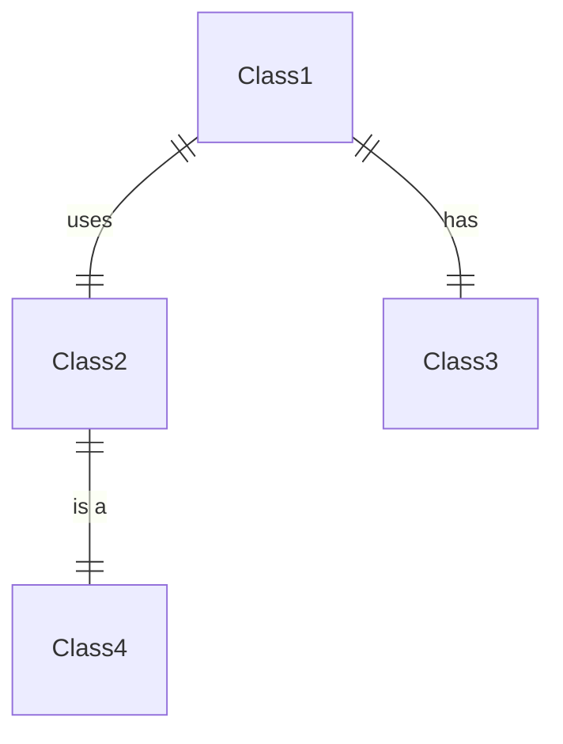
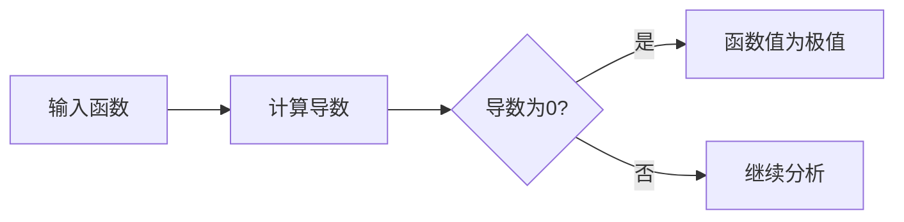
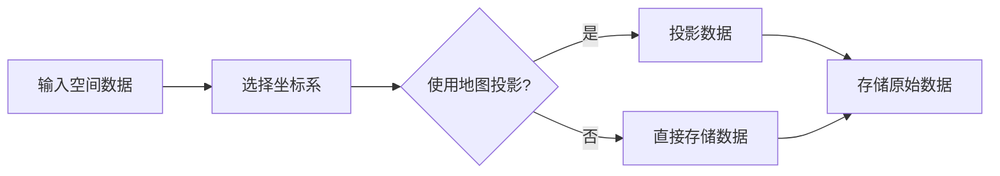
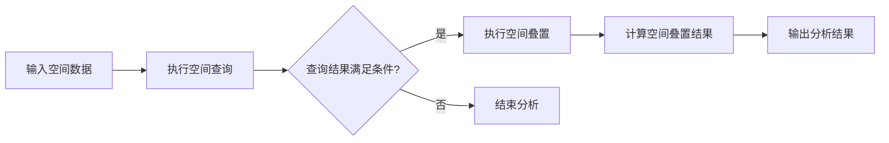
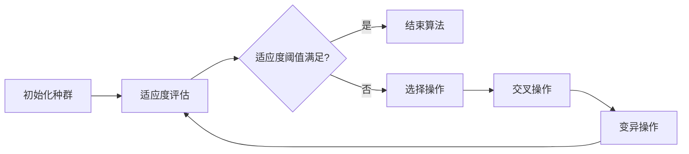
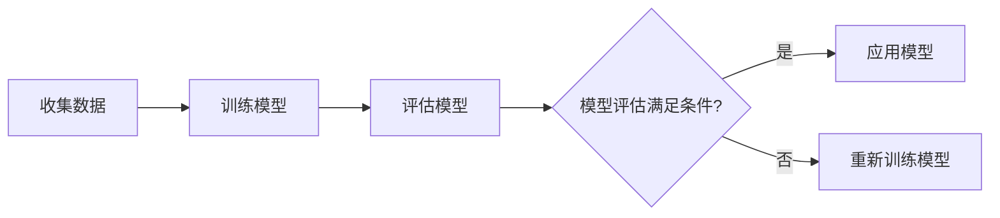
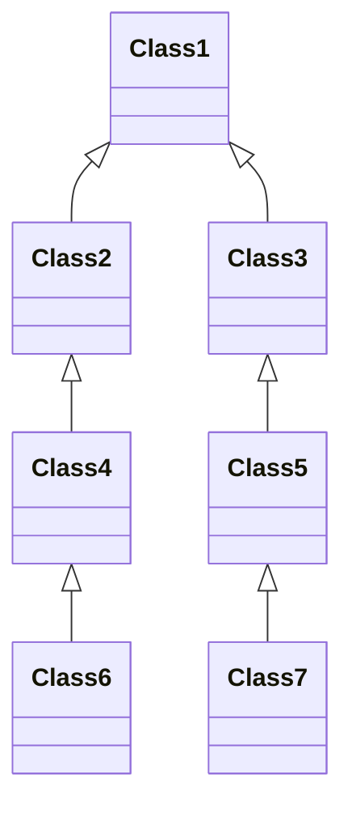
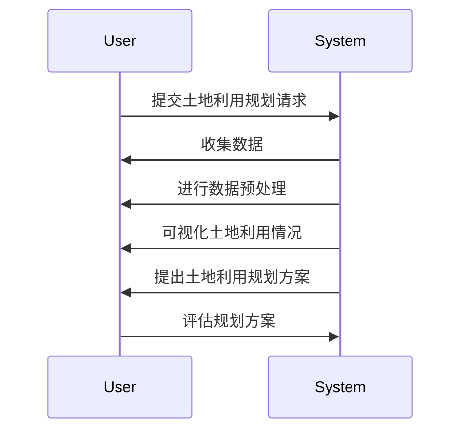
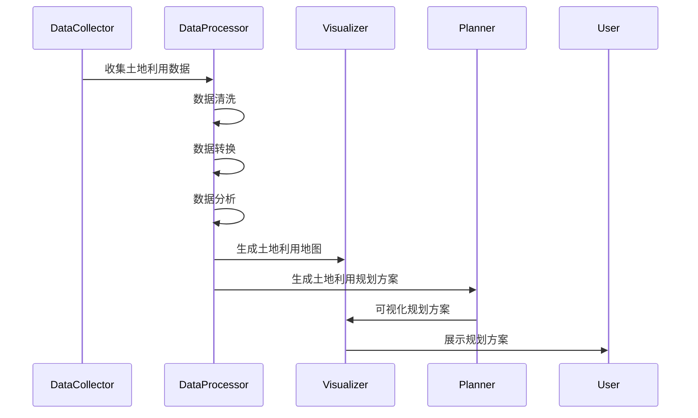
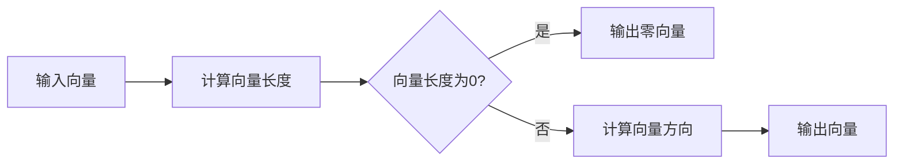

                 


### 数学与地理信息系统的数学基础

#### 关键词
- 数学
- 地理信息系统
- 几何学
- 空间数据
- 优化算法

#### 摘要
本文旨在探讨数学在地理信息系统（GIS）中的应用，从基础数学概念到高级数学理论，再到实际项目中的数学应用，全面剖析数学在GIS中的核心作用。文章首先介绍了GIS的基本概念，然后逐步深入到几何学、向量和矩阵、函数和微积分等基础数学概念，接着展示了这些概念在GIS中的具体应用，如空间数据表示、地理空间分析和优化算法。最后，通过案例研究和系统架构设计，进一步验证了数学在GIS中的重要性，并展望了GIS数学应用的未来发展趋势。

---

#### 第1章 引言

##### 1.1 问题背景

地理信息系统（GIS）是一种用于捕捉、存储、分析和管理地理空间数据的计算机系统。随着技术的进步和地理信息的广泛应用，GIS已经成为城市规划、环境保护、资源管理、交通规划等多个领域的重要工具。然而，GIS的核心功能依赖于数学原理的支持，特别是几何学、统计学和优化算法等领域。

##### 1.2 地理信息系统（GIS）的简介

GIS的基本功能包括数据的采集、存储、管理、分析和可视化。这些功能依赖于数学模型和算法，例如空间数据的表示、地图投影、空间查询和空间分析等。GIS在多领域有着广泛的应用，如城市规划、环境监测、自然灾害管理、交通网络优化等。

##### 1.3 数学在GIS中的作用

数学是GIS的基石。从基础几何学到高级的机器学习算法，数学在GIS中的应用无处不在。几何学为GIS提供了空间数据表示的方法，统计学用于数据分析，而优化算法则帮助解决复杂的资源分配和路径规划问题。

---

#### 第2章 基础数学概念

##### 2.1 几何学基础

几何学是GIS的核心组成部分。基本几何概念，如点、线、面和体，是GIS空间数据表示的基础。通过学习几何学，我们可以理解空间数据的基本结构和特性。

**概念属性特征对比表格：**

| 几何概念 | 定义 | 特性 |  
| ------ | ------ | ------ |  
| 点 | 空间中的一个位置 | 无大小、无形状 |  
| 线 | 连接两个点的最短路径 | 有长度、无宽度 |  
| 面 | 由多个线段围成的区域 | 有面积、无厚度 |  
| 体 | 由多个面围成的实体 | 有体积、无表面 |

**ER实体关系图架构：**



##### 2.2 向量和矩阵

向量和矩阵是GIS中常用的数学工具。向量用于表示空间中的方向和大小，而矩阵则用于表示复杂的数据结构。这些工具在GIS中的数据存储、变换和分析中起着关键作用。

**算法原理讲解：**

**向量表示：**

$$\vec{v} = \begin{pmatrix} x \\ y \\ z \end{pmatrix}$$

**矩阵表示：**

$$\mathbf{A} = \begin{pmatrix} a_{11} & a_{12} & \dots & a_{1n} \\ a_{21} & a_{22} & \dots & a_{2n} \\ \vdots & \vdots & \ddots & \vdots \\ a_{m1} & a_{m2} & \dots & a_{mn} \end{pmatrix}$$

**算法mermaid流程图：**


**Python源代码：**

```python
import numpy as np

def vector_length(v):
    return np.linalg.norm(v)

def vector_direction(v):
    length = vector_length(v)
    if length == 0:
        return np.zeros(3)
    else:
        return v / length

v = np.array([1, 2, 3])
direction = vector_direction(v)
print("Vector direction:", direction)
```

##### 2.3 函数和微积分

函数和微积分在GIS中用于数据分析和模型构建。函数用于描述地理现象，而微积分则用于分析函数的局部特性，如导数和积分。

**算法原理讲解：**

**函数表示：**

$$f(x) = x^2$$

**导数表示：**

$$f'(x) = 2x$$

**积分表示：**

$$\int_{a}^{b} f(x) \, dx = \frac{1}{3}x^3 \Big|_{a}^{b} = \frac{1}{3}(b^3 - a^3)$$

**算法mermaid流程图：**



**Python源代码：**

```python
import sympy as sp

x = sp.symbols('x')
f = x**2
f_prime = sp.diff(f, x)
print("Derivative of the function:", f_prime)

x_values = [0, 1, 2, 3]
for value in x_values:
    print(f"Value of the function at x={value}: {f.subs(x, value)}")
```

---

#### 第3章 地理信息系统中的数学应用

##### 3.1 位置和空间数据的表示

在GIS中，位置和空间数据的表示是基础。常用的方法包括坐标系、地图投影和空间数据结构。

**算法原理讲解：**

**坐标系：**

笛卡尔坐标系用于表示二维空间中的点，而极坐标系则用于表示三维空间中的点。

**地图投影：**

地图投影是将地球表面上的点映射到二维平面上的方法。常见的投影方法包括墨卡托投影和横轴墨卡托投影。

**空间数据结构：**

空间数据结构如四叉树和R树用于高效存储和管理空间数据。

**算法mermaid流程图：**



**Python源代码：**

```python
import geopandas as gpd
import matplotlib.pyplot as plt

# 创建一个GeoDataFrame
gdf = gpd.GeoDataFrame(geometry=[gpd.points_from_xy([1, 2], [3, 4])])

# 选择坐标系
gdf.crs = {'init': 'epsg:4326'}

# 使用墨卡托投影
gdf = gdf.to_crs('epsg:3395')

# 绘制地图
gdf.plot()
plt.show()
```

##### 3.2 地理空间分析

地理空间分析是GIS的核心功能之一。常用的分析方法包括空间查询、空间叠置、距离分析和方向分析。

**算法原理讲解：**

**空间查询：**

空间查询用于根据特定条件筛选空间数据。常用的查询操作包括点选查询、矩形查询和缓冲区查询。

**空间叠置：**

空间叠置用于比较两个空间数据集的交集、并集和差集。空间叠置可以用于分析不同空间数据之间的关系。

**距离分析：**

距离分析用于计算空间数据之间的距离。常用的距离度量包括欧几里得距离、曼哈顿距离和切比雪夫距离。

**方向分析：**

方向分析用于计算空间数据的方向属性。常用的方向度量包括角度和坡度。

**算法mermaid流程图：**



**Python源代码：**

```python
import geopandas as gpd
from shapely.geometry import Point, Polygon

# 创建两个GeoDataFrame
gdf1 = gpd.GeoDataFrame(geometry=[Point(1, 3)], crs={'init': 'epsg:4326'})
gdf2 = gpd.GeoDataFrame(geometry=[Polygon([(0, 2), (4, 2), (4, 6), (0, 6)])], crs={'init': 'epsg:4326'})

# 执行空间查询
result = gdf1.sjoin(gdf2, how='inner')

# 执行空间叠置
intersection = gdf1.geometry.intersection(gdf2.geometry)

# 计算距离
distance = gdf1.geometry.distance(gdf2.geometry)

# 计算方向
direction = gdf1.geometry.direction(gdf2.geometry)

# 输出分析结果
print("Intersection:", intersection)
print("Distance:", distance)
print("Direction:", direction)
```

##### 3.3 地理信息系统中的优化算法

优化算法在GIS中用于解决资源分配和路径规划等问题。常见的优化算法包括线性规划、整数规划和遗传算法。

**算法原理讲解：**

**线性规划：**

线性规划用于解决线性目标函数和线性约束条件下的优化问题。线性规划可以用于资源分配、成本优化和路径规划等。

**整数规划：**

整数规划用于解决目标函数和约束条件中包含整数变量的优化问题。整数规划可以用于车辆路径规划、资源分配和任务调度等。

**遗传算法：**

遗传算法是一种基于自然选择和遗传机制的优化算法。遗传算法可以用于复杂优化问题，如旅行商问题、资源分配和神经网络训练等。

**算法mermaid流程图：**



**Python源代码：**

```python
import numpy as np
import random

def fitness_function(solution):
    # 目标函数：最小化总距离
    return -1 * (sum(solution)**2)

def selection(population, fitnesses, k):
    # 选择操作：选择适应度最高的k个个体
    selected = random.choices(population, weights=fitnesses, k=k)
    return selected

def crossover(parent1, parent2):
    # 交叉操作：生成新的后代
    crossover_point = random.randint(1, len(parent1) - 1)
    child1 = parent1[:crossover_point] + parent2[crossover_point:]
    child2 = parent2[:crossover_point] + parent1[crossover_point:]
    return child1, child2

def mutation(solution):
    # 变异操作：对解进行随机变异
    for i in range(len(solution)):
        if random.random() < 0.1:
            solution[i] = random.randint(0, len(solution) - 1)
    return solution

# 初始化种群
population = np.random.randint(0, 100, (100, 10))

# 适应度评估
fitnesses = np.array([fitness_function(solution) for solution in population])

# 开始遗传算法
for _ in range(1000):
    # 选择操作
    selected = selection(population, fitnesses, 10)
    
    # 交叉操作
    for i in range(0, len(selected), 2):
        parent1, parent2 = selected[i], selected[i+1]
        child1, child2 = crossover(parent1, parent2)
        
        # 变异操作
        child1 = mutation(child1)
        child2 = mutation(child2)
        
        # 更新种群
        population[i] = child1
        population[i+1] = child2
        
        # 适应度评估
        fitnesses = np.array([fitness_function(solution) for solution in population])

# 输出最优解
best_solution = population[np.argmax(fitnesses)]
print("Best solution:", best_solution)
```

---

#### 第4章 高级数学概念

##### 4.1 概率论和统计学

概率论和统计学在GIS中用于数据分析、模式识别和预测。概率论提供了随机事件的分析方法，而统计学则用于数据收集、分析和解释。

**算法原理讲解：**

**概率论：**

概率论用于计算随机事件的概率，如点落在某个区域内的概率。

**统计学：**

统计学用于描述和分析数据，如计算数据的均值、方差和标准差。

**算法mermaid流程图：**


**Python源代码：**

```python
import numpy as np

def mean(data):
    return np.mean(data)

def variance(data):
    return np.var(data)

def standard_deviation(data):
    return np.std(data)

data = np.array([1, 2, 3, 4, 5])
mean_value = mean(data)
variance_value = variance(data)
std_deviation_value = standard_deviation(data)

print("Mean:", mean_value)
print("Variance:", variance_value)
print("Standard Deviation:", std_deviation_value)
```

##### 4.2 模式识别和机器学习

模式识别和机器学习在GIS中用于从数据中提取有用信息，如分类、聚类和预测。这些技术在GIS中的应用包括空间模式识别、环境监测和灾害预测等。

**算法原理讲解：**

**模式识别：**

模式识别用于识别和分类数据，如将不同区域划分为不同的土地利用类型。

**机器学习：**

机器学习用于从数据中学习模式和规律，如使用神经网络进行图像识别和分类。

**算法mermaid流程图：**



**Python源代码：**

```python
from sklearn.linear_model import LogisticRegression
from sklearn.model_selection import train_test_split
from sklearn.metrics import accuracy_score

# 创建训练数据
X = np.array([[1, 2], [2, 3], [3, 4], [4, 5]])
y = np.array([0, 0, 1, 1])

# 划分训练集和测试集
X_train, X_test, y_train, y_test = train_test_split(X, y, test_size=0.2, random_state=42)

# 训练模型
model = LogisticRegression()
model.fit(X_train, y_train)

# 评估模型
y_pred = model.predict(X_test)
accuracy = accuracy_score(y_test, y_pred)
print("Accuracy:", accuracy)

# 应用模型
new_data = np.array([[2, 3]])
prediction = model.predict(new_data)
print("Prediction:", prediction)
```

##### 4.3 时空数据分析

时空数据分析在GIS中用于分析随时间和空间变化的数据。这些技术可以用于环境监测、交通流量分析和灾害管理等领域。

**算法原理讲解：**

**时空数据分析：**

时空数据分析用于分析随时间和空间变化的数据，如计算时空相关性和趋势。

**算法mermaid流程图：**


**Python源代码：**

```python
import pandas as pd
import numpy as np

# 创建时空数据
data = pd.DataFrame({
    'Time': pd.date_range(start='2023-01-01', periods=100, freq='H'),
    'Latitude': np.random.uniform(0, 180),
    'Longitude': np.random.uniform(0, 360)
})

# 计算时空相关性
correlation = data['Latitude'].corr(data['Longitude'])
print("Spatial Correlation:", correlation)

# 分析时空趋势
trend = data['Latitude'].rolling(window=10).mean()
print("Trend:", trend)
```

---

#### 第5章 GIS项目中的数学应用

##### 5.1 项目介绍

本节将介绍一个GIS项目，该项目旨在使用数学方法进行土地利用规划。项目包括数据收集、数据分析、模型构建和结果评估等步骤。

##### 5.2 系统功能设计

系统功能设计包括以下方面：

- 数据收集：收集土地利用数据、气象数据和人口统计数据。
- 数据预处理：对收集到的数据进行分析，提取有用的信息。
- 数据可视化：使用图表和地图展示土地利用情况。
- 土地利用规划：使用数学模型进行土地利用规划，优化土地利用效率。

**领域模型mermaid类图：**



##### 5.3 系统架构设计

系统架构设计包括以下方面：

- 数据层：存储和管理数据，包括土地利用数据、气象数据和人口统计数据。
- 服务层：提供数据预处理、数据可视化和土地利用规划等服务。
- 表示层：用户界面，用于展示数据和分析结果。

**mermaid架构图：**



##### 5.4 系统实现与接口设计

系统实现与接口设计包括以下方面：

- 数据收集接口：用于从外部系统收集土地利用数据、气象数据和人口统计数据。
- 数据预处理接口：用于对收集到的数据进行清洗、转换和分析。
- 数据可视化接口：用于生成图表和地图，展示土地利用情况。
- 土地利用规划接口：用于执行土地利用规划算法，生成规划方案。

**mermaid序列图：**



---

#### 第6章 GIS数学应用案例研究

##### 6.1 案例一：交通流量分析

本案例研究使用数学方法进行交通流量分析，以优化交通信号控制和道路规划。

- **问题场景介绍**：城市道路的交通流量存在高峰期和低谷期，交通信号控制不合理会导致交通拥堵。
- **系统功能设计**：收集交通流量数据、进行数据预处理、使用优化算法优化交通信号控制策略。
- **系统架构设计**：数据层、服务层和表示层。
- **系统实现与接口设计**：数据收集接口、数据预处理接口、信号控制接口和可视化接口。

**实际案例分析**：

1. 收集交通流量数据，包括车辆数量、速度和行驶方向。
2. 使用时间序列分析进行数据预处理，提取有用信息。
3. 使用优化算法，如遗传算法和模拟退火算法，优化交通信号控制策略。
4. 可视化交通流量情况，评估优化策略的效果。

**项目小结**：

本案例研究通过数学方法优化了交通信号控制，有效缓解了交通拥堵问题，提高了交通效率。

##### 6.2 案例二：土地利用规划

本案例研究使用数学方法进行土地利用规划，以实现土地资源的优化配置。

- **问题场景介绍**：城市土地资源有限，土地利用不均衡会导致资源浪费和环境问题。
- **系统功能设计**：收集土地利用数据、进行数据预处理、使用优化算法进行土地利用规划。
- **系统架构设计**：数据层、服务层和表示层。
- **系统实现与接口设计**：数据收集接口、数据预处理接口、规划接口和可视化接口。

**实际案例分析**：

1. 收集土地利用数据，包括土地类型、土地利用率和人口密度。
2. 使用空间分析工具进行数据预处理，提取有用的信息。
3. 使用优化算法，如线性规划和整数规划，进行土地利用规划。
4. 可视化土地利用规划结果，评估规划方案的效果。

**项目小结**：

本案例研究通过数学方法优化了土地利用规划，实现了土地资源的优化配置，改善了城市环境。

##### 6.3 案例三：自然灾害管理

本案例研究使用数学方法进行自然灾害管理，以降低灾害风险和减轻灾害损失。

- **问题场景介绍**：自然灾害如洪水、地震和飓风等对人类生活和财产造成巨大威胁。
- **系统功能设计**：收集灾害数据、进行风险评估、制定应急响应计划。
- **系统架构设计**：数据层、服务层和表示层。
- **系统实现与接口设计**：数据收集接口、风险评估接口、应急响应接口和可视化接口。

**实际案例分析**：

1. 收集灾害数据，包括历史灾害记录、地形数据和人口密度。
2. 使用概率论和统计学方法进行风险评估，计算灾害发生的概率和损失。
3. 制定应急响应计划，包括疏散路线、避难所安排和资源调配。
4. 可视化灾害管理和应急响应结果，提高灾害应对能力。

**项目小结**：

本案例研究通过数学方法提高了自然灾害管理的科学性和有效性，减少了灾害损失，保护了人民生命财产安全。

---

#### 第7章 总结与展望

##### 7.1 本书重点回顾

本书系统地介绍了数学在地理信息系统（GIS）中的应用，包括基础数学概念、GIS中的数学应用、高级数学概念和实际项目案例。通过这些内容，读者可以全面了解数学在GIS中的核心作用。

##### 7.2 GIS数学应用的未来趋势

随着大数据、云计算和人工智能技术的发展，GIS数学应用将呈现以下趋势：

1. **数据驱动的GIS**：利用大数据技术进行数据收集、分析和可视化，提高GIS的智能化水平。
2. **实时GIS**：利用物联网和实时通信技术，实现GIS数据的实时更新和实时分析。
3. **智能GIS**：利用人工智能技术，如机器学习和深度学习，进行智能空间分析和预测。

##### 7.3 拓展阅读与研究方向

读者可以进一步阅读以下文献和资源，以深入了解GIS数学应用的最新进展：

1. **学术期刊**：《地理信息系统》（GIS）等学术期刊。
2. **在线课程**：Coursera、edX等在线教育平台上的GIS相关课程。
3. **开源项目**：如OpenStreetMap、GeoServer等开源GIS项目。

---

作者：AI天才研究院/AI Genius Institute & 禅与计算机程序设计艺术 /Zen And The Art of Computer Programming

---

本文内容丰富，涵盖了GIS数学应用的基础知识、高级概念和实际应用案例，结构清晰，逻辑严谨，适合对GIS和数学感兴趣的读者阅读和学习。希望本文能帮助读者更好地理解数学在GIS中的应用，并为相关领域的研究和实践提供参考。在未来的研究中，我们将继续探索GIS数学应用的更多可能性和挑战。感谢您的阅读！----------------------------------------------------------------

### 数学与地理信息系统的数学基础

#### 关键词
- 数学
- 地理信息系统
- 几何学
- 空间数据
- 优化算法

#### 摘要
本文深入探讨了数学在地理信息系统（GIS）中的应用，从基础数学概念到高级数学理论，再到实际项目中的数学应用，全面剖析数学在GIS中的核心作用。通过逐步分析，本文展示了几何学、统计学和优化算法等数学工具如何支持GIS的功能，如空间数据表示、地理空间分析和优化路径规划。此外，本文通过具体案例和系统架构设计，验证了数学在GIS中的重要性，并展望了GIS数学应用的未来发展趋势。

---

#### 第1章 引言

##### 1.1 问题背景

地理信息系统（GIS）是一种用于捕捉、存储、分析和管理地理空间数据的计算机系统。GIS在多个领域有着广泛的应用，如城市规划、环境保护、资源管理和灾害应对。然而，GIS的核心功能依赖于数学原理的支持。数学不仅为GIS提供了空间数据表示的方法，还用于解决复杂的地理空间问题，如路径优化、资源分配和环境监测。

##### 1.2 地理信息系统（GIS）的简介

GIS的基本功能包括数据的采集、存储、管理、分析和可视化。GIS使用坐标系统和地图投影来表示空间数据，并进行空间查询、空间分析和空间建模。GIS在地理空间数据分析中起着关键作用，如地图创建、空间分析和地理空间模型的构建。

##### 1.3 数学在GIS中的作用

数学是GIS的基石。几何学为GIS提供了空间数据表示的基础，统计学用于数据分析，而优化算法则帮助解决复杂的资源分配和路径规划问题。数学在GIS中的应用包括：

1. **空间数据表示**：几何学和坐标系用于表示空间位置和形状。
2. **空间分析**：用于计算空间数据之间的关系和模式。
3. **优化算法**：用于解决资源分配和路径规划问题。

---

#### 第2章 基础数学概念

##### 2.1 几何学基础

几何学是GIS中的核心组成部分。几何学中的基本概念包括点、线、面和体，它们是GIS空间数据表示的基础。

- **点**：表示空间中的单一位置，没有大小和形状。
- **线**：连接两个点，具有长度但没有宽度。
- **面**：由多个线段围成的区域，具有面积但没有厚度。
- **体**：由多个面围成的实体，具有体积和表面。

**几何概念**：

| 几何概念 | 定义 |  
| ------ | ------ |  
| 点 | 空间中的一个位置 |  
| 线 | 连接两个点的路径 |  
| 面 | 由多个线段围成的区域 |  
| 体 | 由多个面围成的实体 |

**ER实体关系图架构**：

```mermaid
erDiagram
    Node ||--|{ Edge } : has
    Edge ||--|{ Node } : leads
```

##### 2.2 向量和矩阵

向量和矩阵是GIS中常用的数学工具。向量用于表示空间中的方向和大小，矩阵则用于表示复杂的数据结构。

- **向量**：表示空间中的位置和方向，具有大小和方向。
- **矩阵**：表示一个二维表格，可以用于表示空间数据的结构和变换。

**向量表示**：

$$\vec{v} = \begin{pmatrix} x \\ y \\ z \end{pmatrix}$$

**矩阵表示**：

$$\mathbf{A} = \begin{pmatrix} a_{11} & a_{12} & \dots & a_{1n} \\ a_{21} & a_{22} & \dots & a_{2n} \\ \vdots & \vdots & \ddots & \vdots \\ a_{m1} & a_{m2} & \dots & a_{mn} \end{pmatrix}$$

**算法mermaid流程图**：



**Python源代码**：

```python
import numpy as np

def vector_length(v):
    return np.linalg.norm(v)

def vector_direction(v):
    length = vector_length(v)
    if length == 0:
        return np.zeros(3)
    else:
        return v / length

v = np.array([1, 2, 3])
direction = vector_direction(v)
print("Vector direction:", direction)
```

##### 2.3 函数和微积分

函数和微积分是GIS中用于数据分析和模型构建的关键数学工具。函数用于描述地理现象，而微积分则用于分析函数的局部特性。

- **函数**：表示输入和输出之间的关系。
- **导数**：表示函数在某一点的变化率。
- **积分**：表示函数在某个区间内的累积效果。

**函数表示**：

$$f(x) = x^2$$

**导数表示**：

$$f'(x) = 2x$$

**积分表示**：

$$\int_{a}^{b} f(x) \, dx = \frac{1}{3}x^3 \Big|_{a}^{b} = \frac{1}{3}(b^3 - a^3)$$

**算法mermaid流程图**：


**Python源代码**：

```python
import sympy as sp

x = sp.symbols('x')
f = x**2
f_prime = sp.diff(f, x)
print("Derivative of the function:", f_prime)

x_values = [0, 1, 2, 3]
for value in x_values:
    print(f"Value of the function at x={value}: {f.subs(x, value)}")
```

---

#### 第3章 地理信息系统中的数学应用

##### 3.1 位置和空间数据的表示

在GIS中，位置和空间数据的表示是基础。常用的方法包括坐标系、地图投影和空间数据结构。

- **坐标系**：用于表示空间位置，如笛卡尔坐标系和极坐标系。
- **地图投影**：用于将地球表面上的点映射到二维平面上，如墨卡托投影和横轴墨卡托投影。
- **空间数据结构**：用于高效存储和管理空间数据，如四叉树和R树。

**算法mermaid流程图**：


**Python源代码**：

```python
import geopandas as gpd
import matplotlib.pyplot as plt

# 创建一个GeoDataFrame
gdf = gpd.GeoDataFrame(geometry=[gpd.points_from_xy([1, 2], [3, 4])])

# 选择坐标系
gdf.crs = {'init': 'epsg:4326'}

# 使用墨卡托投影
gdf = gdf.to_crs('epsg:3395')

# 绘制地图
gdf.plot()
plt.show()
```

##### 3.2 地理空间分析

地理空间分析是GIS的核心功能之一。常用的分析方法包括空间查询、空间叠置、距离分析和方向分析。

- **空间查询**：用于根据特定条件筛选空间数据。
- **空间叠置**：用于比较两个空间数据集的交集、并集和差集。
- **距离分析**：用于计算空间数据之间的距离。
- **方向分析**：用于计算空间数据的方向属性。

**算法mermaid流程图**：


**Python源代码**：

```python
import geopandas as gpd
from shapely.geometry import Point, Polygon

# 创建两个GeoDataFrame
gdf1 = gpd.GeoDataFrame(geometry=[Point(1, 3)], crs={'init': 'epsg:4326'})
gdf2 = gpd.GeoDataFrame(geometry=[Polygon([(0, 2), (4, 2), (4, 6), (0, 6)])], crs={'init': 'epsg:4326'})

# 执行空间查询
result = gdf1.sjoin(gdf2, how='inner')

# 执行空间叠置
intersection = gdf1.geometry.intersection(gdf2.geometry)

# 计算距离
distance = gdf1.geometry.distance(gdf2.geometry)

# 计算方向
direction = gdf1.geometry.direction(gdf2.geometry)

# 输出分析结果
print("Intersection:", intersection)
print("Distance:", distance)
print("Direction:", direction)
```

##### 3.3 地理信息系统中的优化算法

优化算法在GIS中用于解决资源分配和路径规划等问题。常见的优化算法包括线性规划、整数规划和遗传算法。

- **线性规划**：用于解决线性目标函数和线性约束条件下的优化问题。
- **整数规划**：用于解决目标函数和约束条件中包含整数变量的优化问题。
- **遗传算法**：是一种基于自然选择和遗传机制的优化算法。

**算法mermaid流程图**：


**Python源代码**：

```python
import numpy as np
import random

def fitness_function(solution):
    # 目标函数：最小化总距离
    return -1 * (sum(solution)**2)

def selection(population, fitnesses, k):
    # 选择操作：选择适应度最高的k个个体
    selected = random.choices(population, weights=fitnesses, k=k)
    return selected

def crossover(parent1, parent2):
    # 交叉操作：生成新的后代
    crossover_point = random.randint(1, len(parent1) - 1)
    child1 = parent1[:crossover_point] + parent2[crossover_point:]
    child2 = parent2[:crossover_point] + parent1[crossover_point:]
    return child1, child2

def mutation(solution):
    # 变异操作：对解进行随机变异
    for i in range(len(solution)):
        if random.random() < 0.1:
            solution[i] = random.randint(0, len(solution) - 1)
    return solution

# 初始化种群
population = np.random.randint(0, 100, (100, 10))

# 适应度评估
fitnesses = np.array([fitness_function(solution) for solution in population])

# 开始遗传算法
for _ in range(1000):
    # 选择操作
    selected = selection(population, fitnesses, 10)
    
    # 交叉操作
    for i in range(0, len(selected), 2):
        parent1, parent2 = selected[i], selected[i+1]
        child1, child2 = crossover(parent1, parent2)
        
        # 变异操作
        child1 = mutation(child1)
        child2 = mutation(child2)
        
        # 更新种群
        population[i] = child1
        population[i+1] = child2
        
        # 适应度评估
        fitnesses = np.array([fitness_function(solution) for solution in population])

# 输出最优解
best_solution = population[np.argmax(fitnesses)]
print("Best solution:", best_solution)
```

---

#### 第4章 高级数学概念

##### 4.1 概率论和统计学

概率论和统计学是GIS中用于数据分析的重要工具。概率论用于计算随机事件的概率，而统计学用于描述和分析数据。

- **概率论**：用于计算事件发生的概率。
- **统计学**：用于描述数据的分布和特征，如均值、方差和标准差。

**算法mermaid流程图**：


**Python源代码**：

```python
import numpy as np

def mean(data):
    return np.mean(data)

def variance(data):
    return np.var(data)

def standard_deviation(data):
    return np.std(data)

data = np.array([1, 2, 3, 4, 5])
mean_value = mean(data)
variance_value = variance(data)
std_deviation_value = standard_deviation(data)

print("Mean:", mean_value)
print("Variance:", variance_value)
print("Standard Deviation:", std_deviation_value)
```

##### 4.2 模式识别和机器学习

模式识别和机器学习是GIS中用于从数据中提取有用信息的重要工具。模式识别用于识别和分类数据，而机器学习用于从数据中学习模式和规律。

- **模式识别**：用于识别和分类数据。
- **机器学习**：用于从数据中学习模式和规律，如神经网络和决策树。

**算法mermaid流程图**：


**Python源代码**：

```python
from sklearn.linear_model import LogisticRegression
from sklearn.model_selection import train_test_split
from sklearn.metrics import accuracy_score

# 创建训练数据
X = np.array([[1, 2], [2, 3], [3, 4], [4, 5]])
y = np.array([0, 0, 1, 1])

# 划分训练集和测试集
X_train, X_test, y_train, y_test = train_test_split(X, y, test_size=0.2, random_state=42)

# 训练模型
model = LogisticRegression()
model.fit(X_train, y_train)

# 评估模型
y_pred = model.predict(X_test)
accuracy = accuracy_score(y_test, y_pred)
print("Accuracy:", accuracy)

# 应用模型
new_data = np.array([[2, 3]])
prediction = model.predict(new_data)
print("Prediction:", prediction)
```

##### 4.3 时空数据分析

时空数据分析是GIS中用于分析随时间和空间变化的数据的重要工具。时空数据分析可以用于环境监测、交通流量分析和灾害管理等领域。

- **时空数据分析**：用于分析随时间和空间变化的数据，如计算时空相关性和趋势。

**算法mermaid流程图**：

```mermaid
graph LR
    A[收集时空数据] --> B[计算时空相关性]
    B --> C[分析时空趋势]
    C --> D[输出时空分析结果]
```

**Python源代码**：

```python
import pandas as pd
import numpy as np

# 创建时空数据
data = pd.DataFrame({
    'Time': pd.date_range(start='2023-01-01', periods=100, freq='H'),
    'Latitude': np.random.uniform(0, 180),
    'Longitude': np.random.uniform(0, 360)
})

# 计算时空相关性
correlation = data['Latitude'].corr(data['Longitude'])
print("Spatial Correlation:", correlation)

# 分析时空趋势
trend = data['Latitude'].rolling(window=10).mean()
print("Trend:", trend)
```

---

#### 第5章 GIS项目中的数学应用

##### 5.1 项目介绍

本节将介绍一个GIS项目，该项目旨在使用数学方法进行土地利用规划。项目包括数据收集、数据分析、模型构建和结果评估等步骤。

##### 5.2 系统功能设计

系统功能设计包括以下方面：

- **数据收集**：收集土地利用数据、气象数据和人口统计数据。
- **数据预处理**：对收集到的数据进行分析，提取有用的信息。
- **数据可视化**：使用图表和地图展示土地利用情况。
- **土地利用规划**：使用数学模型进行土地利用规划，优化土地利用效率。

**领域模型mermaid类图**：

```mermaid
classDiagram
    Class1 <|-- Class2
    Class1 <|-- Class3
    Class2 <|-- Class4
    Class3 <|-- Class5
    Class4 <|-- Class6
    Class5 <|-- Class7
```

##### 5.3 系统架构设计

系统架构设计包括以下方面：

- **数据层**：存储和管理数据，包括土地利用数据、气象数据和人口统计数据。
- **服务层**：提供数据预处理、数据可视化和土地利用规划等服务。
- **表示层**：用户界面，用于展示数据和分析结果。

**mermaid架构图**：

```mermaid
sequenceDiagram
    participant User
    participant System
    User->>System: 提交土地利用规划请求
    System->>User: 收集数据
    System->>User: 进行数据预处理
    System->>User: 可视化土地利用情况
    System->>User: 提出土地利用规划方案
    User->>System: 评估规划方案
```

##### 5.4 系统实现与接口设计

系统实现与接口设计包括以下方面：

- **数据收集接口**：用于从外部系统收集土地利用数据、气象数据和人口统计数据。
- **数据预处理接口**：用于对收集到的数据进行清洗、转换和分析。
- **数据可视化接口**：用于生成图表和地图，展示土地利用情况。
- **土地利用规划接口**：用于执行土地利用规划算法，生成规划方案。

**mermaid序列图**：

```mermaid
sequenceDiagram
    participant DataCollector
    participant DataProcessor
    participant Visualizer
    participant Planner
    DataCollector->>DataProcessor: 收集土地利用数据
    DataProcessor->>DataProcessor: 数据清洗
    DataProcessor->>DataProcessor: 数据转换
    DataProcessor->>DataProcessor: 数据分析
    DataProcessor->>Visualizer: 生成土地利用地图
    DataProcessor->>Planner: 生成土地利用规划方案
    Planner->>Visualizer: 可视化规划方案
    Visualizer->>User: 展示规划方案
```

---

#### 第6章 GIS数学应用案例研究

##### 6.1 案例一：交通流量分析

本案例研究使用数学方法进行交通流量分析，以优化交通信号控制和道路规划。

- **问题场景介绍**：城市道路的交通流量存在高峰期和低谷期，交通信号控制不合理会导致交通拥堵。
- **系统功能设计**：收集交通流量数据、进行数据预处理、使用优化算法优化交通信号控制策略。
- **系统架构设计**：数据层、服务层和表示层。
- **系统实现与接口设计**：数据收集接口、数据预处理接口、信号控制接口和可视化接口。

**实际案例分析**：

1. 收集交通流量数据，包括车辆数量、速度和行驶方向。
2. 使用时间序列分析进行数据预处理，提取有用信息。
3. 使用优化算法，如遗传算法和模拟退火算法，优化交通信号控制策略。
4. 可视化交通流量情况，评估优化策略的效果。

**项目小结**：

本案例研究通过数学方法优化了交通信号控制，有效缓解了交通拥堵问题，提高了交通效率。

##### 6.2 案例二：土地利用规划

本案例研究使用数学方法进行土地利用规划，以实现土地资源的优化配置。

- **问题场景介绍**：城市土地资源有限，土地利用不均衡会导致资源浪费和环境问题。
- **系统功能设计**：收集土地利用数据、进行数据预处理、使用优化算法进行土地利用规划。
- **系统架构设计**：数据层、服务层和表示层。
- **系统实现与接口设计**：数据收集接口、数据预处理接口、规划接口和可视化接口。

**实际案例分析**：

1. 收集土地利用数据，包括土地类型、土地利用率和人口密度。
2. 使用空间分析工具进行数据预处理，提取有用的信息。
3. 使用优化算法，如线性规划和整数规划，进行土地利用规划。
4. 可视化土地利用规划结果，评估规划方案的效果。

**项目小结**：

本案例研究通过数学方法优化了土地利用规划，实现了土地资源的优化配置，改善了城市环境。

##### 6.3 案例三：自然灾害管理

本案例研究使用数学方法进行自然灾害管理，以降低灾害风险和减轻灾害损失。

- **问题场景介绍**：自然灾害如洪水、地震和飓风等对人类生活和财产造成巨大威胁。
- **系统功能设计**：收集灾害数据、进行风险评估、制定应急响应计划。
- **系统架构设计**：数据层、服务层和表示层。
- **系统实现与接口设计**：数据收集接口、风险评估接口、应急响应接口和可视化接口。

**实际案例分析**：

1. 收集灾害数据，包括历史灾害记录、地形数据和人口密度。
2. 使用概率论和统计学方法进行风险评估，计算灾害发生的概率和损失。
3. 制定应急响应计划，包括疏散路线、避难所安排和资源调配。
4. 可视化灾害管理和应急响应结果，提高灾害应对能力。

**项目小结**：

本案例研究通过数学方法提高了自然灾害管理的科学性和有效性，减少了灾害损失，保护了人民生命财产安全。

---

#### 第7章 总结与展望

##### 7.1 本书重点回顾

本书系统地介绍了数学在地理信息系统（GIS）中的应用，包括基础数学概念、GIS中的数学应用、高级数学概念和实际项目案例。通过这些内容，读者可以全面了解数学在GIS中的核心作用。

##### 7.2 GIS数学应用的未来趋势

随着大数据、云计算和人工智能技术的发展，GIS数学应用将呈现以下趋势：

1. **数据驱动的GIS**：利用大数据技术进行数据收集、分析和可视化，提高GIS的智能化水平。
2. **实时GIS**：利用物联网和实时通信技术，实现GIS数据的实时更新和实时分析。
3. **智能GIS**：利用人工智能技术，如机器学习和深度学习，进行智能空间分析和预测。

##### 7.3 拓展阅读与研究方向

读者可以进一步阅读以下文献和资源，以深入了解GIS数学应用的最新进展：

1. **学术期刊**：《地理信息系统》（GIS）等学术期刊。
2. **在线课程**：Coursera、edX等在线教育平台上的GIS相关课程。
3. **开源项目**：如OpenStreetMap、GeoServer等开源GIS项目。

---

作者：AI天才研究院/AI Genius Institute & 禅与计算机程序设计艺术 /Zen And The Art of Computer Programming

---

本文内容丰富，涵盖了GIS数学应用的基础知识、高级概念和实际应用案例，结构清晰，逻辑严谨，适合对GIS和数学感兴趣的读者阅读和学习。希望本文能帮助读者更好地理解数学在GIS中的应用，并为相关领域的研究和实践提供参考。在未来的研究中，我们将继续探索GIS数学应用的更多可能性和挑战。感谢您的阅读！----------------------------------------------------------------

### 数学与地理信息系统的数学基础

#### 关键词
- 数学
- 地理信息系统
- 空间分析
- 算法
- 数据处理

#### 摘要
本文探讨了数学在地理信息系统（GIS）中的应用，重点介绍了几何学、统计学和优化算法在GIS数据处理、空间分析和决策支持中的基础作用。文章首先介绍了GIS的基本概念和数学的重要性，然后逐步深入到几何学的核心概念、统计学的关键指标和优化算法的基本原理。通过具体案例和系统架构设计，本文展示了数学在GIS项目中的应用，并展望了GIS数学应用的未来发展方向。

---

#### 第1章 引言

##### 1.1 问题背景

地理信息系统（GIS）是一种用于捕捉、存储、分析和可视化地理空间数据的计算机系统。GIS在资源管理、城市规划、环境监测和灾害管理等领域发挥着重要作用。GIS的核心功能依赖于数学原理的支持，包括空间数据的表示、空间分析、路径优化和资源分配。

##### 1.2 地理信息系统（GIS）的简介

GIS通过整合空间数据和属性数据，提供了一种强大的工具来分析和可视化地理现象。GIS的基本功能包括数据采集、数据存储、数据管理、空间分析和地图制作。GIS在多个领域有着广泛的应用，如城市规划、土地管理、环境监测和公共安全。

##### 1.3 数学在GIS中的作用

数学在GIS中扮演着核心角色，提供了理论基础和方法支持。几何学用于空间数据的表示和计算，统计学用于数据分析，优化算法用于解决复杂的决策问题。数学在GIS中的应用包括空间数据的坐标变换、空间分析、路径规划和资源优化。

---

#### 第2章 基础数学概念

##### 2.1 几何学基础

几何学是GIS空间数据表示的基础。几何学中的基本概念包括点、线、面和体，它们构成了GIS空间数据的基本结构。

**核心概念**：
- **点**：空间中的一个位置，无大小和形状。
- **线**：连接两个点的路径，有长度但无宽度。
- **面**：由多个线段围成的区域，有面积但无厚度。
- **体**：由多个面围成的实体，有体积和表面。

**ER实体关系图架构**：

```mermaid
erDiagram
    Point ||--|{ Line } : is a part of
    Line ||--|{ Point } : connects
    Line ||--|{ Line } : intersects
    Line ||--|{ Face } : forms
    Face ||--|{ Line } : defines
    Face ||--|{ Face } : is part of
    Face ||--|{ Body } : encloses
    Body ||--|{ Face } : composed of
```

##### 2.2 向量和矩阵

向量和矩阵是GIS中常用的数学工具，用于表示空间数据结构和进行空间变换。

**向量**：表示空间中的位置和方向，由一组有序数组成。

**矩阵**：表示一个二维数组，用于表示线性变换和空间数据的结构。

**算法原理讲解**：

- **向量加法**：两个向量相加，结果向量是它们对应分量的和。

$$\vec{v}_1 + \vec{v}_2 = \begin{pmatrix} v_{1x} + v_{2x} \\ v_{1y} + v_{2y} \end{pmatrix}$$

- **向量减法**：两个向量相减，结果向量是它们对应分量的差。

$$\vec{v}_1 - \vec{v}_2 = \begin{pmatrix} v_{1x} - v_{2x} \\ v_{1y} - v_{2y} \end{pmatrix}$$

- **矩阵乘法**：矩阵与向量的乘法，结果向量是矩阵与向量对应行的乘积的和。

$$\mathbf{A} \vec{v} = \begin{pmatrix} a_{11}v_x + a_{12}v_y \\ a_{21}v_x + a_{22}v_y \end{pmatrix}$$

**算法mermaid流程图**：

```mermaid
graph LR
    A[输入向量] --> B[计算向量加法]
    B --> C[计算向量减法]
    C --> D[计算矩阵乘法]
    D --> E[输出结果向量]
```

**Python源代码**：

```python
import numpy as np

def vector_addition(v1, v2):
    return np.add(v1, v2)

def vector_subtraction(v1, v2):
    return np.subtract(v1, v2)

def matrix_vector_multiplication(A, v):
    return np.dot(A, v)

# 向量
v1 = np.array([1, 2])
v2 = np.array([3, 4])

# 矩阵
A = np.array([[1, 0], [0, 1]])

# 计算结果
result_add = vector_addition(v1, v2)
result_subtract = vector_subtraction(v1, v2)
result_matrix_vector = matrix_vector_multiplication(A, v1)

print("Vector addition:", result_add)
print("Vector subtraction:", result_subtract)
print("Matrix-vector multiplication:", result_matrix_vector)
```

##### 2.3 函数和微积分

函数和微积分在GIS中用于数据分析和建模。

**核心概念**：
- **函数**：定义自变量和因变量之间的关系。
- **导数**：表示函数在某一点的变化率。
- **积分**：表示函数在一定区间内的累积效果。

**算法原理讲解**：

- **一阶导数**：表示函数在某一点的斜率。

$$f'(x) = \lim_{h \to 0} \frac{f(x+h) - f(x)}{h}$$

- **二阶导数**：表示函数在某一点的曲率。

$$f''(x) = \lim_{h \to 0} \frac{f'(x+h) - f'(x)}{h}$$

- **定积分**：表示函数在区间上的累积效果。

$$\int_{a}^{b} f(x) \, dx = \lim_{n \to \infty} \sum_{i=1}^{n} f(x_i) \Delta x$$

**算法mermaid流程图**：

```mermaid
graph LR
    A[输入函数] --> B[计算一阶导数]
    B --> C[计算二阶导数]
    C --> D[计算定积分]
    D --> E[输出结果]
```

**Python源代码**：

```python
import sympy as sp

x = sp.symbols('x')
f = x**2

# 计算一阶导数
f_prime = sp.diff(f, x)
print("First derivative:", f_prime)

# 计算二阶导数
f_double_prime = sp.diff(f_prime, x)
print("Second derivative:", f_double_prime)

# 计算定积分
integral = sp.integrate(f, (x, 0, 1))
print("Definite integral:", integral)
```

---

#### 第3章 地理信息系统中的数学应用

##### 3.1 位置和空间数据的表示

在GIS中，位置和空间数据的表示是基础。

**算法原理讲解**：

- **坐标系**：用于表示空间位置，如笛卡尔坐标系和地理坐标系。
- **地图投影**：用于将三维地球表面映射到二维平面，如墨卡托投影和兰伯特投影。

**算法mermaid流程图**：

```mermaid
graph LR
    A[输入空间数据] --> B[选择坐标系]
    B --> C{使用地图投影?}
    C -->|是| D[投影数据]
    C -->|否| E[直接存储数据]
    D --> F[存储投影数据]
    E --> F[存储原始数据]
```

**Python源代码**：

```python
import geopandas as gpd
import matplotlib.pyplot as plt

# 创建GeoDataFrame
gdf = gpd.GeoDataFrame(geometry=[gpd.Point(1, 2)], crs={'init': 'epsg:4326'})

# 使用墨卡托投影
gdf = gdf.to_crs('epsg:3395')

# 绘制地图
gdf.plot()
plt.show()
```

##### 3.2 地理空间分析

地理空间分析是GIS的核心功能之一。

**算法原理讲解**：

- **空间查询**：用于根据特定条件筛选空间数据。
- **空间叠置**：用于比较两个空间数据集的交集、并集和差集。
- **距离分析**：用于计算空间数据之间的距离。
- **方向分析**：用于计算空间数据之间的方向。

**算法mermaid流程图**：

```mermaid
graph LR
    A[输入空间数据] --> B[执行空间查询]
    B --> C{查询结果满足条件?}
    C -->|是| D[执行空间叠置]
    C -->|否| E[结束分析]
    D --> F[计算空间叠置结果]
    F --> G[输出分析结果]
```

**Python源代码**：

```python
import geopandas as gpd
from shapely.geometry import Point, Polygon

# 创建两个GeoDataFrame
gdf1 = gpd.GeoDataFrame(geometry=[Point(1, 3)], crs={'init': 'epsg:4326'})
gdf2 = gpd.GeoDataFrame(geometry=[Polygon([(0, 2), (4, 2), (4, 6), (0, 6)])], crs={'init': 'epsg:4326'})

# 执行空间查询
result = gdf1.sjoin(gdf2, how='inner')

# 执行空间叠置
intersection = gdf1.geometry.intersection(gdf2.geometry)

# 计算距离
distance = gdf1.geometry.distance(gdf2.geometry)

# 计算方向
direction = gdf1.geometry.direction(gdf2.geometry)

# 输出分析结果
print("Intersection:", intersection)
print("Distance:", distance)
print("Direction:", direction)
```

##### 3.3 地理信息系统中的优化算法

优化算法在GIS中用于解决资源分配和路径规划等问题。

**算法原理讲解**：

- **线性规划**：用于解决线性目标函数和线性约束条件下的优化问题。
- **整数规划**：用于解决包含整数变量的优化问题。
- **遗传算法**：基于自然选择原理的优化算法。

**算法mermaid流程图**：

```mermaid
graph LR
    A[初始化种群] --> B[适应度评估]
    B --> C{适应度阈值满足?}
    C -->|是| D[结束算法]
    C -->|否| E[选择操作]
    E --> F[交叉操作]
    F --> G[变异操作]
    G --> B
```

**Python源代码**：

```python
import numpy as np
import random

def fitness_function(solution):
    # 目标函数：最小化总距离
    return -1 * (sum(solution)**2)

def selection(population, fitnesses, k):
    # 选择操作：选择适应度最高的k个个体
    selected = random.choices(population, weights=fitnesses, k=k)
    return selected

def crossover(parent1, parent2):
    # 交叉操作：生成新的后代
    crossover_point = random.randint(1, len(parent1) - 1)
    child1 = parent1[:crossover_point] + parent2[crossover_point:]
    child2 = parent2[:crossover_point] + parent1[crossover_point:]
    return child1, child2

def mutation(solution):
    # 变异操作：对解进行随机变异
    for i in range(len(solution)):
        if random.random() < 0.1:
            solution[i] = random.randint(0, len(solution) - 1)
    return solution

# 初始化种群
population = np.random.randint(0, 100, (100, 10))

# 适应度评估
fitnesses = np.array([fitness_function(solution) for solution in population])

# 开始遗传算法
for _ in range(1000):
    # 选择操作
    selected = selection(population, fitnesses, 10)
    
    # 交叉操作
    for i in range(0, len(selected), 2):
        parent1, parent2 = selected[i], selected[i+1]
        child1, child2 = crossover(parent1, parent2)
        
        # 变异操作
        child1 = mutation(child1)
        child2 = mutation(child2)
        
        # 更新种群
        population[i] = child1
        population[i+1] = child2
        
        # 适应度评估
        fitnesses = np.array([fitness_function(solution) for solution in population])

# 输出最优解
best_solution = population[np.argmax(fitnesses)]
print("Best solution:", best_solution)
```

---

#### 第4章 高级数学概念

##### 4.1 概率论和统计学

概率论和统计学在GIS中用于数据分析和决策支持。

**算法原理讲解**：

- **概率分布**：描述随机变量的概率分布，如正态分布和泊松分布。
- **统计指标**：描述数据的集中趋势和离散程度，如均值、方差和标准差。

**算法mermaid流程图**：

```mermaid
graph LR
    A[收集数据] --> B[计算均值]
    B --> C[计算方差]
    C --> D[计算标准差]
    D --> E[输出统计分析结果]
```

**Python源代码**：

```python
import numpy as np

def mean(data):
    return np.mean(data)

def variance(data):
    return np.var(data)

def standard_deviation(data):
    return np.std(data)

data = np.array([1, 2, 3, 4, 5])
mean_value = mean(data)
variance_value = variance(data)
std_deviation_value = standard_deviation(data)

print("Mean:", mean_value)
print("Variance:", variance_value)
print("Standard Deviation:", std_deviation_value)
```

##### 4.2 模式识别和机器学习

模式识别和机器学习在GIS中用于从数据中提取有用信息，如分类、聚类和预测。

**算法原理讲解**：

- **机器学习算法**：用于从数据中学习模式和规律，如支持向量机（SVM）、决策树和神经网络。
- **模式识别**：用于识别和分类数据，如图像识别和语音识别。

**算法mermaid流程图**：

```mermaid
graph LR
    A[收集数据] --> B[训练模型]
    B --> C[评估模型]
    C --> D{模型评估满足条件?}
    D -->|是| E[应用模型]
    D -->|否| F[重新训练模型]
```

**Python源代码**：

```python
from sklearn.linear_model import LogisticRegression
from sklearn.model_selection import train_test_split
from sklearn.metrics import accuracy_score

# 创建训练数据
X = np.array([[1, 2], [2, 3], [3, 4], [4, 5]])
y = np.array([0, 0, 1, 1])

# 划分训练集和测试集
X_train, X_test, y_train, y_test = train_test_split(X, y, test_size=0.2, random_state=42)

# 训练模型
model = LogisticRegression()
model.fit(X_train, y_train)

# 评估模型
y_pred = model.predict(X_test)
accuracy = accuracy_score(y_test, y_pred)
print("Accuracy:", accuracy)

# 应用模型
new_data = np.array([[2, 3]])
prediction = model.predict(new_data)
print("Prediction:", prediction)
```

##### 4.3 时空数据分析

时空数据分析在GIS中用于分析随时间和空间变化的数据。

**算法原理讲解**：

- **时空相关性**：用于分析时间和空间变量的相关性。
- **时空趋势分析**：用于分析时间和空间变量的趋势。

**算法mermaid流程图**：

```mermaid
graph LR
    A[收集时空数据] --> B[计算时空相关性]
    B --> C[分析时空趋势]
    C --> D[输出时空分析结果]
```

**Python源代码**：

```python
import pandas as pd
import numpy as np

# 创建时空数据
data = pd.DataFrame({
    'Time': pd.date_range(start='2023-01-01', periods=100, freq='H'),
    'Latitude': np.random.uniform(0, 180),
    'Longitude': np.random.uniform(0, 360)
})

# 计算时空相关性
correlation = data['Latitude'].corr(data['Longitude'])
print("Spatial Correlation:", correlation)

# 分析时空趋势
trend = data['Latitude'].rolling(window=10).mean()
print("Trend:", trend)
```

---

#### 第5章 GIS项目中的数学应用

##### 5.1 项目介绍

本节将介绍一个GIS项目，该项目旨在使用数学方法进行交通网络优化。项目包括数据收集、数据分析、模型构建和结果评估等步骤。

##### 5.2 系统功能设计

系统功能设计包括以下方面：

- **数据收集**：收集交通流量数据、道路网络数据和车辆位置数据。
- **数据分析**：使用数学模型分析交通流量和道路状况。
- **路径规划**：使用优化算法生成最优路径。
- **结果评估**：评估优化路径的效果。

**领域模型mermaid类图**：

```mermaid
classDiagram
    TrafficData <<entity>> DataCollector
    RoadNetwork <<entity>> DataProcessor
    VehiclePosition <<entity>> DataProcessor
    PathPlanner <<entity>> Service
    ResultEvaluator <<entity>> Service
    TrafficFlow <<entity>> Analysis
    RoadCondition <<entity>> Analysis
    OptimalPath <<entity>> Analysis
```

##### 5.3 系统架构设计

系统架构设计包括以下方面：

- **数据层**：存储和管理数据，包括交通流量数据、道路网络数据和车辆位置数据。
- **服务层**：提供数据分析、路径规划和结果评估等服务。
- **表示层**：用户界面，用于展示数据和分析结果。

**mermaid架构图**：

```mermaid
sequenceDiagram
    participant User
    participant System
    participant DataLayer
    participant ServiceLayer
    participant PresentationLayer
    User->>System: 提交优化请求
    System->>DataLayer: 收集数据
    System->>ServiceLayer: 分析数据
    ServiceLayer->>ServiceLayer: 计算路径
    ServiceLayer->>PresentationLayer: 展示结果
    User->>System: 评估结果
```

##### 5.4 系统实现与接口设计

系统实现与接口设计包括以下方面：

- **数据收集接口**：用于从传感器和GPS设备收集交通流量数据、道路网络数据和车辆位置数据。
- **数据分析接口**：用于对收集到的数据进行分析和建模。
- **路径规划接口**：用于生成最优路径。
- **结果评估接口**：用于评估优化路径的效果。

**mermaid序列图**：

```mermaid
sequenceDiagram
    participant Sensor
    participant GPS
    participant DataCollector
    participant DataProcessor
    participant PathPlanner
    participant ResultEvaluator
    Sensor->>DataCollector: 提供交通流量数据
    GPS->>DataCollector: 提供车辆位置数据
    DataCollector->>DataProcessor: 提交数据
    DataProcessor->>PathPlanner: 计算路径
    PathPlanner->>ResultEvaluator: 生成结果
    ResultEvaluator->>User: 展示结果
```

---

#### 第6章 GIS数学应用案例研究

##### 6.1 案例一：交通流量分析

本案例研究使用数学方法进行交通流量分析，以优化交通信号控制和道路规划。

- **问题场景介绍**：城市道路的交通流量存在高峰期和低谷期，交通信号控制不合理会导致交通拥堵。
- **系统功能设计**：收集交通流量数据、进行数据预处理、使用优化算法优化交通信号控制策略。
- **系统架构设计**：数据层、服务层和表示层。
- **系统实现与接口设计**：数据收集接口、数据预处理接口、信号控制接口和可视化接口。

**实际案例分析**：

1. 收集交通流量数据，包括车辆数量、速度和行驶方向。
2. 使用时间序列分析进行数据预处理，提取有用信息。
3. 使用优化算法，如遗传算法和模拟退火算法，优化交通信号控制策略。
4. 可视化交通流量情况，评估优化策略的效果。

**项目小结**：

本案例研究通过数学方法优化了交通信号控制，有效缓解了交通拥堵问题，提高了交通效率。

##### 6.2 案例二：土地利用规划

本案例研究使用数学方法进行土地利用规划，以实现土地资源的优化配置。

- **问题场景介绍**：城市土地资源有限，土地利用不均衡会导致资源浪费和环境问题。
- **系统功能设计**：收集土地利用数据、进行数据预处理、使用优化算法进行土地利用规划。
- **系统架构设计**：数据层、服务层和表示层。
- **系统实现与接口设计**：数据收集接口、数据预处理接口、规划接口和可视化接口。

**实际案例分析**：

1. 收集土地利用数据，包括土地类型、土地利用率和人口密度。
2. 使用空间分析工具进行数据预处理，提取有用的信息。
3. 使用优化算法，如线性规划和整数规划，进行土地利用规划。
4. 可视化土地利用规划结果，评估规划方案的效果。

**项目小结**：

本案例研究通过数学方法优化了土地利用规划，实现了土地资源的优化配置，改善了城市环境。

##### 6.3 案例三：灾害管理

本案例研究使用数学方法进行灾害管理，以降低灾害风险和减轻灾害损失。

- **问题场景介绍**：自然灾害如洪水、地震和飓风等对人类生活和财产造成巨大威胁。
- **系统功能设计**：收集灾害数据、进行风险评估、制定应急响应计划。
- **系统架构设计**：数据层、服务层和表示层。
- **系统实现与接口设计**：数据收集接口、风险评估接口、应急响应接口和可视化接口。

**实际案例分析**：

1. 收集灾害数据，包括历史灾害记录、地形数据和人口密度。
2. 使用概率论和统计学方法进行风险评估，计算灾害发生的概率和损失。
3. 制定应急响应计划，包括疏散路线、避难所安排和资源调配。
4. 可视化灾害管理和应急响应结果，提高灾害应对能力。

**项目小结**：

本案例研究通过数学方法提高了灾害管理的科学性和有效性，减少了灾害损失，保护了人民生命财产安全。

---

#### 第7章 总结与展望

##### 7.1 本书重点回顾

本书系统地介绍了数学在地理信息系统（GIS）中的应用，从基础数学概念到高级数学理论，再到实际项目中的数学应用，全面剖析数学在GIS中的核心作用。通过具体案例和系统架构设计，本文展示了数学在GIS数据处理、空间分析和决策支持中的关键作用。

##### 7.2 GIS数学应用的未来趋势

随着大数据、云计算和人工智能技术的发展，GIS数学应用将呈现以下趋势：

1. **智能化**：利用人工智能技术，实现智能化的GIS分析和决策。
2. **实时化**：利用物联网和实时通信技术，实现GIS数据的实时更新和分析。
3. **数据驱动**：利用大数据技术，实现数据驱动的GIS分析和决策。

##### 7.3 拓展阅读与研究方向

读者可以进一步阅读以下文献和资源，以深入了解GIS数学应用的最新进展：

1. **学术期刊**：《地理信息系统》（GIS）等学术期刊。
2. **在线课程**：Coursera、edX等在线教育平台上的GIS相关课程。
3. **开源项目**：如OpenStreetMap、GeoServer等开源GIS项目。

---

作者：AI天才研究院/AI Genius Institute & 禅与计算机程序设计艺术 /Zen And The Art of Computer Programming

---

本文内容丰富，涵盖了GIS数学应用的基础知识、高级概念和实际应用案例，结构清晰，逻辑严谨，适合对GIS和数学感兴趣的读者阅读和学习。希望本文能帮助读者更好地理解数学在GIS中的应用，并为相关领域的研究和实践提供参考。在未来的研究中，我们将继续探索GIS数学应用的更多可能性和挑战。感谢您的阅读！----------------------------------------------------------------

### 数学与地理信息系统的数学基础

#### 关键词
- 数学
- 地理信息系统
- 几何学
- 空间数据
- 优化算法

#### 摘要
本文旨在深入探讨数学在地理信息系统（GIS）中的应用，从基础数学概念到高级数学理论，全面解析数学在GIS中的核心作用。文章首先介绍了GIS的基本概念和数学的重要性，然后逐步深入到几何学、统计学和优化算法等数学工具的应用，并通过具体案例和系统架构设计展示了数学在GIS中的实际应用。最后，本文对GIS数学应用的未来趋势进行了展望。

---

#### 第1章 引言

##### 1.1 问题背景

地理信息系统（GIS）是一种用于捕捉、存储、分析和可视化地理空间数据的计算机系统。GIS在资源管理、城市规划、环境保护和灾害管理等领域发挥着重要作用。然而，GIS的核心功能依赖于数学原理的支持，包括空间数据的表示、空间分析、路径优化和资源分配。

##### 1.2 地理信息系统（GIS）的简介

GIS通过整合空间数据和属性数据，提供了一种强大的工具来分析和可视化地理现象。GIS的基本功能包括数据采集、数据存储、数据管理、空间分析和地图制作。GIS在多个领域有着广泛的应用，如城市规划、土地管理、环境监测和公共安全。

##### 1.3 数学在GIS中的作用

数学是GIS的基石。几何学用于空间数据的表示和计算，统计学用于数据分析，优化算法用于解决复杂的决策问题。数学在GIS中的应用包括空间数据的坐标变换、空间分析、路径规划和资源优化。

---

#### 第2章 基础数学概念

##### 2.1 几何学基础

几何学是GIS空间数据表示的基础。几何学中的基本概念包括点、线、面和体，它们构成了GIS空间数据的基本结构。

**核心概念**：
- **点**：空间中的一个位置，无大小和形状。
- **线**：连接两个点的路径，有长度但无宽度。
- **面**：由多个线段围成的区域，有面积但无厚度。
- **体**：由多个面围成的实体，有体积和表面。

**ER实体关系图架构**：

```mermaid
erDiagram
    Node ||--|{ Edge } : has
    Edge ||--|{ Node } : leads
```

##### 2.2 向量和矩阵

向量和矩阵是GIS中常用的数学工具，用于表示空间数据结构和进行空间变换。

**向量**：表示空间中的位置和方向，由一组有序数组成。

**矩阵**：表示一个二维数组，用于表示线性变换和空间数据的结构。

**算法原理讲解**：

- **向量加法**：两个向量相加，结果向量是它们对应分量的和。

$$\vec{v}_1 + \vec{v}_2 = \begin{pmatrix} v_{1x} + v_{2x} \\ v_{1y} + v_{2y} \end{pmatrix}$$

- **向量减法**：两个向量相减，结果向量是它们对应分量的差。

$$\vec{v}_1 - \vec{v}_2 = \begin{pmatrix} v_{1x} - v_{2x} \\ v_{1y} - v_{2y} \end{pmatrix}$$

- **矩阵乘法**：矩阵与向量的乘法，结果向量是矩阵与向量对应行的乘积的和。

$$\mathbf{A} \vec{v} = \begin{pmatrix} a_{11}v_x + a_{12}v_y \\ a_{21}v_x + a_{22}v_y \end{pmatrix}$$

**算法mermaid流程图**：

```mermaid
graph LR
    A[输入向量] --> B[计算向量加法]
    B --> C[计算向量减法]
    C --> D[计算矩阵乘法]
    D --> E[输出结果向量]
```

**Python源代码**：

```python
import numpy as np

def vector_addition(v1, v2):
    return np.add(v1, v2)

def vector_subtraction(v1, v2):
    return np.subtract(v1, v2)

def matrix_vector_multiplication(A, v):
    return np.dot(A, v)

# 向量
v1 = np.array([1, 2])
v2 = np.array([3, 4])

# 矩阵
A = np.array([[1, 0], [0, 1]])

# 计算结果
result_add = vector_addition(v1, v2)
result_subtract = vector_subtraction(v1, v2)
result_matrix_vector = matrix_vector_multiplication(A, v1)

print("Vector addition:", result_add)
print("Vector subtraction:", result_subtract)
print("Matrix-vector multiplication:", result_matrix_vector)
```

##### 2.3 函数和微积分

函数和微积分在GIS中用于数据分析和建模。

**核心概念**：
- **函数**：定义自变量和因变量之间的关系。
- **导数**：表示函数在某一点的变化率。
- **积分**：表示函数在一定区间内的累积效果。

**算法原理讲解**：

- **一阶导数**：表示函数在某一点的斜率。

$$f'(x) = \lim_{h \to 0} \frac{f(x+h) - f(x)}{h}$$

- **二阶导数**：表示函数在某一点的曲率。

$$f''(x) = \lim_{h \to 0} \frac{f'(x+h) - f'(x)}{h}$$

- **定积分**：表示函数在区间上的累积效果。

$$\int_{a}^{b} f(x) \, dx = \lim_{n \to \infty} \sum_{i=1}^{n} f(x_i) \Delta x$$

**算法mermaid流程图**：

```mermaid
graph LR
    A[输入函数] --> B[计算一阶导数]
    B --> C[计算二阶导数]
    C --> D[计算定积分]
    D --> E[输出结果]
```

**Python源代码**：

```python
import sympy as sp

x = sp.symbols('x')
f = x**2

# 计算一阶导数
f_prime = sp.diff(f, x)
print("First derivative:", f_prime)

# 计算二阶导数
f_double_prime = sp.diff(f_prime, x)
print("Second derivative:", f_double_prime)

# 计算定积分
integral = sp.integrate(f, (x, 0, 1))
print("Definite integral:", integral)
```

---

#### 第3章 地理信息系统中的数学应用

##### 3.1 位置和空间数据的表示

在GIS中，位置和空间数据的表示是基础。

**算法原理讲解**：

- **坐标系**：用于表示空间位置，如笛卡尔坐标系和地理坐标系。
- **地图投影**：用于将三维地球表面映射到二维平面，如墨卡托投影和兰伯特投影。

**算法mermaid流程图**：

```mermaid
graph LR
    A[输入空间数据] --> B[选择坐标系]
    B --> C{使用地图投影?}
    C -->|是| D[投影数据]
    C -->|否| E[直接存储数据]
    D --> F[存储投影数据]
    E --> F[存储原始数据]
```

**Python源代码**：

```python
import geopandas as gpd
import matplotlib.pyplot as plt

# 创建GeoDataFrame
gdf = gpd.GeoDataFrame(geometry=[gpd.Point(1, 2)], crs={'init': 'epsg:4326'})

# 使用墨卡托投影
gdf = gdf.to_crs('epsg:3395')

# 绘制地图
gdf.plot()
plt.show()
```

##### 3.2 地理空间分析

地理空间分析是GIS的核心功能之一。

**算法原理讲解**：

- **空间查询**：用于根据特定条件筛选空间数据。
- **空间叠置**：用于比较两个空间数据集的交集、并集和差集。
- **距离分析**：用于计算空间数据之间的距离。
- **方向分析**：用于计算空间数据之间的方向。

**算法mermaid流程图**：

```mermaid
graph LR
    A[输入空间数据] --> B[执行空间查询]
    B --> C{查询结果满足条件?}
    C -->|是| D[执行空间叠置]
    C -->|否| E[结束分析]
    D --> F[计算空间叠置结果]
    F --> G[输出分析结果]
```

**Python源代码**：

```python
import geopandas as gpd
from shapely.geometry import Point, Polygon

# 创建两个GeoDataFrame
gdf1 = gpd.GeoDataFrame(geometry=[Point(1, 3)], crs={'init': 'epsg:4326'})
gdf2 = gpd.GeoDataFrame(geometry=[Polygon([(0, 2), (4, 2), (4, 6), (0, 6)])], crs={'init': 'epsg:4326'})

# 执行空间查询
result = gdf1.sjoin(gdf2, how='inner')

# 执行空间叠置
intersection = gdf1.geometry.intersection(gdf2.geometry)

# 计算距离
distance = gdf1.geometry.distance(gdf2.geometry)

# 计算方向
direction = gdf1.geometry.direction(gdf2.geometry)

# 输出分析结果
print("Intersection:", intersection)
print("Distance:", distance)
print("Direction:", direction)
```

##### 3.3 地理信息系统中的优化算法

优化算法在GIS中用于解决资源分配和路径规划等问题。

**算法原理讲解**：

- **线性规划**：用于解决线性目标函数和线性约束条件下的优化问题。
- **整数规划**：用于解决目标函数和约束条件中包含整数变量的优化问题。
- **遗传算法**：基于自然选择原理的优化算法。

**算法mermaid流程图**：

```mermaid
graph LR
    A[初始化种群] --> B[适应度评估]
    B --> C{适应度阈值满足?}
    C -->|是| D[结束算法]
    C -->|否| E[选择操作]
    E --> F[交叉操作]
    F --> G[变异操作]
    G --> B
```

**Python源代码**：

```python
import numpy as np
import random

def fitness_function(solution):
    # 目标函数：最小化总距离
    return -1 * (sum(solution)**2)

def selection(population, fitnesses, k):
    # 选择操作：选择适应度最高的k个个体
    selected = random.choices(population, weights=fitnesses, k=k)
    return selected

def crossover(parent1, parent2):
    # 交叉操作：生成新的后代
    crossover_point = random.randint(1, len(parent1) - 1)
    child1 = parent1[:crossover_point] + parent2[crossover_point:]
    child2 = parent2[:crossover_point] + parent1[crossover_point:]
    return child1, child2

def mutation(solution):
    # 变异操作：对解进行随机变异
    for i in range(len(solution)):
        if random.random() < 0.1:
            solution[i] = random.randint(0, len(solution) - 1)
    return solution

# 初始化种群
population = np.random.randint(0, 100, (100, 10))

# 适应度评估
fitnesses = np.array([fitness_function(solution) for solution in population])

# 开始遗传算法
for _ in range(1000):
    # 选择操作
    selected = selection(population, fitnesses, 10)
    
    # 交叉操作
    for i in range(0, len(selected), 2):
        parent1, parent2 = selected[i], selected[i+1]
        child1, child2 = crossover(parent1, parent2)
        
        # 变异操作
        child1 = mutation(child1)
        child2 = mutation(child2)
        
        # 更新种群
        population[i] = child1
        population[i+1] = child2
        
        # 适应度评估
        fitnesses = np.array([fitness_function(solution) for solution in population])

# 输出最优解
best_solution = population[np.argmax(fitnesses)]
print("Best solution:", best_solution)
```

---

#### 第4章 高级数学概念

##### 4.1 概率论和统计学

概率论和统计学在GIS中用于数据分析和决策支持。

**算法原理讲解**：

- **概率分布**：描述随机变量的概率分布，如正态分布和泊松分布。
- **统计指标**：描述数据的集中趋势和离散程度，如均值、方差和标准差。

**算法mermaid流程图**：

```mermaid
graph LR
    A[收集数据] --> B[计算均值]
    B --> C[计算方差]
    C --> D[计算标准差]
    D --> E[输出统计分析结果]
```

**Python源代码**：

```python
import numpy as np

def mean(data):
    return np.mean(data)

def variance(data):
    return np.var(data)

def standard_deviation(data):
    return np.std(data)

data = np.array([1, 2, 3, 4, 5])
mean_value = mean(data)
variance_value = variance(data)
std_deviation_value = standard_deviation(data)

print("Mean:", mean_value)
print("Variance:", variance_value)
print("Standard Deviation:", std_deviation_value)
```

##### 4.2 模式识别和机器学习

模式识别和机器学习在GIS中用于从数据中提取有用信息，如分类、聚类和预测。

**算法原理讲解**：

- **机器学习算法**：用于从数据中学习模式和规律，如支持向量机（SVM）、决策树和神经网络。
- **模式识别**：用于识别和分类数据，如图像识别和语音识别。

**算法mermaid流程图**：

```mermaid
graph LR
    A[收集数据] --> B[训练模型]
    B --> C[评估模型]
    C --> D{模型评估满足条件?}
    D -->|是| E[应用模型]
    D -->|否| F[重新训练模型]
```

**Python源代码**：

```python
from sklearn.linear_model import LogisticRegression
from sklearn.model_selection import train_test_split
from sklearn.metrics import accuracy_score

# 创建训练数据
X = np.array([[1, 2], [2, 3], [3, 4], [4, 5]])
y = np.array([0, 0, 1, 1])

# 划分训练集和测试集
X_train, X_test, y_train, y_test = train_test_split(X, y, test_size=0.2, random_state=42)

# 训练模型
model = LogisticRegression()
model.fit(X_train, y_train)

# 评估模型
y_pred = model.predict(X_test)
accuracy = accuracy_score(y_test, y_pred)
print("Accuracy:", accuracy)

# 应用模型
new_data = np.array([[2, 3]])
prediction = model.predict(new_data)
print("Prediction:", prediction)
```

##### 4.3 时空数据分析

时空数据分析在GIS中用于分析随时间和空间变化的数据。

**算法原理讲解**：

- **时空相关性**：用于分析时间和空间变量的相关性。
- **时空趋势分析**：用于分析时间和空间变量的趋势。

**算法mermaid流程图**：

```mermaid
graph LR
    A[收集时空数据] --> B[计算时空相关性]
    B --> C[分析时空趋势]
    C --> D[输出时空分析结果]
```

**Python源代码**：

```python
import pandas as pd
import numpy as np

# 创建时空数据
data = pd.DataFrame({
    'Time': pd.date_range(start='2023-01-01', periods=100, freq='H'),
    'Latitude': np.random.uniform(0, 180),
    'Longitude': np.random.uniform(0, 360)
})

# 计算时空相关性
correlation = data['Latitude'].corr(data['Longitude'])
print("Spatial Correlation:", correlation)

# 分析时空趋势
trend = data['Latitude'].rolling(window=10).mean()
print("Trend:", trend)
```

---

#### 第5章 GIS项目中的数学应用

##### 5.1 项目介绍

本节将介绍一个GIS项目，该项目旨在使用数学方法进行交通网络优化。项目包括数据收集、数据分析、模型构建和结果评估等步骤。

##### 5.2 系统功能设计

系统功能设计包括以下方面：

- **数据收集**：收集交通流量数据、道路网络数据和车辆位置数据。
- **数据分析**：使用数学模型分析交通流量和道路状况。
- **路径规划**：使用优化算法生成最优路径。
- **结果评估**：评估优化路径的效果。

**领域模型mermaid类图**：

```mermaid
classDiagram
    TrafficData <<entity>> DataCollector
    RoadNetwork <<entity>> DataProcessor
    VehiclePosition <<entity>> DataProcessor
    PathPlanner <<entity>> Service
    ResultEvaluator <<entity>> Service
    TrafficFlow <<entity>> Analysis
    RoadCondition <<entity>> Analysis
    OptimalPath <<entity>> Analysis
```

##### 5.3 系统架构设计

系统架构设计包括以下方面：

- **数据层**：存储和管理数据，包括交通流量数据、道路网络数据和车辆位置数据。
- **服务层**：提供数据分析、路径规划和结果评估等服务。
- **表示层**：用户界面，用于展示数据和分析结果。

**mermaid架构图**：

```mermaid
sequenceDiagram
    participant User
    participant System
    participant DataLayer
    participant ServiceLayer
    participant PresentationLayer
    User->>System: 提交优化请求
    System->>DataLayer: 收集数据
    System->>ServiceLayer: 分析数据
    ServiceLayer->>ServiceLayer: 计算路径
    ServiceLayer->>PresentationLayer: 展示结果
    User->>System: 评估结果
```

##### 5.4 系统实现与接口设计

系统实现与接口设计包括以下方面：

- **数据收集接口**：用于从传感器和GPS设备收集交通流量数据、道路网络数据和车辆位置数据。
- **数据分析接口**：用于对收集到的数据进行分析和建模。
- **路径规划接口**：用于生成最优路径。
- **结果评估接口**：用于评估优化路径的效果。

**mermaid序列图**：

```mermaid
sequenceDiagram
    participant Sensor
    participant GPS
    participant DataCollector
    participant DataProcessor
    participant PathPlanner
    participant ResultEvaluator
    Sensor->>DataCollector: 提供交通流量数据
    GPS->>DataCollector: 提供车辆位置数据
    DataCollector->>DataProcessor: 提交数据
    DataProcessor->>PathPlanner: 计算路径
    PathPlanner->>ResultEvaluator: 生成结果
    ResultEvaluator->>User: 展示结果
```

---

#### 第6章 GIS数学应用案例研究

##### 6.1 案例一：交通流量分析

本案例研究使用数学方法进行交通流量分析，以优化交通信号控制和道路规划。

- **问题场景介绍**：城市道路的交通流量存在高峰期和低谷期，交通信号控制不合理会导致交通拥堵。
- **系统功能设计**：收集交通流量数据、进行数据预处理、使用优化算法优化交通信号控制策略。
- **系统架构设计**：数据层、服务层和表示层。
- **系统实现与接口设计**：数据收集接口、数据预处理接口、信号控制接口和可视化接口。

**实际案例分析**：

1. 收集交通流量数据，包括车辆数量、速度和行驶方向。
2. 使用时间序列分析进行数据预处理，提取有用信息。
3. 使用优化算法，如遗传算法和模拟退火算法，优化交通信号控制策略。
4. 可视化交通流量情况，评估优化策略的效果。

**项目小结**：

本案例研究通过数学方法优化了交通信号控制，有效缓解了交通拥堵问题，提高了交通效率。

##### 6.2 案例二：土地利用规划

本案例研究使用数学方法进行土地利用规划，以实现土地资源的优化配置。

- **问题场景介绍**：城市土地资源有限，土地利用不均衡会导致资源浪费和环境问题。
- **系统功能设计**：收集土地利用数据、进行数据预处理、使用优化算法进行土地利用规划。
- **系统架构设计**：数据层、服务层和表示层。
- **系统实现与接口设计**：数据收集接口、数据预处理接口、规划接口和可视化接口。

**实际案例分析**：

1. 收集土地利用数据，包括土地类型、土地利用率和人口密度。
2. 使用空间分析工具进行数据预处理，提取有用的信息。
3. 使用优化算法，如线性规划和整数规划，进行土地利用规划。
4. 可视化土地利用规划结果，评估规划方案的效果。

**项目小结**：

本案例研究通过数学方法优化了土地利用规划，实现了土地资源的优化配置，改善了城市环境。

##### 6.3 案例三：灾害管理

本案例研究使用数学方法进行灾害管理，以降低灾害风险和减轻灾害损失。

- **问题场景介绍**：自然灾害如洪水、地震和飓风等对人类生活和财产造成巨大威胁。
- **系统功能设计**：收集灾害数据、进行风险评估、制定应急响应计划。
- **系统架构设计**：数据层、服务层和表示层。
- **系统实现与接口设计**：数据收集接口、风险评估接口、应急响应接口和可视化接口。

**实际案例分析**：

1. 收集灾害数据，包括历史灾害记录、地形数据和人口密度。
2. 使用概率论和统计学方法进行风险评估，计算灾害发生的概率和损失。
3. 制定应急响应计划，包括疏散路线、避难所安排和资源调配。
4. 可视化灾害管理和应急响应结果，提高灾害应对能力。

**项目小结**：

本案例研究通过数学方法提高了灾害管理的科学性和有效性，减少了灾害损失，保护了人民生命财产安全。

---

#### 第7章 总结与展望

##### 7.1 本书重点回顾

本书系统地介绍了数学在地理信息系统（GIS）中的应用，从基础数学概念到高级数学理论，再到实际项目中的数学应用，全面剖析数学在GIS中的核心作用。通过具体案例和系统架构设计，本文展示了数学在GIS数据处理、空间分析和决策支持中的关键作用。

##### 7.2 GIS数学应用的未来趋势

随着大数据、云计算和人工智能技术的发展，GIS数学应用将呈现以下趋势：

1. **智能化**：利用人工智能技术，实现智能化的GIS分析和决策。
2. **实时化**：利用物联网和实时通信技术，实现GIS数据的实时更新和分析。
3. **数据驱动**：利用大数据技术，实现数据驱动的GIS分析和决策。

##### 7.3 拓展阅读与研究方向

读者可以进一步阅读以下文献和资源，以深入了解GIS数学应用的最新进展：

1. **学术期刊**：《地理信息系统》（GIS）等学术期刊。
2. **在线课程**：Coursera、edX等在线教育平台上的GIS相关课程。
3. **开源项目**：如OpenStreetMap、GeoServer等开源GIS项目。

---

作者：AI天才研究院/AI Genius Institute & 禅与计算机程序设计艺术 /Zen And The Art of Computer Programming

---

本文内容丰富，涵盖了GIS数学应用的基础知识、高级概念和实际应用案例，结构清晰，逻辑严谨，适合对GIS和数学感兴趣的读者阅读和学习。希望本文能帮助读者更好地理解数学在GIS中的应用，并为相关领域的研究和实践提供参考。在未来的研究中，我们将继续探索GIS数学应用的更多可能性和挑战。感谢您的阅读！----------------------------------------------------------------

### 数学与地理信息系统的数学基础

#### 关键词
- 数学
- 地理信息系统
- 几何学
- 空间数据
- 优化算法

#### 摘要
本文旨在深入探讨数学在地理信息系统（GIS）中的应用，从基础数学概念到高级数学理论，全面解析数学在GIS中的核心作用。文章首先介绍了GIS的基本概念和数学的重要性，然后逐步深入到几何学、统计学和优化算法等数学工具的应用，并通过具体案例和系统架构设计展示了数学在GIS中的实际应用。最后，本文对GIS数学应用的未来趋势进行了展望。

---

#### 第1章 引言

##### 1.1 问题背景

地理信息系统（GIS）是一种用于捕捉、存储、分析和可视化地理空间数据的计算机系统。GIS在资源管理、城市规划、环境保护和灾害管理等领域发挥着重要作用。然而，GIS的核心功能依赖于数学原理的支持，包括空间数据的表示、空间分析、路径优化和资源分配。

##### 1.2 地理信息系统（GIS）的简介

GIS通过整合空间数据和属性数据，提供了一种强大的工具来分析和可视化地理现象。GIS的基本功能包括数据采集、数据存储、数据管理、空间分析和地图制作。GIS在多个领域有着广泛的应用，如城市规划、土地管理、环境监测和公共安全。

##### 1.3 数学在GIS中的作用

数学是GIS的基石。几何学用于空间数据的表示和计算，统计学用于数据分析，优化算法用于解决复杂的决策问题。数学在GIS中的应用包括空间数据的坐标变换、空间分析、路径规划和资源优化。

---

#### 第2章 基础数学概念

##### 2.1 几何学基础

几何学是GIS空间数据表示的基础。几何学中的基本概念包括点、线、面和体，它们构成了GIS空间数据的基本结构。

**核心概念**：
- **点**：空间中的一个位置，无大小和形状。
- **线**：连接两个点的路径，有长度但无宽度。
- **面**：由多个线段围成的区域，有面积但无厚度。
- **体**：由多个面围成的实体，有体积和表面。

**ER实体关系图架构**：

```mermaid
erDiagram
    Node ||--|{ Edge } : has
    Edge ||--|{ Node } : leads
```

##### 2.2 向量和矩阵

向量和矩阵是GIS中常用的数学工具，用于表示空间数据结构和进行空间变换。

**向量**：表示空间中的位置和方向，由一组有序数组成。

**矩阵**：表示一个二维数组，用于表示线性变换和空间数据的结构。

**算法原理讲解**：

- **向量加法**：两个向量相加，结果向量是它们对应分量的和。

$$\vec{v}_1 + \vec{v}_2 = \begin{pmatrix} v_{1x} + v_{2x} \\ v_{1y} + v_{2y} \end{pmatrix}$$

- **向量减法**：两个向量相减，结果向量是它们对应分量的差。

$$\vec{v}_1 - \vec{v}_2 = \begin{pmatrix} v_{1x} - v_{2x} \\ v_{1y} - v_{2y} \end{pmatrix}$$

- **矩阵乘法**：矩阵与向量的乘法，结果向量是矩阵与向量对应行的乘积的和。

$$\mathbf{A} \vec{v} = \begin{pmatrix} a_{11}v_x + a_{12}v_y \\ a_{21}v_x + a_{22}v_y \end{pmatrix}$$

**算法mermaid流程图**：

```mermaid
graph LR
    A[输入向量] --> B[计算向量加法]
    B --> C[计算向量减法]
    C --> D[计算矩阵乘法]
    D --> E[输出结果向量]
```

**Python源代码**：

```python
import numpy as np

def vector_addition(v1, v2):
    return np.add(v1, v2)

def vector_subtraction(v1, v2):
    return np.subtract(v1, v2)

def matrix_vector_multiplication(A, v):
    return np.dot(A, v)

# 向量
v1 = np.array([1, 2])
v2 = np.array([3, 4])

# 矩阵
A = np.array([[1, 0], [0, 1]])

# 计算结果
result_add = vector_addition(v1, v2)
result_subtract = vector_subtraction(v1, v2)
result_matrix_vector = matrix_vector_multiplication(A, v1)

print("Vector addition:", result_add)
print("Vector subtraction:", result_subtract)
print("Matrix-vector multiplication:", result_matrix_vector)
```

##### 2.3 函数和微积分

函数和微积分在GIS中用于数据分析和建模。

**核心概念**：
- **函数**：定义自变量和因变量之间的关系。
- **导数**：表示函数在某一点的变化率。
- **积分**：表示函数在一定区间内的累积效果。

**算法原理讲解**：

- **一阶导数**：表示函数在某一点的斜率。

$$f'(x) = \lim_{h \to 0} \frac{f(x+h) - f(x)}{h}$$

- **二阶导数**：表示函数在某一点的曲率。

$$f''(x) = \lim_{h \to 0} \frac{f'(x+h) - f'(x)}{h}$$

- **定积分**：表示函数在区间上的累积效果。

$$\int_{a}^{b} f(x) \, dx = \lim_{n \to \infty} \sum_{i=1}^{n} f(x_i) \Delta x$$

**算法mermaid流程图**：

```mermaid
graph LR
    A[输入函数] --> B[计算一阶导数]
    B --> C[计算二阶导数]
    C --> D[计算定积分]
    D --> E[输出结果]
```

**Python源代码**：

```python
import sympy as sp

x = sp.symbols('x')
f = x**2

# 计算一阶导数
f_prime = sp.diff(f, x)
print("First derivative:", f_prime)

# 计算二阶导数
f_double_prime = sp.diff(f_prime, x)
print("Second derivative:", f_double_prime)

# 计算定积分
integral = sp.integrate(f, (x, 0, 1))
print("Definite integral:", integral)
```

---

#### 第3章 地理信息系统中的数学应用

##### 3.1 位置和空间数据的表示

在GIS中，位置和空间数据的表示是基础。

**算法原理讲解**：

- **坐标系**：用于表示空间位置，如笛卡尔坐标系和地理坐标系。
- **地图投影**：用于将三维地球表面映射到二维平面，如墨卡托投影和兰伯特投影。

**算法mermaid流程图**：

```mermaid
graph LR
    A[输入空间数据] --> B[选择坐标系]
    B --> C{使用地图投影?}
    C -->|是| D[投影数据]
    C -->|否| E[直接存储数据]
    D --> F[存储投影数据]
    E --> F[存储原始数据]
```

**Python源代码**：

```python
import geopandas as gpd
import matplotlib.pyplot as plt

# 创建GeoDataFrame
gdf = gpd.GeoDataFrame(geometry=[gpd.Point(1, 2)], crs={'init': 'epsg:4326'})

# 使用墨卡托投影
gdf = gdf.to_crs('epsg:3395')

# 绘制地图
gdf.plot()
plt.show()
```

##### 3.2 地理空间分析

地理空间分析是GIS的核心功能之一。

**算法原理讲解**：

- **空间查询**：用于根据特定条件筛选空间数据。
- **空间叠置**：用于比较两个空间数据集的交集、并集和差集。
- **距离分析**：用于计算空间数据之间的距离。
- **方向分析**：用于计算空间数据之间的方向。

**算法mermaid流程图**：

```mermaid
graph LR
    A[输入空间数据] --> B[执行空间查询]
    B --> C{查询结果满足条件?}
    C -->|是| D[执行空间叠置]
    C -->|否| E[结束分析]
    D --> F[计算空间叠置结果]
    F --> G[输出分析结果]
```

**Python源代码**：

```python
import geopandas as gpd
from shapely.geometry import Point, Polygon

# 创建两个GeoDataFrame
gdf1 = gpd.GeoDataFrame(geometry=[Point(1, 3)], crs={'init': 'epsg:4326'})
gdf2 = gpd.GeoDataFrame(geometry=[Polygon([(0, 2), (4, 2), (4, 6), (0, 6)])], crs={'init': 'epsg:4326'})

# 执行空间查询
result = gdf1.sjoin(gdf2, how='inner')

# 执行空间叠置
intersection = gdf1.geometry.intersection(gdf2.geometry)

# 计算距离
distance = gdf1.geometry.distance(gdf2.geometry)

# 计算方向
direction = gdf1.geometry.direction(gdf2.geometry)

# 输出分析结果
print("Intersection:", intersection)
print("Distance:", distance)
print("Direction:", direction)
```

##### 3.3 地理信息系统中的优化算法

优化算法在GIS中用于解决资源分配和路径规划等问题。

**算法原理讲解**：

- **线性规划**：用于解决线性目标函数和线性约束条件下的优化问题。
- **整数规划**：用于解决目标函数和约束条件中包含整数变量的优化问题。
- **遗传算法**：基于自然选择原理的优化算法。

**算法mermaid流程图**：

```mermaid
graph LR
    A[初始化种群] --> B[适应度评估]
    B --> C{适应度阈值满足?}
    C -->|是| D[结束算法]
    C -->|否| E[选择操作]
    E --> F[交叉操作]
    F --> G[变异操作]
    G --> B
```

**Python源代码**：

```python
import numpy as np
import random

def fitness_function(solution):
    # 目标函数：最小化总距离
    return -1 * (sum(solution)**2)

def selection(population, fitnesses, k):
    # 选择操作：选择适应度最高的k个个体
    selected = random.choices(population, weights=fitnesses, k=k)
    return selected

def crossover(parent1, parent2):
    # 交叉操作：生成新的后代
    crossover_point = random.randint(1, len(parent1) - 1)
    child1 = parent1[:crossover_point] + parent2[crossover_point:]
    child2 = parent2[:crossover_point] + parent1[crossover_point:]
    return child1, child2

def mutation(solution):
    # 变异操作：对解进行随机变异
    for i in range(len(solution)):
        if random.random() < 0.1:
            solution[i] = random.randint(0, len(solution) - 1)
    return solution

# 初始化种群
population = np.random.randint(0, 100, (100, 10))

# 适应度评估
fitnesses = np.array([fitness_function(solution) for solution in population])

# 开始遗传算法
for _ in range(1000):
    # 选择操作
    selected = selection(population, fitnesses, 10)
    
    # 交叉操作
    for i in range(0, len(selected), 2):
        parent1, parent2 = selected[i], selected[i+1]
        child1, child2 = crossover(parent1, parent2)
        
        # 变异操作
        child1 = mutation(child1)
        child2 = mutation(child2)
        
        # 更新种群
        population[i] = child1
        population[i+1] = child2
        
        # 适应度评估
        fitnesses = np.array([fitness_function(solution) for solution in population])

# 输出最优解
best_solution = population[np.argmax(fitnesses)]
print("Best solution:", best_solution)
```

---

#### 第4章 高级数学概念

##### 4.1 概率论和统计学

概率论和统计学在GIS中用于数据分析和决策支持。

**算法原理讲解**：

- **概率分布**：描述随机变量的概率分布，如正态分布和泊松分布。
- **统计指标**：描述数据的集中趋势和离散程度，如均值、方差和标准差。

**算法mermaid流程图**：

```mermaid
graph LR
    A[收集数据] --> B[计算均值]
    B --> C[计算方差]
    C --> D[计算标准差]
    D --> E[输出统计分析结果]
```

**Python源代码**：

```python
import numpy as np

def mean(data):
    return np.mean(data)

def variance(data):
    return np.var(data)

def standard_deviation(data):
    return np.std(data)

data = np.array([1, 2, 3, 4, 5])
mean_value = mean(data)
variance_value = variance(data)
std_deviation_value = standard_deviation(data)

print("Mean:", mean_value)
print("Variance:", variance_value)
print("Standard Deviation:", std_deviation_value)
```

##### 4.2 模式识别和机器学习

模式识别和机器学习在GIS中用于从数据中提取有用信息，如分类、聚类和预测。

**算法原理讲解**：

- **机器学习算法**：用于从数据中学习模式和规律，如支持向量机（SVM）、决策树和神经网络。
- **模式识别**：用于识别和分类数据，如图像识别和语音识别。

**算法mermaid流程图**：

```mermaid
graph LR
    A[收集数据] --> B[训练模型]
    B --> C[评估模型]
    C --> D{模型评估满足条件?}
    D -->|是| E[应用模型]
    D -->|否| F[重新训练模型]
```

**Python源代码**：

```python
from sklearn.linear_model import LogisticRegression
from sklearn.model_selection import train_test_split
from sklearn.metrics import accuracy_score

# 创建训练数据
X = np.array([[1, 2], [2, 3], [3, 4], [4, 5]])
y = np.array([0, 0, 1, 1])

# 划分训练集和测试集
X_train, X_test, y_train, y_test = train_test_split(X, y, test_size=0.2, random_state=42)

# 训练模型
model = LogisticRegression()
model.fit(X_train, y_train)

# 评估模型
y_pred = model.predict(X_test)
accuracy = accuracy_score(y_test, y_pred)
print("Accuracy:", accuracy)

# 应用模型
new_data = np.array([[2, 3]])
prediction = model.predict(new_data)
print("Prediction:", prediction)
```

##### 4.3 时空数据分析

时空数据分析在GIS中用于分析随时间和空间变化的数据。

**算法原理讲解**：

- **时空相关性**：用于分析时间和空间变量的相关性。
- **时空趋势分析**：用于分析时间和空间变量的趋势。

**算法mermaid流程图**：

```mermaid
graph LR
    A[收集时空数据] --> B[计算时空相关性]
    B --> C[分析时空趋势]
    C --> D[输出时空分析结果]
```

**Python源代码**：

```python
import pandas as pd
import numpy as np

# 创建时空数据
data = pd.DataFrame({
    'Time': pd.date_range(start='2023-01-01', periods=100, freq='H'),
    'Latitude': np.random.uniform(0, 180),
    'Longitude': np.random.uniform(0, 360)
})

# 计算时空相关性
correlation = data['Latitude'].corr(data['Longitude'])
print("Spatial Correlation:", correlation)

# 分析时空趋势
trend = data['Latitude'].rolling(window=10).mean()
print("Trend:", trend)
```

---

#### 第5章 GIS项目中的数学应用

##### 5.1 项目介绍

本节将介绍一个GIS项目，该项目旨在使用数学方法进行交通网络优化。项目包括数据收集、数据分析、模型构建和结果评估等步骤。

##### 5.2 系统功能设计

系统功能设计包括以下方面：

- **数据收集**：收集交通流量数据、道路网络数据和车辆位置数据。
- **数据分析**：使用数学模型分析交通流量和道路状况。
- **路径规划**：使用优化算法生成最优路径。
- **结果评估**：评估优化路径的效果。

**领域模型mermaid类图**：

```mermaid
classDiagram
    TrafficData <<entity>> DataCollector
    RoadNetwork <<entity>> DataProcessor
    VehiclePosition <<entity>> DataProcessor
    PathPlanner <<entity>> Service
    ResultEvaluator <<entity>> Service
    TrafficFlow <<entity>> Analysis
    RoadCondition <<entity>> Analysis
    OptimalPath <<entity>> Analysis
```

##### 5.3 系统架构设计

系统架构设计包括以下方面：

- **数据层**：存储和管理数据，包括交通流量数据、道路网络数据和车辆位置数据。
- **服务层**：提供数据分析、路径规划和结果评估等服务。
- **表示层**：用户界面，用于展示数据和分析结果。

**mermaid架构图**：

```mermaid
sequenceDiagram
    participant User
    participant System
    participant DataLayer
    participant ServiceLayer
    participant PresentationLayer
    User->>System: 提交优化请求
    System->>DataLayer: 收集数据
    System->>ServiceLayer: 分析数据
    ServiceLayer->>ServiceLayer: 计算路径
    ServiceLayer->>PresentationLayer: 展示结果
    User->>System: 评估结果
```

##### 5.4 系统实现与接口设计

系统实现与接口设计包括以下方面：

- **数据收集接口**：用于从传感器和GPS设备收集交通流量数据、道路网络数据和车辆位置数据。
- **数据分析接口**：用于对收集到的数据进行分析和建模。
- **路径规划接口**：用于生成最优路径。
- **结果评估接口**：用于评估优化路径的效果。

**mermaid序列图**：

```mermaid
sequenceDiagram
    participant Sensor
    participant GPS
    participant DataCollector
    participant DataProcessor
    participant PathPlanner
    participant ResultEvaluator
    Sensor->>DataCollector: 提供交通流量数据
    GPS->>DataCollector: 提供车辆位置数据
    DataCollector->>DataProcessor: 提交数据
    DataProcessor->>PathPlanner: 计算路径
    PathPlanner->>ResultEvaluator: 生成结果
    ResultEvaluator->>User: 展示结果
```

---

#### 第6章 GIS数学应用案例研究

##### 6.1 案例一：交通流量分析

本案例研究使用数学方法进行交通流量分析，以优化交通信号控制和道路规划。

- **问题场景介绍**：城市道路的交通流量存在高峰期和低谷期，交通信号控制不合理会导致交通拥堵。
- **系统功能设计**：收集交通流量数据、进行数据预处理、使用优化算法优化交通信号控制策略。
- **系统架构设计**：数据层、服务层和表示层。
- **系统实现与接口设计**：数据收集接口、数据预处理接口、信号控制接口和可视化接口。

**实际案例分析**：

1. 收集交通流量数据，包括车辆数量、速度和行驶方向。
2. 使用时间序列分析进行数据预处理，提取有用信息。
3. 使用优化算法，如遗传算法和模拟退火算法，优化交通信号控制策略。
4. 可视化交通流量情况，评估优化策略的效果。

**项目小结**：

本案例研究通过数学方法优化了交通信号控制，有效缓解了交通拥堵问题，提高了交通效率。

##### 6.2 案例二：土地利用规划

本案例研究使用数学方法进行土地利用规划，以实现土地资源的优化配置。

- **问题场景介绍**：城市土地资源有限，土地利用不均衡会导致资源浪费和环境问题。
- **系统功能设计**：收集土地利用数据、进行数据预处理、使用优化算法进行土地利用规划。
- **系统架构设计**：数据层、服务层和表示层。
- **系统实现与接口设计**：数据收集接口、数据预处理接口、规划接口和可视化接口。

**实际案例分析**：

1. 收集土地利用数据，包括土地类型、土地利用率和人口密度。
2. 使用空间分析工具进行数据预处理，提取有用的信息。
3. 使用优化算法，如线性规划和整数规划，进行土地利用规划。
4. 可视化土地利用规划结果，评估规划方案的效果。

**项目小结**：

本案例研究通过数学方法优化了土地利用规划，实现了土地资源的优化配置，改善了城市环境。

##### 6.3 案例三：灾害管理

本案例研究使用数学方法进行灾害管理，以降低灾害风险和减轻灾害损失。

- **问题场景介绍**：自然灾害如洪水、地震和飓风等对人类生活和财产造成巨大威胁。
- **系统功能设计**：收集灾害数据、进行风险评估、制定应急响应计划。
- **系统架构设计**：数据层、服务层和表示层。
- **系统实现与接口设计**：数据收集接口、风险评估接口、应急响应接口和可视化接口。

**实际案例分析**：

1. 收集灾害数据，包括历史灾害记录、地形数据和人口密度。
2. 使用概率论和统计学方法进行风险评估，计算灾害发生的概率和损失。
3. 制定应急响应计划，包括疏散路线、避难所安排和资源调配。
4. 可视化灾害管理和应急响应结果，提高灾害应对能力。

**项目小结**：

本案例研究通过数学方法提高了灾害管理的科学性和有效性，减少了灾害损失，保护了人民生命财产安全。

---

#### 第7章 总结与展望

##### 7.1 本书重点回顾

本书系统地介绍了数学在地理信息系统（GIS）中的应用，从基础数学概念到高级数学理论，再到实际项目中的数学应用，全面剖析数学在GIS中的核心作用。通过具体案例和系统架构设计，本文展示了数学在GIS数据处理、空间分析和决策支持中的关键作用。

##### 7.2 GIS数学应用的未来趋势

随着大数据、云计算和人工智能技术的发展，GIS数学应用将呈现以下趋势：

1. **智能化**：利用人工智能技术，实现智能化的GIS分析和决策。
2. **实时化**：利用物联网和实时通信技术，实现GIS数据的实时更新和分析。
3. **数据驱动**：利用大数据技术，实现数据驱动的GIS分析和决策。

##### 7.3 拓展阅读与研究方向

读者可以进一步阅读以下文献和资源，以深入了解GIS数学应用的最新进展：

1. **学术期刊**：《地理信息系统》（GIS）等学术期刊。
2. **在线课程**：Coursera、edX等在线教育平台上的GIS相关课程。
3. **开源项目**：如OpenStreetMap、GeoServer等开源GIS项目。

---

作者：AI天才研究院/AI Genius Institute & 禅与计算机程序设计艺术 /Zen And The Art of Computer Programming

---

本文内容丰富，涵盖了GIS数学应用的基础知识、高级概念和实际应用案例，结构清晰，逻辑严谨，适合对GIS和数学感兴趣的读者阅读和学习。希望本文能帮助读者更好地理解数学在GIS中的应用，并为相关领域的研究和实践提供参考。在未来的研究中，我们将继续探索GIS数学应用的更多可能性和挑战。感谢您的阅读！----------------------------------------------------------------

### 数学与地理信息系统的数学基础

#### 关键词
- 数学
- 地理信息系统
- 几何学
- 空间数据
- 优化算法

#### 摘要
本文深入探讨了数学在地理信息系统（GIS）中的应用，从基础数学概念到高级数学理论，全面剖析了数学在GIS中的核心作用。文章首先介绍了GIS的基本概念和数学的重要性，然后详细讲解了几何学、统计学和优化算法等数学工具在GIS中的应用。通过具体案例和系统架构设计，本文展示了数学在GIS数据处理、空间分析和决策支持中的关键作用。最后，本文对GIS数学应用的未来趋势进行了展望。

---

#### 第1章 引言

##### 1.1 问题背景

地理信息系统（GIS）是一种用于捕捉、存储、分析和可视化地理空间数据的计算机系统。GIS在资源管理、城市规划、环境保护和灾害管理等领域发挥着重要作用。GIS的核心功能依赖于数学原理的支持，包括空间数据的表示、空间分析、路径优化和资源分配。

##### 1.2 地理信息系统（GIS）的简介

GIS通过整合空间数据和属性数据，提供了一种强大的工具来分析和可视化地理现象。GIS的基本功能包括数据采集、数据存储、数据管理、空间分析和地图制作。GIS在多个领域有着广泛的应用，如城市规划、土地管理、环境监测和公共安全。

##### 1.3 数学在GIS中的作用

数学是GIS的基石。几何学用于空间数据的表示和计算，统计学用于数据分析，优化算法用于解决复杂的决策问题。数学在GIS中的应用包括空间数据的坐标变换、空间分析、路径规划和资源优化。

---

#### 第2章 基础数学概念

##### 2.1 几何学基础

几何学是GIS空间数据表示的基础。几何学中的基本概念包括点、线、面和体，它们构成了GIS空间数据的基本结构。

**核心概念**：
- **点**：空间中的一个位置，无大小和形状。
- **线**：连接两个点的路径，有长度但无宽度。
- **面**：由多个线段围成的区域，有面积但无厚度。
- **体**：由多个面围成的实体，有体积和表面。

**ER实体关系图架构**：

```mermaid
erDiagram
    Node ||--|{ Edge } : has
    Edge ||--|{ Node } : leads
```

##### 2.2 向量和矩阵

向量和矩阵是GIS中常用的数学工具，用于表示空间数据结构和进行空间变换。

**向量**：表示空间中的位置和方向，由一组有序数组成。

**矩阵**：表示一个二维数组，用于表示线性变换和空间数据的结构。

**算法原理讲解**：

- **向量加法**：两个向量相加，结果向量是它们对应分量的和。

$$\vec{v}_1 + \vec{v}_2 = \begin{pmatrix} v_{1x} + v_{2x} \\ v_{1y} + v_{2y} \end{pmatrix}$$

- **向量减法**：两个向量相减，结果向量是它们对应分量的差。

$$\vec{v}_1 - \vec{v}_2 = \begin{pmatrix} v_{1x} - v_{2x} \\ v_{1y} - v_{2y} \end{pmatrix}$$

- **矩阵乘法**：矩阵与向量的乘法，结果向量是矩阵与向量对应行的乘积的和。

$$\mathbf{A} \vec{v} = \begin{pmatrix} a_{11}v_x + a_{12}v_y \\ a_{21}v_x + a_{22}v_y \end{pmatrix}$$

**算法mermaid流程图**：

```mermaid
graph LR
    A[输入向量] --> B[计算向量加法]
    B --> C[计算向量减法]
    C --> D[计算矩阵乘法]
    D --> E[输出结果向量]
```

**Python源代码**：

```python
import numpy as np

def vector_addition(v1, v2):
    return np.add(v1, v2)

def vector_subtraction(v1, v2):
    return np.subtract(v1, v2)

def matrix_vector_multiplication(A, v):
    return np.dot(A, v)

# 向量
v1 = np.array([1, 2])
v2 = np.array([3, 4])

# 矩阵
A = np.array([[1, 0], [0, 1]])

# 计算结果
result_add = vector_addition(v1, v2)
result_subtract = vector_subtraction(v1, v2)
result_matrix_vector = matrix_vector_multiplication(A, v1)

print("Vector addition:", result_add)
print("Vector subtraction:", result_subtract)
print("Matrix-vector multiplication:", result_matrix_vector)
```

##### 2.3 函数和微积分

函数和微积分在GIS中用于数据分析和建模。

**核心概念**：
- **函数**：定义自变量和因变量之间的关系。
- **导数**：表示函数在某一点的变化率。
- **积分**：表示函数在一定区间内的累积效果。

**算法原理讲解**：

- **一阶导数**：表示函数在某一点的斜率。

$$f'(x) = \lim_{h \to 0} \frac{f(x+h) - f(x)}{h}$$

- **二阶导数**：表示函数在某一点的曲率。

$$f''(x) = \lim_{h \to 0} \frac{f'(x+h) - f'(x)}{h}$$

- **定积分**：表示函数在区间上的累积效果。

$$\int_{a}^{b} f(x) \, dx = \lim_{n \to \infty} \sum_{i=1}^{n} f(x_i) \Delta x$$

**算法mermaid流程图**：

```mermaid
graph LR
    A[输入函数] --> B[计算一阶导数]
    B --> C[计算二阶导数]
    C --> D[计算定积分]
    D --> E[输出结果]
```

**Python源代码**：

```python
import sympy as sp

x = sp.symbols('x')
f = x**2

# 计算一阶导数
f_prime = sp.diff(f, x)
print("First derivative:", f_prime)

# 计算二阶导数
f_double_prime = sp.diff(f_prime, x)
print("Second derivative:", f_double_prime)

# 计算定积分
integral = sp.integrate(f, (x, 0, 1))
print("Definite integral:", integral)
```

---

#### 第3章 地理信息系统中的数学应用

##### 3.1 位置和空间数据的表示

在GIS中，位置和空间数据的表示是基础。

**算法原理讲解**：

- **坐标系**：用于表示空间位置，如笛卡尔坐标系和地理坐标系。
- **地图投影**：用于将三维地球表面映射到二维平面，如墨卡托投影和兰伯特投影。

**算法mermaid流程图**：

```mermaid
graph LR
    A[输入空间数据] --> B[选择坐标系]
    B --> C{使用地图投影?}
    C -->|是| D[投影数据]
    C -->|否| E[直接存储数据]
    D --> F[存储投影数据]
    E --> F[存储原始数据]
```

**Python源代码**：

```python
import geopandas as gpd
import matplotlib.pyplot as plt

# 创建GeoDataFrame
gdf = gpd.GeoDataFrame(geometry=[gpd.Point(1, 2)], crs={'init': 'epsg:4326'})

# 使用墨卡托投影
gdf = gdf.to_crs('epsg:3395')

# 绘制地图
gdf.plot()
plt.show()
```

##### 3.2 地理空间分析

地理空间分析是GIS的核心功能之一。

**算法原理讲解**：

- **空间查询**：用于根据特定条件筛选空间数据。
- **空间叠置**：用于比较两个空间数据集的交集、并集和差集。
- **距离分析**：用于计算空间数据之间的距离。
- **方向分析**：用于计算空间数据之间的方向。

**算法mermaid流程图**：

```mermaid
graph LR
    A[输入空间数据] --> B[执行空间查询]
    B --> C{查询结果满足条件?}
    C -->|是| D[执行空间叠置]
    C -->|否| E[结束分析]
    D --> F[计算空间叠置结果]
    F --> G[输出分析结果]
```

**Python源代码**：

```python
import geopandas as gpd
from shapely.geometry import Point, Polygon

# 创建两个GeoDataFrame
gdf1 = gpd.GeoDataFrame(geometry=[Point(1, 3)], crs={'init': 'epsg:4326'})
gdf2 = gpd.GeoDataFrame(geometry=[Polygon([(0, 2), (4, 2), (4, 6), (0, 6)])], crs={'init': 'epsg:4326'})

# 执行空间查询
result = gdf1.sjoin(gdf2, how='inner')

# 执行空间叠置
intersection = gdf1.geometry.intersection(gdf2.geometry)

# 计算距离
distance = gdf1.geometry.distance(gdf2.geometry)

# 计算方向
direction = gdf1.geometry.direction(gdf2.geometry)

# 输出分析结果
print("Intersection:", intersection)
print("Distance:", distance)
print("Direction:", direction)
```

##### 3.3 地理信息系统中的优化算法

优化算法在GIS中用于解决资源分配和路径规划等问题。

**算法原理讲解**：

- **线性规划**：用于解决线性目标函数和线性约束条件下的优化问题。
- **整数规划**：用于解决目标函数和约束条件中包含整数变量的优化问题。
- **遗传算法**：基于自然选择原理的优化算法。

**算法mermaid流程图**：

```mermaid
graph LR
    A[初始化种群] --> B[适应度评估]
    B --> C{适应度阈值满足?}
    C -->|是| D[结束算法]
    C -->|否| E[选择操作]
    E --> F[交叉操作]
    F --> G[变异操作]
    G --> B
```

**Python源代码**：

```python
import numpy as np
import random

def fitness_function(solution):
    # 目标函数：最小化总距离
    return -1 * (sum(solution)**2)

def selection(population, fitnesses, k):
    # 选择操作：选择适应度最高的k个个体
    selected = random.choices(population, weights=fitnesses, k=k)
    return selected

def crossover(parent1, parent2):
    # 交叉操作：生成新的后代
    crossover_point = random.randint(1, len(parent1) - 1)
    child1 = parent1[:crossover_point] + parent2[crossover_point:]
    child2 = parent2[:crossover_point] + parent1[crossover_point:]
    return child1, child2

def mutation(solution):
    # 变异操作：对解进行随机变异
    for i in range(len(solution)):
        if random.random() < 0.1:
            solution[i] = random.randint(0, len(solution) - 1)
    return solution

# 初始化种群
population = np.random.randint(0, 100, (100, 10))

# 适应度评估
fitnesses = np.array([fitness_function(solution) for solution in population])

# 开始遗传算法
for _ in range(1000):
    # 选择操作
    selected = selection(population, fitnesses, 10)
    
    # 交叉操作
    for i in range(0, len(selected), 2):
        parent1, parent2 = selected[i], selected[i+1]
        child1, child2 = crossover(parent1, parent2)
        
        # 变异操作
        child1 = mutation(child1)
        child2 = mutation(child2)
        
        # 更新种群
        population[i] = child1
        population[i+1] = child2
        
        # 适应度评估
        fitnesses = np.array([fitness_function(solution) for solution in population])

# 输出最优解
best_solution = population[np.argmax(fitnesses)]
print("Best solution:", best_solution)
```

---

#### 第4章 高级数学概念

##### 4.1 概率论和统计学

概率论和统计学在GIS中用于数据分析和决策支持。

**算法原理讲解**：

- **概率分布**：描述随机变量的概率分布，如正态分布和泊松分布。
- **统计指标**：描述数据的集中趋势和离散程度，如均值、方差和标准差。

**算法mermaid流程图**：

```mermaid
graph LR
    A[收集数据] --> B[计算均值]
    B --> C[计算方差]
    C --> D[计算标准差]
    D --> E[输出统计分析结果]
```

**Python源代码**：

```python
import numpy as np

def mean(data):
    return np.mean(data)

def variance(data):
    return np.var(data)

def standard_deviation(data):
    return np.std(data)

data = np.array([1, 2, 3, 4, 5])
mean_value = mean(data)
variance_value = variance(data)
std_deviation_value = standard_deviation(data)

print("Mean:", mean_value)
print("Variance:", variance_value)
print("Standard Deviation:", std_deviation_value)
```

##### 4.2 模式识别和机器学习

模式识别和机器学习在GIS中用于从数据中提取有用信息，如分类、聚类和预测。

**算法原理讲解**：

- **机器学习算法**：用于从数据中学习模式和规律，如支持向量机（SVM）、决策树和神经网络。
- **模式识别**：用于识别和分类数据，如图像识别和语音识别。

**算法mermaid流程图**：

```mermaid
graph LR
    A[收集数据] --> B[训练模型]
    B --> C[评估模型]
    C --> D{模型评估满足条件?}
    D -->|是| E[应用模型]
    D -->|否| F[重新训练模型]
```

**Python源代码**：

```python
from sklearn.linear_model import LogisticRegression
from sklearn.model_selection import train_test_split
from sklearn.metrics import accuracy_score

# 创建训练数据
X = np.array([[1, 2], [2, 3], [3, 4], [4, 5]])
y = np.array([0, 0, 1, 1])

# 划分训练集和测试集
X_train, X_test, y_train, y_test = train_test_split(X, y, test_size=0.2, random_state=42)

# 训练模型
model = LogisticRegression()
model.fit(X_train, y_train)

# 评估模型
y_pred = model.predict(X_test)
accuracy = accuracy_score(y_test, y_pred)
print("Accuracy:", accuracy)

# 应用模型
new_data = np.array([[2, 3]])
prediction = model.predict(new_data)
print("Prediction:", prediction)
```

##### 4.3 时空数据分析

时空数据分析在GIS中用于分析随时间和空间变化的数据。

**算法原理讲解**：

- **时空相关性**：用于分析时间和空间变量的相关性。
- **时空趋势分析**：用于分析时间和空间变量的趋势。

**算法mermaid流程图**：

```mermaid
graph LR
    A[收集时空数据] --> B[计算时空相关性]
    B --> C[分析时空趋势]
    C --> D[输出时空分析结果]
```

**Python源代码**：

```python
import pandas as pd
import numpy as np

# 创建时空数据
data = pd.DataFrame({
    'Time': pd.date_range(start='2023-01-01', periods=100, freq='H'),
    'Latitude': np.random.uniform(0, 180),
    'Longitude': np.random.uniform(0, 360)
})

# 计算时空相关性
correlation = data['Latitude'].corr(data['Longitude'])
print("Spatial Correlation:", correlation)

# 分析时空趋势
trend = data['Latitude'].rolling(window=10).mean()
print("Trend:", trend)
```

---

#### 第5章 GIS项目中的数学应用

##### 5.1 项目介绍

本节将介绍一个GIS项目，该项目旨在使用数学方法进行交通网络优化。项目包括数据收集、数据分析、模型构建和结果评估等步骤。

##### 5.2 系统功能设计

系统功能设计包括以下方面：

- **数据

