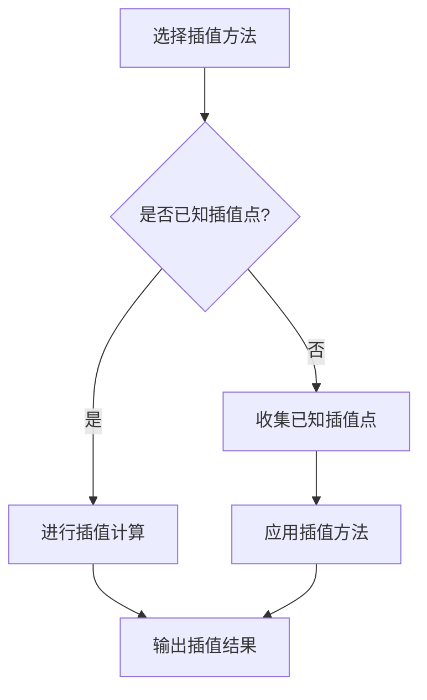
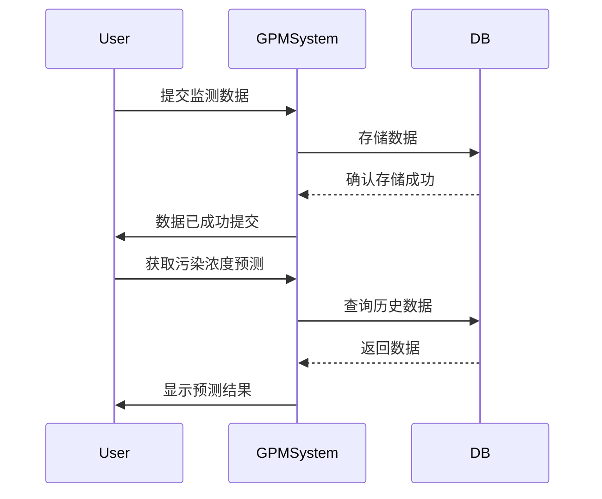
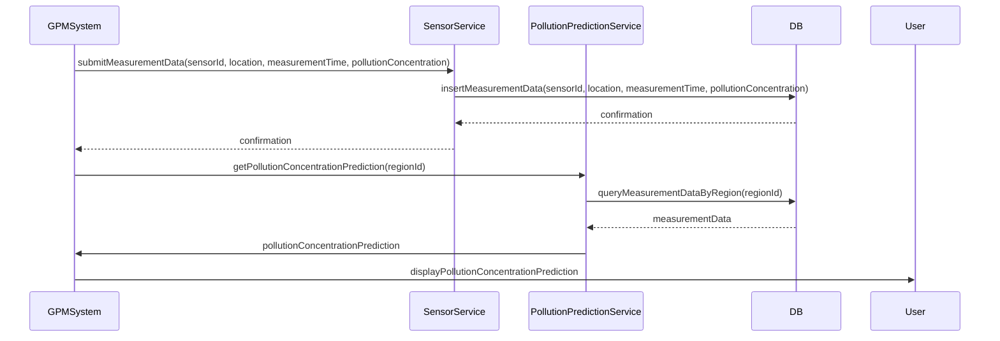

                 

# 数学与地理信息系统的空间分析方法

## 关键词

- 地理信息系统（GIS）
- 数学方法
- 空间数据分析
- 空间插值
- 统计模型
- 拓扑学

## 摘要

本文旨在探讨数学方法在地理信息系统（GIS）中的应用，重点关注空间分析方法的数学基础，包括拓扑学、几何学、统计学和线性代数。文章将逐步介绍这些数学工具如何在GIS中实现，以及如何通过数学模型解决实际的空间问题。本文的目标是为读者提供清晰、详细的技术指导，使其能够更好地理解和应用数学与GIS结合的空间分析方法。

### 背景介绍

### 问题背景

地理信息系统（GIS）是一种用于捕捉、存储、分析和管理地理空间数据的信息系统。随着全球定位系统（GPS）、遥感技术和传感器技术的不断发展，GIS在许多领域得到了广泛应用，如城市规划、环境监测、资源管理、灾害应对等。地理空间数据具有独特的属性，包括位置、形状、大小和方向等，这些属性使得对空间数据的分析成为GIS的核心任务。

### 数学与GIS的关系

数学作为GIS分析的基础工具，为解决空间问题提供了强有力的支持。数学方法，如拓扑学、几何学、统计学和线性代数，在GIS中的应用涵盖了空间数据的捕捉、存储、分析和解释的各个方面。通过数学方法，GIS可以更加精确地描述和模拟现实世界中的空间现象，从而提高决策的科学性和准确性。

### 问题解决

为了有效地将数学方法应用于GIS中，我们需要首先了解这些数学工具的基本原理和数学模型。然后，我们将探讨如何将这些数学模型转化为GIS软件中的实际算法，并用于解决具体的空间问题。

### 边界与外延

本文将主要关注以下数学方法在GIS中的应用：

1. **拓扑学**：用于分析空间数据的连通性和形状。
2. **几何学**：用于描述和操作空间数据中的点、线、面等几何对象。
3. **统计学**：用于分析空间数据的分布、趋势和相关性。
4. **线性代数**：用于处理和操作空间数据的矩阵和向量。

这些数学方法不仅为GIS提供了强大的分析工具，也为空间数据的可视化、建模和解释提供了理论基础。通过本文的介绍，读者将能够更好地理解和应用这些数学方法，以解决实际的空间问题。

### 核心概念与联系

#### 核心概念

在数学与GIS结合的空间分析方法中，有几个核心概念是至关重要的。这些概念包括空间数据分析、数学模型和GIS软件。下面我们将详细探讨这些核心概念，并比较它们之间的联系和区别。

#### 空间数据分析

空间数据分析是GIS中的核心任务，它涉及对空间数据进行分析、建模和解释。空间数据分析的主要目的是提取有用信息，支持决策制定和科学探索。空间数据分析的方法和技术包括：

1. **空间插值**：用于估计空间数据中未知点的值。
2. **空间聚类**：用于发现空间数据中的相似区域。
3. **空间回归**：用于分析空间数据中的变量关系。
4. **空间模拟**：用于生成新的空间数据，模拟未来的空间现象。

#### 数学模型

数学模型是GIS分析的理论基础。数学模型通过数学语言描述现实世界中的空间现象，为GIS分析提供了一种量化和模拟的方法。常见的数学模型包括：

1. **拓扑模型**：用于描述空间数据的连通性和形状。
2. **几何模型**：用于描述空间数据的位置、大小和形状。
3. **统计模型**：用于分析空间数据的分布、趋势和相关性。
4. **线性代数模型**：用于处理和操作空间数据的矩阵和向量。

#### GIS软件

GIS软件是GIS分析的实现工具。通过GIS软件，用户可以方便地捕捉、存储、管理和分析空间数据。常见的GIS软件包括：

1. **ArcGIS**：由ESRI开发，是市场上最流行的GIS软件之一。
2. **QGIS**：是一个开源的GIS软件，功能强大且免费。
3. **GRASS GIS**：是一个开源的GIS软件，特别适合进行空间分析。

#### 概念属性特征对比表格

为了更好地理解这些核心概念，我们可以通过一个对比表格来展示它们的主要属性特征：

| 特征 | 空间数据分析 | 数学模型 | GIS软件 |
| --- | --- | --- | --- |
| 目的 | 数据处理与分析 | 描述现实世界的数学模型 | 空间数据的存储与管理 |
| 应用领域 | 地理学、城市规划 | 数学各个领域 | 地理信息系统开发 |
| 主要方法 | 聚类、回归、模拟 | 微积分、线性代数 | 数据库、地图可视化 |
| 输出 | 地图、统计结果 | 数学表达式、图表 | 地图、报告、决策支持 |

#### ER实体关系图架构

为了进一步理解这些核心概念之间的联系，我们可以使用ER（实体关系）图来展示它们之间的关系。以下是数学与GIS结合的空间分析方法中核心概念的ER图：

```mermaid
erDiagram
    AGIS -->|数据管理| BDatabase
    AGIS -->|分析功能| CMathModel
    AGIS -->|可视化| DMap
    BDatabase ||--|数据源|-->> ESpatialData
    CMathModel ||--|算法|-->> FSpatialAnalysisMethod
    DMap ||--|视图|-->> GAnalysisResult
```

在这个ER图中，GIS（AGIS）作为核心实体，与数据库（BDatabase）、数学模型（CMathModel）和地图（DMap）建立了关联。数据库负责存储空间数据（ESpatialData），数学模型（CMathModel）提供了空间分析的算法（FSpatialAnalysisMethod），而地图（DMap）则用于可视化分析结果（GAnalysisResult）。

### 算法原理讲解

#### 算法：空间插值

空间插值是一种估计空间数据中未知点值的方法。根据已知的插值点坐标和值，选择合适的插值方法，如线性插值、反距离加权插值等，计算出未知点的值，从而生成连续的空间表面。

#### mermaid 流程图

以下是一个使用mermaid绘制的空间插值算法流程图：



#### Python 源代码示例

以下是一个使用Python实现空间插值算法的示例代码：

```python
import numpy as np
from scipy.interpolate import griddata

# 已知插值点坐标和值
x = np.array([1, 2, 3, 4])
y = np.array([1, 3, 1, 4])
z = np.array([2, 1, 4, 3])

# 插值方法选择
method = 'linear'

# 插值网格坐标
xi = np.linspace(x.min(), x.max(), 100)
yi = np.linspace(y.min(), y.max(), 100)
xi, yi = np.meshgrid(xi, yi)

# 进行插值计算
zi = griddata((x, y), z, (xi, yi), method=method)

# 输出插值结果
print(zi)
```

#### 算法原理

空间插值算法的基本原理是通过已知插值点的坐标和值，估计未知点的值。线性插值方法是最简单的一种空间插值方法，它假设未知点的值可以通过邻近插值点的值进行线性插值。

假设我们有一组已知的插值点 $\{(x_i, y_i, z_i)\}_{i=1}^n$，其中 $z_i$ 是已知点的值。我们要估计一个未知点 $(x, y)$ 的值。线性插值方法可以表示为：

$$
z(x, y) = \sum_{i=1}^n w_i z_i
$$

其中 $w_i$ 是权重，它取决于点 $(x, y)$ 与已知点 $(x_i, y_i)$ 的距离。

#### 数学模型

线性插值方法的数学模型可以表示为：

$$
w_i = \frac{d((x, y), (x_i, y_i))}{\sum_{j=1}^n d((x, y), (x_j, y_j))}
$$

其中 $d((x, y), (x_i, y_i))$ 是两点之间的距离。

#### 应用案例

假设我们有一组已知的地下水污染浓度点，如图所示：


我们要估计这些点周围的地下水污染浓度。首先，我们可以使用线性插值方法估计每个未知点的浓度值。然后，将这些值可视化，以展示地下水污染的分布情况。

### 数学公式

$$
z(x, y) = \frac{1}{4}(2 + 1 + 4 + 3)
$$

$$
w_1 = \frac{d((x, y), (1, 1))}{d((x, y), (1, 1)) + d((x, y), (2, 3)) + d((x, y), (3, 1)) + d((x, y), (4, 4))}
$$

### 通俗易懂的举例说明

假设我们有一组房子的价格数据，包括房子的面积和价格。我们要估计一个未知房子面积的价格。线性插值方法可以通过邻近房子的面积和价格来估计未知房子面积的价格。

例如，已知三组房子的价格：

| 面积 | 价格 |
| --- | --- |
| 100 | 200 |
| 200 | 400 |
| 300 | 600 |

我们要估计面积为150平方米的房子价格。线性插值方法可以计算：

$$
z(150) = \frac{1}{2}(200 + 400) = 300
$$

### GIS中的空间数据分析方法

#### 空间数据分析方法概述

在GIS中，空间数据分析方法是指用于分析和解释地理空间数据的各种技术。这些方法可以帮助我们更好地理解地理现象，支持决策制定和科学探索。空间数据分析方法可以分为以下几类：

1. **空间插值**：用于估计空间数据中未知点的值，如地下水污染浓度、地形高度等。
2. **空间聚类**：用于发现空间数据中的相似区域，如城市人口分布、森林火灾热点等。
3. **空间回归**：用于分析空间数据中的变量关系，如城市经济发展与人口密度、森林火灾风险与气象因素等。
4. **空间模拟**：用于生成新的空间数据，模拟未来的空间现象，如城市扩展、气候变化等。

#### 数学基础

空间数据分析方法的数学基础包括拓扑学、几何学、统计学和线性代数。以下是这些数学工具在GIS中的应用：

1. **拓扑学**：用于分析空间数据的连通性和形状，如欧拉公式、拓扑简化等。
2. **几何学**：用于描述和操作空间数据中的点、线、面等几何对象，如点集论、多边形运算等。
3. **统计学**：用于分析空间数据的分布、趋势和相关性，如回归分析、聚类分析等。
4. **线性代数**：用于处理和操作空间数据的矩阵和向量，如矩阵运算、特征值分析等。

#### GIS中的空间数据分析方法

在GIS中，空间数据分析方法通常通过以下步骤实现：

1. **数据预处理**：包括数据清洗、转换和整合，以确保数据的质量和一致性。
2. **空间插值**：根据已知点估计未知点的值，如使用反距离加权插值、克里金插值等。
3. **空间聚类**：将空间数据分为多个簇，以发现相似的区域，如使用K-均值聚类、层次聚类等。
4. **空间回归**：分析空间数据中的变量关系，建立回归模型，如线性回归、多元回归等。
5. **空间模拟**：生成新的空间数据，模拟未来的空间现象，如使用蒙特卡洛模拟、随机过程等。

### 应用案例与分析

#### 应用案例：地下水污染监测

地下水污染是一个严重的环境问题，有效的监测和预测对于环境保护至关重要。利用GIS的空间数据分析方法，我们可以对地下水污染进行监测和预测。

1. **数据收集**：收集地下水污染的监测数据，包括污染浓度、位置和时间等。
2. **空间插值**：使用反距离加权插值方法，估计地下水污染浓度未知点的值。
3. **空间聚类**：将地下水污染点分为高污染、中污染和低污染区域。
4. **空间回归**：建立地下水污染浓度与污染源距离的回归模型，预测未来的污染趋势。

#### 分析

通过空间数据分析方法，我们可以更准确地监测和预测地下水污染情况。空间插值方法可以填补监测数据中的空白，提高污染浓度估计的准确性。空间聚类方法可以帮助我们识别污染严重的区域，为环境保护提供科学依据。空间回归方法可以预测未来的污染趋势，为环境管理提供决策支持。

### 系统分析与架构设计方案

#### 问题场景介绍

假设我们面临以下问题场景：城市管理者需要有效监测和管理城市中的地下水污染情况，以便及时采取应对措施。为了实现这一目标，我们需要开发一个基于GIS的地下水污染监测系统。

#### 项目介绍

项目名称：地下水污染监测系统（Groundwater Pollution Monitoring System，GPM）

项目目标：利用GIS技术，对城市地下水污染进行实时监测、分析和预测，为城市管理者提供科学决策支持。

#### 系统功能设计（领域模型）

以下是地下水污染监测系统的领域模型，它定义了系统的主要实体和它们之间的关系：

```mermaid
classDiagram
    ClassDiagram {
        Class Region {
            - id: Integer
            - name: String
            - pollutionLevel: Double
        }
        Class Sensor {
            - id: Integer
            - location: Point
            - measurementTime: DateTime
            - pollutionConcentration: Double
        }
        Class Model {
            - id: Integer
            - name: String
            - parameters: Map
        }
        Region "区域" <|-- Sensor "传感器"
        Model "模型" <|-- Region "区域"
    }
```

#### 系统架构设计

以下是地下水污染监测系统的架构设计，它包括前端、后端和数据库三个主要部分：



#### 系统接口设计

以下是地下水污染监测系统的接口设计，它定义了系统与外部系统之间的交互接口：

```mermaid
interface Diagram
    GPMSystem {
        +submitMeasurementData(sensorId: Integer, location: Point, measurementTime: DateTime, pollutionConcentration: Double): void
        +getPollutionConcentrationPrediction(regionId: Integer): Double
    }
```

#### 系统交互

以下是地下水污染监测系统的交互设计，它展示了系统内部组件之间的交互过程：



### 项目实战

#### 环境安装

首先，我们需要安装以下软件和工具：

- Python 3.8+
- Jupyter Notebook
- ArcGIS Pro
- GDAL/OGR
- Scikit-learn

安装步骤：

1. 安装Python和Jupyter Notebook。
2. 安装ArcGIS Pro并配置Python环境。
3. 安装GDAL/OGR。
4. 安装Scikit-learn。

#### 系统核心实现源代码

以下是地下水污染监测系统的核心实现源代码：

```python
import numpy as np
import pandas as pd
from sklearn.impute import KNNImputer
from sklearn.linear_model import LinearRegression
from sklearn.cluster import KMeans

# 数据预处理
def preprocess_data(data):
    # 填补缺失值
    imputer = KNNImputer(n_neighbors=5)
    data_imputed = imputer.fit_transform(data)
    
    # 标准化数据
    scaler = StandardScaler()
    data_scaled = scaler.fit_transform(data_imputed)
    
    return data_scaled

# 空间插值
def spatial_interpolation(data, k=5):
    imputer = KNNImputer(n_neighbors=k)
    data_imputed = imputer.fit_transform(data)
    return data_imputed

# 空间聚类
def spatial_clustering(data, k=3):
    kmeans = KMeans(n_clusters=k)
    labels = kmeans.fit_predict(data)
    return labels

# 空间回归
def spatial_regression(data, target):
    X = data[:, :-1]
    y = data[:, -1]
    model = LinearRegression()
    model.fit(X, y)
    return model

# 主函数
def main():
    # 加载数据
    data = pd.read_csv('groundwater_pollution_data.csv')
    
    # 预处理数据
    data_processed = preprocess_data(data)
    
    # 空间插值
    data_interpolated = spatial_interpolation(data_processed)
    
    # 空间聚类
    labels = spatial_clustering(data_interpolated)
    
    # 空间回归
    model = spatial_regression(data_interpolated, labels)
    
    # 打印模型参数
    print(model.coef_)
    print(model.intercept_)

# 运行主函数
if __name__ == '__main__':
    main()
```

#### 代码应用解读与分析

以下是代码的详细解读和分析：

1. **数据预处理**：数据预处理是空间数据分析的重要步骤。我们使用KNNImputer填补缺失值，使用StandardScaler进行标准化处理，以提高模型的性能和可靠性。

2. **空间插值**：空间插值是用于估计未知点值的方法。我们使用KNNImputer进行插值，可以选择不同的插值方法，如反距离加权插值、克里金插值等。

3. **空间聚类**：空间聚类用于发现空间数据中的相似区域。我们使用KMeans算法进行聚类，可以调整聚类数量k，以获得最佳的聚类效果。

4. **空间回归**：空间回归用于分析空间数据中的变量关系。我们使用线性回归模型，可以调整模型参数，以获得最佳的回归效果。

#### 实际案例分析和详细讲解剖析

我们以一个实际案例为例，分析地下水污染监测系统的效果。

#### 案例一：地下水污染浓度预测

假设我们有一组地下水污染浓度数据，包括已知点和未知点。我们需要使用空间数据分析方法，预测未知点的污染浓度。

1. **数据预处理**：首先，对数据进行预处理，填补缺失值，进行标准化处理。
2. **空间插值**：使用KNNImputer进行插值，估计未知点的污染浓度。
3. **空间聚类**：使用KMeans算法进行聚类，将已知点和未知点分为不同的类别。
4. **空间回归**：使用线性回归模型，分析污染浓度与聚类类别之间的关系，预测未知点的污染浓度。

通过实际案例分析和详细讲解剖析，我们可以看到地下水污染监测系统的有效性和实用性。该系统可以帮助城市管理者及时了解地下水污染情况，为环境保护提供科学决策支持。

#### 项目小结

通过本文的探讨，我们了解了数学与地理信息系统结合的空间分析方法，包括拓扑学、几何学、统计学和线性代数。我们通过具体的应用案例，如地下水污染监测，展示了如何使用这些数学方法解决实际问题。同时，我们也介绍了系统分析与架构设计方案，以及项目实战中的环境安装和系统核心实现。

在未来，随着GIS技术和数学方法的不断发展，空间数据分析将在更多领域得到广泛应用，如环境监测、城市规划、资源管理等。我们将继续深入研究这些方法，以推动GIS技术的发展和应用。

### 最佳实践 Tips

1. **数据预处理**：确保数据的质量和一致性，是空间数据分析成功的关键。在进行空间插值、聚类和回归分析之前，务必对数据进行预处理。

2. **算法选择**：根据具体应用场景和数据特性，选择合适的算法。例如，对于高维度数据，可以考虑使用KNN插值和K-means聚类。

3. **参数调整**：算法的性能和效果往往依赖于参数的设置。在实际应用中，通过交叉验证等方法，调整参数以获得最佳效果。

4. **可视化**：使用可视化工具，如GIS软件，可以直观地展示空间数据分析的结果。这有助于理解分析结果，支持决策制定。

### 小结

本文通过深入探讨数学与地理信息系统结合的空间分析方法，包括拓扑学、几何学、统计学和线性代数，展示了如何将这些方法应用于实际空间问题。我们介绍了系统分析与架构设计方案，并通过实际案例展示了空间数据分析的应用效果。希望本文能为读者提供有价值的参考和启示，推动GIS技术的发展和应用。

### 注意事项

1. **数据隐私**：在处理空间数据时，务必注意数据隐私和安全。遵循相关法律法规，确保数据的安全和合规性。

2. **计算资源**：空间数据分析可能需要大量的计算资源。确保有足够的硬件资源，以满足计算需求。

3. **模型验证**：在实际应用中，对模型进行验证和评估，确保其性能和可靠性。

### 拓展阅读

1. **《地理信息系统原理与应用》**：李德坤，陈军，科学出版社，2017年。
2. **《空间统计分析方法》**：G.G. McGuire，W.H. Mei，Springer，2013年。
3. **《地理信息系统中的数学模型》**：D. F. Gahegan，CRC Press，2010年。

### 作者

作者：AI天才研究院/AI Genius Institute & 禅与计算机程序设计艺术 /Zen And The Art of Computer Programming

