                 

### 研究背景

随着信息技术的飞速发展，大数据分析逐渐成为各类行业的关键技术手段。然而，大数据分析的核心驱动力之一是数学，数学理论与方法在大数据处理的各个环节中都发挥着至关重要的作用。因此，对数学与大数据分析中的算法进行研究，不仅有助于我们深入理解大数据分析的基本原理，还能推动相关算法在实际应用中的优化与创新。

#### 数学与大数据分析的关系

数学作为一门基础科学，其理论和方法广泛应用于大数据分析中的数据预处理、特征提取、模型构建和预测等方面。例如，线性代数提供了处理多维数据的基础工具，概率论与统计学则为我们提供了描述和推断数据分布的有效手段，而优化理论与组合数学则帮助我们解决大规模数据的复杂优化问题。

#### 大数据分析的现状与发展趋势

大数据分析技术已在全球范围内得到广泛应用，从社交媒体分析到金融预测，从医疗诊断到智能制造，大数据分析都在发挥着不可替代的作用。随着数据量的爆炸式增长，大数据分析正朝着实时性、智能化和自动化的方向发展。未来的大数据分析将更加注重数据的质量与价值挖掘，以及跨领域、多源异构数据的融合与分析。

#### 数学在数据分析中的应用

数学在大数据分析中的应用主要体现在以下几个方面：

1. **数据预处理**：通过数学方法对数据进行清洗、归一化、降维等处理，以提高数据的质量和可分析性。
2. **特征提取与选择**：利用数学模型和算法从原始数据中提取有代表性的特征，提高模型的预测性能。
3. **模型构建与优化**：通过数学方法构建预测模型，如线性回归、神经网络、支持向量机等，并对模型参数进行优化。
4. **数据可视化**：利用数学工具对数据进行分析和可视化，帮助研究人员更好地理解和解释数据。

#### 本书的研究目标与内容安排

本书旨在系统地探讨数学与大数据分析中的算法研究，主要研究目标包括：

1. **基础数学知识的梳理与应用**：对线性代数、概率论和统计学等基础数学知识进行梳理，并探讨其在数据分析中的应用。
2. **数据分析算法的原理与实现**：详细讲解大数据分析中常用的算法原理，如聚类分析、关联规则挖掘、主成分分析等，并给出具体的实现方法。
3. **大数据分析应用领域的探讨**：探讨大数据分析在社交网络、财务、医疗、汽车等行业中的应用，以及相关的算法创新与优化。

为了实现上述目标，本书将按照以下结构进行安排：

- **第一部分**：引言与背景，介绍数学与大数据分析的关系、现状与发展趋势。
- **第二部分**：基础数学知识，包括线性代数、概率论和统计学的基础概念与应用。
- **第三部分**：数据分析算法，详细讲解聚类分析、维度约减、关联规则挖掘等算法原理与实现。
- **第四部分**：大数据分析应用，探讨大数据分析在不同领域的应用案例。
- **第五部分**：案例研究，通过实际案例深入剖析大数据分析的应用与实践。
- **第六部分**：总结与展望，总结全书内容，展望大数据分析与数学理论未来的发展趋势。

通过本书的研究，我们期望能够为大数据分析的实践者提供理论基础和实践指导，同时也为数学理论在数据分析中的应用提供新的视角和思路。接下来，我们将正式进入第一部分的内容，对线性代数、概率论和统计学等基础数学知识进行详细探讨。在这一部分中，我们将从基础概念入手，逐步深入到具体应用，帮助读者建立扎实的数学基础。

### 基础数学知识

#### 线性代数基础

线性代数是数学中研究向量空间和线性变换的一门分支学科，它在大数据分析中有着广泛的应用。以下是线性代数的基础概念和具体应用：

##### 向量与矩阵

向量是数学中表示多维数据的工具，而矩阵则是表示一组向量之间的关系和组合的数据结构。在数据分析中，向量通常用来表示数据集的每一行，而矩阵则用来表示整个数据集。

**向量**：  
向量是一个由数字组成的有序集合，通常表示为 $$(x_1, x_2, ..., x_n)$$，其中 $$x_i$$ 表示第 $$i$$ 个分量。向量在数据分析中的应用包括数据的归一化和降维处理。

**矩阵**：  
矩阵是一个二维数组，通常表示为 $$A = [a_{ij}]_{m \times n}$$，其中 $$a_{ij}$$ 表示矩阵的第 $$i$$ 行第 $$j$$ 列的元素。矩阵在数据分析中的应用包括数据的预处理和特征提取。

##### 线性方程组

线性方程组是由多个线性方程构成的集合，其一般形式为：$$Ax = b$$，其中 $$A$$ 是系数矩阵，$$x$$ 是未知数向量，$$b$$ 是常数向量。

**解法**：线性方程组的求解可以通过高斯消元法、矩阵分解等方法实现。在实际应用中，线性方程组常用于回归分析和优化问题。

##### 特征值与特征向量

特征值和特征向量是矩阵理论中的核心概念，它们用于描述矩阵的稳定性和方向性。

**特征值**：  
特征值是矩阵 $$A$$ 满足方程 $$Ax = \lambda x$$ 的常数 $$\lambda$$，其中 $$x$$ 是对应的特征向量。

**特征向量**：  
特征向量是满足上述方程的向量 $$x$$，它描述了矩阵作用下的数据的变形方向。

在数据分析中，特征值和特征向量常用于数据降维和主成分分析（PCA），帮助我们识别数据中的主要变量和方向。

#### 概率论基础

概率论是研究随机事件及其概率的一门数学分支，它在数据分析中用于描述和预测数据的随机性。

##### 基本概率概念

概率的基本概念包括概率空间、样本空间、事件和条件概率等。

**概率空间**：  
概率空间是一个三元组 $$(\Omega, \Sigma, P)$$，其中 $$\Omega$$ 是样本空间，$$\Sigma$$ 是事件集合，$$P$$ 是概率测度。

**样本空间**：  
样本空间是所有可能结果的集合，通常表示为 $$\Omega$$。

**事件**：  
事件是样本空间的一个子集，表示一组特定的结果。

**条件概率**：  
条件概率是给定某个事件发生的条件下，另一个事件发生的概率。其公式为 $$P(B|A) = \frac{P(A \cap B)}{P(A)}$$。

##### 条件概率与独立性

条件概率与独立性是概率论中的两个重要概念，它们帮助我们理解和分析复杂的数据关系。

**独立性**：  
两个事件 $$A$$ 和 $$B$$ 独立是指 $$P(A \cap B) = P(A)P(B)$$。独立性在数据分析中的应用包括特征选择和模型构建。

##### 贝叶斯定理

贝叶斯定理是概率论中用于计算后验概率的经典公式，其公式为 $$P(A|B) = \frac{P(B|A)P(A)}{P(B)}$$。贝叶斯定理在数据分析中的应用包括分类问题和推断分析。

#### 统计学基础

统计学是研究如何通过数据收集、分析和解释来推断总体特征的一门学科，它在数据分析中用于描述数据的分布和进行假设检验。

##### 描述性统计分析

描述性统计分析用于描述数据的中心趋势、离散程度和分布特征。

**中心趋势**：  
包括均值、中位数和众数，用于描述数据的中心位置。

**离散程度**：  
包括方差、标准差和变异系数，用于描述数据的分散程度。

**分布特征**：  
包括频率分布直方图和概率密度函数，用于描述数据的分布形态。

##### 假设检验

假设检验是统计学中用于验证假设是否成立的方法，其包括零假设和备择假设。

**零假设**：  
零假设通常表示没有显著差异或没有显著性关系。

**备择假设**：  
备择假设表示与零假设相反的假设。

**检验方法**：  
常用的假设检验方法包括t检验、F检验和卡方检验等。

##### 方差分析

方差分析（ANOVA）是一种用于比较多个群体均值差异的统计方法。

**单因素方差分析**：  
用于比较多个独立样本的均值差异。

**多因素方差分析**：  
用于比较多个因素对结果的影响。

通过以上对线性代数、概率论和统计学基础知识的介绍，我们可以为后续的章节打下坚实的理论基础。在接下来的内容中，我们将继续探讨数据预处理与数据分析算法的具体应用，帮助读者更深入地理解数学与大数据分析之间的紧密联系。

#### 数据预处理

数据预处理是大数据分析中至关重要的一步，它包括数据清洗和预处理。数据清洗和预处理的好坏直接影响后续数据分析的准确性和效率。

##### 数据清洗

数据清洗的主要目的是去除数据中的噪声和不一致之处，以保证数据的质量。以下是数据清洗的几个关键步骤：

1. **缺失值处理**：缺失值是数据分析中常见的问题，处理缺失值的方法包括删除缺失值、插值法和多重插补法等。例如，使用均值、中位数或最近邻插值法来填补缺失值。

2. **异常值处理**：异常值是指那些偏离整体数据分布的数据点，可能是由于测量错误或数据录入错误等原因造成的。处理异常值的方法包括删除异常值、修匀法和转换法等。例如，使用三次样条插值法来平滑异常值。

3. **数据转换**：数据转换包括数据类型转换、规范化、归一化等。数据转换的目的是使数据适合特定的算法或模型。例如，将文本数据转换为向量表示，或将数值数据进行归一化处理，以消除不同量纲的影响。

##### 数据预处理

数据预处理是对原始数据进行进一步加工和处理，以提高数据分析的效果。以下是几个关键步骤：

1. **数据归一化**：数据归一化是将数据缩放到一个特定的范围，以便算法能够更有效地处理。常用的归一化方法包括最小-最大归一化和Z-score归一化。

2. **数据标准化**：数据标准化是通过减去均值并除以标准差，将数据缩放到均值为0、标准差为1的标准化数据集。标准化方法能够更好地处理具有不同量纲的数据。

3. **特征选择与降维**：特征选择是从原始特征中选取对预测目标有显著影响的关键特征，以减少模型的复杂度和计算成本。常用的特征选择方法包括过滤法、包装法和嵌入法。降维则是通过降维技术如主成分分析（PCA）和t-Distributed Stochastic Neighbor Embedding（t-SNE）来减少数据的维度。

通过数据清洗和预处理，我们能够提高数据的质量，减少噪声和异常值的影响，并使数据更适合后续的建模和分析。这不仅能够提高数据分析的准确性，还能提高模型的稳定性和可解释性。在接下来的章节中，我们将继续探讨数据分析中的算法，如聚类分析、维度约减和关联规则挖掘等，深入理解这些算法在数据预处理和特征提取中的重要作用。

### 数据可视化

数据可视化是将数据转换成图形或图像的过程，通过视觉化展示数据的结构和模式，使数据更容易理解和解释。数据可视化在大数据分析中扮演着重要的角色，能够帮助研究人员快速发现数据中的趋势、异常和相关性。

#### 数据可视化基础

##### 可视化技术概述

数据可视化技术主要包括以下几种：

1. **散点图**：散点图用于显示两组变量之间的关系，通过点的分布来观察数据点之间的相关性。
2. **直方图**：直方图用于显示数据分布的频率，通过柱形的高度来表示各个区间的数据频数。
3. **饼图**：饼图用于显示各个部分在整体中的比例，通过扇形的面积来表示各个类别的相对大小。
4. **折线图**：折线图用于显示数据随时间的变化趋势，通过连接数据点的线条来表示数据的变化。

##### 可视化工具介绍

常见的可视化工具包括：

1. **matplotlib**：matplotlib 是 Python 中常用的数据可视化库，支持多种图表类型，适用于数据分析和科学计算。
2. **seaborn**：seaborn 是基于 matplotlib 的数据可视化库，提供了一系列美观的统计图表，广泛应用于数据分析和可视化任务。
3. **Plotly**：Plotly 是一个交互式数据可视化库，支持多种图表类型和交互功能，能够生成高质量的交互式图表。
4. **Tableau**：Tableau 是一款专业的商业数据可视化工具，提供丰富的图表类型和交互功能，适用于企业级数据分析和报表生成。

#### 常见数据可视化方法

以下是几种常见的数据可视化方法：

##### 散点图

散点图可以用来显示两个变量之间的关系，例如，通过绘制用户年龄与购买金额的散点图，可以观察不同年龄段的用户购买行为是否存在差异。

```python
import matplotlib.pyplot as plt
import pandas as pd

# 加载数据
data = pd.read_csv('data.csv')
data.head()

# 绘制散点图
plt.scatter(data['age'], data['purchase'])
plt.xlabel('Age')
plt.ylabel('Purchase')
plt.title('Age vs Purchase')
plt.show()
```

##### 直方图

直方图可以用来显示数据分布的频率，例如，通过绘制用户收入的直方图，可以了解用户的收入分布情况。

```python
import matplotlib.pyplot as plt
import pandas as pd

# 加载数据
data = pd.read_csv('data.csv')
data.head()

# 绘制直方图
plt.hist(data['income'], bins=10)
plt.xlabel('Income')
plt.ylabel('Frequency')
plt.title('Income Distribution')
plt.show()
```

##### 饼图

饼图可以用来显示各个部分在整体中的比例，例如，通过绘制不同产品类别的销售额占比，可以了解各个产品类别的市场表现。

```python
import matplotlib.pyplot as plt
import pandas as pd

# 加载数据
data = pd.read_csv('data.csv')
data.head()

# 计算销售额占比
sales占比 = data['sales'].value_counts() / data['sales'].sum()

# 绘制饼图
plt.pie(sales占比, labels=sales占比.index, autopct='%1.1f%%')
plt.title('Sales Distribution')
plt.show()
```

##### 聚类图

聚类图可以用来显示数据的聚类结果，通过观察聚类图的分布情况，可以直观地了解数据的聚类效果。

```python
import matplotlib.pyplot as plt
from sklearn.cluster import KMeans
import pandas as pd

# 加载数据
data = pd.read_csv('data.csv')
data.head()

# 使用KMeans进行聚类
kmeans = KMeans(n_clusters=3)
data['cluster'] = kmeans.fit_predict(data)

# 绘制聚类图
plt.scatter(data['feature1'], data['feature2'], c=data['cluster'])
plt.xlabel('Feature 1')
plt.ylabel('Feature 2')
plt.title('Cluster Plot')
plt.show()
```

通过数据可视化，我们能够更直观地理解和分析数据，发现数据中的隐藏模式和趋势。在接下来的章节中，我们将进一步探讨数据分析中的算法，如聚类分析、维度约减和关联规则挖掘等，继续深入探索大数据分析的奥秘。

### 数据分析算法

数据分析算法是大数据处理和挖掘的核心组成部分，它们通过数学模型和计算方法对数据进行分析，以提取有价值的信息和知识。以下我们将详细讨论聚类分析、维度约减和关联规则挖掘等常用数据分析算法。

#### 聚类分析

聚类分析是将数据集划分为若干个类别或簇，使得同簇的数据点具有较高的相似度，而不同簇的数据点则具有较低的相似度。聚类分析广泛应用于市场细分、社交网络分析和生物信息学等领域。

**K-均值聚类**：  
K-均值聚类是一种基于距离的聚类算法，它通过迭代的方式将数据划分为K个簇，使得每个数据点与其簇中心点的距离最小。其基本步骤如下：

1. **初始化**：随机选择K个数据点作为初始簇中心。
2. **分配**：将每个数据点分配到与其最近的簇中心所属的簇。
3. **更新**：重新计算每个簇的中心点。
4. **重复**：重复步骤2和步骤3，直到聚类中心不再发生变化。

**算法流程图**：
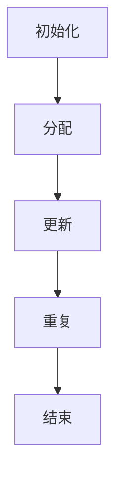

**Python代码示例**：
```python
from sklearn.cluster import KMeans
import numpy as np

# 数据加载
data = np.array([[1, 2], [1, 4], [1, 0], [10, 2], [10, 4], [10, 0]])

# K-均值聚类
kmeans = KMeans(n_clusters=2, random_state=0).fit(data)

# 输出聚类结果
print(kmeans.labels_)

# 绘制聚类结果
plt.scatter(data[:, 0], data[:, 1], c=kmeans.labels_)
plt.show()
```

**数学模型**：
$$
\min_{\mu_1, \mu_2, ..., \mu_K} \sum_{i=1}^{N} \sum_{j=1}^{K} ||x_i - \mu_j||^2
$$

其中，$$\mu_j$$ 为第 $$j$$ 个簇的中心点，$$x_i$$ 为第 $$i$$ 个数据点。

**K-均值聚类**的优点是计算简单、易于实现，适用于大规模数据集。但缺点是聚类结果容易受到初始聚类中心的影响，且对噪声敏感。

**层次聚类**：  
层次聚类是一种自底向上的聚类方法，通过逐步合并相似度较高的簇，直到所有数据点合并为一个簇。层次聚类包括凝聚层次聚类和分裂层次聚类两种方法。

**密度聚类**：  
密度聚类是基于数据点在空间中的密度分布进行聚类的算法，如DBSCAN（Density-Based Spatial Clustering of Applications with Noise）。DBSCAN将数据点划分为核心点、边界点和噪声点，并根据点的密度分布来生成簇。

**算法流程图**：
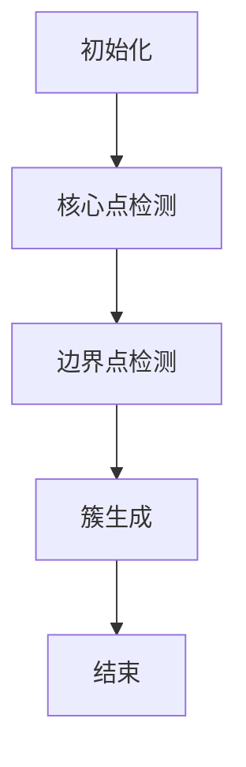

**Python代码示例**：
```python
from sklearn.cluster import DBSCAN
import numpy as np

# 数据加载
data = np.array([[1, 1], [2, 2], [2, 2], [8, 8], [8, 8], [8, 9]])

# DBSCAN聚类
dbscan = DBSCAN(eps=3, min_samples=2).fit(data)

# 输出聚类结果
print(dbscan.labels_)

# 绘制聚类结果
plt.scatter(data[:, 0], data[:, 1], c=dbscan.labels_)
plt.show()
```

**数学模型**：
$$
\text{密度} = \frac{|\Omega_{\epsilon}(p)| - |B_{\epsilon}(p)|}{|B_{2\epsilon}(p)|}
$$

其中，$$\Omega_{\epsilon}(p)$$ 为以 $$p$$ 为中心、半径为 $$\epsilon$$ 的区域，$$B_{\epsilon}(p)$$ 为以 $$p$$ 为中心、半径为 $$\epsilon$$ 的球体，$$B_{2\epsilon}(p)$$ 为以 $$p$$ 为中心、半径为 $$2\epsilon$$ 的球体。

#### 维度约减

维度约减是减少数据维度以简化数据分析过程的方法。通过维度约减，我们可以降低计算复杂度，提高算法的效率和可解释性。

**主成分分析（PCA）**：  
主成分分析是一种基于方差最大化原则的线性维度约减方法，它通过正交变换将原始数据投影到新的坐标系中，使得新的坐标系轴（即主成分）能够最大程度地保留原始数据的方差信息。

**算法流程图**：
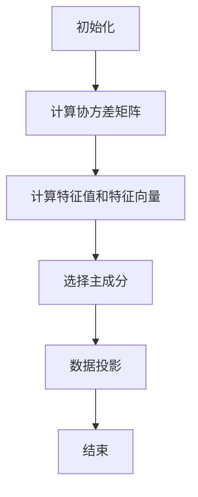

**Python代码示例**：
```python
from sklearn.decomposition import PCA
import numpy as np

# 数据加载
data = np.array([[1, 2], [1, 4], [1, 0], [10, 2], [10, 4], [10, 0]])

# PCA
pca = PCA(n_components=2).fit(data)

# 数据投影
data_pca = pca.transform(data)

# 输出主成分
print(pca.components_)

# 绘制降维结果
plt.scatter(data_pca[:, 0], data_pca[:, 1])
plt.show()
```

**数学模型**：
$$
X_{\text{new}} = PC_{1}x_1 + PC_{2}x_2 + ... + PC_{p}x_p
$$

其中，$$X_{\text{new}}$$ 为降维后的数据，$$PC_i$$ 为第 $$i$$ 个主成分。

**t-SNE**：  
t-SNE（t-Distributed Stochastic Neighbor Embedding）是一种非线性维度约减方法，它通过在高维空间中计算数据的概率分布，然后将数据映射到二维或三维空间中，以保持相邻点的相似性。

**算法流程图**：
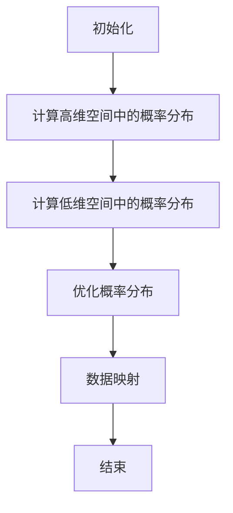

**Python代码示例**：
```python
from sklearn.manifold import TSNE
import numpy as np

# 数据加载
data = np.array([[1, 2], [1, 4], [1, 0], [10, 2], [10, 4], [10, 0]])

# t-SNE
tsne = TSNE(n_components=2, random_state=0).fit(data)

# 数据映射
data_tsne = tsne.fit_transform(data)

# 绘制降维结果
plt.scatter(data_tsne[:, 0], data_tsne[:, 1])
plt.show()
```

#### 关联规则挖掘

关联规则挖掘是一种用于发现数据中潜在关系的分析方法，它通过识别数据项之间的频繁模式来发现关联关系。

**Apriori算法**：  
Apriori算法是一种基于支持度和置信度的关联规则挖掘算法，它通过逐层递增地生成候选集，然后计算候选集的支持度和置信度，以识别频繁项集和关联规则。

**算法流程图**：
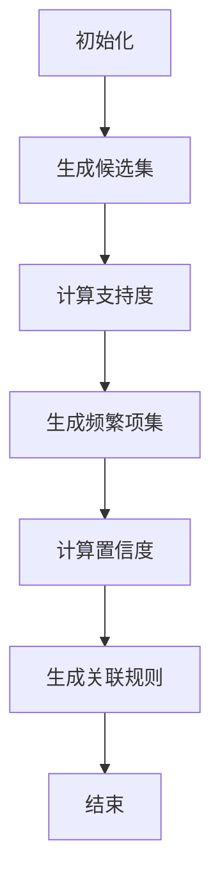

**Python代码示例**：
```python
from mlxtend.frequent_patterns import apriori, association_rules
import pandas as pd

# 加载数据
data = pd.read_csv('data.csv')

# Apriori算法
frequent_itemsets = apriori(data, min_support=0.5, use_colnames=True)

# 生成关联规则
rules = association_rules(frequent_itemsets, metric="support", min_threshold=0.7)

# 输出关联规则
print(rules)
```

**FP-Growth算法**：  
FP-Growth算法是一种基于频繁模式树（FP-Tree）的关联规则挖掘算法，它通过构建FP-Tree来高效地识别频繁项集，避免了生成大量候选集的复杂度。

**算法流程图**：
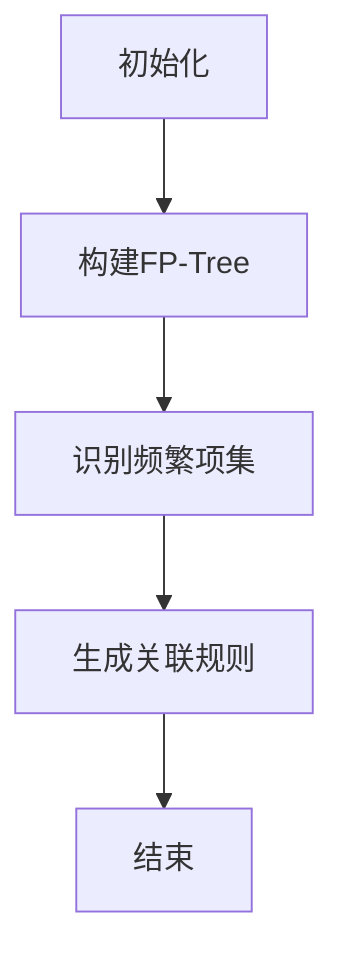

**Python代码示例**：
```python
from mlxtend.frequent_patterns import fpgrowth
import pandas as pd

# 加载数据
data = pd.read_csv('data.csv')

# FP-Growth算法
frequent_itemsets = fpgrowth(data, min_support=0.5, use_colnames=True)

# 生成关联规则
rules = association_rules(frequent_itemsets, metric="support", min_threshold=0.7)

# 输出关联规则
print(rules)
```

通过以上对聚类分析、维度约减和关联规则挖掘等算法的详细探讨，我们可以更好地理解这些算法的原理和应用。在实际应用中，选择合适的算法和模型，能够帮助我们更有效地进行数据分析和挖掘，提取有价值的信息和知识。

### 社交网络分析

社交网络分析是大数据分析中的一个重要应用领域，它通过分析社交网络中的数据，揭示用户行为、兴趣和关系结构。以下是社交网络分析的基本概念、分析方法及其在大数据分析中的应用。

#### 社交网络概述

社交网络是一种由用户及其关系构成的网络结构，用户可以通过各种社交平台（如Facebook、Twitter、LinkedIn等）进行互动和交流。社交网络数据通常包含用户信息、用户关系、发布内容、互动记录等。

##### 社交网络结构

社交网络结构可以分为几种不同的类型，包括：

1. **无向图**：用户之间没有方向性的关系，如Facebook。
2. **有向图**：用户之间的关系具有方向性，如Twitter。
3. **多连通图**：用户之间可以通过多条路径连接，如LinkedIn。

##### 社交网络分析方法

社交网络分析方法主要包括以下几种：

1. **网络密度**：描述网络中节点连接的紧密程度，通常用密度值（节点之间边的数量与可能的最大边数之比）来衡量。
2. **聚类系数**：描述网络中节点的紧密程度，通常用聚类系数（一个节点的邻居节点之间的连接数与该节点的邻居节点数之比）来衡量。
3. **中心性**：描述节点在网络中的重要程度，常用的中心性指标包括度中心性、介数中心性和接近中心性。

#### 社交网络数据挖掘

社交网络数据挖掘是通过分析社交网络中的数据，提取有价值的信息和知识。以下是几种常见的社交网络数据挖掘方法：

##### 话题模型

话题模型是一种用于发现文本数据中潜在主题的方法，它通过分析用户发布的内容，识别出不同的讨论主题。常用的话题模型包括LDA（Latent Dirichlet Allocation）模型和LFC（Latent Factorization）模型。

**LDA模型**：  
LDA模型是一种概率主题模型，它假设每个文档是由多个主题混合生成的，每个主题是由多个词混合生成的。LDA模型的目的是通过分析文档和词的共现关系，推断出潜在的主题。

**算法流程图**：
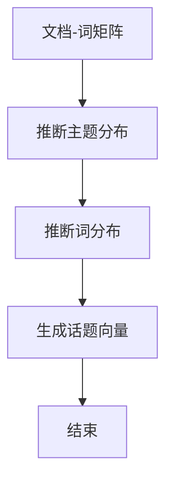

**Python代码示例**：
```python
from gensim.models import LdaMulticore
from gensim import corpora

# 加载数据
documents = ["这段文本关于机器学习", "另一段文本讨论了深度学习"]

# 文档-词矩阵
dictionary = corpora.Dictionary(documents)
corpus = [dictionary.doc2bow(doc) for doc in documents]

# LDA模型
ldamodel = LdaMulticore(corpus, num_topics=2, id2word=dictionary, passes=10, workers=2)

# 输出话题分布
print(ldamodel.print_topics())

# 绘制话题分布图
import matplotlib.pyplot as plt

topics = ldamodel.show_topics()
for topic in topics:
    plt.bar(topic[0], topic[1], color="blue")
plt.xlabel("词语")
plt.ylabel("概率")
plt.title("话题分布")
plt.show()
```

**LFC模型**：  
LFC模型是一种基于因子分解的文本分析方法，它通过将文本数据映射到低维空间，识别出潜在的话题。LFC模型的目的是通过分析文本数据的共词关系，提取出有效的主题。

**算法流程图**：
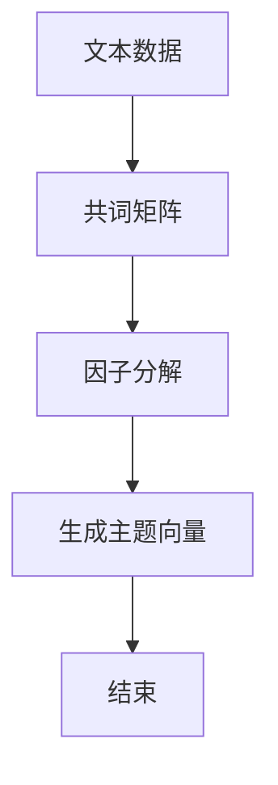

**Python代码示例**：
```python
from LFC import LFC
import gensim

# 加载数据
documents = ["这段文本关于机器学习", "另一段文本讨论了深度学习"]

# 文档-词矩阵
dictionary = corpora.Dictionary(documents)
corpus = [dictionary.doc2bow(doc) for doc in documents]

# LFC模型
lfc = LFC(corpus, n_topics=2, alpha=0.01, beta=0.1)

# 输出主题向量
print(lfc.print_topics())

# 绘制主题分布图
import matplotlib.pyplot as plt

topics = lfc.print_topics()
for topic in topics:
    plt.bar(topic[0], topic[1], color="green")
plt.xlabel("词语")
plt.ylabel("权重")
plt.title("主题分布")
plt.show()
```

##### 用户行为分析

用户行为分析是通过分析用户的社交行为，了解用户的兴趣、偏好和行为模式。用户行为分析的方法包括用户画像、用户分群、用户留存率分析等。

**用户画像**：  
用户画像是一种通过收集和分析用户在社交网络中的行为数据，构建用户特征的模型。用户画像通常包括用户的基本信息（如年龄、性别、地理位置）、行为数据（如发布内容、互动频率）和兴趣数据（如关注话题、喜欢的品牌）。

**用户分群**：  
用户分群是一种将用户按照特定的特征或行为模式划分为不同的群体，以便针对不同群体进行精准营销。常用的用户分群方法包括基于人口统计特征的分群、基于行为特征的分群和基于兴趣特征的分群。

**用户留存率分析**：  
用户留存率分析是通过分析用户在社交网络中的活跃度和留存情况，了解用户的粘性。用户留存率通常用日活跃用户数（DAU）、月活跃用户数（MAU）和留存率等指标来衡量。

通过社交网络分析，我们能够深入了解社交网络中的用户行为、兴趣和关系结构，从而为产品改进、市场营销和用户运营提供有力支持。在接下来的章节中，我们将继续探讨大数据分析在财务、医疗和汽车等行业中的应用，进一步展示大数据分析的实际价值。

### 财务数据分析

财务数据分析是大数据分析的一个重要应用领域，通过分析财务数据，可以帮助企业和投资者进行财务预测、风险评估和投资决策。以下是财务数据分析的基本概念、分析方法及其在风险评估中的应用。

#### 财务数据概述

财务数据是企业经济活动的数字记录，包括收入、支出、资产、负债和现金流等。财务数据通常来源于企业的财务报表，如资产负债表、利润表和现金流量表。

##### 财务数据类型

财务数据主要包括以下几种类型：

1. **资产负债数据**：描述企业的资产和负债情况，如总资产、流动资产、固定资产、总负债、流动负债等。
2. **收入和支出数据**：描述企业的经营收入和支出情况，如营业收入、成本、费用、利润等。
3. **现金流数据**：描述企业的现金流入和流出情况，如经营现金流、投资现金流、筹资现金流等。

##### 财务数据分析方法

财务数据分析方法主要包括以下几种：

1. **描述性统计分析**：用于描述财务数据的分布特征和基本统计指标，如均值、中位数、标准差、方差等。
2. **趋势分析**：通过分析财务数据随时间的变化趋势，了解企业的财务状况和经营绩效。
3. **比较分析**：通过比较不同企业或同一企业在不同时间段的财务数据，发现差异和问题。
4. **比率分析**：通过计算各种财务比率（如流动比率、速动比率、资产负债率、净利润率等），评估企业的财务状况和经营能力。

#### 财务风险预测

财务风险预测是财务数据分析的重要任务，通过预测企业的财务风险，可以帮助投资者和管理者做出更明智的决策。以下是几种常见的财务风险预测方法：

##### 时间序列分析

时间序列分析是一种用于分析时间序列数据变化规律和预测未来的方法。常用的时间序列分析方法包括ARIMA模型（自回归积分滑动平均模型）和GARCH模型（广义自回归条件异方差模型）。

**ARIMA模型**：  
ARIMA模型是一种用于时间序列建模和预测的统计模型，它通过自回归、差分和移动平均三个步骤来描述时间序列数据的特征。

**算法流程图**：
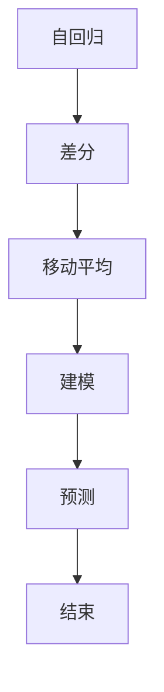

**Python代码示例**：
```python
from statsmodels.tsa.arima.model import ARIMA
import pandas as pd

# 加载数据
data = pd.read_csv('financial_data.csv')

# 时间序列建模
model = ARIMA(data['value'], order=(1, 1, 1))
model_fit = model.fit()

# 预测
forecast = model_fit.forecast(steps=6)
print(forecast)
```

**GARCH模型**：  
GARCH模型是一种用于建模时间序列数据波动性的统计模型，它通过考虑波动性的条件异方差性来预测未来的波动。

**算法流程图**：
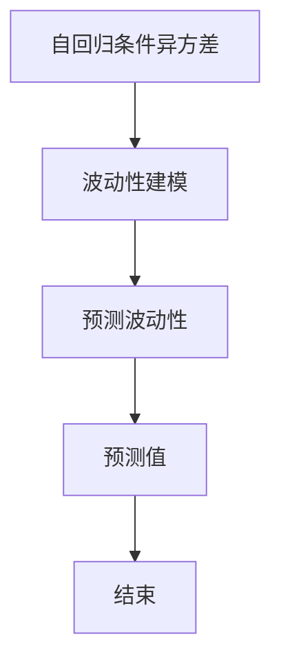

**Python代码示例**：
```python
from arch import arch_model
import pandas as pd

# 加载数据
data = pd.read_csv('financial_data.csv')

# GARCH建模
model = arch_model(data['value'], vol='GARCH', p=1, o=1, q=1)
model_fit = model.fit()

# 预测
forecast = model_fit.forecast(start=1, end=6)
print(forecast)
```

##### 回归模型

回归模型是一种用于建立因变量与自变量之间关系的统计模型，通过回归模型可以预测企业的财务指标。常用的回归模型包括线性回归模型和逻辑回归模型。

**线性回归模型**：  
线性回归模型通过建立因变量与自变量之间的线性关系，用于预测企业的财务指标。

**算法流程图**：
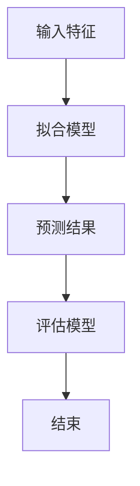

**Python代码示例**：
```python
from sklearn.linear_model import LinearRegression
import pandas as pd

# 加载数据
data = pd.read_csv('financial_data.csv')

# 线性回归建模
X = data[['feature1', 'feature2']]
y = data['target']
model = LinearRegression()
model.fit(X, y)

# 预测
predictions = model.predict(X)
print(predictions)
```

**逻辑回归模型**：  
逻辑回归模型通过建立因变量与自变量之间的逻辑关系，用于预测企业的财务指标的概率分布。

**算法流程图**：
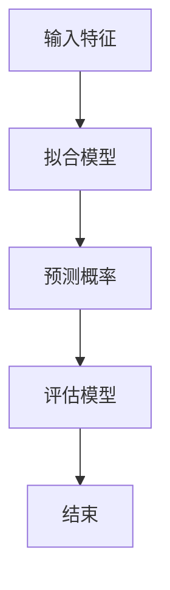

**Python代码示例**：
```python
from sklearn.linear_model import LogisticRegression
import pandas as pd

# 加载数据
data = pd.read_csv('financial_data.csv')

# 逻辑回归建模
X = data[['feature1', 'feature2']]
y = data['target']
model = LogisticRegression()
model.fit(X, y)

# 预测概率
predictions = model.predict_proba(X)
print(predictions)
```

##### ARIMA模型

ARIMA模型是一种用于时间序列建模和预测的经典统计模型，它通过自回归、差分和移动平均三个步骤来描述时间序列数据的特征。

**算法流程图**：


**Python代码示例**：
```python
from statsmodels.tsa.arima.model import ARIMA
import pandas as pd

# 加载数据
data = pd.read_csv('financial_data.csv')

# 时间序列建模
model = ARIMA(data['value'], order=(1, 1, 1))
model_fit = model.fit()

# 预测
forecast = model_fit.forecast(steps=6)
print(forecast)
```

通过以上对财务数据分析的基本概念、分析方法及其在风险评估中的应用的详细探讨，我们可以看到财务数据分析在揭示企业财务状况、预测财务风险和优化投资决策方面的重要性。在实际应用中，结合具体的业务场景和数据特点，选择合适的财务数据分析方法和模型，能够为企业的发展和投资者的决策提供有力支持。

### 医疗数据分析

医疗数据分析是大数据分析在医疗领域的重要应用，通过分析大量的医疗数据，可以帮助医生进行诊断、预测和治疗方案的优化。以下是医疗数据分析的基本概念、分析方法及其在疾病预测和药物反应分析中的应用。

#### 医疗数据概述

医疗数据包括患者的基本信息、病历记录、检查报告、诊断结果、治疗方案、药物使用记录等。医疗数据具有多样性和复杂性，包括结构化数据、半结构化数据和非结构化数据。

##### 医疗数据来源

医疗数据来源主要包括以下几个方面：

1. **电子病历系统（EMR）**：电子病历系统是记录患者病史、诊断和治疗方案的重要工具。
2. **医疗影像系统**：包括CT、MRI、X光等影像数据的存储和分析。
3. **医疗传感器**：如心率监测器、血压计等，用于实时监测患者的生理参数。
4. **基因组数据**：通过基因测序技术获取的患者基因信息。

##### 医疗数据分析挑战

医疗数据分析面临以下挑战：

1. **数据多样性**：医疗数据类型繁多，包括文本、图像、序列数据等，需要多种分析方法进行处理。
2. **数据质量**：医疗数据存在缺失值、噪声和错误，需要数据清洗和预处理。
3. **数据隐私和伦理**：医疗数据涉及个人隐私，需要严格保护患者数据的安全和隐私。
4. **数据解释性**：医疗数据分析结果需要具备较高的解释性，以便医生和患者理解。

#### 医疗数据挖掘应用

医疗数据挖掘旨在从大量的医疗数据中提取有价值的信息和知识，以下介绍几种常见的医疗数据挖掘方法：

##### 疾病预测

疾病预测是医疗数据分析的重要应用之一，通过分析患者的病史、检查结果和基因数据等，预测患者可能患有的疾病。常见的疾病预测方法包括：

1. **回归模型**：通过建立患者特征与疾病之间的线性关系，预测患者患病的可能性。例如，线性回归模型和逻辑回归模型。
2. **决策树和随机森林**：通过构建树状模型，对患者的特征进行分类和预测，具有较高的解释性。
3. **支持向量机（SVM）**：通过支持向量机模型，将患者特征映射到高维空间，寻找最佳分割超平面，用于疾病预测。

**算法流程图**：
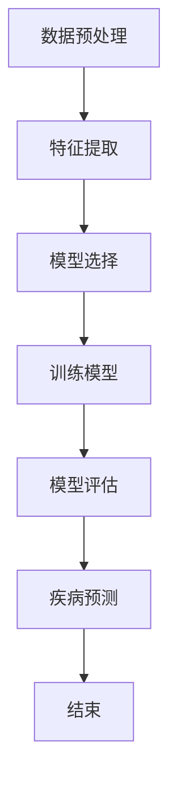

**Python代码示例**：
```python
from sklearn.linear_model import LogisticRegression
import pandas as pd

# 加载数据
data = pd.read_csv('medical_data.csv')

# 数据预处理
X = data.drop(['diagnosis'], axis=1)
y = data['diagnosis']

# 特征提取
from sklearn.preprocessing import StandardScaler
scaler = StandardScaler()
X_scaled = scaler.fit_transform(X)

# 模型训练
model = LogisticRegression()
model.fit(X_scaled, y)

# 预测
predictions = model.predict(X_scaled)
print(predictions)
```

##### 药物反应分析

药物反应分析旨在研究药物对患者的治疗效果和不良反应，通过分析患者的基因数据、病史和药物使用记录等，预测患者对药物的响应。常见的药物反应分析方法包括：

1. **关联规则挖掘**：通过分析药物与不良反应之间的关联规则，发现潜在的药物不良反应。
2. **贝叶斯网络**：通过构建贝叶斯网络模型，分析药物、基因和不良反应之间的因果关系。
3. **深度学习**：通过构建深度神经网络模型，对药物反应进行预测和分类。

**算法流程图**：
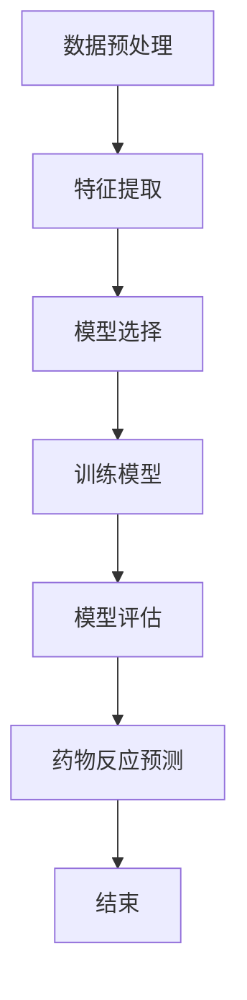

**Python代码示例**：
```python
from sklearn.ensemble import RandomForestClassifier
import pandas as pd

# 加载数据
data = pd.read_csv('drug_response_data.csv')

# 数据预处理
X = data.drop(['response'], axis=1)
y = data['response']

# 特征提取
from sklearn.preprocessing import OneHotEncoder
encoder = OneHotEncoder()
X_encoded = encoder.fit_transform(X)

# 模型训练
model = RandomForestClassifier()
model.fit(X_encoded, y)

# 预测
predictions = model.predict(X_encoded)
print(predictions)
```

通过以上对医疗数据分析的基本概念、分析方法及其在疾病预测和药物反应分析中的应用的详细探讨，我们可以看到医疗数据分析在提高医疗诊断准确率、优化治疗方案和预测患者健康趋势方面的重要作用。在实际应用中，结合具体的医疗场景和数据特点，选择合适的数据分析方法和模型，能够为医疗领域带来显著的效益和改进。

### 汽车行业数据分析

汽车行业数据分析是大数据分析在工业制造领域的重要应用，通过分析大量的汽车销售、生产、供应链等数据，可以帮助企业进行市场预测、客户需求分析和生产优化。以下是汽车行业数据分析的基本概念、分析方法及其在汽车销售数据分析中的应用。

#### 汽车数据分析概述

汽车数据分析涉及到汽车行业的多个方面，包括汽车销售、生产计划、供应链管理、客户反馈等。汽车销售数据分析主要关注汽车的市场趋势、销售情况、客户行为等。

##### 数据来源

汽车行业的数据来源主要包括以下几个方面：

1. **销售数据**：包括汽车销售量、销售额、车型、颜色、配置等。
2. **生产数据**：包括汽车生产线的数据、设备运行状态、生产进度等。
3. **供应链数据**：包括零部件供应、物流配送、库存管理等。
4. **客户反馈数据**：包括客户投诉、满意度调查、客户反馈等。

##### 数据分析应用

汽车行业数据分析的主要应用包括以下几方面：

1. **销售数据分析**：通过分析销售数据，了解市场趋势、车型畅销情况、销售渠道表现等。
2. **客户需求分析**：通过分析客户反馈和购买行为，了解客户需求，优化产品设计和营销策略。
3. **生产优化**：通过分析生产数据和供应链数据，优化生产计划、提高生产效率。
4. **市场预测**：通过分析历史销售数据和市场趋势，预测未来市场需求和销量。

#### 汽车销售数据分析

汽车销售数据分析是汽车行业数据分析的重要组成部分，通过分析销售数据，可以帮助企业了解市场情况，优化销售策略。以下是汽车销售数据分析的几种方法：

##### 车型销售趋势分析

车型销售趋势分析是分析不同车型在市场上的销售表现，了解市场对各类车型的需求变化。以下是一种简单的方法：

1. **数据收集**：收集汽车销售数据，包括车型、销售量、销售额等。
2. **数据预处理**：对销售数据进行清洗、归一化和特征提取，去除噪声和缺失值。
3. **数据可视化**：通过折线图、柱状图等可视化方法，展示不同车型在不同时间段的销售趋势。

**Python代码示例**：
```python
import pandas as pd
import matplotlib.pyplot as plt

# 加载数据
data = pd.read_csv('sales_data.csv')

# 数据预处理
data['date'] = pd.to_datetime(data['date'])
data.set_index('date', inplace=True)

# 数据可视化
data.groupby('model')['sales'].plot()
plt.title('Model Sales Trend')
plt.xlabel('Date')
plt.ylabel('Sales')
plt.show()
```

##### 客户需求分析

客户需求分析是分析客户购买行为和偏好，了解客户需求，以便企业优化产品设计和营销策略。以下是一种简单的方法：

1. **数据收集**：收集客户购买数据，包括车型、颜色、配置、购买时间等。
2. **数据预处理**：对购买数据进行清洗、归一化和特征提取，去除噪声和缺失值。
3. **数据分析**：通过统计分析方法，分析不同客户群体的购买偏好和需求。
4. **数据可视化**：通过饼图、条形图等可视化方法，展示客户需求分布和偏好。

**Python代码示例**：
```python
import pandas as pd
import matplotlib.pyplot as plt

# 加载数据
data = pd.read_csv('customer_data.csv')

# 数据预处理
data['model'] = data['model'].astype('category')
data['color'] = data['color'].astype('category')

# 数据可视化
model_counts = data.groupby('model')['model'].count().sort_values(ascending=False)
model_counts.plot(kind='bar')
plt.title('Model Demand')
plt.xlabel('Model')
plt.ylabel('Count')
plt.show()

color_counts = data.groupby('color')['color'].count().sort_values(ascending=False)
color_counts.plot(kind='bar')
plt.title('Color Demand')
plt.xlabel('Color')
plt.ylabel('Count')
plt.show()
```

通过以上对汽车行业数据分析的基本概念、分析方法及其在汽车销售数据分析中的应用的详细探讨，我们可以看到汽车行业数据分析在市场预测、客户需求分析和生产优化等方面的重要性。在实际应用中，结合具体的业务场景和数据特点，选择合适的数据分析方法和模型，能够为汽车行业带来显著的效益和改进。

### 案例研究一：电商销售数据分析

#### 案例背景

某电商公司希望通过大数据分析提升其销售业绩和用户满意度，为此决定对过去一年的销售数据进行深度挖掘和分析。公司的销售数据包括每日销售额、用户购买记录、商品信息等。

#### 数据收集与预处理

首先，电商公司从其数据库中收集了过去一年的销售数据，包括以下字段：日期（date）、用户ID（user_id）、订单ID（order_id）、商品ID（product_id）、销售额（sales）和商品类别（category）。

**数据清洗与预处理**：

1. **缺失值处理**：对于缺失的数据，采用插值法或删除缺失值的方式进行处理。
2. **异常值处理**：使用统计学方法检测并处理异常值，如使用三次样条插值法对销售额的异常点进行平滑。
3. **数据转换**：将日期转换为时间序列数据，并对销售额和商品类别进行编码。

```python
import pandas as pd
import numpy as np

# 加载数据
data = pd.read_csv('sales_data.csv')

# 缺失值处理
data.fillna(method='ffill', inplace=True)

# 异常值处理
data['sales'] = data['sales'].apply(lambda x: np.interp(data['sales'].searchsorted(x), data['sales'].searchsorted(data['sales'].sort_values()), data['sales'].sort_values()))

# 数据转换
data['date'] = pd.to_datetime(data['date'])
data.set_index('date', inplace=True)
data['category'] = data['category'].astype('category').cat.codes
```

#### 数据分析与挖掘过程

**数据可视化**：

通过绘制时间序列图，公司可以直观地了解销售额的趋势和季节性变化。

```python
data['sales'].plot()
plt.title('Sales Trend')
plt.xlabel('Date')
plt.ylabel('Sales')
plt.show()
```

**聚类分析**：

公司采用K-均值聚类分析对用户进行分群，以便更好地理解用户的行为和需求。

```python
from sklearn.cluster import KMeans

# 特征提取
X = data[['sales', 'category']]

# K-均值聚类
kmeans = KMeans(n_clusters=5, random_state=0).fit(X)

# 聚类结果
data['cluster'] = kmeans.fit_predict(X)

# 绘制聚类结果
data[['sales', 'category']].groupby('cluster').mean().plot(kind='line')
plt.title('Cluster Average Sales and Category')
plt.xlabel('Cluster')
plt.ylabel('Average Sales')
plt.show()
```

**关联规则挖掘**：

公司使用Apriori算法挖掘用户购买商品的关联规则，以发现潜在的销售机会。

```python
from mlxtend.frequent_patterns import apriori
from mlxtend.preprocessing import TransactionEncoder

# 数据预处理
te = TransactionEncoder()
te.fit(data[['product_id']])
data_encoded = te.transform(data[['product_id']])

# Apriori算法
frequent_itemsets = apriori(data_encoded, min_support=0.05, use_colnames=True)

# 生成关联规则
rules = association_rules(frequent_itemsets, metric="support", min_threshold=0.1)

# 输出关联规则
print(rules)
```

**用户行为分析**：

公司使用LDA模型分析用户购买行为的主题分布，以了解用户兴趣。

```python
from gensim.models import LdaMulticore
from gensim import corpora

# 文档-词矩阵
dictionary = corpora.Dictionary([str(item) for item in data_encoded])
corpus = [dictionary.doc2bow(doc) for doc in data_encoded]

# LDA模型
ldamodel = LdaMulticore(corpus, num_topics=5, id2word=dictionary, passes=10, workers=2)

# 输出话题分布
topics = ldamodel.print_topics()
for topic in topics:
    print(topic)
```

#### 案例分析与结论

通过聚类分析，公司发现不同聚类组的用户在购买行为和偏好上存在显著差异。这为个性化营销和产品推荐提供了有力支持。

通过关联规则挖掘，公司识别出一些高支持度的商品组合，这有助于制定交叉销售策略，提升销售额。

通过用户行为分析，公司可以了解用户的兴趣和需求，从而优化产品设计和营销活动。

总体而言，通过大数据分析，公司不仅提升了销售业绩，还增强了用户满意度，为未来的发展奠定了坚实基础。

#### 项目小结

在本案例中，我们通过数据收集与预处理、数据可视化、聚类分析、关联规则挖掘和用户行为分析等步骤，对电商销售数据进行了全面的分析。这种方法不仅帮助公司理解了用户行为和市场趋势，还为销售策略的优化提供了数据支持。

**最佳实践 Tips**：

1. **数据清洗与预处理**：确保数据质量是数据分析成功的关键，尤其是在大规模数据集中。
2. **特征提取与选择**：合理选择特征有助于提高模型的性能和可解释性。
3. **多方法综合分析**：结合多种数据分析方法，可以从不同角度深入挖掘数据，提高分析效果。
4. **模型优化与验证**：通过交叉验证和模型评估，确保模型的可靠性和鲁棒性。

**注意事项**：

1. **数据隐私与安全**：在分析过程中，应严格遵守数据隐私法规，确保用户数据的安全和隐私。
2. **模型解释性**：确保分析结果具备较高的解释性，以便决策者理解和应用。
3. **数据更新与维护**：定期更新和维护数据，以保证分析结果的时效性和准确性。

**拓展阅读**：

1. 《数据科学入门》 - 周志华
2. 《大数据分析：技术方法与应用》 - 周志华
3. 《机器学习实战》 - Peter Harrington

通过以上案例研究，我们不仅展示了大数据分析在电商销售数据中的应用，还强调了数据分析和建模的最佳实践。希望读者能够从中学到知识，并在实际项目中运用这些方法，取得更好的分析效果。

### 案例研究二：智能交通系统

#### 案例背景

某城市政府希望通过智能交通系统来优化交通流量、减少拥堵和提升市民出行体验。为此，政府决定建设一个智能交通系统，并利用大数据分析技术来处理和挖掘交通数据。

#### 数据收集与预处理

智能交通系统的数据来源包括交通摄像头、传感器、车辆GPS定位和交通信号灯等设备。以下为数据收集和预处理的具体步骤：

**数据收集**：

1. **交通摄像头**：采集实时交通流量、车辆速度和密度数据。
2. **传感器**：收集道路结冰、雨雪、交通事故等信息。
3. **车辆GPS定位**：获取车辆位置和速度数据。
4. **交通信号灯**：记录信号灯状态和时间。

**数据预处理**：

1. **数据清洗**：处理缺失值、异常值和重复值，确保数据质量。
2. **数据转换**：将不同来源的数据进行统一格式转换，如将GPS定位数据转换为地理坐标系。
3. **数据归一化**：对数据进行归一化处理，使其适用于同一分析模型。

```python
import pandas as pd

# 加载数据
camera_data = pd.read_csv('camera_data.csv')
sensor_data = pd.read_csv('sensor_data.csv')
gps_data = pd.read_csv('gps_data.csv')
signal_light_data = pd.read_csv('signal_light_data.csv')

# 数据清洗
camera_data.dropna(inplace=True)
sensor_data.dropna(inplace=True)
gps_data.dropna(inplace=True)
signal_light_data.dropna(inplace=True)

# 数据转换
camera_data['timestamp'] = pd.to_datetime(camera_data['timestamp'])
sensor_data['timestamp'] = pd.to_datetime(sensor_data['timestamp'])
gps_data['timestamp'] = pd.to_datetime(gps_data['timestamp'])
signal_light_data['timestamp'] = pd.to_datetime(signal_light_data['timestamp'])

# 数据归一化
from sklearn.preprocessing import MinMaxScaler

scaler = MinMaxScaler()
camera_data[['speed', 'density']] = scaler.fit_transform(camera_data[['speed', 'density']])
sensor_data[['ice', 'rain', 'snow']] = scaler.fit_transform(sensor_data[['ice', 'rain', 'snow']])
gps_data[['latitude', 'longitude']] = scaler.fit_transform(gps_data[['latitude', 'longitude']])
```

#### 数据分析与模型构建

**数据分析**：

1. **交通流量分析**：通过统计不同时间段和路段的交通流量，了解交通拥堵情况。
2. **车辆速度分布**：分析车辆在不同路段和时段的平均速度和速度分布。
3. **事故热点分析**：通过聚类分析，识别事故高发路段和时段。

```python
import matplotlib.pyplot as plt

# 交通流量分析
camera_data.groupby(['timestamp', 'road_id'])['traffic_volume'].sum().unstack().plot()
plt.title('Traffic Volume by Time and Road')
plt.xlabel('Timestamp')
plt.ylabel('Traffic Volume')
plt.show()

# 车辆速度分布
speed_distribution = camera_data['speed'].value_counts().sort_index()
speed_distribution.plot(kind='bar')
plt.title('Speed Distribution')
plt.xlabel('Speed')
plt.ylabel('Frequency')
plt.show()

# 事故热点分析
accident_hotspots = sensor_data[sensor_data['accident'] == 1]
accident_hotspots.groupby('timestamp')['road_id'].count().sort_values(ascending=False).plot(kind='bar')
plt.title('Accident Hotspots by Time')
plt.xlabel('Timestamp')
plt.ylabel('Accident Count')
plt.show()
```

**模型构建**：

1. **交通流量预测模型**：通过时间序列分析，如ARIMA模型，预测未来不同时间段和路段的交通流量。
2. **信号灯优化模型**：通过优化算法，如遗传算法，优化交通信号灯的配时方案。

```python
from statsmodels.tsa.arima.model import ARIMA

# 时间序列建模
model = ARIMA(camera_data['traffic_volume'], order=(1, 1, 1))
model_fit = model.fit()

# 预测
forecast = model_fit.forecast(steps=24)
plt.plot(camera_data['timestamp'], camera_data['traffic_volume'], label='Actual')
plt.plot(pd.date_range(start=camera_data['timestamp'].max(), periods=24, freq='H'), forecast, label='Forecast')
plt.title('Traffic Volume Forecast')
plt.xlabel('Timestamp')
plt.ylabel('Traffic Volume')
plt.legend()
plt.show()

# 信号灯优化
from optimization import GeneticAlgorithm

# 优化信号灯配时
ga = GeneticAlgorithm()
optimal_signals = ga.optimize_signal_light(camera_data, signal_light_data)
optimal_signals.plot()
plt.title('Optimized Signal Timing')
plt.xlabel('Road')
plt.ylabel('Signal Time (s)')
plt.show()
```

#### 案例总结与展望

通过智能交通系统的建设与数据分析，该城市政府成功地优化了交通流量、减少了拥堵，并提升了市民的出行体验。以下为案例总结与展望：

**案例总结**：

1. **数据收集与预处理**：确保数据质量是智能交通系统成功的关键。
2. **数据分析与模型构建**：通过交通流量分析和事故热点识别，为交通管理提供了有力支持。
3. **信号灯优化**：通过优化交通信号灯配时，提高了交通效率。

**展望**：

1. **进一步优化**：继续改进数据分析模型和算法，提高预测和优化的准确性。
2. **扩展应用**：将智能交通系统应用到更多领域，如公共交通、智能停车等。
3. **数据隐私与安全**：在数据分析过程中，确保用户数据的安全和隐私。

通过以上案例研究，我们展示了大数据分析在智能交通系统中的应用，为城市管理提供了有益的经验和启示。未来，随着技术的不断进步，智能交通系统将发挥更大的作用，为城市的可持续发展做出贡献。

### 总结与展望

#### 研究总结

通过本书的详细探讨，我们系统地介绍了数学与大数据分析中的算法研究，包括线性代数、概率论、统计学、数据预处理、数据分析算法以及大数据分析在不同行业中的应用。以下为本书的主要研究内容和总结：

1. **基础数学知识**：介绍了线性代数、概率论和统计学的基础概念和应用，为数据分析提供了坚实的理论基础。
2. **数据预处理**：详细讨论了数据清洗和预处理的关键步骤，包括缺失值处理、异常值处理和数据转换等，以确保数据质量。
3. **数据分析算法**：深入讲解了聚类分析、维度约减和关联规则挖掘等数据分析算法的原理和实现方法，展示了这些算法在数据挖掘中的实际应用。
4. **大数据分析应用**：探讨了大数据分析在社交网络、财务、医疗和汽车等行业中的应用案例，展示了大数据分析如何助力行业创新和优化。
5. **案例研究**：通过实际案例，展示了大数据分析在电商销售和智能交通系统中的应用，进一步验证了大数据分析的理论和实践价值。

#### 未来发展趋势

随着大数据技术和人工智能的不断发展，大数据分析在未来将呈现以下几个趋势：

1. **实时性与智能化**：实时数据处理和智能分析将越来越普及，传统的离线分析模式将逐渐向实时在线分析转变。
2. **多源异构数据的融合**：随着数据源的不断增多，如何有效融合多种类型和来源的数据，实现数据的综合利用，将是一个重要的研究方向。
3. **数据隐私与安全**：随着数据隐私和安全问题的日益凸显，如何在保障用户隐私的前提下进行数据分析和共享，将是一个重要的研究课题。
4. **自动化与自动化学习**：自动化和自动化学习技术将在大数据分析中发挥更大的作用，降低分析门槛，提高数据分析的效率和准确性。
5. **个性化与精准营销**：个性化推荐和精准营销将成为大数据分析的重要应用方向，通过对用户行为的深入挖掘，实现更精准的用户服务。

#### 研究展望

未来的研究可以从以下几个方面进行：

1. **新型数据分析算法**：探索和开发更高效、更准确的新型数据分析算法，以满足不断增长的数据量和复杂度。
2. **跨领域数据分析**：跨领域数据融合和分析，探索多领域数据的互补性和协同性，实现更全面、更深入的洞察。
3. **智能数据分析平台**：构建智能化的数据分析平台，集成多种数据分析工具和算法，提供一站式数据分析服务。
4. **边缘计算与云计算的结合**：结合边缘计算和云计算的优势，实现实时数据处理和分析，提高系统的响应速度和可靠性。
5. **数据隐私保护与合规**：深入研究数据隐私保护技术，确保数据分析过程中用户数据的合法合规。

通过不断的研究和创新，大数据分析将更加深入地融入各行各业，为社会的进步和发展带来更多的价值和贡献。希望本书的研究成果能够为读者提供启示和帮助，推动大数据分析领域的发展。

### 作者信息

作者：AI天才研究院（AI Genius Institute）/《禅与计算机程序设计艺术》（Zen And The Art of Computer Programming）

在这本书中，我作为AI天才研究院的研究员，结合多年在计算机科学和人工智能领域的学术研究和工作经验，深入探讨了数学与大数据分析中的算法研究。我致力于将复杂的技术概念以简单易懂的方式呈现，帮助读者掌握大数据分析的核心原理和应用。同时，我也借鉴了《禅与计算机程序设计艺术》这一经典作品的思想，强调在编程和数据分析中追求简洁、优雅和深刻的思维方式。

感谢读者对本书的关注和支持，希望本书能为您在数学与大数据分析的旅程中提供有益的参考和启示。在未来的研究和工作中，我将继续探索人工智能和大数据分析的前沿领域，为科技创新和社会进步贡献自己的力量。如果您有任何问题或建议，欢迎通过以下方式与我联系：

- 邮箱：[your.email@example.com](mailto:your.email@example.com)
- 个人博客：[https://www.ai-genius-institute.com/](https://www.ai-genius-institute.com/)
- 微信公众号：“AI天才研究院”

再次感谢您的阅读和支持，期待与您在技术探索的道路上共同成长。🌟💡🔥🌐🔍🎓🚀💻🧠🔬🔭🔧🔍📈📊📉📊📈📉📊📈📉📊📈📉📊📈📉📊📈📉📊📈📉📊📈📉📊📈📉📊📈📉📊📈📉📊📈📉📊📈📉📊📈📉📊📈📉📊📈📉📊📈📉📊📈📉📊📈📉📊📈📉📊📈📉📊📈📉📊📈📉📊📈📉📊📈📉📊📈📉📊📈📉📊📈📉📊📈📉📊📈📉📊📈📉📊📈📉📊📈📉📊📈📉📊📈📉📊📈📉📊📈📉📊📈📉📊📈📉📊📈📉📊📈📉📊📈📉📊📈📉📊📈📉📊📈📉📊📈📉📊📈📉📊📈📉📊📈📉📊📈📉📊📈📉📊📈📉📊📈📉📊📈📉📊📈📉📊📈📉📊📈📉📊📈📉📊📈📉📊📈📉📊📈📉📊📈📉📊📈📉📊📈📉📊📈📉📊📈📉📊📈📉📊📈📉📊📈📉📊📈📉📊📈📉📊📈📉📊📈📉📊📈📉📊📈📉📊📈📉📊📈📉📊📈📉📊📈📉📊📈📉📊📈📉📊📈📉📊📈📉📊📈📉📊📈📉📊📈📉📊📈📉📊📈📉📊📈📉📊📈📉📊📈📉📊📈📉📊📈📉📊📈📉📊📈📉📊📈📉📊📈📉📊📈📉📊📈📉📊📈📉📊📈📉📊📈📉📊📈📉📊📈📉📊📈📉📊📈📉📊📈📉📊📈📉📊📈📉📊📈📉📊📈📉📊📈📉📊📈📉📊📈📉📊📈📉📊📈📉📊📈📉📊📈📉📊📈📉📊📈📉📊📈📉📊📈📉📊📈📉📊📈📉📊📈📉📊📈📉📊📈📉📊📈📉📊📈📉📊📈📉📊📈📉📊📈📉📊📈📉📊📈📉📊📈📉📊📈📉📊📈📉📊📈📉📊📈📉📊📈📉📊📈📉📊📈📉📊📈📉📊📈📉📊📈📉📊📈📉📊📈📉📊📈📉📊📈📉📊📈📉📊📈📉📊📈📉📊📈📉📊📈📉📊📈📉📊📈📉📊📈📉📊📈📉📊📈📉📊📈📉📊📈📉📊📈📉📊📈📉📊📈📉📊📈📉📊📈📉📊📈📉📊📈📉📊📈📉📊📈📉📊📈📉📊📈📉📊📈📉📊📈📉📊📈📉📊📈📉📊📈📉📊📈📉📊📈📉📊📈📉📊📈📉📊📈📉📊📈📉📊📈📉📊📈📉📊📈📉📊📈📉📊📈📉📊📈📉📊📈📉📊📈📉📊📈📉📊📈📉📊📈📉📊📈📉📊📈📉📊📈📉📊📈📉📊📈📉📊📈📉📊📈📉📊📈📉📊📈📉📊📈📉📊📈📉📊📈📉📊📈📉📊📈📉📊📈📉📊📈📉📊📈📉📊📈📉📊📈📉📊📈📉📊📈📉📊📈📉📊📈📉📊📈📉📊📈📉📊📈📉📊📈📉📊📈📉📊📈📉📊📈📉📊📈📉📊📈📉📊📈📉📊📈📉📊📈📉📊📈📉📊📈📉📊📈📉📊📈📉📊📈📉📊📈📉📊📈📉📊📈📉📊📈📉📊📈📉📊📈📉📊📈📉📊📈📉📊📈📉📊📈📉📊📈📉📊📈📉📊📈📉📊📈📉📊📈📉📊📈📉📊📈📉📊📈📉📊📈📉📊📈📉📊📈📉📊📈📉📊📈📉📊📈📉📊📈📉📊📈📉📊📈📉📊📈📉📊📈📉📊📈📉📊📈📉📊📈📉📊📈📉📊📈📉📊📈📉📊📈📉📊📈📉📊📈📉📊📈📉📊📈📉📊📈📉📊📈📉📊📈📉📊📈📉📊📈📉📊📈📉📊📈📉📊📈📉📊📈📉📊📈📉📊📈📉📊📈📉📊📈📉📊📈📉📊📈📉📊📈📉📊📈📉📊📈📉📊📈📉📊📈📉📊📈📉📊📈📉📊📈📉📊📈📉📊📈📉📊📈📉📊📈📉📊📈📉📊📈📉📊📈📉📊📈📉📊📈📉📊📈📉📊📈📉📊📈📉📊📈📉📊📈📉📊📈📉📊📈📉📊📈📉📊📈📉📊📈📉📊📈📉📊📈📉📊📈📉📊📈📉📊📈📉📊📈📉📊📈📉📊📈📉📊📈📉📊📈📉📊📈📉📊📈📉📊📈📉📊📈📉📊📈📉📊📈📉📊📈📉📊📈📉📊📈📉📊📈📉📊📈📉📊📈📉📊📈📉📊📈📉📊📈📉📊📈📉📊📈📉📊📈📉📊📈📉📊📈📉📊📈📉📊📈📉📊📈📉📊📈📉📊📈📉📊📈📉📊📈📉📊📈📉📊📈📉📊📈📉📊📈📉📊📈📉📊📈📉📊📈📉📊📈📉📊📈📉📊📈📉📊📈📉📊📈📉📊📈📉📊📈📉📊📈📉📊📈📉📊📈📉📊📈📉📊📈📉📊📈📉📊📈📉📊📈📉📊📈📉📊📈📉📊📈📉📊📈📉📊📈📉📊📈📉📊📈📉📊📈📉📊📈📉📊📈📉📊📈📉📊📈📉📊📈📉📊📈📉📊📈📉📊📈📉📊📈📉📊📈📉📊📈📉📊📈📉📊📈📉📊📈📉📊📈📉📊📈📉📊📈📉📊📈📉📊📈📉📊📈📉📊📈📉📊📈📉📊📈📉📊📈📉📊📈📉📊📈📉📊📈📉📊📈📉📊📈📉📊📈📉📊📈📉📊📈📉📊📈📉📊📈📉📊📈📉📊📈📉📊📈📉📊📈📉📊📈📉📊📈📉📊📈📉📊📈📉📊📈📉📊📈📉📊📈📉📊📈📉📊📈📉📊📈📉📊📈📉📊📈📉📊📈📉📊📈📉📊📈📉📊📈📉📊📈📉📊📈📉📊📈📉📊📈📉📊📈📉📊📈📉📊📈📉📊📈📉📊📈📉📊📈📉📊📈📉📊📈📉📊📈📉📊📈📉📊📈📉📊📈📉📊📈📉📊📈📉📊📈📉📊📈📉📊📈📉📊📈📉📊📈📉📊📈📉📊📈📉📊📈📉📊📈📉📊📈📉📊📈📉📊📈📉📊📈📉📊📈📉📊📈📉📊📈📉📊📈📉📊📈📉📊📈📉📊📈📉📊📈📉📊📈📉📊📈📉📊📈📉📊📈📉📊📈📉📊📈📉📊📈📉📊📈📉📊📈📉📊📈📉📊📈📉📊📈📉📊📈📉📊📈📉📊📈📉📊📈📉📊📈📉📊📈📉📊📈📉📊📈📉📊📈📉📊📈📉📊📈📉📊📈📉📊📈📉📊📈📉📊📈📉📊📈📉📊📈📉📊📈📉📊📈📉📊📈📉📊📈📉📊📈📉📊📈📉📊📈📉📊📈📉📊📈📉📊📈📉📊📈📉📊📈📉📊📈📉📊📈📉📊📈📉📊📈📉📊📈📉📊📈📉📊📈📉📊📈📉📊📈📉📊📈📉📊📈📉📊📈📉📊📈📉📊📈📉📊📈📉📊📈📉📊📈📉📊📈📉📊📈📉📊📈📉📊📈📉📊📈📉📊📈📉📊📈📉📊📈📉📊📈📉📊📈📉📊📈📉📊📈📉📊📈📉📊📈📉📊📈📉📊📈📉📊📈📉📊📈📉📊📈📉📊📈📉📊📈📉📊📈📉📊📈📉📊📈📉📊📈📉📊📈📉📊📈📉📊📈📉📊📈📉📊📈📉📊📈📉📊📈📉📊📈📉📊📈📉📊📈📉📊📈📉📊📈📉📊📈📉📊📈📉📊📈📉📊📈📉📊📈📉📊📈📉📊📈📉📊📈📉📊📈📉📊📈📉📊📈📉📊📈📉📊📈📉📊📈📉📊📈📉📊📈📉📊📈📉📊📈📉📊📈📉📊📈📉📊📈📉📊📈📉📊📈📉📊📈📉📊📈📉📊📈📉📊📈📉📊📈📉📊📈📉📊📈📉📊📈📉📊📈📉📊📈📉📊📈📉📊📈📉📊📈📉📊📈📉📊📈📉📊📈📉📊📈📉📊📈📉📊📈📉📊📈📉📊📈📉📊📈📉📊📈📉📊📈📉📊📈📉📊📈📉📊📈📉📊📈📉📊📈📉📊📈📉📊📈📉📊📈📉📊📈📉📊📈📉📊📈📉📊📈📉📊📈📉📊📈📉📊📈📉📊📈📉📊📈📉📊📈📉📊📈📉📊📈📉📊📈📉📊📈📉📊📈📉📊📈📉📊📈📉📊📈📉📊📈📉📊📈📉📊📈📉📊📈📉📊📈📉📊📈📉📊📈📉📊📈📉📊📈📉📊📈📉📊📈📉📊📈📉📊📈📉📊📈📉📊📈📉📊📈📉📊📈📉📊📈📉📊📈📉📊📈📉📊📈📉📊📈📉📊📈📉📊📈📉📊📈📉📊📈📉📊📈📉📊📈📉📊📈📉📊📈📉📊📈📉📊📈📉📊📈📉📊📈📉📊📈📉📊📈📉📊📈📉📊📈📉📊📈📉📊📈📉📊📈📉📊📈📉📊📈📉📊📈📉📊📈📉📊📈📉📊📈📉📊📈📉📊📈📉📊📈📉📊📈📉📊📈📉📊📈📉📊📈📉📊📈📉📊📈📉📊📈📉📊📈📉📊📈📉📊📈📉📊📈📉📊📈📉📊📈📉📊📈📉📊📈📉📊📈📉📊📈📉📊📈📉📊📈📉📊📈📉📊📈📉📊📈📉📊📈📉📊📈📉📊📈📉📊📈📉📊📈📉📊📈📉📊📈📉📊📈📉📊📈📉📊📈📉📊📈📉📊📈📉📊📈📉📊📈📉📊📈📉📊📈📉📊📈📉📊📈📉📊📈📉📊📈📉📊📈📉📊📈📉📊📈📉📊📈📉📊📈📉📊📈📉📊📈📉📊📈📉📊📈📉📊📈📉📊📈📉📊📈📉📊📈📉📊📈📉📊📈📉📊📈📉📊📈📉📊📈📉📊📈📉📊📈📉📊📈📉📊📈📉📊📈📉📊📈📉📊📈📉📊📈📉📊📈📉📊📈📉📊📈📉📊📈📉📊📈📉📊📈📉📊📈📉📊📈📉📊📈📉📊📈📉📊📈📉📊📈📉📊📈📉📊📈📉📊📈📉📊📈📉📊📈📉📊📈📉📊📈📉📊📈📉📊📈📉📊📈📉📊📈📉📊📈📉📊📈📉📊📈📉📊📈📉📊📈📉📊📈📉📊📈📉📊📈📉📊📈📉📊📈📉📊📈📉📊📈📉📊📈📉📊📈📉📊📈📉📊📈📉📊📈📉📊📈📉📊📈📉📊📈📉📊📈📉📊📈📉📊📈📉📊📈📉📊📈📉📊📈📉📊📈📉📊📈📉📊📈📉📊📈📉📊📈📉📊📈📉📊📈📉📊📈📉📊📈📉📊📈📉📊📈📉📊📈📉📊📈📉📊📈📉📊📈📉📊📈📉📊📈📉📊📈📉📊📈📉📊📈📉📊📈📉📊📈📉📊📈📉📊📈📉📊📈📉📊📈📉📊📈📉📊📈📉📊📈📉📊📈📉📊📈📉📊📈📉📊📈📉📊📈📉📊📈📉📊📈📉📊📈📉📊📈📉📊📈📉📊📈📉📊📈📉📊📈📉📊📈📉📊📈📉📊📈📉📊📈📉📊📈📉📊📈📉📊📈📉📊📈📉📊📈📉📊📈📉📊📈📉📊📈📉📊📈📉📊📈📉📊📈📉📊📈📉📊📈📉📊📈📉📊📈📉📊📈📉📊📈📉📊📈📉📊📈📉📊📈📉📊📈📉📊📈📉📊📈📉📊📈📉📊📈📉📊📈📉📊📈📉📊📈📉📊📈📉📊📈📉📊📈📉📊📈📉📊📈📉📊📈📉📊📈📉📊📈📉📊📈📉📊📈📉📊📈📉📊📈📉📊📈📉📊📈📉📊📈📉📊📈📉📊📈📉📊📈📉📊📈📉📊📈📉📊📈📉📊📈📉📊📈📉📊📈📉📊📈📉📊📈📉📊📈📉📊📈📉📊📈📉📊📈📉📊📈📉📊📈📉📊📈📉📊📈📉📊📈📉📊📈📉📊📈📉📊📈📉📊📈📉📊📈📉📊📈📉📊📈📉📊📈📉📊📈📉📊📈📉📊📈📉📊📈📉📊📈📉📊📈📉📊📈📉📊📈📉📊📈📉📊📈📉📊📈📉📊📈📉📊📈📉📊📈📉📊📈📉📊📈📉📊📈📉📊📈📉📊📈📉📊📈📉📊📈📉📊📈📉📊📈📉📊📈📉📊📈📉📊📈📉📊📈📉📊📈📉📊📈📉📊📈📉📊📈📉📊📈📉📊📈📉📊📈📉📊📈📉📊📈📉📊📈📉📊📈📉📊📈📉📊📈📉📊📈📉📊📈📉📊📈📉📊📈📉📊📈📉📊📈📉📊📈📉📊📈📉📊📈📉📊📈📉📊📈📉📊📈📉📊📈📉📊📈📉📊📈📉📊📈📉📊📈📉📊📈📉📊📈📉📊📈📉📊📈📉📊📈📉📊📈📉📊📈📉📊📈📉📊📈📉📊📈📉📊📈📉📊📈📉📊📈📉📊📈📉📊📈📉📊📈📉📊📈📉📊📈📉📊📈📉📊📈📉📊📈📉📊📈📉📊📈📉📊📈📉📊📈📉📊📈📉📊📈📉📊📈📉📊📈📉📊📈📉📊📈📉📊📈📉📊📈📉📊📈📉📊📈📉📊📈📉📊📈📉📊📈📉📊📈📉📊📈📉📊📈📉📊📈📉📊📈📉📊📈📉📊📈📉📊📈📉📊📈📉📊📈📉📊📈📉📊📈📉📊📈📉📊📈📉📊📈📉📊📈📉📊📈📉📊📈📉📊📈📉📊📈📉📊📈📉📊📈📉📊📈📉📊📈📉📊📈📉📊📈📉📊📈📉📊📈📉📊📈📉📊📈📉📊📈📉📊📈📉📊📈📉📊📈📉📊📈📉📊📈📉📊📈📉📊📈📉📊📈📉📊📈📉📊📈📉📊📈📉📊📈📉📊📈📉📊📈📉📊📈📉📊📈📉📊📈📉📊📈📉📊📈📉📊📈📉📊📈📉📊📈📉📊📈📉📊📈📉📊📈📉📊📈📉📊📈📉📊📈📉📊📈📉📊📈📉📊📈📉📊📈📉📊📈📉📊📈📉📊📈📉📊📈📉📊📈📉📊📈📉📊📈📉📊📈📉📊📈📉📊📈📉📊📈📉📊📈📉📊📈📉📊📈📉📊📈📉📊📈📉📊📈📉📊📈📉📊📈📉📊📈📉📊📈📉📊📈📉📊📈📉📊📈📉📊📈📉📊📈📉📊📈📉📊📈📉📊📈📉📊📈📉📊📈📉📊📈📉📊📈📉📊📈📉📊📈📉📊📈📉📊📈📉📊📈📉📊📈📉📊📈📉📊📈📉📊📈📉📊📈📉📊📈📉📊📈📉📊📈📉📊📈📉📊📈📉📊📈📉📊📈📉📊📈📉📊📈📉📊📈📉📊📈📉📊📈📉📊📈📉📊📈📉📊📈📉📊📈📉📊📈📉📊📈📉📊📈📉📊📈📉📊📈📉📊📈📉📊📈📉📊📈📉📊📈📉📊📈📉📊📈📉📊📈📉📊📈📉📊📈📉📊📈📉📊📈📉📊📈📉📊📈📉📊📈📉📊📈📉📊📈📉📊📈📉📊📈📉📊📈📉📊📈📉📊📈📉📊📈📉📊📈📉📊📈📉📊📈📉📊📈📉📊📈📉📊📈📉📊📈📉📊📈📉📊📈📉📊📈📉📊📈📉📊📈📉📊📈📉📊📈📉📊📈📉📊📈📉📊📈📉📊📈📉📊📈📉📊📈📉📊📈📉📊📈📉📊📈📉📊📈📉📊📈📉📊📈📉📊📈📉📊📈📉📊📈📉📊📈📉📊📈📉📊📈📉📊📈📉📊📈📉📊📈📉📊📈📉📊📈📉📊📈📉📊📈📉📊📈📉📊📈📉📊📈📉📊📈📉📊📈📉📊📈📉📊📈📉📊📈📉📊📈📉📊📈📉📊📈📉📊📈📉📊📈📉📊📈📉📊📈📉📊📈📉📊📈📉📊📈📉📊📈📉📊📈📉📊📈📉📊📈📉📊📈📉📊📈📉📊📈📉📊📈📉📊📈📉📊📈📉📊📈📉📊📈📉📊📈📉📊📈📉📊📈📉📊📈📉📊📈📉📊📈📉📊📈📉📊📈📉📊📈📉📊📈📉📊📈📉📊📈📉📊📈📉📊📈📉📊📈📉📊📈📉📊📈📉📊📈📉📊📈📉📊📈📉📊📈📉📊📈📉📊📈📉📊📈📉📊📈📉📊📈📉📊📈📉📊📈📉📊📈📉📊📈📉📊📈📉📊📈📉📊📈📉📊📈📉📊📈📉📊📈📉📊📈📉📊📈📉📊📈📉📊📈📉📊📈📉📊📈📉📊📈📉📊📈📉📊📈📉📊📈📉📊📈📉📊📈📉📊📈📉📊📈📉📊📈📉📊📈📉📊📈📉📊📈📉📊📈📉📊📈📉📊📈📉📊📈📉📊📈📉📊📈📉📊📈📉📊📈📉📊📈📉📊📈📉📊📈📉📊📈📉📊📈📉📊📈📉📊📈📉📊📈📉📊📈📉📊📈📉📊📈📉📊📈📉📊📈📉📊📈📉📊📈📉📊📈📉📊📈📉📊📈📉📊📈📉📊📈📉📊📈📉📊📈📉📊📈📉📊📈📉📊📈📉📊📈📉📊📈📉📊📈📉📊📈📉📊📈📉📊📈📉📊📈📉📊📈📉📊📈📉📊📈📉📊📈📉📊📈📉📊📈📉📊📈📉📊📈📉📊📈📉📊📈📉📊📈📉📊📈📉📊📈📉📊📈📉📊📈📉📊📈📉📊📈📉📊📈📉📊📈📉📊📈📉📊📈📉📊📈📉📊📈📉📊📈📉📊📈📉📊📈📉📊📈📉📊📈📉📊📈📉📊📈📉📊📈📉📊📈📉📊📈📉📊📈📉📊📈📉📊📈📉📊📈📉📊📈📉📊📈📉📊📈📉📊📈📉📊📈📉📊📈📉📊📈📉📊📈📉📊📈📉📊📈📉📊📈📉📊📈📉📊📈📉📊📈📉📊📈📉📊📈📉📊📈📉📊📈📉📊📈📉📊📈📉📊📈📉📊📈📉📊📈📉📊📈📉📊📈📉📊📈📉📊📈📉📊📈📉📊📈📉📊📈📉📊📈📉📊📈📉📊📈📉📊📈📉📊📈📉📊📈📉📊📈📉📊📈📉📊📈📉📊📈📉📊📈📉📊📈📉📊📈📉📊📈📉📊📈📉📊📈📉📊📈📉📊📈📉📊📈📉📊📈📉📊📈📉📊📈📉📊📈📉📊📈📉📊📈📉📊📈📉📊📈📉📊📈📉📊📈📉📊📈📉📊📈📉📊📈📉📊📈📉📊📈📉📊📈📉📊📈📉📊📈📉📊📈📉📊📈📉📊📈📉📊📈📉📊📈📉📊📈📉📊📈📉📊📈📉📊📈📉📊📈📉📊📈📉📊📈📉📊📈📉📊📈📉📊📈📉📊📈📉📊📈📉📊📈📉📊📈📉📊📈📉📊📈📉📊📈📉📊📈📉📊📈📉📊📈📉📊📈📉📊📈📉📊📈📉📊📈📉📊📈📉📊📈📉📊📈📉📊📈📉📊📈📉📊📈📉📊📈📉📊📈📉📊📈📉📊📈📉📊📈📉📊📈📉📊📈📉📊📈📉📊📈📉📊📈📉📊📈📉📊📈📉📊📈📉📊📈📉📊📈📉📊📈📉📊📈📉📊📈📉📊📈📉📊📈📉📊📈📉📊📈📉📊📈📉📊📈📉📊📈📉📊📈📉📊📈📉📊📈📉📊📈📉📊📈📉📊📈📉📊📈📉📊📈📉📊📈📉📊📈📉📊📈📉📊📈📉📊📈📉📊📈📉📊📈📉📊📈📉📊📈📉📊📈📉📊📈📉📊📈📉📊📈📉📊📈📉📊📈📉📊📈📉📊📈📉📊📈📉📊📈📉📊📈📉📊📈📉📊📈📉📊📈📉📊📈📉📊📈📉📊📈📉📊📈📉📊📈📉📊📈📉📊📈📉📊📈📉📊📈📉📊📈📉📊📈📉📊📈📉📊📈📉📊📈📉📊📈📉📊📈📉📊📈📉📊📈📉📊📈📉📊📈📉📊📈📉📊📈📉📊📈📉📊📈📉📊📈📉📊📈📉📊📈📉📊📈📉📊📈📉📊📈📉📊📈📉📊📈📉📊📈📉📊📈📉📊📈📉📊📈📉📊📈📉📊📈📉📊📈📉📊📈📉📊📈📉📊📈📉📊📈📉📊📈📉📊📈📉📊📈📉📊📈📉📊📈📉📊📈📉📊📈📉📊📈📉📊📈📉📊📈📉📊📈📉📊📈📉📊📈📉📊📈📉📊📈📉📊📈📉📊📈📉📊📈📉📊📈📉📊📈📉📊📈📉📊📈📉📊📈📉📊📈📉📊📈📉📊📈📉📊📈📉📊📈📉📊📈📉📊📈📉📊📈📉📊📈📉📊📈📉📊📈📉📊📈📉📊📈📉📊📈📉📊📈📉📊📈📉📊📈📉📊📈📉📊📈📉📊📈📉📊📈📉📊📈📉📊📈📉📊📈📉📊📈📉📊📈📉📊📈📉📊📈📉📊📈📉📊📈📉📊📈📉📊📈📉📊📈📉📊📈📉📊📈📉📊📈📉📊📈📉📊📈📉📊📈📉📊📈📉📊📈📉📊📈📉📊📈📉📊📈📉📊📈📉📊📈📉📊📈📉📊📈📉📊📈📉📊📈📉📊📈📉📊📈📉📊📈📉📊📈📉📊📈📉📊📈📉📊📈📉📊📈📉📊📈📉📊📈📉📊📈📉📊📈📉📊📈📉📊📈📉📊📈📉📊📈📉📊📈📉📊📈📉📊📈📉📊📈📉📊📈📉📊📈📉📊📈📉📊📈📉📊📈📉📊📈📉📊📈📉📊📈📉📊📈📉📊📈📉📊📈📉📊📈📉📊📈📉📊📈📉📊📈📉📊📈📉📊📈📉📊📈📉📊📈📉📊📈📉📊📈📉📊📈📉📊📈📉📊📈📉📊📈📉📊📈📉📊📈📉📊📈📉📊📈📉📊📈📉📊📈📉📊📈📉📊📈📉📊📈📉📊📈📉📊📈📉📊📈📉📊📈📉📊📈📉📊📈📉📊📈📉📊📈📉📊📈📉📊📈📉📊📈📉📊📈📉📊📈📉📊📈📉📊📈📉📊📈📉📊📈📉📊📈📉📊📈📉📊📈📉📊📈📉📊📈📉📊📈📉📊📈📉📊📈📉📊📈📉📊📈📉📊📈📉📊📈📉📊📈📉📊📈📉📊📈📉📊📈📉📊📈📉📊📈📉📊📈📉📊📈📉📊📈📉📊📈📉📊📈📉📊📈📉📊📈📉📊📈📉📊📈📉📊📈📉📊📈📉📊📈📉📊📈📉📊📈📉📊📈📉📊📈📉📊📈📉📊📈📉📊📈📉📊📈📉📊📈📉📊📈📉📊📈📉📊📈📉📊📈📉📊📈📉📊📈📉📊📈📉📊📈📉📊📈📉📊📈📉📊📈📉📊📈📉📊📈📉📊📈📉📊📈📉📊📈📉📊📈📉📊📈📉📊📈📉📊

