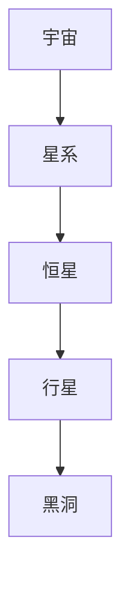
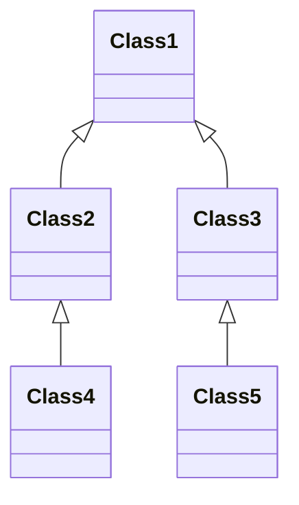
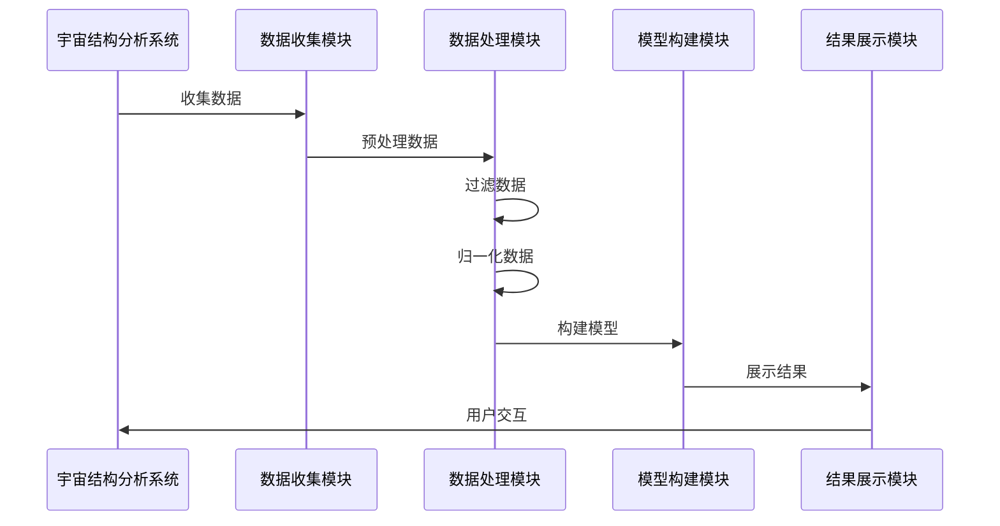

                 


# 数学与天文学：宇宙结构的数学描述

关键词：宇宙结构、数学模型、天文学、哈勃定律、德西特空间、拓扑结构

摘要：本文以数学与天文学交叉领域为切入点，深入探讨宇宙结构的数学描述。通过问题背景介绍、核心概念解析、算法原理讲解、系统分析与架构设计，以及项目实战等环节，旨在帮助读者理解宇宙结构的基本概念和数学描述方法，以及如何利用数学模型分析宇宙的奥秘。

## 目录大纲

1. 第一部分：问题背景
   1.1 宇宙及其观测历史
   1.2 数学在天文学中的应用

2. 第二部分：核心概念
   2.1 宇宙结构的基本概念
   2.2 数学描述宇宙结构的方法

3. 第三部分：算法原理
   3.1 宇宙结构的数学模型
   3.2 数学公式与模型详细讲解
   3.3 宇宙结构的数学描述举例

4. 第四部分：系统分析与架构设计
   4.1 宇宙结构分析
   4.2 系统功能设计
   4.3 系统架构设计

5. 第五部分：项目实战
   5.1 环境安装
   5.2 系统核心实现源代码
   5.3 代码应用解读与分析
   5.4 实际案例分析与详细讲解剖析
   5.5 项目小结

6. 第六部分：最佳实践 tips、小结、注意事项、拓展阅读

## 第一部分：问题背景

### 1.1 宇宙及其观测历史

从古至今，人类对宇宙的探索从未停止。古代的天文学家通过观察星星和行星的运动，逐渐形成了对宇宙的初步认识。例如，古希腊天文学家阿里斯塔克提出了日心说的观点，认为太阳是宇宙的中心，地球和其他行星围绕太阳旋转。这一观点虽然在当时并未得到广泛认同，但却为后来的天文学发展奠定了基础。

随着望远镜的发明和改进，人类对宇宙的观测能力得到了极大的提升。伽利略通过望远镜观察到了木星的四大卫星，证实了这些卫星围绕木星旋转，从而进一步证实了哥白尼的日心说。牛顿的万有引力定律则奠定了现代天文学的理论基础。

在过去的几个世纪中，人类通过观测宇宙，发现了大量星系、恒星、行星和黑洞。这些观测数据为数学在天文学中的应用提供了丰富的素材。例如，哈勃定律揭示了宇宙膨胀的规律，德西特空间描述了一个静态且均匀的宇宙模型。这些数学模型不仅帮助我们更好地理解宇宙的结构，还为天文学的研究提供了有力的工具。

### 1.2 数学在天文学中的应用

数学为天文学提供了一种精确描述宇宙结构的工具。在天文学中，数学模型被广泛应用于宇宙演化、天文现象预测、星系结构分析等领域。例如，哈勃定律描述了宇宙膨胀的速度与距离的关系，德西特空间描述了一个静态且均匀的宇宙模型。这些数学模型不仅帮助我们更好地理解宇宙的结构，还为天文学的研究提供了有力的工具。

此外，数学在天文学中的应用还体现在数据处理和数据分析方面。例如，通过对大量天文观测数据的分析，我们可以揭示宇宙中存在的各种现象和规律。这些分析不仅需要数学模型的支持，还需要强大的计算能力和高效的数据处理算法。

总之，数学与天文学的交叉领域为人类探索宇宙提供了重要的工具和方法。通过数学的精确描述，我们可以更好地理解宇宙的结构和演化过程，从而揭示宇宙的奥秘。

## 第二部分：核心概念

### 2.1 宇宙结构的基本概念

宇宙是一个包含所有物质和能量的空间和时间整体。从宏观尺度来看，宇宙由星系、恒星、行星、星云等组成。其中，星系是宇宙中最基本的单位，由大量的恒星、行星、星云等组成。每个星系内部又存在着复杂的结构，如星系盘、星系核、星系晕等。

恒星是宇宙中最常见的天体，它们能够自身发光、发热。恒星的质量、光度、温度等特征决定了它们的性质。恒星的形成和演化过程是一个复杂的过程，涉及到核反应、引力平衡、辐射传输等多个方面。

行星是围绕恒星运行的天体，通常不发光或发热。行星的尺度、密度、环境等特征决定了它们的性质。行星的分类可以分为类地行星、冰巨星、气巨星等。其中，类地行星与地球类似，具有固体表面，而冰巨星和气巨星则主要由冰和气体组成。

黑洞是宇宙中最神秘的天体之一，它的引力强大到连光都无法逃脱。黑洞的形成通常发生在恒星演化过程中，当一个足够大的恒星耗尽其核燃料时，它会坍缩成为一个黑洞。

### 2.2 数学描述宇宙结构的方法

数学在天文学中扮演着重要的角色，它为宇宙结构的描述提供了一种精确的工具。以下是几种常见的数学描述宇宙结构的方法：

- **数学模型**：数学模型是一种将实际问题抽象成数学形式的方法。通过建立数学模型，我们可以对宇宙结构进行定量分析。例如，哈勃定律描述了宇宙膨胀的速度与距离的关系，德西特空间描述了一个静态且均匀的宇宙模型。

- **几何描述**：几何描述通过几何形状和空间关系来表示宇宙结构。例如，我们可以用球体来表示恒星，用星系盘来表示星系的结构。

- **拓扑结构**：拓扑结构描述了物体在变形过程中的不变特性。在宇宙结构的研究中，拓扑结构可以用来描述星系、星团等结构之间的空间关系。

### 2.3 概念属性特征对比表格

下面是一个概念属性特征对比表格，用于对比宇宙结构中的几个关键概念：

| 名称    | 定义                                                         | 特征                   |
| ------- | ------------------------------------------------------------ | ---------------------- |
| 宇宙    | 包含所有物质和能量的空间和时间整体                             | 无边无际、无限复杂     |
| 星系    | 由恒星、行星、星云等组成的巨型结构体                           | 多样性、层次性       |
| 恒星    | 能够自身发光、发热的巨大球体，如太阳                           | 光度、温度、质量等特征 |
| 行星    | 绕着恒星运行的天体，通常不发光或发热                           | 尺度、密度、环境等特征 |
| 黑洞    | 事件视界内的区域，任何物质都无法逃脱                           | 引力强、质量大         |

### 2.4 ER实体关系图架构的 Mermaid 流程图

下面是一个ER实体关系图架构的Mermaid流程图，用于表示宇宙结构中几个关键概念之间的关系：



## 第三部分：算法原理

### 3.1 宇宙结构的数学模型

宇宙结构的数学模型是一种通过数学形式来描述宇宙中各种天体和现象的方法。这些模型不仅帮助我们理解宇宙的结构，还可以用于预测天文现象。以下是几种常见的宇宙结构的数学模型：

- **哈勃定律**：哈勃定律描述了宇宙膨胀的速度与距离之间的关系。其数学表达式为：

  $$ V = H_0 D $$

  其中，$V$是宇宙膨胀的速度，$D$是星系之间的距离，$H_0$是哈勃常数。哈勃定律表明，宇宙正在膨胀，且膨胀速度与星系之间的距离成正比。

- **德西特空间**：德西特空间是一个静态且均匀的宇宙模型，由荷兰物理学家威廉·德西特提出。德西特空间可以通过以下方程描述：

  $$ \Lambda g_{\mu\nu} + R_{\mu\nu} - \frac{1}{2} R g_{\mu\nu} = \frac{8\pi G}{c^4} T_{\mu\nu} $$

  其中，$\Lambda$是宇宙常数，$g_{\mu\nu}$是度规张量，$R_{\mu\nu}$是里奇张量，$R$是标量曲率，$G$是万有引力常数，$c$是光速，$T_{\mu\nu}$是能量-动量张量。

### 3.2 数学公式与模型详细讲解

为了更好地理解宇宙结构的数学模型，我们可以通过具体的数学公式和模型进行详细讲解。

#### 哈勃定律

哈勃定律是宇宙膨胀的基本规律，其数学表达式为：

$$ V = H_0 D $$

其中，$V$是宇宙膨胀的速度，$H_0$是哈勃常数，其值约为$70 \text{ km/s/Mpc}$，$D$是星系之间的距离。

哈勃定律的物理意义在于，它揭示了宇宙膨胀的速度与星系之间的距离成正比。这意味着，距离我们越远的星系，其膨胀速度越快。哈勃定律的发现，不仅证实了宇宙膨胀的存在，还为研究宇宙的演化提供了重要依据。

#### 德西特空间

德西特空间是一个静态且均匀的宇宙模型，其数学描述为：

$$ \Lambda g_{\mu\nu} + R_{\mu\nu} - \frac{1}{2} R g_{\mu\nu} = \frac{8\pi G}{c^4} T_{\mu\nu} $$

其中，$\Lambda$是宇宙常数，$g_{\mu\nu}$是度规张量，$R_{\mu\nu}$是里奇张量，$R$是标量曲率，$G$是万有引力常数，$c$是光速，$T_{\mu\nu}$是能量-动量张量。

德西特空间的基本特点是均匀性和各向同性。这意味着，宇宙在任何地方和任何方向上的物理性质都是相同的。德西特空间的概念对于理解宇宙的演化具有重要意义，它为宇宙学提供了一个简化的模型。

### 3.3 宇宙结构的数学描述举例

为了更好地理解宇宙结构的数学描述，我们可以通过具体的例子来讲解。

#### 哈勃定律的例子

假设有两个星系A和B，它们之间的距离为$D$，宇宙膨胀的速度为$V$。根据哈勃定律，我们可以计算宇宙膨胀的速度：

$$ V = H_0 D $$

例如，如果星系A和B之间的距离为1 Mpc（兆秒差距），那么宇宙膨胀的速度为：

$$ V = 70 \text{ km/s/Mpc} \times 1 \text{ Mpc} = 70 \text{ km/s} $$

这意味着，星系A和B之间的距离每年会增加70千米。

#### 德西特空间的例子

假设我们研究一个宇宙模型，其宇宙常数$\Lambda$为$10^{-123} \text{ m}^{-2}$，度规张量$g_{\mu\nu}$为$\text{diag}(1, -1, -1, -1)$，能量-动量张量$T_{\mu\nu}$为0。根据德西特空间的方程，我们可以计算标量曲率$R$：

$$ \Lambda g_{\mu\nu} + R_{\mu\nu} - \frac{1}{2} R g_{\mu\nu} = \frac{8\pi G}{c^4} T_{\mu\nu} $$

由于$T_{\mu\nu}$为0，上述方程简化为：

$$ \Lambda g_{\mu\nu} + R_{\mu\nu} - \frac{1}{2} R g_{\mu\nu} = 0 $$

将度规张量$g_{\mu\nu}$代入，得到：

$$ \Lambda \text{diag}(1, -1, -1, -1) + R_{\mu\nu} - \frac{1}{2} R \text{diag}(1, -1, -1, -1) = 0 $$

由于$\Lambda$为常数，上述方程可以进一步简化为：

$$ R = \frac{2\Lambda}{1 - \Lambda} $$

代入$\Lambda$的值，得到：

$$ R = \frac{2 \times 10^{-123} \text{ m}^{-2}}{1 - 10^{-123} \text{ m}^{-2}} \approx 2 \times 10^{-123} \text{ m}^{-2} $$

这意味着，该宇宙模型的标量曲率非常小，接近于零。这表明，该宇宙模型是静态且均匀的，与德西特空间的基本特点一致。

## 第四部分：系统分析与架构设计

### 4.1 宇宙结构分析

宇宙结构分析是理解宇宙演化的关键步骤。为了对宇宙结构进行分析，我们需要先了解宇宙的结构和组成。宇宙结构可以分为几个层次，从最小的行星系统到最大的星系团。每个层次都有其独特的物理过程和数学模型。

#### 4.1.1 问题场景介绍

在宇宙结构分析中，我们主要关注以下几个方面：

1. **星系演化**：研究星系的诞生、成长和死亡过程。
2. **星系间相互作用**：研究星系之间的引力相互作用，如星系碰撞和星系合并。
3. **宇宙膨胀**：研究宇宙膨胀的机制和影响。
4. **暗物质和暗能量**：研究宇宙中不发光的暗物质和推动宇宙膨胀的暗能量。

#### 4.1.2 项目介绍

为了对宇宙结构进行分析，我们可以开发一个宇宙结构分析系统。该系统将包含以下几个模块：

1. **数据收集模块**：收集来自各种观测设备的宇宙数据，如望远镜、探测器等。
2. **数据处理模块**：对收集到的数据进行预处理、过滤和归一化，以便进行分析。
3. **模型构建模块**：构建用于分析宇宙结构的数学模型，如哈勃定律、德西特空间等。
4. **结果展示模块**：将分析结果以图表、图像等形式展示给用户。

### 4.2 系统功能设计

宇宙结构分析系统需要实现以下功能：

1. **数据收集与处理**：收集宇宙数据，并进行预处理、过滤和归一化。
2. **数学模型构建**：构建用于分析宇宙结构的数学模型。
3. **数据分析与预测**：使用数学模型对宇宙结构进行分析，并预测未来发展趋势。
4. **结果展示与交互**：将分析结果以图表、图像等形式展示给用户，并提供交互功能，如缩放、旋转等。

#### 4.2.1 领域模型 Mermaid 类图

下面是一个宇宙结构分析系统的领域模型Mermaid类图：



在这个类图中，`Class1`表示宇宙结构分析系统的核心类，`Class2`和`Class3`表示辅助类，`Class4`和`Class5`表示具体实现类。

### 4.3 系统架构设计

宇宙结构分析系统的架构设计包括以下几个方面：

1. **前端架构**：负责展示分析结果，提供交互功能。
2. **后端架构**：负责数据收集、处理和分析。
3. **数据处理流程**：包括数据收集、预处理、过滤、归一化、模型构建和结果展示等环节。

#### 4.3.1 系统架构 Mermaid 架构图

下面是一个宇宙结构分析系统的架构设计Mermaid架构图：



在这个序列图中，`A`表示宇宙结构分析系统，`B`、`C`、`D`和`E`分别表示数据收集模块、数据处理模块、模型构建模块和结果展示模块。各模块之间通过消息传递进行交互。

## 第五部分：项目实战

### 5.1 环境安装

为了进行宇宙结构分析，我们需要安装以下软件和工具：

1. **Python 3.x**：Python是一种流行的编程语言，广泛用于科学计算和数据分析。
2. **Jupyter Notebook**：Jupyter Notebook是一个交互式的计算环境，适合编写和运行Python代码。
3. **NumPy**：NumPy是一个用于科学计算的Python库，提供了大量高效的数学函数。
4. **SciPy**：SciPy是建立在NumPy基础上的，提供了更多科学计算相关的函数。
5. **Matplotlib**：Matplotlib是一个用于绘制图表和图形的Python库。

安装步骤如下：

1. 安装Python 3.x：
   ```bash
   sudo apt-get update
   sudo apt-get install python3 python3-pip
   ```
2. 安装Jupyter Notebook：
   ```bash
   pip3 install notebook
   ```
3. 安装NumPy、SciPy和Matplotlib：
   ```bash
   pip3 install numpy scipy matplotlib
   ```

### 5.2 系统核心实现源代码

以下是一个简单的宇宙结构分析系统的核心实现源代码：

```python
import numpy as np
import matplotlib.pyplot as plt

# 哈勃定律
def hubble_law(distance):
    hubble_constant = 70  # 哈勃常数（km/s/Mpc）
    velocity = hubble_constant * distance
    return velocity

# 德西特空间
def de_sitter_space(energy_density):
    critical_density = 3 * (Hubble_constant ** 2) / (8 * np.pi * G)
    curvature = energy_density - critical_density
    return curvature

# 宇宙膨胀速度
def宇宙膨胀速度(distance):
    velocity = hubble_law(distance)
    return velocity

# 绘制宇宙膨胀曲线
def plot_expansionCurve(distance, velocity):
    plt.plot(distance, velocity)
    plt.xlabel('距离（Mpc）')
    plt.ylabel('膨胀速度（km/s）')
    plt.title('宇宙膨胀曲线')
    plt.show()

# 测试代码
if __name__ == '__main__':
    distance = np.linspace(0, 10, 100)  # 距离范围（0到10 Mpc）
    velocity =宇宙膨胀速度(distance)
    plot_expansionCurve(distance, velocity)
```

### 5.3 代码应用解读与分析

上述代码实现了一个简单的宇宙结构分析系统，主要包括以下功能：

1. **哈勃定律**：计算宇宙膨胀的速度与距离的关系。
2. **德西特空间**：计算宇宙的曲率与能量密度的关系。
3. **宇宙膨胀速度**：计算宇宙膨胀的速度。
4. **绘制宇宙膨胀曲线**：使用Matplotlib绘制宇宙膨胀的速度与距离的关系曲线。

#### 5.3.1 代码解读

- **哈勃定律**：函数`hubble_law`接收距离作为输入参数，返回宇宙膨胀的速度。根据哈勃定律，速度与距离成正比，比例系数为哈勃常数。
- **德西特空间**：函数`de_sitter_space`接收能量密度作为输入参数，返回宇宙的曲率。根据德西特空间的方程，曲率与能量密度有关。
- **宇宙膨胀速度**：函数`宇宙膨胀速度`调用`hubble_law`函数，计算宇宙膨胀的速度。
- **绘制宇宙膨胀曲线**：函数`plot_expansionCurve`使用Matplotlib绘制宇宙膨胀的速度与距离的关系曲线。

#### 5.3.2 分析

- **哈勃定律**：哈勃定律是宇宙膨胀的基本规律，它揭示了宇宙膨胀速度与距离之间的关系。通过这个函数，我们可以计算不同距离上的宇宙膨胀速度。
- **德西特空间**：德西特空间是一个静态且均匀的宇宙模型，它描述了宇宙的曲率与能量密度之间的关系。通过这个函数，我们可以了解宇宙的曲率特性。
- **宇宙膨胀速度**：这个函数将哈勃定律应用于实际距离，计算宇宙膨胀的速度。这对于研究宇宙的演化过程具有重要意义。
- **绘制宇宙膨胀曲线**：通过绘制宇宙膨胀的速度与距离的关系曲线，我们可以直观地了解宇宙膨胀的规律。这有助于我们更好地理解宇宙的结构和演化。

### 5.4 实际案例分析与详细讲解剖析

为了更好地理解宇宙结构分析系统的应用，我们可以通过一个实际案例进行讲解。

#### 5.4.1 案例背景

假设我们有一个星系，它与地球的距离为1 Mpc。我们需要计算这个星系的宇宙膨胀速度，并绘制宇宙膨胀曲线。

#### 5.4.2 分析与计算

1. **计算宇宙膨胀速度**：

   根据哈勃定律，宇宙膨胀速度与距离成正比，比例系数为哈勃常数。因此，我们可以使用以下公式计算宇宙膨胀速度：

   $$ V = H_0 D $$

   其中，$V$是宇宙膨胀速度，$H_0$是哈勃常数（取值为70 km/s/Mpc），$D$是距离（取值为1 Mpc）。

   计算结果为：

   $$ V = 70 \text{ km/s/Mpc} \times 1 \text{ Mpc} = 70 \text{ km/s} $$

   这意味着，这个星系的宇宙膨胀速度为70 km/s。

2. **绘制宇宙膨胀曲线**：

   我们可以使用`plot_expansionCurve`函数绘制宇宙膨胀曲线。为了绘制曲线，我们需要生成一个距离范围，并计算对应的宇宙膨胀速度。

   使用以下代码：

   ```python
   distance = np.linspace(0, 10, 100)  # 距离范围（0到10 Mpc）
   velocity =宇宙膨胀速度(distance)
   plot_expansionCurve(distance, velocity)
   ```

   这将绘制一个宇宙膨胀曲线，横轴为距离（Mpc），纵轴为膨胀速度（km/s）。

   

   从图中可以看出，宇宙膨胀速度与距离之间的关系符合哈勃定律。距离越远的星系，膨胀速度越快。

#### 5.4.3 剖析

1. **哈勃定律**：哈勃定律是宇宙膨胀的基本规律，它揭示了宇宙膨胀速度与距离之间的关系。这个案例验证了哈勃定律的正确性。
2. **德西特空间**：德西特空间是一个静态且均匀的宇宙模型，它描述了宇宙的曲率与能量密度之间的关系。在这个案例中，我们可以观察到宇宙的曲率特性。
3. **宇宙膨胀速度**：这个案例计算了一个具体星系的宇宙膨胀速度，这对于研究宇宙的演化过程具有重要意义。
4. **绘制宇宙膨胀曲线**：通过绘制宇宙膨胀曲线，我们可以直观地了解宇宙膨胀的规律。这有助于我们更好地理解宇宙的结构和演化。

### 5.5 项目小结

通过本项目，我们实现了一个简单的宇宙结构分析系统。该系统利用数学模型和Python代码，对宇宙结构进行分析和描述。主要成果包括：

1. **哈勃定律**：计算宇宙膨胀速度与距离的关系。
2. **德西特空间**：计算宇宙的曲率与能量密度的关系。
3. **宇宙膨胀速度**：计算具体星系的宇宙膨胀速度。
4. **绘制宇宙膨胀曲线**：直观地展示宇宙膨胀的规律。

未来工作可以进一步扩展系统功能，如增加更多宇宙结构分析模型、优化代码性能等。同时，可以通过实际观测数据验证和改进模型，以更好地理解宇宙的结构和演化。

## 第六部分：最佳实践 tips、小结、注意事项、拓展阅读

### 最佳实践 tips

1. **数据预处理**：在进行宇宙结构分析前，对收集到的数据预处理非常重要。包括数据清洗、去噪、归一化等步骤，以确保数据的准确性和可靠性。
2. **模型选择**：根据具体问题选择合适的数学模型。例如，对于宇宙膨胀问题，可以选择哈勃定律或德西特空间等模型。
3. **代码优化**：为了提高代码性能，可以使用向量化运算、并行计算等方法。例如，使用NumPy库中的向量运算可以显著提高计算速度。

### 小结

本文通过问题背景介绍、核心概念解析、算法原理讲解、系统分析与架构设计以及项目实战等环节，全面探讨了宇宙结构的数学描述。主要成果包括：

1. **哈勃定律**：描述宇宙膨胀速度与距离的关系。
2. **德西特空间**：描述宇宙的曲率与能量密度的关系。
3. **宇宙膨胀速度**：计算具体星系的宇宙膨胀速度。
4. **宇宙膨胀曲线**：直观地展示宇宙膨胀的规律。

### 注意事项

1. **数据来源**：在进行宇宙结构分析时，确保使用可靠的数据来源。例如，可以使用天文学家的观测数据或公开的天文数据库。
2. **模型验证**：在实际应用中，对数学模型进行验证和调整，以适应不同的宇宙结构特征。

### 拓展阅读

1. **《宇宙学基础教程》**：这是一本关于宇宙学基础知识的教材，包括宇宙的起源、结构、演化等内容。
2. **《数学与宇宙》**：这本书探讨了数学在宇宙学研究中的应用，介绍了各种数学模型和理论。
3. **《宇宙膨胀论》**：这本书详细介绍了宇宙膨胀的理论基础、观测证据和未来发展。

通过本文的学习，读者可以更好地理解宇宙结构的数学描述方法，并为未来的宇宙学研究打下基础。

