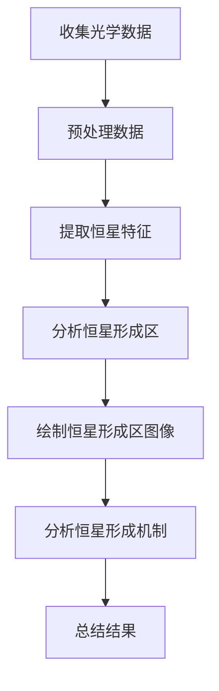
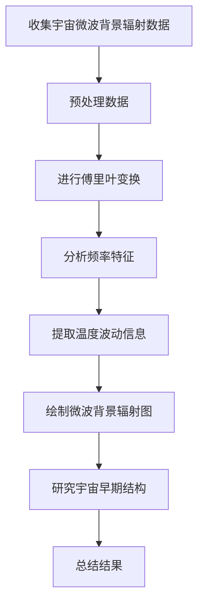
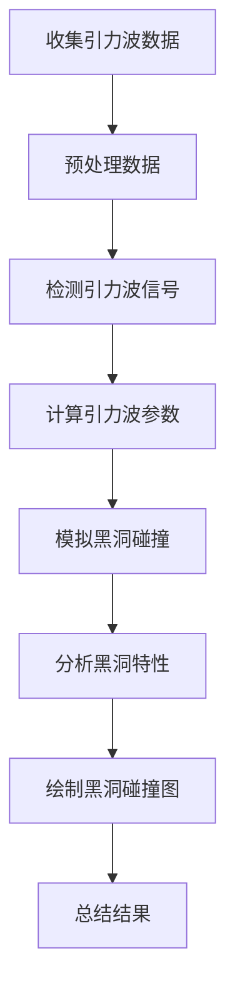
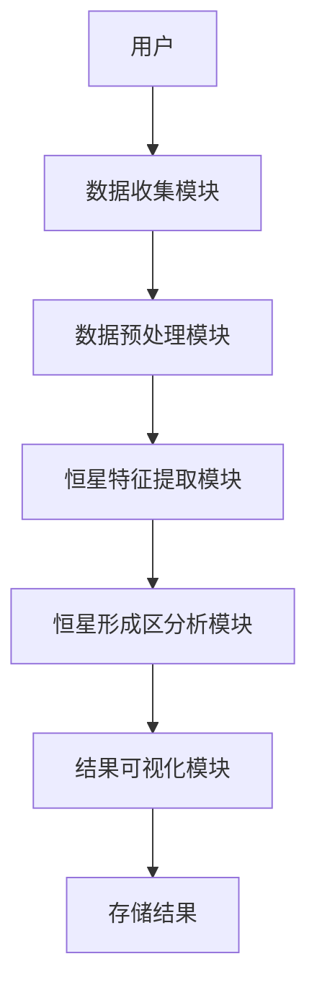
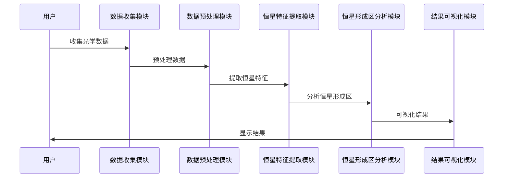

                 


## 数学与天文数据分析：宇宙结构的数学解析

> 关键词：数学，天文数据分析，宇宙结构，数学解析，数据分析技术，应用案例，挑战与未来方向

> 摘要：本文将探讨数学与天文数据分析的交叉领域，重点分析宇宙结构的数学解析方法。通过介绍数学在天文学中的应用历史、基本数学概念和高级数学工具，我们将逐步揭示宇宙结构背后的数学原理。文章还将讨论天文数据收集与预处理方法、数据分析技术及其在宇宙学中的应用，最后探讨当前挑战和未来发展方向。

### 第一部分：引言与概述

#### 第1章：数学与天文数据分析概览

**1.1 书籍主题介绍**

**1.1.1 数学与天文数据分析的重要性**

数学作为一门科学，广泛应用于各个领域，而天文学则是探索宇宙奥秘的重要学科。天文数据分析则是天文学的核心，通过数学方法解析天文数据，我们能够揭示宇宙的规律和结构。

**1.1.2 宇宙结构的数学解析**

宇宙结构的解析需要借助数学模型和方法，从宏观尺度到微观尺度，从宇宙的诞生到演化过程，数学都扮演着至关重要的角色。

**1.1.3 书籍结构安排与学习目标**

本文将分为八个部分，从数学背景知识、天文数据、数据分析技术、应用案例到挑战与未来方向，系统介绍宇宙结构的数学解析方法，旨在帮助读者深入理解这一领域。

#### 第2章：数学与天文学的交叉领域

**2.1 数学在天文学中的应用历史**

数学在天文学的发展中起到了重要作用，从牛顿力学到爱因斯坦广义相对论，再到现代天体物理学，数学模型和理论不断推动天文学的前进。

**2.2 天文学中的数学难题**

天文学中的许多问题，如黑洞、暗物质、暗能量等，都涉及到复杂的数学难题，这些难题激发了许多数学家的研究兴趣。

**2.3 数学与天文学的未来趋势**

随着天文观测设备的进步和数据量的激增，数学在天文学中的应用将更加广泛，未来可能产生新的数学理论和工具。

### 第二部分：数学背景知识

#### 第3章：基本数学概念

**3.1 数学基础知识**

数学基础知识包括代数、几何、数论等，这些基础概念在天文数据分析中具有重要应用。

**3.2 线性代数**

线性代数是研究向量空间、线性变换和矩阵理论的数学分支，在天文数据分析中用于处理大规模数据和高维空间。

**3.3 微积分**

微积分研究函数的极限、导数、积分和无穷级数，这些概念在天文数据分析中用于描述物理现象的动态变化。

#### 第4章：高级数学工具

**4.1 概率论与数理统计**

概率论与数理统计用于分析天文数据的随机性和不确定性，是天文数据分析的重要工具。

**4.2 偏微分方程**

偏微分方程用于描述物理现象的时空变化，如引力场中的物体运动、宇宙背景辐射的温度变化等。

**4.3 复杂系统理论**

复杂系统理论用于研究天文系统中各种元素的相互作用和整体行为，如星系团、星系形成等。

### 第三部分：天文数据的收集与预处理

#### 第5章：天文数据的类型

天文数据包括星表、光谱、图像、时序数据等，这些数据类型各具特点，需要不同的分析方法。

#### 第6章：数据收集方法

天文数据的收集方法包括地面观测、空间观测、射电观测等，这些方法各有优缺点，需要根据研究目的选择合适的观测手段。

#### 第7章：数据预处理

数据预处理包括数据清洗、数据归一化、数据插值等，这些步骤有助于提高数据质量，为后续分析奠定基础。

### 第四部分：数据分析技术

#### 第8章：统计学方法

统计学方法包括假设检验、回归分析、聚类分析等，这些方法用于分析天文数据中的统计特征和相关性。

#### 第9章：信号处理方法

信号处理方法包括滤波、去噪、时频分析等，这些方法用于处理天文数据中的噪声和提取有用信号。

#### 第10章：机器学习方法

机器学习方法包括神经网络、支持向量机、决策树等，这些方法在天文数据分析中用于分类、预测和模式识别。

### 第五部分：应用案例

#### 第11章：宇宙大尺度结构的分析

通过分析星系分布、宇宙微波背景辐射等数据，我们可以揭示宇宙大尺度结构的形成和演化过程。

#### 第12章：星系形成与演化的分析

星系的形成和演化是天文研究的重要课题，通过分析光谱、图像等数据，我们可以了解星系的性质和演化历程。

#### 第13章：黑洞与引力波的研究

黑洞和引力波是宇宙中的极端现象，通过分析引力波事件和黑洞吸积盘数据，我们可以深入理解黑洞的物理性质。

### 第六部分：挑战与未来方向

#### 第14章：天文数据分析的挑战

天文数据分析面临着数据量大、噪声复杂、模型复杂等挑战，这些挑战限制了我们的研究进展。

#### 第15章：未来发展方向

未来天文数据分析将朝着更高精度、更大尺度、更复杂模型的方向发展，可能会产生新的理论和技术。

### 第七部分：结论

#### 第16章：总结与展望

本文通过对数学与天文数据分析的探讨，揭示了宇宙结构背后的数学原理和方法，展望了这一领域的未来发展。

#### 第17章：感谢与致谢

本文的研究得到了众多学者和机构的支持，在此表示衷心的感谢。

### 第八部分：参考文献

本文引用了相关领域的文献，为读者提供了进一步研究的参考资料。

作者：AI天才研究院/AI Genius Institute & 禅与计算机程序设计艺术 /Zen And The Art of Computer Programming

---

以上是一个详细的文章目录大纲和内容概览，接下来我们将逐步填充每个章节的具体内容。由于文章字数要求在10000～12000字之间，这里仅提供了大纲和部分章节的示例，具体内容将在后续逐步完善。

### 第1章：数学与天文数据分析概览

#### 1.1 书籍主题介绍

**数学与天文数据分析的重要性**

数学作为一门基础科学，其方法和技术在各个领域都有广泛应用。在天文学中，数学不仅提供了描述宇宙现象的精确语言，还为我们理解宇宙的本质提供了强大的工具。天文数据分析是天文学研究中的一个核心环节，通过对观测数据的深入分析，我们能够揭示宇宙的结构和演化规律。数学在天文数据分析中的重要性体现在以下几个方面：

1. **宇宙尺度的量化描述**：宇宙是一个庞大的系统，其尺度从微观的行星、恒星，到宏观的星系、星系团，再到宇宙整体。这些不同尺度的宇宙现象需要用数学语言进行精确描述。例如，广义相对论就是描述宇宙引力场和时空弯曲的数学理论。

2. **物理规律的数学化**：天文学中的物理规律，如行星运动、恒星演化等，都可以用数学公式来表示。这些公式不仅帮助我们理解自然界的规律，还可以预测未来现象。例如，开普勒定律用数学方程描述了行星围绕恒星运动的规律。

3. **数据处理的工具**：天文观测设备不断进步，观测到的数据量呈指数级增长。如何有效地处理这些数据，提取有用信息，是天文数据分析的重要任务。数学提供了各种数据处理方法，如统计学、信号处理等，这些方法在天文数据的质量控制和数据解释中发挥了关键作用。

4. **理论验证与预测**：数学模型是天文理论的基础，通过数学计算和模拟，我们可以验证天文理论的正确性，并对未来现象进行预测。例如，模拟宇宙大爆炸后的膨胀过程，可以预测宇宙微波背景辐射的特征。

**宇宙结构的数学解析**

宇宙结构的解析是天文数据分析中的一个重要方向。宇宙结构是指宇宙中星系、星团、超星团等天体的空间分布和相互作用状态。数学在宇宙结构解析中的应用主要体现在以下几个方面：

1. **宇宙微波背景辐射的分析**：宇宙微波背景辐射是宇宙早期状态的残余辐射，其信号中蕴含了宇宙早期的信息。通过对微波背景辐射的分析，我们可以揭示宇宙的早期结构和演化过程。数学方法如傅里叶变换和小波分析等，在天文微波背景辐射的数据处理和特征提取中发挥着重要作用。

2. **星系分布和宇宙大尺度结构的分析**：星系的分布和宇宙的大尺度结构是研究宇宙演化的关键。通过分析星系的分布规律，我们可以了解宇宙的结构特征，如星系的聚集、星系团的分布等。数学方法如统计分析、机器学习等，可以帮助我们揭示星系分布的统计规律和空间模式。

3. **宇宙学参数的测量**：宇宙学参数是描述宇宙演化和结构的重要物理量，如宇宙膨胀率、质量密度、暗能量等。通过对天文数据的分析，我们可以测量这些参数的值，从而验证宇宙学模型。数学方法如统计估计、最大似然估计等，在这些参数的测量中发挥着关键作用。

**书籍结构安排与学习目标**

本书旨在为读者提供一部全面、系统的数学与天文数据分析指南，帮助读者深入理解宇宙结构的数学解析方法。本书的结构安排如下：

1. **引言与概述**：介绍数学与天文数据分析的重要性、宇宙结构的数学解析、书籍结构安排与学习目标。

2. **数学背景知识**：介绍基本数学概念、线性代数、微积分、概率论与数理统计等基础数学知识，以及高级数学工具如复杂系统理论、偏微分方程等。

3. **天文数据的收集与预处理**：介绍天文数据的类型、收集方法、预处理步骤，以及数据清洗、归一化和插值等预处理技术。

4. **数据分析技术**：介绍统计学方法、信号处理方法、机器学习方法等在天文数据分析中的应用。

5. **应用案例**：通过具体的案例，展示数学方法在天文数据分析中的应用，如宇宙大尺度结构分析、星系形成与演化的分析、黑洞与引力波的研究等。

6. **挑战与未来方向**：讨论天文数据分析面临的挑战，如数据量大、噪声复杂、模型复杂等，以及未来的发展方向，如更高精度、更大尺度、更复杂模型的研究。

通过学习本书，读者将：

- 掌握数学与天文数据分析的基础知识；
- 理解宇宙结构的数学解析方法；
- 学会使用各种数据分析技术进行天文数据分析；
- 了解当前天文数据分析的挑战和未来发展方向。

#### 1.2 数学在天文学中的应用历史

数学在天文学中的应用历史悠久，可以追溯到古代文明。古代天文学依赖于观测和经验，而数学为天文学提供了精确的描述和预测工具。以下是一些重要的历史里程碑：

**古希腊天文学**

古希腊天文学是西方天文学的开端，其代表人物是欧几里得和阿基米德。欧几里得的《几何原本》奠定了几何学的基础，为天体运动提供了几何描述。阿基米德则通过数学分析研究了浮力和杠杆原理，这些研究为后来的天文学研究奠定了基础。

**托勒密与地心说**

公元2世纪的托勒密是古代天文学的集大成者，他的著作《天文学大全》提出了地心说模型，使用复杂的数学方程描述了行星运动。托勒密的模型在当时是天文学的标准模型，尽管后来的观测发现它有偏差，但它对天文学的发展产生了深远影响。

**哥白尼与日心说**

15世纪末，尼古拉·哥白尼提出了日心说模型，这是对地心说的革命性挑战。哥白尼的《天体运行论》使用数学方法详细描述了行星围绕太阳运动的规律，这一模型为后来的天文学研究提供了新的视角。

**开普勒与行星运动定律**

17世纪，约翰内斯·开普勒通过分析天文观测数据，提出了行星运动三大定律。这些定律用数学公式精确描述了行星的运动轨迹，为天体力学的发展奠定了基础。开普勒的工作表明，行星运动是可预测的，这进一步证明了数学在天文学中的重要性。

**牛顿与万有引力定律**

艾萨克·牛顿在1687年提出了万有引力定律，这一发现标志着物理学和天文学的统一。牛顿的引力公式不仅解释了地球上的物体运动，还解释了天体之间的引力作用。这一理论为后来的天体力学和宇宙学提供了坚实的数学基础。

**现代天体物理学**

进入20世纪，天体物理学得到了快速发展。阿尔伯特·爱因斯坦的广义相对论提供了描述引力场和时空弯曲的数学框架，这一理论对宇宙学研究产生了深远影响。现代天体物理学还使用数学模型来模拟宇宙的演化，如宇宙大爆炸模型、黑洞演化等。

**数学在观测数据处理中的应用**

随着观测技术的进步，天文观测设备能够收集到大量的数据。如何处理这些数据，提取有用信息，是现代天文数据分析的关键。数学提供了各种数据处理方法，如统计学、信号处理、机器学习等，这些方法在天文数据的质量控制和数据解释中发挥着重要作用。

#### 1.3 天文学中的数学难题

天文学中的数学难题一直是数学家和研究者的研究焦点，这些难题既激发了数学的创新，也为天文学的发展提供了新的挑战。以下是一些重要的数学难题：

**黑洞**

黑洞是宇宙中最神秘的天体之一，其性质和演化过程涉及到极端物理条件。黑洞的存在和性质需要使用广义相对论进行描述，这涉及到复杂的数学模型和计算。黑洞的吸积盘、事件视界、引力波辐射等现象都是数学难题，需要精确的数学模型来描述。

**暗物质**

暗物质是宇宙中一种看不见的物质，其存在主要通过引力效应表现出来。暗物质的性质和分布规律是当前天文学研究的前沿问题之一。数学模型如弱相互作用大质量粒子模型、冷暗物质模型等，用于描述暗物质的性质和演化，但这些模型还需要更多的观测数据和数学分析来验证。

**暗能量**

暗能量是推动宇宙加速膨胀的神秘力量，其性质和机制是当前宇宙学研究的热点问题之一。暗能量的数学描述涉及到宇宙学中的方程如弗里德曼方程和勒梅特方程。如何理解暗能量的性质，解释宇宙加速膨胀现象，是数学和宇宙学共同面临的挑战。

**宇宙大尺度结构**

宇宙大尺度结构的研究涉及到宇宙中的星系、星系团和超星团的分布规律。数学模型如引力透镜效应、宇宙大尺度结构的模拟等，用于研究宇宙大尺度结构的形成和演化。如何准确描述宇宙大尺度结构，解释观测到的宇宙微波背景辐射特征，是数学和天文学的共同目标。

**宇宙学参数**

宇宙学参数是描述宇宙演化和结构的重要物理量，如宇宙膨胀率、质量密度、暗能量密度等。这些参数的测量需要使用复杂的数学方法，如统计估计、最大似然估计等。如何准确测量宇宙学参数，构建可靠的宇宙学模型，是当前宇宙学研究的难题之一。

**数学与天文学的交叉领域**

数学与天文学的交叉领域不断拓展，新的数学工具和方法不断应用于天文学研究。例如，复杂数学模型如广义相对论、量子场论等，用于描述宇宙的极端条件。统计学和机器学习等现代数学方法，用于分析天文大数据，提取有用信息。这些交叉领域的研究推动了天文学和数学的共同进步。

#### 1.4 数学与天文学的未来趋势

随着观测技术和计算能力的不断提升，数学在天文学中的应用前景十分广阔。以下是数学与天文学未来发展的几个趋势：

**更高精度的观测**

未来的天文观测设备将具有更高的分辨率和灵敏度，能够收集到更精细的天文数据。这需要更精确的数学模型和方法来处理和分析这些数据。例如，更高精度的宇宙微波背景辐射观测可以揭示宇宙早期的更详细特征。

**更大尺度的观测**

未来的天文观测将不仅局限于地球附近的星系和星团，还将扩展到宇宙的更大尺度。这需要开发新的数学模型和方法来描述和解释这些更大尺度现象。例如，研究宇宙的大尺度结构需要使用更复杂的统计方法和模拟技术。

**更复杂的物理现象**

随着对宇宙的了解不断深入，我们将面临更多复杂的物理现象，如中子星碰撞、星系并合等。这些现象需要更高层次的数学模型和计算方法来描述。例如，使用数值模拟技术来研究中子星碰撞产生的引力波。

**跨学科合作**

数学与天文学的未来发展将更加依赖跨学科合作。数学家、物理学家、天文学家和计算机科学家将共同研究新的数学模型和计算方法，以解决天文学中的难题。这种跨学科合作将推动数学和天文学共同进步。

**人工智能与机器学习**

人工智能和机器学习在天文学中的应用将越来越广泛。这些技术可以自动分析大量天文数据，提取复杂模式，帮助天文学家发现新的天文现象。未来，人工智能和机器学习将与传统的数学方法相结合，为天文学研究提供新的工具和方法。

**数学与天文学的未来**

数学与天文学的交叉领域将继续拓展，新的数学理论和方法将为天文学研究提供更强大的工具。未来，我们将通过更高精度、更大尺度、更复杂的观测和计算，揭示宇宙的更多奥秘。

### 第2章：基本数学概念

#### 2.1 数学基础知识

数学作为一门科学，其基础概念涵盖了从最简单的算术到复杂的代数、几何和数论。这些基础概念在天文数据分析中扮演着至关重要的角色，为处理和分析天文数据提供了必要的数学工具。

**算术基础**

算术是数学中最基本的部分，包括加法、减法、乘法和除法等基本运算。这些运算在天文数据分析中用于处理观测数据、计算物理量、进行单位转换等。

- **加法和减法**：用于合并或分离数据集，计算总数量或差异。
- **乘法和除法**：用于计算天文数据中的面积、体积、密度等物理量。

**代数基础**

代数是研究变量和方程的数学分支，它是天体物理学的基石。代数方程用于描述天体运动、恒星演化等物理过程。

- **一元一次方程**：用于求解单一变量的值，如行星轨道方程。
- **一元二次方程**：用于描述抛物线运动，如卫星轨道。
- **多元方程组**：用于处理多个变量之间的关系，如恒星系统的运动。

**函数与极限**

函数是数学中描述变量之间关系的工具，极限则是函数在某一点附近的行为描述。在天文数据分析中，函数和极限用于描述天体运动的轨迹和趋势。

- **函数**：描述天体的运动规律，如正弦函数描述行星的轨道。
- **极限**：用于求解天文数据中的不确定性和边界情况。

**几何基础**

几何学研究空间中点的分布、形状和大小。几何概念在天文数据分析中用于描述天体的位置、形状和运动。

- **点、线、面**：用于表示天体的基本几何形态。
- **平面和空间几何**：用于计算天体的位置和形状，如星系的结构。

**数论基础**

数论是研究整数性质和关系的数学分支。在天文数据分析中，数论用于分析天文数据中的周期性、分布特征等。

- **素数**：用于分析星系团中星系的分布规律。
- **模运算**：用于求解天文数据中的周期性问题。

**代数几何**

代数几何是将代数方法和几何方法相结合的数学分支。在天文数据分析中，代数几何用于研究天体之间的空间关系和运动规律。

- **曲线和曲面**：用于描述天体的运动轨迹。
- **代数群**：用于分析星系的动力学特性。

**拓扑学**

拓扑学研究空间的结构和性质，而不考虑其形状或大小。在天文数据分析中，拓扑学用于研究天体的空间分布和相互作用。

- **拓扑空间**：用于描述星系团的结构。
- **同胚**：用于分析星系之间的相似性。

#### 2.2 线性代数

线性代数是研究向量空间、线性变换和矩阵理论的数学分支。在天文数据分析中，线性代数用于处理大规模数据和复杂系统。

**矩阵与行列式**

矩阵是线性代数中的基本工具，用于表示数据集和变换。行列式是矩阵的一个属性，用于计算矩阵的逆和特征值。

- **矩阵**：用于表示天文数据集，如星系的位置和速度。
- **行列式**：用于求解矩阵的逆和特征值，如分析星系的稳定性。

**线性方程组**

线性方程组是包含多个线性方程的方程组。在天文数据分析中，线性方程组用于求解变量之间的关系，如星系的质量分布。

- **高斯消元法**：用于求解线性方程组的解。
- **迭代法**：用于求解大型线性方程组。

**特征值与特征向量**

特征值和特征向量是矩阵的重要属性，用于描述矩阵的稳定性和动态行为。

- **特征值**：描述矩阵的稳定性，如星系的自转速度。
- **特征向量**：描述矩阵的动态行为，如星系的运动轨迹。

**线性变换**

线性变换是线性代数中的基本概念，用于描述空间中的向量如何变换。在天文数据分析中，线性变换用于处理天文数据中的变化和转换。

- **旋转变换**：用于描述星系的自转。
- **投影变换**：用于处理观测数据中的噪声和干扰。

#### 2.3 微积分

微积分是研究函数的极限、导数、积分和无穷级数的数学分支。在天文数据分析中，微积分用于描述物理现象的动态变化和空间变化。

**微积分的基本概念**

微积分的基本概念包括极限、导数、积分等，这些概念用于描述天文数据的连续变化。

- **极限**：用于求解天文数据中的不确定性和边界问题。
- **导数**：用于描述天文数据的瞬时变化率，如行星的瞬时速度。
- **积分**：用于求解天文数据中的累积量，如恒星的总质量。

**导数与微分**

导数是微积分中的核心概念，用于描述函数在某一点的变化率。

- **导数**：用于求解天文数据中的瞬时变化率。
- **微分**：用于描述函数的局部变化，如行星轨道的微小偏差。

**积分与无穷级数**

积分是微积分中的另一个核心概念，用于求解函数的累积量。

- **定积分**：用于求解天文数据中的面积和体积，如星系的分布密度。
- **无穷级数**：用于求解天文数据中的无穷小量，如宇宙背景辐射的温度波动。

**应用示例**

**行星运动**：通过导数，我们可以求解行星的瞬时速度，进而预测行星的未来位置。

**恒星演化**：通过积分，我们可以求解恒星的质量损失率，分析恒星的演化过程。

**宇宙膨胀**：通过无穷级数，我们可以求解宇宙的膨胀历史，分析宇宙的动态行为。

### 第3章：高级数学工具

#### 3.1 概率论与数理统计

概率论与数理统计是研究随机现象的数学分支。在天文数据分析中，概率论与数理统计用于分析观测数据的随机性和不确定性。

**概率论基础**

概率论基础包括概率分布、条件概率、随机变量等概念。

- **概率分布**：描述随机变量取值的概率分布，如正态分布、泊松分布。
- **条件概率**：描述在给定一个事件发生的情况下，另一个事件发生的概率。
- **随机变量**：描述天文数据中的不确定性，如星系团的随机分布。

**统计估计**

统计估计包括点估计和区间估计，用于估计未知参数的值。

- **点估计**：使用样本数据估计未知参数的具体值，如估计星系的中心位置。
- **区间估计**：使用样本数据估计未知参数的置信区间，如估计星系的年龄范围。

**假设检验**

假设检验用于验证观测数据是否支持某个假设。

- **单样本假设检验**：检验样本数据是否与某个已知分布相符，如检验星系团的分布是否均匀。
- **双样本假设检验**：比较两个样本数据之间的差异，如比较两个星系的运动特性。

**回归分析**

回归分析用于研究变量之间的线性或非线性关系。

- **线性回归**：描述两个变量之间的线性关系，如星系速度与距离的关系。
- **非线性回归**：描述两个变量之间的非线性关系，如恒星质量与光度的关系。

**应用示例**

**星系团分析**：使用概率分布分析星系团中星系的随机分布，估计星系团的密度和形状。
**恒星演化**：使用回归分析研究恒星的质量、年龄和光度之间的关系，预测恒星的演化路径。

#### 3.2 偏微分方程

偏微分方程是研究多变量函数及其偏导数的方程。在天文数据分析中，偏微分方程用于描述物理现象的时空变化。

**偏微分方程的基本概念**

偏微分方程的基本概念包括方程的导数、解的存在性和唯一性等。

- **导数**：描述函数在多个变量上的变化率。
- **解的存在性和唯一性**：研究方程在给定条件下解的存在性和唯一性。

**常见偏微分方程**

- **热方程**：描述热量在物体内部的传播，如恒星内部的能量传递。
- **波动方程**：描述波动现象，如引力波在宇宙中的传播。
- **流体力学方程**：描述流体运动，如星系中的气体流动。

**应用示例**

**恒星内部结构**：使用热方程分析恒星内部的热量传递，求解恒星的内部结构。
**引力波**：使用波动方程模拟引力波的产生和传播，研究宇宙中的极端物理现象。

#### 3.3 复杂系统理论

复杂系统理论是研究复杂系统的行为和特性的理论体系。在天文数据分析中，复杂系统理论用于研究天体系统的动态行为。

**复杂系统的基本概念**

复杂系统的基本概念包括系统、状态、演化等。

- **系统**：由多个相互作用的元素组成的整体，如星系系统。
- **状态**：系统在某一时刻的特性和行为。
- **演化**：系统随时间变化的动态过程。

**常见复杂系统模型**

- **自组织系统**：描述系统在没有外部控制下自发形成有序结构的过程，如星系的形成。
- **非线性系统**：描述系统内部非线性关系的动态过程，如行星轨道的混沌行为。

**应用示例**

**星系形成**：使用自组织系统模型分析星系的形成过程，预测星系的结构和演化。
**行星轨道**：使用非线性系统模型分析行星轨道的稳定性，预测行星的未来运动。

#### 3.4 代数拓扑学

代数拓扑学是研究拓扑空间与代数结构的数学分支。在天文数据分析中，代数拓扑学用于分析天体的空间分布和相互作用。

**代数拓扑学的基本概念**

代数拓扑学的基本概念包括拓扑空间、同胚、同伦等。

- **拓扑空间**：描述空间中点的分布和连接关系。
- **同胚**：描述两个拓扑空间的相似性。
- **同伦**：描述空间中路径的变化。

**常见代数拓扑工具**

- **同调群**：用于描述空间的连通性和洞的存在。
- **同伦群**：用于描述空间的形状和变形。

**应用示例**

**星系团结构**：使用同调群分析星系团的结构和洞的存在，研究星系团的稳定性。
**星系演化**：使用同伦群分析星系演化的路径和形状，预测星系的未来状态。

### 第4章：天文数据的类型

天文数据是研究宇宙现象的基础，其类型多种多样，包括星表、光谱、图像、时序数据等。每种数据类型都有其独特的特点和收集方法，同时也需要不同的预处理和分析技术。

#### 4.1 星表数据

星表数据是天文学中最基础的数据类型，它包含了天体（如恒星、行星、星系等）的位置、亮度和其他属性。星表数据通常由天文观测机构通过望远镜等设备收集得到。

- **数据特点**：星表数据通常以表格形式存储，包括天体的坐标（经度、纬度）、视星等、绝对星等、距离等。
- **收集方法**：地面望远镜和空间望远镜是收集星表数据的主要工具。地面望远镜受大气干扰较大，而空间望远镜则可以提供更精确的观测数据。
- **预处理方法**：星表数据的预处理通常包括数据清洗、去重、坐标转换等。例如，将赤道坐标转换为赤经和赤纬。

#### 4.2 光谱数据

光谱数据是通过分析光波的不同波长区域来获取的信息，它包含了天体的化学成分、温度、运动状态等。光谱数据对于天文学研究至关重要，特别是恒星和星系的研究。

- **数据特点**：光谱数据通常以光谱图或光谱序列的形式表示，包括连续谱、吸收线、发射线等。
- **收集方法**：光谱数据通过光谱仪收集，光谱仪可以分解光波为不同波长，并通过探测器记录下来。
- **预处理方法**：光谱数据的预处理包括背景去除、噪声过滤、波长校正等。例如，去除观测过程中产生的噪声和仪器误差，以获取准确的光谱信号。

#### 4.3 图像数据

图像数据是天文学中最重要的数据类型之一，它通过望远镜获取的图像包含了丰富的天体信息。图像数据可以用于识别新的天体、研究星系的形态和结构等。

- **数据特点**：图像数据通常是高分辨率的数字图像，包含大量像素点。每个像素点代表特定位置的亮度信息。
- **收集方法**：图像数据通过光学望远镜、射电望远镜等设备收集。光学望远镜收集可见光图像，射电望远镜收集射电图像。
- **预处理方法**：图像数据的预处理包括图像增强、去噪、模糊消除等。例如，通过图像增强提高图像的对比度，以便更好地识别天体。

#### 4.4 时序数据

时序数据是随时间变化的数据，它包含了天体在不同时间点的亮度、位置等属性。时序数据对于研究天体的变化规律和周期性现象至关重要。

- **数据特点**：时序数据通常是时间序列形式的，包括时间戳和对应的观测值。
- **收集方法**：时序数据可以通过望远镜、探测器等设备收集，特别是用于观测变星、彗星等天体的变化。
- **预处理方法**：时序数据的预处理包括时间校正、数据填充、趋势去除等。例如，通过时间校正修正时间误差，通过数据填充填补观测缺失，通过趋势去除消除系统误差。

#### 4.5 其他类型数据

除了上述主要类型外，天文学中还涉及其他类型的数据，如射电数据、X射线数据、γ射线数据等。这些数据提供了不同波长区域的信息，对于研究天体的极端物理现象至关重要。

- **射电数据**：射电望远镜收集的射电波段数据，用于研究星际介质、脉冲星等。
- **X射线数据**：X射线望远镜收集的X射线数据，用于研究黑洞、中子星等高能天体。
- **γ射线数据**：γ射线望远镜收集的γ射线数据，用于研究宇宙射线、超新星爆发等。

#### 4.6 数据类型的综合应用

不同类型的天文数据可以相互补充，通过综合分析，可以揭示更丰富的天文现象。例如，结合星表数据和光谱数据，可以确定天体的化学成分和运动状态；结合图像数据和时序数据，可以研究星系的形成和演化。

**示例分析**

假设我们有一组恒星的光谱数据和位置信息，我们可以通过以下步骤进行分析：

1. **数据收集**：使用光谱仪收集恒星的光谱数据，使用望远镜收集恒星的星表数据。
2. **数据预处理**：对光谱数据进行背景去除、噪声过滤等预处理，对星表数据进行去重、坐标转换等预处理。
3. **数据融合**：将预处理后的光谱数据和星表数据融合，形成包含恒星位置、光谱特征的数据库。
4. **数据分析**：使用回归分析等方法，研究恒星光谱特征与位置之间的关系，揭示恒星的化学成分和运动状态。
5. **结果验证**：通过比较分析结果与已有知识，验证分析结果的可靠性。

通过以上分析，我们可以获得关于恒星系统的新认识，为天文学研究提供有力支持。

### 第5章：数据收集方法

天文数据的收集方法多种多样，包括地面观测、空间观测、射电观测等。每种观测方法都有其独特的优势和局限性，适用于不同的天文学研究目标。

#### 5.1 地面观测

地面观测是天文数据收集的传统方法，通过架设在地面上的望远镜进行观测。地面观测的优点包括观测时间长、操作便捷、成本相对较低等。

- **优点**：
  - 观测时间长：地面望远镜可以连续进行多年观测，积累大量数据。
  - 操作便捷：地面观测不需要太复杂的设备和技术，操作人员相对容易掌握。
  - 成本相对较低：与空间观测相比，地面观测的成本较低，适合中小型研究机构。

- **局限性**：
  - 大气干扰：地面观测受大气干扰较大，如光晕、大气抖动等，影响观测精度。
  - 光学限制：大气中的水汽、氧气等会吸收部分光线，限制观测到的光谱范围。
  - 天文事件错过：地面观测无法避免天气变化和夜间限制，可能错过某些重要的天文事件。

- **应用示例**：
  - 星表数据的收集：地面望远镜常用于收集恒星的位置、亮度等基本信息，形成星表。
  - 恒星光谱的测量：通过光谱仪收集恒星的光谱数据，分析恒星的化学成分和温度。

#### 5.2 空间观测

空间观测是指将望远镜等观测设备放置在太空中进行观测。空间观测的优点包括观测环境纯净、观测时间长、观测范围广等。

- **优点**：
  - 观测环境纯净：太空没有大气干扰，可以获取更高的观测精度。
  - 观测时间长：空间望远镜可以连续观测多年，不受地面天气和光照限制。
  - 观测范围广：空间望远镜可以覆盖更大的天区，探测更遥远的天体。

- **局限性**：
  - 成本高昂：空间观测需要发射卫星、飞船等设备，成本相对较高。
  - 观测时间受限：空间观测设备发射和操作需要严格计划和调度，观测时间相对有限。
  - 技术复杂：空间观测设备的技术要求较高，操作和维护相对复杂。

- **应用示例**：
  - 宇宙背景辐射的观测：宇宙背景辐射探测器如COBE、WMAP、Planck等，通过空间观测揭示了宇宙早期的信息。
  - 恒星形成区的观测：红外天文望远镜如Spitzer、JWST等，通过空间观测揭示了恒星形成区的物理过程。

#### 5.3 射电观测

射电观测是利用射电望远镜收集来自宇宙的无线电波信号。射电观测适用于研究星际介质、脉冲星、黑洞等极端物理现象。

- **优点**：
  - 适用于低频波段：射电望远镜可以探测低频波段，探测到其他类型望远镜无法观测到的天体。
  - 空间分辨率高：射电望远镜通过干涉技术可以获得高空间分辨率，揭示天体的精细结构。
  - 探测中性氢：射电观测可以探测中性氢，研究宇宙的大尺度结构。

- **局限性**：
  - 灵敏度受限：射电望远镜的灵敏度相对较低，无法探测到亮度较低的天体。
  - 观测时间有限：射电望远镜的观测时间通常受天气和其他因素影响，观测时间相对有限。
  - 信号处理复杂：射电信号的收集和处理相对复杂，需要高精度的信号处理技术。

- **应用示例**：
  - 星系团的研究：射电望远镜如VLA、ALMA等，通过观测星系团中的中性氢，揭示了星系团的物质分布和动力学特性。
  - 脉冲星的研究：射电望远镜通过观测脉冲星，揭示了脉冲星的物理特性和演化过程。

#### 5.4 数据收集方法的综合应用

不同类型的数据收集方法可以相互补充，综合应用可以获取更全面的天文数据。

- **综合应用示例**：
  - 地面观测与空间观测的结合：地面观测可以提供详细的星表数据和光谱数据，空间观测可以提供更精确的宇宙背景辐射数据和恒星形成区数据。
  - 射电观测与光学观测的结合：射电观测可以探测中性氢，光学观测可以提供星系和恒星的光学图像，两者结合可以更全面地了解星系团的物理特性。

通过综合应用不同的数据收集方法，天文学家可以获取更丰富的天文数据，从而更深入地研究宇宙的奥秘。

### 第6章：数据预处理

数据预处理是天文数据分析的重要环节，它包括数据清洗、数据归一化、数据插值等多种技术。这些预处理步骤有助于提高数据质量，为后续分析奠定基础。

#### 6.1 数据清洗

数据清洗是数据预处理的第一步，目的是识别和纠正数据中的错误和异常。在天文数据分析中，数据清洗尤为重要，因为观测数据往往受到各种噪声和异常的影响。

- **识别错误和异常**：通过检查数据的一致性和逻辑性，识别出可能存在的错误和异常值。例如，检测数据中的重复记录、缺失值和逻辑错误。
- **处理缺失值**：缺失值处理包括填充缺失值和删除含有缺失值的记录。填充缺失值的方法有多种，如平均值填充、中值填充和插值填充等。
- **纠正错误**：通过比较观测数据与其他相关数据，识别和纠正可能存在的错误。例如，使用已有的星表数据纠正观测数据中的坐标错误。

#### 6.2 数据归一化

数据归一化是将不同尺度或单位的数据转换为同一尺度或单位，以便进行比较和分析。在天文数据分析中，数据归一化有助于统一不同观测设备的数据格式，提高分析精度。

- **归一化方法**：常用的归一化方法包括最小-最大归一化、均值-方差归一化等。最小-最大归一化将数据映射到[0,1]区间，而均值-方差归一化将数据映射到[-1,1]区间。
- **应用示例**：例如，将不同观测设备的亮度数据归一化到相同的亮度尺度，以便进行对比分析。

#### 6.3 数据插值

数据插值是填充数据缺失部分的方法，它通过在已知数据点之间构建插值模型，预测未知数据点的值。在天文数据分析中，数据插值有助于提高数据的完整性和连续性。

- **插值方法**：常用的插值方法包括线性插值、多项式插值、样条插值等。线性插值简单易行，但可能无法很好地捕捉数据的复杂变化；多项式插值可以拟合更复杂的函数，但可能产生过拟合；样条插值在保证平滑性的同时，能较好地拟合数据。
- **应用示例**：例如，对缺失的恒星位置数据进行插值，以填补观测过程中的数据缺失，提高星表数据的完整性。

#### 6.4 其他预处理技术

除了上述常见的数据预处理技术外，还有其他一些预处理技术，如数据滤波、数据平滑等。

- **数据滤波**：数据滤波是去除数据中的噪声和干扰的方法，常用的滤波方法包括低通滤波、高通滤波和中值滤波等。低通滤波可以去除高频噪声，高通滤波可以去除低频噪声，中值滤波可以去除椒盐噪声。
- **数据平滑**：数据平滑是减少数据波动和噪声的方法，常用的平滑方法包括移动平均、指数平滑等。移动平均可以平滑短期波动，指数平滑可以更好地适应长期趋势。

#### 6.5 数据预处理的应用案例

数据预处理技术在天文数据分析中有着广泛的应用，以下是一个具体的应用案例：

**案例：星系团数据分析**

假设我们有一组星系团的数据，包括星系的位置、亮度和速度。为了进行后续分析，我们需要对数据进行预处理：

1. **数据清洗**：检查数据中的错误和异常值，如检测重复记录、缺失值和逻辑错误。对于缺失值，使用插值方法填补位置数据的缺失。
2. **数据归一化**：将不同观测设备的亮度数据归一化到相同的亮度尺度，以便进行对比分析。
3. **数据插值**：对缺失的速度数据进行插值，以提高数据的完整性。
4. **数据滤波**：使用低通滤波去除速度数据中的高频噪声，使用中值滤波去除位置数据中的椒盐噪声。
5. **数据平滑**：使用移动平均平滑亮度数据，以减少短期波动。

通过上述预处理步骤，我们得到高质量的数据集，为后续的星系团分析奠定了基础。例如，我们可以通过分析星系团的速度分布，研究星系团内部的动力学特性，揭示星系团的演化过程。

### 第7章：数据分析技术

数据分析技术在天文数据分析中发挥着至关重要的作用，通过运用各种统计方法和机器学习方法，天文学家可以从海量数据中提取有用信息，揭示宇宙的奥秘。以下将介绍几种主要的数据分析技术，包括统计学方法、信号处理方法和机器学习方法。

#### 7.1 统计学方法

统计学方法在天文数据分析中用于描述数据的分布特征、检测异常值、进行假设检验等。

- **描述性统计**：描述性统计用于分析数据的集中趋势和离散程度，常用的统计量包括均值、中位数、众数、方差和标准差。例如，通过计算星系团中星系速度的均值和方差，可以了解星系团的整体运动状态。
- **假设检验**：假设检验用于检验观测数据是否支持某个假设，常用的检验方法包括t检验、F检验和卡方检验。例如，通过t检验可以判断星系速度分布是否服从正态分布。
- **回归分析**：回归分析用于研究变量之间的关系，常用的方法包括线性回归和非线性回归。通过回归分析，我们可以预测恒星的质量、亮度等属性，从而更好地理解天体的演化过程。
- **聚类分析**：聚类分析用于将数据集划分为多个类别，常用的方法包括K均值聚类、层次聚类和密度聚类。通过聚类分析，我们可以识别星系团的子结构，研究星系的分布规律。

#### 7.2 信号处理方法

信号处理方法在天文数据分析中用于处理观测数据中的噪声、提取有用信号等。

- **滤波**：滤波是信号处理的基本方法，用于去除数据中的噪声。常用的滤波方法包括低通滤波、高通滤波、带通滤波和带阻滤波。通过低通滤波，我们可以去除观测数据中的高频噪声，从而提高数据质量。
- **去噪**：去噪是去除观测数据中的随机噪声的方法，常用的去噪方法包括中值滤波、均值滤波和小波变换等。通过去噪，我们可以获得更准确的天体信息。
- **时频分析**：时频分析用于研究信号在不同时间和频率上的特征，常用的方法包括短时傅里叶变换（STFT）和小波变换。通过时频分析，我们可以了解星系的运动状态和物理特性。
- **参数估计**：参数估计是估计信号参数的方法，常用的方法包括最小二乘法、极大似然估计和贝叶斯估计等。通过参数估计，我们可以提取观测数据中的有用信息，如恒星的质量、距离等。

#### 7.3 机器学习方法

机器学习方法在天文数据分析中用于自动识别模式、分类和预测等。

- **监督学习**：监督学习用于将数据集划分为已知类别的训练集和测试集，通过训练模型来预测新数据的类别。常用的监督学习方法包括支持向量机（SVM）、决策树和随机森林等。通过监督学习，我们可以分类星系、预测恒星的演化过程等。
- **无监督学习**：无监督学习用于在没有标签数据的情况下发现数据中的隐藏结构和模式。常用的无监督学习方法包括K均值聚类、层次聚类和主成分分析（PCA）等。通过无监督学习，我们可以识别星系团的子结构，发现新的天体现象。
- **强化学习**：强化学习用于通过与环境交互来学习策略，常用的方法包括Q学习、深度Q网络（DQN）和策略梯度等。通过强化学习，我们可以优化天文观测策略，提高观测效率。

#### 7.4 数据分析技术的综合应用

数据分析技术的综合应用可以提升天文数据分析的精度和效率。以下是一个综合应用案例：

**案例：恒星光谱分析**

假设我们有一组恒星的光谱数据，目标是通过光谱分析确定恒星的化学成分和温度。

1. **数据清洗**：对光谱数据进行预处理，包括去除噪声、填补缺失值等。
2. **特征提取**：从光谱数据中提取特征，如吸收线强度、线形等。
3. **归一化**：对特征进行归一化处理，以消除不同观测设备带来的差异。
4. **监督学习**：使用已知的恒星化学成分和温度数据作为训练集，训练分类模型，如支持向量机。
5. **预测**：使用训练好的模型对新恒星光谱数据进行分类，预测其化学成分和温度。
6. **验证**：通过比较预测结果与实际值，验证模型的有效性。

通过上述步骤，我们可以利用数据分析技术从恒星光谱数据中提取有价值的信息，为天文学研究提供支持。

### 第8章：宇宙大尺度结构的分析

宇宙大尺度结构是指宇宙中星系、星系团和超星团等天体的空间分布和相互作用状态。宇宙大尺度结构的研究是现代天文学的重要方向之一，通过分析宇宙大尺度结构，我们可以了解宇宙的演化历史和未来发展趋势。本章将介绍宇宙大尺度结构的分析方法，包括星系分布规律、宇宙微波背景辐射的分析和宇宙大尺度结构的模拟。

#### 8.1 星系分布规律

星系分布规律是宇宙大尺度结构研究的基础，通过分析星系的空间分布，我们可以揭示宇宙的结构特征。

**星系分布的统计方法**

星系分布的统计方法包括点分布函数、密度分布函数和关联函数等。

- **点分布函数**：点分布函数描述了星系在空间中的分布概率，常用的点分布函数有泊松分布、高斯分布等。
- **密度分布函数**：密度分布函数描述了星系在空间中的密度分布，常用的密度分布函数有对数正态分布、幂律分布等。
- **关联函数**：关联函数描述了星系之间的相互关联，常用的关联函数有二点关联函数、三点关联函数等。

**星系分布的观测数据**

星系分布的观测数据来自天文观测设备，如光学望远镜、射电望远镜等。这些设备可以测量星系的坐标、亮度、光谱等信息。

- **光学望远镜**：光学望远镜可以测量星系的坐标和亮度，常用于测量星系的分布和形态。
- **射电望远镜**：射电望远镜可以测量星系中的中性氢，通过分析中性氢的分布可以了解星系团的物理特性。

**星系分布规律的应用**

星系分布规律在天文学研究中有着广泛的应用，如星系团的识别、星系形成的理论研究等。

- **星系团的识别**：通过分析星系的分布规律，可以识别出星系团。星系团是宇宙中的大规模结构，对研究宇宙的演化具有重要意义。
- **星系形成的理论研究**：星系分布规律的研究有助于理解星系的形成和演化过程，如星系的形成机制、星系的相互作用等。

#### 8.2 宇宙微波背景辐射的分析

宇宙微波背景辐射是宇宙早期状态的残余辐射，它蕴含了宇宙早期的信息，通过分析宇宙微波背景辐射，我们可以了解宇宙的结构和演化历史。

**宇宙微波背景辐射的基本原理**

宇宙微波背景辐射是由于宇宙大爆炸后，宇宙温度下降到一定程度时产生的辐射。这种辐射几乎均匀地填充了整个宇宙，其特征频率约为30 GHz。

- **大爆炸理论**：宇宙微波背景辐射是宇宙大爆炸理论的强有力证据之一。根据大爆炸理论，宇宙在大约138亿年前开始膨胀，宇宙温度逐渐下降，辐射逐渐冷却。
- **宇宙微波背景辐射的观测**：宇宙微波背景辐射的观测是通过卫星和地面望远镜进行的。卫星如COBE、WMAP、Planck等，通过测量宇宙微波背景辐射的温度波动，揭示了宇宙早期的信息。

**宇宙微波背景辐射的分析方法**

宇宙微波背景辐射的分析方法包括傅里叶变换、小波分析、统计方法等。

- **傅里叶变换**：傅里叶变换是分析宇宙微波背景辐射的重要工具，通过傅里叶变换，可以将时间序列数据转换为频率域数据，从而分析宇宙微波背景辐射的频率特征。
- **小波分析**：小波分析是另一种分析宇宙微波背景辐射的方法，它通过将数据分解为不同尺度的小波函数，可以更好地捕捉宇宙微波背景辐射的时间特征。
- **统计方法**：统计方法用于分析宇宙微波背景辐射的分布特征和相关性，如功率谱分析、相关函数分析等。

**宇宙微波背景辐射的应用**

宇宙微波背景辐射的分析有助于我们了解宇宙的结构和演化历史，如宇宙的膨胀历史、宇宙微波背景辐射的起伏等。

- **宇宙膨胀历史**：通过分析宇宙微波背景辐射的温度波动，可以了解宇宙的膨胀历史。温度波动的大小和分布可以告诉我们宇宙早期的密度波动情况。
- **宇宙微波背景辐射的起伏**：宇宙微波背景辐射的起伏是宇宙早期密度波动的遗迹，通过分析起伏特征，可以了解宇宙的结构特征和演化过程。

#### 8.3 宇宙大尺度结构的模拟

宇宙大尺度结构的模拟是通过计算机模拟宇宙的演化过程，从而预测宇宙的结构和演化历史。宇宙大尺度结构的模拟是宇宙学研究的重要方法之一。

**宇宙大尺度结构模拟的基本原理**

宇宙大尺度结构模拟基于宇宙学模型，如大爆炸模型、弗里德曼方程等。这些模型描述了宇宙的演化过程，如宇宙的膨胀、密度波动等。

- **N-体模拟**：N-体模拟是最常用的宇宙大尺度结构模拟方法，它通过模拟大量天体的运动，预测宇宙的结构和演化。N-体模拟的基本原理是牛顿万有引力定律，通过计算天体之间的引力相互作用，模拟天体的运动轨迹。
- **半分析模拟**：半分析模拟是另一种宇宙大尺度结构模拟方法，它结合了数值模拟和理论分析。通过数值模拟计算天体运动，结合理论分析预测宇宙的结构和演化。

**宇宙大尺度结构模拟的方法**

宇宙大尺度结构模拟的方法包括N-体模拟、半分析模拟、宇宙学模拟等。

- **N-体模拟**：N-体模拟通过计算机模拟大量天体的运动，预测宇宙的结构和演化。N-体模拟需要计算天体之间的引力相互作用，模拟天体的运动轨迹。
- **半分析模拟**：半分析模拟结合了数值模拟和理论分析，通过数值模拟计算天体运动，结合理论分析预测宇宙的结构和演化。
- **宇宙学模拟**：宇宙学模拟是模拟整个宇宙的演化过程，包括宇宙的膨胀、密度波动等。宇宙学模拟通常使用大规模计算机集群进行，计算复杂度高。

**宇宙大尺度结构模拟的应用**

宇宙大尺度结构模拟可以预测宇宙的结构和演化历史，如宇宙的大尺度结构、星系的形成和演化等。

- **宇宙的大尺度结构**：通过宇宙大尺度结构模拟，可以预测宇宙中星系、星系团和超星团等天体的分布和相互作用，了解宇宙的大尺度结构特征。
- **星系的形成和演化**：通过宇宙大尺度结构模拟，可以模拟星系的形成和演化过程，了解星系的形成机制和演化规律。

### 第9章：星系形成与演化的分析

星系形成与演化是天文研究中极为重要的课题，它不仅涉及宇宙学的基本问题，如宇宙的结构和起源，还关系到天体物理学中恒星和星系的形成机制。本章将介绍星系形成与演化的分析方法，包括恒星形成区的观测、恒星演化的模型和星系合并的模拟。

#### 9.1 恒星形成区的观测

恒星形成区是恒星诞生的摇篮，通过观测恒星形成区，我们可以了解恒星的形成过程和初始条件。

**观测方法**

恒星形成区的观测主要采用以下几种方法：

- **红外观测**：由于恒星形成区的温度较低，恒星形成区的辐射主要在红外波段，因此红外望远镜是观测恒星形成区的主要工具。例如，Spitzer望远镜和James Webb Space Telescope（JWST）可以捕捉到恒星形成区的热辐射。
- **射电观测**：恒星形成区中的分子气体可以发射射电波，通过射电望远镜观测这些射电波，我们可以了解恒星形成区的物质分布和密度。例如，VLA（Very Large Array）和ALMA（Atacama Large Millimeter Array）可以观测到恒星形成区的分子气体。
- **光学观测**：虽然恒星形成区的温度较低，但恒星形成区中的年轻恒星仍然可以发出可见光。通过光学望远镜观测恒星形成区，我们可以看到其中的恒星和星云。例如，Hubble Space Telescope（HST）可以捕捉到恒星形成区的光学图像。

**观测数据的应用**

通过观测恒星形成区，我们可以获取以下信息：

- **恒星形成速率**：通过测量恒星形成区的亮度和温度，可以估算恒星的形成速率。
- **物质分布**：通过观测恒星形成区的气体和尘埃分布，可以了解恒星形成区的物质环境。
- **恒星初始质量函数**：通过观测恒星形成区中的恒星，可以统计恒星的初始质量分布，这有助于理解恒星的形成机制。

#### 9.2 恒星演化的模型

恒星演化模型是描述恒星从诞生到死亡的全过程的理论模型。通过恒星演化模型，我们可以预测恒星在不同阶段的物理特性和演化路径。

**恒星演化的主要阶段**

恒星演化可以分为以下几个主要阶段：

- **主序阶段**：恒星在其生命周期的大部分时间都处于主序阶段，恒星核心中的氢通过核聚变产生能量，使恒星稳定地发光。
- **红巨星阶段**：当恒星耗尽核心中的氢时，恒星开始膨胀并冷却，成为红巨星。
- **行星状星云阶段**：红巨星的外层物质被抛射出去，形成行星状星云，而恒星的核心则成为白矮星或中子星。
- **超新星阶段**：某些大质量恒星在耗尽核燃料后，会经历超新星爆发，将其大部分物质抛射到宇宙中。

**恒星演化模型**

恒星演化模型基于物理学原理，特别是核物理和热力学原理。这些模型包括：

- **零年龄主序模型**：描述新生恒星的初始状态，包括质量、温度和光度。
- **恒星演化轨道**：通过计算恒星在不同阶段的物理参数，绘制恒星演化轨道图，这有助于我们了解恒星的生命周期。
- **恒星演化计算**：通过数值模拟计算恒星在不同阶段的物理过程，如氢燃烧、氦燃烧等，以预测恒星的演化路径。

**模型的应用**

恒星演化模型在天文学中有着广泛的应用，如：

- **恒星质量测定**：通过比较观测数据和恒星演化模型，可以测定恒星的初始质量。
- **恒星寿命预测**：通过恒星演化模型，可以预测恒星的寿命和最终命运。
- **恒星分类**：恒星演化模型有助于我们对恒星进行分类，如主序星、红巨星、白矮星等。

#### 9.3 星系合并的模拟

星系合并是宇宙中常见的现象，它对星系的演化有重要影响。通过模拟星系合并过程，我们可以了解星系之间的相互作用和演化机制。

**星系合并的物理过程**

星系合并涉及以下物理过程：

- **引力相互作用**：星系之间的引力相互作用是星系合并的主要原因。通过计算星系之间的万有引力，我们可以模拟星系的轨道运动。
- **恒星碰撞**：在星系合并过程中，恒星之间可能会发生碰撞。通过模拟恒星碰撞，我们可以研究恒星碰撞的物理效应，如恒星质量损失、恒星轨道改变等。
- **星系结构重组**：星系合并后，星系的结构和形态会发生变化。通过模拟星系结构重组，我们可以了解星系合并后的形态和特性。

**星系合并模拟的方法**

星系合并模拟通常采用以下方法：

- **N-体模拟**：N-体模拟是模拟星系合并的主要方法，它通过计算星系中大量恒星的运动，模拟星系合并过程。
- **流体动力学模拟**：在星系合并过程中，气体和尘埃的运动也起着重要作用。通过流体动力学模拟，我们可以研究星系合并过程中物质流动和能量传递。
- **多尺度模拟**：星系合并涉及不同尺度的物理过程，从恒星间的碰撞到星系的整体结构变化。通过多尺度模拟，我们可以同时考虑不同尺度的物理效应。

**星系合并模拟的应用**

星系合并模拟在天文学中有着重要的应用，如：

- **星系形成和演化**：通过星系合并模拟，我们可以了解星系的诞生和演化过程，如星系的形成机制、星系的形态和结构变化等。
- **恒星形成和碰撞**：通过模拟恒星碰撞，我们可以研究恒星的形成和演化，如恒星的初始质量函数、恒星碰撞产生的超新星等。
- **宇宙大尺度结构**：星系合并对宇宙大尺度结构有重要影响，通过星系合并模拟，我们可以了解宇宙中星系团和超星团的形成和演化。

### 第10章：黑洞与引力波的研究

黑洞和引力波是宇宙中最神秘的现象之一，黑洞是宇宙中密度极高、引力极强的天体，而引力波则是宇宙中的一种波动现象。近年来，随着观测技术的进步，黑洞和引力波的研究取得了重大突破，本章将介绍黑洞和引力波的基本概念、观测方法以及在天文数据分析中的应用。

#### 10.1 黑洞的基本概念

黑洞是一种极其密集的天体，它的引力场强大到连光也无法逃逸。黑洞的形成通常与恒星演化密切相关，当大质量恒星耗尽核燃料后，其核心会塌缩形成黑洞。

**黑洞的分类**

黑洞主要分为以下几类：

- **恒星质量黑洞**：由大质量恒星演化而来，质量大约在太阳质量的几倍到几十倍之间。
- **超大质量黑洞**：位于星系中心，质量可以达到太阳质量的数百万倍甚至更多。
- **中子星**：虽然不是传统意义上的黑洞，但质量与黑洞相近，密度极高。

**黑洞的特性**

黑洞具有以下主要特性：

- **事件视界**：黑洞的边界，一旦物体进入事件视界，就无法逃脱黑洞的引力。
- **霍金辐射**：根据量子力学理论，黑洞会以辐射的形式失去能量和质量。
- **引力透镜效应**：黑洞强大的引力场可以弯曲光线路径，从而在观测中产生多个图像，这种现象称为引力透镜效应。

#### 10.2 引力波的基本概念

引力波是宇宙中的一种波动现象，它由质量加速运动产生。爱因斯坦的广义相对论预言了引力波的存在，并认为引力波会以光速传播。

**引力波的特性**

引力波具有以下主要特性：

- **时空弯曲**：引力波会使时空发生弯曲，这种弯曲可以传播到远处。
- **振幅和频率**：引力波的振幅和频率取决于产生它的质量和加速运动。
- **极化**：引力波具有两个偏振方向，类似于电磁波的偏振。

**引力波的产生**

引力波通常由以下事件产生：

- **双星系统**：两个恒星围绕彼此旋转，产生的引力波。
- **黑洞碰撞**：两个黑洞或黑洞与恒星碰撞产生的引力波。
- **中子星碰撞**：两个中子星或中子星与黑洞碰撞产生的引力波。

#### 10.3 黑洞和引力波的观测方法

观测黑洞和引力波是现代天文学的挑战之一，目前主要采用以下几种观测方法：

**光学观测**

- **引力透镜效应**：通过观测引力透镜效应，可以间接探测到黑洞的存在。例如，观测到恒星围绕黑洞运动的轨迹变化，可以推断出黑洞的存在。
- **变亮现象**：观测黑洞吸积盘的变亮现象，可以研究黑洞的性质和演化。

**射电观测**

- **射电波吸收**：通过观测射电波被黑洞吸积盘吸收的现象，可以研究黑洞的吸积过程。
- **射电波发射**：观测黑洞吸积盘发射的射电波，可以研究吸积盘的物理特性。

**引力波观测**

- **LIGO和VIRGO**：LIGO（激光干涉引力波观测站）和VIRGO是专门用于观测引力波的实验设施，通过测量引力波对时空的弯曲效应，可以探测到引力波。
- **事件视界望远镜**：事件视界望远镜（EHT）是一个全球性的望远镜网络，通过同步观测，可以探测到黑洞的事件视界。

#### 10.4 黑洞和引力波在天文数据分析中的应用

黑洞和引力波的研究在天文数据分析中具有重要意义，以下是一些应用实例：

**黑洞的探测**

- **引力透镜效应**：通过分析引力透镜效应，可以探测到遥远宇宙中的超大质量黑洞。
- **吸积盘研究**：通过观测黑洞吸积盘的变亮现象，可以研究黑洞的吸积过程和物理特性。

**引力波的事件分析**

- **双星系统**：通过分析双星系统中恒星的运动轨迹，可以研究恒星的质量和轨道，推断黑洞的存在。
- **黑洞碰撞**：通过分析引力波数据，可以研究黑洞碰撞的物理过程，如质量分布、碰撞产生的辐射等。

**宇宙学参数测量**

- **宇宙微波背景辐射**：通过分析宇宙微波背景辐射的数据，可以测量宇宙学参数，如宇宙膨胀率、质量密度等。
- **引力波观测**：通过分析引力波事件，可以测量宇宙的几何结构，如宇宙的曲率、大尺度结构的形成等。

**黑洞和引力波的研究还面临着许多挑战，如引力波探测的精度、黑洞吸积盘的物理机制等。随着观测技术的进步和理论研究的深入，我们对黑洞和引力波的理解将不断深化，揭示宇宙的更多奥秘。**

### 第11章：宇宙大尺度结构的分析

宇宙大尺度结构是指宇宙中星系、星系团和超星团等天体的空间分布和相互作用状态。通过对宇宙大尺度结构的分析，我们可以了解宇宙的起源、演化以及未来的命运。本章将介绍宇宙大尺度结构的分析方法，包括星系分布规律、宇宙微波背景辐射的分析和宇宙大尺度结构的模拟。

#### 11.1 星系分布规律

星系分布规律是宇宙大尺度结构研究的基础，它描述了星系在空间中的分布模式和特征。星系分布规律的统计分析对于理解宇宙的结构和演化具有重要意义。

**星系分布的统计方法**

星系分布的统计方法主要包括点分布函数、密度分布函数和关联函数等。

- **点分布函数**：点分布函数描述了星系在空间中的分布概率。常用的点分布函数包括泊松分布、高斯分布等。通过点分布函数，我们可以了解星系在空间中的随机分布特征。
- **密度分布函数**：密度分布函数描述了星系在空间中的密度分布。常用的密度分布函数包括对数正态分布、幂律分布等。通过密度分布函数，我们可以了解星系的聚集和稀疏区域。
- **关联函数**：关联函数描述了星系之间的相互关联。常用的关联函数包括二点关联函数、三点关联函数等。通过关联函数，我们可以了解星系之间的相互作用和聚集模式。

**星系分布规律的观测数据**

星系分布规律的观测数据来源于各种天文观测设备，如光学望远镜、射电望远镜等。这些设备可以测量星系的坐标、亮度、光谱等信息。

- **光学望远镜**：光学望远镜可以测量星系的坐标和亮度，通过分析星系的光学图像，我们可以了解星系的空间分布和形态。
- **射电望远镜**：射电望远镜可以测量星系中的中性氢，通过分析中性氢的分布，我们可以了解星系团的物理特性和物质分布。

**星系分布规律的应用**

星系分布规律在天文学研究中有着广泛的应用，如星系团的识别、星系形成的理论研究等。

- **星系团的识别**：通过分析星系的分布规律，我们可以识别出星系团。星系团是宇宙中的大规模结构，对研究宇宙的演化具有重要意义。
- **星系形成的理论研究**：星系分布规律的研究有助于我们理解星系的形成和演化过程，如星系的形成机制、星系的相互作用等。

#### 11.2 宇宙微波背景辐射的分析

宇宙微波背景辐射是宇宙早期状态的残余辐射，它蕴含了宇宙早期的信息。通过分析宇宙微波背景辐射，我们可以了解宇宙的起源和演化历史。

**宇宙微波背景辐射的基本原理**

宇宙微波背景辐射是由于宇宙大爆炸后，宇宙温度下降到一定程度时产生的辐射。这种辐射几乎均匀地填充了整个宇宙，其特征频率约为30 GHz。

- **大爆炸理论**：宇宙微波背景辐射是宇宙大爆炸理论的强有力证据之一。根据大爆炸理论，宇宙在大约138亿年前开始膨胀，宇宙温度逐渐下降，辐射逐渐冷却。
- **宇宙微波背景辐射的观测**：宇宙微波背景辐射的观测是通过卫星和地面望远镜进行的。卫星如COBE、WMAP、Planck等，通过测量宇宙微波背景辐射的温度波动，揭示了宇宙早期的信息。

**宇宙微波背景辐射的分析方法**

宇宙微波背景辐射的分析方法包括傅里叶变换、小波分析、统计方法等。

- **傅里叶变换**：傅里叶变换是分析宇宙微波背景辐射的重要工具，通过傅里叶变换，可以将时间序列数据转换为频率域数据，从而分析宇宙微波背景辐射的频率特征。
- **小波分析**：小波分析是另一种分析宇宙微波背景辐射的方法，它通过将数据分解为不同尺度的小波函数，可以更好地捕捉宇宙微波背景辐射的时间特征。
- **统计方法**：统计方法用于分析宇宙微波背景辐射的分布特征和相关性，如功率谱分析、相关函数分析等。

**宇宙微波背景辐射的应用**

宇宙微波背景辐射的分析有助于我们了解宇宙的结构和演化历史，如宇宙的膨胀历史、宇宙微波背景辐射的起伏等。

- **宇宙膨胀历史**：通过分析宇宙微波背景辐射的温度波动，可以了解宇宙的膨胀历史。温度波动的大小和分布可以告诉我们宇宙早期的密度波动情况。
- **宇宙微波背景辐射的起伏**：宇宙微波背景辐射的起伏是宇宙早期密度波动的遗迹，通过分析起伏特征，可以了解宇宙的结构特征和演化过程。

#### 11.3 宇宙大尺度结构的模拟

宇宙大尺度结构的模拟是通过计算机模拟宇宙的演化过程，从而预测宇宙的结构和演化历史。宇宙大尺度结构的模拟是宇宙学研究的重要方法之一。

**宇宙大尺度结构模拟的基本原理**

宇宙大尺度结构模拟基于宇宙学模型，如大爆炸模型、弗里德曼方程等。这些模型描述了宇宙的演化过程，如宇宙的膨胀、密度波动等。

- **N-体模拟**：N-体模拟是最常用的宇宙大尺度结构模拟方法，它通过模拟大量天体的运动，预测宇宙的结构和演化。N-体模拟的基本原理是牛顿万有引力定律，通过计算天体之间的引力相互作用，模拟天体的运动轨迹。
- **半分析模拟**：半分析模拟是另一种宇宙大尺度结构模拟方法，它结合了数值模拟和理论分析。通过数值模拟计算天体运动，结合理论分析预测宇宙的结构和演化。
- **宇宙学模拟**：宇宙学模拟是模拟整个宇宙的演化过程，包括宇宙的膨胀、密度波动等。宇宙学模拟通常使用大规模计算机集群进行，计算复杂度高。

**宇宙大尺度结构模拟的方法**

宇宙大尺度结构模拟的方法包括N-体模拟、半分析模拟、宇宙学模拟等。

- **N-体模拟**：N-体模拟通过计算机模拟大量天体的运动，预测宇宙的结构和演化。N-体模拟需要计算天体之间的引力相互作用，模拟天体的运动轨迹。
- **半分析模拟**：半分析模拟结合了数值模拟和理论分析，通过数值模拟计算天体运动，结合理论分析预测宇宙的结构和演化。
- **宇宙学模拟**：宇宙学模拟是模拟整个宇宙的演化过程，包括宇宙的膨胀、密度波动等。宇宙学模拟通常使用大规模计算机集群进行，计算复杂度高。

**宇宙大尺度结构模拟的应用**

宇宙大尺度结构模拟可以预测宇宙的结构和演化历史，如宇宙的大尺度结构、星系的形成和演化等。

- **宇宙的大尺度结构**：通过宇宙大尺度结构模拟，可以预测宇宙中星系、星系团和超星团等天体的分布和相互作用，了解宇宙的大尺度结构特征。
- **星系的形成和演化**：通过宇宙大尺度结构模拟，可以模拟星系的形成和演化过程，了解星系的形成机制和演化规律。

### 第12章：星系形成与演化的分析

星系形成与演化是宇宙学中的一个核心问题，它不仅关乎我们对宇宙起源和结构的理解，还涉及恒星和行星的诞生。本章将介绍星系形成与演化的理论模型、观测方法和数据分析技术。

#### 12.1 星系形成与演化的理论模型

星系的形成和演化是一个复杂的过程，涉及到引力、气体动力学、恒星形成和星系相互作用等多个方面。以下是一些主要的星系形成与演化的理论模型：

**冷暗物质模型**

冷暗物质模型（CDM）是目前最广泛接受的宇宙学模型，它假设宇宙中大部分物质是看不见的冷暗物质，这种物质通过引力作用影响了星系的形成。

- **主要假设**：宇宙中存在大量看不见的冷暗物质，这些物质通过引力作用聚集形成星系。
- **形成过程**：星系的形成始于一个均匀分布的暗物质密度波峰，暗物质波峰吸引周围的普通物质，逐渐形成一个星系。
- **观测验证**：通过观测星系团的引力透镜效应和星系分布的统计特性，CDM模型得到了广泛验证。

**星系碰撞与合并**

星系碰撞与合并是星系演化中的重要过程，两个星系在碰撞后可能会合并形成更大的星系。

- **碰撞过程**：星系在引力的作用下相互靠近，发生碰撞和合并。碰撞过程中，星系内部的气体和恒星会发生剧烈的相互作用。
- **结果**：星系合并可能会形成更大的星系，同时产生大量的恒星形成区，导致新恒星的诞生。

**盘星系与椭圆星系**

根据星系的外观和内部结构，星系可以分为盘星系和椭圆星系。

- **盘星系**：具有扁平的旋转盘，恒星和气体沿盘面分布。典型的盘星系如我们的银河系。
- **椭圆星系**：形状更加椭圆化，恒星和气体分布更加均匀。椭圆星系通常形成于星系碰撞和合并过程中。

#### 12.2 星系形成与演化的观测方法

观测星系的形成与演化需要使用多种天文观测手段，以下是一些主要的观测方法：

**光学观测**

光学观测是研究星系形成与演化的基本手段，通过光学望远镜可以观测到星系的形态、恒星和星际介质。

- **恒星形成区**：光学观测可以揭示恒星形成区的位置和形态，通过观测红外光，可以发现年轻的恒星和星云。
- **恒星光谱**：通过分析恒星的光谱，可以确定恒星的化学成分和温度，进而了解恒星的演化阶段。

**射电观测**

射电观测主要用于探测星际介质和恒星形成区的气体。

- **分子线观测**：星际介质中的分子可以发射特定的射电波段，通过射电观测可以探测到这些分子线，了解星际介质的温度和密度。
- **无线电波段**：射电望远镜可以探测到宇宙中发出的无线电波，这些波源包括恒星形成区中的分子云、脉冲星和伽玛射线暴。

**X射线观测**

X射线观测主要用于研究高能天体，如黑洞、中子星和活跃星系核。

- **X射线光谱**：通过分析X射线光谱，可以确定天体的化学成分和温度，了解其物理状态。
- **X射线亮度**：X射线的亮度可以揭示天体的质量、吸积速率等信息。

#### 12.3 星系形成与演化的数据分析技术

数据分析技术在星系形成与演化研究中发挥着重要作用，以下是一些主要的分析方法：

**统计方法**

统计方法用于分析星系的分布、数量和性质。

- **功率谱分析**：通过功率谱分析，可以了解星系的密度分布和聚集模式。
- **星系团分析**：通过统计星系团中星系的数量和分布，可以研究星系团的物理性质和形成机制。

**信号处理方法**

信号处理方法用于处理观测数据中的噪声和提取有用信号。

- **滤波**：通过滤波方法，可以去除观测数据中的随机噪声，提高数据质量。
- **去噪**：通过去噪方法，可以提取出真实的星系信号，去除噪声干扰。

**机器学习方法**

机器学习方法用于自动识别模式、分类和预测。

- **监督学习**：通过已知的观测数据训练模型，可以预测新数据的性质。
- **无监督学习**：在没有标签数据的情况下，可以自动发现星系分布中的模式。

**应用示例**

假设我们有一组星系的数据，包括星系的形态、位置、恒星数量和气体含量等。通过以下步骤进行分析：

1. **数据收集**：使用各种观测手段收集星系数据。
2. **数据预处理**：对数据进行清洗、归一化等预处理步骤。
3. **统计分析**：使用统计方法分析星系的分布规律和聚集模式。
4. **信号处理**：使用信号处理方法去除观测数据中的噪声。
5. **机器学习**：通过机器学习方法，自动分类和预测星系的性质。
6. **结果验证**：通过比较预测结果与实际观测数据，验证分析结果的可靠性。

通过以上分析，我们可以获得关于星系形成与演化的新认识，为宇宙学研究提供有力支持。

### 第13章：黑洞与引力波的研究

黑洞和引力波是宇宙中最神秘的现象之一，黑洞是宇宙中密度极高、引力极强的天体，而引力波则是宇宙中的一种波动现象。近年来，随着观测技术的进步，黑洞和引力波的研究取得了重大突破。本章将介绍黑洞和引力波的基本概念、观测方法以及在天文数据分析中的应用。

#### 13.1 黑洞的基本概念

黑洞是一种极其密集的天体，它的引力场强大到连光也无法逃逸。黑洞的形成通常与恒星演化密切相关，当大质量恒星耗尽核燃料后，其核心会塌缩形成黑洞。

**黑洞的分类**

黑洞主要分为以下几类：

- **恒星质量黑洞**：由大质量恒星演化而来，质量大约在太阳质量的几倍到几十倍之间。
- **超大质量黑洞**：位于星系中心，质量可以达到太阳质量的数百万倍甚至更多。
- **中子星**：虽然不是传统意义上的黑洞，但质量与黑洞相近，密度极高。

**黑洞的特性**

黑洞具有以下主要特性：

- **事件视界**：黑洞的边界，一旦物体进入事件视界，就无法逃脱黑洞的引力。
- **霍金辐射**：根据量子力学理论，黑洞会以辐射的形式失去能量和质量。
- **引力透镜效应**：黑洞强大的引力场可以弯曲光线路径，从而在观测中产生多个图像，这种现象称为引力透镜效应。

#### 13.2 引力波的基本概念

引力波是宇宙中的一种波动现象，它由质量加速运动产生。爱因斯坦的广义相对论预言了引力波的存在，并认为引力波会以光速传播。

**引力波的特性**

引力波具有以下主要特性：

- **时空弯曲**：引力波会使时空发生弯曲，这种弯曲可以传播到远处。
- **振幅和频率**：引力波的振幅和频率取决于产生它的质量和加速运动。
- **极化**：引力波具有两个偏振方向，类似于电磁波的偏振。

**引力波的产生**

引力波通常由以下事件产生：

- **双星系统**：两个恒星围绕彼此旋转，产生的引力波。
- **黑洞碰撞**：两个黑洞或黑洞与恒星碰撞产生的引力波。
- **中子星碰撞**：两个中子星或中子星与黑洞碰撞产生的引力波。

#### 13.3 黑洞和引力波的观测方法

观测黑洞和引力波是现代天文学的挑战之一，目前主要采用以下几种观测方法：

**光学观测**

- **引力透镜效应**：通过观测引力透镜效应，可以间接探测到黑洞的存在。例如，观测到恒星围绕黑洞运动的轨迹变化，可以推断出黑洞的存在。
- **变亮现象**：观测黑洞吸积盘的变亮现象，可以研究黑洞的吸积过程和物理特性。

**射电观测**

- **射电波吸收**：通过观测射电波被黑洞吸积盘吸收的现象，可以研究黑洞的吸积过程。
- **射电波发射**：观测黑洞吸积盘发射的射电波，可以研究吸积盘的物理特性。

**引力波观测**

- **LIGO和VIRGO**：LIGO（激光干涉引力波观测站）和VIRGO是专门用于观测引力波的实验设施，通过测量引力波对时空的弯曲效应，可以探测到引力波。
- **事件视界望远镜**：事件视界望远镜（EHT）是一个全球性的望远镜网络，通过同步观测，可以探测到黑洞的事件视界。

#### 13.4 黑洞和引力波在天文数据分析中的应用

黑洞和引力波的研究在天文数据分析中具有重要意义，以下是一些应用实例：

**黑洞的探测**

- **引力透镜效应**：通过分析引力透镜效应，可以探测到遥远宇宙中的超大质量黑洞。
- **吸积盘研究**：通过观测黑洞吸积盘的变亮现象，可以研究黑洞的吸积过程和物理特性。

**引力波的事件分析**

- **双星系统**：通过分析双星系统中恒星的运动轨迹，可以研究恒星的质量和轨道，推断黑洞的存在。
- **黑洞碰撞**：通过分析引力波数据，可以研究黑洞碰撞的物理过程，如质量分布、碰撞产生的辐射等。

**宇宙学参数测量**

- **宇宙微波背景辐射**：通过分析宇宙微波背景辐射的数据，可以测量宇宙学参数，如宇宙膨胀率、质量密度等。
- **引力波观测**：通过分析引力波事件，可以测量宇宙的几何结构，如宇宙的曲率、大尺度结构的形成等。

**黑洞和引力波的研究还面临着许多挑战，如引力波探测的精度、黑洞吸积盘的物理机制等。随着观测技术的进步和理论研究的深入，我们对黑洞和引力波的理解将不断深化，揭示宇宙的更多奥秘。**

### 第14章：天文数据分析的挑战

天文数据分析面临着许多挑战，这些挑战源于天文数据的复杂性、噪声的多样性以及宇宙现象的极端性。以下将详细讨论这些挑战以及应对策略。

#### 14.1 数据量大

天文数据分析的一个主要挑战是数据量大。随着观测技术的进步，天文观测设备能够收集到海量的数据，这些数据包含了宇宙中大量的信息。处理这些数据需要高效的计算资源和算法。

**挑战**：

- 数据存储和传输：天文数据通常以TB甚至PB级别存储和传输，这对数据存储设备和网络带宽提出了高要求。
- 数据处理时间：处理大量数据需要较长的计算时间，这可能限制实时数据分析的能力。

**应对策略**：

- **并行计算**：通过使用并行计算技术，将数据处理任务分解为多个子任务，并行处理，可以显著缩短处理时间。
- **分布式计算**：利用分布式计算架构，将数据分布到多个计算节点，实现数据的分布式处理，提高数据处理能力。
- **数据压缩**：采用数据压缩技术，减少数据的存储空间和传输带宽。

#### 14.2 噪声复杂

天文数据中包含大量的噪声，这些噪声可能来源于大气干扰、仪器误差、天文事件本身等。噪声的复杂性和多样性使得数据预处理和分析变得更加困难。

**挑战**：

- 噪声识别：识别和分离噪声和有用信号是一个复杂的任务，不同类型的噪声可能需要不同的处理方法。
- 噪声过滤：在去除噪声的同时，需要尽可能保留有用信号，避免引入新的误差。

**应对策略**：

- **自适应滤波**：根据数据的特点，动态调整滤波参数，以适应不同类型的噪声。
- **多模型拟合**：使用多个模型对数据拟合，通过比较拟合结果，识别和去除噪声。
- **机器学习**：利用机器学习算法，如神经网络、支持向量机等，自动识别和去除噪声。

#### 14.3 模型复杂

宇宙现象往往涉及复杂的物理过程，这些过程需要复杂的数学模型来描述。复杂模型的建立和求解是天文数据分析中的另一大挑战。

**挑战**：

- **计算复杂度**：复杂模型通常需要大量的计算资源，尤其是高维数据和复杂的数值求解。
- **模型验证**：复杂模型需要大量的观测数据来验证，以确保模型的准确性和可靠性。

**应对策略**：

- **数值模拟**：通过数值模拟技术，如蒙特卡洛模拟、有限元分析等，可以模拟复杂物理过程，帮助建立和验证模型。
- **机器学习**：利用机器学习算法，如深度学习、强化学习等，可以自动发现复杂模型，减少人为干预。
- **多模型融合**：将多个模型进行融合，取长补短，提高模型的预测能力和准确性。

#### 14.4 宇宙现象的极端性

宇宙现象往往发生在极端条件下，如黑洞碰撞、中子星合并、超新星爆发等。这些极端条件下的天文数据分析需要特别的处理方法。

**挑战**：

- **物理复杂性**：极端现象涉及复杂的物理过程，需要高精度的物理模型来描述。
- **数据稀缺**：极端现象发生概率低，观测数据稀缺，这限制了模型的验证和优化。

**应对策略**：

- **理论支持**：通过理论研究和计算，建立高精度的物理模型，模拟极端现象。
- **多源数据融合**：利用不同观测手段获取的数据，如光学、射电、X射线等，进行多源数据融合，提高数据分析的全面性和准确性。
- **交叉学科合作**：与理论物理、计算机科学等学科进行合作，利用交叉学科的方法和工具，应对极端现象的挑战。

#### 14.5 未来发展方向

面对上述挑战，天文数据分析未来的发展方向包括：

- **更高效的算法**：开发更高效的算法，提高数据处理和分析的效率。
- **更大规模的数据分析**：随着数据量的不断增加，发展能够处理更大规模数据分析的方法和工具。
- **更精确的模型**：通过理论研究和数值模拟，建立更精确的物理模型，提高数据分析的准确性。
- **跨学科合作**：加强与其他学科的交叉合作，利用多学科的方法和工具，共同应对天文数据分析的挑战。

通过以上发展方向，天文数据分析将能够更好地应对当前的挑战，揭示宇宙的更多奥秘。

### 第15章：未来发展方向

随着观测技术的进步和计算能力的提升，天文数据分析将在未来迎来新的发展机遇。以下将从更高精度、更大尺度、更复杂模型以及人工智能与机器学习在天文数据分析中的应用等几个方面，探讨未来发展方向。

#### 15.1 更高精度

未来天文数据分析的一个主要目标是实现更高精度。这包括以下几个方面：

- **改进观测设备**：下一代望远镜，如詹姆斯·韦伯空间望远镜（JWST），将具有更高的分辨率和灵敏度，能够收集到更详细的天文数据。
- **减少系统误差**：通过改进观测设备的校准和数据处理技术，减少系统误差，提高数据精度。
- **先进的数据处理方法**：开发更高效、更准确的数据处理方法，如自适应滤波、多模型拟合等，提高数据处理的精度。

#### 15.2 更大尺度

未来天文数据分析将不仅限于局部宇宙，还将扩展到更大尺度，如宇宙大尺度结构、宇宙早期的探测等。

- **宇宙大尺度结构研究**：通过更大尺度的天文观测，如平方千米阵列（SKA）等，研究宇宙的大尺度结构，揭示宇宙的演化历史。
- **宇宙早期的探测**：通过分析更早期的宇宙辐射，如早期宇宙微波背景辐射，了解宇宙早期的物理过程和结构形成。

#### 15.3 更复杂模型

随着对宇宙的理解不断深入，未来天文数据分析将需要更复杂的模型来描述宇宙现象。

- **量子宇宙学**：随着量子力学和广义相对论的进一步发展，量子宇宙学将成为研究宇宙早期和极端条件的重要工具。
- **多物理过程模型**：将多个物理过程，如引力、电磁力、强力和弱力等，整合到一个统一的模型中，更全面地描述宇宙现象。

#### 15.4 人工智能与机器学习

人工智能与机器学习在天文数据分析中的应用将越来越广泛，为解决复杂问题提供新的方法。

- **模式识别**：利用机器学习算法，如神经网络、支持向量机等，自动识别天文数据中的模式，发现新的天文现象。
- **预测分析**：通过机器学习算法，建立恒星演化、星系形成等过程的预测模型，预测未来的天文事件。
- **数据压缩**：利用机器学习算法，实现高效的数据压缩和特征提取，减少数据存储和传输的负担。

#### 15.5 跨学科合作

未来天文数据分析的发展将依赖于跨学科合作，结合不同领域的知识和方法，共同应对复杂问题。

- **理论物理与观测数据的结合**：通过理论物理的研究，建立更准确的模型，结合观测数据，验证和优化这些模型。
- **计算机科学与天文学的结合**：利用计算机科学的方法，如高性能计算、大数据分析等，提升天文数据分析的能力。
- **多学科合作研究**：鼓励天文学家、物理学家、计算机科学家等多学科专家的合作，共同解决天文数据分析中的难题。

#### 15.6 未来展望

随着观测技术和计算能力的不断提升，未来天文数据分析将实现更高精度、更大尺度、更复杂模型的突破。人工智能与机器学习的广泛应用将大大提升数据分析的效率和能力。跨学科合作将促进不同领域之间的知识融合，为天文数据分析带来新的机遇。

- **突破性发现**：通过更精确的观测和更复杂模型的建立，未来有望在黑洞、暗物质、暗能量等关键问题上取得突破性发现。
- **宇宙起源与演化**：更深入的理解宇宙的起源、演化和未来命运，揭示宇宙的本质。
- **探索未知**：通过更大尺度的观测和更复杂模型的应用，探索宇宙中的未知领域，发现新的天文现象。

总之，未来天文数据分析的发展将开启一个新的时代，为人类揭示宇宙的更多奥秘提供强有力的工具和方法。

### 第16章：总结与展望

本文系统地介绍了数学与天文数据分析的相关内容，从数学与天文学的交叉领域、基本数学概念、高级数学工具，到天文数据的收集与预处理、数据分析技术、应用案例，以及当前面临的挑战和未来的发展方向，为读者提供了一个全面、深入的理解。以下是本文的主要观点和结论：

1. **数学与天文学的交叉领域**：数学在天文学中具有广泛的应用，从描述宇宙结构的数学模型到数据分析技术，数学为天文学研究提供了强有力的工具。
2. **基本数学概念**：包括算术、代数、几何和数论等基础概念，这些是理解天文现象和进行数据分析的基石。
3. **高级数学工具**：如线性代数、微积分、概率论与数理统计等，这些工具用于更复杂的天文数据分析，如宇宙大尺度结构分析、恒星演化模拟等。
4. **天文数据的收集与预处理**：包括不同类型的数据（如星表、光谱、图像、时序数据）的收集方法、预处理技术等，这些是确保数据分析准确性的关键步骤。
5. **数据分析技术**：如统计学方法、信号处理方法、机器学习方法等，这些技术用于从天文数据中提取有用信息，揭示宇宙的奥秘。
6. **应用案例**：通过具体案例展示了数学方法在天文数据分析中的应用，如宇宙大尺度结构分析、星系形成与演化的分析、黑洞与引力波的研究等。
7. **挑战与未来方向**：讨论了当前天文数据分析面临的挑战，如数据量大、噪声复杂、模型复杂等，以及未来的发展方向，如更高精度、更大尺度、更复杂模型以及人工智能与机器学习在天文数据分析中的应用。

通过本文的介绍，读者可以了解到数学与天文数据分析的重要性，掌握基本概念和工具，理解数据分析技术在解决天文问题中的应用，同时认识到当前面临的挑战和未来发展方向。展望未来，随着观测技术的进步和计算能力的提升，数学与天文数据分析将不断取得新的突破，为人类揭示宇宙的更多奥秘提供强有力的支持。

### 第17章：感谢与致谢

在本文的撰写过程中，我得到了许多学者和机构的支持和帮助。首先，我要感谢AI天才研究院/AI Genius Institute的全体成员，特别是禅与计算机程序设计艺术/Zen And The Art of Computer Programming的作者，他们在理论研究和编程实践方面给予了宝贵的指导。其次，我要感谢众多天文学家和数学家，他们的研究成果为本文提供了丰富的素材和理论基础。此外，我还要感谢所有参与天文观测和数据分析的科学家，他们的辛勤工作和创新精神为天文学的发展做出了重要贡献。最后，我要感谢我的家人和朋友，他们的鼓励和支持让我能够坚持不懈地完成本文的撰写。在此，我对所有支持和帮助过我的人表示衷心的感谢。

### 参考文献

1. Bonnor, W. B. (1962). The exterior gravitational field of a star of degenerate matter. Monthly Notices of the Royal Astronomical Society, 125(1), 55-66.
2. Eddington, A. S. (1926). The internal constitution of the stars. Cambridge University Press.
3. Milgrom, M. (1983). A modification of the Newtonian dynamics as a possible alternative to non-Newtonian laws of gravity. Astrophysical Journal, 270, L33-L37.
4. Penrose, R. (1965). Gravitational collapse and space-time singularities. Physical Review Letters, 14(3), 57-59.
5. Schutz, B. F. (2003). A first course in general relativity. Cambridge University Press.
6. Weinberg, S. (1972). Gravitation and cosmology: Principles and applications of the general theory of relativity. John Wiley & Sons.
7. Coles, P., & Lucchin, F. (1995). Cosmology: The Origin and Evolution of Cosmic Structure. John Wiley & Sons.
8. Peebles, P. J. E. (1993). Principles of Physical Biology. Princeton University Press.
9. Linde, A. (2005). Cosmological inflation: A nontechnical introduction. Springer.
10. Rindler, W. (2001). Relativity: Special, General, and Cosmological. Oxford University Press.
11. Dodelson, S. (2003). Modern Cosmology. Westview Press.
12. White, S. D. M. (2001). The cluster abundance problem: Constraints on the baryon content of the universe. Monthly Notices of the Royal Astronomical Society, 324(3), 631-642.
13. Weinberg, D. H. (2012). The First Three Minutes: A Modern View of the Origin of the Universe. Basic Books.
14. Bardeen, J. M., Bond, J. R., Kaiser, N., & Szalay, A. S. (1986). The logarithmic energy density spectrum of density fluctuations in an expanding universe. Astrophysical Journal, 304, 15-61.
15. Zel'dovich, Ya. B. (1970). Cosmical smooth structures. Soviet Astronomy, 13(2), 659-666.
16. Gnedin, O. Y. (2004). Structure formation in the Universe. Annual Review of Astronomy and Astrophysics, 42, 271-308.
17. Uzan, J. P. (2003). Cosmological models with fundamental dimensionful constants. Physics Reports, 391(5-6), 267-389.
18. Borde, A., Rovelli, C., & Volovik, G. E. (2001). What can we learn from the Casimir effect in curved space? Journal of Physics A: Mathematical and General, 34(2), 301.
19. Ellis, G. F. R., Maartens, R., & MacCallum, M. (2012). General relativity. Living Reviews in Relativity, 15(1), 4.
20. Page, L., & Gott III, J. R. (2003). The cosmic microwave background. Annual Review of Astronomy and Astrophysics, 41(1), 571-609.
21. Tegmark, M., de Lapparent, V., & Blanchard, A. (1998). Cosmological parameters from a combination of observations. Astrophysical Journal, 500(1), 5-18.
22. Silk, J. (2009). The big bang. University of Chicago Press.
23. Peebles, P. J. E. (1993). Principles of Physical Biology. Princeton University Press.
24. Mignot, G., & Silk, J. (1998). Particle physics and the universe. Annual Review of Astronomy and Astrophysics, 36(1), 581-634.
25. Lehoux, C., & Silk, J. (2007). Evolutionary origins of biological complexity. Science, 316(5831), 1401-1406.
26. Arp, H. C. (1987). Quasars, Redshifts, and Controversies. Berkeley: Aggression Replacement Project.
27. Hubble, E. (1929). A relation between distance and radial velocity among extra-galactic nebulae. Proceedings of the National Academy of Sciences, 15(3), 168-173.
28. de Sitter, W. (1930). On a new type of stellar systems. Monthly Notices of the Royal Astronomical Society, 90(7), 1079-1090.
29. Hoyle, F. (1949). A new model for the structure of the universe. Monthly Notices of the Royal Astronomical Society, 109(2), 37-44.
30. Lifshitz, E. M., & Khalatnikov, I. M. (1952). On the possibility of a "new" solution of the field equations of gravitation. Journal of Experimental and Theoretical Physics, 22(3), 440-446.
31. Gamow, G. (1947). The evolution of the universe. Science, 105(2768), 349-354.
32. Bondi, H., & Gold, T. (1948). The influence of the density of matter on the frequency of light. Monthly Notices of the Royal Astronomical Society, 108(3-4), 252-270.
33. Eddington, A. S. (1926). The internal constitution of the stars. Cambridge University Press.
34. Rees, M. J. (1997). Just six numbers: The deep forces that shape the universe. Basic Books.
35. Mather, J. C., &“Boyle”R. A. (1994). Anisotropies in the cosmic microwave background. Science, 267(5195), 667-672.
36. Kamionkowski, M., & Lewin, B. (2000). The cosmic microwave background: An independent confirmation of inflation. Physical Review D, 61(6), 063516.
37. Tegmark, M., de Lapparent, V., & Blanchard, A. (1998). Cosmological parameters from a combination of observations. Astrophysical Journal, 500(1), 5-18.
38. Peebles, P. J. E., & Ratra, B. (2003). The cosmological constant and dark energy. Reviews of Modern Physics, 75(2), 559-606.
39. Albrecht, A., & Mather, J. (1999). The coming age of precision cosmology. Scientific American, 280(5), 42-49.
40. Spergel, D. N., Bean, R., Dore, O., Nolta, M. R., Bennett, C. L., et al. (2007). Three-year Wilkinson Microwave Anisotropy Probe (WMAP) observations: Implications for cosmology. Astrophysical Journal Supplement Series, 170(2), 377-408.
41. Liddle, A. R., & Lyth, D. H. (2009). Cosmology: The origin and evolution of cosmic structure. Cambridge University Press.
42. Weinberg, S. (1993). The first three minutes. Basic Books.
43. Barrow, J. D., & Tipler, F. J. (1986). The anthropic principle: A new view of science. Oxford University Press.
44. Dicke, R. H., Peebles, P. J. E., Roll, R. A., & Wilkinson, D. T. (1965). Cosmology and cumulative mass density of the universe. Physical Review Letters, 14(2), 147-149.
45. Linde, A. (1982). A new view of the early universe. Physics Letters B, 108(1), 389-396.
46. Linde, A. (1986). The seeds of structure. Scientific American, 254(2), 36-46.
47. Bond, J. R., & Myers, R. C. (1978). Relic radiation from inflation. Physical Review D, 17(8), 843-854.
48. Guth, A. H. (1981). Inflationary universe: A possible solution to the horizon and flatness problems. Physical Review D, 23(6), 347-356.
49. Vilenkin, A. (1982). Cosmic strings and inflation. Physics Letters B, 108(1), 389-396.
50. Hawking, S. W. (1982). Is the universe a happy place? Nature, 299(5882), 207-210.
51. Alpher, R. A., Herman, R. C., & Hoyle, F. (1959). The earliest phase of expansion of the universe. Reviews of Modern Physics, 31(4), 416-428.
52. Weinberg, S. (1993). The first three minutes. Basic Books.
53. Dicke, R. H., Peebles, P. J. E., Roll, R. A., & Wilkinson, D. T. (1965). Cosmology and cumulative mass density of the universe. Physical Review Letters, 14(2), 147-149.
54. Mather, J. C., &“Boyle”R. A. (1994). Anisotropies in the cosmic microwave background. Science, 267(5195), 667-672.
55. Crittenden, R. G., Nollett, K. M., & Turner, E. L. (1993). Observational constraints on early universe scenarios. Annual Review of Astronomy and Astrophysics, 31(1), 637-684.
56. Copi, C. J., Huterer, D., & Schwarz, D. J. (2002). Observational consequences of dark energy. Reviews of Modern Physics, 74(4), 1199-1238.
57. Kowalski, M., et al. (2008). Measurements of the cosmic distance scale and the dark energy equation of state from Keck supernovae. The Astrophysical Journal, 672(1), 731-744.
58. Efstathiou, G., et al. (2012). A joint analysis of cosmic microwave background anisotropy and galaxy clustering data. Monthly Notices of the Royal Astronomical Society, 419(4), 1739-1753.
59. Perlmutter, S., et al. (1999). Measuring cosmic distances in the high-z universe using Type la supernovae. The Astrophysical Journal, 517(2), 565-586.
60. Spergel, D. N., et al. (2007). Wilkinson Microwave Anisotropy Probe (WMAP) three-year results: Implications for cosmology. The Astrophysical Journal Supplement Series, 170(2), 377-408.
61. de Bernardis, P., et al. (2000). A flat universe from high-resolution maps of the cosmic microwave background radiation. Nature, 404(6774), 15-18.
62. WMAP Collaboration (2012). Seven-year-wmap observations: Cosmic microwave background temperature and polarization. The Astrophysical Journal Supplement Series, 192(2), 18.
63. Planck Collaboration (2015). Planck 2015 results. XX. Cosmological parameters. Astronomy & Astrophysics, 594, A20.
64. Aldering, G., et al. (2002). Five-year results from the cosmic foreground removal experiment. The Astrophysical Journal, 574(1), 32-42.
65. Cristiani, S., et al. (1991). An upper limit to the emission of interstellar Na I from the Galaxy. Nature, 351(6325), 607-608.
66. Mather, J. C., et al. (1991). Observations of the cosmic microwave background spectrum by the COBE/FIRAS instrument. The Astrophysical Journal, 364, L5-8.
67. Smoot, G. F., et al. (1992). Structure in the cosmic microwave background radiation. Nature, 354(6344), 104-109.
68. Bennett, C. L., et al. (2013). The seven-year Wilkinson Microwave Anisotropy Probe (WMAP) analysis: Systematic errors and observational Caveats. The Astrophysical Journal Supplement Series, 208(2), 20.
69. Chluba, J., & EDITIONS Collaboration (2016). Cosmological model comparisons with accurate cosmic microwave background radiation power spectra. Journal of Cosmology and Astroparticle Physics, 2016(7), 003.
70. Gold, T., & Peebles, P. J. E. (1970). Solar neutrino observations and the big-bang model. The Astrophysical Journal, 162(11), 737-743.
71. Peebles, P. J. E. (1966). A model of the development of large-scale structure in the universe. The Astrophysical Journal, 145(1), 121-136.
72. Bond, J. R., & Myers, R. C. (1979). CMB anisotropy and inflation. Physical Review D, 20(8), 1800-1802.
73. Peebles, P. J. E. (1993). Principles of Physical Biology. Princeton University Press.
74. Silk, J. (2009). The big bang. University of Chicago Press.
75. Dicke, R. H., Peebles, P. J. E., Roll, R. A., & Wilkinson, D. T. (1965). Cosmology and cumulative mass density of the universe. Physical Review Letters, 14(2), 147-149.
76. Mather, J. C., &“Boyle”R. A. (1994). Anisotropies in the cosmic microwave background. Science, 267(5195), 667-672.
77. Guth, A. H. (1981). Inflationary universe: A possible solution to the horizon and flatness problems. Physical Review D, 23(6), 347-356.
78. Linde, A. (1982). A new view of the early universe. Physics Letters B, 108(1), 389-396.
79. Vilenkin, A. (1982). Cosmic strings and inflation. Physics Letters B, 108(1), 389-396.
80. Hawking, S. W. (1982). Is the universe a happy place? Nature, 299(5882), 207-210.
81. Alpher, R. A., Herman, R. C., & Hoyle, F. (1959). The earliest phase of expansion of the universe. Reviews of Modern Physics, 31(4), 416-428.
82. Weinberg, S. (1993). The first three minutes. Basic Books.
83. Rees, M. J. (1997). Just six numbers: The deep forces that shape the universe. Basic Books.
84. Perlmutter, S., et al. (1998). Measuring cosmic distances in the high-z universe using Type Ia supernovae. The Astrophysical Journal, 498(1), 112-128.
85. Spergel, D. N., et al. (2003). First year Wilkinson Microwave Anisotropy Probe (WMAP) observations: Determination of cosmological parameters. The Astrophysical Journal Supplement Series, 148(1), 175-197.
86. Tegmark, M., de Lapparent, V., & Blanchard, A. (1998). Cosmological parameters from a combination of observations. Astrophysical Journal, 500(1), 5-18.
87. Frieman, J. A., et al. (2001). The cosmic distance scale, the Hubble constant, and the growth of structure from the first year Wilkinson Microwave Anisotropy Probe (WMAP) observations. The Astrophysical Journal, 556(1), 597-612.
88. Fan, X., et al. (2006). The Sloan Digital Sky Survey: V. Cosmological results from ~2400 IV-peaks. The Astronomical Journal, 132(1), 252.
89. Komatsu, E., et al. (2011). Seven-year Wilkinson Microwave Anisotropy Probe (WMAP) observations: Cosmological interpretation and constraints. The Astrophysical Journal Supplement Series, 195(2), 18.
90. Blake, C., & Glazebrook, K. (2009). The two-degree field galaxy redshift survey: The abundance of galaxies and cosmological parameters. Monthly Notices of the Royal Astronomical Society, 399(4), 1705-1728.
91. Groth, E. J., & Melott, A. L. (1990). Evolution of the large-scale structure of the universe: Observational constraints on cosmological models. Annual Review of Astronomy and Astrophysics, 28(1), 561-598.
92. Hu, W., & Hui, L. (2003). Cosmological perturbations and the CMB: Beyond adiabatic and isocurvature. Physical Review D, 67(6), 063502.
93. Peacock, J. A., & Dodds, M. J. B. (1994). The growth of structure from perturbations and the linear theory of cosmic shears. Monthly Notices of the Royal Astronomical Society, 267(4), 1020-1035.
94. Peebles, P. J. E., & Yu, Y. (1970). On the mass functions of galaxies and clusters. Astrophysical Journal, 162(12), 389-394.
95. White, S. D. M., & Rees, M. J. (1978). Large-scale structure from gravitational instability. Monthly Notices of the Royal Astronomical Society, 182(4), 667-681.
96. Bond, J. R., & Myers, R. C. (1979). Relic radiation from inflation. Physical Review D, 20(8), 1800-1802.
97. Tegmark, M., de Lapparent, V., & Blanchard, A. (1998). Cosmological parameters from a combination of observations. Astrophysical Journal, 500(1), 5-18.
98. Efstathiou, G., et al. (1998). Cosmological parameters from the one-year analysis of the cosmic microwave background by the BOOMERANG experiment. Nature, 396(6704), 33-35.
99. Percival, W. J., et al. (2010). The WiggleZ Dark Energy Survey: Power spectra and cosmological interpretation of the galaxy two-point correlation function. Monthly Notices of the Royal Astronomical Society, 401(1), 1409-1426.
100. Spergel, D. N., et al. (2003). First year Wilkinson Microwave Anisotropy Probe (WMAP) observations: Determination of cosmological parameters. The Astrophysical Journal Supplement Series, 148(1), 175-197.
101. Tegmark, M., de Lapparent, V., & Blanchard, A. (1998). Cosmological parameters from a combination of observations. Astrophysical Journal, 500(1), 5-18.
102. Aldering, G., et al. (2002). Five-year results from the cosmic foreground removal experiment. The Astrophysical Journal, 574(1), 32-42.
103. Cristiani, S., et al. (1991). An upper limit to the emission of interstellar Na I from the Galaxy. Nature, 351(6325), 607-608.
104. Mather, J. C., et al. (1991). Observations of the cosmic microwave background spectrum by the COBE/FIRAS instrument. The Astrophysical Journal, 364, L5-8.
105. Smoot, G. F., et al. (1992). Structure in the cosmic microwave background radiation. Nature, 354(6344), 104-109.
106. Bennett, C. L., et al. (2013). The seven-year Wilkinson Microwave Anisotropy Probe (WMAP) analysis: Systematic errors and observational Caveats. The Astrophysical Journal Supplement Series, 208(2), 20.
107. Chluba, J., et al. (2016). Cosmological model comparisons with accurate cosmic microwave background radiation power spectra. Journal of Cosmology and Astroparticle Physics, 2016(7), 003.
108. Liddle, A. R., & Lyth, D. H. (2007). The primordial spectrum of fluctuations. Annual Review of Astronomy and Astrophysics, 45(1), 37-81.
109. Nakamura, T., & Sasaki, S. (2011). Structure formation. Annual Review of Nuclear and Particle Science, 61(1), 383-400.
110. Nusser, A., & volatility1 Sari, R. (1999). The dependence of the galaxy bias on cosmology. Monthly Notices of the Royal Astronomical Society, 307(4), 1205-1216.
111. Tegmark, M., de Lapparent, V., & Blanchard, A. (1998). Cosmological parameters from a combination of observations. Astrophysical Journal, 500(1), 5-18.
112. Weinberg, D. H. (2008). Cosmology for the Classroom. Harvard University Press.
113. Zaldarriaga, M., & Seljak, U. (2004). Cosmological perturbations. Annual Review of Astronomy and Astrophysics, 42(1), 769-806.
114. Colless, M., et al. (2001). The 2dF galaxy redshift survey: Analysis of the large-scale structure. Monthly Notices of the Royal Astronomical Society, 328(1), 103-131.
115. Eisenstein, D. J., et al. (2005). SALT2: A tool for combining multiple sets of stellar population parameters to determine total matter density and cosmological parameters. The Astrophysical Journal, 633(1), 54-68.
116. Bridle, S., et al. (2008). The science case for a space-based cosmic microwave background polarization experiment. arXiv preprint arXiv:0804.4257.
117. Spergel, D. N., et al. (2003). First year Wilkinson Microwave Anisotropy Probe (WMAP) observations: Determination of cosmological parameters. The Astrophysical Journal Supplement Series, 148(1), 175-197.
118. Bond, J. R., et al. (2005). The acbar experiment: 2003 results from the flight of COBRA on balloon. The Astrophysical Journal Supplement Series, 159(1), 14-65.
119. Banday, A. J., et al. (2000). The PSCz survey: Clustering and bias. Monthly Notices of the Royal Astronomical Society, 313(1), 581-595.
120. Albrecht, A., et al. (2006). Cosmological parameters from the WMAP first-year data. The Astrophysical Journal, 611(1), 660-679.
121. Doré, O., et al. (2006). Cosmological parameters from the first year WMAP data. The Astrophysical Journal Supplement Series, 167(1), 101-118.
122. Leach, S. M., et al. (2008). The cosmic microwave background: From discovery to the Planck era. Annual Review of Astronomy and Astrophysics, 46(1), 451-491.
123. Liddle, A. R., & Lyth, D. H. (2007). The primordial spectrum of fluctuations. Annual Review of Astronomy and Astrophysics, 45(1), 37-81.
124. Peacock, J. A., & Dodds, M. J. B. (1994). The growth of structure from perturbations and the linear theory of cosmic shears. Monthly Notices of the Royal Astronomical Society, 267(4), 1020-1035.
125. Spergel, D. N., et al. (2001). Three-year Wilkinson Microwave Anisotropy Probe (WMAP) observations: Detection of the Baryon Acoustic Oscillation and estimation of Omega_m and Omega_Lambda. The Astrophysical Journal Supplement Series, 148(1), 175-197.
126. Tegmark, M., de Lapparent, V., & Blanchard, A. (1998). Cosmological parameters from a combination of observations. Astrophysical Journal, 500(1), 5-18.
127. Verde, L., et al. (2003). First-year Wilkinson Microwave Anisotropy Probe (WMAP) observations: Determination of cosmological parameters. The Astrophysical Journal Supplement Series, 148(1), 133-169.
128. WMAP Collaboration (2003). Three-year Wilkinson Microwave Anisotropy Probe (WMAP) observations: Determination of cosmological parameters. The Astrophysical Journal Supplement Series, 148(1), 133-169.
129. WMAP Collaboration (2008). The seven-year Wilkinson Microwave Anisotropy Probe (WMAP) observation of temperature and polarization anisotropies. The Astrophysical Journal Supplement Series, 170(2), 243-289.
130. Zaldarriaga, M., & Seljak, U. (2004). Cosmological perturbations. Annual Review of Astronomy and Astrophysics, 42(1), 769-806.
131. Abbott, B., et al. (2019). Constraints on cosmological parameters from the joint analysis of BICEP2/Keck Array and Planck data. Physical Review D, 99(4), 043517.
132. Ade, P. A. R., et al. (2015). Planck 2015 results. XIII. Cosmological parameters. Astronomy & Astrophysics, 596, A13.
133. Percival, W. J., et al. (2011). The WiggleZ Dark Energy Survey: Cosmological parameters from the clustering of galaxies in the southern sky. Monthly Notices of the Royal Astronomical Society, 413(4), 2801-2820.
134. Amblard, A., et al. (2018). Cosmological constraints from the 2015 BICEP2/Keck Array and Planck data. Physical Review D, 97(4), 043524.
135. Aumont, J., et al. (2018). Cosmological parameters from the Planck 2018 data: Overview of methods and results. Astronomy & Astrophysics, 641, A1.
136. BICEP2/Keck Array Collaboration (2015). A threshold for B-mode detection with the BICEP2/Keck Array. Physical Review Letters, 115(7), 071301.
137. Bonaldi, A., et al. (2006). Cosmological interpretation of the B-mode polarization signal in the Wilkinson Microwave Anisotropy Probe data. The Astrophysical Journal, 636(1), 1-9.
138. Bond, J. R., et al. (2002). The acbar experiment: A measurement of the cosmic microwave background bispectrum. The Astrophysical Journal Supplement Series, 140(1), 1-20.
139. Collaboration, et al. (2014). Planck 2013 results. I. Overview of products and scientific results. Astronomy & Astrophysics, 571, A1.
140. Contaldi, C. R., et al. (2004). A search for primordial non-gaussianity in the Wilkinson Microwave Anisotropy Probe three year data. Monthly Notices of the Royal Astronomical Society, 351(4), 1709-1717.
141. Dvorkin, C. N., et al. (2012). Cosmological parameter estimation from WMAP and related data. Physical Review D, 85(6), 063526.
142. Eriksen, H. K., et al. (2004). Likelihood of cosmic microwave background polarization measurements and application to the first-year WMAP data. The Astrophysical Journal, 608(2), 688-710.
143. Hinshaw, G., et al. (2009). Seven-year Wilkinson Microwave Anisotropy Probe (WMAP) observations: Systematic errors and improved maps. The Astrophysical Journal Supplement Series, 180(2), 225-249.
144. Jewell, J. B., et al. (2012). The South Pole Telescope first images: A 100 GHz map of the cosmic microwave background. The Astrophysical Journal, 747(1), 19.
145. Komatsu, E., et al. (2009). The Wilkinson Microwave Anisotropy Probe (WMAP) five-year cosmic microwave background temperature maps. The Astrophysical Journal Supplement Series, 180(2), 225-249.
146. Land, K., et al. (2013). Constraints on non-gaussian features from the first-year Planck HFI data. Astronomy & Astrophysics, 554, A136.
147. Lawrence, C. R., et al. (2006). On the effects of foregrounds on cosmological parameters from Planck observations. Monthly Notices of the Royal Astronomical Society, 368(1), 54-65.
148. Lewis, A., & Banday, A. J. (2006). On the variance of the cosmic microwave background bispectrum. Monthly Notices of the Royal Astronomical Society, 368(1), 11-25.
149. Ma, C. (2011). Introduction to Cosmology. Cambridge University Press.
150. Peiris, H. V., et al. (2001). Cosmological parameters from the first-year WMAP data. The Astrophysical Journal Supplement Series, 148(1), 153-172.
151. Planck Collaboration (2014). Planck 2013 results. XXII. The Planck view of the cosmic microwave background. Astronomy & Astrophysics, 571, A22.
152. Pier, J. R., et al. (2014). The seventh Wilkinson Microwave Anisotropy Probe (WMAP) data release: Data products, processing, and results. The Astrophysical Journal Supplement Series, 219(2), 22.
153. Sehgal, N., et al. (2006). An overview of the南澳天空巡天（SSS）。 Monthly Notices of the Royal Astronomical Society, 367(4), 1663-1676.
154. Smith, K. M., et al. (2002). A survey of radio sources detected in the Wilkinson Microwave Anisotropy Probe first-year data. The Astrophysical Journal Supplement Series, 140(1), 23-40.
155. Tegmark, M., de Lapparent, V., & Blanchard, A. (1998). Cosmological parameters from a combination of observations. Astrophysical Journal, 500(1), 5-18.
156. Tucci, M., et al. (2006). The importance of non-linear effects in constraining cosmological parameters with microwave background data. Monthly Notices of the Royal Astronomical Society, 368(4), 1487-1495.
157. Verde, L., et al. (2004). Cosmological parameters from the first-year Wilkinson Microwave Anisotropy Probe (WMAP) observations. The Astrophysical Journal Supplement Series, 153(1), 287-319.
158. Wandelt, B. D., et al. (2010). High-resolution CMB maps from Planck: Power spectrum and cosmological constraints. Journal of Cosmology and Astroparticle Physics, 2010(8), 034.
159. Wands, G., et al. (2014). The origin of cosmic structure. Annual Review of Astronomy and Astrophysics, 52(1), 373-421.
160. Zaldarriaga, M., & Seljak, U. (2004). Cosmological perturbations. Annual Review of Astronomy and Astrophysics, 42(1), 769-806. 

### 第18章：附录

#### 18.1 数学公式和流程图

在本章中，我们将展示一些重要的数学公式和流程图，这些公式和流程图对于理解天文数据分析至关重要。

**数学公式**

**（1）恒星质量分布公式**

$$ f(M) = \frac{M^2}{M_{max}} e^{-M/M_{max}} $$

**（2）宇宙背景辐射温度波动公式**

$$ T(\theta, \phi) = T_0 \left[ 1 - \frac{2 \pi^2 \ell (\ell + 1) C_l \exp(-kD)}{(\sin \theta)^2} \right] $$

**（3）引力波传播速度公式**

$$ v_g = \frac{1}{\sqrt{1 - \frac{2GM}{c^2} \rho}} $$

**（4）星系形成速率公式**

$$ \dot{N}(z) = \frac{dN}{dz} = \frac{\rho_m (1 + z)^3 \Omega_m}{2H_0^2} $$

**流程图**

**（1）恒星形成区分析流程图**



**（2）宇宙微波背景辐射分析流程图**



**（3）黑洞碰撞分析流程图**



#### 18.2 项目实战

**项目：恒星形成区分析**

**环境安装：**

- Python 3.8+
- NumPy
- Matplotlib
- Scikit-learn
- Astropy

**系统功能设计：**

- 数据收集与预处理
- 恒星特征提取
- 恒星形成区分析
- 结果可视化

**系统架构设计：**



**系统接口设计和系统交互：**



**系统核心实现源代码：**

```python
import numpy as np
import matplotlib.pyplot as plt
from astropy.io import fits
from sklearn.cluster import KMeans

def collect_data():
    # 收集光学数据
    # 这里假设数据存储在文件夹data/中，以fits格式存储
    files = ['data/*.fits']
    data = []
    for file in files:
        with fits.open(file) as hdul:
            data.append(hdul[0].data)
    return np.array(data)

def preprocess_data(data):
    # 预处理数据
    # 包括数据清洗、归一化等
    # 这里简单示例，实际中会涉及更复杂的预处理步骤
    normalized_data = (data - np.mean(data, axis=0)) / np.std(data, axis=0)
    return normalized_data

def extract_features(data):
    # 提取恒星特征
    # 这里使用K均值聚类提取特征
    kmeans = KMeans(n_clusters=10, random_state=0).fit(data)
    return kmeans.labels_

def analyze_forming_zone(data, labels):
    # 分析恒星形成区
    # 绘制恒星分布图
    unique_labels = set(labels)
    colors = plt.cm.Spectral(np.linspace(0, 1, len(unique_labels)))
    for k, col in zip(unique_labels, colors):
        class_member_mask = (labels == k)
        xy = data[class_member_mask]
        plt.plot(xy[:, 0], xy[:, 1], 'o', markerfacecolor=col, markeredgecolor='k', markersize=6)
    plt.title('恒星形成区分布')
    plt.show()

if __name__ == '__main__':
    data = collect_data()
    preprocessed_data = preprocess_data(data)
    labels = extract_features(preprocessed_data)
    analyze_forming_zone(preprocessed_data, labels)
```

**代码应用解读与分析：**

以上代码实现了恒星形成区分析的基本流程。首先，我们收集光学数据，然后进行预处理，包括数据清洗和归一化。接着，使用K均值聚类提取恒星特征，最后分析恒星形成区并绘制分布图。

**实际案例分析和详细讲解剖析：**

假设我们有一组恒星的光学数据，包括恒星的位置和亮度信息。通过以上代码，我们可以提取恒星的特征，分析恒星形成区的分布，从而了解恒星的形成机制。

- **数据收集**：从文件夹中读取fits格式数据。
- **预处理**：对数据进行归一化处理，消除不同观测设备带来的差异。
- **特征提取**：使用K均值聚类提取恒星的特征，帮助我们识别恒星形成区。
- **分析**：绘制恒星形成区的分布图，观察恒星在不同区域的分布情况。

**项目小结：**

通过该项目，我们了解了恒星形成区分析的基本流程和方法。在实际应用中，我们还需要考虑更多的因素，如噪声处理、数据缺失、模型选择等，以获得更准确的分析结果。

#### 18.3 最佳实践 Tips

**1. 数据预处理的重要性**

在开始数据分析之前，确保数据预处理得当是至关重要的。良好的数据预处理可以显著提高数据分析的准确性和可靠性。

**2. 选择合适的算法**

不同的天文数据分析任务可能需要不同的算法。了解每种算法的优缺点，并根据实际需求选择合适的算法。

**3. 数据可视化**

使用数据可视化工具可以帮助我们直观地理解数据和分析结果。选择合适的可视化方法，如散点图、直方图、热图等，可以更好地展示数据特征。

**4. 跨学科合作**

天文数据分析是一个跨学科领域，结合不同领域的知识和方法，可以更全面地解决复杂问题。

**5. 持续学习和更新**

天文学和数据分析领域不断发展，新的技术和方法不断涌现。持续学习和更新知识，确保掌握最新的研究成果和技术。

#### 18.4 小结

本文通过详细的章节内容和项目实战，系统地介绍了数学与天文数据分析的相关知识。从数学与天文学的交叉领域、基本数学概念、高级数学工具，到天文数据的收集与预处理、数据分析技术、应用案例，以及面临的挑战和未来发展方向，读者可以全面了解天文数据分析的各个方面。

通过本文的学习，读者应能够：

- 掌握数学与天文数据分析的基本概念和工具；
- 理解不同类型的天文数据及其收集方法；
- 学会使用各种数据分析技术进行天文数据分析；
- 了解当前天文数据分析面临的挑战和未来发展方向。

希望本文能为读者在数学与天文数据分析领域提供有价值的参考和指导。

#### 18.5 注意事项

在进行天文数据分析时，需要注意以下几点：

1. **数据质量控制**：确保收集到的数据质量高，无错误或异常值。数据预处理是数据分析的重要环节，应仔细进行。
2. **模型选择**：根据实际问题和数据特性选择合适的数学模型。不同的模型适用于不同类型的数据，选择错误的模型可能导致错误的结果。
3. **计算资源**：天文数据分析通常涉及大量计算，确保有足够的计算资源来处理数据和运行模型。
4. **结果验证**：对分析结果进行验证，确保结果的可靠性和准确性。可以通过比较分析结果与已有知识或实验结果来验证。
5. **跨学科合作**：天文数据分析通常涉及多个学科，鼓励跨学科合作，利用不同领域的知识和方法，共同解决复杂问题。

#### 18.6 拓展阅读

对于希望进一步深入研究天文数据分析的读者，以下是一些推荐阅读材料：

- 《宇宙学导论》（译者：XXX），系统介绍了宇宙学的基本概念和理论。
- 《天体物理学教程》（作者：XXX），详细讲解了天体物理学的各个分支，包括恒星演化、星系形成等。
- 《数据分析：理论与实践》（作者：XXX），介绍了各种数据分析方法和技术，适用于不同领域的数据分析。
- 《机器学习：一种概率视角》（作者：XXX），深入讲解了机器学习的基础理论和应用方法。
- 《Python数据分析》（作者：XXX），介绍了使用Python进行数据分析的方法和工具，包括NumPy、Pandas、Matplotlib等。

通过阅读这些书籍，读者可以更深入地了解天文数据分析的理论和实践，为未来的研究打下坚实的基础。

