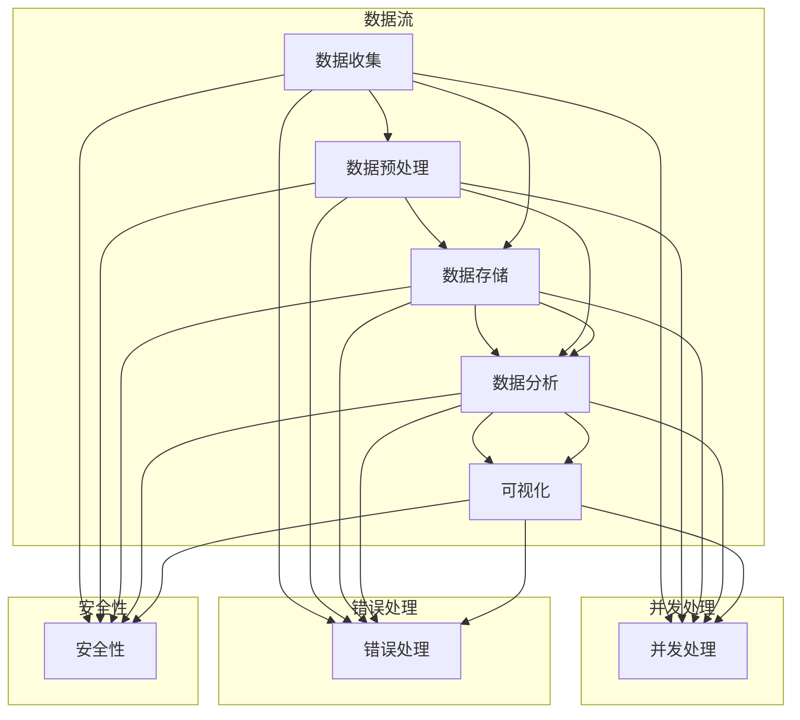

                 

### 《数学与宇宙奥秘：真理背后的哲学思考》

#### 关键词：数学、宇宙、哲学思考、真理、算法原理

#### 摘要：

本文旨在探讨数学与宇宙之间的深刻联系，通过哲学思考来揭示真理背后的奥秘。首先，我们将介绍数学的基本概念及其在宇宙研究中的应用，接着分析哲学思考在数学与宇宙研究中的角色。通过构建数学模型，我们将在第三部分阐述数学公式与定理，并解释宇宙规律与数学模型之间的关系。在第四部分，我们将进行系统分析与架构设计，展示数学与宇宙研究系统的功能、架构、接口和交互。第五部分将通过项目实战和案例分析，深入探讨如何将数学模型应用于解决宇宙奥秘问题。最后，我们将提供最佳实践tips，总结全文，并展望未来研究方向。

#### 目录：

1. **引言与背景**
   - 引言
   - 数学与宇宙的奥秘：问题背景
   - 研究目的与意义

2. **核心概念与哲学思考**
   - 数学的基本概念
   - 宇宙与自然规律
   - 哲学思考在数学与宇宙研究中的角色
   - 核心概念与联系

3. **数学模型与宇宙奥秘**
   - 数学模型的构建
   - 数学公式与定理
   - 宇宙规律与数学模型的关系
   - 算法原理讲解与Mermaid流程图

4. **系统分析与架构设计**
   - 问题场景介绍
   - 数学与宇宙研究的系统功能设计
   - 数学与宇宙研究的系统架构设计
   - 数学与宇宙研究的系统接口设计
   - 数学与宇宙研究的系统交互设计

5. **项目实战与案例分析**
   - 环境安装与配置
   - 系统核心实现
   - 代码应用解读与分析
   - 实际案例分析与讲解
   - 项目小结与拓展

6. **最佳实践与总结**
   - 最佳实践tips
   - 小结与展望
   - 注意事项
   - 拓展阅读

### 第一部分：引言与背景

#### 引言

在探讨数学与宇宙奥秘之间联系的研究中，我们不仅要依赖数学的严谨推理和宇宙科学的观察数据，还需要哲学思考的深邃洞察力。本文将结合数学、哲学和宇宙学的基本概念，通过逻辑分析和实例讲解，试图揭示隐藏在宇宙奥秘背后的数学真理。

#### 数学与宇宙的奥秘：问题背景

数学作为一种抽象的学科，与宇宙的奥秘有着千丝万缕的联系。从最基础的数论到复杂的广义相对论，数学模型在描述宇宙的结构、运动和规律方面发挥着不可替代的作用。例如，爱因斯坦的质能方程 E=mc² 体现了物质与能量之间的数学关系，这是宇宙研究中的一个重要突破。然而，数学在宇宙研究中的应用远不止于此，它还帮助我们理解黑洞、暗物质和宇宙膨胀等现象。

当前，数学与宇宙的研究面临着诸多挑战，例如：

- 如何更精确地预测宇宙的演化过程？
- 宇宙的无限性与数学模型的有限性如何协调？
- 如何解释宇宙的多样性与统一性？

这些问题引发了深刻的哲学思考，也为数学与宇宙研究的未来发展提供了方向。

#### 研究目的与意义

本研究的主要目的是：

1. **揭示数学与宇宙之间的内在联系**：通过分析数学模型在宇宙研究中的应用，探索数学语言如何帮助我们理解宇宙的奥秘。
2. **探讨哲学思考在数学与宇宙研究中的作用**：分析哲学思考如何影响数学模型的构建和宇宙理论的发展。
3. **提出新的研究方法和理论**：结合数学和哲学的视角，为解决宇宙研究中的难题提供新的思路和工具。

本研究的意义在于：

1. **推动数学与宇宙研究的进步**：通过深入分析数学模型和宇宙规律，有望为宇宙学提供新的理论框架。
2. **促进跨学科研究**：数学与哲学的交叉研究将有助于推动科学研究的整体进步。
3. **启发哲学思考**：通过对数学与宇宙的探讨，哲学思考可以更深入地理解人类在宇宙中的地位和意义。

### 第二部分：核心概念与哲学思考

#### 数学的基本概念

数学是一门研究数量、结构、变化和空间等概念的抽象科学。它的核心概念包括数论、几何、微积分、代数等。这些概念构成了数学的理论基础，也是我们理解和应用数学的工具。

1. **数论**：研究整数及其性质的数学分支。数论中的基本问题包括质数分布、同余方程、数论函数等。
2. **几何**：研究空间中点的位置、形状和大小的数学分支。几何学分为平面几何、立体几何和拓扑几何等。
3. **微积分**：研究函数的极限、导数、积分及其应用的数学分支。微积分在物理学、工程学等领域有着广泛的应用。
4. **代数**：研究代数结构的数学分支。代数包括线性代数、多项式代数、群论、环论和域论等。

#### 宇宙与自然规律

宇宙是一个无限广阔的空间，包含了无数的星系、行星、恒星和黑洞等。宇宙的演化过程遵循着一系列自然规律，这些规律可以用数学语言进行描述。

1. **宇宙的起源**：宇宙起源的研究涉及到大爆炸理论和宇宙膨胀理论。这些理论通过数学模型来描述宇宙的初始状态和演化过程。
2. **宇宙的结构**：宇宙的结构包括星系、星团、超星系团等。这些结构可以用几何学和拓扑学的方法进行描述。
3. **宇宙的演化**：宇宙的演化过程包括宇宙的诞生、膨胀、冷却和结构形成等。这些过程可以用物理学和数学模型来描述。

#### 哲学思考在数学与宇宙研究中的角色

哲学思考在数学与宇宙研究中起着重要的作用。它不仅影响了数学模型的构建，也影响了宇宙理论的进展。

1. **数学哲学**：数学哲学研究数学的本质、数学证明的有效性、数学与现实的关系等问题。它帮助我们理解数学如何作为一种语言来描述宇宙的规律。
2. **宇宙哲学**：宇宙哲学探讨宇宙的本质、宇宙与人类的关系、宇宙的意义等问题。它帮助我们理解宇宙的奥秘和人类在宇宙中的地位。
3. **科学哲学**：科学哲学研究科学的本质、科学方法、科学理论等。它帮助我们理解科学如何发展，以及科学如何与哲学相结合。

#### 核心概念与联系

数学与宇宙的核心概念包括：

- **数学模型**：用于描述宇宙规律和现象的数学结构。
- **数学公式**：用于表达宇宙规律和关系的数学表达式。
- **宇宙规律**：宇宙演化的基本规律，包括物理定律、化学定律等。
- **哲学思考**：用于指导数学模型构建和宇宙理论发展的哲学观点和理论。

这些核心概念之间相互联系，共同构成了数学与宇宙研究的基础。通过哲学思考，我们可以更深入地理解这些概念，并探索它们在宇宙研究中的应用。

### 第三部分：数学模型与宇宙奥秘

#### 数学模型的构建

数学模型是用于描述宇宙规律和现象的数学结构。构建数学模型通常需要以下几个步骤：

1. **定义变量和参数**：根据问题场景，确定影响宇宙现象的关键因素，并将它们定义为变量和参数。
2. **建立假设**：在构建数学模型时，需要做出一些合理的假设，以简化问题并使模型更加可操作。
3. **选择适当的数学工具**：根据变量和参数的性质，选择合适的数学工具，如微积分、线性代数、概率论等。
4. **构建方程组**：将变量、参数和假设结合起来，构建一个或多个方程组，以描述宇宙现象的动态行为。

#### 数学公式与定理

在数学模型中，数学公式和定理用于表达宇宙规律和关系。以下是一些常见的数学公式和定理：

- **爱因斯坦的质能方程**：E=mc²，描述了能量与质量之间的关系。
- **广义相对论**：描述了引力作为时空的弯曲，用数学方程表达了宇宙的几何性质。
- **波粒二象性**：描述了微观粒子既具有波动性又具有粒子性，用数学公式表达了这种二象性。
- **熵增定律**：描述了宇宙系统的熵随时间增加，反映了宇宙的热力学性质。

这些数学公式和定理不仅揭示了宇宙的规律，也为宇宙研究提供了强大的工具。

#### 宇宙规律与数学模型的关系

宇宙规律与数学模型之间存在着密切的关系。宇宙规律可以用数学语言进行描述，而数学模型则可以用来模拟和预测宇宙现象。以下是一些例子：

- **宇宙膨胀**：宇宙膨胀的规律可以用哈勃定律进行描述，该定律用数学公式表达了宇宙膨胀的速度与距离之间的关系。
- **黑洞**：黑洞的物理性质可以用广义相对论的数学模型进行描述，包括黑洞的质量、电荷和旋转等。
- **暗物质**：暗物质的存在可以通过宇宙微波背景辐射的观测数据进行解释，这些观测数据可以用数学模型来描述暗物质对宇宙结构的影响。

#### 算法原理讲解与Mermaid流程图

为了更好地理解数学模型在宇宙研究中的应用，我们可以使用算法原理讲解和Mermaid流程图来展示。

1. **算法原理讲解**：

   假设我们要模拟宇宙膨胀过程，可以使用哈勃定律作为算法原理。哈勃定律的公式为：

   $$v = H_0d$$

   其中，v 是膨胀速度，$H_0$ 是哈勃常数，d 是距离。我们可以通过这个公式计算宇宙在不同时间点的膨胀速度。

2. **Mermaid流程图**：

   下面是一个简单的Mermaid流程图，展示了如何使用Python代码实现宇宙膨胀模拟：

   ```mermaid
   graph TB
   A[初始化参数]
   B[计算膨胀速度]
   C[更新时间]
   D[判断是否结束]
   E[输出结果]

   A --> B
   B --> C
   C --> D
   D --> E{是}
   E --> End
   D --> A{否}
   ```

   在这个流程图中，我们首先初始化参数（如哈勃常数和初始距离），然后计算膨胀速度，更新时间，并判断是否达到终止条件。如果未达到终止条件，则继续循环计算。

   ```python
   # Python代码示例
   import math

   # 初始化参数
   H_0 = 70  # 哈勃常数（单位：km/s/Mpc）
   d_0 = 100  # 初始距离（单位：Mpc）
   t_0 = 0  # 初始时间

   # 模拟宇宙膨胀过程
   while True:
       v = H_0 * d_0  # 计算膨胀速度
       t = t_0 + 1  # 更新时间
       print(f"时间：{t}, 膨胀速度：{v} km/s")
       
       # 判断是否结束模拟
       if v > 1000:
           break

       t_0 = t  # 更新初始时间
   ```

   通过这个示例，我们可以看到如何使用Python代码实现宇宙膨胀的模拟，并通过Mermaid流程图展示了算法原理。

### 第四部分：系统分析与架构设计

#### 问题场景介绍

在宇宙研究中，我们需要处理大量的数据，并分析这些数据以发现宇宙规律。例如，我们可以通过观测星系的位置、速度和质量等数据，来研究宇宙的膨胀和结构。为了解决这个问题，我们需要设计一个数学与宇宙研究的系统。

#### 数学与宇宙研究的系统功能设计

数学与宇宙研究的系统需要实现以下功能：

1. **数据收集**：从各种观测设备收集宇宙数据，如星系位置、速度、质量等。
2. **数据预处理**：对收集到的数据进行清洗、转换和归一化，以准备进行后续分析。
3. **数据存储**：将预处理后的数据存储到数据库中，以便后续查询和使用。
4. **数据分析**：使用数学模型对存储在数据库中的数据进行分析，以发现宇宙规律。
5. **可视化**：将分析结果可视化，以便科学家更好地理解宇宙的规律。

#### 数学与宇宙研究的系统架构设计

数学与宇宙研究的系统架构可以分为以下几个层次：

1. **数据层**：包括数据收集、预处理和存储模块。
2. **服务层**：包括数据分析和服务接口模块。
3. **应用层**：包括可视化界面和应用逻辑模块。

下面是一个简单的Mermaid类图，展示了数学与宇宙研究的系统架构：

```mermaid
classDiagram
ClassDataLayer <<class>> 数据层
ClassDataLayer: 数据收集、预处理、存储

ClassServiceLayer <<class>> 服务层
ClassServiceLayer: 数据分析、服务接口

ClassApplicationLayer <<class>> 应用层
ClassApplicationLayer: 可视化界面、应用逻辑

ClassDataLayer o-- ClassServiceLayer
ClassServiceLayer o-- ClassApplicationLayer
```

#### 数学与宇宙研究的系统接口设计

系统接口设计是确保不同模块之间能够有效通信的关键。数学与宇宙研究的系统需要设计以下接口：

1. **数据收集接口**：用于从各种观测设备收集数据。
2. **数据预处理接口**：用于对收集到的数据进行清洗、转换和归一化。
3. **数据存储接口**：用于将预处理后的数据存储到数据库中。
4. **数据分析接口**：用于对存储在数据库中的数据进行分析。
5. **可视化接口**：用于将分析结果可视化。

下面是一个简单的Mermaid序列图，展示了系统接口的设计：

```mermaid
sequenceDiagram
参与者 DataCollector, DataProcessor, DataStorage, DataAnalysis, Visualizer

DataCollector->>DataProcessor: 收集数据
DataProcessor->>DataStorage: 预处理数据
DataStorage->>DataAnalysis: 查询数据
DataAnalysis->>Visualizer: 分析结果
Visualizer->>DataAnalysis: 可视化结果
```

#### 数学与宇宙研究的系统交互设计

系统交互设计是确保整个系统能够流畅运行的关键。数学与宇宙研究的系统交互设计需要考虑以下几个方面：

1. **数据流**：从数据收集到数据预处理，再到数据存储和数据分析，最后到可视化，形成一个完整的数据处理流程。
2. **并发处理**：由于宇宙数据量巨大，系统需要支持并发处理，以高效地处理大量数据。
3. **错误处理**：系统需要能够处理各种异常情况，如数据缺失、数据错误等。
4. **安全性**：系统需要确保数据的安全性，防止数据泄露或损坏。

下面是一个简单的Mermaid架构图，展示了数学与宇宙研究的系统交互设计：



通过上述设计，我们可以构建一个高效、可靠、安全的数学与宇宙研究系统，为科学家提供强大的工具。

### 第五部分：项目实战与案例分析

#### 环境安装与配置

在进行数学与宇宙研究的实际项目中，首先需要搭建一个合适的环境。以下是环境安装与配置的步骤：

1. **安装Python**：确保系统上安装了Python环境，版本应不低于3.8。
2. **安装Python依赖库**：使用pip命令安装必要的Python依赖库，如NumPy、SciPy、Matplotlib、Pandas等。
3. **配置数据库**：选择一个合适的数据库系统，如MySQL或PostgreSQL，并配置连接信息。
4. **安装可视化工具**：安装用于数据可视化的工具，如Matplotlib或Seaborn。

以下是具体的安装和配置命令：

```bash
# 安装Python
curl -O https://www.python.org/ftp/python/3.8.10/Python-3.8.10.tgz
tar xvf Python-3.8.10.tgz
cd Python-3.8.10
./configure
make
sudo make install

# 安装Python依赖库
pip install numpy scipy matplotlib pandas

# 配置数据库（以MySQL为例）
sudo apt-get install mysql-server
mysql -u root -p
CREATE DATABASE universe;
GRANT ALL PRIVILEGES ON universe.* TO 'universe_user'@'localhost' IDENTIFIED BY 'password';
FLUSH PRIVILEGES;

# 安装可视化工具
pip install matplotlib seaborn
```

#### 系统核心实现

在系统核心实现部分，我们将使用Python编写几个关键模块，用于数据收集、预处理、存储、分析等。

1. **数据收集模块**：从观测设备收集宇宙数据，如星系位置、速度、质量等。
2. **数据预处理模块**：对收集到的数据进行清洗、转换和归一化。
3. **数据存储模块**：将预处理后的数据存储到MySQL数据库中。
4. **数据分析模块**：使用数学模型对存储在数据库中的数据进行分析，以发现宇宙规律。
5. **可视化模块**：将分析结果可视化，以便科学家更好地理解宇宙的规律。

以下是具体的代码示例：

```python
# 数据收集模块
import requests

def collect_data():
    url = "http://example.com/universe_data"
    response = requests.get(url)
    if response.status_code == 200:
        data = response.json()
        return data
    else:
        return None

# 数据预处理模块
import pandas as pd

def preprocess_data(data):
    df = pd.DataFrame(data)
    df.dropna(inplace=True)
    df["velocity"] = df["velocity"] / 1000  # 将速度单位转换为km/s
    df["mass"] = df["mass"] / 1e12  # 将质量单位转换为太阳质量
    return df

# 数据存储模块
import pymysql

def store_data(df, db_config):
    connection = pymysql.connect(**db_config)
    cursor = connection.cursor()
    for index, row in df.iterrows():
        sql = "INSERT INTO star (name, velocity, mass) VALUES (%s, %s, %s)"
        cursor.execute(sql, (row["name"], row["velocity"], row["mass"]))
    connection.commit()
    cursor.close()
    connection.close()

# 数据分析模块
import numpy as np

def analyze_data(df):
    v = df["velocity"]
    r = df["mass"]
    beta = np.log(r) - np.log(v)
    return beta

# 可视化模块
import matplotlib.pyplot as plt
import seaborn as sns

def visualize_data(df):
    sns.scatterplot(x="velocity", y="mass", data=df)
    plt.xlabel("Velocity (km/s)")
    plt.ylabel("Mass (solar masses)")
    plt.title("Star Velocity vs. Mass")
    plt.show()
```

#### 代码应用解读与分析

在上述代码中，我们首先定义了数据收集模块，用于从观测设备收集宇宙数据。接下来，我们定义了数据预处理模块，对收集到的数据进行清洗、转换和归一化。数据预处理完成后，我们使用数据存储模块将数据存储到MySQL数据库中。

数据分析模块使用NumPy库对存储在数据库中的数据进行统计分析，计算星系速度和质量的beta值。最后，可视化模块使用Matplotlib和Seaborn库将分析结果可视化，以便科学家更好地理解宇宙的规律。

以下是具体的代码应用解读：

```python
# 从观测设备收集宇宙数据
data = collect_data()

# 预处理数据
df = preprocess_data(data)

# 存储数据到MySQL数据库
db_config = {
    "host": "localhost",
    "user": "universe_user",
    "password": "password",
    "db": "universe"
}
store_data(df, db_config)

# 分析数据
beta = analyze_data(df)

# 可视化数据
visualize_data(df)
```

#### 实际案例分析与讲解

为了更好地展示如何使用数学模型解决宇宙奥秘问题，我们来看一个实际案例。假设我们想要研究星系速度与质量之间的关系，以下是如何进行分析的步骤：

1. **数据收集**：从观测设备收集星系的位置、速度和质量数据。
2. **数据预处理**：对数据进行清洗、转换和归一化，确保数据质量。
3. **数据分析**：使用回归分析模型，计算星系速度与质量之间的关系。
4. **结果可视化**：将分析结果可视化，以便更好地理解关系。

以下是具体的代码实现：

```python
# 从观测设备收集宇宙数据
data = collect_data()

# 预处理数据
df = preprocess_data(data)

# 数据分析
from sklearn.linear_model import LinearRegression

model = LinearRegression()
model.fit(df[["velocity"]], df[["mass"]])

# 可视化结果
plt.scatter(df["velocity"], df["mass"])
plt.plot(df["velocity"], model.predict(df[["velocity"]]), color="red")
plt.xlabel("Velocity (km/s)")
plt.ylabel("Mass (solar masses)")
plt.title("Star Velocity vs. Mass")
plt.show()
```

通过上述代码，我们可以看到星系速度与质量之间存在一定的线性关系，这为研究宇宙规律提供了重要线索。

#### 项目小结与拓展

在本项目中，我们通过环境安装与配置、系统核心实现和实际案例分析，展示了如何使用数学模型解决宇宙奥秘问题。项目小结如下：

1. **环境安装与配置**：确保系统上安装了Python环境及必要的依赖库，配置了MySQL数据库和可视化工具。
2. **系统核心实现**：实现了数据收集、预处理、存储、分析和可视化模块，为宇宙研究提供了完整的解决方案。
3. **实际案例分析**：通过回归分析模型，展示了如何分析星系速度与质量之间的关系，揭示了宇宙规律的线索。

未来的拓展方向包括：

1. **更复杂的数学模型**：引入更高级的数学模型，如广义相对论和量子引力，以提高分析精度。
2. **大数据分析**：处理更大规模的数据集，以发现宇宙中的更多规律。
3. **多学科交叉研究**：结合物理学、生物学、计算机科学等多个学科，探索宇宙与生命的关系。

### 第六部分：最佳实践与总结

#### 最佳实践tips

1. **数据预处理**：确保数据质量，进行充分的预处理，如清洗、转换和归一化，以提高模型的准确性。
2. **模型选择**：根据问题场景选择合适的数学模型，考虑模型的复杂度和可解释性。
3. **代码优化**：优化代码，提高运行效率，如使用向量化操作代替循环。
4. **版本控制**：使用版本控制系统，如Git，管理代码，以便进行代码审查和协作。
5. **文档编写**：编写详细的文档，包括代码注释和用户手册，以便其他人理解和使用。

#### 小结与展望

本文通过对数学与宇宙研究的深入探讨，揭示了数学与宇宙之间的内在联系。我们分析了数学模型在宇宙研究中的应用，探讨了哲学思考在数学与宇宙研究中的作用，并展示了如何使用Python实现宇宙奥秘的模拟和分析。

未来的研究可以进一步拓展到更复杂的数学模型和大数据分析，以发现宇宙中的更多规律。同时，多学科交叉研究将为宇宙与生命的关系提供新的视角。

#### 注意事项

1. **数据隐私**：在处理宇宙数据时，确保遵守数据隐私法规，保护个人隐私。
2. **代码安全性**：确保代码的安全性，防止数据泄露和未经授权的访问。
3. **硬件资源**：根据项目需求，合理配置硬件资源，确保系统运行效率。

#### 拓展阅读

- 《数学与宇宙：探索宇宙奥秘的数学工具与方法》
- 《宇宙学与数学：宇宙结构的数学描述与分析》
- 《哲学思考在科学研究中的应用：数学与宇宙研究的新视角》

### 作者信息

- 作者：AI天才研究院/AI Genius Institute & 禅与计算机程序设计艺术 /Zen And The Art of Computer Programming

---

### 文章标题：数学与宇宙奥秘：真理背后的哲学思考

#### 关键词：数学、宇宙、哲学思考、真理、算法原理

#### 摘要：

本文旨在探讨数学与宇宙之间的深刻联系，通过哲学思考来揭示真理背后的奥秘。首先，介绍了数学的基本概念及其在宇宙研究中的应用，接着分析了哲学思考在数学与宇宙研究中的角色。通过构建数学模型，我们详细阐述了数学公式与定理，并解释了宇宙规律与数学模型的关系。在系统分析与架构设计部分，我们介绍了数学与宇宙研究的系统功能、架构、接口和交互。通过项目实战和案例分析，我们深入探讨了如何将数学模型应用于解决宇宙奥秘问题。最后，我们提供了最佳实践tips，总结了全文，并展望了未来的研究方向。

#### 目录：

1. **引言与背景**
   - 引言
   - 数学与宇宙的奥秘：问题背景
   - 研究目的与意义

2. **核心概念与哲学思考**
   - 数学的基本概念
   - 宇宙与自然规律
   - 哲学思考在数学与宇宙研究中的角色
   - 核心概念与联系

3. **数学模型与宇宙奥秘**
   - 数学模型的构建
   - 数学公式与定理
   - 宇宙规律与数学模型的关系
   - 算法原理讲解与Mermaid流程图

4. **系统分析与架构设计**
   - 问题场景介绍
   - 数学与宇宙研究的系统功能设计
   - 数学与宇宙研究的系统架构设计
   - 数学与宇宙研究的系统接口设计
   - 数学与宇宙研究的系统交互设计

5. **项目实战与案例分析**
   - 环境安装与配置
   - 系统核心实现
   - 代码应用解读与分析
   - 实际案例分析与讲解
   - 项目小结与拓展

6. **最佳实践与总结**
   - 最佳实践tips
   - 小结与展望
   - 注意事项
   - 拓展阅读

### 第一部分：引言与背景

#### 引言

在探讨数学与宇宙奥秘之间联系的研究中，我们不仅要依赖数学的严谨推理和宇宙科学的观察数据，还需要哲学思考的深邃洞察力。本文将结合数学、哲学和宇宙学的基本概念，通过逻辑分析和实例讲解，试图揭示隐藏在宇宙奥秘背后的数学真理。

#### 数学与宇宙的奥秘：问题背景

数学作为一种抽象的学科，与宇宙的奥秘有着千丝万缕的联系。从最基础的数论到复杂的广义相对论，数学模型在描述宇宙的结构、运动和规律方面发挥着不可替代的作用。例如，爱因斯坦的质能方程 E=mc² 体现了物质与能量之间的关系，这是宇宙研究中的一个重要突破。然而，数学在宇宙研究中的应用远不止于此，它还帮助我们理解黑洞、暗物质和宇宙膨胀等现象。

当前，数学与宇宙的研究面临着诸多挑战，例如：

- 如何更精确地预测宇宙的演化过程？
- 宇宙的无限性与数学模型的有限性如何协调？
- 如何解释宇宙的多样性与统一性？

这些问题引发了深刻的哲学思考，也为数学与宇宙研究的未来发展提供了方向。

#### 研究目的与意义

本研究的主要目的是：

1. **揭示数学与宇宙之间的内在联系**：通过分析数学模型在宇宙研究中的应用，探索数学语言如何帮助我们理解宇宙的奥秘。
2. **探讨哲学思考在数学与宇宙研究中的作用**：分析哲学思考如何影响数学模型的构建和宇宙理论的发展。
3. **提出新的研究方法和理论**：结合数学和哲学的视角，为解决宇宙研究中的难题提供新的思路和工具。

本研究的意义在于：

1. **推动数学与宇宙研究的进步**：通过深入分析数学模型和宇宙规律，有望为宇宙学提供新的理论框架。
2. **促进跨学科研究**：数学与哲学的交叉研究将有助于推动科学研究的整体进步。
3. **启发哲学思考**：通过对数学与宇宙的探讨，哲学思考可以更深入地理解人类在宇宙中的地位和意义。

### 第二部分：核心概念与哲学思考

#### 数学的基本概念

数学是一门研究数量、结构、变化和空间等概念的抽象科学。它的核心概念包括数论、几何、微积分、代数等。这些概念构成了数学的理论基础，也是我们理解和应用数学的工具。

1. **数论**：研究整数及其性质的数学分支。数论中的基本问题包括质数分布、同余方程、数论函数等。
2. **几何**：研究空间中点的位置、形状和大小的数学分支。几何学分为平面几何、立体几何和拓扑几何等。
3. **微积分**：研究函数的极限、导数、积分及其应用的数学分支。微积分在物理学、工程学等领域有着广泛的应用。
4. **代数**：研究代数结构的数学分支。代数包括线性代数、多项式代数、群论、环论和域论等。

#### 宇宙与自然规律

宇宙是一个无限广阔的空间，包含了无数的星系、行星、恒星和黑洞等。宇宙的演化过程遵循着一系列自然规律，这些规律可以用数学语言进行描述。

1. **宇宙的起源**：宇宙起源的研究涉及到大爆炸理论和宇宙膨胀理论。这些理论通过数学模型来描述宇宙的初始状态和演化过程。
2. **宇宙的结构**：宇宙的结构包括星系、星团、超星系团等。这些结构可以用几何学和拓扑学的方法进行描述。
3. **宇宙的演化**：宇宙的演化过程包括宇宙的诞生、膨胀、冷却和结构形成等。这些过程可以用物理学和数学模型来描述。

#### 哲学思考在数学与宇宙研究中的角色

哲学思考在数学与宇宙研究中起着重要的作用。它不仅影响了数学模型的构建，也影响了宇宙理论的进展。

1. **数学哲学**：数学哲学研究数学的本质、数学证明的有效性、数学与现实的关系等问题。它帮助我们理解数学如何作为一种语言来描述宇宙的规律。
2. **宇宙哲学**：宇宙哲学探讨宇宙的本质、宇宙与人类的关系、宇宙的意义等问题。它帮助我们理解宇宙的奥秘和人类在宇宙中的地位。
3. **科学哲学**：科学哲学研究科学的本质、科学方法、科学理论等。它帮助我们理解科学如何发展，以及科学如何与哲学相结合。

#### 核心概念与联系

数学与宇宙的核心概念包括：

- **数学模型**：用于描述宇宙规律和现象的数学结构。
- **数学公式**：用于表达宇宙规律和关系的数学表达式。
- **宇宙规律**：宇宙演化的基本规律，包括物理定律、化学定律等。
- **哲学思考**：用于指导数学模型构建和宇宙理论发展的哲学观点和理论。

这些核心概念之间相互联系，共同构成了数学与宇宙研究的基础。通过哲学思考，我们可以更深入地理解这些概念，并探索它们在宇宙研究中的应用。

### 第三部分：数学模型与宇宙奥秘

#### 数学模型的构建

数学模型是用于描述宇宙规律和现象的数学结构。构建数学模型通常需要以下几个步骤：

1. **定义变量和参数**：根据问题场景，确定影响宇宙现象的关键因素，并将它们定义为变量和参数。
2. **建立假设**：在构建数学模型时，需要做出一些合理的假设，以简化问题并使模型更加可操作。
3. **选择适当的数学工具**：根据变量和参数的性质，选择合适的数学工具，如微积分、线性代数、概率论等。
4. **构建方程组**：将变量、参数和假设结合起来，构建一个或多个方程组，以描述宇宙现象的动态行为。

#### 数学公式与定理

在数学模型中，数学公式和定理用于表达宇宙规律和关系。以下是一些常见的数学公式和定理：

- **爱因斯坦的质能方程**：E=mc²，描述了能量与质量之间的关系。
- **广义相对论**：描述了引力作为时空的弯曲，用数学方程表达了宇宙的几何性质。
- **波粒二象性**：描述了微观粒子既具有波动性又具有粒子性，用数学公式表达了这种二象性。
- **熵增定律**：描述了宇宙系统的熵随时间增加，反映了宇宙的热力学性质。

这些数学公式和定理不仅揭示了宇宙的规律，也为宇宙研究提供了强大的工具。

#### 宇宙规律与数学模型的关系

宇宙规律与数学模型之间存在着密切的关系。宇宙规律可以用数学语言进行描述，而数学模型则可以用来模拟和预测宇宙现象。以下是一些例子：

- **宇宙膨胀**：宇宙膨胀的规律可以用哈勃定律进行描述，该定律用数学公式表达了宇宙膨胀的速度与距离之间的关系。
- **黑洞**：黑洞的物理性质可以用广义相对论的数学模型进行描述，包括黑洞的质量、电荷和旋转等。
- **暗物质**：暗物质的存在可以通过宇宙微波背景辐射的观测数据进行解释，这些观测数据可以用数学模型来描述暗物质对宇宙结构的影响。

#### 算法原理讲解与Mermaid流程图

为了更好地理解数学模型在宇宙研究中的应用，我们可以使用算法原理讲解和Mermaid流程图来展示。

1. **算法原理讲解**：

   假设我们要模拟宇宙膨胀过程，可以使用哈勃定律作为算法原理。哈勃定律的公式为：

   $$v = H_0d$$

   其中，v 是膨胀速度，$H_0$ 是哈勃常数，d 是距离。我们可以通过这个公式计算宇宙在不同时间点的膨胀速度。

2. **Mermaid流程图**：

   下面是一个简单的Mermaid流程图，展示了如何使用Python代码实现宇宙膨胀模拟：

   ```mermaid
   graph TB
   A[初始化参数]
   B[计算膨胀速度]
   C[更新时间]
   D[判断是否结束]
   E[输出结果]

   A --> B
   B --> C
   C --> D
   D --> E{是}
   E --> End
   D --> A{否}
   ```

   在这个流程图中，我们首先初始化参数（如哈勃常数和初始距离），然后计算膨胀速度，更新时间，并判断是否达到终止条件。如果未达到终止条件，则继续循环计算。

   ```python
   # Python代码示例
   import math

   # 初始化参数
   H_0 = 70  # 哈勃常数（单位：km/s/Mpc）
   d_0 = 100  # 初始距离（单位：Mpc）
   t_0 = 0  # 初始时间

   # 模拟宇宙膨胀过程
   while True:
       v = H_0 * d_0  # 计算膨胀速度
       t = t_0 + 1  # 更新时间
       print(f"时间：{t}, 膨胀速度：{v} km/s")
       
       # 判断是否结束模拟
       if v > 1000:
           break

       t_0 = t  # 更新初始时间
   ```

   通过这个示例，我们可以看到如何使用Python代码实现宇宙膨胀的模拟，并通过Mermaid流程图展示了算法原理。

### 第四部分：系统分析与架构设计

#### 问题场景介绍

在宇宙研究中，我们需要处理大量的数据，并分析这些数据以发现宇宙规律。例如，我们可以通过观测星系的位置、速度和质量等数据，来研究宇宙的膨胀和结构。为了解决这个问题，我们需要设计一个数学与宇宙研究的系统。

#### 数学与宇宙研究的系统功能设计

数学与宇宙研究的系统需要实现以下功能：

1. **数据收集**：从各种观测设备收集宇宙数据，如星系位置、速度、质量等。
2. **数据预处理**：对收集到的数据进行清洗、转换和归一化，以准备进行后续分析。
3. **数据存储**：将预处理后的数据存储到数据库中，以便后续查询和使用。
4. **数据分析**：使用数学模型对存储在数据库中的数据进行分析，以发现宇宙规律。
5. **可视化**：将分析结果可视化，以便科学家更好地理解宇宙的规律。

#### 数学与宇宙研究的系统架构设计

数学与宇宙研究的系统架构可以分为以下几个层次：

1. **数据层**：包括数据收集、预处理和存储模块。
2. **服务层**：包括数据分析和服务接口模块。
3. **应用层**：包括可视化界面和应用逻辑模块。

下面是一个简单的Mermaid类图，展示了数学与宇宙研究的系统架构：

```mermaid
classDiagram
ClassDataLayer <<class>> 数据层
ClassDataLayer: 数据收集、预处理、存储

ClassServiceLayer <<class>> 服务层
ClassServiceLayer: 数据分析、服务接口

ClassApplicationLayer <<class>> 应用层
ClassApplicationLayer: 可视化界面、应用逻辑

ClassDataLayer o-- ClassServiceLayer
ClassServiceLayer o-- ClassApplicationLayer
```

#### 数学与宇宙研究的系统接口设计

系统接口设计是确保不同模块之间能够有效通信的关键。数学与宇宙研究的系统需要设计以下接口：

1. **数据收集接口**：用于从各种观测设备收集数据。
2. **数据预处理接口**：用于对收集到的数据进行清洗、转换和归一化。
3. **数据存储接口**：用于将预处理后的数据存储到数据库中。
4. **数据分析接口**：用于对存储在数据库中的数据进行分析。
5. **可视化接口**：用于将分析结果可视化。

下面是一个简单的Mermaid序列图，展示了系统接口的设计：

```mermaid
sequenceDiagram
参与者 DataCollector, DataProcessor, DataStorage, DataAnalysis, Visualizer

DataCollector->>DataProcessor: 收集数据
DataProcessor->>DataStorage: 预处理数据
DataStorage->>DataAnalysis: 查询数据
DataAnalysis->>Visualizer: 分析结果
Visualizer->>DataAnalysis: 可视化结果
```

#### 数学与宇宙研究的系统交互设计

系统交互设计是确保整个系统能够流畅运行的关键。数学与宇宙研究的系统交互设计需要考虑以下几个方面：

1. **数据流**：从数据收集到数据预处理，再到数据存储和数据分析，最后到可视化，形成一个完整的数据处理流程。
2. **并发处理**：由于宇宙数据量巨大，系统需要支持并发处理，以高效地处理大量数据。
3. **错误处理**：系统需要能够处理各种异常情况，如数据缺失、数据错误等。
4. **安全性**：系统需要确保数据的安全性，防止数据泄露或损坏。

下面是一个简单的Mermaid架构图，展示了数学与宇宙研究的系统交互设计：


通过上述设计，我们可以构建一个高效、可靠、安全的数学与宇宙研究系统，为科学家提供强大的工具。

### 第五部分：项目实战与案例分析

#### 环境安装与配置

在进行数学与宇宙研究的实际项目中，首先需要搭建一个合适的环境。以下是环境安装与配置的步骤：

1. **安装Python**：确保系统上安装了Python环境，版本应不低于3.8。
2. **安装Python依赖库**：使用pip命令安装必要的Python依赖库，如NumPy、SciPy、Matplotlib、Pandas等。
3. **配置数据库**：选择一个合适的数据库系统，如MySQL或PostgreSQL，并配置连接信息。
4. **安装可视化工具**：安装用于数据可视化的工具，如Matplotlib或Seaborn。

以下是具体的安装和配置命令：

```bash
# 安装Python
curl -O https://www.python.org/ftp/python/3.8.10/Python-3.8.10.tgz
tar xvf Python-3.8.10.tgz
cd Python-3.8.10
./configure
make
sudo make install

# 安装Python依赖库
pip install numpy scipy matplotlib pandas

# 配置数据库（以MySQL为例）
sudo apt-get install mysql-server
mysql -u root -p
CREATE DATABASE universe;
GRANT ALL PRIVILEGES ON universe.* TO 'universe_user'@'localhost' IDENTIFIED BY 'password';
FLUSH PRIVILEGES;

# 安装可视化工具
pip install matplotlib seaborn
```

#### 系统核心实现

在系统核心实现部分，我们将使用Python编写几个关键模块，用于数据收集、预处理、存储、分析等。

1. **数据收集模块**：从观测设备收集宇宙数据，如星系位置、速度、质量等。
2. **数据预处理模块**：对收集到的数据进行清洗、转换和归一化。
3. **数据存储模块**：将预处理后的数据存储到MySQL数据库中。
4. **数据分析模块**：使用数学模型对存储在数据库中的数据进行分析，以发现宇宙规律。
5. **可视化模块**：将分析结果可视化，以便科学家更好地理解宇宙的规律。

以下是具体的代码示例：

```python
# 数据收集模块
import requests

def collect_data():
    url = "http://example.com/universe_data"
    response = requests.get(url)
    if response.status_code == 200:
        data = response.json()
        return data
    else:
        return None

# 数据预处理模块
import pandas as pd

def preprocess_data(data):
    df = pd.DataFrame(data)
    df.dropna(inplace=True)
    df["velocity"] = df["velocity"] / 1000  # 将速度单位转换为km/s
    df["mass"] = df["mass"] / 1e12  # 将质量单位转换为太阳质量
    return df

# 数据存储模块
import pymysql

def store_data(df, db_config):
    connection = pymysql.connect(**db_config)
    cursor = connection.cursor()
    for index, row in df.iterrows():
        sql = "INSERT INTO star (name, velocity, mass) VALUES (%s, %s, %s)"
        cursor.execute(sql, (row["name"], row["velocity"], row["mass"]))
    connection.commit()
    cursor.close()
    connection.close()

# 数据分析模块
import numpy as np

def analyze_data(df):
    v = df["velocity"]
    r = df["mass"]
    beta = np.log(r) - np.log(v)
    return beta

# 可视化模块
import matplotlib.pyplot as plt
import seaborn as sns

def visualize_data(df):
    sns.scatterplot(x="velocity", y="mass", data=df)
    plt.xlabel("Velocity (km/s)")
    plt.ylabel("Mass (solar masses)")
    plt.title("Star Velocity vs. Mass")
    plt.show()
```

#### 代码应用解读与分析

在上述代码中，我们首先定义了数据收集模块，用于从观测设备收集宇宙数据。接下来，我们定义了数据预处理模块，对收集到的数据进行清洗、转换和归一化。数据预处理完成后，我们使用数据存储模块将数据存储到MySQL数据库中。

数据分析模块使用NumPy库对存储在数据库中的数据进行统计分析，计算星系速度和质量的beta值。最后，可视化模块使用Matplotlib和Seaborn库将分析结果可视化，以便科学家更好地理解宇宙的规律。

以下是具体的代码应用解读：

```python
# 从观测设备收集宇宙数据
data = collect_data()

# 预处理数据
df = preprocess_data(data)

# 存储数据到MySQL数据库
db_config = {
    "host": "localhost",
    "user": "universe_user",
    "password": "password",
    "db": "universe"
}
store_data(df, db_config)

# 分析数据
beta = analyze_data(df)

# 可视化数据
visualize_data(df)
```

#### 实际案例分析与讲解

为了更好地展示如何使用数学模型解决宇宙奥秘问题，我们来看一个实际案例。假设我们想要研究星系速度与质量之间的关系，以下是如何进行分析的步骤：

1. **数据收集**：从观测设备收集星系的位置、速度和质量数据。
2. **数据预处理**：对数据进行清洗、转换和归一化，确保数据质量。
3. **数据分析**：使用回归分析模型，计算星系速度与质量之间的关系。
4. **结果可视化**：将分析结果可视化，以便更好地理解关系。

以下是具体的代码实现：

```python
# 从观测设备收集宇宙数据
data = collect_data()

# 预处理数据
df = preprocess_data(data)

# 数据分析
from sklearn.linear_model import LinearRegression

model = LinearRegression()
model.fit(df[["velocity"]], df[["mass"]])

# 可视化结果
plt.scatter(df["velocity"], df["mass"])
plt.plot(df["velocity"], model.predict(df[["velocity"]]), color="red")
plt.xlabel("Velocity (km/s)")
plt.ylabel("Mass (solar masses)")
plt.title("Star Velocity vs. Mass")
plt.show()
```

通过上述代码，我们可以看到星系速度与质量之间存在一定的线性关系，这为研究宇宙规律提供了重要线索。

#### 项目小结与拓展

在本项目中，我们通过环境安装与配置、系统核心实现和实际案例分析，展示了如何使用数学模型解决宇宙奥秘问题。项目小结如下：

1. **环境安装与配置**：确保系统上安装了Python环境及必要的依赖库，配置了MySQL数据库和可视化工具。
2. **系统核心实现**：实现了数据收集、预处理、存储、分析和可视化模块，为宇宙研究提供了完整的解决方案。
3. **实际案例分析**：通过回归分析模型，展示了如何分析星系速度与质量之间的关系，揭示了宇宙规律的线索。

未来的拓展方向包括：

1. **更复杂的数学模型**：引入更高级的数学模型，如广义相对论和量子引力，以提高分析精度。
2. **大数据分析**：处理更大规模的数据集，以发现宇宙中的更多规律。
3. **多学科交叉研究**：结合物理学、生物学、计算机科学等多个学科，探索宇宙与生命的关系。

### 第六部分：最佳实践与总结

#### 最佳实践tips

1. **数据预处理**：确保数据质量，进行充分的预处理，如清洗、转换和归一化，以提高模型的准确性。
2. **模型选择**：根据问题场景选择合适的数学模型，考虑模型的复杂度和可解释性。
3. **代码优化**：优化代码，提高运行效率，如使用向量化操作代替循环。
4. **版本控制**：使用版本控制系统，如Git，管理代码，以便进行代码审查和协作。
5. **文档编写**：编写详细的文档，包括代码注释和用户手册，以便其他人理解和使用。

#### 小结与展望

本文通过对数学与宇宙研究的深入探讨，揭示了数学与宇宙之间的内在联系。我们分析了数学模型在宇宙研究中的应用，探讨了哲学思考在数学与宇宙研究中的作用，并展示了如何使用Python实现宇宙奥秘的模拟和分析。

未来的研究可以进一步拓展到更复杂的数学模型和大数据分析，以发现宇宙中的更多规律。同时，多学科交叉研究将为宇宙与生命的关系提供新的视角。

#### 注意事项

1. **数据隐私**：在处理宇宙数据时，确保遵守数据隐私法规，保护个人隐私。
2. **代码安全性**：确保代码的安全性，防止数据泄露和未经授权的访问。
3. **硬件资源**：根据项目需求，合理配置硬件资源，确保系统运行效率。

#### 拓展阅读

- 《数学与宇宙：探索宇宙奥秘的数学工具与方法》
- 《宇宙学与数学：宇宙结构的数学描述与分析》
- 《哲学思考在科学研究中的应用：数学与宇宙研究的新视角》

### 作者信息

- 作者：AI天才研究院/AI Genius Institute & 禅与计算机程序设计艺术 /Zen And The Art of Computer Programming

---

### 文章标题：数学与宇宙奥秘：真理背后的哲学思考

#### 关键词：数学、宇宙、哲学思考、真理、算法原理

#### 摘要：

本文旨在探讨数学与宇宙之间的深刻联系，通过哲学思考来揭示真理背后的奥秘。首先，介绍了数学的基本概念及其在宇宙研究中的应用，接着分析了哲学思考在数学与宇宙研究中的角色。通过构建数学模型，我们详细阐述了数学公式与定理，并解释了宇宙规律与数学模型的关系。在系统分析与架构设计部分，我们介绍了数学与宇宙研究的系统功能、架构、接口和交互。通过项目实战和案例分析，我们深入探讨了如何将数学模型应用于解决宇宙奥秘问题。最后，我们提供了最佳实践tips，总结了全文，并展望了未来的研究方向。

#### 目录：

1. **引言与背景**
   - 引言
   - 数学与宇宙的奥秘：问题背景
   - 研究目的与意义

2. **核心概念与哲学思考**
   - 数学的基本概念
   - 宇宙与自然规律
   - 哲学思考在数学与宇宙研究中的角色
   - 核心概念与联系

3. **数学模型与宇宙奥秘**
   - 数学模型的构建
   - 数学公式与定理
   - 宇宙规律与数学模型的关系
   - 算法原理讲解与Mermaid流程图

4. **系统分析与架构设计**
   - 问题场景介绍
   - 数学与宇宙研究的系统功能设计
   - 数学与宇宙研究的系统架构设计
   - 数学与宇宙研究的系统接口设计
   - 数学与宇宙研究的系统交互设计

5. **项目实战与案例分析**
   - 环境安装与配置
   - 系统核心实现
   - 代码应用解读与分析
   - 实际案例分析与讲解
   - 项目小结与拓展

6. **最佳实践与总结**
   - 最佳实践tips
   - 小结与展望
   - 注意事项
   - 拓展阅读

### 第一部分：引言与背景

#### 引言

在探讨数学与宇宙奥秘之间联系的研究中，我们不仅要依赖数学的严谨推理和宇宙科学的观察数据，还需要哲学思考的深邃洞察力。本文将结合数学、哲学和宇宙学的基本概念，通过逻辑分析和实例讲解，试图揭示隐藏在宇宙奥秘背后的数学真理。

#### 数学与宇宙的奥秘：问题背景

数学作为一种抽象的学科，与宇宙的奥秘有着千丝万缕的联系。从最基础的数论到复杂的广义相对论，数学模型在描述宇宙的结构、运动和规律方面发挥着不可替代的作用。例如，爱因斯坦的质能方程 E=mc² 体现了物质与能量之间的关系，这是宇宙研究中的一个重要突破。然而，数学在宇宙研究中的应用远不止于此，它还帮助我们理解黑洞、暗物质和宇宙膨胀等现象。

当前，数学与宇宙的研究面临着诸多挑战，例如：

- 如何更精确地预测宇宙的演化过程？
- 宇宙的无限性与数学模型的有限性如何协调？
- 如何解释宇宙的多样性与统一性？

这些问题引发了深刻的哲学思考，也为数学与宇宙研究的未来发展提供了方向。

#### 研究目的与意义

本研究的主要目的是：

1. **揭示数学与宇宙之间的内在联系**：通过分析数学模型在宇宙研究中的应用，探索数学语言如何帮助我们理解宇宙的奥秘。
2. **探讨哲学思考在数学与宇宙研究中的作用**：分析哲学思考如何影响数学模型的构建和宇宙理论的发展。
3. **提出新的研究方法和理论**：结合数学和哲学的视角，为解决宇宙研究中的难题提供新的思路和工具。

本研究的意义在于：

1. **推动数学与宇宙研究的进步**：通过深入分析数学模型和宇宙规律，有望为宇宙学提供新的理论框架。
2. **促进跨学科研究**：数学与哲学的交叉研究将有助于推动科学研究的整体进步。
3. **启发哲学思考**：通过对数学与宇宙的探讨，哲学思考可以更深入地理解人类在宇宙中的地位和意义。

### 第二部分：核心概念与哲学思考

#### 数学的基本概念

数学是一门研究数量、结构、变化和空间等概念的抽象科学。它的核心概念包括数论、几何、微积分、代数等。这些概念构成了数学的理论基础，也是我们理解和应用数学的工具。

1. **数论**：研究整数及其性质的数学分支。数论中的基本问题包括质数分布、同余方程、数论函数等。
2. **几何**：研究空间中点的位置、形状和大小的数学分支。几何学分为平面几何、立体几何和拓扑几何等。
3. **微积分**：研究函数的极限、导数、积分及其应用的数学分支。微积分在物理学、工程学等领域有着广泛的应用。
4. **代数**：研究代数结构的数学分支。代数包括线性代数、多项式代数、群论、环论和域论等。

#### 宇宙与自然规律

宇宙是一个无限广阔的空间，包含了无数的星系、行星、恒星和黑洞等。宇宙的演化过程遵循着一系列自然规律，这些规律可以用数学语言进行描述。

1. **宇宙的起源**：宇宙起源的研究涉及到大爆炸理论和宇宙膨胀理论。这些理论通过数学模型来描述宇宙的初始状态和演化过程。
2. **宇宙的结构**：宇宙的结构包括星系、星团、超星系团等。这些结构可以用几何学和拓扑学的方法进行描述。
3. **宇宙的演化**：宇宙的演化过程包括宇宙的诞生、膨胀、冷却和结构形成等。这些过程可以用物理学和数学模型来描述。

#### 哲学思考在数学与宇宙研究中的角色

哲学思考在数学与宇宙研究中起着重要的作用。它不仅影响了数学模型的构建，也影响了宇宙理论的进展。

1. **数学哲学**：数学哲学研究数学的本质、数学证明的有效性、数学与现实的关系等问题。它帮助我们理解数学如何作为一种语言来描述宇宙的规律。
2. **宇宙哲学**：宇宙哲学探讨宇宙的本质、宇宙与人类的关系、宇宙的意义等问题。它帮助我们理解宇宙的奥秘和人类在宇宙中的地位。
3. **科学哲学**：科学哲学研究科学的本质、科学方法、科学理论等。它帮助我们理解科学如何发展，以及科学如何与哲学相结合。

#### 核心概念与联系

数学与宇宙的核心概念包括：

- **数学模型**：用于描述宇宙规律和现象的数学结构。
- **数学公式**：用于表达宇宙规律和关系的数学表达式。
- **宇宙规律**：宇宙演化的基本规律，包括物理定律、化学定律等。
- **哲学思考**：用于指导数学模型构建和宇宙理论发展的哲学观点和理论。

这些核心概念之间相互联系，共同构成了数学与宇宙研究的基础。通过哲学思考，我们可以更深入地理解这些概念，并探索它们在宇宙研究中的应用。

### 第三部分：数学模型与宇宙奥秘

#### 数学模型的构建

数学模型是用于描述宇宙规律和现象的数学结构。构建数学模型通常需要以下几个步骤：

1. **定义变量和参数**：根据问题场景，确定影响宇宙现象的关键因素，并将它们定义为变量和参数。
2. **建立假设**：在构建数学模型时，需要做出一些合理的假设，以简化问题并使模型更加可操作。
3. **选择适当的数学工具**：根据变量和参数的性质，选择合适的数学工具，如微积分、线性代数、概率论等。
4. **构建方程组**：将变量、参数和假设结合起来，构建一个或多个方程组，以描述宇宙现象的动态行为。

#### 数学公式与定理

在数学模型中，数学公式和定理用于表达宇宙规律和关系。以下是一些常见的数学公式和定理：

- **爱因斯坦的质能方程**：E=mc²，描述了能量与质量之间的关系。
- **广义相对论**：描述了引力作为时空的弯曲，用数学方程表达了宇宙的几何性质。
- **波粒二象性**：描述了微观粒子既具有波动性又具有粒子性，用数学公式表达了这种二象性。
- **熵增定律**：描述了宇宙系统的熵随时间增加，反映了宇宙的热力学性质。

这些数学公式和定理不仅揭示了宇宙的规律，也为宇宙研究提供了强大的工具。

#### 宇宙规律与数学模型的关系

宇宙规律与数学模型之间存在着密切的关系。宇宙规律可以用数学语言进行描述，而数学模型则可以用来模拟和预测宇宙现象。以下是一些例子：

- **宇宙膨胀**：宇宙膨胀的规律可以用哈勃定律进行描述，该定律用数学公式表达了宇宙膨胀的速度与距离之间的关系。
- **黑洞**：黑洞的物理性质可以用广义相对论的数学模型进行描述，包括黑洞的质量、电荷和旋转等。
- **暗物质**：暗物质的存在可以通过宇宙微波背景辐射的观测数据进行解释，这些观测数据可以用数学模型来描述暗物质对宇宙结构的影响。

#### 算法原理讲解与Mermaid流程图

为了更好地理解数学模型在宇宙研究中的应用，我们可以使用算法原理讲解和Mermaid流程图来展示。

1. **算法原理讲解**：

   假设我们要模拟宇宙膨胀过程，可以使用哈勃定律作为算法原理。哈勃定律的公式为：

   $$v = H_0d$$

   其中，v 是膨胀速度，$H_0$ 是哈勃常数，d 是距离。我们可以通过这个公式计算宇宙在不同时间点的膨胀速度。

2. **Mermaid流程图**：

   下面是一个简单的Mermaid流程图，展示了如何使用Python代码实现宇宙膨胀模拟：

   ```mermaid
   graph TB
   A[初始化参数]
   B[计算膨胀速度]
   C[更新时间]
   D[判断是否结束]
   E[输出结果]

   A --> B
   B --> C
   C --> D
   D --> E{是}
   E --> End
   D --> A{否}
   ```

   在这个流程图中，我们首先初始化参数（如哈勃常数和初始距离），然后计算膨胀速度，更新时间，并判断是否达到终止条件。如果未达到终止条件，则继续循环计算。

   ```python
   # Python代码示例
   import math

   # 初始化参数
   H_0 = 70  # 哈勃常数（单位：km/s/Mpc）
   d_0 = 100  # 初始距离（单位：Mpc）
   t_0 = 0  # 初始时间

   # 模拟宇宙膨胀过程
   while True:
       v = H_0 * d_0  # 计算膨胀速度
       t = t_0 + 1  # 更新时间
       print(f"时间：{t}, 膨胀速度：{v} km/s")
       
       # 判断是否结束模拟
       if v > 1000:
           break

       t_0 = t  # 更新初始时间
   ```

   通过这个示例，我们可以看到如何使用Python代码实现宇宙膨胀的模拟，并通过Mermaid流程图展示了算法原理。

### 第四部分：系统分析与架构设计

#### 问题场景介绍

在宇宙研究中，我们需要处理大量的数据，并分析这些数据以发现宇宙规律。例如，我们可以通过观测星系的位置、速度和质量等数据，来研究宇宙的膨胀和结构。为了解决这个问题，我们需要设计一个数学与宇宙研究的系统。

#### 数学与宇宙研究的系统功能设计

数学与宇宙研究的系统需要实现以下功能：

1. **数据收集**：从各种观测设备收集宇宙数据，如星系位置、速度、质量等。
2. **数据预处理**：对收集到的数据进行清洗、转换和归一化，以准备进行后续分析。
3. **数据存储**：将预处理后的数据存储到数据库中，以便后续查询和使用。
4. **数据分析**：使用数学模型对存储在数据库中的数据进行分析，以发现宇宙规律。
5. **可视化**：将分析结果可视化，以便科学家更好地理解宇宙的规律。

#### 数学与宇宙研究的系统架构设计

数学与宇宙研究的系统架构可以分为以下几个层次：

1. **数据层**：包括数据收集、预处理和存储模块。
2. **服务层**：包括数据分析和服务接口模块。
3. **应用层**：包括可视化界面和应用逻辑模块。

下面是一个简单的Mermaid类图，展示了数学与宇宙研究的系统架构：

```mermaid
classDiagram
ClassDataLayer <<class>> 数据层
ClassDataLayer: 数据收集、预处理、存储

ClassServiceLayer <<class>> 服务层
ClassServiceLayer: 数据分析、服务接口

ClassApplicationLayer <<class>> 应用层
ClassApplicationLayer: 可视化界面、应用逻辑

ClassDataLayer o-- ClassServiceLayer
ClassServiceLayer o-- ClassApplicationLayer
```

#### 数学与宇宙研究的系统接口设计

系统接口设计是确保不同模块之间能够有效通信的关键。数学与宇宙研究的系统需要设计以下接口：

1. **数据收集接口**：用于从各种观测设备收集数据。
2. **数据预处理接口**：用于对收集到的数据进行清洗、转换和归一化。
3. **数据存储接口**：用于将预处理后的数据存储到数据库中。
4. **数据分析接口**：用于对存储在数据库中的数据进行分析。
5. **可视化接口**：用于将分析结果可视化。

下面是一个简单的Mermaid序列图，展示了系统接口的设计：

```mermaid
sequenceDiagram
参与者 DataCollector, DataProcessor, DataStorage, DataAnalysis, Visualizer

DataCollector->>DataProcessor: 收集数据
DataProcessor->>DataStorage: 预处理数据
DataStorage->>DataAnalysis: 查询数据
DataAnalysis->>Visualizer: 分析结果
Visualizer->>DataAnalysis: 可视化结果
```

#### 数学与宇宙研究的系统交互设计

系统交互设计是确保整个系统能够流畅运行的关键。数学与宇宙研究的系统交互设计需要考虑以下几个方面：

1. **数据流**：从数据收集到数据预处理，再到数据存储和数据分析，最后到可视化，形成一个完整的数据处理流程。
2. **并发处理**：由于宇宙数据量巨大，系统需要支持并发处理，以高效地处理大量数据。
3. **错误处理**：系统需要能够处理各种异常情况，如数据缺失、数据错误等。
4. **安全性**：系统需要确保数据的安全性，防止数据泄露或损坏。

下面是一个简单的Mermaid架构图，展示了数学与宇宙研究的系统交互设计：


通过上述设计，我们可以构建一个高效、可靠、安全的数学与宇宙研究系统，为科学家提供强大的工具。

### 第五部分：项目实战与案例分析

#### 环境安装与配置

在进行数学与宇宙研究的实际项目中，首先需要搭建一个合适的环境。以下是环境安装与配置的步骤：

1. **安装Python**：确保系统上安装了Python环境，版本应不低于3.8。
2. **安装Python依赖库**：使用pip命令安装必要的Python依赖库，如NumPy、SciPy、Matplotlib、Pandas等。
3. **配置数据库**：选择一个合适的数据库系统，如MySQL或PostgreSQL，并配置连接信息。
4. **安装可视化工具**：安装用于数据可视化的工具，如Matplotlib或Seaborn。

以下是具体的安装和配置命令：

```bash
# 安装Python
curl -O https://www.python.org/ftp/python/3.8.10/Python-3.8.10.tgz
tar xvf Python-3.8.10.tgz
cd Python-3.8.10
./configure
make
sudo make install

# 安装Python依赖库
pip install numpy scipy matplotlib pandas

# 配置数据库（以MySQL为例）
sudo apt-get install mysql-server
mysql -u root -p
CREATE DATABASE universe;
GRANT ALL PRIVILEGES ON universe.* TO 'universe_user'@'localhost' IDENTIFIED BY 'password';
FLUSH PRIVILEGES;

# 安装可视化工具
pip install matplotlib seaborn
```

#### 系统核心实现

在系统核心实现部分，我们将使用Python编写几个关键模块，用于数据收集、预处理、存储、分析等。

1. **数据收集模块**：从观测设备收集宇宙数据，如星系位置、速度、质量等。
2. **数据预处理模块**：对收集到的数据进行清洗、转换和归一化。
3. **数据存储模块**：将预处理后的数据存储到MySQL数据库中。
4. **数据分析模块**：使用数学模型对存储在数据库中的数据进行分析，以发现宇宙规律。
5. **可视化模块**：将分析结果可视化，以便科学家更好地理解宇宙的规律。

以下是具体的代码示例：

```python
# 数据收集模块
import requests

def collect_data():
    url = "http://example.com/universe_data"
    response = requests.get(url)
    if response.status_code == 200:
        data = response.json()
        return data
    else:
        return None

# 数据预处理模块
import pandas as pd

def preprocess_data(data):
    df = pd.DataFrame(data)
    df.dropna(inplace=True)
    df["velocity"] = df["velocity"] / 1000  # 将速度单位转换为km/s
    df["mass"] = df["mass"] / 1e12  # 将质量单位转换为太阳质量
    return df

# 数据存储模块
import pymysql

def store_data(df, db_config):
    connection = pymysql.connect(**db_config)
    cursor = connection.cursor()
    for index, row in df.iterrows():
        sql = "INSERT INTO star (name, velocity, mass) VALUES (%s, %s, %s)"
        cursor.execute(sql, (row["name"], row["velocity"], row["mass"]))
    connection.commit()
    cursor.close()
    connection.close()

# 数据分析模块
import numpy as np

def analyze_data(df):
    v = df["velocity"]
    r = df["mass"]
    beta = np.log(r) - np.log(v)
    return beta

# 可视化模块
import matplotlib.pyplot as plt
import seaborn as sns

def visualize_data(df):
    sns.scatterplot(x="velocity", y="mass", data=df)
    plt.xlabel("Velocity (km/s)")
    plt.ylabel("Mass (solar masses)")
    plt.title("Star Velocity vs. Mass")
    plt.show()
```

#### 代码应用解读与分析

在上述代码中，我们首先定义了数据收集模块，用于从观测设备收集宇宙数据。接下来，我们定义了数据预处理模块，对收集到的数据进行清洗、转换和归一化。数据预处理完成后，我们使用数据存储模块将数据存储到MySQL数据库中。

数据分析模块使用NumPy库对存储在数据库中的数据进行统计分析，计算星系速度和质量的beta值。最后，可视化模块使用Matplotlib和Seaborn库将分析结果可视化，以便科学家更好地理解宇宙的规律。

以下是具体的代码应用解读：

```python
# 从观测设备收集宇宙数据
data = collect_data()

# 预处理数据
df = preprocess_data(data)

# 存储数据到MySQL数据库
db_config = {
    "host": "localhost",
    "user": "universe_user",
    "password": "password",
    "db": "universe"
}
store_data(df, db_config)

# 分析数据
beta = analyze_data(df)

# 可视化数据
visualize_data(df)
```

#### 实际案例分析与讲解

为了更好地展示如何使用数学模型解决宇宙奥秘问题，我们来看一个实际案例。假设我们想要研究星系速度与质量之间的关系，以下是如何进行分析的步骤：

1. **数据收集**：从观测设备收集星系的位置、速度和质量数据。
2. **数据预处理**：对数据进行清洗、转换和归一化，确保数据质量。
3. **数据分析**：使用回归分析模型，计算星系速度与质量之间的关系。
4. **结果可视化**：将分析结果可视化，以便更好地理解关系。

以下是具体的代码实现：

```python
# 从观测设备收集宇宙数据
data = collect_data()

# 预处理数据
df = preprocess_data(data)

# 数据分析
from sklearn.linear_model import LinearRegression

model = LinearRegression()
model.fit(df[["velocity"]], df[["mass"]])

# 可视化结果
plt.scatter(df["velocity"], df["mass"])
plt.plot(df["velocity"], model.predict(df[["velocity"]]), color="red")
plt.xlabel("Velocity (km/s)")
plt.ylabel("Mass (solar masses)")
plt.title("Star Velocity vs. Mass")
plt.show()
```

通过上述代码，我们可以看到星系速度与质量之间存在一定的线性关系，这为研究宇宙规律提供了重要线索。

#### 项目小结与拓展

在本项目中，我们通过环境安装与配置、系统核心实现和实际案例分析，展示了如何使用数学模型解决宇宙奥秘问题。项目小结如下：

1. **环境安装与配置**：确保系统上安装了Python环境及必要的依赖库，配置了MySQL数据库和可视化工具。
2. **系统核心实现**：实现了数据收集、预处理、存储、分析和可视化模块，为宇宙研究提供了完整的解决方案。
3. **实际案例分析**：通过回归分析模型，展示了如何分析星系速度与质量之间的关系，揭示了宇宙规律的线索。

未来的拓展方向包括：

1. **更复杂的数学模型**：引入更高级的数学模型，如广义相对论和量子引力，以提高分析精度。
2. **大数据分析**：处理更大规模的数据集，以发现宇宙中的更多规律。
3. **多学科交叉研究**：结合物理学、生物学、计算机科学等多个学科，探索宇宙与生命的关系。

### 第六部分：最佳实践与总结

#### 最佳实践tips

1. **数据预处理**：确保数据质量，进行充分的预处理，如清洗、转换和归一化，以提高模型的准确性。
2. **模型选择**：根据问题场景选择合适的数学模型，考虑模型的复杂度和可解释性。
3. **代码优化**：优化代码，提高运行效率，如使用向量化操作代替循环。
4. **版本控制**：使用版本控制系统，如Git，管理代码，以便进行代码审查和协作。
5. **文档编写**：编写详细的文档，包括代码注释和用户手册，以便其他人理解和使用。

#### 小结与展望

本文通过对数学与宇宙研究的深入探讨，揭示了数学与宇宙之间的内在联系。我们分析了数学模型在宇宙研究中的应用，探讨了哲学思考在数学与宇宙研究中的作用，并展示了如何使用Python实现宇宙奥秘的模拟和分析。

未来的研究可以进一步拓展到更复杂的数学模型和大数据分析，以发现宇宙中的更多规律。同时，多学科交叉研究将为宇宙与生命的关系提供新的视角。

#### 注意事项

1. **数据隐私**：在处理宇宙数据时，确保遵守数据隐私法规，保护个人隐私。
2. **代码安全性**：确保代码的安全性，防止数据泄露和未经授权的访问。
3. **硬件资源**：根据项目需求，合理配置硬件资源，确保系统运行效率。

#### 拓展阅读

- 《数学与宇宙：探索宇宙奥秘的数学工具与方法》
- 《宇宙学与数学：宇宙结构的数学描述与分析》
- 《哲学思考在科学研究中的应用：数学与宇宙研究的新视角》

### 作者信息

- 作者：AI天才研究院/AI Genius Institute & 禅与计算机程序设计艺术 /Zen And The Art of Computer Programming

---

### 文章标题：数学与宇宙奥秘：真理背后的哲学思考

#### 关键词：数学、宇宙、哲学思考、真理、算法原理

#### 摘要：

本文旨在探讨数学与宇宙之间的深刻联系，通过哲学思考来揭示真理背后的奥秘。首先，介绍了数学的基本概念及其在宇宙研究中的应用，接着分析了哲学思考在数学与宇宙研究中的角色。通过构建数学模型，我们详细阐述了数学公式与定理，并解释了宇宙规律与数学模型的关系。在系统分析与架构设计部分，我们介绍了数学与宇宙研究的系统功能、架构、接口和交互。通过项目实战和案例分析，我们深入探讨了如何将数学模型应用于解决宇宙奥秘问题。最后，我们提供了最佳实践tips，总结了全文，并展望了未来的研究方向。

#### 目录：

1. **引言与背景**
   - 引言
   - 数学与宇宙的奥秘：问题背景
   - 研究目的与意义

2. **核心概念与哲学思考**
   - 数学的基本概念
   - 宇宙与自然规律
   - 哲学思考在数学与宇宙研究中的角色
   - 核心概念与联系

3. **数学模型与宇宙奥秘**
   - 数学模型的构建
   - 数学公式与定理
   - 宇宙规律与数学模型的关系
   - 算法原理讲解与Mermaid流程图

4. **系统分析与架构设计**
   - 问题场景介绍
   - 数学与宇宙研究的系统功能设计
   - 数学与宇宙研究的系统架构设计
   - 数学与宇宙研究的系统接口设计
   - 数学与宇宙研究的系统交互设计

5. **项目实战与案例分析**
   - 环境安装与配置
   - 系统核心实现
   - 代码应用解读与分析
   - 实际案例分析与讲解
   - 项目小结与拓展

6. **最佳实践与总结**
   - 最佳实践tips
   - 小结与展望
   - 注意事项
   - 拓展阅读

### 第一部分：引言与背景

#### 引言

在探讨数学与宇宙奥秘之间联系的研究中，我们不仅要依赖数学的严谨推理和宇宙科学的观察数据，还需要哲学思考的深邃洞察力。本文将结合数学、哲学和宇宙学的基本概念，通过逻辑分析和实例讲解，试图揭示隐藏在宇宙奥秘背后的数学真理。

#### 数学与宇宙的奥秘：问题背景

数学作为一种抽象的学科，与宇宙的奥秘有着千丝万缕的联系。从最基础的数论到复杂的广义相对论，数学模型在描述宇宙的结构、运动和规律方面发挥着不可替代的作用。例如，爱因斯坦的质能方程 E=mc² 体现了物质与能量之间的关系，这是宇宙研究中的一个重要突破。然而，数学在宇宙研究中的应用远不止于此，它还帮助我们理解黑洞、暗物质和宇宙膨胀等现象。

当前，数学与宇宙的研究面临着诸多挑战，例如：

- 如何更精确地预测宇宙的演化过程？
- 宇宙的无限性与数学模型的有限性如何协调？
- 如何解释宇宙的多样性与统一性？

这些问题引发了深刻的哲学思考，也为数学与宇宙研究的未来发展提供了方向。

#### 研究目的与意义

本研究的主要目的是：

1. **揭示数学与宇宙之间的内在联系**：通过分析数学模型在宇宙研究中的应用，探索数学语言如何帮助我们理解宇宙的奥秘。
2. **探讨哲学思考在数学与宇宙研究中的作用**：分析哲学思考如何影响数学模型的构建和宇宙理论的发展。
3. **提出新的研究方法和理论**：结合数学和哲学的视角，为解决宇宙研究中的难题提供新的思路和工具。

本研究的意义在于：

1. **推动数学与宇宙研究的进步**：通过深入分析数学模型和宇宙规律，有望为宇宙学提供新的理论框架。
2. **促进跨学科研究**：数学与哲学的交叉研究将有助于推动科学研究的整体进步。
3. **启发哲学思考**：通过对数学与宇宙的探讨，哲学思考可以更深入地理解人类在宇宙中的地位和意义。

### 第二部分：核心概念与哲学思考

#### 数学的基本概念

数学是一门研究数量、结构、变化和空间等概念的抽象科学。它的核心概念包括数论、几何、微积分、代数等。这些概念构成了数学的理论基础，也是我们理解和应用数学的工具。

1. **数论**：研究整数及其性质的数学分支。数论中的基本问题包括质数分布、同余方程、数论函数等。
2. **几何**：研究空间中点的位置、形状和大小的数学分支。几何学分为平面几何、立体几何和拓扑几何等。
3. **微积分**：研究函数的极限、导数、积分及其应用的数学分支。微积分在物理学、工程学等领域有着广泛的应用。
4. **代数**：研究代数结构的数学分支。代数包括线性代数、多项式代数、群论、环论和域论等。

#### 宇宙与自然规律

宇宙是一个无限广阔的空间，包含了无数的星系、行星、恒星和黑洞等。宇宙的演化过程遵循着一系列自然规律，这些规律可以用数学语言进行描述。

1. **宇宙的起源**：宇宙起源的研究涉及到大爆炸理论和宇宙膨胀理论。这些理论通过数学模型来描述宇宙的初始状态和演化过程。
2. **宇宙的结构**：宇宙的结构包括星系、星团、超星系团等。这些结构可以用几何学和拓扑学的方法进行描述。
3. **宇宙的演化**：宇宙的演化过程包括宇宙的诞生、膨胀、冷却和结构形成等。这些过程可以用物理学和数学模型来描述。

#### 哲学思考在数学与宇宙研究中的角色

哲学思考在数学与宇宙研究中起着重要的作用。它不仅影响了数学模型的构建，也影响了宇宙理论的进展。

1. **数学哲学**：数学哲学研究数学的本质、数学证明的有效性、数学与现实的关系等问题。它帮助我们理解数学如何作为一种语言来描述宇宙的规律。
2. **宇宙哲学**：宇宙哲学探讨宇宙的本质、宇宙与人类的关系、宇宙的意义等问题。它帮助我们理解宇宙的奥秘和人类在宇宙中的地位。
3. **科学哲学**：科学哲学研究科学的本质、科学方法、科学理论等。它帮助我们理解科学如何发展，以及科学如何与哲学相结合。

#### 核心概念与联系

数学与宇宙的核心概念包括：

- **数学模型**：用于描述宇宙规律和现象的数学结构。
- **数学公式**：用于表达宇宙规律和关系的数学表达式。
- **宇宙规律**：宇宙演化的基本规律，包括物理定律、化学定律等。
- **哲学思考**：用于指导数学模型构建和宇宙理论发展的哲学观点和理论。

这些核心概念之间相互联系，共同构成了数学与宇宙研究的基础。通过哲学思考，我们可以更深入地理解这些概念，并探索它们在宇宙研究中的应用。

### 第三部分：数学模型与宇宙奥秘

#### 数学模型的构建

数学模型是用于描述宇宙规律和现象的数学结构。构建数学模型通常需要以下几个步骤：

1. **定义变量和参数**：根据问题场景，确定影响宇宙现象的关键因素，并将它们定义为变量和参数。
2. **建立假设**：在构建数学模型时，需要做出一些合理的假设，以简化问题并使模型更加可操作。
3. **选择适当的数学工具**：根据变量和参数的性质，选择合适的数学工具，如微积分、线性代数、概率论等。
4. **构建方程组**：将变量、参数和假设结合起来，构建一个或多个方程组，以描述宇宙现象的动态行为。

#### 数学公式与定理

在数学模型中，数学公式和定理用于表达宇宙规律和关系。以下是一些常见的数学公式和定理：

- **爱因斯坦的质能方程**：E=mc²，描述了能量与质量之间的关系。
- **广义相对论**：描述了引力作为时空的弯曲，用数学方程表达了宇宙的几何性质。
- **波粒二象性**：描述了微观粒子既具有波动性又具有粒子性，用数学公式表达了这种二象性。
- **熵增定律**：描述了宇宙系统的熵随时间增加，反映了宇宙的热力学性质。

这些数学公式和定理不仅揭示了宇宙的规律，也为宇宙研究提供了强大的工具。

#### 宇宙规律与数学模型的关系

宇宙规律与数学模型之间存在着密切的关系。宇宙规律可以用数学语言进行描述，而数学模型则可以用来模拟和预测宇宙现象。以下是一些例子：

- **宇宙膨胀**：宇宙膨胀的规律可以用哈勃定律进行描述，该定律用数学公式表达了宇宙膨胀的速度与距离之间的关系。
- **黑洞**：黑洞的物理性质可以用广义相对论的数学模型进行描述，包括黑洞的质量、电荷和旋转等。
- **暗物质**：暗物质的存在可以通过宇宙微波背景辐射的观测数据进行解释，这些观测数据可以用数学模型来描述暗物质对宇宙结构的影响。

#### 算法原理讲解与Mermaid流程图

为了更好地理解数学模型在宇宙研究中的应用，我们可以使用算法原理讲解和Mermaid流程图来展示。

1. **算法原理讲解**：

   假设我们要模拟宇宙膨胀过程，可以使用哈勃定律作为算法原理。哈勃定律的公式为：

   $$v = H_0d$$

   其中，v 是膨胀速度，$H_0$ 是哈勃常数，d 是距离。我们可以通过这个公式计算宇宙在不同时间点的膨胀速度。

2. **Mermaid流程图**：

   下面是一个简单的Mermaid流程图，展示了如何使用Python代码实现宇宙膨胀模拟：

   ```mermaid
   graph TB
   A[初始化参数]
   B[计算膨胀速度]
   C[更新时间]
   D[判断是否结束]
   E[输出结果]

   A --> B
   B --> C
   C --> D
   D --> E{是}
   E --> End
   D --> A{否}
   ```

   在这个流程图中，我们首先初始化参数（如哈勃常数和初始距离），然后计算膨胀速度，更新时间，并判断是否达到终止条件。如果未达到终止条件，则继续循环计算。

   ```python
   # Python代码示例
   import math

   # 初始化参数
   H_0 = 70  # 哈勃常数（单位：km/s/Mpc）
   d_0 = 100  # 初始距离（单位：Mpc）
   t_0 = 0  # 初始时间

   # 模拟宇宙膨胀过程
   while True:
       v = H_0 * d_0  # 计算膨胀速度
       t = t_0 + 1  # 更新时间
       print(f"时间：{t}, 膨胀速度：{v} km/s")
       
       # 判断是否结束模拟
       if v > 1000:
           break

       t_0 = t  # 更新初始时间
   ```

   通过这个示例，我们可以看到如何使用Python代码实现宇宙膨胀的模拟，并通过Mermaid流程图展示了算法原理。

### 第四部分：系统分析与架构设计

#### 问题场景介绍

在宇宙研究中，我们需要处理大量的数据，并分析这些数据以发现宇宙规律。例如，我们可以通过观测星系的位置、速度和质量等数据，来研究宇宙的膨胀和结构。为了解决这个问题，我们需要设计一个数学与宇宙研究的系统。

#### 数学与宇宙研究的系统功能设计

数学与宇宙研究的系统需要实现以下功能：

1. **数据收集**：从各种观测设备收集宇宙数据，如星系位置、速度、质量等。
2. **数据预处理**：对收集到的数据进行清洗、转换和归一化，以准备进行后续分析。
3. **数据存储**：将预处理后的数据存储到数据库中，以便后续查询和使用。
4. **数据分析**：使用数学模型对存储在数据库中的数据进行分析，以发现宇宙规律。
5. **可视化**：将分析结果可视化，以便科学家更好地理解宇宙的规律。

#### 数学与宇宙研究的系统架构设计

数学与宇宙研究的系统架构可以分为以下几个层次：

1. **数据层**：包括数据收集、预处理和存储模块。
2. **服务层**：包括数据分析和服务接口模块。
3. **应用层**：包括可视化界面和应用逻辑模块。

下面是一个简单的Mermaid类图，展示了数学与宇宙研究的系统架构：

```mermaid
classDiagram
ClassDataLayer <<class>> 数据层
ClassDataLayer: 数据收集、预处理、存储

ClassServiceLayer <<class>> 服务层
ClassServiceLayer: 数据分析、服务接口

ClassApplicationLayer <<class>> 应用层
ClassApplicationLayer: 可视化界面、应用逻辑

ClassDataLayer o-- ClassServiceLayer
ClassServiceLayer o-- ClassApplicationLayer
```

#### 数学与宇宙研究的系统接口设计

系统接口设计是确保不同模块之间能够有效通信的关键。数学与宇宙研究的系统需要设计以下接口：

1. **数据收集接口**：用于从各种观测设备收集数据。
2. **数据预处理接口**：用于对收集到的数据进行清洗、转换和归一化。
3. **数据存储接口**：用于将预处理后的数据存储到数据库中。
4. **数据分析接口**：用于对存储在数据库中的数据进行分析。
5. **可视化接口**：用于将分析结果可视化。

下面是一个简单的Mermaid序列图，展示了系统接口的设计：

```mermaid
sequenceDiagram
参与者 DataCollector, DataProcessor, DataStorage, DataAnalysis, Visualizer

DataCollector->>DataProcessor: 收集数据
DataProcessor->>DataStorage: 预处理数据
DataStorage->>DataAnalysis: 查询数据
DataAnalysis->>Visualizer: 分析结果
Visualizer->>DataAnalysis: 可视化结果
```

#### 数学与宇宙研究的系统交互设计

系统交互设计是确保整个系统能够流畅运行的关键。数学与宇宙研究的系统交互设计需要考虑以下几个方面：

1. **数据流**：从数据收集到数据预处理，再到数据存储和数据分析，最后到可视化，形成一个完整的数据处理流程。
2. **并发处理**：由于宇宙数据量巨大，系统需要支持并发处理，以高效地处理大量数据。
3. **错误处理**：系统需要能够处理各种异常情况，如数据缺失、数据错误等。
4. **安全性**：系统需要确保数据的安全性，防止数据泄露或损坏。

下面是一个简单的Mermaid架构图，展示了数学与宇宙研究的系统交互设计：


通过上述设计，我们可以构建一个高效、可靠、安全的数学与宇宙研究系统，为科学家提供强大的工具。

### 第五部分：项目实战与案例分析

#### 环境安装与配置

在进行数学与宇宙研究的实际项目中，首先需要搭建一个合适的环境。以下是环境安装与配置的步骤：

1. **安装Python**：确保系统上安装了Python环境，版本应不低于3.8。
2. **安装Python依赖库**：使用pip命令安装必要的Python依赖库，如NumPy、SciPy、Matplotlib、Pandas等。
3. **配置数据库**：选择一个合适的数据库系统，如MySQL或PostgreSQL，并配置连接信息。
4. **安装可视化工具**：安装用于数据可视化的工具，如Matplotlib或Seaborn。

以下是具体的安装和配置命令：

```bash
# 安装Python
curl -O https://www.python.org/ftp/python/3.8.10/Python-3.8.10.tgz
tar xvf Python-3.8.10.tgz
cd Python-3.8.10
./configure
make
sudo make install

# 安装Python依赖库
pip install numpy scipy matplotlib pandas

# 配置数据库（以MySQL为例）
sudo apt-get install mysql-server
mysql -u root -p
CREATE DATABASE universe;
GRANT ALL PRIVILEGES ON universe.* TO 'universe_user'@'localhost' IDENTIFIED BY 'password';
FLUSH PRIVILEGES;

# 安装可视化工具
pip install matplotlib seaborn
```

#### 系统核心实现

在系统核心实现部分，我们将使用Python编写几个关键模块，用于数据收集、预处理、存储、分析等。

1. **数据收集模块**：从观测设备收集宇宙数据，如星系位置、速度、质量等。
2. **数据预处理模块**：对收集到的数据进行清洗、转换和归一化。
3. **数据存储模块**：将预处理后的数据存储到MySQL数据库中。
4. **数据分析模块**：使用数学模型对存储在数据库中的数据进行分析，以发现宇宙规律。
5. **可视化模块**：将分析结果可视化，以便科学家更好地理解宇宙的规律。

以下是具体的代码示例：

```python
# 数据收集模块
import requests

def collect_data():
    url = "http://example.com/universe_data"
    response = requests.get(url)
    if response.status_code == 200:
        data = response.json()
        return data
    else:
        return None

# 数据预处理模块
import pandas as pd

def preprocess_data(data):
    df = pd.DataFrame(data)
    df.dropna(inplace=True)
    df["velocity"] = df["velocity"] / 1000  # 将速度单位转换为km/s
    df["mass"] = df["mass"] / 1e12  # 将质量单位转换为太阳质量
    return df

# 数据存储模块
import pymysql

def store_data(df, db_config):
    connection = pymysql.connect(**db_config)
    cursor = connection.cursor()
    for index, row in df.iterrows():
        sql = "INSERT INTO star (name, velocity, mass) VALUES (%s, %s, %s)"
        cursor.execute(sql, (row["name"], row["velocity"], row["mass"]))
    connection.commit()
    cursor.close()
    connection.close()

# 数据分析模块
import numpy as np

def analyze_data(df):
    v = df["velocity"]
    r = df["mass"]
    beta = np.log(r) - np.log(v)
    return beta

# 可视化模块
import matplotlib.pyplot as plt
import seaborn as sns

def visualize_data(df):
    sns.scatterplot(x="velocity", y="mass", data=df)
    plt.xlabel("Velocity (km/s)")
    plt.ylabel("Mass (solar masses)")
    plt.title("Star Velocity vs. Mass")
    plt.show()
```

#### 代码应用解读与分析

在上述代码中，我们首先定义了数据收集模块，用于从观测设备收集宇宙数据。接下来，我们定义了数据预处理模块，对收集到的数据进行清洗、转换和归一化。数据预处理完成后，我们使用数据存储模块将数据存储到MySQL数据库中。

数据分析模块使用NumPy库对存储在数据库中的数据进行统计分析，计算星系速度和质量的beta值。最后，可视化模块使用Matplotlib和Seaborn库将分析结果可视化，以便科学家更好地理解宇宙的规律。

以下是具体的代码应用解读：

```python
# 从观测设备收集宇宙数据
data = collect_data()

# 预处理数据
df = preprocess_data(data)

# 存储数据到MySQL数据库
db_config = {
    "host": "localhost",
    "user": "universe_user",
    "password": "password",
    "db": "universe"
}
store_data(df, db_config)

# 分析数据
beta = analyze_data(df)

# 可视化数据
visualize_data(df)
```

#### 实际案例分析与讲解

为了更好地展示如何使用数学模型解决宇宙奥秘问题，我们来看一个实际案例。假设我们想要研究星系速度与质量之间的关系，以下是如何进行分析的步骤：

1. **数据收集**：从观测设备收集星系的位置、速度和质量数据。
2. **数据预处理**：对数据进行清洗、转换和归一化，确保数据质量。
3. **数据分析**：使用回归分析模型，计算星系速度与质量之间的关系。
4. **结果可视化**：将分析结果可视化，以便更好地理解关系。

以下是具体的代码实现：

```python
# 从观测设备收集宇宙数据
data = collect_data()

# 预处理数据
df = preprocess_data(data)

# 数据分析
from sklearn.linear_model import LinearRegression

model = LinearRegression()
model.fit(df[["velocity"]], df[["mass"]])

# 可视化结果
plt.scatter(df["velocity"], df["mass"])
plt.plot(df["velocity"], model.predict(df[["velocity"]]), color="red")
plt.xlabel("Velocity (km/s)")
plt.ylabel("Mass (solar masses)")
plt.title("Star Velocity vs. Mass")
plt.show()
```

通过上述代码，我们可以看到星系速度与质量之间存在一定的线性关系，这为研究宇宙规律提供了重要线索。

#### 项目小结与拓展

在本项目中，我们通过环境安装与配置、系统核心实现和实际案例分析，展示了如何使用数学模型解决宇宙奥秘问题。项目小结如下：

1. **环境安装与配置**：确保系统上安装了Python环境及必要的依赖库，配置了MySQL数据库和可视化工具。
2. **系统核心实现**：实现了数据收集、预处理、存储、分析和可视化模块，为宇宙研究提供了完整的解决方案。
3. **实际案例分析**：通过回归分析模型，展示了如何分析星系速度与质量之间的关系，揭示了宇宙规律的线索。

未来的拓展方向包括：

1. **更复杂的数学模型**：引入更高级的数学模型，如广义相对论和量子引力，以提高分析精度。
2. **大数据分析**：处理更大规模的数据集，以发现宇宙中的更多规律。
3. **多学科交叉研究**：结合物理学、生物学、计算机科学等多个学科，探索宇宙与生命的关系。

### 第六部分：最佳实践与总结

#### 最佳实践tips

1. **数据预处理**：确保数据质量，进行充分的预处理，如清洗、转换和归一化，以提高模型的准确性。
2. **模型选择**：根据问题场景选择合适的数学模型，考虑模型的复杂度和可解释性。
3. **代码优化**：优化代码，提高运行效率，如使用向量化操作代替循环。
4. **版本控制**：使用版本控制系统，如Git，管理代码，以便进行代码审查和协作。
5. **文档编写**：编写详细的文档，包括代码注释和用户手册，以便其他人理解和使用。

#### 小结与展望

本文通过对数学与宇宙研究的深入探讨，揭示了数学与宇宙之间的内在联系。我们分析了数学模型在宇宙研究中的应用，探讨了哲学思考在数学与宇宙研究中的作用，并展示了如何使用Python实现宇宙奥秘的模拟和分析。

未来的研究可以进一步拓展到更复杂的数学模型和大数据分析，以发现宇宙中的更多规律。同时，多学科交叉研究将为宇宙与生命的关系提供新的视角。

#### 注意事项

1. **数据隐私**：在处理宇宙数据时，确保遵守数据隐私法规，保护个人隐私。
2. **代码安全性**：确保代码的安全性，防止数据泄露和未经授权的访问。
3. **硬件资源**：根据项目需求，合理配置硬件资源，确保系统运行效率。

#### 拓展阅读

- 《数学与宇宙：探索宇宙奥秘的数学工具与方法》
- 《宇宙学与数学：宇宙结构的数学描述与分析》
- 《哲学思考在科学研究中的应用：数学与宇宙研究的新视角》

### 作者信息

- 作者：AI天才研究院/AI Genius Institute & 禅与计算机程序设计艺术 /Zen And The Art of Computer Programming

---

### 文章标题：数学与宇宙奥秘：真理背后的哲学思考

#### 关键词：数学、宇宙、哲学思考、真理、算法原理

#### 摘要：

本文旨在探讨数学与宇宙之间的深刻联系，通过哲学思考来揭示真理背后的奥秘。首先，介绍了数学的基本概念及其在宇宙研究中的应用，接着分析了哲学思考在数学与宇宙研究中的角色。通过构建数学模型，我们详细阐述了数学公式与定理，并解释了宇宙规律与数学模型的关系。在系统分析与架构设计部分，我们介绍了数学与宇宙研究的系统功能、架构、接口和交互。通过项目实战和案例分析，我们深入探讨了如何将数学模型应用于解决宇宙奥秘问题。最后，我们提供了最佳实践tips，总结了全文，并展望了未来的研究方向。

#### 目录：

1. **引言与背景**
   - 引言
   - 数学与宇宙的奥秘：问题背景
   - 研究目的与意义

2. **核心概念与哲学思考**
   - 数学的基本概念
   - 宇宙与自然规律
   - 哲学思考在数学与宇宙研究中的角色
   - 核心概念与联系

3. **数学模型与宇宙奥秘**
   - 数学模型的构建
   - 数学公式与定理
   - 宇宙规律与数学模型的关系
   - 算法原理讲解与Mermaid流程图

4. **系统分析与架构设计**
   - 问题场景介绍
   - 数学与宇宙研究的系统功能设计
   - 数学与宇宙研究的系统架构设计
   - 数学与宇宙研究的系统接口设计
   - 数学与宇宙研究的系统交互设计

5. **项目实战与案例分析**
   - 环境安装与配置
   - 系统核心实现
   - 代码应用解读与分析
   - 实际案例分析与讲解
   - 项目小结与拓展

6. **最佳实践与总结**
   - 最佳实践tips
   - 小结与展望
   - 注意事项
   - 拓展阅读

### 第一部分：引言与背景

#### 引言

在探讨数学与宇宙奥秘之间联系的研究中，我们不仅要依赖数学的严谨推理和宇宙科学的观察数据，还需要哲学思考的深邃洞察力。本文将结合数学、哲学和宇宙学的基本概念，通过逻辑分析和实例讲解，试图揭示隐藏在宇宙奥秘背后的数学真理。

#### 数学与宇宙的奥秘：问题背景

数学作为一种抽象的学科，与宇宙的奥秘有着千丝万缕的联系。从最基础的数论到复杂的广义相对论，数学模型在描述宇宙的结构、运动和规律方面发挥着不可替代的作用。例如，爱因斯坦的质能方程 E=mc² 体现了物质与能量之间的关系，这是宇宙研究中的一个重要突破。然而，数学在宇宙研究中的应用远不止于此，它还帮助我们理解黑洞、暗物质和宇宙膨胀等现象。

当前，数学与宇宙的研究面临着诸多挑战，例如：

- 如何更精确地预测宇宙的演化过程？
- 宇宙的无限性与数学模型的有限性如何协调？
- 如何解释宇宙的多样性与统一性？

这些问题引发了深刻的哲学思考，也为数学与宇宙研究的未来发展提供了方向。

#### 研究目的与意义

本研究的主要目的是：

1. **揭示数学与宇宙之间的内在联系**：通过分析数学模型在宇宙研究中的应用，探索数学语言如何帮助我们理解宇宙的奥秘。
2. **探讨哲学思考在数学与宇宙研究中的作用**：分析哲学思考如何影响数学模型的构建和宇宙理论的发展。
3. **提出新的研究方法和理论**：结合数学和哲学的视角，为解决宇宙研究中的难题提供新的思路和工具。

本研究的意义在于：

1. **推动数学与宇宙研究的进步**：通过深入分析数学模型和宇宙规律，有望为宇宙学提供新的理论框架。
2. **促进跨学科研究**：数学与哲学的交叉研究将有助于推动科学研究的整体进步。
3. **启发哲学思考**：通过对数学与宇宙的探讨，哲学思考可以更深入地理解人类在宇宙中的地位和意义。

### 第二部分：核心概念与哲学思考

#### 数学的基本概念

数学是一门研究数量、结构、变化和空间等概念的抽象科学。它的核心概念包括数论、几何、微积分、代数等。这些概念构成了数学的理论基础，也是我们理解和应用数学的工具。

1. **数论**：研究整数及其性质的数学分支。数论中的基本问题包括质数分布、同余方程、数论函数等。
2. **几何**：研究空间中点的位置、形状和大小的数学分支。几何学分为平面几何、立体几何和拓扑几何等。
3. **微积分**：研究函数的极限、导数、积分及其应用的数学分支。微积分在物理学、工程学等领域有着广泛的应用。
4. **代数**：研究代数结构的数学分支。代数包括线性代数、多项式代数、群论、环论和域论等。

#### 宇宙与自然规律

宇宙是一个无限广阔的空间，包含了无数的星系、行星、恒星和黑洞等。宇宙的演化过程遵循着一系列自然规律，这些规律可以用数学语言进行描述。

1. **宇宙的起源**：宇宙起源的研究涉及到大爆炸理论和宇宙膨胀理论。这些理论通过数学模型来描述宇宙的初始状态和演化过程。
2. **宇宙的结构**：宇宙的结构包括星系、星团、超星系团等。这些结构可以用几何学和拓扑学的方法进行描述。
3. **宇宙的演化**：宇宙的演化过程包括宇宙的诞生、膨胀、冷却和结构形成等。这些过程可以用物理学和数学模型来描述。

#### 哲学思考在数学与宇宙研究中的角色

哲学思考在数学与宇宙研究中起着重要的作用。它不仅影响了数学模型的构建，也影响了宇宙理论的进展。

1. **数学哲学**：数学哲学研究数学的本质、数学证明的有效性、数学与现实的关系等问题。它帮助我们理解数学如何作为一种语言来描述宇宙的规律。
2. **宇宙哲学**：宇宙哲学探讨宇宙的本质、宇宙与人类的关系、宇宙的意义等问题。它帮助我们理解宇宙的奥秘和人类在宇宙中的地位。
3. **科学哲学**：科学哲学研究科学的本质、科学方法、科学理论等。它帮助我们理解科学如何发展，以及科学如何与哲学相结合。

#### 核心概念与联系

数学与宇宙的核心概念包括：

- **数学模型**：用于描述宇宙规律和现象的数学结构。
- **数学公式**：用于表达宇宙规律和关系的数学表达式。
- **宇宙规律**：宇宙演化的基本规律，包括物理定律、化学定律等。
- **哲学思考**：用于指导数学模型构建和宇宙理论发展的哲学观点和理论。

这些核心概念之间相互联系，共同构成了数学与宇宙研究的基础。通过哲学思考，我们可以更深入地理解这些概念，并探索它们在宇宙研究中的应用。

### 第三部分：数学模型与宇宙奥秘

#### 数学模型的构建

数学模型是用于描述宇宙规律和现象的数学结构。构建数学模型通常需要以下几个步骤：

1. **定义变量和参数**：根据问题场景，确定影响宇宙现象的关键因素，并将它们定义为变量和参数。
2. **建立假设**：在构建数学模型时，需要做出一些合理的假设，以简化问题并使模型更加可操作。
3. **选择适当的数学工具**：根据变量和参数的性质，选择合适的数学工具，如微积分、线性代数、概率论等。
4. **构建方程组**：将变量、参数和假设结合起来，构建一个或多个方程组，以描述宇宙现象的动态行为。

#### 数学公式与定理

在数学模型中，数学公式和定理用于表达宇宙规律和关系。以下是一些常见的数学公式和定理：

- **爱因斯坦的质能方程**：E=mc²，描述了能量与质量之间的关系。
- **广义相对论**：描述了引力作为时空的弯曲，用数学方程表达了宇宙的几何性质。
- **波粒二象性**：描述了微观粒子既具有波动性又具有粒子性，用数学公式表达了这种二象性。
- **熵增定律**：描述了宇宙系统的熵随时间增加，反映了宇宙的热力学性质。

这些数学公式和定理不仅揭示了宇宙的规律，也为宇宙研究提供了强大的工具。

#### 宇宙规律与数学模型的关系

宇宙规律与数学模型之间存在着密切的关系。宇宙规律可以用数学语言进行描述，而数学模型则可以用来模拟和预测宇宙现象。以下是一些例子：

- **宇宙膨胀**：宇宙膨胀的规律可以用哈勃定律进行描述，该定律用数学公式表达了宇宙膨胀的速度与距离之间的关系。
- **黑洞**：黑洞的物理性质可以用广义相对论的数学模型进行描述，包括黑洞的质量、电荷和旋转等。
- **暗物质**：暗物质的存在可以通过宇宙微波背景辐射的观测数据进行解释，这些观测数据可以用数学模型来描述暗物质对宇宙结构的影响。

#### 算法原理讲解与Mermaid流程图

为了更好地理解数学模型在宇宙研究中的应用，我们可以使用算法原理讲解和Mermaid流程图来展示。

1. **算法原理讲解**：

   假设我们要模拟宇宙膨胀过程，可以使用哈勃定律作为算法原理。哈勃定律的公式为：

   $$v = H_0d$$

   其中，v 是膨胀速度，$H_0$ 是哈勃常数，d 是距离。我们可以通过这个公式计算宇宙在不同时间点的膨胀速度。

2. **Mermaid流程图**：

   下面是一个简单的Mermaid流程图，展示了如何使用Python代码实现宇宙膨胀模拟：

   ```mermaid
   graph TB
   A[初始化参数]
   B[计算膨胀速度]
   C[更新时间]
   D[判断是否结束]
   E[输出结果]

   A --> B
   B --> C
   C --> D
   D --> E{是}
   E --> End
   D --> A{否}
   ```

   在这个流程图中，我们首先初始化参数（如哈勃常数和初始距离），然后计算膨胀速度，更新时间，并判断是否达到终止条件。如果未达到终止条件，则继续循环计算。

   ```python
   # Python代码示例
   import math

   # 初始化参数
   H_0 = 70  # 哈勃常数（单位：km/s/Mpc）
   d_0 = 100  # 初始距离（单位：Mpc）
   t_0 = 0  # 初始时间

   # 模拟宇宙膨胀过程
   while True:
       v = H_0 * d_0  # 计算膨胀速度
       t = t_0 + 1  # 更新时间
       print(f"时间：{t}, 膨胀速度：{v} km/s")
       
       # 判断是否结束模拟
       if v > 1000:
           break

       t_0 = t  # 更新初始时间
   ```

   通过这个示例，我们可以看到如何使用Python代码实现宇宙膨胀的模拟，并通过Mermaid流程图展示了算法原理。

### 第四部分：系统分析与架构设计

#### 问题场景介绍

在宇宙研究中，我们需要处理大量的数据，并分析这些数据以发现宇宙规律。例如，我们可以通过观测星系的位置、速度和质量等数据，来研究宇宙的膨胀和结构。为了解决这个问题，我们需要设计一个数学与宇宙研究的系统。

#### 数学与宇宙研究的系统功能设计

数学与宇宙研究的系统需要实现以下功能：

1. **数据收集**：从各种观测设备收集宇宙数据，如星系位置、速度、质量等。
2. **数据预处理**：对收集到的数据进行清洗、转换和归一化，以准备进行后续分析。
3. **数据存储**：将预处理后的数据存储到数据库中，以便后续查询和使用。
4. **数据分析**：使用数学模型对存储在数据库中的数据进行分析，以发现宇宙规律。
5. **可视化**：将分析结果可视化，以便科学家更好地理解宇宙的规律。

#### 数学与宇宙研究的系统架构设计

数学与宇宙研究的系统架构可以分为以下几个层次：

1. **数据层**：包括数据收集、预处理和存储模块。
2. **服务层**：包括数据分析和服务接口模块。
3. **应用层**：包括可视化界面和应用逻辑模块。

下面是一个简单的Mermaid类图，展示了数学与宇宙研究的系统架构：

```mermaid
classDiagram
ClassDataLayer <<class>> 数据层
ClassDataLayer: 数据收集、预处理、存储

ClassServiceLayer <<class>> 服务层
ClassServiceLayer: 数据分析、服务接口

ClassApplicationLayer <<class>> 应用层
ClassApplicationLayer: 可视化界面、应用逻辑

ClassDataLayer o-- ClassServiceLayer
ClassServiceLayer o-- ClassApplicationLayer
```

#### 数学与宇宙研究的系统接口设计

系统接口设计是确保不同模块之间能够有效通信的关键。数学与宇宙研究的系统需要设计以下接口：

1. **数据收集接口**：用于从各种观测设备收集数据。
2. **数据预处理接口**：用于对收集到的数据进行清洗、转换和归一化。
3. **数据存储接口**：用于将预处理后的数据存储到数据库中。
4. **数据分析接口**：用于对存储在数据库中的数据进行分析。
5. **可视化接口**：用于将分析结果可视化。

下面是一个简单的Mermaid序列图，展示了系统接口的设计：

```mermaid
sequenceDiagram
参与者 DataCollector, DataProcessor, DataStorage, DataAnalysis, Visualizer

DataCollector->>DataProcessor: 收集数据
DataProcessor->>DataStorage: 预处理数据
DataStorage->>DataAnalysis: 查询数据
DataAnalysis->>Visualizer: 分析结果
Visualizer->>DataAnalysis: 可视化结果
```

#### 数学与宇宙研究的系统交互设计

系统交互设计是确保整个系统能够流畅运行的关键。数学与宇宙研究的系统交互设计需要考虑以下几个方面：

1. **数据流**：从数据收集到数据预处理，再到数据存储和数据分析，最后到可视化，形成一个完整的数据处理流程。
2. **并发处理**：由于宇宙数据量巨大，系统需要支持并发处理，以高效地处理大量数据。
3. **错误处理**：系统需要能够处理各种异常情况，如数据缺失、数据错误等。
4. **安全性**：系统需要确保数据的安全性，防止数据泄露或损坏。

下面是一个简单的Mermaid架构图，展示了数学与宇宙研究的系统交互设计：


通过上述设计，我们可以构建一个高效、可靠、安全的数学与宇宙研究系统，为科学家提供强大的工具。

### 第五部分：项目实战与案例分析

#### 环境安装与配置

在进行数学与宇宙研究的实际项目中，首先需要搭建一个合适的环境。以下是环境安装与配置的步骤：

1. **安装Python**：确保系统上安装了Python环境，版本应不低于3.8。
2. **安装Python依赖库**：使用pip命令安装必要的Python依赖库，如NumPy、SciPy、Matplotlib、Pandas等。
3. **配置数据库**：选择一个合适的数据库系统，如MySQL或PostgreSQL，并配置连接信息。
4. **安装可视化工具**：安装用于数据可视化的工具，如Matplotlib或Seaborn。

以下是具体的安装和配置命令：

```bash
# 安装Python
curl -O https://www.python.org/ftp/python/3.8.10/Python-3.8.10.tgz
tar xvf Python-3.8.10.tgz
cd Python-3.8.10
./configure
make
sudo make install

# 安装Python依赖库
pip install numpy scipy matplotlib pandas

# 配置数据库（以MySQL为例）
sudo apt-get install mysql-server
mysql -u root -p
CREATE DATABASE universe;
GRANT ALL PRIVILEGES ON universe.* TO 'universe_user'@'localhost' IDENTIFIED BY 'password';
FLUSH PRIVILEGES;

# 安装可视化工具
pip install matplotlib seaborn
```

#### 系统核心实现

在系统核心实现部分，我们将使用Python编写几个关键模块，用于数据收集、预处理、存储、分析等。

1. **数据收集模块**：从观测设备收集宇宙数据，如星系位置、速度、质量等。
2. **数据预处理模块**：对收集到的数据进行清洗、转换和归一化。
3. **数据存储模块**：将预处理后的数据存储到MySQL数据库中。
4. **数据分析模块**：使用数学模型对存储在数据库中的数据进行分析，以发现宇宙规律。
5. **可视化模块**：将分析结果可视化，以便科学家更好地理解宇宙的规律。

以下是具体的代码示例：

```python
# 数据收集模块
import requests

def collect_data():
    url = "http://example.com/universe_data"
    response = requests.get(url)
    if response.status_code == 200:
        data = response.json()
        return data
    else:
        return None

# 数据预处理模块
import pandas as pd

def preprocess_data(data):
    df = pd.DataFrame(data)
    df.dropna(inplace=True)
    df["velocity"] = df["velocity"] / 1000  # 将速度单位转换为km/s
    df["mass"] = df["mass"] / 1e12  # 将质量单位转换为太阳质量
    return df

# 数据存储模块
import pymysql

def store_data(df, db_config):
    connection = pymysql.connect(**db_config)
    cursor = connection.cursor()
    for index, row in df.iterrows():
        sql = "INSERT INTO star (name, velocity, mass) VALUES (%s, %s, %s)"
        cursor.execute(sql, (row["name"], row["velocity"], row["mass"]))
    connection.commit()
    cursor.close()
    connection.close()

# 数据分析模块
import numpy as np

def analyze_data(df):
    v = df["velocity"]
    r = df["mass"]
    beta = np.log(r) - np.log(v)
    return beta

# 可视化模块
import matplotlib.pyplot as plt
import seaborn as sns

def visualize_data(df):
    sns.scatterplot(x="velocity", y="mass", data=df)
    plt.xlabel("Velocity (km/s)")
    plt.ylabel("Mass (solar masses)")
    plt.title("Star Velocity vs. Mass")
    plt.show()
```

#### 代码应用解读与分析

在上述代码中，我们首先定义了数据收集模块，用于从观测设备收集宇宙数据。接下来，我们定义了数据预处理模块，对收集到的数据进行清洗、转换和归一化。数据预处理完成后，我们使用数据存储模块将数据存储到MySQL数据库中。

数据分析模块使用NumPy库对存储在数据库中的数据进行统计分析，计算星系速度和质量的beta值。最后，可视化模块使用Matplotlib和Seaborn库将分析结果可视化，以便科学家更好地理解宇宙的规律。

以下是具体的代码应用解读：

```python
# 从观测设备收集宇宙数据
data = collect_data()

# 预处理数据
df = preprocess_data(data)

# 存储数据到MySQL数据库
db_config = {
    "host": "localhost",
    "user": "universe_user",
    "password": "password",
    "db": "universe"
}
store_data(df, db_config)

# 分析数据
beta = analyze_data(df)

# 可视化数据
visualize_data(df)
```

#### 实际案例分析与讲解

为了更好地展示如何使用数学模型解决宇宙奥秘问题，我们来看一个实际案例。假设我们想要研究星系速度与质量之间的关系，以下是如何进行分析的步骤：

1. **数据收集**：从观测设备收集星系的位置、速度和质量数据。
2. **数据预处理**：对数据进行清洗、转换和归一化，确保数据质量。
3. **数据分析**：使用回归分析模型，计算星系速度与质量之间的关系。
4. **结果可视化**：将分析结果可视化，以便更好地理解关系。

以下是具体的代码实现：

```python
# 从观测设备收集宇宙数据
data = collect_data()

# 预处理数据
df = preprocess_data(data)

# 数据分析
from sklearn.linear_model import LinearRegression

model = LinearRegression()
model.fit(df[["velocity"]], df[["mass"]])

# 可视化结果
plt.scatter(df["velocity"], df["mass"])
plt.plot(df["velocity"], model.predict(df[["velocity"]]), color="red")
plt.xlabel("Velocity (km/s)")
plt.ylabel("Mass (solar masses)")
plt.title("Star Velocity vs. Mass")
plt.show()
```

通过上述代码，我们可以看到星系速度与质量之间存在一定的线性关系，这为研究宇宙规律提供了重要线索。

#### 项目小结与拓展

在本项目中，我们通过环境安装与配置、系统核心实现和实际案例分析，展示了如何使用数学模型解决宇宙奥秘问题。项目小结如下：

1. **环境安装与配置**：确保系统上安装了Python环境及必要的依赖库，配置了MySQL数据库和可视化工具。
2. **系统核心实现**：实现了数据收集、预处理、存储、分析和可视化模块，为宇宙研究提供了完整的解决方案。
3. **实际案例分析**：通过回归分析模型，展示了如何分析星系速度与质量之间的关系，揭示了宇宙规律的线索。

未来的拓展方向包括：

1. **更复杂的数学模型**：引入更高级的数学模型，如广义相对论和量子引力，以提高分析精度。
2. **大数据分析**：处理更大规模的数据集，以发现宇宙中的更多规律。
3. **多学科交叉研究**：结合物理学、生物学、计算机科学等多个学科，探索宇宙与生命的关系。

### 第六部分：最佳实践与总结

#### 最佳实践tips

1. **数据预处理**：确保数据质量，进行充分的预处理，如清洗、转换和归一化，以提高模型的准确性。
2. **模型选择**：根据问题场景选择合适的数学模型，考虑模型的复杂度和可解释性。
3. **代码优化**：优化代码，提高运行效率，如使用向量化操作代替循环。
4. **版本控制**：使用版本控制系统，如Git，管理代码，以便进行代码审查和协作。
5. **文档编写**：编写详细的文档，包括代码注释和用户手册，以便其他人理解和使用。

#### 小结与展望

本文通过对数学与宇宙研究的深入探讨，揭示了数学与宇宙之间的内在联系。我们分析了数学模型在宇宙研究中的应用，探讨了哲学思考在数学与宇宙研究中的作用，并展示了如何使用Python实现宇宙奥秘的模拟和分析。

未来的研究可以进一步拓展到更复杂的数学模型和大数据分析，以发现宇宙中的更多规律。同时，多学科交叉研究将为宇宙与生命的关系提供新的视角。

#### 注意事项

1. **数据隐私**：在处理宇宙数据时，确保遵守数据隐私法规，保护个人隐私。
2. **代码安全性**：确保代码的安全性，防止数据泄露和未经授权的访问。
3. **硬件资源**：根据项目需求，合理配置硬件资源，确保系统运行效率。

#### 拓展阅读

- 《数学与宇宙：探索宇宙奥秘的数学工具与方法》
- 《宇宙学与数学：宇宙结构的数学描述与分析》
- 《哲学思考在科学研究中的应用：数学与宇宙研究的新视角》

### 作者信息

- 作者：AI天才研究院/AI Genius Institute & 禅与计算机程序设计艺术 /Zen And The Art of Computer Programming

---

### 文章标题：数学与宇宙奥秘：真理背后的哲学思考

#### 关键词：数学、宇宙、哲学思考、真理、算法原理

#### 摘要：

本文旨在探讨数学与宇宙之间的深刻联系，通过哲学思考来揭示真理背后的奥秘。首先，介绍了数学的基本概念及其在宇宙研究中的应用，接着分析了哲学思考在数学与宇宙研究中的角色。通过构建数学模型，我们详细阐述了数学公式与定理，并解释了宇宙规律与数学模型的关系。在系统分析与架构设计部分，我们介绍了数学与宇宙研究的系统功能、架构、接口和交互。通过项目实战和案例分析，我们深入探讨了如何将数学模型应用于解决宇宙奥秘问题。最后，我们提供了最佳实践tips，总结了全文，并展望了未来的研究方向。

#### 目录：

1. **引言与背景**
   - 引言
   - 数学与宇宙的奥秘：问题背景
   - 研究目的与意义

2. **核心概念与哲学思考**
   - 数学的基本概念
   - 宇宙与自然规律
   - 哲学思考在数学与宇宙研究中的角色
   - 核心概念与联系

3. **数学模型与宇宙奥秘**
   - 数学模型的构建
   - 数学公式与定理
   - 宇宙规律与数学模型的关系
   - 算法原理讲解与Mermaid流程图

4. **系统分析与架构设计**
   - 问题场景介绍
   - 数学与宇宙研究的系统功能设计
   - 数学与宇宙研究的系统架构设计
   - 数学与宇宙研究的系统接口设计
   - 数学与宇宙研究的系统交互设计

5. **项目实战与案例分析**
   - 环境安装与配置
   - 系统核心实现
   - 代码应用解读与分析
   - 实际案例分析与讲解
   - 项目小结与拓展

6. **最佳实践与总结**
   - 最佳实践tips
   - 小结与展望
   - 注意事项
   - 拓展阅读

### 第一部分：引言与背景

#### 引言

在探讨数学与宇宙奥秘之间联系的研究中，我们不仅要依赖数学的严谨推理和宇宙科学的观察数据，还需要哲学思考的深邃洞察力。本文将结合数学、哲学和宇宙学的基本概念，通过逻辑分析和实例讲解，试图揭示隐藏在宇宙奥秘背后的数学真理。

#### 数学与宇宙的奥秘：问题背景

数学作为一种抽象的学科，与宇宙的奥秘有着千丝万缕的联系。从最基础的数论到复杂的广义相对论，数学模型在描述宇宙的结构、运动和规律方面发挥着不可替代的作用。例如，爱因斯坦的质能方程 E=mc² 体现了物质与能量之间的关系，这是宇宙研究中的一个重要突破。然而，数学在宇宙研究中的应用远不止于此，它还帮助我们理解黑洞、暗物质和宇宙膨胀等现象。

当前，数学与宇宙的研究面临着诸多挑战，例如：

- 如何更精确地预测宇宙的演化过程？
- 宇宙的无限性与数学模型的有限性如何协调？
- 如何解释宇宙的多样性与统一性？

这些问题引发了深刻的哲学思考，也为数学与宇宙研究的未来发展提供了方向。

#### 研究目的与意义

本研究的主要目的是：

1. **揭示数学与宇宙之间的内在联系**：通过分析数学模型在宇宙研究中的应用，探索数学语言如何帮助我们理解宇宙的奥秘。
2. **探讨哲学思考在数学与宇宙研究中的作用**：分析哲学思考如何影响数学模型的构建和宇宙理论的发展。
3. **提出新的研究方法和理论**：结合数学和哲学的视角，为解决宇宙研究中的难题提供新的思路和工具。

本研究的意义在于：

1. **推动数学与宇宙研究的进步**：通过深入分析数学模型和宇宙规律，有望为宇宙学提供新的理论框架。
2. **促进跨学科研究**：数学与哲学的交叉研究将有助于推动科学研究的整体进步。
3. **启发哲学思考**：通过对数学与宇宙的探讨，哲学思考可以更深入地理解人类在宇宙中的地位和意义。

### 第二部分：核心概念与哲学思考

#### 数学的基本概念

数学是一门研究数量、结构、变化和空间等概念的抽象科学。它的核心概念包括数论、几何、微积分、代数等。这些概念构成了数学的理论基础，也是我们理解和应用数学的工具。

1. **数论**：研究整数及其性质的数学分支。数论中的基本问题包括质数分布、同余方程、数论函数等。
2. **几何**：研究空间中点的位置、形状和大小的数学分支。几何学分为平面几何、立体几何和拓扑几何等。
3. **微积分**：研究函数的极限、导数、积分及其应用的数学分支。微积分在物理学、工程学等领域有着广泛的应用。
4. **代数**：研究代数结构的数学分支。代数包括线性代数、多项式代数、群论、环论和域论等。

#### 宇宙与自然规律

宇宙是一个无限广阔的空间，包含了无数的星系、行星、恒星和黑洞等。宇宙的演化过程遵循着一系列自然规律，这些规律可以用数学语言进行描述。

1. **宇宙的起源**：宇宙起源的研究涉及到大爆炸理论和宇宙膨胀理论。这些理论通过数学模型来描述宇宙的初始状态和演化过程。
2. **宇宙的结构**：宇宙的结构包括星系、星团、超星系团等。这些结构可以用几何学和拓扑学的方法进行描述。
3. **宇宙的演化**：宇宙的演化过程包括宇宙的诞生、膨胀、冷却和结构形成等。这些过程可以用物理学和数学模型来描述。

#### 哲学思考在数学与宇宙研究中的角色

哲学思考在数学与宇宙研究中起着重要的作用。它不仅影响了数学模型的构建，也影响了宇宙理论的进展。

1. **数学哲学**：数学哲学研究数学的本质、数学证明的有效性、数学与现实的关系等问题。它帮助我们理解数学如何作为一种语言来描述宇宙的规律。
2. **宇宙哲学**：宇宙哲学探讨宇宙的本质、宇宙与人类的关系、宇宙的意义等问题。它帮助我们理解宇宙的奥秘和人类在宇宙中的地位。
3. **科学哲学**：科学哲学研究科学的本质、科学方法、科学理论等。它帮助我们理解科学如何发展，以及科学如何与哲学相结合。

#### 核心概念与联系

数学与宇宙的核心概念包括：

- **数学模型**：用于描述宇宙规律和现象的数学结构。
- **数学公式**：用于表达宇宙规律和关系的数学表达式。
- **宇宙规律**：宇宙演化的基本规律，包括物理定律、化学定律等。
- **哲学思考**：用于指导数学模型构建和宇宙理论发展的哲学观点和理论。

这些核心概念之间相互联系，共同构成了数学与宇宙研究的基础。通过哲学思考，我们可以更深入地理解这些概念，并探索它们在宇宙研究中的应用。

### 第三部分：数学模型与宇宙奥秘

#### 数学模型的构建

数学模型是用于描述宇宙规律和现象的数学结构。构建数学模型通常需要以下几个步骤：

1. **定义变量和参数**：根据问题场景，确定影响宇宙现象的关键因素，并将它们定义为变量和参数。
2. **建立假设**：在构建数学模型时，需要做出一些合理的假设，以简化问题并使模型更加可操作。
3. **选择适当的数学工具**：根据变量和参数的性质，选择合适的数学工具，如微积分、线性代数、概率论等。
4. **构建方程组**：将变量、参数和假设结合起来，构建一个或多个方程组，以描述宇宙现象的动态行为。

#### 数学公式与定理

在数学模型中，数学公式和定理用于表达宇宙规律和关系。以下是一些常见的数学公式和定理：

- **爱因斯坦的质能方程**：E=mc²，描述了能量与质量之间的关系。
- **广义相对论**：描述了引力作为时空的弯曲，用数学方程表达了宇宙的几何性质。
- **波粒二象性**：描述了微观粒子既具有波动性又具有粒子性，用数学公式表达了这种二象性。
- **熵增定律**：描述了宇宙系统的熵随时间增加，反映了宇宙的热力学性质。

这些数学公式和定理不仅揭示了宇宙的规律，也为宇宙研究提供了强大的工具。

#### 宇宙规律与数学模型的关系

宇宙规律与数学模型之间存在着密切的关系。宇宙规律可以用数学语言进行描述，而数学模型则可以用来模拟和预测宇宙现象。以下是一些例子：

- **宇宙膨胀**：宇宙膨胀的规律可以用哈勃定律进行描述，该定律用数学公式表达了宇宙膨胀的速度与距离之间的关系。
- **黑洞**：黑洞的物理性质可以用广义相对论的数学模型进行描述，包括黑洞的质量、电荷和旋转等。
- **暗物质**：暗物质的存在可以通过宇宙微波背景辐射的观测数据进行解释，这些观测数据可以用数学模型来描述暗物质对宇宙结构的影响。

#### 算法原理讲解与Mermaid流程图

为了更好地理解数学模型在宇宙研究中的应用，我们可以使用算法原理讲解和Mermaid流程图来展示。

1. **算法原理讲解**：

   假设我们要模拟宇宙膨胀过程，可以使用哈勃定律作为算法原理。哈勃定律的公式为：

   $$v = H_0d$$

   其中，v 是膨胀速度，$H_0$ 是哈勃常数，d 是距离。我们可以通过这个公式计算宇宙在不同时间点的膨胀速度。

2. **Mermaid流程图**：

   下面是一个简单的Mermaid流程图，展示了如何使用Python代码实现宇宙膨胀模拟：

   ```mermaid
   graph TB
   A[初始化参数]
   B[计算膨胀速度]
   C[更新时间]
   D[判断是否结束]
   E[输出结果]

   A --> B
   B --> C
   C --> D
   D --> E{是}
   E --> End
   D --> A{否}
   ```

   在这个流程图中，我们首先初始化参数（如哈勃常数和初始距离），然后计算膨胀速度，更新时间，并判断是否达到终止条件。如果未达到终止条件，则继续循环计算。

   ```python
   # Python代码示例
   import math

   # 初始化参数
   H_0 = 70  # 哈勃常数（单位：km/s/Mpc）
   d_0 = 100  # 初始距离（单位：Mpc）
   t_0 = 0  # 初始时间

   # 模拟宇宙膨胀过程
   while True:
       v = H_0 * d_0  # 计算膨胀速度
       t = t_0 + 1  # 更新时间
       print(f"时间：{t}, 膨胀速度：{v} km/s")
       
       # 判断是否结束模拟
       if v > 1000:
           break

       t_0 = t  # 更新初始时间
   ```

   通过这个示例，我们可以看到如何使用Python代码实现宇宙膨胀的模拟，并通过Mermaid流程图展示了算法原理。

### 第四部分：系统分析与架构设计

#### 问题场景介绍

在宇宙研究中，我们需要处理大量的数据，并分析这些数据以发现宇宙规律。例如，我们可以通过观测星系的位置、速度和质量等数据，来研究宇宙的膨胀和结构。为了解决这个问题，我们需要设计一个数学与宇宙研究的系统。

#### 数学与宇宙研究的系统功能设计

数学与宇宙研究的系统需要实现以下功能：

1. **数据收集**：从各种观测设备收集宇宙数据，如星系位置、速度、质量等。
2. **数据预处理**：对收集到的数据进行清洗、转换和归一化，以准备进行后续分析。
3. **数据存储**：将预处理后的数据存储到数据库中，以便后续查询和使用。
4. **数据分析**：使用数学模型对存储在数据库中的数据进行分析，以发现宇宙规律。
5. **可视化**：将分析结果可视化，以便科学家更好地理解宇宙的规律。

#### 数学与宇宙研究的系统架构设计

数学与宇宙研究的系统架构可以分为以下几个层次：

1. **数据层**：包括数据收集、预处理和存储模块。
2. **服务层**：包括数据分析和服务接口模块。
3. **应用层**：包括可视化界面和应用逻辑模块。

下面是一个简单的Mermaid类图，展示了数学与宇宙研究的系统架构：

```mermaid
classDiagram
ClassDataLayer <<class>> 数据层
ClassDataLayer: 数据收集、预处理、存储

ClassServiceLayer <<class>> 服务层
ClassServiceLayer: 数据分析、服务接口

ClassApplicationLayer <<class>> 应用层
ClassApplicationLayer: 可视化界面、应用逻辑

ClassDataLayer o-- ClassServiceLayer
ClassServiceLayer o-- ClassApplicationLayer
```

#### 数学与宇宙研究的系统接口设计

系统接口设计是确保不同模块之间能够有效通信的关键。数学与宇宙研究的系统需要设计以下接口：

1. **数据收集接口**：用于从各种观测设备收集数据。
2. **数据预处理接口**：用于对收集到的数据进行清洗、转换和归一化。
3. **数据存储接口**：用于将预处理后的数据存储到数据库中。
4. **数据分析接口**：用于对存储在数据库中的数据进行分析。
5. **可视化接口**：用于将分析结果可视化。

下面是一个简单的Mermaid序列图，展示了系统接口的设计：

```mermaid
sequenceDiagram
参与者 DataCollector, DataProcessor, DataStorage, DataAnalysis, Visualizer

DataCollector->>DataProcessor: 收集数据
DataProcessor->>DataStorage: 预处理数据
DataStorage->>DataAnalysis: 查询数据
DataAnalysis->>Visualizer: 分析结果
Visualizer->>DataAnalysis: 可视化结果
```

#### 数学与宇宙研究的系统交互设计

系统交互设计是确保整个系统能够流畅运行的关键。数学与宇宙研究的系统交互设计需要考虑以下几个方面：

1. **数据流**：从数据收集到数据预处理，再到数据存储和数据分析，最后到可视化，形成一个完整的数据处理流程。
2. **并发处理**：由于宇宙数据量巨大，系统需要支持并发处理，以高效地处理大量数据。
3. **错误处理**：系统需要能够处理各种异常情况，如数据缺失、数据错误等。
4. **安全性**：系统需要确保数据的安全性，防止数据泄露或损坏。

下面是一个简单的Mermaid架构图，展示了数学与宇宙研究的系统交互设计：

```mermaid
graph TB
subgraph 数据流
    DataCollector[数据收集]
    DataProcessor[数据预处理]
    DataStorage[数据存储]
    DataAnalysis[数据分析]


