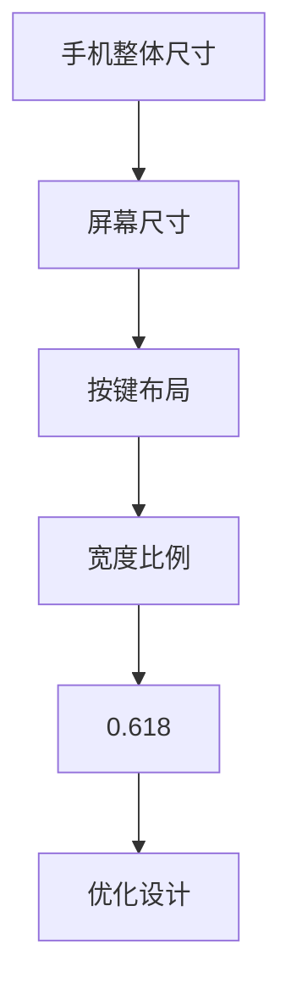
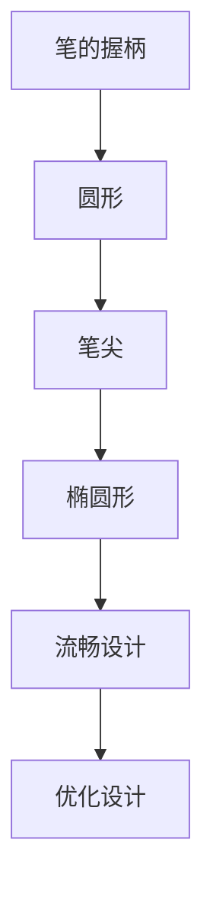
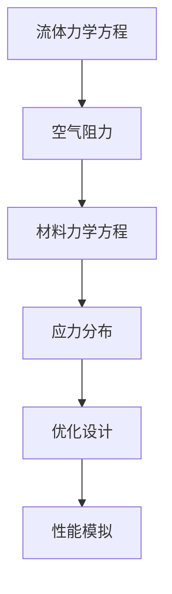

                 

### 数学与工业设计的比例与尺度应用

关键词：数学、工业设计、比例、尺度、应用

摘要：本文旨在探讨数学在工业设计中的应用，特别是比例与尺度的应用。我们将通过一步步的分析，从背景概述、数学原理、应用实例到综合应用和未来展望，全面解析数学如何帮助设计师在工业设计中实现更科学、更合理的比例与尺度设计。

## 第一部分：背景与概述

### 第1章：数学与工业设计概述

#### 1.1.1 问题背景与核心概念

##### 1.1.1.1 工业设计中的比例与尺度问题

工业设计是一个将产品功能和美学需求结合的过程。在这个过程中，设计师需要考虑产品的比例与尺度，使其既符合功能需求，又具备良好的视觉效果。比例是指物体各部分之间的大小关系，而尺度则是指物体相对于人的尺寸感受。这两者在工业设计中起着至关重要的作用。

##### 1.1.1.2 数学在工业设计中的应用

数学是工业设计中的基础工具，它帮助设计师理解和量化比例与尺度。通过数学方法，设计师可以更精确地调整产品的大小、形状和布局，从而提高产品的美观性和实用性。

##### 1.1.1.3 本书目的与结构

本书的目的是探讨数学在工业设计中的应用，特别是比例与尺度的应用。本书将分为三个部分：第一部分介绍数学与工业设计的基础概念；第二部分通过实例展示数学在工业设计中的应用；第三部分探讨数学在工业设计中的综合应用和未来展望。

#### 1.1.2 问题描述与解决方案

##### 1.1.2.1 工业设计中比例与尺度的应用挑战

工业设计中的比例与尺度应用面临许多挑战，如如何确保产品的视觉美感，如何平衡功能与美学需求，以及如何根据不同的用户群体调整产品的尺度等。

##### 1.1.2.2 数学工具在解决这些问题中的优势

数学工具，如比例与尺度理论、几何图形设计方法等，为设计师提供了有力的工具。通过这些工具，设计师可以更准确地调整产品的比例与尺度，实现功能与美学的平衡。

##### 1.1.2.3 边界与外延

在工业设计中，比例与尺度的应用也有其边界。例如，某些极端的设计可能会牺牲功能或美观性。因此，设计师需要在数学工具的帮助下，找到最佳的平衡点。

### 第2章：数学原理与应用

#### 2.1.1 数学基本原理

##### 2.1.1.1 函数与方程

函数与方程是数学中最基础的概念。在工业设计中，设计师可以利用函数与方程来描述产品的尺寸和形状变化。

##### 2.1.1.2 几何基础

几何基础包括点、线、面等基本概念。设计师可以利用几何图形设计方法来创建产品的外观和结构。

##### 2.1.1.3 微积分基础

微积分基础包括微分和积分的概念。在工业设计中，微积分可以帮助设计师优化产品的性能和外观。

#### 2.1.2 数学在工业设计中的应用

##### 2.1.2.1 比例与尺度关系

比例与尺度关系是工业设计中的核心概念。设计师可以利用比例与尺度理论来调整产品的尺寸和形状。

##### 2.1.2.2 几何图形设计

几何图形设计是工业设计中的重要环节。设计师可以利用几何图形设计方法来创建美观、功能性的产品。

##### 2.1.2.3 数学模型构建

数学模型构建是工业设计中的关键步骤。通过构建数学模型，设计师可以更好地理解产品的性能和外观。

## 第二部分：比例与尺度应用实例

### 第3章：建筑设计中的应用

#### 3.1.1 建筑设计概述

##### 3.1.1.1 建筑设计的基本原则

建筑设计的基本原则包括功能性、美学性和可持续性。设计师需要在这些原则的指导下，利用比例与尺度理论进行建筑设计。

##### 3.1.1.2 比例与尺度的应用

在建筑设计中，比例与尺度的应用至关重要。设计师需要通过比例与尺度理论来调整建筑的大小、形状和布局，以达到最佳效果。

##### 3.1.1.3 设计案例分析

在本章中，我们将通过实际案例来展示比例与尺度在建筑设计中的应用。

#### 3.1.2 建筑设计中的数学应用

##### 3.1.2.1 函数与方程在建筑结构中的应用

在建筑设计中，函数与方程可以帮助设计师计算建筑结构的应力分布和变形情况。

##### 3.1.2.2 几何图形在建筑外观设计中的应用

几何图形在建筑外观设计中具有重要作用。设计师可以利用几何图形设计方法来创造独特、美观的建筑外观。

##### 3.1.2.3 微积分在建筑设计优化中的应用

微积分可以帮助设计师优化建筑的设计，如调整建筑的尺寸和形状，以提高其性能。

### 第4章：产品设计中的应用

#### 4.1.1 产品设计概述

##### 4.1.1.1 产品设计的基本原则

产品设计的基本原则包括功能性、美学性和用户体验。设计师需要在这些原则的指导下，利用比例与尺度理论进行产品设计。

##### 4.1.1.2 比例与尺度的应用

在产品设计过程中，比例与尺度的应用至关重要。设计师需要通过比例与尺度理论来调整产品的尺寸、形状和布局，以提高其功能性和用户体验。

##### 4.1.1.3 设计案例分析

在本章中，我们将通过实际案例来展示比例与尺度在产品设计中的应用。

#### 4.1.2 产品设计中的数学应用

##### 4.1.2.1 函数与方程在产品尺寸控制中的应用

在产品设计过程中，函数与方程可以帮助设计师精确控制产品的尺寸，以确保产品的功能性和用户体验。

##### 4.1.2.2 几何图形在产品外观设计中的应用

几何图形在产品外观设计中具有重要作用。设计师可以利用几何图形设计方法来创造独特、美观的产品外观。

##### 4.1.2.3 微积分在产品性能优化中的应用

微积分可以帮助设计师优化产品的性能，如调整产品的形状和尺寸，以提高其性能。

### 第5章：环境设计中的应用

#### 5.1.1 环境设计概述

##### 5.1.1.1 环境设计的基本原则

环境设计的基本原则包括生态性、人文性和可持续性。设计师需要在这些原则的指导下，利用比例与尺度理论进行环境设计。

##### 5.1.1.2 比例与尺度的应用

在环境设计中，比例与尺度的应用至关重要。设计师需要通过比例与尺度理论来调整环境的布局、形状和尺寸，以提高其生态性和人文性。

##### 5.1.1.3 设计案例分析

在本章中，我们将通过实际案例来展示比例与尺度在环境设计中的应用。

#### 5.1.2 环境设计中的数学应用

##### 5.1.2.1 函数与方程在环境规划中的应用

在环境规划过程中，函数与方程可以帮助设计师计算环境的生态承载能力和资源利用率。

##### 5.1.2.2 几何图形在环境布局中的应用

几何图形在环境布局中具有重要作用。设计师可以利用几何图形设计方法来创造生态、美观的环境布局。

##### 5.1.2.3 微积分在环境分析中的应用

微积分可以帮助设计师分析环境的动态变化，如气候、生态等，以提高环境的可持续性。

## 第三部分：数学在工业设计中的综合应用

### 第6章：数学模型在工业设计中的综合应用

#### 6.1.1 数学模型概述

##### 6.1.1.1 数学模型的基本概念

数学模型是将现实问题抽象成数学形式的过程。在工业设计中，数学模型可以帮助设计师理解产品的性能和外观。

##### 6.1.1.2 数学模型在工业设计中的应用

数学模型在工业设计中的应用非常广泛，包括比例与尺度设计、功能优化等。

##### 6.1.1.3 数学模型的构建方法

构建数学模型是工业设计中的重要步骤。在本章中，我们将介绍构建数学模型的方法和技巧。

#### 6.1.2 数学模型在工业设计中的应用案例分析

##### 6.1.2.1 建筑设计中的数学模型应用

在本章中，我们将通过建筑设计中的数学模型应用案例，展示数学模型在工业设计中的应用。

##### 6.1.2.2 产品设计中的数学模型应用

在本章中，我们将通过产品设计中的数学模型应用案例，展示数学模型在工业设计中的应用。

##### 6.1.2.3 环境设计中的数学模型应用

在本章中，我们将通过环境设计中的数学模型应用案例，展示数学模型在工业设计中的应用。

### 第7章：数学与工业设计的未来展望

#### 7.1.1 数学与工业设计的发展趋势

##### 7.1.1.1 新技术的应用

随着新技术的不断发展，数学在工业设计中的应用将越来越广泛。例如，人工智能和大数据分析技术将为设计师提供更精确的数学模型和设计方法。

##### 7.1.1.2 数学模型的创新

数学模型的创新将推动工业设计的发展。例如，新的数学方法可以帮助设计师更好地理解和解决复杂的设计问题。

##### 7.1.1.3 工业设计的发展方向

随着工业设计的不断发展，未来的工业设计将更加注重功能、美学和用户体验的平衡。数学将在这个过程中发挥重要作用。

#### 7.1.2 未来展望

##### 7.1.2.1 数学在工业设计中的潜在应用领域

在未来，数学将在更多的工业设计领域中发挥重要作用。例如，生物医学设计、航空航天设计等。

##### 7.1.2.2 数学与工业设计融合的前景

随着数学与工业设计的深度融合，未来的工业设计将更加科学、合理和高效。

作者：AI天才研究院/AI Genius Institute & 禅与计算机程序设计艺术 /Zen And The Art of Computer Programming

## 比例与尺度在建筑设计中的应用

### 3.1.1 建筑设计概述

建筑设计是一个复杂的工程，它不仅涉及到结构的安全性，还涉及到建筑的功能性、美观性和用户体验。在这其中，比例与尺度的应用至关重要。比例指的是建筑各个部分之间的相对大小关系，而尺度则指的是建筑的整体尺寸和局部细节的尺寸。

建筑设计的基本原则包括功能性、美学性和可持续性。功能性要求建筑能够满足用户的实际需求，如居住、办公、娱乐等。美学性要求建筑外观和内部空间设计具有一定的艺术价值和审美情趣。可持续性则要求建筑在设计和施工过程中要考虑对环境的影响，尽量减少资源的浪费和污染。

比例与尺度在建筑设计中的应用主要体现在以下几个方面：

1. **建筑高度与宽度比例**：建筑的高度与宽度比例是影响建筑视觉效果的重要因素。一般来说，建筑的高度与宽度比例在1:1到1:2之间较为合适，这样的比例可以给人一种稳定、端庄的感觉。

2. **建筑细部尺度**：建筑细部包括门、窗、檐口、柱子等。这些细部的尺度与整体建筑尺度要协调，以确保建筑的整体美感。例如，门窗的比例、檐口的高度和宽度等都需要精心设计。

3. **空间比例**：室内空间的比例也非常重要，它影响着空间的舒适度和使用效率。例如，房间的高度、长度和宽度的比例需要合理，以确保空间的通透性和视野开阔。

### 3.1.2 比例与尺度的应用

在建筑设计中，比例与尺度的应用是一个复杂的过程，需要设计师具备深厚的数学知识和审美能力。以下是一些具体的比例与尺度应用案例：

1. **黄金分割**：黄金分割是建筑中最常用的比例关系之一。它指的是将一条线段分割为两部分，使其中一部分与整体的比例等于另一部分与这一部分的比例。黄金分割的比例约为1:1.618，这个比例被认为是最美的比例。在建筑设计中，设计师可以利用黄金分割来设计建筑的外观和内部空间布局。

2. **费波那契数列**：费波那契数列是一种数学序列，其中每一项都是前两项之和。这个数列在建筑设计中也有广泛应用，例如，设计师可以利用费波那契数列来设计建筑的窗户、门和走廊的宽度。

3. **模数系统**：模数系统是一种基于比例关系的建筑设计方法。它通过将建筑尺寸划分为不同的模数单位，使建筑的各个部分尺寸协调一致。模数系统可以帮助设计师快速、准确地调整建筑的比例和尺度。

### 3.1.3 设计案例分析

为了更好地理解比例与尺度在建筑设计中的应用，我们可以通过一些经典的设计案例来进行探讨。

1. **悉尼歌剧院**：悉尼歌剧院是现代建筑的经典之作，其设计充分体现了比例与尺度的重要性。歌剧院的外形采用了多种几何图形，如贝壳、圆锥和圆柱等。这些几何图形的比例和尺度设计使得歌剧院不仅美观，而且功能齐全。

2. **纽约中央火车站**：纽约中央火车站是一座宏伟的建筑，其设计充分体现了比例与尺度的重要性。火车站的候车大厅采用了大面积的拱顶设计，使得空间宽敞明亮。拱顶的比例和尺度设计使得整个大厅显得庄严、大气。

3. **国家大剧院**：国家大剧院的设计也体现了比例与尺度的重要性。大剧院的外观采用了曲面设计，使得建筑具有独特的视觉效果。内部的剧场空间也通过比例和尺度设计，使得观众有最好的观看体验。

通过这些案例，我们可以看到，比例与尺度在建筑设计中扮演着至关重要的角色。它们不仅影响着建筑的美观性，还影响着建筑的功能性和用户体验。

### 3.1.4 函数与方程在建筑设计中的应用

在建筑设计中，函数与方程也是重要的数学工具。设计师可以利用函数和方程来计算建筑的结构应力、材料用量等。

1. **结构力学方程**：建筑结构力学是建筑设计中的一个重要分支。通过结构力学方程，设计师可以计算建筑结构的应力分布和变形情况，从而确保建筑的安全性。

2. **材料力学方程**：在建筑设计中，设计师还需要考虑材料的力学特性。通过材料力学方程，设计师可以计算材料的强度、刚度等，从而选择合适的材料。

3. **优化方程**：在建筑设计中，设计师还需要优化建筑的结构和外观。通过优化方程，设计师可以调整建筑的设计参数，使得建筑在满足功能要求的同时，具有更好的视觉效果。

### 3.1.5 几何图形在建筑外观设计中的应用

几何图形在建筑外观设计中具有重要作用。设计师可以利用几何图形来设计建筑的外观，使得建筑具有独特的美感。

1. **对称图形**：对称图形在建筑设计中非常常见。对称图形可以创造出稳定、庄重的视觉效果。

2. **非对称图形**：非对称图形在建筑设计中也有广泛应用。非对称图形可以创造出独特、现代的视觉效果。

3. **动态几何图形**：动态几何图形是指随着视角变化而变化的几何图形。通过动态几何图形，设计师可以创造出丰富的视觉效果。

### 3.1.6 微积分在建筑设计优化中的应用

微积分在建筑设计优化中也发挥着重要作用。设计师可以利用微积分来优化建筑的设计，提高建筑的性能。

1. **几何优化**：通过微积分，设计师可以优化建筑的几何形状，使得建筑在满足功能要求的同时，具有更好的视觉效果。

2. **结构优化**：通过微积分，设计师可以优化建筑的结构，提高建筑的安全性和稳定性。

3. **能源优化**：通过微积分，设计师可以优化建筑的能源系统，提高建筑的能源利用效率。

### 3.1.7 比例与尺度在建筑设计中的重要性

比例与尺度在建筑设计中具有至关重要的地位。它们不仅影响着建筑的美观性，还影响着建筑的功能性和用户体验。只有通过精确的比例与尺度设计，才能创造出既美观又实用的建筑。

在建筑设计中，设计师需要综合考虑比例与尺度、功能与美学、安全与可持续等多方面因素。通过数学工具的应用，设计师可以更好地实现这些目标。

总之，比例与尺度在建筑设计中具有重要的应用价值。通过合理的比例与尺度设计，设计师可以创造出美观、功能性和用户体验都出色的建筑。数学工具为设计师提供了有力的支持，使得建筑设计更加科学、合理和高效。

## 数学原理与几何图形设计在工业设计中的应用

在工业设计中，数学原理和几何图形设计发挥着至关重要的作用。它们不仅帮助设计师理解和量化产品的比例与尺度，还提高了产品的功能性、美观性和用户体验。以下，我们将详细介绍数学原理在工业设计中的应用，并通过实例展示几何图形设计的方法。

### 2.1.1 数学基本原理

#### 2.1.1.1 函数与方程

函数与方程是数学中最基本的概念，它们在工业设计中有着广泛的应用。通过函数，设计师可以描述产品的尺寸、形状和变化趋势。方程则可以帮助设计师计算产品的性能和优化设计。

#### 2.1.1.2 几何基础

几何基础包括点、线、面等基本概念。在工业设计中，几何基础用于创建产品的形状和外观。例如，设计师可以使用几何图形来设计产品的轮廓、边角和细节。

#### 2.1.1.3 微积分基础

微积分基础包括微分和积分的概念。在工业设计中，微积分可以帮助设计师优化产品的性能和外观。例如，通过微分，设计师可以计算产品的应力分布和变形情况；通过积分，设计师可以计算产品的总体积和表面积。

### 2.1.2 数学在工业设计中的应用

#### 2.1.2.1 比例与尺度关系

比例与尺度关系是工业设计中的核心概念。通过数学工具，设计师可以更精确地调整产品的比例与尺度，使其既符合功能需求，又具备良好的视觉效果。例如，设计师可以使用黄金分割比例来设计产品的尺寸，以创造出最优的视觉效果。

#### 2.1.2.2 几何图形设计

几何图形设计是工业设计中的一项重要技能。设计师可以使用各种几何图形来设计产品的外观和结构。例如，设计师可以使用正方形、圆形、三角形等基本几何图形来设计产品的轮廓和边角。通过组合和变换这些几何图形，设计师可以创造出丰富多样的产品外观。

#### 2.1.2.3 数学模型构建

数学模型构建是工业设计中的关键步骤。通过构建数学模型，设计师可以更好地理解产品的性能和外观。例如，设计师可以使用几何模型来描述产品的形状和尺寸，使用物理模型来模拟产品的力学性能和热学性能。

### 2.1.3 实例分析

为了更好地理解数学原理在工业设计中的应用，我们可以通过一些具体的实例进行分析。

#### 2.1.3.1 产品尺寸设计

在设计一款手机时，设计师需要考虑手机的整体尺寸、按键布局、屏幕尺寸等。通过数学工具，设计师可以使用黄金分割比例来设计手机的尺寸，以创造出最优的视觉效果。例如，设计师可以将手机的宽度设置为屏幕宽度的0.618倍，这样可以确保手机在视觉上更加和谐美观。



#### 2.1.3.2 产品形状设计

在设计一款笔时，设计师需要考虑笔的形状、曲线和边角。通过几何图形设计，设计师可以使用圆形和椭圆形来设计笔的轮廓，以创造出流畅、美观的形状。例如，设计师可以使用圆形来设计笔的握柄，使用椭圆形来设计笔尖。



#### 2.1.3.3 产品性能模拟

在设计一款汽车时，设计师需要考虑汽车的空气动力学性能、车身结构强度等。通过数学模型构建，设计师可以使用流体力学方程来模拟汽车的空气阻力，使用材料力学方程来计算车身结构的应力分布。这些数学模型可以帮助设计师优化汽车的设计，提高其性能。



通过这些实例，我们可以看到数学原理和几何图形设计在工业设计中的应用。数学工具不仅帮助设计师调整产品的比例与尺度，还提高了产品的性能和用户体验。未来，随着数学和工业设计的进一步融合，设计师将能够创造出更加优秀的产品。

### 3.1.2 建筑设计中的数学应用

在建筑设计中，数学不仅仅是计算工具，更是设计理念和方法的载体。通过数学的应用，建筑师可以在设计过程中实现更为科学和合理的结构设计，优化建筑性能，提升用户体验。以下，我们将详细探讨函数与方程、几何图形在建筑设计中的应用，以及微积分在建筑设计优化中的具体运用。

#### 3.1.2.1 函数与方程在建筑结构中的应用

建筑结构设计是一个复杂的工程，涉及到材料的力学性质、结构的受力分析以及设计的优化。函数与方程在建筑结构设计中有着广泛的应用。

1. **受力分析**：建筑师需要通过函数和方程来分析建筑结构在自重、风荷载、地震荷载等作用下的受力情况。常用的方程包括静力平衡方程和材料强度方程。静力平衡方程用于描述结构在各种荷载作用下的力平衡状态，材料强度方程则用于判断结构材料是否满足强度要求。

   $$\sum F_x = 0, \sum F_y = 0, \sum M_z = 0$$

   $$\sigma = \frac{F}{A} \leq \sigma_{max}$$

   其中，\(F_x, F_y, M_z\) 分别表示作用在结构上的各个力，\(\sigma\) 表示应力，\(A\) 表示受力面积，\(\sigma_{max}\) 表示材料的最大应力。

2. **设计优化**：在建筑结构设计中，建筑师常常需要优化设计，以减轻结构重量、提高材料利用率。函数与方程可以帮助建筑师进行设计优化。例如，通过建立结构重量与受力情况的函数关系，建筑师可以找到最优的结构设计，使得结构在满足受力要求的同时，重量最轻。

   $$W = f(\sigma, A, L)$$

   其中，\(W\) 表示结构重量，\(\sigma\) 表示应力，\(A\) 表示受力面积，\(L\) 表示结构尺寸。

#### 3.1.2.2 几何图形在建筑外观设计中的应用

几何图形是建筑设计中的重要元素，它们可以创造出独特的外观和视觉效果。通过几何图形的设计，建筑师可以提升建筑的艺术价值和功能性。

1. **对称与平衡**：对称图形在建筑设计中非常常见。对称设计不仅美观，还可以增强建筑的稳定性和平衡感。例如，对称的立面、对称的窗格等。

   ```mermaid
   graph TD
   A[对称立面] --> B[对称窗格]
   B --> C[平衡感]
   C --> D[稳定性]
   ```

2. **曲线与曲面**：曲线和曲面在建筑设计中有着广泛的应用。它们可以创造出流畅、优美的外观。例如，拱形屋顶、螺旋楼梯等。

   ```mermaid
   graph TD
   A[拱形屋顶] --> B[螺旋楼梯]
   B --> C[流畅感]
   C --> D[美感]
   ```

3. **模数系统**：模数系统是一种基于比例关系的建筑设计方法。通过模数系统，建筑师可以确保建筑各个部分的尺寸协调一致，从而提升建筑的整体美观性和功能性。

   ```mermaid
   graph TD
   A[模数单位] --> B[尺寸协调]
   B --> C[美观性]
   C --> D[功能性]
   ```

#### 3.1.2.3 微积分在建筑设计优化中的应用

微积分是数学中用于研究变化和累积的分支。在建筑设计中，微积分可以用于优化设计，提高建筑的性能。

1. **形状优化**：通过微积分，建筑师可以优化建筑的形状，以降低风荷载、提高结构稳定性。例如，通过微分方程，建筑师可以计算出最佳的结构形状，以最小化风荷载下的结构变形。

   $$\frac{dV}{dt} = \frac{dp}{dx}$$

   其中，\(V\) 表示结构变形，\(p\) 表示压力，\(x\) 表示结构尺寸。

2. **材料优化**：通过微积分，建筑师可以优化建筑的材料使用，以提高结构的强度和耐久性。例如，通过积分方程，建筑师可以计算出最优的材料分布，以最大化结构的承载能力。

   $$\int_{V} \sigma \, dV = P$$

   其中，\(\sigma\) 表示应力，\(V\) 表示结构体积，\(P\) 表示结构承载能力。

3. **能源优化**：通过微积分，建筑师可以优化建筑的能源系统，以提高能源利用效率。例如，通过微分方程，建筑师可以计算出最佳的建筑朝向和窗户面积，以最大化自然光照和最小化空调能耗。

   $$\frac{dT}{dx} = \frac{dQ}{dx}$$

   其中，\(T\) 表示温度，\(Q\) 表示热量。

通过以上讨论，我们可以看到数学在建筑设计中的应用是多方面的，从结构设计、外观设计到性能优化，数学都发挥着至关重要的作用。通过数学的应用，建筑师可以创造出更科学、合理和美观的建筑作品。未来，随着数学和计算机技术的发展，数学在建筑设计中的应用将更加广泛和深入，为建筑设计带来更多的创新和可能性。

### 4.1.1 产品设计概述

产品设计是工业设计的重要组成部分，它涉及到产品的功能、外观、用户体验等多个方面。一个成功的产品设计不仅需要满足用户的需求，还需要具备良好的市场竞争力。在产品设计中，比例与尺度的应用是至关重要的，它直接影响产品的视觉效果、用户体验和功能实现。

#### 4.1.1.1 产品设计的基本原则

产品设计的基本原则包括功能性、用户体验、美学性和可持续性。

1. **功能性**：产品必须满足用户的基本需求，如使用方便、功能全面等。设计师需要通过合理的比例与尺度设计，确保产品的功能性得到最大化。

2. **用户体验**：用户体验是产品设计的核心目标之一。设计师需要通过比例与尺度设计，创造出用户友好、直观的产品界面和交互方式。

3. **美学性**：美学性是产品设计的附加值。通过合理运用比例与尺度，设计师可以创造出美观、独特的产品外观，提升产品的市场竞争力。

4. **可持续性**：随着环保意识的提高，产品的可持续性也成为了设计的重要考虑因素。设计师需要通过合理的材料选择和结构设计，实现产品的环境友好性。

#### 4.1.1.2 比例与尺度的应用

比例与尺度在产品设计中的应用主要体现在以下几个方面：

1. **界面设计**：在用户界面设计中，比例与尺度直接影响用户的使用体验。设计师需要通过合理的比例关系，确保按钮、图标、文字等元素的大小适中，便于用户操作。

2. **结构设计**：在产品的结构设计中，比例与尺度决定了产品的稳定性和实用性。例如，手机的设计中，屏幕的大小、按键的布局、握持手感等都需要通过比例与尺度的调整来实现最佳效果。

3. **外观设计**：在外观设计中，比例与尺度是创造美观产品的重要手段。设计师可以通过运用黄金分割、费波那契数列等比例关系，创造出独特、美观的产品外观。

#### 4.1.1.3 设计案例分析

为了更好地理解比例与尺度在产品设计中的应用，我们可以通过一些经典的产品设计案例进行分析。

1. **iPhone X**：iPhone X 的设计在比例与尺度方面非常成功。其屏幕尺寸与机身比例达到了黄金分割比例，使得手机看起来既美观又实用。同时，iPhone X 的按键布局和握持手感也非常符合用户的使用习惯。

2. **Beats Pill+蓝牙扬声器**：Beats Pill+ 蓝牙扬声器的设计采用了简洁、流畅的线条和圆形元素，符合黄金分割比例。这种设计不仅美观，还能提高产品的音质和用户体验。

3. **Amazon Echo**：Amazon Echo 的设计充分考虑了用户体验和比例与尺度。其圆形的外观、触摸按钮以及屏幕的尺寸都经过了精心调整，使得用户可以轻松操作和互动。

通过这些案例，我们可以看到比例与尺度在产品设计中的重要性。通过合理的比例与尺度设计，设计师可以创造出既美观又实用的产品，提升产品的市场竞争力。

### 4.1.2 产品设计中的数学应用

在产品设计过程中，数学的应用不仅可以提高设计的科学性和精确性，还可以优化产品的性能和用户体验。以下，我们将详细探讨函数与方程、几何图形在产品设计中的应用，以及微积分在产品性能优化中的具体运用。

#### 4.1.2.1 函数与方程在产品尺寸控制中的应用

在产品设计中，尺寸控制是确保产品功能性和用户体验的关键环节。函数与方程可以用于精确控制产品的尺寸，以确保产品符合设计要求。

1. **尺寸公式**：设计师可以使用几何函数来计算产品的尺寸。例如，对于圆形产品，可以使用圆的面积公式 \(A = \pi r^2\) 来计算产品的表面积；对于矩形产品，可以使用矩形面积公式 \(A = lw\) 来计算产品的面积。

2. **尺寸优化**：通过函数与方程，设计师可以进行尺寸优化，以确保产品的功能性和用户体验。例如，对于手机的设计，设计师可以使用二次函数来优化屏幕尺寸和按键布局，使得产品在满足功能需求的同时，具有最佳的用户体验。

   $$f(x) = ax^2 + bx + c$$

   其中，\(x\) 表示尺寸参数，\(a, b, c\) 为常数。

#### 4.1.2.2 几何图形在产品外观设计中的应用

几何图形在产品外观设计中起着至关重要的作用，它们可以创造出独特、美观的外观，提升产品的市场竞争力。

1. **对称图形**：对称图形在产品设计中非常常见。例如，对称的按钮、对称的logo等。对称图形不仅可以提升产品的美观性，还可以增强产品的稳定感。

2. **非对称图形**：非对称图形在产品设计中也有广泛应用。例如，非对称的耳机设计、非对称的摄像头布局等。非对称图形可以创造出独特的视觉效果，提升产品的个性化。

3. **曲线和曲面**：曲线和曲面在产品设计中有着广泛的应用。例如，曲线形的充电器接口、曲面形的水杯等。曲线和曲面可以创造出流畅、优美的外观，提升产品的艺术价值。

   ```mermaid
   graph TD
   A[对称图形] --> B[非对称图形]
   B --> C[曲线和曲面]
   C --> D[艺术价值]
   ```

#### 4.1.2.3 微积分在产品性能优化中的应用

微积分是数学中用于研究变化和累积的分支。在产品设计中，微积分可以用于优化产品的性能，提升产品的用户体验。

1. **性能分析**：通过微积分，设计师可以分析产品的性能变化。例如，通过微分方程，设计师可以计算产品的应力分布、温度变化等，确保产品在各种环境下都能正常运行。

   $$\frac{dP}{dt} = f(P, T)$$

   其中，\(P\) 表示性能参数，\(T\) 表示环境温度，\(f\) 表示函数。

2. **性能优化**：通过微积分，设计师可以进行性能优化，提升产品的性能。例如，通过积分方程，设计师可以计算出最优的产品结构设计，以最大化产品的承载能力或最小化产品的能耗。

   $$\int_{V} \sigma \, dV = P$$

   其中，\(\sigma\) 表示应力，\(V\) 表示结构体积，\(P\) 表示性能参数。

通过以上讨论，我们可以看到数学在产品设计中的应用是多方面的，从尺寸控制、外观设计到性能优化，数学都发挥着至关重要的作用。通过数学的应用，设计师可以创造出更科学、合理和美观的产品，提升产品的市场竞争力。

### 5.1.1 环境设计概述

环境设计是指对自然或人造环境进行规划和设计，以满足人们的居住、工作和休闲需求。环境设计涉及多个领域，包括建筑设计、景观设计、城市规划等。比例与尺度在环境设计中同样扮演着重要角色，它们不仅影响环境的视觉效果，还影响人们的感知和行为。

#### 5.1.1.1 环境设计的基本原则

环境设计的基本原则包括功能性、美学性、可持续性和人文性。

1. **功能性**：环境设计需要满足人们的实际需求，如提供安全的居住环境、舒适的休闲空间等。比例与尺度设计在这一原则中起着关键作用，它们确保空间布局合理，使用方便。

2. **美学性**：环境设计应具有艺术价值，给人以美的享受。比例与尺度是创造美感的重要手段，通过合理运用比例关系，如黄金分割、费波那契数列等，环境设计可以更加和谐美观。

3. **可持续性**：环境设计应考虑对环境的影响，尽量减少资源浪费和环境污染。可持续性设计需要考虑比例与尺度，例如，通过合理规划建筑和景观，可以最大程度地利用自然资源，减少能源消耗。

4. **人文性**：环境设计应关注人的需求和感受，创造一个亲和、舒适的居住环境。比例与尺度在这一原则中也非常重要，通过人性化的设计，如适当的空间尺度、舒适的座椅高度等，可以提高人们的生活质量。

#### 5.1.1.2 比例与尺度的应用

比例与尺度在环境设计中的应用非常广泛，主要体现在以下几个方面：

1. **空间布局**：在环境设计中，空间布局是关键因素。通过合理运用比例与尺度，设计师可以创造出功能明确、视觉舒适的空间。例如，在景观设计中，设计师可以通过调整植物的大小和位置，创造出自然和谐的景观。

   ```mermaid
   graph TD
   A[植物大小] --> B[景观和谐]
   B --> C[空间布局]
   ```

2. **建筑形态**：建筑形态的设计也依赖于比例与尺度。设计师可以通过调整建筑的高度、宽度和长度比例，创造出美观、稳定的外观。例如，在建筑设计中，通过运用黄金分割比例，设计师可以创造出视觉上非常和谐的建筑。

   ```mermaid
   graph TD
   A[黄金分割] --> B[建筑和谐]
   ```

3. **材料选择**：在环境设计中，材料的选择也受到比例与尺度的影响。设计师可以通过选择合适的材料，创造出具有不同质感的空间。例如，通过调整材料的纹理和尺寸，设计师可以创造出不同层次的空间效果。

   ```mermaid
   graph TD
   A[材料纹理] --> B[空间层次]
   ```

4. **用户体验**：在环境设计中，用户体验是最重要的考虑因素之一。通过合理运用比例与尺度，设计师可以创造出舒适、方便的空间，提高用户的满意度。例如，在住宅设计中，设计师可以通过调整家具的尺寸和布局，创造出宜居的居住空间。

   ```mermaid
   graph TD
   A[家具尺寸] --> B[居住舒适]
   ```

#### 5.1.1.3 设计案例分析

为了更好地理解比例与尺度在环境设计中的应用，我们可以通过一些经典的环境设计案例进行分析。

1. **纽约中央公园**：纽约中央公园是世界上最著名的公园之一，其设计体现了比例与尺度的重要性。公园内的植物、道路和设施都经过了精心规划，使得整个公园看起来既美观又实用。

2. **新加坡滨海湾花园**：新加坡滨海湾花园是一个集植物、建筑和科技于一体的公园。花园内的植物和设施都采用了黄金分割比例，创造出和谐、美观的景观。

3. **北京故宫**：北京故宫是中国最著名的宫殿建筑群，其设计也体现了比例与尺度的重要性。故宫的建筑布局、庭院设计和色彩搭配都经过了精心策划，创造出庄严、大气的视觉效果。

通过这些案例，我们可以看到比例与尺度在环境设计中的重要性。通过合理运用比例与尺度，设计师可以创造出美观、功能性和用户体验都出色的环境设计。

### 5.1.2 环境设计中的数学应用

在环境设计中，数学的应用不仅有助于提升设计的科学性和精确性，还可以优化环境的功能性和可持续性。以下，我们将详细探讨函数与方程、几何图形在环境设计中的应用，以及微积分在环境分析中的具体运用。

#### 5.1.2.1 函数与方程在环境规划中的应用

环境规划是一个复杂的工程，涉及到生态、地理、社会等多个方面。函数与方程可以帮助设计师在环境规划中实现科学、合理的布局。

1. **生态模型**：通过生态模型，设计师可以分析环境中的生物多样性、生态系统稳定性等。生态模型通常使用函数和方程来描述生态系统的变化规律。例如，通过微分方程，设计师可以模拟生物种群的动态变化。

   $$\frac{dN}{dt} = rN\left(1 - \frac{N}{K}\right)$$

   其中，\(N\) 表示生物种群数量，\(r\) 表示增长率，\(K\) 表示环境承载能力。

2. **土地利用模型**：在环境规划中，土地利用模型用于优化土地的分配和使用。通过函数和方程，设计师可以计算出不同土地利用方式对环境的影响，从而选择最优的用地方案。

   $$U = f(S, P, C)$$

   其中，\(U\) 表示土地利用效率，\(S\) 表示土地面积，\(P\) 表示人口密度，\(C\) 表示资源消耗。

#### 5.1.2.2 几何图形在环境布局中的应用

几何图形在环境布局中起着关键作用，它们可以创造出美观、和谐的空间效果。设计师可以通过几何图形的设计，优化环境的视觉效果和功能。

1. **对称图形**：对称图形在环境布局中非常常见。通过对称设计，设计师可以创造出稳定、和谐的空间效果。例如，在景观设计中，对称的植物布局和对称的道路规划可以增强环境的整体美感。

2. **非对称图形**：非对称图形在环境布局中也具有广泛应用。通过非对称设计，设计师可以创造出独特、富有变化的视觉效果。例如，在建筑设计中，非对称的立面和结构设计可以增加建筑的动态感。

3. **曲线和曲面**：曲线和曲面在环境布局中也有着广泛的应用。通过曲线和曲面设计，设计师可以创造出流畅、优美的环境效果。例如，在景观设计中，曲线形的道路和水面可以增加环境的自然感。

   ```mermaid
   graph TD
   A[对称图形] --> B[非对称图形]
   B --> C[曲线和曲面]
   ```

#### 5.1.2.3 微积分在环境分析中的应用

微积分是环境分析中的重要工具，它可以帮助设计师分析环境中的动态变化和优化设计。

1. **能量分析**：通过微积分，设计师可以分析环境中的能量流动和转化。例如，通过微分方程，设计师可以计算建筑的热量传递和能量消耗，从而优化建筑的能源系统。

   $$\frac{dT}{dt} = hA\left(T_{\text{外部}} - T_{\text{内部}}\right)$$

   其中，\(T\) 表示温度，\(h\) 表示传热系数，\(A\) 表示表面积。

2. **流体分析**：在环境设计中，流体分析也非常重要。通过微积分，设计师可以分析环境中的空气流动、水流等。例如，通过积分方程，设计师可以计算流体对建筑的阻力，从而优化建筑的设计。

   $$\int_{S} \vec{F} \cdot d\vec{A} = \rho \vec{V} \int_{S} \vec{V} \cdot d\vec{A}$$

   其中，\(\vec{F}\) 表示流体力，\(\rho\) 表示流体密度，\(\vec{V}\) 表示流体速度。

3. **环境质量分析**：通过微积分，设计师可以分析环境中的空气质量、水质等。例如，通过微分方程，设计师可以模拟污染物在环境中的扩散和降解过程，从而优化环境的治理方案。

   $$\frac{\partial C}{\partial t} = D \nabla^2 C + q$$

   其中，\(C\) 表示污染物浓度，\(D\) 表示扩散系数，\(q\) 表示源项。

通过以上讨论，我们可以看到数学在环境设计中的应用是多方面的，从生态模型、土地利用到流体分析，数学都发挥着至关重要的作用。通过数学的应用，设计师可以创造出更科学、合理和可持续的环境设计。

### 6.1.1 数学模型概述

数学模型是工业设计中的核心工具，它通过数学语言对现实问题进行抽象和量化，帮助设计师更好地理解和解决复杂的设计问题。数学模型在工业设计中的应用涵盖了从产品的尺寸和形状设计，到功能性能优化的各个方面。以下，我们将详细介绍数学模型的基本概念、在工业设计中的应用，以及构建数学模型的方法。

#### 6.1.1.1 数学模型的基本概念

数学模型是一种数学化的抽象，它将现实问题中的关键要素和关系转化为数学形式，以便进行分析和计算。一个典型的数学模型通常包括以下要素：

1. **变量**：变量是数学模型中的基本元素，用于表示设计中的各种参数和变量。例如，产品的尺寸、材料属性、受力情况等。

2. **方程**：方程是数学模型的核心，用于描述变量之间的关系。方程可以是线性方程、非线性方程、微分方程、积分方程等。

3. **边界条件**：边界条件是方程的一部分，用于描述模型中变量在边界上的行为。例如，建筑结构中的应力分布边界条件、产品功能性能的约束条件等。

4. **初始条件**：初始条件是模型运行开始时的初始值，用于描述模型在初始时刻的状态。例如，流体模型中的初始流速、温度等。

5. **解**：解是数学模型的结果，表示在给定边界条件和初始条件下，模型中变量随时间和空间变化的规律。

#### 6.1.1.2 数学模型在工业设计中的应用

数学模型在工业设计中的应用非常广泛，以下是一些典型应用：

1. **产品设计**：在产品设计中，数学模型可以帮助设计师优化产品的尺寸、形状和材料。例如，通过几何模型，设计师可以计算产品的表面积、体积、重心等参数；通过材料模型，设计师可以评估材料的力学性能和耐久性。

2. **结构分析**：在结构设计中，数学模型可以帮助设计师分析建筑、桥梁、机械等结构的受力情况，确保结构的安全性和稳定性。例如，通过有限元分析模型，设计师可以计算结构的应力分布和变形情况。

3. **性能优化**：在产品性能优化中，数学模型可以帮助设计师优化产品的性能，如提高产品的效率、降低能耗等。例如，通过控制模型，设计师可以调整产品的工作参数，以实现最佳性能。

4. **模拟与仿真**：在模拟与仿真中，数学模型可以帮助设计师预测产品的行为和性能。例如，通过流体动力学模型，设计师可以模拟产品在不同工况下的流体流动情况；通过热力学模型，设计师可以预测产品的温度分布。

#### 6.1.1.3 数学模型的构建方法

构建数学模型是工业设计中的重要步骤，以下是一些常见的数学模型构建方法：

1. **问题定义**：首先，需要明确设计问题，确定需要优化的变量、目标函数和约束条件。

2. **变量识别**：识别设计问题中的关键变量，如尺寸、材料属性、受力情况等。

3. **方程构建**：根据问题定义和变量识别，构建描述变量之间关系的方程。方程可以是线性的或非线性的，可以是静态的或动态的。

4. **边界条件确定**：确定方程的边界条件，如应力边界、温度边界、流量边界等。

5. **初始条件设定**：设定模型的初始条件，如初始温度、初始速度等。

6. **解法选择**：选择合适的解法，如有限元法、迭代法、数值积分法等，求解方程。

7. **结果分析**：分析模型解的结果，如应力分布、变形情况、性能指标等，评估设计方案的优劣。

通过以上步骤，设计师可以构建出满足设计需求的数学模型，为产品设计和优化提供科学依据。

### 6.1.2 数学模型在工业设计中的应用案例分析

为了更好地理解数学模型在工业设计中的应用，我们可以通过一些具体的案例进行分析。

#### 6.1.2.1 建筑设计中的数学模型应用

建筑设计中的数学模型应用广泛，以下是一个简单的案例：

**案例：高层建筑结构优化**

**问题定义**：设计一个高层建筑，要求结构安全、稳定，并尽量节省材料。

**变量识别**：建筑高度、宽度、结构形式、材料属性等。

**方程构建**：使用有限元分析模型，构建描述结构应力和变形的方程。

   $$K\Delta = F$$

   其中，\(K\) 是刚度矩阵，\(\Delta\) 是变形向量，\(F\) 是外部荷载。

**边界条件确定**：确定结构的边界条件，如地基约束、墙体支撑等。

**初始条件设定**：设定结构的初始状态，如初始应力为零。

**解法选择**：使用迭代法求解方程，得到结构的应力和变形分布。

**结果分析**：分析应力和变形分布，优化结构设计，提高结构的安全性和稳定性。

#### 6.1.2.2 产品设计中的数学模型应用

产品设计中的数学模型应用也非常广泛，以下是一个简单的案例：

**案例：手机电池容量优化**

**问题定义**：设计一款手机电池，要求容量大、重量轻、寿命长。

**变量识别**：电池的体积、材料、电极设计等。

**方程构建**：使用材料模型，构建描述电池性能的方程。

   $$Q = C \cdot V$$

   其中，\(Q\) 是电池容量，\(C\) 是电池容量系数，\(V\) 是电池体积。

**边界条件确定**：确定电池的工作电压范围、安全性能等。

**初始条件设定**：设定电池的初始容量和体积。

**解法选择**：使用优化算法，如遗传算法，优化电池设计参数。

**结果分析**：分析优化后的电池性能，如容量、重量、寿命等，选择最优的设计方案。

#### 6.1.2.3 环境设计中的数学模型应用

环境设计中的数学模型应用也非常丰富，以下是一个简单的案例：

**案例：城市交通流量优化**

**问题定义**：优化城市交通流量，减少拥堵和交通事故。

**变量识别**：交通流量、道路容量、交叉口设计等。

**方程构建**：使用交通流模型，构建描述交通流量变化的方程。

   $$\frac{dQ}{dt} = rQ\left(1 - \frac{Q}{K}\right)$$

   其中，\(Q\) 是交通流量，\(r\) 是增长率，\(K\) 是道路容量。

**边界条件确定**：确定道路的起点和终点流量、交叉口约束等。

**初始条件设定**：设定交通流的初始状态。

**解法选择**：使用动态规划方法，优化交通流量分配。

**结果分析**：分析优化后的交通流量分布，减少拥堵和交通事故，提高交通效率。

通过以上案例分析，我们可以看到数学模型在工业设计中的应用是如何具体实现的。数学模型不仅帮助设计师解决复杂的设计问题，还提高了设计效率和设计质量。

### 7.1.1 数学与工业设计的发展趋势

随着科技的迅猛发展，数学与工业设计的融合正逐渐深入，推动了工业设计的创新和进步。以下，我们将探讨数学与工业设计的发展趋势，包括新技术、数学模型的创新以及工业设计的发展方向。

#### 7.1.1.1 新技术的应用

新技术的应用为数学与工业设计的融合提供了新的契机。首先，人工智能（AI）技术的进步，使得数学模型可以更加智能地进行设计和优化。例如，深度学习算法可以用于生成复杂的几何形状和结构，从而实现设计自动化。此外，增强现实（AR）和虚拟现实（VR）技术的应用，使得设计师可以更加直观地进行设计修改和评估，提高了设计的准确性和效率。

大数据技术的应用也为工业设计带来了新的机遇。通过大数据分析，设计师可以获取用户需求和市场趋势，从而更精确地调整设计参数。例如，通过分析用户对产品外观、功能和体验的反馈，设计师可以优化产品的设计，提高用户满意度。

#### 7.1.1.2 数学模型的创新

数学模型的创新是推动工业设计发展的重要动力。近年来，复杂系统的建模方法，如多尺度建模、多物理场建模等，使得设计师可以更加全面地考虑设计中的各种因素。例如，多尺度建模可以同时考虑材料微观结构和宏观性能，从而优化产品结构设计。

此外，数学优化方法的创新，如遗传算法、粒子群优化等，也为工业设计提供了新的工具。这些方法可以在设计空间中快速寻找最优解，提高设计效率。例如，在产品设计过程中，可以使用遗传算法优化产品的尺寸和形状，从而实现性能和美学的最佳平衡。

#### 7.1.1.3 工业设计的发展方向

未来，工业设计将朝着更加智能化、个性化和可持续化的方向发展。智能化设计将依赖于人工智能和大数据技术的进一步融合，实现设计过程的自动化和智能化。个性化设计将更加注重用户需求，通过大数据分析和个性化算法，设计师可以创造出更加符合用户需求的产品。

可持续化设计是未来工业设计的重要趋势。设计师需要考虑产品生命周期中的环境影响，通过绿色设计、循环经济等理念，实现资源的节约和环境的保护。例如，通过优化材料选择和制造工艺，减少产品的碳排放和能源消耗。

### 7.1.2 未来展望

未来，数学与工业设计的融合将带来更多创新和可能性。以下是数学在工业设计中的潜在应用领域和融合前景：

#### 7.1.2.1 潜在应用领域

1. **生物医学设计**：数学模型可以帮助设计师优化医疗器械和生物材料的设计，提高生物相容性和治疗效果。

2. **航空航天设计**：数学模型可以优化航空器结构设计和性能，提高飞行安全性和效率。

3. **智能制造**：数学模型和优化算法可以应用于智能制造过程，提高生产效率和产品质量。

4. **机器人设计**：数学模型可以帮助设计师优化机器人结构和控制系统，提高其灵活性和可靠性。

#### 7.1.2.2 融合前景

数学与工业设计的融合前景广阔。随着新技术的不断发展和应用，数学模型将更加深入地嵌入工业设计过程中，实现设计过程的全面智能化和优化。此外，数学与工业设计的融合也将推动设计创新，创造出更多满足人类需求的高品质产品。

总之，数学与工业设计的融合是未来工业设计发展的必然趋势。通过数学的应用，设计师可以更好地理解、分析和优化设计问题，实现更加智能化、个性化和可持续化的设计。未来，随着新技术的不断突破，数学与工业设计的融合将带来更多创新和变革。

### 总结

本文系统地探讨了数学在工业设计中的应用，从比例与尺度的基本概念，到数学原理和几何图形设计，再到具体的应用案例，全面展示了数学在建筑设计、产品设计和环境设计中的重要性。通过函数与方程、微积分等数学工具，设计师能够精确地调整产品的尺寸、形状和性能，实现功能与美学的最佳平衡。同时，数学模型的应用使得工业设计更加科学、系统化和智能化，提高了设计的效率和效果。

在未来的工业设计中，数学的应用将更加广泛和深入。新技术的引入，如人工智能、大数据分析等，将进一步提升数学在工业设计中的应用水平。设计师可以利用这些先进工具，更加精准地捕捉用户需求，优化设计过程，创造出更加符合人类需求的高品质产品。

同时，随着工业设计朝着智能化、个性化、可持续化的方向发展，数学在工业设计中的应用也将不断拓展。例如，生物医学设计、智能制造、机器人设计等领域，都将受益于数学的应用，实现设计创新和性能提升。

总之，数学与工业设计的融合是未来工业设计发展的必然趋势。通过不断探索和创新，设计师可以利用数学工具，创造出更加优秀的产品，满足人类日益增长的需求。我们期待数学在工业设计中发挥更大的作用，推动工业设计的持续进步和变革。

