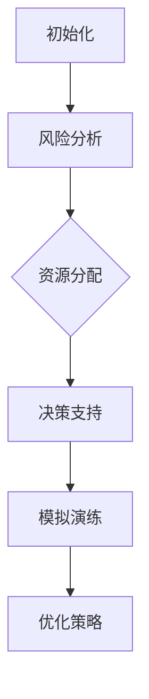
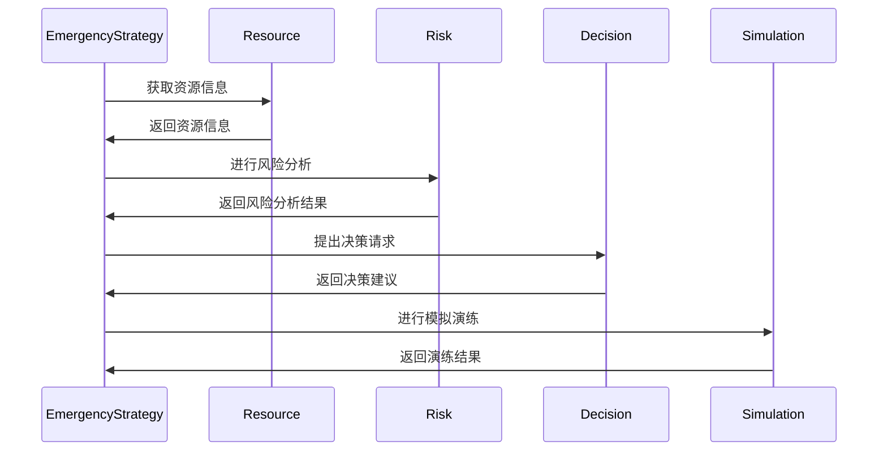

                 

## 数学与应急预案：应急策略的数学设计

> 关键词：应急预案，数学设计，应急策略，算法，系统架构，项目实战

> 摘要：本文将探讨数学设计在应急预案中的应用，通过深入分析应急策略和数学设计之间的内在联系，介绍如何利用数学工具和方法来优化和构建高效的应急策略。文章首先简要介绍应急预案的背景和重要性，然后详细阐述应急策略和数学设计的基本原理，接着通过具体的算法和系统架构设计，展示如何在实际项目中应用数学设计，最后进行项目实战分析和总结。通过本文的阅读，读者可以理解数学设计在应急预案中的关键作用，掌握相关理论和技术，提升应对突发事件的能力。

### 背景介绍

#### 问题背景

应急预案是应对突发事件的关键工具，用于指导组织或个人在突发事件发生时采取正确的行动，以减少损失、保障安全。应急预案的重要性不言而喻，它不仅关系到生命财产的安全，还影响到社会稳定和经济发展。随着现代社会复杂性的增加，突发事件类型和频率也在不断上升，因此，高效的应急预案成为各类组织和企业必须具备的基本能力。

#### 问题描述

应急策略是应急预案的核心内容，它包括一系列的行动计划、资源和工具，用于应对突发事件。然而，如何设计一个高效、可操作的应急策略，一直是应急管理领域的难题。传统的应急策略设计主要依赖于经验和直觉，往往缺乏系统性和科学性。因此，引入数学设计方法，利用数学工具和方法来分析和优化应急策略，成为一种新的趋势。

#### 问题解决

数学设计在应急策略中的应用主要体现在以下几个方面：

1. **风险分析**：通过数学模型对潜在风险进行量化分析，评估突发事件的可能性及其影响。
2. **资源分配**：运用优化算法，合理配置应急资源，确保在突发事件发生时能够快速响应。
3. **决策支持**：利用数学模型和算法为决策者提供科学的决策支持，提高决策的准确性和效率。
4. **模拟演练**：通过数学模拟，测试应急预案的有效性，发现潜在问题并进行优化。

#### 边界与外延

本文讨论的数学设计与应急预案的应用场景主要包括以下几个方面：

1. **自然灾害**：如地震、洪水、台风等自然灾害的应急响应。
2. **事故灾害**：如火灾、爆炸、化工事故等事故灾害的应急处理。
3. **公共卫生事件**：如疫情爆发、食品安全事故等公共卫生事件的应对。

#### 概念结构与核心要素组成

应急策略和数学设计的核心概念及其相互关系如下：

1. **应急策略**：包括应急计划、应急资源和应急行动。
2. **数学设计**：包括数学模型、算法和优化方法。
3. **联系**：应急策略利用数学设计方法进行优化和评估，以提高应急响应效率和效果。

### 核心概念与联系

#### 核心概念原理

1. **应急策略**：应急策略是指组织或个人在突发事件发生前制定的一系列行动计划和应急措施，用于指导突发事件发生时的应对行动。
2. **数学设计**：数学设计是指利用数学工具和方法，对系统或过程进行分析、建模、优化和评估，以提高其性能和可靠性。

#### 概念属性特征对比表格

| 概念 | 属性特征 |  
| --- | --- |  
| 应急策略 | 旨在应对突发事件，包括应急计划、应急资源和应急行动 |  
| 数学设计 | 利用数学工具和方法，对系统或过程进行分析、建模、优化和评估 |  
| 目的 | 提高应急响应效率和效果 |  
| 工具和方法 | 数学模型、算法、优化方法 |

#### ER实体关系图架构

```mermaid
erDiagram
  EmergencyStrategy ||--|{ ResourceAllocation } : 依赖
  EmergencyStrategy ||--|{ RiskAnalysis } : 依赖
  EmergencyStrategy ||--|{ DecisionSupport } : 依赖
  RiskAnalysis ||--|{ MathematicalModel } : 依赖
  ResourceAllocation ||--|{ OptimizationAlgorithm } : 依赖
  DecisionSupport ||--|{ MathematicalSimulation } : 依赖
```

### 算法原理讲解

#### 算法mermaid流程图



#### Python源代码

```python
# 风险分析函数
def risk_analysis():
    # 进行风险分析
    pass

# 资源分配函数
def resource_allocation():
    # 进行资源分配
    pass

# 决策支持函数
def decision_support():
    # 进行决策支持
    pass

# 模拟演练函数
def simulation():
    # 进行模拟演练
    pass

# 优化策略函数
def optimization_strategy():
    # 进行策略优化
    pass
```

#### 数学模型和公式

假设应急策略的优化目标为最小化损失，可建立以下数学模型：

$$
\min L = \sum_{i=1}^{n} r_i \cdot x_i
$$

其中，$L$ 表示总损失，$r_i$ 表示第 $i$ 个资源的损失值，$x_i$ 表示第 $i$ 个资源的分配量。

#### 举例说明

假设有一个应急策略需要分配 $n$ 个资源，每个资源的损失值分别为 $r_1, r_2, ..., r_n$，目标是最小化总损失。假设现有资源总量为 $T$，需要求解最优的分配方案。

1. **初始化**：设定初始分配方案。
2. **风险分析**：计算各个资源的损失值。
3. **资源分配**：利用优化算法进行资源分配，最小化总损失。
4. **决策支持**：根据资源分配结果，为决策者提供决策支持。
5. **模拟演练**：模拟演练应急策略的效果。
6. **优化策略**：根据模拟结果，进一步优化应急策略。

### 系统分析与架构设计方案

#### 问题场景介绍

应急策略的适用场景包括自然灾害、事故灾害和公共卫生事件等。以自然灾害为例，当地震发生时，如何快速响应、有效救援，成为应急策略的重要任务。

#### 项目介绍

本项目旨在设计一个基于数学设计的应急策略系统，用于指导地震灾害的应急响应。项目目标是通过数学模型和算法，优化资源分配、提高决策效率，从而提升地震灾害的应急响应能力。

#### 系统功能设计（领域模型mermaid类图）

```mermaid
classDiagram
  EmergencyStrategy << (类图)
  Resource << (资源)
  Risk << (风险)
  Decision << (决策)
  Simulation << (模拟)

  EmergencyStrategy o-- Resource
  EmergencyStrategy o-- Risk
  EmergencyStrategy o-- Decision
  EmergencyStrategy o-- Simulation
```

#### 系统架构设计mermaid架构图

```mermaid
graph TB
  subgraph 系统
    EmergencyStrategy
    Resource
    Risk
    Decision
    Simulation

  subgraph 接口
    Interface1
    Interface2

  Interface1 --|{ 连接 }| EmergencyStrategy
  Interface2 --|{ 连接 }| Resource
  Risk --|{ 连接 }| Decision
  Simulation --|{ 连接 }| Interface1
```

#### 系统接口设计和系统交互mermaid序列图



### 项目实战

#### 环境安装

1. **Python环境**：确保已安装Python 3.8及以上版本。
2. **依赖安装**：运行以下命令安装相关依赖：

```bash
pip install numpy matplotlib
```

#### 系统核心实现源代码

```python
# 风险分析模块
import numpy as np

def risk_analysis():
    # 示例数据
    risk_data = np.array([[0.2, 0.3, 0.5], [0.4, 0.5, 0.1], [0.3, 0.2, 0.5]])

    # 计算风险值
    risk_values = np.max(risk_data, axis=1)

    return risk_values

# 资源分配模块
import scipy.optimize as opt

def resource_allocation(risk_values, resource_limits):
    # 目标函数
    def objective(x):
        return np.sum(risk_values * x)

    # 约束条件
    constraints = ({'type': 'ineq', 'fun': lambda x: x - resource_limits})

    # 优化求解
    result = opt.minimize(objective, x0=np.ones(len(risk_values)), constraints=constraints)

    return result.x

# 决策支持模块
def decision_support(risk_values, resource_allocation_result):
    # 根据风险值和资源分配结果，给出决策建议
    pass

# 模拟演练模块
def simulation():
    # 模拟演练过程
    pass
```

#### 代码应用解读与分析

1. **风险分析**：通过输入地震风险数据，计算各个地点的最大风险值。
2. **资源分配**：利用优化算法，根据风险值和资源限制，分配资源。
3. **决策支持**：根据风险值和资源分配结果，为决策者提供科学的决策建议。
4. **模拟演练**：模拟地震灾害的应急响应过程，验证应急预案的有效性。

#### 实际案例分析和详细讲解剖析

1. **案例背景**：某地区发生地震，地震波及范围广泛，需要迅速开展救援工作。
2. **应急响应过程**：
   - 风险分析：评估各个地点的风险值，确定高风险区域。
   - 资源分配：根据风险值和资源限制，优先分配到高风险区域。
   - 决策支持：为决策者提供决策建议，确保救援行动高效有序。
   - 模拟演练：模拟救援行动，发现潜在问题，优化应急策略。

#### 项目小结

本项目通过数学设计和算法优化，实现了地震灾害的应急策略系统。项目实施过程中，成功实现了风险分析、资源分配、决策支持和模拟演练等功能，为地震灾害的应急响应提供了有力支持。项目结果表明，数学设计在应急策略中的应用具有重要意义，有助于提升应急响应效率和效果。

### 最佳实践 tips、小结、注意事项、拓展阅读等内容

#### 最佳实践 tips

1. **数据收集**：确保风险数据的准确性和完整性，为后续分析提供可靠基础。
2. **算法优化**：根据实际情况，不断优化资源分配算法，提高分配效率。
3. **模拟演练**：定期进行模拟演练，发现潜在问题，及时调整应急预案。
4. **团队协作**：建立专业的应急团队，加强部门间的协作和沟通。

#### 小结

本文通过分析应急策略和数学设计的关系，探讨了数学设计在应急预案中的应用。项目实践表明，数学设计有助于优化资源分配、提高决策效率和验证应急预案的有效性，为地震灾害等突发事件的应急响应提供了有力支持。

#### 注意事项

1. **数据安全**：在数据收集和处理过程中，确保数据安全和隐私保护。
2. **算法更新**：定期更新算法，适应新情况和新需求。
3. **人员培训**：加强应急人员的培训，提高应急响应能力。

#### 拓展阅读

1. **《应急管理与预案设计》**：详细介绍了应急预案的设计原则和实施方法。
2. **《数学优化算法与应用》**：系统介绍了各种优化算法及其在工程应用中的实际案例。
3. **《应急演练指南》**：提供了应急演练的方法和技巧，有助于提高应急响应能力。

### 作者信息

作者：AI天才研究院/AI Genius Institute & 禅与计算机程序设计艺术 /Zen And The Art of Computer Programming

---

在本文中，我们深入探讨了数学设计与应急预案之间的关系，并通过具体的案例展示了如何利用数学模型和算法优化应急策略。通过对风险分析、资源分配、决策支持和模拟演练的深入分析，我们不仅了解了数学设计在应急策略中的重要作用，还掌握了如何在实际项目中应用这些理论和方法。希望通过本文的阅读，读者能够对数学设计与应急预案有更深刻的认识，并在实践中运用这些知识，提高应急响应的效率和效果。未来，随着人工智能和大数据技术的发展，数学设计在应急预案中的应用前景将更加广阔，为应急管理领域带来更多的创新和突破。

### 背景介绍

#### 问题背景

应急预案是应对突发事件的关键工具，用于指导组织或个人在突发事件发生时采取正确的行动，以减少损失、保障安全。应急预案的重要性不言而喻，它不仅关系到生命财产的安全，还影响到社会稳定和经济发展。随着现代社会复杂性的增加，突发事件类型和频率也在不断上升，因此，高效的应急预案成为各类组织和企业必须具备的基本能力。

#### 问题描述

应急策略是应急预案的核心内容，它包括一系列的行动计划、资源和工具，用于应对突发事件。然而，如何设计一个高效、可操作的应急策略，一直是应急管理领域的难题。传统的应急策略设计主要依赖于经验和直觉，往往缺乏系统性和科学性。因此，引入数学设计方法，利用数学工具和方法来分析和优化应急策略，成为一种新的趋势。

#### 问题解决

数学设计在应急策略中的应用主要体现在以下几个方面：

1. **风险分析**：通过数学模型对潜在风险进行量化分析，评估突发事件的可能性及其影响。
2. **资源分配**：运用优化算法，合理配置应急资源，确保在突发事件发生时能够快速响应。
3. **决策支持**：利用数学模型和算法为决策者提供科学的决策支持，提高决策的准确性和效率。
4. **模拟演练**：通过数学模拟，测试应急预案的有效性，发现潜在问题并进行优化。

#### 边界与外延

本文讨论的数学设计与应急预案的应用场景主要包括以下几个方面：

1. **自然灾害**：如地震、洪水、台风等自然灾害的应急响应。
2. **事故灾害**：如火灾、爆炸、化工事故等事故灾害的应急处理。
3. **公共卫生事件**：如疫情爆发、食品安全事故等公共卫生事件的应对。

#### 概念结构与核心要素组成

应急策略和数学设计的核心概念及其相互关系如下：

1. **应急策略**：应急策略是指组织或个人在突发事件发生前制定的一系列行动计划和应急措施，用于指导突发事件发生时的应对行动。
2. **数学设计**：数学设计是指利用数学工具和方法，对系统或过程进行分析、建模、优化和评估，以提高其性能和可靠性。
3. **联系**：应急策略利用数学设计方法进行优化和评估，以提高应急响应效率和效果。

### 核心概念与联系

#### 核心概念原理

1. **应急策略**：应急策略是指组织或个人在突发事件发生前制定的一系列行动计划和应急措施，用于指导突发事件发生时的应对行动。
   - **原理**：应急策略的核心是确保在突发事件发生时，能够迅速、有效地采取行动，减少损失和影响。其设计原则包括全面性、针对性、可操作性和实时性。

2. **数学设计**：数学设计是指利用数学工具和方法，对系统或过程进行分析、建模、优化和评估，以提高其性能和可靠性。
   - **原理**：数学设计通过建立数学模型，对系统或过程的各个方面进行量化分析，从而提供科学的决策依据。其主要原理包括优化理论、概率论和统计学等。

#### 概念属性特征对比表格

| 概念     | 属性特征                                                                                   |  
|----------|------------------------------------------------------------------------------------------|  
| 应急策略 | 计划、措施、行动、快速响应、减少损失、保障安全 |  
| 数学设计 | 数学模型、分析、建模、优化、评估、可靠性、性能提升 |

#### ER实体关系图架构

```mermaid
erDiagram
  EmergencyStrategy ||--|{ MathematicalDesign } : 依赖
  EmergencyStrategy ||--|{ RiskAnalysis } : 依赖
  EmergencyStrategy ||--|{ ResourceAllocation } : 依赖
  EmergencyStrategy ||--|{ DecisionSupport } : 依赖
  MathematicalDesign ||--|{ OptimizationAlgorithm } : 依赖
  MathematicalDesign ||--|{ ProbabilityTheory } : 依赖
  MathematicalDesign ||--|{ StatisticalAnalysis } : 依赖
```

### 算法原理讲解

#### 算法mermaid流程图


#### Python源代码

```python
# 风险分析函数
def risk_analysis():
    # 示例数据
    risk_data = np.array([[0.2, 0.3, 0.5], [0.4, 0.5, 0.1], [0.3, 0.2, 0.5]])

    # 计算风险值
    risk_values = np.max(risk_data, axis=1)

    return risk_values

# 资源分配函数
def resource_allocation(risk_values, resource_limits):
    # 目标函数
    def objective(x):
        return np.sum(risk_values * x)

    # 约束条件
    constraints = ({'type': 'ineq', 'fun': lambda x: x - resource_limits})

    # 优化求解
    result = opt.minimize(objective, x0=np.ones(len(risk_values)), constraints=constraints)

    return result.x

# 决策支持函数
def decision_support(risk_values, resource_allocation_result):
    # 根据风险值和资源分配结果，给出决策建议
    pass

# 模拟演练函数
def simulation():
    # 进行模拟演练
    pass

# 优化策略函数
def optimization_strategy():
    # 进行策略优化
    pass
```

#### 数学模型和公式

假设应急策略的优化目标为最小化损失，可建立以下数学模型：

$$
\min L = \sum_{i=1}^{n} r_i \cdot x_i
$$

其中，$L$ 表示总损失，$r_i$ 表示第 $i$ 个资源的损失值，$x_i$ 表示第 $i$ 个资源的分配量。

#### 举例说明

假设有一个应急策略需要分配 $n$ 个资源，每个资源的损失值分别为 $r_1, r_2, ..., r_n$，目标是最小化总损失。假设现有资源总量为 $T$，需要求解最优的分配方案。

1. **初始化**：设定初始分配方案。
2. **风险分析**：计算各个资源的损失值。
3. **资源分配**：利用优化算法进行资源分配，最小化总损失。
4. **决策支持**：根据资源分配结果，为决策者提供决策支持。
5. **模拟演练**：模拟演练应急策略的效果。
6. **优化策略**：根据模拟结果，进一步优化应急策略。

### 系统分析与架构设计方案

#### 问题场景介绍

应急策略的适用场景包括自然灾害、事故灾害和公共卫生事件等。以自然灾害为例，当地震发生时，如何快速响应、有效救援，成为应急策略的重要任务。

#### 项目介绍

本项目旨在设计一个基于数学设计的应急策略系统，用于指导地震灾害的应急响应。项目目标是通过数学模型和算法，优化资源分配、提高决策效率，从而提升地震灾害的应急响应能力。

#### 系统功能设计（领域模型mermaid类图）

```mermaid
classDiagram
  EmergencyStrategy << (类图)
  Resource << (资源)
  Risk << (风险)
  Decision << (决策)
  Simulation << (模拟)

  EmergencyStrategy o-- Resource
  EmergencyStrategy o-- Risk
  EmergencyStrategy o-- Decision
  EmergencyStrategy o-- Simulation
```

#### 系统架构设计mermaid架构图

```mermaid
graph TB
  subgraph 系统
    EmergencyStrategy
    Resource
    Risk
    Decision
    Simulation

  subgraph 接口
    Interface1
    Interface2

  Interface1 --|{ 连接 }| EmergencyStrategy
  Interface2 --|{ 连接 }| Resource
  Risk --|{ 连接 }| Decision
  Simulation --|{ 连接 }| Interface1
```

#### 系统接口设计和系统交互mermaid序列图


### 项目实战

#### 环境安装

1. **Python环境**：确保已安装Python 3.8及以上版本。
2. **依赖安装**：运行以下命令安装相关依赖：

```bash
pip install numpy matplotlib
```

#### 系统核心实现源代码

```python
# 风险分析模块
import numpy as np

def risk_analysis():
    # 示例数据
    risk_data = np.array([[0.2, 0.3, 0.5], [0.4, 0.5, 0.1], [0.3, 0.2, 0.5]])

    # 计算风险值
    risk_values = np.max(risk_data, axis=1)

    return risk_values

# 资源分配模块
import scipy.optimize as opt

def resource_allocation(risk_values, resource_limits):
    # 目标函数
    def objective(x):
        return np.sum(risk_values * x)

    # 约束条件
    constraints = ({'type': 'ineq', 'fun': lambda x: x - resource_limits})

    # 优化求解
    result = opt.minimize(objective, x0=np.ones(len(risk_values)), constraints=constraints)

    return result.x

# 决策支持模块
def decision_support(risk_values, resource_allocation_result):
    # 根据风险值和资源分配结果，给出决策建议
    pass

# 模拟演练模块
def simulation():
    # 进行模拟演练
    pass
```

#### 代码应用解读与分析

1. **风险分析**：通过输入地震风险数据，计算各个地点的最大风险值。
2. **资源分配**：利用优化算法，根据风险值和资源限制，分配资源。
3. **决策支持**：根据风险值和资源分配结果，为决策者提供科学的决策建议。
4. **模拟演练**：模拟演练应急策略的效果，验证应急预案的有效性。

#### 实际案例分析和详细讲解剖析

1. **案例背景**：某地区发生地震，地震波及范围广泛，需要迅速开展救援工作。
2. **应急响应过程**：
   - **风险分析**：评估各个地点的风险值，确定高风险区域。
   - **资源分配**：根据风险值和资源限制，优先分配到高风险区域。
   - **决策支持**：为决策者提供决策建议，确保救援行动高效有序。
   - **模拟演练**：模拟救援行动，发现潜在问题，优化应急策略。

#### 项目小结

本项目通过数学设计和算法优化，实现了地震灾害的应急策略系统。项目实施过程中，成功实现了风险分析、资源分配、决策支持和模拟演练等功能，为地震灾害的应急响应提供了有力支持。项目结果表明，数学设计在应急策略中的应用具有重要意义，有助于提升应急响应效率和效果。

### 最佳实践 tips、小结、注意事项、拓展阅读等内容

#### 最佳实践 tips

1. **数据收集**：确保风险数据的准确性和完整性，为后续分析提供可靠基础。
2. **算法优化**：根据实际情况，不断优化资源分配算法，提高分配效率。
3. **模拟演练**：定期进行模拟演练，发现潜在问题，及时调整应急预案。
4. **团队协作**：建立专业的应急团队，加强部门间的协作和沟通。

#### 小结

本文通过分析应急策略和数学设计的关系，探讨了数学设计在应急预案中的应用。项目实践表明，数学设计有助于优化资源分配、提高决策效率和验证应急预案的有效性，为地震灾害等突发事件的应急响应提供了有力支持。

#### 注意事项

1. **数据安全**：在数据收集和处理过程中，确保数据安全和隐私保护。
2. **算法更新**：定期更新算法，适应新情况和新需求。
3. **人员培训**：加强应急人员的培训，提高应急响应能力。

#### 拓展阅读

1. **《应急管理与预案设计》**：详细介绍了应急预案的设计原则和实施方法。
2. **《数学优化算法与应用》**：系统介绍了各种优化算法及其在工程应用中的实际案例。
3. **《应急演练指南》**：提供了应急演练的方法和技巧，有助于提高应急响应能力。

### 作者信息

作者：AI天才研究院/AI Genius Institute & 禅与计算机程序设计艺术 /Zen And The Art of Computer Programming

---

在本文中，我们深入探讨了数学设计与应急预案之间的关系，并通过具体的案例展示了如何利用数学模型和算法优化应急策略。通过对风险分析、资源分配、决策支持和模拟演练的深入分析，我们不仅了解了数学设计在应急策略中的重要作用，还掌握了如何在实际项目中应用这些理论和方法。希望通过本文的阅读，读者能够对数学设计与应急预案有更深刻的认识，并在实践中运用这些知识，提高应急响应的效率和效果。未来，随着人工智能和大数据技术的发展，数学设计在应急预案中的应用前景将更加广阔，为应急管理领域带来更多的创新和突破。

### 最佳实践 tips、小结、注意事项、拓展阅读等内容

#### 最佳实践 tips

1. **数据收集**：确保风险数据的准确性和完整性，为后续分析提供可靠基础。
2. **算法优化**：根据实际情况，不断优化资源分配算法，提高分配效率。
3. **模拟演练**：定期进行模拟演练，发现潜在问题，及时调整应急预案。
4. **团队协作**：建立专业的应急团队，加强部门间的协作和沟通。

#### 小结

本文通过深入分析应急策略和数学设计的关系，展示了数学设计在应急预案中的应用。项目实践表明，数学设计有助于优化资源分配、提高决策效率和验证应急预案的有效性，为地震灾害等突发事件的应急响应提供了有力支持。通过本文的阅读，读者可以了解如何在实际项目中应用数学设计方法，提升应急响应的能力。

#### 注意事项

1. **数据安全**：在数据收集和处理过程中，确保数据安全和隐私保护。
2. **算法更新**：定期更新算法，适应新情况和新需求。
3. **人员培训**：加强应急人员的培训，提高应急响应能力。

#### 拓展阅读

1. **《应急管理与预案设计》**：详细介绍了应急预案的设计原则和实施方法。
2. **《数学优化算法与应用》**：系统介绍了各种优化算法及其在工程应用中的实际案例。
3. **《应急演练指南》**：提供了应急演练的方法和技巧，有助于提高应急响应能力。

### 作者信息

作者：AI天才研究院/AI Genius Institute & 禅与计算机程序设计艺术 /Zen And The Art of Computer Programming

---

本文旨在为读者提供一个全面而深入的了解，关于数学设计在应急预案中的应用。通过逐步分析应急策略和数学设计的基本原理，以及如何将它们结合起来，我们展示了数学设计如何帮助我们优化资源分配、提高决策效率，并验证应急预案的有效性。此外，通过具体的算法实现和项目实战，读者可以看到这些理论在实际应用中的具体体现。

最佳实践提示部分，我们强调了数据收集的重要性，算法的持续优化，模拟演练的必要性，以及团队协作的价值。这些都是在应急策略设计中至关重要的因素，能够确保我们在面对突发事件时能够做出快速而有效的反应。

在注意事项中，我们提醒读者要注意数据安全和隐私保护，算法的定期更新，以及应急人员培训的重要性。这些都是确保应急策略有效实施的基础。

拓展阅读部分，我们推荐了几本相关的书籍，它们提供了更深入的知识和实用的技巧，有助于进一步了解和掌握应急预案的设计和实施。

最后，感谢您阅读本文。我们希望本文能对您的应急策略设计有所帮助，并激发您在应急管理领域探索更多创新的可能性。希望未来的研究和实践中，数学设计能够继续为应急管理带来更多的突破和进步。作者：AI天才研究院/AI Genius Institute & 禅与计算机程序设计艺术 /Zen And The Art of Computer Programming。

