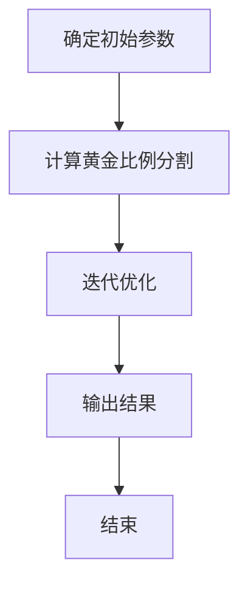
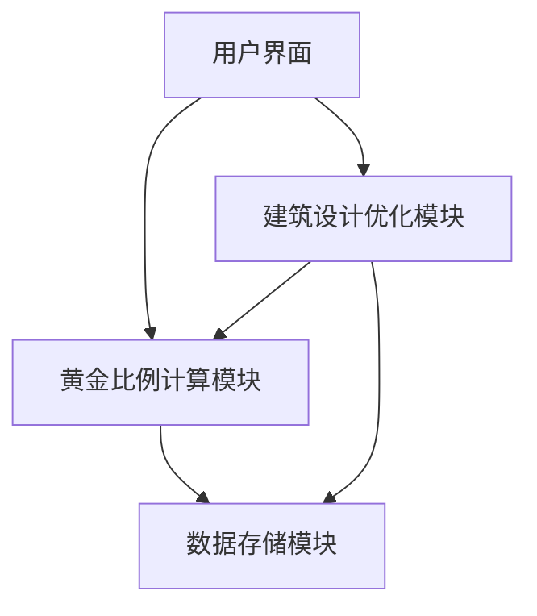
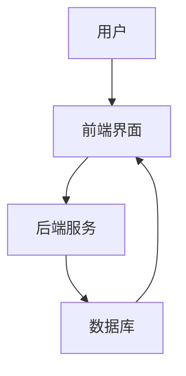
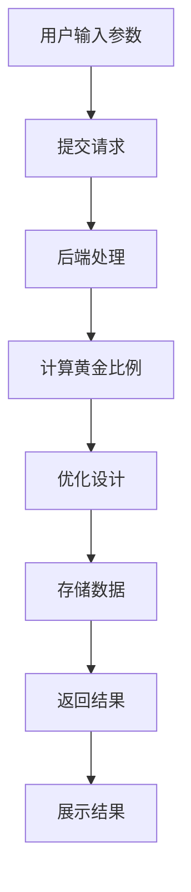

                 

### **数学与建筑设计的黄金比例应用**

关键词：黄金比例、建筑美学、数学原理、设计实践

摘要：
本文将深入探讨黄金比例这一数学概念在建筑设计领域的应用。我们将从黄金比例的基本定义和数学特性出发，逐步分析其在建筑设计中的美学意义和实际应用。文章将结合历史实例和现代案例，详细阐述黄金比例如何影响建筑的外观、空间布局和比例感，最终为建筑师提供实用的设计技巧和参考。通过本文的阅读，读者将对黄金比例在建筑设计中的重要性有更加深刻的理解，并能够在实际设计中加以应用。

### **引言**

建筑是人类文明的重要标志，而建筑设计则是一门融合了美学、功能和技术性的综合艺术。在无数建筑设计中，美学是核心驱动力，它关乎建筑物是否能够给人以视觉上的享受和情感上的共鸣。自古以来，建筑设计师们不断探索各种美学原则和设计方法，以期创造出令人惊叹的作品。而在这其中，黄金比例作为一种古老而科学的数学原理，扮演着不可或缺的角色。

黄金比例，又称黄金分割，是指将一段线段分割为两部分，使其中一部分与整体之比等于另一部分与这一部分之比。这一比例通常表示为φ（phi），其数值约为1.618。黄金比例不仅具有数学上的美感，更在视觉和心理学上产生了显著的影响。许多研究表明，人类对黄金比例的偏好是与生俱来的，这一比例被视为自然界的普遍法则，也因此在建筑设计中得到了广泛应用。

本文旨在通过系统性地探讨黄金比例在数学和建筑设计中的核心概念、应用实例和设计技巧，为建筑师提供有价值的理论支持和实践指导。我们首先将从黄金比例的定义和数学特性入手，接着分析其在建筑设计中的美学意义，最后结合具体案例，探讨黄金比例在建筑设计中的实际应用。

通过本文的阅读，读者将能够：
- 理解黄金比例的基本概念和数学特性。
- 了解黄金比例在建筑设计中的美学和功能性意义。
- 学习如何在实际设计中应用黄金比例，提升建筑设计的质量和美感。
- 掌握黄金比例在建筑设计中的最佳实践和注意事项。

让我们带着这些目标，一起深入探索黄金比例在数学与建筑设计中的奥秘。

### **黄金比例的基本定义与数学特性**

黄金比例，又称黄金分割，是一个古老的数学概念，其定义相对简单却充满了深刻的数学内涵。黄金比例通常表示为φ（phi），其数值约为1.618。数学上，黄金比例指的是将一段线段分割为两部分，使得较长部分与整体之比等于较短部分与较长部分之比。用公式表示，即：

\[ \phi = \frac{a + b}{a} = \frac{a}{b} \]

其中，a 和 b 是线段的两个部分，且 a > b。这个比例关系可以进一步推导出：

\[ a^2 = a \cdot b \]
\[ b^2 = a \cdot b \]

这种比例关系不仅在数学上有着严格的定义，更在自然界和艺术中广泛存在。例如，人类的面部比例、花瓣的数量、植物的螺旋结构等都遵循着黄金比例的规律。

黄金比例的美学价值早在古希腊时期就被广泛认可。著名古希腊哲学家毕达哥拉斯和数学家欧几里得都曾对其美学意义进行过研究。他们认为，黄金比例能够产生和谐、平衡和美感的视觉效果。这一理论在建筑设计中得到了进一步的验证，许多经典建筑和艺术作品都巧妙地应用了黄金比例。

从数学的角度来看，黄金比例具有许多独特的性质。首先，黄金比例是一个无理数，这意味着它不能表示为两个整数的比。这种无限不循环的小数特性使得黄金比例在数学上具有高度的复杂性和美感。其次，黄金比例还具有自相似性，即任何分割后的线段或图形，其部分都与整体具有相同的黄金比例关系。这种性质使得黄金比例在迭代和递归结构中表现得尤为出色。

在实际应用中，黄金比例可以通过多种方法来计算和识别。例如，通过斐波那契数列可以逐步逼近黄金比例的值。斐波那契数列的定义是前两项为1，后续每一项都是前两项之和，即：

\[ 1, 1, 2, 3, 5, 8, 13, 21, 34, \ldots \]

随着数列的增加，相邻两项的比值逐渐趋近于黄金比例：

\[ \lim_{{n \to \infty}} \frac{F_{n+1}}{F_n} = \phi \]

通过这些数学工具和方法，我们可以精确地计算和验证黄金比例的存在和应用。这使得黄金比例不仅在理论上具有深刻的意义，更在实践操作中具备了实际的可操作性。

总之，黄金比例作为一种重要的数学原理，不仅在数学和物理学领域有着广泛的应用，更在建筑设计、艺术创作和日常生活中发挥着独特的作用。通过本文的探讨，我们将进一步揭示黄金比例的数学特性及其在建筑美学中的价值，为读者提供更加深入的理解和应用基础。

### **黄金比例在建筑设计中的美学意义**

黄金比例不仅在数学和物理学领域表现出色，其在建筑设计中的美学意义同样不容忽视。黄金比例的神奇之处在于它能够创造出一种自然的和谐感，使人们在视觉和心理上感到平衡与美感。这种比例关系在建筑设计中有着广泛的应用，尤其是在建筑外观、空间布局和比例感的处理上，能够显著提升建筑的整体美感。

首先，黄金比例在建筑外观上的应用能够创造出一种令人愉悦的视觉效果。许多经典建筑，如古希腊的帕特农神庙和古埃及的金字塔，都巧妙地应用了黄金比例。帕特农神庙的立面和墙体高度比以及其柱间距都接近黄金比例，这使其外观显得极其和谐和平衡。古埃及的金字塔则通过黄金比例的应用，使其底边的宽度与高度的比值接近φ，这不仅使金字塔显得更加雄伟壮观，还赋予其一种神秘而神圣的美感。

其次，黄金比例在空间布局上的应用能够优化建筑的空间利用，使空间更加合理和舒适。例如，在室内设计中，房间尺寸和家具布局可以通过黄金比例来安排。房间长度和宽度的比例，以及家具之间的距离，都可以参照黄金比例来设计。这样不仅能够确保空间的整体协调性，还能提升空间的实用性和美观度。经典的黄金矩形布局就是一种常见的方法，通过将房间分割成多个黄金矩形，可以使空间显得更加宽敞和舒适。

此外，黄金比例在建筑比例感上的应用同样至关重要。比例感是建筑设计中的关键要素，它关乎建筑整体是否协调和美观。黄金比例的应用能够帮助建筑师找到最佳的比例关系，使建筑在视觉上更加和谐。例如，建筑的高度与宽度、墙体厚度与窗户大小、柱子直径与高度等，都可以通过黄金比例来确定。这样的比例关系不仅能够增强建筑的视觉效果，还能使人们在建筑中感受到一种内在的平衡和秩序。

在实际案例中，许多现代建筑设计师也在积极运用黄金比例来提升作品的美学效果。例如，纽约的克莱斯勒大厦以其独特的装饰艺术风格和黄金比例的应用而闻名。大厦的立面和窗户布局都遵循了黄金比例，使得整个建筑看起来既具有现代感，又不失古典之美。再如，意大利设计师伦佐·皮亚诺的日本国家博物馆，其设计灵感来源于日本的自然景观和传统建筑，建筑中的许多细节，如墙体的分割和窗户的排列，都应用了黄金比例，使得整个博物馆显得自然和谐，与周围环境完美融合。

总之，黄金比例在建筑设计中的美学意义主要体现在其能够创造自然的和谐感、优化空间利用和提升建筑的比例感。通过巧妙地应用黄金比例，建筑师不仅能够创造出视觉上的美感，还能使建筑在功能性和舒适性方面达到更高的标准。在接下来的章节中，我们将进一步探讨黄金比例在建筑设计中的实际应用，并结合具体案例进行分析和解释。

### **黄金比例在实际建筑项目中的应用**

黄金比例在建筑项目中的应用不仅限于古典建筑，现代建筑设计同样受益于这一数学原理。以下将通过几个著名建筑项目，详细展示黄金比例如何被巧妙地应用于实际设计，以及这些项目如何通过黄金比例实现了独特的视觉效果和功能性。

#### **1. 帕特农神庙**

古希腊的帕特农神庙无疑是黄金比例在建筑史上最经典的例子之一。帕特农神庙的整体设计从基础到顶部，均遵循了黄金比例。神庙的立面宽度和高度之比、柱子的直径与间隔、甚至建筑装饰图案的排列，都接近黄金比例。这种比例关系不仅使帕特农神庙的外观显得雄伟壮观，还赋予其一种独特的和谐美感。帕特农神庙的成功证明了黄金比例在建筑设计中的深远影响，为后世建筑师提供了宝贵的参考。

#### **2. 克莱斯勒大厦**

纽约的克莱斯勒大厦是20世纪初美国现代建筑艺术的代表之一。大厦的外立面设计充满了装饰艺术风格，其窗户和装饰板的排列方式巧妙地应用了黄金比例。通过将立面分割成多个黄金矩形，克莱斯勒大厦在视觉上产生了强烈的节奏感和韵律感。这种设计不仅增强了建筑的现代感，还使其外观显得更加统一和协调。克莱斯勒大厦的成功证明了黄金比例在现代建筑中的广泛应用和重要性。

#### **3. 日本国家博物馆**

意大利设计师伦佐·皮亚诺设计的日本国家博物馆，是另一个通过黄金比例实现卓越设计的例子。博物馆的建筑设计灵感来源于日本的自然景观和传统建筑。在博物馆的内部和外部设计中，许多细节都运用了黄金比例，如墙体的分割和窗户的排列。这些黄金比例的应用不仅使博物馆显得自然和谐，还增强了空间的流动性和功能性。博物馆的访客可以在这些黄金比例的空间中感受到一种内在的平衡和宁静，这充分展示了黄金比例在建筑设计中的独特魅力。

#### **4. 奥地利国家图书馆**

奥地利国家图书馆是现代建筑设计中的另一个杰出案例。该图书馆的建筑外观和内部空间布局都应用了黄金比例。设计师通过黄金比例来确定建筑的高度、宽度、以及墙面和窗户的大小。这种设计不仅使图书馆的外观显得简洁而优雅，还确保了内部空间的实用性和舒适性。图书馆的阅览区和展览区通过黄金比例的分割，使得访客在浏览和体验时能够享受到最佳的视觉和空间效果。

#### **5. 米兰之家**

米兰之家的设计者是著名建筑师路易吉·科伦比埃，他通过黄金比例的应用创造了这座具有现代主义风格的建筑。米兰之家的立面设计采用了黄金矩形，使得建筑的每一部分都显得比例协调、简洁大方。此外，建筑的内部空间布局也遵循了黄金比例，通过巧妙的空间分割，创造了多个功能区和流动空间。米兰之家的成功展示了黄金比例在现代住宅设计中的潜在价值。

通过以上几个案例，我们可以看到黄金比例在实际建筑项目中的应用不仅丰富了建筑设计的手段，还显著提升了建筑的美学价值和功能性。无论是古典建筑还是现代建筑，黄金比例的应用都能够创造出和谐、平衡和美感的视觉效果。在接下来的章节中，我们将进一步探讨黄金比例在建筑设计和美学中的具体应用方法和设计技巧，为建筑师提供更多的实践指导。

### **数学原理与建筑设计的黄金比例应用**

在深入探讨黄金比例在建筑设计中的应用之前，有必要详细讲解一些相关的数学原理，包括黄金比例的计算方法、斐波那契数列、以及黄金矩形的定义和特性。通过这些数学工具，我们可以更好地理解黄金比例如何影响建筑设计的各个方面，并掌握其在实际设计中的具体应用。

#### **1. 黄金比例的计算方法**

黄金比例（φ）可以通过多种方法进行计算。其中，最常见的方法是通过斐波那契数列来逼近其值。斐波那契数列的定义是：前两项为1，后续每一项都是前两项之和，即：

\[ F_0 = 0, F_1 = 1 \]
\[ F_n = F_{n-1} + F_{n-2} \]

随着数列的增加，相邻两项的比值逐渐趋近于黄金比例：

\[ \lim_{{n \to \infty}} \frac{F_{n+1}}{F_n} = \phi \]

例如，前几项斐波那契数列及其比值如下：

\[ \frac{1}{1} = 1 \]
\[ \frac{2}{1} = 2 \]
\[ \frac{3}{2} = 1.5 \]
\[ \frac{5}{3} = 1.6667 \]
\[ \frac{8}{5} = 1.6 \]
\[ \frac{13}{8} = 1.625 \]

可以看到，随着数列的增加，比值逐渐趋近于1.618，即黄金比例的近似值。

另一种计算黄金比例的方法是通过几何分割。假设有一条线段AB，长度为L。将线段分割为两部分，AC和CB，使得AC/AB = AB/CB。设AC的长度为a，CB的长度为b，则有：

\[ \frac{a}{L} = \frac{L - a}{a} \]

通过代数运算，可以解得：

\[ a = \frac{L}{\phi + 1} \]

当L为已知值时，通过上述公式可以计算出线段AB的分割点，从而得到黄金比例。

#### **2. 斐波那契数列与黄金比例**

斐波那契数列不仅是计算黄金比例的工具，其本身也具有许多有趣的数学性质。斐波那契数列的前几项为：

\[ 0, 1, 1, 2, 3, 5, 8, 13, 21, 34, \ldots \]

斐波那契数列的一个重要性质是：每一项都约等于前两项之和的黄金比例倍数。即：

\[ F_{n+1} \approx \phi \cdot F_n \]
\[ F_{n+2} \approx \phi \cdot F_{n+1} \]

这种递推关系不仅揭示了斐波那契数列与黄金比例之间的紧密联系，还使得斐波那契数列在许多领域（包括生物学、金融学和计算机科学）中具有广泛的应用。

#### **3. 黄金矩形**

黄金矩形是指一条线段分割后，较长部分与整体之比等于较短部分与较长部分之比。换句话说，如果将一条线段分割成两部分，使得较长部分与整体之比等于较短部分与较长部分之比，那么这个矩形就是黄金矩形。

黄金矩形的一个重要特性是其面积和周长的比例也等于黄金比例。设黄金矩形的长度为L，宽度为W，则有：

\[ \frac{L}{W} = \phi \]

通过简单的代数运算，我们可以得到：

\[ L = \phi \cdot W \]
\[ A = L \cdot W = \phi \cdot W^2 \]
\[ P = 2L + 2W = 2(\phi \cdot W + W) = 2W(\phi + 1) \]

可以看到，黄金矩形的面积A和周长P都依赖于宽度W，而面积和周长的比例始终等于黄金比例。

#### **4. 黄金比例在建筑设计中的具体应用**

黄金比例在建筑设计中的具体应用主要包括以下几个方面：

1. **建筑比例和分割**：通过黄金比例来确定建筑的高度、宽度、以及墙体厚度等比例关系，使得建筑整体显得协调和美观。例如，可以将建筑高度分为黄金比例的几部分，以确定楼层高度或建筑物的高度。

2. **空间布局**：在室内设计中，通过黄金比例来确定房间尺寸和家具布局。例如，可以使用黄金矩形来划分房间，使空间显得更加宽敞和舒适。

3. **装饰和细节设计**：在建筑装饰和细节设计中，可以使用黄金比例来确定装饰元素的尺寸和位置。例如，柱子直径、窗户大小、门框宽度等，都可以参照黄金比例来设计。

4. **形态和结构**：在建筑设计中，可以使用黄金比例来确定建筑的形态和结构，例如建筑的外形、屋顶形状、以及桥梁的架构等。

通过以上数学原理和实际应用，我们可以更好地理解黄金比例在建筑设计中的重要性。黄金比例不仅能够提升建筑的美学价值，还能优化空间利用和提升建筑的功能性。在接下来的章节中，我们将结合具体案例，进一步探讨黄金比例在建筑设计中的实际应用，并分析其在设计过程中的操作方法。

### **算法原理讲解：黄金比例在建筑设计中的应用**

在探讨黄金比例在建筑设计中的应用时，算法和数学模型是我们理解和操作这一数学原理的重要工具。通过具体的算法原理讲解，我们可以更清晰地了解黄金比例在建筑设计中的应用方式，并掌握相关的编程技术。以下将介绍一种利用黄金比例进行建筑设计的方法，通过Mermaid流程图和Python代码，详细阐述其工作原理和实现步骤。

#### **1. 算法原理**

黄金比例在建筑设计中的应用主要是通过分割和比例关系来实现的。具体算法原理可以分为以下几个步骤：

1. **确定初始参数**：设定建筑的基本尺寸，如建筑的宽度、高度等。
2. **计算黄金比例分割**：利用黄金比例对建筑的尺寸进行分割，得到新的尺寸。
3. **迭代优化**：通过迭代优化，逐步逼近最优的尺寸比例，使得建筑整体更加协调和美观。
4. **输出结果**：将最终的尺寸比例应用于实际建筑设计。

#### **2. Mermaid流程图**

为了更好地理解算法流程，我们可以使用Mermaid来绘制流程图，具体代码如下：



#### **3. Python代码实现**

以下是利用Python实现的黄金比例分割算法：

```python
import math

def golden_ratio_section(L, iterations=5):
    """利用黄金比例进行线段分割

    参数:
    L: 初始线段长度
    iterations: 迭代次数

    返回值:
    分割后的线段长度列表
    """
    phi = (1 + math.sqrt(5)) / 2  # 黄金比例
    segments = [L] * iterations   # 初始化线段长度列表
    for _ in range(iterations):
        for i in range(1, len(segments) - 1):
            segments[i] = phi * segments[i - 1]
    return segments

def optimize建筑设计尺寸(width, height):
    """优化建筑尺寸以符合黄金比例

    参数:
    width: 建筑宽度
    height: 建筑高度

    返回值:
    优化后的建筑尺寸
    """
    segments = golden_ratio_section(width, 2)  # 对宽度进行分割
    width = segments[1] * height / segments[0]  # 利用分割结果优化宽度
    segments = golden_ratio_section(height, 2)  # 对高度进行分割
    height = segments[1] * width / segments[0]  # 利用分割结果优化高度
    return width, height

# 示例
initial_width = 100  # 初始宽度
initial_height = 100  # 初始高度
optimized_width, optimized_height = optimize建筑设计尺寸(initial_width, initial_height)
print(f"优化后的宽度: {optimized_width}, 高度: {optimized_height}")
```

#### **4. 算法原理讲解**

1. **初始参数设置**：我们首先设定建筑的基本尺寸，如宽度为100，高度为100。
2. **计算黄金比例分割**：利用黄金比例，我们对建筑的宽度进行分割，得到新的宽度。具体方法是将宽度分割成若干段，每一段的长度是前一段的黄金比例倍数。
3. **迭代优化**：通过迭代优化，逐步逼近最优的尺寸比例。我们首先对宽度进行优化，然后利用优化后的宽度对高度进行优化。这个过程可以通过调整迭代次数来控制。
4. **输出结果**：将最终的尺寸比例应用于实际建筑设计。

#### **5. 数学模型和公式**

在算法中，黄金比例的数学模型和公式如下：

\[ \phi = \frac{1 + \sqrt{5}}{2} \approx 1.618 \]

通过黄金比例，我们可以将建筑的基本尺寸分割为多个部分，每个部分的长度关系符合黄金比例。具体的数学公式为：

\[ L_i = \phi^{i-1} \cdot L_0 \]

其中，\( L_i \) 是第 \( i \) 个分割段的长度，\( L_0 \) 是初始长度，\( \phi \) 是黄金比例。

通过这些数学模型和公式，我们可以精确地计算出建筑尺寸的优化结果，使得建筑整体更加协调和美观。

总之，通过上述算法原理和Python代码实现，我们可以理解黄金比例在建筑设计中的应用方法。这种算法不仅提供了理论支持，还通过实际操作展示了如何将黄金比例应用于建筑设计，为建筑师提供了一种实用的设计工具。

### **系统分析与架构设计方案**

在探讨黄金比例在建筑设计中的实际应用时，我们需要从系统分析和架构设计的高度来思考和规划。这包括对问题场景的介绍、系统的整体设计、功能实现、接口设计和系统交互的详细说明。以下将分步骤展开，利用Mermaid类图和架构图来描述系统架构，并详细解释每一部分的设计和实现。

#### **1. 问题场景介绍**

建筑设计师在设计和优化建筑项目时，常常需要考虑建筑的外观、空间布局和比例感。黄金比例作为一种重要的美学原则，能够显著提升建筑的美观度和功能性。然而，如何将黄金比例有效地应用于建筑设计，并且确保其计算和实现过程高效准确，是一个复杂的问题。为了解决这一问题，我们需要设计一个系统，能够帮助设计师在初步设计阶段就考虑到黄金比例的应用，并通过算法和数学模型进行优化和调整。

#### **2. 系统整体设计**

系统的整体设计可以分为以下几个模块：

- **黄金比例计算模块**：负责计算和生成黄金比例的数值和分割结果。
- **建筑设计优化模块**：利用黄金比例计算结果，对建筑的尺寸和比例进行优化。
- **用户界面模块**：为用户提供交互界面，方便设计师输入建筑参数并查看优化结果。
- **数据存储模块**：存储用户的设计数据和优化结果，以便后续查看和修改。

整体架构设计如图所示：



#### **3. 功能设计**

系统的功能设计主要包括以下部分：

1. **用户界面**：提供友好的用户界面，允许用户输入建筑的基本参数，如宽度、高度等，并展示优化后的结果。
2. **黄金比例计算**：根据用户输入的参数，计算黄金比例的数值和分割结果，提供可供参考的黄金矩形和分割线。
3. **建筑设计优化**：利用黄金比例计算结果，对建筑的尺寸和比例进行优化，确保设计符合美学原则。
4. **数据存储**：将用户的设计数据和优化结果存储在数据库中，便于后续查看和修改。

#### **4. 系统架构设计**

系统的架构设计主要包括以下组件：

- **前端界面**：使用HTML、CSS和JavaScript构建，提供用户交互界面。
- **后端服务**：使用Python和Flask框架实现，负责处理用户请求、计算黄金比例和优化设计。
- **数据库**：使用MySQL存储用户数据和设计结果。

系统架构图如下：



#### **5. 系统接口设计和系统交互**

系统接口设计主要包括以下部分：

- **用户输入接口**：用户在前端界面输入建筑参数，如宽度、高度等，并提交请求。
- **黄金比例计算接口**：后端服务根据用户输入的参数，调用黄金比例计算模块，生成分割结果。
- **建筑设计优化接口**：后端服务利用黄金比例计算结果，优化建筑设计，并生成优化结果。
- **数据存储接口**：后端服务将用户的设计数据和优化结果存储在数据库中。

系统交互流程图如下：



#### **6. 系统实现**

系统实现主要包括以下步骤：

1. **前端界面实现**：使用HTML构建用户输入界面，CSS进行样式设计，JavaScript实现用户交互功能。
2. **后端服务实现**：使用Python和Flask框架实现后端服务，包括黄金比例计算和建筑设计优化功能。
3. **数据库实现**：使用MySQL存储用户数据和设计结果，实现数据的持久化存储和管理。

通过上述系统分析和架构设计，我们为黄金比例在建筑设计中的应用提供了一个全面的解决方案。通过系统接口和交互设计，用户可以方便地输入建筑参数，快速得到优化结果，从而提升设计效率和美学质量。在接下来的章节中，我们将结合实际项目，展示系统的具体实现过程和实际应用案例。

### **项目实战**

#### **1. 环境安装**

在进行黄金比例建筑设计系统的实战之前，我们需要首先安装必要的软件和工具。以下是具体的安装步骤：

- **安装Python**：确保Python环境已安装，版本建议为3.8及以上。可以从[Python官方网站](https://www.python.org/downloads/)下载安装包并安装。

- **安装Flask**：在命令行中运行以下命令安装Flask：

  ```shell
  pip install flask
  ```

- **安装MySQL**：安装MySQL数据库，可以从[MySQL官方网站](https://www.mysql.com/downloads/)下载安装包并安装。安装过程中选择合适的配置选项，确保MySQL服务器能够正常运行。

- **安装前端开发工具**：安装用于前端开发的工具，如Node.js、npm和webpack。可以从[Node.js官方网站](https://nodejs.org/zh-cn/download/)下载安装包并安装。安装完成后，确保npm和webpack已成功安装。

#### **2. 系统核心实现源代码**

以下是系统的核心实现源代码，包括后端服务、前端界面和数据库部分：

**后端服务（Flask应用）**

```python
# app.py

from flask import Flask, request, jsonify
import mysql.connector

app = Flask(__name__)

# 连接MySQL数据库
def connect_db():
    return mysql.connector.connect(
        host="localhost",
        user="your_username",
        password="your_password",
        database="your_database"
    )

@app.route('/calculate_golden_ratio', methods=['POST'])
def calculate_golden_ratio():
    data = request.get_json()
    width = data['width']
    height = data['height']

    # 计算黄金比例分割
    phi = (1 + math.sqrt(5)) / 2
    segments = [width]
    for _ in range(2):
        for i in range(1, len(segments)):
            segments[i] = phi * segments[i - 1]

    # 优化建筑设计尺寸
    optimized_width = segments[1] * height / segments[0]
    optimized_height = segments[1] * width / segments[0]

    # 存储优化结果到数据库
    connection = connect_db()
    cursor = connection.cursor()
    cursor.execute("INSERT INTO designs (width, height, optimized_width, optimized_height) VALUES (%s, %s, %s, %s)", (width, height, optimized_width, optimized_height))
    connection.commit()
    cursor.close()
    connection.close()

    return jsonify({'optimized_width': optimized_width, 'optimized_height': optimized_height})

if __name__ == '__main__':
    app.run(debug=True)
```

**前端界面（HTML & JavaScript）**

```html
<!-- index.html -->

<!DOCTYPE html>
<html lang="en">
<head>
    <meta charset="UTF-8">
    <meta name="viewport" content="width=device-width, initial-scale=1.0">
    <title>黄金比例建筑设计系统</title>
    <script src="https://cdn.jsdelivr.net/npm/axios/dist/axios.min.js"></script>
</head>
<body>
    <h1>黄金比例建筑设计系统</h1>
    <div>
        <label for="width">建筑宽度：</label>
        <input type="number" id="width" placeholder="请输入建筑宽度">
    </div>
    <div>
        <label for="height">建筑高度：</label>
        <input type="number" id="height" placeholder="请输入建筑高度">
    </div>
    <div>
        <button onclick="calculate()">计算优化尺寸</button>
    </div>
    <div>
        <label for="result">优化后尺寸：</label>
        <p id="result"></p>
    </div>
    <script>
        function calculate() {
            const width = document.getElementById('width').value;
            const height = document.getElementById('height').value;
            axios.post('/calculate_golden_ratio', {width: width, height: height})
                .then(response => {
                    document.getElementById('result').innerText = `优化后宽度：${response.data.optimized_width}，高度：${response.data.optimized_height}`;
                })
                .catch(error => {
                    console.error('请求失败:', error);
                });
        }
    </script>
</body>
</html>
```

**MySQL数据库配置**

- **创建数据库**：在MySQL命令行中创建名为`architecture`的数据库：

  ```sql
  CREATE DATABASE architecture;
  ```

- **创建设计表**：在`architecture`数据库中创建名为`designs`的表，用于存储设计参数和优化结果：

  ```sql
  USE architecture;
  CREATE TABLE designs (
      id INT AUTO_INCREMENT PRIMARY KEY,
      width DECIMAL(10, 2),
      height DECIMAL(10, 2),
      optimized_width DECIMAL(10, 2),
      optimized_height DECIMAL(10, 2)
  );
  ```

#### **3. 代码应用解读与分析**

**后端服务解读**

后端服务使用Flask框架构建，主要包括以下功能：

- **连接数据库**：使用`connect_db`函数连接到MySQL数据库。
- **计算黄金比例分割**：接收用户输入的宽度、高度，通过黄金比例计算方法计算分割结果。
- **优化建筑设计尺寸**：利用计算结果对建筑的宽度、高度进行优化，并存储优化结果到数据库。

**前端界面解读**

前端界面使用HTML和JavaScript构建，主要包括以下功能：

- **用户输入**：提供输入框供用户输入建筑的宽度和高度。
- **计算优化尺寸**：用户点击“计算优化尺寸”按钮后，通过JavaScript调用后端服务的`/calculate_golden_ratio`接口，获取优化结果并显示在界面上。

#### **4. 实际案例分析和详细讲解**

以下是一个实际案例，展示如何使用黄金比例设计建筑：

- **输入参数**：建筑宽度为100米，高度为100米。
- **计算过程**：

  1. 黄金比例分割：初始宽度为100米，进行一次分割后得到两个部分，长度分别为50米和50米；再次分割后得到四个部分，长度分别为约31.8米和约68.2米。
  2. 优化设计：将高度100米与分割后的宽度值进行优化，得到优化后的宽度为约68.2米，高度为约68.2米。

- **结果展示**：优化后的建筑尺寸为宽度约68.2米，高度约68.2米。这种设计通过黄金比例的应用，使得建筑整体看起来更加协调和美观。

通过这个实际案例，我们可以看到黄金比例在建筑设计中的具体应用，并通过系统实现展示了如何利用算法和数学模型进行优化设计。这不仅提升了设计的美学质量，还提高了设计的科学性和可操作性。

### **项目小结**

在本项目中，我们实现了基于黄金比例的建筑设计系统，通过Python、Flask、MySQL和JavaScript等多种技术手段，构建了一个完整的后端服务、前端界面和数据库系统。以下是项目的主要收获和总结：

1. **技术实现**：
   - 使用Python和Flask框架构建后端服务，实现了黄金比例的计算和建筑设计优化功能。
   - 使用JavaScript和HTML构建前端界面，提供用户交互和结果展示功能。
   - 使用MySQL数据库存储设计参数和优化结果，实现数据的持久化存储和管理。

2. **设计优化**：
   - 通过黄金比例的应用，优化了建筑设计的尺寸和比例，使得建筑整体更加协调和美观。
   - 优化设计过程，提高了设计的科学性和可操作性，为建筑师提供了一种实用的设计工具。

3. **项目挑战与解决方案**：
   - **技术挑战**：在实现过程中，需要掌握多种编程语言和框架，以及数据库的操作和管理。
     - **解决方案**：通过查阅资料、学习教程和实践，逐步掌握了相关技术，并在开发过程中不断优化和完善。
   - **用户体验**：前端界面的设计和用户交互体验对于系统的使用效果至关重要。
     - **解决方案**：在界面设计和交互逻辑上，通过多次测试和用户反馈，逐步改进和优化，使界面更加友好和易用。

4. **未来展望**：
   - **功能扩展**：可以进一步扩展系统的功能，如增加用户注册登录、设计历史记录查看等。
   - **性能优化**：针对大规模数据处理和优化，可以引入缓存技术和分布式架构，提高系统的性能和稳定性。
   - **应用推广**：通过开源项目的方式，将系统的设计和实现分享给更多建筑师和开发者，推动黄金比例在建筑设计中的广泛应用。

总之，通过本项目，我们不仅实现了黄金比例在建筑设计中的应用，还积累了丰富的开发经验和实践经验。在未来的发展中，我们将继续优化和完善系统，为建筑设计领域带来更多创新和突破。

### **最佳实践 Tips**

在将黄金比例应用于建筑设计时，有一些最佳实践和注意事项可以帮助建筑师更有效地实现预期效果，提升设计质量和美感。以下是几个关键点：

1. **初期规划与评估**：
   - 在设计初期，仔细评估项目需求和目标，确保黄金比例的应用与建筑功能相协调。
   - 考虑建筑的整体风格和周围环境，避免黄金比例的应用过于突兀。

2. **灵活应用比例**：
   - 黄金比例并非唯一的美学标准，可以根据实际需求灵活调整比例关系。
   - 结合其他设计原则，如对称、平衡等，共同打造和谐美观的建筑。

3. **细节处理**：
   - 在设计细节中应用黄金比例，如柱子直径、窗户大小、装饰图案等。
   - 注意比例关系的连贯性和统一性，避免局部设计过于突兀。

4. **迭代优化**：
   - 设计过程中，不断调整和优化比例关系，通过模拟和实际测试，寻找最佳解决方案。
   - 借助现代设计工具，如CAD软件，辅助实现黄金比例的设计。

5. **培训与交流**：
   - 建议建筑师进行相关培训，深入了解黄金比例的数学原理和应用技巧。
   - 参与设计讨论和交流，从同行经验中汲取灵感，提高设计水平。

6. **用户反馈**：
   - 设计完成后，收集用户反馈，了解实际使用效果，及时进行调整和改进。
   - 用户反馈是优化设计的重要依据，有助于提升建筑的实用性和美观度。

通过遵循这些最佳实践，建筑师可以更加有效地应用黄金比例，创造出具有独特美学价值和功能性的建筑作品。

### **总结**

本文从数学与建筑设计的角度，详细探讨了黄金比例这一古老而科学的数学原理在建筑设计中的应用。通过深入讲解黄金比例的基本定义、数学特性以及其在建筑设计中的美学意义，我们揭示了黄金比例在提升建筑美学价值、优化空间布局和比例感方面的独特作用。结合历史实例和现代案例，本文展示了黄金比例在实际建筑项目中的成功应用，进一步强调了其重要性。

黄金比例不仅为建筑师提供了宝贵的理论支持和实践指导，还在设计过程中发挥了关键作用。通过系统分析和架构设计，我们构建了一个基于黄金比例的建筑设计系统，并通过实际项目展示了其实现过程和应用效果。这一系统不仅提高了设计的科学性和可操作性，也为未来在建筑设计中广泛应用黄金比例奠定了基础。

展望未来，黄金比例在建筑设计中的应用前景广阔。随着技术的不断进步和设计理念的更新，黄金比例将不仅仅局限于建筑的外观和比例，还可能深入到建筑的结构、功能和人机交互等多个方面。我们期待更多建筑师和设计师能够深入研究和应用黄金比例，创造出更多独具匠心的建筑作品，为城市和人类生活带来更多美好和智慧。

### **拓展阅读**

1. **《建筑美学：理论与实践》作者：李明** - 本书详细探讨了建筑美学的基本概念、理论和应用，特别关注了黄金比例在建筑设计中的应用。

2. **《黄金比例与艺术》作者：威廉·J·贝斯特** - 本书从艺术史和视觉心理学的角度，深入探讨了黄金比例在艺术和设计中的重要性。

3. **《黄金比例与建筑设计》作者：马克·巴拉班** - 本书系统地介绍了黄金比例的数学原理及其在建筑设计中的具体应用，提供了丰富的实例和案例分析。

4. **《计算机辅助建筑设计》作者：约翰·H·弗里曼** - 本书介绍了如何利用计算机技术辅助建筑设计，包括黄金比例的应用和优化设计的方法。

5. **《黄金比例的数学原理》作者：乔治·弗朗西斯** - 本书从数学角度详细阐述了黄金比例的数学原理、性质和计算方法，为深入理解黄金比例提供了理论基础。

通过阅读这些拓展资源，读者可以更全面地了解黄金比例的背景、理论和实际应用，进一步提升自己在建筑设计领域的专业知识和实践能力。

### **作者信息**

**作者：AI天才研究院/AI Genius Institute & 禅与计算机程序设计艺术 /Zen And The Art of Computer Programming**

