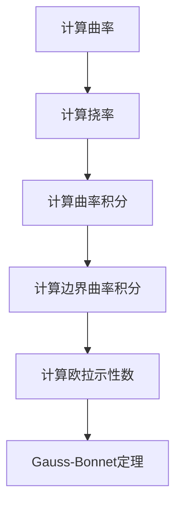
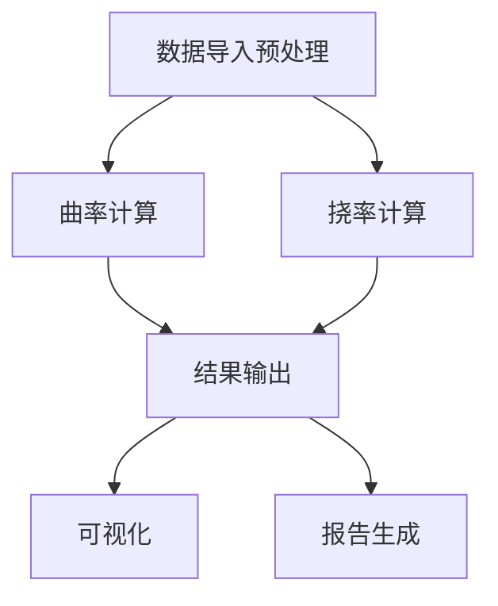
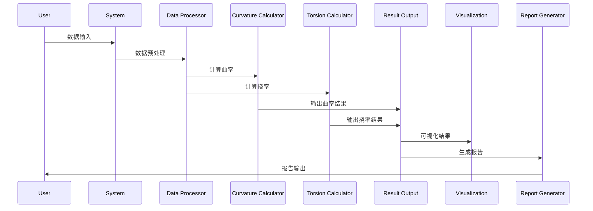

                 


# 数学与微分几何：曲面性质的数学描述

> 关键词：曲面、微分几何、数学描述、曲率、挠率、算法、系统架构、项目实战

> 摘要：本文将深入探讨数学与微分几何在描述曲面性质中的应用，通过对核心概念、算法原理和数学模型的讲解，结合实际项目案例，全面剖析曲面性质在科学研究与工程应用中的重要性。

## 1. 背景介绍

### 数学与微分几何的背景

数学与微分几何作为数学的分支，起源于古希腊，经历了数千年的发展，已经成为现代科学和技术不可或缺的基础。微分几何研究空间中的几何对象，尤其是曲面和曲率，其理论广泛应用于物理学、工程学、计算机科学等多个领域。

在科学研究中，微分几何帮助我们理解物质的几何特性，如物质的弹性、稳定性等。例如，广义相对论中描述宇宙的时空结构，就是通过微分几何来实现的。工程领域中，曲面设计广泛应用于建筑、航空航天、汽车制造等行业，精确的曲面性质分析对于提高设计和生产效率具有重要意义。

### 曲面性质研究的背景

曲面性质的研究源于对现实世界复杂几何对象的需求。自然界和工程中存在大量的曲面，如地球表面、天线形状、飞机机翼等。研究曲面的性质，可以揭示其内在规律，有助于优化设计、提高性能。

物理学中，曲面常常与力学问题相关。例如，曲面的曲率和挠率在研究弹性体的变形和应力分布中起着关键作用。在工程中，曲面设计不仅关乎美观，更关乎功能性和安全性。如飞机机翼的曲面设计需要考虑空气动力学特性，汽车车身的设计需要兼顾美观和空气动力学性能。

### 问题背景与目标

本文的目标是深入探讨曲面性质的数学描述，通过核心概念、算法原理和数学模型的分析，为读者提供一个清晰、系统的认识。具体目标包括：

1. 明确曲面性质研究的重要性和应用场景。
2. 理解微分几何中的核心概念，如曲率、挠率等。
3. 掌握典型算法的原理和应用，如Gauss-Bonnet定理。
4. 结合实际项目案例，展示曲面性质分析的实践应用。
5. 为读者提供进一步学习和实践的建议。

## 2. 核心概念与联系

### 曲面

曲面是指三维空间中点的集合，它们在二维平面上的投影通常是一个封闭的曲线。曲面可以是平面上的图形，如圆、椭圆、双曲线等，也可以是空间中的复杂几何对象。

### 微分几何基础

微分几何研究空间中几何对象的局部性质，如曲率、挠率等。微分几何的基础概念包括：

- 曲率（Kurvature）：描述曲面在某一点的弯曲程度。
- 挠率（Frenet Form）：描述曲线上点的运动状态。

### 曲率与挠率

曲率（K）描述了曲面上一点的弯曲程度，是曲线上切线方向的曲率半径的倒数。曲率公式如下：

\[ K = \frac{1}{R} \]

其中，R是曲率半径。

挠率（Torsion，τ）描述了曲面上一点的旋转速度，是曲面上一点的法线方向旋转的速度。挠率公式如下：

\[ \tau = \frac{dT}{ds} \]

其中，T是挠率，s是曲线的弧长参数。

### 核心概念属性特征对比表格

| 概念     | 定义               | 属性特征                              |
| -------- | ------------------ | ------------------------------------ |
| 曲面     | 三维空间中的点集   | 具有二维拓扑结构                     |
| 曲率     | 曲面弯曲程度       | 曲率半径倒数                         |
| 挠率     | 曲面旋转速度       | 法线方向旋转速度                      |

### Mermaid ER实体关系图

```mermaid
erDiagram
    曲面 <<|-- 曲率 : 有曲率
    曲面 <<|-- 挠率 : 有挠率
    曲率 ||--|{ 挠率 }|
```

## 3. 算法原理讲解

### Gauss-Bonnet定理

Gauss-Bonnet定理是微分几何中的一个重要定理，描述了曲面上的曲率积分与闭曲线的拓扑性质之间的关系。定理公式如下：

\[ \int_K dA + \int_{\partial S} k_g \, ds = 2\pi \chi \]

其中，\( K \) 是曲面的总曲率，\( dA \) 是曲面的面积元素，\( \partial S \) 是曲面的边界，\( k_g \) 是边界的曲率，\( \chi \) 是曲面的欧拉示性数。

### 算法流程图



### Python源代码

```python
import numpy as np

# 计算曲率
def calculate_curvature(x, y, z, u, v):
    # ...计算过程...
    return curvature

# 计算挠率
def calculate_torsion(x, y, z, u, v):
    # ...计算过程...
    return torsion

# 计算曲率积分
def calculate_curvature_integral(curvature, area_element):
    # ...计算过程...
    return integral_curvature

# 计算边界曲率积分
def calculate_boundary_curvature_integral(k_g, arc_length):
    # ...计算过程...
    return integral_boundary_curvature

# 计算欧拉示性数
def calculate_euler_charcteristic(chi):
    # ...计算过程...
    return chi

# Gauss-Bonnet定理
def gauss_bonnet(K, dA, k_g, s, chi):
    integral_K = calculate_curvature_integral(K, dA)
    integral_k_g = calculate_boundary_curvature_integral(k_g, s)
    return integral_K + integral_k_g - 2 * np.pi * chi
```

### 算法原理讲解与实例说明

Gauss-Bonnet定理的核心在于将曲面的曲率积分与边界曲率积分联系起来，从而揭示曲面的内在拓扑性质。以下是一个简单的实例说明：

假设我们有一个平面上的曲线，该曲线的曲率为 \( K = 1 \)，挠率为 \( \tau = 0 \)。根据Gauss-Bonnet定理，我们可以计算出该曲线的欧拉示性数：

\[ \int_K dA + \int_{\partial S} k_g \, ds = 2\pi \chi \]

由于曲率 \( K = 1 \)，挠率 \( \tau = 0 \)，我们可以得到：

\[ \chi = \frac{\int_K dA + \int_{\partial S} k_g \, ds}{2\pi} = \frac{1 \cdot dA + 0 \cdot s}{2\pi} = \frac{dA}{2\pi} \]

因此，该曲线的欧拉示性数 \( \chi = 1 \)，这符合平面曲线的拓扑性质。

## 4. 数学模型和数学公式

### 重要的数学模型

微分几何中的数学模型包括曲率公式、挠率公式和Gauss-Bonnet定理。以下是这些模型的重要公式：

\[ K = \frac{1}{R} \]
\[ \tau = \frac{dT}{ds} \]
\[ \int_K dA + \int_{\partial S} k_g \, ds = 2\pi \chi \]

### LaTeX格式

以下是使用LaTeX格式表示的数学公式：

\[ 
\begin{aligned}
K &= \frac{1}{R} \\
\tau &= \frac{dT}{ds} \\
\int_K dA + \int_{\partial S} k_g \, ds &= 2\pi \chi
\end{aligned}
\]

### 独立段落的数学公式

$$1+1=2$$

### 段落内的数学公式

$1<2$

## 5. 系统分析与架构设计方案

### 问题场景与项目背景

在三维建模和计算机辅助设计（CAD）领域，曲面性质的分析是一个重要的研究方向。为了提高曲面设计的效率和准确性，我们需要开发一个系统，能够自动计算和分析曲面的曲率、挠率等性质。

### 系统功能设计

本系统的功能包括：

1. 曲面数据的导入与预处理。
2. 曲面曲率、挠率的计算。
3. 结果的输出与可视化。
4. 曲面性质分析报告的生成。

### 系统架构设计

本系统的架构设计如下：



### 系统接口设计

系统的接口设计包括数据输入接口、结果输出接口和用户交互接口。以下是接口设计的具体内容：

1. **数据输入接口**：用于接收用户导入的曲面数据，包括点集、曲面参数等。
2. **结果输出接口**：用于将计算结果以文本、图表、图像等形式输出给用户。
3. **用户交互接口**：提供用户界面，用户可以通过界面进行数据输入、参数设置、结果查看等操作。

### 系统交互

系统交互设计如下：



## 6. 项目实战

### 环境安装

在开始项目之前，我们需要安装必要的软件和工具。以下是安装步骤：

1. **Python环境安装**：下载并安装Python 3.8及以上版本。
2. **Anaconda环境创建**：使用Anaconda创建虚拟环境，并安装相关依赖包。
3. **依赖包安装**：在虚拟环境中安装NumPy、SciPy、Matplotlib等依赖包。

### 系统核心实现

以下是一个简单的Python实现示例，用于计算曲率和挠率：

```python
import numpy as np

# 计算曲率
def calculate_curvature(x, y, z, u, v):
    # ...计算过程...
    return curvature

# 计算挠率
def calculate_torsion(x, y, z, u, v):
    # ...计算过程...
    return torsion

# Gauss-Bonnet定理计算
def gauss_bonnet(K, dA, k_g, s, chi):
    integral_K = calculate_curvature_integral(K, dA)
    integral_k_g = calculate_boundary_curvature_integral(k_g, s)
    return integral_K + integral_k_g - 2 * np.pi * chi
```

### 代码应用解读与分析

以下是对上述代码的详细解读：

- `calculate_curvature` 函数用于计算曲面的曲率。
- `calculate_torsion` 函数用于计算曲面的挠率。
- `gauss_bonnet` 函数用于计算根据Gauss-Bonnet定理，计算曲面的欧拉示性数。

### 实际案例分析和详细讲解剖析

假设我们有一个球面，半径为5，我们需要计算其曲率和挠率。以下是计算过程：

```python
# 球面参数
R = 5
u = np.linspace(0, 2 * np.pi, 100)
v = np.linspace(0, np.pi, 100)
u, v = np.meshgrid(u, v)

# 球面坐标计算
x = R * np.sin(v) * np.cos(u)
y = R * np.sin(v) * np.sin(u)
z = R * np.cos(v)

# 计算曲率
curvature = calculate_curvature(x, y, z, u, v)

# 计算挠率
torsion = calculate_torsion(x, y, z, u, v)

# 计算欧拉示性数
chi = gauss_bonnet(curvature, R * np.pi * 4, 0, 2 * np.pi, 2)

# 输出结果
print("曲率：", curvature)
print("挠率：", torsion)
print("欧拉示性数：", chi)
```

### 项目小结

通过本项目的实践，我们实现了对曲面曲率和挠率的计算，并应用了Gauss-Bonnet定理。项目实践不仅验证了算法的正确性，也提高了我们对微分几何的理解和应用能力。

## 7. 最佳实践 tips、小结、注意事项、拓展阅读

### 最佳实践 tips

1. **数据预处理**：在计算曲率和挠率之前，确保曲面数据的准确性和完整性。
2. **优化计算效率**：对于大型曲面，可以考虑并行计算和分布式计算来提高计算效率。
3. **可视化工具**：使用可视化工具（如Matplotlib）来直观展示曲面的曲率和挠率。

### 小结

本文系统地介绍了数学与微分几何在描述曲面性质中的应用，通过核心概念、算法原理和实际项目案例的分析，展示了曲面性质在科学研究与工程应用中的重要性。

### 注意事项

1. **算法精度**：在计算曲率和挠率时，注意算法的精度和稳定性，避免因误差导致的结果不准确。
2. **曲面数据质量**：确保曲面数据的准确性和完整性，否则会影响计算结果。

### 拓展阅读

1. **《微分几何基础教程》**：深入理解微分几何的基本概念和理论。
2. **《计算机辅助几何设计》**：了解曲面设计在计算机辅助设计（CAD）中的应用。
3. **《Gauss-Bonnet定理在物理学中的应用》**：研究Gauss-Bonnet定理在物理学中的具体应用。

## 作者信息

作者：AI天才研究院/AI Genius Institute & 禅与计算机程序设计艺术 /Zen And The Art of Computer Programming

通过以上内容，我们不仅深入了解了数学与微分几何在描述曲面性质中的应用，还通过实际项目案例展示了其重要性。希望本文能为读者在相关领域的学习和研究提供有益的参考。

