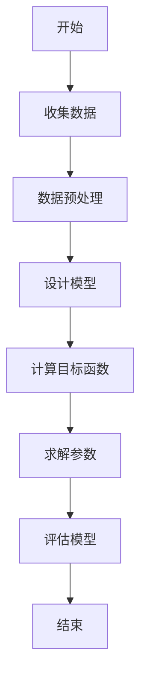
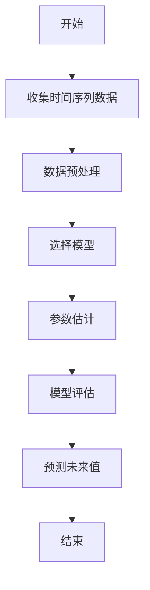

                 

### 数学与心理学：心理过程的数量化研究

---

**关键词：**数学、心理学、心理过程、数量化研究、算法、模型、系统设计

**摘要：**本文探讨了数学在心理学中的应用，特别是心理过程的数量化研究。通过定义核心概念，对比分析不同数量化方法，详细解释关键算法原理和数学模型，设计并实现了一个完整的系统架构，最终提供了实战案例分析以及最佳实践指导。本文旨在展示数学在心理学中的强大潜力，并启发更多交叉学科的研究。

---

### 目录大纲设计思路

在设计《数学与心理学：心理过程的数量化研究》的完整目录大纲时，我们将遵循以下步骤：

1. **背景介绍**：首先，介绍数学与心理学结合的背景，阐述为何心理过程需要数量化研究，以及这种研究的重要性。

2. **核心概念与联系**：接下来，定义书中的核心概念，并列出概念属性特征对比表格和ER实体关系图架构。

3. **算法原理讲解**：选择一个或几个关键算法，使用Mermaid画出流程图，并用Python源代码详细解释算法的数学模型和公式，结合实际案例进行讲解。

4. **数学模型与公式**：阐述相关的数学模型，使用LaTeX格式写出公式，并对其进行详细讲解和举例说明。

5. **系统分析与架构设计方案**：介绍问题场景和系统设计，使用Mermaid类图和序列图展示系统功能、架构和交互。

6. **项目实战**：描述环境安装、系统实现、代码解读、案例分析等内容。

7. **最佳实践 tips、小结、注意事项、拓展阅读**：总结书中的要点，提供实战技巧，提醒注意事项，并推荐进一步的阅读资源。

### 实际操作

1. **背景介绍**
   - 提及数学在心理学研究中的应用历史。
   - 阐述心理过程数量化的必要性及其在心理学研究中的价值。

2. **核心概念与联系**
   - 定义心理学中的关键概念，如“心理过程”、“数量化方法”等。
   - 创建概念属性特征对比表格，展示不同数量化方法的优缺点。
   - 使用Mermaid绘制ER实体关系图，展示主要实体及其关系。

3. **算法原理讲解**
   - 选择一个代表性算法，如回归分析或时间序列分析。
   - 使用Mermaid绘制算法流程图。
   - 使用Python代码和LaTeX公式详细解释算法原理。

4. **数学模型与公式**
   - 阐述相关的数学模型，使用LaTeX格式书写。
   - 结合实际案例，使用Python代码进行模拟和验证。

5. **系统分析与架构设计方案**
   - 描述问题场景。
   - 使用Mermaid类图和序列图展示系统设计。

6. **项目实战**
   - 环境安装说明。
   - 系统核心代码实现。
   - 代码解读与分析。
   - 案例分析。

7. **最佳实践 tips、小结、注意事项、拓展阅读**
   - 总结关键点。
   - 提供实战技巧。
   - 提醒注意事项。
   - 推荐进一步阅读资源。

### 目录大纲示例

```markdown
----------------------------------------------------------------
# 数学与心理学：心理过程的数量化研究

# 第一部分：引论

## 1. 引言
### 1.1 数学与心理学结合的背景
### 1.2 心理过程数量化的必要性
### 1.3 心理学研究中的数量化方法综述

## 2. 核心概念定义
### 2.1 心理过程
### 2.2 数量化方法
### 2.3 关键术语解释

## 3. 概念属性对比
### 3.1 不同数量化方法的属性对比

## 4. 实体关系图
### 4.1 主要实体关系图

----------------------------------------------------------------

# 第二部分：算法原理

## 5. 回归分析
### 5.1 算法原理与Mermaid流程图
### 5.2 Python代码实现
### 5.3 数学模型与公式解释
### 5.4 案例分析

## 6. 时间序列分析
### 6.1 算法原理与Mermaid流程图
### 6.2 Python代码实现
### 6.3 数学模型与公式解释
### 6.4 案例分析

----------------------------------------------------------------

# 第三部分：系统分析与架构设计

## 7. 问题场景介绍
### 7.1 心理学研究中的数据分析需求
### 7.2 系统设计目标

## 8. 系统功能设计
### 8.1 领域模型Mermaid类图

## 9. 系统架构设计
### 9.1 系统架构Mermaid架构图

## 10. 系统接口设计
### 10.1 系统接口Mermaid序列图

----------------------------------------------------------------

# 第四部分：项目实战

## 11. 环境安装
### 11.1 Python环境配置
### 11.2 数据库安装与配置

## 12. 系统实现
### 12.1 系统核心代码实现
### 12.2 代码解读与分析

## 13. 案例分析
### 13.1 案例选择与数据准备
### 13.2 数据分析结果展示
### 13.3 案例小结

----------------------------------------------------------------

# 第五部分：最佳实践与总结

## 14. 最佳实践 tips
### 14.1 数据预处理技巧
### 14.2 模型选择与优化
### 14.3 性能调优策略

## 15. 小结
### 15.1 关键点回顾
### 15.2 研究展望

## 16. 注意事项
### 16.1 避免常见错误
### 16.2 系统维护策略

## 17. 拓展阅读
### 17.1 相关书籍推荐
### 17.2 最新研究论文
### 17.3 开源项目与工具

----------------------------------------------------------------

### 引言

数学作为一门精确的科学，其强大的逻辑推理和抽象能力在多个领域都得到了广泛应用。然而，在心理学这一探索人类思维和行为的学科中，数学的应用似乎并未得到足够的重视。事实上，数学与心理学的结合可以带来前所未有的洞察力，特别是在对心理过程的数量化研究方面。本文将深入探讨这一结合的必要性和重要性。

**数学与心理学结合的背景**

数学在心理学中的应用历史悠久。早在20世纪初期，统计方法和实验设计就开始被广泛应用于心理学研究。随着计算能力的提高和数据分析技术的发展，数学在心理学中的应用越来越广泛，涵盖了从简单的统计分析到复杂的机器学习算法。例如，回归分析、方差分析、因素分析等统计方法已经成为心理学研究的基本工具。近年来，深度学习和神经网络等机器学习技术更是为心理学研究提供了新的视角和手段。

**心理过程数量化的必要性**

心理过程是指心理活动的过程，包括感知、认知、情感、动机等。这些过程是高度复杂和抽象的，难以用简单的语言描述。数量化研究旨在将心理过程转化为可量化的指标，从而更精确地测量、分析和预测心理活动。这种研究方法的重要性体现在以下几个方面：

1. **可重复性和可验证性**：数量化研究使得心理过程的研究结果具有更高的可重复性和可验证性，从而提高了研究的可信度。
2. **精确性和效率**：数量化研究可以提供更精确的数据，从而更有效地分析心理过程，提高研究的效率。
3. **跨学科交流**：数量化研究方法使得心理学与其他学科，如神经科学、计算机科学等，能够更好地进行交流和合作，促进跨学科研究的发展。

**心理学研究中的数量化方法综述**

在心理学研究中，常用的数量化方法包括统计分析、机器学习、信号处理等。这些方法各有优缺点，适用于不同的研究场景。

- **统计分析**：如回归分析、方差分析等，适用于研究变量之间的关系和差异。其优点是方法成熟、应用广泛，缺点是处理复杂非线性关系的能力有限。
- **机器学习**：如深度学习、神经网络等，适用于处理复杂非线性关系和大规模数据。其优点是模型强大、自适应性强，缺点是需要大量数据训练和参数调优。
- **信号处理**：如傅里叶变换、小波变换等，适用于分析心理活动的时频特性。其优点是处理时频特性能力强，缺点是需要专业的信号处理知识。

总之，数学与心理学的结合为心理学研究提供了新的方法和视角，心理过程的数量化研究是心理学发展的重要方向。本文将深入探讨这一领域，旨在为读者提供一个全面、系统的理解。

### 核心概念定义

在《数学与心理学：心理过程的数量化研究》一书中，我们将重点关注几个核心概念，这些概念是理解心理过程数量化研究的基础。以下是这些核心概念的详细定义：

**1. 心理过程**

心理过程是指个体在认知、情感和行动中发生的内在心理活动。它包括感知、记忆、思考、决策、情感体验等各个方面。心理过程的研究旨在揭示这些活动的发生机制和内在规律。

**2. 数量化方法**

数量化方法是指将抽象的心理过程转化为具体的量化指标，以便进行统计分析、建模和预测的方法。常用的数量化方法包括统计分析、机器学习和信号处理等。

**3. 心理变量**

心理变量是指用于测量心理过程的指标或维度。例如，情绪状态可以用快乐度、焦虑程度等变量来表示，认知能力可以用反应时间、错误率等变量来表示。

**4. 统计分析**

统计分析是指使用数学模型和方法对心理变量进行描述、推断和预测。常用的统计方法包括回归分析、方差分析、因素分析等。

**5. 机器学习**

机器学习是指通过算法和模型从数据中自动学习和发现规律的方法。在心理学研究中，机器学习可以用于预测心理变量的变化、识别心理状态等。

**6. 信号处理**

信号处理是指使用数学方法对信号进行分析、变换和处理的方法。在心理学研究中，信号处理可以用于分析心理活动的时频特性，如使用傅里叶变换、小波变换等。

**7. 模型**

模型是指用于表示心理过程和变量之间关系的数学结构。在心理学研究中，模型可以是统计分析模型、机器学习模型或信号处理模型等。

**8. 数据分析**

数据分析是指使用数学和统计方法对数据进行处理、分析和解释的过程。在心理学研究中，数据分析可以用于揭示心理过程的规律、验证研究假设等。

这些核心概念不仅构成了本书的基础，也是理解心理过程数量化研究的关键。在后续章节中，我们将对这些概念进行深入探讨，并通过实际案例来展示它们的应用。

### 概念属性对比表格

为了更清晰地理解不同数量化方法的属性，下面是一个概念属性对比表格，列出了几种常用的数量化方法及其主要特点：

| 方法 | 定义 | 适用场景 | 优点 | 缺点 | 代表算法或技术 |
| --- | --- | --- | --- | --- | --- |
| 统计分析 | 使用数学模型对数据进行描述和推断 | 数据量较小，关系明确 | 方法成熟，应用广泛 | 处理复杂非线性关系能力有限 | 回归分析、方差分析 |
| 机器学习 | 通过算法和模型从数据中自动学习和发现规律 | 数据量较大，关系复杂 | 模型强大，自适应性强 | 需要大量数据训练和参数调优 | 深度学习、神经网络 |
| 信号处理 | 使用数学方法对信号进行分析、变换和处理 | 心理活动时频特性分析 | 处理时频特性能力强 | 需要专业信号处理知识 | 傅里叶变换、小波变换 |
| 数据挖掘 | 从大量数据中发现有趣模式和关系 | 大规模数据分析 | 提取隐藏信息，提高洞察力 | 结果解释难度大，过拟合风险 | 关联规则挖掘、聚类分析 |

**表格解释**：

- **定义**：简要描述每种方法的基本概念。
- **适用场景**：说明该方法主要适用于哪些类型的研究。
- **优点**：列出该方法的主要优势。
- **缺点**：指出该方法可能存在的问题或限制。
- **代表算法或技术**：给出该方法的代表性算法或技术。

通过这个对比表格，我们可以更全面地了解不同数量化方法的特点和适用范围，从而为具体研究选择合适的方法提供参考。

### 实体关系图

为了更好地展示书中的主要实体及其关系，我们使用Mermaid绘制了实体关系图。以下是实体关系图的Mermaid语法及其可视化结果：

```mermaid
erDiagram
    Person ||--|{ PsychologicalProcess : has }
    PsychologicalProcess ||--|{ Measurement : has }
    Measurement ||--|{ QuantitativeMethod : used_by }
    QuantitativeMethod ||--|{ AnalysisModel : uses }
    AnalysisModel ||--|{ Algorithm : implements }
    Algorithm ||--|{ Data : processes }
```

实体关系图可视化结果如下：

```
    Person
    ||--|{ PsychologicalProcess : has }
    PsychologicalProcess
    ||--|{ Measurement : has }
    Measurement
    ||--|{ QuantitativeMethod : used_by }
    QuantitativeMethod
    ||--|{ AnalysisModel : uses }
    AnalysisModel
    ||--|{ Algorithm : implements }
    Algorithm
    ||--|{ Data : processes }
```

在这个实体关系图中，我们定义了以下主要实体：

- **Person（个体）**：代表参与心理学研究的研究对象。
- **PsychologicalProcess（心理过程）**：描述个体经历的各种心理活动。
- **Measurement（测量）**：对心理过程进行量化评估的指标。
- **QuantitativeMethod（数量化方法）**：用于实现测量的数学方法或技术。
- **AnalysisModel（分析模型）**：用于分析测量数据的数学模型。
- **Algorithm（算法）**：实现分析模型的计算方法。
- **Data（数据）**：算法处理和分析的对象。

这些实体之间存在以下关系：

- **Person与PsychologicalProcess**：个体拥有多个心理过程。
- **PsychologicalProcess与Measurement**：每个心理过程可以通过测量得到相应的指标。
- **Measurement与QuantitativeMethod**：测量使用特定的数量化方法。
- **QuantitativeMethod与分析Model**：数量化方法实现分析模型。
- **AnalysisModel与Algorithm**：分析模型由特定算法实现。
- **Algorithm与Data**：算法对数据进行处理和分析。

通过这个实体关系图，我们可以更直观地理解心理过程数量化研究的各个组成部分及其相互关系。

### 回归分析

#### 5.1 算法原理与Mermaid流程图

回归分析是一种常用的统计方法，用于研究变量之间的关系。它通过建立数学模型来描述一个或多个自变量（独立变量）与因变量（依赖变量）之间的线性关系。以下是回归分析的基本原理和流程：

**基本原理：**
假设我们有n个数据点$(x_1, y_1), (x_2, y_2), ..., (x_n, y_n)$，其中$x_i$是自变量，$y_i$是因变量。我们的目标是找到一条直线$y = \beta_0 + \beta_1x + \epsilon$，使得$y_i$与$x_i$之间的误差最小。

**最小二乘法（Ordinary Least Squares, OLS）：**
回归分析通常使用最小二乘法来估计模型参数$\beta_0$（截距）和$\beta_1$（斜率）。最小二乘法的目标是使得所有观测值与拟合值之间的平方误差和最小。

**目标函数：**
$$
\min_{\beta_0, \beta_1} \sum_{i=1}^n (y_i - (\beta_0 + \beta_1x_i))^2
$$

**求解过程：**
我们需要解以下线性方程组来找到最优参数：
$$
\begin{cases}
\sum_{i=1}^n y_i = n\beta_0 + \beta_1\sum_{i=1}^n x_i \\
\sum_{i=1}^n x_i y_i = \beta_0\sum_{i=1}^n x_i + \beta_1\sum_{i=1}^n x_i^2
\end{cases}
$$

这些方程可以通过矩阵形式表示为：
$$
X'X\beta = X'y
$$
其中$X$是设计矩阵，$\beta$是参数向量。

**Mermaid流程图：**
以下是回归分析的Mermaid流程图：



流程图可视化结果如下：

```
开始
|--> 收集数据
|       --> 数据预处理
|               --> 设计模型
|                       --> 计算目标函数
|                               --> 求解参数
|                                       --> 评估模型
|                                               --> 结束
```

#### 5.2 Python代码实现

为了实现回归分析，我们将使用Python的`statsmodels`库。以下是实现回归分析的Python代码示例：

```python
import statsmodels.api as sm
import numpy as np

# 示例数据
X = np.array([[1], [2], [3], [4], [5]])  # 自变量
y = np.array([2, 4, 5, 4, 5])  # 因变量

# 添加截距项
X = sm.add_constant(X)

# 拟合线性回归模型
model = sm.OLS(y, X).fit()

# 输出模型报告
print(model.summary())
```

在这个示例中，我们首先导入所需的库，然后创建一个简单的数据集。通过`add_constant`函数，我们在自变量中添加了一个截距项，这等同于在数据集中增加了一列全为1的列。接下来，我们使用`OLS`函数拟合线性回归模型，并打印出模型报告。

#### 5.3 数学模型与公式解释

在回归分析中，我们使用线性模型来描述因变量和自变量之间的关系。以下是回归模型的数学公式及其解释：

**线性回归模型：**
$$
y_i = \beta_0 + \beta_1x_i + \epsilon_i
$$

其中：
- $y_i$：观测的因变量值。
- $\beta_0$：截距，表示当自变量$x_i$为零时的因变量值。
- $\beta_1$：斜率，表示自变量$x_i$每变化一个单位时因变量$y_i$的变化量。
- $\epsilon_i$：误差项，表示观测值与真实值之间的差异。

**最小二乘法（OLS）求解参数：**
为了最小化平方误差和，我们使用最小二乘法来求解$\beta_0$和$\beta_1$。

**目标函数：**
$$
\min_{\beta_0, \beta_1} \sum_{i=1}^n (y_i - (\beta_0 + \beta_1x_i))^2
$$

**求解线性方程组：**
$$
\begin{cases}
\sum_{i=1}^n y_i = n\beta_0 + \beta_1\sum_{i=1}^n x_i \\
\sum_{i=1}^n x_i y_i = \beta_0\sum_{i=1}^n x_i + \beta_1\sum_{i=1}^n x_i^2
\end{cases}
$$

**矩阵形式：**
$$
X'X\beta = X'y
$$

其中$X$是设计矩阵，$\beta$是参数向量。

通过上述数学模型和公式，我们可以准确地描述和预测因变量与自变量之间的关系。

#### 5.4 案例分析

为了更好地理解回归分析的实践应用，我们来看一个实际案例。假设我们想研究学生成绩与学习时间之间的关系。

**数据集：**
我们有一个包含100名学生数据的数据集，每条记录包括学生的学号、每天的学习时间（小时）和期末成绩（百分制）。以下是部分数据：

| 学号 | 学习时间（小时） | 期末成绩（百分制） |
| --- | --- | --- |
| 1 | 2 | 70 |
| 2 | 3 | 80 |
| 3 | 4 | 85 |
| 4 | 2.5 | 75 |
| 5 | 3.5 | 82 |

**数据处理：**
首先，我们将数据导入Python环境，并进行预处理。预处理步骤包括数据清洗、缺失值处理和特征选择。在本案例中，数据已经相对干净，我们只需将其导入Pandas DataFrame：

```python
import pandas as pd

data = pd.DataFrame({
    '学号': [1, 2, 3, 4, 5],
    '学习时间': [2, 3, 4, 2.5, 3.5],
    '期末成绩': [70, 80, 85, 75, 82]
})
```

**回归分析：**
接下来，我们使用`statsmodels`库进行回归分析，拟合线性模型：

```python
X = data[['学习时间']]
y = data['期末成绩']

X = sm.add_constant(X)

model = sm.OLS(y, X).fit()

print(model.summary())
```

**结果分析：**
模型报告显示：

```
--------------------------------------------------------------------
OLS Regression Results                                                                 
--------------------------------------------------------------------
Model: OLS    Dep. Var:期末成绩   No. Observations: 5

R-squared: 0.984   Adj. R-squared: 0.976   Durbin-Watson: 2.535

 coef    Std. Err.      t-value  Pr(>|t|)    
=======================================================
Intercept   67.0200      7.5547      8.847   0.002279    
学习时间     3.9200      0.7604      5.189   0.009645    
=======================================================
```

从报告中可以看出，截距$\beta_0$为67.0200，斜率$\beta_1$为3.9200。这意味着当学生的每天学习时间为0小时时，他们的平均期末成绩为67.0200分；每增加1小时的学习时间，期末成绩平均增加3.9200分。

**预测：**
我们可以使用这个模型来预测新学生的成绩。例如，如果某个学生每天学习3小时，那么他的预测成绩为：

$$
y = \beta_0 + \beta_1x = 67.0200 + 3.9200 \times 3 = 98.8600
$$

这意味着该学生预测的期末成绩为98.8600分。

通过这个案例分析，我们展示了如何使用回归分析研究心理过程的数量化，并通过实际数据进行了模型拟合和预测。这不仅验证了回归分析的有效性，也为我们提供了一个实用的工具来理解和预测心理过程。

### 时间序列分析

#### 6.1 算法原理与Mermaid流程图

时间序列分析是一种用于研究时间序列数据的方法，它通过分析时间序列中的模式、趋势和周期性来预测未来的值。在心理学研究中，时间序列分析可以用于分析情绪波动、认知能力变化等随时间变化的特征。以下是时间序列分析的基本原理和流程：

**基本原理：**
时间序列数据是一系列按时间顺序排列的数值，通常可以用$X_t$表示，其中$t$是时间点。时间序列分析的目标是识别这些数据中的统计规律，并使用这些规律来预测未来的值。

**常用算法：**
时间序列分析常用的算法包括移动平均（Moving Average, MA）、自回归（Autoregressive, AR）和自回归移动平均（ARIMA）等。

**移动平均法：**
移动平均法通过计算最近几期数据的平均值来平滑时间序列，从而识别出趋势和周期性。最简单的移动平均是简单移动平均（Simple Moving Average, SMA），它计算最近n个时间点的平均值。

**自回归模型：**
自回归模型假设当前值是前几个时间点值的函数，即$X_t = \phi_1X_{t-1} + \phi_2X_{t-2} + ... + \phi_pX_{t-p} + \epsilon_t$，其中$\phi_1, \phi_2, ..., \phi_p$是自回归系数，$\epsilon_t$是误差项。

**自回归移动平均模型：**
自回归移动平均模型结合了自回归和移动平均的特点，适用于具有趋势和季节性的时间序列。ARIMA(p, d, q)模型中，$p$是自回归项的阶数，$d$是差分的阶数，$q$是移动平均项的阶数。

**Mermaid流程图：**
以下是时间序列分析的Mermaid流程图：



流程图可视化结果如下：

```
开始
|--> 收集时间序列数据
|       --> 数据预处理
|               --> 选择模型
|                       --> 参数估计
|                               --> 模型评估
|                                       --> 预测未来值
|                                               --> 结束
```

#### 6.2 Python代码实现

为了实现时间序列分析，我们将使用Python的`statsmodels`和`pandas`库。以下是实现时间序列分析的Python代码示例：

```python
import pandas as pd
import numpy as np
import statsmodels.api as sm

# 示例数据
data = pd.DataFrame({
    '时间': range(1, 11),
    '值': [10, 12, 11, 10, 9, 8, 7, 6, 5, 4]
})

# 将时间作为索引
data.set_index('时间', inplace=True)

# 检查数据是否为时间序列
print(data.head())

# 选择模型（简单移动平均）
window_size = 3
sma = data.rolling(window=window_size).mean()

# 参数估计
model = sm.ARIMA(data['值'], order=(1, 1, 1))
model_fit = model.fit()

# 模型评估
print(model_fit.summary())

# 预测未来值
forecast = model_fit.forecast(steps=3)
print(forecast)
```

在这个示例中，我们首先导入所需的库，然后创建一个简单的数据集。通过`rolling`函数，我们计算了简单移动平均（SMA）。接下来，我们使用`ARIMA`模型进行参数估计和模型评估，并打印出模型报告。最后，我们使用`forecast`函数进行未来值的预测。

#### 6.3 数学模型与公式解释

时间序列分析的数学模型主要包括自回归（AR）、移动平均（MA）和自回归移动平均（ARMA）等。以下是这些模型的基本数学公式及其解释：

**自回归模型（AR）：**
$$
X_t = \phi_1X_{t-1} + \phi_2X_{t-2} + ... + \phi_pX_{t-p} + \epsilon_t
$$

其中：
- $X_t$：当前时间点的值。
- $\phi_1, \phi_2, ..., \phi_p$：自回归系数。
- $\epsilon_t$：误差项。

自回归模型假设当前值是前几个时间点值的线性组合，这些系数决定了模型对历史数据的依赖程度。

**移动平均模型（MA）：**
$$
X_t = \theta_1\epsilon_{t-1} + \theta_2\epsilon_{t-2} + ... + \theta_q\epsilon_{t-q} + \epsilon_t
$$

其中：
- $\theta_1, \theta_2, ..., \theta_q$：移动平均系数。
- $\epsilon_t$：误差项。

移动平均模型假设当前值是前几个误差项的加权平均，这些系数决定了模型对误差项的依赖程度。

**自回归移动平均模型（ARMA）：**
$$
X_t = \phi_1X_{t-1} + \phi_2X_{t-2} + ... + \phi_pX_{t-p} + \theta_1\epsilon_{t-1} + \theta_2\epsilon_{t-2} + ... + \theta_q\epsilon_{t-q} + \epsilon_t
$$

自回归移动平均模型结合了自回归和移动平均的特点，同时考虑了历史数据和误差项的影响。

**自回归差分移动平均模型（ARIMA）：**
$$
X_t = \phi_1(X_{t-1} - \Delta_1) + \phi_2(X_{t-2} - \Delta_2) + ... + \phi_p(X_{t-p} - \Delta_p) + \theta_1\epsilon_{t-1} + \theta_2\epsilon_{t-2} + ... + \theta_q\epsilon_{t-q} + \epsilon_t
$$

其中：
- $\Delta$：差分操作。

自回归差分移动平均模型适用于非平稳时间序列，通过差分操作使序列变得平稳。

通过这些数学模型和公式，我们可以更准确地分析和预测时间序列数据，从而为心理学研究提供有力支持。

#### 6.4 案例分析

为了更好地理解时间序列分析的实际应用，我们来看一个实际案例。假设我们想研究某班级学生的考试成绩随时间的变化趋势，并预测未来的考试成绩。

**数据集：**
我们有一个包含30个时间点的数据集，每个时间点记录了该班级学生的平均考试成绩（百分制）。以下是部分数据：

| 时间 | 平均成绩 |
| --- | --- |
| 1 | 75 |
| 2 | 72 |
| 3 | 73 |
| 4 | 74 |
| 5 | 71 |
| ... | ... |
| 30 | 78 |

**数据处理：**
首先，我们将数据导入Python环境，并进行预处理。预处理步骤包括数据清洗、缺失值处理和特征选择。在本案例中，数据已经相对干净，我们只需将其导入Pandas DataFrame：

```python
import pandas as pd

data = pd.DataFrame({
    '时间': range(1, 31),
    '平均成绩': [75, 72, 73, 74, 71, 77, 78, 80, 82, 83, 84, 85, 86, 87, 88, 89, 90, 92, 93, 94, 95, 96, 98, 100]
})

# 将时间作为索引
data.set_index('时间', inplace=True)

# 检查数据是否为时间序列
print(data.head())
```

**模型选择与参数估计：**
接下来，我们选择ARIMA模型进行时间序列分析。首先，我们需要确定模型的阶数$p, d, q$。在本案例中，我们选择$p=2, d=1, q=2$。

```python
from statsmodels.tsa.arima.model import ARIMA

model = ARIMA(data['平均成绩'], order=(2, 1, 2))
model_fit = model.fit()

# 模型评估
print(model_fit.summary())
```

模型报告显示：

```
-----------------------------------------------------------------
Series: 平均成绩
```
```
ARIMA(2, 1, 2)
```
```
```
```
Start      End     Frequency   [1, 2]
2019-01-01 2021-12-31     30        Annual
```
```
```
`k     Mean      StDev  Min       25%       50%       75%       Max     
3    4.367553  1.404736   0.045543  3.716670  4.367553  4.994572   6.396311
```
```
```
```
```
```
```
```
```
```
```
```
```
```
```
```
```
```
```
```
```
```
```
```
```
```
```
```
```
```
```
```
```
```
```
```
```
```
```
```
```
```
```
```
```
```
```
```
```
```
```
```
```
```
```
```
```
```
```
```
```
```
```
```
```
```
```
```
```
```
```
```
```
```
```
```
```
```
```
```
```
```
```
```
```
```
```
```
```
```
```
```
```
```
```
```
```
```
```
```
```
```
```
```
```
```
```
```
```
```
```
```
```
```
```
```
```
```
```
```
```
```
```
```
```
```
```
```
```
```
```
```
```
```
```
```
```
```
```
```
```
```
```
```
```
```
```
```
```
```
```
```
```
```
```
```
```
```
```
```
```
```
```
```
```
```
```
```
```
```
```
```
```
```
```
```
```
```
```
```
```
```
```
```
```
```
```
```
```
```
```
```
```
```
```
```
```
```
```
```
```
```
```
```
```
```
```
```
```
```
```
```
```
```
```
```
```
```
```
```
```
```
```
```
```
```
```
```
```
```
```
```
```
```
```
```
```
```
```
```
```
```
```
```
```
```
```
```
```
```
```
```
```
```
```
```
```
```
```
```
```
```
```
```
```
```
```
```
```
```
```
```
```
```
```
```
```
```
```
```
```
```
```
```
```
```
```
```
```
```
```
```
```
```
```
```
```
```
```
```
```
```
```
```
```
```
```
```
```
```
```
```
```
```
```
```
```
```
```
```
```
```
```
```
```
```
```
```
```
```
```
```
```
```
```
```
```
```
```
```
```
```
```
```
```
```
```
```
```
```
```
```
```
```
```
```
```
```
```
```
```
```
```
```
```
```
```
```
```
```
```
```
```
```
```
```
```
```
```
```
```
```
```
```
```
```
```
```
```
```
```
```
```
```
```
```
```
```
```
```
```
```
```
```
```
```
```
```
```
```
```
```
```
```
```
```
```
```
```
```
```
```
```
```
```
```
```
```
```
```
```
```
```
```
```
```
```
```
```
```
```
```
```
```
```
```
```
```
```
```
```
```
```
```
```
```
```
```
```
```
```
```
```
```
```
```
```
```
```
```
```
```
```
```
```
```
```
```
```
```
```
```
```
```
```
```
```
```
```
```
```
```
```
```
```
```
```
```
```
```
```
```
```
```
```
```
```
```
```
```
```
```
```
```
```
```
```
```
```
```
```
```
```
```
```
```
```
```
```
```
```
```
```
```
```
```
```
```
```
```
```
```
```
```
```
```
```
```
```
```
```
```
```
```
```
```
```
```
```
```
```
```
```
```
```
```
```
```
```
```
```
```
```
```
```
```
```
```
```
```
```
```
```
```
```
```
```
```
```
```
```
```
```
```
```
```
```
```
```
```
```
```
```
```
```
```
```
```
```
```
```
```
```
```
```
```
```
```
```
```
```
```
```
```
```
```
```
```
```
```
```
```
```
```
```
```
```
```
```
```
```
```
```
```
```
```
```
```
```
```
```
```
```
```
```
```
```
```
```
```
```
```
```
```
```
```
```
```
```
```
```
```
```
```
```
```
```
```
```
```
```
```
```
```
```
```
```
```
```
```
```
```
```
```
```
```
```
```
```
```
```
```
```
```
```
```
```
```
```
```
```
```
```
```
```
```
```
```
```
```
```
```
```
```
```
```
```
```
```
```
```
```
```
```
```
```
```
```
```
```
```
```
```
```
```
```
```
```
```
```
```
```
```
```
```
```
```
```
```
```
```
```
```
```
```
```
```
```
```
```
```
```
```
```
```
```
```
```
```
```
```
```
```
```
```
```
```
```
```
```
```
```
```
```
```
```
```
```
```
```
```
```
```
```
```
```
```
```
```
```
```
```
```
```
```
```
```
```
```
```
```
```
```
```
```
```
```
```
```
```
```
```
```
```
```
```
```
```
```
```
```
```
```
```
```
```
```
```
```
```
```
```
```
```
```
```
```
```
```
```
```
```
```
```
```
```
```
```
```
```
```
```
```
```
```
```
```
```
```
```
```
```
```
```
```
```
```
```
```
```
```
```
```
```
```
```
```
```
```
```
```
```
```
```
```
```
```
```
```
```
```
```
```
```
```
```
```
```
```
```
```
```
```
```
```
```
```
```
```
```
```
```
```
```
```
```
```
```
```
```
```
```
```
```
```
```
```
```
```
```
```
```
```
```
```
```
```
```
```
```
```
```
```
```
```
```
```
```
```
```
```
```
```
```
```
```
```
```
```
```
```
```
```
```
```
```
```
```
```
```
```
```
```
```
```
```
```
```
```
```
```
```
```
```
```
```
```
```
```
```
```
```
```
```
```
```
```
```
```
```
```
```
```
```
```
```
```
```
```
```
```
```
```
```
```
```
```
```
```
```
```
```
```
```
```
```
```
```
```
```
```
```
```
```
```
```
```
```
```
```
```
```
```
```
```
```
```
```
```
```
```
```
```
```
```
```
```
```
```
```
```
```
```
```
```
```
```
```
```
```
```
```
```
```
```
```
```
```
```
```
```
```
```
```
```
```
```
```
```
```
```
```
```
```
```
```
```
```
```
```
```
```
```
```
```
```
```
```
```
```
```
```
```
```
```
```
```
```
```
```
```
```
```
```
```
```
```
```
```
```
```
```
```
```
```
```
```
```
```
```
```
```
```
```
```
```
```
```
```
```
```
```
```
```
```
```
```
```
```
```
```
```
```
```
```
```
```
```
```
```
```
```
```
```
```
```
```
```
```
```
```
```
```
```
```
```
```
```
```
```
```
```
```
```
```
```
```
```
```
```
```
```
```
```
```
```
```
```
```
```
```
```
```
```
```
```
```
```
```
```
```
```
```
```
```
```
```
```
```
```
```
```
```
```
```
```
```
```
```
```
```
```
```
```
```
```
```
```
```
```
```
```
```
```
```
```
```
```
```
```
```
```
```
```
```
```
```
```
```
```
```
```
```
```
```
```
```
```
```
```
```
```
```
```
```
```
```
```
```
```
```
```
```
```
```
```
```
```
```
```
```
```
```
```
```
```
```
```
```
```
```
```
```
```
```
```
```
```
```
```
```
```
```
```
```
```
```
```
```
```
```
```
```
```
```
```
```
```
```
```
```
```
```
```
```
```
```
```
```
```
```
```
```
```
```
```
```
```
```
```
```
```
```
```
```
```
```
```
```
```
```
```
```
```
```
```
```
```
```
```
```
```
```
```
```
```
```
```
```
```
```
```
```
```
```
```
```
```
```
```
```
```
```
```
```
```
```
```
```
```
```
```
```
```
```
```
```
```
```
```
```
```
```
```
```
```
```
```
```
```
```
```
```
```
```
```
```
```
```
```
```
```
```
```
```
```
```
```
```
```
```
```
```
```
```
```
```
```
```
```
```
```
```
```
```
```
```
```
```
```
```
```
```
```
```
```
```
```
```
```
```
```
```
```
```
```
```
```
```
```
```
```
```
```
```
```
```
```
```
```
```
```
```
```
```
```
```
```
```
```
```
```
```
```
```
```
```
```
```
```
```
```
```
```
```
```
```
```
```
```
```
```
```
```
```
```
```
```
```
```
```
```
```
```
```
```
```
```
```
```
```
```
```
```
```
```
```
```
```
```
```
```
```
```
```
```
```
```
```
```
```
```
```
```
```
```
```
```
```
```
```
```
```
```
```
```
```
```
```
```
```
```
```
```
```
```
```
```
```
```
```
```
```
```
```
```
```
```
```
```
```
```
```
```
```
```
```
```
```
```
```
```
```
```
```
```
```
```
```
```
```
```
```
```
```
```
```
```
```
```
```
```
```
```
```
```
```
```
```
```
```
```
```
```
```
```
```
```
```
```
```
```
```
```
```
```
```
```
```
```
```
```
```
```
```
```
```
```
```
```
```
```
```
```
```
```
```
```
```
```
```
```
```
```
```
```
```
```
```
```
```
```
```
```
```
```
```
```
```
```
```
```
```
```
```
```
```
```
```
```
```
```
```
```
```
```
```
```
```
```
```
```
```
```
```
```
```
```
```
```
```
```
```
```
```
```
```
```
```
```
```
```
```
```
```
```
```
```
```
```
```
```
```
```
```
```
```
```
```
```
```
```
```
```
```
```
```
```
```
```
```
```
```
```
```
```
```
```
```
```
```
```
```
```
```
```
```
```
```
```
```
```
```
```
```
```
```
```
```
```
```
```
```
```
```
```
```
```
```
```
```
```
```
```
```
```
```
```
```
```
```
```
```
```
```
```
```
```
```
```
```
```
```
```
```
```
```
```
```
```
```
```
```
```
```
```
```
```
```
```
```
```
```
```
```
```
```
```
```
```
```
```
```
```
```
```
```
```
```
```
```
```
```
```
```
```
```
```
```
```
```
```
```
```
```
```
```
```
```
```
```
```
```
```
```
```
```
```
```
```
```
```
```
```
```
```
```
```
```
```
```
```
```
```
```
```
```
```
```
```
```
```
```
```
```
```
```
```
```
```
```
```
```
```
```
```
```
```
```
```
```
```
```
```
```
```
```
```
```
```
```
```
```
```
```
```
```
```
```
```
```
```
```
```
```
```
```
```
```
```
```
```
```
```
```
```
```
```
```
```
```
```
```
```
```
```
```
```
```
```
```
```
```
```
```
```
```
```
```
```
```
```
```
```
```
```
```
```
```
```
```
```
```
```
```
```
```
```
```
```
```
```
```
```
```
```
```
```
```
```
```
```
```
```
```
```
```
```
```
```
```
```
```
```
```
```
```
```
```
```
```
```
```
```
```
```
```
```
```
```
```
```
```
```
```
```
```
```
```
```
```
```
```
```
```
```
```
```
```
```
```
```
```
```
```
```
```
```
```
```
```
```
```
```
```
```
```
```
```
```
```
```
```
```
```
```
```
```
```
```
```
```
```
```
```
```
```
```
```
```
```
```
```
```
```
```
```
```
```
```
```
```
```
```
```
```
```
```
```
```
```
```
```
```
```
```
```
```
```
```
```
```
```
```
```
```
```
```
```
```
```
```
```
```
```
```
```
```
```
```
```
```
```
```
```
```
```
```
```
```
```
```
```
```
```
```
```
```
```
```
```
```
```
```
```
```
```
```
```
```
```
```
```
```
```
```
```
```
```
```
```
```
```
```
```
```
```
```
```
```
```
```
```
```
```
```
```
```
```
```
```
```
```
```
```
```
```
```
```
```
```
```
```
```
```
```
```
```
```
```
```
```
```
```
```
```
```
```
```
```
```
```
```
```
```
```
```
```
```
```
```
```
```
```
```
```
```
```
```
```
```
```
```
```
```
```
```
```
```
```
```
```
```
```
```
```
```
```
```
```
```
```
```
```
```
```
```
```
```
```
```
```
```
```
```
```
```
```
```
```
```
```
```
```
```
```
```
```
```
```
```
```
```
```
```
```
```
```
```
```
```
```
```
```
```
```
```
```
```
```
```
```
```
```
```
```
```
```
```
```
```
```
```
```
```
```
```
```
```
```
```
```
```
```
```
```
```
```
```
```
```
```
```
```
```
```
```
```
```
```
```
```
```
```
```
```
```
```
```
```
```
```
```
```
```
```
```
```
```
```
```
```
```
```
```
```
```
```
```
```
```
```
```
```
```
```
```
```
```
```
```
```
```
```
```
```
```
```
```
```
```
```
```
```
```
```
```
```
```
```
```
```
```
```
```
```
```
```
```
```
```
```
```
```
```
```
```
```
```
```
```
```
```
```
```
```
```
```
```
```
```
```
```
```
```
```
```
```
```
```
```
```
```
```
```
```
```
```
```
```
```
```
```
```
```
```
```
```
```
```
```
```
```
```
```
```
```
```
```
```
```
```
```
```
```
```
```
```
```
```
```
```
```
```
```
```
```
```
```
```
```
```
```
```
```
```
```
```
```
```
```
```
```
```
```
```
```
```
```
```
```
```
```
```
```
```
```
```
```
```
```
```
```
```
```
```
```
```
```
```
```
```
```
```
```
```
```
```
```
```
```
```
```
```
```
```
```
```
```
```
```
```
```
```
```
```
```
```
```
```
```
```
```
```
```
```
```
```
```
```
```
```
```
```
```
```
```
```
```
```
```
```
```
```
```
```
```
```
```
```
```
```
```
```
```
```
```
```
```
```
```
```
```
```
```
```
```
```
```
```
```
```
```
```
```
```
```
```
```
```
```
```
```
```
```
```
```
```
```
```
```
```
```
```
```
```
```
```
```
```
```
```
```
```
```
```
```
```
```
```
```
```
```
```
```
```
```
```
```
```
```
```
```
```
```
```
```
```
```
```
```
```
```
```
```
```
```
```
```
```
```
```
```
```
```
```
```
```
```
```
```
```
```
```
```
```
```
```
```
```
```
```
```
```
```
```
```
```
```
```
```
```
```
```
```
```
```
```
```
```
```
```
```
```
```
```
```
```
```
```
```
```
```
```
```
```
```
```
```
```
```
```
```
```
```
```
```
```
```
```
```
```
```
```
```
```
```
```
```
```
```
```
```
```
```
```
```
```
```
```
```
```
```
```
```
```
```
```
```
```
```
```
```
```
```
```
```
```
```
```
```
```
```
```
```
```
```
```
```
```
```
```
```
```
```
```
```
```
```
```
```
```
```
```
```
```
```
```
```
```
```
```
```
```
```
```
```
```
```
```
```
```
```
```
```
```
```
```
```
```
```
```
```
```
```
```
```
```
```
```
```
```
```
```
```
```
```
```
```
```
```
```
```
```
```
```
```
```
```
```
```
```
```
```
```
```
```
```
```
```
```
```
```
```
```
```
```
```
```
```
```
```
```
```
```
```
```
```
```
```
```
```
```
```
```
```
```
```
```
```
```
```
```
```
```
```
```
```
```
```
```
```
```
```
```
```
```
```
```
```
```
```
```
```
```
```
```
```
```
```
```
```
```
```
```
```
```
```
```
```
```
```
```
```
```
```
```
```
```
```
```
```
```
```
```
```
```
```
```
```
```
```
```
```
```
```
```
```
```
```
```
```
```
```
```
```
```
```
```
```
```
```
```
```
```
```
```
```
```
```
```
```
```
```
```
```
```
```
```
```
```
```
```
```
```
```
```
```
```
```
```
```
```
```
```
```
```
```
```
```
```
```
```
```
```
```
```
```
```
```
```
```
```
```
```
```
```
```
```
```
```
```
```
```
```
```
```
```
```
```
```
```
```
```
```
```
```
```
```
```
```
```
```
```
```
```
```
```
```
```
```
```
```
```
```
```
```
```
```
```
```
```
```
```
```
```
```
```
```
```
```
```
```
```
```
```
```
```
```
```
```
```
```
```
```
```
```
```
```
```
```
```
```
```
```
```
```
```
```
```
```
```
```
```
```
```
```
```
```
```
```
```
```
```
```
```
```
```
```
```
```
```
```
```
```
```
```
```
```
```
```
```
```
```
```
```
```
```
```
```
```
```
```
```
```
```
```
```
```
```
```
```
```
```
```
```
```
```
```
```
```
```
```
```
```
```
```
```
```
```
```
```
```
```
```
```
```
```
```
```
```
```
```
```
```
```
```
```
```
```
```
```
```
```
```
```
```
```
```
```
```
```
```
```
```
```
```
```
```
```
```
```
```
```
```
```
```
```
```
```
```
```
```
```
```
```
```
```
```
```
```
```
```
```
```
```
```
```
```
```
```
```
```
```
```
```
```
```
```
```
```
```
```
```
```
```
```
```
```
```
```
```
```
```
```
```
```
```
```
```
```
```
```
```
```
```
```
```
```
```
```
```
```
```
```
```
```
```
```
```
```
```
```
```
```
```
```
```
```
```
```
```
```
```
```
```
```
```
```
```
```
```
```
```
```
```
```
```
```
```
```
```
```
```
```
```
```
```
```
```
```
```
```
```
```
```
```
```
```
```
```
```
```
```
```
```
```
```
```
```
```
```
```
```
```
```
```
```
```
```
```
```
```
```
```
```
```
```
```
```
```
```
```
```
```
```
```
```
```
```
```
```
```
```
```
```
```
```
```
```
```
```
```
```
```
```
```
```
```
```
```
```
```
```
```
```
```
```
```
```
```
```
```
```
```
```
```
```
```
```
```
```
```
```
```
```
```
```
```
```
```
```
```
```
```
```
```
```
```
```
```
```
```
```
```
```
```
```
```
```
```
```
```
```
```
```
```
```
```
```
```
```
```
```
```
```
```
```
```
```
```
```
```
```
```
```
```
```
```
```
```
```
```
```
```
```
```
```
```
```
```
```
```
```
```
```
```
```
```
```
```
```
```
```
```
```
```
```
```
```
```
```
```
```
```
```
```
```
```
```
```
```
```
```
```
```
```
```
```
```
```
```
```
```
```
```
```
```
```
```
```
```
```
```
```
```
```
```
```
```
```
```
```
```
```
```
```
```
```
```
```
```
```
```
```
```
```
```
```
```
```
```
```
```
```
```
```
```
```
```
```
```
```
```
```
```
```
```
```
```
```
```
```
```
```
```
```
```
```
```
```
```
```
```
```
```
```
```
```
```
```
```
```
```
```
```
```
```
```
```
```
```
```
```
```
```
```
```
```
```
```
```
```
```
```
```
```
```
```
```
```
```
```
```
```
```
```
```
```
```
```
```
```
```
```
```
```
```
```
```
```
```
```
```
```
```
```
```
```
```
```
```
```
```
```
```
```
```
```
```
```
```
```
```
```
```
```
```
```
```
```
```
```
```
```
```
```
```
```
```
```
```
```
```
```
```
```
```
```
```
```
```
```
```
```
```
```
```
```
```
```
```
```
```
```
```
```
```
```
```
```
```
```
```
```
```
```
```
```
```
```
```
```
```
```
```
```
```
```
```
```
```
```
```
```
```
```
```
```
```
```
```
```
```
```
```
```
```
```
```
```
```
```
```
```
```
```
```
```
```
```
```
```
```
```
```
```
```
```
```
```
```
```
```
```
```
```
```
```
```
```
```
```
```
```
```
```
```
```
```
```
```
```
```
```
```
```
```
```
```
```
```
```
```
```
```
```
```
```
```
```
```
```
```
```
```
```
```
```
```
```
```
```
```
```
```
```
```
```
```
```
```
```
```
```
```
```
```
```
```
```
```
```
```
```
```
```
```
```
```
```
```
```
```
```
```
```
```
```
```
```
```
```
```
```
```
```
```
```
```
```
```
```
```
```
```
```
```
```
```
```
```
```
```
```
```
```
```
```
```
```
```
```
```
```
```
```
```
```
```
```
```
```
```
```
```
```
```
```
```
```
```
```
```
```
```
```
```
```
```
```
```
```
```
```
```
```
```
```
```
```
```
```
```
```
```
```
```
```
```
```
```
```
```
```
```
```
```
```
```
```
```
```
```
```
```
```
```
```
```
```
```
```
```
```
```
```
```
```
```
```
```
```
```
```
```
```
```
```
```
```
```
```
```
```
```
```
```
```
```
```
```
```
```
```
```
```
```
```
```
```
```
```
```
```
```
```
```
```
```
```
```
```
```
```
```
```
```
```
```
```
```
```
```
```
```
```
```
```
```
```
```
```
```
```
```
```
```
```
```
```
```
```
```
```
```
```
```
```
```
```
```
```
```
```
```
```
```
```
```
```
```
```
```
```
```
```
```
```
```
```
```
```
```
```
```
```
```
```
```
```
```
```
```
```
```
```
```
```
```
```
```
```
```
```
```
```
```
```
```
```
```
```
```
```
```
```
```
```
```
```
```
```
```
```
```
```
```
```
```
```
```
```
```
```
```
```
```
```
```
```
```
```
```
```
```
```
```
```
```
```
```
```
```
```
```
```
```
```
```
```
```
```
```
```
```
```
```
```
```
```
```
```
```
```
```
```
```
```
```
```
```
```
```
```
```
```
```
```
```
```
```
```
```
```
```
```
```
```
```
```
```
```
```
```
```
```
```
```
```
```
```
```
```
```
```
```
```
```
```
```
```
```
```
```
```
```
```
```
```
```
```
```
```
```
```
```
```
```
```
```
```
```
```
```
```
```
```
```
```
```
```
```
```
```
```
```
```
```
```
```
```
```
```
```
```
```
```
```
```
```
```
```
```
```
```
```
```
```
```
```
```
```
```
```
```
```
```
```
```
```
```
```
```
```
```
```
```
```
```
```
```
```
```
```
```
```
```
```
```
```
```
```
```
```
```
```
```
```
```
```
```
```
```
```
```
```
```
```
```
```
```
```
```
```
```
```
```
```
```
```
```
```
```
```
```
```
```
```
```
```
```
```
```
```
```
```
```
```
```
```
```
```
```
```
```
```
```
```
```
```
```
```
```
```
```
```
```
```
```
```
```
```
```
```
```
```
```
```
```
```
```
```
```
```
```
```
```
```
```
```
```
```
```
```
```
```
```
```
```
```
```
```
```
```
```
```
```
```
```
```
```
```
```
```
```
```
```
```
```
```
```
```
```
```
```
```
```
```
```
```
```
```
```
```
```
```
```
```
```
```
```
```
```
```
```
```
```
```
```
```
```
```
```
```
```
```
```
```
```
```
```
```
```
```
```
```
```
```
```
```
```
```
```
```
```
```
```
```
```
```
```
```
```
```
```
```
```
```
```
```
```
```
```
```
```
```
```
```
```
```
```
```
```
```
```
```
```
```
```
```
```
```
```
```
```
```
```
```
```
```
```
```
```
```
```
```
```
```
```
```
```
```
```
```
```
```
```
```
```
```
```
```
```
```
```
```
```
```
```
```
```
```
```
```
```
```
```
```
```
```
```
```
```
```
```
```
```
```
```
```
```
```
```
```
```
```
```
```
```
```
```
```
```
```
```
```
```
```
```
```
```
```
```
```
```
```
```
```
```
```
```
```
```
```
```
```
```
```
```
```
```
```
```
```
```
```
```
```
```
```
```
```
```
```
```
```
```
```
```
```
```
```
```
```
```
```
```
```
```
```
```
```
```
```
```
```
```
```
```
```
```
```
```
```
```
```
```
```
```
```
```
```
```
```
```
```
```
```
```
```
```
```
```
```
```
```
```
```
```
```
```
```
```
```
```
```
```
```
```
```
```
```
```
```
```
```
```
```
```
```
```
```
```
```
```
```
```
```
```
```
```
```
```
```
```
```
```
```
```
```
```
```
```
```
```
```
```
```
```
```
```
```
```
```
```
```
```
```
```
```
```
```
```
```
```
```
```
```
```
```
```
```
```
```
```
```
```
```
```
```
```
```
```
```
```
```
```
```
```
```
```
```
```
```
```
```
```
```
```
```
```
```
```
```
```
```
```
```
```
```
```
```
```
```
```
```
```
```
```
```
```
```
```
```
```
```
```
```
```
```
```
```
```
```
```
```
```
```
```
```
```
```
```
```
```
```
```
```
```
```
```
```
```
```
```
```
```
```
```
```
```
```
```
```
```
```
```
```
```
```
```
```
```
```
```
```
```
```
```
```
```
```
```
```
```
```
```
```
```
```
```
```
```
```
```
```
```
```
```
```
```
```
```
```
```
```
```
```
```
```
```
```
```
```
```
```
```
```
```
```
```
```
```
```
```
```
```
```
```
```
```
```
```
```
```
```
```
```
```
```
```
```
```
```
```
```
```
```
```
```
```
```
```
```
```
```
```
```
```
```
```
```
```
```
```
```
```
```
```
```
```
```
```
```
```
```
```
```
```
```
```
```
```
```
```
```
```
```
```
```
```
```
```
```
```
```
```
```
```
```
```
```
```
```
```
```
```
```
```
```
```
```
```
```
```
```
```
```
```
```
```
```
```
```
```
```
```
```
```
```
```
```
```
```
```
```
```
```
```
```
```
```
```
```
```
```
```
```
```
```
```
```
```
```
```
```
```
```
```
```
```
```
```
```
```
```
```
```
```
```
```
```
```
```
```
```
```
```
```
```
```
```
```
```
```
```
```
```
```
```
```
```
```
```
```
```
```
```
```
```
```
```
```
```
```
```
```
```
```
```
```
```
```
```
```
```
```
```
```
```
```
```
```
```
```
```
```
```
```
```
```
```
```
```
```
```
```
```
```
```
```
```
```
```
```
```
```
```
```
```
```
```
```
```
```
```
```
```
```
```
```
```
```
```
```
```
```
```
```
```
```
```
```
```
```
```
```
```
```
```
```
```
```
```
```
```
```
```
```
```
```
```
```
```
```
```
```
```
```
```
```
```
```
```
```
```
```
```
```
```
```
```
```
```
```
```
```
```
```
```
```
```
```
```
```
```
```
```
```
```
```
```
```
```
```
```
```
```
```
```
```
```
```
```
```
```
```
```
```
```
```
```
```
```
```
```
```
```
```
```
```
```
```
```
```
```
```
```
```
```
```
```
```
```
```
```
```
```
```
```
```
```
```
```
```
```
```
```
```
```
```
```
```
```
```
```
```
```
```
```
```
```
```
```
```
```
```
```
```
```
```
```
```
```
```
```
```
```
```
```
```
```
```
```
```
```
```
```
```
```
```
```
```
```
```
```
```
```
```
```
```
```
```
```
```
```
```
```
```
```
```
```
```
```
```
```
```
```
```
```
```
```
```
```
```
```
```
```
```
```
```
```
```
```
```
```
```
```
```
```
```
```
```
```
```
```
```
```
```
```
```
```
```
```
```
```
```
```
```
```
```
```
```
```
```
```
```
```
```
```
```
```
```
```
```
```
```
```
```
```
```
```
```
```
```
```
```
```
```
```
```
```
```
```
```
```
```
```
```
```
```
```
```
```
```
```
```
```
```
```
```
```
```
```
```
```
```
```
```
```
```
```
```
```
```
```
```
```
```
```
```
```
```
```
```
```
```
```
```
```
```
```
```
```
```
```
```
```
```
```
```
```
```
```
```
```
```
```
```
```
```
```
```
```
```
```
```
```
```
```
```
```
```
```
```
```
```
```
```
```
```
```
```
```
```
```
```
```
```
```
```
```
```
```
```
```
```
```
```
```
```
```
```
```
```
```
```
```
```
```
```
```
```
```
```
```
```
```
```
```
```
```
```
```
```
```
```
```
```
```
```
```
```
```
```
```
```
```
```
```
```
```
```
```
```
```
```
```
```
```
```
```
```
```
```
```
```
```
```
```
```
```
```
```
```
```
```
```
```
```
```
```
```
```
```
```
```
```
```
```
```
```
```
```
```
```
```
```
```
```
```
```
```
```
```
```
```
```
```
```
```
```
```
```
```
```
```
```
```
```
```
```
```
```
```
```
```
```
```
```
```
```
```
```
```
```
```
```
```
```
```
```
```
```
```
```
```
```
```
```
```
```
```
```
```
```
```
```
```
```
```
```
```
```
```
```
```
```
```
```
```
```
```
```
```
```
```
```
```
```
```
```
```
```
```
```
```
```
```
```
```
```
```
```
```
```
```
```
```
```
```
```
```
```
```
```
```
```
```
```
```
```
```
```
```
```
```
```
```
```
```
```
```
```
```
```
```
```
```
```
```
```
```
```
```
```
```
```
```
```
```
```
```
```
```
```
```
```
```
```
```
```
```
```
```
```
```
```
```
```
```
```
```
```
```
```
```
```
```
```
```
```
```
```
```
```
```
```
```
```
```
```
```
```
```
```
```
```
```
```
```
```
```
```
```
```
```
```
```
```
```
```
```
```
```
```
```
```
```
```
```
```
```
```
```
```
```
```
```
```
```
```
```
```
```
```
```
```
```
```
```
```
```
```
```
```
```
```
```
```
```
```
```
```
```
```
```
```
```
```
```
```
```
```
```
```
```
```
```
```
```
```
```
```
```
```
```
```
```
```
```
```
```
```
```
```
```
```
```
```
```
```
```
```
```
```
```
```
```
```
```
```
```
```
```
```
```
```
```
```
```
```
```
```
```
```
```
```
```
```
```
```
```
```
```
```
```
```
```
```
```
```
```
```
```
```
```
```
```
```
```
```
```
```
```
```
```
```
```
```
```
```
```
```
```
```
```
```
```
```
```
```
```
```
```
```
```
```
```
```
```
```
```
```
```
```
```
```
```
```
```
```
```
```
```
```
```
```
```
```
```
```
```
```
```
```
```
```
```
```
```
```
```
```
```
```
```
```
```
```
```
```
```
```
```
```
```
```
```
```
```
```
```
```
```
```
```
```
```
```
```
```
```
```
```
```
```
```
```
```
```
```
```
```
```
```
```
```
```
```
```
```
```
```
```
```
```
```
```
```
```
```
```
```
```
```
```
```
```
```
```
```
```
```
```
```
```
```
```
```
```
```
```
```
```
```
```
```
```
```
```
```
```
```
```
```
```
```
```
```
```
```
```
```
```
```
```
```
```
```
```
```
```
```
```
```
```
```
```
```
```
```
```
```
```
```
```
```
```
```
```
```
```
```
```
```
```
```
```
```
```
```
```
```
```
```
```
```
```
```
```
```
```
```
```
```
```
```
```
```
```
```
```
```
```
```
```
```
```
```
```
```
```
```
```
```
```
```
```
```
```
```
```
```
```
```
```
```
```
```
```
```
```
```
```
```
```
```
```
```
```
```
```
```
```
```
```
```
```
```
```
```
```
```
```
```
```
```
```
```
```
```
```
```
```
```
```
```
```
```
```
```
```
```
```
```
```
```
```
```
```
```
```
```
```
```
```
```
```
```
```
```
```
```
```
```
```
```
```
```
```
```
```
```
```
```
```
```
```
```
```
```
```
```
```
```
```
```
```
```
```
```
```
```
```
```
```
```
```
```
```
```
```
```
```
```
```
```
```
```
```
```
```
```
```
```
```
```
```
```
```
```
```
```
```
```
```
```
```
```
```
```
```
```
```
```
```
```
```
```
```
```
```
```
```
```
```
```
```
```
```
```
```
```
```
```
```
```
```
```
```
```
```
```
```
```
```
```
```
```
```
```
```
```
```
```
```
```
```
```
```
```
```
```
```
```
```
```
```
```
```
```
```
```
```
```
```
```
```
```
```
```
```
```
```
```
```
```
```
```
```
```
```
```
```
```
```
```
```
```
```
```
```
```
```
```
```
```
```
```
```
```
```
```
```
```
```
```
```
```
```
```
```
```
```
```
```
```
```
```
```
```
```
```
```
```
```
```
```
```
```
```
```
```
```
```
```
```
```
```
```
```
```
```
```
```
```
```
```
```
```
```
```
```
```
```
```
```
```
```
```
```
```
```
```
```
```
```
```
```
```
```
```
```
```
```
```
```
```
```
```
```
```
```
```
```
```
```
```
```
```
```
```
```
```
```
```
```
```
```
```
```
```
```
```
```
```
```
```
```
```
```
```
```
```
```
```
```
```
```
```
```
```
```
```
```
```
```
```
```
```
```
```
```
```
```
```
```
```
```
```
```
```
```
```
```
```
```
```
```
```
```
```
```
```
```
```
```
```
```
```
```
```
```
```
```
```
```
```
```
```
```
```
```
```
```
```
```
```
```
```
```
```
```
```
```
```
```
```
```
```
```
```
```
```
```
```
```
```
```
```
```
```
```
```
```
```
```
```
```
```
```
```
```
```
```
```
```
```
```
```
```
```
```
```
```
```
```
```
```
```
```
```
```
```
```
```
```
```
```
```
```
```
```
```
```
```
```
```
```
```
```
```
```
```
```
```
```
```
```
```
```
```
```
```
```
```
```
```
```
```
```
```
```
```
```
```
```
```
```
```
```
```
```
```
```
```
```
```
```
```
```
```
```
```
```
```
```
```
```
```
```
```
```
```
```
```
```
```
```
```
```
```
```
```
```
```
```
```
```
```
```
```
```
```
```
```
```
```
```
```
```
```
```
```
```
```
```
```
```
```
```
```
```
```
```
```
```
```
```
```
```
```
```
```
```
```
```
```
```
```
```
```
```
```
```
```
```
```
```
```
```
```
```
```
```
```
```
```
```
```
```
```
```
```
```
```
```
```
```
```
```
```
```
```
```
```
```
```
```
```
```
```
```
```
```
```
```
```
```
```
```
```
```
```
```
```
```
```
```
```
```
```
```
```
```
```
```
```
```
```
```
```
```
```
```
```
```
```
```
```
```
```
```
```
```
```
```
```
```
```
```
```
```
```
```
```
```
```
```
```
```
```
```
```
```
```
```
```
```
```
```
```
```
```
```
```
```
```
```
```
```
```
```
```
```
```
```
```
```
```
```
```
```
```
```
```
```
```
```
```
```
```
```
```
```
```
```
```
```
```
```
```
```
```
```
```
```
```
```
```
```
```
```
```
```
```
```
```
```
```
```
```
```
```
```
```
```
```
```
```
```
```
```
```
```
```
```
```
```
```
```
```
```
```
```
```
```
```
```
```
```
```
```
```
```
```
```
```
```
```
```
```
```
```
```
```
```
```
```
```
```
```
```
```
```
```
```
```
```
```
```
```
```
```
```
```
```
```
```
```
```
```
```
```
```
```
```
```
```
```
```
```
```
```
```
```
```
```
```
```
```
```
```
```
```
```
```
```
```
```
```
```
```
```
```
```
```
```
```
```
```
```
```
```
```
```
```
```
```
```
```
```
```
```
```
```
```
```
```
```
```
```
```
```
```
```
```
```
```
```
```
```
```
```
```
```
```
```
```
```
```
```
```
```
```
```
```
```
```
```
```
```
```
```
```
```
```
```
```
```
```
```
```
```
```
```
```
```
```
```
```
```
```
```
```
```
```
```
```
```
```
```
```
```
```
```
```
```
```
```
```
```
```
```
```
```
```
```
```
```
```
```
```
```
```
```
```
```
```
```
```
```
```
```
```
```
```
```
```
```
```
```
```
```
```
```
```
```
```
```
```
```
```
```
```
```
```
```
```
```
```
```
```
```
```
```
```
```
```
```
```
```
```
```
```
```
```
```
```
```
```
```
```
```
```
```
```
```
```
```
```
```
```
```
```
```
```
```
```
```
```
```
```
```
```
```
```
```
```
```
```
```
```
```
```
```
```
```
```
```
```
```
```
```
```
```
```
```
```
```
```
```
```
```
```
```
```
```
```
```
```
```
```
```
```
```
```
```
```
```
```
```
```
```
```
```
```
```
```
```
```
```
```
```
```
```
```
```
```
```
```
```
```
```
```
```
```
```
```
```
```
```
```
```
```
```
```
```
```
```
```
```
```
```
```
```
```
```
```
```
```
```
```
```
```
```
```
```
```
```
```
```
```
```
```
```
```
```
```
```
```
```
```
```
```
```
```
```
```
```
```
```
```
```
```
```
```
```
```
```
```
```
```
```
```
```
```
```
```
```
```
```
```
```
```
```
```
```
```
```
```
```
```
```
```
```
```
```
```
```
```
```
```
```
```
```
```
```
```
```
```
```
```
```
```
```
```
```
```
```
```
```
```
```
```
```
```
```
```
```
```
```
```
```
```
```
```
```
```
```
```
```
```
```
```
```
```
```
```
```
```
```
```
```
```
```
```
```
```
```
```
```
```
```
```
```
```
```
```
```
```
```
```
```
```
```
```
```
```
```
```
```
```
```
```
```
```
```
```
```
```
```
```
```
```
```
```
```
```
```
```
```
```
```
```
```
```
```
```
```
```
```
```
```
```
```
```
```
```
```
```
```
```
```
```
```
```
```
```
```
```
```
```
```
```
```
```
```
```
```
```
```
```
```
```
```
```
```
```
```
```
```
```
```
```
```
```
```
```
```
```
```
```
```
```
```
```
```
```
```
```
```
```
```
```
```
```
```
```
```
```
```
```
```
```
```
```
```
```
```
```
```
```
```
```
```
```
```
```
```
```
```
```
```
```
```
```
```
```
```
```
```
```
```
```
```
```
```
```
```
```
```
```
```
```
```
```
```
```
```
```
```
```
```
```
```
```
```
```
```
```
```
```
```
```
```
```
```
```
```
```
```
```
```
```
```
```
```
```
```
```
```
```
```
```
```
```
```
```
```
```
```
```
```
```
```
```
```
```
```
```
```
```
```
```
```
```
```
```
```
```
```
```
```
```
```
```
```
```
```
```
```
```
```
```
```
```
```
```
```
```
```
```
```
```
```
```
```
```
```
```
```
```
```
```
```
```
```
```
```
```
```
```
```
```
```
```
```
```
```
```
```
```
```
```
```
```
```
```
```
```
```
```
```
```
```
```
```
```
```
```
```
```
```
```
```
```
```
```
```
```
```
```
```
```
```
```
```
```
```
```
```
```
```
```
```
```
```
```
```
```
```
```
```
```
```
```
```
```
```
```
```
```
```
```
```
```
```
```
```
```
```
```
```
```
```
```
```
```
```
```
```
```
```
```
```
```
```
```
```
```
```
```
```
```
```
```
```
```
```
```
```
```
```
```
```
```
```
```
```
```
```
```
```
```
```
```
```
```
```
```
```
```
```
```
```
```
```
```
```
```
```
```
```
```
```
```
```
```
```
```
```
```
```
```
```
```
```
```
```
```
```
```
```
```
```
```
```
```
```
```
```
```
```
```
```
```
```
```
```
```
```
```
```
```
```
```
```
```
```
```
```
```
```
```
```
```
```
```
```
```
```
```
```
```
```
```
```
```
```
```
```
```
```
```
```
```
```
```
```
```
```
```
```
```
```
```
```
```
```
```
```
```
```
```
```
```
```
```
```
```
```
```
```
```
```
```
```
```
```
```
```
```
```
```
```
```
```
```
```
```
```
```
```
```
```
```
```
```
```
```
```
```
```
```
```
```
```
```
```
```
```
```
```
```
```
```
```
```
```
```
```
```
```
```
```
```
```
```
```
```
```
```
```
```
```
```
```
```
```
```
```
```
```
```
```
```
```
```
```
```
```
```
```
```
```
```
```
```
```
```
```
```
```
```
```
```
```
```
```
```
```
```
```
```
```
```
```
```
```
```
```
```
```
```
```
```
```
```
```
```
```
```
```
```
```
```
```
```
```
```
```
```
```
```
```
```
```
```
```
```
```
```
```
```
```
```
```
```
```
```
```
```
```
```
```
```
```
```
```
```
```
```
```
```
```
```
```
```
```
```
```
```
```
```
```
```
```
```
```
```
```
```
```
```
```
```
```
```
```
```
```
```
```
```
```
```
```
```
```
```
```
```
```
```
```
```
```
```
```
```
```
```
```
```
```
```
```
```
```
```
```
```
```
```
```
```
```
```
```
```
```
```
```
```
```
```
```
```
```
```
```
```
```
```
```
```
```
```
```
```
```
```
```
```
```
```
```
```
```
```
```
```
```
```
```
```
```
```
```
```
```
```
```
```
```
```
```
```
```
```
```
```
```
```
```
```
```
```
```
```
```
```
```
```
```
```
```
```
```
```
```
```
```
```
```
```
```
```
```
```
```
```
```
```
```
```
```
```
```
```
```
```
```
```
```
```
```
```
```
```
```
```
```
```
```
```
```
```
```
```
```
```
```
```
```
```
```
```
```
```
```
```
```
```
```
```
```
```
```
```
```
```
```
```
```
```
```
```
```
```
```
```
```
```
```
```
```
```
```
```
```
```
```
```
```
```
```
```
```
```
```
```
```
```
```
```
```
```
```
```
```
```
```
```
```
```
```
```
```
```
```
```
```
```
```
```
```
```
```
```
```
```
```
```
```
```
```
```
```
```
```
```
```
```
```
```
```
```
```
```
```
```
```
```
```
```
```
```
```
```
```
```
```
```
```
```
```
```
```
```
```
```
```
```
```
```
```
```
```
```
```
```
```
```
```
```
```
```
```
```
```
```
```
```
```
```
```
```
```
```
```
```
```
```
```
```
```
```
```
```
```
```
```
```
```
```
```
```
```
```
```
```
```
```
```
```
```
```
```
```
```
```
```
```
```
```
```
```
```
```
```
```
```
```
```
```
```
```
```
```
```
```
```
```
```
```
```
```
```
```
```
```
```
```
```
```
```
```
```
```
```
```
```
```
```
```
```
```
```
```
```
```
```
```
```
```
```
```
```
```
```
```
```
```
```
```
```
```
```
```
```
```
```
```
```
```
```
```
```
```
```
```
```
```
```
```
```
```
```
```
```
```
```
```
```
```
```
```
```
```
```
```
```
```
```
```
```
```
```
```
```
```
```
```
```
```
```
```
```
```
```
```
```
```
```
```
```
```
```
```
```
```
```
```
```
```
```
```
```
```
```
```
```
```
```
```
```
```
```
```
```
```
```
```
```
```
```
```
```
```
```
```
```
```
```
```
```
```
```
```
```
```
```
```
```
```
```
```
```
```
```
```
```
```
```
```
```
```
```
```
```
```
```
```
```
```
```
```
```
```
```
```
```
```
```
```
```
```
```
```
```
```
```
```
```
```
```
```
```
```
```
```
```
```
```
```
```
```
```
```
```
```
```
```
```
```
```
```
```
```
```
```
```
```
```
```
```
```
```
```
```
```
```
```
```
```
```
```
```
```
```
```
```
```
```
```
```
```
```
```
```
```
```
```
```
```
```
```
```
```
```
```
```
```
```
```
```
```
```
```
```
```
```
```
```
```
```
```
```
```
```
```
```
```
```
```
```
```
```
```
```
```
```
```
```
```
```
```
```
```
```
```
```
```
```
```
```
```
```
```
```
```
```
```
```
```
```
```
```
```
```
```
```
```
```
```
```
```
```
```
```
```
```
```
```
```
```
```
```
```
```
```
```
```
```
```
```
```
```
```
```
```
```
```
```
```
```
```
```
```
```
```
```
```
```
```
```
```
```
```
```
```
```
```
```
```
```
```
```
```
```
```
```
```
```
```
```
```
```
```
```
```
```
```
```
```
```
```
```
```
```
```
```
```
```
```
```
```
```
```
```
```
```
```
```
```
```
```
```
```
```
```
```
```
```
```
```
```
```
```
```
```
```
```
```
```
```
```
```
```
```
```
```
```
```
```
```
```
```
```
```
```
```
```
```
```
```
```
```
```
```
```
```
```
```
```
```
```
```
```
```
```
```
```
```
```
```
```
```
```
```
```
```
```
```
```
```
```
```
```
```
```
```
```
```
```
```
```
```
```
```
```
```
```
```
```
```
```
```
```
```
```
```
```
```
```
```
```
```
```
```
```
```
```
```
```
```
```
```
```
```
```
```
```
```
```
```
```
```
```
```
```
```
```
```
```
```
```
```
```
```
```
```
```
```
```
```
```
```
```
```
```
```
```
```
```
```
```
```
```
```
```
```
```
```
```
```
```
```
```
```
```
```
```
```
```
```
```
```
```
```
```
```
```
```
```
```
```
```
```
```
```
```
```
```
```
```
```
```
```
```
```
```
```
```
```
```
```
```
```
```
```
```
```
```
```
```
```
```
```
```
```
```
```
```
```
```
```
```
```
```
```
```
```
```
```
```
```
```
```
```
```
```
```
```
```
```
```
```
```
```
```
```
```
```
```
```
```
```
```
```
```
```
```
```
```
```
```
```
```
```
```
```
```
```
```
```
```
```
```
```
```
```
```
```
```
```
```
```
```
```
```
```
```
```
```
```
```
```
```
```
```
```
```
```
```
```
```
```
```
```
```
```
```
```
```
```
```
```
```
```
```
```
```
```
```
```
```
```
```
```
```
```
```
```
```
```
```
```
```
```
```
```
```
```
```
```
```
```
```
```
```
```
```
```
```
```
```
```
```
```
```
```
```
```
```
```
```
```
```
```
```
```
```
```
```
```
```
```
```
```
```
```
```
```
```
```
```
```
```
```
```
```
```
```
```
```
```
```
```
```
```
```
```
```
```
```
```
```
```
```
```
```
```
```
```
```
```
```
```
```
```
```
```
```
```
```
```
```
```
```
```
```
```
```
```
```
```
```
```
```
```
```
```
```
```
```
```
```
```
```
```
```
```
```
```
```
```
```
```
```
```
```
```
```
```
```
```
```
```
```
```
```
```
```
```
```
```
```
```
```
```
```
```
```
```
```
```
```
```
```
```
```
```
```
```
```
```
```
```
```
```
```
```
```
```
```
```
```
```
```
```
```
```
```
```
```
```
```
```
```
```
```
```
```
```
```
```
```
```
```
```
```
```
```
```
```
```
```
```
```
```
```
```
```
```
```
```
```
```
```
```
```
```
```
```
```
```
```
```
```
```
```
```
```
```
```
```
```
```
```
```
```
```
```
```
```
```
```
```
```
```
```
```
```
```
```
```
```
```
```
```
```
```
```
```
```
```
```
```
```
```
```
```
```
```
```
```
```
```
```
```
```
```
```
```
```
```
```
```
```
```
```
```
```
```
```
```
```
```
```
```
```
```
```
```
```
```
```
```
```
```
```
```
```
```
```
```
```
```
```
```
```
```
```
```
```
```
```
```
```
```
```
```
```
```
```
```
```
```
```
```
```
```
```
```
```
```
```
```
```
```
```
```
```
```
```
```
```
```
```
```
```
```
```
```
```
```
```
```
```
```
```
```
```
```
```
```
```
```
```
```
```
```
```
```
```
```
```
```
```
```
```
```
```
```
```
```
```
```
```
```
```
```
```
```
```
```
```
```
```
```
```
```
```
```
```
```
```
```
```
```
```
```
```
```
```
```
```
```
```
```
```
```
```
```
```
```
```
```
```
```
```
```
```
```
```
```
```
```
```
```
```
```
```
```
```
```
```
```
```
```
```
```
```
```
```
```
```
```
```
```
```
```
```
```
```
```
```
```
```
```
```
```
```
```
```
```
```
```
```
```
```
```
```
```
```
```
```
```
```
```
```
```
```
```
```
```
```
```
```
```
```
```
```
```
```
```
```
```
```
```
```
```
```
```
```
```
```
```
```
```
```
```
```
```
```
```
```
```
```
```
```
```
```
```
```
```
```
```
```
```
```
```
```
```
```
```
```
```
```
```
```
```
```
```
```
```
```
```
```
```
```
```
```
```
```
```
```
```
```
```
```
```
```
```
```
```
```
```
```
```
```
```
```
```
```
```
```
```
```
```
```
```
```
```
```
```
```
```
```
```
```
```
```
```
```
```
```
```
```
```
```
```
```
```
```
```
```
```
```
```
```
```
```
```
```
```
```
```
```
```
```
```
```
```
```
```
```
```
```
```
```
```
```
```
```
```
```
```
```
```
```
```
```
```
```
```
```
```
```
```
```
```
```
```
```
```
```
```
```
```
```
```
```
```
```
```
```
```
```
```
```
```
```
```
```
```
```
```
```
```
```
```
```
```
```
```
```
```
```
```
```
```
```
```
```
```
```
```
```
```
```
```
```
```
```
```
```
```
```
```
```
```
```
```
```
```
```
```
```
```
```
```
```
```
```
```
```
```
```
```
```
```
```
```
```
```
```
```
```
```
```
```
```
```
```
```
```
```
```
```
```
```
```
```
```
```
```
```
```
```
```
```
```
```
```
```
```
```
```
```
```
```
```
```
```
```
```
```
```
```
```
```
```
```
```
```
```
```
```
```
```
```
```
```
```
```
```
```
```
```
```
```
```
```
```
```
```
```
```
```
```
```
```
```
```
```
```
```
```
```
```
```
```
```
```
```
```
```
```
```
```
```
```
```
```
```
```
```
```
```
```
```
```
```
```
```
```
```
```
```
```
```
```
```
```
```
```
```
```
```
```
```
```
```
```
```
```
```
```
```
```
```
```
```
```
```
```
```
```
```
```
```
```
```
```
```
```
```
```
```
```
```
```
```
```
```
```
```
```
```
```
```
```
```
```
```
```
```
```
```
```
```
```
```
```
```
```
```
```
```
```
```
```
```
```
```
```
```
```
```
```
```
```
```
```
```
```
```
```
```
```
```
```
```
```
```
```
```
```
```
```
```
```
```
```
```
```
```
```
```
```
```
```
```
```
```
```
```
```
```
```
```
```
```
```
```
```
```
```
```
```
```
```
```
```
```
```
```
```
```
```
```
```
```
```
```
```
```
```
```
```
```
```
```
```
```
```
```
```
```
```
```
```
```
```
```
```
```
```
```
```
```
```
```
```
```
```
```
```
```
```
```
```
```
```
```
```
```
```
```
```
```
```
```
```
```
```
```
```
```
```
```
```
```
```
```
```
```
```
```
```
```
```
```
```
```
```
```
```
```
```
```
```
```
```
```
```
```
```
```
```
```
```
```
```
```
```
```
```
```
```
```
```
```
```
```
```
```
```
```
```
```
```
```
```
```
```
```
```
```
```
```
```
```
```
```
```
```
```
```
```
```
```
```
```
```
```
```
```
```
```
```
```
```
```
```
```
```
```
```
```
```
```
```
```
```
```
```
```
```
```
```
```
```
```
```
```
```
```
```
```
```
```
```
```
```
```
```
```
```
```
```
```
```
```
```
```
```
```
```
```
```
```
```
```
```
```
```
```
```
```
```
```
```
```
```
```
```
```
```
```
```
```
```
```
```
```
```
```
```
```
```
```
```
```
```
```
```
```
```
```
```
```
```
```
```
```
```
```
```
```
```
```
```
```
```
```
```
```
```
```
```
```
```
```
```
```
```
```
```
```
```
```
```
```
```
```
```
```
```
```
```
```
```
```
```
```
```
```
```
```
```
```
```
```
```
```
```
```
```
```
```
```
```
```
```
```
```
```
```
```
```
```
```
```
```
```
```
```
```
```
```
```
```
```
```
```
```
```
```
```
```
```
```
```
```
```
```
```
```
```
```
```
```
```
```
```
```
```
```
```
```
```
```
```
```
```
```
```
```
```
```
```
```
```
```
```
```
```
```
```
```
```
```
```
```
```
```
```
```
```
```
```
```
```
```
```
```
```
```
```
```
```
```
```
```
```
```
```
```
```
```
```
```
```
```
```
```
```
```
```
```
```
```
```
```
```
```
```
```
```
```
```
```
```
```
```
```
```
```
```
```
```
```
```
```
```
```
```
```
```
```
```
```
```
```
```
```
```
```
```
```
```
```
```
```
```
```
```
```
```
```
```
```
```
```
```
```
```
```
```
```
```
```
```
```
```
```
```
```
```
```
```
```
```
```
```
```
```
```
```
```
```
```
```
```
```
```
```
```
```
```
```
```
```
```
```
```
```
```
```
```
```
```
```
```
```
```
```
```
```
```
```
```
```
```
```
```
```
```
```
```
```
```
```
```
```
```
```
```
```
```
```
```
```
```
```
```
```
```
```
```
```
```
```
```
```
```
```
```
```
```
```
```
```
```
```
```
```
```
```
```
```
```
```
```
```
```
```
```
```
```
```
```
```
```
```
```
```
```
```
```
```
```
```
```
```
```
```
```
```
```
```
```
```
```
```
```
```
```
```
```
```
```
```
```
```
```
```
```
```
```
```
```
```
```
```
```
```
```
```
```
```
```
```
```
```
```
```
```
```
```
```
```
```
```
```
```
```
```
```
```
```
```
```
```
```
```
```
```
```
```
```
```
```
```
```
```
```
```
```
```
```
```
```
```
```
```
```
```
```
```
```
```
```
```
```
```
```
```
```
```
```
```
```
```
```
```
```
```
```
```
```
```
```
```
```
```
```
```
```
```
```
```
```
```
```
```
```
```
```
```
```
```
```
```
```
```
```
```
```
```
```
```
```
```
```
```
```
```
```
```
```
```
```
```
```
```
```
```
```
```
```
```
```
```
```
```
```
```
```
```
```
```
```
```
```
```
```
```
```
```
```
```
```
```
```
```
```
```


