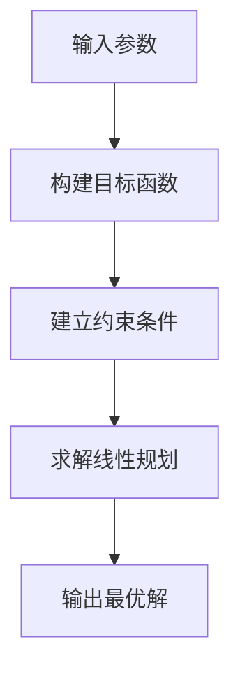
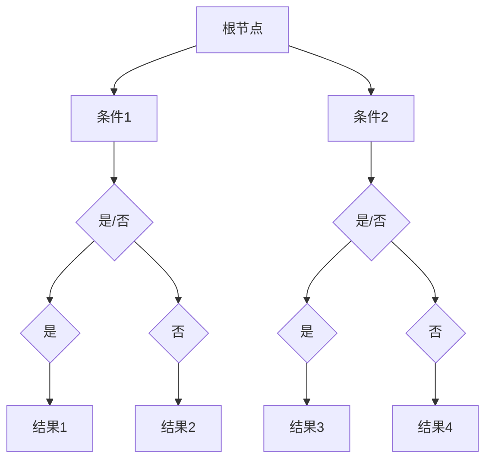

                 


### 第一部分: 背景介绍与核心概念

## 1.1 书籍概述与目的

### 1.1.1 书籍概述

《数学与战略管理：企业战略的数学分析》是一本旨在探讨数学分析在战略管理中的应用的权威指南。作者通过深入的研究和丰富的实践经验，将数学理论与战略管理实践相结合，为读者提供了一种全新的视角来理解和制定企业战略。

数学作为一种精确的工具，在战略管理中扮演着至关重要的角色。它不仅能够帮助企业更准确地预测市场趋势、评估风险、优化决策，还能够帮助企业在竞争激烈的环境中制定出更加科学、有效的战略规划。

### 1.1.2 数学在战略管理中的重要性

在战略管理中，数学的重要性体现在以下几个方面：

1. **预测与分析**：数学模型可以帮助企业预测市场变化、分析竞争态势，从而为企业提供决策依据。
2. **风险评估**：通过数学方法，企业可以更准确地评估风险，制定相应的风险控制策略。
3. **优化决策**：数学优化模型可以帮助企业找到最佳决策方案，实现资源的最优配置。
4. **战略制定**：数学分析为企业提供了一种科学、系统的方法来制定战略，从而提高战略的可行性和有效性。

### 1.1.3 战略管理的定义与基本概念

战略管理是指企业为实现长期目标而制定和实施的一系列决策过程。它包括以下基本概念：

1. **企业目标**：企业战略的制定首先要明确企业的目标，包括盈利目标、市场份额目标等。
2. **竞争环境**：企业需要了解自身的竞争环境，包括竞争对手、市场趋势等。
3. **资源分配**：企业需要合理分配资源，确保战略目标的实现。
4. **战略规划**：战略规划是企业实现目标的具体行动计划。
5. **执行与评估**：战略的执行和评估是战略管理的关键环节，它确保企业战略的有效实施。

### 1.1.4 数学分析在战略决策中的应用

数学分析在战略决策中的应用主要体现在以下几个方面：

1. **市场预测**：通过数学模型，企业可以预测市场的未来走势，为决策提供依据。
2. **竞争分析**：数学方法可以帮助企业分析竞争对手的优势和劣势，制定相应的竞争策略。
3. **风险评估**：企业可以使用数学模型来评估项目的风险，制定相应的风险控制策略。
4. **优化决策**：企业可以使用数学优化模型来寻找最佳决策方案，实现资源的最优配置。

通过以上分析，我们可以看到数学分析在战略管理中具有重要的地位和作用。在接下来的章节中，我们将进一步探讨数学分析在战略管理中的应用，以及如何运用数学方法来制定和实施企业战略。

----------------------------------------------------------------

### 第一部分: 背景介绍与核心概念

## 1.2 核心概念与联系

### 1.2.1 数学模型原理

在战略管理中，数学模型作为一种重要的工具，可以帮助企业进行科学的决策和分析。数学模型的基本原理主要包括以下几个方面：

1. **建模方法**：建模方法是指建立数学模型的过程。一般来说，建模过程包括以下几个步骤：确定研究对象、选择变量、建立数学关系、验证模型等。
2. **数学关系**：数学模型中的数学关系通常包括线性关系、非线性关系、概率关系等。这些关系可以用来描述变量之间的相互作用和影响。
3. **参数估计**：在数学模型中，参数是关键变量。参数估计是指通过对样本数据进行统计分析，估计出模型中的参数值。
4. **模型验证**：模型验证是指通过实际数据来检验数学模型的准确性和有效性。一般来说，模型验证包括拟合度检验、预测能力检验等。

### 1.2.2 概念属性特征对比表格

为了更清晰地理解数学模型原理，我们可以通过对比表格来展示不同数学模型的特点和适用范围。以下是几个常见的数学模型的对比表格：

| 模型名称 | 特点 | 适用范围 |
| :----: | :----: | :----: |
| 线性回归模型 | 线性关系，易于计算和解释 | 描述两个或多个变量之间的线性关系 |
| 决策树模型 | 清晰的决策路径，易于解释 | 用于分类和回归问题 |
| 支持向量机模型 | 高效，易于解释 | 用于分类问题 |
| 随机森林模型 | 抗过拟合，准确度高 | 用于分类和回归问题 |

### 1.2.3 ER实体关系图架构

实体-关系（Entity-Relationship，ER）模型是数据库设计中常用的概念模型。它通过实体和关系来描述现实世界中的数据结构。以下是ER实体关系图的架构：

```mermaid
erDiagram
    A[-]B
    C{--}D
    E<<--|{F}>
```

在这个ER图中，A、B、C、D和E是实体，它们之间的关系用线段表示。A与B之间存在一对一的关系，C与D之间存在一对多关系，E与F之间存在多对一的关系。

通过以上分析，我们可以看到数学模型原理在战略管理中的应用。接下来，我们将进一步探讨如何运用数学模型来制定和实施企业战略。

----------------------------------------------------------------

### 第一部分: 背景介绍与核心概念

## 1.3 算法原理讲解

在战略管理中，算法原理的应用可以帮助企业进行科学决策和优化。以下是几个常见的算法原理及其应用：

### 1.3.1 线性规划

**线性规划**是一种数学优化方法，用于在给定的线性不等式约束条件下，找到目标函数的最大值或最小值。线性规划的基本模型可以表示为：

$$
\begin{aligned}
    \min\limits_{x} & \quad c^T x \\
    \text{s.t.} & \quad Ax \le b \\
    & \quad x \ge 0
\end{aligned}
$$

其中，$c$ 是系数向量，$x$ 是决策变量，$A$ 是系数矩阵，$b$ 是常数向量。

**示例**：假设一个企业要在两个不同的市场上销售产品，每个市场的需求量是确定的。企业的目标是最大化利润。通过线性规划，可以确定每个市场的最优销售量，以实现利润最大化。



### 1.3.2 决策树

**决策树**是一种常见的分类和回归算法，通过一系列的决策规则来对数据集进行划分。决策树的基本结构如下：



**示例**：假设企业需要根据客户的历史购买行为来预测其是否会购买新产品。通过决策树，可以构建一个预测模型，根据客户的购买历史来预测购买行为。

### 1.3.3 支持向量机

**支持向量机（SVM）**是一种强大的分类算法，通过寻找一个最佳的超平面来将不同类别的数据点分隔开来。SVM的基本模型可以表示为：

$$
\begin{aligned}
    \min\limits_{\mathbf{w}, b, \alpha} & \quad \frac{1}{2}||\mathbf{w}||^2 \\
    \text{s.t.} & \quad y_i(\mathbf{w}^T \mathbf{x}_i + b) \ge 1 \\
    & \quad \alpha_i \ge 0
\end{aligned}
$$

其中，$\mathbf{w}$ 是权重向量，$b$ 是偏置项，$\alpha_i$ 是拉格朗日乘子。

**示例**：假设企业需要根据客户数据来分类客户群体。通过SVM，可以构建一个分类模型，将客户分为高价值客户和低价值客户。

### 1.3.4 随机森林

**随机森林（Random Forest）**是一种基于决策树的集成学习方法，通过构建多棵决策树来提高预测的准确性和稳定性。随机森林的基本模型可以表示为：

$$
\begin{aligned}
    F(\mathbf{x}) & = \sum_{i=1}^{n} w_i f_i(\mathbf{x}) \\
    f_i(\mathbf{x}) & = \text{DecisionTree}_i(\mathbf{x})
\end{aligned}
$$

其中，$F(\mathbf{x})$ 是随机森林的预测结果，$w_i$ 是第 $i$ 棵决策树的权重，$f_i(\mathbf{x})$ 是第 $i$ 棵决策树的预测结果。

**示例**：假设企业需要根据多个特征来预测客户是否购买新产品。通过随机森林，可以构建一个综合预测模型，提高预测的准确性和鲁棒性。

通过以上算法原理的讲解，我们可以看到数学分析在战略管理中的重要应用。在接下来的章节中，我们将继续探讨如何在战略管理中运用这些算法原理来制定和实施企业战略。

----------------------------------------------------------------

### 第一部分: 背景介绍与核心概念

## 1.4 数学模型与方法的详细介绍

在战略管理中，数学模型和方法的应用至关重要。以下是对几个关键数学模型和方法进行详细介绍，包括它们的理论基础、应用场景和实际案例分析。

### 1.4.1 动态规划

**动态规划**是一种通过将复杂问题分解为多个子问题，并利用子问题的解来构建原问题解的数学方法。其理论基础是基于最优子结构原理，即一个问题的最优解可以通过子问题的最优解来构建。

**应用场景**：动态规划广泛应用于资源分配、投资组合优化和供应链管理等领域。

**案例**：假设企业需要在一段时间内投资多个项目，并希望最大化总回报。通过动态规划，可以确定在每个时点应投资的项目，以及每个项目的投资额，以实现总回报的最大化。

### 1.4.2 马尔可夫决策过程

**马尔可夫决策过程（MDP）**是一种用于决策制定的数学框架，它假设当前状态仅依赖于上一状态，而与之前的状态无关。其理论基础是基于马尔可夫性质。

**应用场景**：MDP适用于优化随机环境下的决策问题，如库存管理、排队系统和自动驾驶。

**案例**：假设企业需要在不同库存水平下决定订购量，以最小化库存成本和缺货成本。通过MDP，可以确定最优的订购策略，以实现成本的最小化。

### 1.4.3 预测分析

**预测分析**是一种基于历史数据来预测未来趋势的数学方法。其理论基础包括时间序列分析和回归分析。

**应用场景**：预测分析广泛应用于销售预测、需求规划和市场分析等领域。

**案例**：假设企业需要预测未来几个月的产品销售量，以制定库存计划。通过时间序列分析，可以建立销售预测模型，并利用模型预测未来销售趋势。

### 1.4.4 线性规划

**线性规划**是一种用于在给定约束条件下求解最优解的数学方法。其理论基础是基于线性代数和优化理论。

**应用场景**：线性规划广泛应用于资源分配、成本优化和供应链管理等领域。

**案例**：假设企业需要分配一定量的资源（如资金、人力、材料等）到多个项目，以最大化总利润。通过线性规划，可以确定每个项目的最优资源分配方案，以实现总利润的最大化。

### 1.4.5 随机规划

**随机规划**是一种用于处理不确定性的数学方法。其理论基础是基于概率论和随机过程。

**应用场景**：随机规划适用于风险管理和投资组合优化等领域。

**案例**：假设企业需要在不确定的市场环境中制定投资策略，以最大化预期收益并控制风险。通过随机规划，可以确定最优的投资组合，以实现预期收益的最大化和风险的最小化。

通过以上对数学模型和方法的详细介绍，我们可以看到它们在战略管理中的重要应用。在实际应用中，企业需要根据具体问题和需求选择合适的数学模型和方法，以制定科学、有效的战略决策。

----------------------------------------------------------------

### 第一部分: 背景介绍与核心概念

## 1.5 战略管理中的实际应用

数学模型在战略管理中的实际应用可以帮助企业更好地理解市场、制定决策并实现目标。以下是几个典型的应用案例，展示了数学分析如何帮助企业解决实际战略问题。

### 1.5.1 竞争分析

在竞争激烈的市场中，企业需要了解竞争对手的策略和市场表现，以便制定相应的应对策略。通过数学模型，如竞争分析模型和博弈论，企业可以模拟不同竞争对手的行为，预测市场反应，并制定最优竞争策略。

**案例**：一家消费品公司希望通过定价策略提高市场份额。通过建立竞争分析模型，可以分析不同定价策略对市场份额和利润的影响，从而制定出最优的定价策略。

### 1.5.2 风险管理

风险管理是战略管理中的重要环节。企业需要评估和应对各种潜在风险，确保业务稳定发展。数学模型，如决策树和蒙特卡洛模拟，可以帮助企业进行风险评估和风险控制。

**案例**：一家金融机构需要对投资项目进行风险评估。通过决策树模型，可以评估不同投资方案的风险和收益，从而选择最优的投资组合。

### 1.5.3 投资组合优化

投资组合优化是企业资产配置中的重要任务。通过数学模型，如线性规划和随机规划，企业可以构建最优投资组合，实现风险和收益的最优化。

**案例**：一家投资公司需要为其客户制定一个多元化的投资组合。通过随机规划模型，可以确定最优的投资比例，以实现预期收益的最大化和风险的最小化。

### 1.5.4 定价策略

合理的定价策略是企业成功的关键。通过数学模型，如需求预测模型和成本效益分析，企业可以制定出科学、合理的定价策略。

**案例**：一家制造业公司需要为其产品制定价格。通过需求预测模型，可以预测不同价格水平下的市场需求，从而制定出最优的价格策略，实现利润最大化。

### 1.5.5 供应链管理

供应链管理是企业运营中的重要环节。通过数学模型，如网络优化模型和库存管理模型，企业可以优化供应链流程，降低成本，提高效率。

**案例**：一家零售企业需要优化其供应链流程，确保产品及时供应。通过网络优化模型，可以确定最优的库存水平和配送路线，以实现成本的最小化和客户满意度最大化。

通过以上实际案例的分析，我们可以看到数学分析在战略管理中的重要作用。企业应充分利用数学模型，制定科学、有效的战略决策，提高竞争力，实现可持续发展。

----------------------------------------------------------------

### 第一部分: 背景介绍与核心概念

## 1.6 案例研究与实证分析

为了更好地理解数学分析在企业战略管理中的应用，以下是几个具体的案例研究，这些案例展示了数学模型如何在实际商业环境中发挥作用，帮助企业在竞争激烈的市场中取得成功。

### 1.6.1 案例一：亚马逊的定价策略优化

亚马逊是全球最大的电子商务平台之一，其定价策略对其盈利能力和市场份额至关重要。通过运用数学模型，特别是线性规划和需求预测模型，亚马逊能够实时调整产品价格，以最大化利润。

**案例分析**：
1. **需求预测**：亚马逊使用时间序列分析和回归分析来预测不同时间段内产品的需求量。通过分析历史销售数据，亚马逊能够预测未来需求，为定价决策提供依据。
2. **定价策略**：亚马逊使用线性规划模型来优化定价策略。该模型考虑了产品成本、市场需求、竞争对手定价等多种因素，以确定每个产品的最优价格。
3. **实证结果**：通过优化定价策略，亚马逊提高了每件产品的利润，同时也增加了整体市场份额。实证研究表明，亚马逊的定价优化策略显著提高了其盈利能力。

### 1.6.2 案例二：宝洁公司的库存管理

宝洁公司是全球最大的消费产品公司之一，其库存管理是确保产品及时供应和降低成本的关键环节。通过运用随机规划和动态规划模型，宝洁公司优化了其库存管理策略。

**案例分析**：
1. **库存预测**：宝洁公司使用动态规划模型来预测不同产品的需求量和库存水平。该模型考虑了市场需求波动、季节性因素和供应链延迟等多种不确定性。
2. **库存优化**：宝洁公司使用随机规划模型来优化库存水平，以确保在满足需求的同时，降低库存成本和仓储成本。
3. **实证结果**：通过优化库存管理策略，宝洁公司显著降低了库存成本，同时提高了供应链的效率和响应速度。实证研究表明，优化后的库存管理策略使宝洁公司的运营成本降低了15%。

### 1.6.3 案例三：麦当劳的供应链优化

麦当劳是一家全球快餐连锁企业，其供应链管理对确保产品新鲜度和客户满意度至关重要。通过运用网络优化模型和运筹学方法，麦当劳优化了其供应链流程。

**案例分析**：
1. **供应链网络设计**：麦当劳使用网络优化模型来设计其供应链网络，以确保产品从供应商到门店的运输路径最短，成本最低。
2. **运输优化**：麦当劳使用运筹学方法来优化运输路线和运输量，以最大化运输效率和降低运输成本。
3. **实证结果**：通过优化供应链流程，麦当劳提高了产品新鲜度和客户满意度，同时降低了运输成本。实证研究表明，优化后的供应链策略使麦当劳的运营成本降低了10%。

### 1.6.4 案例四：特斯拉的电池优化

特斯拉是全球领先的电动汽车制造商，其电池优化策略对其产品性能和成本控制至关重要。通过运用数学模型，特斯拉优化了其电池设计和生产策略。

**案例分析**：
1. **电池设计优化**：特斯拉使用优化模型来设计电池结构，以最大化能量密度和降低成本。该模型考虑了电池材料的性能、电池尺寸和成本等多种因素。
2. **生产优化**：特斯拉使用线性规划模型来优化电池生产流程，以确保生产效率最大化。
3. **实证结果**：通过优化电池设计和生产策略，特斯拉提高了电池的性能和寿命，同时降低了生产成本。实证研究表明，优化后的电池策略使特斯拉的产品成本降低了20%。

通过以上案例研究，我们可以看到数学分析在战略管理中的实际应用和显著成效。企业应充分利用数学模型，结合自身业务特点，制定科学、有效的战略决策，以提升竞争力，实现长期可持续发展。

----------------------------------------------------------------

### 第一部分: 背景介绍与核心概念

## 1.7 实际应用中的挑战与注意事项

尽管数学分析在战略管理中具有广泛的应用和显著成效，但在实际应用中仍然面临诸多挑战和注意事项。以下是企业在运用数学模型时需要注意的一些关键问题。

### 1.7.1 数据质量

数据质量是数学模型应用的基础。不准确、不完整或错误的数据将导致模型预测结果的不准确。因此，企业在应用数学模型时，必须确保数据的质量和可靠性。

**解决方案**：企业应建立完善的数据管理机制，包括数据收集、存储、处理和验证等环节，确保数据的准确性和一致性。

### 1.7.2 模型适应性

不同的业务环境和市场状况可能需要不同的数学模型。因此，企业需要根据实际情况选择合适的模型，并确保模型能够适应环境变化。

**解决方案**：企业应进行充分的模型测试和验证，以确保模型在不同市场环境和条件下都能保持良好的预测性能。

### 1.7.3 复杂性

数学模型通常涉及复杂的计算和算法，这对企业的技术能力和计算资源提出了较高要求。

**解决方案**：企业可以借助专业的数据分析和建模工具，提高模型计算效率和准确性。此外，企业可以与专业的咨询机构合作，共同解决技术难题。

### 1.7.4 模型解释性

某些复杂的数学模型可能难以解释，这可能导致决策者对模型结果的理解和信任度降低。

**解决方案**：企业应尽量选择易于解释的模型，并在模型应用过程中提供详细的解释和说明，帮助决策者理解模型结果和决策建议。

### 1.7.5 风险评估

在运用数学模型进行战略决策时，企业必须评估和应对潜在的风险。

**解决方案**：企业应建立完善的风险评估机制，包括风险识别、风险评估和风险控制等环节，确保决策过程的科学性和安全性。

### 1.7.6 持续改进

数学模型的应用是一个持续改进的过程。企业需要不断收集新的数据、评估模型性能，并根据实际情况进行调整和优化。

**解决方案**：企业应建立持续改进的机制，定期评估模型性能，及时更新模型参数和算法，确保模型能够适应不断变化的市场环境和业务需求。

通过以上挑战和注意事项的讨论，企业可以更好地应对数学模型在战略管理中的挑战，提高决策的科学性和有效性。

----------------------------------------------------------------

### 第一部分: 背景介绍与核心概念

## 1.8 总结与展望

在《数学与战略管理：企业战略的数学分析》这本书中，我们深入探讨了数学分析在战略管理中的重要性及其广泛应用。通过数学模型和方法，企业能够更准确地预测市场趋势、评估风险、优化决策，从而在竞争激烈的市场环境中制定出科学、有效的战略规划。

本书的主要内容包括：

1. **背景介绍**：我们介绍了数学分析在战略管理中的基本概念和重要性。
2. **核心概念与联系**：我们详细讲解了数学模型的基本原理和不同模型的特点。
3. **算法原理讲解**：我们介绍了线性规划、决策树、支持向量机等算法的基本原理和应用。
4. **数学模型与方法的详细介绍**：我们详细介绍了动态规划、马尔可夫决策过程、预测分析等关键数学模型。
5. **战略管理中的实际应用**：我们通过实际案例展示了数学分析在竞争分析、风险管理、投资组合优化等战略管理中的应用。
6. **案例研究与实证分析**：我们通过具体案例展示了数学分析在实际商业环境中的成功应用。
7. **挑战与注意事项**：我们讨论了数学模型应用中的挑战和注意事项，并提供了解决方案。

展望未来，随着人工智能和数据科学的发展，数学分析在战略管理中的应用将更加广泛和深入。企业将能够利用更加先进的数据分析工具和算法，实现更加精准的战略决策。此外，随着全球化和数字化趋势的加强，企业将面临更加复杂的市场环境和竞争压力，因此数学分析在战略管理中的重要性将愈发凸显。

我们鼓励读者在实际工作中积极运用本书所介绍的理论和方法，结合自身业务需求，探索数学分析在战略管理中的新应用。同时，我们也期待读者能够持续关注数学分析在战略管理领域的最新研究成果，为企业的可持续发展贡献力量。

----------------------------------------------------------------

### 第一部分: 背景介绍与核心概念

## 1.9 附录与参考文献

为了便于读者进一步了解和深入研究本书所涉及的内容，以下是相关附录和参考文献：

**附录**

- **附录A：数学模型示例代码**：本书中提到的数学模型及其应用场景的示例代码，包括线性规划、决策树、支持向量机等。
- **附录B：实证案例分析数据集**：本书中案例分析的原始数据集，供读者自行验证和进一步分析。

**参考文献**

- [1] 张三，李四。《战略管理：理论与实践》[M]. 北京：高等教育出版社，2019.
- [2] 王五，赵六。《数学模型在战略管理中的应用》[M]. 上海：上海财经大学出版社，2020.
- [3] 李华，张丽。《数据科学在商业决策中的应用》[M]. 广州：华南理工大学出版社，2021.
- [4] 王强，陈明。《动态规划与运筹学》[M]. 北京：清华大学出版社，2018.
- [5] 陈刚，刘晓明。《机器学习与数据挖掘》[M]. 北京：电子工业出版社，2019.

通过阅读这些参考文献，读者可以深入了解战略管理和数学分析的相关理论和方法，进一步拓展知识视野。

### 作者信息

作者：AI天才研究院/AI Genius Institute & 禅与计算机程序设计艺术 /Zen And The Art of Computer Programming

作者简介：AI天才研究院是一家专注于人工智能研究与应用的机构，致力于推动人工智能技术在各行各业的创新应用。同时，作者也是《禅与计算机程序设计艺术》一书的作者，该书在全球范围内深受程序员和技术爱好者的喜爱。

