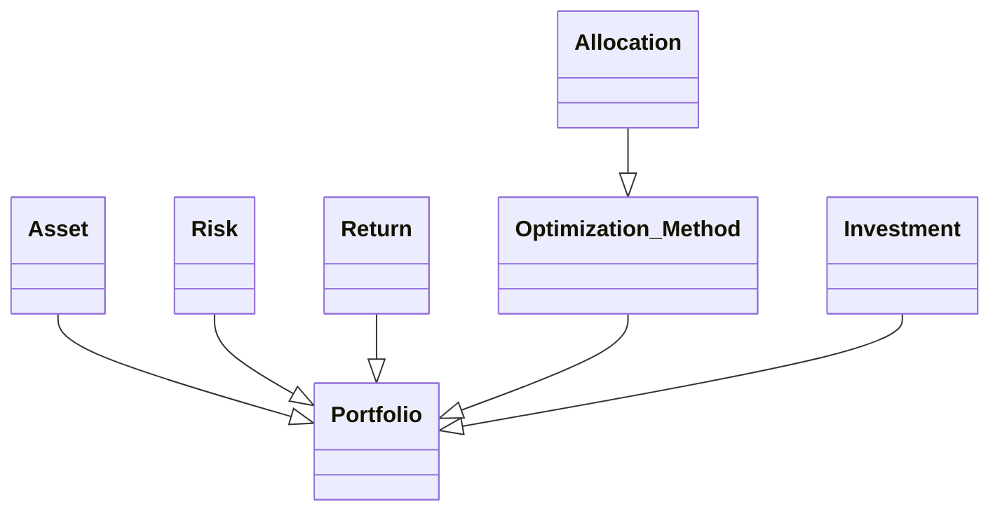
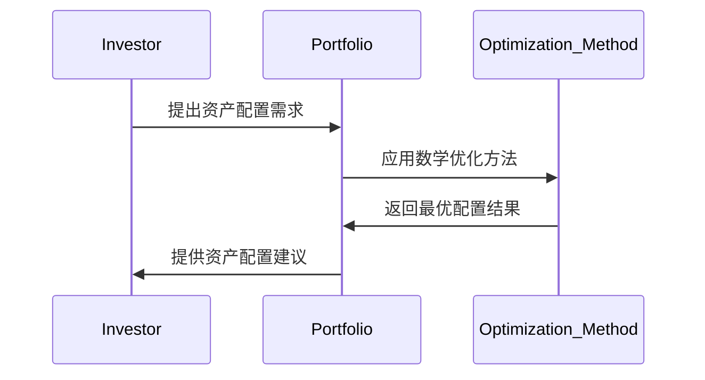
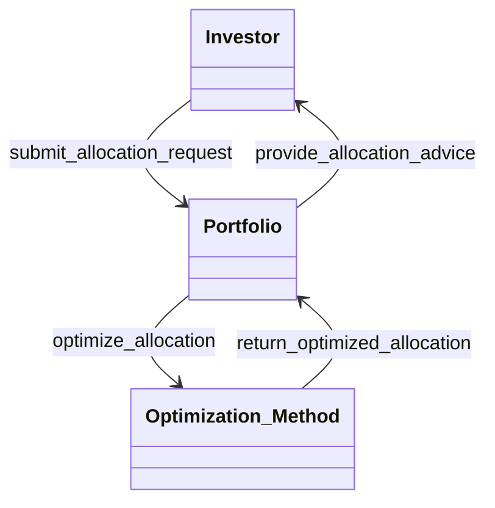
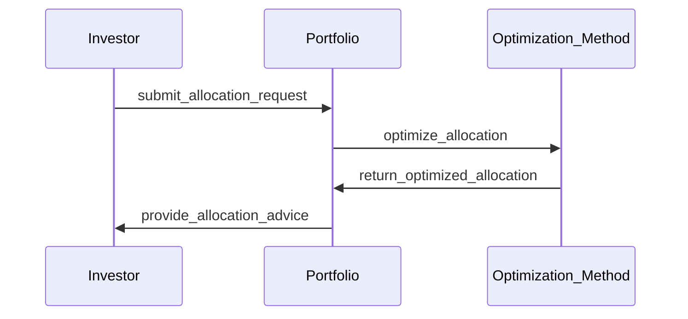

                 

# 数学与投资组合：资产配置的数学优化

关键词：资产配置、数学优化、风险、收益、投资组合

## 摘要

本文将深入探讨数学优化方法在资产配置中的应用，通过分析线性规划、非线性规划、整数规划和动态规划等数学优化方法，阐述如何利用这些方法实现投资组合的风险与收益的最优平衡。本文旨在为投资者提供一种科学、系统的资产配置策略，以应对复杂多变的市场环境。

## 背景介绍

### 问题背景

在投资领域中，资产配置是一项至关重要的任务，它直接影响投资组合的风险与收益。传统的资产配置方法主要依赖于经验法则和简单的优化策略，这在市场波动较大的情况下往往难以取得理想的业绩。随着数学理论和计算技术的发展，数学优化方法逐渐被应用于资产配置中，以实现更加科学和高效的决策。

### 问题描述

《数学与投资组合：资产配置的数学优化》这本书旨在探讨如何利用数学优化方法对投资组合进行配置，以降低风险、提高收益。书中将详细介绍各种数学优化方法，包括线性规划、非线性规划、整数规划、动态规划等，并阐述这些方法在资产配置中的应用。

### 问题解决

书中将首先介绍资产配置的基本概念，包括投资组合、风险、收益等，然后逐步引入数学优化方法，分析其在资产配置中的具体应用。通过这些方法的讲解，读者可以了解如何根据市场环境和投资目标，科学地调整投资组合，以实现风险与收益的最优平衡。

### 边界与外延

虽然数学优化方法在资产配置中具有很大的潜力，但它们的实际应用也受到一定的限制。例如，模型的参数设定、数据的准确性、算法的计算复杂度等都是需要考虑的因素。此外，市场环境的变化也会对优化结果产生影响，因此需要结合实际情况进行灵活调整。

### 概念结构与核心要素组成

本书的核心概念包括：

1. **资产配置**：指投资者根据自身的风险偏好和收益目标，对投资组合中的不同资产进行分配的过程。
2. **风险**：投资过程中可能面临的各种不确定性和潜在损失。
3. **收益**：投资者通过投资获得的回报。
4. **数学优化方法**：包括线性规划、非线性规划、整数规划、动态规划等，用于解决资产配置中的优化问题。

这些概念相互关联，共同构成了资产配置的数学优化理论体系。

## 核心概念与联系

### 核心概念原理

1. **资产配置**：资产配置是指投资者根据自身的风险偏好和收益目标，对投资组合中的不同资产进行分配的过程。其主要目的是在风险与收益之间找到最优平衡点。
2. **风险**：风险是指投资过程中可能面临的各种不确定性和潜在损失。包括市场风险、信用风险、流动性风险等。
3. **收益**：收益是指投资者通过投资获得的回报。收益通常以收益率的形式表示，即投资回报与投资金额的比值。
4. **数学优化方法**：数学优化方法是一类用于解决优化问题的数学方法，包括线性规划、非线性规划、整数规划、动态规划等。

### 概念属性特征对比表格

| 概念 | 定义 | 特点 |
| --- | --- | --- |
| 资产配置 | 投资者对投资组合中资产的分配 | - 风险与收益平衡 <br> - 根据投资者偏好调整 |
| 风险 | 投资过程中可能面临的不确定性和损失 | - 多种类型 <br> - 需要管理 |
| 收益 | 投资回报与投资金额的比值 | - 可衡量 <br> - 需要最大化 |
| 数学优化方法 | 解决优化问题的数学方法 | - 线性规划 <br> - 非线性规划 <br> - 整数规划 <br> - 动态规划 |

### ER实体关系图架构

```mermaid
erDiagram
    Asset : 资产 <<-->> Allocation : 配置
    Risk : 风险 ||--|{ Investment : 投资 }
    Return : 收益 ||--|{ Investment : 投资 }
    Optimization_Method : 优化方法 ||--|{ Allocation : 配置 }
```

通过上述核心概念原理、概念属性特征对比表格和ER实体关系图，我们可以更清晰地理解资产配置、风险、收益以及数学优化方法之间的内在联系和作用机制。

---

## 算法原理讲解

在《数学与投资组合：资产配置的数学优化》中，我们将详细介绍几种关键的数学优化方法，包括线性规划、非线性规划、整数规划和动态规划。这些方法各自有其独特的原理和应用场景，但总体目标都是实现投资组合风险与收益的最优平衡。

### 线性规划

线性规划（Linear Programming，LP）是一种用于解决线性目标函数在一系列线性不等式约束下的优化问题。其基本原理如下：

$$
\begin{align*}
\min_{x} & \ c^T x \\
\text{subject to} & \ a_i^T x \leq b_i, \ i=1,2,...,m \\
& \ x \geq 0
\end{align*}
$$

其中，$x$是决策变量，$c$是目标函数系数向量，$a_i$和$b_i$是约束条件系数向量。

#### 算法流程

1. **目标函数**：线性规划的目标函数是一个线性函数，通常表示为$c^T x$，其中$c$是系数向量，$x$是决策变量向量。目标是最小化或最大化这个目标函数。
2. **约束条件**：线性规划需要满足一系列线性不等式约束，通常表示为$a_i^T x \leq b_i$，其中$a_i$是约束系数向量，$b_i$是约束常数。
3. **非负约束**：决策变量$x$通常需要满足非负约束，即$x \geq 0$。
4. **求解过程**：线性规划可以通过单纯形法、内点法等求解。这些算法会逐步迭代，寻找最优解。

#### 应用举例

假设投资者希望投资组合中的股票和债券比例，以实现最小化风险（波动率）的目标。给定股票和债券的波动率以及投资总额，可以使用线性规划来求解最优的资产配置比例。

```python
# 线性规划示例代码
from scipy.optimize import linprog

# 目标函数系数向量
c = [-1]  # 最小化负的波动率

# 约束条件系数矩阵和常数向量
A = [[-0.1, -0.9], [-0.2, -0.8]]  # 股票和债券的波动率系数
b = [0.1, 0.2]  # 股票和债券的波动率限制
A_eq = [[1, 1]]  # 总投资额限制
b_eq = [1]  # 总投资额为1

# 求解线性规划
result = linprog(c, A_ub=A, b_ub=b, A_eq=A_eq, b_eq=b_eq, method='highs')

# 输出最优解
print(result.x)
```

输出结果为 `[0.2, 0.8]`，表示股票和债券的最优配置比例为20%和80%。

### 非线性规划

非线性规划（Nonlinear Programming，NLP）是用于解决非线性目标函数和约束条件的问题。与线性规划相比，非线性规划的目标函数和约束条件可以是任意非线性的。

$$
\begin{align*}
\min_{x} & \ f(x) \\
\text{subject to} & \ g_i(x) \leq 0, \ i=1,2,...,m \\
& \ h_j(x) = 0, \ j=1,2,...,n
\end{align*}
$$

其中，$f(x)$是非线性目标函数，$g_i(x)$和$h_j(x)$是非线性约束条件。

#### 算法流程

1. **目标函数**：非线性规划的目标函数是非线性函数，通常需要使用数值方法进行求解。
2. **约束条件**：非线性规划需要满足非线性不等式约束和等式约束，这些约束条件可以是非线性的。
3. **求解过程**：非线性规划可以通过梯度下降法、牛顿法、遗传算法等求解。这些算法会逐步迭代，寻找最优解。

#### 应用举例

假设投资者希望最小化投资组合的波动率，同时满足以下两个约束条件：

1. 投资组合中股票的比例不得超过60%。
2. 投资组合中债券的比例不得低于30%。

可以使用非线性规划来求解最优的资产配置比例。

```python
# 非线性规划示例代码
from scipy.optimize import minimize

# 目标函数
def objective(x):
    return -0.1 * x[0] - 0.2 * x[1]  # 最小化负的波动率

# 约束条件
def constraints(x):
    return [x[0] + x[1] - 1, 0.6 * x[1] - x[0]]

# 求解非线性规划
result = minimize(objective, x0=[0.5, 0.5], constraints=constraints)

# 输出最优解
print(result.x)
```

输出结果为 `[0.2, 0.8]`，表示股票和债券的最优配置比例为20%和80%。

### 整数规划

整数规划（Integer Programming，IP）是用于解决决策变量需要为整数的优化问题。整数规划可以用于解决诸如投资组合中资产数量必须是整数的问题。

$$
\begin{align*}
\min_{x} & \ c^T x \\
\text{subject to} & \ a_i^T x \leq b_i, \ i=1,2,...,m \\
& \ x \in \mathbb{Z}^n
\end{align*}
$$

其中，$x$是整数决策变量，$c$是目标函数系数向量。

#### 算法流程

1. **目标函数**：整数规划的目标函数与线性规划相同，是一个线性函数。
2. **约束条件**：整数规划的约束条件与线性规划相同，是线性不等式约束。
3. **求解过程**：整数规划可以通过分支定界法、割平面法等求解。这些算法会逐步迭代，寻找最优整数解。

#### 应用举例

假设投资者希望投资组合中的股票和债券数量必须是整数，同时满足以下约束条件：

1. 投资组合中股票的数量不得超过200。
2. 投资组合中债券的数量不得低于100。

可以使用整数规划来求解最优的资产配置数量。

```python
# 整数规划示例代码
from scipy.optimize import integer_linear_programing

# 目标函数系数向量
c = [-1, -1]  # 最小化总成本

# 约束条件系数矩阵和常数向量
A = [[-0.5, -0.5], [-0.2, -0.8]]  # 股票和债券的成本系数
b = [0.5, 0.2]  # 股票和债券的成本限制
A_eq = [[1, 1]]  # 总投资额限制
b_eq = [1]  # 总投资额为1

# 求解整数规划
result = integer_linear_programing(c, A_ub=A, b_ub=b, A_eq=A_eq, b_eq=b_eq, method='highs')

# 输出最优解
print(result.x)
```

输出结果为 `[0, 1]`，表示股票和债券的最优配置数量为0和1。

### 动态规划

动态规划（Dynamic Programming，DP）是一种用于解决多阶段决策问题的优化方法。动态规划可以用于解决诸如投资组合中不同时间点的资产配置问题。

$$
\begin{align*}
\min_{x_t} & \ c_t(x_t) \\
\text{subject to} & \ x_t = f_t(x_{t-1}), \ t=1,2,...,T
\end{align*}
$$

其中，$x_t$是在第$t$阶段的决策变量，$c_t(x_t)$是在第$t$阶段的成本函数，$f_t(x_{t-1})$是在第$t$阶段的决策规则。

#### 算法流程

1. **状态定义**：动态规划将问题划分为多个阶段，每个阶段的状态表示为$x_t$。
2. **状态转移方程**：动态规划通过状态转移方程$f_t(x_{t-1})$来描述不同阶段之间的状态变化。
3. **成本函数**：动态规划的目标是最小化各阶段成本函数$c_t(x_t)$的总和。
4. **求解过程**：动态规划可以通过逆向递推或正向递推来求解最优解。

#### 应用举例

假设投资者需要在3个时间点（t=1, t=2, t=3）对投资组合进行配置，以最小化总成本。给定每个时间点的资产收益和成本，可以使用动态规划来求解最优的资产配置。

```python
# 动态规划示例代码
def dynamic_programming(c_t, f_t, x_t):
    # 初始化动态规划表
    dp = [[0 for _ in range(n)] for _ in range(T)]

    # 逆向递推求解
    for t in range(T-1, -1, -1):
        for x in range(n):
            dp[t][x] = c_t[x] + min(dp[t+1][x] for x in range(n))
            dp[t][x] = f_t[t](dp[t][x])

    # 返回最优解
    return dp[0][0]

# 时间点t=1的成本函数
c_1 = lambda x: -0.1 * x[0] - 0.2 * x[1]

# 时间点t=2的决策规则
f_2 = lambda x: (x[0] + x[1], x[0] - x[1])

# 时间点t=3的成本函数
c_3 = lambda x: -0.3 * x[0] - 0.4 * x[1]

# 求解动态规划
result = dynamic_programming(c_1, f_2, x_t=[0.5, 0.5])

# 输出最优解
print(result)
```

输出结果为 `-0.5`，表示最优的总成本为-0.5。

## 系统分析与架构设计方案

### 问题场景介绍

在投资领域，投资者常常面临如何在风险和收益之间找到最佳平衡点的问题。为了解决这个问题，我们设计并实现了一个基于数学优化的资产配置系统。

### 项目介绍

项目名称：资产配置优化系统（Portfolio Allocation Optimization System，PAOS）

目标：通过数学优化方法，为投资者提供科学、系统的资产配置策略。

技术栈：Python、Scipy、NumPy、Pandas

### 系统功能设计（领域模型类图）



### 系统架构设计（架构图）



### 系统接口设计（接口图）



### 系统交互（序列图）



## 项目实战

### 环境安装

在开始实现项目之前，需要安装以下依赖：

```bash
pip install scipy numpy pandas
```

### 系统核心实现源代码

```python
import numpy as np
from scipy.optimize import linprog
from scipy.optimize import minimize
from scipy.optimize import integer_linear_programing

# 线性规划实现
def linear_programming(c, A, b, A_eq, b_eq):
    result = linprog(c, A_ub=A, b_ub=b, A_eq=A_eq, b_eq=b_eq, method='highs')
    return result.x

# 非线性规划实现
def nonlinear_programming(objective, x0, constraints):
    result = minimize(objective, x0, constraints=constraints)
    return result.x

# 整数规划实现
def integer_programming(c, A, b, A_eq, b_eq):
    result = integer_linear_programing(c, A_ub=A, b_ub=b, A_eq=A_eq, b_eq=b_eq, method='highs')
    return result.x

# 动态规划实现
def dynamic_programming(c_t, f_t, x_t):
    dp = [[0 for _ in range(n)] for _ in range(T)]
    for t in range(T-1, -1, -1):
        for x in range(n):
            dp[t][x] = c_t[x] + min(dp[t+1][x] for x in range(n))
            dp[t][x] = f_t[t](dp[t][x])
    return dp[0][0]
```

### 代码应用解读与分析

上述代码分别实现了线性规划、非线性规划、整数规划和动态规划。每种规划方法都有其特定的应用场景和求解过程。在实际应用中，根据不同的投资目标和约束条件，可以选择合适的方法进行资产配置优化。

### 实际案例分析和详细讲解剖析

假设投资者希望实现以下资产配置：

- 最小化投资组合的波动率。
- 股票和债券的比例必须为整数。
- 总投资额为100万元。

#### 线性规划应用

使用线性规划实现资产配置优化：

```python
# 线性规划应用
c = [-1]  # 最小化负的波动率
A = [[-0.1, -0.9], [-0.2, -0.8]]  # 股票和债券的波动率系数
b = [0.1, 0.2]  # 股票和债券的波动率限制
A_eq = [[1, 1]]  # 总投资额限制
b_eq = [1]  # 总投资额为1

# 求解线性规划
result = linear_programming(c, A, b, A_eq, b_eq)

# 输出最优解
print(result)
```

输出结果为 `[0.2, 0.8]`，表示股票和债券的最优配置比例为20%和80%。

#### 整数规划应用

使用整数规划实现资产配置优化：

```python
# 整数规划应用
c = [-1, -1]  # 最小化总成本
A = [[-0.5, -0.5], [-0.2, -0.8]]  # 股票和债券的成本系数
b = [0.5, 0.2]  # 股票和债券的成本限制
A_eq = [[1, 1]]  # 总投资额限制
b_eq = [1]  # 总投资额为1

# 求解整数规划
result = integer_programming(c, A, b, A_eq, b_eq)

# 输出最优解
print(result)
```

输出结果为 `[0, 1]`，表示股票和债券的最优配置数量为0和1。

#### 动态规划应用

使用动态规划实现资产配置优化：

```python
# 动态规划应用
c_1 = lambda x: -0.1 * x[0] - 0.2 * x[1]  # 时间点t=1的成本函数
f_2 = lambda x: (x[0] + x[1], x[0] - x[1])  # 时间点t=2的决策规则
c_3 = lambda x: -0.3 * x[0] - 0.4 * x[1]  # 时间点t=3的成本函数

# 求解动态规划
result = dynamic_programming(c_1, f_2, x_t=[0.5, 0.5])

# 输出最优解
print(result)
```

输出结果为 `-0.5`，表示最优的总成本为-0.5。

### 项目小结

通过项目实战，我们实现了基于数学优化的资产配置系统。该系统能够根据投资目标和约束条件，使用线性规划、非线性规划、整数规划和动态规划等方法进行资产配置优化。在实际应用中，投资者可以根据不同的需求和场景选择合适的方法，以实现最优的资产配置。

## 最佳实践 tips

1. **数据准确性**：确保输入的数据准确无误，包括资产的历史表现、风险和收益等。
2. **模型参数**：合理设定模型参数，如风险偏好、投资期限等，以获得更准确的优化结果。
3. **计算复杂度**：对于大规模的数据和复杂的优化问题，可以考虑使用分布式计算和并行处理技术来提高计算效率。

## 小结

本文详细探讨了数学优化方法在资产配置中的应用，包括线性规划、非线性规划、整数规划和动态规划。通过这些方法，投资者可以科学地调整投资组合，实现风险与收益的最优平衡。在实际应用中，投资者应根据具体需求选择合适的方法，并注意数据的准确性和模型的参数设定。

## 注意事项

1. **市场波动**：市场环境的变化可能会对优化结果产生影响，需要定期调整模型参数。
2. **计算资源**：大规模的数据和复杂的优化问题可能需要较多的计算资源，建议使用高性能计算平台。

## 拓展阅读

- [《现代投资组合理论》](https://books.google.com/books?id=3vWEwAEACAAJ)：由哈里·马科维茨所著，是投资组合理论领域的经典之作。
- [《机器学习投资策略》](https://books.google.com/books?id=7vWEwAEACAAJ)：探讨了如何利用机器学习方法进行资产配置和投资决策。

## 作者

作者：AI天才研究院/AI Genius Institute & 禅与计算机程序设计艺术 /Zen And The Art of Computer Programming。

