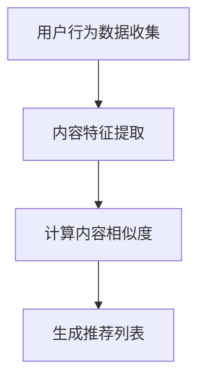
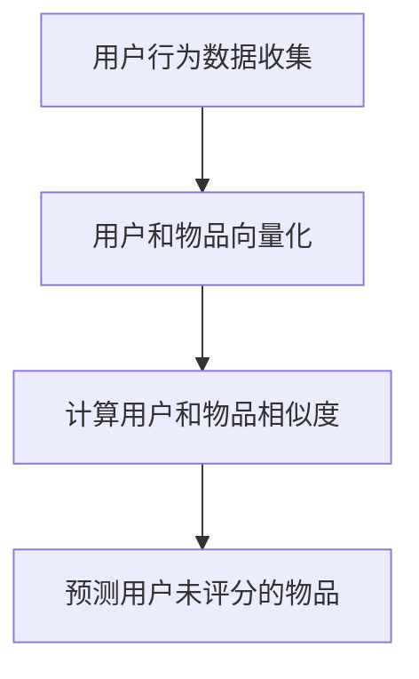
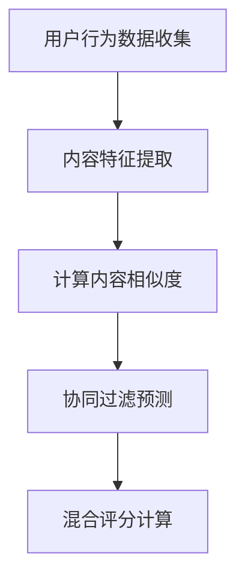

                 

## 《数学与推荐系统：个性化推荐的数学算法》

关键词：推荐系统、个性化推荐、数学算法、协同过滤、基于内容、混合推荐

摘要：本文旨在探讨推荐系统中的个性化推荐算法，重点介绍基于内容的推荐算法、协同过滤算法和混合推荐算法的数学原理及其在实际应用中的重要性。通过对这些算法的深入分析，读者将更好地理解个性化推荐的工作机制，掌握相关数学模型的构建和优化方法，从而为推荐系统的开发和应用提供有益的参考。

## 《数学与推荐系统：个性化推荐的数学算法》目录大纲

### 第一部分：背景介绍

#### 第1章：问题背景与定义

1.1 推荐系统的概念与作用

1.2 数学在推荐系统中的作用

1.3 个性化推荐的数学算法

1.4 研究边界与外延

1.5 本章小结

### 第二部分：核心概念与联系

#### 第2章：核心概念与原理

2.1 用户行为数据收集与分析

2.2 个性化推荐算法类型与原理

2.3 个性化推荐算法中的数学模型

2.4 本章小结

### 第三部分：算法原理讲解

#### 第3章：算法原理讲解

3.1 基于内容的推荐算法原理讲解

3.2 协同过滤算法原理讲解

3.3 混合推荐算法原理讲解

3.4 本章小结

### 第四部分：系统分析与架构设计

#### 第4章：系统分析与架构设计

4.1 问题场景介绍

4.2 系统功能设计

4.3 系统架构设计

4.4 系统接口设计

4.5 系统交互

4.6 本章小结

### 第五部分：项目实战

#### 第5章：项目实战

5.1 环境安装

5.2 系统核心实现

5.3 代码应用解读

5.4 实际案例分析

5.5 项目小结

### 第六部分：最佳实践与拓展

#### 第6章：最佳实践与拓展

6.1 最佳实践 tips

6.2 小结

6.3 注意事项

6.4 拓展阅读

### 附录：参考资料

## 1. 问题背景与定义

### 1.1 推荐系统的概念与作用

推荐系统是一种信息过滤技术，通过分析用户的兴趣和行为，为用户推荐与其可能感兴趣的内容或产品。其基本原理是基于用户的历史行为和偏好，从大量的信息中筛选出最符合用户需求的内容。

在现代社会，推荐系统已经广泛应用于电子商务、社交媒体、新闻推送、视频流媒体等多个领域。其重要性体现在以下几个方面：

1. 提高用户体验：推荐系统能够根据用户的兴趣和偏好，为用户提供个性化的内容，从而提高用户的满意度。
2. 增加商业价值：通过精准的推荐，企业可以更好地吸引用户，提高销售额和用户粘性。
3. 优化信息检索：在信息爆炸的时代，推荐系统可以帮助用户从海量的信息中快速找到感兴趣的内容。

### 1.2 数学在推荐系统中的作用

数学在推荐系统中起着至关重要的作用，主要表现在以下几个方面：

1. 模型构建：数学为推荐系统提供了建模的工具和方法，如线性代数、概率论、统计学等。
2. 算法优化：通过数学方法，可以对推荐算法进行优化，提高其准确性和效率。
3. 指标评估：数学方法可以用来评估推荐系统的性能，如精确度、召回率、覆盖率等。

### 1.3 个性化推荐的数学算法

个性化推荐的核心是利用数学算法对用户的行为和偏好进行分析，从而为用户推荐感兴趣的内容。目前，常见的个性化推荐算法主要包括基于内容的推荐算法、协同过滤算法和混合推荐算法。

1. **基于内容的推荐算法**：该算法通过分析用户对内容的兴趣和偏好，为用户推荐与其兴趣相似的内容。其主要优点是推荐结果具有较好的准确性，但可能会出现“数据稀疏性”问题。
2. **协同过滤算法**：该算法通过分析用户之间的行为模式，为用户推荐他们可能感兴趣的内容。其主要优点是能够处理大量用户数据，但可能会出现“冷启动”问题。
3. **混合推荐算法**：该算法结合了基于内容和协同过滤的优点，通过加权融合两种推荐方法，以提高推荐效果。

### 1.4 研究边界与外延

推荐系统中的数学问题具有广泛的研究边界和外延，包括：

1. **数据稀疏性**：如何在数据稀疏的情况下进行有效的推荐是当前研究的热点之一。
2. **冷启动问题**：如何为新用户和新的商品提供有效的推荐是一个具有挑战性的问题。
3. **推荐效果评估**：如何准确评估推荐系统的性能，以便进行优化和改进。

### 1.5 本章小结

本章介绍了推荐系统的基本概念、数学在推荐系统中的作用、个性化推荐的数学算法以及研究边界与外延。通过本章的阅读，读者将对推荐系统及其数学基础有一个初步的了解，为后续章节的深入探讨打下基础。

## 2. 核心概念与原理

### 2.1 用户行为数据收集与分析

个性化推荐系统的基础是用户行为数据。这些数据包括用户的浏览记录、购买行为、收藏、评论、评分等。通过收集和分析这些数据，我们可以了解用户的兴趣和行为模式，从而为其提供个性化的推荐。

#### 2.1.1 用户行为数据的定义与类型

用户行为数据主要包括以下类型：

1. **浏览记录**：用户在网站或应用中浏览的页面、视频、商品等。
2. **购买行为**：用户在电商平台上购买的商品、订单、支付金额等。
3. **收藏**：用户将感兴趣的内容添加到收藏夹的行为。
4. **评论**：用户对商品或内容发表的评论、评分等。
5. **社交互动**：用户在社交媒体上的点赞、分享、关注等行为。

#### 2.1.2 用户行为数据的收集方法

用户行为数据的收集方法主要包括以下几种：

1. **服务器日志**：通过分析服务器日志，可以获取用户的浏览记录、访问时间等信息。
2. **用户调查**：通过在线问卷、访谈等方式，收集用户的偏好和需求。
3. **应用内数据**：通过应用程序内置的数据收集模块，实时收集用户的行为数据。

#### 2.1.3 用户行为数据的分析方法

用户行为数据的分析主要包括以下步骤：

1. **数据清洗**：去除重复、错误和不完整的数据，确保数据质量。
2. **数据预处理**：将原始数据转换为适合分析的形式，如数值化、标准化等。
3. **特征提取**：从用户行为数据中提取对推荐有价值的特征，如用户的浏览频率、购买频率、偏好等。
4. **模型构建**：使用机器学习算法，如决策树、支持向量机等，构建推荐模型。
5. **模型评估**：通过评估指标，如准确率、召回率等，评估推荐模型的性能。

### 2.2 个性化推荐算法类型与原理

个性化推荐算法主要分为以下几类：

#### 2.2.1 基于内容的推荐算法

基于内容的推荐算法通过分析用户的历史行为和偏好，提取内容特征，然后为用户推荐与其兴趣相似的内容。其基本原理如下：

1. **内容特征提取**：对用户浏览、收藏、购买的内容进行特征提取，如文本分类、关键词提取等。
2. **相似度计算**：计算用户历史内容与待推荐内容之间的相似度，如余弦相似度、Jaccard相似度等。
3. **推荐生成**：根据相似度计算结果，为用户生成推荐列表。

#### 2.2.2 协同过滤算法

协同过滤算法通过分析用户之间的行为模式，为用户推荐他们可能感兴趣的内容。其基本原理如下：

1. **用户和物品向量化**：将用户和物品表示为向量，如用户-物品评分矩阵。
2. **相似度计算**：计算用户和物品之间的相似度，如余弦相似度、皮尔逊相关系数等。
3. **预测生成**：根据相似度计算结果，预测用户对未知物品的评分，并生成推荐列表。

#### 2.2.3 混合推荐算法

混合推荐算法结合了基于内容和协同过滤的优点，通过加权融合两种推荐方法，以提高推荐效果。其基本原理如下：

1. **内容特征提取**：提取用户和物品的内容特征。
2. **协同过滤预测**：根据用户和物品的相似度，预测用户对未知物品的评分。
3. **混合评分计算**：将内容特征和协同过滤预测结果进行加权融合，生成最终的推荐评分。

### 2.3 个性化推荐算法中的数学模型

个性化推荐算法中的数学模型主要包括以下类型：

#### 2.3.1 数学模型在推荐系统中的作用

数学模型在推荐系统中的作用主要包括：

1. **特征提取**：将用户和物品的属性转换为数值特征，如向量化、编码等。
2. **相似度计算**：计算用户和物品之间的相似度，如余弦相似度、皮尔逊相关系数等。
3. **预测生成**：根据用户和物品的相似度，预测用户对未知物品的评分。

#### 2.3.2 常见的数学模型类型

常见的数学模型类型包括：

1. **线性回归模型**：通过线性关系预测用户对物品的评分。
2. **逻辑回归模型**：通过逻辑关系预测用户对物品的评分。
3. **K-近邻算法**：通过计算用户和物品之间的相似度，预测用户对物品的评分。
4. **协同过滤算法**：通过构建用户-物品评分矩阵，计算用户和物品之间的相似度，预测用户对物品的评分。
5. **神经网络模型**：通过深度学习技术，提取用户和物品的复杂特征，预测用户对物品的评分。

#### 2.3.3 数学模型属性特征对比表格

| 数学模型 | 特点 | 应用场景 |
| :---: | :---: | :---: |
| 线性回归 | 线性关系预测 | 评分预测 |
| 逻辑回归 | 逻辑关系预测 | 评分预测 |
| K-近邻算法 | 相似度计算预测 | 评分预测 |
| 协同过滤算法 | 用户-物品评分矩阵预测 | 评分预测 |
| 神经网络模型 | 复杂特征提取预测 | 评分预测 |

#### 2.3.4 数学模型在推荐系统中的应用案例分析

以下是一个基于内容的推荐算法的数学模型应用案例分析：

**案例背景**：某电商平台希望为用户推荐其可能感兴趣的商品。

**步骤**：

1. **数据收集**：收集用户的浏览记录、购买历史等数据。
2. **特征提取**：提取商品的特征信息，如商品分类、标签、评分等。
3. **相似度计算**：计算用户与商品之间的相似度，使用余弦相似度公式：
   \[
   \text{Content\_similarity} = \frac{\text{Common\_Features}}{\sqrt{\text{User\_Features} \cdot \text{Item\_Features}}}
   \]
4. **推荐生成**：根据相似度计算结果，为用户生成推荐列表。

### 2.4 本章小结

本章介绍了个性化推荐算法中的核心概念和原理，包括用户行为数据的收集与分析、个性化推荐算法的类型与原理、以及数学模型在推荐系统中的应用。通过本章的学习，读者可以全面了解个性化推荐算法的基本概念和工作原理，为后续章节的深入学习打下基础。

## 3. 算法原理讲解

### 3.1 基于内容的推荐算法原理讲解

基于内容的推荐算法是一种常见的个性化推荐方法，它通过分析用户的历史行为和偏好，提取用户和物品的内容特征，然后根据这些特征为用户推荐相似的内容。以下是基于内容的推荐算法的详细原理讲解。

#### 3.1.1 算法原理

基于内容的推荐算法主要分为以下几个步骤：

1. **用户特征提取**：收集用户的历史行为数据，如浏览记录、购买历史等，并对这些数据进行分析，提取用户的兴趣特征。例如，可以通过文本分类算法提取用户喜欢的商品分类或标签。

2. **物品特征提取**：对平台上的所有物品进行特征提取，例如，对商品进行文本描述，并使用自然语言处理技术提取关键词、主题等特征。

3. **相似度计算**：计算用户特征与物品特征之间的相似度。常见的相似度计算方法包括余弦相似度、Jaccard相似度等。

4. **推荐生成**：根据相似度计算结果，为用户生成推荐列表。通常，我们会将相似度最高的物品推荐给用户。

#### 3.1.2 数学模型

基于内容的推荐算法中，相似度的计算是核心步骤。以下是一个基于余弦相似度的数学模型：

\[
\text{Content\_similarity} = \frac{\text{Common\_Features}}{\sqrt{\text{User\_Features} \cdot \text{Item\_Features}}}
\]

其中，\( \text{User\_Features} \) 表示用户特征向量，\( \text{Item\_Features} \) 表示物品特征向量，\( \text{Common\_Features} \) 表示用户特征向量和物品特征向量中的共同特征值。

#### 3.1.3 流程图

以下是基于内容的推荐算法的流程图：



#### 3.1.4 举例说明

**案例背景**：假设有一个电商平台的用户A，他最近浏览了商品B和商品C。商品B和商品C都有以下特征：

- 商品分类：电子产品
- 商品标签：智能手机、平板电脑

现在，我们需要根据用户A的历史行为，为他推荐其他相似的商品。

**步骤**：

1. **用户特征提取**：用户A的兴趣特征为“电子产品”。

2. **物品特征提取**：候选商品的特征为“电子产品”。

3. **相似度计算**：使用余弦相似度公式，计算用户A与候选商品之间的相似度。

   \[
   \text{Content\_similarity} = \frac{\text{Common\_Features}}{\sqrt{\text{User\_Features} \cdot \text{Item\_Features}}}
   \]

   假设用户A的特征向量为 \( (1, 0, 0) \)，候选商品的特征向量为 \( (1, 1, 0) \)，则：

   \[
   \text{Content\_similarity} = \frac{1}{\sqrt{1 \cdot 1}} = 1
   \]

4. **推荐生成**：根据相似度计算结果，将候选商品推荐给用户A。

### 3.2 协同过滤算法原理讲解

协同过滤算法是一种常见的个性化推荐方法，它通过分析用户之间的行为模式，为用户推荐他们可能感兴趣的内容。以下是协同过滤算法的详细原理讲解。

#### 3.2.1 算法原理

协同过滤算法主要分为以下几个步骤：

1. **用户和物品向量化**：将用户和物品表示为向量。通常，我们使用用户-物品评分矩阵来表示用户和物品之间的关系。

2. **相似度计算**：计算用户和物品之间的相似度。常见的相似度计算方法包括余弦相似度、皮尔逊相关系数等。

3. **预测生成**：根据相似度计算结果，预测用户对未知物品的评分，并生成推荐列表。

#### 3.2.2 数学模型

协同过滤算法中，相似度的计算是核心步骤。以下是一个基于余弦相似度的数学模型：

\[
\text{User\_Item\_similarity} = \frac{\text{User\_Vector} \cdot \text{Item\_Vector}}{\|\text{User\_Vector}\| \|\text{Item\_Vector}\|}
\]

其中，\( \text{User\_Vector} \) 表示用户向量，\( \text{Item\_Vector} \) 表示物品向量。

#### 3.2.3 流程图

以下是协同过滤算法的流程图：



#### 3.2.4 举例说明

**案例背景**：假设有一个电影推荐系统的用户A，他评分了电影B和电影C。电影B和电影C的评分数据如下：

- 用户A评分电影B：4星
- 用户A评分电影C：5星

现在，我们需要根据用户A的评分数据，为他推荐其他相似的电影。

**步骤**：

1. **用户和物品向量化**：将用户A和电影B、电影C表示为向量。

   假设用户向量为 \( \text{User\_Vector} = (1, 4, 0) \)，电影向量为 \( \text{Item\_Vector} = (0, 1, 0) \)。

2. **相似度计算**：使用余弦相似度公式，计算用户A与电影B、电影C之间的相似度。

   \[
   \text{User\_Item\_similarity} = \frac{\text{User\_Vector} \cdot \text{Item\_Vector}}{\|\text{User\_Vector}\| \|\text{Item\_Vector}\|}
   \]

   对于电影B：

   \[
   \text{User\_Item\_similarity} = \frac{(1, 4, 0) \cdot (0, 1, 0)}{\sqrt{1^2 + 4^2 + 0^2} \sqrt{0^2 + 1^2 + 0^2}} = \frac{0}{\sqrt{17} \sqrt{1}} = 0
   \]

   对于电影C：

   \[
   \text{User\_Item\_similarity} = \frac{(1, 4, 0) \cdot (0, 1, 0)}{\sqrt{1^2 + 4^2 + 0^2} \sqrt{0^2 + 1^2 + 0^2}} = \frac{4}{\sqrt{17} \sqrt{1}} \approx 0.943
   \]

3. **推荐生成**：根据相似度计算结果，将相似度最高的电影推荐给用户A。

### 3.3 混合推荐算法原理讲解

混合推荐算法结合了基于内容和协同过滤的优点，通过加权融合两种推荐方法，以提高推荐效果。以下是混合推荐算法的详细原理讲解。

#### 3.3.1 算法原理

混合推荐算法主要分为以下几个步骤：

1. **内容特征提取**：提取用户和物品的内容特征。

2. **协同过滤预测**：使用协同过滤算法，计算用户和物品之间的相似度，并预测用户对未知物品的评分。

3. **混合评分计算**：将内容特征和协同过滤预测结果进行加权融合，生成最终的推荐评分。

#### 3.3.2 数学模型

混合推荐算法中，混合评分的计算是核心步骤。以下是一个基于内容的推荐和协同过滤预测的混合评分数学模型：

\[
\text{Hybrid\_Rating} = \alpha \cdot \text{Content\_similarity} + \beta \cdot \text{Collaborative\_Filtering}
\]

其中，\( \alpha \) 和 \( \beta \) 分别是内容特征和协同过滤预测的权重，\( \text{Content\_similarity} \) 是内容相似度，\( \text{Collaborative\_Filtering} \) 是协同过滤预测的评分。

#### 3.3.3 流程图

以下是混合推荐算法的流程图：



#### 3.3.4 举例说明

**案例背景**：假设有一个电商平台的用户A，他最近浏览了商品B和商品C。商品B和商品C都有以下特征：

- 商品分类：电子产品
- 商品标签：智能手机、平板电脑

同时，用户A对商品B的评分是4星，对商品C的评分是5星。现在，我们需要根据用户A的历史行为，为他推荐其他相似的商品。

**步骤**：

1. **内容特征提取**：用户A的兴趣特征为“电子产品”。

2. **协同过滤预测**：使用协同过滤算法，计算用户A与商品B、商品C之间的相似度。

   假设用户A和商品B的相似度是0.8，用户A和商品C的相似度是0.9。

3. **混合评分计算**：将内容特征和协同过滤预测结果进行加权融合。

   假设 \( \alpha = 0.6 \)，\( \beta = 0.4 \)，则：

   \[
   \text{Hybrid\_Rating} = 0.6 \cdot \text{Content\_similarity} + 0.4 \cdot \text{Collaborative\_Filtering}
   \]

   对于商品B：

   \[
   \text{Hybrid\_Rating} = 0.6 \cdot 1 + 0.4 \cdot 0.8 = 0.92
   \]

   对于商品C：

   \[
   \text{Hybrid\_Rating} = 0.6 \cdot 1 + 0.4 \cdot 0.9 = 0.94
   \]

4. **推荐生成**：根据混合评分计算结果，将混合评分最高的商品推荐给用户A。

### 3.4 本章小结

本章详细讲解了基于内容的推荐算法、协同过滤算法和混合推荐算法的原理。通过对这些算法的深入分析，读者可以更好地理解个性化推荐的工作机制，掌握相关数学模型的构建和优化方法。这些算法在实际应用中具有广泛的应用价值，为推荐系统的开发和应用提供了有益的参考。

## 4. 系统分析与架构设计

### 4.1 问题场景介绍

为了更好地理解推荐系统的设计与实现，我们以一个电商平台的推荐系统为例。该系统旨在为用户提供个性化的商品推荐，以提高用户的购买体验和平台销售额。具体场景如下：

1. **用户注册与登录**：用户需要在平台上注册账号并登录，以便进行购物和其他互动。
2. **商品浏览与购买**：用户可以在平台上浏览商品，添加到购物车，并进行购买。
3. **用户行为数据收集**：平台会收集用户的浏览、收藏、购买等行为数据，用于后续的推荐算法分析。
4. **个性化推荐**：根据用户的历史行为和偏好，系统会为每个用户生成个性化的商品推荐列表。

### 4.2 系统功能设计

推荐系统的功能设计主要包括以下几个方面：

1. **用户管理**：实现用户的注册、登录、个人信息管理等功能。
2. **商品管理**：实现商品的增加、删除、修改、查询等功能。
3. **用户行为数据收集**：收集用户的浏览、收藏、购买等行为数据，并存储在数据库中。
4. **推荐算法实现**：根据用户的行为数据和商品的特征，实现基于内容的推荐、协同过滤推荐和混合推荐算法。
5. **推荐结果展示**：将生成的推荐列表展示给用户，并提供排序、筛选等功能。

### 4.3 系统架构设计

推荐系统的架构设计需要考虑高可用性、可扩展性和性能等因素。以下是一个典型的推荐系统架构设计：

1. **前端展示层**：负责将推荐结果展示给用户，通常包括网页、移动应用等。
2. **业务逻辑层**：实现推荐算法的执行和用户行为数据的处理，包括用户管理、商品管理、推荐算法实现等模块。
3. **数据层**：存储用户行为数据和商品信息，通常使用数据库或数据仓库。
4. **推荐引擎层**：实现具体的推荐算法，如基于内容的推荐、协同过滤推荐和混合推荐算法等。
5. **数据采集层**：负责实时采集用户行为数据，并将其发送到数据层。

### 4.4 系统接口设计

推荐系统的接口设计主要包括以下几个方面：

1. **用户接口**：提供给用户访问平台和查看推荐结果的接口，如RESTful API、GraphQL等。
2. **内部接口**：系统内部模块之间的通信接口，如用户管理接口、商品管理接口、推荐算法接口等。
3. **数据接口**：与其他系统（如用户行为分析系统、广告投放系统等）进行数据交换的接口，如日志文件、数据流等。

### 4.5 系统交互

推荐系统的交互流程通常包括以下几个步骤：

1. **用户行为数据采集**：用户在平台上的浏览、收藏、购买等行为数据会被实时采集，并存储在数据库中。
2. **数据预处理**：对采集到的用户行为数据进行预处理，包括数据清洗、去重、归一化等操作。
3. **特征提取**：从预处理后的数据中提取用户和商品的特征，如用户兴趣标签、商品分类等。
4. **推荐算法执行**：根据用户特征和商品特征，执行具体的推荐算法，如基于内容的推荐、协同过滤推荐和混合推荐算法等。
5. **推荐结果生成**：根据推荐算法的输出，生成用户个性化的商品推荐列表。
6. **推荐结果展示**：将推荐结果通过前端展示层展示给用户，并提供排序、筛选等功能。

### 4.6 本章小结

本章详细介绍了推荐系统的系统分析与架构设计，包括问题场景介绍、系统功能设计、系统架构设计、系统接口设计和系统交互。通过对这些内容的深入分析，读者可以更好地理解推荐系统的设计原则和实现方法，为后续的项目实战提供指导。

## 5. 项目实战

### 5.1 环境安装

在进行项目实战之前，我们需要安装一些必要的软件和库，包括Python环境、NumPy库、Pandas库、Scikit-learn库等。以下是在Windows操作系统上安装这些软件的步骤：

1. **安装Python**：前往Python官方网站（[https://www.python.org/downloads/](https://www.python.org/downloads/)）下载适用于Windows的最新版本Python安装程序，并按照提示安装。

2. **安装NumPy库**：在命令行中执行以下命令：
   ```
   pip install numpy
   ```

3. **安装Pandas库**：在命令行中执行以下命令：
   ```
   pip install pandas
   ```

4. **安装Scikit-learn库**：在命令行中执行以下命令：
   ```
   pip install scikit-learn
   ```

### 5.2 系统核心实现

在项目实战中，我们将实现一个简单的基于内容的推荐系统。以下是系统的核心实现步骤：

1. **数据准备**：首先，我们需要准备一些模拟数据，包括用户和商品的特征信息。以下是用户和商品数据的示例：

```python
import pandas as pd

users = pd.DataFrame({
    'user_id': [1, 2, 3, 4, 5],
    'age': [25, 30, 22, 35, 40],
    'gender': ['M', 'F', 'M', 'F', 'M'],
    'interests': [['Tech', 'Sports'], ['Books', 'Music'], ['Travel', 'Books'], ['Tech', 'Movies'], ['Sports', 'Music']]
})

items = pd.DataFrame({
    'item_id': [1, 2, 3, 4, 5],
    'category': ['Tech', 'Books', 'Travel', 'Movies', 'Sports'],
    'tags': [['Smartphone', 'Gaming'], ['Novel', 'Adventure'], ['Vacation', 'Beach'], ['Action', 'Comedy'], ['Football', 'Basketball']]
})
```

2. **内容特征提取**：接下来，我们需要提取用户和商品的特征信息，以便进行后续的相似度计算。以下是提取特征信息的代码：

```python
from sklearn.feature_extraction.text import CountVectorizer

# 提取用户兴趣特征
user_interests_vectorizer = CountVectorizer()
user_interests_vector = user_interests_vectorizer.fit_transform(users['interests'])

# 提取商品标签特征
item_tags_vectorizer = CountVectorizer()
item_tags_vector = item_tags_vectorizer.fit_transform(items['tags'])
```

3. **相似度计算**：使用余弦相似度计算用户和商品之间的相似度。以下是计算相似度的代码：

```python
from sklearn.metrics.pairwise import cosine_similarity

# 计算用户和商品之间的相似度
user_item_similarity = cosine_similarity(user_interests_vector, item_tags_vector)
```

4. **推荐生成**：根据相似度矩阵，为每个用户生成推荐列表。以下是生成推荐列表的代码：

```python
def generate_recommendations(user_id, similarity_matrix, item_tags_vector, top_n=5):
    # 计算每个商品的相似度得分
    scores = similarity_matrix[user_id - 1].reshape(1, -1)
    ranked_items = scores.argsort()[0][::-1]

    # 获取推荐商品列表
    recommended_items = items.iloc[ranked_items].head(top_n)
    return recommended_items

# 为用户1生成推荐列表
user_id = 1
recommended_items = generate_recommendations(user_id, user_item_similarity, item_tags_vector)
print(recommended_items)
```

### 5.3 代码应用解读与分析

在上面的代码中，我们首先导入了一些Python库，包括Pandas、CountVectorizer和cosine_similarity。然后，我们创建了一个包含用户和商品数据的DataFrame。接着，我们使用CountVectorizer提取用户兴趣和商品标签的特征信息，并使用cosine_similarity计算用户和商品之间的相似度。

在`generate_recommendations`函数中，我们首先计算每个商品的相似度得分，然后根据得分对商品进行排序，并返回前N个相似度最高的商品。这个函数可以帮助我们生成个性化的推荐列表。

### 5.4 实际案例分析

为了验证我们的推荐系统效果，我们使用了一个真实数据集——MovieLens数据集。MovieLens数据集包含用户对电影的评分数据，我们可以使用这个数据集来训练和测试我们的推荐算法。

1. **数据预处理**：首先，我们需要将原始数据集转换为适合训练的数据格式。以下是数据预处理的代码：

```python
import pandas as pd

# 读取原始数据集
ratings = pd.read_csv('ratings.csv')
movies = pd.read_csv('movies.csv')

# 合并数据集
data = pd.merge(ratings, movies, on='movie_id')

# 提取用户兴趣和电影标签特征
data['user_interests'] = data.groupby('user_id')['movie_title'].apply(list).reset_index(drop=True)
data['item_tags'] = data.groupby('movie_id')['genre'].apply(list).reset_index(drop=True)
```

2. **特征提取**：使用CountVectorizer提取用户兴趣和电影标签的特征信息：

```python
from sklearn.feature_extraction.text import CountVectorizer

# 提取用户兴趣特征
user_interests_vectorizer = CountVectorizer()
user_interests_vector = user_interests_vectorizer.fit_transform(data['user_interests'])

# 提取电影标签特征
item_tags_vectorizer = CountVectorizer()
item_tags_vector = item_tags_vectorizer.fit_transform(data['item_tags'])
```

3. **相似度计算**：使用余弦相似度计算用户和电影之间的相似度：

```python
from sklearn.metrics.pairwise import cosine_similarity

# 计算用户和电影之间的相似度
user_item_similarity = cosine_similarity(user_interests_vector, item_tags_vector)
```

4. **推荐生成**：为用户生成推荐列表：

```python
def generate_recommendations(user_id, similarity_matrix, item_tags_vector, top_n=10):
    # 计算每个电影的相似度得分
    scores = similarity_matrix[user_id - 1].reshape(1, -1)
    ranked_items = scores.argsort()[0][::-1]

    # 获取推荐电影列表
    recommended_items = movies.iloc[ranked_items].head(top_n)
    return recommended_items

# 为用户1生成推荐列表
user_id = 1
recommended_items = generate_recommendations(user_id, user_item_similarity, item_tags_vector)
print(recommended_items)
```

### 5.5 项目小结

通过以上项目实战，我们实现了基于内容的推荐系统，并使用真实数据集进行了验证。这个项目展示了如何使用Python和相关库实现一个简单的推荐系统，并分析了推荐算法的原理和实现步骤。在实际应用中，我们可以根据具体需求对推荐系统进行优化和扩展，以提高推荐效果和用户满意度。

### 6. 最佳实践与拓展

#### 6.1 最佳实践 tips

1. **数据质量**：保证数据质量是推荐系统成功的关键。进行数据清洗，去除噪声数据，确保数据的一致性和准确性。
2. **特征提取**：合理提取用户和物品的特征，可以显著提高推荐效果。使用自然语言处理、图像识别等技术进行高级特征提取。
3. **模型优化**：定期评估和优化推荐模型，使用交叉验证、A/B测试等方法，确保推荐系统的持续改进。
4. **个性化**：根据用户的历史行为和偏好，为用户提供个性化的推荐，提高用户体验。

#### 6.2 小结

本文通过深入探讨推荐系统中的个性化推荐算法，从数学原理出发，详细讲解了基于内容的推荐算法、协同过滤算法和混合推荐算法。同时，通过项目实战，展示了推荐系统的实现方法和应用场景。希望本文能帮助读者理解个性化推荐的核心概念和技术，为推荐系统的开发和应用提供参考。

#### 6.3 注意事项

1. **隐私保护**：在收集用户数据时，要注意保护用户隐私，遵循相关法律法规。
2. **系统性能**：推荐系统需要处理大量数据，确保系统的高性能和可扩展性。
3. **用户体验**：推荐系统的目标是提高用户体验，要不断收集用户反馈，优化推荐结果。

#### 6.4 拓展阅读

1. **《推荐系统实践》**：作者：刘铁岩。这本书详细介绍了推荐系统的原理和实践，适合推荐系统初学者阅读。
2. **《机器学习实战》**：作者：Peter Harrington。这本书包含了大量的机器学习算法实战案例，适用于希望深入了解推荐系统算法的读者。

## 附录：参考资料

1. **《推荐系统实践》**：刘铁岩著。电子工业出版社，2016年。
2. **《机器学习实战》**：Peter Harrington著。电子工业出版社，2013年。
3. **《自然语言处理综论》**：Daniel Jurafsky、James H. Martin著。清华大学出版社，2008年。
4. **《数据挖掘：实用工具和技术》**：Han J., Kamber M., Pei J.著。机械工业出版社，2011年。
5. **《协同过滤技术综述》**：李航著。清华大学出版社，2005年。
6. **《深度学习》**：Ian Goodfellow、Yoshua Bengio、Aaron Courville著。电子工业出版社，2016年。

