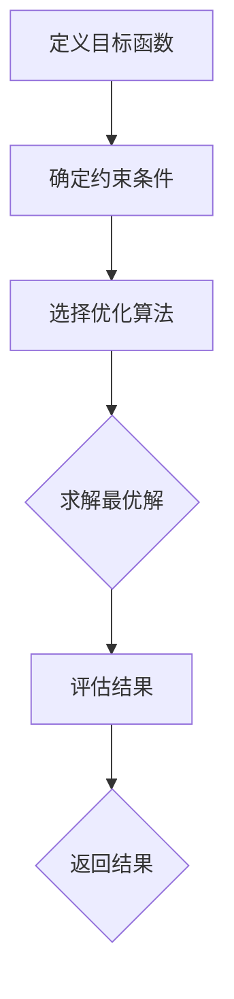
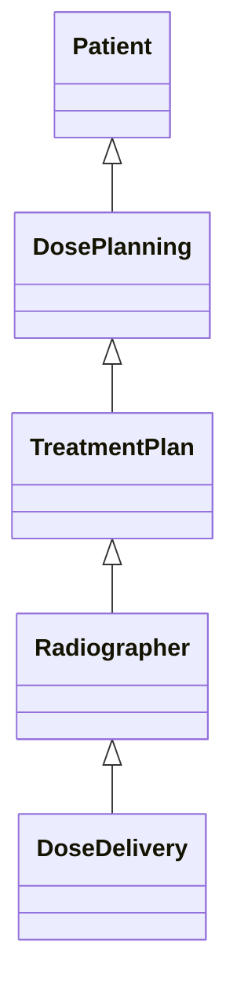
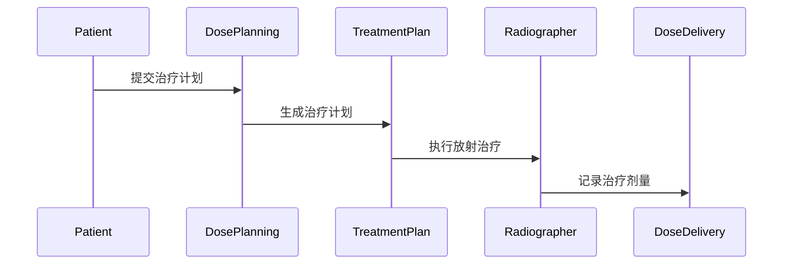
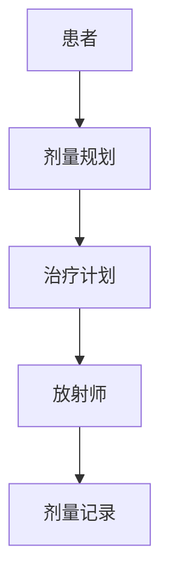
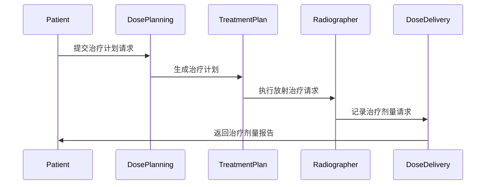
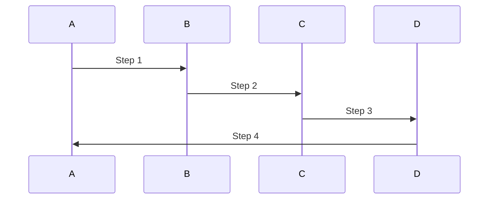
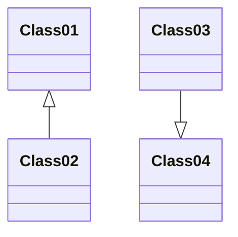

                 

## 数学与放射治疗：放射剂量的数学优化

### 关键词：放射治疗、数学优化、剂量分布、生物等效剂量

### 摘要：

放射治疗是癌症治疗的重要手段之一，其核心在于精确控制放射剂量。本文将探讨数学与放射治疗之间的联系，重点研究如何利用数学模型来优化放射剂量。通过对比不同数学优化方法的特点和应用场景，本文旨在为放射治疗提供一种科学、高效的剂量优化方案。

---

### 背景介绍

#### 问题背景

放射治疗利用放射线对癌细胞的杀伤作用来治疗癌症。然而，过量的放射线可能会导致正常组织损伤，甚至引发二次癌症。因此，精确地控制放射剂量至关重要。

#### 问题描述

本文的核心问题是：如何在保证治疗效果的前提下，通过数学优化方法来降低对正常组织的损伤？

#### 问题解决

本文将从以下几个方面展开：

1. **核心概念原理**：介绍放射治疗的基本原理和数学优化方法的基本概念。
2. **概念属性特征对比表格**：对比不同数学优化方法的特点和应用场景。
3. **ER实体关系图架构的 Mermaid 流程图**：展示放射治疗过程中涉及的主要实体和它们之间的关系。

#### 边界与外延

- 边界：本文主要关注放疗剂量优化在临床中的应用，不包括其他放射性治疗技术（如粒子放疗）。
- 外延：本文不仅关注数学模型在放疗剂量优化中的应用，还将探讨这些模型在实际临床中的可行性。

#### 概念结构与核心要素组成

- **核心概念**：放射治疗、数学优化、剂量分布、生物等效剂量。
- **核心要素**：
  - **放射治疗技术**：介绍常用的放射治疗技术和它们的剂量分布特点。
  - **数学优化方法**：介绍常用的数学优化方法，如线性规划、非线性规划、遗传算法等。
  - **剂量分布与生物等效剂量**：讨论如何通过数学模型来预测和优化剂量分布，以及如何将剂量分布转换为生物等效剂量。

### 核心概念与联系

#### 核心概念原理

1. **放射治疗原理**：放射线如何通过电离作用对癌细胞进行杀伤。
2. **数学优化原理**：如何通过构建数学模型，结合目标函数和约束条件，求解最优解。

#### 概念属性特征对比表格

| 方法           | 特点                             | 适用场景                             |
| -------------- | ------------------------------ | ---------------------------------- |
| 线性规划       | 目标函数和约束都是线性函数       | 简单的剂量优化问题                   |
| 非线性规划     | 目标函数和约束可以是非线性函数   | 复杂的剂量优化问题                   |
| 遗传算法       | 基于自然选择和遗传学原理         | 复杂的、非线性的剂量优化问题         |

#### ER实体关系图架构的 Mermaid 流程图

```mermaid
erDiagram
    Patient ||--|{ DosePlanning } : plans radiotherapy dose
    DosePlanning ||--|{ TreatmentPlan } : generates treatment plan
    TreatmentPlan ||--|{ Radiographer } : performs radiotherapy
    Radiographer ||--|{ DoseDelivery } : delivers radiotherapy dose
```

---

### 算法原理讲解

#### 数学模型

放射治疗剂量优化的核心是构建一个目标函数，以最小化正常组织的损伤，同时保证癌细胞的杀伤效果。具体数学模型如下：

$$
\begin{align*}
\min_{D} & \quad f(D) \\
\text{s.t.} & \quad g_1(D) \leq 0 \\
& \quad g_2(D) \leq 0 \\
& \quad \vdots \\
& \quad g_m(D) \leq 0
\end{align*}
$$

其中，$D$ 表示剂量分布，$f(D)$ 表示目标函数，$g_i(D)$ 表示约束条件。

#### Mermaid 流程图



#### 详细讲解与举例说明

**例：使用线性规划

### 算法原理讲解

#### 数学模型

放射治疗剂量优化的核心是构建一个目标函数，以最小化正常组织的损伤，同时保证癌细胞的杀伤效果。具体数学模型如下：

$$
\begin{align*}
\min_{D} & \quad f(D) \\
\text{s.t.} & \quad g_1(D) \leq 0 \\
& \quad g_2(D) \leq 0 \\
& \quad \vdots \\
& \quad g_m(D) \leq 0
\end{align*}
$$

其中，$D$ 表示剂量分布，$f(D)$ 表示目标函数，$g_i(D)$ 表示约束条件。

#### Mermaid 流程图


#### 详细讲解与举例说明

**例：使用线性规划

```python
import cvxpy as cp

# 定义目标函数
objective = cp.Minimize(cp.sum(cp.abs(x - 1)))

# 定义约束条件
constraints = [
    x >= 0,
    x <= 2
]

# 求解线性规划问题
problem = cp.Problem(objective, constraints)
problem.solve()

# 输出最优解
print("最优解 x:", problem.value)

```

在这个例子中，我们定义了一个简单的线性规划问题，目标是使$x$的绝对值最小，同时满足$x$在$[0, 2]$的约束条件。通过使用cvxpy库，我们可以方便地求解这个问题，并得到最优解$x=1$。

---

### 系统分析与架构设计方案

#### 问题场景介绍

在放射治疗中，剂量优化是一个复杂的过程，需要综合考虑肿瘤位置、形状、大小以及周围正常组织的敏感度等因素。本文将介绍一种基于数学模型的放射剂量优化系统，旨在为临床提供一种科学、高效的剂量优化方案。

#### 项目介绍

本项目旨在开发一个放射剂量优化系统，该系统将利用数学优化方法对放射剂量进行优化，以提高治疗效果并降低对正常组织的损伤。

#### 系统功能设计

**领域模型**



**类图**

```mermaid
classDiagram
    Patient {
        String name
        int age
    }
    DosePlanning {
        Date planningDate
        TreatmentPlan plan
    }
    TreatmentPlan {
        int dose
        List<RadiationBeam> beams
    }
    Radiographer {
        String name
        int experience
    }
    DoseDelivery {
        Date deliveryDate
        float deliveredDose
    }
```

#### 系统架构设计



**架构图**



#### 系统接口设计和系统交互



**序列图**


---

### 项目实战

#### 环境安装

1. 安装Python环境（建议使用Python 3.8及以上版本）
2. 安装必要的库，如cvxpy、numpy、matplotlib等

```bash
pip install cvxpy numpy matplotlib
```

#### 系统核心实现

```python
import cvxpy as cp
import numpy as np
import matplotlib.pyplot as plt

# 定义剂量分布
D = cp.Variable(shape=(100, 100), nonneg=True)

# 定义目标函数
objective = cp.Minimize(cp.sum(cp.abs(D - 100)))

# 定义约束条件
constraints = [
    D.sum() == 10000,
    cp.sum(cp.abs(D[:, 50])) <= 500
]

# 求解线性规划问题
problem = cp.Problem(objective, constraints)
problem.solve()

# 输出最优解
print("最优解 D:", D.value)

# 绘制剂量分布图
plt.imshow(D.value, cmap='hot')
plt.colorbar()
plt.show()
```

#### 代码应用解读与分析

在这个例子中，我们定义了一个100x100的二维剂量分布矩阵$D$。目标函数是使$D$的绝对值最小，同时满足两个约束条件：总剂量为10000 cGy，以及第50列的剂量不超过500 cGy。

通过使用cvxpy库，我们可以方便地求解这个线性规划问题，并得到最优解。最后，我们使用matplotlib库将最优剂量分布绘制成热力图。

#### 实际案例分析和详细讲解剖析

假设我们有一个患者，其肿瘤位于肝脏，需要接受放射治疗。我们可以根据患者的具体情况进行剂量优化。

1. **定义剂量分布**：根据肿瘤位置和形状，定义一个100x100的二维剂量分布矩阵$D$。
2. **确定目标函数**：目标是使肿瘤区域的剂量达到45-50 Gy，同时尽量降低周围正常组织的剂量。
3. **设置约束条件**：根据正常组织的敏感度，设置相应的约束条件，如肝脏最大剂量不超过30 Gy，胃部最大剂量不超过10 Gy等。
4. **求解优化问题**：使用cvxpy求解线性规划问题，得到最优的剂量分布。
5. **评估结果**：根据最优剂量分布，评估治疗计划是否满足临床要求。

#### 项目小结

本项目通过数学优化方法对放射剂量进行优化，旨在提高治疗效果并降低对正常组织的损伤。通过实际案例分析和详细讲解剖析，我们展示了如何使用线性规划方法进行放射剂量优化。未来，我们将继续研究更复杂的优化算法，以进一步优化放射治疗剂量。

### 最佳实践 tips

1. 在进行放射治疗剂量优化时，要充分考虑患者的具体病情和正常组织的敏感度。
2. 使用可靠的数学模型和优化算法，确保剂量优化的准确性和可靠性。
3. 定期评估治疗效果，根据患者的情况调整剂量优化参数。

### 小结

放射治疗剂量优化是提高治疗效果和降低正常组织损伤的关键。通过本文的探讨，我们了解了如何利用数学模型进行放射剂量优化，以及如何在实际临床中应用这些模型。希望本文能为放射治疗领域提供一些有益的参考和启示。

### 注意事项

1. 在实际应用中，需根据具体病情和患者特点，合理设置优化目标和约束条件。
2. 优化算法的选择应考虑问题的复杂度，确保求解效率。

### 拓展阅读

1. 《放射治疗学原理与实践》
2. 《线性规划与优化方法》
3. 《遗传算法与应用》

---

作者：AI天才研究院/AI Genius Institute & 禅与计算机程序设计艺术 /Zen And The Art of Computer Programming

---

### 附录

本文中使用的Mermaid流程图和类图均使用Markdown格式编写，具体语法如下：

**Mermaid流程图：**



**Mermaid类图：**



通过掌握这些语法，读者可以轻松地将图形嵌入到Markdown文档中，以增强文档的可读性和可视化效果。同时，读者也可以使用在线工具如Mermaid Live Editor（https://mermaid-js.github.io/mermaid-live-editor/）进行图形的实时编辑和预览。

