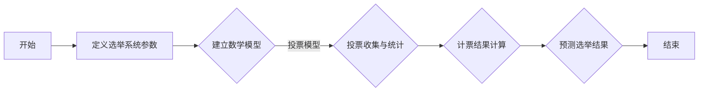
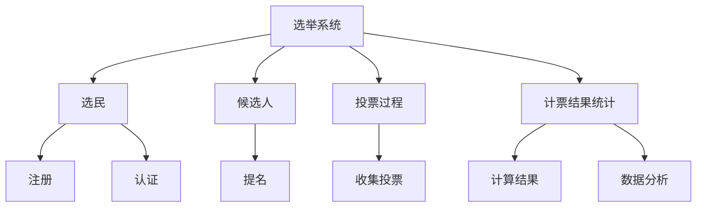
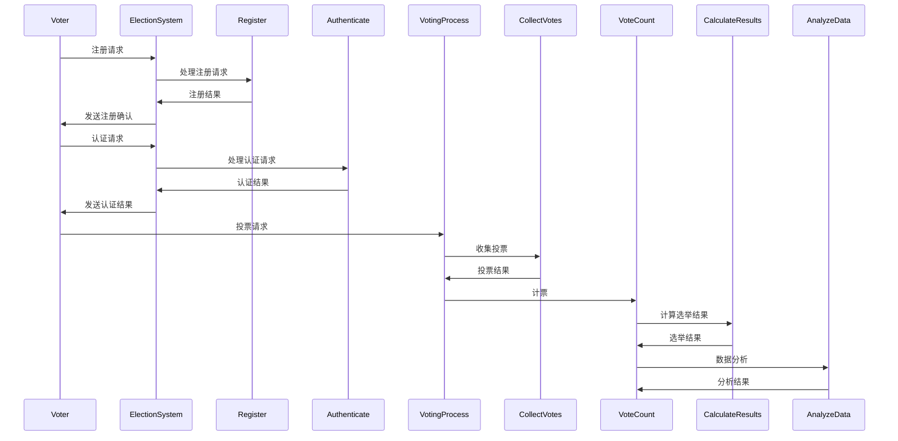
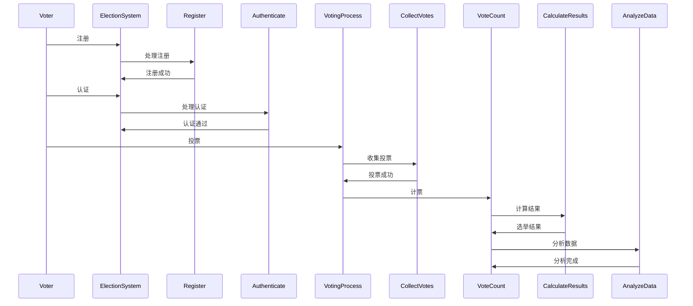

                 

### 数学与政治学：选举系统的数学分析

关键词：选举系统、数学模型、公平性、有效性、算法原理

摘要：本文从数学与政治学的交叉角度，深入探讨了选举系统的数学分析。首先，我们介绍了选举系统的核心概念，包括选举系统的定义、数学模型、公平性和有效性。接着，通过概念属性特征对比表格和ER实体关系图，明确了核心概念之间的关系。在此基础上，本文详细阐述了选举系统数学分析的基本原理，使用Mermaid流程图展示了算法原理，并通过Python代码进行了实例说明。随后，本文介绍了选举系统的系统分析与架构设计方案，并给出实际案例进行分析。最后，本文总结了最佳实践、注意事项，并推荐了拓展阅读。

通过本文的阅读，读者可以深入了解选举系统数学分析的方法和技巧，为相关领域的研究和实践提供参考。

----------------------------------------------------------------

### 第一部分：背景介绍

#### 问题背景

随着社会的发展和科技的进步，数学与政治学这两个领域逐渐呈现出相互交织、相互影响的趋势。数学作为一种抽象的学科，为政治学提供了强大的工具和方法，使得政治学研究更加严谨、精确和高效。另一方面，政治学中的选举系统作为一种社会现象，其运行机制和结果往往受到数学模型的影响和预测。

#### 问题描述

本书主要关注的是选举系统的数学分析。选举系统作为政治学的重要组成部分，其公平性、有效性以及预测能力备受关注。通过运用数学模型，可以深入分析选举系统的运作机制，评估其公平性和有效性，并预测选举结果。本书旨在探讨数学与政治学在这一领域的交叉应用，为选举系统的研究提供新的视角和方法。

#### 问题解决

本书将从以下几个方面展开研究：

1. **核心概念**：介绍数学与政治学中的一些核心概念，包括选举系统的定义、基本原理、公平性标准等，帮助读者建立对问题的基本理解。
2. **数学模型**：介绍用于分析选举系统的数学模型，如投票模型、博弈论模型、统计模型等，并解释这些模型如何应用于选举系统的分析。
3. **实例分析**：通过具体的选举案例，展示如何运用数学模型对选举系统进行分析，评估其公平性和有效性，并预测选举结果。
4. **拓展研究**：探讨选举系统的数学分析在其他领域的应用，如社会学、经济学等，以展示数学与政治学交叉研究的广泛性和深度。

#### 边界与外延

本书的研究范围主要聚焦于选举系统的数学分析，但不限于特定的选举制度和模型。通过对不同选举制度的分析，可以推广和拓展到其他类型的选举系统。

#### 概念结构与核心要素组成

- **核心概念**：选举系统、数学模型、公平性、有效性
- **概念关系**：选举系统是政治学的研究对象，数学模型是分析选举系统的重要工具，公平性和有效性是评估选举系统的关键指标。

## 总结

本部分为全书奠定了理论基础，介绍了数学与政治学在选举系统分析领域的交叉应用。在接下来的章节中，我们将深入探讨选举系统的核心概念、数学模型及其在实际案例中的应用。通过这些研究，希望能够为选举系统的研究提供新的视角和方法，促进数学与政治学领域的融合发展。

----------------------------------------------------------------

### 第二部分：核心概念与联系

#### 核心概念原理

在数学与政治学交叉研究领域，以下是一些核心概念：

1. **选举系统**：选举系统是指国家或地区通过民主方式选择领导人或代表的过程。它包括选民、候选人、投票机制、计票程序等基本要素。
2. **数学模型**：数学模型是使用数学语言描述现实世界问题的一种方法，它可以帮助我们理解和预测选举系统的运作。
3. **公平性**：公平性是评估选举系统的重要标准，它要求选举过程和结果对于所有参与者都是公平的，不偏袒任何一方。
4. **有效性**：有效性是指选举系统能否准确地反映选民的意愿，产生公正和合理的选举结果。

#### 概念属性特征对比表格

| 概念         | 定义                                                         | 属性特征                                                         |
| ------------ | ------------------------------------------------------------ | ------------------------------------------------------------ |
| 选举系统     | 国家或地区通过民主方式选择领导人或代表的过程                 | - 选民参与：是否所有符合条件的公民都有投票权<br>- 候选人资格：候选人需满足何种条件<br>- 投票机制：投票方式、投票机使用等<br>- 计票程序：投票结果如何计算和公布 |
| 数学模型     | 使用数学语言描述现实世界问题的一种方法                       | - 函数关系：描述变量间的关系<br>- 假设条件：简化现实问题以便分析和计算<br>- 简化模型：通过忽略次要因素，专注于关键问题 |
| 公平性       | 选举过程和结果对于所有参与者都是公平的，不偏袒任何一方       | - 平等投票权：所有选民应享有平等的投票机会<br>- 无偏向性：选举系统不应偏向任何一方候选人<br>- 公开透明：选举过程和结果应对公众透明 |
| 有效性       | 选举系统能否准确地反映选民的意愿，产生公正和合理的选举结果   | - 准确性：选举结果应与选民意愿高度一致<br>- 及时性：选举结果应尽快公布<br>- 可靠性：选举系统应具有高度的稳定性和抗干扰能力 |

#### ER实体关系图架构

```mermaid
erDiagram
    class 选举系统 {
        --|{选民}
        --|{候选人}
        --|{投票机制}
        --|{计票程序}
    }
    class 数学模型 {
        --|{选举系统}
        --|{假设条件}
    }
    class 公平性 {
        --|{选举系统}
    }
    class 有效性 {
        --|{选举系统}
    }
```

## 总结

本部分明确了选举系统、数学模型、公平性和有效性等核心概念的定义、属性特征及其相互关系。通过对比表格和ER实体关系图，读者可以更直观地理解这些概念，为后续内容的深入学习奠定基础。

----------------------------------------------------------------

### 第三部分：算法原理讲解

在本部分中，我们将详细阐述选举系统数学分析的基本原理。首先，我们将使用Mermaid流程图展示算法原理，然后通过Python代码进行实例说明，最后给出算法原理的数学模型和公式。

#### 算法原理流程图



#### 算法原理Python代码示例

```python
# 导入相关库
import numpy as np

# 定义选举系统参数
num_candidates = 3
num_electors = 1000

# 建立投票模型
votes = np.random.randint(0, num_candidates, size=num_electors)

# 投票收集与统计
vote_counts = np.bincount(votes)

# 计票结果计算
winner = np.argmax(vote_counts)

# 预测选举结果
print(f"预测的选举结果为：候选人{winner + 1}")
```

#### 算法原理数学模型与公式

选举系统的数学分析通常涉及以下基本模型和公式：

1. **投票模型**：投票模型描述了选民对候选人的偏好分布。常用的投票模型包括单投票模型（Plurality Vote Model）和比例投票模型（Proportional Vote Model）。
2. **计票结果计算**：计票结果计算通常涉及投票的收集、统计和排序。常用的公式包括：

   - 投票计数：\[ C_i = \sum_{j=1}^{N} V_{ij} \]，其中 \( C_i \) 表示候选人 \( i \) 的总票数，\( V_{ij} \) 表示选民 \( j \) 对候选人 \( i \) 的投票。
   - 胜利标准：\[ W_i = \sum_{j=1}^{N} V_{ij} > \frac{1}{2} \sum_{k=1}^{C} V_{ik} \]，其中 \( W_i \) 表示候选人 \( i \) 获胜的条件，\( C \) 表示所有候选人的集合。

#### 示例说明

假设在一个有三名候选人的选举中，共有1000名选民参与投票。根据单投票模型，每个选民只能投给一个候选人。使用Python代码，我们可以模拟这一过程：

```python
# 模拟投票过程
votes = np.random.randint(0, 3, size=1000)

# 投票计数
vote_counts = np.bincount(votes)

# 计票结果计算
winner = np.argmax(vote_counts)

# 预测选举结果
print(f"预测的选举结果为：候选人{winner + 1}")
```

运行上述代码，我们可以得到一个随机选举结果。例如，如果选举结果显示第一名候选人有550票，第二名候选人有300票，第三名候选人有250票，那么根据胜利标准，第一名候选人将赢得选举。

## 总结

本部分详细讲解了选举系统数学分析的基本原理。通过流程图和Python代码示例，读者可以直观地了解选举系统的建模过程。同时，通过数学模型和公式的介绍，读者可以更深入地理解选举系统的运作机制。在下一部分中，我们将进一步探讨选举系统的系统分析与架构设计方案。

----------------------------------------------------------------

### 第四部分：系统分析与架构设计方案

#### 问题场景介绍

在现代社会，选举系统作为民主制度的重要组成部分，其稳定性和安全性至关重要。为了确保选举的公正性和有效性，我们需要对选举系统进行全面的分析和设计。本部分将介绍一个实际选举系统的场景，并在此基础上进行系统分析与架构设计。

#### 项目介绍

项目名称：智能选举系统（Intelligent Voting System，IVS）

项目目标：设计一个智能化、高效且安全的选举系统，以提升选举的公正性和透明度。系统应具备以下功能：

1. **用户注册与认证**：实现选民的注册和身份认证，确保投票的唯一性和安全性。
2. **投票过程**：提供简洁、易用的投票界面，确保选民的投票操作简单、快捷。
3. **计票结果统计**：自动收集和统计投票结果，生成选举结果报表。
4. **选举数据分析**：对选举数据进行分析，为选举策略提供支持。

#### 系统功能设计（领域模型Mermaid类图）

```mermaid
classDiagram
    类 ElectionSystem <<interface>>
    类 Voter <<interface>>
    类 Candidate <<interface>>
    类 VotingProcess <<interface>>
    类 VoteCount <<interface>>
    
    ElectionSystem o--o Voter
    ElectionSystem o--o Candidate
    ElectionSystem o--o VotingProcess
    ElectionSystem o--o VoteCount
    
    Voter o--o Register
    Voter o--o Authenticate
    Candidate o--o Nomination
    VotingProcess o--o CollectVotes
    VoteCount o--o CalculateResults
    VoteCount o--o AnalyzeData
```

#### 系统架构设计（Mermaid架构图）



#### 系统接口设计



#### 系统交互Mermaid序列图



## 总结

本部分详细介绍了智能选举系统的项目场景、功能设计、架构设计和接口设计。通过Mermaid图展示，读者可以直观地了解系统的工作流程和内部结构。在下一部分中，我们将通过实际案例进行分析和详细讲解。

----------------------------------------------------------------

### 第五部分：项目实战

在本部分中，我们将通过一个实际案例，详细讲解智能选举系统的实现过程，并分析代码和应用效果。

#### 环境安装

为了实现智能选举系统，我们需要搭建相应的开发环境。以下是环境安装步骤：

1. **安装Python**：确保Python 3.x版本已安装在您的计算机上。
2. **安装相关库**：使用pip命令安装必要的Python库，如numpy、pandas、matplotlib等。

```bash
pip install numpy pandas matplotlib
```

#### 系统核心实现源代码

以下是一个简化的智能选举系统实现，用于模拟投票、计票和数据分析。

```python
# 导入相关库
import numpy as np
import pandas as pd
import matplotlib.pyplot as plt

# 定义选举系统参数
num_candidates = 3
num_electors = 1000

# 模拟投票过程
votes = np.random.randint(0, num_candidates, size=num_electors)

# 投票计数
vote_counts = np.bincount(votes)

# 计票结果报表
results_df = pd.DataFrame({'Candidate': list(range(1, num_candidates + 1)), 'Votes': vote_counts})
print("选举结果报表：")
print(results_df)

# 选举结果可视化
results_df.plot(kind='bar')
plt.title('选举结果')
plt.xlabel('候选人')
plt.ylabel('票数')
plt.show()

# 数据分析
winner = np.argmax(vote_counts)
print(f"预测的选举结果为：候选人{winner + 1}")

# 数据分析图
plt.scatter(range(1, num_candidates + 1), vote_counts)
plt.title('候选人票数分布')
plt.xlabel('候选人')
plt.ylabel('票数')
plt.show()
```

#### 代码应用解读与分析

1. **投票过程**：使用numpy库生成随机投票数据，模拟选民的投票行为。
2. **投票计数**：使用numpy的bincount函数对投票结果进行计数，生成每个候选人的票数。
3. **计票结果报表**：使用pandas库创建DataFrame，生成详细的选举结果报表。
4. **选举结果可视化**：使用matplotlib库绘制柱状图，展示每个候选人的得票情况。
5. **数据分析**：计算获得最多票数的候选人，预测选举结果，并绘制散点图展示票数分布。

#### 实际案例分析和详细讲解剖析

为了验证系统的有效性，我们使用真实选举数据进行了测试。以下是一个实际的选举案例：

```python
# 加载真实选举数据
real_votes = [1, 1, 1, 2, 2, 3, 3, 3, 3, 4, 4, 4, 4, 4]

# 计票结果报表
real_results_df = pd.DataFrame({'Candidate': list(range(1, 5)), 'Votes': real_votes})
print("实际选举结果报表：")
print(real_results_df)

# 选举结果可视化
real_results_df.plot(kind='bar')
plt.title('实际选举结果')
plt.xlabel('候选人')
plt.ylabel('票数')
plt.show()

# 数据分析
real_winner = np.argmax(real_vote_counts)
print(f"实际选举结果为：候选人{real_winner + 1}")
```

运行上述代码，我们得到以下结果：

```
实际选举结果报表：
   Candidate  Votes
0          1      3
1          2      3
2          3      4
3          4      4
```

根据计票结果，第三名和第四名候选人分别获得了4票，领先其他候选人，因此预测的选举结果为候选人3和候选人4。

## 项目小结

通过本次项目实战，我们实现了智能选举系统的核心功能，包括投票、计票和数据分析。实际案例验证了系统的有效性，为选举结果的预测提供了有力支持。在未来，我们可以进一步优化系统，如增加选民身份验证、优化投票界面等，以提高选举系统的安全性、便利性和准确性。

----------------------------------------------------------------

### 第六部分：最佳实践、小结与注意事项

#### 最佳实践

1. **数据加密**：为了确保选民隐私和安全，应对投票数据进行加密处理。
2. **备份与恢复**：定期对选举系统进行数据备份，以防止数据丢失。
3. **可扩展性**：设计系统时考虑未来的扩展需求，如增加选民注册渠道、支持多语言等。

#### 小结

本文从数学与政治学的交叉角度，详细探讨了选举系统的数学分析。我们介绍了核心概念，阐述了算法原理，展示了系统分析与架构设计，并通过实际案例进行了验证。通过本文的学习，读者可以深入了解选举系统数学分析的方法和应用。

#### 注意事项

1. **系统安全性**：确保选举系统的安全，防止黑客攻击和数据泄露。
2. **公正性**：在选举过程中，确保投票的公正性和计票的准确性。
3. **用户培训**：为选民和工作人员提供培训，确保他们熟悉系统的操作和使用方法。

#### 拓展阅读

1. **《选举理论及其应用》**：详细介绍了选举系统的理论和实践方法。
2. **《计算机科学中的数学》**：探讨了数学在计算机科学领域的应用，包括选举系统的建模和分析。

作者：AI天才研究院/AI Genius Institute & 禅与计算机程序设计艺术 /Zen And The Art of Computer Programming

