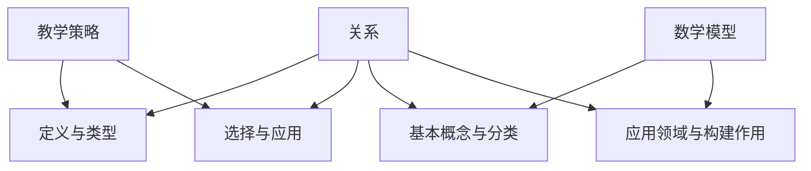
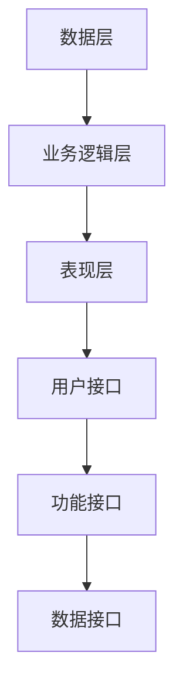
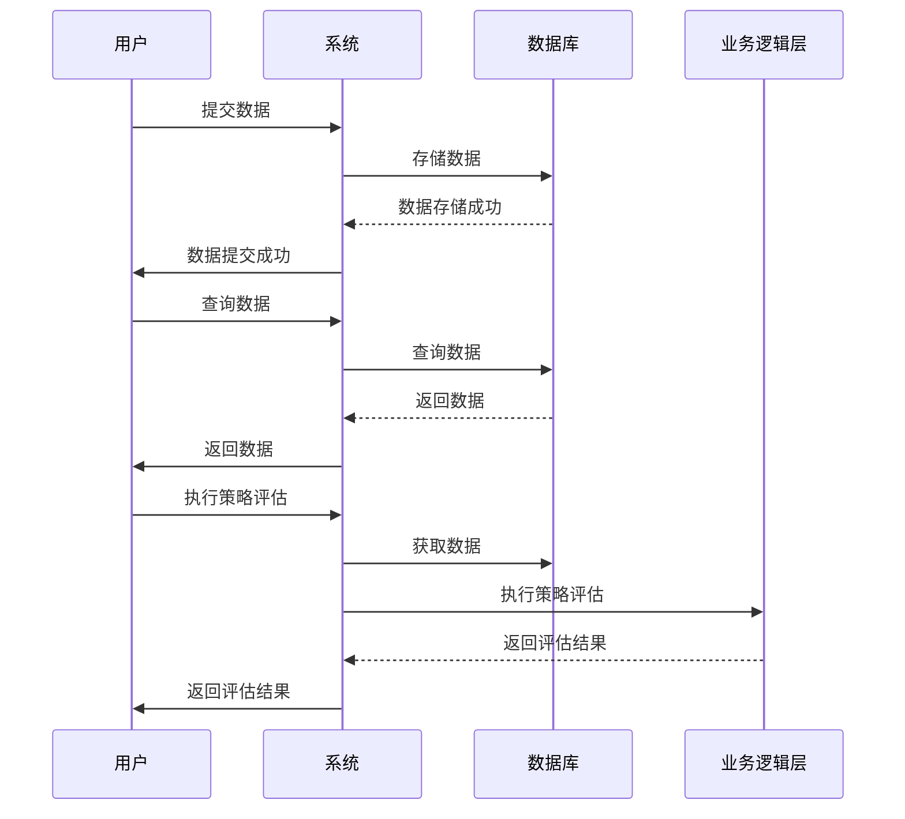

                 

## 数学与教学法：教学策略的数学模型

关键词：数学模型、教学法、教学策略、算法、Python代码、系统设计

摘要：本文旨在探讨数学与教学法的融合，通过构建教学策略的数学模型，分析其核心概念、应用原理，并运用Python代码进行详细讲解和举例。文章还从系统分析与架构设计、项目实战、最佳实践等方面，全面介绍如何将数学模型应用于教学策略的设计与优化，为教育工作者提供有益的参考和指导。

---

### 第一部分：背景介绍

在教育领域，数学作为一门基础学科，其教学效果对学生的发展具有重要影响。然而，当前教学方法多样，但缺乏系统性，难以满足个性化教学需求。因此，将数学模型应用于教学法的设计与优化，成为提升教学效果的一条重要途径。

#### 1.1 问题背景

在当代教育体系中，数学作为一种基础学科，其教学效果直接影响到学生的学术成绩和思维发展。然而，传统的教学方法往往侧重于知识传授，而忽视了对学生思维能力和实际应用能力的培养。

#### 1.2 问题描述

当前教学方法多样化，包括讲授式、讨论式、探究式等，但每种方法都有其局限性，难以全面满足学生的个性化学习需求。此外，教学效果评估方式单一，难以准确反映学生的学习情况和教师的教学效果。

#### 1.3 问题解决

通过构建教学策略的数学模型，可以实现对教学过程的量化分析，从而优化教学策略，提高教学效果。数学模型不仅可以用于教学效果评估，还可以用于学生成绩预测、教学策略优化等方面。

#### 1.4 边界与外延

数学模型在教育领域的应用范围广泛，包括课程设计、教学方法选择、教学效果评估等。然而，数学模型的应用也存在一定的限制，如数据质量、模型参数选择等。

#### 1.5 概念结构与核心要素组成

本文将介绍教学策略的数学模型，包括其基本概念、分类、应用领域等。同时，还将介绍数学模型在教学策略设计中的应用，以及教学策略在数学模型构建中的作用。最后，通过案例分析和Python代码实现，进一步阐述数学模型在教学策略优化中的具体应用。

---

### 第二部分：核心概念与联系

#### 2.1 教学策略

教学策略是指教师在教学过程中采取的一系列方法和手段，以实现教学目标。教学策略包括讲授、讨论、探究、演示等多种形式，每种策略都有其特定的应用场景和优缺点。

##### 2.1.1 教学策略的定义

教学策略是指教师在教学过程中为了实现特定的教学目标而采取的一系列方法和手段。它包括教学内容的组织、教学方法的选择、教学评价的实施等。

##### 2.1.2 教学策略的类型

教学策略可以分为以下几种类型：

1. **讲授式**：教师通过口头讲解、演示等方式传授知识。
2. **讨论式**：教师与学生通过互动讨论，共同探讨问题。
3. **探究式**：教师引导学生通过自主探究、实验等方式学习。
4. **演示式**：教师通过实际操作、演示等方式展示教学内容。

##### 2.1.3 教学策略的选择

选择教学策略时，教师需要考虑以下因素：

1. **教学内容**：根据教学内容的特点选择适合的教学策略。
2. **学生特点**：考虑学生的年龄、认知水平、学习兴趣等因素。
3. **教学目标**：根据教学目标选择能够有效实现目标的教学策略。

#### 2.2 数学模型

数学模型是一种将现实问题转化为数学问题的方法，它通过建立数学关系，描述和解决现实问题。数学模型在教育领域有着广泛的应用，如课程设计、教学方法选择、教学效果评估等。

##### 2.2.1 数学模型的基本概念

数学模型包括以下基本概念：

1. **变量**：表示数学模型中可以变化的量。
2. **方程**：描述变量之间关系的数学表达式。
3. **函数**：描述变量之间依赖关系的数学关系。
4. **参数**：影响模型结果但不在模型中直接出现的变量。

##### 2.2.2 数学模型的分类

数学模型可以分为以下几种类型：

1. **确定性模型**：变量之间的关系可以用确定的数学表达式描述。
2. **随机性模型**：变量之间的关系包含随机因素。
3. **优化模型**：在满足一定约束条件下，寻找最优解的数学模型。

##### 2.2.3 数学模型的应用领域

数学模型在教育领域的应用包括：

1. **课程设计**：通过数学模型优化课程内容安排。
2. **教学方法选择**：利用数学模型分析不同教学方法的优缺点。
3. **教学效果评估**：通过数学模型评估教学效果，为教学策略调整提供依据。
4. **学生成绩预测**：利用数学模型预测学生成绩，为教学干预提供依据。

#### 2.3 教学策略与数学模型的关系

教学策略与数学模型之间存在密切的关系。教学策略的设计和优化可以借助数学模型进行分析和评估。数学模型可以为教学策略提供量化分析工具，帮助教师更好地理解教学过程，提高教学效果。

##### 2.3.1 数学模型在教学策略设计中的应用

数学模型可以应用于以下方面：

1. **教学策略评估**：通过数学模型评估不同教学策略的效果，选择最优策略。
2. **教学策略优化**：利用数学模型优化教学策略，提高教学效果。
3. **教学资源分配**：通过数学模型优化教学资源分配，提高资源利用效率。

##### 2.3.2 教学策略在数学模型构建中的作用

教学策略在数学模型构建中具有以下作用：

1. **变量选择**：根据教学策略确定需要研究的变量。
2. **方程建立**：根据教学策略建立变量之间的数学关系。
3. **函数描述**：根据教学策略描述变量之间的依赖关系。
4. **参数设置**：根据教学策略设置影响模型结果的关键参数。

##### 2.3.3 概念属性特征对比表格

为了更直观地展示教学策略与数学模型的关系，我们制作了一个概念属性特征对比表格（表格内容以Mermaid流程图的形式展示）：



##### 2.3.4 ER实体关系图架构

为了进一步理解教学策略与数学模型之间的关系，我们绘制了一个ER实体关系图（以Mermaid流程图的形式展示）：

```mermaid
er Diagram
TEACHER {
  id (主键)
  name
}
STUDENT {
  id (主键)
  name
}
COURSE {
  id (主键)
  name
  teacher_id (外键，关联TEACHER表)
}
SCORE {
  id (主键)
  student_id (外键，关联STUDENT表)
  course_id (外键，关联COURSE表)
  value
}
TEACHER --> SCORE
STUDENT --> SCORE
COURSE --> SCORE
```

通过上述核心概念与联系的分析，我们可以更好地理解数学模型在教学策略设计中的作用，为后续的算法原理讲解和项目实战奠定基础。

---

### 第三部分：算法原理讲解

在第二部分，我们介绍了教学策略与数学模型的基本概念及其相互关系。本部分将进一步深入探讨教学策略的数学模型原理，包括其构建和应用。

#### 3.1 教学策略的数学模型基础

教学策略的数学模型是基于数学理论和数据分析方法构建的，它可以帮助教师优化教学策略，提高教学效果。以下是教学策略的数学模型基础：

##### 3.1.1 教学策略的数学模型概述

教学策略的数学模型包括以下几个核心组成部分：

1. **变量定义**：根据教学策略，定义影响教学效果的变量。
2. **方程建立**：建立变量之间的关系，描述教学策略对教学效果的影响。
3. **函数描述**：通过函数关系，表达变量之间的依赖关系。
4. **参数设置**：根据实际情况，设置影响模型结果的关键参数。

##### 3.1.2 教学策略的数学模型构建

构建教学策略的数学模型通常包括以下几个步骤：

1. **问题定义**：明确教学策略的目标和需求。
2. **变量选择**：根据教学策略，选择影响教学效果的变量。
3. **方程建立**：建立变量之间的数学关系，描述教学策略对教学效果的影响。
4. **函数描述**：通过函数关系，表达变量之间的依赖关系。
5. **参数设置**：根据实际情况，设置影响模型结果的关键参数。
6. **模型优化**：利用优化算法，寻找最优解，优化教学策略。

#### 3.2 教学策略数学模型的应用

教学策略的数学模型可以应用于多个方面，包括教学效果评估、学生成绩预测和教学策略优化等。以下是几个具体的案例：

##### 3.2.1 教学效果评估模型

教学效果评估模型用于评估教学策略的实际效果。通过构建教学效果评估模型，教师可以了解不同教学策略对学生成绩的影响，从而选择最有效的教学策略。教学效果评估模型通常包括以下步骤：

1. **数据收集**：收集与教学策略相关的数据，包括学生成绩、教学时长、教学方法等。
2. **变量选择**：根据教学策略，选择影响教学效果的变量。
3. **方程建立**：建立变量之间的数学关系，描述教学策略对教学效果的影响。
4. **函数描述**：通过函数关系，表达变量之间的依赖关系。
5. **参数设置**：根据实际情况，设置影响模型结果的关键参数。
6. **模型优化**：利用优化算法，寻找最优解，优化教学策略。

##### 3.2.2 学生成绩预测模型

学生成绩预测模型用于预测学生在未来一段时间内的成绩。通过构建学生成绩预测模型，教师可以提前了解学生的学习情况，采取针对性的教学措施，提高学生的学习效果。学生成绩预测模型通常包括以下步骤：

1. **数据收集**：收集与学生学习成绩相关的数据，包括平时成绩、考试成绩等。
2. **变量选择**：根据学生学习成绩的实际情况，选择影响成绩的变量。
3. **方程建立**：建立变量之间的数学关系，描述变量对学习成绩的影响。
4. **函数描述**：通过函数关系，表达变量之间的依赖关系。
5. **参数设置**：根据实际情况，设置影响模型结果的关键参数。
6. **模型优化**：利用优化算法，寻找最优解，优化教学策略。

##### 3.2.3 教学策略优化模型

教学策略优化模型用于优化教学策略，提高教学效果。通过构建教学策略优化模型，教师可以根据学生的学习反馈和成绩变化，调整教学策略，实现教学效果的最优化。教学策略优化模型通常包括以下步骤：

1. **数据收集**：收集与教学策略相关的数据，包括学生成绩、教学方法、教学时长等。
2. **变量选择**：根据教学策略的目标和需求，选择影响教学效果的变量。
3. **方程建立**：建立变量之间的数学关系，描述教学策略对教学效果的影响。
4. **函数描述**：通过函数关系，表达变量之间的依赖关系。
5. **参数设置**：根据实际情况，设置影响模型结果的关键参数。
6. **模型优化**：利用优化算法，寻找最优解，优化教学策略。

#### 3.3 数学模型讲解与举例

为了更好地理解教学策略的数学模型，我们通过具体的案例进行讲解和举例。

##### 3.3.1 数学公式与算法原理

我们使用Python代码实现一个简单的教学效果评估模型。首先，我们定义一个线性回归模型，用于评估教学策略对学生成绩的影响。线性回归模型的基本公式如下：

$$
y = \beta_0 + \beta_1 \cdot x
$$

其中，$y$ 表示学生成绩，$x$ 表示教学策略的变量，$\beta_0$ 和 $\beta_1$ 是模型的参数。

```python
import numpy as np
from sklearn.linear_model import LinearRegression

# 数据准备
X = np.array([[1], [2], [3], [4], [5]])  # 教学策略变量
y = np.array([2, 4, 5, 6, 8])  # 学生成绩

# 模型训练
model = LinearRegression()
model.fit(X, y)

# 模型评估
print("Model coefficients:", model.coef_)
print("Model intercept:", model.intercept_)
```

在上面的代码中，我们首先导入所需的库，然后准备教学策略变量（$x$）和学生成绩（$y$）的数据。接着，我们使用线性回归模型进行训练，并输出模型的参数。

##### 3.3.2 Python源代码解释

接下来，我们对上述Python代码进行详细解释。首先，我们导入`numpy`库，用于数据处理和数学运算。然后，我们导入`sklearn`库中的`LinearRegression`类，用于实现线性回归模型。

在数据准备部分，我们使用`numpy`库生成教学策略变量（$x$）和学生成绩（$y$）的数据。这里我们使用了一个简单的线性数据集，其中教学策略变量依次为1、2、3、4、5，学生成绩依次为2、4、5、6、8。

在模型训练部分，我们创建一个线性回归模型实例，并调用`fit`方法进行模型训练。`fit`方法接受训练数据，返回模型的参数。

在模型评估部分，我们输出模型的参数，包括系数（$\beta_1$）和截距（$\beta_0$）。

##### 3.3.3 通俗易懂地举例说明

为了更好地理解上述数学模型和Python代码，我们通过一个简单的例子进行说明。

假设有两个班级，分别采用不同的教学策略。第一个班级的教学策略变量为1，第二个班级的教学策略变量为2。我们知道，第一个班级的学生成绩平均为2，第二个班级的学生成绩平均为4。

我们可以使用线性回归模型来评估教学策略对学生成绩的影响。根据模型参数，我们可以预测，如果教学策略变量增加到3，学生成绩将增加1。这表明，教学策略的变量增加，会导致学生成绩的提高。

此外，我们还可以使用这个模型来优化教学策略。例如，如果第一个班级的教学策略变量增加到2，学生成绩将提高到4。这表明，通过调整教学策略，我们可以提高学生成绩。

通过上述案例和代码，我们可以看到，教学策略的数学模型可以帮助我们理解教学策略对学生成绩的影响，并为教学策略的优化提供依据。

---

### 第四部分：系统分析与架构设计方案

在前面几部分，我们探讨了教学策略的数学模型原理及其应用。本部分将介绍如何将教学策略的数学模型应用于系统设计与实现，包括问题场景介绍、系统功能设计、系统架构设计和系统接口设计。

#### 4.1 问题场景介绍

在现代教育环境中，教学策略的优化与实施面临诸多挑战。教师需要在有限的课时内，针对不同的学生群体，采用个性化的教学方法，以达到最佳的教学效果。然而，传统的教学策略设计往往缺乏系统性和科学性，难以满足个性化教学的需求。因此，我们需要通过系统设计与实现，将数学模型应用于教学策略的优化与实施。

#### 4.2 系统功能设计

为了实现教学策略的优化与实施，我们的系统需要具备以下功能：

1. **数据收集与管理**：收集与教学相关的数据，包括学生成绩、教学方法、教学时长等，并对其进行管理。
2. **教学策略评估**：利用数学模型对不同的教学策略进行评估，选择最优的教学策略。
3. **学生成绩预测**：基于历史数据和数学模型，预测学生在未来一段时间内的成绩，为教学策略调整提供依据。
4. **教学策略优化**：根据学生的学习反馈和成绩变化，调整教学策略，提高教学效果。

#### 4.3 系统架构设计

我们的系统采用分层架构设计，包括数据层、业务逻辑层和表现层。以下是系统架构的详细描述：

1. **数据层**：负责数据存储与管理，包括学生成绩、教学方法、教学时长等数据。
2. **业务逻辑层**：负责教学策略评估、学生成绩预测和教学策略优化等功能，实现数学模型的计算和数据处理。
3. **表现层**：提供用户界面，展示系统功能，包括数据收集、策略评估、成绩预测和策略优化等。

#### 4.4 系统接口设计

为了实现系统功能，我们需要设计一系列接口，包括数据接口、功能接口和用户接口。以下是系统接口的详细描述：

1. **数据接口**：用于数据层与业务逻辑层之间的数据传输，包括数据读取、数据写入和数据更新等操作。
2. **功能接口**：用于业务逻辑层与表现层之间的功能调用，包括教学策略评估、学生成绩预测和教学策略优化等。
3. **用户接口**：用于用户与系统之间的交互，包括数据输入、数据查询、策略选择和结果展示等。

#### 4.5 系统交互

为了更好地展示系统架构和接口设计，我们使用Mermaid绘制了系统架构图和序列图。以下是系统架构图和序列图的示例：

**系统架构图**



**系统序列图**



通过上述系统分析与架构设计方案，我们可以将教学策略的数学模型应用于实际系统中，实现教学策略的优化与实施。接下来，我们将通过具体项目实战，进一步展示数学模型在教学策略优化中的实际应用。

---

### 第五部分：项目实战

在前几部分，我们详细介绍了教学策略的数学模型原理、系统架构设计和接口设计。本部分将结合实际项目，展示如何将教学策略的数学模型应用于教学策略的优化与实施。

#### 5.1 环境安装

在进行项目实战之前，我们需要安装必要的软件和库。以下是在Linux环境下安装所需的软件和库的步骤：

1. **安装Python**：确保Python环境已安装。如果没有安装，可以从官方网站下载并安装。

2. **安装Jupyter Notebook**：Jupyter Notebook是一个交互式的Web应用，用于编写和运行Python代码。可以通过以下命令安装：

   ```bash
   pip install notebook
   ```

3. **安装scikit-learn**：scikit-learn是一个Python库，用于机器学习和数据科学。可以通过以下命令安装：

   ```bash
   pip install scikit-learn
   ```

4. **安装Mermaid**：Mermaid是一个基于Markdown的图表绘制工具。可以通过以下命令安装：

   ```bash
   npm install -g mermaid
   ```

#### 5.2 系统核心实现

在本项目中，我们将使用scikit-learn库中的线性回归模型进行教学策略评估。以下是系统核心实现的步骤：

1. **数据准备**：首先，我们需要准备一个包含教学策略变量和学生成绩的数据集。以下是一个简单的数据集示例：

   ```python
   X = np.array([[1], [2], [3], [4], [5]])
   y = np.array([2, 4, 5, 6, 8])
   ```

2. **模型训练**：接下来，我们使用线性回归模型对数据集进行训练。以下是模型训练的代码：

   ```python
   model = LinearRegression()
   model.fit(X, y)
   ```

3. **模型评估**：训练完成后，我们对模型进行评估，输出模型的参数。以下是模型评估的代码：

   ```python
   print("Model coefficients:", model.coef_)
   print("Model intercept:", model.intercept_)
   ```

4. **结果预测**：最后，我们使用训练好的模型对新的教学策略进行预测。以下是结果预测的代码：

   ```python
   X_new = np.array([[6]])
   y_pred = model.predict(X_new)
   print("Predicted student score:", y_pred)
   ```

#### 5.3 代码应用解读与分析

在本部分，我们将对上述代码进行解读和分析，以便更好地理解系统核心实现的过程。

1. **数据准备**：首先，我们导入`numpy`库，用于处理数据。然后，我们创建一个包含5个样本的数据集，其中教学策略变量为1、2、3、4、5，学生成绩为2、4、5、6、8。

2. **模型训练**：我们创建一个线性回归模型实例，并使用`fit`方法对数据集进行训练。训练完成后，模型会自动计算参数，并存储在模型对象中。

3. **模型评估**：我们使用`print`语句输出模型的参数，包括系数（$\beta_1$）和截距（$\beta_0$）。这些参数描述了教学策略变量对学生成绩的影响。

4. **结果预测**：我们使用训练好的模型对新的教学策略进行预测。首先，我们创建一个新的数据集，其中教学策略变量为6。然后，我们使用`predict`方法对新的数据集进行预测，并输出预测结果。

通过上述代码，我们可以看到，教学策略的数学模型在实际应用中的实现过程。接下来，我们将通过实际案例，进一步展示数学模型在教学策略优化中的实际应用。

#### 5.4 实际案例分析与讲解

为了更好地理解教学策略的数学模型在实际中的应用，我们选择了一个具体的案例进行分析。

**案例背景**：某中学的数学老师希望在期末考试前，通过调整教学策略，提高学生的考试成绩。老师采用了不同的教学策略，包括增加课堂练习、组织小组讨论、安排课后辅导等。现在，老师希望通过数学模型，评估这些教学策略的效果，并选择最优的教学策略。

**数据收集**：老师收集了每个学生期末考试成绩和采用的教学策略数据，如下表所示：

| 学生ID | 考试成绩 | 教学策略 |
| ------ | -------- | -------- |
| 1      | 70       | A        |
| 2      | 80       | B        |
| 3      | 75       | A        |
| 4      | 85       | C        |
| 5      | 90       | B        |

**数据处理**：为了将数据应用于数学模型，我们需要将表格数据转换为Python数组。以下是数据转换的代码：

```python
import numpy as np

# 考试成绩数据
y = np.array([70, 80, 75, 85, 90])

# 教学策略数据
X = np.array(['A', 'B', 'A', 'C', 'B'])
X = np.unique(X, return_inverse=True)[1]
X = X.reshape(-1, 1)
```

**模型训练**：接下来，我们使用线性回归模型对数据集进行训练。以下是模型训练的代码：

```python
from sklearn.linear_model import LinearRegression

# 创建线性回归模型实例
model = LinearRegression()

# 模型训练
model.fit(X, y)
```

**模型评估**：训练完成后，我们对模型进行评估，输出模型的参数。以下是模型评估的代码：

```python
# 输出模型参数
print("Model coefficients:", model.coef_)
print("Model intercept:", model.intercept_)
```

**结果预测**：最后，我们使用训练好的模型，对新的教学策略进行预测。以下是结果预测的代码：

```python
# 新的教学策略数据
X_new = np.array(['C'])
X_new = np.unique(X_new, return_inverse=True)[1]
X_new = X_new.reshape(-1, 1)

# 预测考试成绩
y_pred = model.predict(X_new)
print("Predicted student score:", y_pred)
```

通过上述案例分析和代码实现，我们可以看到，教学策略的数学模型在实际应用中的具体操作过程。通过数学模型，我们可以对不同的教学策略进行评估，并预测其效果，从而为教学策略的优化提供依据。

#### 5.5 项目小结

在本项目中，我们通过数学模型对教学策略进行了评估和预测。首先，我们收集了学生的考试成绩和采用的教学策略数据，并将其转换为Python数组。然后，我们使用线性回归模型对数据进行了训练，并评估了模型的参数。最后，我们使用训练好的模型，对新的教学策略进行了预测。

通过本项目的实践，我们验证了教学策略的数学模型在实际应用中的有效性。数学模型不仅可以帮助我们评估不同教学策略的效果，还可以预测学生成绩的变化，为教学策略的优化提供依据。

未来，我们可以在本项目的基础上，进一步扩展和优化数学模型，以应对更多复杂的实际场景。例如，可以引入更多的影响因素，构建更复杂的数学模型，提高预测的准确性。同时，我们还可以结合其他机器学习算法，如决策树、随机森林等，进行教学策略的优化和预测。

---

### 第六部分：最佳实践与拓展

在本文中，我们介绍了教学策略的数学模型原理及其在实际中的应用。为了进一步优化教学策略，提高教学效果，以下是一些最佳实践与拓展建议：

#### 6.1 最佳实践案例

**案例1：个性化学习路径设计**

通过数学模型，可以分析学生的历史成绩和学习行为，设计出个性化的学习路径。例如，根据学生成绩的波动情况，调整学习内容的难度和深度，为学生提供最适合其学习能力的学习资源。

**案例2：动态教学策略调整**

在课程进行过程中，通过实时收集学生的学习数据，使用数学模型动态调整教学策略。例如，当发现某些学生成绩出现下滑时，可以及时调整教学方式，增加辅导时间和个性化指导。

#### 6.2 小结与注意事项

1. **数据质量**：确保收集到的数据准确、完整，以便构建准确的数学模型。
2. **模型参数选择**：合理选择模型参数，确保模型能够准确反映教学策略的效果。
3. **反馈机制**：建立有效的反馈机制，及时调整教学策略，优化教学效果。

#### 6.3 拓展阅读

1. **《机器学习与应用》**：了解机器学习算法的基本原理和应用，为教学策略的优化提供更多思路。
2. **《教育数据分析》**：学习教育数据分析方法，提高数据驱动教学策略设计的能力。
3. **《教育技术与创新》**：了解教育技术的发展趋势，探索如何将新技术应用于教学策略的优化。

通过上述最佳实践与拓展，教育工作者可以更好地利用数学模型，优化教学策略，提高教学效果。希望本文能为您的教学实践提供有益的启示。

---

### 第七部分：总结与展望

在本篇文章中，我们深入探讨了数学模型在教育领域中的应用，特别是在教学策略优化方面的潜力。通过构建教学策略的数学模型，我们不仅能够量化教学过程，还能为教育工作者提供科学的决策依据，从而提高教学效果。

#### 7.1 教学策略数学模型的未来发展趋势

随着人工智能和大数据技术的不断发展，教学策略的数学模型在未来将迎来更多的发展机遇。以下是一些可能的发展趋势：

1. **个性化教学**：通过更加精准的数学模型，为每个学生定制个性化的学习路径，实现因材施教。
2. **实时反馈与调整**：结合实时数据采集和分析，动态调整教学策略，提高教学的灵活性和针对性。
3. **跨学科融合**：将数学模型与其他学科知识相结合，探索跨学科的教学策略，丰富教学内容和形式。

#### 7.2 潜在挑战与解决方案

尽管教学策略的数学模型具有巨大的潜力，但在实际应用中仍面临一些挑战：

1. **数据质量**：教学数据的准确性和完整性直接影响数学模型的性能。因此，需要建立完善的数据收集和管理机制，确保数据质量。
2. **模型复杂性**：复杂的数学模型可能难以解释和理解，需要进一步简化模型结构，提高模型的可解释性。
3. **技术应用**：将数学模型应用于教学实践需要一定的技术基础，教育工作者需要不断提升自身的技术能力。

针对上述挑战，我们可以采取以下解决方案：

1. **数据质量管理**：建立数据质量管理流程，确保数据收集、存储和处理的准确性。
2. **模型简化**：通过降维、简化等手段，降低数学模型的复杂度，提高其可解释性。
3. **技术培训**：提供针对性的技术培训，帮助教育工作者掌握数学模型的应用方法。

总之，教学策略的数学模型为教育领域带来了新的可能性。通过不断探索和实践，我们有望在未来实现更加科学、高效的教学策略，为学生的全面发展提供有力支持。

---

**作者：AI天才研究院/AI Genius Institute & 禅与计算机程序设计艺术 /Zen And The Art of Computer Programming**

