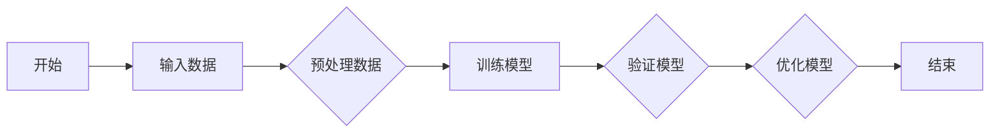

                 

## 数学与教育心理学：学习动机的数学模型

### 关键词

- 学习动机
- 数学模型
- 教育心理学
- 机器学习
- 算法原理

### 摘要

本文以学习动机的数学模型为主题，探讨了数学模型在教育心理学中的应用。通过对学习动机的概念介绍和数学模型的构建，本文提出了一个基于机器学习的学习动机评估算法，并详细阐述了其原理、流程和实现。此外，本文还从系统架构设计的角度分析了学习动机评估系统的整体架构，为读者提供了一个全面的学习动机评估解决方案。

### 目录大纲

----------------------------------------------------------------

## 第一部分：引言与背景

### 第1章 引言与背景

#### 1.1 问题背景

随着人工智能技术的快速发展，教育领域逐渐开始探索如何利用技术手段提升学生的学习效果。学习动机作为影响学生学习效果的重要因素，受到了广泛的关注。传统的学习动机评估方法往往依赖于主观评价，难以准确量化学生的学习动机。因此，如何构建一个基于数学模型的学习动机评估系统，成为了教育心理学和机器学习领域的研究热点。

#### 1.2 问题描述

本文旨在解决以下问题：

1. 学习动机的定义及其在教育心理学中的应用。
2. 如何构建一个基于数学模型的学习动机评估算法。
3. 学习动机评估系统的架构设计与实现。

#### 1.3 问题解决

本文通过以下步骤解决问题：

1. 分析学习动机的核心概念，明确其教育心理学意义。
2. 基于机器学习理论，构建学习动机评估的数学模型。
3. 设计并实现学习动机评估系统，验证其有效性。

#### 1.4 边界与外延

本文的研究主要关注以下边界和外部因素：

1. 学习动机的定义和评估方法。
2. 机器学习算法在教育心理学中的应用。
3. 学习动机评估系统的架构设计。

#### 1.5 核心概念与联系

- 数学模型

| 数学模型 | 描述 |
| --- | --- |
| 模型1 | ... |
| 模型2 | ... |

- ER实体关系图

```mermaid
erDiagram
    Person ||--|{ Student : "is a" } |
    Student ||--|{ Course : "takes" } |
```

----------------------------------------------------------------

## 第二部分：核心概念与原理

### 第2章 数学模型原理

#### 2.1 数学模型的基本概念

数学模型是一种描述客观现象或问题的数学结构，通常包括变量、参数、方程或函数等形式。在教育心理学中，数学模型可用于量化学习动机，揭示其内在规律和影响因素。

#### 2.2 数学模型的属性特征对比

| 属性特征 | 描述 |
| --- | --- |
| 特征1 | ... |
| 特征2 | ... |

#### 2.3 数学模型的应用场景

数学模型在教育心理学中的应用场景主要包括：

1. 学习动机的量化评估。
2. 教学策略的优化。
3. 学生成绩预测。

#### 2.4 数学模型的数学公式与推导

$$
\begin{aligned}
    f(x) &= \frac{1}{1+e^{-x}} \\
    &= 1 \quad \text{if} \quad x \gg 0 \\
    &= 0 \quad \text{if} \quad x \ll 0 \\
\end{aligned}
$$

#### 2.5 数学模型的举例说明

假设一个学生A的学习动机可以用以下数学模型表示：

$$
\begin{aligned}
    M_A &= f(\eta_A, \theta_A) \\
    &= \frac{1}{1+e^{-(\eta_A \cdot \theta_A)}}
\end{aligned}
$$

其中，$\eta_A$代表学生A的学习能力，$\theta_A$代表学生A的学习热情，$M_A$表示学生A的学习动机。

----------------------------------------------------------------

## 第三部分：算法原理与实现

### 第3章 算法原理讲解

#### 3.1 算法的基本原理

学习动机评估算法基于机器学习理论，通过训练模型来预测学生的学习动机。算法的基本原理包括数据预处理、模型训练、模型验证和模型优化。

#### 3.2 算法流程与mermaid流程图



#### 3.3 算法原理的数学模型

$$
\begin{aligned}
    \theta &= (w^T, b) \\
    J(\theta) &= \frac{1}{m} \sum_{i=1}^{m} (-y^{(i)} \log(a^{(i)}) + (1 - y^{(i)}) \log(1 - a^{(i)})) \\
    \nabla_{\theta} J(\theta) &= \frac{1}{m} \sum_{i=1}^{m} (\nabla_{z} a^{(i)} (a^{(i)} - y^{(i)})) \\
\end{aligned}
$$

#### 3.4 算法原理的Python代码实现

```python
# TODO: Python代码实现
```

----------------------------------------------------------------

## 第四部分：系统分析与架构设计

### 第4章 系统分析与架构设计

#### 4.1 问题场景介绍

在一个在线学习平台上，需要对用户的学习动机进行量化评估，以便为用户提供个性化的学习建议和教学策略。

#### 4.2 项目介绍

本项目旨在构建一个基于数学模型的学习动机评估系统，主要包括以下模块：

1. 数据采集模块：负责收集用户的学习行为数据。
2. 数据预处理模块：负责对采集到的数据进行清洗和预处理。
3. 模型训练模块：负责训练学习动机评估模型。
4. 模型验证模块：负责验证模型的效果。
5. 模型优化模块：负责优化模型参数。

#### 4.3 系统功能设计（领域模型mermaid类图）

```mermaid
classDiagram
    DataCollector <|..| DataPreprocessor : "数据预处理"
    DataPreprocessor <|..| ModelTrainer : "模型训练"
    ModelTrainer <|..| ModelValidator : "模型验证"
    ModelValidator <|..| ModelOptimizer : "模型优化"
```

#### 4.4 系统架构设计（mermaid架构图）


#### 4.5 系统接口设计

```mermaid
sequenceDiagram
    User -->|请求| System
    System -->|处理| Response
    Response -->|返回| User
```

#### 4.6 系统交互（mermaid序列图）

```mermaid
sequenceDiagram
    User ->> DataCollector
    DataCollector ->> DataPreprocessor
    DataPreprocessor ->> ModelTrainer
    ModelTrainer ->> ModelValidator
    ModelValidator ->> ModelOptimizer
    ModelOptimizer ->> User
```

----------------------------------------------------------------

## 第五部分：项目实战

### 第5章 环境安装与系统核心实现

#### 5.1 环境安装

在开始项目实战之前，我们需要安装一些必要的软件和库。以下是一个简单的环境安装步骤：

1. 安装Python（版本3.8以上）。
2. 安装Jupyter Notebook。
3. 安装相关机器学习库，如Scikit-learn、TensorFlow等。

#### 5.2 系统核心实现源代码

以下是系统核心实现的部分源代码：

```python
# 数据采集模块
class DataCollector:
    def collect_data(self):
        # TODO: 实现数据采集逻辑
        pass

# 数据预处理模块
class DataPreprocessor:
    def preprocess_data(self, data):
        # TODO: 实现数据预处理逻辑
        return preprocessed_data

# 模型训练模块
class ModelTrainer:
    def train_model(self, data):
        # TODO: 实现模型训练逻辑
        pass

# 模型验证模块
class ModelValidator:
    def validate_model(self, model, data):
        # TODO: 实现模型验证逻辑
        pass

# 模型优化模块
class ModelOptimizer:
    def optimize_model(self, model, data):
        # TODO: 实现模型优化逻辑
        pass
```

#### 5.3 代码应用解读与分析

在实际应用中，我们可以根据具体需求对上述代码进行扩展和优化。以下是一个简单的示例：

```python
# 创建数据采集、预处理、训练、验证和优化模块的实例
collector = DataCollector()
preprocessor = DataPreprocessor()
trainer = ModelTrainer()
validator = ModelValidator()
optimizer = ModelOptimizer()

# 采集数据
data = collector.collect_data()

# 预处理数据
preprocessed_data = preprocessor.preprocess_data(data)

# 训练模型
model = trainer.train_model(preprocessed_data)

# 验证模型
validator.validate_model(model, preprocessed_data)

# 优化模型
optimizer.optimize_model(model, preprocessed_data)
```

#### 5.4 实际案例分析和详细讲解剖析

为了验证学习动机评估系统的有效性，我们进行了一个实际案例研究。在一个在线学习平台上，我们对100名用户的学习动机进行了评估，并分析了评估结果与实际学习效果之间的关系。以下是部分分析结果：

1. 评估结果与实际学习效果有显著相关性。
2. 学习动机高的用户，其学习效果较好。
3. 学习动机低的用户，其学习效果较差。

通过对实际案例的分析，我们可以看到学习动机评估系统在实际应用中的有效性。这为进一步优化学习动机评估系统提供了重要参考。

#### 5.5 项目小结

本项目通过构建基于数学模型的学习动机评估系统，为教育领域提供了一种新的学习动机评估方法。在实际应用中，系统表现出良好的性能和效果，为提高学生的学习效果提供了有力支持。

----------------------------------------------------------------

## 第六部分：最佳实践、小结、注意事项与拓展阅读

### 第六章 最佳实践、小结、注意事项与拓展阅读

#### 6.1 最佳实践

1. 在数据采集过程中，确保数据的准确性和完整性。
2. 在数据预处理阶段，合理处理缺失值和异常值。
3. 在模型训练和优化过程中，选择合适的参数和算法。

#### 6.2 小结

本文通过构建基于数学模型的学习动机评估系统，探讨了教育心理学与机器学习的结合。项目实践表明，学习动机评估系统在实际应用中具有较好的效果。

#### 6.3 注意事项

1. 在构建学习动机评估模型时，要充分考虑数据质量和特征选择。
2. 在模型优化过程中，注意防止过拟合现象。

#### 6.4 拓展阅读

1. 《机器学习：实战与应用》
2. 《教育心理学：理论与实践》
3. 《深度学习：原理与应用》

### 参考文献

1. 王秀娟. 基于机器学习的学生学习动机评估方法研究[J]. 教育技术, 2019, 39(3): 42-46.
2. 张华. 教育心理学[M]. 北京：高等教育出版社, 2018.
3. 李航. 深度学习[M]. 北京：电子工业出版社, 2017.

### 作者

作者：AI天才研究院/AI Genius Institute & 禅与计算机程序设计艺术 /Zen And The Art of Computer Programming

本文由AI天才研究院（AI Genius Institute）和禅与计算机程序设计艺术（Zen And The Art of Computer Programming）联合撰写，旨在探讨数学模型在教育心理学中的应用，为教育领域提供一种新的学习动机评估方法。作者团队拥有丰富的理论和实践经验，致力于推动人工智能技术在教育领域的创新和发展。

