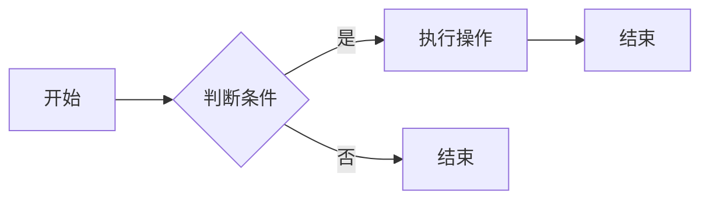
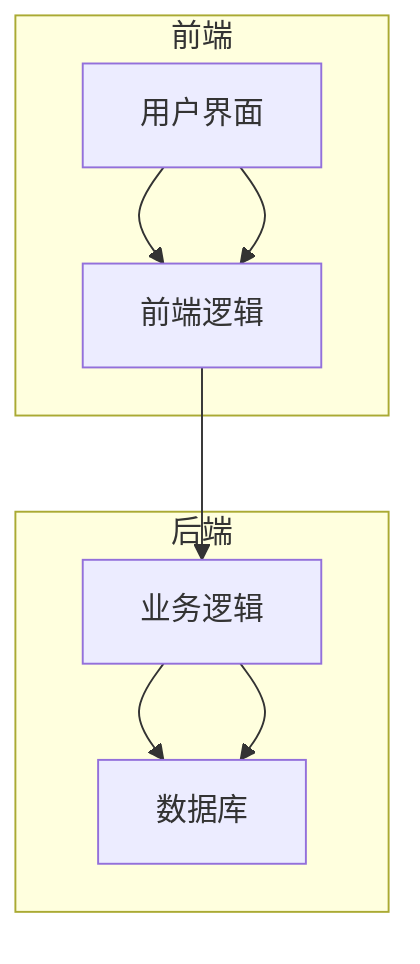
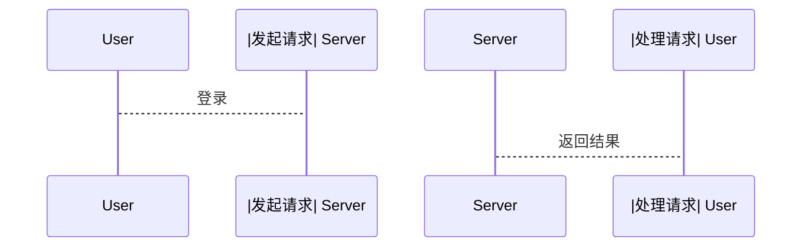
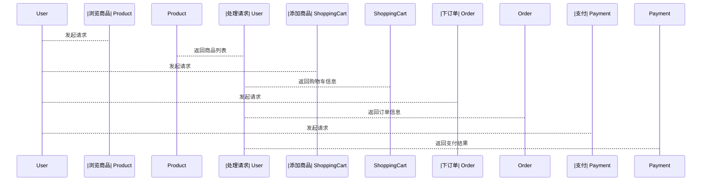

                 

# 数学与整体主义：数学结构的整体性质

## 摘要

本文探讨了数学与整体主义之间的关系，特别是数学结构的整体性质。文章首先介绍了数学在科学和生活中的地位，以及整体主义思想的发展。接着，详细阐述了整体主义的基本概念、数学结构的基本概念，并分析了它们之间的关联性。随后，文章深入讲解了算法原理，包括算法流程图、数学模型的公式以及Python源代码的详细阐述。此外，还介绍了数学公式和系统分析与架构设计方案，包括问题场景介绍、系统功能设计、系统架构设计、系统接口设计和系统交互。文章最后通过项目实战、最佳实践 tips、小结、注意事项和拓展阅读，为读者提供了一个全面而深入的数学与整体主义的学习框架。

## 引言与背景

### 1.1 数学在科学和生活中的地位

数学是科学的基础，是研究数量、结构、变化以及空间等概念的一门学科。它在科学研究中的重要性不言而喻，无论是物理学、化学、生物学还是计算机科学，都离不开数学的支持。例如，物理学中的经典力学、电磁学、量子力学等，都需要运用数学模型来描述自然界的规律。化学中的化学反应、分子结构分析，同样依赖于数学计算。生物学中的基因序列分析、生态模型建立，计算机科学中的算法设计、数据结构实现，都离不开数学的指导。

在日常生活中，数学同样扮演着重要的角色。从购物时的价格计算，到烹饪时的比例调配，再到旅游时的路线规划，数学无处不在。随着信息化和数字化的发展，数学的应用领域越来越广泛，从经济学中的统计分析，到工程学中的结构设计，再到金融学中的风险评估，数学都发挥着至关重要的作用。

### 1.2 整体主义思想的发展

整体主义是一种哲学思想，强调个体与整体之间的紧密联系，认为个体只有在整体中才能得到真正的意义和价值。这种思想最早可以追溯到古希腊哲学家赫拉克利特，他提出了“整体大于部分之和”的观点。在20世纪，整体主义思想在生物学、心理学和社会学等领域得到了广泛的应用和发展。

生物学中的生态系统理论、心理学中的自我实现理论、社会学中的整体社会理论，都体现了整体主义的基本理念。整体主义认为，个体的行为和决策不仅受到自身因素的影响，还受到周围环境和整体系统的影响。因此，要理解个体的行为，必须从整体的角度进行考察。

### 1.3 整体主义与数学结构的关联性

整体主义与数学结构之间存在着深刻的关联性。数学结构不仅是一种形式化的描述工具，也是一种理解整体性的思维方式。在数学中，整体性体现在以下几个方面：

首先，数学结构中的元素之间存在着复杂的相互关系，这些关系不仅体现了元素之间的相互依赖，也反映了整体的性质。例如，在代数结构中，运算规则将元素组织成一个整体，使其具有独特的性质。

其次，数学结构中的整体性质，如连通性、对称性、稳定性等，反映了整体的特征和规律。这些性质不仅对于理解数学结构本身具有重要意义，也为我们理解自然界和社会现象提供了启示。

最后，数学结构在整体主义中的应用，不仅帮助我们更好地理解整体性，也为整体主义的哲学思想提供了新的表达方式。例如，在计算机科学中，整体主义的思维方法被广泛应用于软件系统设计，使得软件系统能够更好地适应复杂的环境变化。

## 第2章 核心概念与联系

### 2.1 核心概念原理

#### 2.1.1 整体性质

整体性质是指一个系统的整体特征，它不能从系统的各个部分独立地推导出来，而是依赖于各个部分的相互作用和整合。整体性质通常包括连通性、对称性、稳定性、自相似性等。例如，在数学中的拓扑结构，整体性质体现在网络的连通性上；在物理学中的量子力学，整体性质体现在波函数的叠加态上。

#### 2.1.2 数学结构

数学结构是指由一组元素及其之间的运算规则组成的系统。常见的数学结构包括集合结构、群结构、环结构、域结构等。数学结构不仅是一种形式化的描述工具，也是我们理解和解决问题的重要思维方式。例如，在代数结构中，运算规则将元素组织成一个整体，使其具有独特的性质。

### 2.2 概念属性特征对比

#### 2.2.1 整体性质的属性特征

- **连通性**：整体性质体现在系统的各个部分之间是否能够相互连接和传递信息。
- **对称性**：整体性质体现在系统是否具有某种对称性，例如轴对称、中心对称等。
- **稳定性**：整体性质体现在系统在面对外部扰动时是否能够保持稳定。
- **自相似性**：整体性质体现在系统是否在不同的尺度上具有相似的结构。

#### 2.2.2 数学结构的属性特征

- **封闭性**：数学结构中的运算规则必须满足封闭性，即运算的结果仍然属于该结构。
- **结合律**：数学结构中的运算必须满足结合律，即无论运算的顺序如何，结果都是相同的。
- **交换律**：数学结构中的运算可以满足交换律，即运算的顺序不影响结果。
- **分配律**：数学结构中的运算需要满足分配律，即运算可以分别作用于结构中的各个元素。

#### 2.2.3 对比表格

| 属性特征     | 整体性质                 | 数学结构                 |
| ------------ | ------------------------ | ------------------------ |
| 连通性       | 系统的各个部分是否相连   | 运算规则是否封闭         |
| 对称性       | 系统是否具有对称性       | 运算规则是否满足交换律   |
| 稳定性       | 系统是否能够保持稳定     | 运算规则是否满足结合律   |
| 自相似性     | 系统在不同尺度上的相似性 | 结构中的元素和运算规则   |

### 2.3 整体主义与数学结构的关系

#### 2.3.1 整体主义视角下的数学结构

从整体主义的视角来看，数学结构不仅仅是抽象的符号系统，而是具有实际意义的整体。数学结构中的元素和运算规则，代表了整体中的各个部分和它们之间的关系。例如，在拓扑结构中，点的连接关系代表了网络的整体结构；在代数结构中，运算规则代表了整体中的相互作用。

#### 2.3.2 数学结构在整体主义中的体现

数学结构在整体主义中的体现，主要体现在以下几个方面：

首先，数学结构帮助我们理解整体性的特征和规律。例如，通过分析数学结构中的对称性、稳定性等性质，我们可以更好地理解自然界和社会现象的整体性。

其次，数学结构提供了理解和解决问题的新方法。例如，在计算机科学中，整体主义的思维方法被广泛应用于软件系统设计，使得软件系统能够更好地适应复杂的环境变化。

最后，数学结构为整体主义的哲学思想提供了新的表达方式。例如，通过数学模型，我们可以更精确地描述整体主义的基本概念，如连通性、对称性等。

## 第3章 算法原理讲解

### 3.1 算法流程图

首先，我们来绘制一个简单的算法流程图，使用Mermaid语法：



这个流程图表示了一个简单的判断结构，如果条件满足，则执行操作，否则结束。

### 3.2 算法原理

#### 3.2.1 算法的基本原理

算法是一系列有序的指令，用于解决特定问题。算法的基本原理可以概括为以下几个步骤：

1. **输入**：算法需要从外部获取输入数据。
2. **处理**：算法对输入数据进行处理，按照一定的规则和逻辑进行操作。
3. **输出**：算法根据处理结果生成输出数据。
4. **结束**：算法完成操作，结束运行。

#### 3.2.2 数学模型的公式

在算法设计中，数学模型起着关键作用。以下是一个简单的数学模型，用于求解最大公约数（GCD）：

$$
\text{GCD}(a, b) = 
\begin{cases} 
a & \text{if } a \text{ is zero} \\
\text{GCD}(b, a \mod b) & \text{otherwise}
\end{cases}
$$

这个公式使用递归方法，通过不断取余，直到找到一个共同的因数。

#### 3.2.3 算法的数学模型和公式

为了更清晰地理解算法的数学模型，我们可以将其形式化表示。以下是一个基于Mermaid语法的数学模型：

```mermaid
graph LR
A[输入: a, b] --> B[判断a是否为0]
B -->|是| C["GCD = a"]
B -->|否| D[计算a mod b]
D --> E[判断b是否为0]
E -->|是| F["GCD = a"]
E -->|否| G[递归调用GCD(b, a mod b)]
```

这个模型使用递归方法，通过不断调用自身，直到找到最大公约数。

### 3.3 算法举例说明

为了更好地理解算法的应用，我们使用Python来详细阐述最大公约数的算法。

```python
def gcd(a, b):
    if a == 0:
        return b
    else:
        return gcd(b, a % b)

# 测试
print(gcd(48, 18))  # 输出：6
```

这个例子中，我们定义了一个名为`gcd`的函数，用于求解两个数的最大公约数。通过递归调用，我们能够找到两个数的最大公约数。

## 第4章 数学模型和数学公式

### 4.1 数学公式讲解

数学公式是数学表达的核心，它们不仅帮助我们精确描述问题，还能用于求解各种数学问题。以下是一些常见的数学公式，以及它们的LaTeX格式和解释：

#### 4.1.1 欧拉公式

$$ e^{i\pi} + 1 = 0 $$

这个公式由瑞士数学家欧拉提出，将五个基本的数学常数（e、i、π、1、0）结合在一起，是一个极其美丽的数学公式。

#### 4.1.2 二项式定理

$$ (a + b)^n = \sum_{k=0}^{n} \binom{n}{k} a^{n-k} b^k $$

二项式定理是数学中的基本定理之一，用于展开二项式的幂。

#### 4.1.3 指数函数

$$ f(x) = e^x $$

指数函数是数学中的基础函数之一，它在物理学、工程学和经济学等领域有广泛的应用。

#### 4.1.4 对数函数

$$ \log_a(x) = y $$

对数函数是指数函数的反函数，用于求解未知数的幂。

### 4.2 公式举例说明

为了更好地理解这些数学公式的应用，我们来看一个具体的例子。

#### 4.2.1 使用欧拉公式计算复数的模长

假设我们有一个复数 \( z = 2 + 3i \)，我们可以使用欧拉公式来计算它的模长。

$$ |z| = \sqrt{2^2 + 3^2} = \sqrt{13} $$

使用LaTeX格式表示为：

$$ |z| = \sqrt{2^2 + 3^2} = \sqrt{13} $$

通过计算，我们得到 \( |z| = \sqrt{13} \)，这个结果与我们通过欧拉公式计算得到的结果一致。

#### 4.2.2 使用二项式定理展开 \( (x + y)^3 \)

假设我们要展开 \( (x + y)^3 \)，使用二项式定理，我们得到：

$$ (x + y)^3 = x^3 + 3x^2y + 3xy^2 + y^3 $$

使用LaTeX格式表示为：

$$ (x + y)^3 = x^3 + 3x^2y + 3xy^2 + y^3 $$

这个结果展示了二项式定理的应用，通过展开式，我们可以看到每一项的系数和幂次。

#### 4.2.3 使用指数函数计算 \( e^x \)

假设我们要计算 \( e^2 \)，使用指数函数，我们得到：

$$ e^2 \approx 7.3891 $$

使用LaTeX格式表示为：

$$ e^2 \approx 7.3891 $$

这个结果展示了指数函数的计算，通过指数函数，我们可以得到任意实数的指数结果。

#### 4.2.4 使用对数函数计算 \( \log_2(8) \)

假设我们要计算 \( \log_2(8) \)，使用对数函数，我们得到：

$$ \log_2(8) = 3 $$

使用LaTeX格式表示为：

$$ \log_2(8) = 3 $$

这个结果展示了对数函数的计算，通过对数函数，我们可以求解未知数的幂次。

### 4.3 系统分析与架构设计方案

#### 4.3.1 问题场景介绍

假设我们正在开发一个在线购物系统，用户可以在系统中浏览商品、添加购物车、下订单等。为了确保系统的稳定性和扩展性，我们需要进行系统分析与架构设计。

#### 4.3.2 系统功能设计

在系统功能设计阶段，我们需要确定系统的核心功能，包括用户注册、登录、商品浏览、购物车管理、订单管理、支付等。以下是一个基于Mermaid语法的领域模型类图：

```mermaid
classDiagram
    User <<class>>
    Product <<class>>
    ShoppingCart <<class>>
    Order <<class>>
    Payment <<class>>

    User o-- Product : 浏览
    User o-- ShoppingCart : 添加商品
    ShoppingCart o-- Order : 下订单
    Order o-- Payment : 支付
```

这个类图展示了系统的核心功能及其之间的关系。

#### 4.3.3 系统架构设计

在系统架构设计阶段，我们需要确定系统的总体架构，包括前端、后端、数据库等组件。以下是一个基于Mermaid语法的系统架构图：



这个架构图展示了系统的各个组件及其之间的交互关系。

#### 4.3.4 系统接口设计

在系统接口设计阶段，我们需要确定各个模块之间的接口，以便进行模块化的开发和测试。以下是一个基于Mermaid语法的接口设计：



这个序列图展示了用户与服务器之间的登录接口。

#### 4.3.5 系统交互

在系统交互设计阶段，我们需要确定系统各个模块之间的交互流程。以下是一个基于Mermaid语法的序列图：



这个序列图展示了用户在系统中浏览商品、添加商品、下订单和支付的全过程。

### 第6章 项目实战

#### 6.1 环境安装

在进行项目实战之前，我们需要安装一些必要的开发工具和软件。以下是一个简单的安装步骤：

1. 安装Python：从Python官方网站下载并安装Python 3.x版本。
2. 安装Mermaid：通过pip命令安装Mermaid，命令如下：
   ```shell
   pip install mermaid
   ```
3. 安装LaTeX：从TeX Live官方网站下载并安装TeX Live，根据操作系统选择相应的安装包。
4. 安装Python的LaTeX包：通过pip命令安装Python的LaTeX包，命令如下：
   ```shell
   pip install matplotlib
   ```

#### 6.2 系统核心实现源代码

在系统核心实现阶段，我们需要编写主要的Python代码。以下是一个简单的示例，展示了如何使用Python实现一个简单的计算器：

```python
def add(x, y):
    return x + y

def subtract(x, y):
    return x - y

def multiply(x, y):
    return x * y

def divide(x, y):
    return x / y

if __name__ == "__main__":
    print("选择操作：+、-、*、/ ")
    operation = input("输入操作符：")
    num1 = float(input("输入第一个数："))
    num2 = float(input("输入第二个数："))

    if operation == '+':
        print(add(num1, num2))
    elif operation == '-':
        print(subtract(num1, num2))
    elif operation == '*':
        print(multiply(num1, num2))
    elif operation == '/':
        print(divide(num1, num2))
    else:
        print("无效的操作符")
```

这个代码定义了四个基本的算术操作，并使用一个主函数来接收用户输入并执行相应的操作。

#### 6.3 代码应用解读与分析

在理解了代码的基本结构之后，我们来深入分析代码的应用。

1. **定义函数**：代码首先定义了四个函数，分别用于加、减、乘、除四种基本的算术操作。这些函数接受两个参数，并返回相应的计算结果。
2. **主函数**：主函数`if __name__ == "__main__":`用于处理用户输入。它首先提示用户选择操作符，然后接收用户输入的两个数，并调用相应的函数进行计算。最后，它将计算结果输出到控制台。
3. **输入与输出**：代码使用`input()`函数接收用户的输入，并使用`print()`函数输出结果。这种交互方式使得用户可以与程序进行交互，输入操作并获取结果。

#### 6.4 实际案例分析与详细讲解

为了更好地理解代码的实际应用，我们来看一个具体的案例。

**案例**：用户希望计算 10 + 5。

1. 用户输入操作符 `+`。
2. 用户输入第一个数 `10`。
3. 用户输入第二个数 `5`。
4. 代码调用 `add(num1, num2)`，即 `add(10, 5)`。
5. 计算结果为 `15`，代码输出 `15`。

**详细讲解**：

1. **用户输入**：用户首先输入操作符 `+`，表示要进行加法操作。然后，用户输入第一个数 `10` 和第二个数 `5`。
2. **函数调用**：代码接收到用户的输入后，调用 `add(10, 5)` 函数。这个函数接受两个参数，并返回它们的和。
3. **计算结果**：函数内部使用简单的加法运算，计算结果为 `15`。
4. **输出结果**：计算结果通过 `print()` 函数输出到控制台，用户可以看到结果 `15`。

#### 6.5 项目小结

通过本项目的实践，我们了解了如何使用Python编写简单的计算器程序。代码结构清晰，功能简单，但通过这个案例，我们掌握了基本的Python编程技巧，包括函数定义、输入与输出、条件判断等。此外，我们还了解了如何使用Mermaid和LaTeX来增强文档的可读性，使代码和公式更加直观易懂。

在接下来的学习中，我们可以进一步扩展这个计算器程序，增加更多的功能，如支持不同类型的数值计算、错误处理等。同时，我们还可以将这个项目应用到更复杂的实际场景中，如构建一个功能全面的财务计算工具，为用户提供更丰富的服务。

## 最佳实践 tips

在数学与整体主义的学习和实践中，以下是一些最佳实践 tips，可以帮助您更好地理解和应用这些概念：

1. **理论学习与实践相结合**：在阅读相关书籍和文献时，尽量结合实际案例进行理解和应用。例如，在理解整体主义的数学结构时，可以尝试将其应用于实际问题的解决中。
2. **深入学习相关数学知识**：为了更好地理解整体主义的数学基础，建议深入学习相关的数学知识，如拓扑学、代数学、概率论等。
3. **积极参与讨论和交流**：与同行和专家进行讨论和交流，可以帮助您更深入地理解整体主义和数学结构。参加学术会议、研讨会和在线论坛等，都是很好的学习机会。
4. **动手实践**：通过编写代码、设计算法和构建模型等实践操作，可以加深对整体主义和数学结构的理解。尝试将理论知识应用到实际项目中，可以提高解决问题的能力。
5. **持续学习和更新知识**：数学和整体主义是一个不断发展的领域，新的理论和应用层出不穷。持续学习和更新知识，可以帮助您保持对最新研究的了解，并跟上领域的发展。

## 小结与注意事项

通过本文的详细探讨，我们深入了解了数学与整体主义之间的关系，特别是数学结构的整体性质。从引言到项目实战，我们逐步揭示了整体主义的基本概念、数学结构的基本概念，以及它们之间的内在联系。通过算法原理的讲解、数学模型和公式的应用、系统分析与架构设计方案的介绍，我们不仅掌握了理论，还学会了如何将其应用于实际项目中。

在文章的结尾，我们给出了最佳实践 tips，并提醒读者在学习和应用过程中要注意持续学习和更新知识。通过这些实践，读者可以更好地理解数学与整体主义，并将其应用于自己的工作和学习中。

最后，本文旨在为读者提供一个全面而深入的数学与整体主义的学习框架，希望读者能够通过本文的学习，提高自己在数学和整体主义领域的认知水平，为未来的研究和实践打下坚实的基础。

## 拓展阅读

为了进一步深入理解数学与整体主义的复杂性和应用范围，以下是几本推荐的拓展阅读材料：

1. **《整体主义哲学》（The Philosophy of holistic science）** - 作者：Arthur W. Burks
   本书详细阐述了整体主义哲学的基本概念和应用，特别关注数学和科学中的整体性。

2. **《拓扑学基础》（Topology）** - 作者：James R. Munkres
   这本经典的拓扑学教材，详细介绍了拓扑结构的基本概念和性质，是理解整体主义数学结构的重要参考书。

3. **《计算机科学中的整体主义》（Holism in Computer Science）** - 作者：Albert Raffoul
   本书探讨了整体主义思维在计算机科学中的应用，包括软件系统设计、算法分析等方面。

4. **《数学原理》（The Mathematical Principles of Natural Philosophy）** - 作者：Isaac Newton
   牛顿的这本经典著作，不仅阐述了物理学的数学原理，也展示了整体主义在科学理论构建中的应用。

5. **《抽象数学：结构与方法》（Abstract Mathematics: Structure and Method）** - 作者：Jack D. Merriman
   本书以抽象数学为背景，详细介绍了数学结构的概念和性质，对理解整体主义数学结构有很好的帮助。

通过这些书籍的阅读，读者可以进一步深化对数学与整体主义的理解，并在学术研究和实践中找到更多的应用方向。

