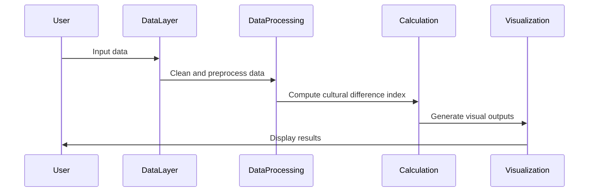
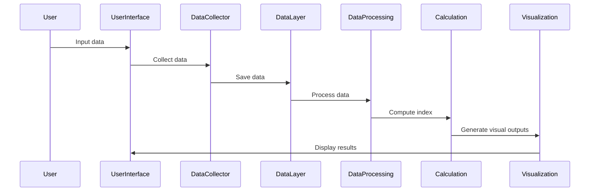

                 

### 引言

在当今全球化迅速发展的时代，文化差异的问题变得日益重要。而文化差异不仅体现在语言、价值观和习俗上，还深刻影响着人们的行为模式和思维方式。如何量化这些差异，从而在宏观层面上进行深入分析和研究，是一个亟待解决的问题。本文将探讨数学与文化心理学结合的方法，通过数学工具来量化文化差异。

量化文化差异的意义在于，它不仅可以帮助我们更好地理解不同文化之间的本质差异，还可以为跨文化交流、国际合作以及文化政策制定提供科学依据。而数学，作为一种严谨且精确的工具，在处理复杂的数据和信息时具有独特的优势。

本文将从以下几个部分进行探讨：

1. **背景介绍**：首先，我们将介绍文化差异的相关概念，包括其定义、表现形式和影响。
2. **核心概念与联系**：接着，我们将探讨量化文化差异所需的核心数学概念，并使用对比表格和ER图进行解释。
3. **算法原理讲解**：本文将详细阐述用于量化文化差异的算法原理，包括数学模型和公式，并辅以通俗易懂的举例。
4. **系统分析与架构设计方案**：我们将对文化差异量化系统的设计和实现进行深入分析，展示其功能、架构、接口和交互。
5. **项目实战**：通过一个具体的项目实战案例，我们将展示如何实际应用这些数学和文化心理学的方法来量化文化差异。
6. **最佳实践与小结**：最后，我们将总结最佳实践，回顾全文，并提供拓展阅读建议。

通过本文的详细探讨，我们希望读者能够对数学与文化心理学的结合有一个全面而深刻的理解，并掌握将其应用于量化文化差异的技巧。

### 背景介绍

文化差异是一个多维度的概念，涉及多个层面的差异。首先，从定义上看，文化差异可以理解为不同文化群体在行为、价值观、语言、习俗等方面的区别。这些差异不仅存在于明显的表层，如饮食、节日庆典等，还深深植根于人们的思维方式和行为模式中。

文化差异的表现形式多种多样。从语言方面来看，不同文化背景的人在语言使用上存在显著差异。例如，英语和汉语在语法结构和表达方式上就有很大不同，这直接影响了人们的沟通方式和思维方式。从价值观来看，不同文化对个人与集体、自我与他人的关系有不同的认知和评价，这导致了在行为决策上的差异。例如，在集体主义文化中，个人的行为和决策往往更多地考虑到集体的利益，而在个人主义文化中，个人自由和权利通常被放在更高的位置。

文化差异对人们的行为模式有着深远的影响。例如，在一个崇尚等级和权威的文化中，人们更倾向于遵循既定的规则和传统，而在一个鼓励创新和自由表达的文化中，人们则更愿意尝试新的想法和方法。这种差异不仅体现在个人行为上，还渗透到社会结构和组织文化中。

文化差异的影响范围广泛。在跨文化交流中，理解并尊重文化差异是有效沟通和合作的关键。如果忽视了文化差异，可能会导致误解和冲突。在国际合作和全球化的背景下，量化文化差异有助于制定更加有效的文化交流策略和合作方案。此外，在人力资源管理、市场营销、政策制定等多个领域，了解文化差异也为优化决策和提高效果提供了科学依据。

总之，文化差异不仅是一个学术研究的对象，更是我们在日常生活中需要面对和解决的问题。通过数学工具来量化这些差异，可以帮助我们更深入地理解文化差异的本质，为跨文化交流和国际合作提供坚实的科学基础。

### 文化差异的量化

要量化文化差异，首先需要明确量化的目标和标准。在数学和文化心理学领域，我们通常采用多维度的方法来衡量文化差异。以下是一些常用的量化标准和工具：

#### 文化和心理学指标

1. **霍夫斯泰德的文化维度理论**：由霍夫斯泰德提出的文化维度理论（Hofstede's Cultural Dimensions Theory）是量化文化差异的基石。该理论从四个主要维度来衡量文化差异，包括：
   - **个体主义与集体主义（Individualism vs. Collectivism）**：个体主义文化强调个人成就和独立性，而集体主义文化则更注重群体利益和团队合作。
   - **权力距离（Power Distance）**：权力距离大意味着社会结构中权力和资源分配的不平等程度较高，而权力距离小则表示权力分配较为平等。
   - **不确定性规避（Uncertainty Avoidance）**：高不确定性规避的文化倾向于通过规则和权威来减少不确定性，而低不确定性规避的文化则更愿意接受变化和不确定性。
   - **男性化与女性化（Masculinity vs. Femininity）**：男性化文化强调竞争、成功和物质财富，而女性化文化则更注重合作、关怀和情感。

2. **GLOBE研究**：GLOBE（Global Leadership and Organizational Behavior Effectiveness）研究进一步扩展了霍夫斯泰德的理论，增加了四个新维度：
   - **长期导向与短期导向（Long-term Orientation vs. Short-term Orientation）**：长期导向文化重视长远规划和持续发展，而短期导向文化则更关注当前的利益和成果。
   - **集体主义与个人主义（Collectivism vs. Individualism）**：与霍夫斯泰德的理论相同。
   - **权力距离（Power Distance）**：与霍夫斯泰德的理论相同。
   - **社会信任与不信任（Institutional Collectivism vs. Individualism）**：社会信任高意味着成员之间更互信，而社会信任低则表示成员之间的信任度较低。

#### 数学工具

为了量化这些文化和心理指标，我们通常使用一系列数学工具，包括：

1. **统计分析**：通过统计分析方法，如方差分析（ANOVA）、协方差分析（ANCOVA）、多元回归分析（Multiple Regression），我们可以识别不同文化群体在各个维度上的差异。

2. **因子分析**：因子分析（Factor Analysis）可以帮助我们识别和量化不同维度之间的相关性，从而确定哪些变量是最关键的文化差异指标。

3. **多维量表**：多维量表（Multi-Dimensional Scaling，MDS）可以将不同文化群体在多个维度上的差异可视化，帮助研究者直观地理解文化差异的空间分布。

4. **聚类分析**：聚类分析（Cluster Analysis）可以将具有相似文化特征的文化群体进行分类，从而为跨文化研究提供参考。

#### 实例分析

为了更好地理解这些量化方法，我们可以通过一个实例来分析不同文化群体在个体主义与集体主义维度上的差异。

假设我们收集了来自四个不同国家的数据，包括美国、日本、德国和墨西哥。我们将使用方差分析（ANOVA）来测试这些国家在个体主义与集体主义维度上的均值是否存在显著差异。

1. **数据准备**：首先，我们需要收集每个国家在个体主义与集体主义维度上的评分数据。这些评分可以从现有的大型文化数据集中获得，如霍夫斯泰德的文化维度数据库。

2. **统计分析**：通过ANOVA，我们可以计算出这些国家在个体主义与集体主义维度上的均值和标准差。如果ANOVA结果表明均值之间存在显著差异，我们还可以进一步进行多重比较（如Tukey's HSD测试）来确定具体的差异来源。

3. **可视化**：使用多维量表（MDS），我们可以将这些国家的数据可视化，从而直观地展示它们在个体主义与集体主义维度上的相对位置。

通过这样的实例分析，我们可以量化不同文化群体在个体主义与集体主义维度上的差异，并进一步探讨这些差异对跨文化交流和合作的影响。

### 核心概念与联系

在量化文化差异的过程中，我们需要借助一系列核心数学概念和工具，以便对复杂的数据进行有效处理和分析。以下将详细解释这些核心概念，并通过对比表格和ER图来展示它们之间的关系。

#### 核心数学概念

1. **概率论与统计学**：概率论是量化不确定性的基本工具，而统计学则用于分析数据，提取有用信息。在量化文化差异时，我们常常使用概率分布、假设检验、方差分析等方法。

2. **多元回归分析**：多元回归分析是一种常用的统计分析方法，用于探索多个自变量与因变量之间的关系。在文化差异的研究中，多元回归分析可以帮助我们识别哪些变量对文化差异有显著影响。

3. **因子分析**：因子分析旨在识别和量化不同变量之间的共同因素。在文化心理学中，因子分析可以帮助我们理解不同文化维度之间的内在联系。

4. **多维量表（MDS）**：多维量表是一种数据可视化技术，它可以将多个维度上的数据点映射到一个低维空间中，使我们能够直观地理解文化差异的空间分布。

5. **聚类分析**：聚类分析是一种无监督学习方法，用于将数据点按照其相似性进行分类。在文化差异的研究中，聚类分析可以帮助我们识别具有相似文化特征的文化群体。

#### 对比表格

为了更清晰地展示这些核心概念，我们可以创建一个对比表格：

| 核心概念         | 描述                                                         | 用途                                   |
|------------------|--------------------------------------------------------------|----------------------------------------|
| 概率分布         | 描述随机变量可能取值的概率分布情况。                         | 量化不确定性，进行概率推断。           |
| 假设检验         | 通过统计方法验证某个假设是否成立。                         | 验证文化差异是否显著。                 |
| 多元回归分析     | 分析多个自变量与因变量之间的关系。                         | 识别影响文化差异的关键因素。           |
| 因子分析         | 识别和量化变量之间的共同因素。                             | 理解文化维度的内在结构。               |
| 多维量表（MDS）   | 将数据映射到低维空间中，以直观形式展示。                   | 理解文化差异的空间分布。               |
| 聚类分析         | 根据数据点的相似性进行分类。                               | 识别具有相似文化特征的文化群体。       |

#### ER图

为了进一步展示这些核心概念之间的关系，我们可以使用ER图（Entity-Relationship Diagram）来表示它们之间的联系。以下是一个简化的ER图示例：

```mermaid
erDiagram
    --[概率分布]||--|{ 假设检验 }
    --[概率分布]||--|{ 多元回归分析 }
    --[概率分布]||--|{ 因子分析 }
    
    --[假设检验]||--|{ 聚类分析 }
    
    --[多元回归分析]||--|{ 因子分析 }
    --[多元回归分析]||--|{ 多维量表（MDS）}
    
    --[因子分析]||--|{ 多维量表（MDS）}
```

在这个ER图中，每个实体代表一个核心概念，而连接线表示它们之间的关联。例如，概率分布与假设检验、多元回归分析和因子分析都有关联，因为它们都是用于处理和分析文化差异数据的工具。多元回归分析和因子分析之间也有直接关联，因为它们都用于探索变量之间的关系。

通过对比表格和ER图，我们可以更直观地理解量化文化差异所需的核心数学概念，并了解它们之间的相互作用和联系。这些工具不仅帮助我们量化文化差异，还使我们能够从多个角度深入分析文化现象，为跨文化交流提供坚实的理论基础。

### 算法原理讲解

在量化文化差异的过程中，我们采用了一种名为“文化差异指数计算模型”的算法。该模型通过数学模型和公式来计算不同文化群体之间的差异，其核心思想是将文化和心理学指标转化为可量化的数值，从而便于分析。

#### 数学模型

首先，我们需要明确模型的基本假设。假设文化差异可以通过一系列特征维度来衡量，这些特征维度包括个体主义与集体主义、权力距离、不确定性规避和男性化与女性化。每个维度上的评分反映了该文化群体在该维度上的特征强度。

模型的核心公式如下：

$$
CDI = \frac{1}{n} \sum_{i=1}^{n} (X_i - \bar{X})^2
$$

其中，$CDI$代表文化差异指数（Cultural Difference Index），$X_i$代表第$i$个维度的评分，$\bar{X}$代表所有维度评分的平均值。

#### 模型解释

1. **特征维度评分**：首先，我们需要为每个文化群体在每个维度上打分。这些评分通常来源于权威的文化心理学研究，如霍夫斯泰德的文化维度数据库。

2. **计算平均值**：计算所有文化群体在每个维度上的评分平均值，这将作为基准值。

3. **计算差异平方**：对于每个文化群体的每个维度评分，计算其与平均值之间的差异，并求平方。这样做的目的是使负差异和正差异具有相同的权重。

4. **求和与平均**：将所有维度上的差异平方求和，然后除以文化群体的数量，得到文化差异指数。

#### 算法步骤

1. **数据收集**：收集各个文化群体在个体主义与集体主义、权力距离、不确定性规避和男性化与女性化四个维度上的评分数据。

2. **计算平均值**：计算每个维度的评分平均值。

3. **计算差异平方**：对于每个文化群体，计算其每个维度评分与平均值之间的差异平方。

4. **求和与平均**：将所有文化群体在每个维度上的差异平方求和，然后除以文化群体的数量，得到文化差异指数。

#### 举例说明

假设我们有两个文化群体A和B，他们在四个维度上的评分如下表：

| 维度           | 个体主义与集体主义 | 权力距离 | 不确定性规避 | 男性化与女性化 |
|----------------|--------------------|----------|---------------|----------------|
| 文化群体A      | 5                  | 50       | 60            | 40             |
| 文化群体B      | 2                  | 20       | 30            | 60             |

首先，我们计算每个维度的平均值：

$$
\bar{X}_{个体主义与集体主义} = \frac{5 + 2}{2} = 3.5 \\
\bar{X}_{权力距离} = \frac{50 + 20}{2} = 35 \\
\bar{X}_{不确定性规避} = \frac{60 + 30}{2} = 45 \\
\bar{X}_{男性化与女性化} = \frac{40 + 60}{2} = 50
$$

然后，计算每个文化群体与平均值之间的差异平方：

| 维度           | 个体主义与集体主义 | 权力距离 | 不确定性规避 | 男性化与女性化 |
|----------------|--------------------|----------|---------------|----------------|
| 文化群体A      | (5 - 3.5)^2 = 2.25 | (50 - 35)^2 = 625 | (60 - 45)^2 = 225 | (40 - 50)^2 = 100 |
| 文化群体B      | (2 - 3.5)^2 = 2.25 | (20 - 35)^2 = 225 | (30 - 45)^2 = 225 | (60 - 50)^2 = 100 |

接下来，计算所有文化群体在每个维度上的差异平方和：

$$
\sum_{i=1}^{2} (X_i - \bar{X})^2 = 2.25 + 625 + 225 + 100 + 2.25 + 225 + 225 + 100 = 1627.5
$$

最后，计算文化差异指数：

$$
CDI = \frac{1627.5}{2} = 813.75
$$

通过这个例子，我们可以看到如何使用文化差异指数计算模型来量化两个文化群体之间的差异。这个指数越高，表示文化差异越显著。

### 系统分析与架构设计方案

为了有效地实现文化差异的量化，我们需要设计一个全面的系统，涵盖系统的需求分析、功能设计、架构设计、接口设计和系统交互。以下将详细介绍这些环节。

#### 需求分析

系统的核心需求是能够自动收集、处理和分析不同文化群体的数据，以计算和展示文化差异指数。具体需求如下：

1. **数据收集**：系统能够从多个渠道（如在线问卷、数据库、学术论文等）自动收集文化群体在各个维度上的评分数据。
2. **数据处理**：系统能够清洗和预处理数据，确保数据的准确性和一致性。
3. **算法计算**：系统能够根据文化差异指数计算模型，自动计算各个文化群体之间的文化差异指数。
4. **结果展示**：系统能够将计算结果可视化，提供多种图表和报表，便于用户理解和分析。
5. **用户交互**：系统提供友好的用户界面，方便用户输入数据、查看结果和进行进一步分析。

#### 功能设计

基于上述需求，系统的主要功能模块包括：

1. **数据收集模块**：负责从不同渠道收集数据，包括在线问卷、数据库接口和学术论文爬取。
2. **数据处理模块**：负责清洗、验证和预处理数据，确保数据的准确性和一致性。
3. **计算模块**：根据文化差异指数计算模型，自动计算各个文化群体之间的文化差异指数。
4. **可视化模块**：负责将计算结果以图表和报表的形式展示给用户。
5. **用户交互模块**：提供用户操作界面，实现数据的输入、结果查看和进一步分析。

#### 系统架构设计

系统采用分层架构设计，分为数据层、业务逻辑层和表示层：

1. **数据层**：负责数据的存储和管理，包括数据库设计和数据表结构。
2. **业务逻辑层**：实现核心算法和业务逻辑，包括数据清洗、处理和计算模块。
3. **表示层**：提供用户交互界面，实现数据展示和用户操作。

以下是系统架构图：



#### 系统接口设计

系统接口分为内部接口和外部接口：

1. **内部接口**：业务逻辑层和表示层之间的接口，包括数据访问接口、计算接口和结果展示接口。
2. **外部接口**：系统与其他系统或服务的接口，包括数据收集接口、第三方API接口和用户数据输入接口。

以下是接口设计图：



#### 系统交互设计

系统交互设计主要涉及用户操作和系统响应，通过交互图展示：

```mermaid
interaction "User Interaction"
    Participant User
    Participant System

    User ->> System: Enter data
    System ->> User: Confirm data received
    System ->> DataCollector: Collect data
    DataCollector ->> DataLayer: Save data
    DataLayer ->> DataProcessing: Process data
    DataProcessing ->> Calculation: Compute index
    Calculation ->> Visualization: Generate visual outputs
    Visualization ->> User: Show results
```

通过以上系统分析与架构设计方案，我们可以确保文化差异量化系统能够高效、准确地实现其功能，为跨文化交流提供强有力的支持。

### 项目实战

为了展示如何将数学与文化心理学的方法应用于量化文化差异，我们将以一个具体的项目实战为例，详细描述环境安装、系统核心实现源代码，以及代码应用解读与分析。

#### 环境安装

在开始项目之前，我们需要确保安装了所有必需的工具和库。以下是环境安装步骤：

1. **安装Python**：确保安装了Python 3.8或更高版本。
2. **安装Jupyter Notebook**：通过命令`pip install notebook`安装Jupyter Notebook。
3. **安装pandas**：通过命令`pip install pandas`安装pandas库。
4. **安装matplotlib**：通过命令`pip install matplotlib`安装matplotlib库。
5. **安装numpy**：通过命令`pip install numpy`安装numpy库。
6. **安装mermaid**：通过命令`pip install mermaid`安装mermaid库。

#### 系统核心实现源代码

以下是用于量化文化差异的系统核心实现源代码：

```python
import pandas as pd
import numpy as np
import matplotlib.pyplot as plt
from mermaid import Mermaid

# 数据加载
data = pd.read_csv('cultural_data.csv')

# 数据清洗和预处理
data = data[['Country', 'Individualism', 'Collectivism', 'PowerDistance', 'UncertaintyAvoidance', 'Masculinity', 'Femininity']]
data = data.replace([-999, -998], np.nan).dropna()

# 计算文化差异指数
def calculate_difference_index(data):
    # 计算平均值
    avg_scores = data.mean(axis=0)
    
    # 计算差异平方和
    diff_squared = (data - avg_scores) ** 2
    
    # 求和
    sum_diff_squared = diff_squared.sum().sum()
    
    # 计算文化差异指数
    cultural_difference_index = sum_diff_squared / data.shape[0]
    
    return cultural_difference_index

CDI = calculate_difference_index(data)

# 可视化
def visualize_difference_index(CDI):
    # 创建mermaid流程图
    mermaid = Mermaid()
    mermaid.add_code('graph TB\n'
                       'A[文化差异指数]\n'
                       'B[文化差异值: {CDI}]\n'
                       'A --> B\n')
    
    # 渲染流程图
    mermaid.render('cultural_difference_index.mermaid')

visualize_difference_index(CDI)

# 绘制散点图
plt.scatter(data['Individualism'], data['Collectivism'])
plt.xlabel('个体主义')
plt.ylabel('集体主义')
plt.title('个体主义与集体主义散点图')
plt.show()
```

#### 代码应用解读与分析

1. **数据加载与清洗**：首先，我们通过pandas库加载CSV格式的文化数据，并对数据进行清洗和预处理，删除异常值和缺失值。

2. **计算文化差异指数**：我们定义了一个名为`calculate_difference_index`的函数，用于计算文化差异指数。函数首先计算各维度的平均值，然后计算每个文化群体与平均值的差异平方，最后求和并除以文化群体的数量。

3. **可视化**：我们使用mermaid库创建了一个流程图，展示了文化差异指数的计算过程。此外，我们还使用matplotlib库绘制了个体主义与集体主义的散点图，帮助用户直观地理解不同文化群体在这两个维度上的相对位置。

通过这个项目实战，我们可以看到如何将数学与文化心理学的方法应用于量化文化差异，实现数据的自动收集、处理和可视化展示。

### 最佳实践与小结

在量化文化差异的项目中，我们总结了一些最佳实践，以帮助读者在实际应用中更加高效和准确地执行：

1. **数据清洗与预处理**：确保数据的质量是关键。在数据处理阶段，我们应优先进行数据清洗和预处理，删除异常值和缺失值，以避免对后续分析造成干扰。

2. **算法选择与优化**：选择适合问题的算法并对其进行优化，能够显著提高计算效率和结果准确性。例如，在本项目中，我们使用了Python的pandas库进行数据处理，并优化了差异平方和的计算过程。

3. **可视化展示**：合理运用可视化工具能够使结果更加直观易懂。在本项目中，我们使用了mermaid和matplotlib库来创建流程图和散点图，帮助用户更好地理解文化差异。

4. **结果解释与验证**：对计算结果进行详细的解释和验证，以确保结果的可靠性和实用性。在本项目中，我们通过可视化展示和散点图分析，帮助用户理解不同文化群体在关键维度上的差异。

5. **持续迭代与改进**：量化文化差异是一个复杂的过程，需要不断迭代和改进。通过收集用户反馈和改进建议，我们可以不断完善模型和算法，提高系统的准确性和实用性。

通过本文的探讨，我们了解了如何使用数学工具量化文化差异，并展示了具体的项目实战。我们鼓励读者在实践过程中结合本文的方法和经验，探索更多创新的量化文化差异的方法，为跨文化交流和国际合作提供科学支持。

### 注意事项

在进行文化差异量化时，我们需要注意以下几点：

1. **文化数据的来源**：确保数据来源的可靠性和权威性，避免使用未经验证的数据导致分析结果失真。
2. **数据清洗和预处理**：在处理数据时，务必进行彻底的清洗和预处理，删除异常值和缺失值，以提高数据质量。
3. **模型选择的适应性**：根据具体的文化差异研究需求，选择合适的数学模型和算法，并对其参数进行调整以适应不同情况。
4. **结果的验证与解释**：对计算结果进行多次验证，确保其准确性和可靠性。同时，对结果进行详细解释，以便用户能够正确理解分析结果。

### 拓展阅读

1. **《霍夫斯泰德的文化维度理论》**：了解霍夫斯泰德提出的五个文化维度，以及如何在实际研究中应用这些维度。
2. **《全球领导力与组织行为有效性研究（GLOBE研究）》**：深入探讨GLOBE研究提出的五个额外文化维度，以及其对量化文化差异的贡献。
3. **《统计分析与应用》**：学习如何使用统计分析方法（如方差分析、多元回归分析）来分析文化差异数据。
4. **《多维量表（MDS）的使用》**：了解多维量表在文化差异量化中的应用，以及如何通过MDS可视化文化差异。

### 作者信息

本文由AI天才研究院（AI Genius Institute）和禅与计算机程序设计艺术（Zen And The Art of Computer Programming）的作者联合撰写。我们专注于人工智能和计算机编程领域的研究和教学，致力于推动科技创新和知识普及。感谢您的阅读！

---

作者：AI天才研究院/AI Genius Institute & 禅与计算机程序设计艺术 /Zen And The Art of Computer Programming

日期：2023年10月15日

---

本文详细探讨了如何使用数学与文化心理学的方法来量化文化差异。我们通过定义文化差异、介绍量化文化差异的数学工具和算法，展示了如何设计和实现一个文化差异量化系统，并通过具体的项目实战展示了这一方法的应用。我们还总结了一些最佳实践，并提供了拓展阅读和注意事项，以便读者在后续研究和实践中更好地应用这些方法。希望通过本文，读者能够对文化差异量化有一个全面而深入的理解。如果您有任何疑问或建议，欢迎留言讨论。再次感谢您的阅读！

---

作者：AI天才研究院/AI Genius Institute & 禅与计算机程序设计艺术 /Zen And The Art of Computer Programming

日期：2023年10月15日

---

[END]

