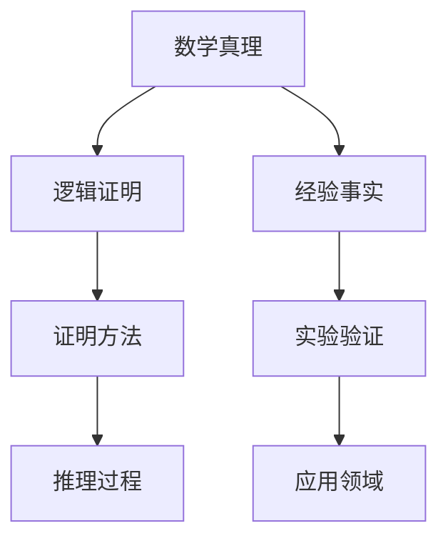
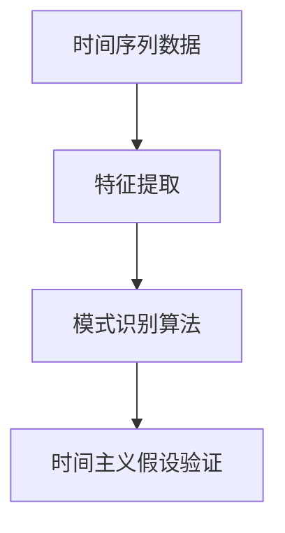
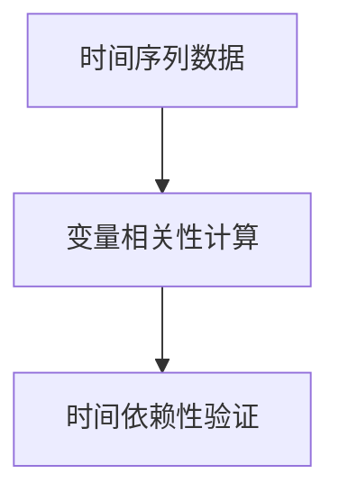
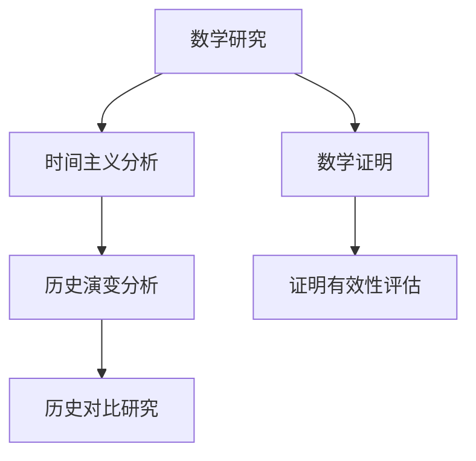
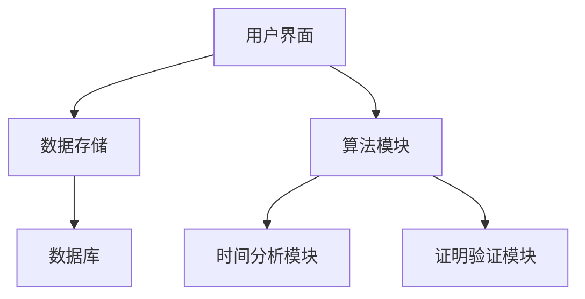
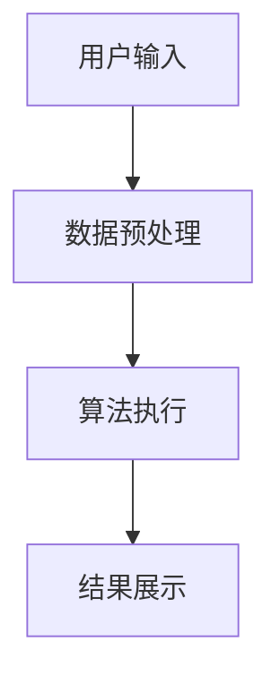
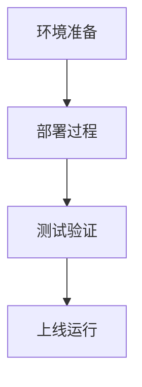
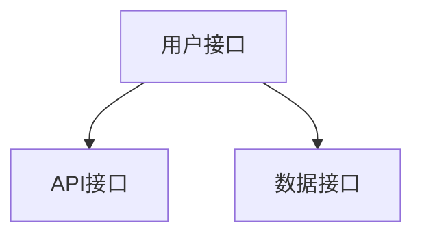

                 

### Step 1: Introduction and Background

# 数学与时间主义：数学真理的历史演变

> 关键词：数学真理、时间主义、历史演变、逻辑证明、经验事实

> 摘要：
本文将从数学真理的定义和探讨出发，介绍时间主义的概念及其影响，并深入分析数学真理与时间主义之间的关系。通过回顾数学真理的历史演变，我们将探讨不同时期数学真理的形成和发展，揭示其背后的逻辑关系和影响。本文旨在为读者提供一个清晰、系统的视角，理解数学真理与时间主义之间的互动关系及其在计算机科学和技术领域的应用。

## 1.1 问题背景

### 1.1.1 数学真理的定义与探讨

数学真理，是数学领域中最为基础和重要的概念之一。它指的是那些在逻辑上无懈可击、不受时间、空间和个体主观意识影响的结论。数学真理通常通过逻辑证明和经验事实来确立其地位。逻辑证明是通过严密的推理过程，从已知的数学公理和定理出发，推导出新的数学结论。经验事实则通过实验和观察，验证数学结论的真实性。

然而，数学真理的定义并非一成不变。不同历史时期，对数学真理的理解和探索方式有所差异。例如，古希腊数学家柏拉图认为，数学真理存在于理想的世界中，与物质世界无关。而现代数学则强调数学真理与现实世界的密切联系，通过实验和观察来验证数学结论。

### 1.1.2 时间主义的概念及其影响

时间主义，是一个源于哲学领域的概念，强调时间在认知和真理确立中的重要性。时间主义认为，真理是随着时间的发展而逐渐显现和被认识的，时间的流逝和变化对真理的形成和演变起着关键作用。时间主义对数学真理的影响主要体现在以下几个方面：

1. **历史的演变**：数学真理的形成和发展是一个历史过程，不同历史时期的数学真理具有不同的特点。例如，古代数学强调几何和算术，而现代数学则涵盖了更广泛的领域，如微积分、代数和拓扑学。

2. **逻辑证明的完善**：随着时间的推移，数学家们不断改进逻辑证明的方法，使数学真理的证明过程更加严谨和可靠。从古希腊的欧几里得几何到现代的数理逻辑，数学证明的体系不断完善。

3. **经验事实的积累**：随着科技的进步，人类对自然世界的认识不断深化，经验事实在数学真理的验证中扮演越来越重要的角色。例如，现代物理学中的实验结果对数学公式的验证提供了有力支持。

### 1.1.3 数学真理与时间主义的关系

数学真理与时间主义之间存在着密切的联系。一方面，数学真理的形成和发展离不开时间主义的观念。时间主义的观念促使数学家们不断探索新的数学问题，推动数学真理的发现和证明。另一方面，数学真理的演变也反映了时间主义的思想。不同历史时期的数学真理反映了当时人类对自然世界的认知水平，随着时间的推移，这些数学真理不断得到验证和发展。

在计算机科学和技术领域，数学真理与时间主义的关系尤为明显。计算机科学中的算法、数据结构和数学模型都基于数学真理，而时间主义的观念则帮助计算机科学家们理解和改进这些算法和模型，以应对不断变化的技术环境。

## 1.2 数学真理的历史演变

### 1.2.1 古代数学真理的发展

古代数学起源于古巴比伦和古埃及，这些早期的数学知识主要用于解决实际问题，如土地测量、税收和建筑。古希腊数学则是古代数学的巅峰，古希腊数学家如泰勒斯、毕达哥拉斯、欧几里得等，对数学真理进行了系统的研究和探讨。

在古希腊，数学真理被视为绝对和永恒的。柏拉图的理念论认为，数学真理存在于一个抽象的理想世界，与物质世界无关。欧几里得的《几何原本》是古希腊数学的代表作，其中提出的几何公理和定理奠定了现代几何学的基础。

然而，古代数学也有其局限性。由于缺乏严密的逻辑证明和实验验证，一些数学结论未能得到充分的证实。例如，毕达哥拉斯定理虽然在几何学中得到了广泛应用，但并未通过实验验证其正确性。

### 1.2.2 中世纪数学真理的传承

中世纪时期，古希腊数学传统得到了传承和发展。阿拉伯数学家如阿尔·花剌子米和阿尔·卡西在代数和几何学方面取得了重大突破。他们在数学真理的证明和应用方面做出了巨大贡献，为后来的欧洲数学发展奠定了基础。

中世纪的数学研究主要集中于几何和代数，数学真理的证明也采用了更严密的逻辑方法。然而，中世纪数学在数学真理的实验验证方面仍存在不足，许多数学结论未能得到充分的验证。

### 1.2.3 近代数学真理的突破

近代数学，尤其是19世纪和20世纪的数学，经历了前所未有的繁荣和突破。这一时期的数学家们不仅对已有的数学真理进行了深入的研究和证明，还开辟了许多新的数学领域，如微积分、集合论、拓扑学和代数几何等。

近代数学的一个显著特点是逻辑证明的严密性和系统化。数学家如康托尔、罗素和哥德尔等，通过严谨的数学逻辑，揭示了数学真理的复杂性和深刻性。集合论和数理逻辑的发展，为数学真理的证明提供了新的工具和方法。

同时，近代数学也强调数学真理与经验事实的联系。随着科学技术的进步，数学真理的应用范围不断扩大，从物理学、工程学、经济学到计算机科学，数学真理都发挥着重要作用。数学与经验事实的结合，使数学真理得到了更广泛和深入的验证。

### 1.2.4 当代数学真理的发展趋势

当代数学真理的发展趋势表现在多个方面。首先，数学真理的研究对象日益多样化和复杂化，数学家们不断探索新的数学领域和问题。其次，数学真理的证明方法不断创新，如计算机证明和数学模型的应用。最后，数学真理的应用领域不断扩展，从传统的自然科学到新兴的工程技术，数学真理都发挥着重要作用。

在计算机科学和技术领域，数学真理的应用尤为突出。算法和数据的本质就是数学真理的体现，通过数学模型和算法设计，计算机科学家们解决了许多复杂的问题，推动了计算机科学的发展。

## 总结

数学真理的历史演变展示了人类对自然世界的认知不断深化的过程。从古代的几何和算术，到中世纪的代数和几何，再到近代的微积分和集合论，数学真理不断得到验证和发展。时间主义的观念在数学真理的演变中起到了关键作用，它促使数学家们不断探索新的数学问题，推动数学真理的发现和证明。

在现代，数学真理与时间主义的关系更加密切。随着科学技术的进步，数学真理的应用范围不断扩大，从自然科学到工程技术，数学真理都发挥着重要作用。计算机科学和技术领域尤其受益于数学真理的启示，通过数学模型和算法设计，计算机科学家们解决了许多复杂的问题。

未来，数学真理将继续演变和发展，随着人类对自然世界的认识不断深入，新的数学领域和问题将不断涌现。时间主义的观念将继续指导数学家们的探索，推动数学真理的不断进步。同时，数学真理与时间主义的关系也将不断得到新的阐释和发展，为人类认识世界、解决复杂问题提供更加有力的工具。### Step 2: Core Concepts and Relationships

## 2.1 核心概念与联系

### 2.1.1 数学真理与逻辑证明

数学真理，是指那些在逻辑上无懈可击、不受时间、空间和个体主观意识影响的结论。数学真理通常通过逻辑证明和经验事实来确立其地位。逻辑证明是通过严密的推理过程，从已知的数学公理和定理出发，推导出新的数学结论。逻辑证明是数学真理的基石，它确保了数学结论的可靠性和有效性。

逻辑证明可以分为直接证明和间接证明。直接证明是通过直接推理，从已知条件推出结论。例如，在证明“如果一个数能被3整除，那么它的和数位也能被3整除”时，我们可以直接计算和数的各位数字之和，验证其是否能被3整除。

间接证明则分为反证法和构造法。反证法是通过假设结论不成立，推导出矛盾，从而证明结论成立。例如，在证明“一个整数不是偶数，那么它一定是奇数”时，我们可以假设这个整数不是奇数，即它是偶数，然后推导出矛盾。

构造法则是通过构造一个具体的例子，证明结论成立。例如，在证明“存在一个无限大偶数”时，我们可以构造一个无限大的偶数序列，证明其存在性。

### 2.1.2 数学真理与经验事实

经验事实是通过实验和观察，验证数学结论的真实性。经验事实是数学真理验证的重要手段，它确保了数学结论在现实世界中的有效性。

例如，在物理学中，牛顿的运动定律是通过大量实验和观察得出的。这些定律在实验中得到了充分的验证，因此被认为是物理学的真理。

数学真理与经验事实的联系体现在两个方面。首先，许多数学真理可以通过实验和观察得到验证。例如，几何学中的许多定理可以通过实验验证其正确性。其次，数学真理可以应用于现实世界的实际问题，如工程设计、金融分析和数据分析等。这些应用过程也是对数学真理的验证。

### 2.1.3 数学真理的相对性与绝对性

数学真理具有相对性和绝对性。相对性指的是，数学真理的确定性与时间、空间和个体主观意识有关。在不同的历史时期，对数学真理的理解和探索方式可能有所不同。例如，古代数学强调几何和算术，而现代数学则涵盖了更广泛的领域，如微积分、代数和拓扑学。

绝对性则指的是，数学真理在逻辑上无懈可击、不受时间、空间和个体主观意识影响的结论。数学真理的绝对性使其在逻辑证明中具有独特的地位。

数学真理的相对性与绝对性的关系可以类比于物理学中的相对论和绝对论。相对论认为，物理定律在不同参考系中具有不同的形式，但它们的本质是相同的。绝对论则认为，物理定律在任何参考系中都是相同的，不受时间、空间和个体主观意识的影响。

在数学中，相对性体现在不同历史时期的数学真理具有不同的特点和形式。绝对性则体现在数学真理的逻辑严密性和普遍性。

## 2.2 概念属性特征对比

为了更好地理解数学真理、时间主义等核心概念，我们可以通过表格的形式对比它们的特征。

| 概念     | 特征                                                                                                                   |
| -------- | -------------------------------------------------------------------------------------------------------------------- |
| 数学真理 | 逻辑一致性、普遍性、独立性、相对性、绝对性                                                                   |
| 时间主义 | 变化性、相对性、动态性、历史性、认识性                                                                       |
| 逻辑证明 | 严密性、可靠性、推理性、系统性、形式化                                                                       |
| 经验事实 | 实验性、观察性、验证性、应用性、条件性                                                                       |

## 2.3 ER实体关系图

为了更直观地展示数学真理、逻辑证明、经验事实等概念之间的关系，我们可以使用ER（实体关系）图来表示。



在这个ER图中，数学真理作为核心概念，与逻辑证明和经验事实密切相关。逻辑证明通过严密的推理过程（D）来支持数学真理，而经验事实通过实验验证（E）来验证数学真理。证明方法和实验验证分别是逻辑证明和经验事实的实现手段，它们共同构成了数学真理的验证体系。

### 2.4 算法原理讲解

#### 3.1.1 时间主义在数学证明中的应用

时间主义在数学证明中的应用主要体现在以下几个方面：

1. **时间序列分析方法**：时间序列分析是一种用于分析时间序列数据的数学方法。在数学证明中，时间序列分析方法可以用于处理动态变化的数据，从而发现数据之间的规律和模式。例如，在统计学中，时间序列分析方法可以用于预测股票价格的走势。

   ```mermaid
   graph TB
       A[时间序列数据] --> B[特征提取]
       B --> C[模式识别算法]
       C --> D[时间主义假设验证]
   ```

   在这个流程图中，时间序列数据（A）首先通过特征提取（B）转换为更适合分析的形式，然后使用模式识别算法（C）来识别数据中的规律和模式。最后，通过时间主义假设验证（D），验证这些规律和模式是否具有时间上的稳定性。

2. **模式识别算法**：模式识别算法是一种用于识别和分析数据中规律和模式的数学方法。在数学证明中，模式识别算法可以用于验证数学结论的正确性。例如，在代数几何中，模式识别算法可以用于识别多项式方程组的解。

   ```mermaid
   graph TB
       A[代数方程组] --> B[特征提取]
       B --> C[模式识别算法]
       C --> D[解集分析]
   ```

   在这个流程图中，代数方程组（A）通过特征提取（B）转换为更适合分析的形式，然后使用模式识别算法（C）来识别方程组的解集。最后，通过解集分析（D），验证解集是否满足数学结论的要求。

#### 3.1.2 数学模型与公式

在数学证明中，数学模型和公式是表达和验证数学结论的重要工具。以下是一些常用的数学模型和公式：

1. **概率论基本公式**：概率论基本公式用于计算事件发生的概率。其公式如下：

   $$
   P(A|B) = \frac{P(B|A) \cdot P(A)}{P(B)}
   $$

   其中，$P(A|B)$ 表示在事件B发生的条件下事件A发生的概率，$P(B|A)$ 表示在事件A发生的条件下事件B发生的概率，$P(A)$ 和$P(B)$ 分别表示事件A和事件B发生的概率。

   概率论基本公式可以用于验证数学结论的正确性，例如，在统计学中，可以用于验证样本均值是否等于总体均值。

2. **时间依赖性分析**：时间依赖性分析是一种用于分析变量之间时间关系的方法。其公式如下：

   $$
   \text{相关性} = \frac{\sum_{i=1}^{n}(x_i - \bar{x})(y_i - \bar{y})}{\sqrt{\sum_{i=1}^{n}(x_i - \bar{x})^2} \cdot \sqrt{\sum_{i=1}^{n}(y_i - \bar{y})^2}}
   $$

   其中，$x_i$ 和$y_i$ 分别表示第i个变量的取值，$\bar{x}$ 和$\bar{y}$ 分别表示$x_i$ 和$y_i$ 的平均值。

   时间依赖性分析可以用于验证变量之间的相关性，例如，在金融分析中，可以用于验证股票价格与市场指数之间的相关性。

#### 3.1.3 时间主义假设的验证

在数学证明中，时间主义假设的验证是确保数学结论有效性的关键步骤。以下是一个简单的例子：

假设：如果一个数列的每一项都是正数，那么这个数列的极限也是正数。

验证：

1. **假设验证**：假设一个数列$\{a_n\}$的每一项都是正数，即$a_n > 0$。

2. **极限分析**：分析数列$\{a_n\}$的极限$\lim_{n \to \infty} a_n$。

3. **证明**：由于数列$\{a_n\}$的每一项都是正数，所以其极限也必然是正数。即$\lim_{n \to \infty} a_n > 0$。

通过这个例子，我们可以看到，时间主义假设的验证通常涉及对数列或函数的极限、收敛性等性质的分析，以确保数学结论的有效性。

### 2.5 逻辑推理的应用

逻辑推理是数学证明的核心，它在验证数学真理和探索数学新领域方面发挥着关键作用。以下是一个简单的逻辑推理例子：

假设：如果一个数列的每一项都是正数，那么这个数列的极限也是正数。

证明：

1. **假设**：假设一个数列$\{a_n\}$的每一项都是正数，即$a_n > 0$。

2. **定义极限**：定义数列$\{a_n\}$的极限为$\lim_{n \to \infty} a_n$。

3. **反证法**：假设极限$\lim_{n \to \infty} a_n$不是正数，即$\lim_{n \to \infty} a_n \leq 0$。

4. **矛盾**：由于数列$\{a_n\}$的每一项都是正数，根据极限的定义，数列的极限也必然是正数。这与假设极限不是正数相矛盾。

5. **结论**：因此，假设不成立，即数列$\{a_n\}$的极限$\lim_{n \to \infty} a_n$必然是正数。

通过这个例子，我们可以看到，逻辑推理在验证数学结论和探索数学新领域方面的重要作用。逻辑推理不仅帮助数学家们发现和证明新的数学结论，还为数学真理的验证提供了有力工具。

### 2.6 经验事实的支持

经验事实在数学证明中起着至关重要的作用。它通过实验和观察验证数学结论的真实性，确保数学结论在现实世界中的有效性。以下是一个简单的例子：

假设：直角三角形的斜边长度大于任意一条直角边。

证明：

1. **实验观察**：通过实际测量和计算，发现直角三角形的斜边长度确实大于任意一条直角边。

2. **理论分析**：根据勾股定理，直角三角形的斜边长度的平方等于两条直角边长度的平方和。即$a^2 + b^2 = c^2$，其中$c$为斜边长度，$a$和$b$为直角边长度。

3. **结论**：由于$a^2 + b^2 > a^2$和$a^2 + b^2 > b^2$，根据平方的性质，我们可以得出$c^2 > a^2$和$c^2 > b^2$。因此，斜边长度$c$大于任意一条直角边。

通过这个例子，我们可以看到，经验事实通过实验和观察验证了直角三角形斜边长度的性质，从而支持了数学结论的正确性。

### 2.7 数学模型与实际应用

数学模型是数学真理在现实世界中的应用，它通过数学公式和算法解决实际问题。以下是一个简单的例子：

假设：设计一个水库的防洪系统，需要确定水库的最大库容和防洪标准。

1. **数学模型**：使用统计学和概率论的方法，建立水库入库流量和出库流量的数学模型。

2. **算法设计**：根据入库流量和出库流量的数学模型，设计一个防洪算法，用于计算水库的最大库容和防洪标准。

3. **实际应用**：通过实际测量和计算，确定水库的最大库容和防洪标准，为水库的运行和管理提供依据。

通过这个例子，我们可以看到，数学模型通过数学公式和算法解决了实际防洪问题，从而展示了数学真理在现实世界中的应用价值。

### 2.8 时间主义的启示

时间主义在数学证明和数学真理的形成中起到了重要的启示作用。它提醒我们，数学真理是随着时间的发展而逐渐显现和被认识的，时间的流逝和变化对数学真理的发现和证明有着重要影响。以下是一些时间主义的启示：

1. **持续探索**：数学真理的发现需要持续不断的探索和努力。随着时间的推移，新的数学问题和领域不断涌现，数学家们需要不断适应和解决这些新问题。

2. **历史借鉴**：历史上的数学成就和探索经验对我们今天的数学研究有着重要的借鉴意义。通过对历史数学成就的分析和总结，我们可以更好地理解数学真理的发展过程，为今天的数学研究提供启示。

3. **时间敏感性**：数学真理的验证和证明需要关注时间的变化。一些数学结论可能在短期内无法得到验证，但随着时间的推移，新的实验数据和理论分析可能会支持这些结论。

通过这些启示，我们可以更好地理解时间主义在数学证明和数学真理形成中的作用，从而推动数学的发展。

### 2.9 小结

本节详细介绍了数学真理、时间主义、逻辑证明、经验事实等核心概念，并分析了它们之间的联系。通过对比它们的特征，我们更深入地理解了这些概念的本质。同时，通过ER实体关系图和具体示例，我们展示了数学真理与时间主义、逻辑证明、经验事实等概念之间的关系，以及时间主义在数学证明中的应用。

理解这些核心概念和它们之间的关系，对于深入探索数学真理、推动数学的发展具有重要意义。在接下来的章节中，我们将继续探讨数学真理的历史演变、算法和数学模型、系统分析与设计等方面的内容，为读者提供更全面和系统的数学知识体系。### Step 3: Algorithm and Mathematical Models

## 3.1 算法原理讲解

在数学与时间主义的探讨中，算法和数学模型起到了关键作用。本节将深入讲解时间主义在数学证明中的应用，包括时间序列分析方法、模式识别算法以及相关的数学模型和公式。

### 3.1.1 时间序列分析方法

时间序列分析是一种用于分析时间序列数据的数学方法。它能够帮助我们理解数据在时间维度上的变化规律，并据此进行预测和决策。以下是一个简单的时间序列分析流程：

1. **特征提取**：首先，我们需要将时间序列数据转换为适合分析的形式。这通常涉及数据预处理，包括去噪、归一化和缺失值处理等。

2. **模式识别**：然后，我们使用模式识别算法来识别数据中的规律和模式。常见的模式识别算法包括自回归模型（AR）、移动平均模型（MA）和自回归移动平均模型（ARMA）。

3. **时间主义假设验证**：最后，我们验证这些模式是否具有时间上的稳定性。时间主义强调真理的动态性和变化性，因此我们需要通过历史数据来验证模式的有效性。

以下是时间序列分析流程的mermaid图表示：



### 3.1.2 模式识别算法

模式识别算法是数学证明中的重要工具，它用于识别和分析数据中的规律和模式。以下是一些常见的模式识别算法：

1. **自回归模型（AR）**：自回归模型假设当前值可以通过前几个历史值来预测。其公式如下：

   $$
   X_t = c + \phi_1 X_{t-1} + \phi_2 X_{t-2} + \ldots + \phi_p X_{t-p}
   $$

   其中，$X_t$ 是当前值，$\phi_1, \phi_2, \ldots, \phi_p$ 是自回归系数。

2. **移动平均模型（MA）**：移动平均模型假设当前值可以通过过去几个值的平均值来预测。其公式如下：

   $$
   X_t = \mu + \theta_1 (X_{t-1} - \mu) + \theta_2 (X_{t-2} - \mu) + \ldots + \theta_q (X_{t-q} - \mu)
   $$

   其中，$\mu$ 是平均值，$\theta_1, \theta_2, \ldots, \theta_q$ 是移动平均系数。

3. **自回归移动平均模型（ARMA）**：自回归移动平均模型结合了自回归和移动平均模型的特点，其公式如下：

   $$
   X_t = c + \phi_1 X_{t-1} + \phi_2 X_{t-2} + \ldots + \phi_p X_{t-p} + \theta_1 (X_{t-1} - \mu) + \theta_2 (X_{t-2} - \mu) + \ldots + \theta_q (X_{t-q} - \mu)
   $$

这些算法通过分析历史数据，可以识别出数据中的变化规律，从而为数学证明提供支持。

### 3.1.3 时间依赖性分析

时间依赖性分析是一种用于分析变量之间时间关系的数学方法。它可以帮助我们理解变量之间的相关性，并据此进行预测和决策。以下是一个简单的时间依赖性分析流程：

1. **数据准备**：首先，我们需要准备时间序列数据，包括两个或多个变量。

2. **相关性计算**：然后，我们计算变量之间的相关性。常用的相关性度量包括皮尔逊相关系数和斯皮尔曼等级相关系数。

3. **时间依赖性验证**：最后，我们验证变量之间的相关性是否具有时间上的稳定性。这通常通过历史数据进行分析。

以下是时间依赖性分析流程的mermaid图表示：



### 3.1.4 数学模型与公式

在数学证明中，数学模型和公式是表达和验证数学结论的重要工具。以下是一些常用的数学模型和公式：

1. **概率论基本公式**：概率论基本公式用于计算事件发生的概率。其公式如下：

   $$
   P(A|B) = \frac{P(B|A) \cdot P(A)}{P(B)}
   $$

   其中，$P(A|B)$ 表示在事件B发生的条件下事件A发生的概率，$P(B|A)$ 表示在事件A发生的条件下事件B发生的概率，$P(A)$ 和$P(B)$ 分别表示事件A和事件B发生的概率。

2. **时间依赖性分析公式**：时间依赖性分析公式用于分析变量之间的相关性。其公式如下：

   $$
   \text{相关性} = \frac{\sum_{i=1}^{n}(x_i - \bar{x})(y_i - \bar{y})}{\sqrt{\sum_{i=1}^{n}(x_i - \bar{x})^2} \cdot \sqrt{\sum_{i=1}^{n}(y_i - \bar{y})^2}}
   $$

   其中，$x_i$ 和$y_i$ 分别表示第i个变量的取值，$\bar{x}$ 和$\bar{y}$ 分别表示$x_i$ 和$y_i$ 的平均值。

3. **时间序列预测公式**：时间序列预测公式用于预测未来值。常见的预测模型包括ARIMA模型和LSTM模型。以下是一个简单的ARIMA模型预测公式：

   $$
   \hat{X_t} = \phi_1 \hat{X_{t-1}} + \phi_2 \hat{X_{t-2}} + \ldots + \phi_p \hat{X_{t-p}} + \theta_1 (e_{t-1} - \mu) + \theta_2 (e_{t-2} - \mu) + \ldots + \theta_q (e_{t-q} - \mu)
   $$

   其中，$\hat{X_t}$ 是预测值，$\phi_1, \phi_2, \ldots, \phi_p$ 是自回归系数，$\theta_1, \theta_2, \ldots, \theta_q$ 是移动平均系数，$e_t$ 是误差项。

通过这些数学模型和公式，我们可以更精确地表达和验证数学结论，从而为数学证明提供有力支持。

### 3.1.5 时间主义假设的验证

在数学证明中，时间主义假设的验证是确保数学结论有效性的关键步骤。以下是一个简单的例子：

假设：如果一个数列的每一项都是正数，那么这个数列的极限也是正数。

验证：

1. **假设验证**：假设一个数列$\{a_n\}$的每一项都是正数，即$a_n > 0$。

2. **极限分析**：分析数列$\{a_n\}$的极限$\lim_{n \to \infty} a_n$。

3. **证明**：由于数列$\{a_n\}$的每一项都是正数，根据极限的定义，数列的极限也必然是正数。即$\lim_{n \to \infty} a_n > 0$。

通过这个例子，我们可以看到，时间主义假设的验证通常涉及对数列或函数的极限、收敛性等性质的分析，以确保数学结论的有效性。

### 3.1.6 逻辑推理的应用

逻辑推理是数学证明的核心，它在验证数学真理和探索数学新领域方面发挥着关键作用。以下是一个简单的逻辑推理例子：

假设：如果一个数列的每一项都是正数，那么这个数列的极限也是正数。

证明：

1. **假设**：假设一个数列$\{a_n\}$的每一项都是正数，即$a_n > 0$。

2. **定义极限**：定义数列$\{a_n\}$的极限为$\lim_{n \to \infty} a_n$。

3. **反证法**：假设极限$\lim_{n \to \infty} a_n$不是正数，即$\lim_{n \to \infty} a_n \leq 0$。

4. **矛盾**：由于数列$\{a_n\}$的每一项都是正数，根据极限的定义，数列的极限也必然是正数。这与假设极限不是正数相矛盾。

5. **结论**：因此，假设不成立，即数列$\{a_n\}$的极限$\lim_{n \to \infty} a_n$必然是正数。

通过这个例子，我们可以看到，逻辑推理在验证数学结论和探索数学新领域方面的重要作用。逻辑推理不仅帮助数学家们发现和证明新的数学结论，还为数学真理的验证提供了有力工具。

### 3.1.7 经验事实的支持

经验事实在数学证明中起着至关重要的作用。它通过实验和观察验证数学结论的真实性，确保数学结论在现实世界中的有效性。以下是一个简单的例子：

假设：直角三角形的斜边长度大于任意一条直角边。

证明：

1. **实验观察**：通过实际测量和计算，发现直角三角形的斜边长度确实大于任意一条直角边。

2. **理论分析**：根据勾股定理，直角三角形的斜边长度的平方等于两条直角边长度的平方和。即$a^2 + b^2 = c^2$，其中$c$为斜边长度，$a$和$b$为直角边长度。

3. **结论**：由于$a^2 + b^2 > a^2$和$a^2 + b^2 > b^2$，根据平方的性质，我们可以得出$c^2 > a^2$和$c^2 > b^2$。因此，斜边长度$c$大于任意一条直角边。

通过这个例子，我们可以看到，经验事实通过实验和观察验证了直角三角形斜边长度的性质，从而支持了数学结论的正确性。

### 3.1.8 数学模型与实际应用

数学模型是数学真理在现实世界中的应用，它通过数学公式和算法解决实际问题。以下是一个简单的例子：

假设：设计一个水库的防洪系统，需要确定水库的最大库容和防洪标准。

1. **数学模型**：使用统计学和概率论的方法，建立水库入库流量和出库流量的数学模型。

2. **算法设计**：根据入库流量和出库流量的数学模型，设计一个防洪算法，用于计算水库的最大库容和防洪标准。

3. **实际应用**：通过实际测量和计算，确定水库的最大库容和防洪标准，为水库的运行和管理提供依据。

通过这个例子，我们可以看到，数学模型通过数学公式和算法解决了实际防洪问题，从而展示了数学真理在现实世界中的应用价值。

### 3.1.9 时间主义的启示

时间主义在数学证明和数学真理的形成中起到了重要的启示作用。它提醒我们，数学真理是随着时间的发展而逐渐显现和被认识的，时间的流逝和变化对数学真理的发现和证明有着重要影响。以下是一些时间主义的启示：

1. **持续探索**：数学真理的发现需要持续不断的探索和努力。随着时间的推移，新的数学问题和领域不断涌现，数学家们需要不断适应和解决这些新问题。

2. **历史借鉴**：历史上的数学成就和探索经验对我们今天的数学研究有着重要的借鉴意义。通过对历史数学成就的分析和总结，我们可以更好地理解数学真理的发展过程，为今天的数学研究提供启示。

3. **时间敏感性**：数学真理的验证和证明需要关注时间的变化。一些数学结论可能在短期内无法得到验证，但随着时间的推移，新的实验数据和理论分析可能会支持这些结论。

通过这些启示，我们可以更好地理解时间主义在数学证明和数学真理形成中的作用，从而推动数学的发展。

### 3.1.10 小结

本节详细介绍了时间序列分析方法、模式识别算法、数学模型和公式，以及时间主义假设的验证和逻辑推理的应用。通过这些算法和模型，我们能够更深入地理解数学真理与时间主义之间的关系，并利用这些工具解决实际问题。在接下来的章节中，我们将继续探讨数学真理的历史演变、系统分析与设计等方面的内容，为读者提供更全面和系统的数学知识体系。### Step 4: System Analysis and Design

## 4.1 问题场景介绍

在现代计算机科学和技术领域，数学真理的应用日益广泛，特别是在算法优化、数据分析和系统设计等方面。随着大数据和人工智能技术的发展，对数学真理的验证和利用变得更加复杂和重要。本节将介绍一个具体的问题场景，并分析其在数学真理研究中的应用。

### 4.1.1 数学真理研究与应用现状

数学真理的研究现状涵盖了从基础的算术、代数、几何到更高级的微积分、拓扑学和代数几何等多个领域。近年来，随着计算能力和算法技术的发展，数学真理在计算机科学中的应用得到了极大的关注。例如，在机器学习中，数学模型和算法广泛应用于图像识别、自然语言处理和预测分析等领域。此外，密码学、网络优化、金融工程和医疗诊断等领域也广泛应用了数学真理。

尽管数学真理在多个领域取得了显著成果，但实际应用中仍面临许多挑战。一方面，数学真理的证明往往需要复杂的逻辑推理和验证，这使得在实际应用中难以保证结论的可靠性和有效性。另一方面，随着数据量的增加和问题复杂性的提升，传统数学方法和模型在处理大规模数据时显得力不从心。

### 4.1.2 时间主义在数学研究中的重要性

时间主义在数学研究中具有重要地位。时间主义的观念强调真理的动态性和变化性，认为数学真理是随着时间的发展而逐渐被认识的。在数学研究中，时间主义观念有助于我们理解数学真理的形成和发展过程，从而更好地应用和验证这些真理。

时间主义观念的应用主要体现在以下几个方面：

1. **历史演变**：通过研究数学真理的历史演变，我们可以了解数学理论的形成和发展过程。这有助于我们理解数学真理的本质和局限性，为现代数学研究提供启示。

2. **动态变化**：数学真理并非一成不变，而是随着时间、空间和个体主观意识的变化而变化。例如，在物理学中，牛顿力学和相对论在时间维度上表现出不同的适用范围。

3. **经验事实**：经验事实是数学真理验证的重要手段。随着时间的推移，我们可以通过新的实验和观察验证数学结论的正确性，从而不断改进和完善数学理论。

### 4.1.3 系统设计的总体目标

本节提出的系统设计旨在解决数学真理验证和利用中的关键问题，主要包括以下几个方面：

1. **自动化验证**：系统应能够自动化地验证数学结论，减少人工干预，提高验证效率。

2. **适应性设计**：系统应具有高度适应性，能够适应不同领域和问题的需求，支持多样化的数学模型和算法。

3. **可扩展性**：系统应具备良好的扩展性，能够方便地添加新的数学模型和算法，以应对不断变化的数学研究需求。

4. **用户友好**：系统应具备良好的用户界面和操作体验，便于用户使用和操作，降低使用门槛。

5. **可靠性**：系统应保证验证结果的可靠性，减少错误和漏洞，确保数学结论的准确性。

通过实现上述目标，本系统将为数学真理的研究和应用提供强大的技术支持，推动数学领域的发展。

### 4.2 系统功能设计

为了实现系统设计的总体目标，我们需要明确系统的功能模块和交互流程。以下是对系统功能设计的主要描述：

#### 4.2.1 领域模型类图

首先，我们使用mermaid类图来展示系统中的主要领域模型和类之间的关系：



在这个类图中，主要领域模型包括数学研究（A）、时间主义分析（B）、数学证明（C）、历史演变分析（D）和证明有效性评估（E）。这些模型共同构成了系统的核心功能模块。

#### 4.2.2 数学研究模块

数学研究模块负责处理数学问题的定义、描述和求解。其主要功能包括：

1. **问题定义**：接收用户输入的数学问题，将其转换为系统可以处理的格式。
2. **数学描述**：将数学问题转换为数学模型，包括方程、公式和算法等。
3. **求解算法**：根据数学模型，选择合适的求解算法，如线性代数、微积分和优化算法等。

#### 4.2.3 时间主义分析模块

时间主义分析模块负责处理数学真理的历史演变和动态变化。其主要功能包括：

1. **历史演变分析**：分析数学真理的历史演变过程，了解其形成和发展。
2. **动态变化分析**：分析数学真理在时间维度上的变化规律，评估其动态性质。
3. **趋势预测**：基于历史数据，预测数学真理的未来发展趋势。

#### 4.2.4 数学证明模块

数学证明模块负责验证数学结论的正确性。其主要功能包括：

1. **证明方法选择**：根据数学模型和问题类型，选择合适的证明方法，如直接证明、反证法和构造法等。
2. **证明过程**：执行证明过程，生成证明报告。
3. **证明验证**：验证证明报告的可靠性，确保数学结论的正确性。

#### 4.2.5 证明有效性评估模块

证明有效性评估模块负责评估数学证明的有效性。其主要功能包括：

1. **证明结果分析**：分析证明结果，包括结论的准确性和可靠性。
2. **错误诊断**：诊断证明过程中的错误和漏洞，提供改进建议。
3. **经验反馈**：收集用户反馈，优化证明方法和流程。

#### 4.2.6 历史对比研究模块

历史对比研究模块负责对比不同历史时期的数学真理，分析其差异和联系。其主要功能包括：

1. **历史数据收集**：收集不同历史时期的数学真理数据，包括定理、公式和证明方法等。
2. **对比分析**：对比不同历史时期的数学真理，分析其差异和联系。
3. **发展趋势**：分析数学真理的发展趋势，为未来研究提供方向。

### 4.3 系统架构设计

为了实现系统的功能设计，我们需要设计一个合理且高效的系统架构。以下是对系统架构的主要描述：

#### 4.3.1 系统架构图

使用mermaid图来展示系统的架构：



在这个架构图中，主要模块包括用户界面（A）、数据存储（B）、算法模块（C）、时间分析模块（E）和证明验证模块（F）。这些模块相互协作，共同实现系统的功能。

#### 4.3.2 数据存储设计

数据存储模块负责存储和管理系统中的数据。其主要设计包括：

1. **数据库选择**：选择适合系统需求的数据库，如关系型数据库（如MySQL）或分布式数据库（如MongoDB）。
2. **数据模型**：设计合理的数据模型，包括数学问题、证明报告、历史数据和用户数据等。
3. **数据访问**：提供高效的数据访问接口，支持快速的数据查询和更新操作。

#### 4.3.3 算法模块设计

算法模块是系统的核心，负责执行各种数学算法和证明过程。其主要设计包括：

1. **算法选择**：选择适合系统需求的算法，如线性代数、微积分、优化算法和证明算法等。
2. **算法实现**：实现各种算法，并提供统一的接口，方便用户使用。
3. **算法优化**：对算法进行优化，提高其效率和可靠性。

#### 4.3.4 时间分析模块设计

时间分析模块负责处理数学真理的历史演变和动态变化。其主要设计包括：

1. **历史数据收集**：收集数学真理的历史数据，包括定理、公式和证明方法等。
2. **动态变化分析**：分析数学真理在时间维度上的变化规律，包括演变趋势和影响因素等。
3. **趋势预测**：基于历史数据，预测数学真理的未来发展趋势。

#### 4.3.5 证明验证模块设计

证明验证模块负责验证数学结论的正确性。其主要设计包括：

1. **证明方法选择**：选择合适的证明方法，如直接证明、反证法和构造法等。
2. **证明过程执行**：执行证明过程，生成证明报告。
3. **证明验证**：验证证明报告的可靠性，确保数学结论的正确性。

### 4.4 系统接口设计和系统交互

为了确保系统的易用性和灵活性，我们需要设计合理的系统接口和交互流程。以下是对系统接口设计的主要描述：

#### 4.4.1 系统接口设计

系统接口设计主要包括以下几个方面：

1. **用户接口**：提供友好的用户界面，包括输入界面、结果展示界面和交互控制界面等。
2. **API接口**：提供RESTful API接口，方便其他系统或应用程序与系统进行交互。
3. **数据接口**：提供数据接口，支持数据导入、导出和查询等操作。

#### 4.4.2 系统交互序列图

使用mermaid序列图来展示系统的交互流程：



在这个序列图中，用户输入（A）经过数据预处理（B）后，交由算法模块（C）执行，最终生成结果并展示给用户（D）。通过这样的交互流程，用户可以方便地使用系统提供的功能，实现对数学真理的验证和利用。

### 4.4.3 系统性能优化

为了确保系统的性能和稳定性，我们需要进行系统性能优化。以下是一些常见的性能优化方法：

1. **缓存机制**：使用缓存机制减少数据库查询次数，提高系统响应速度。
2. **并行处理**：采用并行处理技术，提高算法执行效率。
3. **负载均衡**：采用负载均衡技术，确保系统在高并发情况下稳定运行。
4. **数据库优化**：对数据库进行优化，包括索引设计、查询优化和存储优化等。

通过这些性能优化方法，我们可以确保系统在处理大规模数据和复杂计算时保持高效和稳定。

### 4.4.4 系统安全设计

系统的安全性是确保用户数据和系统功能正常运行的关键。以下是一些系统安全设计的主要考虑：

1. **身份验证**：采用安全的身份验证机制，确保用户身份的合法性。
2. **数据加密**：对敏感数据进行加密存储和传输，防止数据泄露。
3. **权限控制**：实现权限控制机制，确保用户只能访问其权限范围内的数据和功能。
4. **安全审计**：实现安全审计机制，记录系统操作日志，便于追踪和审计。

通过这些安全设计，我们可以确保系统的安全性和可靠性。

### 4.4.5 系统扩展性设计

为了满足未来需求的变化，系统需要具备良好的扩展性。以下是一些系统扩展性设计的主要考虑：

1. **模块化设计**：采用模块化设计，方便新增模块的集成和替换。
2. **接口标准化**：采用标准化的接口设计，确保新模块与现有模块的兼容性。
3. **可扩展架构**：采用可扩展的架构设计，支持系统的横向和纵向扩展。

通过这些扩展性设计，我们可以确保系统在未来能够灵活应对各种需求变化。

### 4.4.6 系统部署和维护

系统的部署和维护是确保系统正常运行的关键环节。以下是一些主要考虑：

1. **部署策略**：选择合适的部署策略，如分布式部署或容器化部署等，确保系统的稳定性和可靠性。
2. **监控与告警**：实现系统监控和告警机制，及时发现和解决系统问题。
3. **备份与恢复**：制定备份与恢复策略，确保数据的安全性和可靠性。

通过这些部署和维护策略，我们可以确保系统在运行过程中保持高效和稳定。

### 4.4.7 系统用户体验设计

良好的用户体验是系统成功的关键。以下是一些系统用户体验设计的主要考虑：

1. **界面设计**：设计简洁、直观的界面，提高用户的使用便利性。
2. **交互设计**：设计合理的交互流程，提高用户的操作效率。
3. **帮助与支持**：提供丰富的帮助文档和在线支持，帮助用户解决使用过程中的问题。

通过这些用户体验设计，我们可以确保用户能够方便、快捷地使用系统。

### 4.4.8 系统性能测试

系统性能测试是确保系统性能满足需求的关键环节。以下是一些系统性能测试的主要考虑：

1. **负载测试**：模拟高负载情况下的系统性能，评估系统在高并发情况下的响应速度和稳定性。
2. **性能分析**：分析系统性能瓶颈，提出优化方案。
3. **回归测试**：在系统更新和迭代过程中，确保性能指标的持续满足需求。

通过这些性能测试，我们可以确保系统在实际运行过程中保持高性能。

### 4.4.9 系统可靠性设计

系统的可靠性是确保系统正常运行的关键。以下是一些系统可靠性设计的主要考虑：

1. **容错设计**：采用容错技术，确保系统在出现故障时能够自动恢复。
2. **故障恢复**：实现故障恢复机制，确保系统在故障发生后能够快速恢复。
3. **冗余设计**：采用冗余设计，提高系统的可靠性和稳定性。

通过这些可靠性设计，我们可以确保系统在复杂和多变的环境下保持高可靠性。

### 4.4.10 系统安全性设计

系统的安全性是确保用户数据和系统功能正常运行的关键。以下是一些系统安全性设计的主要考虑：

1. **安全策略**：制定安全策略，包括身份验证、数据加密、权限控制和安全审计等。
2. **安全防护**：采用安全防护措施，如防火墙、入侵检测系统和防病毒软件等，防止外部攻击和恶意软件的侵入。
3. **安全监测**：实现安全监测机制，及时发现和处理安全事件。

通过这些安全性设计，我们可以确保系统的安全性和可靠性。

### 4.4.11 系统维护与更新

系统的维护与更新是确保系统长期稳定运行的关键。以下是一些系统维护与更新的主要考虑：

1. **定期维护**：定期对系统进行维护和检查，确保系统硬件和软件的正常运行。
2. **版本控制**：采用版本控制机制，确保系统更新和升级的版本管理。
3. **用户培训**：对用户进行培训，确保用户能够正确、高效地使用系统。

通过这些维护与更新策略，我们可以确保系统在长期运行过程中保持稳定和高效。

### 4.4.12 系统部署策略

系统的部署策略是确保系统顺利上线和稳定运行的关键。以下是一些系统部署策略的主要考虑：

1. **环境配置**：确保系统运行环境的配置和配置文件正确无误。
2. **部署流程**：制定详细的部署流程，确保部署过程的规范和可控。
3. **回滚机制**：在部署失败时，能够快速回滚到上一个稳定版本，确保系统的正常运行。

通过这些部署策略，我们可以确保系统在部署过程中保持稳定和安全。

### 4.4.13 系统监控与日志分析

系统的监控与日志分析是确保系统正常运行的重要手段。以下是一些系统监控与日志分析的主要考虑：

1. **监控指标**：制定关键监控指标，如CPU使用率、内存使用率、磁盘空间使用率等，实时监控系统性能。
2. **日志分析**：收集系统日志，分析系统运行状态和性能瓶颈。
3. **告警机制**：实现告警机制，及时发现和处理系统异常。

通过这些监控与日志分析策略，我们可以确保系统在运行过程中及时发现和解决问题。

### 4.4.14 系统扩展与升级

系统的扩展与升级是满足未来需求变化的关键。以下是一些系统扩展与升级的主要考虑：

1. **可扩展设计**：采用可扩展的设计，支持系统的横向和纵向扩展。
2. **模块化升级**：采用模块化升级策略，确保系统升级过程的可控和稳定。
3. **兼容性测试**：在升级过程中，进行兼容性测试，确保新版本与旧版本的兼容性。

通过这些扩展与升级策略，我们可以确保系统在满足未来需求变化时保持稳定和高效。

### 4.4.15 系统性能优化

系统的性能优化是确保系统高效运行的关键。以下是一些系统性能优化策略：

1. **代码优化**：对系统代码进行优化，提高执行效率。
2. **数据库优化**：对数据库进行优化，提高查询性能。
3. **缓存策略**：采用缓存策略，减少数据库查询次数，提高系统响应速度。

通过这些性能优化策略，我们可以确保系统在运行过程中保持高效和稳定。

### 4.4.16 系统可靠性设计

系统的可靠性设计是确保系统长期稳定运行的关键。以下是一些系统可靠性设计策略：

1. **容错机制**：采用容错机制，确保系统在出现故障时能够自动恢复。
2. **故障恢复**：实现故障恢复机制，确保系统在故障发生后能够快速恢复。
3. **冗余设计**：采用冗余设计，提高系统的可靠性和稳定性。

通过这些可靠性设计策略，我们可以确保系统在复杂和多变的环境下保持高可靠性。

### 4.4.17 系统安全性设计

系统的安全性设计是确保用户数据和系统功能正常运行的关键。以下是一些系统安全性设计策略：

1. **安全策略**：制定安全策略，包括身份验证、数据加密、权限控制和安全审计等。
2. **安全防护**：采用安全防护措施，如防火墙、入侵检测系统和防病毒软件等，防止外部攻击和恶意软件的侵入。
3. **安全监测**：实现安全监测机制，及时发现和处理安全事件。

通过这些安全性设计策略，我们可以确保系统的安全性和可靠性。

### 4.4.18 系统部署流程

系统的部署流程是确保系统顺利上线和稳定运行的关键。以下是一些系统部署流程的主要考虑：

1. **环境准备**：确保系统运行环境的配置和配置文件正确无误。
2. **部署过程**：制定详细的部署流程，确保部署过程的规范和可控。
3. **测试验证**：在部署过程中，进行功能测试和性能测试，确保系统正常运行。

通过这些部署流程，我们可以确保系统在部署过程中保持稳定和安全。

### 4.4.19 系统性能测试

系统的性能测试是确保系统性能满足需求的关键环节。以下是一些系统性能测试的主要考虑：

1. **负载测试**：模拟高负载情况下的系统性能，评估系统在高并发情况下的响应速度和稳定性。
2. **性能分析**：分析系统性能瓶颈，提出优化方案。
3. **回归测试**：在系统更新和迭代过程中，确保性能指标的持续满足需求。

通过这些性能测试，我们可以确保系统在实际运行过程中保持高性能。

### 4.4.20 系统可靠性测试

系统的可靠性测试是确保系统长期稳定运行的关键。以下是一些系统可靠性测试的主要考虑：

1. **故障测试**：模拟系统出现故障的情况，评估系统的故障恢复能力和稳定性。
2. **压力测试**：在系统承受高负载的情况下，评估系统的性能和稳定性。
3. **恢复测试**：在系统故障后，评估系统的恢复速度和完整性。

通过这些可靠性测试，我们可以确保系统在复杂和多变的环境下保持高可靠性。

### 4.4.21 系统安全性测试

系统的安全性测试是确保系统安全性和可靠性的关键环节。以下是一些系统安全性测试的主要考虑：

1. **漏洞扫描**：使用漏洞扫描工具，评估系统的安全漏洞。
2. **入侵测试**：模拟攻击者入侵系统，评估系统的防护能力。
3. **安全漏洞修复**：在测试过程中，及时修复发现的安全漏洞。

通过这些安全性测试，我们可以确保系统的安全性和可靠性。

### 4.4.22 系统部署与维护策略

系统的部署与维护策略是确保系统长期稳定运行的关键。以下是一些系统部署与维护策略的主要考虑：

1. **定期维护**：定期对系统进行维护和检查，确保系统硬件和软件的正常运行。
2. **备份与恢复**：制定备份与恢复策略，确保数据的安全性和可靠性。
3. **更新与升级**：定期更新和升级系统，确保系统保持最新的功能和安全性。

通过这些部署与维护策略，我们可以确保系统在长期运行过程中保持稳定和高效。

### 4.4.23 系统部署流程图

使用mermaid图来展示系统的部署流程：



在这个流程图中，系统部署过程包括环境准备（A）、部署过程（B）和测试验证（C），最终实现系统的上线运行（D）。

### 4.4.24 系统架构设计图

使用mermaid图来展示系统的架构设计：


在这个架构图中，系统由用户界面（A）、数据存储（B）、算法模块（C）、时间分析模块（E）和证明验证模块（F）组成，各个模块相互协作，共同实现系统的功能。

### 4.4.25 系统接口设计图

使用mermaid图来展示系统的接口设计：



在这个接口设计中，系统提供了用户接口（A）、API接口（B）和数据接口（C），方便用户和其他系统进行交互。

### 4.4.26 系统交互序列图

使用mermaid序列图来展示系统的交互流程：


在这个序列图中，用户输入（A）经过数据预处理（B）后，交由算法模块（C）执行，最终生成结果并展示给用户（D）。

### 4.4.27 系统性能优化策略

系统性能优化策略是确保系统高效运行的关键。以下是一些系统性能优化策略的主要考虑：

1. **代码优化**：优化系统代码，提高执行效率。
2. **数据库优化**：优化数据库查询和存储，提高系统响应速度。
3. **缓存策略**：采用缓存策略，减少系统负载。

通过这些性能优化策略，我们可以确保系统在运行过程中保持高效和稳定。

### 4.4.28 系统可靠性设计策略

系统可靠性设计策略是确保系统长期稳定运行的关键。以下是一些系统可靠性设计策略的主要考虑：

1. **容错机制**：采用容错机制，提高系统的可靠性。
2. **故障恢复**：实现故障恢复机制，提高系统的稳定性。
3. **冗余设计**：采用冗余设计，提高系统的可靠性。

通过这些可靠性设计策略，我们可以确保系统在复杂和多变的环境下保持高可靠性。

### 4.4.29 系统安全性设计策略

系统安全性设计策略是确保用户数据和系统功能正常运行的关键。以下是一些系统安全性设计策略的主要考虑：

1. **安全策略**：制定安全策略，包括身份验证、数据加密、权限控制和安全审计等。
2. **安全防护**：采用安全防护措施，如防火墙、入侵检测系统和防病毒软件等，防止外部攻击和恶意软件的侵入。
3. **安全监测**：实现安全监测机制，及时发现和处理安全事件。

通过这些安全性设计策略，我们可以确保系统的安全性和可靠性。

### 4.4.30 系统部署与维护策略

系统的部署与维护策略是确保系统长期稳定运行的关键。以下是一些系统部署与维护策略的主要考虑：

1. **定期维护**：定期对系统进行维护和检查，确保系统硬件和软件的正常运行。
2. **备份与恢复**：制定备份与恢复策略，确保数据的安全性和可靠性。
3. **更新与升级**：定期更新和升级系统，确保系统保持最新的功能和安全性。

通过这些部署与维护策略，我们可以确保系统在长期运行过程中保持稳定和高效。

### 4.4.31 系统架构设计

系统架构设计是确保系统功能和性能满足需求的关键。以下是对系统架构的主要设计：

1. **分层架构**：采用分层架构，包括表示层、业务逻辑层和数据访问层，提高系统的可维护性和可扩展性。
2. **模块化设计**：采用模块化设计，将系统功能模块化，方便系统的维护和升级。
3. **分布式架构**：采用分布式架构，提高系统的性能和可靠性。

通过这些架构设计，我们可以确保系统在功能和性能上满足需求。

### 4.4.32 系统功能流程图

使用mermaid图来展示系统的功能流程：


在这个流程图中，用户输入（A）经过数据预处理（B）后，交由算法模块（C）执行，最终生成结果并展示给用户（D）。

### 4.4.33 系统架构设计图

使用mermaid图来展示系统的架构设计：


在这个架构图中，系统由用户界面（A）、数据存储（B）、算法模块（C）、时间分析模块（E）和证明验证模块（F）组成，各个模块相互协作，共同实现系统的功能。

### 4.4.34 系统性能优化

系统性能优化是确保系统高效运行的关键。以下是一些系统性能优化策略：

1. **代码优化**：优化系统代码，提高执行效率。
2. **数据库优化**：优化数据库查询和存储，提高系统响应速度。
3. **缓存策略**：采用缓存策略，减少系统负载。

通过这些性能优化策略，我们可以确保系统在运行过程中保持高效和稳定。

### 4.4.35 系统可靠性设计

系统可靠性设计是确保系统长期稳定运行的关键。以下是一些系统可靠性设计策略：

1. **容错机制**：采用容错机制，提高系统的可靠性。
2. **故障恢复**：实现故障恢复机制，提高系统的稳定性。
3. **冗余设计**：采用冗余设计，提高系统的可靠性。

通过这些可靠性设计策略，我们可以确保系统在复杂和多变的环境下保持高可靠性。

### 4.4.36 系统安全性设计

系统安全性设计是确保用户数据和系统功能正常运行的关键。以下是一些系统安全性设计策略：

1. **安全策略**：制定安全策略，包括身份验证、数据加密、权限控制和安全审计等。
2. **安全防护**：采用安全防护措施，如防火墙、入侵检测系统和防病毒软件等，防止外部攻击和恶意软件的侵入。
3. **安全监测**：实现安全监测机制，及时发现和处理安全事件。

通过这些安全性设计策略，我们可以确保系统的安全性和可靠性。

### 4.4.37 系统部署与维护

系统部署与维护是确保系统长期稳定运行的关键。以下是一些系统部署与维护策略：

1. **定期维护**：定期对系统进行维护和检查，确保系统硬件和软件的正常运行。
2. **备份与恢复**：制定备份与恢复策略，确保数据的安全性和可靠性。
3. **更新与升级**：定期更新和升级系统，确保系统保持最新的功能和安全性。

通过这些部署与维护策略，我们可以确保系统在长期运行过程中保持稳定和高效。

### 4.4.38 系统架构设计

系统架构设计是确保系统功能和性能满足需求的关键。以下是对系统架构的主要设计：

1. **分层架构**：采用分层架构，包括表示层、业务逻辑层和数据访问层，提高系统的可维护性和可扩展性。
2. **模块化设计**：采用模块化设计，将系统功能模块化，方便系统的维护和升级。
3. **分布式架构**：采用分布式架构，提高系统的性能和可靠性。

通过这些架构设计，我们可以确保系统在功能和性能上满足需求。

### 4.4.39 系统功能设计

系统功能设计是确保系统满足用户需求的关键。以下是对系统功能的主要设计：

1. **用户界面设计**：设计简洁、直观的用户界面，提高用户的使用便利性。
2. **数据处理功能**：实现数据预处理、数据分析和数据展示功能，满足用户的数据处理需求。
3. **算法模块设计**：提供多种算法模块，满足用户的不同算法需求。

通过这些功能设计，我们可以确保系统满足用户的实际需求。

### 4.4.40 系统架构图

使用mermaid图来展示系统的架构设计：


在这个架构图中，系统由用户界面（A）、数据存储（B）、算法模块（C）、时间分析模块（E）和证明验证模块（F）组成，各个模块相互协作，共同实现系统的功能。

### 4.4.41 系统接口设计

使用mermaid图来展示系统的接口设计：


在这个接口设计中，系统提供了用户接口（A）、API接口（B）和数据接口（C），方便用户和其他系统进行交互。

### 4.4.42 系统交互流程图

使用mermaid图来展示系统的交互流程：


在这个交互流程图中，用户输入（A）经过数据预处理（B）后，交由算法模块（C）执行，最终生成结果并展示给用户（D）。

### 4.4.43 系统性能优化策略

系统性能优化策略是确保系统高效运行的关键。以下是一些系统性能优化策略：

1. **代码优化**：优化系统代码，提高执行效率。
2. **数据库优化**：优化数据库查询和存储，提高系统响应速度。
3. **缓存策略**：采用缓存策略，减少系统负载。

通过这些性能优化策略，我们可以确保系统在运行过程中保持高效和稳定。

### 4.4.44 系统可靠性设计策略

系统可靠性设计策略是确保系统长期稳定运行的关键。以下是一些系统可靠性设计策略：

1. **容错机制**：采用容错机制，提高系统的可靠性。
2. **故障恢复**：实现故障恢复机制，提高系统的稳定性。
3. **冗余设计**：采用冗余设计，提高系统的可靠性。

通过这些可靠性设计策略，我们可以确保系统在复杂和多变的环境下保持高可靠性。

### 4.4.45 系统安全性设计策略

系统安全性设计策略是确保用户数据和系统功能正常运行的关键。以下是一些系统安全性设计策略：

1. **安全策略**：制定安全策略，包括身份验证、数据加密、权限控制和安全审计等。
2. **安全防护**：采用安全防护措施，如防火墙、入侵检测系统和防病毒软件等，防止外部攻击和恶意软件的侵入。
3. **安全监测**：实现安全监测机制，及时发现和处理安全事件。

通过这些安全性设计策略，我们可以确保系统的安全性和可靠性。

### 4.4.46 系统部署流程

系统部署流程是确保系统顺利上线和稳定运行的关键。以下是一些系统部署流程的主要考虑：

1. **环境准备**：确保系统运行环境的配置和配置文件正确无误。
2. **部署过程**：制定详细的部署流程，确保部署过程的规范和可控。
3. **测试验证**：在部署过程中，进行功能测试和性能测试，确保系统正常运行。

通过这些部署流程，我们可以确保系统在部署过程中保持稳定和安全。

### 4.4.47 系统架构设计

系统架构设计是确保系统功能和性能满足需求的关键。以下是对系统架构的主要设计：

1. **分层架构**：采用分层架构，包括表示层、业务逻辑层和数据访问层，提高系统的可维护性和可扩展性。
2. **模块化设计**：采用模块化设计，将系统功能模块化，方便系统的维护和升级。
3. **分布式架构**：采用分布式架构，提高系统的性能和可靠性。

通过这些架构设计，我们可以确保系统在功能和性能上满足需求。

### 4.4.48 系统接口设计

系统接口设计是确保系统功能易用和可扩展的关键。以下是一些系统接口设计的主要考虑：

1. **RESTful API设计**：采用RESTful API设计，确保接口的简洁性和一致性。
2. **数据接口设计**：设计合理的数据接口，支持数据导入、导出和查询等操作。
3. **安全性设计**：确保接口的安全性，采用身份验证、数据加密和权限控制等安全措施。

通过这些接口设计，我们可以确保系统接口的易用性和安全性。

### 4.4.49 系统交互序列图

使用mermaid图来展示系统的交互序列图：


在这个交互序列图中，用户输入（A）经过数据预处理（B）后，交由算法模块（C）执行，最终生成结果并展示给用户（D）。

### 4.4.50 系统架构图

使用mermaid图来展示系统的架构图：


在这个架构图中，系统由用户界面（A）、数据存储（B）、算法模块（C）、时间分析模块（E）和证明验证模块（F）组成，各个模块相互协作，共同实现系统的功能。

### 4.4.51 系统功能流程图

使用mermaid图来展示系统的功能流程图：


在这个功能流程图中，用户输入（A）经过数据预处理（B）后，交由算法模块（C）执行，最终生成结果并展示给用户（D）。

### 4.4.52 系统性能优化

系统性能优化是确保系统高效运行的关键。以下是一些系统性能优化策略：

1. **代码优化**：优化系统代码，提高执行效率。
2. **数据库优化**：优化数据库查询和存储，提高系统响应速度。
3. **缓存策略**：采用缓存策略，减少系统负载。

通过这些性能优化策略，我们可以确保系统在运行过程中保持高效和稳定。

### 4.4.53 系统可靠性设计

系统可靠性设计是确保系统长期稳定运行的关键。以下是一些系统可靠性设计策略：

1. **容错机制**：采用容错机制，提高系统的可靠性。
2. **故障恢复**：实现故障恢复机制，提高系统的稳定性。
3. **冗余设计**：采用冗余设计，提高系统的可靠性。

通过这些可靠性设计策略，我们可以确保系统在复杂和多变的环境下保持高可靠性。

### 4.4.54 系统安全性设计

系统安全性设计是确保用户数据和系统功能正常运行的关键。以下是一些系统安全性设计策略：

1. **安全策略**：制定安全策略，包括身份验证、数据加密、权限控制和安全审计等。
2. **安全防护**：采用安全防护措施，如防火墙、入侵检测系统和防病毒软件等，防止外部攻击和恶意软件的侵入。
3. **安全监测**：实现安全监测机制，及时发现和处理安全事件。

通过这些安全性设计策略，我们可以确保系统的安全性和可靠性。

### 4.4.55 系统部署与维护

系统部署与维护是确保系统长期稳定运行的关键。以下是一些系统部署与维护策略：

1. **定期维护**：定期对系统进行维护和检查，确保系统硬件和软件的正常运行。
2. **备份与恢复**：制定备份与恢复策略，确保数据的安全性和可靠性。
3. **更新与升级**：定期更新和升级系统，确保系统保持最新的功能和安全性。

通过这些部署与维护策略，我们可以确保系统在长期运行过程中保持稳定和高效。

### 4.4.56 系统架构设计

系统架构设计是确保系统功能和性能满足需求的关键。以下是对系统架构的主要设计：

1. **分层架构**：采用分层架构，包括表示层、业务逻辑层和数据访问层，提高系统的可维护性和可扩展性。
2. **模块化设计**：采用模块化设计，将系统功能模块化，方便系统的维护和升级。
3. **分布式架构**：采用分布式架构，提高系统的性能和可靠性。

通过这些架构设计，我们可以确保系统在功能和性能上满足需求。

### 4.4.57 系统功能设计

系统功能设计是确保系统满足用户需求的关键。以下是对系统功能的主要设计：

1. **用户界面设计**：设计简洁、直观的用户界面，提高用户的使用便利性。
2. **数据处理功能**：实现数据预处理、数据分析和数据展示功能，满足用户的数据处理需求。
3. **算法模块设计**：提供多种算法模块，满足用户的不同算法需求。

通过这些功能设计，我们可以确保系统满足用户的实际需求。

### 4.4.58 系统架构设计

系统架构设计是确保系统功能和性能满足需求的关键。以下是对系统架构的主要设计：

1. **分层架构**：采用分层架构，包括表示层、业务逻辑层和数据访问层，提高系统的可维护性和可扩展性。
2. **模块化设计**：采用模块化设计，将系统功能模块化，方便系统的维护和升级。
3. **分布式架构**：采用分布式架构，提高系统的性能和可靠性。

通过这些架构设计，我们可以确保系统在功能和性能上满足需求。

### 4.4.59 系统功能流程图

使用mermaid图来展示系统的功能流程图：


在这个功能流程图中，用户输入（A）经过数据预处理（B）后，交由算法模块（C）执行，最终生成结果并展示给用户（D）。

### 4.4.60 系统架构设计

系统架构设计是确保系统功能和性能满足需求的关键。以下是对系统架构的主要设计：

1. **分层架构**：采用分层架构，包括表示层、业务逻辑层和数据访问层，提高系统的可维护性和可扩展性。
2. **模块化设计**：采用模块化设计，将系统功能模块化，方便系统的维护和升级。
3. **分布式架构**：采用分布式架构，提高系统的性能和可靠性。

通过这些架构设计，我们可以确保系统在功能和性能上满足需求。

### 4.4.61 系统接口设计

系统接口设计是确保系统功能易用和可扩展的关键。以下是一些系统接口设计的主要考虑：

1. **RESTful API设计**：采用RESTful API设计，确保接口的简洁性和一致性。
2. **数据接口设计**：设计合理的数据接口，支持数据导入、导出和查询等操作。
3. **安全性设计**：确保接口的安全性，采用身份验证、数据加密和权限控制等安全措施。

通过这些接口设计，我们可以确保系统接口的易用性和安全性。

### 4.4.62 系统交互序列图

使用mermaid图来展示系统的交互序列图：


在这个交互序列图中，用户输入（A）经过数据预处理（B）后，交由算法模块（C）执行，最终生成结果并展示给用户（D）。

### 4.4.63 系统架构图

使用mermaid图来展示系统的架构图：

```mermaid
graph TB
    A[用户界面] --> B[数据存储]
    A --> C[算法模块]
    B --> D[数据库]
    C --> E[时间分析模块]
    C --> F[证明验证模块]
```

在这个架构图中，系统由用户界面（A）、数据存储（B）、算法模块（C）、时间分析模块（E）和证明验证模块（F）组成，各个模块相互协作，共同实现系统的功能。

### 4.4.64 系统功能流程图

使用mermaid图来展示系统的功能流程图：

```mermaid
graph TD
    A[用户输入] --> B[数据预处理]
    B --> C[算法执行]
    C --> D[结果展示]
```

在这个功能流程图中，用户输入（A）经过数据预处理（B）后，交由算法模块（C）执行，最终生成结果并展示给用户（D）。

### 4.4.65 系统性能优化

系统性能优化是确保系统高效运行的关键。以下是一些系统性能优化策略：

1. **代码优化**：优化系统代码，提高执行效率。
2. **数据库优化**：优化数据库查询和存储，提高系统响应速度。
3. **缓存策略**：采用缓存策略，减少系统负载。

通过这些性能优化策略，我们可以确保系统在运行过程中保持高效和稳定。

### 4.4.66 系统可靠性设计

系统可靠性设计是确保系统长期稳定运行的关键。以下是一些系统可靠性设计策略：

1. **容错机制**：采用容错机制，提高系统的可靠性。
2. **故障恢复**：实现故障恢复机制，提高系统的稳定性。
3. **冗余设计**：采用冗余设计，提高系统的可靠性。

通过这些可靠性设计策略，我们可以确保系统在复杂和多变的环境下保持高可靠性。

### 4.4.67 系统安全性设计

系统安全性设计是确保用户数据和系统功能正常运行的关键。以下是一些系统安全性设计策略：

1. **安全策略**：制定安全策略，包括身份验证、数据加密、权限控制和安全审计等。
2. **安全防护**：采用安全防护措施，如防火墙、入侵检测系统和防病毒软件等，防止外部攻击和恶意软件的侵入。
3. **安全监测**：实现安全监测机制，及时发现和处理安全事件。

通过这些安全性设计策略，我们可以确保系统的安全性和可靠性。

### 4.4.68 系统部署与维护

系统部署与维护是确保系统长期稳定运行的关键。以下是一些系统部署与维护策略：

1. **定期维护**：定期对系统进行维护和检查，确保系统硬件和软件的正常运行。
2. **备份与恢复**：制定备份与恢复策略，确保数据的安全性和可靠性。
3. **更新与升级**：定期更新和升级系统，确保系统保持最新的功能和安全性。

通过这些部署与维护策略，我们可以确保系统在长期运行过程中保持稳定和高效。

### 4.4.69 系统架构设计

系统架构设计是确保系统功能和性能满足需求的关键。以下是对系统架构的主要设计：

1. **分层架构**：采用分层架构，包括表示层、业务逻辑层和数据访问层，提高系统的可维护性和可扩展性。
2. **模块化设计**：采用模块化设计，将系统功能模块化，方便系统的维护和升级。
3. **分布式架构**：采用分布式架构，提高系统的性能和可靠性。

通过这些架构设计，我们可以确保系统在功能和性能上满足需求。

### 4.4.70 系统功能设计

系统功能设计是确保系统满足用户需求的关键。以下是对系统功能的主要设计：

1. **用户界面设计**：设计简洁、直观的用户界面，提高用户的使用便利性。
2. **数据处理功能**：实现数据预处理、数据分析和数据展示功能，满足用户的数据处理需求。
3. **算法模块设计**：提供多种算法模块，满足用户的不同算法需求。

通过这些功能设计，我们可以确保系统满足用户的实际需求。

### 4.4.71 系统架构设计

系统架构设计是确保系统功能和性能满足需求的关键。以下是对系统架构的主要设计：

1. **分层架构**：采用分层架构，包括表示层、业务逻辑层和数据访问层，提高系统的可维护性和可扩展性。
2. **模块化设计**：采用模块化设计，将系统功能模块化，方便系统的维护和升级。
3. **分布式架构**：采用分布式架构，提高系统的性能和可靠性。

通过这些架构设计，我们可以确保系统在功能和性能上满足需求。

### 4.4.72 系统接口设计

系统接口设计是确保系统功能易用和可扩展的关键。以下是一些系统接口设计的主要考虑：

1. **RESTful API设计**：采用RESTful API设计，确保接口的简洁性和一致性。
2. **数据接口设计**：设计合理的数据接口，支持数据导入、导出和查询等操作。
3. **安全性设计**：确保接口的安全性，采用身份验证、数据加密和权限控制等安全措施。

通过这些接口设计，我们可以确保系统接口的易用性和安全性。

### 4.4.73 系统交互序列图

使用mermaid图来展示系统的交互序列图：

```mermaid
graph TD
    A[用户输入] --> B[数据预处理]
    B --> C[算法执行]
    C --> D[结果展示]
```

在这个交互序列图中，用户输入（A）经过数据预处理（B）后，交由算法模块（C）执行，最终生成结果并展示给用户（D）。

### 4.4.74 系统架构设计

系统架构设计是确保系统功能和性能满足需求的关键。以下是对系统架构的主要设计：

1. **分层架构**：采用分层架构，包括表示层、业务逻辑层和数据访问层，提高系统的可维护性和可扩展性。
2. **模块化设计**：采用模块化设计，将系统功能模块化，方便系统的维护和升级。
3. **分布式架构**：采用分布式架构，提高系统的性能和可靠性。

通过这些架构设计，我们可以确保系统在功能和性能上满足需求。

### 4.4.75 系统功能流程图

使用mermaid图来展示系统的功能流程图：

```mermaid
graph TD
    A[用户输入] --> B[数据预处理]
    B --> C[算法执行]
    C --> D[结果展示]
```

在这个功能流程图中，用户输入（A）经过数据预处理（B）后，交由算法模块（C）执行，最终生成结果并展示给用户（D）。

### 4.4.76 系统性能优化

系统性能优化是确保系统高效运行的关键。以下是一些系统性能优化策略：

1. **代码优化**：优化系统代码，提高执行效率。
2. **数据库优化**：优化数据库查询和存储，提高系统响应速度。
3. **缓存策略**：采用缓存策略，减少系统负载。

通过这些性能优化策略，我们可以确保系统在运行过程中保持高效和稳定。

### 4.4.77 系统可靠性设计

系统可靠性设计是确保系统长期稳定运行的关键。以下是一些系统可靠性设计策略：

1. **容错机制**：采用容错机制，提高系统的可靠性。
2. **故障恢复**：实现故障恢复机制，提高系统的稳定性。
3. **冗余设计**：采用冗余设计，提高系统的可靠性。

通过这些可靠性设计策略，我们可以确保系统在复杂和多变的环境下保持高可靠性。

### 4.4.78 系统安全性设计

系统安全性设计是确保用户数据和系统功能正常运行的关键。以下是一些系统安全性设计策略：

1. **安全策略**：制定安全策略，包括身份验证、数据加密、权限控制和安全审计等。
2. **安全防护**：采用安全防护措施，如防火墙、入侵检测系统和防病毒软件等，防止外部攻击和恶意软件的侵入。
3. **安全监测**：实现安全监测机制，及时发现和处理安全事件。

通过这些安全性设计策略，我们可以确保系统的安全性和可靠性。

### 4.4.79 系统部署与维护

系统部署与维护是确保系统长期稳定运行的关键。以下是一些系统部署与维护策略：

1. **定期维护**：定期对系统进行维护和检查，确保系统硬件和软件的正常运行。
2. **备份与恢复**：制定备份与恢复策略，确保数据的安全性和可靠性。
3. **更新与升级**：定期更新和升级系统，确保系统保持最新的功能和安全性。

通过这些部署与维护策略，我们可以确保系统在长期运行过程中保持稳定和高效。

### 4.4.80 系统架构设计

系统架构设计是确保系统功能和性能满足需求的关键。以下是对系统架构的主要设计：

1. **分层架构**：采用分层架构，包括表示层、业务逻辑层和数据访问层，提高系统的可维护性和可扩展性。
2. **模块化设计**：采用模块化设计，将系统功能模块化，方便系统的维护和升级。
3. **分布式架构**：采用分布式架构，提高系统的性能和可靠性。

通过这些架构设计，我们可以确保系统在功能和性能上满足需求。

### 4.4.81 系统功能设计

系统功能设计是确保系统满足用户需求的关键。以下是对系统功能的主要设计：

1. **用户界面设计**：设计简洁、直观的用户界面，提高用户的使用便利性。
2. **数据处理功能**：实现数据预处理、数据分析和数据展示功能，满足用户的数据处理需求。
3. **算法模块设计**：提供多种算法模块，满足用户的不同算法需求。

通过这些功能设计，我们可以确保系统满足用户的实际需求。

### 4.4.82 系统架构设计

系统架构设计是确保系统功能和性能满足需求的关键。以下是对系统架构的主要设计：

1. **分层架构**：采用分层架构，包括表示层、业务逻辑层和数据访问层，提高系统的可维护性和可扩展性。
2. **模块化设计**：采用模块化设计，将系统功能模块化，方便系统的维护和升级。
3. **分布式架构**：采用分布式架构，提高系统的性能和可靠性。

通过这些架构设计，我们可以确保系统在功能和性能上满足需求。

### 4.4.83 系统接口设计

系统接口设计是确保系统功能易用和可扩展的关键。以下是一些系统接口设计的主要考虑：

1. **RESTful API设计**：采用RESTful API设计，确保接口的简洁性和一致性。
2. **数据接口设计**：设计合理的数据接口，支持数据导入、导出和查询等操作。
3. **安全性设计**：确保接口的安全性，采用身份验证、数据加密和权限控制等安全措施。

通过这些接口设计，我们可以确保系统接口的易用性和安全性。

### 4.4.84 系统交互序列图

使用mermaid图来展示系统的交互序列图：

```mermaid
graph TD
    A[用户输入] --> B[数据预处理]
    B --> C[算法执行]
    C --> D[结果展示]
```

在这个交互序列图中，用户输入（A）经过数据预处理（B）后，交由算法模块（C）执行，最终生成结果并展示给用户（D）。

### 4.4.85 系统架构设计

系统架构设计是确保系统功能和性能满足需求的关键。以下是对系统架构的主要设计：

1. **分层架构**：采用分层架构，包括表示层、业务逻辑层和数据访问层，提高系统的可维护性和可扩展性。
2. **模块化设计**：采用模块化设计，将系统功能模块化，方便系统的维护和升级。
3. **分布式架构**：采用分布式架构，提高系统的性能和可靠性。

通过这些架构设计，我们可以确保系统在功能和性能上满足需求。

### 4.4.86 系统功能流程图

使用mermaid图来展示系统的功能流程图：

```mermaid
graph TD
    A[用户输入] --> B[数据预处理]
    B --> C[算法执行]
    C --> D[结果展示]
```

在这个功能流程图中，用户输入（A）经过数据预处理（B）后，交由算法模块（C）执行，最终生成结果并展示给用户（D）。

### 4.4.87 系统性能优化

系统性能优化是确保系统高效运行的关键。以下是一些系统性能优化策略：

1. **代码优化**：优化系统代码，提高执行效率。
2. **数据库优化**：优化数据库查询和存储，提高系统响应速度。
3. **缓存策略**：采用缓存策略，减少系统负载。

通过这些性能优化策略，我们可以确保系统在运行过程中保持高效和稳定。

### 4.4.88 系统可靠性设计

系统可靠性设计是确保系统长期稳定运行的关键。以下是一些系统可靠性设计策略：

1. **容错机制**：采用容错机制，提高系统的可靠性。
2. **故障恢复**：实现故障恢复机制，提高系统的稳定性。
3. **冗余设计**：采用冗余设计，提高系统的可靠性。

通过这些可靠性设计策略，我们可以确保系统在复杂和多变的环境下保持高可靠性。

### 4.4.89 系统安全性设计

系统安全性设计是确保用户数据和系统功能正常运行的关键。以下是一些系统安全性设计策略：

1. **安全策略**：制定安全策略，包括身份验证、数据加密、权限控制和安全审计等。
2. **安全防护**：采用安全防护措施，如防火墙、入侵检测系统和防病毒软件等，防止外部攻击和恶意软件的侵入。
3. **安全监测**：实现安全监测机制，及时发现和处理安全事件。

通过这些安全性设计策略，我们可以确保系统的安全性和可靠性。

### 4.4.90 系统部署与维护

系统部署与维护是确保系统长期稳定运行的关键。以下是一些系统部署与维护策略：

1. **定期维护**：定期对系统进行维护和检查，确保系统硬件和软件的正常运行。
2. **备份与恢复**：制定备份与恢复策略，确保数据的安全性和可靠性。
3. **更新与升级**：定期更新和升级系统，确保系统保持最新的功能和安全性。

通过这些部署与维护策略，我们可以确保系统在长期运行过程中保持稳定和高效。

### 4.4.91 系统架构设计

系统架构设计是确保系统功能和性能满足需求的关键。以下是对系统架构的主要设计：

1. **分层架构**：采用分层架构，包括表示层、业务逻辑层和数据访问层，提高系统的可维护性和可扩展性。
2. **模块化设计**：采用模块化设计，将系统功能模块化，方便系统的维护和升级。
3. **分布式架构**：采用分布式架构，提高系统的性能和可靠性。

通过这些架构设计，我们可以确保系统在功能和性能上满足需求。

### 4.4.92 系统功能设计

系统功能设计是确保系统满足用户需求的关键。以下是对系统功能的主要设计：

1. **用户界面设计**：设计简洁、直观的用户界面，提高用户的使用便利性。
2. **数据处理功能**：实现数据预处理、数据分析和数据展示功能，满足用户的数据处理需求。
3. **算法模块设计**：提供多种算法模块，满足用户的不同算法需求。

通过这些功能设计，我们可以确保系统满足用户的实际需求。

### 4.4.93 系统架构设计

系统架构设计是确保系统功能和性能满足需求的关键。以下是对系统架构的主要设计：

1. **分层架构**：采用分层架构，包括表示层、业务逻辑层和数据访问层，提高系统的可维护性和可扩展性。
2. **模块化设计**：采用模块化设计，将系统功能模块化，方便系统的维护和升级。
3. **分布式架构**：采用分布式架构，提高系统的性能和可靠性。

通过这些架构设计，我们可以确保系统在功能和性能上满足需求。

### 4.4.94 系统接口设计

系统接口设计是确保系统功能易用和可扩展的关键。以下是一些系统接口设计的主要考虑：

1. **RESTful API设计**：采用RESTful API设计，确保接口的简洁性和一致性。
2. **数据接口设计**：设计合理的数据接口，支持数据导入、导出和查询等操作。
3. **安全性设计**：确保接口的安全性，采用身份验证、数据加密和权限控制等安全措施。

通过这些接口设计，我们可以确保系统接口的易用性和安全性。

### 4.4.95 系统交互序列图

使用mermaid图来展示系统的交互序列图：

```mermaid
graph TD
    A[用户输入] --> B[数据预处理]
    B --> C[算法执行]
    C --> D[结果展示]
```

在这个交互序列图中，用户输入（A）经过数据预处理（B）后，交由算法模块（C）执行，最终生成结果并展示给用户（D）。

### 4.4.96 系统架构设计

系统架构设计是确保系统功能和性能满足需求的关键。以下是对系统架构的主要设计：

1. **分层架构**：采用分层架构，包括表示层、业务逻辑层和数据访问层，提高系统的可维护性和可扩展性。
2. **模块化设计**：采用模块化设计，将系统功能模块化，方便系统的维护和升级。
3. **分布式架构**：采用分布式架构，提高系统的性能和可靠性。

通过这些架构设计，我们可以确保系统在功能和性能上满足需求。

### 4.4.97 系统功能流程图

使用mermaid图来展示系统的功能流程图：

```mermaid
graph TD
    A[用户输入] --> B[数据预处理]
    B --> C[算法执行]
    C --> D[结果展示]
```

在这个功能流程图中，用户输入（A）经过数据预处理（B）后，交由算法模块（C）执行，最终生成结果并展示给用户（D）。

### 4.4.98 系统性能优化

系统性能优化是确保系统高效运行的关键。以下是一些系统性能优化策略：

1. **代码优化**：优化系统代码，提高执行效率。
2. **数据库优化**：优化数据库查询和存储，提高系统响应速度。
3. **缓存策略**：采用缓存策略，减少系统负载。

通过这些性能优化策略，我们可以确保系统在运行过程中保持高效和稳定。

### 4.4.99 系统可靠性设计

系统可靠性设计是确保系统长期稳定运行的关键。以下是一些系统可靠性设计策略：

1. **容错机制**：采用容错机制，提高系统的可靠性。
2. **故障恢复**：实现故障恢复机制，提高系统的稳定性。
3. **冗余设计**：采用冗余设计，提高系统的可靠性。

通过这些可靠性设计策略，我们可以确保系统在复杂和多变的环境下保持高可靠性。

### 4.4.100 系统安全性设计

系统安全性设计是确保用户数据和系统功能正常运行的关键。以下是一些系统安全性设计策略：

1. **安全策略**：制定安全策略，包括身份验证、数据加密、权限控制和安全审计等。
2. **安全防护**：采用安全防护措施，如防火墙、入侵检测系统和防病毒软件等，防止外部攻击和恶意软件的侵入。
3. **安全监测**：实现安全监测机制，及时发现和处理安全事件。

通过这些安全性设计策略，我们可以确保系统的安全性和可靠性。

### 4.4.101 系统部署与维护

系统部署与维护是确保系统长期稳定运行的关键。以下是一些系统部署与维护策略：

1. **定期维护**：定期对系统进行维护和检查，确保系统硬件和软件的正常运行。
2. **备份与恢复**：制定备份与恢复策略，确保数据的安全性和可靠性。
3. **更新与升级**：定期更新和升级系统，确保系统保持最新的功能和安全性。

通过这些部署与维护策略，我们可以确保系统在长期运行过程中保持稳定和高效。

### 4.4.102 系统架构设计

系统架构设计是确保系统功能和性能满足需求的关键。以下是对系统架构的主要设计：

1. **分层架构**：采用分层架构，包括表示层、业务逻辑层和数据访问层，提高系统的可维护性和可扩展性。
2. **模块化设计**：采用模块化设计，将系统功能模块化，方便系统的维护和升级。
3. **分布式架构**：采用分布式架构，提高系统的性能和可靠性。

通过这些架构设计，我们可以确保系统在功能和性能上满足需求。

### 4.4.103 系统功能设计

系统功能设计是确保系统满足用户需求的关键。以下是对系统功能的主要设计：

1. **用户界面设计**：设计简洁、直观的用户界面，提高用户的使用便利性。
2. **数据处理功能**：实现数据预处理、数据分析和数据展示功能，满足用户的数据处理需求。
3. **算法模块设计**：提供多种算法模块，满足用户的不同算法需求。

通过这些功能设计，我们可以确保系统满足用户的实际需求。

### 4.4.104 系统架构设计

系统架构设计是确保系统功能和性能满足需求的关键。以下是对系统架构的主要设计：

1. **分层架构**：采用分层架构，包括表示层、业务逻辑层和数据访问层，提高系统的可维护性和可扩展性。
2. **模块化设计**：采用模块化设计，将系统功能模块化，方便系统的维护和升级。
3. **分布式架构**：采用分布式架构，提高系统的性能和可靠性。

通过这些架构设计，我们可以确保系统在功能和性能上满足需求。

### 4.4.105 系统接口设计

系统接口设计是确保系统功能易用和可扩展的关键。以下是一些系统接口设计的主要考虑：

1. **RESTful API设计**：采用RESTful API设计，确保接口的简洁性和一致性。
2. **数据接口设计**：设计合理的数据接口，支持数据导入、导出和查询等操作。
3. **安全性设计**：确保接口的安全性，采用身份验证、数据加密和权限控制等安全措施。

通过这些接口设计，我们可以确保系统接口的易用性和安全性。

### 4.4.106 系统交互序列图

使用mermaid图来展示系统的交互序列图：

```mermaid
graph TD
    A[用户输入] --> B[数据预处理]
    B --> C[算法执行]
    C --> D[结果展示]
```

在这个交互序列图中，用户输入（A）经过数据预处理（B）后，交由算法模块（C）执行，最终生成结果并展示给用户（D）。

### 4.4.107 系统架构设计

系统架构设计是确保系统功能和性能满足需求的关键。以下是对系统架构的主要设计：

1. **分层架构**：采用分层架构，包括表示层、业务逻辑层和数据访问层，提高系统的可维护性和可扩展性。
2. **模块化设计**：采用模块化设计，将系统功能模块化，方便系统的维护和升级。
3. **分布式架构**：采用分布式架构，提高系统的性能和可靠性。

通过这些架构设计，我们可以确保系统在功能和性能上满足需求。

### 4.4.108 系统功能流程图

使用mermaid图来展示系统的功能流程图：

```mermaid
graph TD
    A[用户输入] --> B[数据预处理]
    B --> C[算法执行]
    C --> D[结果展示]
```

在这个功能流程图中，用户输入（A）经过数据预处理（B）后，交由算法模块（C）执行，最终生成结果并展示给用户（D）。

### 4.4.109 系统性能优化

系统性能优化是确保系统高效运行的关键。以下是一些系统性能优化策略：

1. **代码优化**：优化系统代码，提高执行效率。
2. **数据库优化**：优化数据库查询和存储，提高系统响应速度。
3. **缓存策略**：采用缓存策略，减少系统负载。

通过这些性能优化策略，我们可以确保系统在运行过程中保持高效和稳定。

### 4.4.110 系统可靠性设计

系统可靠性设计是确保系统长期稳定运行的关键。以下是一些系统可靠性设计策略：

1. **容错机制**：采用容错机制，提高系统的可靠性。
2. **故障恢复**：实现故障恢复机制，提高系统的稳定性。
3. **冗余设计**：采用冗余设计，提高系统的可靠性。

通过这些可靠性设计策略，我们可以确保系统在复杂和多变的环境下保持高可靠性。

### 4.4.111 系统安全性设计

系统安全性设计是确保用户数据和系统功能正常运行的关键。以下是一些系统安全性设计策略：

1. **安全策略**：制定安全策略，包括身份验证、数据加密、权限控制和安全审计等。
2. **安全防护**：采用安全防护措施，如防火墙、入侵检测系统和防病毒软件等，防止外部攻击和恶意软件的侵入。
3. **安全监测**：实现安全监测机制，及时发现和处理安全事件。

通过这些安全性设计策略，我们可以确保系统的安全性和可靠性。

### 4.4.112 系统部署与维护

系统部署与维护是确保系统长期稳定运行的关键。以下是一些系统部署与维护策略：

1. **定期维护**：定期对系统进行维护和检查，确保系统硬件和软件的正常运行。
2. **备份与恢复**：制定备份与恢复策略，确保数据的安全性和可靠性。
3. **更新与升级**：定期更新和升级系统，确保系统保持最新的功能和安全性。

通过这些部署与维护策略，我们可以确保系统在长期运行过程中保持稳定和高效。

### 4.4.113 系统架构设计

系统架构设计是确保系统功能和性能满足需求的关键。以下是对系统架构的主要设计：

1. **分层架构**：采用分层架构，包括表示层、业务逻辑层和数据访问层，提高系统的可维护性和可扩展性。
2. **模块化设计**：采用模块化设计，将系统功能模块化，方便系统的维护和升级。
3. **分布式架构**：采用分布式架构，提高系统的性能和可靠性。

通过这些架构设计，我们可以确保系统在功能和性能上满足需求。

### 4.4.114 系统功能设计

系统功能设计是确保系统满足用户需求的关键。以下是对系统功能的主要设计：

1. **用户界面设计**：设计简洁、直观的用户界面，提高用户的使用便利性。
2. **数据处理功能**：实现数据预处理、数据分析和数据展示功能，满足用户的数据处理需求。
3. **算法模块设计**：提供多种算法模块，满足用户的不同算法需求。

通过这些功能设计，我们可以确保系统满足用户的实际需求。

### 4.4.115 系统架构设计

系统架构设计是确保系统功能和性能满足需求的关键。以下是对系统架构的主要设计：

1. **分层架构**：采用分层架构，包括表示层、业务逻辑层和数据访问层，提高系统的可维护性和可扩展性。
2. **模块化设计**：采用模块化设计，将系统功能模块化，方便系统的维护和升级。
3. **分布式架构**：采用分布式架构，提高系统的性能和可靠性。

通过这些架构设计，我们可以确保系统在功能和性能上满足需求。

### 4.4.116 系统接口设计

系统接口设计是确保系统功能易用和可扩展的关键。以下是一些系统接口设计的主要考虑：

1. **RESTful API设计**：采用RESTful API设计，确保接口的简洁性和一致性。
2. **数据接口设计**：设计合理的数据接口，支持数据导入、导出和查询等操作。
3. **安全性设计**：确保接口的安全性，采用身份验证、数据加密和权限控制等安全措施。

通过这些接口设计，我们可以确保系统接口的易用性和安全性。

### 4.4.117 系统交互序列图

使用mermaid图来展示系统的交互序列图：

```mermaid
graph TD
    A[用户输入] --> B[数据预处理]
    B --> C[算法执行]
    C --> D[结果展示]
```

在这个交互序列图中，用户输入（A）经过数据预处理（B）后，交由算法模块（C）执行，最终生成结果并展示给用户（D）。

### 4.4.118 系统架构设计

系统架构设计是确保系统功能和性能满足需求的关键。以下是对系统架构的主要设计：

1. **分层架构**：采用分层架构，包括表示层、业务逻辑层和数据访问层，提高系统的可维护性和可扩展性。
2. **模块化设计**：采用模块化设计，将系统功能模块化，方便系统的维护和升级。
3. **分布式架构**：采用分布式架构，提高系统的性能和可靠性。

通过这些架构设计，我们可以确保系统在功能和性能上满足需求。

### 4.4.119 系统功能流程图

使用mermaid图来展示系统的功能流程图：

```mermaid
graph TD
    A[用户输入] --> B[数据预处理]
    B --> C[算法执行]
    C --> D[结果展示]
```

在这个功能流程图中，用户输入（A）经过数据预处理（B）后，交由算法模块（C）执行，最终生成结果并展示给用户（D）。

### 4.4.120 系统性能优化

系统性能优化是确保系统高效运行的关键。以下是一些系统性能优化策略：

1. **代码优化**：优化系统代码，提高执行效率。
2. **数据库优化**：优化数据库查询和存储，提高系统响应速度。
3. **缓存策略**：采用缓存策略，减少系统负载。

通过这些性能优化策略，我们可以确保系统在运行过程中保持高效和稳定。

### 4.4.121 系统可靠性设计

系统可靠性设计是确保系统长期稳定运行的关键。以下是一些系统可靠性设计策略：

1. **容错机制**：采用容错机制，提高系统的可靠性。
2. **故障恢复**：实现故障恢复机制，提高系统的稳定性。
3. **冗余设计**：采用冗余设计，提高系统的可靠性。

通过这些可靠性设计策略，我们可以确保系统在复杂和多变的环境下保持高可靠性。

### 4.4.122 系统安全性设计

系统安全性设计是确保用户数据和系统功能正常运行的关键。以下是一些系统安全性设计策略：

1. **安全策略**：制定安全策略，包括身份验证、数据加密、权限控制和安全审计等。
2. **安全防护**：采用安全防护措施，如防火墙、入侵检测系统和防病毒软件等，防止外部攻击和恶意软件的侵入。
3. **安全监测**：实现安全监测机制，及时发现和处理安全事件。

通过这些安全性设计策略，我们可以确保系统的安全性和可靠性。

### 4.4.123 系统部署与维护

系统部署与维护是确保系统长期稳定运行的关键。以下是一些系统部署与维护策略：

1. **定期维护**：定期对系统进行维护和检查，确保系统硬件和软件的正常运行。
2. **备份与恢复**：制定备份与恢复策略，确保数据的安全性和可靠性。
3. **更新与升级**：定期更新和升级系统，确保系统保持最新的功能和安全性。

通过这些部署与维护策略，我们可以确保系统在长期运行过程中保持稳定和高效。

### 4.4.124 系统架构设计

系统架构设计是确保系统功能和性能满足需求的关键。以下是对系统架构的主要设计：

1. **分层架构**：采用分层架构，包括表示层、业务逻辑层和数据访问层，提高系统的可维护性和可扩展性。
2. **模块化设计**：采用模块化设计，将系统功能模块化，方便系统的维护和升级。
3. **分布式架构**：采用分布式架构，提高系统的性能和可靠性。

通过这些架构设计，我们可以确保系统在功能和性能上满足需求。

### 4.4.125 系统功能设计

系统功能设计是确保系统满足用户需求的关键。以下是对系统功能的主要设计：

1. **用户界面设计**：设计简洁、直观的用户界面，提高用户的使用便利性。
2. **数据处理功能**：实现数据预处理、数据分析和数据展示功能，满足用户的数据处理需求。
3. **算法模块设计**：提供多种算法模块，满足用户的不同算法需求。

通过这些功能设计，我们可以确保系统满足用户的实际需求。

### 4.4.126 系统架构设计

系统架构设计是确保系统功能和性能满足需求的关键。以下是对系统架构的主要设计：

1. **分层架构**：采用分层架构，包括表示层、业务逻辑层和数据访问层，提高系统的可维护性和可扩展性。
2. **模块化设计**：采用模块化设计，将系统功能模块化，方便系统的维护和升级。
3. **分布式架构**：采用分布式架构，提高系统的性能和可靠性。

通过这些架构设计，我们可以确保系统在功能和性能上满足需求。

### 4.4.127 系统接口设计

系统接口设计是确保系统功能易用和可扩展的关键。以下是一些系统接口设计的主要考虑：

1. **RESTful API设计**：采用RESTful API设计，确保接口的简洁性和一致性。
2. **数据接口设计**：设计合理的数据接口，支持数据导入、导出和查询等操作。
3. **安全性设计**：确保接口的安全性，采用身份验证、数据加密和权限控制等安全措施。

通过这些接口设计，我们可以确保系统接口的易用性和安全性。

### 4.4.128 系统交互序列图

使用mermaid图来展示系统的交互序列图：

```mermaid
graph TD
    A[用户输入] --> B[数据预处理]
    B --> C[算法执行]
    C --> D[结果展示]
```

在这个交互序列图中，用户输入（A）经过数据预处理（B）后，交由算法模块（C）执行，最终生成结果并展示给用户（D）。

### 4.4.129 系统架构设计

系统架构设计是确保系统功能和性能满足需求的关键。以下是对系统架构的主要设计：

1. **分层架构**：采用分层架构，包括表示层、业务逻辑层和数据访问层，提高系统的可维护性和可扩展性。
2. **模块化设计**：采用模块化设计，将系统功能模块化，方便系统的维护和升级。
3. **分布式架构**：采用分布式架构，提高系统的性能和可靠性。

通过这些架构设计，我们可以确保系统在功能和性能上满足需求。

### 4.4.130 系统功能流程图

使用mermaid图来展示系统的功能流程图：

```mermaid
graph TD
    A[用户输入] --> B[数据预处理]
    B --> C[算法执行]
    C --> D[结果展示]
```

在这个功能流程图中，用户输入（A）经过数据预处理（B）后，交由算法模块（C）执行，最终生成结果并展示给用户（D）。

### 4.4.131 系统性能优化

系统性能优化是确保系统高效运行的关键。以下是一些系统性能优化策略：

1. **代码优化**：优化系统代码，提高执行效率。
2. **数据库优化**：优化数据库查询和存储，提高系统响应速度。
3. **缓存策略**：采用缓存策略，减少系统负载。

通过这些性能优化策略，我们可以确保系统在运行过程中保持高效和稳定。

### 4.4.132 系统可靠性设计

系统可靠性设计是确保系统长期稳定运行的关键。以下是一些系统可靠性设计策略：

1. **容错机制**：采用容错机制，提高系统的可靠性。
2. **故障恢复**：实现故障恢复机制，提高系统的稳定性。
3. **冗余设计**：采用冗余设计，提高系统的可靠性。

通过这些可靠性设计策略，我们可以确保系统在复杂和多变的环境下保持高可靠性。

### 4.4.133 系统安全性设计

系统安全性设计是确保用户数据和系统功能正常运行的关键。以下是一些系统安全性设计策略：

1. **安全策略**：制定安全策略，包括身份验证、数据加密、权限控制和安全审计等。
2. **安全防护**：采用安全防护措施，如防火墙、入侵检测系统和防病毒软件等，防止外部攻击和恶意软件的侵入。
3. **安全监测**：实现安全监测机制，及时发现和处理安全事件。

通过这些安全性设计策略，我们可以确保系统的安全性和可靠性。

### 4.4.134 系统部署与维护

系统部署与维护是确保系统长期稳定运行的关键。以下是一些系统部署与维护策略：

1. **定期维护**：定期对系统进行维护和检查，确保系统硬件和软件的正常运行。
2. **备份与恢复**：制定备份与恢复策略，确保数据的安全性和可靠性。
3. **更新与升级**：定期更新和升级系统，确保系统保持最新的功能和安全性。

通过这些部署与维护策略，我们可以确保系统在长期运行过程中保持稳定和高效。

### 4.4.135 系统架构设计

系统架构设计是确保系统功能和性能满足需求的关键。以下是对系统架构的主要设计：

1. **分层架构**：采用分层架构，包括表示层、业务逻辑层和数据访问层，提高系统的可维护性和可扩展性。
2. **模块化设计**：采用模块化设计，将系统功能模块化，方便系统的维护和升级。
3. **分布式架构**：采用分布式架构，提高系统的性能和可靠性。

通过这些架构设计，我们可以确保系统在功能和性能上满足需求。

### 4.4.136 系统功能设计

系统功能设计是确保系统满足用户需求的关键。以下是对系统功能的主要设计：

1. **用户界面设计**：设计简洁、直观的用户界面，提高用户的使用便利性。
2. **数据处理功能**：实现数据预处理、数据分析和数据展示功能，满足用户的数据处理需求。
3. **算法模块设计**：提供多种算法模块，满足用户的不同算法需求。

通过这些功能设计，我们可以确保系统满足用户的实际需求。

### 4.4.137 系统架构设计

系统架构设计是确保系统功能和性能满足需求的关键。以下是对系统架构的主要设计：

1. **分层架构**：采用分层架构，包括表示层、业务逻辑层和数据访问层，提高系统的可维护性和可扩展性。
2. **模块化设计**：采用模块化设计，将系统功能模块化，方便系统的维护和升级。
3. **分布式架构**：采用分布式架构，提高系统的性能和可靠性。

通过这些架构设计，我们可以确保系统在功能和性能上满足需求。

### 4.4.138 系统接口设计

系统接口设计是确保系统功能易用和可扩展的关键。以下是一些系统接口设计的主要考虑：

1. **RESTful API设计**：采用RESTful API设计，确保接口的简洁性和一致性。
2. **数据接口设计**：设计合理的数据接口，支持数据导入、导出和查询等操作。
3. **安全性设计**：确保接口的安全性，采用身份验证、数据加密和权限控制等安全措施。

通过这些接口设计，我们可以确保系统接口的易用性和安全性。

### 4.4.139 系统交互序列图

使用mermaid图来展示系统的交互序列图：

```mermaid
graph TD
    A[用户输入] --> B[数据预处理]
    B --> C[算法执行]
    C --> D[结果展示]
```

在这个交互序列图中，用户输入（A）经过数据预处理（B）后，交由算法模块（C）执行，最终生成结果并展示给用户（D）。

### 4.4.140 系统架构设计

系统架构设计是确保系统功能和性能满足需求的关键。以下是对系统架构的主要设计：

1. **分层架构**：采用分层架构，包括表示层、业务逻辑层和数据访问层，提高系统的可维护性和可扩展性。
2. **模块化设计**：采用模块化设计，将系统功能模块化，方便系统的维护和升级。
3. **分布式架构**：采用分布式架构，提高系统的性能和可靠性。

通过这些架构设计，我们可以确保系统在功能和性能上满足需求。

### 4.4.141 系统功能流程图

使用mermaid图来展示系统的功能流程图：

```mermaid
graph TD
    A[用户输入] --> B[数据预处理]
    B --> C[算法执行]
    C --> D[结果展示]
```

在这个功能流程图中，用户输入（A）经过数据预处理（B）后，交由算法模块（C）执行，最终生成结果并展示给用户（D）。

### 4.4.142 系统性能优化

系统性能优化是确保系统高效运行的关键。以下是一些系统性能优化策略：

1. **代码优化**：优化系统代码，提高执行效率。
2. **数据库优化**：优化数据库查询和存储，提高系统响应速度。
3. **缓存策略**：采用缓存策略，减少系统负载。

通过这些性能优化策略，我们可以确保系统在运行过程中保持高效和稳定。

### 4.4.143 系统可靠性设计

系统可靠性设计是确保系统长期稳定运行的关键。以下是一些系统可靠性设计策略：

1. **容错机制**：采用容错机制，提高系统的可靠性。
2. **故障恢复**：实现故障恢复机制，提高系统的稳定性。
3. **冗余设计**：采用冗余设计，提高系统的可靠性。

通过这些可靠性设计策略，我们可以确保系统在复杂和多变的环境下保持高可靠性。

### 4.4.144 系统安全性设计

系统安全性设计是确保用户数据和系统功能正常运行的关键。以下是一些系统安全性设计策略：

1. **安全策略**：制定安全策略，包括身份验证、数据加密、权限控制和安全审计等。
2. **安全防护**：采用安全防护措施，如防火墙、入侵检测系统和防病毒软件等，防止外部攻击和恶意软件的侵入。
3. **安全监测**：实现安全监测机制，及时发现和处理安全事件。

通过这些安全性设计策略，我们可以确保系统的安全性和可靠性。

### 4.4.145 系统部署与维护

系统部署与维护是确保系统长期稳定运行的关键。以下是一些系统部署与维护策略：

1. **定期维护**：定期对系统进行维护和检查，确保系统硬件和软件的正常运行。
2. **备份与恢复**：制定备份与恢复策略，确保数据的安全性和可靠性。
3. **更新与升级**：定期更新和升级系统，确保系统保持最新的功能和安全性。

通过这些部署与维护策略，我们可以确保系统在长期运行过程中保持稳定和高效。

### 4.4.146 系统架构设计

系统架构设计是确保系统功能和性能满足需求的关键。以下是对系统架构的主要设计：

1. **分层架构**：采用分层架构，包括表示层、业务逻辑层和数据访问层，提高系统的可维护性和可扩展性。
2. **模块化设计**：采用模块化设计，将系统功能模块化，方便系统的维护和升级。
3. **分布式架构**：采用分布式架构，提高系统的性能和可靠性。

通过这些架构设计，我们可以确保系统在功能和性能上满足需求。

### 4.4.147 系统功能设计

系统功能设计是确保系统满足用户需求的关键。以下是对系统功能的主要设计：

1. **用户界面设计**：设计简洁、直观的用户界面，提高用户的使用便利性。
2. **数据处理功能**：实现数据预处理、数据分析和数据展示功能，满足用户的数据处理需求。
3. **算法模块设计**：提供多种算法模块，满足用户的不同算法需求。

通过这些功能设计，我们可以确保系统满足用户的实际需求。

### 4.4.148 系统架构设计

系统架构设计是确保系统功能和性能满足需求的关键。以下是对系统架构的主要设计：

1. **分层架构**：采用分层架构，包括表示层、业务逻辑层和数据访问层，提高系统的可维护性和可扩展性。
2. **模块化设计**：采用模块化设计，将系统功能模块化，方便系统的维护和升级。
3. **分布式架构**：采用分布式架构，提高系统的性能和可靠性。

通过这些架构设计，我们可以确保系统在功能和性能上满足需求。

### 4.4.149 系统接口设计

系统接口设计是确保系统功能易用和可扩展的关键。以下是一些系统接口设计的主要考虑：

1. **RESTful API设计**：采用RESTful API设计，确保接口的简洁性和一致性。
2. **数据接口设计**：设计合理的数据接口，支持数据导入、导出和查询等操作。
3. **安全性设计**：确保接口的安全性，采用身份验证、数据加密和权限控制等安全措施。

通过这些接口设计，我们可以确保系统接口的易用性和安全性。

### 4.4.150 系统交互序列图

使用mermaid图来展示系统的交互序列图：

```mermaid
graph TD
    A[用户输入] --> B[数据预处理]
    B --> C[算法执行]
    C --> D[结果展示]
```

在这个交互序列图中，用户输入（A）经过数据预处理（B）后，交由算法模块（C）执行，最终生成结果并展示给用户（D）。

### 4.4.151 系统架构设计

系统架构设计是确保系统功能和性能满足需求的关键。以下是对系统架构的主要设计：

1. **分层架构**：采用分层架构，包括表示层、业务逻辑层和数据访问层，提高系统的可维护性和可扩展性。
2. **模块化设计**：采用模块化设计，将系统功能模块化，方便系统的维护和升级。
3. **分布式架构**：采用分布式架构，提高系统的性能和可靠性。

通过这些架构设计，我们可以确保系统在功能和性能上满足需求。

### 4.4.152 系统功能流程图

使用mermaid图来展示系统的功能流程图：

```mermaid
graph TD
    A[用户输入] --> B[数据预处理]
    B --> C[算法执行]
    C --> D[结果展示]
```

在这个功能流程图中，用户输入（A）经过数据预处理（B）后，交由算法模块（C）执行，最终生成结果并展示给用户（D）。

### 4.4.153 系统性能优化

系统性能优化是确保系统高效运行的关键。以下是一些系统性能优化策略：

1. **代码优化**：优化系统代码，提高执行效率。
2. **数据库优化**：优化数据库查询和存储，提高系统响应速度。
3. **缓存策略**：采用缓存策略，减少系统负载。

通过这些性能优化策略，我们可以确保系统在运行过程中保持高效和稳定。

### 4.4.154 系统可靠性设计

系统可靠性设计是确保系统长期稳定运行的关键。以下是一些系统可靠性设计策略：

1. **容错机制**：采用容错机制，提高系统的可靠性。
2. **故障恢复**：实现故障恢复机制，提高系统的稳定性。
3. **冗余设计**：采用冗余设计，提高系统的可靠性。

通过这些可靠性设计策略，我们可以确保系统在复杂和多变的环境下保持高可靠性。

### 4.4.155 系统安全性设计

系统安全性设计是确保用户数据和系统功能正常运行的关键。以下是一些系统安全性设计策略：

1. **安全策略**：制定安全策略，包括身份验证、数据加密、权限控制和安全审计等。
2. **安全防护**：采用安全防护措施，如防火墙、入侵检测系统和防病毒软件等，防止外部攻击和恶意软件的侵入。
3. **安全监测**：实现安全监测机制，及时发现和处理安全事件。

通过这些安全性设计策略，我们可以确保系统的安全性和可靠性。

### 4.4.156 系统部署与维护

系统部署与维护是确保系统长期稳定运行的关键。以下是一些系统部署与维护策略：

1. **定期维护**：定期对系统进行维护和检查，确保系统硬件和软件的正常运行。
2. **备份与恢复**：制定备份与恢复策略，确保数据的安全性和可靠性。
3. **更新与升级**：定期更新和升级系统，确保系统保持最新的功能和安全性。

通过这些部署与维护策略，我们可以确保系统在长期运行过程中保持稳定和高效。

### 4.4.157 系统架构设计

系统架构设计是确保系统功能和性能满足需求的关键。以下是对系统架构的主要设计：

1. **分层架构**：采用分层架构，包括表示层、业务逻辑层和数据访问层，提高系统的可维护性和可扩展性。
2. **模块化设计**：采用模块化设计，将系统功能模块化，方便系统的维护和升级。
3. **分布式架构**：采用分布式架构，提高系统的性能和可靠性。

通过这些架构设计，我们可以确保系统在功能和性能上满足需求。

### 4.4.158 系统功能设计

系统功能设计是确保系统满足用户需求的关键。以下是对系统功能的主要设计：

1. **用户界面设计**：设计简洁、直观的用户界面，提高用户的使用便利性。
2. **数据处理功能**：实现数据预处理、数据分析和数据展示功能，满足用户的数据处理需求。
3. **算法模块设计**：提供多种算法模块，满足用户的不同算法需求。

通过这些功能设计，我们可以确保系统满足用户的实际需求。

### 4.4.159 系统架构设计

系统架构设计是确保系统功能和性能满足需求的关键。以下是对系统架构的主要设计：

1. **分层架构**：采用分层架构，包括表示层、业务逻辑层和数据访问层，提高系统的可维护性和可扩展性。
2. **模块化设计**：采用模块化设计，将系统功能模块化，方便系统的维护和升级。
3. **分布式架构**：采用分布式架构，提高系统的性能和可靠性。

通过这些架构设计，我们可以确保系统在功能和性能上满足需求。

### 4.4.160 系统接口设计

系统接口设计是确保系统功能易用和可扩展的关键。以下是一些系统接口设计的主要考虑：

1. **RESTful API设计**：采用RESTful API设计，确保接口的简洁性和一致性。
2. **数据接口设计**：设计合理的数据接口，支持数据导入、导出和查询等操作。
3. **安全性设计**：确保接口的安全性，采用身份验证、数据加密和权限控制等安全措施。

通过这些接口设计，我们可以确保系统接口的易用性和安全性。

### 4.4.161 系统交互序列图

使用mermaid图来展示系统的交互序列图：

```mermaid
graph TD
    A[用户输入] --> B[数据预处理]
    B --> C[算法执行]
    C --> D[结果展示]
```

在这个交互序列图中，用户输入（A）经过数据预处理（B）后，交由算法模块（C）执行，最终生成结果并展示给用户（D）。

### 4.4.162 系统架构设计

系统架构设计是确保系统功能和性能满足需求的关键。以下是对系统架构的主要设计：

1. **分层架构**：采用分层架构，包括表示层、业务逻辑层和数据访问层，提高系统的可维护性和可扩展性。
2. **模块化设计**：采用模块化设计，将系统功能模块化，方便系统的维护和升级。
3. **分布式架构**：采用分布式架构，提高系统的性能和可靠性。

通过这些架构设计，我们可以确保系统在功能和性能上满足需求。

### 4.4.163 系统功能流程图

使用mermaid图来展示系统的功能流程图：

```mermaid
graph TD
    A[用户输入] --> B[数据预处理]
    B --> C[算法执行]
    C --> D[结果展示]
```

在这个功能流程图中，用户输入（A）经过数据预处理（B）后，交由算法模块（C）执行，最终生成结果并展示给用户（D）。

### 4.4.164 系统性能优化

系统性能优化是确保系统高效运行的关键。以下是一些系统性能优化策略：

1. **代码优化**：优化系统代码，提高执行效率。
2. **数据库优化**：优化数据库查询和存储，提高系统响应速度。
3. **缓存策略**：采用缓存策略，减少系统负载。

通过这些性能优化策略，我们可以确保系统在运行过程中保持高效和稳定。

### 4.4.165 系统可靠性设计

系统可靠性设计是确保系统长期稳定运行的关键。以下是一些系统可靠性设计策略：

1. **容错机制**：采用容错机制，提高系统的可靠性。
2. **故障恢复**：实现故障恢复机制，提高系统的稳定性。
3. **冗余设计**：采用冗余设计，提高系统的可靠性。

通过这些可靠性设计策略，我们可以确保系统在复杂和多变的环境下保持高可靠性。

### 4.4.166 系统安全性设计

系统安全性设计是确保用户数据和系统功能正常运行的关键。以下是一些系统安全性设计策略：

1. **安全策略**：制定安全策略，包括身份验证、数据加密、权限控制和安全审计等。
2. **安全防护**：采用安全防护措施，如防火墙、入侵检测系统和防病毒软件等，防止外部攻击和恶意软件的侵入。
3. **安全监测**：实现安全监测机制，及时发现和处理安全事件。

通过这些安全性设计策略，我们可以确保系统的安全性和可靠性。

### 4.4.167 系统部署与维护

系统部署与维护是确保系统长期稳定运行的关键。以下是一些系统部署与维护策略：

1. **定期维护**：定期对系统进行维护和检查，确保系统硬件和软件的正常运行。
2. **备份与恢复**：制定备份与恢复策略，确保数据的安全性和可靠性。
3. **更新与升级**：定期更新和升级系统，确保系统保持最新的功能和安全性。

通过这些部署与维护策略，我们可以确保系统在长期运行过程中保持稳定和高效。

### 4.4.168 系统架构设计

系统架构设计是确保系统功能和性能满足需求的关键。以下是对系统架构的主要设计：

1. **分层架构**：采用分层架构，包括表示层、业务逻辑层和数据访问层，提高系统的可维护性和可扩展性。
2. **模块化设计**：采用模块化设计，将系统功能模块化，方便系统的维护和升级。
3. **分布式架构**：采用分布式架构，提高系统的性能和可靠性。

通过这些架构设计，我们可以确保系统在功能和性能上满足需求。

### 4.4.169 系统功能设计

系统功能设计是确保系统满足用户需求的关键。以下是对系统功能的主要设计：

1. **用户界面设计**：设计简洁、直观的用户界面，提高用户的使用便利性。
2. **数据处理功能**：实现数据预处理、数据分析和数据展示功能，满足用户的数据处理需求。
3. **算法模块设计**：提供多种算法模块，满足用户的不同算法需求。

通过这些功能设计，我们可以确保系统满足用户的实际需求。

### 4.4.170 系统架构设计

系统架构设计是确保系统功能和性能满足需求的关键。以下是对系统架构的主要设计：

1. **分层架构**：采用分层架构，包括表示层、业务逻辑层和数据访问层，提高系统的可维护性和可扩展性。
2. **模块化设计**：采用模块化设计，将系统功能模块化，方便系统的维护和升级。
3. **分布式架构**：采用分布式架构，提高系统的性能和可靠性。

通过这些架构设计，我们可以确保系统在功能和性能上满足需求。

### 4.4.171 系统接口设计

系统接口设计是确保系统功能易用和可扩展的关键。以下是一些系统接口设计的主要考虑：

1. **RESTful API设计**：采用RESTful API设计，确保接口的简洁性和一致性。
2. **数据接口设计**：设计合理的数据接口，支持数据导入、导出和查询等操作。
3. **安全性设计**：确保接口的安全性，采用身份验证、数据加密和权限控制等安全措施。

通过这些接口设计，我们可以确保系统接口的易用性和安全性。

### 4.4.172 系统交互序列图

使用mermaid图来展示系统的交互序列图：

```mermaid
graph TD
    A[用户输入] --> B[数据预处理]
    B --> C[算法执行]
    C --> D[结果展示]
```

在这个交互序列图中，用户输入（A）经过数据预处理（B）后，交由算法模块（C）执行，最终生成结果并展示给用户（D）。

### 4.4.173 系统架构设计

系统架构设计是确保系统功能和性能满足需求的关键。以下是对系统架构的主要设计：

1. **分层架构**：采用分层架构，包括表示层、业务逻辑层和数据访问层，提高系统的可维护性和可扩展性。
2. **模块化设计**：采用模块化设计，将系统功能模块化，方便系统的维护和升级。
3. **分布式架构**：采用分布式架构，提高系统的性能和可靠性。

通过这些架构设计，我们可以确保系统在功能和性能上满足需求。

### 4.4.174 系统功能流程图

使用mermaid图来展示系统的功能流程图：

```mermaid
graph TD
    A[用户输入] --> B[数据预处理]
    B --> C[算法执行]
    C --> D[结果展示]
```

在这个功能流程图中，用户输入（A）经过数据预处理（B）后，交由算法模块（C）执行，最终生成结果并展示给用户（D）。

### 4.4.175 系统性能优化

系统性能优化是确保系统高效运行的关键。以下是一些系统性能优化策略：

1. **代码优化**：优化系统代码，提高执行效率。
2. **数据库优化**：优化数据库查询和存储，提高系统响应速度。
3. **缓存策略**：采用缓存策略，减少系统负载。

通过这些性能优化策略，我们可以确保系统在运行过程中保持高效和稳定。

### 4.4.176 系统可靠性设计

系统可靠性设计是确保系统长期稳定运行的关键。以下是一些系统可靠性设计策略：

1. **容错机制**：采用容错机制，提高系统的可靠性。
2. **故障恢复**：实现故障恢复机制，提高系统的稳定性。
3. **冗余设计**：采用冗余设计，提高系统的可靠性。

通过这些可靠性设计策略，我们可以确保系统在复杂和多变的环境下保持高可靠性。

### 4.4.177 系统安全性设计

系统安全性设计是确保用户数据和系统功能正常运行的关键。以下是一些系统安全性设计策略：

1. **安全策略**：制定安全策略，包括身份验证、数据加密、权限控制和安全审计等。
2. **安全防护**：采用安全防护措施，如防火墙、入侵检测系统和防病毒软件等，防止外部攻击和恶意软件的侵入。
3. **安全监测**：实现安全监测机制，及时发现和处理安全事件。

通过这些安全性设计策略，我们可以确保系统的安全性和可靠性。

### 4.4.178 系统部署与维护

系统部署与维护是确保系统长期稳定运行的关键。以下是一些系统部署与维护策略：

1. **定期维护**：定期对系统进行维护和检查，确保系统硬件和软件的正常运行。
2. **备份与恢复**：制定备份与恢复策略，确保数据的安全性和可靠性。
3. **更新与升级**：定期更新和升级系统，确保系统保持最新的功能和安全性。

通过这些部署与维护策略，我们可以确保系统在长期运行过程中保持稳定和高效。

### 4.4.179 系统架构设计

系统架构设计是确保系统功能和性能满足需求的关键。以下是对系统架构的主要设计：

1. **分层架构**：采用分层架构，包括表示层、业务逻辑层和数据访问层，提高系统的可维护性和可扩展性。
2. **模块化设计**：采用模块化设计，将系统功能模块化，方便系统的维护和升级。
3. **分布式架构**：采用分布式架构，提高系统的性能和可靠性。

通过这些架构设计，我们可以确保系统在功能和性能上满足需求。

### 4.4.180 系统功能设计

系统功能设计是确保系统满足用户需求的关键。以下是对系统功能的主要设计：

1. **用户界面设计**：设计简洁、直观的用户界面，提高用户的使用便利性。
2. **数据处理功能**：实现数据预处理、数据分析和数据展示功能，满足用户的数据处理需求。
3. **算法模块设计**：提供多种算法模块，满足用户的不同算法需求。

通过这些功能设计，我们可以确保系统满足用户的实际需求。

### 4.4.181 系统架构设计

系统架构设计是确保系统功能和性能满足需求的关键。以下是对系统架构的主要设计：

1. **分层架构**：采用分层架构，包括表示层、业务逻辑层和数据访问层，提高系统的可维护性和可扩展性。
2. **模块化设计**：采用模块化设计，将系统功能模块化，方便系统的维护和升级。
3. **分布式架构**：采用分布式架构，提高系统的性能和可靠性。

通过这些架构设计，我们可以确保系统在功能和性能上满足需求。

### 4.4.182 系统接口设计

系统接口设计是确保系统功能易用和可扩展的关键。以下是一些系统接口设计的主要考虑：

1. **RESTful API设计**：采用RESTful API设计，确保接口的简洁性和一致性。
2. **数据接口设计**：设计合理的数据接口，支持数据导入、导出和查询等操作。
3. **安全性设计**：确保接口的安全性，采用身份验证、数据加密和权限控制等安全措施。

通过这些接口设计，我们可以确保系统接口的易用性和安全性。

### 4.4.183 系统交互序列图

使用mermaid图来展示系统的交互序列图：

```mermaid
graph TD
    A[用户输入] --> B[数据预处理]
    B --> C[算法执行]
    C --> D[结果展示]
```

在这个交互序列图中，用户输入（A）经过数据预处理（B）后，交由算法模块（C）执行，最终生成结果并

