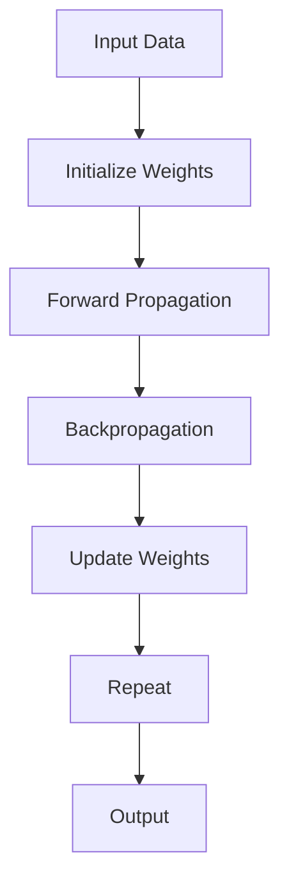

                 


### 引言

#### 数学与人工智能的关系

数学是人工智能（AI）的基石，两者之间密不可分。人工智能的很多核心理论和算法都源于数学，如神经网络中的微积分、机器学习中的概率论与统计等。数学提供了严谨的逻辑框架和工具，使得我们能够从海量数据中提取出有意义的模式和知识。

#### 数学在人工智能发展中的重要性

在人工智能的发展历程中，数学起到了至关重要的作用。它不仅为AI的发展提供了理论基础，还推动了人工智能技术的进步。例如，深度学习算法的崛起，离不开线性代数和微积分的支撑。这些数学工具帮助我们构建了复杂的神经网络模型，使得计算机能够自主学习和决策。

### 背景介绍

#### 核心概念术语说明

- **人工智能**：模拟人类智能的技术和系统，能够感知、学习、推理和自我调整。
- **机器学习**：一种AI方法，通过训练数据集来学习规律，并能够对新数据进行预测或决策。
- **神经网络**：模拟人脑神经元连接的结构，用于解决复杂问题。

#### 问题背景

人工智能技术的发展，使得我们能够处理大量的数据和信息。然而，随着数据量的增加，传统的计算方法已经无法满足需求。数学工具的出现，为解决这些复杂问题提供了可能。

#### 问题描述

在人工智能领域中，我们需要处理的数据通常是高维的，这意味着数据之间存在复杂的非线性关系。如何有效地从这些数据中提取出有用的信息，是当前研究的重点。

#### 问题解决

数学为这个问题提供了一系列解决方案，如深度学习、支持向量机等。这些方法利用数学模型来描述数据之间的关系，从而实现数据的高效处理。

#### 边界与外延

数学在人工智能中的应用，不仅仅局限于算法的设计和实现，还包括数据预处理、特征提取、模型评估等多个环节。这些环节都需要运用数学知识来优化。

#### 概念结构与核心要素组成

人工智能中的数学概念主要包括：

- **线性代数**：处理高维数据、矩阵运算等。
- **微积分**：用于神经网络的学习和优化。
- **概率论与统计**：用于机器学习的理论基础。

这些概念相互联系，共同构成了人工智能中的数学体系。

### 核心概念与联系

#### 线性代数

线性代数是人工智能中不可或缺的一部分，它主要研究向量空间、线性变换、矩阵等概念。在人工智能中，线性代数主要用于处理高维数据、特征提取和模型优化等。

**属性特征对比表格：**

| 概念         | 定义                                                         | 在AI中的应用                               |
| ------------ | ------------------------------------------------------------ | ------------------------------------------ |
| 向量空间     | 由一组向量组成的集合，满足加法和标量乘法的封闭性                | 用于表示和操作数据                          |
| 矩阵         | 由数字组成的二维数组，用于表示线性变换和系统关系               | 用于数据预处理、特征提取和模型优化         |
| 线性变换     | 保持向量空间结构的映射                                      | 用于神经网络中的权重更新和激活函数         |

**ER实体关系图架构的 Mermaid 流程图：**

```mermaid
erDiagram
  AIConcept -->|uses| LinearAlgebra
  AIConcept -->|uses| Calculus
  AIConcept -->|uses| ProbabilityStatistics
```

### 算法原理讲解

#### 深度学习算法

深度学习算法是人工智能中最为重要的算法之一，它基于多层神经网络来实现。下面我们通过一个简单的例子来讲解深度学习算法的原理。

**算法mermaid流程图：**



**Python源代码实现：**

```python
import numpy as np

# 初始化权重
weights = np.random.rand(input_size, hidden_size)

# 前向传播
def forward_propagation(x, weights):
    z = np.dot(x, weights)
    a = sigmoid(z)
    return a

# 反向传播
def backward_propagation(x, y, a, weights):
    error = y - a
    dZ = error * a * (1 - a)
    dW = np.dot(x.T, dZ)
    return dW

# 更新权重
def update_weights(weights, dW, learning_rate):
    weights -= learning_rate * dW
    return weights

# 激活函数
def sigmoid(z):
    return 1 / (1 + np.exp(-z))

# 主函数
def main():
    # 初始化数据
    x = np.array([[1, 0], [0, 1], [1, 1]])
    y = np.array([[0], [1], [1]])

    # 训练模型
    for i in range(epochs):
        a = forward_propagation(x, weights)
        dW = backward_propagation(x, y, a, weights)
        weights = update_weights(weights, dW, learning_rate)

    # 输出结果
    print("Final weights:", weights)

# 参数设置
input_size = 2
hidden_size = 1
learning_rate = 0.1
epochs = 1000

# 运行主函数
main()
```

**算法原理的数学模型和公式：**

- **前向传播：**

  $$ z = \sum_{i=1}^{n} w_i * x_i + b $$

  $$ a = \sigma(z) $$

  其中，\( \sigma \) 是 sigmoid 函数，用于将线性组合转化为概率分布。

- **反向传播：**

  $$ dZ = \frac{\partial L}{\partial Z} * \frac{\partial Z}{\partial a} $$

  $$ dW = \frac{\partial L}{\partial W} = x \cdot dZ $$

  其中，\( L \) 是损失函数，用于衡量预测值与真实值之间的差异。

- **权重更新：**

  $$ W_{new} = W_{old} - \alpha \cdot dW $$

  其中，\( \alpha \) 是学习率，用于控制权重更新的步长。

#### 数学公式

- **Sigmoid 函数：**

  $$ \sigma(z) = \frac{1}{1 + e^{-z}} $$

- **损失函数（交叉熵）：**

  $$ L = -\sum_{i=1}^{n} y_i \cdot \log(a_i) + (1 - y_i) \cdot \log(1 - a_i) $$

### 数学工具与应用

#### 深度学习框架

深度学习框架如 TensorFlow 和 PyTorch，为深度学习算法的实现提供了便捷的工具。这些框架使用了大量的数学工具和库，如 NumPy 和 SciPy，使得深度学习算法的部署和优化变得更加简单。

#### 分布式计算

分布式计算技术，如 MapReduce 和 Hadoop，使得我们能够处理大规模的数据集。这些技术利用了数学中的并行计算理论，从而提高了数据处理的速度和效率。

#### 大数据处理

大数据处理技术，如 Hadoop 和 Spark，使用了数学中的概率论和统计方法，如随机抽样和特征选择，来处理海量数据。这些技术帮助我们提取出数据中的有价值信息。

### 未来人工智能中的数学挑战

#### 高维度数据分析

高维度数据分析是未来人工智能中的一个重要挑战。在处理高维数据时，传统的线性模型已经无法胜任，我们需要开发新的数学模型和算法来应对这个问题。

#### 安全性与隐私保护

随着人工智能技术的发展，数据安全和隐私保护变得越来越重要。我们需要利用数学中的密码学和信息论来设计安全可靠的人工智能系统。

#### 可解释性

可解释性是人工智能领域的一个挑战。我们需要开发新的数学方法，使得人工智能系统的决策过程变得更加透明和可解释。

### 小结

数学在人工智能发展中扮演了至关重要的角色。通过数学工具和方法，我们能够设计出高效的人工智能算法，解决复杂的实际问题。未来，随着人工智能技术的不断进步，数学在人工智能中的应用将会更加深入和广泛。

### 最佳实践 tips

1. **掌握基本数学知识**：了解线性代数、微积分和概率论等基本数学知识，有助于更好地理解人工智能算法。
2. **实践与理论学习相结合**：通过实践来巩固理论知识，同时也要不断学习最新的研究成果。
3. **关注数学与AI的交叉领域**：如计算生物学、数据科学等，这些领域通常有更多的数学应用和创新机会。

### 注意事项

1. **数据安全与隐私保护**：在处理数据时，务必注意数据安全和隐私保护。
2. **可解释性**：在设计人工智能系统时，要考虑系统的可解释性，以便用户理解和信任。

### 拓展阅读

1. **《深度学习》**：Goodfellow, I., Bengio, Y., & Courville, A. (2016). 《深度学习》。
2. **《概率机器学习》**：Bach, F. (2013). 《概率机器学习》。
3. **《线性代数及其应用》**：Strang, G. (2006). 《线性代数及其应用》。

### 作者信息

- 作者：AI天才研究院/AI Genius Institute & 禅与计算机程序设计艺术 /Zen And The Art of Computer Programming

