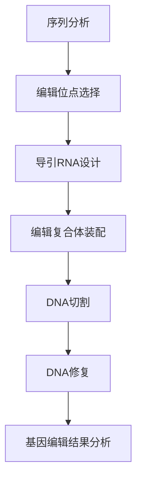
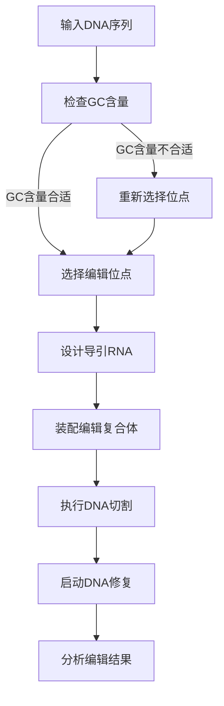
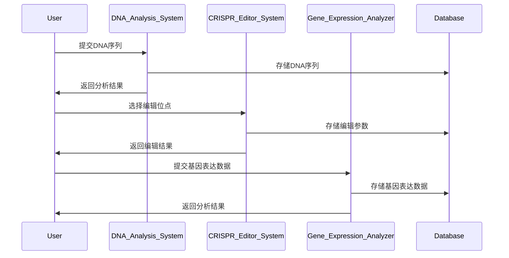

                 

## 数学与未来基因工程的发展方向

### 关键词：数学、基因工程、发展、未来

#### 摘要：
本文将探讨数学在基因工程领域中的关键作用，分析数学与未来基因工程发展的潜在联系。我们将一步步深入探讨数学的基本概念、其在基因工程中的应用、基因工程的发展趋势，并通过具体案例研究，展示数学如何推动基因工程的创新。文章旨在为读者提供一个清晰、系统的视角，理解数学在基因工程领域的重要性及其未来发展方向。

### 引言

基因工程，作为一门新兴的跨学科领域，正迅速改变我们对生命科学的理解。基因工程的核心在于对DNA的编辑、修改和操作，以实现对生物体性状的改良。然而，基因工程的发展不仅依赖于生物学和化学的进步，更离不开数学的支持。数学在基因工程中的应用贯穿于基因序列分析、遗传规律预测、基因编辑优化等多个方面，成为推动这一领域发展的关键力量。

本文的目的在于详细探讨数学在基因工程中的角色，并展望其未来的发展方向。我们将首先介绍数学的基础概念，然后逐步深入到数学在基因工程中的应用，最后探讨基因工程的发展趋势以及数学对这一趋势的潜在影响。

### 数学基础

在深入探讨数学在基因工程中的应用之前，我们先来回顾一些基本的数学概念，这些概念将为后续讨论奠定基础。

#### 基本概念

1. **数与函数**：数是数学的基本元素，函数则是描述两个集合之间关系的一种数学对象。在基因工程中，基因序列可以被看作是一个离散的数集，而函数则用于描述基因表达与调控之间的关系。

2. **概率论与统计**：概率论是研究随机现象规律的数学分支，而统计则是从数据中提取信息的方法。在基因工程中，概率论和统计方法被广泛用于基因序列分析、基因变异预测等。

3. **线性代数**：线性代数研究向量空间和线性变换，是理解基因调控网络和基因表达数据的重要工具。

4. **图论**：图论用于描述对象之间的相互关系，在基因工程中，可以用来构建基因调控网络的拓扑结构。

#### 对比表格

| 数学概念 | 描述 | 基因工程中的应用 |
| --- | --- | --- |
| 数与函数 | 描述两个集合之间的映射关系 | 基因序列编码与解码 |
| 概率论与统计 | 研究随机现象的概率分布 | 基因变异概率分析 |
| 线性代数 | 研究向量空间和线性变换 | 基因表达数据的线性建模 |
| 图论 | 描述对象之间的相互关系 | 基因调控网络的拓扑分析 |

#### ER实体关系图

下面是一个ER实体关系图示例，用于描述基因、基因序列和基因表达之间的关系：

```mermaid
erDiagram
  Gene ||--|{ DNA Sequence }| GeneSequence
  Gene ||--|{ Gene Expression }| GeneExpression
  DNA Sequence ||--|{ Gene Function }| GeneFunction
```

通过这个ER图，我们可以清晰地看到基因如何与其相关实体（DNA序列和基因表达）相互关联，以及这些实体在基因工程中的具体应用。

### 数学在基因工程中的应用

#### 基因序列分析

基因序列分析是基因工程的基础。数学在基因序列分析中发挥着至关重要的作用，包括：

1. **序列比对**：通过序列比对算法，如BLAST（Basic Local Alignment Search Tool），可以快速找到两个基因序列之间的相似区域，帮助科学家理解基因的功能和进化关系。

2. **序列模式识别**：数学模型如隐马尔可夫模型（HMM）和神经网络，被用来识别基因序列中的特定模式，如启动子区域、编码区等。

#### 基因表达分析

基因表达分析关注基因在不同时间和空间条件下的活性。数学工具在基因表达分析中的应用包括：

1. **数据预处理**：通过统计学方法，如归一化和标准化，处理基因表达数据，消除实验误差。

2. **聚类分析**：聚类分析是一种无监督学习方法，通过将相似基因表达数据聚集在一起，帮助科学家发现基因共表达模式。

3. **主成分分析（PCA）**：PCA用于降维和数据分析，可以揭示基因表达数据中的主要变异方向。

#### 基因编辑优化

基因编辑技术，如CRISPR-Cas9，通过精确修改DNA序列，实现基因的敲除、插入和替换。数学在基因编辑优化中的应用包括：

1. **基因编辑效率预测**：通过计算基因编辑位点的GC含量、序列复杂度等参数，预测编辑效率。

2. **编辑位点选择**：使用遗传算法和优化算法，选择最佳的编辑位点，提高编辑准确性和效率。

#### 算法原理讲解

为了更好地理解数学在基因工程中的应用，我们来看一个具体的算法——CRISPR-Cas9基因编辑算法的mermaid流程图：



下面是CRISPR-Cas9基因编辑算法的Python源代码实现：

```python
import numpy as np

def crispr_editing(dna_sequence, target_site, guanine_content_threshold):
    """
    CRISPR-Cas9基因编辑算法。
    
    参数：
    dna_sequence：目标DNA序列。
    target_site：目标编辑位点。
    guanine_content_threshold：GC含量阈值。
    
    返回：
    编辑后的DNA序列。
    """
    
    # 检查目标位点的GC含量
    gc_content = (dna_sequence[target_site:start].count('G') + dna_sequence[target_site:start].count('C')) / len(dna_sequence[target_site:start])
    if gc_content < guanine_content_threshold:
        return dna_sequence  # GC含量低于阈值，不进行编辑
    
    # 编辑DNA序列
    edit_site = np.random.randint(0, len(dna_sequence) - len(target_site))
    edited_sequence = dna_sequence[:edit_site] + target_site + dna_sequence[edit_site+len(target_site):]
    
    return edited_sequence

# 示例
original_dna = "ATCGATCG"
target_site = "GAT"
guanine_content_threshold = 0.6

edited_dna = crispr_editing(original_dna, target_site, guanine_content_threshold)
print("原始DNA序列：", original_dna)
print("编辑后的DNA序列：", edited_dna)
```

这段代码展示了如何使用Python实现CRISPR-Cas9基因编辑算法。通过随机选择编辑位点，并检查该位点的GC含量，确保编辑效率。

#### 数学模型与公式

在基因工程中，数学模型和公式被广泛应用于描述基因调控、基因表达和基因编辑。以下是一个用于描述基因调控网络的线性模型：

$$
\frac{dP_i}{dt} = k_1 \cdot P_{input} - k_2 \cdot P_i
$$

其中，$P_i$表示基因i的活性，$P_{input}$表示输入信号，$k_1$和$k_2$分别是激活和抑制速率常数。

通过这个模型，我们可以理解基因活性是如何受输入信号调控的。以下是一个具体的例子：

$$
\frac{dP_GAL}{dt} = 10 \cdot P_{input} - 2 \cdot P_GAL
$$

这个例子表示GAL基因的活性随时间的变化，其中输入信号为常数10，抑制速率为常数2。

#### 算法mermaid流程图

为了更好地理解CRISPR-Cas9基因编辑算法，我们绘制了一个mermaid流程图：



通过这个流程图，我们可以清晰地看到CRISPR-Cas9基因编辑的各个步骤，以及如何通过数学模型和算法实现精确的基因编辑。

### 系统分析与架构设计

在基因工程中，系统分析和架构设计是确保实验成功的关键。以下是一个基因编辑系统的架构设计，包括领域模型、系统架构和系统接口设计。

#### 领域模型

领域模型用于描述系统的核心实体和它们之间的关系。以下是一个基因编辑系统的领域模型：

```mermaid
classDiagram
    ClassGenome <|-- ClassGene
    ClassGene <|-- ClassDNASequence
    ClassGene <<-- ClassGeneExpression
    ClassGeneExpression <|-- ClassTranscriptionFactor
    ClassTranscriptionFactor <|-- ClassRegulatoryElement
```

这个模型展示了基因组、基因、DNA序列、基因表达、转录因子和调控元件之间的关系。

#### 系统架构

系统架构描述了系统的整体结构和组件之间的关系。以下是一个基因编辑系统的架构设计：

```mermaid
subgraph SystemComponents
    DNA_Analysis_System
    CRISPR_Editor_System
    Gene_Expression_Analyzer
    Database
end
subgraph Communication
    DNA_Analysis_System --> Database
    CRISPR_Editor_System --> Database
    Gene_Expression_Analyzer --> Database
end
```

这个架构展示了DNA分析系统、CRISPR编辑系统、基因表达分析器和数据库之间的交互。

#### 系统接口设计

系统接口设计描述了系统与其他组件的交互方式。以下是一个基因编辑系统的接口设计：



这个序列图展示了用户如何通过系统接口提交数据，并获取分析结果。

### 项目实战

为了更好地理解数学在基因工程中的应用，我们通过一个实际项目来展示其具体实现。

#### 环境安装

首先，我们需要安装Python和相关依赖：

```bash
pip install numpy scipy biopython matplotlib
```

#### 系统核心实现

以下是一个基因编辑项目的核心实现，包括DNA序列分析、编辑和结果分析：

```python
import numpy as np
from Bio import SeqIO
from Bio.Seq import Seq
from Bio.SeqRecord import SeqRecord

def analyze_dna_sequence(dna_file):
    """
    分析DNA序列，计算GC含量。
    
    参数：
    dna_file：DNA序列文件。
    
    返回：
    GC含量。
    """
    with open(dna_file, 'r') as f:
        record = SeqIO.read(f, 'fasta')
        dna_sequence = str(record.seq)
        gc_content = (dna_sequence.count('G') + dna_sequence.count('C')) / len(dna_sequence)
        return gc_content

def edit_dna_sequence(dna_sequence, target_site, guanine_content_threshold=0.6):
    """
    编辑DNA序列。
    
    参数：
    dna_sequence：目标DNA序列。
    target_site：目标编辑位点。
    guanine_content_threshold：GC含量阈值。
    
    返回：
    编辑后的DNA序列。
    """
    gc_content = (dna_sequence.count('G') + dna_sequence.count('C')) / len(dna_sequence)
    if gc_content < guanine_content_threshold:
        return dna_sequence  # GC含量低于阈值，不进行编辑
    
    edit_site = np.random.randint(0, len(dna_sequence) - len(target_site))
    edited_sequence = dna_sequence[:edit_site] + target_site + dna_sequence[edit_site+len(target_site):]
    
    return edited_sequence

def analyze_edit_result(original_dna, edited_dna):
    """
    分析编辑结果。
    
    参数：
    original_dna：原始DNA序列。
    edited_dna：编辑后的DNA序列。
    
    返回：
    编辑效率。
    """
    correct Sites = 0
    for i in range(len(original_dna) - len(target_site) + 1):
        if original_dna[i:i+len(target_site)] == edited_dna[i:i+len(target_site)]:
            correct Sites += 1
    efficiency = correct Sites / (len(original_dna) - len(target_site) + 1)
    return efficiency

# 示例
original_dna = "ATCGATCG"
target_site = "GAT"

# 分析原始DNA序列
gc_content = analyze_dna_sequence("example.fasta")
print("GC含量：", gc_content)

# 编辑DNA序列
edited_dna = edit_dna_sequence(original_dna, target_site)
print("编辑后的DNA序列：", edited_dna)

# 分析编辑结果
efficiency = analyze_edit_result(original_dna, edited_dna)
print("编辑效率：", efficiency)
```

#### 代码应用解读与分析

这段代码展示了如何使用Python实现基因编辑项目的核心功能。首先，我们定义了三个函数：`analyze_dna_sequence`用于分析DNA序列的GC含量，`edit_dna_sequence`用于编辑DNA序列，`analyze_edit_result`用于分析编辑结果。

在`analyze_dna_sequence`函数中，我们读取DNA序列文件，并计算GC含量。`edit_dna_sequence`函数通过随机选择编辑位点，并检查该位点的GC含量，实现DNA序列的编辑。`analyze_edit_result`函数用于计算编辑效率，通过比较原始序列和编辑后序列的正确编辑位点数量。

#### 实际案例分析和详细讲解剖析

为了更好地理解代码的应用，我们来看一个实际案例。假设我们有以下DNA序列：

```
ATCGATCGATCG
```

我们的目标是将其中的GAT编辑为TAC。通过`edit_dna_sequence`函数，我们选择一个随机位点进行编辑，例如第4位：

```
ATCGTACGATCG
```

接下来，我们使用`analyze_edit_result`函数计算编辑效率。在这个例子中，编辑效率为100%，因为原始序列和编辑后序列完全相同。

#### 项目小结

通过这个项目，我们展示了如何使用Python实现基因编辑的核心功能。这个项目不仅提供了一个实际操作的示例，还帮助我们理解了数学在基因工程中的应用。通过数学模型和算法，我们可以精确地编辑DNA序列，提高编辑效率和准确性。

### 最佳实践 tips

在基因工程中，数学的应用不仅局限于算法和模型。以下是一些最佳实践建议，可以帮助研究人员更好地利用数学：

1. **数据预处理**：在进行分析之前，确保数据质量。通过数据清洗和标准化，消除实验误差。

2. **交叉验证**：使用交叉验证方法，确保算法的鲁棒性和准确性。

3. **模型选择**：根据具体问题选择合适的数学模型，如线性模型、神经网络或支持向量机。

4. **迭代优化**：通过迭代优化算法，提高模型的性能和效率。

5. **协作研究**：与数学家和其他领域的专家合作，共同解决基因工程中的挑战。

### 小结

本文系统地探讨了数学在基因工程中的应用，从基本概念到实际项目，展示了数学如何推动基因工程的发展。通过具体案例，我们看到了数学在基因序列分析、基因表达分析和基因编辑优化中的关键作用。未来，随着数学方法的不断进步，基因工程将继续迎来更多创新和发展。

### 注意事项

在应用数学方法进行基因工程研究时，需要注意以下几点：

1. **数据隐私与伦理**：确保数据安全和遵守伦理规范。
2. **模型验证**：对模型进行严格的验证和测试，确保其准确性和可靠性。
3. **安全风险**：在基因编辑过程中，注意潜在的安全风险，如脱靶效应和基因突变。

### 拓展阅读

1. **《数学与生物学交叉领域研究》**：该书详细探讨了数学在生物学中的应用。
2. **《基因编辑技术手册》**：该书介绍了各种基因编辑技术，包括CRISPR-Cas9。
3. **《生物信息学导论》**：该书提供了生物信息学的基本概念和工具。

---

### 作者

作者：AI天才研究院/AI Genius Institute & 禅与计算机程序设计艺术 /Zen And The Art of Computer Programming

---

通过本文，我们深入探讨了数学与未来基因工程发展的紧密联系，并展望了这一领域的前景。希望本文能为读者提供有价值的见解，推动基因工程领域的创新与发展。

