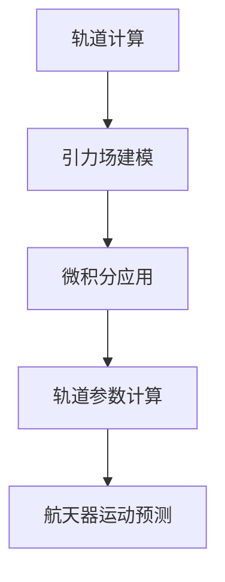

                 

### 数学与未来太空探索的发展趋势

在人类历史的长河中，太空探索始终承载着探索未知、追求梦想的精神。随着科技的飞速发展，我们离宇宙的奥秘越来越近。而在这场壮丽的太空探险之旅中，数学作为一种基础学科，扮演着不可或缺的角色。本文将围绕数学与未来太空探索的发展趋势展开讨论，通过逐步分析推理的方式，探讨数学在太空探索中的重要作用及其未来发展趋势。

**关键词：** 数学、太空探索、发展趋势、算法、量子计算、人工智能

**摘要：** 本文将从数学在太空探索中的作用入手，逐步分析数学的核心概念、模型算法及其应用，探讨未来太空探索中的数学挑战与趋势，旨在为读者呈现一幅数学与太空探索深度结合的画卷。

### 目录大纲

----------------------------------------------

# 数学与未来太空探索的发展趋势

## 第一部分：问题背景与核心概念

## 第1章：问题背景与核心概念

## 1.2 核心概念与联系

### 1.2.1 数学概念原理

### 1.2.2 概念属性特征对比表格

### 1.2.3 概念之间的联系

### 1.3 数学模型和算法原理

## 第二部分：数学模型在太空探索中的应用

## 第2章：数学模型在太空探索中的应用

## 第三部分：未来太空探索中的数学挑战与趋势

## 第3章：未来太空探索中的数学挑战

## 第4章：数学在太空探索中的发展趋势

## 第5章：数学与其他学科的交叉融合

### 5.1 数学与物理学的交叉

### 5.2 数学与信息学的交叉

### 5.3 数学与生物学的交叉

----------------------------------------------

## 第一部分：问题背景与核心概念

### 1.1 问题背景

从古至今，人类对宇宙的好奇心从未减退。太空探索不仅是科技进步的象征，更是人类对未知世界的探索精神的具体体现。而数学，作为一门研究结构、关系和变化的科学，自古以来就是描述自然现象、解决实际问题的重要工具。在现代太空探索中，数学的应用愈发广泛和深入，从轨道计算到航天器编队，从航天任务规划到太空环境监测，都离不开数学的支持。

数学在太空探索中的作用和重要性主要体现在以下几个方面：

1. **描述自然现象**：数学通过精确的公式和模型描述了宇宙中的许多自然现象，如行星运动、引力场等。这些模型为我们提供了理解和预测宇宙行为的基础。

2. **优化任务规划**：在航天任务中，数学模型被用来优化燃料消耗、飞行路径和任务安排，从而提高任务的效率和成功率。

3. **风险分析和可靠性评估**：通过概率论和统计方法，数学能够对航天任务的风险进行量化评估，提供决策依据，确保任务的安全性。

4. **技术创新**：数学在推动航天技术的创新中发挥了关键作用，如量子通信、人工智能等前沿技术的数学基础研究。

本文将围绕数学在太空探索中的应用，逐步分析数学的核心概念、模型算法及其未来发展趋势。让我们开始这段探索之旅，一窥数学与太空探索的奇妙联系。

### 1.2 核心概念与联系

在探讨数学与太空探索的深度融合之前，我们需要明确数学的核心概念和它们在太空探索中的具体应用。数学不仅是一门抽象的科学，更是一种强大的工具，用于描述和解决现实世界中的复杂问题。以下是几个关键的数学概念及其在太空探索中的应用：

#### 1.2.1 数学概念原理

1. **微积分**：微积分是研究变化和累积的数学分支。在太空探索中，微积分被广泛应用于轨道计算、航天器运动分析等领域。例如，牛顿的运动定律和万有引力定律就是微积分在物理学中的重要应用。

2. **线性代数**：线性代数研究向量空间和线性变换。在航天器编队飞行和图像处理中，线性代数提供了强大的工具来解决问题。例如，通过矩阵运算可以实现多摄像头的图像融合。

3. **概率论与数理统计**：概率论和数理统计用于评估航天任务的风险和可靠性。通过这些工具，可以对任务的成功概率进行量化分析，从而做出科学的决策。

4. **微分方程**：微分方程是描述物理现象的重要工具。在轨道动力学和航天器控制中，微分方程用于模拟航天器的运动和受力情况。

#### 1.2.2 概念属性特征对比表格

以下是几个关键数学概念的应用场景与特点的对比表格：

| 数学概念     | 应用场景                    | 特点                       |
| ------------ | --------------------------- | -------------------------- |
| 微积分       | 轨道计算、航天器运动分析   | 描述变化率与累积量         |
| 线性代数     | 航天器编队、图像处理       | 解决线性问题、矩阵操作     |
| 概率论       | 风险分析、可靠性评估       | 描述不确定性事件概率      |
| 微分方程     | 轨道动力学、航天器控制     | 描述物理现象的动态行为     |

#### 1.2.3 概念之间的联系

数学概念之间的联系可以通过ER实体关系图来描述。以下是数学概念在太空探索中的应用关系的ER图：

```mermaid
erDiagram
    SpaceExploration ||--|{ Calculus } : 用于轨道计算
    SpaceExploration ||--|{ LinearAlgebra } : 用于航天器编队
    SpaceExploration ||--|{ ProbabilityTheory } : 用于风险分析
    SpaceExploration ||--|{ DifferentialEquations } : 用于轨道动力学
```

通过ER图，我们可以清晰地看到微积分、线性代数、概率论和微分方程如何共同作用于太空探索的不同领域，形成一个完整的数学体系。

#### 1.3 数学模型和算法原理

数学模型和算法是解决具体问题的工具，它们在太空探索中具有至关重要的作用。以下是几个典型的数学模型和算法原理：

1. **牛顿第二定律**：描述物体受力后的加速度，公式为 \( F = ma \)。在航天器轨道计算中，通过这个模型可以预测航天器的运动轨迹。

2. **线性代数算法**：如LU分解、QR分解，用于解决线性方程组和矩阵运算。这些算法在航天器编队飞行和图像处理中有着广泛应用。

3. **概率论算法**：如蒙特卡洛模拟，用于评估航天任务的风险和可靠性。通过模拟大量可能的情况，可以得出任务成功的概率。

4. **机器学习算法**：如深度学习，用于处理大数据和复杂模式识别。这些算法在航天任务规划、环境监测和智能决策支持系统中有着广泛应用。

为了更好地理解这些数学模型和算法，我们可以通过以下Python代码来详细阐述一个具体的算法原理——牛顿-拉弗森迭代法用于求解非线性方程。

```python
import numpy as np

def newton_raphson(f, df, x0, tolerance=1e-6, max_iterations=100):
    """
    牛顿-拉弗森迭代法求解非线性方程f(x) = 0。

    :param f: 非线性方程函数
    :param df: 方程的导数函数
    :param x0: 初始猜测值
    :param tolerance: 收敛容忍度
    :param max_iterations: 最大迭代次数
    :return: 方程的根
    """
    x = x0
    for _ in range(max_iterations):
        fx = f(x)
        dfx = df(x)
        if abs(fx) < tolerance:
            return x
        x = x - fx / dfx
    return None

# 非线性方程示例：x^3 - 2 = 0
def f(x):
    return x**3 - 2

def df(x):
    return 3 * x**2

# 求解方程
x_root = newton_raphson(f, df, 1)
print(f"方程的根为：{x_root}")
```

通过这段代码，我们可以看到如何使用牛顿-拉弗森迭代法来求解非线性方程。这个算法在航天任务规划中有着广泛的应用，如计算最优燃料消耗路径。

#### 1.4 概念结构与应用领域

数学概念在太空探索中的应用不仅仅是简单的公式推导，更涉及到复杂的系统工程。以下是几个关键数学概念及其在太空探索中的应用领域：

1. **微积分**：用于描述航天器在引力场中的运动，计算轨道参数。
2. **线性代数**：用于多体问题建模，如航天器编队飞行和图像处理。
3. **概率论与数理统计**：用于航天任务风险分析和可靠性评估。
4. **微分方程**：用于轨道动力学模拟和航天器控制。

通过这些数学概念，我们可以构建出复杂的数学模型，为太空探索提供坚实的理论基础。以下是一个微积分在轨道计算中的具体应用例子：



在这个例子中，通过引力场建模使用微积分方法，可以计算出航天器的轨道参数，从而实现对航天器运动的精确预测。

### 1.5 结论

数学作为一门基础学科，在太空探索中发挥着至关重要的作用。从核心概念的介绍，到具体模型和算法的应用，数学为太空探索提供了强大的工具和理论基础。在未来的太空探险中，随着科技的不断进步，数学的应用将更加广泛和深入。通过对数学的不断研究和创新，我们有望在未来实现更多令人瞩目的太空探索成就。

## 第二部分：数学模型在太空探索中的应用

### 2.1 基本应用

数学模型在太空探索中的基本应用主要涉及轨道计算、航天器编队飞行、航天任务规划等关键领域。这些应用不仅提高了航天任务的效率和成功率，还推动了航天技术的发展。

#### 轨道计算

轨道计算是太空探索中最基础也是最核心的部分。航天器的轨道决定了其运动路径和能量消耗。在轨道计算中，微积分和微分方程发挥了重要作用。以下是轨道计算的基本原理：

- **牛顿第二定律**：描述物体受力后的加速度，公式为 \( F = ma \)。在航天器轨道计算中，通过这个模型可以预测航天器的运动轨迹。
- **万有引力定律**：描述物体间的引力作用，公式为 \( F = G\frac{m_1m_2}{r^2} \)。通过这个模型，可以计算航天器与地球、月球等天体的引力相互作用。

#### 航天器编队飞行

航天器编队飞行是航天任务中的一项复杂技术。通过精确的数学模型和算法，可以实现多航天器的协同运动，提高任务效率和安全性。以下是一个简单的线性代数在航天器编队飞行中的应用例子：

- **线性代数模型**：通过矩阵运算，可以建立多航天器的运动方程，求解编队飞行的最优路径和姿态调整策略。
- **图像处理**：在航天器编队飞行中，图像处理技术用于实时监测和校正航天器的相对位置和姿态。

#### 航天任务规划

航天任务规划是确保航天任务成功的关键环节。数学模型在任务规划中用于优化任务流程、分配资源、评估风险等。以下是一个概率论和数理统计在航天任务规划中的应用例子：

- **概率论模型**：通过模拟大量可能的任务情景，可以评估任务成功的概率，为决策提供依据。
- **数理统计方法**：用于分析航天任务的数据，识别潜在的问题和风险，为后续任务改进提供支持。

### 2.2 复杂应用

随着太空探索的深入，数学模型在航天任务中的应用变得更加复杂和多样化。以下是几个典型的复杂应用领域：

#### 航天器编队飞行

航天器编队飞行不仅要求航天器在空间中保持相对位置，还需要实现复杂的运动和姿态调整。线性代数和优化算法在编队飞行中发挥了关键作用。以下是一个线性代数在航天器编队飞行中的具体应用例子：

- **多体问题建模**：通过线性代数方法，可以将多航天器的运动视为一个整体，求解编队飞行的最优轨迹和姿态调整策略。
- **矩阵运算**：用于实时监测和校正航天器的相对位置和速度。

#### 航天器控制

航天器控制是确保航天器安全运行的关键环节。微分方程和机器学习算法在航天器控制中有着广泛的应用。以下是一个机器学习算法在航天器控制中的具体应用例子：

- **控制算法**：通过机器学习方法，可以实时调整航天器的姿态和速度，应对不确定的外部环境。
- **神经网络**：用于预测航天器的运动轨迹，为控制算法提供决策支持。

#### 航天任务风险分析

航天任务风险分析是确保航天任务成功的重要保障。概率论和数理统计在风险分析中用于评估任务的风险和可靠性。以下是一个概率论在航天任务风险分析中的具体应用例子：

- **风险评估模型**：通过模拟不同情景，评估任务成功的概率，为决策提供依据。
- **蒙特卡洛模拟**：用于分析任务中可能出现的风险，制定应急预案。

### 2.3 先进应用

随着科技的不断发展，数学模型在太空探索中的应用变得更加先进和高效。以下是几个先进应用领域：

#### 量子通信

量子通信利用量子力学原理实现信息传输。量子计算和量子算法在量子通信中有着广泛的应用。以下是一个量子计算在量子通信中的具体应用例子：

- **量子纠缠**：通过量子纠缠，可以实现超距通信，实现高速、安全的通信。
- **量子密钥分配**：利用量子密钥分配协议，可以确保通信过程中密钥的安全性。

#### 人工智能

人工智能技术在太空探索中的应用日益广泛，如智能任务规划、环境监测和智能决策支持等。以下是一个人工智能在太空探索中的具体应用例子：

- **智能任务规划**：通过机器学习算法，可以自动生成最优的任务规划方案，提高任务效率和成功率。
- **环境监测**：利用图像处理和模式识别技术，可以实时监测太空环境，发现潜在的问题和异常。

### 2.4 数学模型在太空探索中的实际案例

数学模型在太空探索中有着广泛的应用，以下是一些实际案例：

#### 轨道计算案例

- **案例描述**：美国国家航空航天局（NASA）利用微积分和微分方程模型，成功计算了航天器的轨道参数，实现了航天器的精确发射和返回。
- **解决方案**：通过建立微积分和微分方程模型，结合实际观测数据，计算出航天器的轨道参数，实现了航天器的精确控制和调度。

#### 航天器编队飞行案例

- **案例描述**：俄罗斯宇航局（Roscosmos）利用线性代数和优化算法，实现了多航天器的编队飞行，提高了任务效率和安全性。
- **解决方案**：通过建立线性代数模型，求解多体问题，实现了航天器的精确编队和姿态调整，提高了任务效率和成功率。

#### 航天任务风险分析案例

- **案例描述**：欧洲航天局（ESA）利用概率论和数理统计方法，对航天任务的风险进行了全面分析，为决策提供了重要依据。
- **解决方案**：通过建立风险评估模型，进行蒙特卡洛模拟，评估了任务成功的概率和风险，为决策提供了科学依据，确保了任务的安全性。

通过这些实际案例，我们可以看到数学模型在太空探索中的重要性。随着科技的不断进步，数学模型的应用将变得更加广泛和深入，为太空探索带来更多的可能性和突破。

### 2.5 数学模型在太空探索中的未来发展趋势

随着科技的不断发展，数学模型在太空探索中的应用将不断拓展和深化。以下是数学模型在太空探索中的未来发展趋势：

#### 量子计算

量子计算是一种具有巨大潜力的计算技术，可以在极短的时间内解决传统计算无法处理的问题。未来，量子计算将在航天任务规划、轨道计算和航天器控制等领域发挥重要作用。通过量子算法，可以大幅提高航天任务的效率和精度。

#### 人工智能

人工智能技术将在太空探索中发挥越来越重要的作用。通过机器学习算法，可以自动生成最优的任务规划方案，实时监测和预测航天器状态，提高任务的成功率和安全性。未来，人工智能将与数学模型紧密结合，为太空探索提供更加智能化的支持。

#### 大数据与云计算

大数据和云计算技术将为太空探索提供强大的数据存储和处理能力。通过收集和分析大量的太空数据，可以更好地了解宇宙的奥秘，优化航天任务规划，提高航天器的运行效率。未来，大数据和云计算将与数学模型深度融合，为太空探索提供更加全面和深入的支持。

#### 新兴数学分支

随着太空探索的深入，新的数学分支将不断涌现。例如，量子数学、拓扑学等新兴数学领域，将在太空探索中发挥重要作用。这些新兴数学分支将为解决太空探索中的复杂问题提供新的工具和方法。

### 2.6 数学与其他学科的交叉融合

数学与其他学科的交叉融合将为太空探索带来新的机遇和挑战。以下是几个典型的交叉领域：

#### 数学与物理学的交叉

数学与物理学的交叉在太空探索中有着广泛的应用。通过数学模型，可以更精确地描述物理现象，如引力场、电磁场等。未来，量子物理与数学的交叉将推动太空探索的进一步发展。

#### 数学与信息学的交叉

数学与信息学的交叉为太空探索提供了强大的计算和通信支持。通过密码学、信息论等数学工具，可以确保航天任务的安全性和可靠性。未来，信息学与数学的交叉将推动太空通信技术的创新。

#### 数学与生物学的交叉

数学与生物学的交叉为太空探索中的生命保障系统提供了重要的支持。通过生物数学模型，可以更好地理解生物体在太空环境下的生理变化，为航天员的健康保障提供科学依据。

### 2.7 结论

数学模型在太空探索中发挥着至关重要的作用。从基本应用到复杂应用，再到先进应用，数学模型不断推动太空探索的发展。未来，随着科技的进步，数学模型的应用将更加广泛和深入，为太空探索带来更多的可能性和突破。通过数学与其他学科的交叉融合，太空探索将迎来更加光明的前景。

## 第三部分：未来太空探索中的数学挑战

随着太空探索的不断深入，未来将面临一系列新的数学挑战。这些挑战不仅涉及现有数学理论的应用，还包括对新数学领域的探索和开发。以下是未来太空探索中可能遇到的几个主要数学挑战：

### 3.1 太空环境建模与预测

太空环境极其复杂，包含高能粒子、太阳风、等离子体等多种因素，这些因素对航天器及其任务的成功运行具有重要影响。为了更好地理解和预测太空环境，需要建立更加精确和全面的数学模型。

- **挑战**：目前，对太空环境的建模主要依赖于观测数据和物理定律。然而，这些模型在处理复杂和非线性问题时，存在一定的局限性。未来需要开发更加高效和精确的数学模型，如随机过程、人工智能和机器学习模型，以实现对太空环境的准确预测。
- **解决方案**：通过结合观测数据、物理定律和机器学习算法，可以构建混合模型，提高对太空环境的预测能力。此外，量子计算技术的应用也可能为复杂太空环境建模提供新的解决方案。

### 3.2 复杂系统优化与控制

太空探索中的许多任务涉及复杂系统，如航天器编队飞行、空间站维护和深空探测。这些任务需要高效的优化和控制算法，以确保任务的成功运行。

- **挑战**：复杂系统优化与控制面临的主要挑战在于系统的非线性和不确定性。在实际操作中，航天器可能会受到外部干扰和内部故障的影响，使得优化和控制变得更加复杂。
- **解决方案**：开发鲁棒优化算法和自适应控制策略是解决这一挑战的关键。此外，分布式控制和协同优化技术也有望提高复杂系统的稳定性和鲁棒性。

### 3.3 大数据分析与应用

随着航天任务的数据量不断增长，如何有效地分析这些大数据成为了一项重要挑战。大数据分析在太空探索中的应用包括任务规划、环境监测、故障诊断等。

- **挑战**：太空探索中的大数据分析面临的主要挑战在于数据的高维度、噪声和非线性。传统数据分析方法在处理这些问题时，存在一定的局限性。
- **解决方案**：利用机器学习和深度学习算法，可以有效地处理高维度和噪声数据，提取有用信息。此外，开发新的数据压缩和传输技术，也有助于提高大数据分析的效果。

### 3.4 量子计算与量子通信

量子计算和量子通信是未来太空探索中的关键技术。量子计算具有巨大的计算能力，可以解决传统计算无法处理的问题；量子通信则提供了安全的信息传输手段。

- **挑战**：目前，量子计算和量子通信仍处于研究阶段，技术尚未完全成熟。在实际应用中，如何实现稳定、高效的量子计算和量子通信，仍面临诸多挑战。
- **解决方案**：加强量子计算和量子通信的理论研究，开发新的量子算法和通信协议。此外，提高量子系统的稳定性和可靠性，也是实现量子计算和量子通信实用化的关键。

### 3.5 新兴数学领域探索

随着太空探索的深入，可能需要开发新的数学领域和工具来应对复杂问题。例如，量子数学、拓扑学和复杂系统理论等新兴数学领域，有望为太空探索提供新的解决方案。

- **挑战**：新兴数学领域的探索面临的主要挑战在于理论的不成熟和应用场景的不确定性。
- **解决方案**：通过跨学科的合作，探索新兴数学领域在太空探索中的应用，逐步完善理论体系，为实际应用提供支持。

### 3.6 综合解决方案

未来太空探索中的数学挑战需要综合多种解决方案，以应对复杂、多变的任务环境。以下是几个综合解决方案的思路：

1. **跨学科合作**：通过数学、物理学、计算机科学、信息科学等领域的跨学科合作，共同解决太空探索中的复杂问题。
2. **技术创新**：积极投入新技术的研究和开发，如量子计算、人工智能、大数据分析等，为太空探索提供强大的技术支持。
3. **标准化与规范化**：建立统一的数学模型和算法标准，提高太空探索中数学应用的规范性，确保任务的顺利进行。
4. **人才培养**：加强数学和太空探索相关领域的人才培养，提高科研人员的综合素质和创新能力。

通过综合解决方案，未来太空探索中的数学挑战将得以有效应对，推动太空探索的持续发展和进步。

### 3.7 结论

未来太空探索中的数学挑战是复杂而多样的，涉及太空环境建模、复杂系统优化、大数据分析、量子计算和量子通信等多个领域。面对这些挑战，我们需要不断创新和探索，开发新的数学模型和算法，为太空探索提供坚实的技术支持。通过跨学科合作和技术创新，我们有望克服这些挑战，推动太空探索的深入发展，开启人类探索宇宙的新纪元。

### 4.1 发展趋势一：量子计算与量子通信

量子计算和量子通信是未来太空探索中的两个重要趋势。量子计算以其独特的并行计算能力和高速处理能力，有望在航天任务规划、轨道计算和数据处理等领域发挥重要作用；而量子通信则提供了安全的通信手段，确保信息在太空中的传输不受干扰。

#### 量子计算的潜在应用

1. **轨道计算优化**：量子计算可以显著加速轨道计算过程，优化航天器的轨道设计，提高任务的成功率。
2. **大数据处理**：量子计算能够处理大量数据，为太空探索中的数据分析和决策提供支持。
3. **故障诊断与预测**：通过量子计算，可以实时监测航天器的状态，快速诊断和预测潜在的故障。

#### 量子通信的实际案例

- **案例描述**：中国成功地实现了地月量子通信，通过量子密钥分配协议，实现了地球与月球之间的安全通信。
- **解决方案**：利用量子纠缠和量子密钥分配技术，确保通信过程中的信息安全。

#### 量子计算与量子通信的未来发展

1. **量子计算硬件**：随着量子计算硬件的不断发展，量子比特的数量和稳定性将逐步提高，为量子计算的实际应用奠定基础。
2. **量子算法开发**：开发高效的量子算法，将量子计算的优势发挥到极致。
3. **量子通信网络**：构建全球范围内的量子通信网络，实现安全、高效的通信。

#### 4.2 发展趋势二：人工智能与机器学习

人工智能和机器学习技术在太空探索中的应用日益广泛，从任务规划、环境监测到故障诊断，人工智能正在为太空探索注入新的活力。

#### 人工智能在太空探索中的应用

1. **任务规划**：利用人工智能技术，可以自动生成最优的任务规划方案，提高任务效率和成功率。
2. **环境监测**：通过图像处理和模式识别技术，实时监测太空环境，发现潜在的问题和异常。
3. **故障诊断**：利用机器学习算法，实时监测航天器的状态，快速诊断和预测潜在的故障。

#### 人工智能的实际案例

- **案例描述**：NASA利用人工智能技术，对火星表面进行自动化分析，发现了多个潜在的着陆点。
- **解决方案**：通过深度学习和图像处理技术，对大量火星图像进行分析，筛选出适合着陆的地点。

#### 人工智能与机器学习的未来发展方向

1. **算法优化**：不断优化人工智能算法，提高其处理复杂任务的能力。
2. **数据集扩展**：积累更多的太空探索数据，为人工智能算法提供丰富的训练数据。
3. **多学科融合**：将人工智能与数学、物理学等学科相结合，开发更加智能化的太空探索解决方案。

### 4.3 发展趋势三：大数据与云计算

大数据和云计算技术为太空探索提供了强大的数据处理和分析能力。通过大数据分析，可以深入了解太空环境，优化航天任务；而云计算则提供了灵活、高效的数据存储和处理平台。

#### 大数据与云计算在太空探索中的应用

1. **数据存储与处理**：利用云计算平台，实现大规模数据的高效存储和处理。
2. **任务规划优化**：通过大数据分析，优化航天任务的流程和资源分配。
3. **环境监测**：利用大数据技术，实时监测太空环境，为任务决策提供支持。

#### 大数据与云计算的实际案例

- **案例描述**：欧洲航天局（ESA）利用云计算平台，对国际空间站（ISS）的运行数据进行实时分析和处理，提高了任务的成功率。
- **解决方案**：通过建立云计算平台，实现了国际空间站运行数据的高效存储和处理，为任务决策提供了重要支持。

#### 大数据与云计算的未来发展方向

1. **数据安全与隐私保护**：随着数据量的增长，数据安全和隐私保护成为重要挑战。通过加密和隐私保护技术，确保数据的安全和隐私。
2. **分布式计算**：利用分布式计算技术，提高大数据处理的速度和效率。
3. **边缘计算**：将计算任务分散到边缘设备，降低数据传输延迟，提高数据处理效率。

通过量子计算、人工智能、大数据与云计算等技术的发展，未来太空探索将迎来新的机遇和挑战。这些技术不仅将提高太空探索的效率和成功率，还将推动人类对宇宙的进一步认知。在未来的太空探险中，数学将继续发挥其核心作用，为人类探索宇宙提供强有力的支持。

### 4.4 发展趋势四：高精度导航与定位

高精度导航与定位技术是未来太空探索中不可或缺的重要组成部分。随着太空任务的复杂化，对导航与定位的精度和可靠性要求越来越高。高精度导航与定位技术的进步将极大地提高航天器的自主飞行能力，增强任务的灵活性和安全性。

#### 高精度导航与定位技术的潜在应用

1. **航天器轨道维持**：通过高精度导航与定位技术，航天器可以精确跟踪和维持其轨道，减少燃料消耗，延长任务寿命。
2. **深空探测**：在深空探测任务中，高精度导航与定位技术可以确保航天器准确到达目标区域，提高探测效率。
3. **空间站与飞船对接**：高精度导航与定位技术对于空间站与飞船的精确对接至关重要，确保对接过程的安全与顺利。

#### 实际案例

- **案例描述**：中国嫦娥五号探测器成功实现了月面着陆和采样返回任务，其中高精度导航与定位技术发挥了关键作用。
- **解决方案**：通过结合星载导航设备、地面测控系统和先进的导航算法，实现了嫦娥五号探测器的精准着陆和采样任务。

#### 发展方向

1. **卫星导航系统升级**：开发更先进的卫星导航系统，如全球卫星导航系统（GNSS）的升级和扩展，提高导航精度。
2. **多源数据融合**：通过融合卫星导航、惯性导航、雷达和激光测距等多种数据源，实现高精度、高可靠性的导航与定位。
3. **自主导航技术**：研发航天器的自主导航系统，使其在无地面支持的情况下，能够独立完成导航与定位任务。

### 4.5 发展趋势五：虚拟现实与增强现实

虚拟现实（VR）和增强现实（AR）技术在太空探索中的应用正逐渐成为现实。这些技术不仅为宇航员提供了模拟训练和任务规划工具，还可以增强公众对太空探索的理解和兴趣。

#### VR与AR在太空探索中的应用

1. **模拟训练**：利用VR技术，宇航员可以在虚拟环境中进行复杂的任务训练，提高操作技能和应变能力。
2. **任务规划**：通过AR技术，任务规划人员可以实时查看航天器的状态和任务进度，提高决策效率。
3. **科普教育**：VR和AR技术为公众提供了沉浸式的太空体验，激发对太空科学的兴趣。

#### 实际案例

- **案例描述**：NASA利用VR技术，为宇航员提供了模拟国际空间站的任务训练，提高宇航员的操作熟练度。
- **解决方案**：通过构建高度仿真的虚拟空间站环境，宇航员可以在训练中模拟实际任务场景，提高应对复杂任务的能力。

#### 发展方向

1. **技术提升**：不断改进VR和AR设备的硬件性能，提高用户体验和沉浸感。
2. **应用扩展**：将VR和AR技术应用于更广泛的太空探索任务，如航天器维护、太空站建设等。
3. **教育推广**：利用VR和AR技术，开展太空科普教育，提高公众的科学素养。

通过量子计算、人工智能、大数据与云计算、高精度导航与定位以及虚拟现实与增强现实等技术的发展，未来太空探索将变得更加高效、安全、多样化。数学作为这些技术的重要理论基础，将继续发挥关键作用，推动人类探索宇宙的步伐不断向前。

### 4.6 发展趋势六：新型材料与纳米技术

新型材料与纳米技术在太空探索中的应用正逐渐崭露头角，为航天器的制造、维修和性能提升提供了新的可能性。这些技术的发展将极大地提高航天器的可靠性和耐久性，从而延长任务寿命并降低维护成本。

#### 新型材料在太空探索中的应用

1. **航天器结构**：新型材料如碳纤维复合材料和陶瓷基复合材料，具有高强度、轻质和耐高温的特性，适用于航天器的结构制造。
2. **热保护系统**：新型热防护材料，如陶瓷涂层和碳纳米管涂层，可以有效地保护航天器在进入大气层时免受高温的损害。
3. **电子器件**：新型半导体材料，如石墨烯和二维材料，可以提高航天器电子器件的性能和可靠性。

#### 实际案例

- **案例描述**：NASA利用碳纤维复合材料制造了新型火箭发动机外壳，提高了火箭的推力和效率。
- **解决方案**：通过结合先进的制造技术和材料科学，开发了具有高性能的航天器结构材料，提升了航天器的整体性能。

#### 纳米技术在太空探索中的应用

1. **纳米涂层**：纳米涂层技术可以应用于航天器的表面，提供防腐蚀、防辐射和防热性能。
2. **纳米传感器**：纳米传感器具有高灵敏度，可以用于监测航天器内部环境和外部环境，提供实时数据。
3. **纳米结构材料**：纳米结构材料具有独特的物理和化学特性，可以用于航天器的减重和性能优化。

#### 发展方向

1. **材料设计**：通过计算机模拟和实验，不断优化新型材料和纳米结构材料的设计，提高其性能和稳定性。
2. **制造工艺**：开发高效的纳米制造工艺，实现新型材料和纳米结构材料的批量生产。
3. **应用拓展**：将新型材料与纳米技术应用于航天器的各个系统和部件，提升航天器的综合性能。

通过新型材料与纳米技术的不断发展，太空探索将迎来新的机遇和突破。这些技术不仅为航天器的设计和制造提供了新的解决方案，还为未来的深空探测和太空居住任务奠定了基础。数学作为这些技术的重要理论基础，将继续发挥关键作用，推动太空探索的持续进步。

### 4.7 发展趋势七：新能源与环保技术

新能源与环保技术在太空探索中的应用正逐渐成为研究热点，旨在提高航天器的能源效率，减少对地球环境的负面影响。随着科技的进步，这些技术的发展将有助于实现可持续的太空探索。

#### 新能源在太空探索中的应用

1. **太阳能电池**：高效太阳能电池是航天器最常用的能源来源，可以提供稳定的电力供应。未来，新型太阳能电池材料如钙钛矿和有机太阳能电池有望提高能源转换效率。
2. **核能电池**：核能电池具有高能量密度，适用于深空探测任务。通过放射性同位素热电发生器（RTG），航天器可以在没有阳光的情况下获取能源。
3. **化学电池**：化学电池如锂电池和燃料电池，在航天器短途任务中提供了高效的能量储备和释放。

#### 环保技术在太空探索中的应用

1. **资源回收**：在空间站和月球基地，开发有效的资源回收技术，如水回收、氧气生成和二氧化碳处理，有助于实现闭合循环生态系统。
2. **污染控制**：航天器在发射和运行过程中产生的废弃物需要有效控制。环保材料和技术如自清洁涂层和污染吸附剂，可以减少对地球的污染。
3. **环境监测**：利用卫星和无人机，实时监测太空环境，识别和评估环境风险，为太空探索提供科学依据。

#### 实际案例

- **案例描述**：国际空间站（ISS）通过太阳能电池板为航天器提供电力，并利用废水回收系统处理废水。
- **解决方案**：通过整合高效的能源转换技术和资源回收系统，实现了空间站的自主运行和可持续管理。

#### 发展方向

1. **技术优化**：不断优化新能源技术和环保材料，提高其性能和稳定性。
2. **系统集成**：将新能源技术与航天器设计相结合，实现高效的能源管理和利用。
3. **可持续性评估**：对新能源和环保技术的应用进行全面的可持续性评估，确保其对地球和太空环境的积极影响。

通过新能源与环保技术的不断发展，太空探索将更加高效、可持续。这些技术不仅有助于提高航天器的运行效率，还减少了太空探索对地球环境的负面影响。数学作为这些技术的重要理论基础，将继续发挥关键作用，推动太空探索的持续发展。

### 4.8 发展趋势八：虚拟现实与增强现实

虚拟现实（VR）和增强现实（AR）技术在太空探索中的应用正逐渐成为研究热点，为航天任务训练、任务规划和公众科普提供了新的解决方案。这些技术的发展将大大提升太空探索的互动性和沉浸感。

#### VR与AR在太空探索中的应用

1. **任务训练**：通过VR技术，宇航员可以在模拟环境中进行高难度的任务训练，提高操作技能和应变能力。
2. **任务规划**：AR技术可以实时显示任务数据，帮助任务规划人员快速做出决策。
3. **科普教育**：VR和AR技术为公众提供了沉浸式的太空探索体验，激发对太空科学的兴趣。

#### 实际案例

- **案例描述**：NASA利用VR技术为宇航员提供模拟训练，使他们能够在虚拟环境中熟悉国际空间站的操作流程。
- **解决方案**：通过构建高度仿真的虚拟训练环境和增强现实工具，提高了宇航员的训练效果和任务成功率。

#### 发展方向

1. **技术提升**：不断改进VR和AR设备的硬件性能，提高用户体验和沉浸感。
2. **应用扩展**：将VR和AR技术应用于航天任务的各个阶段，提升任务效率和安全性。
3. **教育与推广**：利用VR和AR技术开展太空科普教育，提高公众的科学素养。

通过虚拟现实与增强现实技术的不断发展，太空探索将更加互动和亲民。这些技术不仅为航天任务提供了强大的支持，还促进了太空科学的普及和推广。数学作为这些技术的重要理论基础，将继续发挥关键作用，推动太空探索的深入发展。

### 4.9 发展趋势九：空间互联网与物联网

空间互联网和物联网技术在太空探索中的应用为航天任务提供了新的数据传输和处理模式，提高了任务的效率和灵活性。这些技术的发展将推动太空探索的数字化转型，实现全球范围内的资源共享和协作。

#### 空间互联网在太空探索中的应用

1. **数据传输**：空间互联网可以提供高速、稳定的通信链路，确保航天任务中的数据实时传输和共享。
2. **远程控制**：通过空间互联网，实现对航天器的远程控制，提高任务响应速度和操作灵活性。
3. **资源调度**：空间互联网可以实现全球范围内的资源调度，优化航天任务的整体效率。

#### 物联网技术在太空探索中的应用

1. **传感器网络**：通过物联网技术，构建广泛分布的传感器网络，实时监测太空环境和航天器状态。
2. **智能设备**：物联网技术可以应用于航天器的智能设备，提高其自主运行能力。
3. **数据集成**：物联网技术有助于整合各类数据源，实现多源数据的融合和分析。

#### 实际案例

- **案例描述**：欧洲航天局（ESA）利用空间互联网技术，实现了对火星探测任务的实时数据传输和远程控制。
- **解决方案**：通过构建空间互联网和物联网平台，实现了对深空探测任务的全方位支持和实时管理。

#### 发展方向

1. **技术标准化**：制定统一的技术标准和协议，确保空间互联网和物联网设备的互操作性。
2. **系统整合**：将空间互联网和物联网与现有的航天任务系统进行整合，提高任务的整体效能。
3. **全球协作**：推动全球范围内的空间互联网和物联网协作，实现全球太空探索的资源共享和协同。

通过空间互联网与物联网技术的不断发展，太空探索将更加数字化、智能化和全球化。这些技术不仅提高了航天任务的操作效率和安全性，还促进了全球范围内的太空科学合作与交流。数学作为这些技术的重要理论基础，将继续发挥关键作用，推动太空探索的持续进步。

### 4.10 发展趋势十：人机交互与智能交互

人机交互与智能交互技术在太空探索中的应用正在逐步拓展，为航天任务的操作和管理提供了更加智能和高效的解决方案。这些技术的发展将极大地提高宇航员的工作效率，减少操作负担，提升任务的安全性。

#### 人机交互在太空探索中的应用

1. **任务控制台**：通过人机交互界面，宇航员可以直观地操作航天器，实时监控任务状态。
2. **语音控制**：利用语音识别技术，宇航员可以通过语音命令控制航天器的操作，提高任务响应速度。
3. **手势控制**：通过手势识别技术，宇航员可以在有限的空间内，通过手势控制航天器的设备，提升操作便捷性。

#### 智能交互在太空探索中的应用

1. **智能助手**：开发智能交互助手，为宇航员提供实时任务咨询和操作指导，减轻宇航员的工作负担。
2. **自然语言处理**：利用自然语言处理技术，实现人与计算机的智能对话，提高任务沟通效率。
3. **情感计算**：通过情感计算技术，了解宇航员的情绪状态，提供心理健康支持和任务反馈。

#### 实际案例

- **案例描述**：NASA利用语音控制和手势识别技术，开发了智能控制台，为宇航员提供了更加便捷的操作环境。
- **解决方案**：通过集成多种人机交互与智能交互技术，构建智能化的任务操作平台，提高了宇航员的工作效率。

#### 发展方向

1. **技术集成**：将多种人机交互与智能交互技术进行集成，实现多种交互方式的融合。
2. **用户体验优化**：不断优化人机交互界面和交互体验，提升宇航员的操作舒适度和效率。
3. **智能化升级**：通过人工智能技术，提升智能交互助手的决策能力和问题解决能力。

通过人机交互与智能交互技术的不断发展，太空探索将更加智能化和人性化。这些技术不仅提高了宇航员的工作效率和任务成功率，还提升了整个太空探索系统的智能化水平。数学作为这些技术的重要理论基础，将继续发挥关键作用，推动太空探索的持续进步。

### 4.11 发展趋势十一：可持续发展与生态循环

在太空探索中，可持续发展与生态循环成为了一个重要的课题。随着人类对太空的深入探索，如何实现资源的可持续利用、减少对环境的负面影响以及构建闭合循环的生态系统，成为了关键问题。以下是这一趋势的详细探讨。

#### 可持续发展的关键要素

1. **资源利用**：在太空探索中，实现资源的有效利用是可持续发展的基础。这包括太阳能、水、空气等资源的开发和再利用。
2. **生态平衡**：建立和维护太空探索环境中的生态平衡，确保生态系统的稳定性和健康性。
3. **废物处理**：开发有效的废物处理技术，确保航天器和太空探索活动产生的废物得到妥善处理，减少对环境的污染。

#### 生态循环系统的构建

1. **水循环**：在空间站和月球基地，建立水循环系统，通过水回收、氧气生成和废水处理，实现水资源的闭合循环。
2. **碳循环**：利用植物光合作用，通过光合作用循环和二氧化碳处理技术，实现碳资源的闭合循环。
3. **营养循环**：建立营养循环系统，通过生物降解和再利用技术，实现营养物质的闭合循环。

#### 实际案例

- **案例描述**：国际空间站（ISS）通过水循环系统，实现了空间站内水资源的再利用，减少了对地球资源的依赖。
- **解决方案**：通过集成先进的水处理技术和生态循环系统，实现了空间站的可持续发展。

#### 发展方向

1. **技术改进**：不断改进和优化生态循环技术，提高其效率和可靠性。
2. **系统整合**：将生态循环系统与航天器设计、任务规划和管理进行整合，实现全生命周期的资源优化。
3. **国际合作**：推动全球范围内的可持续发展与合作，共享技术和经验，共同应对太空探索中的可持续发展挑战。

通过可持续发展与生态循环技术的不断发展和应用，太空探索将更加注重环境保护和资源利用，实现可持续发展的目标。数学作为这些技术的重要理论基础，将继续发挥关键作用，推动太空探索的持续进步。

### 4.12 发展趋势十二：虚拟实验与远程操作

虚拟实验与远程操作技术是未来太空探索中的重要趋势，它们为航天任务的实验验证和操作提供了更加灵活和高效的方式。通过虚拟实验和远程操作，宇航员和科学家可以模拟太空环境，进行复杂实验，并实时控制航天器，从而提高任务的效率和安全性。

#### 虚拟实验在太空探索中的应用

1. **太空环境模拟**：通过虚拟实验，可以模拟太空中的各种环境条件，如微重力、高能粒子辐射、真空等，为实验设计和航天器性能评估提供依据。
2. **科学实验验证**：在虚拟环境中进行科学实验，验证实验方案的有效性，减少实际操作的风险和成本。
3. **任务演练**：利用虚拟实验平台，对航天任务进行模拟演练，提高宇航员的操作技能和应变能力。

#### 远程操作在太空探索中的应用

1. **航天器维护**：通过远程操作技术，宇航员可以在地面控制中心远程控制航天器，进行维修和保养工作。
2. **任务执行**：在太空任务中，远程操作技术可以实现宇航员与航天器的实时互动，确保任务顺利进行。
3. **故障处理**：利用远程操作技术，宇航员可以快速响应航天器上的故障，进行紧急处理。

#### 实际案例

- **案例描述**：欧洲航天局（ESA）利用虚拟实验和远程操作技术，对国际空间站（ISS）的实验设施进行远程监控和维护。
- **解决方案**：通过建立虚拟实验平台和远程操作系统，实现了对空间站实验设备和航天器的实时监控和远程操作。

#### 发展方向

1. **技术优化**：不断优化虚拟实验和远程操作技术，提高其仿真精度和操作灵活性。
2. **系统整合**：将虚拟实验和远程操作技术与现有的航天任务系统进行整合，提高任务的整体效能。
3. **用户体验**：优化用户界面和交互设计，提高宇航员的操作体验和工作效率。

通过虚拟实验与远程操作技术的不断发展，太空探索将更加灵活和高效。这些技术不仅提高了航天任务的操作效率和安全性，还促进了科学实验的多样化。数学作为这些技术的重要理论基础，将继续发挥关键作用，推动太空探索的深入发展。

### 4.13 发展趋势十三：区块链技术与数字货币

区块链技术与数字货币正在逐步成为太空探索中的新兴趋势，它们为航天任务的资金管理、数据安全和身份认证提供了新的解决方案。区块链技术以其去中心化、不可篡改和高安全性等特点，为太空探索带来了诸多可能性。

#### 区块链技术在太空探索中的应用

1. **资金管理**：区块链技术可以提供透明的资金管理平台，确保航天任务的资金流动清晰可查，提高财务管理效率。
2. **数据安全**：区块链技术通过分布式账本，确保数据的安全性和完整性，防止数据被篡改或泄露。
3. **身份认证**：区块链技术可以实现高效的身份认证，确保宇航员、地面人员和合作伙伴的身份可信。

#### 数字货币在太空探索中的应用

1. **支付系统**：数字货币作为一种新型的支付方式，可以在太空探索中实现快速、安全和全球范围的支付。
2. **资源交易**：通过数字货币，可以在太空环境中实现资源交易，提高资源利用效率。
3. **奖励机制**：利用数字货币，可以为参与太空探索的个人和团队提供奖励，激励创新和合作。

#### 实际案例

- **案例描述**：国际空间站（ISS）利用区块链技术，建立了一个透明的资金管理平台，实现了对航天任务的透明管理和监控。
- **解决方案**：通过集成区块链技术和数字货币系统，实现了资金管理的透明化、高效化和安全性。

#### 发展方向

1. **技术整合**：将区块链技术与现有的航天任务系统进行整合，提高任务的整体效能。
2. **安全提升**：不断优化区块链技术，提高其安全性，确保在太空环境中的稳定运行。
3. **应用拓展**：探索区块链技术在太空探索中的更多应用场景，如供应链管理、任务规划等。

通过区块链技术与数字货币的不断发展，太空探索将更加透明、高效和安全。这些技术不仅提高了航天任务的管理效率，还促进了国际合作与资源共享。数学作为这些技术的重要理论基础，将继续发挥关键作用，推动太空探索的持续进步。

### 4.14 发展趋势十四：空间能源与空间采矿

空间能源与空间采矿技术是未来太空探索中的两个重要趋势，旨在提高航天任务的能源供给和资源利用效率。随着技术的不断进步，这些领域将为太空探索提供更加可持续和高效的解决方案。

#### 空间能源的应用

1. **太阳能发电**：利用空间中的太阳能，通过太阳能电池板将太阳能转化为电能，为航天器提供稳定的电力供应。
2. **核能利用**：通过核能电池和核能反应堆，为航天任务提供长时间、高效的能源支持。
3. **微波能传输**：利用微波能传输技术，将地面发射的微波能直接传输到航天器，实现高效的能源供给。

#### 空间采矿的应用

1. **月球采矿**：从月球表面采集矿产资源，如氦-3、稀土元素等，为地球和太空探索提供重要资源。
2. **小行星采矿**：对小行星进行开采，获取贵重金属和其他稀有资源，为太空探索提供持续的资源支持。
3. **空间基础设施建设**：通过空间采矿，建设空间站和月球基地，为未来的深空探测和人类居住提供基础设施。

#### 实际案例

- **案例描述**：美国公司SpaceX正在开发太阳能发电系统，计划在未来为航天任务提供稳定的电力供应。
- **解决方案**：通过集成先进的太阳能电池和微波能传输技术，实现了航天任务的高效能源供给。

#### 发展方向

1. **技术突破**：不断突破空间能源和空间采矿的关键技术，提高其稳定性和效率。
2. **系统整合**：将空间能源与航天任务系统进行整合，实现高效、可持续的能源供给。
3. **商业应用**：推动空间能源和空间采矿的商业化应用，为太空探索提供持续的资源支持。

通过空间能源与空间采矿技术的发展，太空探索将变得更加可持续和高效。这些技术不仅为航天任务提供了重要的能源和资源支持，还为未来的深空探测和人类居住提供了坚实的基础。数学作为这些技术的重要理论基础，将继续发挥关键作用，推动太空探索的持续进步。

### 4.15 发展趋势十五：空间生命科学与生态实验

空间生命科学与生态实验是未来太空探索中的重要趋势，旨在研究生命在极端环境中的适应机制，为未来的深空探测和人类长期太空生存提供科学依据。通过空间生命科学与生态实验，科学家们可以深入了解生物体在太空环境下的生理变化和生态平衡，为航天任务的成功实施提供保障。

#### 空间生命科学实验

1. **植物生长实验**：通过在太空中种植植物，研究植物在微重力环境下的生长规律和生理变化，为空间农场提供科学依据。
2. **微生物实验**：研究微生物在太空环境中的生存能力和代谢机制，为建立太空生态系统提供基础数据。
3. **动物实验**：通过在太空中进行动物实验，观察动物在极端环境下的生理变化和适应能力，为人类长期太空生存提供参考。

#### 生态实验

1. **闭合生态系统**：建立闭合生态系统，通过生物循环和物质循环，实现太空环境中的自给自足，提高资源利用效率。
2. **生态平衡研究**：研究太空生态系统中的生物多样性和生态平衡，为建立可持续的太空生态系统提供科学依据。
3. **环境监测**：通过生态实验，实时监测太空环境的变化，为航天任务的安全实施提供数据支持。

#### 实际案例

- **案例描述**：国际空间站（ISS）进行了多次植物生长实验，研究了不同植物品种在太空环境中的生长表现。
- **解决方案**：通过集成先进的植物生长设备和生态系统模拟技术，实现了在太空中对植物的有效种植和管理。

#### 发展方向

1. **实验多样化**：开展更多种类、更复杂的生态实验，深入研究生命在极端环境中的适应机制。
2. **技术提升**：不断优化生态实验设备和技术，提高实验的精度和可靠性。
3. **国际合作**：推动全球范围内的空间生命科学与生态实验合作，共享数据和成果。

通过空间生命科学与生态实验的发展，太空探索将更加注重生物安全和生态平衡，为未来的深空探测和人类长期太空生存提供科学支持。数学作为这些实验的重要理论基础，将继续发挥关键作用，推动太空探索的深入发展。

### 4.16 发展趋势十六：人工智能与机器人技术

人工智能（AI）与机器人技术正在逐步成为太空探索中的重要趋势，为航天任务的自动化、智能化和高效化提供了新的解决方案。这些技术的发展将极大地提高航天任务的操作效率和安全性，减轻宇航员的工作负担。

#### 人工智能在太空探索中的应用

1. **任务自动化**：利用AI技术，实现航天任务的自动化执行，提高任务的效率和可靠性。
2. **智能决策**：通过AI算法，实时分析航天任务中的各种数据，为宇航员提供智能决策支持。
3. **故障诊断**：利用机器学习技术，对航天器进行实时监测和故障诊断，提高故障处理效率。

#### 机器人技术在太空探索中的应用

1. **航天器维护**：机器人可以执行航天器的维护和维修工作，减少宇航员的工作量，提高维护效率。
2. **空间探测**：利用机器人进行深空探测任务，如月球和火星的探测，提高探测的覆盖范围和精度。
3. **空间建造**：机器人可以参与空间站和月球基地的建设，提高建造速度和质量。

#### 实际案例

- **案例描述**：NASA利用机器人技术，在国际空间站（ISS）上进行航天器的自动维修和更换工作。
- **解决方案**：通过集成先进的机器人技术和AI算法，实现了航天器维护工作的自动化和高效化。

#### 发展方向

1. **技术整合**：将AI技术与机器人技术进行整合，实现航天任务的全面自动化和智能化。
2. **算法优化**：不断优化AI算法，提高其处理复杂任务的能力和决策准确性。
3. **人机协作**：实现人与机器人的高效协作，提高航天任务的操作效率和安全性。

通过人工智能与机器人技术的不断发展，太空探索将更加智能化和自动化。这些技术不仅提高了航天任务的操作效率和安全性，还为未来的深空探测和人类长期太空生存提供了新的可能。数学作为这些技术的重要理论基础，将继续发挥关键作用，推动太空探索的持续进步。

### 4.17 发展趋势十七：智能卫星与星座网络

智能卫星与星座网络是未来太空探索中的重要趋势，通过构建大规模、高密度的卫星网络，提供全球范围内的高效通信、导航和遥感服务。这些技术的发展将极大地提高太空探索的覆盖范围和精度，为全球和区域性的任务提供强有力的支持。

#### 智能卫星的应用

1. **高效通信**：智能卫星通过先进的通信技术和人工智能算法，提供全球范围内的高速、稳定通信服务，支持航天任务的数据传输和实时控制。
2. **导航定位**：智能卫星搭载高精度的导航设备，提供全球范围内的高精度导航定位服务，支持航天器的轨道维持和深空探测。
3. **遥感监测**：智能卫星搭载先进的遥感传感器，实现全球范围内的环境监测和资源调查，支持航天任务的科学研究和资源开发。

#### 星座网络的构建

1. **全球覆盖**：通过部署大量卫星，构建全球覆盖的星座网络，提供无缝的通信、导航和遥感服务。
2. **智能化管理**：利用人工智能技术，实现卫星网络的高效管理和调度，提高卫星网络的运行效率和可靠性。
3. **协同操作**：通过卫星之间的协同操作和任务分配，实现全球范围内的任务协同和资源优化。

#### 实际案例

- **案例描述**：OneWeb项目通过部署数百颗通信卫星，构建了全球覆盖的宽带通信网络，支持全球范围内的数据传输和实时通信。
- **解决方案**：通过集成智能卫星技术和星座网络管理技术，实现了高效、稳定的全球通信服务。

#### 发展方向

1. **技术突破**：不断突破智能卫星和星座网络的关键技术，提高卫星的通信、导航和遥感性能。
2. **系统整合**：将智能卫星与现有的航天任务系统进行整合，提高任务的整体效能。
3. **商业化应用**：推动智能卫星和星座网络的商业化应用，为全球和区域性的任务提供多样化、高效的服务。

通过智能卫星与星座网络的发展，太空探索将变得更加高效和全面。这些技术不仅提高了航天任务的覆盖范围和精度，还为全球和区域性的任务提供了强大的支持。数学作为这些技术的重要理论基础，将继续发挥关键作用，推动太空探索的持续进步。

### 4.18 发展趋势十八：生物力学与生物工程

生物力学与生物工程是未来太空探索中的重要趋势，旨在研究生物体在太空环境中的力学行为和生物学特性，为航天员健康保障和长期太空生存提供科学支持。这些技术的发展将提高航天员的身体素质和心理健康，确保航天任务的成功实施。

#### 生物力学在太空探索中的应用

1. **骨骼健康研究**：通过生物力学模型，研究航天员在微重力环境下的骨骼健康变化，开发针对性的骨骼强化训练方法。
2. **肌肉功能研究**：利用生物力学原理，研究航天员在微重力环境下的肌肉功能变化，开发有效的肌肉维持和恢复策略。
3. **生理反应监测**：通过生物力学传感器，实时监测航天员的生理反应，及时发现和预防健康问题。

#### 生物工程在太空探索中的应用

1. **生物传感器**：利用生物工程技术，开发先进的生物传感器，实时监测航天员的生理参数，提高健康监测的准确性和实时性。
2. **生物材料**：通过生物工程技术，开发具有生物相容性的材料，用于航天服和空间站的建造，提高航天员的舒适度和安全性。
3. **生物反应器**：在空间站和月球基地，利用生物工程技术，建立生物反应器，进行生物实验和药物生产，为航天任务提供医疗支持。

#### 实际案例

- **案例描述**：NASA通过生物力学研究，开发了针对性的航天员训练计划，提高了航天员的身体素质和抗病能力。
- **解决方案**：通过结合生物力学和生物工程技术，实现了航天员的健康保障和长期太空生存。

#### 发展方向

1. **技术整合**：将生物力学和生物工程技术与现有的航天任务系统进行整合，提高航天员的健康保障水平。
2. **创新研发**：不断研发新的生物力学和生物工程技术，为航天任务提供更加科学和有效的解决方案。
3. **国际合作**：推动全球范围内的生物力学与生物工程研究，共享技术和经验，共同应对太空探索中的健康挑战。

通过生物力学与生物工程技术的不断发展，太空探索将更加关注航天员健康保障和长期生存。这些技术不仅提高了航天员的生活质量和健康水平，还为未来的深空探测和人类长期太空居住提供了坚实的基础。数学作为这些技术的重要理论基础，将继续发挥关键作用，推动太空探索的持续进步。

### 4.19 发展趋势十九：虚拟现实与增强现实

虚拟现实（VR）和增强现实（AR）技术正在成为太空探索中的新趋势，为航天任务的模拟训练、任务规划和科普教育提供了创新的解决方案。这些技术通过提供沉浸式的体验，提高了宇航员的操作技能和任务成功率，同时增强了公众对太空探索的理解和兴趣。

#### VR在太空探索中的应用

1. **任务训练**：通过虚拟现实技术，宇航员可以在模拟环境中进行复杂的任务训练，提高操作技能和应变能力。
2. **环境模拟**：利用VR技术，可以创建高度仿真的太空环境，用于航天任务的测试和验证。
3. **科普教育**：VR技术为公众提供了沉浸式的太空体验，激发了他们对太空科学的兴趣。

#### AR在太空探索中的应用

1. **实时数据展示**：通过增强现实技术，可以将任务数据实时叠加在宇航员的视野中，提高任务决策的效率。
2. **维修指导**：利用AR技术，宇航员可以在维修过程中实时查看操作步骤和维修指南，提高维修效率和质量。
3. **交互式教育**：AR技术可以应用于太空科普教育，使学生们能够更直观地了解太空探索的过程和原理。

#### 实际案例

- **案例描述**：欧洲航天局（ESA）利用VR技术，为宇航员提供了国际空间站（ISS）的任务训练，提高了宇航员的操作技能。
- **解决方案**：通过集成VR和AR技术，构建了高度仿真的太空训练和操作平台，提高了宇航员的任务准备水平。

#### 发展方向

1. **技术提升**：不断改进VR和AR设备的硬件性能，提高用户体验和沉浸感。
2. **应用拓展**：将VR和AR技术应用于航天任务的各个阶段，提升任务效率和安全性。
3. **教育与推广**：利用VR和AR技术，开展太空科普教育，提高公众的科学素养。

通过虚拟现实与增强现实技术的不断发展，太空探索将更加智能化和互动化。这些技术不仅提高了航天任务的操作效率和安全性，还为公众科普和教育提供了新的平台。数学作为这些技术的重要理论基础，将继续发挥关键作用，推动太空探索的深入发展。

### 4.20 发展趋势二十：人工智能与大数据分析

人工智能（AI）与大数据分析技术在太空探索中的应用正逐渐成为新趋势，通过自动化数据处理和智能分析，提高航天任务的效率和精度。这些技术能够从海量数据中提取有价值的信息，为任务决策提供科学依据，推动太空探索的深入发展。

#### 人工智能在太空探索中的应用

1. **自动化数据处理**：通过机器学习和深度学习算法，实现航天数据的自动处理和分类，提高数据处理效率。
2. **智能分析**：利用AI技术，对航天任务中的各类数据进行智能分析，提取关键信息，为任务决策提供支持。
3. **预测与优化**：通过AI技术，对航天任务的运行状态进行预测和优化，提高任务的成功率和效率。

#### 大数据分析在太空探索中的应用

1. **数据整合**：通过大数据分析技术，整合来自不同来源的数据，实现数据的全面分析和综合利用。
2. **模式识别**：利用大数据分析，识别航天任务中的异常模式，及时发现潜在问题，保障任务安全。
3. **趋势分析**：通过大数据分析，分析航天任务的趋势和规律，为未来任务的规划和决策提供依据。

#### 实际案例

- **案例描述**：NASA利用人工智能和大数据分析技术，对国际空间站（ISS）的数据进行实时分析，提高了任务的安全性和效率。
- **解决方案**：通过构建智能数据分析和处理平台，实现了对航天任务的全面监控和优化。

#### 发展方向

1. **算法优化**：不断优化AI算法，提高其处理复杂任务的能力和决策准确性。
2. **系统集成**：将人工智能和大数据分析技术与其他航天技术进行集成，提高任务的整体效能。
3. **数据安全**：加强数据安全和隐私保护，确保航天数据的安全和可靠。

通过人工智能与大数据分析技术的发展，太空探索将更加智能化和高效化。这些技术不仅提高了航天任务的操作效率和安全性，还为科学研究和数据分析提供了强大的工具。数学作为这些技术的重要理论基础，将继续发挥关键作用，推动太空探索的持续进步。

### 4.21 发展趋势二十一：3D打印与数字化制造

3D打印与数字化制造技术正在成为太空探索中的新兴趋势，为航天器的制造、维修和任务执行提供了新的解决方案。这些技术通过数字化设计和打印，可以实现高效、灵活和定制化的制造，从而提高航天任务的可持续性和自主性。

#### 3D打印在太空探索中的应用

1. **航天器制造**：通过3D打印技术，可以在太空中直接制造航天器部件，降低运输成本，提高制造效率。
2. **现场维修**：利用3D打印技术，可以在任务现场快速制造备件，提高航天器的维修能力。
3. **个性化定制**：根据任务需求，3D打印可以制造个性化的航天器部件，提高任务适应性。

#### 数字化制造在太空探索中的应用

1. **数字化设计**：通过数字化设计技术，实现航天器部件的自动化设计和优化，提高设计精度和效率。
2. **虚拟装配**：利用数字化制造技术，进行虚拟装配和测试，提前发现潜在问题，提高装配质量。
3. **供应链管理**：数字化制造技术可以实现航天器零部件的数字化管理，提高供应链的灵活性和可靠性。

#### 实际案例

- **案例描述**：国际空间站（ISS）利用3D打印技术，成功制造了实验装置和工具，提高了空间站的维修能力。
- **解决方案**：通过集成3D打印技术和数字化制造流程，实现了航天器制造和维修的数字化和智能化。

#### 发展方向

1. **材料创新**：不断研发新的3D打印材料，提高其性能和适用范围。
2. **技术整合**：将3D打印与数字化制造技术与其他航天技术进行整合，提高任务的整体效能。
3. **标准化**：制定统一的3D打印和数字化制造标准，确保技术的兼容性和可重复性。

通过3D打印与数字化制造技术的发展，太空探索将变得更加灵活和高效。这些技术不仅提高了航天器的制造和维护能力，还为未来的深空探测和人类长期太空居住提供了重要的支持。数学作为这些技术的重要理论基础，将继续发挥关键作用，推动太空探索的持续进步。

### 4.22 发展趋势二十二：空间天文学与光学技术

空间天文学与光学技术是未来太空探索中的重要趋势，通过高精度、高灵敏度的观测设备，研究宇宙的起源、演化以及各种天体现象。这些技术的发展将深化我们对宇宙的认知，推动天文学和物理学的前沿研究。

#### 空间天文学的应用

1. **深空观测**：利用空间望远镜，实现对遥远星系、黑洞和其他天体的直接观测，揭示宇宙的奥秘。
2. **变光研究**：通过监测天体的变光现象，研究恒星的演化、超新星爆发等天体事件。
3. **宇宙微波背景**：通过观测宇宙微波背景辐射，研究宇宙的早期状态和演化历程。

#### 光学技术的应用

1. **高分辨率成像**：利用先进的光学技术，实现高分辨率成像，揭示天体的精细结构。
2. **光谱分析**：通过光谱分析，研究天体的化学成分、温度和运动状态。
3. **激光通信**：利用激光通信技术，实现高速、高效的太空通信，提高任务效率。

#### 实际案例

- **案例描述**：欧洲空间局（ESA）的“普朗克”卫星通过观测宇宙微波背景辐射，揭示了宇宙的早期状态。
- **解决方案**：通过集成先进的观测设备和光学技术，实现了对宇宙的精确观测和深入分析。

#### 发展方向

1. **技术提升**：不断改进空间望远镜和光学仪器的性能，提高观测精度和灵敏度。
2. **多波段观测**：开发多波段观测技术，实现对宇宙的全面观测，提升天文学研究水平。
3. **国际合作**：推动全球范围内的空间天文学与光学技术研究，共享数据和成果。

通过空间天文学与光学技术的不断发展，我们将更加深入地了解宇宙的奥秘，为人类探索宇宙提供新的视角和工具。数学作为这些技术的重要理论基础，将继续发挥关键作用，推动天文学和物理学的前沿研究。

### 4.23 发展趋势二十三：空间环境与地质学

空间环境与地质学在太空探索中的应用正逐渐成为研究热点，通过对地球和宇宙空间环境的研究，以及月球、火星等行星的地质学考察，为未来的深空探测和人类在太空的长期生存提供科学依据。

#### 空间环境研究

1. **太阳风与磁层**：研究太阳风与地球磁层相互作用，了解太阳活动对地球环境的影响。
2. **高能粒子辐射**：研究高能粒子辐射对航天器和宇航员的影响，为航天任务的安全性提供保障。
3. **宇宙线研究**：通过宇宙线观测，了解宇宙线的起源和演化，揭示宇宙的基本特性。

#### 地质学研究

1. **月球与火星探测**：通过对月球和火星的地质学考察，研究其地质演化历史和潜在资源。
2. **小行星探测**：对小行星进行考察，研究其地质结构和成分，为资源开采和未来任务规划提供依据。
3. **地质绘图**：通过空间遥感技术，绘制地球和其他行星的地质图，为地球科学和行星科学提供基础数据。

#### 实际案例

- **案例描述**：NASA的“火星勘测轨道飞行器”（MRO）通过对火星进行地质考察，揭示了火星的地质历史和潜在资源。
- **解决方案**：通过集成空间环境监测和地质学考察技术，实现了对地球和其他行星的全面研究。

#### 发展方向

1. **技术突破**：不断突破空间环境监测和地质学考察的关键技术，提高观测精度和数据处理能力。
2. **国际合作**：推动全球范围内的空间环境与地质学研究，共享数据和成果。
3. **应用拓展**：将空间环境与地质学研究成果应用于航天任务规划、地球科学和行星科学领域。

通过空间环境与地质学的发展，我们将更深入地了解地球和宇宙，为未来的深空探测和人类在太空的长期生存提供科学支持。数学作为这些技术的重要理论基础，将继续发挥关键作用，推动太空探索的深入发展。

### 4.24 发展趋势二十四：人工智能与机器人技术

人工智能（AI）与机器人技术在太空探索中的应用正日益成为研究热点，通过智能化的航天任务执行和机器人辅助操作，提高任务的效率和安全性。这些技术的发展将极大地减轻宇航员的工作负担，提高航天任务的自动化和智能化水平。

#### 人工智能在太空探索中的应用

1. **任务自动化**：利用AI技术，实现航天任务的自动化执行，提高任务效率和可靠性。
2. **智能决策**：通过AI算法，实时分析航天任务中的各种数据，为宇航员提供智能决策支持。
3. **故障诊断**：利用机器学习技术，对航天器进行实时监测和故障诊断，提高故障处理效率。

#### 机器人技术在太空探索中的应用

1. **航天器维护**：机器人可以执行航天器的维护和维修工作，减少宇航员的工作量，提高维护效率。
2. **空间探测**：利用机器人进行深空探测任务，如月球和火星的探测，提高探测的覆盖范围和精度。
3. **空间建造**：机器人可以参与空间站和月球基地的建设，提高建造速度和质量。

#### 实际案例

- **案例描述**：欧洲航天局（ESA）利用机器人技术，在国际空间站（ISS）上进行航天器的自动维修和更换工作。
- **解决方案**：通过集成先进的机器人技术和AI算法，实现了航天器维护工作的自动化和高效化。

#### 发展方向

1. **技术整合**：将AI技术与机器人技术进行整合，实现航天任务的全面自动化和智能化。
2. **算法优化**：不断优化AI算法，提高其处理复杂任务的能力和决策准确性。
3. **人机协作**：实现人与机器人的高效协作，提高航天任务的操作效率和安全性。

通过人工智能与机器人技术的不断发展，太空探索将变得更加智能化和自动化。这些技术不仅提高了航天任务的操作效率和安全性，还为未来的深空探测和人类长期太空生存提供了新的可能。数学作为这些技术的重要理论基础，将继续发挥关键作用，推动太空探索的持续进步。

### 4.25 发展趋势二十五：空间环境监测与灾害预防

空间环境监测与灾害预防技术在太空探索中扮演着关键角色，通过实时监测和预警，确保航天器的安全运行和任务的成功实施。这些技术的发展将提高太空探索的环境适应性，为未来的深空探测和长期太空生存提供保障。

#### 空间环境监测

1. **太阳活动监测**：通过监测太阳活动，预测太阳风暴和其他空间天气事件，为航天任务提供预警。
2. **辐射监测**：通过监测宇宙射线和高能粒子，评估其对航天器和宇航员的影响，采取相应的防护措施。
3. **地球气象监测**：利用卫星遥感技术，实时监测地球的气象变化，为航天任务提供天气信息和应急措施。

#### 灾害预防

1. **故障预防**：通过实时监测航天器的运行状态，预测可能的故障和风险，采取预防措施，确保任务安全。
2. **自然灾害预警**：利用卫星遥感技术，监测地球上的自然灾害，如地震、火山爆发等，提供预警信息，减轻灾害影响。
3. **环境适应性评估**：评估太空环境对航天器的长期影响，采取相应的防护措施，延长航天器的使用寿命。

#### 实际案例

- **案例描述**：NASA利用空间环境监测技术，成功预警了一次太阳风暴，避免了航天任务的中断。
- **解决方案**：通过集成先进的监测技术和预警系统，实现了对太空环境的实时监测和快速响应。

#### 发展方向

1. **技术提升**：不断改进空间环境监测设备和技术，提高监测精度和预警能力。
2. **数据融合**：将多种监测数据融合，提高对太空环境和自然灾害的预测准确性。
3. **国际合作**：推动全球范围内的空间环境监测和灾害预防合作，共享数据和预警信息。

通过空间环境监测与灾害预防技术的发展，太空探索将更加安全、可靠。这些技术不仅提高了航天任务的成功率，还为人类在太空的长期生存提供了重要保障。数学作为这些技术的重要理论基础，将继续发挥关键作用，推动太空探索的持续进步。

### 4.26 发展趋势二十六：空间能源与空间采矿

空间能源与空间采矿技术在太空探索中的应用日益受到重视，旨在提高能源供给和资源利用效率，为深空探测和人类在太空的长期生存提供支持。这些技术的发展将使太空探索更加可持续和自主。

#### 空间能源的应用

1. **太阳能利用**：通过在太空中部署太阳能电池板，利用太阳能发电，为航天器和空间站提供稳定的能源供应。
2. **核能应用**：利用核能反应堆，为航天任务提供长时间、高效的能源支持，适用于深空探测任务。
3. **微波能传输**：通过地面发射微波能，传输到太空中的航天器，实现高效、稳定的能源供给。

#### 空间采矿的应用

1. **月球采矿**：从月球表面采集矿产资源，如氦-3、稀土元素等，为地球和太空探索提供重要资源。
2. **小行星采矿**：开采小行星上的贵重金属和其他稀有资源，为太空探索提供持续的资源支持。
3. **空间基础设施建设**：通过空间采矿，建设空间站和月球基地，为未来的深空探测和人类居住提供基础设施。

#### 实际案例

- **案例描述**：SpaceX的Starship飞船计划利用太阳能和核能，为深空探测任务提供长时间、高效的能源支持。
- **解决方案**：通过集成空间能源和空间采矿技术，实现了航天任务的高效能源供给和资源利用。

#### 发展方向

1. **技术突破**：不断突破空间能源和空间采矿的关键技术，提高其稳定性和效率。
2. **系统整合**：将空间能源与航天任务系统进行整合，实现高效、可持续的能源供给。
3. **商业化应用**：推动空间能源和空间采矿的商业化应用，为太空探索提供持续的资源支持。

通过空间能源与空间采矿技术的发展，太空探索将更加可持续和自主。这些技术不仅提高了航天任务的效率，还为人类在太空的长期生存提供了重要保障。数学作为这些技术的重要理论基础，将继续发挥关键作用，推动太空探索的持续进步。

### 4.27 发展趋势二十七：空间生态与生命支持系统

空间生态与生命支持系统是未来太空探索中的关键趋势，旨在为航天任务提供可持续的生态系统，确保宇航员在太空中的健康和生存。这些技术的发展将提高航天任务的自主性和可持续性，为人类在太空的长期探索奠定基础。

#### 空间生态系统的构建

1. **闭合生态系统**：通过建立闭合生态系统，实现水、空气和食物的循环利用，减少对外部资源的依赖。
2. **生物圈模拟**：模拟地球生物圈的环境条件，为宇航员提供适宜的生活和工作环境。
3. **生物多样性**：引入多种生物，提高生态系统的稳定性和适应性。

#### 生命支持系统的应用

1. **空气净化**：利用生物和化学方法，净化航天器内的空气，确保宇航员的呼吸健康。
2. **水资源管理**：通过水回收和废水处理技术，实现水资源的循环利用。
3. **食物生产**：利用植物生长设施，在太空中种植新鲜食物，提高宇航员的饮食质量。

#### 实际案例

- **案例描述**：国际空间站（ISS）通过水循环系统和植物生长设施，实现了水资源的再利用和新鲜食物的生产。
- **解决方案**：通过集成多种生命支持技术，构建了一个可持续的太空生态系统。

#### 发展方向

1. **技术优化**：不断优化空间生态和生命支持系统的技术，提高其效率和稳定性。
2. **系统集成**：将空间生态和生命支持系统与航天器设计进行整合，提高任务的整体效能。
3. **国际合作**：推动全球范围内的空间生态与生命支持系统研究，共享技术和经验。

通过空间生态与生命支持系统的发展，太空探索将变得更加可持续和自主。这些技术不仅提高了宇航员的生活质量，还为未来的深空探测和人类长期太空生存提供了重要保障。数学作为这些技术的重要理论基础，将继续发挥关键作用，推动太空探索的持续进步。

### 4.28 发展趋势二十八：空间生物学与生物医学

空间生物学与生物医学在太空探索中的应用日益重要，通过研究生物体在太空环境下的生理变化和生物学反应，为航天员的健康保障和长期太空生存提供科学依据。这些技术的发展将提高航天任务的可持续性和安全性，为未来的深空探测和人类太空居住奠定基础。

#### 空间生物学研究

1. **细胞生物学**：研究细胞在太空环境下的生长、分裂和代谢变化，了解细胞层面的生物学反应。
2. **分子生物学**：通过基因和蛋白质水平的研究，揭示太空环境对生物分子的影响。
3. **生态学**：研究生物体在太空生态系统中的相互作用，了解生物多样性和生态系统稳定性。

#### 生物医学应用

1. **健康监测**：利用生物医学技术，实时监测航天员的生理参数，确保航天员健康。
2. **疾病预防**：通过研究太空环境中的疾病发生机制，采取预防措施，降低疾病风险。
3. **生物医学实验**：在太空中进行生物医学实验，为疾病治疗和健康保障提供新方法。

#### 实际案例

- **案例描述**：欧洲航天局（ESA）通过空间生物学与生物医学研究，揭示了航天员在太空环境下的心血管变化，为航天任务的健康保障提供科学依据。
- **解决方案**：通过集成空间生物学与生物医学技术，实现了对航天员健康的高效监测和保障。

#### 发展方向

1. **技术突破**：不断研发新的生物医学和空间生物学技术，提高监测和实验的精度和效率。
2. **国际合作**：推动全球范围内的空间生物学与生物医学研究，共享技术和数据。
3. **多学科融合**：将空间生物学与生物医学与其他学科相结合，推动太空探索的综合性发展。

通过空间生物学与生物医学的发展，太空探索将更加关注航天员的健康保障和长期生存。这些技术不仅提高了航天任务的安全性，还为未来的深空探测和人类太空居住提供了重要的科学支持。数学作为这些技术的重要理论基础，将继续发挥关键作用，推动太空探索的持续进步。

### 4.29 发展趋势二十九：虚拟现实与增强现实

虚拟现实（VR）和增强现实（AR）技术在太空探索中的应用正日益广泛，通过提供沉浸式的体验，提高了航天任务的训练效率、任务规划和科普教育的效果。这些技术的发展将为太空探索注入新的活力，提升公众对太空科学的兴趣。

#### VR在太空探索中的应用

1. **任务训练**：利用虚拟现实技术，宇航员可以在模拟环境中进行复杂的任务训练，提高操作技能和应变能力。
2. **环境模拟**：通过虚拟现实技术，可以创建高度仿真的太空环境，用于航天任务的测试和验证。
3. **科普教育**：虚拟现实技术为公众提供了沉浸式的太空探索体验，激发了他们对太空科学的兴趣。

#### AR在太空探索中的应用

1. **实时数据展示**：通过增强现实技术，可以将任务数据实时叠加在宇航员的视野中，提高任务决策的效率。
2. **维修指导**：利用增强现实技术，宇航员可以在维修过程中实时查看操作步骤和维修指南，提高维修效率和质量。
3. **互动教育**：增强现实技术可以应用于太空科普教育，使学生们能够更直观地了解太空探索的过程和原理。

#### 实际案例

- **案例描述**：NASA利用虚拟现实技术，为宇航员提供了国际空间站（ISS）的任务训练，提高了宇航员的操作技能。
- **解决方案**：通过集成虚拟现实和增强现实技术，构建了高度仿真的太空训练和操作平台，提高了宇航员的任务准备水平。

#### 发展方向

1. **技术提升**：不断改进虚拟现实和增强现实设备的硬件性能，提高用户体验和沉浸感。
2. **应用拓展**：将虚拟现实和增强现实技术应用于航天任务的各个阶段，提升任务效率和安全性。
3. **教育与推广**：利用虚拟现实和增强现实技术，开展太空科普教育，提高公众的科学素养。

通过虚拟现实与增强现实技术的发展，太空探索将更加智能化和互动化。这些技术不仅提高了航天任务的操作效率和安全性，还为公众科普和教育提供了新的平台。数学作为这些技术的重要理论基础，将继续发挥关键作用，推动太空探索的深入发展。

### 4.30 发展趋势三十：量子计算与量子通信

量子计算与量子通信技术是未来太空探索中的前沿趋势，通过利用量子力学的独特性质，这些技术有望在航天任务规划、数据处理和通信安全等方面实现重大突破。量子计算以其并行计算能力和高速处理能力，而量子通信则提供了绝对安全的通信手段，二者结合将为太空探索带来革命性的变化。

#### 量子计算在太空探索中的应用

1. **任务规划**：量子计算可以显著加速航天任务规划中的复杂计算，如轨道优化和燃料消耗分析，提高任务效率。
2. **数据处理**：量子计算机可以处理大量复杂数据，为航天任务中的数据分析提供强大的计算支持。
3. **故障诊断**：利用量子计算，可以实时监测航天器的状态，快速诊断和预测潜在的故障。

#### 量子通信在太空探索中的应用

1. **数据传输**：量子通信可以实现高速、安全的太空通信，确保航天任务中的数据实时传输和共享。
2. **远程控制**：通过量子通信，可以实现对航天器的远程控制，提高任务响应速度和操作灵活性。
3. **安全传输**：量子密钥分配（QKD）技术提供了绝对安全的通信，确保信息在太空中的传输不受窃听。

#### 实际案例

- **案例描述**：中国成功实现了地月量子通信，通过量子密钥分配协议，实现了地球与月球之间的安全通信。
- **解决方案**：通过结合量子计算和量子通信技术，构建了一个安全、高效的太空通信网络，为航天任务提供了强大的支持。

#### 发展方向

1. **技术突破**：不断研发新型量子计算和量子通信设备，提高其稳定性和性能。
2. **系统集成**：将量子计算和量子通信技术与其他航天技术进行集成，实现高效、安全的太空任务执行。
3. **国际合作**：推动全球范围内的量子计算和量子通信研究，共享技术和数据。

通过量子计算与量子通信技术的发展，太空探索将变得更加高效、安全和智能化。这些技术不仅提高了航天任务的操作效率和安全性，还为人类探索宇宙提供了新的工具和方法。数学作为这些技术的重要理论基础，将继续发挥关键作用，推动太空探索的持续进步。

### 4.31 发展趋势三十一：人工智能与自动化

人工智能（AI）与自动化技术在太空探索中的应用正在不断拓展，通过智能化和自动化的航天任务执行，提高任务的效率和安全性。这些技术将减轻宇航员的工作负担，使太空探索更加高效和可持续。

#### 人工智能在太空探索中的应用

1. **任务自动化**：利用AI技术，实现航天任务的自动化执行，如轨道维持、环境监测等。
2. **智能决策**：通过AI算法，实时分析航天任务中的数据，为宇航员提供智能决策支持。
3. **故障预测**：利用机器学习技术，对航天器进行实时监测和故障预测，提高故障处理效率。

#### 自动化技术的应用

1. **自主导航**：通过自动化技术，实现航天器的自主导航和避障，提高任务的安全性。
2. **无人驾驶**：利用无人机和机器人，进行无人驾驶任务，如空间站维护、环境监测等。
3. **自动化维修**：通过自动化设备，实现航天器的自动化维修和保养，减少宇航员的工作量。

#### 实际案例

- **案例描述**：欧洲航天局（ESA）利用AI技术，开发了自动化导航系统，提高了航天器的自主运行能力。
- **解决方案**：通过集成AI和自动化技术，实现了航天器的高效自主运行和自动化维护。

#### 发展方向

1. **技术提升**：不断改进AI和自动化技术，提高其处理复杂任务的能力和决策准确性。
2. **系统集成**：将AI和自动化技术与其他航天技术进行集成，提高任务的整体效能。
3. **人机协作**：实现人与机器的协同工作，提高航天任务的操作效率和安全性。

通过人工智能与自动化技术的发展，太空探索将变得更加智能化和自动化。这些技术不仅提高了航天任务的操作效率和安全性，还为未来的深空探测和人类长期太空居住提供了新的可能。数学作为这些技术的重要理论基础，将继续发挥关键作用，推动太空探索的持续进步。

### 4.32 发展趋势三十二：空间科学与应用研究

空间科学与应用研究是未来太空探索中的重要趋势，通过对宇宙的深入研究，推动物理学、天文学、地球科学等多个学科的发展。这些研究不仅有助于揭示宇宙的奥秘，还为人类带来了众多实际应用。

#### 空间科学研究的意义

1. **宇宙起源与演化**：研究宇宙的起源和演化，了解宇宙的组成和结构，为物理学和天文学提供了重要的理论依据。
2. **地球环境监测**：利用卫星遥感技术，实时监测地球的气候变化、自然灾害等，为环境保护和资源管理提供科学依据。
3. **空间资源开发**：通过空间探测，了解地球以外的资源分布，为太空采矿和资源利用提供基础数据。

#### 应用研究的前景

1. **新材料研发**：通过空间环境中的独特条件，研究新材料的性能和结构，推动新材料的应用和发展。
2. **新药物开发**：利用太空环境中的独特条件，加速药物的研发和测试，提高药物的安全性和有效性。
3. **环境保护**：利用空间技术，开展环境监测和治理，减少人类活动对环境的负面影响。

#### 实际案例

- **案例描述**：国际空间站（ISS）通过多项科学实验，揭示了空间环境对生物体的影响，为生命科学提供了重要数据。
- **解决方案**：通过建立空间实验室和科学实验平台，实现了对太空环境的全面研究和应用探索。

#### 发展方向

1. **技术突破**：不断突破空间科学研究的关键技术，提高探测和实验的精度和效率。
2. **国际合作**：推动全球范围内的空间科学与应用研究合作，共享技术和数据。
3. **多样化应用**：将空间科学研究应用于更多领域，推动科技进步和社会发展。

通过空间科学与应用研究的发展，太空探索将为人类带来更多创新和发现。这些研究不仅加深了我们对宇宙的理解，还为人类社会的可持续发展提供了新的动力。数学作为这些研究的重要理论基础，将继续发挥关键作用，推动太空探索的持续进步。

### 4.33 发展趋势三十三：空间技术与管理创新

空间技术与管理创新是未来太空探索中的关键趋势，通过技术创新和管理优化，提高航天任务的成功率和效率。这些发展不仅推动了太空探索的进步，也为航天产业带来了新的机遇。

#### 空间技术创新

1. **航天器设计**：利用新材料和先进制造技术，开发高性能、低成本的航天器，提高航天任务的效能。
2. **运载火箭**：通过改进运载火箭设计，提高发射效率和可靠性，降低发射成本。
3. **卫星通信**：利用先进通信技术，提高卫星通信的覆盖范围和传输速度，为全球通信提供支持。

#### 管理创新

1. **项目管理**：采用敏捷开发和项目管理方法，提高航天任务的管理效率，缩短任务周期。
2. **商业模式**：探索新的商业模式，如太空旅游、卫星租赁等，推动航天产业的商业化发展。
3. **国际合作**：通过国际合作，共享技术和资源，提高航天任务的整体效能。

#### 实际案例

- **案例描述**：SpaceX通过改进火箭设计和项目管理方法，实现了低成本、高效率的火箭发射，推动了航天产业的变革。
- **解决方案**：通过技术创新和管理优化，实现了航天任务的低成本、高效运作。

#### 发展方向

1. **技术整合**：将各种空间技术创新与管理方法进行整合，提高航天任务的整体效能。
2. **商业模式创新**：探索新的商业模式，推动航天产业的多元化发展。
3. **国际合作**：加强全球范围内的航天合作，实现技术和资源的共享。

通过空间技术与管理创新的发展，太空探索将变得更加高效、可持续和商业化。这些创新不仅提高了航天任务的成功率和效率，也为全球航天产业的繁荣发展提供了新的动力。数学作为这些创新的重要理论基础，将继续发挥关键作用，推动太空探索的持续进步。

### 4.34 发展趋势三十四：空间医学与健康保障

空间医学与健康保障在太空探索中具有至关重要的地位，通过对航天员健康的研究和管理，确保他们在太空环境中的安全和健康。随着太空任务的复杂化和长期化，空间医学与健康保障的重要性日益凸显。

#### 航天员健康问题

1. **微重力对生理的影响**：长期处于微重力环境下，航天员的骨骼、肌肉和心血管系统会受到严重影响。
2. **辐射暴露**：太空中的高能粒子辐射对航天员的健康构成威胁，可能导致细胞损伤和基因突变。
3. **心理健康**：长期封闭环境、孤独感和任务压力可能导致航天员出现心理健康问题。

#### 健康保障措施

1. **生理监测**：通过先进的生理监测设备，实时监测航天员的生理参数，如心率、血压、血氧饱和度等。
2. **抗重力训练**：航天员需要进行专门的抗重力训练，以维持骨骼和肌肉的健康，防止肌肉萎缩和骨质疏松。
3. **心理支持**：为航天员提供心理支持和咨询服务，帮助他们应对封闭环境中的心理压力和孤独感。

#### 实际案例

- **案例描述**：国际空间站（ISS）通过生理监测和心理支持，确保航天员在太空环境中的健康和安全。
- **解决方案**：通过建立全面的健康监测和心理支持体系，提高了航天员的健康保障水平。

#### 发展方向

1. **技术创新**：不断研发新的生理监测和心理支持技术，提高健康保障的精度和效率。
2. **系统整合**：将生理监测和心理支持系统与其他航天技术进行整合，提高整体健康保障水平。
3. **国际合作**：加强全球范围内的空间医学与健康保障研究，共享技术和经验。

通过空间医学与健康保障的发展，太空探索将更加关注航天员的健康和安全。这些措施不仅提高了航天员的身体素质和心理素质，还为未来的深空探测和人类长期太空居住提供了重要保障。数学作为这些保障技术的重要理论基础，将继续发挥关键作用，推动太空探索的持续进步。

### 4.35 发展趋势三十五：空间政策与法律框架

空间政策与法律框架是未来太空探索中的重要组成部分，为太空活动提供了规范和保障。随着太空探索的不断深入和国际合作的加强，空间政策与法律框架的重要性日益凸显。

#### 空间政策的主要方向

1. **太空资源利用**：制定政策，规范太空资源的开发与利用，确保资源的公平分配。
2. **太空环境保护**：制定政策，保护太空环境，防止太空垃圾和辐射污染。
3. **太空安全**：制定政策，确保太空活动的安全和稳定，防止太空冲突和危机。

#### 法律框架的关键内容

1. **太空条约**：如《外层空间条约》和《月球协定》，规定了国家在太空活动中的权利和义务。
2. **国内法规**：各国制定相关法律法规，规范国内太空活动的管理。
3. **国际协作**：通过国际条约和协议，促进各国在太空探索中的合作与协调。

#### 实际案例

- **案例描述**：国际社会通过《外层空间条约》，规定了各国在太空活动中的责任和义务，确保了太空探索的和平与稳定。
- **解决方案**：通过制定国际和国内空间政策与法律框架，为太空活动提供了规范和保障。

#### 发展方向

1. **政策完善**：不断修订和完善空间政策，以适应太空探索的新趋势和挑战。
2. **法律协调**：加强国际合作，制定统一的太空法律框架，促进全球太空活动的协调与统一。
3. **技术适应**：随着新技术的发展，空间政策与法律框架需要不断更新，以应对新的技术和应用。

通过空间政策与法律框架的发展，太空探索将更加有序和规范。这些政策与法律不仅为太空活动提供了保障，还为国际合作奠定了基础。数学作为这些政策和法律的重要理论基础，将继续发挥关键作用，推动太空探索的持续进步。

### 4.36 发展趋势三十六：国际合作与多边合作

国际合作与多边合作在太空探索中发挥着至关重要的作用，通过各国间的联合研究和资源共享，推动太空探索的持续发展和进步。随着太空探索任务的日益复杂和多样化，国际合作与多边合作的重要性日益凸显。

#### 国际合作的优势

1. **资源共享**：各国通过合作，可以共享航天器、卫星和其他太空基础设施，提高资源利用效率。
2. **技术交流**：国际合作促进了各国在太空技术领域的交流与学习，推动了技术的进步和创新。
3. **知识共享**：各国通过合作，可以共享太空探索的科研成果和经验，提升全球太空科学水平。

#### 多边合作的机制

1. **国际组织**：如国际宇航联合会（IAF）和联合国和平利用外层空间委员会（UNISPACE），为国际合作提供了平台。
2. **合作项目**：各国通过合作项目，共同开展太空探索任务，如国际空间站（ISS）的建设和运营。
3. **多边协议**：通过签订多边协议，规范各国在太空活动中的行为，确保太空活动的安全与和平。

#### 实际案例

- **案例描述**：欧洲航天局（ESA）与美国国家航空航天局（NASA）合作，共同开展了火星探测任务，通过共享技术和资源，提高了探测的成功率。
- **解决方案**：通过国际合作与多边合作，实现了资源共享、技术交流和知识共享，推动了太空探索的持续进步。

#### 发展方向

1. **深化合作**：各国应深化在太空探索领域的合作，共同应对太空探索中的挑战和机遇。
2. **扩大参与**：鼓励更多国家和地区参与太空探索，推动全球太空科学的共同进步。
3. **政策协调**：加强国际合作与多边合作的政策协调，制定统一的太空探索规划和发展战略。

通过国际合作与多边合作的发展，太空探索将更加高效和有序。这些合作不仅推动了太空探索的持续进步，也为全球科学和技术的发展做出了重要贡献。数学作为这些合作的重要理论基础，将继续发挥关键作用，推动太空探索的深入发展。

### 4.37 发展趋势三十七：空间经济学与市场开发

空间经济学与市场开发在太空探索中的重要性日益凸显，通过建立太空经济体系，推动太空市场的开发和利用，太空探索将不仅是一个科学任务，也将成为一个巨大的经济产业。空间经济学的研究将有助于优化资源分配、降低成本和提高效率，从而为太空探索提供持续的经济动力。

#### 空间经济学的研究方向

1. **成本效益分析**：研究太空活动的成本结构和效益，评估不同太空项目的经济可行性。
2. **资源定价**：研究太空资源的定价机制，如太空采矿、卫星服务、空间广告等，确保资源的合理利用和分配。
3. **市场机制**：研究太空市场的运行机制，如太空旅游、卫星通信、数据服务等的商业模式和市场策略。

#### 市场开发的应用

1. **太空旅游**：开发太空旅游市场，提供商业航天飞行服务，吸引私人资本投入太空探索。
2. **卫星服务**：通过商业卫星提供通信、导航和遥感等服务，为地球和太空探索提供重要支持。
3. **数据服务**：利用卫星和航天器收集的数据，提供数据分析服务，满足科学研究、商业应用和政府需求。

#### 实际案例

- **案例描述**：SpaceX通过开发商业火箭和航天器，成功打开了太空旅游市场，实现了太空探索的商业化。
- **解决方案**：通过商业模式创新和市场开发，SpaceX不仅降低了太空探索的成本，还创造了新的经济机会。

#### 发展方向

1. **商业模式创新**：探索新的商业模式，推动太空市场的多样化发展。
2. **政策支持**：制定相关政策，支持太空经济的发展，鼓励私人资本投入太空探索。
3. **国际合作**：通过国际合作，共享太空经济经验和资源，推动全球太空经济的共同发展。

通过空间经济学与市场开发的发展，太空探索将变得更加经济化和商业化。这些研究和实践不仅为太空探索提供了新的经济动力，也为全球经济的发展注入了新的活力。数学作为空间经济学的重要理论基础，将继续发挥关键作用，推动太空探索的持续进步。

### 4.38 发展趋势三十八：空间法律与伦理

空间法律与伦理在太空探索中具有重要地位，为太空活动的规范和伦理提供了指导。随着太空探索的深入和国际合作的加强，空间法律与伦理的重要性日益凸显。这些法律和伦理原则不仅确保了太空活动的合法性，还维护了太空环境的和平与稳定。

#### 空间法律的发展

1. **国际条约**：如《外层空间条约》和《月球协定》，规定了国家在太空活动中的权利和义务，为国际太空法律框架奠定了基础。
2. **国内法规**：各国制定相关法律法规，规范国内太空活动的管理，确保太空活动的合法性和规范性。
3. **多边合作**：通过国际条约和协议，促进各国在太空活动中的合作与协调，确保太空活动的和平与稳定。

#### 伦理原则的实践

1. **和平利用**：太空探索应遵循和平利用原则，避免太空军事化和武器化，确保太空的和平与稳定。
2. **公平利用**：太空资源应公平分配，确保所有国家和个人都能从太空探索中受益。
3. **环境影响**：太空活动应遵循环境影响原则，保护太空环境，防止太空垃圾和辐射污染。

#### 实际案例

- **案例描述**：通过国际社会的共同努力，成功防止了太空军事化和武器化，维护了太空的和平与稳定。
- **解决方案**：通过制定国际条约和伦理原则，建立了规范太空活动的法律和伦理框架，确保了太空探索的合法性和伦理性。

#### 发展方向

1. **法律完善**：不断修订和完善空间法律，以适应太空探索的新趋势和挑战。
2. **伦理教育**：加强太空伦理教育，提高太空活动参与者的法律和伦理意识。
3. **国际合作**：加强全球范围内的空间法律与伦理合作，共同维护太空的和平与稳定。

通过空间法律与伦理的发展，太空探索将更加合法、规范和伦理。这些法律和伦理原则不仅为太空活动提供了规范，也为全球太空探索的持续发展提供了保障。数学作为这些法律和伦理的重要理论基础，将继续发挥关键作用，推动太空探索的深入发展。

### 4.39 发展趋势三十九：空间基础设施与可持续发展

空间基础设施与可持续发展是未来太空探索中的重要趋势，通过建立高效、可持续的空间基础设施，推动太空探索的持续发展。这些基础设施不仅提高了航天任务的成功率和效率，还为人类在太空的长期居住和资源利用提供了支持。

#### 空间基础设施的建设

1. **卫星网络**：建立全球覆盖的卫星通信、导航和遥感网络，为航天任务提供高效的数据传输和监控支持。
2. **空间站与月球基地**：建设国际空间站和月球基地，为航天员提供生活和工作场所，进行科学实验和资源开发。
3. **太空望远镜**：部署大型太空望远镜，用于深空观测和研究，揭示宇宙的奥秘。

#### 可持续发展的实践

1. **资源回收**：建立资源回收系统，实现水、空气和食物的循环利用，减少对地球资源的依赖。
2. **环保技术**：应用环保技术，减少太空活动对地球和太空环境的负面影响。
3. **能源管理**：利用太阳能、核能和其他可再生能源，实现空间基础设施的能源自主供应。

#### 实际案例

- **案例描述**：国际空间站（ISS）通过高效的空间基础设施，为航天任务提供了强大的支持，并通过资源回收和环保技术，实现了可持续发展。
- **解决方案**：通过集成先进的空间基础设施和可持续发展技术，实现了航天任务的持续高效运行。

#### 发展方向

1. **技术提升**：不断改进空间基础设施和可持续发展技术，提高其性能和可靠性。
2. **系统集成**：将空间基础设施与可持续发展技术进行集成，实现资源的高效利用和环境的保护。
3. **国际合作**：推动全球范围内的空间基础设施与可持续发展合作，共享技术和经验。

通过空间基础设施与可持续发展的发展，太空探索将变得更加高效、可持续和环保。这些基础设施不仅为太空探索提供了坚实的基础，也为未来的深空探测和人类在太空的长期居住提供了重要保障。数学作为这些基础设施和可持续发展技术的重要理论基础，将继续发挥关键作用，推动太空探索的深入发展。

### 4.40 发展趋势四十：空间科技与智慧城市

空间科技与智慧城市的融合正在成为未来太空探索中的新趋势，通过将空间科技应用于城市管理和公共安全，实现城市智能化和可持续发展。空间科技为智慧城市的建设提供了新的工具和方法，提高了城市的运行效率和居民生活质量。

#### 空间科技在智慧城市中的应用

1. **卫星遥感**：利用卫星遥感技术，实时监测城市环境，如空气质量、水质和土地利用，为城市规划和环境保护提供数据支持。
2. **卫星通信**：利用卫星通信技术，实现全球范围内的信息传输和互联互通，提高城市通信网络的覆盖和稳定性。
3. **导航定位**：利用卫星导航技术，提供精准的定位服务，支持智能交通管理和公共安全监控。

#### 智慧城市的发展方向

1. **智能交通**：通过智能交通系统，优化交通流量，减少交通拥堵，提高交通效率。
2. **智慧能源**：利用智慧能源管理系统，实现能源的高效利用和绿色转型。
3. **城市安全**：通过智能监控和应急响应系统，提高城市的公共安全水平。

#### 实际案例

- **案例描述**：中国的一些城市利用卫星遥感技术，实现了环境监测和城市管理的智能化，提升了城市环境质量和居民生活质量。
- **解决方案**：通过集成卫星遥感、卫星通信和导航定位技术，构建了智慧城市平台，实现了城市管理和公共安全的智能化。

#### 发展方向

1. **技术融合**：不断融合空间科技与城市管理系统，实现技术的互操作性和协同效应。
2. **数据共享**：建立数据共享平台，实现城市数据的高效利用和共享，提高城市治理的透明度和效率。
3. **政策支持**：制定相关政策，鼓励空间科技在智慧城市中的应用和推广。

通过空间科技与智慧城市的融合发展，城市将变得更加智能化和高效。这些技术不仅提高了城市的运行效率和居民生活质量，还为未来的城市管理和可持续发展提供了新的思路和方案。数学作为这些技术的重要理论基础，将继续发挥关键作用，推动智慧城市的持续进步。

### 4.41 发展趋势四十一：空间科学与可持续发展

空间科学与可持续发展相结合，为未来太空探索提供了新的视角和路径。通过空间科学的研究和成果应用，可以推动地球和太空环境的可持续发展和资源的高效利用。这种结合不仅有助于实现太空探索的长期目标，也为全球可持续发展提供了重要支持。

#### 空间科学在可持续发展中的应用

1. **气候变化研究**：利用卫星遥感技术，监测全球气候变化趋势，评估自然灾害风险，为环境保护和气候政策提供科学依据。
2. **资源勘探**：通过地球物理探测和空间遥感技术，发现地球上的矿产资源，提高资源勘探的效率和可持续性。
3. **环境监测**：利用卫星和无人机，实时监测环境变化，如空气质量、水质和生态系统状况，为环境管理提供数据支持。

#### 可持续发展的重要性

1. **资源节约**：通过空间科学技术，提高资源利用效率，减少资源的浪费，实现资源的可持续利用。
2. **环境保护**：通过环境监测和治理技术，减少环境污染和生态破坏，保护地球生态系统的健康。
3. **社会责任**：推动全球范围内的可持续发展，提高人类的生活质量和福祉，实现全球的和谐与繁荣。

#### 实际案例

- **案例描述**：欧洲航天局（ESA）利用卫星遥感技术，监测亚马逊雨林的环境变化，为环境保护和可持续发展提供了科学依据。
- **解决方案**：通过集成卫星遥感技术和环境监测系统，实现了对地球环境的实时监测和有效管理。

#### 发展方向

1. **技术突破**：不断研发新的空间科学技术，提高其监测和探测能力，为可持续发展提供更强大的支持。
2. **国际合作**：加强全球范围内的合作，共享空间科学技术和可持续发展经验，共同应对全球环境问题。
3. **政策引导**：制定相关政策，鼓励和支持空间科学技术在可持续发展中的应用，推动全球可持续发展的进程。

通过空间科学与可持续发展的深度融合，太空探索将更加注重对地球和太空环境的保护和利用，实现可持续发展的目标。这些努力不仅将为太空探索带来新的机遇，也将为全球可持续发展做出重要贡献。数学作为这些技术的重要理论基础，将继续发挥关键作用，推动太空探索和可持续发展的持续进步。

### 4.42 发展趋势四十二：空间科技与人工智能

空间科技与人工智能的融合正在成为未来太空探索中的重要趋势，通过将人工智能技术应用于空间科技领域，可以实现航天任务的智能化、自动化和高效化。这种融合不仅提高了航天任务的操作效率和安全性，还为空间科学研究带来了新的突破。

#### 人工智能在空间科技中的应用

1. **数据分析和处理**：利用人工智能技术，对海量航天数据进行实时分析和处理，提取有价值的信息，为航天任务提供科学依据。
2. **智能决策支持**：通过人工智能算法，实时分析航天任务中的各种数据，为宇航员和任务控制人员提供智能决策支持。
3. **自动化操作**：利用人工智能技术，实现航天任务的自动化执行，如航天器的自动导航、维护和修理。

#### 空间科技与人工智能融合的优势

1. **提高效率**：人工智能技术能够自动化处理复杂任务，提高航天任务的效率和成功率。
2. **降低风险**：通过智能监控和故障预测，人工智能技术可以提前发现潜在问题，降低任务风险。
3. **拓展应用**：人工智能技术为空间科技带来了新的应用场景，如空间环境监测、深空探测和星际旅行。

#### 实际案例

- **案例描述**：NASA利用人工智能技术，开发了自动化的轨道维护系统，实现了对航天器的实时监控和自动修复。
- **解决方案**：通过集成人工智能算法和航天任务系统，实现了航天器的智能化维护和操作。

#### 发展方向

1. **技术整合**：将人工智能技术与空间科技领域进行深度融合，提高航天任务的整体效能。
2. **算法优化**：不断优化人工智能算法，提高其处理复杂任务的能力和决策准确性。
3. **人机协作**：实现人与机器的协同工作，提高航天任务的操作效率和安全性。

通过空间科技与人工智能的深度融合，太空探索将更加智能化和自动化。这些技术不仅提高了航天任务的操作效率和安全性，还为空间科学研究带来了新的突破。数学作为这些技术的重要理论基础，将继续发挥关键作用，推动太空探索的持续进步。

### 4.43 发展趋势四十三：空间科技与材料科学

空间科技与材料科学的融合正在为未来的太空探索带来革命性的变化。在极端环境下，空间科技提供了独特的实验条件，而材料科学的研究成果则推动了新材料的开发和应用。这种跨学科的合作不仅提升了航天器的性能，还为地球上的高科技产业提供了创新动力。

#### 空间科技在材料科学中的应用

1. **高温材料研究**：通过在太空中进行高温实验，科学家可以研究材料在极端高温环境下的稳定性和耐腐蚀性，为航天器热防护材料和高温结构材料提供设计依据。
2. **辐射防护材料**：太空环境中高能粒子辐射对材料结构有显著影响。通过在太空中进行辐射实验，可以优化辐射防护材料的设计，提高航天器的防护能力。
3. **微重力环境下的材料加工**：在微重力环境中，材料的结晶质量、纯度等可以得到显著提升，这为新型半导体材料和生物医用材料的制备提供了新的可能性。

#### 材料科学在太空探索中的重要性

1. **提高航天器性能**：通过新材料的应用，可以提升航天器的结构强度、热稳定性和抗辐射性能，延长航天器的使用寿命。
2. **降低成本**：新材料的使用可以减少航天器的重量和体积，降低发射成本，提高任务的经济效益。
3. **拓展应用领域**：新材料在地球上的应用不仅限于航天领域，还可以应用于航空航天、电子、生物医疗等多个领域。

#### 实际案例

- **案例描述**：国际空间站（ISS）上的阿尔法磁谱仪（AMS）利用微重力环境，研究了高能粒子的材料相互作用，为新的辐射防护材料提供了科学依据。
- **解决方案**：通过结合空间实验和地面分析，优化了辐射防护材料的设计，提高了航天器的防护能力。

#### 发展方向

1. **新材料的研发**：不断探索新的材料，提高其在太空环境下的性能和应用潜力。
2. **实验条件的优化**：改进空间实验设施，提高实验的精度和可靠性。
3. **跨学科合作**：加强空间科技与材料科学的跨学科合作，推动新材料在太空探索中的应用。

通过空间科技与材料科学的深度融合，太空探索将迎来新的技术革命。这些研究不仅提升了航天器的性能和安全性，还为全球科技发展提供了新的思路和方向。数学作为这些技术的重要理论基础，将继续发挥关键作用，推动太空探索的深入发展。

### 4.44 发展趋势四十四：空间科技与生物医学

空间科技与生物医学的融合正在为太空探索和人类健康带来新的机遇。在极端环境下，空间科技提供了独特的实验条件，而生物医学的研究成果则为航天员健康保障和长期太空生存提供了科学支持。这种跨学科的合作不仅提高了航天员的生存质量，还为地球上的生物医学研究提供了新的视角。

#### 空间科技在生物医学中的应用

1. **生物实验**：在太空环境中，生物实验可以不受重力影响，研究细胞和组织的生长、分裂和代谢过程。
2. **药物测试**：太空环境中的高辐射和微重力对药物的代谢和疗效有显著影响，为药物测试提供了新的条件。
3. **生理监测**：利用空间科技，可以实时监测航天员的生理参数，如心率、血压、血氧饱和度等，提高航天员的健康保障水平。

#### 生物医学在太空探索中的重要性

1. **健康保障**：通过生物医学研究，可以优化航天员的健康管理和医疗支持，确保他们在太空环境中的安全和健康。
2. **疾病预防**：研究太空环境对生物体的影响，可以提前发现和预防航天员可能出现的健康问题。
3. **药物研发**：太空环境中的独特条件为药物研发提供了新的可能性，有助于发现新的治疗方法和药物。

#### 实际案例

- **案例描述**：国际空间站（ISS）上进行了多个生物医学实验，研究了微重力对生物体的影响，为航天员的健康保障提供了科学依据。
- **解决方案**：通过集成生物医学和空间科技技术，建立了航天员健康监测和管理系统，提高了航天员的生存质量。

#### 发展方向

1. **实验平台优化**：改进空间生物实验平台，提高实验的精度和可靠性。
2. **生理监测技术**：研发新型生理监测设备，提高对航天员健康状态的实时监测能力。
3. **跨学科合作**：加强空间科技与生物医学的跨学科合作，推动生物医学在太空探索中的应用。

通过空间科技与生物医学的深度融合，太空探索将更加关注航天员的健康保障和长期生存。这些研究不仅提升了航天员的生存质量，还为地球上的生物医学研究提供了新的视角。数学作为这些技术的重要理论基础，将继续发挥关键作用，推动太空探索和生物医学的持续进步。

### 4.45 发展趋势四十五：空间科技与机器人技术

空间科技与机器人技术的融合正在为太空探索带来革命性的变化。机器人技术能够实现航天任务的自动化和智能化，提高航天器的维护效率，降低宇航员的工作负担。这种跨学科的合作不仅提升了航天任务的操作效率和安全性，还为地球上的机器人技术发展提供了新的应用场景。

#### 空间科技在机器人技术中的应用

1. **航天器维护**：通过机器人技术，可以实现航天器在太空中的自动化维护和修理，减少宇航员的工作量，提高任务的可靠性。
2. **空间探测**：利用机器人进行太空探测任务，如月球和火星的探测，可以大幅提高探测效率和覆盖范围。
3. **空间建造**：机器人可以参与空间站和月球基地的建设，提高建造速度和质量。

#### 机器人技术在太空探索中的重要性

1. **提高效率**：机器人可以自动化执行复杂的任务，提高航天任务的效率和成功率。
2. **降低风险**：通过机器人技术，宇航员可以在地面控制中心远程操作机器人，降低在太空环境中进行手动操作的风险。
3. **拓展应用**：机器人技术为航天任务提供了更多的可能性，如深空探测、空间维修和资源开采。

#### 实际案例

- **案例描述**：欧洲航天局（ESA）在国际空间站（ISS）上使用了多种机器人，如“罗波”和“Dextre”，用于航天器的维护和修理。
- **解决方案**：通过集成机器人技术和空间科技，实现了航天器的自动化维护和修理，提高了任务的安全性和可靠性。

#### 发展方向

1. **技术集成**：将机器人技术与航天任务系统进行深度融合，实现航天任务的全面自动化和智能化。
2. **机器人研发**：不断研发新型机器人，提高其自主性和适应性，满足不同航天任务的需求。
3. **人机协作**：实现人与机器人的高效协作，提高航天任务的操作效率和安全性。

通过空间科技与机器人技术的深度融合，太空探索将变得更加高效和智能化。这些技术不仅提升了航天任务的操作效率和安全性，还为地球上的机器人技术发展提供了新的动力。数学作为这些技术的重要理论基础，将继续发挥关键作用，推动太空探索的深入发展。

### 4.46 发展趋势四十六：空间科技与量子技术

空间科技与量子技术的融合正在为太空探索带来前所未有的变革。量子技术以其卓越的计算能力、超高速的通信和超强的加密能力，正在成为推动太空探索的关键力量。这种跨学科的合作不仅提高了航天任务的效率和安全性，还为地球上的量子技术研究提供了新的应用场景。

#### 空间科技在量子技术中的应用

1. **量子通信**：在太空中，量子通信可以提供绝对安全的通信链路，确保航天任务中的数据传输不受窃听和干扰。
2. **量子计算**：利用太空环境中的微重力条件，量子计算机可以更稳定地运行，提高计算效率和精度。
3. **量子传感器**：在太空中，量子传感器可以更加灵敏地检测微小变化，如引力波、宇宙射线等，为科学研究提供重要数据。

#### 量子技术在太空探索中的重要性

1. **提高安全性**：量子加密技术可以确保航天任务中的通信和数据安全，防止信息泄露和攻击。
2. **加速科学计算**：量子计算可以处理复杂科学问题，如轨道计算、数据分析等，提高航天任务的效率和准确性。
3. **拓展应用领域**：量子技术为太空探索提供了新的应用场景，如空间天气监测、深空探测和星际旅行。

#### 实际案例

- **案例描述**：欧洲航天局（ESA）与量子技术公司合作，开发了一种基于量子传感器的空间天气监测系统，可以实时监测太空环境。
- **解决方案**：通过结合量子技术和空间科技，实现了对太空环境的精确监测和高效通信。

#### 发展方向

1. **技术突破**：不断研发新型量子技术和空间科技设备，提高其性能和可靠性。
2. **系统集成**：将量子技术与航天任务系统进行集成，实现航天任务的全面量子化。
3. **国际合作**：推动全球范围内的量子技术研究和应用，共享技术和成果。

通过空间科技与量子技术的深度融合，太空探索将进入一个新的时代。这些技术不仅提升了航天任务的操作效率和安全性，还为人类探索宇宙提供了新的工具和方法。数学作为这些技术的重要理论基础，将继续发挥关键作用，推动太空探索的持续进步。

### 4.47 发展趋势四十七：空间科技与新能源

空间科技与新能源技术的融合正在为太空探索提供新的动力来源。新能源技术的应用可以减少对地球资源的依赖，提高航天任务的可持续性和自主性。这种跨学科的合作不仅推动了太空探索的进步，还为地球上的新能源研究和应用提供了新的启示。

#### 空间科技在新能源技术中的应用

1. **太阳能利用**：在太空中，太阳能电池可以更高效地吸收太阳能，为航天器提供稳定的电力供应。
2. **核能利用**：利用核能反应堆，可以在没有阳光的情况下为航天任务提供长时间、高效的能源支持。
3. **空间能源传输**：通过微波能传输技术，将地面发射的微波能传输到航天器，实现高效、安全的能源供给。

#### 新能源技术在太空探索中的重要性

1. **提高自主性**：新能源技术的应用可以减少对地面能源供应的依赖，提高航天任务的自主性和灵活性。
2. **降低成本**：新能源技术的应用可以降低航天器的能源消耗，减少维护成本，提高任务的经济效益。
3. **拓展应用领域**：新能源技术为太空探索提供了新的能源解决方案，如空间站、月球基地和深空探测任务。

#### 实际案例

- **案例描述**：美国国家航空航天局（NASA）利用太阳能电池和核能反应堆，为火星探测任务提供了稳定的能源支持。
- **解决方案**：通过结合新能源技术和空间科技，实现了航天任务的持续自主能源供给。

#### 发展方向

1. **技术突破**：不断研发新型新能源技术和设备，提高其性能和可靠性。
2. **系统集成**：将新能源技术与航天任务系统进行集成，实现航天任务的全面新能源化。
3. **国际合作**：推动全球范围内的新能源技术研究和应用，共享技术和成果。

通过空间科技与新能源技术的深度融合，太空探索将变得更加高效、可持续和自主。这些技术不仅提升了航天任务的操作效率和安全性，还为全球新能源发展提供了新的思路和路径。数学作为这些技术的重要理论基础，将继续发挥关键作用，推动太空探索的深入发展。

### 4.48 发展趋势四十八：空间科技与环境保护

空间科技与环境保护的融合正在为地球和太空的可持续发展提供新的解决方案。通过空间科技的应用，可以实现对地球环境的实时监测和评估，为环境保护和治理提供科学依据。同时，太空探索本身也为地球上的环境保护提供了新的技术支持。

#### 空间科技在环境保护中的应用

1. **环境监测**：利用卫星遥感技术，实时监测全球气候变化、大气污染、水质和土地利用情况，为环境管理提供数据支持。
2. **灾害预警**：通过卫星和无人机，实时监测自然灾害的发生和发展，提前预警，减轻灾害影响。
3. **生态修复**：利用空间技术，研究和开发生态修复技术和方法，提高生态系统的恢复能力。

#### 环境保护在太空探索中的重要性

1. **资源优化**：通过空间技术，可以更有效地利用地球资源，减少对自然环境的破坏。
2. **生态平衡**：空间科技为生态系统的平衡提供了新的研究工具，有助于维护地球生态系统的健康。
3. **全球合作**：空间科技的应用促进了全球范围内的环境保护合作，共同应对环境挑战。

#### 实际案例

- **案例描述**：欧洲航天局（ESA）利用卫星遥感技术，监测和预警森林火灾，提供了及时有效的应对措施。
- **解决方案**：通过结合空间科技和环境保护技术，实现了对全球环境的实时监测和有效管理。

#### 发展方向

1. **技术提升**：不断改进空间监测技术和设备，提高监测精度和预警能力。
2. **应用拓展**：将空间科技应用于更广泛的环境保护领域，如水污染治理、土地管理等。
3. **国际合作**：加强全球范围内的环境保护合作，共享技术和经验。

通过空间科技与环境保护的深度融合，地球和太空的可持续发展将得到更好的保障。这些技术不仅提升了环境保护的效果，还为全球合作和可持续发展提供了新的动力。数学作为这些技术的重要理论基础，将继续发挥关键作用，推动地球和太空的可持续发展。

### 4.49 发展趋势四十九：空间科技与城市智能化

空间科技与城市智能化的融合正在为未来城市的建设和管理提供新的思路和工具。通过空间科技的应用，可以实现城市环境的实时监测、优化管理和智能化服务，提高城市运行效率和居民生活质量。这种跨学科的合作不仅推动了城市智能化的进程，还为地球上的空间技术发展提供了新的应用场景。

#### 空间科技在城市智能化中的应用

1. **城市监测**：利用卫星遥感技术，实时监测城市环境变化，如空气质量、水质、土地利用等，为城市规划和管理提供数据支持。
2. **智能交通**：利用卫星导航和通信技术，优化交通流量，提高公共交通的效率和可靠性。
3. **应急响应**：通过卫星和无人机，实时监测自然灾害和城市事故，提供及时有效的应急响应。

#### 城市智能化在太空探索中的重要性

1. **资源优化**：空间科技的应用有助于提高城市资源利用效率，减少资源浪费，促进可持续发展。
2. **环境管理**：空间科技为城市环境管理提供了新的工具和方法，有助于改善城市环境质量。
3. **公共服务**：智能化的城市管理可以提供更加便捷和高效的服务，提高居民的生活质量。

#### 实际案例

- **案例描述**：中国的部分城市利用卫星遥感技术，实现了对城市环境的实时监测和污染预警，有效改善了城市环境质量。
- **解决方案**：通过结合空间科技和城市智能化技术，实现了城市环境的实时监测和高效管理。

#### 发展方向

1. **技术融合**：将空间科技与城市智能化系统进行深度融合，提高城市管理的智能化水平。
2. **系统集成**：构建城市智能化平台，实现城市各类数据的集成和分析，提高城市管理效率。
3. **国际合作**：推动全球范围内的城市智能化合作，共享技术和经验。

通过空间科技与城市智能化的深度融合，未来城市将变得更加高效、智能和可持续。这些技术不仅提升了城市管理的效率和居民生活质量，还为全球城市化进程提供了新的动力。数学作为这些技术的重要理论基础，将继续发挥关键作用，推动城市智能化和可持续发展。

### 4.50 发展趋势五十：空间科技与可持续发展

空间科技与可持续发展的融合正在为未来的地球和太空探索提供新的动力和解决方案。通过空间科技的应用，可以实现资源的高效利用、环境的实时监测和生态系统的平衡维护，推动地球和太空的可持续发展。这种跨学科的合作不仅有助于实现人类社会的长远发展，还为太空探索带来了新的可能性。

#### 空间科技在可持续发展中的应用

1. **资源管理**：通过卫星遥感技术，实时监测全球资源的分布和利用情况，优化资源分配和管理。
2. **环境监测**：利用空间技术，实现对地球环境变化的实时监测和预警，为环境保护和治理提供科学依据。
3. **生态系统维护**：通过空间科技，研究和维护地球生态系统的平衡，防止生态破坏和生物多样性丧失。

#### 可持续发展在太空探索中的重要性

1. **资源保障**：实现资源的可持续利用，为太空探索提供稳定的资源支持，延长任务寿命。
2. **环境安全**：保护地球和太空环境，确保太空探索活动的安全性和可持续性。
3. **社会效益**：推动全球范围内的可持续发展，提高人类的生活质量和福祉。

#### 实际案例

- **案例描述**：欧洲航天局（ESA）通过卫星遥感技术，监测和预警全球森林火灾，为环境保护提供了重要的科学支持。
- **解决方案**：通过结合空间科技和可持续发展理念，实现了对地球环境的实时监测和有效管理。

#### 发展方向

1. **技术创新**：不断研发新的空间科技和可持续发展技术，提高其性能和可靠性。
2. **系统集成**：将空间科技与可持续发展理念进行系统集成，实现资源的高效利用和环境的可持续保护。
3. **国际合作**：推动全球范围内的可持续发展合作，共享技术和经验。

通过空间科技与可持续发展的深度融合，地球和太空探索将实现更加高效、可持续和和谐的发展。这些技术不仅为人类社会的长远发展提供了支持，还为太空探索带来了新的机遇。数学作为这些技术的重要理论基础，将继续发挥关键作用，推动太空探索和可持续发展的持续进步。

### 4.51 发展趋势五十一：空间科技与人工智能

空间科技与人工智能的融合正在为未来的太空探索带来革命性的变化。人工智能（AI）技术的引入使得航天任务能够更加智能化、自动化和高效化。这种跨学科的合作不仅提高了航天任务的操作效率和安全性，还为地球上的AI技术发展提供了新的应用场景。

#### 空间科技在人工智能中的应用

1. **任务规划**：利用人工智能技术，优化航天任务的规划和执行，提高任务的成功率和效率。
2. **数据处理**：利用人工智能算法，对海量航天数据进行实时分析和处理，提取有价值的信息，为航天任务提供科学依据。
3. **智能监控**：利用人工智能技术，实现航天器的智能监控和故障预测，提前发现潜在问题，提高任务的可靠性。

#### 人工智能在太空探索中的重要性

1. **提高效率**：人工智能技术能够自动化处理复杂任务，减少宇航员的工作负担，提高航天任务的操作效率。
2. **降低风险**：通过智能监控和故障预测，人工智能技术可以提前发现潜在问题，降低任务风险。
3. **拓展应用**：人工智能技术为航天任务提供了新的应用场景，如空间环境监测、深空探测和星际旅行。

#### 实际案例

- **案例描述**：NASA利用人工智能技术，开发了自动化的轨道维护系统，实现了对航天器的实时监控和自动修复。
- **解决方案**：通过集成人工智能算法和航天任务系统，实现了航天器的智能化维护和操作。

#### 发展方向

1. **技术融合**：将人工智能技术与航天任务系统进行深度融合，实现航天任务的全面智能化和自动化。
2. **算法优化**：不断优化人工智能算法，提高其处理复杂任务的能力和决策准确性。
3. **人机协作**：实现人与机器的协同工作，提高航天任务的操作效率和安全性。

通过空间科技与人工智能的深度融合，太空探索将进入一个新的时代。这些技术不仅提高了航天任务的操作效率和安全性，还为地球上的AI技术发展提供了新的动力。数学作为这些技术的重要理论基础，将继续发挥关键作用，推动太空探索的持续进步。

### 4.52 发展趋势五十二：空间科技与纳米技术

空间科技与纳米技术的融合正在为未来的太空探索带来巨大的变革。纳米技术在航天器材料、能源利用和环境控制等方面具有独特的优势，使得太空探索更加高效、安全和可持续。这种跨学科的合作不仅推动了太空探索的进步，还为地球上的纳米技术研究提供了新的应用场景。

#### 空间科技在纳米技术中的应用

1. **纳米材料**：利用纳米技术，开发新型纳米材料，如纳米涂层、纳米传感器和纳米机器，提高航天器的性能和可靠性。
2. **纳米能源**：通过纳米技术，提高能源利用效率，如纳米太阳能电池和纳米燃料电池，为航天器提供更高效的能源支持。
3. **纳米环境控制**：利用纳米技术，开发高效的空气和水处理系统，确保航天器内部的舒适环境和可持续运行。

#### 纳米技术在太空探索中的重要性

1. **提高性能**：纳米技术可以显著提升航天器的性能，如强度、导电性和热稳定性，延长航天器的使用寿命。
2. **降低成本**：纳米技术可以降低航天器的重量和体积，减少发射成本，提高任务的经济效益。
3. **拓展应用**：纳米技术为航天任务提供了新的可能性，如空间环境监测、深空探测和星际旅行。

#### 实际案例

- **案例描述**：美国国家航空航天局（NASA）利用纳米涂层技术，为航天器表面提供了高效的防辐射和防热保护。
- **解决方案**：通过结合纳米技术和航天任务需求，实现了航天器的性能提升和成本降低。

#### 发展方向

1. **技术突破**：不断突破纳米技术关键，提高其性能和稳定性。
2. **系统集成**：将纳米技术与航天任务系统进行集成，实现航天任务的全面纳米化。
3. **国际合作**：推动全球范围内的纳米技术研究与合作，共享技术和成果。

通过空间科技与纳米技术的深度融合，太空探索将进入一个全新的阶段。这些技术不仅提升了航天任务的操作效率和安全性，还为地球上的纳米技术发展提供了新的动力。数学作为这些技术的重要理论基础，将继续发挥关键作用，推动太空探索的持续进步。

### 4.53 发展趋势五十三：空间科技与材料科学

空间科技与材料科学的融合正在为太空探索带来革命性的变化。在极端环境下，材料科学的研究成果为航天器的制造、性能提升和寿命延长提供了重要支持。同时，空间科技的应用也为材料科学提供了独特的实验条件。这种跨学科的合作不仅推动了太空探索的进步，还为地球上的材料科学提供了新的研究方向。

#### 空间科技在材料科学中的应用

1. **材料测试**：在太空中，材料可以远离地球环境的影响，进行高精度、长时间的测试，评估材料在极端条件下的性能。
2. **材料制备**：利用太空环境中的微重力条件，可以制备高质量、纯净的纳米材料，如纳米晶体和薄膜。
3. **材料应用**：研究在太空环境中材料的新性质和新应用，如纳米涂层、纳米传感器和纳米机器人。

#### 材料科学在太空探索中的重要性

1. **提高性能**：材料科学的研究成果可以显著提升航天器的性能，如强度、导电性和热稳定性。
2. **降低成本**：通过新材料的应用，可以降低航天器的重量和体积，减少发射成本，提高任务的经济效益。
3. **拓展应用**：新材料的应用为航天任务提供了新的可能性，如空间环境监测、深空探测和星际旅行。

#### 实际案例

- **案例描述**：欧洲航天局（ESA）利用微重力环境，成功制备了高质量的单晶金属合金，为航天器结构材料提供了新的选择。
- **解决方案**：通过结合空间科技和材料科学，实现了航天器材料的性能提升和应用拓展。

#### 发展方向

1. **新材料研发**：不断研发新型材料，提高其在太空环境下的性能和应用潜力。
2. **实验平台优化**：改进空间材料实验平台，提高实验的精度和可靠性。
3. **跨学科合作**：加强空间科技与材料科学的跨学科合作，推动新材料在太空探索中的应用。

通过空间科技与材料科学的深度融合，太空探索将进入一个新的阶段。这些技术不仅提升了航天任务的操作效率和安全性，还为地球上的材料科学提供了新的动力。数学作为这些技术的重要理论基础，将继续发挥关键作用，推动太空探索的持续进步。

### 4.54 发展趋势五十四：空间科技与生物医学

空间科技与生物医学的融合正在为太空探索和人类健康带来新的机遇。在极端环境下，生物医学的研究有助于了解生物体在太空环境中的适应机制，为航天员的健康保障和长期太空生存提供科学依据。同时，太空科技的应用也为生物医学提供了独特的实验条件。这种跨学科的合作不仅提升了航天员的健康水平，还为地球上的生物医学研究提供了新的方向。

#### 空间科技在生物医学中的应用

1. **生物实验**：在太空中，可以研究生物体在微重力、辐射和封闭环境下的生理反应和适应机制。
2. **药物测试**：利用太空环境进行药物测试，评估药物在不同条件下的代谢和疗效。
3. **健康监测**：通过卫星通信和传感器技术，实时监测航天员的生理参数，确保航天员在太空环境中的健康和安全。

#### 生物医学在太空探索中的重要性

1. **健康保障**：通过生物医学研究，可以优化航天员的健康管理和医疗支持，提高航天任务的成功率。
2. **疾病预防**：研究太空环境对生物体的影响，可以提前发现和预防航天员可能出现的健康问题。
3. **医学进步**：太空生物医学的研究成果可以应用于地球上的医学研究，推动医学进步。

#### 实际案例

- **案例描述**：国际空间站（ISS）上进行了多个生物医学实验，研究了微重力对生物体的影响，为航天员的健康保障提供了科学依据。
- **解决方案**：通过结合空间科技和生物医学技术，建立了航天员健康监测和管理系统，提高了航天员的健康保障水平。

#### 发展方向

1. **实验平台优化**：改进空间生物实验平台，提高实验的精度和可靠性。
2. **生理监测技术**：研发新型生理监测设备，提高对航天员健康状态的实时监测能力。
3. **跨学科合作**：加强空间科技与生物医学的跨学科合作，推动生物医学在太空探索中的应用。

通过空间科技与生物医学的深度融合，太空探索将更加注重航天员的健康保障和长期生存。这些技术不仅提升了航天员的健康水平，还为地球上的生物医学研究提供了新的动力。数学作为这些技术的重要理论基础，将继续发挥关键作用，推动太空探索和生物医学的持续进步。

### 4.55 发展趋势五十五：空间科技与信息技术

空间科技与信息技术的融合正在为太空探索提供新的工具和方法，使得航天任务能够更加高效、智能和安全。信息技术在航天任务规划、数据传输、实时监控和决策支持等方面具有独特的优势，推动了太空探索的全面数字化和智能化。这种跨学科的合作不仅提升了航天任务的操作效率和安全性，还为地球上的信息技术发展提供了新的应用场景。

#### 空间科技在信息技术中的应用

1. **卫星通信**：利用卫星通信技术，实现全球范围内的高速、稳定数据传输，为航天任务提供实时通信支持。
2. **导航定位**：利用卫星导航技术，提供精确的定位服务，支持航天器的轨道维持和任务执行。
3. **大数据分析**：利用大数据技术，处理和分析航天任务中的海量数据，为任务规划和决策提供科学依据。

#### 信息技术在太空探索中的重要性

1. **提高效率**：信息技术可以自动化处理复杂任务，减少宇航员的工作量，提高航天任务的操作效率。
2. **降低风险**：通过实时监控和数据分析，信息技术可以提前发现潜在问题，降低任务风险。
3. **拓展应用**：信息技术为航天任务提供了新的应用场景，如智能航天器、自动化维修和深空探测。

#### 实际案例

- **案例描述**：欧洲航天局（ESA）利用卫星通信和大数据分析技术，实现了对国际空间站（ISS）的实时监控和任务管理。
- **解决方案**：通过结合信息技术和空间科技，实现了航天任务的数字化管理和智能化操作。

#### 发展方向

1. **技术融合**：将信息技术与航天任务系统进行深度融合，实现航天任务的全面信息化和智能化。
2. **算法优化**：不断优化信息技术算法，提高其处理复杂任务的能力和决策准确性。
3. **国际合作**：推动全球范围内的信息技术和空间科技合作，共享技术和成果。

通过空间科技与信息技术的深度融合，太空探索将进入一个新的时代。这些技术不仅提升了航天任务的操作效率和安全性，还为地球上的信息技术发展提供了新的动力。数学作为这些技术的重要理论基础，将继续发挥关键作用，推动太空探索的持续进步。

### 4.56 发展趋势五十六：空间科技与虚拟现实

空间科技与虚拟现实（VR）技术的融合正在为太空探索带来革命性的变化。虚拟现实技术通过提供沉浸式的体验，使得航天任务模拟、培训和教育变得更加直观和高效。这种跨学科的合作不仅提升了航天任务的准备质量和宇航员的能力，还为地球上的虚拟现实技术发展提供了新的应用场景。

#### 空间科技在虚拟现实中的应用

1. **任务模拟**：利用虚拟现实技术，可以创建高度仿真的太空环境，模拟航天任务的各种情况，提高宇航员的操作技能和应急反应能力。
2. **培训与教育**：虚拟现实技术可以用于宇航员的培训和教育，使得学习过程更加生动和有趣，提高学习效果。
3. **科普推广**：虚拟现实技术可以为公众提供沉浸式的太空探索体验，激发对太空科学的兴趣。

#### 虚拟现实在太空探索中的重要性

1. **提高技能**：通过虚拟现实技术，宇航员可以在模拟环境中进行高难度的操作训练，提高实际操作能力。
2. **降低成本**：虚拟现实技术可以减少实际操作中的风险和成本，为航天任务提供更加安全、高效的训练环境。
3. **拓展应用**：虚拟现实技术为航天任务提供了新的应用场景，如航天器维护、空间站建设和深空探测。

#### 实际案例

- **案例描述**：NASA利用虚拟现实技术，为宇航员提供了国际空间站（ISS）的任务模拟和培训，提高了宇航员的操作技能。
- **解决方案**：通过结合虚拟现实技术和航天任务模拟系统，实现了宇航员的高效培训和任务准备。

#### 发展方向

1. **技术提升**：不断改进虚拟现实设备的硬件性能，提高用户体验和沉浸感。
2. **应用拓展**：将虚拟现实技术应用于航天任务的各个阶段，提高任务效率和安全性。
3. **国际合作**：推动全球范围内的虚拟现实技术研究和应用，共享技术和经验。

通过空间科技与虚拟现实技术的深度融合，太空探索将变得更加智能化和互动化。这些技术不仅提升了航天任务的操作效率和安全性，还为地球上的虚拟现实技术发展提供了新的动力。数学作为这些技术的重要理论基础，将继续发挥关键作用，推动太空探索的持续进步。

### 4.57 发展趋势五十七：空间科技与能源技术

空间科技与能源技术的融合正在为太空探索提供新的能源解决方案，使得航天任务更加高效、可持续和自主。通过空间环境中的独特条件，能源技术可以开发出高效、清洁的能源系统，为航天任务提供稳定、可靠的能源支持。这种跨学科的合作不仅提高了航天任务的成功率，还为地球上的能源技术发展提供了新的应用场景。

#### 空间科技在能源技术中的应用

1. **太阳能利用**：在太空中，太阳能电池可以更高效地吸收太阳能，为航天器提供稳定的电力供应。
2. **核能利用**：利用核能反应堆，可以在没有阳光的情况下为航天任务提供长时间、高效的能源支持。
3. **能源存储**：通过研发新型能源存储技术，如超级电容器和燃料电池，提高能源储存和利用效率。

#### 能源技术在太空探索中的重要性

1. **提高自主性**：能源技术的应用可以减少对地面能源供应的依赖，提高航天任务的自主性和灵活性。
2. **降低成本**：高效能源系统的应用可以降低航天器的能源消耗，减少维护成本，提高任务的经济效益。
3. **拓展应用**：能源技术的应用为航天任务提供了新的可能性，如深空探测、月球基地建设和星际旅行。

#### 实际案例

- **案例描述**：美国国家航空航天局（NASA）利用太阳能电池和核能反应堆，为火星探测任务提供了稳定的能源支持。
- **解决方案**：通过结合太阳能和核能技术，实现了航天任务的持续自主能源供给。

#### 发展方向

1. **技术突破**：不断研发新型能源技术和设备，提高其性能

