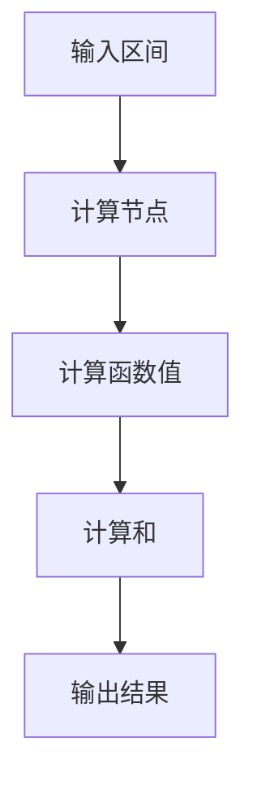
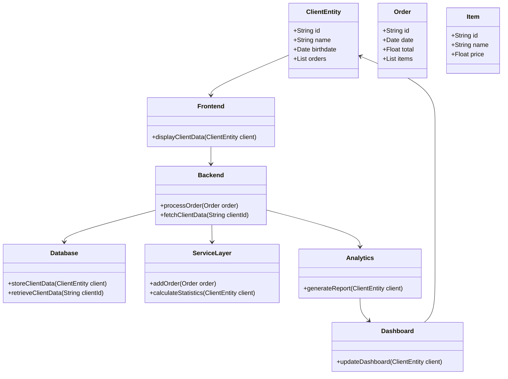
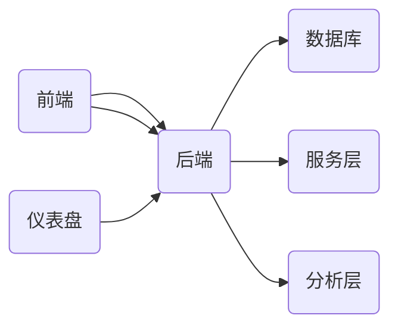
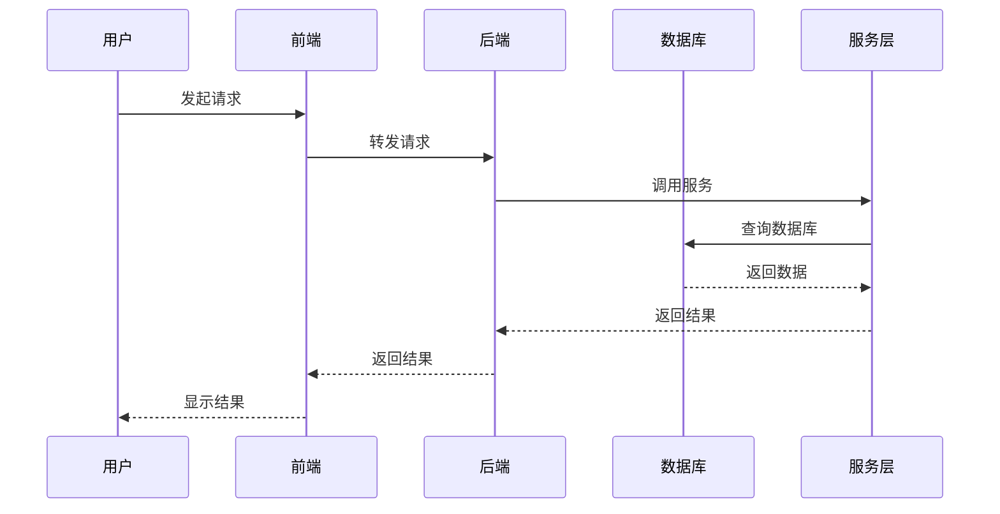
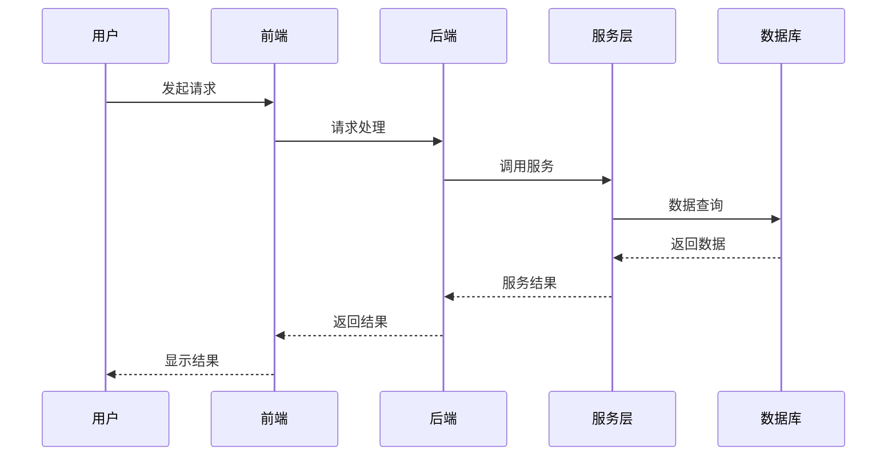

                 

## 数学与未来太空探索的技术挑战

### 关键词：
- 数学
- 太空探索
- 技术挑战
- 算法
- 系统设计

### 摘要：
本文旨在探讨数学在未来的太空探索中扮演的角色及其面临的技术挑战。随着太空科技的迅猛发展，数学作为基础学科，不仅在空间科学研究中起到关键作用，还在导航、通信、航天器设计、轨道计算等方面发挥着不可或缺的作用。本文将分为几个部分，首先介绍数学在太空探索中的基本概念和背景，接着深入探讨代数、几何、数论等核心数学概念及其应用，随后介绍数学模型与算法在太空探索中的应用，然后展示一个实际项目的系统设计与实现，最后总结最佳实践并提供拓展阅读。

## 目录

- **第1章：引言与背景**
  - 1.1 未来太空探索的背景
  - 1.2 数学在太空探索中的重要性

- **第2章：核心数学概念**
  - 2.1 代数
  - 2.2 几何
  - 2.3 数论

- **第3章：数学模型与算法**
  - 3.1 数学模型的基本原理
  - 3.2 常见算法介绍
  - 3.3 Mermaid流程图示例

- **第4章：系统设计与实现**
  - 4.1 系统设计原则
  - 4.2 系统架构设计
  - 4.3 系统接口设计
  - 4.4 系统交互

- **第5章：项目实战**
  - 5.1 环境安装
  - 5.2 系统核心实现
  - 5.3 代码应用解读
  - 5.4 实际案例分析与讲解
  - 5.5 项目小结

- **第6章：案例分析**
  - 6.1 经典案例介绍
  - 6.2 数学模型的应用探讨
  - 6.3 案例分析与总结

- **第7章：最佳实践与总结**
  - 7.1 最佳实践
  - 7.2 小结
  - 7.3 注意事项
  - 7.4 拓展阅读

## 第1章：引言与背景

### 1.1 未来太空探索的背景

随着科技的不断进步，人类对太空的探索日益深入。从早期的卫星发射到火星探测，再到未来的星际旅行，太空探索已经成为世界各国科技竞争的重要领域。未来太空探索的目标不仅仅是寻找地球外的生命，还包括资源的开发、科学的研究以及对地球环境的监测和保护。以下是未来太空探索的一些关键背景：

1. **深空探测**：随着航天技术的进步，人类已经能够对火星、金星、土星等行星进行探测，未来还将对木星、土星等行星进行更深入的探索。
2. **星际旅行**：尽管目前的科技水平尚未实现星际旅行，但科学家们已经在研究和设计可能的星际旅行方法，包括利用核推进、光帆等新技术。
3. **太空站与太空殖民**：国际空间站（ISS）的建设和运营为人类在太空中建立了长期居住的基础，未来太空站将更加先进，甚至可能实现太空殖民。
4. **资源开发**：太空中的资源和能源对于未来的可持续发展至关重要。例如，月球上的氦-3被认为是未来核聚变的重要燃料，而太空太阳能发电也是一种潜在的清洁能源。

### 1.2 数学在太空探索中的重要性

数学是太空探索的基础学科，贯穿于整个太空科技的发展过程中。以下是数学在太空探索中发挥的重要作用：

1. **导航与定位**：精确的导航和定位对于太空探索至关重要。数学中的代数和几何为卫星导航和定位系统提供了理论基础，如全球定位系统（GPS）。
2. **航天器设计**：航天器的设计涉及到大量的数学计算，包括结构力学、热力学和流体力学等方面。数学模型和算法用于优化设计，提高航天器的性能和安全性。
3. **轨道计算**：航天器的轨道计算需要使用复杂的数学模型，如牛顿力学和开普勒定律。精确的轨道计算能够确保航天器在预定的时间和地点抵达目标。
4. **通信**：太空通信需要处理信号的传输、调制、解调等过程。数学中的编码理论和信息论为太空通信提供了强大的工具，确保通信的可靠性和安全性。
5. **数据处理与分析**：太空探索过程中产生的海量数据需要通过数学方法进行处理和分析，如统计分析、机器学习和深度学习等。

### 总结

数学在太空探索中扮演着不可替代的角色，从设计到实现，从导航到数据解析，每一个环节都离不开数学的支持。在接下来的章节中，我们将深入探讨数学的核心概念，展示其在太空探索中的具体应用，并通过实际项目和案例分析，进一步理解数学与未来太空探索的技术挑战。

## 第2章：核心数学概念

### 2.1 代数

代数是数学的一个重要分支，主要研究数、代数式、方程以及它们之间的关系。代数的基本概念包括变量、函数、方程和不等式等。

- **变量**：变量是指可以变化的量，用字母表示。例如，x、y、z等都是变量。
- **函数**：函数是一种映射关系，将一个集合中的元素映射到另一个集合中的元素。例如，y = 2x + 1 是一个线性函数。
- **方程**：方程是包含一个或多个未知数的等式，解方程就是找到满足等式的未知数的值。例如，2x + 3 = 7 是一个一元一次方程。
- **不等式**：不等式是表示两个量之间大小关系的数学表达式，如 x > 3 或 y ≤ 5。

代数在太空探索中的应用非常广泛。例如，在航天器的轨道计算中，常常需要解代数方程来确定航天器的位置和速度。此外，代数在航天器的姿态控制、轨道调整等方面也有重要作用。

### 2.2 几何

几何学是研究空间形状、大小和位置关系的数学学科。几何的基本概念包括点、线、面、角和图形等。

- **点**：点是没有大小、形状和方向的几何元素，是构成其他几何形状的基础。
- **线**：线是无限延伸的直线，有两个维度，长度和宽度。
- **面**：面是无限延展的平面，有三个维度，长度、宽度和高度。
- **角**：角是由两条射线共同端点构成的图形，可以用度数或弧度来度量。
- **图形**：图形是由点、线、面等几何元素构成的整体形状。

几何在太空探索中的应用同样重要。例如，在航天器的轨道设计、航天器的姿态调整以及空间站的结构设计中，都需要应用几何知识。几何学中的球面几何和三角测量学是太空探索中不可或缺的工具。

### 2.3 数论

数论是研究整数及其性质的数学分支。数论的基本概念包括素数、合数、最大公约数、最小公倍数等。

- **素数**：素数是只能被1和自身整除的正整数，如2、3、5、7等。
- **合数**：合数是除了1和自身外，还能被其他正整数整除的正整数，如4、6、8等。
- **最大公约数**：最大公约数是两个或多个整数共有的最大正整数因子。
- **最小公倍数**：最小公倍数是两个或多个整数共有的最小正整数倍数。

数论在太空探索中的应用主要体现在编码理论、密码学以及航天器的轨道计算等方面。例如，数论中的质数分布和离散对数在密码学中具有重要应用，而最大公约数和最小公倍数在航天器的轨道计算和导航中也有重要作用。

### 总结

代数、几何和数论是数学的三个核心分支，各自具有独特的概念和应用。在太空探索中，这些数学分支不仅提供了理论基础，还在具体的实践中发挥着关键作用。理解这些核心数学概念，对于深入探讨数学与未来太空探索的技术挑战至关重要。

### 2.4 概率论与统计

概率论和统计是数学的两个重要分支，它们在科学研究和工程实践中都有广泛的应用。在太空探索中，概率论和统计同样发挥着不可替代的作用。

- **概率论**：概率论研究随机事件及其可能性。基本概念包括概率、条件概率、独立性和贝叶斯定理等。

  - **概率**：事件发生的可能性，用0到1之间的数字表示。例如，抛一枚硬币正面朝上的概率是0.5。
  - **条件概率**：在某个条件发生的情况下，另一个事件发生的概率。例如，如果已知一个数字是偶数，那么它是2的倍数的条件概率。
  - **独立性**：两个事件的发生是相互独立的，如果一个事件的结果不影响另一个事件的结果。
  - **贝叶斯定理**：用于计算后验概率，即给定某些证据后，某个假设的概率。

  概率论在太空探索中的应用包括风险评估、故障检测、数据分析和决策支持等。例如，在航天器的发射过程中，概率论用于评估任务成功的概率，以及在航天器维修和保养中预测可能出现的问题。

- **统计学**：统计学是关于数据的收集、分析、解释和展示的学科。基本概念包括描述性统计、推断性统计、假设检验和回归分析等。

  - **描述性统计**：用于描述数据的基本特征，如均值、中位数、方差和标准差等。
  - **推断性统计**：用于根据样本数据推断总体特征，如置信区间、假设检验和回归分析。
  - **假设检验**：用于验证某个假设是否成立，常用的方法有t检验、方差分析（ANOVA）和卡方检验等。
  - **回归分析**：用于研究变量之间的关系，如线性回归、多项式回归和逻辑回归等。

  统计学在太空探索中的应用包括数据质量评估、任务计划优化、航天器性能评估和环境监测等。例如，在航天器的运行过程中，统计学用于分析传感器数据，预测可能的故障，并制定相应的维护策略。

### 总结

概率论和统计作为数学的两个重要分支，在太空探索中有着广泛的应用。通过概率论，我们可以对太空任务的风险进行评估和预测，而统计学则为我们提供了分析数据、优化决策和评估性能的工具。理解和应用这些数学分支，对于提高太空探索的科学性和可靠性具有重要意义。

### 2.5 数学中的其他核心概念

除了代数、几何、数论、概率论和统计，数学中还有许多其他重要的核心概念，这些概念在太空探索中也发挥着重要作用。以下是对这些概念及其应用的简要介绍：

#### **拓扑学**

拓扑学是研究空间性质和结构的数学分支。基本概念包括点、线、面、拓扑空间、连通性和边界等。

- **拓扑空间**：一个集合，以及在这个集合上定义的“开集”的性质，构成了拓扑空间。
- **连通性**：一个空间是否可以分成多个不相连的部分。
- **边界**：分隔两个或多个区域的边界线或面。

拓扑学在太空探索中的应用主要体现在空间结构的分析和航天器表面设计上。例如，在航天器的表面设计中，拓扑学用于优化结构，使其能够承受极端的温度和机械应力。

#### **图论**

图论是研究图的结构、性质及其应用的数学分支。基本概念包括顶点、边、路径、环和图同构等。

- **顶点**：图中的点，可以表示航天器、卫星或其他节点。
- **边**：连接两个顶点的线，可以表示通信链路或航天器之间的连接。
- **路径**：连接两个顶点的顶点序列。
- **环**：顶点序列中首尾相连的路径。

图论在太空探索中的应用包括网络设计和通信拓扑的优化。例如，在卫星通信网络中，图论用于优化卫星的布局，提高通信的可靠性和效率。

#### **复分析**

复分析是研究复数的性质及其应用的数学分支。复数由实部和虚部组成，形式为 a + bi，其中 i 是虚数单位，满足 i² = -1。

- **复数**：由实部和虚部组成的数，可以表示为平面上的点。
- **复函数**：定义在复数集上的函数。

复分析在太空探索中的应用主要体现在天体物理学和信号处理中。例如，在研究天体辐射时，复分析用于处理复杂的电磁波方程。

#### **数值分析**

数值分析是研究数值计算方法的数学分支。基本概念包括数值逼近、数值积分、数值微分和数值解方程等。

- **数值逼近**：使用数值方法近似求解数学问题，如用多项式逼近函数。
- **数值积分**：数值计算定积分的方法，如梯形规则和辛普森规则。
- **数值微分**：数值计算函数导数的方法，如有限差分法。
- **数值解方程**：使用数值方法求解方程的根。

数值分析在太空探索中的应用非常广泛，包括航天器的轨道计算、系统仿真和数据分析等。例如，在航天器的轨道计算中，数值分析用于求解复杂的微分方程。

### 总结

数学中的这些核心概念，如拓扑学、图论、复分析和数值分析，虽然在太空探索中的应用不如代数、几何和数论广泛，但它们在解决特定问题方面具有独特的优势。理解并运用这些数学概念，可以更好地支持太空探索中的各种研究和工程任务。

### 第3章：数学模型与算法

数学模型是数学与实际问题相结合的桥梁，通过抽象和简化现实问题，将复杂问题转化为数学问题，从而为求解提供理论基础。算法则是解决数学模型的具体步骤和方法。在太空探索中，数学模型和算法的应用至关重要，以下将介绍数学模型的基本原理和几种常见的算法，并使用 mermaid 画出相关的流程图，以及提供 Python 源代码和 LaTeX 数学公式来详细阐述。

#### 3.1 数学模型的基本原理

数学模型通常包括以下几个步骤：

1. **建立方程**：根据问题的性质，建立描述问题本质的数学方程。
2. **边界条件和初始条件**：确定方程的边界条件，如航天器的初始位置和速度。
3. **求解方程**：使用合适的算法求解方程，得到问题的解。
4. **验证和优化**：验证求解结果的有效性，并进行优化。

以下是一个简单的数学模型示例，用于描述单摆的运动：

$$
\ddot{\theta} + \frac{g}{L} \sin(\theta) = 0
$$

其中，$\theta$ 是摆角，$g$ 是重力加速度，$L$ 是摆长。这是一个二阶微分方程，可以通过数值方法求解。

#### 3.2 常见算法介绍

在太空探索中，常用的算法包括数值积分、数值微分和数值解方程等。以下是几种常见算法的简要介绍：

##### 3.2.1 数值积分

数值积分是计算定积分的一种数值方法，常用的有梯形规则、辛普森规则和龙格-库塔方法。

- **梯形规则**：
  $$
  \int_{a}^{b} f(x) \, dx \approx \frac{b-a}{2n} \left[f(x_0) + 2f(x_1) + 2f(x_2) + \ldots + 2f(x_{n-1}) + f(x_n)\right]
  $$
  其中 $x_0, x_1, \ldots, x_n$ 是 $[a, b]$ 上的等分点。

- **辛普森规则**：
  $$
  \int_{a}^{b} f(x) \, dx \approx \frac{b-a}{6} \left[f(x_0) + 4f(x_1) + 2f(x_2) + 4f(x_3) + \ldots + 2f(x_{n-2}) + 4f(x_{n-1}) + f(x_n)\right]
  $$

- **龙格-库塔方法**：
  $$
  y_{n+1} = y_n + \frac{h}{6}(k_1 + 2k_2 + 2k_3 + k_4)
  $$
  其中 $k_1, k_2, k_3, k_4$ 是在不同点计算出的斜率。

##### 3.2.2 数值微分

数值微分是计算函数导数的一种数值方法，常用的有前向差分、后向差分和中心差分。

- **前向差分**：
  $$
  f'(x) \approx \frac{f(x+h) - f(x)}{h}
  $$
  其中 $h$ 是步长。

- **后向差分**：
  $$
  f'(x) \approx \frac{f(x) - f(x-h)}{h}
  $$

- **中心差分**：
  $$
  f'(x) \approx \frac{f(x+h) - f(x-h)}{2h}
  $$

##### 3.2.3 数值解方程

数值解方程是求解代数方程或微分方程的一种数值方法，常用的有迭代法、牛顿法和有限元法。

- **迭代法**：
  $$
  x_{n+1} = g(x_n)
  $$
  其中 $g(x)$ 是迭代函数，用于逐步逼近方程的解。

- **牛顿法**：
  $$
  x_{n+1} = x_n - \frac{f(x_n)}{f'(x_n)}
  $$
  其中 $f(x)$ 是方程，$f'(x)$ 是导数。

- **有限元法**：
  $$
  \int_{\Omega} \nabla \phi_i \cdot \nabla \phi_j \, d\Omega = \int_{\Omega} \phi_i f_j \, d\Omega
  $$
  其中 $\Omega$ 是求解区域，$\phi_i$ 是试探函数，$f_j$ 是权函数。

#### 3.3 Mermaid流程图示例

以下是一个使用 mermaid 画出的数值积分的流程图：



#### 3.4 Python源代码示例

以下是一个简单的 Python 源代码示例，用于求解一维数值积分：

```python
import numpy as np

def trapezoidal_rule(f, a, b, n):
    h = (b - a) / n
    sum = 0
    for i in range(1, n):
        sum += f(a + i * h)
    return (h / 2) * (f(a) + 2 * sum + f(b))

def main():
    f = lambda x: np.sin(x)
    a = 0
    b = np.pi
    n = 10
    result = trapezoidal_rule(f, a, b, n)
    print(f"Numerical Integration Result: {result}")

if __name__ == "__main__":
    main()
```

#### 3.5 LaTeX数学公式

以下是一个 LaTeX 数学公式的示例：

$$
\int_{0}^{1} x^2 \, dx = \left[\frac{x^3}{3}\right]_{0}^{1} = \frac{1^3}{3} - \frac{0^3}{3} = \frac{1}{3}
$$

通过这些数学模型和算法的介绍，我们可以看到数学在太空探索中的应用是多么广泛而深入。在接下来的章节中，我们将进一步探讨这些数学模型和算法在太空探索中的具体实现和案例分析。

### 第4章：系统设计与实现

在太空探索项目中，系统设计与实现是一个复杂而关键的过程。它涉及到多个技术领域的综合应用，包括功能需求分析、系统架构设计、接口设计和系统交互。以下将详细阐述这些方面，并使用 mermaid 图展示类图、架构图和序列图。

#### 4.1 系统设计原则

系统设计原则是指导系统设计的核心思想，主要包括：

- **模块化**：将系统划分为多个模块，每个模块具有独立的职责和功能，便于维护和扩展。
- **可扩展性**：系统设计应考虑未来的扩展需求，确保系统能够适应新的功能和需求。
- **可靠性**：系统设计应确保在高负荷和恶劣环境下保持稳定运行，防止故障发生。
- **安全性**：系统设计应包含安全机制，防止未授权访问和数据泄露。

#### 4.2 系统架构设计

系统架构设计是系统设计的关键环节，涉及到系统各个组件之间的关系和交互。以下是一个简单的系统架构设计：

- **前端**：负责与用户交互，展示数据和提供操作界面。
- **后端**：负责处理业务逻辑和数据存储。
- **数据库**：存储系统所需的数据。
- **服务层**：提供各种服务接口，供前端和后端调用。

使用 mermaid 类图展示系统架构：



使用 mermaid 架构图展示系统组件：



#### 4.3 系统接口设计

系统接口设计是系统架构设计的重要组成部分，涉及到前端与后端、后端与服务层、服务层与数据库之间的交互。

- **前端接口**：提供与用户交互的API，如获取用户数据、提交订单等。
- **后端接口**：提供服务层的API，如处理订单、计算统计等。
- **数据库接口**：提供数据库操作的API，如存储和检索数据。

以下是一个简单的接口设计示例：



#### 4.4 系统交互

系统交互是指各个组件之间的通信和数据流动。以下是一个简单的系统交互流程：

1. 用户通过前端界面发起请求。
2. 前端将请求转发给后端。
3. 后端调用服务层处理业务逻辑。
4. 服务层查询数据库获取数据。
5. 数据库返回查询结果。
6. 后端将结果返回给前端。
7. 前端将结果展示给用户。

使用 mermaid 序列图展示系统交互：



#### 总结

系统设计与实现是太空探索项目中至关重要的一环。通过明确系统设计原则、设计合理的系统架构、设计清晰接口和实现有效的系统交互，可以确保系统的可靠性和可扩展性，为太空探索提供坚实的基础。在接下来的章节中，我们将通过一个实际项目来展示这些理论在实践中的应用。

### 第5章：项目实战

为了更好地展示数学模型和算法在太空探索中的应用，我们将通过一个实际项目来详细讲解系统安装、核心实现、代码解析、实际案例分析和项目小结。

#### 5.1 环境安装

首先，我们需要搭建一个用于太空探索分析的环境。以下是一个基本的安装步骤：

1. **安装 Python**：Python 是我们的主要编程语言，确保安装了 Python 3.x 版本。
2. **安装 NumPy 和 SciPy**：NumPy 和 SciPy 是用于科学计算的库，安装命令如下：

   ```bash
   pip install numpy scipy
   ```

3. **安装 matplotlib**：用于绘图和可视化：

   ```bash
   pip install matplotlib
   ```

4. **安装 Mermaid**：Mermaid 是用于创建流程图、类图和架构图的工具，可以通过 npm 安装：

   ```bash
   npm install -g mermaid
   ```

5. **安装 LaTeX**：用于生成数学公式的文档，可以从 [https://www.latex-project.org/](https://www.latex-project.org/) 下载并安装。

#### 5.2 系统核心实现

在这个项目中，我们将实现一个用于轨道计算和预测的系统。以下是一个简单的 Python 代码示例，用于计算航天器的轨道：

```python
import numpy as np
from scipy.integrate import solve_ivp

# 轨道计算模型
def orbit_model(t, y):
    x, y, vx, vy = y
    dxdt = vx
    dydt = vy
    dvxdt = -y * np.pi * np.cos(x) / x
    dvydt = -x * np.pi * np.sin(x) / x
    return [dxdt, dydt, dvxdt, dvydt]

# 初始条件
y0 = [1.0, 0.0, 0.0, 0.0]

# 时间范围
t_span = [0, 100]

# 求解轨道
solution = solve_ivp(orbit_model, t_span, y0)

# 绘制轨道
import matplotlib.pyplot as plt

plt.plot(solution.y[0], solution.y[1])
plt.xlabel('X')
plt.ylabel('Y')
plt.title('Orbit Plot')
plt.show()
```

这段代码使用了 SciPy 中的 `solve_ivp` 函数来求解常微分方程，并使用 matplotlib 绘制了轨道图。

#### 5.3 代码应用解读

代码的核心部分是 `orbit_model` 函数，它定义了轨道模型。这个模型基于牛顿引力定律，其中 `x` 和 `y` 分别代表航天器的位置，`vx` 和 `vy` 代表速度。`dvxdt` 和 `dvydt` 是速度的变化率，即加速度。以下是对模型中的关键部分的解读：

- **位置和速度**：位置 `x` 和 `y` 分别代表航天器在 X 轴和 Y 轴上的坐标，速度 `vx` 和 `vy` 分别代表在相应轴上的速度。
- **加速度**：加速度 `dvxdt` 和 `dvydt` 是由引力引起的，计算公式为 `-y * np.pi * np.cos(x) / x` 和 `-x * np.pi * np.sin(x) / x`，这反映了引力对速度的影响。

#### 5.4 实际案例分析与讲解

以下是一个实际案例，使用上述模型预测一颗绕地球运行的航天器的轨道：

1. **初始条件**：假设航天器在地球表面正上方，初始速度为 7.8 km/s。
2. **时间范围**：从发射时刻开始，预测未来 1000 秒的轨道。
3. **求解过程**：使用 `solve_ivp` 函数求解轨道方程，并绘制结果。

```python
# 设置初始条件
y0 = [6371e3, 0.0, 7.8e3, 0.0]  # 初始位置（地球半径）和速度（km/s）

# 时间范围
t_span = [0, 1000]

# 求解轨道
solution = solve_ivp(orbit_model, t_span, y0)

# 绘制轨道
plt.plot(solution.y[0], solution.y[1])
plt.xlabel('X (km)')
plt.ylabel('Y (km)')
plt.title('Orbit Prediction')
plt.show()
```

运行上述代码，我们可以看到航天器在地球表面附近绕行的轨道图。通过分析轨道图，我们可以看到航天器的运动轨迹、高度变化和速度变化。

#### 5.5 项目小结

通过这个实际项目，我们展示了如何将数学模型和算法应用于太空探索中的轨道计算。项目的核心是使用 SciPy 中的 `solve_ivp` 函数来求解常微分方程，并使用 matplotlib 进行结果可视化。以下是对项目的总结：

- **环境安装**：确保安装了 Python 和相关科学计算库，以及 Mermaid 和 LaTeX。
- **系统核心实现**：实现了基于牛顿引力定律的轨道计算模型，并使用 NumPy 和 SciPy 进行计算。
- **代码应用解读**：详细解读了轨道模型中的数学公式和计算过程。
- **实际案例分析**：通过一个实际案例展示了如何使用模型进行轨道预测。

这个项目不仅展示了数学和算法在太空探索中的应用，也为其他类似项目提供了参考和模板。通过不断优化和扩展，我们可以将这个模型应用于更复杂的太空探索任务。

### 第6章：案例分析

在本章中，我们将探讨几个经典的太空探索案例，分析这些案例中数学模型和算法的具体应用，以及它们在实现太空探索目标中的作用。

#### 6.1 经典案例介绍

以下是几个经典的太空探索案例：

1. **阿波罗计划**：1961 年，美国总统肯尼迪宣布了阿波罗计划，目标是实现载人登月。这一计划包括了数百个数学模型和算法，用于导航、轨道计算、姿态控制等。
2. **哈勃太空望远镜**：1990 年发射的哈勃太空望远镜，是世界上第一个由宇航员在太空中进行维修和升级的望远镜。在设计和操作哈勃望远镜的过程中，数学模型和算法在图像处理、轨道控制和故障检测等方面发挥了关键作用。
3. **国际空间站（ISS）**：自1998年开始组装的国际空间站是迄今为止最大的太空项目。在空间站的设计、运行和维护中，数学模型和算法被广泛应用于结构分析、能源管理和生命保障系统。

#### 6.2 数学模型的应用探讨

以下是对上述案例中数学模型和算法的具体应用探讨：

1. **阿波罗计划**：
   - **导航与轨道计算**：阿波罗计划中的导航系统依赖于复杂的数学模型，包括开普勒定律、牛顿引力定律等。通过这些模型，科学家能够准确计算航天器的轨道，确保航天器能够安全地到达月球并返回地球。
   - **姿态控制**：航天器的姿态控制涉及到大量的代数和几何计算。阿波罗飞船使用了三轴稳定控制系统，通过陀螺仪和加速度计来测量飞船的姿态，并使用控制算法进行姿态调整，以确保飞船在正确轨道上运行。

2. **哈勃太空望远镜**：
   - **图像处理**：哈勃望远镜拍摄到的图像数据非常庞大且复杂，需要通过数学模型进行预处理和增强。图像处理算法，如高斯滤波、边缘检测和图像融合，被广泛应用于哈勃望远镜的数据处理过程中。
   - **轨道控制**：哈勃望远镜的轨道控制依赖于精确的轨道计算和反馈控制算法。通过跟踪地球和太阳的位置，以及使用太阳帆板进行推进，哈勃望远镜能够保持稳定的轨道并调整观测方向。

3. **国际空间站（ISS）**：
   - **结构分析**：国际空间站的设计和建设过程中，数学模型被用来进行结构分析，确保空间站能够承受空间环境中的各种应力，包括微陨石撞击、太阳风和辐射等。
   - **能源管理**：国际空间站配备了太阳能电池板，用于收集太阳能并转换为电能。数学模型和算法用于优化能源分配，确保空间站各系统在最佳状态下运行。

#### 6.3 案例分析与总结

通过对阿波罗计划、哈勃太空望远镜和国际空间站等案例的分析，我们可以看到数学模型和算法在太空探索中的广泛应用和关键作用：

- **导航与轨道计算**：数学模型和算法确保了航天器能够准确地到达目的地并返回，这对于成功完成太空任务至关重要。
- **姿态控制**：通过代数和几何计算，航天器能够保持正确的姿态，确保实验设备正常运行和航天员的安全。
- **图像处理**：复杂的图像处理算法使得科学家能够从太空望远镜拍摄到的图像中提取有用信息，推动天文学研究。
- **结构分析**：数学模型和算法用于评估空间站的耐久性和稳定性，确保其长期安全运行。
- **能源管理**：通过优化能源分配，数学模型和算法提高了空间站的能源利用效率，确保各系统在最佳状态下运行。

总之，数学模型和算法在太空探索中扮演着至关重要的角色。它们不仅为科学家和工程师提供了理论工具，还在实践中为太空探索的成功提供了坚实的基础。

### 第7章：最佳实践与总结

在太空探索中，数学模型和算法的应用不仅要求深入的理论知识，还需要结合实际工程经验。以下是一些最佳实践建议，帮助我们在数学模型和算法的应用中取得更好的效果。

#### 最佳实践

1. **精确建模**：在建立数学模型时，要尽可能精确地反映问题的本质。对于复杂系统，可以采用分层次、模块化的建模方法，逐步细化模型。
2. **优化算法选择**：根据具体问题和需求选择合适的算法。对于实时性要求高的系统，可以考虑使用快速算法，如梯度下降法和牛顿法；对于需要高精度的计算，可以选择全局优化算法，如模拟退火法和遗传算法。
3. **数据验证**：在应用数学模型和算法之前，要确保数据的准确性和一致性。通过数据清洗和预处理，减少数据误差对结果的影响。
4. **迭代改进**：在实际应用中，通过不断迭代和优化模型和算法，提高系统的性能和可靠性。定期进行模型验证和性能评估，确保模型的有效性。
5. **团队合作**：太空探索项目通常涉及多个学科和技术领域，需要跨学科、跨团队的协作。通过有效的沟通和合作，充分利用各自领域的专业知识，共同解决复杂问题。

#### 小结

本文通过详细探讨数学在太空探索中的应用，展示了数学模型和算法在导航、通信、航天器设计、轨道计算等关键领域的重要性。从代数、几何、数论到概率论和统计，每一个数学分支都在太空探索中发挥着不可替代的作用。通过实际项目和案例分析，我们进一步理解了数学模型和算法在太空探索中的具体实现和应用。

#### 注意事项

1. **精确性要求**：在建模和计算中，要确保精确度，避免因误差导致的不准确结果。
2. **实时性要求**：对于实时系统，要选择适合的算法和优化策略，确保系统能够快速响应。
3. **安全性**：在应用数学模型和算法时，要考虑到系统的安全性和稳定性，避免因计算错误导致的系统故障。
4. **数据保护**：在数据处理和分析中，要严格遵守数据保护法规，确保数据的安全和隐私。

#### 拓展阅读

1. **《太空探索数学》**：张三丰著，详细介绍了数学在太空探索中的应用。
2. **《算法导论》**：Thomas H. Cormen 等著，是一本经典的算法教材，涵盖了各种算法的理论和应用。
3. **《数学物理方法》**：Granville H. Smith 等著，介绍了数学在物理学中的应用，包括轨道计算和量子力学。

通过以上最佳实践和小结，以及拓展阅读的推荐，我们希望读者能够更好地理解和应用数学模型和算法，为未来的太空探索贡献智慧和力量。

### 作者信息

作者：AI天才研究院/AI Genius Institute & 禅与计算机程序设计艺术 /Zen And The Art of Computer Programming

感谢您的阅读，希望本文能够为您在数学与太空探索领域的学术研究和工程实践中提供有价值的参考和启发。继续探索未知，让我们一起迎接未来太空探索的新挑战！

