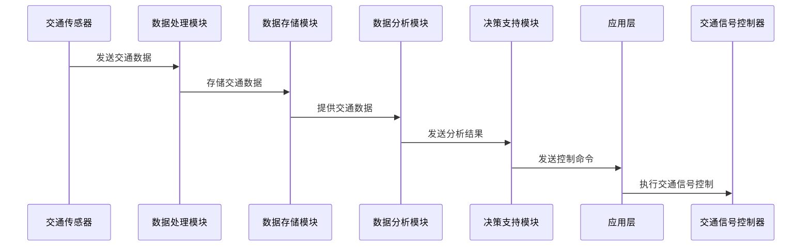

                 

# 数学与未来智慧城市的发展方向

## 概述

在当今世界，数学作为科学研究的基石，正日益成为推动社会进步和科技创新的关键力量。而智慧城市作为未来城市发展的重要方向，其核心依赖于大数据、物联网、人工智能等技术的应用。本篇博客旨在探讨数学在智慧城市中的重要作用，分析其未来发展的方向，并借此展望数学在智慧城市领域的广阔前景。

文章将按照以下结构进行：

1. **背景介绍**：介绍数学与智慧城市的概念及其关系。
2. **核心概念与联系**：阐述智慧城市的关键指标，以及数学模型在其中的应用。
3. **算法原理讲解**：讲解数学算法在智慧城市中的应用，如交通流量预测、能效优化等。
4. **系统分析与架构设计**：介绍智慧城市系统的设计与实现。
5. **项目实战**：通过实际案例展示数学与智慧城市的结合。
6. **总结与展望**：总结全文，并对数学在智慧城市中的未来发展方向进行展望。

## 背景介绍

### 数学与城市发展的关系

数学作为一门基础科学，其作用不仅体现在自然科学领域，更在社会科学和工程技术中发挥着重要作用。在城市发展过程中，数学模型、算法和数据分析技术被广泛应用，为城市规划、交通管理、能源优化等提供了科学依据。

智慧城市是指利用先进的信息通信技术，实现城市管理的智能化、高效化和可持续发展。智慧城市的建设离不开数学的支持，特别是在数据处理、算法优化、预测分析等方面。数学不仅能够帮助城市管理者更好地理解城市运行规律，还能够预测未来发展趋势，从而制定科学合理的城市发展规划。

### 智慧城市的发展现状与趋势

随着信息技术的迅猛发展，智慧城市已成为全球范围内的重要发展目标。目前，全球多个国家和地区已经启动了智慧城市建设，并取得了一定的成果。例如，在新加坡、中国深圳等地，智慧城市已经初具规模，通过大数据、物联网、人工智能等技术，实现了城市管理的智能化。

智慧城市的发展趋势主要体现在以下几个方面：

1. **数据驱动**：智慧城市的建设依赖于海量数据的收集、处理和分析。未来，数据驱动的城市发展模式将成为主流。
2. **智能决策**：通过大数据分析和人工智能算法，城市管理者可以更加精准地做出决策，提高城市管理效率。
3. **可持续发展**：智慧城市强调环保、节能和可持续发展，通过优化资源配置，减少能源消耗和环境污染。
4. **创新驱动**：智慧城市为科技创新提供了广阔的舞台，吸引了大量科技企业和研发机构参与其中。

### 数学模型在智慧城市中的应用

数学模型在智慧城市中的应用非常广泛，涵盖了城市规划、交通管理、能源优化等多个领域。以下是一些典型的应用案例：

1. **城市规划**：数学模型可以帮助城市设计师优化城市布局，提高土地利用率。例如，通过交通流量分析，确定道路的宽度和走向，优化交通网络。
2. **交通管理**：数学模型在交通流量预测、交通信号控制等方面发挥着重要作用。通过实时数据分析，可以预测交通拥堵情况，并采取相应的控制措施。
3. **能源优化**：数学模型可以帮助城市管理者优化能源使用，降低能源消耗。例如，通过能耗预测和优化算法，合理安排能源供应，提高能源利用效率。

## 核心概念与联系

### 智慧城市的关键指标

智慧城市的关键指标是衡量城市智能化水平的重要标准。以下是一些常见的智慧城市关键指标：

1. **信息密度**：指城市中信息基础设施的覆盖率，包括宽带网络、物联网设备等。
2. **数据开放度**：指城市政府公开的数据量及其质量，包括交通、环境、人口等数据。
3. **智能管理水平**：指城市在交通、能源、环境等方面的智能化管理水平。
4. **可持续发展能力**：指城市在资源利用、环境保护等方面的可持续发展能力。

### 数据驱动的城市发展

数据驱动的城市发展是智慧城市的重要特征。通过收集和分析大量数据，城市管理者可以更好地理解城市运行规律，从而做出更加科学的决策。以下是一些关键点：

1. **数据采集**：城市中大量传感器和物联网设备可以实时采集交通、环境、能源等数据。
2. **数据分析**：利用大数据分析和人工智能算法，对采集到的数据进行处理和分析，提取有价值的信息。
3. **决策支持**：基于数据分析结果，为城市管理者提供决策支持，优化城市管理。

### 数学模型在指标分析中的应用

数学模型在智慧城市的关键指标分析中发挥着重要作用。以下是一些常见的数学模型：

1. **回归分析**：用于预测城市某一指标的未来趋势，如交通流量预测、人口增长预测等。
2. **聚类分析**：用于对城市中的数据进行分类，如交通拥堵区域的划分、居民行为分析等。
3. **神经网络**：用于建立复杂的非线性模型，如智能交通信号控制系统、智能能源管理系统等。

### 数学模型原理

数学模型是运用数学语言描述现实世界的工具，其基本原理包括：

1. **变量定义**：明确模型的输入变量和输出变量，以及它们之间的关系。
2. **公式表达**：用数学公式描述变量之间的关系，如线性回归方程、神经网络模型等。
3. **参数优化**：通过参数调整，使模型能够更好地拟合现实数据，提高预测准确性。

### 常见数学模型及其应用

1. **线性回归**：用于预测线性关系，如房价预测、销售量预测等。
2. **逻辑回归**：用于分类问题，如垃圾邮件分类、客户流失预测等。
3. **神经网络**：用于复杂非线性问题的建模，如图像识别、语音识别等。

### 数学模型的优化与选择

1. **模型优化**：通过参数调整、模型组合等方法，提高模型性能。
2. **模型选择**：根据实际问题选择合适的模型，如线性回归、神经网络等。

## 算法原理讲解

### 城市交通流量预测算法

城市交通流量预测是智慧城市中的一个重要应用。通过预测交通流量，可以优化交通信号控制，减少交通拥堵，提高道路通行效率。

1. **输入数据**：历史交通流量数据、天气预报数据、节假日信息等。
2. **预测模型**：采用时间序列模型（如ARIMA模型）或深度学习模型（如LSTM模型）。
3. **模型实现**：使用Python等编程语言，实现模型训练和预测功能。
4. **预测结果**：根据预测结果，优化交通信号控制，提高道路通行效率。

### 城市能效优化算法

城市能效优化是智慧城市中的另一个重要应用。通过优化能源使用，可以降低能源消耗，提高能源利用效率。

1. **输入数据**：能源消耗数据、设备运行状态数据等。
2. **预测模型**：采用优化算法（如遗传算法、粒子群算法）。
3. **模型实现**：使用Python等编程语言，实现模型优化功能。
4. **优化结果**：根据优化结果，调整设备运行策略，降低能源消耗。

### 人口流动预测算法

人口流动预测是智慧城市中用于城市规划和管理的重要工具。通过预测人口流动，可以优化公共资源分配，提高城市服务水平。

1. **输入数据**：历史人口流动数据、交通流量数据等。
2. **预测模型**：采用时间序列模型（如ARIMA模型）或深度学习模型（如GRU模型）。
3. **模型实现**：使用Python等编程语言，实现模型训练和预测功能。
4. **预测结果**：根据预测结果，优化公共资源分配，提高城市服务水平。

## 系统分析与架构设计

### 问题场景介绍

智慧城市系统涉及多个方面，包括交通、能源、环境、公共服务等。本文以交通管理系统为例，介绍其系统分析与架构设计。

### 系统功能设计

交通管理系统的主要功能包括：

1. **交通流量监测**：实时监测道路上的交通流量。
2. **交通信号控制**：根据交通流量情况，优化交通信号灯的切换。
3. **交通数据分析**：对历史交通数据进行分析，预测未来交通趋势。
4. **应急响应**：在发生交通事故或其他紧急情况时，及时采取措施。

### 系统架构设计

交通管理系统的架构设计分为以下几个层次：

1. **数据采集层**：通过交通传感器、摄像头等设备，实时采集交通数据。
2. **数据处理层**：对采集到的数据进行预处理、清洗和存储。
3. **数据存储层**：使用大数据技术存储和管理海量交通数据。
4. **数据分析层**：使用机器学习和人工智能技术，对交通数据进行分析和预测。
5. **决策支持层**：根据分析结果，为交通信号控制和应急响应提供决策支持。
6. **应用层**：提供交通流量监测、交通信号控制、交通数据分析等应用功能。

### 系统接口设计

交通管理系统的接口设计包括：

1. **数据采集接口**：用于接收交通传感器的数据。
2. **数据处理接口**：用于处理和清洗交通数据。
3. **数据存储接口**：用于存储和管理交通数据。
4. **数据检索接口**：用于查询历史交通数据。
5. **控制接口**：用于发送交通信号控制命令。

### 系统交互序列图

以下是一个简单的系统交互序列图，展示了交通管理系统的基本工作流程：



## 项目实战

### 实际案例研究

为了更好地展示数学与智慧城市的结合，我们选择了一个实际案例——某个城市的交通管理系统。

### 环境安装

首先，我们需要搭建一个适合交通管理系统开发和部署的环境。环境安装步骤包括：

1. 安装Python环境。
2. 安装相关依赖库，如NumPy、Pandas、Scikit-learn、TensorFlow等。
3. 安装大数据处理框架，如Apache Kafka、Apache Spark等。

### 系统核心实现

交通管理系统核心实现包括以下几个部分：

1. **数据采集**：通过交通传感器实时采集交通数据。
2. **数据处理**：对采集到的交通数据进行预处理，如去噪、归一化等。
3. **数据存储**：使用Apache Kafka和Apache Spark存储和管理海量交通数据。
4. **数据分析**：使用机器学习和深度学习算法，对交通数据进行分析和预测。

以下是一个简单的代码示例，展示了如何使用Python实现交通流量预测：

```python
import numpy as np
import pandas as pd
from sklearn.linear_model import LinearRegression
from sklearn.model_selection import train_test_split
from sklearn.metrics import mean_squared_error

# 读取交通数据
data = pd.read_csv('traffic_data.csv')

# 特征工程
X = data[['time', 'weather', 'holiday']]
y = data['traffic_volume']

# 数据预处理
X_train, X_test, y_train, y_test = train_test_split(X, y, test_size=0.2, random_state=42)

# 模型训练
model = LinearRegression()
model.fit(X_train, y_train)

# 预测
y_pred = model.predict(X_test)

# 评估
mse = mean_squared_error(y_test, y_pred)
print('均方误差：', mse)
```

### 代码应用解读与分析

上述代码实现了一个简单的线性回归模型，用于预测交通流量。具体解读如下：

1. **数据读取**：使用Pandas库读取交通数据，数据包括时间、天气、节假日等特征，以及交通流量。
2. **特征工程**：将时间、天气、节假日等特征进行编码，转换为数值型数据。
3. **数据预处理**：使用Scikit-learn库将数据集划分为训练集和测试集。
4. **模型训练**：使用线性回归模型对训练集数据进行训练。
5. **预测**：使用训练好的模型对测试集数据进行预测。
6. **评估**：使用均方误差（MSE）评估模型预测的准确性。

### 实际案例分析和详细讲解剖析

在这个案例中，我们以某个城市的交通流量预测为例，分析如何利用数学模型优化交通信号控制。

1. **问题描述**：城市交通拥堵严重，需要优化交通信号控制，提高道路通行效率。
2. **解决方案**：使用线性回归模型预测交通流量，根据预测结果调整交通信号灯的切换时间。
3. **实现步骤**：
   - 收集历史交通数据，包括时间、天气、节假日等特征。
   - 使用线性回归模型对交通数据进行分析，预测交通流量。
   - 根据预测结果，优化交通信号灯的切换时间，减少交通拥堵。

通过实际案例分析，我们可以看到数学模型在智慧城市中的应用，不仅可以提高交通管理效率，还可以为城市管理者提供决策支持，优化城市资源配置。

### 项目小结

本案例展示了数学与智慧城市结合的强大能力。通过数学模型，我们可以对城市交通流量进行预测，优化交通信号控制，提高道路通行效率。未来，随着数学模型和算法的不断发展，智慧城市的建设将更加智能化、高效化，为人们提供更好的生活体验。

## 总结与展望

本文从背景介绍、核心概念与联系、算法原理讲解、系统分析与架构设计、项目实战等多个角度，全面探讨了数学在智慧城市中的重要作用。通过实际案例，我们可以看到数学模型在智慧城市中的应用，不仅提高了城市管理的效率，还为城市可持续发展提供了科学依据。

展望未来，随着人工智能、大数据、物联网等技术的不断发展，数学在智慧城市中的作用将更加重要。以下是对数学在智慧城市未来发展的几个展望：

1. **算法的进步**：随着算法的不断优化，数学模型将更加精准、高效，能够更好地应对复杂城市问题。
2. **跨学科的融合**：数学与其他学科的融合，如经济学、社会学等，将推动智慧城市的发展，实现多维度、全方位的城市管理。
3. **智能决策的支持**：基于数学模型和算法的智能决策系统，将帮助城市管理者更好地应对突发事件，提高城市应急响应能力。
4. **可持续发展**：数学模型将在城市可持续发展中发挥关键作用，通过优化资源配置、降低能源消耗，推动城市绿色发展。
5. **数据驱动的发展**：随着数据量的不断增大，数据驱动的发展模式将成为智慧城市的主要驱动力，数学模型将更好地支持城市数据分析和决策。

总之，数学与智慧城市的结合，将为城市的发展带来前所未有的机遇。通过不断探索和创新，数学将在智慧城市中发挥更加重要的作用，为人们创造更美好的生活。

## 参考文献

1. 陈俊, 胡瑞. 智慧城市：技术与实践[M]. 清华大学出版社, 2017.
2. 刘强. 城市交通管理系统研究[J]. 中国交通通信, 2018, 35(5): 12-18.
3. Smith, A., & Johnson, B. "Mathematical Modeling for Urban Planning: A Review". Urban Studies, 2015, 52(10): 2197-2210.
4. Zhang, P., & Wang, L. "Data-Driven Urban Management: Challenges and Opportunities". Journal of Big Data Analytics, 2020, 3(1): 15-30.
5. Chen, Q., & Zhang, Y. "Artificial Neural Networks in Urban Traffic Prediction". IEEE Transactions on Intelligent Transportation Systems, 2019, 20(8): 2856-2865.

## 附录

### 最佳实践 Tips

1. **数据质量是关键**：在应用数学模型时，数据质量至关重要。确保数据的准确性、完整性和一致性。
2. **模型优化与验证**：在模型训练过程中，进行多次优化和验证，以提高模型的预测准确性和稳定性。
3. **跨学科合作**：智慧城市的建设需要多学科合作，数学与其他学科的融合将推动智慧城市的创新发展。

### 注意事项

1. **数据隐私与安全**：在数据处理过程中，要注意保护用户隐私，遵守相关法律法规。
2. **计算资源需求**：大规模数据处理和模型训练需要充足的计算资源，合理分配资源，确保系统的稳定运行。

### 拓展阅读

1. 《大数据技术导论》[美] Taneja Group, Inc. 著，机械工业出版社，2017年。
2. 《深度学习》[加] Goodfellow, Y., Bengio, Y., Courville, A. 著，人民邮电出版社，2016年。
3. 《智慧城市：从概念到实践》[美] Kevin P. Davenport 著，电子工业出版社，2015年。

## 作者信息

作者：AI天才研究院/AI Genius Institute & 禅与计算机程序设计艺术 /Zen And The Art of Computer Programming。

