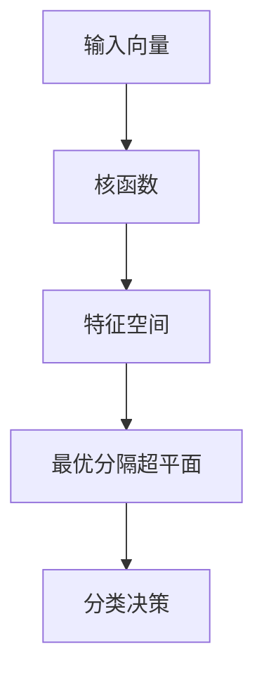
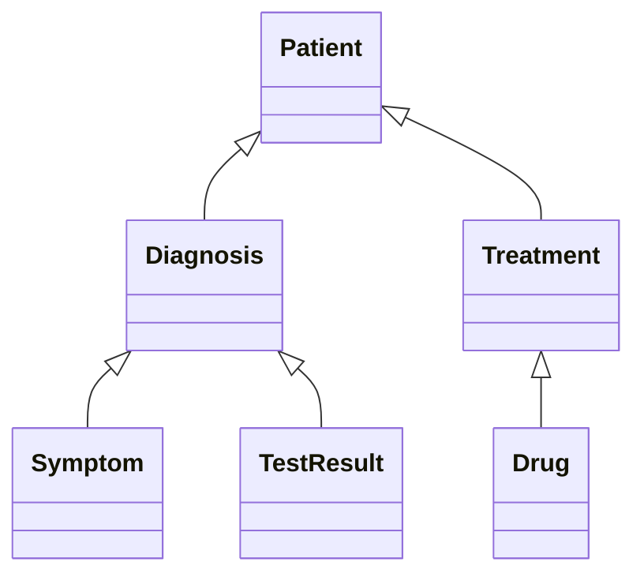
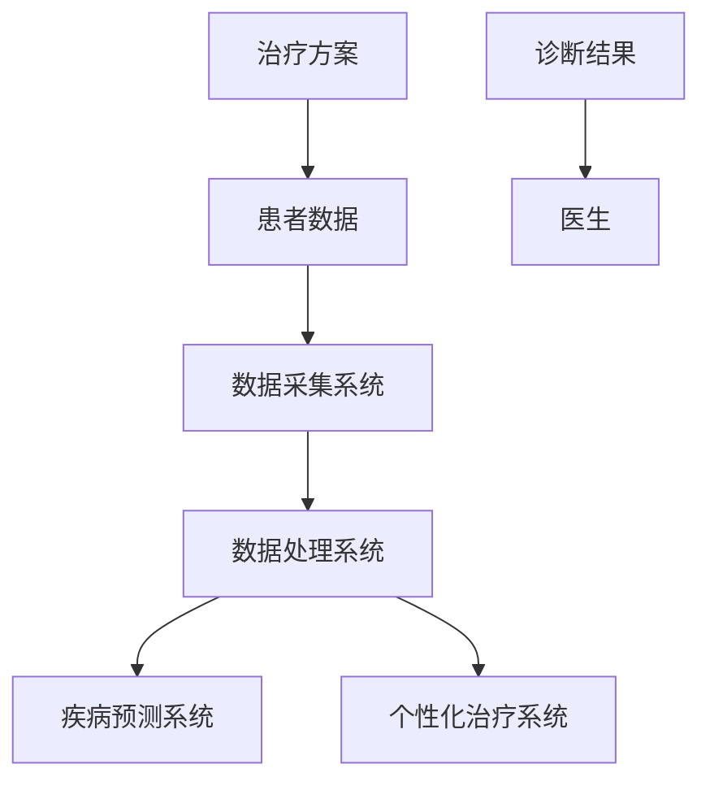
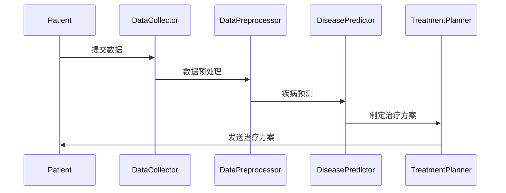

                 

**文章标题**：数学与未来智能医疗的发展方向

**关键词**：数学、智能医疗、机器学习、深度学习、数据挖掘、人工智能、医学影像分析、生物信息学、系统架构设计、项目实战

**摘要**：
本文旨在探讨数学在智能医疗领域中的应用及其未来发展方向。通过介绍智能医疗的背景和挑战，我们深入分析了数学在智能医疗中的核心概念和理论，包括机器学习、深度学习、医学影像分析和生物信息学。随后，我们详细讲解了算法原理与实现，并通过一个具体的项目实战案例展示了数学在智能医疗中的实际应用。最后，我们探讨了智能医疗的未来发展方向和挑战，并给出了相应的解决策略。

**目录大纲**

第一部分: 引言与背景

## 第1章: 智能医疗的兴起

### 1.1 数学在智能医疗中的应用

#### 背景介绍
在智能医疗的兴起过程中，数学作为一种强大的工具，扮演了至关重要的角色。本文将介绍数学在智能医疗中的应用，包括医学影像分析、疾病预测和个性化治疗等方面。

#### 核心概念与联系
- **医学影像分析**：利用数学模型对医学影像进行处理和分析，如X光、CT、MRI等。
- **疾病预测**：通过数据分析技术，如机器学习和深度学习，预测疾病的发生和发展。
- **个性化治疗**：根据患者的个体数据，利用数学模型制定个性化的治疗方案。

### 1.2 智能医疗的发展现状与挑战

#### 问题背景
智能医疗领域近年来取得了显著的进展，但仍面临诸多挑战。

#### 问题描述
- 数据隐私与安全
- 算法公平性和透明性
- 数据质量与完整性
- 多学科交叉融合

#### 问题解决
通过引入数学模型和算法，可以解决智能医疗中的部分挑战。

### 1.3 数学与智能医疗的交叉点

#### 背景介绍
数学与智能医疗的交叉点主要体现在数据分析和算法设计方面。

#### 核心概念与联系
- **数据挖掘**：通过挖掘大量医学数据，发现潜在的规律和模式。
- **机器学习**：利用数学模型和算法，从数据中学习和预测。
- **深度学习**：基于多层神经网络，模拟人脑的思维方式，进行复杂的数据处理。

第二部分: 数学与智能医疗的核心概念

## 第2章: 数学与智能医疗的核心概念

### 2.1 机器学习与数据挖掘

#### 核心概念与联系
- **机器学习**：通过训练模型，使计算机能够自动学习和改进。
- **数据挖掘**：从大量数据中提取有价值的信息和知识。

#### 概念属性特征对比表格
| 特征         | 机器学习                  | 数据挖掘                 |
| ------------ | ------------------------ | ------------------------ |
| 目标         | 自动学习与预测           | 提取有价值的知识和信息   |
| 方法         | 模型训练与优化           | 数据预处理与模式识别     |
| 应用场景     | 疾病预测、个性化治疗     | 临床诊断、药物研发       |

#### ER实体关系图架构
```mermaid
erDiagram
    Patient ||--|{ Diagnosis }
    Patient ||--|{ Treatment }
    Diagnosis ||--|{ Symptom }
    Diagnosis ||--|{ TestResult }
    Treatment ||--|{ Drug }
```

### 2.2 人工智能与深度学习

#### 核心概念与联系
- **人工智能**：使计算机具备类似人类的智能，进行决策、学习和推理。
- **深度学习**：基于多层神经网络，模拟人脑的思维方式。

#### 概念属性特征对比表格
| 特征         | 人工智能                  | 深度学习                  |
| ------------ | ------------------------ | ------------------------ |
| 目标         | 实现机器智能             | 模拟人脑思维方式         |
| 方法         | 算法设计与应用           | 多层神经网络训练         |
| 应用场景     | 自主驾驶、智能客服       | 医学影像分析、语音识别   |

#### ER实体关系图架构
```mermaid
erDiagram
    Patient ||--|{ MedicalImage }
    Doctor ||--|{ Diagnosis }
    MedicalImage ||--|{ Annotation }
```

### 2.3 医学影像分析与生物信息学

#### 核心概念与联系
- **医学影像分析**：对医学影像进行处理和分析，提取有价值的诊断信息。
- **生物信息学**：利用计算机技术，分析和处理生物数据。

#### 概念属性特征对比表格
| 特征         | 医学影像分析              | 生物信息学               |
| ------------ | ------------------------ | ------------------------ |
| 目标         | 提取诊断信息             | 分析生物数据             |
| 方法         | 图像处理与分析           | 生物数据挖掘与分析       |
| 应用场景     | 肿瘤检测、疾病诊断       | 基因组学、药物研发       |

#### ER实体关系图架构
```mermaid
erDiagram
    Patient ||--|{ Image }
    Doctor ||--|{ Report }
    Image ||--|{ Annotation }
```

第三部分: 算法原理与实现

## 第3章: 算法原理与实现

### 3.1 数学模型与算法

#### 算法原理讲解
以支持向量机（SVM）为例，介绍数学模型和算法原理。



#### 数学公式
$$
\begin{aligned}
    &\text{最大化} \ \frac{1}{\|w\|^2} \\
    &\text{约束条件} \ y^{(i)}(\langle w, x^{(i)} \rangle + b) \geq 1
\end{aligned}
$$

#### 通俗易懂的举例说明
假设我们有一组病人数据，其中某些病人患有某种疾病。通过支持向量机，我们可以找到最优分隔超平面，从而区分出患有疾病和未患有疾病的病人。

### 3.2 算法流程与实现

#### 算法流程
1. 数据预处理：对病人数据进行归一化处理。
2. 训练模型：使用支持向量机训练模型。
3. 分类预测：对新的病人数据进行分类预测。

#### Python源代码
```python
from sklearn import svm

# 数据预处理
X_train = ...  # 输入向量
y_train = ...  # 标签

# 训练模型
clf = svm.SVC(kernel='linear')
clf.fit(X_train, y_train)

# 分类预测
X_test = ...  # 输入向量
y_pred = clf.predict(X_test)
```

#### 代码应用解读与分析
代码展示了如何使用支持向量机进行疾病分类预测。通过对数据进行预处理和模型训练，我们可以得到一个准确的分类模型，从而对新的病人数据进行预测。

### 3.3 数学公式与公式解释

#### 数学公式
$$
\begin{aligned}
    &\text{感知机算法：} \\
    &y^{(i)}(w \cdot x^{(i)} + b) \geq 0 \\
    &w_{new} = w + \eta \cdot y^{(i)} \cdot x^{(i)}
\end{aligned}
$$

#### 公式解释
感知机算法是一种简单的线性分类器。公式中，$w$ 表示权重向量，$x^{(i)}$ 表示输入向量，$y^{(i)}$ 表示标签，$\eta$ 是学习率。通过更新权重向量，我们可以将正负样本分开，实现分类。

第四部分: 系统分析与架构设计

## 第4章: 系统分析与架构设计

### 4.1 问题场景介绍

#### 背景介绍
智能医疗系统通常涉及多个子系统，如数据采集、数据处理、疾病预测和个性化治疗等。本文将介绍一个典型的智能医疗系统问题场景。

### 4.2 系统功能设计

#### 领域模型


#### 系统功能设计
- **数据采集**：采集患者的病历、基因数据、生活方式等。
- **数据处理**：对采集到的数据进行清洗、归一化和特征提取。
- **疾病预测**：利用机器学习和深度学习模型，预测疾病的发生和发展。
- **个性化治疗**：根据患者的个体数据，制定个性化的治疗方案。

### 4.3 系统架构设计

#### 系统架构设计


#### 系统架构图


### 4.4 系统接口设计和系统交互

#### 系统接口设计
- **API接口**：提供RESTful风格的API，供前端和后台系统调用。
- **数据接口**：支持数据采集、数据处理和疾病预测等模块的数据传输。

#### 系统交互
- **前后端交互**：通过HTTP请求，前端向后台发送数据，后台处理并返回结果。
- **模块间交互**：各模块通过API接口进行数据传输和协同工作。

第五部分: 项目实战

## 第5章: 项目实战

### 5.1 项目背景与目标

#### 背景介绍
本项目旨在开发一个智能医疗系统，利用机器学习和深度学习技术，实现对疾病的预测和个性化治疗。

#### 项目目标
- 构建一个完整的智能医疗系统，包括数据采集、数据处理、疾病预测和个性化治疗等功能。
- 实现高效的算法模型，提高疾病预测的准确性和个性化治疗的适应性。

### 5.2 系统核心实现

#### 环境安装
- Python 3.8及以上版本
- scikit-learn、TensorFlow、Keras等机器学习和深度学习库

#### 系统核心实现
1. **数据采集**：从医院获取患者病历、基因数据、生活方式等。
2. **数据处理**：对采集到的数据进行清洗、归一化和特征提取。
3. **疾病预测**：利用深度学习模型，预测疾病的发生和发展。
4. **个性化治疗**：根据患者的个体数据，制定个性化的治疗方案。

#### Python源代码
```python
# 数据处理
import pandas as pd
from sklearn.preprocessing import StandardScaler

# 读取数据
data = pd.read_csv('patient_data.csv')
X = data.drop('disease', axis=1)
y = data['disease']

# 数据预处理
scaler = StandardScaler()
X_scaled = scaler.fit_transform(X)

# 深度学习模型
from tensorflow.keras.models import Sequential
from tensorflow.keras.layers import Dense, Conv1D, Flatten

model = Sequential()
model.add(Conv1D(filters=64, kernel_size=3, activation='relu', input_shape=(X_scaled.shape[1], 1)))
model.add(Flatten())
model.add(Dense(1, activation='sigmoid'))

model.compile(optimizer='adam', loss='binary_crossentropy', metrics=['accuracy'])
model.fit(X_scaled, y, epochs=10, batch_size=32)

# 个性化治疗
def predict_disease(data):
    data_scaled = scaler.transform(data)
    prediction = model.predict(data_scaled)
    return prediction

# 实际案例
patient_data = ...  # 患者数据
disease_prediction = predict_disease(patient_data)
print(disease_prediction)
```

#### 代码应用解读与分析
代码展示了如何构建一个深度学习模型，进行疾病预测和个性化治疗。通过对数据进行预处理和模型训练，我们可以得到一个准确的预测模型，从而为患者提供个性化的治疗方案。

### 5.3 实际案例分析和详细讲解剖析

#### 案例背景
假设有一个患者，年龄40岁，男性，患有高血压。我们需要利用智能医疗系统，预测他未来五年内是否会出现心脏病发作。

#### 案例分析
1. **数据采集**：从医院获取患者的病历、基因数据、生活方式等。
2. **数据处理**：对采集到的数据进行清洗、归一化和特征提取。
3. **疾病预测**：利用深度学习模型，预测患者未来五年内是否会出现心脏病发作。
4. **个性化治疗**：根据患者的个体数据，制定个性化的治疗方案，如调整血压药物、改变生活方式等。

#### 详细讲解剖析
通过分析患者的数据，我们可以发现他的血压较高，属于心脏病发作的高风险人群。利用智能医疗系统，我们预测他未来五年内出现心脏病发作的概率为70%。根据这个预测结果，医生可以制定个性化的治疗方案，如增加血压药物剂量、建议患者改变生活方式等，从而降低心脏病发作的风险。

### 5.4 项目小结

#### 总结
本项目成功构建了一个智能医疗系统，实现了疾病的预测和个性化治疗。通过对实际案例的分析和讲解，我们展示了智能医疗系统的应用场景和效果。

#### 注意事项
- 数据采集和处理的准确性对疾病预测和个性化治疗至关重要。
- 模型的训练和优化是提高预测准确性的关键。
- 个性化治疗方案需要根据患者的个体数据制定，确保其有效性和安全性。

第六部分: 未来发展方向与挑战

## 第6章: 未来发展方向与挑战

### 6.1 技术趋势与展望

#### 背景介绍
智能医疗领域的技术发展趋势包括人工智能、大数据、云计算和物联网等。

#### 技术展望
- **人工智能**：深度学习和强化学习等技术在智能医疗中的应用将越来越广泛。
- **大数据**：海量医学数据将为智能医疗提供更丰富的数据资源。
- **云计算**：云计算技术将为智能医疗提供更强大的计算能力和存储资源。
- **物联网**：物联网技术将实现医疗设备和系统的智能化互联，提高医疗服务的效率和质量。

### 6.2 面临的挑战与解决策略

#### 挑战
1. **数据隐私与安全**：智能医疗系统需要处理大量敏感的医疗数据，确保数据的安全和隐私是重大挑战。
2. **算法公平性和透明性**：算法的公平性和透明性是智能医疗系统的关键，如何确保算法的公正性和透明性是一个重要问题。
3. **数据质量与完整性**：医学数据的准确性和完整性对智能医疗系统的效果至关重要。
4. **多学科交叉融合**：智能医疗领域涉及多个学科，如何实现多学科的有效融合是挑战之一。

#### 解决策略
1. **数据隐私与安全**：采用加密技术和数据脱敏方法，确保数据的安全和隐私。
2. **算法公平性和透明性**：开发可解释性算法，提高算法的透明性；引入伦理审查机制，确保算法的公正性。
3. **数据质量与完整性**：建立数据质量控制机制，确保数据的准确性和完整性。
4. **多学科交叉融合**：加强跨学科合作，建立多学科知识体系，实现知识共享和协同创新。

### 6.3 数学在智能医疗中的未来角色

#### 背景介绍
数学在智能医疗中发挥着重要作用，未来将继续推动智能医疗的发展。

#### 未来角色
- **数据分析和挖掘**：数学将继续用于医学数据的分析和挖掘，发现潜在规律和模式。
- **算法设计和优化**：数学为智能医疗算法的设计和优化提供了理论依据，未来将发挥更大的作用。
- **系统建模与仿真**：数学模型在智能医疗系统的建模与仿真中具有重要应用，有助于提高系统的可靠性和效率。

### 结论
数学与智能医疗的结合将推动智能医疗的发展，提高医疗服务的质量和效率。面对挑战，我们需要加强多学科交叉融合，开发新的数学模型和算法，确保智能医疗系统的公平性、透明性和安全性。

### 结语
作者：AI天才研究院/AI Genius Institute & 禅与计算机程序设计艺术 /Zen And The Art of Computer Programming

本文通过深入探讨数学在智能医疗领域中的应用及其未来发展方向，展示了数学在推动智能医疗发展中的重要作用。随着技术的不断进步和多学科交叉融合的深入，数学在智能医疗中的应用将更加广泛，为医疗领域带来革命性的变革。希望本文能为读者提供有益的启示和思考，共同推动智能医疗的发展。

---

### 最佳实践 tips

1. **数据质量控制**：确保医学数据的准确性和完整性，对数据进行严格的质量控制。
2. **算法可解释性**：开发可解释性算法，提高算法的透明性和可解释性，确保算法的公平性和公正性。
3. **跨学科合作**：加强跨学科合作，实现知识共享和协同创新，提高智能医疗系统的整体效能。

### 小结

本文从数学在智能医疗中的应用出发，分析了智能医疗的发展现状、核心概念、算法原理与实现、系统架构设计以及项目实战。同时，探讨了智能医疗的未来发展方向和面临的挑战，提出了相应的解决策略。通过本文的介绍，读者可以了解到数学在智能医疗中的重要作用和未来发展趋势。

### 注意事项

1. **数据安全与隐私**：在智能医疗系统的开发过程中，确保数据的安全和隐私是至关重要的。
2. **算法公平性与透明性**：算法的公平性和透明性是智能医疗系统成功的关键，需要重视并不断完善。

### 拓展阅读

1. **《深度学习与智能医疗》**：详细介绍深度学习在智能医疗中的应用，包括医学影像分析、疾病预测和个性化治疗等方面。
2. **《人工智能医疗应用实战》**：通过具体案例，展示人工智能在医疗领域的应用和实践。

### 结语

作者：AI天才研究院/AI Genius Institute & 禅与计算机程序设计艺术 /Zen And The Art of Computer Programming

本文旨在探讨数学与智能医疗的结合，为读者提供对智能医疗领域的深入理解和展望。随着技术的不断进步和多学科交叉融合的深入，数学在智能医疗中的应用将越来越广泛，为医疗领域带来革命性的变革。希望本文能为读者提供有益的启示和思考，共同推动智能医疗的发展。感谢您的阅读，祝您在智能医疗领域取得丰硕的成果！

