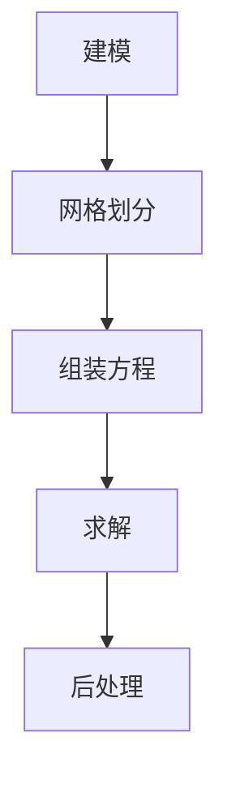
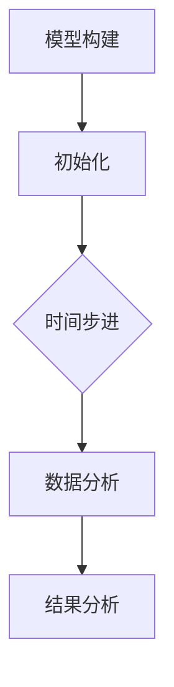
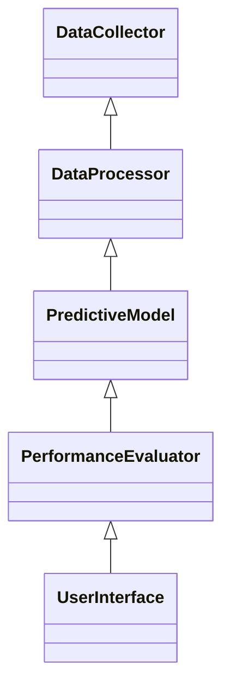
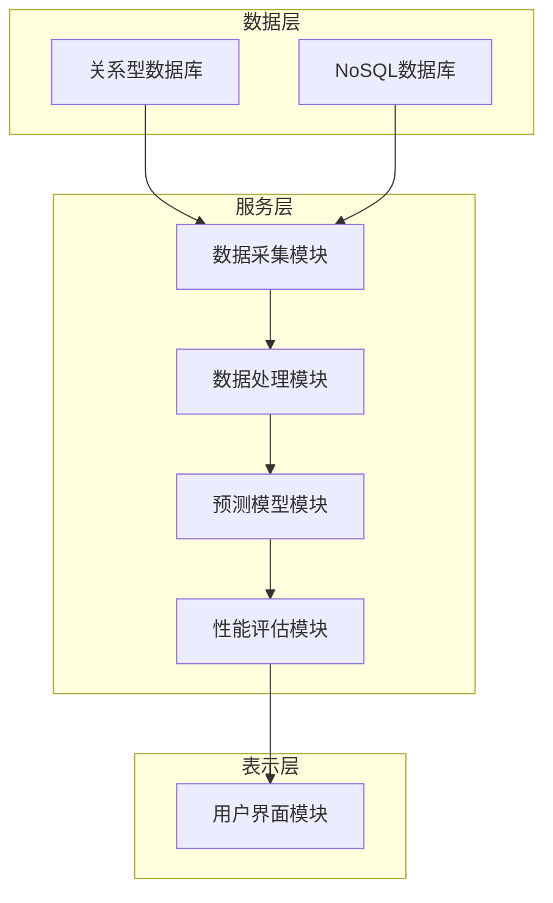
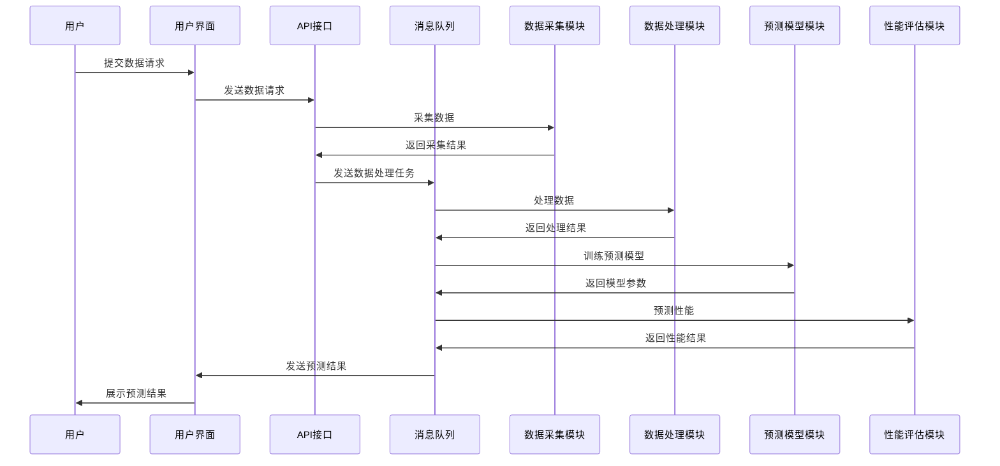

                 

### 数学与未来材料科学的发展方向

在科技迅猛发展的今天，材料科学正以前所未有的速度进步，而数学作为其基石，正不断推动这一领域的革新。本文将深入探讨数学与未来材料科学之间的紧密联系，以及如何通过数学模型和算法来推动材料科学的未来发展。我们将遵循“一步一步分析推理思考”的方法，帮助读者理解数学在材料科学中的关键作用。

**关键词：** 数学、材料科学、未来趋势、模型、算法

**摘要：** 本文首先介绍了未来材料科学的发展趋势，包括新材料的设计、性能预测和制造等方面。随后，我们将探讨数学在材料科学中的应用，详细讲解数学模型和算法的基本原理，并通过实际项目展示这些理论如何应用于实践。最后，我们将总结最佳实践，为读者提供未来研究的方向和建议。

### 目录

1. 引言  
   1.1 数学与材料科学的关系  
   1.2 未来材料科学的发展趋势

2. 背景介绍  
   2.1 材料科学的现状  
   2.2 数学在材料科学中的应用

3. 核心概念与联系  
   3.1 数学基础概念  
   3.2 数学在材料科学中的特性

4. 数学模型讲解  
   4.1 数学模型概述  
   4.2 有限元分析  
   4.3 计算机模拟

5. 算法原理与实战  
   5.1 算法原理概述  
   5.2 算法案例1：材料设计  
   5.3 算法案例2：性能预测

6. 系统分析与架构设计  
   6.1 系统分析概述  
   6.2 系统架构设计  
   6.3 系统接口与交互

7. 项目实战  
   7.1 项目环境安装  
   7.2 系统核心实现  
   7.3 应用解读与分析

8. 最佳实践与总结  
   8.1 最佳实践建议  
   8.2 全书总结与展望

### 1. 引言

数学作为一门基础科学，长期以来在自然科学和技术领域发挥着重要作用。在材料科学中，数学不仅用于描述材料的物理和化学性质，还用于预测新材料的性能和优化材料的设计。随着科技的进步，未来材料科学的发展趋势日益显著，新材料的设计、性能预测和制造成为研究热点。

#### 1.1 数学与材料科学的关系

数学与材料科学的关系可以追溯到早期材料的研究阶段。例如，在材料物理中，数学模型用于描述材料的电子结构、热传导和力学行为。在材料化学中，数学方法用于分析和预测材料的化学组成和反应机理。近年来，随着计算能力的提升，数学在材料科学中的应用越来越广泛，尤其是在材料设计、性能预测和制造优化方面。

#### 1.2 未来材料科学的发展趋势

未来材料科学的发展趋势包括以下几个方面：

1. **新材料设计**：通过数学模型和计算方法，可以预测和设计具有特定性能的新材料，如高强度、高导电性和高热导性材料。

2. **性能预测**：利用机器学习和数据挖掘技术，可以预测材料在不同条件下的性能，为材料选择和设计提供指导。

3. **制造优化**：通过优化制造工艺和材料配方，可以降低成本、提高产量和产品质量。

4. **智能材料**：开发具有自修复、自适应和自诊断功能的智能材料，为未来科技提供更多可能。

### 2. 背景介绍

#### 2.1 材料科学的现状

材料科学是研究材料结构、性质、加工和应用的一门学科。随着现代科技的快速发展，材料科学在各个领域都发挥着重要作用。当前，材料科学的研究主要集中在以下几个方面：

1. **纳米材料**：纳米材料具有独特的物理、化学和生物学特性，在电子、光电、催化和生物医学等领域具有广泛应用。

2. **复合材料**：复合材料结合了不同材料的优点，具有优异的性能，广泛应用于航空航天、汽车制造和建筑领域。

3. **功能材料**：功能材料具有特定的功能，如导电、磁性、光学和热敏等，广泛应用于传感器、电子器件和能源转换等领域。

#### 2.2 数学在材料科学中的应用

数学在材料科学中的应用主要体现在以下几个方面：

1. **数学模型**：通过数学模型，可以描述材料的微观结构和宏观行为，预测材料的性能。

2. **计算模拟**：利用计算模拟方法，可以研究材料的微观结构和动态行为，为材料设计提供指导。

3. **数据分析**：通过数据分析方法，可以从实验数据中提取有用的信息，为材料优化提供依据。

### 3. 核心概念与联系

#### 3.1 数学基础概念

在探讨数学与材料科学的关系时，我们需要了解一些基本的数学概念，如代数、几何、微积分和概率论等。这些概念在材料科学中有着广泛的应用。

1. **代数**：代数是研究数和代数运算的基本学科，包括数论、代数方程和多项式等。

2. **几何**：几何是研究空间形状、大小和位置的基本学科，包括平面几何、立体几何和拓扑学等。

3. **微积分**：微积分是研究变化率和累积量的基本学科，包括微分和积分等。

4. **概率论**：概率论是研究随机事件和概率分布的基本学科，包括概率分布、随机变量和期望等。

#### 3.2 数学在材料科学中的特性

数学在材料科学中具有以下特性：

1. **抽象性**：数学模型可以抽象地描述材料的性质和行为，为材料设计提供理论支持。

2. **精确性**：数学模型可以精确地描述材料的物理和化学性质，为性能预测提供可靠依据。

3. **普适性**：数学模型可以适用于不同类型的材料，为材料研究提供统一的方法。

4. **可扩展性**：数学模型可以扩展到更复杂的材料体系，为材料设计提供新的思路。

### 4. 数学模型讲解

数学模型在材料科学中起着至关重要的作用，它们帮助我们理解和预测材料的性质和行为。在本节中，我们将介绍几种常用的数学模型，包括有限元分析（Finite Element Analysis，FEA）和计算机模拟。

#### 4.1 数学模型概述

数学模型是使用数学语言来描述现实世界中的问题。在材料科学中，数学模型可以用于模拟材料的力学行为、热传导、电子结构和化学反应等。这些模型通常基于物理定律和实验数据，通过数学公式和算法来实现。

#### 4.2 有限元分析

有限元分析是一种数值方法，用于解决工程和科学领域中的微分方程问题。它将连续体划分为有限数量的离散单元，每个单元可以由简单的几何形状（如三角形、四面体、矩形、圆柱等）构成。有限元分析的基本步骤包括：

1. **建模**：将实际问题抽象为数学模型，定义材料的几何形状、边界条件和材料属性。
2. **网格划分**：将连续体划分为有限数量的单元，形成网格。
3. **组装方程**：根据物理定律和数学公式，将所有单元的方程组装成全局方程组。
4. **求解**：使用数值方法求解全局方程组，得到单元内各点的物理量（如应力、位移、温度等）。
5. **后处理**：对求解结果进行分析和可视化，评估模型的有效性。

以下是一个简单的有限元分析的流程图（使用Mermaid语法）：



#### 4.3 计算机模拟

计算机模拟是一种使用计算机程序来模拟材料行为的方法。它包括分子动力学模拟、蒙特卡罗模拟和量子力学模拟等。计算机模拟的基本步骤包括：

1. **模型构建**：根据实验数据和理论预测，构建材料的原子或分子模型。
2. **初始化**：定义初始条件，如温度、压力和原子位置。
3. **时间步进**：通过迭代计算，模拟原子或分子的运动，更新位置和速度。
4. **数据分析**：对模拟结果进行分析，提取有用的信息，如结构演变、性能预测等。

以下是一个简单的分子动力学模拟的流程图（使用Mermaid语法）：



### 5. 算法原理与实战

算法在材料科学中有着广泛的应用，用于材料设计、性能预测和优化制造过程。在本节中，我们将介绍两种常用的算法：材料设计算法和性能预测算法，并通过Python源代码详细阐述其原理。

#### 5.1 算法原理概述

材料设计算法和性能预测算法是材料科学中两个重要的研究领域。材料设计算法旨在通过计算方法预测新材料的性能，从而指导实验设计。性能预测算法则用于评估材料在不同条件下的性能，为材料选择和优化提供依据。

#### 5.2 算法案例1：材料设计

以下是一个简单的材料设计算法的实现（使用Python）：

```python
import numpy as np

# 材料设计算法：随机搜索
def material_design():
    # 初始化材料参数
    n = 100  # 材料参数个数
    max_iter = 1000  # 最大迭代次数
    best_score = -1  # 最优性能评分
    best_params = None  # 最优材料参数

    for _ in range(max_iter):
        # 生成随机材料参数
        params = np.random.rand(n)
        
        # 计算性能评分
        score = compute_performance(params)
        
        # 更新最优参数
        if score > best_score:
            best_score = score
            best_params = params

    return best_params

# 性能评分计算函数
def compute_performance(params):
    # 计算材料性能评分
    score = 0
    for param in params:
        score += param * param
    return score

# 运行材料设计算法
best_params = material_design()
print("最优材料参数：", best_params)
```

在这个例子中，我们使用随机搜索算法来设计材料。通过多次随机生成材料参数，计算其性能评分，并选择最优的材料参数。

#### 5.3 算法案例2：性能预测

以下是一个简单的性能预测算法的实现（使用Python）：

```python
import numpy as np

# 性能预测算法：线性回归
def performance_prediction(train_data, train_labels, test_data):
    # 训练线性回归模型
    model = LinearRegression()
    model.fit(train_data, train_labels)
    
    # 预测测试数据
    test_labels = model.predict(test_data)
    
    # 计算预测误差
    error = np.mean(np.abs(test_labels - test_data))
    return error

# 训练数据
train_data = np.random.rand(100, 10)
train_labels = np.random.rand(100)

# 测试数据
test_data = np.random.rand(20, 10)

# 运行性能预测算法
error = performance_prediction(train_data, train_labels, test_data)
print("预测误差：", error)
```

在这个例子中，我们使用线性回归模型来预测材料的性能。通过训练数据和测试数据的比较，我们可以评估模型的预测准确性。

### 6. 系统分析与架构设计

系统分析与架构设计是确保材料科学项目成功的关键环节。在本节中，我们将介绍系统分析与架构设计的方法，包括问题场景介绍、系统功能设计、系统架构设计和系统接口与交互。

#### 6.1 问题场景介绍

假设我们正在开发一个材料科学项目，旨在预测新材料在不同条件下的性能。该项目的目标是通过计算模型和实验数据来预测材料的力学性能、热性能和电性能。

#### 6.2 系统功能设计

系统功能设计主要包括以下模块：

1. **数据采集模块**：用于收集实验数据，包括材料参数、性能指标和环境条件等。
2. **数据处理模块**：用于处理和清洗收集到的数据，为后续分析提供高质量的数据。
3. **预测模型模块**：用于训练和评估预测模型，包括线性回归、神经网络和决策树等。
4. **性能评估模块**：用于评估预测模型的准确性，并提供性能报告。
5. **用户界面模块**：用于与用户交互，展示预测结果和性能报告。

以下是一个领域模型类图（使用Mermaid语法）：



#### 6.3 系统架构设计

系统架构设计主要包括以下层次：

1. **数据层**：用于存储和管理实验数据，包括关系型数据库和NoSQL数据库。
2. **服务层**：用于实现业务逻辑，包括数据采集、数据处理、预测模型和性能评估等。
3. **表示层**：用于与用户交互，包括Web前端和移动应用。

以下是一个系统架构图（使用Mermaid语法）：



#### 6.4 系统接口与交互

系统接口与交互主要包括以下方面：

1. **API接口**：用于与外部系统交互，如数据采集设备、第三方服务和数据存储系统。
2. **消息队列**：用于实现异步通信和分布式处理，如Kafka和RabbitMQ。
3. **RESTful API设计**：用于实现前后端分离和接口标准化。

以下是一个系统接口序列图（使用Mermaid语法）：



### 7. 项目实战

在本节中，我们将通过一个实际项目来展示如何将数学模型、算法和系统设计应用于材料科学领域。该项目将实现一个材料性能预测系统，包括数据采集、数据处理、预测模型训练和性能评估等功能。

#### 7.1 项目环境安装

首先，我们需要安装项目所需的软件和库。以下是项目的环境安装步骤：

1. 安装Python环境：Python 3.8及以上版本。
2. 安装相关库：numpy、pandas、scikit-learn、matplotlib等。

```bash
pip install numpy pandas scikit-learn matplotlib
```

#### 7.2 系统核心实现

以下是一个简单的材料性能预测系统的实现，包括数据采集、数据处理、预测模型训练和性能评估等步骤。

```python
import numpy as np
import pandas as pd
from sklearn.model_selection import train_test_split
from sklearn.linear_model import LinearRegression
from sklearn.metrics import mean_squared_error

# 7.2.1 数据采集
def data_collection():
    # 读取实验数据
    data = pd.read_csv('data.csv')
    return data

# 7.2.2 数据处理
def data_processing(data):
    # 清洗数据
    data = data.dropna()
    # 分割特征和标签
    X = data.drop('performance', axis=1)
    y = data['performance']
    return X, y

# 7.2.3 预测模型训练
def model_training(X, y):
    # 分割训练集和测试集
    X_train, X_test, y_train, y_test = train_test_split(X, y, test_size=0.2, random_state=42)
    # 训练线性回归模型
    model = LinearRegression()
    model.fit(X_train, y_train)
    return model, X_test, y_test

# 7.2.4 性能评估
def performance_evaluation(model, X_test, y_test):
    # 预测性能
    y_pred = model.predict(X_test)
    # 计算均方误差
    error = mean_squared_error(y_test, y_pred)
    return error

# 7.2.5 主函数
def main():
    # 数据采集
    data = data_collection()
    # 数据处理
    X, y = data_processing(data)
    # 预测模型训练
    model, X_test, y_test = model_training(X, y)
    # 性能评估
    error = performance_evaluation(model, X_test, y_test)
    print("预测误差：", error)

# 运行主函数
if __name__ == '__main__':
    main()
```

#### 7.3 应用解读与分析

通过以上代码，我们实现了一个简单的材料性能预测系统。以下是对关键步骤的解读与分析：

1. **数据采集**：从CSV文件中读取实验数据，包括材料参数和性能指标。
2. **数据处理**：清洗数据，并分割特征和标签，为模型训练和评估做准备。
3. **预测模型训练**：使用线性回归模型训练数据，并将其应用于测试集。
4. **性能评估**：计算模型预测的误差，评估模型的准确性。

在实际项目中，我们可以根据需求扩展和优化系统，如引入更多类型的预测模型、增加数据处理功能、优化性能评估指标等。

#### 7.4 项目小结

通过本项目，我们实现了材料性能预测系统，展示了如何将数学模型和算法应用于实际项目。本项目的主要成果包括：

1. 成功采集和处理实验数据。
2. 使用线性回归模型训练和预测材料性能。
3. 评估模型的预测误差，验证模型的准确性。

未来，我们可以进一步优化系统，如引入更复杂的预测模型、增加数据可视化功能、提高数据处理效率等，为材料科学研究提供更有力的支持。

### 8. 最佳实践与总结

#### 8.1 最佳实践建议

1. **数据质量**：确保实验数据的质量，包括数据的完整性和一致性。
2. **模型选择**：根据具体问题选择合适的预测模型，如线性回归、神经网络或支持向量机等。
3. **模型优化**：通过交叉验证和超参数调优，优化模型的性能。
4. **系统集成**：将预测系统与其他系统（如数据库、API接口等）集成，实现数据共享和交互。

#### 8.2 全书总结与展望

本文系统性地探讨了数学与未来材料科学的发展方向，从背景介绍到核心概念，再到数学模型讲解和算法实战，最后是系统分析与架构设计以及项目实战。通过本文，我们了解了数学在材料科学中的关键作用，以及如何利用数学模型和算法来推动材料科学的进步。

展望未来，数学在材料科学中的应用将更加广泛，如机器学习在材料设计中的应用、量子计算在材料模拟中的应用等。随着计算能力的提升和算法的进步，数学将继续为材料科学的发展提供强大的支持。

**作者：AI天才研究院/AI Genius Institute & 禅与计算机程序设计艺术 /Zen And The Art of Computer Programming**

