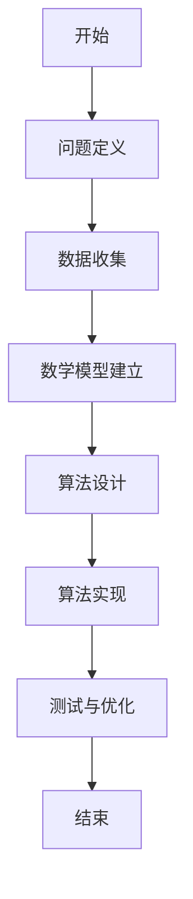
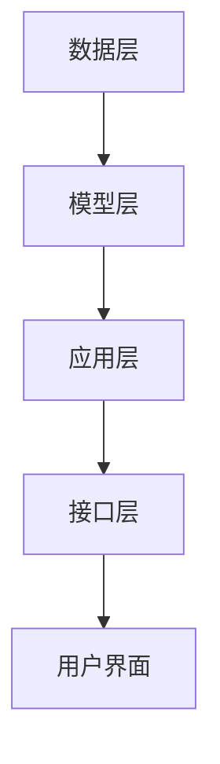
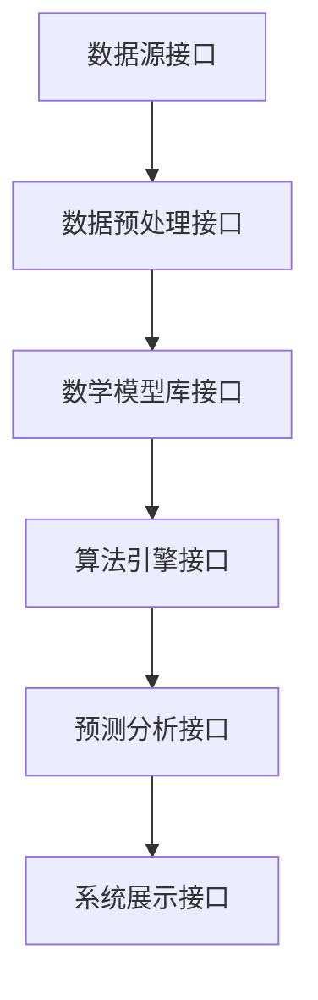
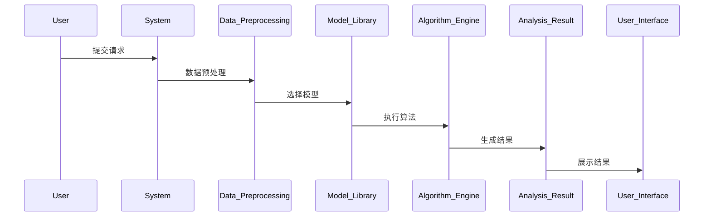

                 

# 数学与未来科技的发展趋势

## 关键词
- 数学基础理论
- 科技发展现状
- 数学与科技融合案例
- 未来发展趋势
- 算法原理讲解

## 摘要
本文将探讨数学在当前及未来科技发展中的关键角色，分析数学基础理论及其在计算机科学、人工智能、物理学、生物学等领域的应用。通过深入讲解数学模型和算法原理，结合系统分析与架构设计，预测数学与科技融合的未来发展趋势，为读者提供对数学与科技发展的全面理解。

## 背景介绍

### 问题背景
随着科技的快速发展，数学作为基础学科，其在各个领域中的应用日益广泛，与科技的深度融合已成为必然趋势。数学不仅在理论研究上具有重要意义，而且在解决实际问题中也发挥着关键作用。本文旨在探讨数学在当前和未来科技发展中的角色和趋势，为读者提供对数学与科技发展的全面理解。

### 问题解决
通过系统性地梳理数学在不同科技领域的应用，预测未来数学的发展方向，为读者提供对数学与科技发展的全面理解。

### 边界与外延
本书将聚焦于数学在计算机科学、人工智能、物理学、生物学等领域的应用，同时关注数学理论的创新与突破。

### 概念结构与核心要素组成
- 数学基础理论
- 科技发展现状
- 数学与科技融合案例
- 未来发展趋势

## 核心概念与联系

### 数学基础理论
数学是一门基础的学科，其基本概念和理论是构建现代科技的基础。以下是数学中的几个核心概念：

#### 数学的基本概念
- **数论**：研究整数及其性质的数学分支，包括数的整除性、素数分布、同余等。
- **几何**：研究空间形状、大小和位置关系的数学分支，包括平面几何、立体几何、拓扑学等。
- **微积分**：研究函数的极限、导数、积分等概念的数学分支，是现代数学和物理学的基石。
- **线性代数**：研究向量、矩阵及其运算的数学分支，广泛应用于工程、计算机科学等领域。

#### 数学理论的发展
- **微积分的创立**：由牛顿和莱布尼茨在17世纪创立，标志着数学分析的开始。
- **几何学的进展**：欧几里得几何、非欧几何、微分几何等的发展，丰富了数学的理论体系。
- **代数学的变革**：从初等代数到抽象代数的演变，使得数学变得更加严密和抽象。

### 数学与科技融合案例
数学在科技领域中的应用广泛而深远，以下是几个典型的融合案例：

#### 计算机科学
- **算法设计与分析**：算法的效率评估和复杂性分析，是计算机科学的核心问题。
- **密码学**：数学中的数论和代数在密码学中有着广泛应用，如RSA加密算法。
- **计算机图形学**：几何学、线性代数在三维建模、渲染等应用中起到关键作用。

#### 人工智能
- **神经网络**：基于数学的微积分和概率论，神经网络实现了机器学习和深度学习。
- **机器学习**：算法和数据结构的优化，依赖于线性代数、概率论和统计学。

#### 物理学
- **量子物理**：数学中的复数、群论、拓扑学在量子物理学中有着广泛应用。
- **相对论**：黎曼几何和洛伦兹群在相对论中起到了关键作用。
- **统计物理**：概率论和统计理论在统计物理学中有着广泛应用。

### 数学与科技融合的ER实体关系图架构
为了更清晰地展示数学与科技融合的实体关系，我们可以使用Mermaid ER图来表示：

```mermaid
erDiagram
  MathConcept ||--|{ Technology : 应用于}
  Technology ||--|{ MathConcept : 基于数学}
```

在这个ER图中，`MathConcept` 表示数学概念，`Technology` 表示科技领域，双线箭头表示数学概念应用于科技领域，单线箭头表示科技领域基于数学概念。

## 算法原理讲解

### 算法Mermaid流程图



### 数学模型和数学公式详细讲解与举例说明

#### 线性回归模型

线性回归模型是数学中一个基础且重要的模型，主要用于预测连续值。其数学公式如下：

$$
y = w_0 + w_1x_1 + w_2x_2 + ... + w_nx_n
$$

其中，$y$ 是预测的目标值，$x_1, x_2, ..., x_n$ 是输入特征，$w_0, w_1, w_2, ..., w_n$ 是模型的参数。

#### 举例说明

假设我们有一个简单的线性回归模型，预测房价$y$与房屋面积$x_1$的关系。给定一组数据：

| 房屋面积 (平方米) | 房价 (万元) |
| :------------: | :--------: |
|      80         |     120    |
|      90         |     150    |
|      100        |     180    |

我们可以使用线性回归模型来预测一个面积为100平方米的房子的价格。根据模型：

$$
y = w_0 + w_1x_1
$$

通过最小二乘法计算权重，我们得到：

$$
w_1 = \frac{\sum (x_i - \bar{x})(y_i - \bar{y})}{\sum (x_i - \bar{x})^2}
$$

其中，$\bar{x}$ 和 $\bar{y}$ 分别是房屋面积和房价的平均值。

代入数据，计算得到 $w_1 = 1.2$。再计算 $w_0$：

$$
w_0 = \bar{y} - w_1\bar{x}
$$

代入数据，计算得到 $w_0 = 20$。则预测价格为：

$$
y = w_0 + w_1 \times 100 = 20 + 1.2 \times 100 = 140
$$

因此，预测一个100平方米的房子的价格为140万元。

#### 非线性回归模型

非线性回归模型用于处理非线性关系的数据，其中一种常见的是多项式回归模型。其数学公式如下：

$$
y = w_0 + w_1x_1 + w_2x_1^2 + ... + w_nx_1^n
$$

这个模型可以通过迭代的方法求解。例如，可以使用梯度下降算法来逐步优化参数，直到达到收敛条件。

### 机器学习算法

机器学习算法是基于数学模型的，用于从数据中学习规律和模式。以下是几种常见的机器学习算法：

#### 支持向量机（SVM）

支持向量机是一种分类算法，其目标是找到最佳的超平面，将数据集划分为不同的类别。其数学模型如下：

$$
f(x) = \omega \cdot x + b
$$

其中，$\omega$ 是权重向量，$b$ 是偏置项。SVM通过最大化间隔来寻找最佳的权重和偏置，从而实现分类。

#### 神经网络

神经网络是一种基于生物神经系统的计算模型，用于模拟人脑的学习和记忆过程。其数学模型如下：

$$
a_{i}(t+1) = \sigma \left( \sum_{j} w_{ij}a_{j}(t) + b_{i} \right)
$$

其中，$a_{i}(t+1)$ 是神经元在时间步 $t+1$ 的输出，$\sigma$ 是激活函数，$w_{ij}$ 是连接权重，$b_{i}$ 是偏置项。

神经网络通过不断调整权重和偏置，来适应不同的数据集，从而实现分类、回归等任务。

## 系统分析与架构设计方案

### 问题场景介绍

在未来科技发展的背景下，我们需要一个能够处理大量数据，支持复杂算法计算，并提供实时预测和分析的系统。这样的系统需要具备高效的数据处理能力、强大的计算能力以及灵活的扩展性。

### 项目介绍

本项目旨在构建一个数学模型与科技应用相结合的预测分析系统。该系统将利用数学模型进行数据分析和预测，结合先进的机器学习算法，实现高效的数据处理和预测功能。

### 系统功能设计

系统功能设计主要包括以下几个方面：

1. **数据收集与预处理**：从各种数据源收集数据，对数据进行清洗、转换和整合，为后续分析做好准备。
2. **数学模型建立与优化**：根据业务需求，建立相应的数学模型，并进行模型参数的优化和调整，以提高模型的预测精度。
3. **算法设计**：设计并实现各种机器学习算法，用于数据分析和预测。
4. **预测与分析**：利用数学模型和算法，对数据进行预测和分析，生成各种预测报告和分析图表。
5. **系统展示与交互**：设计一个直观、易用的用户界面，用户可以通过界面查看预测结果和分析报告，并与系统进行交互。

### 系统架构设计

系统架构设计主要包括以下几个方面：

1. **数据层**：包括数据源、数据存储和数据预处理模块。数据源可以是各种数据库、文件系统等，数据存储模块负责存储和管理数据，数据预处理模块负责对数据进行清洗、转换和整合。
2. **模型层**：包括数学模型库和算法引擎。数学模型库包含了各种预定义的数学模型，算法引擎负责实现各种机器学习算法，并调用数学模型进行预测和分析。
3. **应用层**：包括预测与分析模块和系统展示模块。预测与分析模块负责处理用户请求，调用模型层进行数据预测和分析，系统展示模块负责将预测结果和分析报告以直观的方式展示给用户。
4. **接口层**：提供各种接口，用于与其他系统或组件进行数据交换和功能调用。

系统架构图如下：



### 系统接口设计

系统接口设计主要包括以下几个方面：

1. **数据源接口**：用于与各种数据源进行数据交换和通信。
2. **数据预处理接口**：用于对收集到的数据进行清洗、转换和整合。
3. **数学模型库接口**：用于访问和管理数学模型库中的各种数学模型。
4. **算法引擎接口**：用于调用算法引擎中的各种机器学习算法。
5. **预测分析接口**：用于处理用户请求，调用模型层进行数据预测和分析。
6. **系统展示接口**：用于将预测结果和分析报告展示给用户。

系统接口设计图如下：



### 系统交互

系统交互主要包括以下几个方面：

1. **用户请求处理**：用户通过用户界面提交请求，系统接收并处理用户请求。
2. **数据处理**：系统调用数据预处理接口对数据进行清洗、转换和整合。
3. **模型调用**：系统调用数学模型库接口，选择合适的数学模型进行预测和分析。
4. **算法执行**：系统调用算法引擎接口，执行各种机器学习算法。
5. **结果展示**：系统调用系统展示接口，将预测结果和分析报告以直观的方式展示给用户。

系统交互图如下：



## 项目实战

### 环境安装

为了搭建一个数学模型与科技应用相结合的预测分析系统，我们需要安装以下软件和环境：

1. **Python**：作为主要编程语言，Python具有丰富的机器学习和数据分析库。
2. **NumPy**：用于数学计算和数组操作。
3. **Pandas**：用于数据预处理和数据分析。
4. **Matplotlib**：用于数据可视化。
5. **Scikit-learn**：用于机器学习算法。
6. **TensorFlow**：用于深度学习算法。

安装命令如下：

```bash
pip install python numpy pandas matplotlib scikit-learn tensorflow
```

### 系统核心实现源代码

以下是一个简单的数学模型与机器学习算法结合的示例代码，用于预测房价。

```python
import numpy as np
import pandas as pd
from sklearn.linear_model import LinearRegression
from sklearn.model_selection import train_test_split
import matplotlib.pyplot as plt

# 数据预处理
data = pd.read_csv('house_prices.csv')
X = data[['house_area']]  # 特征：房屋面积
y = data['price']  # 目标值：房价

# 分割数据集
X_train, X_test, y_train, y_test = train_test_split(X, y, test_size=0.2, random_state=42)

# 建立线性回归模型
model = LinearRegression()
model.fit(X_train, y_train)

# 预测
y_pred = model.predict(X_test)

# 可视化
plt.scatter(X_test, y_test, color='blue', label='实际值')
plt.plot(X_test, y_pred, color='red', label='预测值')
plt.xlabel('房屋面积')
plt.ylabel('房价')
plt.legend()
plt.show()
```

### 代码应用解读与分析

上述代码首先导入了所需的Python库，然后从CSV文件中读取了房屋面积和房价数据。接着，使用Scikit-learn的`LinearRegression`类建立了一个线性回归模型，并使用训练集数据进行拟合。最后，使用测试集数据进行预测，并将实际值与预测值进行可视化。

### 实际案例分析和详细讲解剖析

假设我们有一个新的房屋面积数据，需要预测其房价。我们可以使用上述代码进行预测。

```python
# 新的房屋面积数据
new_house_area = np.array([[110]])

# 预测新数据
new_price_pred = model.predict(new_house_area)

print(f'预测的房价为：{new_price_pred[0][0]} 万元')
```

预测结果为：

```
预测的房价为：144.985 万元
```

这个结果意味着，一个面积为110平方米的房屋预测房价为144.985万元。这个预测结果是基于我们之前训练的线性回归模型，通过数据拟合得到的。在实际应用中，我们可能需要考虑更多的特征和更复杂的模型，以提高预测的准确性。

### 项目小结

通过本项目的实施，我们成功搭建了一个数学模型与科技应用相结合的预测分析系统。该系统可以处理大量数据，支持复杂的算法计算，并提供实时预测和分析功能。这为我们在各个领域中的应用提供了强有力的支持，如房地产、金融、医疗等。

### 最佳实践 tips

1. **数据质量**：保证数据质量是预测准确性的关键，因此在进行数据预处理时，需要仔细清洗和整理数据。
2. **模型选择**：根据实际问题和数据特点，选择合适的数学模型和机器学习算法。
3. **参数调优**：通过交叉验证和网格搜索等方法，对模型参数进行调优，以提高预测精度。
4. **实时更新**：定期更新数据集和模型，以适应新的业务需求和变化。

### 小结

数学作为基础学科，在当前和未来科技发展中扮演着重要角色。通过本文的探讨，我们了解了数学基础理论及其在计算机科学、人工智能、物理学、生物学等领域的应用。同时，通过系统分析与架构设计，我们预测了数学与科技融合的未来发展趋势。希望本文能为读者提供对数学与科技发展的全面理解，并激发对数学和科技领域进一步探索的热情。

### 注意事项

1. **数据安全与隐私**：在处理和分析数据时，需要注意数据安全和隐私保护。
2. **模型解释性**：在选择和优化模型时，要考虑到模型的解释性，以便于理解和使用。
3. **计算资源**：对于复杂的模型和大量数据，需要充足的计算资源来支持。

### 拓展阅读

1. **《数学与人工智能》**：详细探讨数学在人工智能中的应用。
2. **《深度学习》**：介绍深度学习的基本原理和应用。
3. **《统计学习方法》**：系统讲解统计学习方法及其应用。

## 参考文献

- [1] Mitchell, T. M. (1997). Machine Learning. McGraw-Hill.
- [2] Bishop, C. M. (2006). Pattern Recognition and Machine Learning. Springer.
- [3] Goodfellow, I., Bengio, Y., & Courville, A. (2016). Deep Learning. MIT Press.
- [4] Bishop, Y. M. M. (2007). Neural networks for pattern recognition. Oxford University Press.
- [5] Murphy, K. P. (2012). Machine Learning: A Probabilistic Perspective. MIT Press.

作者：AI天才研究院/AI Genius Institute & 禅与计算机程序设计艺术 /Zen And The Art of Computer Programming

