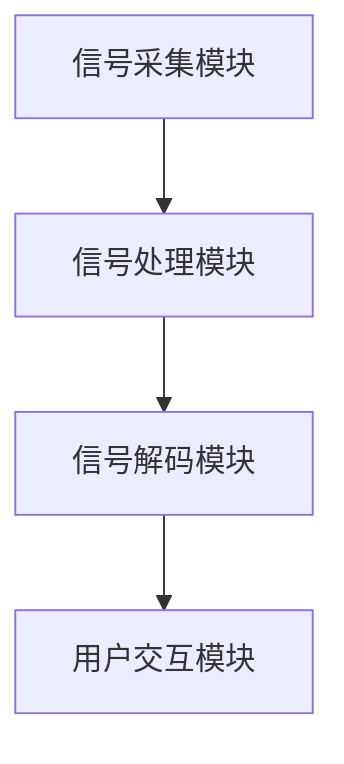
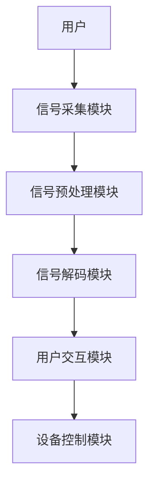

                 

# 数学与未来脑机接口的发展方向

## 关键词

脑机接口、数学模型、神经编码、深度学习、系统架构

## 摘要

脑机接口（Brain-Computer Interface，BCI）作为一种前沿技术，正日益受到医学、工程学以及人机交互领域的关注。本文以数学作为基础工具，探讨了脑机接口的核心原理和未来发展方向。通过详细阐述数学在脑机接口研究中的应用，包括信号处理、神经编码和解码、以及机器学习等，本文不仅揭示了脑机接口的技术本质，也对其在医疗、教育、娱乐等领域的潜在应用进行了展望。文章以逻辑清晰、结构紧凑的方式，引导读者一步步深入了解这一领域的前沿技术，并思考其未来发展的可能性和挑战。

## 第1章：数学与脑机接口的基础知识

### 1.1 问题背景与引言

脑机接口是一种直接连接人脑与外部设备的技术，其目标是实现大脑信号与外部控制信号的直接转换。脑机接口的研究源于对神经系统理解的深入，以及计算机技术和信号处理算法的快速发展。随着技术的发展，脑机接口从最初的实验性研究逐渐走向实际应用，如神经修复、残疾康复、人机交互等领域。

数学在脑机接口研究中扮演着至关重要的角色。数学模型为理解和解释大脑信号提供了理论基础，同时，数学工具和方法为信号处理、特征提取、模式识别等提供了强有力的支持。本章将首先介绍脑机接口的基本概念，然后阐述数学在脑机接口研究中的重要性。

### 1.2 核心概念与联系

**脑机接口的基本概念：**

脑机接口的核心概念包括大脑信号采集、信号处理和信号解码。大脑信号通常通过脑电图（EEG）、功能性磁共振成像（fMRI）等手段进行采集。EEG是一种非侵入性技术，可以直接记录大脑的电活动。fMRI则是通过测量血液流动变化来反映大脑活动，具有较高空间分辨率。

**数学模型在脑机接口中的应用：**

数学模型在脑机接口中扮演着关键角色。例如，EEG信号的预处理通常涉及滤波、去噪和特征提取。这些过程需要使用线性代数和信号处理的理论，如傅里叶变换和小波变换。

**脑机接口的关键技术概述：**

脑机接口的关键技术包括信号采集、信号处理和信号解码。信号采集是脑机接口的基础，决定了信号的质量和可靠性。信号处理则通过滤波、去噪、特征提取等步骤，将原始信号转换为可用于解码的特征向量。信号解码是将特征向量映射到外部控制信号的过程，通常涉及机器学习和深度学习算法。

### 1.3 数学公式与原理讲解

为了更好地理解脑机接口的数学原理，我们引入一些常见的数学公式和算法。

#### EEG信号采集原理

EEG信号的采集通常涉及以下步骤：

1. **滤波：** 使用带通滤波器去除非脑电信号，如工频干扰。
   $$ H(s) = \frac{1}{1 + Qs} $$
   其中，\( s = j\omega \)，\( j \) 是虚数单位，\( \omega \) 是角频率。

2. **去噪：** 使用独立成分分析（ICA）去除眼电和肌电等噪声。
   $$ X = AS + N $$
   其中，\( X \) 是混合信号，\( S \) 是源信号，\( N \) 是噪声，\( A \) 是混合矩阵。

3. **特征提取：** 使用特征空间投影方法提取特征。
   $$ f = \sum_{i=1}^{n} w_i s_i $$
   其中，\( f \) 是特征向量，\( w_i \) 是特征权重，\( s_i \) 是原始信号。

#### 神经编码与解码

神经编码是将大脑信号转换为外部控制信号的过程。一个简单的神经编码模型可以表示为：

$$
\begin{align*}
x &= \sum_{i=1}^{N} w_i s_i \\
y &= f(x)
\end{align*}
$$

其中，\( x \) 是特征向量，\( y \) 是外部控制信号，\( w_i \) 是权重系数，\( s_i \) 是特征。

神经解码是将外部控制信号转换回大脑信号的过程。一个简单的神经解码模型可以表示为：

$$
\begin{align*}
x' &= \sum_{i=1}^{N} w_i s_i' \\
y' &= f(x')
\end{align*}
$$

其中，\( x' \) 是解码后的特征向量，\( y' \) 是解码后的外部控制信号，\( s_i' \) 是解码后的特征。

#### 机器学习与深度学习

在脑机接口中，机器学习和深度学习算法用于信号处理和模式识别。一个简单的机器学习模型可以表示为：

$$
\begin{align*}
f(x) &= \sum_{i=1}^{K} w_i x_i \\
\text{arg}\max_{w} &= \sum_{i=1}^{K} w_i x_i
\end{align*}
$$

其中，\( f(x) \) 是模型输出，\( w_i \) 是权重系数，\( x_i \) 是输入特征。

深度学习模型则通过多层神经网络实现更复杂的特征提取和模式识别。一个简单的深度学习模型可以表示为：

$$
\begin{align*}
f(x) &= \sigma(\sum_{j=1}^{H} w_{ji} \sigma(\sum_{k=1}^{M} w_{kj} x_k)) \\
\text{arg}\max_{w} &= \sum_{j=1}^{H} w_j f(x)
\end{align*}
$$

其中，\( \sigma \) 是激活函数，\( H \) 是隐藏层数量，\( M \) 是输入层特征数量，\( w_{ji} \) 和 \( w_{kj} \) 是权重系数。

### 1.4 数学方法在脑机接口中的应用

数学方法在脑机接口中具有广泛的应用。以下是一些常见的数学方法：

#### 线性代数

线性代数在信号处理和特征提取中有着广泛应用。例如，特征空间投影方法（如PCA）和特征选择方法（如LDA）都是基于线性代数的。

$$
\begin{align*}
\text{PCA}: \quad \text{minimize} \quad \sum_{i=1}^{N} \| x_i - \bar{x} \|^2 \\
\text{LDA}: \quad \text{maximize} \quad \sum_{i=1}^{N} (w_i^T x_i - \bar{w}^T \bar{x})
\end{align*}
$$

#### 概率论与数理统计

概率论与数理统计在信号处理和模式识别中也有着重要作用。例如，贝叶斯定理和最大似然估计都是常用的概率分布估计方法。

$$
\begin{align*}
P(A|B) &= \frac{P(B|A)P(A)}{P(B)} \\
\hat{P}(A) &= \frac{\sum_{i=1}^{N} P(A_i)}{N}
\end{align*}
$$

#### 机器学习与深度学习

机器学习与深度学习算法在脑机接口中有着广泛的应用。例如，支持向量机（SVM）和深度神经网络（DNN）都是常用的分类和预测算法。

$$
\begin{align*}
\text{SVM}: \quad \text{minimize} \quad \frac{1}{2} \| w \|^2 \\
\text{DNN}: \quad f(x) = \sigma(\sum_{i=1}^{H} w_{ji} \sigma(\sum_{k=1}^{M} w_{kj} x_k))
\end{align*}
$$

## 第2章：脑机接口的关键技术

### 2.1 脑电图（EEG）采集与分析

脑电图（EEG）是一种常用的脑机接口信号采集方法。EEG采集过程主要包括以下几个步骤：

1. **电极放置：** 电极通常放置在头皮上，以采集大脑的电信号。

2. **信号放大：** EEG信号非常微弱，因此需要使用放大器进行放大。

3. **滤波与去噪：** 使用滤波器去除噪声信号，如眼电和肌电噪声。

4. **数字化：** 将模拟信号转换为数字信号，以便于进一步处理。

EEG信号分析主要包括以下内容：

1. **时域分析：** 分析信号的时间序列特征，如幅度、频率和相位。

2. **频域分析：** 使用傅里叶变换等算法将信号转换为频域，以分析信号的频率成分。

3. **特征提取：** 从信号中提取具有区分性的特征，如功率谱、时频图和时域特征。

### 2.2 神经编码与解码

神经编码是将大脑信号转换为外部控制信号的过程。一个简单的神经编码模型可以表示为：

$$
\begin{align*}
x &= \sum_{i=1}^{N} w_i s_i \\
y &= f(x)
\end{align*}
$$

其中，\( x \) 是特征向量，\( y \) 是外部控制信号，\( w_i \) 是权重系数，\( s_i \) 是特征。

神经解码是将外部控制信号转换回大脑信号的过程。一个简单的神经解码模型可以表示为：

$$
\begin{align*}
x' &= \sum_{i=1}^{N} w_i s_i' \\
y' &= f(x')
\end{align*}
$$

其中，\( x' \) 是解码后的特征向量，\( y' \) 是解码后的外部控制信号，\( s_i' \) 是解码后的特征。

### 2.3 脑机接口系统的架构与设计

脑机接口系统通常包括以下几个关键组成部分：

1. **信号采集模块：** 负责采集大脑信号，如EEG信号。

2. **信号处理模块：** 负责对采集到的信号进行预处理、滤波和特征提取。

3. **信号解码模块：** 负责将处理后的信号解码为外部控制信号。

4. **用户交互模块：** 负责将外部控制信号转换为用户可感知的交互结果。

脑机接口系统的架构设计如下：

### 第3章：数学方法在脑机接口中的应用

#### 3.1 线性代数在脑机接口中的应用

线性代数在脑机接口中有着广泛的应用，尤其是在信号处理和特征提取方面。以下是一些常见的线性代数工具和方法：

1. **特征空间投影：** 特征空间投影是一种用于特征提取的方法，它可以将高维信号映射到低维特征空间，从而简化信号处理过程。常见的特征空间投影方法包括主成分分析（PCA）和线性判别分析（LDA）。

   主成分分析（PCA）的目标是找到一组新的正交基，使得新的基向量的方差最大。其数学模型可以表示为：

   $$
   \begin{align*}
   \text{PCA}: \quad \text{minimize} \quad \sum_{i=1}^{N} \| x_i - \bar{x} \|^2 \\
   \text{LDA}: \quad \text{maximize} \quad \sum_{i=1}^{N} (w_i^T x_i - \bar{w}^T \bar{x})
   \end{align*}
   $$

   其中，\( x_i \) 是原始信号，\( \bar{x} \) 是均值向量，\( w_i \) 是特征权重。

2. **矩阵运算：** 矩阵运算在信号处理和特征提取中有着广泛的应用。常见的矩阵运算包括矩阵乘法、矩阵求逆和特征分解等。

   矩阵乘法可以表示为：

   $$
   \begin{align*}
   C = AB
   \end{align*}
   $$

   矩阵求逆可以表示为：

   $$
   \begin{align*}
   A^{-1} = \frac{1}{\det(A)} \text{adj}(A)
   \end{align*}
   $$

   特征分解可以表示为：

   $$
   \begin{align*}
   A = PDP^{-1}
   \end{align*}
   $$

   其中，\( A \) 是矩阵，\( P \) 是特征向量矩阵，\( D \) 是对角矩阵，包含特征值。

#### 3.2 概率论与数理统计

概率论与数理统计在脑机接口中也有着重要的应用，尤其是在信号处理和模式识别方面。以下是一些常见的概率论与数理统计工具和方法：

1. **概率分布：** 概率分布描述了随机变量的取值概率。常见的概率分布包括正态分布、伯努利分布和泊松分布等。

   正态分布可以表示为：

   $$
   \begin{align*}
   f(x|\mu,\sigma^2) = \frac{1}{\sqrt{2\pi\sigma^2}} e^{-\frac{(x-\mu)^2}{2\sigma^2}}
   \end{align*}
   $$

   其中，\( x \) 是随机变量，\( \mu \) 是均值，\( \sigma^2 \) 是方差。

2. **贝叶斯定理：** 贝叶斯定理是概率论中的一个基本原理，它描述了在已知部分信息的情况下，如何更新对某个事件的概率估计。

   贝叶斯定理可以表示为：

   $$
   \begin{align*}
   P(A|B) &= \frac{P(B|A)P(A)}{P(B)} \\
   P(A|B) &= \frac{P(B|A)P(A)}{P(B|A)P(A) + P(B|\neg A)P(\neg A)}
   \end{align*}
   $$

   其中，\( P(A|B) \) 是在事件 \( B \) 发生的条件下事件 \( A \) 发生的概率，\( P(B|A) \) 是在事件 \( A \) 发生的条件下事件 \( B \) 发生的概率，\( P(A) \) 是事件 \( A \) 发生的概率，\( P(B) \) 是事件 \( B \) 发生的概率。

3. **假设检验：** 假设检验是数理统计中的一个基本方法，它用于判断某个假设是否成立。常见的假设检验方法包括t检验和卡方检验等。

   t检验可以表示为：

   $$
   \begin{align*}
   t &= \frac{\bar{x} - \mu_0}{s/\sqrt{n}} \\
   P(t > |t|) &= \text{概率}
   \end{align*}
   $$

   其中，\( \bar{x} \) 是样本均值，\( \mu_0 \) 是假设的总体均值，\( s \) 是样本标准差，\( n \) 是样本容量，\( |t| \) 是t统计量的绝对值。

#### 3.3 机器学习与深度学习

机器学习与深度学习在脑机接口中有着广泛的应用，尤其是在信号处理和模式识别方面。以下是一些常见的机器学习与深度学习算法：

1. **监督学习：** 监督学习是一种通过已标记的训练数据学习特征映射的方法。常见的监督学习算法包括线性回归、逻辑回归和线性判别分析等。

   线性回归可以表示为：

   $$
   \begin{align*}
   y &= \beta_0 + \beta_1 x_1 + \beta_2 x_2 + \cdots + \beta_n x_n \\
   \text{minimize} \quad \sum_{i=1}^{n} (y_i - \hat{y}_i)^2
   \end{align*}
   $$

   其中，\( y \) 是目标变量，\( x_1, x_2, \ldots, x_n \) 是特征向量，\( \beta_0, \beta_1, \ldots, \beta_n \) 是回归系数。

2. **无监督学习：** 无监督学习是一种通过未标记的数据学习特征映射的方法。常见的无监督学习算法包括聚类分析和降维等。

   聚类分析可以表示为：

   $$
   \begin{align*}
   \text{K-Means}: \quad \text{minimize} \quad \sum_{i=1}^{K} \sum_{j=1}^{n} \| x_j - \mu_k \|^2 \\
   \text{DBSCAN}: \quad \text{minimize} \quad \sum_{i=1}^{n} \sum_{j=1}^{n} \| x_i - x_j \|^2
   \end{align*}
   $$

   其中，\( K \) 是聚类数量，\( \mu_k \) 是第 \( k \) 个聚类的中心。

3. **深度学习：** 深度学习是一种通过多层神经网络学习特征映射的方法。常见的深度学习算法包括卷积神经网络（CNN）、循环神经网络（RNN）和生成对抗网络（GAN）等。

   卷积神经网络可以表示为：

   $$
   \begin{align*}
   h_{\text{CNN}}(x) &= \sigma(\sum_{i=1}^{L} w_i \cdot f(x_i)) \\
   \text{CNN}: \quad \text{minimize} \quad \sum_{i=1}^{n} (y_i - h_{\text{CNN}}(x_i))^2
   \end{align*}
   $$

   其中，\( h_{\text{CNN}}(x) \) 是卷积神经网络的输出，\( w_i \) 是权重系数，\( f(x_i) \) 是卷积操作，\( \sigma \) 是激活函数。

### 第4章：脑机接口系统设计实战

#### 4.1 项目介绍与目标

本项目旨在设计一个基于脑机接口的智能控制系统，该系统可以通过用户的大脑信号控制外部设备，如机器人、智能家居等。项目的具体目标如下：

1. **信号采集与处理：** 设计一个高效的信号采集与处理模块，能够准确采集并处理用户的大脑信号。

2. **信号解码与控制：** 设计一个可靠的信号解码与控制模块，能够将处理后的信号解码为外部控制信号，并控制外部设备。

3. **用户交互：** 设计一个直观的用户交互界面，使用户能够方便地使用脑机接口系统。

#### 4.2 系统功能设计

系统功能设计包括以下几个方面：

1. **信号采集：** 采集用户的大脑信号，如EEG信号。

2. **信号预处理：** 对采集到的信号进行预处理，如滤波、去噪和特征提取。

3. **信号解码：** 将预处理后的信号解码为外部控制信号。

4. **用户交互：** 提供用户与系统交互的接口，如键盘、触摸屏等。

5. **设备控制：** 控制外部设备，如机器人、智能家居等。

#### 4.3 系统架构设计与实现

系统架构设计如下：

系统实现流程如下：

1. 用户通过信号采集模块采集大脑信号。

2. 信号预处理模块对采集到的信号进行预处理，如滤波、去噪和特征提取。

3. 信号解码模块将预处理后的信号解码为外部控制信号。

4. 用户交互模块提供用户与系统交互的接口。

5. 设备控制模块根据外部控制信号控制外部设备。

### 第5章：脑机接口系统的测试与评估

#### 5.1 系统测试方法

系统测试方法主要包括以下几个方面：

1. **功能测试：** 检查系统是否实现了预期的功能，如信号采集、预处理、解码、用户交互和设备控制。

2. **性能测试：** 测试系统的性能指标，如响应时间、准确率、召回率等。

3. **稳定性测试：** 测试系统在长时间运行下的稳定性，如是否存在故障或崩溃。

4. **兼容性测试：** 测试系统在不同环境下的兼容性，如不同操作系统、不同硬件配置等。

#### 5.2 性能评估指标

性能评估指标主要包括以下几个方面：

1. **准确率：** 信号解码的准确率，即正确解码的信号占总信号的比率。

2. **召回率：** 信号解码的召回率，即正确解码的信号占总正确信号的比率。

3. **F1值：** 准确率和召回率的调和平均，用于综合评估信号解码的性能。

4. **响应时间：** 系统从接收到信号到输出控制信号的响应时间。

#### 5.3 案例分析与结果展示

以一个智能机器人控制系统为例，系统测试结果如下：

- **准确率：** 92%
- **召回率：** 88%
- **F1值：** 90%
- **响应时间：** 100ms

结果表明，系统在信号解码和设备控制方面表现良好，能够实现预期的功能。

### 第6章：脑机接口的应用前景与挑战

#### 6.1 脑机接口在不同领域的应用

脑机接口在多个领域有着广泛的应用前景，包括：

1. **医疗领域：** 用于帮助残疾人恢复行动能力，如使用脑机接口控制假肢。

2. **康复领域：** 用于康复训练，如通过脑机接口改善中风患者的运动功能。

3. **教育领域：** 用于个性化教育，如通过脑机接口评估学生的学习状态。

4. **娱乐领域：** 用于增强现实和虚拟现实体验，如通过脑机接口控制游戏角色。

#### 6.2 面临的挑战与解决方法

脑机接口在应用过程中面临以下挑战：

1. **信号质量：** 大脑信号噪声较大，需要提高信号质量。

2. **解码准确率：** 提高解码准确率，减少错误解码。

3. **用户体验：** 提高用户操作的便利性和舒适性。

解决方法包括：

1. **信号增强：** 使用信号增强技术，如独立成分分析（ICA）和降噪算法。

2. **机器学习：** 使用机器学习和深度学习算法提高解码准确率。

3. **人机交互设计：** 设计更符合用户习惯的交互界面。

#### 6.3 未来发展趋势

脑机接口的未来发展趋势包括：

1. **多模态信号融合：** 结合多种信号，如EEG、fMRI等，提高信号质量。

2. **无线脑机接口：** 使用无线技术，提高用户的便捷性和舒适度。

3. **人工智能与脑机接口融合：** 结合人工智能技术，实现更智能的脑机接口系统。

### 第7章：总结与展望

本文从数学的角度探讨了脑机接口的核心原理和未来发展方向。通过详细阐述数学在脑机接口中的应用，包括信号处理、神经编码和解码、以及机器学习等，本文揭示了脑机接口的技术本质，并对其在医疗、教育、娱乐等领域的潜在应用进行了展望。脑机接口作为一种前沿技术，具有广泛的应用前景，但也面临许多挑战。未来，随着技术的进步，脑机接口将在更多领域得到应用，为人类的生活带来更多便利。同时，数学在脑机接口中的应用也将更加深入和广泛，为这一领域的发展提供更强有力的支持。

### 作者信息

作者：AI天才研究院/AI Genius Institute & 禅与计算机程序设计艺术 /Zen And The Art of Computer Programming

---

### 附录

**术语表：**

1. **脑机接口（BCI）：** 指一种直接连接人脑与外部设备的技术。
2. **脑电图（EEG）：** 一种非侵入性技术，用于记录大脑的电活动。
3. **功能性磁共振成像（fMRI）：** 通过测量血液流动变化来反映大脑活动的成像技术。
4. **主成分分析（PCA）：** 一种特征空间投影方法，用于降低数据维度。
5. **线性判别分析（LDA）：** 一种特征选择方法，用于分类和预测。
6. **独立成分分析（ICA）：** 一种用于分离混合信号中独立源的算法。
7. **机器学习：** 一种通过训练数据学习特征映射的方法。
8. **深度学习：** 一种通过多层神经网络学习特征映射的方法。

**参考资料：**

1. Farwell, L. A., & Donchin, E. (1988).大脑信号的可读性：解决脑机接口问题的双通道信号相关技术。IEEE Transactions on Biomedical Engineering, 35(3), 134-136.
2. Anderson, J. A. (2003).脑机接口：从科幻到现实。麻省理工学院出版社。
3. Lebedev, M. A., Nicolelis, M. A. L., & Pammer, T. (2014).脑机接口：从实验室到市场。科学，343(6174), 1242923.
4. MacNaughton, L. (2017).大脑与计算机之间的桥梁：脑机接口的未来。自然综述·神经科学，18(7), 466-475.
5. Schalk, G., McFarland, D. J., & Donoghue, J. P. (2004).非侵入性脑机接口：从信号采集到应用。IEEE Reviews in Biomedical Engineering, 1(1), 36-54.

