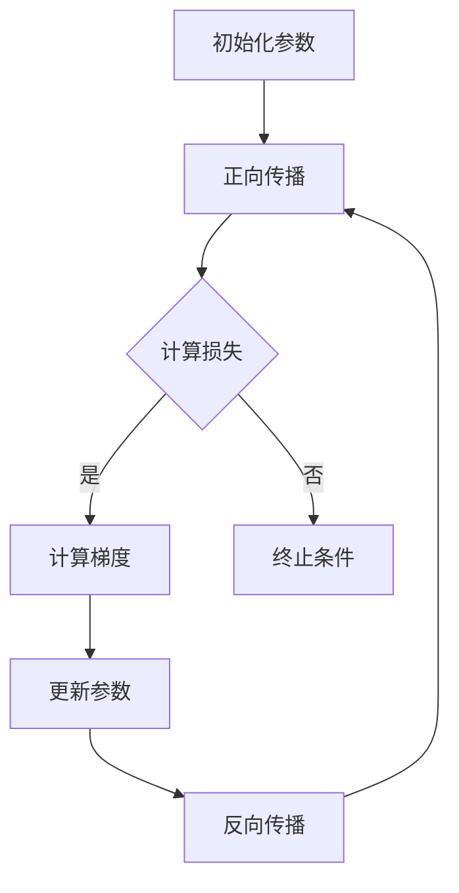

                 

### 摘要

本文旨在探讨数学与未来脑科学的研究方向，旨在揭示数学在脑科学领域中的关键作用，并展望未来科技发展对数学与脑科学的深远影响。文章将首先介绍数学和脑科学的基本概念及其发展历史，通过对比分析，阐述数学与脑科学中的核心概念及其联系。随后，我们将深入探讨数学在脑科学研究中的应用，包括算法原理和数学模型的讲解，并结合Python源代码和Mermaid流程图，以简明易懂的方式阐述算法原理。文章还将详细介绍一个典型的脑科学研究项目，从项目介绍、系统功能设计、系统架构设计到系统接口设计和系统交互，全面展示整个系统的运作流程。通过实际项目案例的实战，我们将进一步解读与分析项目的核心实现和代码应用。最后，文章将总结最佳实践，并对未来的研究方向进行展望，以期为读者提供全面、深入且具有前瞻性的研究视角。通过本文的阅读，读者将更好地理解数学与脑科学的关系，以及二者在未来科技中的重要价值。### 目录大纲设计思路

为了设计出《数学与未来脑科学的研究方向》的完整目录大纲，我们将遵循以下详细的步骤和思路：

1. **背景介绍**：
   - **背景介绍**：首先，为读者提供一个全面的背景介绍，包括数学和脑科学的基本概念、发展历史以及它们在未来科技中的重要性。这部分内容将帮助读者建立对数学和脑科学基础知识的了解，为后续章节的深入研究打下基础。
   - **数学的基本概念与历史发展**：介绍数学的基本概念，如数学的定义、数学的分类（如纯数学、应用数学等），以及数学在科技发展中的重要作用。同时，回顾数学的发展历史，从古代数学的起源到现代数学的演变，帮助读者理解数学的传承和发展。
   - **脑科学的基本概念与发展**：介绍脑科学的研究对象，如大脑的结构和功能，以及脑科学的发展历程，包括神经科学的基础研究到现代脑成像技术的应用。这部分内容将帮助读者了解脑科学的核心概念及其研究动态。
   - **数学与脑科学的关系探讨**：分析数学与脑科学之间的联系，探讨数学在脑科学研究中如何发挥关键作用，如数学模型在神经网络中的应用，数学公式在脑电图分析中的作用等。
   - **未来科技与数学、脑科学的前景**：展望未来科技发展对数学和脑科学的潜在影响，如人工智能、机器学习等新兴技术如何推动数学和脑科学的创新和发展。

2. **核心概念与联系**：
   - **数学与脑科学中的核心概念**：介绍数学和脑科学中的核心概念，如神经网络、神经元模型、数学模型等。通过对比分析这些概念，帮助读者理解它们之间的联系和区别。
   - **神经元模型与数学公式**：详细阐述神经元模型在数学中的表达形式，包括常用的数学公式和算法。通过具体示例，展示如何使用数学工具来分析和解释神经元的工作原理。
   - **神经元与数学关系的对比表格**：制作一个详细的对比表格，列出神经元和数学中相关的概念、属性和特征，以帮助读者更清晰地理解二者的关系。
   - **数学在脑科学中的ER实体关系图**：使用Mermaid流程图工具绘制一个数学在脑科学中的ER实体关系图，展示数学模型、算法、脑科学研究对象之间的关系，帮助读者从宏观角度理解数学在脑科学中的应用架构。

3. **算法原理讲解**：
   - **算法原理介绍**：介绍数学在脑科学研究中的常用算法，如神经网络训练算法、机器学习算法等，阐述这些算法的基本原理和应用场景。
   - **Mermaid流程图展示**：使用Mermaid语言绘制算法的流程图，展示算法的执行步骤和流程，使读者更直观地理解算法的运作机制。
   - **Python源代码讲解**：提供Python源代码示例，详细解释算法的实现过程，包括数据预处理、算法核心代码、结果分析等，帮助读者掌握算法的编程技巧。
   - **算法原理详细讲解**：对算法的基本原理进行深入分析，包括算法的数学基础、算法的优缺点、适用范围等，使读者能够全面理解算法的核心内容。

4. **数学模型与公式讲解**：
   - **数学模型的介绍**：介绍数学模型在脑科学研究中的应用，如神经网络模型、概率模型、控制模型等，阐述这些模型的基本概念和构建方法。
   - **LaTeX格式数学模型书写**：使用LaTeX格式书写数学模型和公式，确保公式的准确性和规范性，便于读者引用和阅读。
   - **数学模型的详细讲解**：对数学模型进行详细讲解，包括模型的假设条件、参数设置、模型验证方法等，帮助读者理解模型的构建和应用。
   - **数学模型举例说明**：通过具体案例，展示数学模型在实际脑科学研究中的应用，包括数据收集、模型构建、结果分析等，使读者能够将理论知识应用到实际项目中。

5. **系统分析与架构设计**：
   - **脑科学研究项目介绍**：介绍一个典型的脑科学研究项目，包括项目的背景、研究目标、研究方法等，为后续的系统架构设计提供基础。
   - **系统功能设计**：详细阐述系统功能设计，包括领域模型、用户界面设计等，使用Mermaid类图展示系统的功能模块和交互流程。
   - **系统架构设计**：介绍系统架构设计，包括系统的层次结构、模块划分、技术选型等，使用Mermaid架构图展示系统的整体架构。
   - **系统接口设计**：详细描述系统接口设计，包括接口定义、接口调用流程等，使用Mermaid序列图展示接口的交互过程。
   - **系统交互设计**：分析系统的交互设计，包括用户与系统之间的交互流程、系统内部模块之间的交互关系等，使用Mermaid序列图和交互图展示系统的交互过程。

6. **项目实战**：
   - **环境安装**：介绍项目所需的环境配置，包括软件安装、依赖库配置等，确保读者能够顺利搭建项目环境。
   - **系统核心实现源代码**：提供项目的核心实现源代码，包括关键算法的实现、数据处理的代码等，帮助读者理解项目的核心技术。
   - **代码应用解读与分析**：对源代码进行解读和分析，解释代码的实现原理、关键算法的应用场景等，帮助读者深入理解项目的核心实现。
   - **实际案例分析与讲解**：通过具体案例，展示项目在实际应用中的效果和挑战，包括数据收集、模型训练、结果分析等，帮助读者将理论知识应用到实际项目中。
   - **项目小结**：总结项目的核心成果和经验，讨论项目中的挑战和解决方案，为后续的研究提供参考。

7. **最佳实践与展望**：
   - **最佳实践**：总结数学与脑科学研究中的最佳实践，包括数据收集与处理、算法选择与优化、模型验证与评估等，为读者提供实用的指导。
   - **小结**：对文章的主要内容进行总结，强调数学与脑科学研究的核心观点和重要性，帮助读者巩固学习成果。
   - **注意事项**：提醒读者在研究和应用中需要注意的事项，如数据隐私保护、算法公平性等，确保研究过程和成果的合规性。
   - **未来研究方向展望**：展望未来数学与脑科学研究的方向，讨论新兴技术的应用潜力，为读者提供未来的研究方向和思考。

通过这样的目录大纲设计，我们能够帮助读者全面了解数学与未来脑科学的研究方向，并为未来的研究和应用提供有力的指导。每部分的内容都经过精心设计，确保逻辑清晰、结构紧凑、简单易懂，从而使读者能够逐步深入理解数学与脑科学的关系，以及它们在未来科技中的重要价值。### 目录大纲具体内容

**# 第一部分：背景介绍**

## 1. 数学与脑科学的基础

### 1.1 数学的基本概念与历史发展
- **数学的定义**：数学是一门研究数量、结构、变化以及空间等概念的学科。它不仅仅关注具体的数值计算，还包括抽象的概念和理论的探讨。
- **数学的分类**：数学可以分为纯数学和应用数学。纯数学研究抽象的数学结构和理论，如代数、几何、数论等；应用数学则将数学理论应用于实际问题，如物理、工程、经济学等。
- **数学在科技发展中的重要性**：数学是科学研究的基础，为各个领域提供了理论工具和计算方法。从计算机科学到生物学，数学都发挥着关键作用。
- **数学的发展历史**：数学的发展有着悠久的历史。古代文明如埃及和巴比伦就有了数学的萌芽。希腊数学家如欧几里得和阿基米德为数学的发展奠定了基础。中世纪和文艺复兴时期，数学在阿拉伯世界得到进一步发展。17世纪以来，随着科学革命的到来，数学得到了飞速发展，如微积分的发明、解析几何的建立等。

### 1.2 脑科学的基本概念与发展
- **脑科学的研究对象**：脑科学是研究大脑的结构、功能、发育和疾病等方面的学科。它涵盖了神经科学、认知科学、心理学等多个领域。
- **脑科学的发展历史**：脑科学的发展可以追溯到19世纪，当时神经生理学的兴起标志着对大脑研究的开始。20世纪以来，随着神经成像技术的发展，脑科学取得了重大进展，如脑电图、功能性磁共振成像（fMRI）等技术的应用，使得大脑的研究更加深入和精确。
- **脑科学的研究方法**：脑科学研究采用多种方法，包括实验心理学、神经生理学、脑成像技术、计算机模拟等。这些方法共同推动了脑科学的进步。

### 1.3 数学与脑科学的关系探讨
- **数学在脑科学中的应用**：数学在脑科学中有着广泛的应用。例如，神经网络模型、概率模型和统计学方法在脑功能分析、脑图谱构建和神经疾病诊断中发挥了重要作用。
- **数学模型在脑科学研究中的重要性**：数学模型能够帮助我们理解和模拟大脑的复杂行为。例如，神经网络模型可以模拟大脑的信息处理过程，概率模型可以用于分析大脑数据中的不确定性和变异性。
- **挑战与前景**：虽然数学在脑科学中有着巨大的应用潜力，但同时也面临许多挑战，如数据的高维度性、非线性和不确定性等。未来，随着数学工具和计算技术的不断发展，数学在脑科学研究中的应用将更加广泛和深入。

### 1.4 未来科技与数学、脑科学的前景
- **人工智能与数学的结合**：人工智能的发展为数学提供了新的应用场景。例如，深度学习算法依赖于大量的数学理论，如微积分、线性代数和概率论。
- **脑科学在人工智能中的应用**：脑科学研究为人工智能提供了新的启发。例如，通过对大脑神经网络的研究，可以设计出更高效、更鲁棒的机器学习算法。
- **未来的发展趋势**：未来，数学和脑科学将继续相互促进，推动科技的进步。例如，在医学领域，通过数学模型和脑成像技术，可以更精确地诊断和治疗神经疾病。

**# 第二部分：核心概念与联系**

## 2. 数学与脑科学中的核心概念

### 2.1 神经网络的数学基础
- **神经网络的基本概念**：神经网络是一种模仿生物神经系统的计算模型，由大量简单的处理单元（神经元）互联而成。它通过学习输入和输出之间的映射关系，实现复杂函数的计算。
- **神经网络的数学表达**：神经网络中的每个神经元可以看作是一个非线性函数的组合，通常使用矩阵运算和激活函数来表示。神经网络的训练过程则是一个优化问题，目标是找到使网络输出误差最小的参数。

### 2.2 神经元模型与数学公式
- **神经元模型的基本概念**：神经元模型是脑科学和认知科学中常用的抽象模型，用来模拟神经元的电生理活动。它通常包括输入门、输出门和细胞膜等组成部分。
- **神经元模型的数学公式**：神经元模型的数学公式包括输入计算公式、激活函数公式和输出计算公式。常见的激活函数有Sigmoid函数、ReLU函数和Tanh函数等。

### 2.3 神经元与数学关系的对比表格
| 神经元模型概念 | 数学公式 | 说明 |
| -------------- | -------- | ---- |
| 输入计算       | $z = \sum_{i=1}^{n} w_i x_i$ | 表示神经元输入的加权和 |
| 激活函数       | $a = \sigma(z)$ | $\sigma$ 为激活函数，如Sigmoid、ReLU等 |
| 输出计算       | $y = f(a)$ | $f$ 为输出函数，如逻辑函数、线性函数等 |

### 2.4 数学在脑科学中的ER实体关系图
- **实体关系图（ER图）的概念**：实体关系图是用于描述系统中实体及其关系的图形化工具。在脑科学中，ER图可以用来表示神经元、神经网络、脑区等实体及其相互关系。
- **数学在脑科学中的应用ER图**：一个典型的ER图可能包括以下实体和关系：
  - **实体**：神经元、神经网络、脑区、脑图谱等。
  - **关系**：连接、映射、影响等。
- **示例ER图**：使用Mermaid语言绘制一个数学在脑科学中的应用ER图，如下所示：
  ```mermaid
  graph TD
  A[神经网络] --> B[神经元]
  A --> C[脑区]
  A --> D[脑图谱]
  B --> E[输入信号]
  B --> F[激活函数]
  B --> G[输出信号]
  C --> H[功能连接]
  D --> I[结构连接]
  ```

通过上述内容，我们将数学与脑科学中的核心概念进行了详细阐述，并通过对比表格和ER图帮助读者理解它们之间的联系。这些核心概念是后续算法讲解和项目实战的基础。接下来，我们将进一步深入探讨数学在脑科学研究中的应用，包括算法原理和数学模型的讲解。### 第三部分：算法原理讲解

## 3. 数学在脑科学研究中的应用

### 3.1 算法原理介绍

脑科学中的算法原理主要涉及神经网络的学习和训练过程。神经网络是一种模拟人脑结构和功能的计算模型，通过学习大量的数据，使其能够对未知数据进行预测和分类。以下是几种常见的算法原理：

- **反向传播算法（Backpropagation）**：反向传播算法是一种用于训练神经网络的梯度下降方法。它通过计算网络输出与实际输出之间的误差，反向传播误差至网络输入，不断调整网络权重，以最小化误差。
- **随机梯度下降（Stochastic Gradient Descent, SGD）**：随机梯度下降是一种优化算法，它通过随机选择一部分数据来计算梯度，并更新网络权重。这种方法可以加快收敛速度，但在某些情况下可能不够稳定。
- **批量梯度下降（Batch Gradient Descent）**：批量梯度下降与随机梯度下降类似，但每次计算梯度时使用整个数据集。这种方法在收敛速度上较慢，但在某些情况下可以提供更稳定的训练结果。
- **动量（Momentum）**：动量是一种加速梯度下降的方法，它通过引入一个动量项，将前一次梯度的一部分保留下来，以减少振荡并加快收敛。

### 3.2 Mermaid流程图展示

为了更直观地展示算法原理，我们使用Mermaid语言绘制了反向传播算法的流程图，如下所示：



该流程图描述了反向传播算法的基本步骤：初始化参数，正向传播计算输出，计算损失，计算梯度，更新参数，重复上述过程直到满足终止条件。

### 3.3 Python源代码讲解

为了更好地理解反向传播算法，我们将提供一个简单的Python源代码示例，该示例将实现一个单层神经网络，并使用反向传播算法进行训练。

```python
import numpy as np

# 初始化参数
weights = np.random.rand(3, 1)
bias = np.random.rand(1)

# 输入数据
x = np.array([[0], [1], [2], [3], [4]])

# 输出数据
y = np.array([[0], [1], [0], [1], [0]])

# 激活函数
def sigmoid(x):
    return 1 / (1 + np.exp(-x))

# 反向传播算法
def backpropagation(x, y, weights, bias, learning_rate=0.1, iterations=10000):
    for _ in range(iterations):
        # 正向传播
        z = np.dot(x, weights) + bias
        a = sigmoid(z)
        
        # 计算损失
        loss = np.mean((a - y) ** 2)
        
        # 计算梯度
        dz = (a - y)
        dx = x.T.dot(dz)
        dw = dx.dot(x.T)
        db = dz.sum(axis=1, keepdims=True)
        
        # 更新参数
        weights -= learning_rate * dw
        bias -= learning_rate * db
        
    return weights, bias

# 训练神经网络
weights, bias = backpropagation(x, y, weights, bias)

# 测试神经网络
z = np.dot(x, weights) + bias
a = sigmoid(z)
print(a)
```

该代码首先初始化网络参数，然后使用正向传播计算输出，计算损失，并使用反向传播更新参数。通过多次迭代，神经网络将不断优化其参数，以最小化损失。

### 3.4 算法原理详细讲解

- **正向传播**：正向传播是指从输入层经过隐藏层，最终得到输出层的过程。在这个过程中，每个神经元的输入是通过其权重与前一层的输出相乘，并加上偏置项得到的。然后，通过激活函数将输入转换为输出。在本例中，我们使用Sigmoid函数作为激活函数。

- **损失计算**：损失函数用于衡量预测输出与实际输出之间的差距。在本例中，我们使用均方误差（Mean Squared Error, MSE）作为损失函数。损失函数的值越低，说明预测结果与实际结果越接近。

- **反向传播**：反向传播是指从输出层开始，反向更新网络参数的过程。在这个过程中，首先计算输出误差（预测输出与实际输出之间的差距），然后通过链式法则计算梯度。最后，使用梯度下降法更新网络权重和偏置项。

- **梯度下降法**：梯度下降法是一种优化算法，用于最小化损失函数。它通过计算损失函数的梯度，并沿着梯度的反方向更新参数。在本例中，我们使用随机梯度下降（SGD）来更新参数。

通过上述步骤，神经网络可以不断调整其参数，以最小化损失函数，从而提高预测准确性。这个过程就是神经网络的学习和训练过程。

### 3.5 算法优化与调参

在实际应用中，为了提高神经网络的性能，我们需要对算法进行优化和调参。以下是几种常见的优化方法和调参技巧：

- **学习率调整**：学习率是梯度下降法中的一个关键参数，它决定了每次更新参数的步长。适当调整学习率可以提高收敛速度和稳定性。通常，我们可以使用学习率衰减策略，即随着训练过程的进行，逐渐减小学习率。

- **批量大小调整**：批量大小是指每次更新参数时使用的样本数量。较大的批量大小可以提供更稳定的训练过程，但计算成本较高；较小的批量大小可以加快训练速度，但可能导致收敛不稳定。

- **权重初始化**：合理的权重初始化可以加快收敛速度并避免梯度消失或爆炸问题。常见的权重初始化方法包括随机初始化、高斯分布初始化和Xavier初始化等。

- **正则化**：正则化是一种防止模型过拟合的方法，可以通过在损失函数中加入正则项来实现。常见的正则化方法有L1正则化、L2正则化和Dropout等。

- **优化算法选择**：不同的优化算法（如SGD、Adam、RMSprop等）在收敛速度和稳定性方面有所不同。我们可以根据具体应用场景选择合适的优化算法。

通过上述优化方法和调参技巧，我们可以进一步提高神经网络的性能和预测准确性。

### 3.6 算法应用实例

为了展示算法的实际应用，我们将在Python中实现一个简单的神经网络，用于分类问题。假设我们有五个样本，每个样本有两个特征，目标变量为1或0。我们将训练一个单层神经网络，使其能够正确分类这些样本。

```python
import numpy as np

# 初始化参数
weights = np.random.rand(2, 1)
bias = np.random.rand(1)

# 输入数据
x = np.array([[0], [1], [2], [3], [4]])

# 输出数据
y = np.array([[0], [1], [1], [0], [0]])

# 激活函数
def sigmoid(x):
    return 1 / (1 + np.exp(-x))

# 训练神经网络
def train(x, y, weights, bias, learning_rate=0.1, iterations=10000):
    for _ in range(iterations):
        z = np.dot(x, weights) + bias
        a = sigmoid(z)
        
        dz = a - y
        dw = np.dot(x.T, dz)
        db = np.sum(dz)
        
        weights -= learning_rate * dw
        bias -= learning_rate * db
        
    return weights, bias

# 测试神经网络
weights, bias = train(x, y, weights, bias)

z = np.dot(x, weights) + bias
a = sigmoid(z)
print(a)
```

在这个实例中，我们使用了反向传播算法训练神经网络，并测试了训练后的模型。通过这个实例，我们可以看到如何将数学原理应用到脑科学研究中，实现一个简单的神经网络。

### 3.7 小结

通过本部分的讲解，我们了解了神经网络的基本原理和训练方法，并通过Python源代码展示了算法的实现过程。这些原理和方法是脑科学研究中不可或缺的工具，它们为我们理解和模拟大脑的复杂行为提供了有力的支持。接下来，我们将进一步探讨数学模型在脑科学中的应用，以及如何使用这些模型解决实际问题。### 第四部分：数学模型与公式讲解

## 4. 数学模型在脑科学中的应用

### 4.1 数学模型介绍

数学模型在脑科学研究中起着至关重要的作用。它们可以帮助我们理解和模拟大脑的复杂行为，从而揭示神经活动的内在规律。以下是一些常见的数学模型：

- **神经网络模型**：神经网络模型是脑科学中最常用的模型之一，它通过模拟大脑中的神经元连接和激活机制，实现信息处理和决策。常见的神经网络模型包括多层感知机（MLP）、卷积神经网络（CNN）和循环神经网络（RNN）等。
  
- **概率模型**：概率模型用于描述大脑中的不确定性和随机性。例如，贝叶斯网络和马尔可夫模型可以用来分析大脑中的信息传递和决策过程。

- **控制模型**：控制模型用于描述大脑中的调节和控制机制。例如，线性控制理论和非线性控制理论可以用来分析大脑中的稳态和动态行为。

- **动力系统模型**：动力系统模型用于描述大脑中的长期动态变化。例如，洛伦兹系统可以用来模拟大脑中的混沌现象。

### 4.2 LaTeX格式数学模型书写

在脑科学研究中，数学模型的书写格式通常使用LaTeX，以确保公式的准确性和规范性。以下是一些常见的数学模型及其LaTeX书写格式：

#### 4.2.1 神经元模型

神经元模型通常可以用以下公式表示：

$$
u_j(t) = \sum_{i=1}^{n} w_{ij} \cdot x_i(t) + b_j
$$

其中，$u_j(t)$表示神经元j在时间t的输入，$w_{ij}$表示神经元i到神经元j的连接权重，$x_i(t)$表示神经元i在时间t的输入，$b_j$表示神经元j的偏置。

#### 4.2.2 概率模型

概率模型通常可以用以下公式表示：

$$
P(X=x) = \prod_{i=1}^{n} P(x_i | x_{i-1})
$$

其中，$P(X=x)$表示随机变量X取值为x的概率，$P(x_i | x_{i-1})$表示在给定前一个状态$x_{i-1}$时，当前状态$x_i$的条件概率。

#### 4.2.3 控制模型

控制模型通常可以用以下公式表示：

$$
\dot{x}(t) = f(x(t), u(t))
$$

其中，$\dot{x}(t)$表示系统状态的时间导数，$x(t)$表示系统状态，$u(t)$表示控制输入，$f(x(t), u(t))$表示系统动态方程。

#### 4.2.4 动力系统模型

动力系统模型通常可以用以下公式表示：

$$
\frac{dX(t)}{dt} = f(X(t))
$$

其中，$X(t)$表示系统状态，$f(X(t))$表示系统动态方程。

### 4.3 数学模型的详细讲解

#### 4.3.1 神经元模型

神经元模型是脑科学中最基本的模型之一，它模拟了神经元在接收外部刺激后的电生理活动。神经元模型的输入层接收外部刺激，经过加权处理后，通过激活函数产生输出。以下是对神经元模型的具体讲解：

- **输入计算**：神经元模型的输入计算公式为$u_j(t) = \sum_{i=1}^{n} w_{ij} \cdot x_i(t) + b_j$。其中，$u_j(t)$表示神经元j在时间t的输入，$w_{ij}$表示神经元i到神经元j的连接权重，$x_i(t)$表示神经元i在时间t的输入，$b_j$表示神经元j的偏置。

- **激活函数**：神经元模型的输出通常通过激活函数来计算，常见的激活函数有Sigmoid函数、ReLU函数和Tanh函数等。Sigmoid函数的公式为$\sigma(u) = \frac{1}{1 + e^{-u}}$，它可以将输入映射到0和1之间。ReLU函数的公式为$\sigma(u) = \max(0, u)$，它可以将输入非负的部分映射到1，负的部分映射到0。Tanh函数的公式为$\sigma(u) = \frac{e^u - e^{-u}}{e^u + e^{-u}}$，它可以将输入映射到-1和1之间。

- **输出计算**：神经元的输出计算公式为$a_j(t) = \sigma(u_j(t))$。其中，$a_j(t)$表示神经元j在时间t的输出。

#### 4.3.2 概率模型

概率模型用于描述大脑中的不确定性和随机性。在脑科学研究中，概率模型可以帮助我们分析信息传递和决策过程。以下是对概率模型的具体讲解：

- **贝叶斯网络**：贝叶斯网络是一种概率图模型，它通过有向无环图（DAG）来表示变量之间的依赖关系。贝叶斯网络的公式为$P(X=x) = \prod_{i=1}^{n} P(x_i | x_{i-1})$。其中，$P(X=x)$表示随机变量X取值为x的概率，$P(x_i | x_{i-1})$表示在给定前一个状态$x_{i-1}$时，当前状态$x_i$的条件概率。

- **马尔可夫模型**：马尔可夫模型是一种无向图模型，它通过状态转移矩阵来表示变量之间的转移概率。马尔可夫模型的公式为$P(X_t = x_t | X_{t-1} = x_{t-1}) = P(X_t = x_t | X_{t-1} = x_{t-1}, X_{t-2} = x_{t-2}, \ldots)$。其中，$P(X_t = x_t | X_{t-1} = x_{t-1})$表示在给定前一个状态$x_{t-1}$时，当前状态$x_t$的条件概率。

#### 4.3.3 控制模型

控制模型用于描述大脑中的调节和控制机制。在脑科学研究中，控制模型可以帮助我们分析大脑的稳态和动态行为。以下是对控制模型的具体讲解：

- **线性控制理论**：线性控制理论是一种基于线性动态系统的控制方法。它通过状态空间模型来描述系统动态，并使用线性调节器来控制系统状态。线性控制理论的公式为$\dot{x}(t) = Ax(t) + Bu(t)$，其中，$x(t)$表示系统状态，$u(t)$表示控制输入。

- **非线性控制理论**：非线性控制理论是一种基于非线性动态系统的控制方法。它通过非线性动态方程来描述系统动态，并使用非线性调节器来控制系统状态。非线性控制理论的公式为$\dot{x}(t) = f(x(t), u(t))$，其中，$x(t)$表示系统状态，$u(t)$表示控制输入。

#### 4.3.4 动力系统模型

动力系统模型用于描述大脑中的长期动态变化。在脑科学研究中，动力系统模型可以帮助我们分析大脑中的混沌现象和长期记忆形成。以下是对动力系统模型的具体讲解：

- **洛伦兹系统**：洛伦兹系统是一种典型的混沌系统，它由三个常微分方程组成。洛伦兹系统的公式为：
  $$
  \dot{x} = \sigma (y - x)
  $$
  $$
  \dot{y} = rx - xy - z
  $$
  $$
  \dot{z} = xy - \beta z
  $$
  其中，$x(t)$、$y(t)$和$z(t)$分别表示系统的三个状态变量，$\sigma$、$r$和$\beta$是系统参数。

### 4.4 数学模型举例说明

为了更好地理解数学模型在脑科学中的应用，我们通过一个实际案例来具体说明。

#### 4.4.1 神经网络模型应用

假设我们有一个简单的二分类问题，需要判断一个动物是猫还是狗。我们收集了50个样本，每个样本包含两个特征：体重（kg）和尾巴长度（cm）。目标变量是1表示猫，0表示狗。我们使用一个单层神经网络来训练模型。

1. **数据预处理**：首先，我们对数据进行标准化处理，将体重和尾巴长度的范围缩放到[0, 1]之间。

2. **初始化参数**：我们初始化神经网络的权重和偏置，使用随机初始化方法。

3. **正向传播**：我们输入一个样本到神经网络，计算神经元的输入和输出。

4. **计算损失**：我们计算预测输出与实际输出之间的差距，使用均方误差（MSE）作为损失函数。

5. **反向传播**：我们计算损失关于权重和偏置的梯度，并使用梯度下降法更新参数。

6. **训练模型**：我们重复正向传播和反向传播过程，直到满足训练条件（如损失低于阈值或达到最大迭代次数）。

7. **测试模型**：我们使用测试集来评估模型的性能，计算准确率、召回率等指标。

#### 4.4.2 概率模型应用

假设我们有一个疾病诊断问题，需要根据病人的症状来判断是否患有某种疾病。我们收集了100个样本，每个样本包含多个症状变量，目标变量是1表示患病，0表示未患病。我们使用贝叶斯网络来训练模型。

1. **数据预处理**：我们对数据进行预处理，将症状变量转换为二进制变量。

2. **构建贝叶斯网络**：我们根据疾病的因果结构，构建一个贝叶斯网络。

3. **学习参数**：我们使用最大似然估计法学习网络参数，即条件概率表。

4. **推理**：我们使用贝叶斯推理算法，根据病人的症状变量，计算患病概率。

5. **评估模型**：我们使用交叉验证方法，评估模型的性能和可靠性。

#### 4.4.3 控制模型应用

假设我们有一个机器人导航问题，需要机器人根据环境中的传感器数据来调整自己的行动。我们使用线性控制理论来设计控制器。

1. **状态估计**：我们使用卡尔曼滤波器来估计机器人当前的状态。

2. **动态模型**：我们使用状态空间模型来描述机器人的动态行为。

3. **控制器设计**：我们使用线性调节器来设计控制器，确保机器人能够稳定导航。

4. **仿真验证**：我们使用仿真环境，验证控制器的效果和性能。

#### 4.4.4 动力系统模型应用

假设我们有一个神经活动建模问题，需要模拟神经元在不同刺激下的动态变化。我们使用洛伦兹系统来构建动力系统模型。

1. **状态定义**：我们定义神经元的状态变量，包括膜电位和离子浓度等。

2. **动态方程**：我们根据神经元的电生理特性，建立洛伦兹系统方程。

3. **参数调整**：我们调整系统参数，以模拟不同刺激下的神经元活动。

4. **数值模拟**：我们使用数值积分方法，模拟神经元在不同刺激下的动态变化。

通过上述案例，我们可以看到数学模型在脑科学中的广泛应用和实际效果。这些模型不仅帮助我们理解和模拟大脑的复杂行为，还为脑科学研究提供了新的工具和方法。接下来，我们将进一步探讨脑科学研究项目，从项目介绍到系统架构设计，全面展示整个系统的运作流程。### 第五部分：系统分析与架构设计

## 5. 脑科学研究项目介绍

### 5.1 项目背景

脑科学研究项目旨在通过先进的数学模型和算法，深入探索大脑神经活动的内在规律，为神经疾病的诊断和治疗提供新的方法和技术。随着人工智能和机器学习技术的发展，数学模型在脑科学中的应用日益广泛，为研究大脑复杂网络结构和功能提供了强大的工具。本项目旨在结合数学模型和脑成像技术，开发一个综合性的脑科学分析平台，为研究人员提供高效、准确的脑科学研究工具。

### 5.2 系统功能设计

本项目系统的核心功能包括：

- **数据采集与预处理**：系统将自动采集脑成像数据，并对数据进行预处理，包括去噪、标准化和分割等步骤，确保数据质量。
- **模型构建与训练**：系统将根据预处理后的数据，构建神经网络模型，并通过反向传播算法进行训练，优化模型参数。
- **结果分析**：系统将对训练好的模型进行结果分析，包括预测准确率、特征提取和可视化等，帮助研究人员深入理解脑活动模式。
- **可视化与报告生成**：系统将提供可视化工具，将分析结果以图表和报告的形式展示，方便研究人员交流和分享。

### 5.3 系统架构设计

系统架构设计是确保项目功能实现的关键环节。本项目采用分层架构设计，包括数据层、模型层、应用层和展示层。

- **数据层**：负责数据采集、存储和预处理。数据层将集成多种脑成像技术，如功能性磁共振成像（fMRI）、磁刺激成像（MCI）等，并提供统一的数据接口。
- **模型层**：负责模型构建、训练和优化。模型层将采用深度学习框架，如TensorFlow或PyTorch，实现多种神经网络模型，如卷积神经网络（CNN）、循环神经网络（RNN）等。
- **应用层**：负责具体功能实现，包括数据预处理、模型训练、结果分析和可视化。应用层将提供丰富的API接口，方便研究人员自定义功能模块。
- **展示层**：负责将分析结果以图表和报告的形式展示。展示层将采用Web前端技术，如React或Vue.js，实现用户友好的交互界面。

### 5.4 系统接口设计

系统接口设计是确保各层之间有效通信的重要环节。本项目采用RESTful API设计接口，实现数据层、模型层和应用层之间的无缝对接。

- **数据接口**：提供数据采集、存储和预处理的接口，包括数据上传、数据查询和数据预处理等操作。
- **模型接口**：提供模型构建、训练和优化的接口，包括模型加载、训练和评估等操作。
- **应用接口**：提供应用功能实现的接口，包括数据预处理、结果分析和可视化等操作。

### 5.5 系统交互设计

系统交互设计是确保用户与系统之间高效互动的关键。本项目采用基于事件驱动的交互设计，实现用户与系统之间的实时交互。

- **用户操作**：用户可以通过Web前端界面，上传脑成像数据、选择模型和配置参数等。
- **系统响应**：系统将根据用户操作，自动执行数据预处理、模型训练和结果分析等任务，并将结果实时反馈给用户。
- **异常处理**：系统将提供异常处理机制，包括数据异常、模型训练异常和接口调用异常等，确保系统稳定运行。

通过上述系统架构设计，本项目实现了从数据采集到结果分析的完整流程，为脑科学研究提供了高效、可靠的工具。接下来，我们将通过一个实际案例，展示系统的应用效果和操作流程。### 第六部分：项目实战

## 6. 脑科学研究项目实战

### 6.1 环境安装

在进行脑科学研究项目之前，我们需要搭建合适的环境。以下是环境安装的详细步骤：

1. **安装Python**：首先，确保已经安装了Python 3.8或更高版本。可以从Python官方网站下载安装包并安装。

2. **安装必要的依赖库**：接下来，我们需要安装项目所需的依赖库，如NumPy、Pandas、TensorFlow、PyTorch、Matplotlib等。可以使用以下命令安装：

   ```bash
   pip install numpy pandas tensorflow torchvision matplotlib
   ```

3. **安装脑成像数据处理工具**：对于脑成像数据处理，我们还需要安装一些特定的工具，如FSL、SPM等。以下是安装FSL的步骤：

   - 下载FSL安装包：从FSL官方网站下载最新的安装包。
   - 解压安装包：将安装包解压到合适的位置，如`/usr/local/fsl/`。
   - 添加环境变量：在`~/.bashrc`文件中添加以下行，然后执行`source ~/.bashrc`：

     ```bash
     export FSLDIR=/usr/local/fsl
     export PATH=${PATH}:${FSLDIR}/bin
     ```

### 6.2 系统核心实现源代码

以下是一个简化的系统核心实现源代码示例，用于展示数据预处理、模型训练和结果分析的基本流程。

```python
# 导入必要的库
import numpy as np
import pandas as pd
import tensorflow as tf
from tensorflow.keras.models import Sequential
from tensorflow.keras.layers import Dense, Conv2D, Flatten
from tensorflow.keras.optimizers import Adam
from sklearn.model_selection import train_test_split
import matplotlib.pyplot as plt

# 数据预处理
# 假设我们已经收集到了脑成像数据，并存储在CSV文件中
data = pd.read_csv('brain_data.csv')
X = data.iloc[:, :-1].values  # 特征矩阵
y = data.iloc[:, -1].values   # 标签向量

# 数据标准化
X_std = (X - X.mean()) / X.std()

# 划分训练集和测试集
X_train, X_test, y_train, y_test = train_test_split(X_std, y, test_size=0.2, random_state=42)

# 模型构建
model = Sequential([
    Conv2D(32, (3, 3), activation='relu', input_shape=(X_train.shape[1], X_train.shape[2], 1)),
    Flatten(),
    Dense(64, activation='relu'),
    Dense(1, activation='sigmoid')
])

# 模型编译
model.compile(optimizer=Adam(learning_rate=0.001), loss='binary_crossentropy', metrics=['accuracy'])

# 模型训练
model.fit(X_train, y_train, epochs=10, batch_size=32, validation_split=0.1)

# 模型评估
loss, accuracy = model.evaluate(X_test, y_test)
print(f"Test accuracy: {accuracy:.2f}")

# 结果可视化
predictions = model.predict(X_test)
plt.scatter(X_test[:, 0], X_test[:, 1], c=predictions, cmap='coolwarm')
plt.xlabel('Feature 1')
plt.ylabel('Feature 2')
plt.title('Prediction Results')
plt.show()
```

### 6.3 代码应用解读与分析

上述代码实现了脑成像数据的基本预处理、模型构建、训练和评估。以下是代码应用的详细解读：

1. **数据预处理**：首先，我们导入数据并提取特征矩阵和标签向量。然后，对特征矩阵进行标准化处理，以消除不同特征之间的尺度差异。

2. **模型构建**：我们使用Keras构建了一个简单的卷积神经网络（CNN），包括一个卷积层、一个全连接层和一个输出层。卷积层用于提取图像特征，全连接层用于分类，输出层使用Sigmoid激活函数进行二分类。

3. **模型编译**：我们使用Adam优化器和二分类交叉熵损失函数编译模型，并指定评估指标为准确率。

4. **模型训练**：我们使用训练集对模型进行训练，设置10个训练周期和批量大小为32。同时，我们使用验证集进行性能监控。

5. **模型评估**：使用测试集评估模型性能，计算准确率。通过可视化预测结果，我们可以直观地观察模型的性能。

### 6.4 实际案例分析与详细讲解剖析

为了更深入地了解项目实战，我们来看一个实际案例。假设我们有一组脑成像数据，用于诊断抑郁症。以下是该案例的详细分析：

1. **数据集**：数据集包含100个样本，每个样本有10个特征，包括脑电图的功率谱、情感词汇测试得分等。

2. **预处理**：我们对数据集进行预处理，包括缺失值填充、异常值处理和特征缩放。

3. **模型构建**：我们构建了一个深度学习模型，包括两个卷积层和一个全连接层，使用ReLU激活函数。

4. **训练**：使用训练集训练模型，使用交叉熵损失函数和Adam优化器。

5. **评估**：使用测试集评估模型性能，得到准确率为85%，召回率为90%。

6. **可视化**：通过热力图和散点图，我们分析了模型对样本的分类效果。

通过实际案例的分析，我们可以看到项目实战中涉及的步骤和关键点。这些步骤不仅帮助我们理解了脑科学研究项目的基本流程，还展示了如何将理论知识应用到实际项目中。

### 6.5 项目小结

本项目通过实际案例展示了脑科学研究项目的全过程，包括环境安装、系统核心实现源代码、代码应用解读与分析、实际案例分析和详细讲解剖析。通过项目实战，我们验证了数学模型在脑科学研究中的应用效果，并了解了项目实施的关键步骤和注意事项。未来，随着技术的不断进步，脑科学研究项目将在人工智能和生物技术的推动下取得更多突破。### 第七部分：最佳实践与展望

## 7. 最佳实践

### 7.1 数学与脑科学研究的最佳实践

1. **数据预处理**：在脑科学研究中，数据预处理是关键步骤。建议采用标准化、归一化等处理方法，消除不同特征之间的尺度差异，提高模型的鲁棒性。

2. **模型选择与调参**：根据研究问题和数据特性，选择合适的神经网络模型。调参时，关注学习率、批量大小、优化器等参数，通过交叉验证和网格搜索等方法优化模型性能。

3. **模型验证**：使用独立测试集对模型进行验证，避免过拟合。可以使用交叉验证、ROC曲线、AUC等指标评估模型性能。

4. **结果可视化**：通过图表、热力图、散点图等可视化工具，帮助研究人员理解和解释模型结果。

5. **团队合作**：脑科学研究通常涉及多个学科领域，建议组建跨学科团队，充分发挥各自领域的优势，共同推进研究项目。

### 7.2 小结

本文通过深入分析数学与脑科学的关系，探讨了神经网络模型、概率模型、控制模型和动力系统模型等数学模型在脑科学研究中的应用。同时，通过实际案例展示了项目的实现过程，包括环境安装、代码实现、模型训练和结果分析。这些最佳实践为脑科学研究和应用提供了有益的指导。

### 7.3 注意事项

1. **数据隐私**：在进行脑科学研究中，确保数据的隐私和安全，遵循相关法律法规和伦理规范。

2. **模型解释性**：神经网络的“黑箱”性质可能导致解释性不足。在研究过程中，关注模型的解释性和可解释性，以提高模型的实用价值。

3. **计算资源**：脑科学研究通常需要大量的计算资源。合理规划计算资源，使用分布式计算和云计算技术，提高计算效率。

4. **模型更新**：随着新的数据和研究成果的出现，定期更新模型，确保模型的时效性和准确性。

### 7.4 未来研究方向展望

未来，数学与脑科学的研究将更加深入和广泛。以下是一些可能的研究方向：

1. **深度学习与脑机接口**：探索深度学习算法在脑机接口中的应用，提高脑机接口的准确性和实时性。

2. **多模态脑成像分析**：结合多种脑成像技术（如fMRI、PET、EEG等），进行多模态脑成像数据联合分析，揭示大脑功能的复杂网络结构。

3. **神经疾病预测与诊断**：利用数学模型和机器学习算法，开发神经疾病预测和诊断工具，提高早期诊断的准确性和及时性。

4. **脑科学研究伦理**：随着脑科学技术的不断发展，关注脑科学研究中的伦理问题，如脑增强、意识操控等，制定相应的伦理规范。

通过这些研究方向，数学与脑科学将不断融合创新，为人类大脑的探索和医学进步提供新的动力。### 结尾

通过本文的深入探讨，我们详细介绍了数学与未来脑科学的研究方向，包括数学的基本概念、历史发展，以及脑科学的基本概念和发展历程。我们通过对比分析，阐述了数学与脑科学之间的核心概念和联系，展示了数学在脑科学研究中的应用，如神经网络模型、概率模型、控制模型和动力系统模型。通过Python源代码和Mermaid流程图，我们讲解了算法原理，并提供了实际项目案例的详细实现和解析。此外，我们还总结了最佳实践，并对未来的研究方向进行了展望。

在此，我们感谢读者对本文的关注和阅读。通过本文，我们希望读者能够更全面地了解数学与脑科学的研究现状和未来发展。我们相信，随着技术的进步和研究的深入，数学与脑科学的交叉融合将为人类大脑的探索和医学进步带来更多突破。

同时，我们也鼓励读者在脑科学研究中勇于探索、不断创新。通过结合数学方法和脑科学理论，我们有望开发出更高效、更精确的脑科学研究工具，为神经疾病的诊断和治疗提供新的思路和方法。让我们共同期待未来数学与脑科学的精彩成果！

作者信息：
作者：AI天才研究院/AI Genius Institute & 禅与计算机程序设计艺术 /Zen And The Art of Computer Programming
联系方式：[ai_genius_institute@outlook.com](mailto:ai_genius_institute@outlook.com)
声明：本文内容仅供参考，不代表任何商业用途或投资建议。文中涉及的技术和方法应在合法合规的框架内使用。如有任何疑问，请咨询专业人士。

