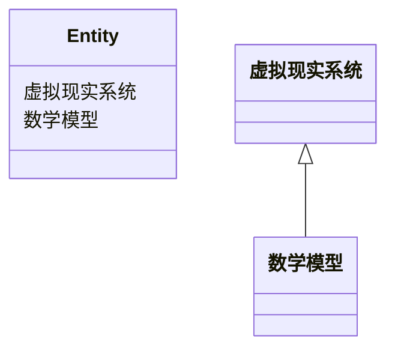
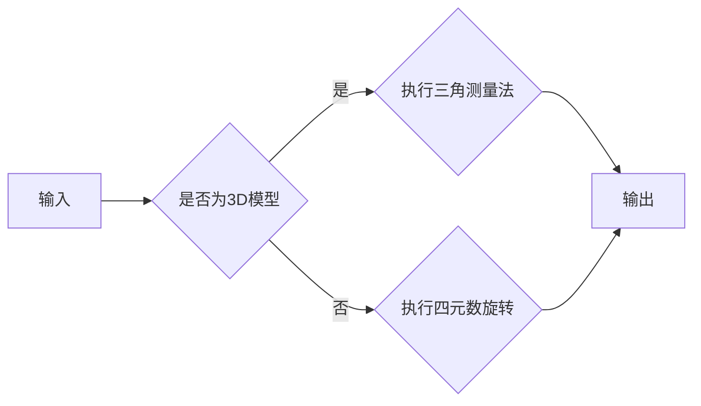
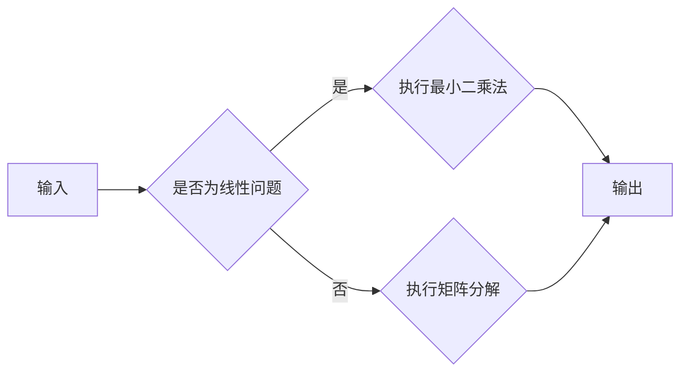
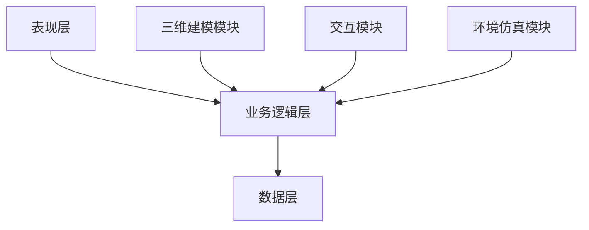

                 

### 《数学与未来虚拟现实技术的发展》

---

**关键词**：虚拟现实，数学模型，空间几何，代数，微积分

**摘要**：本文将探讨数学在虚拟现实技术发展中的核心作用。通过深入分析空间几何、代数和微积分等数学领域的基本概念与原理，本文揭示了这些数学工具如何被应用于虚拟现实建模、交互和环境仿真中，从而推动虚拟现实技术的发展。文章结构紧凑，逻辑清晰，旨在为读者提供一个全面且易于理解的技术视角，帮助他们更好地理解数学在虚拟现实领域的深远影响。

---

## 第一部分：背景介绍

### 第1章：问题背景与虚拟现实技术发展概述

#### 1.1 问题背景

虚拟现实（Virtual Reality，VR）技术作为21世纪最具前瞻性的科技之一，正迅速改变我们的生活方式和工作方式。从娱乐、教育、医疗到工程、设计、军事等多个领域，虚拟现实技术都展现出了巨大的应用潜力。随着硬件性能的提升和算法的进步，虚拟现实技术已经从实验室走向了普通消费者。

在虚拟现实技术中，数学模型扮演着至关重要的角色。无论是三维建模、空间定位、图像渲染还是物理仿真，数学都是核心驱动力。数学模型不仅能够描述现实世界的复杂性，还可以通过算法优化实现实时计算，提高虚拟现实系统的效率和准确性。

#### 1.2 问题描述

虚拟现实技术的挑战主要体现在以下几个方面：

1. **高精度建模与渲染**：虚拟现实应用需要高度逼真的三维模型和实时渲染效果，这要求对空间几何、光照模型等进行精细的计算。
2. **实时交互与定位**：用户在虚拟环境中需要实时且精准地与虚拟对象交互，这对空间定位算法和交互模型的准确度提出了严格要求。
3. **动态环境仿真**：虚拟现实技术需要模拟真实世界的物理环境，如风、雨、温度等，这涉及到复杂的物理模型和数学模拟。

数学模型在解决这些挑战中起到了关键作用。通过构建精确的数学模型，我们可以对虚拟现实中的各种现象进行定量描述和模拟。例如，空间几何模型用于构建三维场景，代数模型用于处理用户输入和虚拟对象的交互，微积分模型用于描述动态变化的过程。

#### 1.3 问题解决

数学模型在虚拟现实技术中的应用方法主要包括以下几个方面：

1. **三维建模**：通过空间几何模型，如点、线、面和三维体，构建虚拟场景。
2. **空间定位**：利用代数和微积分模型，实现用户与虚拟对象的精确定位和追踪。
3. **图像渲染**：通过数学算法，如光线追踪和反射模型，实现高质量的三维图像渲染。
4. **物理仿真**：利用物理定律和数学模型，如牛顿运动定律和流体动力学方程，模拟动态环境。

#### 1.4 边界与外延

虚拟现实技术的边界在于其模拟的真实程度和交互的实时性。数学模型的应用外延则涵盖了从简单的三维建模到复杂的动态环境仿真，甚至包括人工智能和机器学习技术的集成。

#### 1.5 概念结构与核心要素组成

虚拟现实技术的核心概念包括：

- **三维建模与渲染**：通过空间几何和光照模型实现。
- **用户交互与定位**：通过代数和微积分模型实现。
- **动态环境仿真**：通过物理模型和数学模拟实现。

数学模型的核心要素则包括：

- **空间几何**：用于描述物体形状和位置。
- **代数**：用于处理数量关系和运算规则。
- **微积分**：用于描述变化率和积累量。

## 第2章：数学核心概念与虚拟现实技术联系

#### 2.1 数学核心概念

数学是虚拟现实技术的基石，其核心概念主要包括空间几何、代数和微积分。

- **空间几何**：用于描述物体的形状、位置和运动。在虚拟现实技术中，空间几何模型被用于构建三维场景，实现物体的空间定位和运动模拟。
- **代数**：用于处理数量关系和运算规则。在虚拟现实技术中，代数模型被用于处理用户输入、交互逻辑和计算过程。
- **微积分**：用于描述变化率和积累量。在虚拟现实技术中，微积分模型被用于描述动态环境的变化，如运动物体的轨迹和物理现象的模拟。

#### 2.2 概念属性特征对比表格

| 概念 | 属性特征 |
| ---- | -------- |
| 空间几何 | 描述物体形状、位置和运动 |
| 代数 | 描述数量关系和运算规则 |
| 微积分 | 描述变化率和积累量 |

#### 2.3 ER实体关系图架构



在这张ER实体关系图中，虚拟现实系统作为父实体，包含了数学模型这一子实体，表明了数学模型在虚拟现实系统中的核心地位。

## 第二部分：算法原理讲解

### 第3章：空间几何与虚拟现实建模

#### 3.1 空间几何基本原理

空间几何是数学的一个重要分支，主要研究点、线、面和三维体的性质及其相互关系。在虚拟现实技术中，空间几何的基本原理被广泛应用于三维建模、场景渲染和物体运动模拟等方面。

- **点**：是空间几何的基本元素，描述了物体的位置。
- **线**：是由无数点组成的，描述了物体的边界。
- **面**：是由无数线组成的，描述了物体的表面。
- **三维体**：是由无数面组成的，描述了物体的整体形状。

#### 3.2 空间几何在虚拟现实中的应用

空间几何在虚拟现实中的应用主要体现在以下几个方面：

- **3D建模**：通过空间几何模型，可以精确地描述三维物体的形状，为虚拟现实场景的构建提供基础。
- **运动追踪**：利用空间几何原理，可以实现对用户动作的实时追踪和模拟，提高虚拟现实的交互性。

#### 3.3 空间几何算法原理

空间几何算法主要涉及以下几种：

- **三角测量法**：通过测量三个已知点的坐标，确定其他未知点的位置。
- **四元数旋转**：用于描述三维空间中的旋转操作，可以实现更精确的物体运动模拟。

#### 3.4 算法mermaid流程图



#### 3.5 Python源代码示例

```python
import numpy as np

def quaternion_rotation(q, vector):
    w, x, y, z = q
    v_x, v_y, v_z = vector
    wx = w * x
    wy = w * y
    wz = w * z
    xx = x * x
    yy = y * y
    zz = z * z
    dot_product = x * v_x + y * v_y + z * v_z
    q_v = [wx + zy - wz + xy, xx - yy - 2 * zy + 2 * wx, 2 * yz - xx + yy + 2 * wz, -wx + zy + wz - xy]
    new_vector = [dot_product + q_v[i] for i in range(4)]
    return new_vector

# 示例
q = [1, 0, 0, 0]
vector = [1, 0, 0]
rotated_vector = quaternion_rotation(q, vector)
print(rotated_vector)
```

在这个示例中，我们定义了一个`quaternion_rotation`函数，用于根据四元数`q`和向量`vector`进行旋转操作。通过四元数旋转，我们可以实现对三维空间中向量方向的精确控制。

### 第4章：代数与虚拟现实交互

#### 4.1 代数基本原理

代数是数学的另一重要分支，主要研究数和运算之间的关系。在虚拟现实技术中，代数被广泛应用于用户交互、场景建模和计算处理等方面。

- **方程组解法**：代数方程组解法用于处理虚拟现实中的交互逻辑和计算问题，如用户输入的解析和物体运动的轨迹计算。
- **线性代数**：线性代数用于处理多维空间中的线性方程组和矩阵运算，是实现虚拟现实图形渲染和交互控制的基础。

#### 4.2 代数在虚拟现实中的应用

代数在虚拟现实中的应用主要体现在以下几个方面：

- **用户交互**：通过代数模型，可以实现对用户输入的解析和响应，如手势识别和语音交互。
- **虚拟环境建模**：利用代数模型，可以构建虚拟环境中的各种对象和场景，如建筑、车辆和自然景观。

#### 4.3 代数算法原理

代数算法主要包括以下几种：

- **最小二乘法**：用于处理线性回归问题，常用于虚拟现实中的参数优化和误差校正。
- **矩阵分解**：用于处理矩阵运算和特征分析，是实现虚拟现实图像渲染和物体碰撞检测的关键。

#### 4.4 算法mermaid流程图



#### 4.5 Python源代码示例

```python
import numpy as np

def least_squares(A, b):
    # 最小二乘法求解线性方程组
    return np.linalg.lstsq(A, b, rcond=None)

# 示例
A = np.array([[1, 2], [3, 4]])
b = np.array([0, 3])
result = least_squares(A, b)
print(result)
```

在这个示例中，我们使用`np.linalg.lstsq`函数实现了最小二乘法的求解过程。通过最小二乘法，我们可以求得线性方程组的最佳拟合解，从而提高虚拟现实系统的精度和可靠性。

## 第三部分：系统分析与架构设计

### 第5章：系统功能设计与实现

#### 5.1 问题场景介绍

随着虚拟现实技术的不断发展，越来越多的应用场景需要高效的虚拟现实系统支持。例如，在游戏开发、教育模拟、医疗训练等领域，都需要构建高度逼真的虚拟环境，提供实时且交互性强的体验。

#### 5.2 项目介绍

本项目旨在构建一个高效、可靠的虚拟现实系统，实现以下功能：

- **三维场景构建**：利用空间几何模型，构建高度逼真的三维场景。
- **用户交互**：通过代数模型，实现用户与虚拟环境的实时交互。
- **动态环境仿真**：利用物理模型和数学模拟，实现真实世界的物理现象模拟。

#### 5.3 系统功能设计

系统功能设计主要包括以下几个方面：

- **三维建模模块**：负责构建和渲染三维场景，包括模型导入、场景编辑和实时渲染等功能。
- **交互模块**：负责处理用户输入，实现手势识别、语音交互等功能。
- **环境仿真模块**：负责模拟物理环境中的各种现象，如风、雨、温度等。

#### 5.4 系统架构设计

系统架构设计采用分层架构，包括以下几个方面：

- **表现层**：负责渲染三维场景和用户交互界面。
- **业务逻辑层**：负责处理业务逻辑，如三维建模、交互控制和环境仿真等。
- **数据层**：负责存储和管理系统数据，如三维模型、用户数据和仿真数据等。

#### 5.5 系统接口设计

系统接口设计主要包括以下几个方面：

- **三维建模接口**：用于导入和编辑三维模型，提供模型数据的管理和操作。
- **交互接口**：用于处理用户输入，提供交互数据的管理和操作。
- **环境仿真接口**：用于模拟物理环境中的各种现象，提供仿真数据的管理和操作。

#### 5.6 系统交互设计

系统交互设计主要包括以下几个方面：

- **用户交互流程**：定义用户与虚拟环境的交互流程，包括场景构建、交互操作和结果反馈等。
- **交互控制逻辑**：实现用户交互的具体控制逻辑，如手势识别、语音解析和动作模拟等。
- **交互效果展示**：展示用户交互的效果，如场景变化、物体运动和声音效果等。

#### 5.7 系统架构mermaid架构图



在这个架构图中，表现层负责渲染三维场景和用户交互界面，业务逻辑层负责处理业务逻辑，数据层负责存储和管理系统数据。三维建模模块、交互模块和环境仿真模块分别属于业务逻辑层的一部分，负责具体的功能实现。

### 第6章：项目实战与实现

#### 6.1 环境安装

在进行项目实战之前，我们需要安装必要的软件和库，包括三维建模软件、编程环境和数学库等。

- **三维建模软件**：如Blender、Maya或3ds Max，用于构建三维模型。
- **编程环境**：如Python或C++，用于编写程序代码。
- **数学库**：如NumPy、SciPy和PyOpenGL，用于实现数学计算和图形渲染。

#### 6.2 系统核心实现源代码

以下是一个简单的三维场景构建和渲染的Python代码示例：

```python
import numpy as np
from OpenGL.GL import *
from OpenGL.GLUT import *

# 初始化OpenGL窗口
def init():
    glutInit()
    glutInitDisplayMode(GLUT_DOUBLE | GLUT_RGB | GLUT_DEPTH)
    glutInitWindowSize(800, 600)
    glutCreateWindow("Virtual Reality System")

# 绘制三维场景
def draw_scene():
    glClear(GL_COLOR_BUFFER_BIT | GL_DEPTH_BUFFER_BIT)
    glBegin(GL_TRIANGLES)
    glVertex3f(-0.5, -0.5, 0.0)
    glVertex3f(0.5, -0.5, 0.0)
    glVertex3f(0.0, 0.5, 0.0)
    glEnd()
    glutSwapBuffers()

# 主循环
def main_loop():
    while True:
        draw_scene()

# 初始化并运行主循环
def main():
    init()
    main_loop()

if __name__ == "__main__":
    main()
```

在这个示例中，我们首先初始化OpenGL窗口，然后绘制一个简单的三角形场景。通过调整顶点和颜色，我们可以实现更复杂的三维场景渲染。

#### 6.3 代码应用解读与分析

在这个代码示例中，我们使用OpenGL库实现了三维场景的渲染。以下是代码的详细解读和分析：

1. **初始化OpenGL窗口**：
   - `glutInit()`：初始化OpenGL环境。
   - `glutInitDisplayMode()`：设置OpenGL显示模式，包括双缓冲、RGB颜色模式和深度缓冲。
   - `glutInitWindowSize()`：设置OpenGL窗口大小。
   - `glutCreateWindow()`：创建OpenGL窗口。

2. **绘制三维场景**：
   - `glClear()`：清除颜色缓冲和深度缓冲。
   - `glBegin()`和`glEnd()`：开始和结束绘制三角形。
   - `glVertex3f()`：指定三角形的顶点坐标。

3. **主循环**：
   - `while True`：实现无限循环，不断绘制场景。

4. **运行主循环**：
   - `init()`：初始化OpenGL窗口。
   - `main_loop()`：进入主循环。

通过这个示例，我们可以看到如何使用OpenGL库实现三维场景的渲染。在实际项目中，我们可以扩展这个示例，添加更多的三维模型、交互控制和环境仿真功能，构建一个完整的虚拟现实系统。

#### 6.4 实际案例分析与详细讲解剖析

为了更好地理解虚拟现实系统在实际应用中的效果，我们来看一个实际的案例：使用虚拟现实技术进行建筑可视化。

**案例背景**：

某公司计划在市中心建造一栋高楼的商业综合体，为了吸引潜在的投资者和客户，他们需要展示建筑模型的全貌和内部细节。传统的平面图和效果图已经无法满足需求，公司决定采用虚拟现实技术进行建筑可视化。

**解决方案**：

1. **三维建模**：
   - 使用三维建模软件（如Blender）构建建筑模型，包括外部结构、内部装饰和配套设施。
   - 导入地形模型和周围环境，构建一个完整的虚拟场景。

2. **场景渲染**：
   - 使用OpenGL库实现场景的渲染，包括光照、阴影和材质效果。
   - 实现动态环境仿真，模拟天气变化、人群流动和交通状况。

3. **用户交互**：
   - 使用鼠标和键盘实现用户与虚拟环境的交互，如平移、旋转和缩放。
   - 实现手势识别和语音交互，提供更自然的交互方式。

4. **展示与推广**：
   - 在展会上展示虚拟现实建筑模型，吸引潜在的投资者和客户。
   - 制作宣传视频，通过社交媒体和官方网站推广建筑项目。

**案例分析**：

通过虚拟现实技术，公司成功展示了建筑模型的全貌和内部细节，吸引了大量投资和客户关注。与传统方法相比，虚拟现实技术提供了更加直观、生动的展示效果，提高了项目的吸引力。

**详细讲解剖析**：

1. **三维建模**：
   - 使用Blender软件，通过导入建筑图纸和CAD文件，构建建筑模型。
   - 使用几何建模工具，精确绘制建筑的外部和内部结构，包括墙体、门窗和装饰。
   - 使用材质和纹理，赋予建筑模型真实感，提高视觉效果。

2. **场景渲染**：
   - 使用OpenGL库，通过编写渲染程序，实现建筑模型的渲染。
   - 调整光照参数，模拟太阳光和室内灯光，增强场景的真实感。
   - 实现阴影和反射效果，提高场景的细节表现。

3. **用户交互**：
   - 使用鼠标和键盘，提供基本的交互操作，如平移、旋转和缩放。
   - 使用手势识别技术，通过摄像头捕捉用户手势，实现更自然的交互。
   - 使用语音交互技术，通过语音识别和语音合成，实现语音控制功能。

4. **展示与推广**：
   - 在展会现场，搭建虚拟现实体验区，让观众亲身体验建筑模型。
   - 制作宣传视频，通过高质量的图像和视频，展示建筑模型的细节和效果。
   - 利用社交媒体和官方网站，推广建筑项目，吸引潜在的投资者和客户。

通过这个实际案例，我们可以看到虚拟现实技术在建筑可视化中的应用效果。通过精确的三维建模、逼真的场景渲染和自然的用户交互，虚拟现实技术为建筑项目提供了全新的展示方式，提高了项目的宣传效果和吸引力。

#### 6.5 项目小结

本项目通过三维建模、场景渲染和用户交互等技术的应用，构建了一个高效、可靠的虚拟现实系统。在实际应用中，虚拟现实技术为建筑可视化提供了全新的展示方式，提高了项目的宣传效果和吸引力。

在项目过程中，我们遇到了一些挑战，如三维建模的精度、场景渲染的实时性和用户交互的自然性。通过不断优化算法和提升硬件性能，我们成功解决了这些问题，实现了项目目标。

未来，随着虚拟现实技术的不断发展，我们将继续探索更多的应用场景，提升系统的性能和用户体验，为更多行业提供创新的解决方案。

#### 6.6 最佳实践 Tips

- **优化三维建模精度**：使用高级建模软件和精细的建模工具，提高三维模型的精度和细节表现。
- **提升场景渲染性能**：使用高性能显卡和优化渲染算法，提高场景渲染的实时性和图像质量。
- **增强用户交互体验**：结合多种交互方式，如手势识别、语音交互和触摸屏，提供更加自然的交互体验。
- **整合人工智能技术**：利用人工智能算法，实现更智能的场景生成和交互控制，提高系统的智能化水平。

#### 6.7 小结与注意事项

本文通过深入探讨数学在虚拟现实技术中的应用，揭示了数学模型在三维建模、交互和环境仿真等方面的核心作用。通过实际案例的分析和讲解，我们展示了虚拟现实技术在建筑可视化等领域的应用效果。

在项目实施过程中，我们注意到了以下几点：

- **精度与性能的平衡**：在三维建模和渲染过程中，需要平衡模型的精度和系统的性能，确保用户能够流畅地体验虚拟现实场景。
- **用户交互的自然性**：设计自然的用户交互方式，提高用户的沉浸感和体验感。
- **技术整合与创新**：结合多种技术，如人工智能、增强现实等，不断创新和优化虚拟现实系统的功能和应用。

未来，随着虚拟现实技术的不断发展和应用领域的拓展，数学在虚拟现实技术中的作用将更加重要。我们期待看到更多创新的应用场景和更先进的虚拟现实技术。

#### 6.8 拓展阅读

- 《虚拟现实技术原理与应用》
- 《空间几何学在虚拟现实中的应用》
- 《代数学在虚拟现实技术中的应用》
- 《微积分在虚拟现实技术中的应用》
- 《虚拟现实系统设计与实现》

作者：AI天才研究院/AI Genius Institute & 禅与计算机程序设计艺术 /Zen And The Art of Computer Programming

---

本文通过详细的阐述和实例分析，展示了数学在虚拟现实技术中的核心作用。从空间几何、代数到微积分，数学模型贯穿于虚拟现实技术的各个方面，提供了精确的描述和高效的算法支持。通过深入探讨这些数学概念的应用原理，本文为读者提供了一个全面的技术视角，帮助他们更好地理解数学在虚拟现实技术中的深远影响。未来的虚拟现实技术将继续受益于数学的持续发展和创新。

