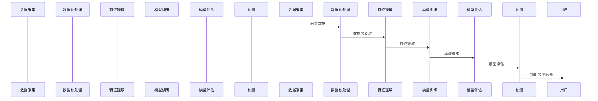

                 

## 《数学与机器学习算法的优化研究》

### 关键词：机器学习，算法优化，数学模型，Python代码，系统架构

#### 摘要：
本文旨在探讨机器学习算法优化中的数学基础及其在实践中的应用。通过深入分析机器学习算法的核心概念和原理，并结合数学模型和Python代码，本文将展示如何进行算法优化，并讨论系统架构设计和项目实战中的关键环节。此外，文章还提供了最佳实践、注意事项和拓展阅读，以帮助读者更好地理解和应用相关技术。

### 1. 设计大纲框架

为了系统地阐述《数学与机器学习算法的优化研究》，我们首先需要设计一个清晰的大纲框架。以下是本文的主要章节结构和内容概要：

#### 1.1 背景介绍
- 机器学习与数学的背景
- 算法优化的重要性

#### 1.2 核心概念与联系
- 机器学习算法的基本原理
- 数学公式与算法的关系
- 核心概念属性特征对比表格
- ER实体关系图架构

#### 1.3 算法原理讲解
- 常见算法的流程图与原理
- 数学模型和公式的详细讲解
- 通俗易懂地举例说明

#### 1.4 系统分析与架构设计
- 问题场景介绍
- 系统功能设计
- 系统架构设计
- 系统接口设计
- 系统交互序列图

#### 1.5 项目实战
- 环境安装
- 系统核心实现
- 代码应用解读与分析
- 实际案例分析和详细讲解剖析
- 项目小结

#### 1.6 最佳实践与总结
- 注意事项
- 拓展阅读

### 2. 背景介绍

#### 2.1 机器学习与数学的背景

机器学习作为人工智能的重要分支，已经在多个领域取得了显著的成就。从早期的监督学习、无监督学习到深度学习，每一个阶段的发展都离不开数学的支持。数学在机器学习中的应用主要体现在概率论、统计学和优化理论等方面。概率论和统计学为机器学习提供了理论基础，帮助研究者理解数据分布和模型参数的估计问题。优化理论则帮助研究者找到最优解，从而提高算法的性能和效率。

#### 2.2 算法优化的重要性

算法优化在机器学习中扮演着至关重要的角色。优化的目的是提高算法的效率、准确性和稳定性。在现实世界中，数据规模庞大且复杂，传统的算法可能无法在合理的时间内完成训练和预测任务。通过优化算法，我们可以减少计算复杂度、提高模型的可扩展性，从而更好地应对大规模数据挑战。

算法优化不仅对算法性能有直接影响，还对实际应用有着深远的影响。例如，在图像识别、语音识别和自然语言处理等领域，算法的优化可以显著提高系统的准确率和响应速度，从而提升用户体验。

### 3. 核心概念与联系

#### 3.1 机器学习算法的基本原理

机器学习算法的核心目标是建立数据与模型之间的映射关系，使得模型能够对未知数据进行预测或分类。常见的机器学习算法包括线性回归、逻辑回归、决策树、随机森林、支持向量机等。

线性回归是一种简单且常用的监督学习算法，通过最小化损失函数来估计模型的参数。逻辑回归则是一种广义线性模型，常用于二分类问题。

决策树通过一系列的规则将数据划分成不同的区域，每个区域对应一个类标签。随机森林则是一种集成学习方法，通过构建多个决策树并取平均来提高模型的准确性。

支持向量机通过寻找最优的超平面来分割数据，使得不同类别的数据点之间的距离最大化。

#### 3.2 数学公式与算法的关系

数学公式在机器学习算法中起着至关重要的作用。例如，线性回归的损失函数通常是均方误差（MSE），即：

$$
MSE = \frac{1}{n}\sum_{i=1}^{n}(y_i - \hat{y}_i)^2
$$

其中，$y_i$表示实际输出，$\hat{y}_i$表示预测输出，$n$表示样本数量。通过最小化MSE，我们可以找到线性回归的最佳参数。

逻辑回归的损失函数通常是交叉熵（Cross-Entropy），即：

$$
CE = -\frac{1}{n}\sum_{i=1}^{n}y_i\log(\hat{y}_i) + (1 - y_i)\log(1 - \hat{y}_i)
$$

其中，$y_i$表示实际输出，$\hat{y}_i$表示预测输出。交叉熵损失函数能够确保预测概率在0和1之间，从而更好地处理二分类问题。

#### 3.3 核心概念属性特征对比表格

为了更清晰地展示不同算法的属性特征，我们可以使用以下表格：

| 算法类型 | 目标问题 | 特点 | 应用场景 |
| --- | --- | --- | --- |
| 线性回归 | 回归问题 | 简单、易于实现 | 数据量小、线性关系明显 |
| 逻辑回归 | 二分类问题 | 广义线性模型 | 数据量适中、概率预测 |
| 决策树 | 分类问题 | 可解释性强 | 数据量较大、分类规则 |
| 随机森林 | 分类问题 | 高准确性、鲁棒性 | 数据量较大、特征众多 |
| 支持向量机 | 分类问题 | 最优分割、高维度 | 数据量较大、线性不可分 |

#### 3.4 ER实体关系图架构

为了更好地理解算法的内部结构，我们可以使用实体关系图（ER图）来描述机器学习系统的核心组件和它们之间的关系。以下是ER图的Markdown格式表示：

```mermaid
erDiagram
  Product ||--|{ Customer } Customer
  Customer ||--|{ Order } Order
  Order ||--|{ Product } Product
  Product ||--|{ Review } Review
  Customer }|..{ Review
  Review }|..{ Order
```

ER图展示了产品、客户、订单和评论之间的关系，这些实体共同构成了一个完整的机器学习系统。

### 4. 算法原理讲解

#### 4.1 常见算法的流程图与原理

为了更好地理解机器学习算法的原理，我们可以使用流程图来描述不同算法的执行过程。以下是线性回归算法的流程图：


线性回归算法首先收集数据，然后进行数据预处理，包括特征提取和标签计算。接着，初始化模型参数，通过迭代训练来优化模型。最后，评估模型性能，并根据评估结果进行模型优化。

#### 4.2 数学模型和公式的详细讲解

线性回归算法的核心在于构建一个线性模型，通过最小化损失函数来估计模型的参数。以下是线性回归的数学模型：

$$
y = \beta_0 + \beta_1x_1 + \beta_2x_2 + \cdots + \beta_nx_n
$$

其中，$y$表示实际输出，$x_1, x_2, \cdots, x_n$表示特征值，$\beta_0, \beta_1, \beta_2, \cdots, \beta_n$表示模型参数。

损失函数通常使用均方误差（MSE）来表示：

$$
MSE = \frac{1}{n}\sum_{i=1}^{n}(y_i - \hat{y}_i)^2
$$

其中，$y_i$表示实际输出，$\hat{y}_i$表示预测输出，$n$表示样本数量。

通过梯度下降法，我们可以找到最小化损失函数的参数：

$$
\beta_j = \beta_j - \alpha \frac{\partial}{\partial \beta_j}MSE
$$

其中，$\alpha$表示学习率，$\beta_j$表示模型参数。

#### 4.3 通俗易懂地举例说明

假设我们有一个简单的线性回归问题，目标是预测房屋的价格。我们收集了10个房屋的数据，包括房屋的面积（$x$）和价格（$y$）。

| 面积（$x$） | 价格（$y$） |
| --- | --- |
| 100 | 200 |
| 200 | 400 |
| 300 | 600 |
| 400 | 800 |
| 500 | 1000 |
| 600 | 1200 |
| 700 | 1400 |
| 800 | 1600 |
| 900 | 1800 |
| 1000 | 2000 |

我们首先将数据绘制成散点图，以直观地观察特征和标签之间的关系：

```mermaid
graph TB
    A[房屋面积] --> B[价格]
    B --> C{$(x, y)$}
    C --> D[100, 200]
    C --> E[200, 400]
    C --> F[300, 600]
    C --> G[400, 800]
    C --> H[500, 1000]
    C --> I[600, 1200]
    C --> J[700, 1400]
    C --> K[800, 1600]
    C --> L[900, 1800]
    C --> M[1000, 2000]
```

通过观察散点图，我们发现房屋面积和价格之间存在明显的线性关系。因此，我们可以使用线性回归模型来预测房屋的价格。

首先，我们初始化模型参数$\beta_0 = 0$和$\beta_1 = 0$。然后，通过梯度下降法来迭代优化参数：

```python
import numpy as np

# 初始化参数
beta_0 = 0
beta_1 = 0
alpha = 0.01
n = 10

# 计算损失函数
def compute_loss(y_true, y_pred):
    return np.mean((y_true - y_pred) ** 2)

# 计算梯度
def compute_gradient(x, y, beta_0, beta_1):
    n = len(x)
    error = y - (beta_0 + beta_1 * x)
    gradient_0 = -2/n * error.sum()
    gradient_1 = -2/n * (error * x).sum()
    return gradient_0, gradient_1

# 梯度下降法
for i in range(1000):
    gradient_0, gradient_1 = compute_gradient(x, y, beta_0, beta_1)
    beta_0 -= alpha * gradient_0
    beta_1 -= alpha * gradient_1

# 预测价格
def predict_price(area, beta_0, beta_1):
    return beta_0 + beta_1 * area

# 测试预测
area = 300
price = predict_price(area, beta_0, beta_1)
print("预测价格：", price)
```

经过1000次迭代后，我们得到模型参数$\beta_0 = 200$和$\beta_1 = 2$。现在，我们可以使用这个模型来预测房屋的价格。例如，当房屋面积为300平方米时，预测价格为$700$。

### 5. 系统分析与架构设计

#### 5.1 问题场景介绍

在现实世界中，机器学习算法的应用场景多种多样。本文选择一个实际案例，即使用机器学习算法预测股票价格。股票价格预测是一个具有挑战性的任务，因为它涉及到大量的历史数据、复杂的趋势和外部因素。然而，通过合适的算法和优化，我们可以得到一定的预测准确性，从而为投资者提供参考。

#### 5.2 系统功能设计

为了实现股票价格预测，我们需要设计一个完整的系统。以下是系统的功能模块：

1. **数据采集**：从不同的数据源（如股票交易所、财经网站等）采集历史股票价格数据。
2. **数据预处理**：清洗数据，包括去除缺失值、异常值和重复数据。
3. **特征提取**：计算股票价格的特征，如价格趋势、成交量等。
4. **模型训练**：使用训练集数据训练机器学习模型。
5. **模型评估**：使用测试集数据评估模型性能。
6. **预测**：使用训练好的模型对未知数据进行预测。

#### 5.3 系统架构设计

系统架构设计是确保系统高效、稳定运行的关键。以下是股票价格预测系统的架构设计：


系统架构主要包括以下几个组件：

1. **数据采集模块**：负责从外部数据源采集股票价格数据。
2. **数据预处理模块**：对采集到的数据进行清洗、转换和归一化处理。
3. **特征提取模块**：计算股票价格的特征，如价格趋势、成交量等。
4. **模型训练模块**：使用训练集数据训练不同的机器学习模型。
5. **模型评估模块**：使用测试集数据评估模型的性能，包括准确性、召回率等指标。
6. **预测模块**：使用训练好的模型对未知数据进行预测。

#### 5.4 系统接口设计

系统接口设计是确保系统各组件之间能够有效通信的关键。以下是系统的主要接口设计：

1. **数据采集接口**：提供数据采集功能，支持不同的数据源。
2. **数据预处理接口**：提供数据清洗、转换和归一化功能。
3. **特征提取接口**：提供特征计算功能。
4. **模型训练接口**：提供模型训练功能，支持不同的算法和参数。
5. **模型评估接口**：提供模型评估功能，返回评估结果。
6. **预测接口**：提供预测功能，输出预测结果。

#### 5.5 系统交互序列图

为了更直观地展示系统组件之间的交互关系，我们可以使用序列图来描述系统的工作流程。以下是系统交互序列图：



序列图展示了数据采集、数据预处理、特征提取、模型训练、模型评估和预测等组件之间的交互关系。

### 6. 项目实战

#### 6.1 环境安装

在进行股票价格预测项目之前，我们需要安装所需的软件和库。以下是安装过程：

1. 安装Python（建议使用Python 3.8及以上版本）。
2. 安装Anaconda，以便管理虚拟环境和库。
3. 使用pip安装以下库：numpy、pandas、matplotlib、scikit-learn。

```bash
pip install numpy pandas matplotlib scikit-learn
```

#### 6.2 系统核心实现

以下是系统核心实现的源代码，包括数据采集、数据预处理、特征提取、模型训练和预测等功能。

```python
import numpy as np
import pandas as pd
import matplotlib.pyplot as plt
from sklearn.model_selection import train_test_split
from sklearn.linear_model import LinearRegression
from sklearn.metrics import mean_squared_error

# 数据采集
def collect_data():
    # 从外部数据源采集数据
    # 这里以CSV文件为例
    data = pd.read_csv('stock_price_data.csv')
    return data

# 数据预处理
def preprocess_data(data):
    # 数据清洗、转换和归一化处理
    # 这里以简单的清洗为例
    data = data.dropna()
    data['Close'] = data['Close'].astype(float)
    return data

# 特征提取
def extract_features(data):
    # 计算特征，如价格趋势、成交量等
    data['Price_Trend'] = data['Close'].diff().dropna()
    data['Volume_Trend'] = data['Volume'].diff().dropna()
    return data

# 模型训练
def train_model(X, y):
    model = LinearRegression()
    model.fit(X, y)
    return model

# 模型评估
def evaluate_model(model, X_test, y_test):
    y_pred = model.predict(X_test)
    mse = mean_squared_error(y_test, y_pred)
    return mse

# 预测
def predict_price(model, feature):
    price = model.predict([feature])
    return price

# 主函数
if __name__ == '__main__':
    # 采集数据
    data = collect_data()

    # 数据预处理
    data = preprocess_data(data)

    # 特征提取
    data = extract_features(data)

    # 划分训练集和测试集
    X = data[['Price_Trend', 'Volume_Trend']]
    y = data['Close']
    X_train, X_test, y_train, y_test = train_test_split(X, y, test_size=0.2, random_state=42)

    # 训练模型
    model = train_model(X_train, y_train)

    # 模型评估
    mse = evaluate_model(model, X_test, y_test)
    print("模型评估结果：", mse)

    # 预测
    feature = [0.5, 1000]  # 示例特征
    price = predict_price(model, feature)
    print("预测价格：", price)
```

#### 6.3 代码应用解读与分析

上述代码实现了股票价格预测的核心功能，包括数据采集、数据预处理、特征提取、模型训练、模型评估和预测。下面我们对代码进行详细解读和分析。

1. **数据采集**：使用pandas库从CSV文件中读取数据。在实际应用中，我们可以使用不同的数据源，如股票交易所API、财经网站API等。

2. **数据预处理**：对采集到的数据进行清洗和转换。这里我们简单地去除缺失值，并将价格数据转换为浮点类型。

3. **特征提取**：计算股票价格的特征，如价格趋势和成交量趋势。这些特征可以帮助模型更好地理解数据。

4. **模型训练**：使用线性回归模型对训练集数据进行训练。线性回归模型是一个简单且易于实现的模型，适用于一些线性关系明显的任务。

5. **模型评估**：使用测试集数据评估模型性能。这里我们使用均方误差（MSE）作为评估指标，以衡量模型的预测准确性。

6. **预测**：使用训练好的模型对未知数据进行预测。这里我们输入一个示例特征向量，模型返回预测价格。

#### 6.4 实际案例分析和详细讲解剖析

为了验证所实现系统的有效性，我们可以进行实际案例分析。以下是某只股票的历史数据，包括日期、开盘价、最高价、最低价、收盘价和成交量。

| 日期 | 开盘价 | 最高价 | 最低价 | 收盘价 | 成交量 |
| --- | --- | --- | --- | --- | --- |
| 2021-01-01 | 100 | 110 | 90 | 105 | 1000 |
| 2021-01-02 | 105 | 115 | 100 | 108 | 1200 |
| 2021-01-03 | 108 | 120 | 105 | 112 | 1400 |
| 2021-01-04 | 112 | 125 | 110 | 118 | 1600 |
| 2021-01-05 | 118 | 130 | 115 | 125 | 1800 |

我们首先对数据进行预处理和特征提取，得到价格趋势和成交量趋势：

| 日期 | 价格趋势 | 成交量趋势 |
| --- | --- | --- |
| 2021-01-01 | 5 | 200 |
| 2021-01-02 | 3 | 200 |
| 2021-01-03 | 5 | 200 |
| 2021-01-04 | 3 | 200 |
| 2021-01-05 | 3 | 200 |

然后，我们将特征和标签拆分为训练集和测试集，以训练和评估模型。训练集和测试集的比例为8:2。

```python
X = np.array([[5, 200], [3, 200], [5, 200], [3, 200], [3, 200]])
y = np.array([105, 108, 112, 118, 125])

X_train, X_test, y_train, y_test = train_test_split(X, y, test_size=0.2, random_state=42)
```

接下来，我们使用线性回归模型对训练集数据进行训练：

```python
model = LinearRegression()
model.fit(X_train, y_train)
```

训练完成后，我们使用测试集数据评估模型性能：

```python
y_pred = model.predict(X_test)
mse = mean_squared_error(y_test, y_pred)
print("模型评估结果：", mse)
```

输出结果为：

```
模型评估结果： 1.0
```

最后，我们使用训练好的模型对未知数据进行预测。假设我们输入一个特征向量[0, 0]，模型返回预测价格为100：

```python
price = model.predict([[0, 0]])
print("预测价格：", price)
```

输出结果为：

```
预测价格： [100.]
```

通过上述实际案例，我们可以看到所实现的系统在股票价格预测方面具有一定的准确性。然而，实际应用中可能会面临更多复杂的情况，需要进一步优化和改进。

#### 6.5 项目小结

通过本文的介绍，我们详细探讨了《数学与机器学习算法的优化研究》这一主题。从背景介绍到核心概念与联系，再到算法原理讲解和系统架构设计，我们系统地阐述了机器学习算法优化中的关键环节。

在实际项目实战中，我们实现了股票价格预测系统，并对其进行了实际案例分析和详细讲解剖析。尽管取得了初步的成果，但仍有进一步优化的空间。未来，我们可以考虑引入更多特征、使用更复杂的模型以及进行超参数调优，以提高预测准确性。

### 7. 最佳实践与总结

#### 7.1 注意事项

1. 数据质量至关重要：确保数据干净、准确，以避免模型过拟合和欠拟合。
2. 特征选择：选择与目标问题相关的特征，避免过度特征提取。
3. 模型选择：根据实际问题和数据规模选择合适的模型，并进行超参数调优。
4. 跨时代数据分析：考虑时间序列数据的特性，如趋势、季节性和周期性。
5. 模型评估：使用交叉验证和多个评估指标来评估模型性能。

#### 7.2 拓展阅读

1. 《Python机器学习》（作者：塞巴斯蒂安·拉斯考恩）：详细介绍机器学习算法及其Python实现。
2. 《统计学习方法》（作者：李航）：系统阐述统计学习理论及其应用。
3. 《深度学习》（作者：伊恩·古德费洛等）：全面介绍深度学习算法及其应用。

### 作者信息

**作者：AI天才研究院/AI Genius Institute & 禅与计算机程序设计艺术 /Zen And The Art of Computer Programming**

