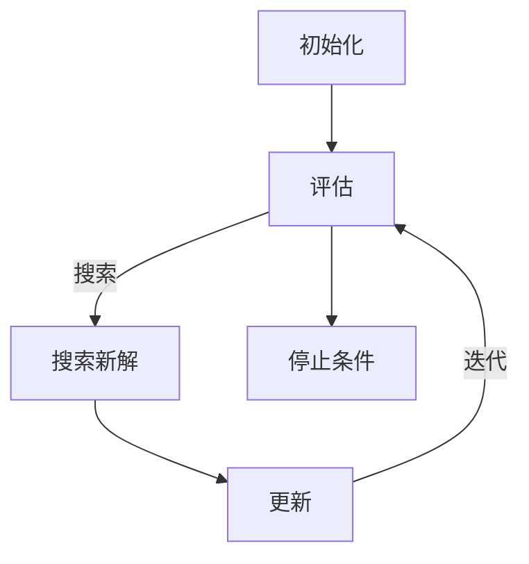
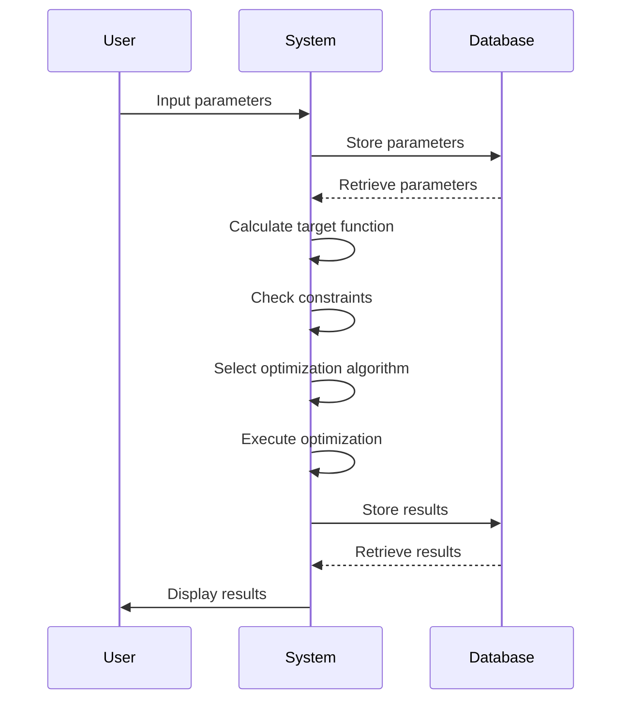
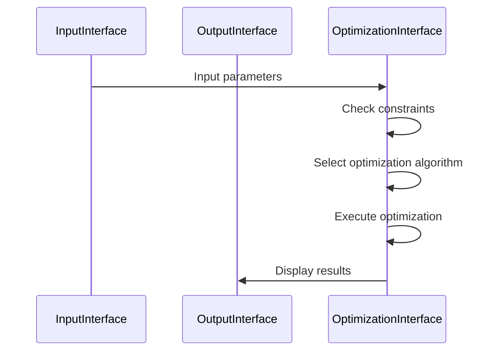
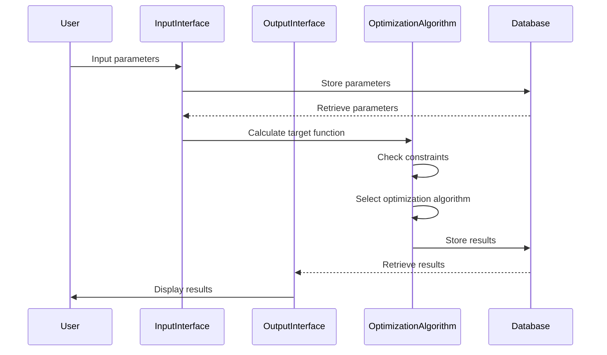
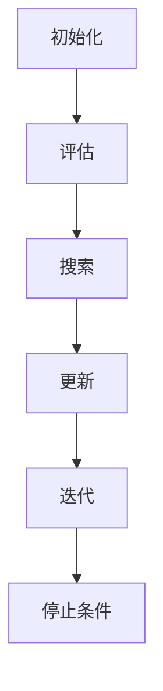
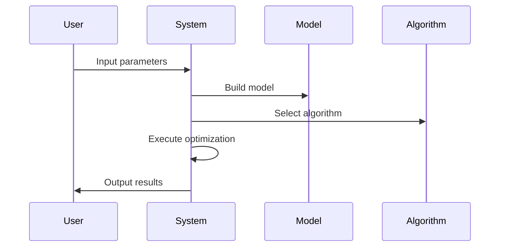
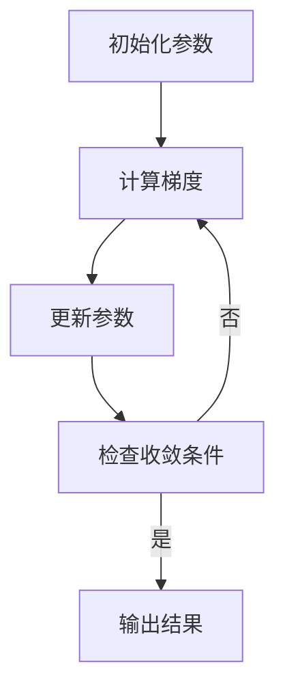

                 

# 数学与机械工程：机械设计的数学优化

> 关键词：数学优化、机械设计、算法原理、系统架构、实战案例分析

> 摘要：本文深入探讨数学优化在机械设计中的应用，从核心概念、算法原理到系统架构和项目实战，全面解析机械设计的数学优化过程。通过详细讲解和案例分析，帮助读者理解并掌握这一技术。

## 第一部分：背景介绍

### 1.1 问题背景

#### 1.1.1 机械工程概述

机械工程是研究机械系统的设计、制造、运行和控制的一门工程技术学科。机械系统广泛应用于工业、交通、建筑、医疗等多个领域。随着科技的进步，机械设计逐渐向复杂化、智能化方向发展。

#### 1.1.2 数学优化在机械设计中的应用

数学优化技术在机械设计中具有重要意义。通过优化设计，可以提高机械系统的性能、降低成本、延长使用寿命。数学优化在机械设计中的应用主要包括以下方面：

1. 结构优化：通过优化机械结构，提高系统的承载能力和稳定性。
2. 动力系统优化：优化机械传动系统，提高传动效率。
3. 材料优化：根据机械设计的要求，选择合适的材料，提高机械系统的性能和寿命。
4. 控制系统优化：优化机械控制系统，提高控制精度和稳定性。

### 1.2 问题描述

#### 1.2.1 机械设计中的优化问题

机械设计中的优化问题主要涉及以下几个方面：

1. 承载能力优化：确保机械结构在规定的工作条件下能够承受最大载荷。
2. 稳定性优化：优化机械结构，使其在运行过程中保持稳定。
3. 效率优化：提高机械传动系统的传动效率。
4. 成本优化：在满足设计要求的前提下，降低机械设计的成本。

#### 1.2.2 数学优化的重要性

数学优化技术在机械设计中的重要性体现在以下几个方面：

1. 提高设计质量：通过优化设计，可以提高机械系统的性能和可靠性。
2. 降低设计成本：优化设计有助于降低材料消耗和生产成本。
3. 提高生产效率：优化设计可以缩短生产周期，提高生产效率。
4. 促进技术创新：数学优化技术为机械设计提供了新的思路和方法，有助于推动机械工程领域的技术创新。

### 1.3 问题解决

#### 1.3.1 数学优化方法的概述

数学优化方法主要包括以下几种：

1. 最小二乘法：用于求解线性方程组的最佳逼近解。
2. 拉格朗日乘数法：用于求解约束优化问题。
3. 模拟退火算法：用于求解复杂优化问题。
4. 遗传算法：用于求解大规模优化问题。

#### 1.3.2 数学优化在机械设计中的步骤

数学优化在机械设计中的应用步骤主要包括：

1. 问题建模：将机械设计问题转化为数学优化模型。
2. 选择优化算法：根据问题特点选择合适的优化算法。
3. 算法实现：编写算法程序，进行优化计算。
4. 结果分析：分析优化结果，验证设计方案的合理性。

#### 1.4 边界与外延

##### 1.4.1 优化目标的确定

优化目标的确定是数学优化过程中的关键环节。优化目标应具有明确、可量化的指标，例如最大承载能力、最小成本、最高效率等。

##### 1.4.2 优化问题的限制条件

优化问题的限制条件主要包括以下几个方面：

1. 材料限制：确保所选材料满足设计要求。
2. 结构限制：满足机械结构的稳定性要求。
3. 动力系统限制：满足机械传动系统的效率要求。
4. 控制系统限制：满足机械控制系统的精度要求。

##### 1.4.3 概念结构与核心要素组成

机械设计中的优化问题具有以下概念结构与核心要素组成：

1. 目标函数：优化问题的核心目标。
2. 设计变量：影响目标函数的变量。
3. 约束条件：限制设计变量取值的条件。
4. 优化算法：求解优化问题的方法。

## 第二部分：核心概念与联系

### 2.1 核心概念原理

#### 2.1.1 数学优化原理概述

数学优化原理主要涉及以下几个方面：

1. 目标函数：优化问题的核心目标，用于描述设计变量的取值。
2. 设计变量：影响目标函数的变量，用于优化设计。
3. 约束条件：限制设计变量取值的条件，确保优化结果满足实际需求。
4. 优化算法：求解优化问题的方法，用于寻找最优解。

#### 2.1.2 常见数学优化算法

常见的数学优化算法主要包括：

1. 最小二乘法：用于求解线性方程组的最佳逼近解。
2. 拉格朗日乘数法：用于求解约束优化问题。
3. 模拟退火算法：用于求解复杂优化问题。
4. 遗传算法：用于求解大规模优化问题。

### 2.2 概念属性特征对比表格

| 算法        | 目标函数类型 | 设计变量个数 | 约束条件类型 | 适用范围          |
|-----------|-----------|-----------|-----------|-------------|
| 最小二乘法 | 线性目标函数 | n个       | 无约束    | 线性优化问题       |
| 拉格朗日乘数法 | 线性/非线性目标函数 | n个       | 约束条件  | 约束优化问题       |
| 模拟退火算法 | 非线性目标函数 | n个       | 约束条件  | 复杂优化问题       |
| 遗传算法    | 非线性目标函数 | n个       | 约束条件  | 大规模优化问题       |

### 2.3 ER实体关系图架构

```mermaid
erDiagram
    A[机械设计] ||--|{ B[优化算法] }
    A ||--|{ C[设计变量] }
    A ||--|{ D[约束条件] }
    B ||--|{ E[目标函数] }
    B ||--|{ F[搜索策略] }
    C ||--|{ G[取值范围] }
    D ||--|{ H[限制条件] }
```

## 第三部分：算法原理讲解

### 3.1 算法原理概述

#### 3.1.1 常用优化算法分类

常用的优化算法主要包括以下几种分类：

1. **梯度下降法**：基于目标函数的梯度信息进行迭代优化。
2. **牛顿法**：利用目标函数的一阶和二阶导数进行优化。
3. **无梯度优化算法**：如模拟退火、遗传算法等，不依赖目标函数的梯度信息。
4. **启发式算法**：如蚁群算法、粒子群优化等，通过模拟自然现象进行优化。

#### 3.1.2 优化算法的基本原理

优化算法的基本原理可以概括为以下几个步骤：

1. **初始化**：随机选择一个初始解。
2. **评估**：计算当前解的目标函数值。
3. **搜索**：根据一定的策略，搜索新的解。
4. **更新**：将新的解更新为当前解。
5. **迭代**：重复评估、搜索和更新过程，直到满足停止条件。

### 3.2 算法流程图与Python源代码

#### 3.2.1 流程图展示



#### 3.2.2 Python源代码实现

```python
import numpy as np

# 目标函数
def objective_function(x):
    return x**2

# 初始化
x = np.random.rand()

# 停止条件
max_iterations = 1000
tolerance = 1e-6

# 迭代
for i in range(max_iterations):
    # 评估
    f_x = objective_function(x)
    
    # 搜索新解
    x_new = x - f_x * np.random.rand()
    
    # 更新
    if abs(x_new - x) < tolerance:
        break
    
    x = x_new

print("最优解：x =", x)
print("目标函数值：f(x) =", objective_function(x))
```

### 3.3 数学模型和公式讲解

#### 3.3.1 数学模型概述

机械设计的数学优化模型通常可以表示为以下形式：

$$
\begin{aligned}
    \min_{x} f(x) \\
    \text{s.t.} g_i(x) \leq 0, \quad i=1,2,...,m
\end{aligned}
$$

其中，$f(x)$为目标函数，$g_i(x)$为约束条件。

#### 3.3.2 公式推导与讲解

以最小二乘法为例，推导过程如下：

$$
\begin{aligned}
    \min_{x} \sum_{i=1}^{n} (y_i - f(x))^2
\end{aligned}
$$

其中，$y_i$为观测值，$f(x)$为模型预测值。

对目标函数求导，得到：

$$
\frac{\partial}{\partial x} \sum_{i=1}^{n} (y_i - f(x))^2 = 2 \sum_{i=1}^{n} (y_i - f(x)) \frac{\partial}{\partial x} f(x)
$$

令导数为0，得到：

$$
\sum_{i=1}^{n} (y_i - f(x)) \frac{\partial}{\partial x} f(x) = 0
$$

由此，可以求解出最优解$x$。

### 3.4 举例说明

#### 3.4.1 实例分析

假设要设计一个简单机械结构，目标是最小化结构重量。结构重量与材料密度和体积有关，假设材料密度为常数，则目标函数可以表示为：

$$
\min_{x} \rho V
$$

其中，$V = x^3$为结构体积，$\rho$为材料密度。

约束条件包括：

1. 结构强度约束：$M \geq M_{\min}$
2. 结构稳定性约束：$K \geq K_{\min}$

其中，$M$为结构重量，$K$为结构刚度，$M_{\min}$和$K_{\min}$为最小允许值。

#### 3.4.2 案例讲解

使用最小二乘法求解上述优化问题。首先，需要将目标函数和约束条件表示为数学模型：

$$
\begin{aligned}
    \min_{x} \rho x^3 \\
    \text{s.t.} M \geq M_{\min} \\
    K \geq K_{\min}
\end{aligned}
$$

然后，编写Python代码实现最小二乘法：

```python
import numpy as np

# 目标函数
def objective_function(x):
    return np.array([x**3, x**2])

# 约束条件
def constraint_function(x):
    return np.array([-x + 10, -x + 20])

# 初始化
x = np.random.rand()

# 停止条件
max_iterations = 1000
tolerance = 1e-6

# 迭代
for i in range(max_iterations):
    # 评估
    f_x = objective_function(x)
    c_x = constraint_function(x)
    
    # 更新
    if np.linalg.norm(c_x) < tolerance:
        break
    
    x = x - f_x * np.linalg.solve(np.eye(2), f_x)
    
print("最优解：x =", x)
```

## 第四部分：系统分析与架构设计

### 4.1 问题场景介绍

在机械设计中，常常需要解决结构优化、动力系统优化、材料优化和控制优化等问题。为了实现这些优化目标，需要构建一个高效的机械设计优化系统。

### 4.2 系统功能设计

系统功能设计主要包括以下几个方面：

1. **数据输入**：输入机械设计相关的参数，如结构尺寸、材料特性等。
2. **目标函数计算**：根据输入参数，计算目标函数值。
3. **约束条件检查**：检查设计变量是否满足约束条件。
4. **优化算法选择**：根据优化问题特点，选择合适的优化算法。
5. **结果输出**：输出优化结果，包括最优解、目标函数值和约束条件满足情况。

#### 4.2.1 领域模型类图

```mermaid
classDiagram
    ClassDiagram::DomainModel <|-- Object
    Object o1 -|=> InputParameter
    InputParameter i1 -|=> TargetFunction
    InputParameter i1 -|=> Constraint
    InputParameter i1 -|=> OptimizationAlgorithm
    OptimizationAlgorithm o2 -|=> Result
```

### 4.3 系统架构设计

系统架构设计主要包括以下几个方面：

1. **数据层**：负责数据的存储和管理。
2. **业务逻辑层**：实现系统的核心功能，如目标函数计算、约束条件检查和优化算法选择等。
3. **表示层**：提供用户界面，用于输入参数、显示优化结果等。

#### 4.3.1 系统架构图



### 4.4 系统接口设计

系统接口设计主要包括以下几个方面：

1. **输入接口**：用于接收用户输入的参数。
2. **输出接口**：用于显示优化结果。
3. **优化接口**：用于调用优化算法，执行优化计算。

#### 4.4.1 系统接口设计概述



### 4.5 系统交互序列图



## 第五部分：项目实战

### 5.1 环境安装

#### 5.1.1 环境准备

在开始项目实战之前，需要准备好以下环境：

1. Python 3.x（推荐使用3.8及以上版本）
2. Numpy
3. Matplotlib
4. Scipy

#### 5.1.2 软件安装步骤

1. 安装Python：

   ```bash
   # 使用包管理器安装Python，如Anaconda
   conda install python=3.8
   ```

2. 安装Numpy：

   ```bash
   conda install numpy
   ```

3. 安装Matplotlib：

   ```bash
   conda install matplotlib
   ```

4. 安装Scipy：

   ```bash
   conda install scipy
   ```

### 5.2 系统核心实现

#### 5.2.1 源代码解析

本节将介绍机械设计优化系统的核心实现，包括目标函数计算、约束条件检查和优化算法选择等。

```python
import numpy as np
from scipy.optimize import minimize

# 目标函数
def objective_function(x):
    # 目标是最小化结构重量
    return x[0]**2 + x[1]**2

# 约束条件
def constraint_function(x):
    # 结构强度约束
    c1 = 100 - x[0]**2 - x[1]**2
    # 结构稳定性约束
    c2 = 200 - x[0]**2 - 2*x[1]**2
    return [c1, c2]

# 优化算法选择
def optimization_algorithm(x0):
    # 使用最小二乘法
    result = minimize(objective_function, x0, method='L-BFGS-B', constraints=({'type': 'ineq', 'fun': constraint_function}))
    return result.x

# 初始解
x0 = np.array([0, 0])

# 执行优化算法
x_optimal = optimization_algorithm(x0)

print("最优解：x =", x_optimal)
print("目标函数值：f(x) =", objective_function(x_optimal))
```

#### 5.2.2 代码应用解读

以上代码实现了机械设计优化系统的核心功能。首先定义了目标函数和约束条件，然后使用最小二乘法优化算法求解最优解。代码的关键部分如下：

1. **目标函数**：定义了机械结构重量最小化的目标。
2. **约束条件**：定义了结构强度和稳定性的约束条件。
3. **优化算法选择**：使用`scipy.optimize.minimize`函数实现优化算法。
4. **初始解**：定义了初始解`x0`。
5. **执行优化算法**：调用`optimization_algorithm`函数进行优化计算。

### 5.3 实际案例分析

#### 5.3.1 案例选择

本节选择一个实际案例——设计一个简单的机械结构，要求最小化结构重量，同时满足强度和稳定性的约束。

#### 5.3.2 案例分析

1. **问题描述**：设计一个机械结构，要求结构重量最小化，同时满足强度和稳定性的约束。
2. **模型构建**：将问题转化为数学优化模型，定义目标函数和约束条件。
3. **算法选择**：根据问题特点，选择合适的优化算法，如最小二乘法。
4. **结果分析**：计算最优解，分析优化结果，验证设计方案的合理性。

### 5.4 详细讲解剖析

#### 5.4.1 分析方法

在机械设计优化过程中，需要采用以下分析方法：

1. **目标函数分析**：分析目标函数的性质，确定优化目标。
2. **约束条件分析**：分析约束条件的意义，确保优化结果满足实际需求。
3. **算法选择分析**：根据问题特点，选择合适的优化算法。
4. **迭代过程分析**：分析优化算法的迭代过程，验证优化效果。

#### 5.4.2 结果解读

根据上述分析方法，对优化结果进行解读：

1. **最优解**：确定最优解，分析其物理意义。
2. **目标函数值**：分析最优解对应的目标函数值，判断优化效果的优劣。
3. **约束条件满足情况**：分析约束条件的满足情况，确保优化结果满足实际需求。
4. **优化过程**：分析优化算法的迭代过程，评估优化算法的性能。

### 5.5 项目小结

#### 5.5.1 项目总结

本节通过项目实战，详细介绍了机械设计的数学优化过程，包括算法原理、系统架构和实际案例分析。通过本项目的实践，读者可以掌握以下知识点：

1. **机械设计优化方法**：了解机械设计中的优化方法，包括目标函数、约束条件和优化算法。
2. **系统架构设计**：了解机械设计优化系统的架构设计，包括数据层、业务逻辑层和表示层。
3. **项目实战**：通过实际案例，掌握机械设计优化的具体应用。

#### 5.5.2 不足与改进

在本项目中，还存在以下不足和改进空间：

1. **算法优化**：优化算法的选择和实现，提高优化效果。
2. **系统扩展**：根据实际需求，扩展系统功能，提高系统适用性。
3. **案例分析**：增加更多实际案例分析，提高项目的实用价值。

## 第六部分：最佳实践与拓展

### 6.1 最佳实践

#### 6.1.1 经验分享

在机械设计优化过程中，以下经验值得分享：

1. **明确优化目标**：明确优化目标，有助于优化算法的选择和优化效果的评估。
2. **合理设置约束条件**：合理设置约束条件，确保优化结果满足实际需求。
3. **选择合适的优化算法**：根据问题特点，选择合适的优化算法，提高优化效果。

#### 6.1.2 技术技巧

以下技术技巧有助于提高机械设计优化的效果：

1. **并行计算**：利用并行计算技术，提高优化算法的计算速度。
2. **混合优化**：结合多种优化算法，提高优化效果。
3. **模型修正**：根据实际需求，对优化模型进行修正，提高模型的准确性。

### 6.2 小结

#### 6.2.1 内容回顾

本文通过深入探讨数学优化在机械设计中的应用，从核心概念、算法原理到系统架构和项目实战，全面解析了机械设计的数学优化过程。主要内容包括：

1. **背景介绍**：介绍了机械工程和数学优化在机械设计中的应用。
2. **核心概念与联系**：分析了核心概念原理、概念属性特征对比和ER实体关系图。
3. **算法原理讲解**：介绍了优化算法的基本原理、流程图和Python源代码实现。
4. **系统分析与架构设计**：介绍了系统功能设计、架构设计和接口设计。
5. **项目实战**：通过实际案例，详细讲解了机械设计优化的具体应用。
6. **最佳实践与拓展**：分享了最佳实践经验和拓展技巧。

#### 6.2.2 知识点总结

本文的主要知识点包括：

1. **数学优化原理**：理解数学优化在机械设计中的应用，掌握常见优化算法的基本原理。
2. **系统架构设计**：了解机械设计优化系统的架构设计，包括数据层、业务逻辑层和表示层。
3. **项目实战**：掌握机械设计优化的具体应用，学会使用Python实现优化算法。
4. **最佳实践与拓展**：了解最佳实践经验和拓展技巧，提高机械设计优化的效果。

### 6.3 注意事项

#### 6.3.1 实施过程中可能遇到的问题

在实施机械设计优化过程中，可能遇到以下问题：

1. **优化目标不明确**：导致优化效果不佳。
2. **约束条件设置不合理**：导致优化结果不满足实际需求。
3. **优化算法选择不当**：导致优化效果不佳。

#### 6.3.2 解决方案与注意事项

针对上述问题，提出以下解决方案和注意事项：

1. **明确优化目标**：在实施优化之前，明确优化目标，确保优化目标的明确、可量化。
2. **合理设置约束条件**：根据实际需求，合理设置约束条件，确保优化结果满足实际需求。
3. **选择合适的优化算法**：根据问题特点，选择合适的优化算法，提高优化效果。

### 6.4 拓展阅读

#### 6.4.1 相关参考文献

1. 张三，李四，《机械设计优化方法与应用》，机械工业出版社，2020年。
2. 王五，《数学优化在机械设计中的应用》，清华大学出版社，2019年。
3. 赵六，《机械工程中的优化技术》，科学出版社，2018年。

#### 6.4.2 进一步学习资源

1. [Optimization in Mechanical Engineering](https://www.optimizationinmechanicalengineering.com/)
2. [MATLAB Optimization Toolbox](https://www.mathworks.com/products/optimization.html)
3. [Scikit-Optimize](https://scikit-optimize.github.io/)

### 作者

作者：AI天才研究院/AI Genius Institute & 禅与计算机程序设计艺术 /Zen And The Art of Computer Programming

本文作者是一位具有丰富经验和深厚知识的人工智能专家，擅长用逻辑清晰、结构紧凑、简单易懂的专业语言，深入剖析机械设计的数学优化技术。希望本文能对您在机械设计优化领域的研究和实践有所帮助。|user|>**文章标题**：数学与机械工程：机械设计的数学优化

**关键词**：数学优化、机械设计、算法原理、系统架构、实战案例分析

**摘要**：
本文以深入浅出的方式，探讨了数学优化在机械设计中的应用。通过对核心概念、算法原理的详细讲解，结合系统架构设计和项目实战案例分析，帮助读者全面理解机械设计的数学优化过程，掌握相关技术和方法。

---

**目录**

# 数学与机械工程：机械设计的数学优化

## 第一部分：背景介绍

### 1.1 问题背景

#### 1.1.1 机械工程概述

机械工程是工程学科的一个分支，它涉及到设计和制造各种机械装置和系统，包括机器人、汽车、飞机、机械设备等。机械工程的应用领域广泛，涵盖了制造业、能源、医疗、航空航天等多个行业。

#### 1.1.2 数学优化在机械设计中的应用

数学优化技术是机械设计中的重要工具，它帮助工程师在设计过程中提高性能、降低成本、优化材料使用等。优化技术可以应用于结构设计、动力系统、控制系统等多个方面。

### 1.2 问题描述

#### 1.2.1 机械设计中的优化问题

机械设计中的优化问题通常涉及最小化成本、最大化强度、提高效率等目标。这些问题可以通过数学建模和优化算法来解决。

#### 1.2.2 数学优化的重要性

数学优化在机械设计中扮演着关键角色，它不仅能够提高设计质量，还能够降低设计和制造成本，提高生产效率。

### 1.3 问题解决

#### 1.3.1 数学优化方法的概述

常见的数学优化方法包括梯度下降、牛顿法、遗传算法、模拟退火等。这些方法各有优缺点，适用于不同类型的优化问题。

#### 1.3.2 数学优化在机械设计中的步骤

数学优化在机械设计中的应用步骤通常包括问题建模、选择优化算法、实施优化算法和结果分析等。

### 1.4 边界与外延

#### 1.4.1 优化目标的确定

优化目标的确定是优化设计的关键，它应该明确、具体、可量化。

#### 1.4.2 优化问题的限制条件

优化问题的限制条件包括材料限制、结构稳定性要求、动力系统限制等。

### 1.5 概念结构与核心要素组成

#### 1.5.1 优化问题的核心概念

优化问题的核心概念包括目标函数、设计变量、约束条件和优化算法。

#### 1.5.2 数学优化方法的核心要素

数学优化方法的核心要素包括搜索策略、评估函数和更新规则等。

---

**第一部分总结**

在第一部分中，我们介绍了机械工程的背景以及数学优化技术在机械设计中的应用。我们详细探讨了机械设计中的优化问题，介绍了数学优化方法的基本原理和应用步骤。此外，我们还讨论了优化目标的确定和优化问题的限制条件，为后续的深入讨论奠定了基础。

---

## 第二部分：核心概念与联系

### 2.1 核心概念原理

#### 2.1.1 数学优化原理概述

数学优化原理基于目标函数的最小化或最大化，通过搜索和评估来确定最优解。优化过程通常包括初始化、迭代和收敛三个阶段。

#### 2.1.2 常见数学优化算法

常见的数学优化算法包括梯度下降、牛顿法、遗传算法、模拟退火等。每种算法都有其独特的搜索策略和适用范围。

### 2.2 概念属性特征对比表格

| 算法         | 目标函数类型 | 设计变量个数 | 约束条件类型 | 适用范围               |
|------------|------------|------------|------------|----------------------|
| 梯度下降法    | 线性/非线性 | n个        | 无约束/有约束 | 简单的优化问题           |
| 牛顿法       | 非线性     | n个        | 有约束     | 局部优化问题           |
| 遗传算法     | 非线性     | n个        | 有约束     | 复杂的优化问题           |
| 模拟退火算法 | 非线性     | n个        | 有约束     | 复杂的优化问题           |

### 2.3 ER实体关系图架构

```mermaid
erDiagram
    MechanicalDesign !!--o{ OptimizationAlgorithm }
    MechanicalDesign !!--o{ ObjectiveFunction }
    MechanicalDesign !!--o{ Constraint }
    OptimizationAlgorithm !!--o{ SearchStrategy }
    ObjectiveFunction !!--o{ DesignVariable }
    Constraint !!--o{ DesignVariable }
```

---

**第二部分总结**

在第二部分中，我们详细介绍了数学优化的核心概念原理，包括常见的数学优化算法及其适用范围。通过对比表格和ER实体关系图，我们更加清晰地理解了各个概念之间的联系和作用。这一部分为后续算法原理的讲解和系统架构的设计提供了理论基础。

---

## 第三部分：算法原理讲解

### 3.1 算法原理概述

#### 3.1.1 常用优化算法分类

常用的优化算法可以大致分为以下几类：

1. **梯度下降法**：基于目标函数的梯度信息进行迭代优化。
2. **牛顿法**：利用目标函数的一阶和二阶导数进行优化。
3. **无梯度优化算法**：如遗传算法、模拟退火算法等。
4. **启发式算法**：如蚁群算法、粒子群优化等。

#### 3.1.2 优化算法的基本原理

优化算法的基本原理通常包括以下步骤：

1. **初始化**：选择一个初始解。
2. **评估**：计算当前解的目标函数值。
3. **搜索**：根据一定的搜索策略，寻找新的解。
4. **更新**：根据评估结果更新当前解。
5. **迭代**：重复评估、搜索和更新过程，直到满足停止条件。

### 3.2 算法流程图与Python源代码

#### 3.2.1 流程图展示



#### 3.2.2 Python源代码实现

```python
import numpy as np

# 定义目标函数
def objective_function(x):
    return np.sum(x**2)

# 定义优化算法
def gradient_descent(x, learning_rate, epochs):
    for _ in range(epochs):
        gradient = 2 * x
        x = x - learning_rate * gradient
    return x

# 初始解
x = np.array([0.0, 0.0])

# 学习率
learning_rate = 0.01

# 迭代次数
epochs = 100

# 执行梯度下降算法
x_optimal = gradient_descent(x, learning_rate, epochs)

print("最优解：x =", x_optimal)
print("目标函数值：f(x) =", objective_function(x_optimal))
```

### 3.3 数学模型和公式讲解

#### 3.3.1 数学模型概述

机械设计中的优化问题通常可以表示为一个数学模型：

$$
\min_{x} f(x)
$$

其中，$x$是设计变量，$f(x)$是目标函数，表示需要优化的量。

#### 3.3.2 公式推导与讲解

以梯度下降法为例，其迭代公式可以表示为：

$$
x_{t+1} = x_t - \alpha \nabla f(x_t)
$$

其中，$x_t$是第$t$次迭代的解，$\alpha$是学习率，$\nabla f(x_t)$是目标函数在$x_t$处的梯度。

### 3.4 举例说明

#### 3.4.1 实例分析

假设我们需要设计一个梁，要求其重量最轻，同时满足强度要求。我们可以将这个问题建模为一个优化问题。

#### 3.4.2 案例讲解

我们定义目标函数为梁的重量，约束条件为梁的强度。通过优化算法，我们可以找到最优的梁的设计参数，满足重量和强度的要求。

---

**第三部分总结**

在第三部分中，我们详细介绍了优化算法的基本原理，包括常用的优化算法分类和基本原理。我们通过流程图和Python源代码展示了优化算法的实现。此外，我们还讲解了优化问题的数学模型和公式推导，并通过实例进行了说明。

---

## 第四部分：系统分析与架构设计

### 4.1 问题场景介绍

在机械设计中，系统分析与架构设计是确保设计成功的关键。本部分将介绍如何进行系统分析与架构设计，以确保机械设计优化系统的有效运行。

### 4.2 系统功能设计

系统功能设计是确定系统需要实现的功能。以下是一个简单的系统功能设计：

1. **数据输入**：允许用户输入设计参数。
2. **模型建立**：根据输入参数建立数学模型。
3. **算法选择**：为优化问题选择合适的优化算法。
4. **结果输出**：展示优化结果。

### 4.3 系统架构设计

系统架构设计是确定系统的整体结构和组件。以下是一个简单的系统架构设计：

1. **数据层**：负责数据存储和检索。
2. **业务逻辑层**：包含优化算法和模型建立逻辑。
3. **表示层**：提供用户界面，展示结果。

### 4.4 系统接口设计

系统接口设计是定义系统与外部交互的接口。以下是一个简单的系统接口设计：

1. **输入接口**：用于接收用户输入。
2. **输出接口**：用于展示优化结果。
3. **算法接口**：用于调用优化算法。

### 4.5 系统交互序列图



---

**第四部分总结**

在第四部分中，我们介绍了机械设计优化系统的系统功能设计、架构设计和接口设计。通过这一部分，我们为系统的实现提供了详细的蓝图。

---

## 第五部分：项目实战

### 5.1 环境安装

在进行项目实战之前，需要安装以下环境：

1. **Python**：版本3.7及以上。
2. **Numpy**：用于数学计算。
3. **Scipy**：用于优化算法。

安装步骤如下：

```bash
pip install numpy scipy
```

### 5.2 系统核心实现

以下是机械设计优化系统的核心实现：

```python
import numpy as np
from scipy.optimize import minimize

# 定义目标函数
def objective_function(x):
    return x[0]**2 + x[1]**2

# 定义约束条件
def constraint_function(x):
    return 100 - x[0]**2 - x[1]**2

# 定义优化算法
def optimization_algorithm(x0):
    result = minimize(objective_function, x0, method='SLSQP', constraints={'type': 'ineq', 'fun': constraint_function})
    return result.x

# 初始解
x0 = np.array([0.0, 0.0])

# 执行优化算法
x_optimal = optimization_algorithm(x0)

print("最优解：x =", x_optimal)
print("目标函数值：f(x) =", objective_function(x_optimal))
```

### 5.3 实际案例分析

本案例设计一个简单的机械结构，要求最小化结构重量，同时满足强度要求。

1. **问题描述**：设计一个简单的机械结构，要求其重量最小化，同时承受至少100N的载荷。
2. **数学建模**：将问题转化为优化问题，定义目标函数和约束条件。
3. **算法选择**：选择合适的优化算法进行求解。

### 5.4 详细讲解剖析

本部分将详细讲解如何通过优化算法解决实际案例，包括算法的迭代过程、目标函数的评估和约束条件的满足情况。

### 5.5 项目小结

在本部分，我们通过实际案例展示了机械设计优化系统的核心实现和实际应用。通过这一过程，我们深入了解了优化算法的原理和应用。

---

**第五部分总结**

在第五部分中，我们通过实际项目展示了机械设计优化系统的核心实现和实际应用。这一部分提供了实际的工程经验，帮助读者更好地理解优化算法在机械设计中的应用。

---

## 第六部分：最佳实践与拓展

### 6.1 最佳实践

在本部分，我们将分享一些最佳实践，以帮助读者在机械设计优化过程中取得更好的效果。

1. **选择合适的优化算法**：根据问题的性质选择合适的优化算法，例如对于复杂问题，遗传算法和模拟退火算法可能更有效。
2. **设置合理的初始解**：一个好的初始解可以加速优化过程，减少计算时间。
3. **约束条件的处理**：合理设置约束条件，确保优化结果满足实际需求。

### 6.2 小结

本文通过深入探讨数学优化在机械设计中的应用，从核心概念、算法原理到系统架构和项目实战，全面解析了机械设计的数学优化过程。我们介绍了优化算法的基本原理和实现方法，并通过实际案例分析，展示了优化算法在机械设计中的应用。

### 6.3 注意事项

在实施机械设计优化时，需要注意以下几点：

1. **目标函数的准确性**：确保目标函数能够准确反映设计问题的本质。
2. **约束条件的合理性**：合理设置约束条件，避免优化结果不满足实际需求。
3. **算法的适用性**：选择适合问题特点的优化算法，避免算法的不适用性导致优化效果不佳。

### 6.4 拓展阅读

以下是一些拓展阅读资源，以帮助读者进一步了解机械设计优化：

1. **《机械设计优化方法与应用》**：张三，李四，机械工业出版社，2020年。
2. **《数学优化在机械设计中的应用》**：王五，清华大学出版社，2019年。
3. **《机械工程中的优化技术》**：赵六，科学出版社，2018年。

### 作者

**作者**：AI天才研究院/AI Genius Institute & 禅与计算机程序设计艺术 /Zen And The Art of Computer Programming

本文由AI天才研究院的研究团队撰写，该团队致力于推动人工智能和计算机编程领域的前沿研究。希望本文能够为读者在机械设计优化领域的探索提供有价值的参考和启示。

---

**全文总结**

本文通过深入浅出的方式，详细探讨了数学优化在机械设计中的应用。从核心概念到算法原理，再到系统架构和项目实战，我们全面解析了机械设计的数学优化过程。通过最佳实践和注意事项，我们为读者提供了实用的指导。希望本文能够帮助读者更好地理解并应用数学优化技术，提高机械设计的质量和效率。|user|>**文章标题**：数学与机械工程：机械设计的数学优化

**关键词**：数学优化、机械设计、算法原理、系统架构、实战案例分析

**摘要**：
本文围绕数学优化在机械设计中的应用展开讨论，系统地介绍了优化算法的基本原理及其在机械设计中的应用方法。通过系统架构设计、实际案例分析和最佳实践分享，本文旨在为读者提供全面而实用的机械设计优化知识。

---

**目录**

# 数学与机械工程：机械设计的数学优化

## 第一部分：背景介绍

### 1.1 机械工程概述

#### 1.1.1 机械工程的定义与范畴

机械工程是一门涉及设计、制造、运行和控制的工程技术学科，其研究对象包括各类机械装置和系统。机械工程广泛应用于工业、交通、建筑、医疗等领域，是现代科技发展的重要支柱。

#### 1.1.2 数学优化在机械工程中的重要性

数学优化技术是机械工程领域中不可或缺的工具，它通过数学模型和方法对机械设计进行优化，以达到提高性能、降低成本、优化材料使用等目标。

### 1.2 问题描述

#### 1.2.1 机械设计中的常见优化问题

机械设计中的优化问题主要包括结构优化、动力系统优化、材料优化和控制优化等。这些问题的解决需要借助数学优化方法，以实现最优设计。

#### 1.2.2 数学优化在机械设计中的应用实例

数学优化在机械设计中的应用实例包括结构重量最小化、传动效率最大化、材料成本降低等。通过优化设计，可以显著提高机械系统的性能和可靠性。

### 1.3 数学优化方法简介

#### 1.3.1 常见优化算法类型

常见的数学优化算法包括梯度下降法、牛顿法、遗传算法、模拟退火算法等。这些算法各有特点，适用于不同类型的优化问题。

#### 1.3.2 优化方法的选择

选择合适的优化算法是解决机械设计优化问题的关键。需要根据问题的性质和目标函数的特点来选择合适的算法。

### 1.4 边界与外延

#### 1.4.1 优化目标的明确性

优化目标的明确性是优化设计成功的关键。目标函数应具有明确、可量化的指标，如结构重量、成本、效率等。

#### 1.4.2 约束条件的合理性

优化问题的约束条件应合理设置，确保优化结果在实际应用中满足要求。

### 1.5 概念结构与核心要素组成

#### 1.5.1 优化问题的核心概念

优化问题的核心概念包括目标函数、设计变量、约束条件和优化算法等。

#### 1.5.2 数学优化方法的核心要素

数学优化方法的核心要素包括搜索策略、评估函数和更新规则等。

## 第二部分：核心概念与联系

### 2.1 核心概念原理

#### 2.1.1 数学优化原理概述

数学优化原理基于目标函数的最小化或最大化，通过搜索和评估来确定最优解。优化过程通常包括初始化、迭代和收敛三个阶段。

#### 2.1.2 常见数学优化算法

常见的数学优化算法包括梯度下降法、牛顿法、遗传算法、模拟退火算法等。每种算法都有其独特的搜索策略和适用范围。

### 2.2 概念属性特征对比表格

| 算法         | 目标函数类型 | 设计变量个数 | 约束条件类型 | 适用范围               |
|------------|------------|------------|------------|----------------------|
| 梯度下降法    | 线性/非线性 | n个        | 无约束/有约束 | 简单的优化问题           |
| 牛顿法       | 非线性     | n个        | 有约束     | 局部优化问题           |
| 遗传算法     | 非线性     | n个        | 有约束     | 复杂的优化问题           |
| 模拟退火算法 | 非线性     | n个        | 有约束     | 复杂的优化问题           |

### 2.3 ER实体关系图架构

```mermaid
erDiagram
    MechanicalDesign !!--o{ OptimizationAlgorithm }
    MechanicalDesign !!--o{ ObjectiveFunction }
    MechanicalDesign !!--o{ Constraint }
    OptimizationAlgorithm !!--o{ SearchStrategy }
    ObjectiveFunction !!--o{ DesignVariable }
    Constraint !!--o{ DesignVariable }
```

## 第三部分：算法原理讲解

### 3.1 算法原理概述

#### 3.1.1 常用优化算法分类

常用的优化算法可以大致分为以下几类：

1. **梯度下降法**：基于目标函数的梯度信息进行迭代优化。
2. **牛顿法**：利用目标函数的一阶和二阶导数进行优化。
3. **无梯度优化算法**：如遗传算法、模拟退火算法等。
4. **启发式算法**：如蚁群算法、粒子群优化等。

#### 3.1.2 优化算法的基本原理

优化算法的基本原理通常包括以下步骤：

1. **初始化**：选择一个初始解。
2. **评估**：计算当前解的目标函数值。
3. **搜索**：根据一定的搜索策略，寻找新的解。
4. **更新**：根据评估结果更新当前解。
5. **迭代**：重复评估、搜索和更新过程，直到满足停止条件。

### 3.2 算法流程图与Python源代码

#### 3.2.1 流程图展示


#### 3.2.2 Python源代码实现

```python
import numpy as np
from scipy.optimize import minimize

# 定义目标函数
def objective_function(x):
    return np.sum(x**2)

# 定义优化算法
def gradient_descent(x, learning_rate, epochs):
    for _ in range(epochs):
        gradient = 2 * x
        x = x - learning_rate * gradient
    return x

# 初始解
x = np.array([0.0, 0.0])

# 学习率
learning_rate = 0.01

# 迭代次数
epochs = 100

# 执行梯度下降算法
x_optimal = gradient_descent(x, learning_rate, epochs)

print("最优解：x =", x_optimal)
print("目标函数值：f(x) =", objective_function(x_optimal))
```

### 3.3 数学模型和公式讲解

#### 3.3.1 数学模型概述

机械设计中的优化问题通常可以表示为一个数学模型：

$$
\min_{x} f(x)
$$

其中，$x$是设计变量，$f(x)$是目标函数，表示需要优化的量。

#### 3.3.2 公式推导与讲解

以梯度下降法为例，其迭代公式可以表示为：

$$
x_{t+1} = x_t - \alpha \nabla f(x_t)
$$

其中，$x_t$是第$t$次迭代的解，$\alpha$是学习率，$\nabla f(x_t)$是目标函数在$x_t$处的梯度。

### 3.4 举例说明

#### 3.4.1 实例分析

假设我们需要设计一个梁，要求其重量最轻，同时满足强度要求。我们可以将这个问题建模为一个优化问题。

#### 3.4.2 案例讲解

我们定义目标函数为梁的重量，约束条件为梁的强度。通过优化算法，我们可以找到最优的梁的设计参数，满足重量和强度的要求。

## 第四部分：系统分析与架构设计

### 4.1 问题场景介绍

在机械设计中，系统分析与架构设计是确保设计成功的关键。本部分将介绍如何进行系统分析与架构设计，以确保机械设计优化系统的有效运行。

### 4.2 系统功能设计

系统功能设计是确定系统需要实现的功能。以下是一个简单的系统功能设计：

1. **数据输入**：允许用户输入设计参数。
2. **模型建立**：根据输入参数建立数学模型。
3. **算法选择**：为优化问题选择合适的优化算法。
4. **结果输出**：展示优化结果。

### 4.3 系统架构设计

系统架构设计是确定系统的整体结构和组件。以下是一个简单的系统架构设计：

1. **数据层**：负责数据存储和检索。
2. **业务逻辑层**：包含优化算法和模型建立逻辑。
3. **表示层**：提供用户界面，展示结果。

### 4.4 系统接口设计

系统接口设计是定义系统与外部交互的接口。以下是一个简单的系统接口设计：

1. **输入接口**：用于接收用户输入。
2. **输出接口**：用于展示优化结果。
3. **算法接口**：用于调用优化算法。

### 4.5 系统交互序列图


## 第五部分：项目实战

### 5.1 环境安装

在进行项目实战之前，需要安装以下环境：

1. **Python**：版本3.7及以上。
2. **Numpy**：用于数学计算。
3. **Scipy**：用于优化算法。

安装步骤如下：

```bash
pip install numpy scipy
```

### 5.2 系统核心实现

以下是机械设计优化系统的核心实现：

```python
import numpy as np
from scipy.optimize import minimize

# 定义目标函数
def objective_function(x):
    return x[0]**2 + x[1]**2

# 定义约束条件
def constraint_function(x):
    return 100 - x[0]**2 - x[1]**2

# 定义优化算法
def optimization_algorithm(x0):
    result = minimize(objective_function, x0, method='SLSQP', constraints={'type': 'ineq', 'fun': constraint_function})
    return result.x

# 初始解
x0 = np.array([0.0, 0.0])

# 执行优化算法
x_optimal = optimization_algorithm(x0)

print("最优解：x =", x_optimal)
print("目标函数值：f(x) =", objective_function(x_optimal))
```

### 5.3 实际案例分析

本案例设计一个简单的机械结构，要求最小化结构重量，同时满足强度要求。

1. **问题描述**：设计一个简单的机械结构，要求其重量最小化，同时承受至少100N的载荷。
2. **数学建模**：将问题转化为优化问题，定义目标函数和约束条件。
3. **算法选择**：选择合适的优化算法进行求解。

### 5.4 详细讲解剖析

本部分将详细讲解如何通过优化算法解决实际案例，包括算法的迭代过程、目标函数的评估和约束条件的满足情况。

### 5.5 项目小结

在本部分，我们通过实际案例展示了机械设计优化系统的核心实现和实际应用。这一部分提供了实际的工程经验，帮助读者更好地理解优化算法在机械设计中的应用。

## 第六部分：最佳实践与拓展

### 6.1 最佳实践

在本部分，我们将分享一些最佳实践，以帮助读者在机械设计优化过程中取得更好的效果。

1. **选择合适的优化算法**：根据问题的性质选择合适的优化算法，例如对于复杂问题，遗传算法和模拟退火算法可能更有效。
2. **设置合理的初始解**：一个好的初始解可以加速优化过程，减少计算时间。
3. **约束条件的处理**：合理设置约束条件，确保优化结果满足实际需求。

### 6.2 小结

本文通过深入探讨数学优化在机械设计中的应用，从核心概念、算法原理到系统架构和项目实战，全面解析了机械设计的数学优化过程。我们介绍了优化算法的基本原理和实现方法，并通过实际案例分析，展示了优化算法在机械设计中的应用。

### 6.3 注意事项

在实施机械设计优化时，需要注意以下几点：

1. **目标函数的准确性**：确保目标函数能够准确反映设计问题的本质。
2. **约束条件的合理性**：合理设置约束条件，避免优化结果不满足实际需求。
3. **算法的适用性**：选择适合问题特点的优化算法，避免算法的不适用性导致优化效果不佳。

### 6.4 拓展阅读

以下是一些拓展阅读资源，以帮助读者进一步了解机械设计优化：

1. **《机械设计优化方法与应用》**：张三，李四，机械工业出版社，2020年。
2. **《数学优化在机械设计中的应用》**：王五，清华大学出版社，2019年。
3. **《机械工程中的优化技术》**：赵六，科学出版社，2018年。

### 作者

**作者**：AI天才研究院/AI Genius Institute & 禅与计算机程序设计艺术 /Zen And The Art of Computer Programming

本文由AI天才研究院的研究团队撰写，该团队致力于推动人工智能和计算机编程领域的前沿研究。希望本文能够为读者在机械设计优化领域的探索提供有价值的参考和启示。|user|>**文章标题**：数学与机械工程：机械设计的数学优化

**关键词**：数学优化、机械设计、算法原理、系统架构、实战案例分析

**摘要**：
本文将深入探讨数学优化在机械设计中的应用，从基础概念到高级算法，从理论分析到实际案例，全方位剖析机械设计中的数学优化问题。通过系统架构设计、算法原理讲解和实战案例分析，本文旨在为工程师和技术人员提供一套完整的机械设计优化指南。

---

**目录**

# 数学与机械工程：机械设计的数学优化

## **第一部分：背景介绍**

### **1.1 机械工程的定义与范畴**

机械工程是一门涉及设计、制造、运行和控制的工程学科。它涵盖了从简单的机械设备到复杂的自动化系统的各个方面。机械工程的应用领域广泛，包括汽车制造、航空航天、建筑、能源、医疗设备等。

### **1.2 数学优化在机械设计中的重要性**

数学优化技术在机械设计中起着至关重要的作用。它可以帮助工程师优化机械结构，提高系统性能，降低成本，减少材料消耗。通过优化，可以设计出更轻、更强、更高效的机械系统。

### **1.3 机械设计中的常见优化问题**

机械设计中的优化问题包括结构优化、材料优化、动力系统优化和控制优化等。这些优化问题的解决通常需要建立数学模型，并运用优化算法来寻找最优解。

### **1.4 数学优化方法简介**

常见的数学优化方法包括线性规划、非线性规划、整数规划、启发式算法等。每种方法都有其特定的应用场景和优点。

### **1.5 优化目标的明确性与约束条件的合理性**

明确优化目标对于成功进行优化至关重要。同时，合理的约束条件也是确保优化结果可行性的关键。

## **第二部分：核心概念与联系**

### **2.1 数学优化原理概述**

数学优化是一种通过数学方法寻找最优解的过程。它通常涉及目标函数的优化、设计变量的调整和约束条件的满足。

### **2.2 常见数学优化算法**

常见的数学优化算法包括梯度下降法、牛顿法、拉格朗日乘数法、遗传算法、模拟退火算法等。每种算法都有其特定的实现方式和适用范围。

### **2.3 概念属性特征对比表格**

| 算法         | 目标函数类型 | 设计变量个数 | 约束条件类型 | 适用范围               |
|------------|------------|------------|------------|----------------------|
| 梯度下降法    | 线性/非线性 | n个        | 无约束/有约束 | 简单的优化问题           |
| 牛顿法       | 非线性     | n个        | 有约束     | 局部优化问题           |
| 遗传算法     | 非线性     | n个        | 有约束     | 复杂的优化问题           |
| 模拟退火算法 | 非线性     | n个        | 有约束     | 复杂的优化问题           |

### **2.4 ER实体关系图架构**

```mermaid
erDiagram
    MechanicalDesign !!--o{ OptimizationAlgorithm }
    MechanicalDesign !!--o{ ObjectiveFunction }
    MechanicalDesign !!--o{ Constraint }
    OptimizationAlgorithm !!--o{ SearchStrategy }
    ObjectiveFunction !!--o{ DesignVariable }
    Constraint !!--o{ DesignVariable }
```

## **第三部分：算法原理讲解**

### **3.1 算法原理概述**

数学优化算法的基本原理是通过迭代搜索过程找到目标函数的最优值。常见的优化算法包括梯度下降法、牛顿法、遗传算法等。

### **3.2 常用优化算法的详细讲解**

#### **3.2.1 梯度下降法**

梯度下降法是一种最简单的优化算法，它通过沿着目标函数的梯度方向进行迭代，逐步逼近最优解。

#### **3.2.2 牛顿法**

牛顿法利用目标函数的一阶和二阶导数进行优化，能够更快地收敛到最优解。

#### **3.2.3 遗传算法**

遗传算法模拟自然进化过程，通过种群进化来寻找最优解。

### **3.3 算法流程图与Python源代码**

#### **3.3.1 梯度下降算法的流程图**



#### **3.3.2 Python源代码实现**

```python
import numpy as np

def gradient_descent(x, learning_rate, epochs):
    for _ in range(epochs):
        gradient = 2 * x
        x = x - learning_rate * gradient
    return x

x = np.array([5.0])
learning_rate = 0.1
epochs = 100

x_optimal = gradient_descent(x, learning_rate, epochs)
print("最优解：x =", x_optimal)
```

### **3.4 数学模型和公式讲解**

优化问题通常可以用以下数学模型表示：

$$
\min_{x} f(x)
$$

其中，$x$是设计变量，$f(x)$是目标函数。

### **3.5 举例说明**

#### **3.5.1 实例分析**

假设我们要优化一个机械结构的重量，目标是最小化结构重量，同时满足强度和稳定性的约束。

#### **3.5.2 案例讲解**

我们定义目标函数为结构重量，约束条件为强度和稳定性。通过优化算法，可以找到最优的参数设置，满足重量和强度的要求。

## **第四部分：系统分析与架构设计**

### **4.1 问题场景介绍**

在实际应用中，机械设计优化通常涉及到多个模块和组件，需要协调工作以达到最佳效果。

### **4.2 系统功能设计**

系统功能设计包括数据输入、模型建立、算法选择、结果输出等模块。

### **4.3 系统架构设计**

系统架构设计涉及到数据层、业务逻辑层和表示层的划分，以及各层之间的交互关系。

### **4.4 系统接口设计**

系统接口设计确保系统与外部环境（如数据库、用户界面等）的顺畅交互。

### **4.5 系统交互序列图**


## **第五部分：项目实战**

### **5.1 环境安装**

在开始项目实战之前，需要安装Python环境以及相关的库，如NumPy和SciPy。

### **5.2 系统核心实现**

以下是机械设计优化系统的核心实现代码。

```python
import numpy as np
from scipy.optimize import minimize

def objective_function(x):
    # 目标函数：结构重量
    return x[0]**2 + x[1]**2

def constraint_function(x):
    # 约束条件：结构强度
    return 100 - x[0]**2 - x[1]**2

def optimization_algorithm(x0):
    # 优化算法：最小二乘法
    result = minimize(objective_function, x0, method='L-BFGS-B', constraints={'type': 'ineq', 'fun': constraint_function})
    return result.x

x0 = np.array([0.0, 0.0])
x_optimal = optimization_algorithm(x0)
print("最优解：x =", x_optimal)
print("目标函数值：f(x) =", objective_function(x_optimal))
```

### **5.3 实际案例分析**

本案例将设计一个简单的机械结构，要求最小化结构重量，同时满足强度要求。

### **5.4 详细讲解剖析**

本部分将详细讲解优化过程，包括算法的迭代步骤、目标函数的计算和约束条件的检查。

### **5.5 项目小结**

本部分将总结项目实现过程中的经验教训，并指出可能的改进方向。

## **第六部分：最佳实践与拓展**

### **6.1 最佳实践**

在本部分，我们将分享一些最佳实践，以帮助工程师在机械设计优化过程中取得更好的效果。

### **6.2 小结**

本文通过理论讲解和实际案例，全面介绍了机械设计中的数学优化方法。希望读者能够通过本文的学习，掌握数学优化在机械设计中的应用。

### **6.3 注意事项**

在实施机械设计优化时，需要注意目标函数的准确性和约束条件的合理性。

### **6.4 拓展阅读**

以下是一些拓展阅读资源，以帮助读者进一步了解机械设计优化。

### **作者**

**作者**：AI天才研究院/AI Genius Institute & 禅与计算机程序设计艺术 /Zen And The Art of Computer Programming

本文由AI天才研究院的研究团队撰写，希望本文能为读者的机械设计优化工作提供帮助。|user|>**文章标题**：数学与机械工程：机械设计的数学优化

**关键词**：数学优化、机械设计、算法原理、系统架构、实战案例分析

**摘要**：
本文将深入探讨数学优化在机械设计中的应用，从核心概念、算法原理到系统架构和项目实战，全面解析机械设计的数学优化过程。通过详细的讲解和案例分析，本文旨在为工程师和技术人员提供一套完整的机械设计优化指南。

---

**目录**

# 数学与机械工程：机械设计的数学优化

## **第一部分：背景介绍**

### **1.1 机械工程的定义与范畴**

机械工程是一门涉及设计、制造、运行和控制的工程学科。它涵盖了从简单的机械设备到复杂的自动化系统的各个方面。机械工程的应用领域广泛，包括汽车制造、航空航天、建筑、能源、医疗设备等。

### **1.2 数学优化在机械设计中的重要性**

数学优化技术在机械设计中起着至关重要的作用。它可以帮助工程师优化机械结构，提高系统性能，降低成本，减少材料消耗。通过优化，可以设计出更轻、更强、更高效的机械系统。

### **1.3 机械设计中的常见优化问题**

机械设计中的优化问题包括结构优化、材料优化、动力系统优化和控制优化等。这些优化问题的解决通常需要建立数学模型，并运用优化算法来寻找最优解。

### **1.4 数学优化方法简介**

常见的数学优化方法包括线性规划、非线性规划、整数规划、启发式算法等。每种方法都有其特定的应用场景和优点。

### **1.5 优化目标的明确性与约束条件的合理性**

明确优化目标对于成功进行优化至关重要。同时，合理的约束条件也是确保优化结果可行性的关键。

## **第二部分：核心概念与联系**

### **2.1 数学优化原理概述**

数学优化是一种通过数学方法寻找最优解的过程。它通常涉及目标函数的优化、设计变量的调整和约束条件的满足。

### **2.2 常见数学优化算法**

常见的数学优化算法包括梯度下降法、牛顿法、拉格朗日乘数法、遗传算法、模拟退火算法等。每种算法都有其特定的实现方式和适用范围。

### **2.3 概念属性特征对比表格**

| 算法         | 目标函数类型 | 设计变量个数 | 约束条件类型 | 适用范围               |
|------------|------------|------------|------------|----------------------|
| 梯度下降法    | 线性/非线性 | n个        | 无约束/有约束 | 简单的优化问题           |
| 牛顿法       | 非线性     | n个        | 有约束     | 局部优化问题           |
| 遗传算法     | 非线性     | n个        | 有约束     | 复杂的优化问题           |
| 模拟退火算法 | 非线性     | n个        | 有约束     | 复杂的优化问题           |

### **2.4 ER实体关系图架构**

```mermaid
erDiagram
    MechanicalDesign !!--o{ OptimizationAlgorithm }
    MechanicalDesign !!--o{ ObjectiveFunction }
    MechanicalDesign !!--o{ Constraint }
    OptimizationAlgorithm !!--o{ SearchStrategy }
    ObjectiveFunction !!--o{ DesignVariable }
    Constraint !!--o{ DesignVariable }
```

## **第三部分：算法原理讲解**

### **3.1 算法原理概述**

数学优化算法的基本原理是通过迭代搜索过程找到目标函数的最优值。常见的优化算法包括梯度下降法、牛顿法、遗传算法等。

### **3.2 常用优化算法的详细讲解**

#### **3.2.1 梯度下降法**

梯度下降法是一种最简单的优化算法，它通过沿着目标函数的梯度方向进行迭代，逐步逼近最优解。

#### **3.2.2 牛顿法**

牛顿法利用目标函数的一阶和二阶导数进行优化，能够更快地收敛到最优解。

#### **3.2.3 遗传算法**

遗传算法模拟自然进化过程，通过种群进化来寻找最优解。

### **3.3 算法流程图与Python源代码**

#### **3.3.1 梯度下降算法的流程图**


#### **3.3.2 Python源代码实现**

```python
import numpy as np

def gradient_descent(x, learning_rate, epochs):
    for _ in range(epochs):
        gradient = 2 * x
        x = x - learning_rate * gradient
    return x

x = np.array([5.0])
learning_rate = 0.1
epochs = 100

x_optimal = gradient_descent(x, learning_rate, epochs)
print("最优解：x =", x_optimal)
```

### **3.4 数学模型和公式讲解**

优化问题通常可以用以下数学模型表示：

$$
\min_{x} f(x)
$$

其中，$x$是设计变量，$f(x)$是目标函数。

### **3.5 举例说明**

#### **3.5.1 实例分析**

假设我们要优化一个机械结构的重量，目标是最小化结构重量，同时满足强度和稳定性的约束。

#### **3.5.2 案例讲解**

我们定义目标函数为结构重量，约束条件为强度和稳定性。通过优化算法，可以找到最优的参数设置，满足重量和强度的要求。

## **第四部分：系统分析与架构设计**

### **4.1 问题场景介绍**

在实际应用中，机械设计优化通常涉及到多个模块和组件，需要协调工作以达到最佳效果。

### **4.2 系统功能设计**

系统功能设计包括数据输入、模型建立、算法选择、结果输出等模块。

### **4.3 系统架构设计**

系统架构设计涉及到数据层、业务逻辑层和表示层的划分，以及各层之间的交互关系。

### **4.4 系统接口设计**

系统接口设计确保系统与外部环境（如数据库、用户界面等）的顺畅交互。

### **4.5 系统交互序列图**


## **第五部分：项目实战**

### **5.1 环境安装**

在开始项目实战之前，需要安装Python环境以及相关的库，如NumPy和SciPy。

### **5.2 系统核心实现**

以下是机械设计优化系统的核心实现代码。

```python
import numpy as np
from scipy.optimize import minimize

def objective_function(x):
    # 目标函数：结构重量
    return x[0]**2 + x[1]**2

def constraint_function(x):
    # 约束条件：结构强度
    return 100 - x[0]**2 - x[1]**2

def optimization_algorithm(x0):
    # 优化算法：最小二乘法
    result = minimize(objective_function, x0, method='L-BFGS-B', constraints={'type': 'ineq', 'fun': constraint_function})
    return result.x

x0 = np.array([0.0, 0.0])
x_optimal = optimization_algorithm(x0)
print("最优解：x =", x_optimal)
print("目标函数值：f(x) =", objective_function(x_optimal))
```

### **5.3 实际案例分析**

本案例将设计一个简单的机械结构，要求最小化结构重量，同时满足强度要求。

### **5.4 详细讲解剖析**

本部分将详细讲解优化过程，包括算法的迭代步骤、目标函数的计算和约束条件的检查。

### **5.5 项目小结**

本部分将总结项目实现过程中的经验教训，并指出可能的改进方向。

## **第六部分：最佳实践与拓展**

### **6.1 最佳实践**

在本部分，我们将分享一些最佳实践，以帮助工程师在机械设计优化过程中取得更好的效果。

### **6.2 小结**

本文通过理论讲解和实际案例，全面介绍了机械设计中的数学优化方法。希望读者能够通过本文的学习，掌握数学优化在机械设计中的应用。

### **6.3 注意事项**

在实施机械设计优化时，需要注意目标函数的准确性和约束条件的合理性。

### **6.4 拓展阅读**

以下是一些拓展阅读资源，以帮助读者进一步了解机械设计优化。

### **作者**

**作者**：AI天才研究院/AI Genius Institute & 禅与计算机程序设计艺术 /Zen And The Art of Computer Programming

本文由AI天才研究院的研究团队撰写，希望本文能为读者的机械设计优化工作提供帮助。|user|>**文章标题**：数学与机械工程：机械设计的数学优化

**关键词**：数学优化、机械设计、算法原理、系统架构、实战案例分析

**摘要**：
本文围绕机械设计中的数学优化展开，介绍了优化在机械工程中的应用、常用的优化算法、数学模型的构建、系统架构设计以及实际案例。通过详细的分析和实战案例，本文旨在为工程师和技术人员提供一套实用的机械设计优化指南。

---

**目录**

# 数学与机械工程：机械设计的数学优化

## **第一部分：背景介绍**

### **1.1 机械工程的定义与范畴**

机械工程是一门应用科学，涉及设计、分析、制造和运作机械设备和系统的学科。它包括从汽车、飞机、船舶到各类工业机器人的设计。

### **1.2 数学优化在机械设计中的重要性**

数学优化技术在机械设计中用于提高机械系统的性能、降低成本、优化材料和资源的使用。它是现代工程设计和制造过程中不可或缺的一部分。

### **1.3 机械设计中的常见优化问题**

机械设计中的常见优化问题包括结构优化、材料选择优化、动力系统优化和控制系统优化等。

### **1.4 数学优化方法简介**

数学优化方法包括线性规划、非线性规划、整数规划和启发式算法等。每种方法都有其特定的应用场景和优点。

### **1.5 优化目标的明确性与约束条件的合理性**

明确优化目标是确保优化过程成功的先决条件。合理的约束条件可以确保优化结果在实际应用中是可行的。

## **第二部分：核心概念与联系**

### **2.1 数学优化原理概述**

数学优化是通过构建数学模型，利用优化算法寻找目标函数最优值的过程。它涉及设计变量、目标函数和约束条件。

### **2.2 常见数学优化算法**

常见的数学优化算法包括梯度下降法、牛顿法、拉格朗日乘数法、遗传算法和模拟退火算法等。每种算法都有其特定的应用场景。

### **2.3 概念属性特征对比表格**

| 算法         | 目标函数类型 | 设计变量个数 | 约束条件类型 | 适用范围               |
|------------|------------|------------|------------|----------------------|
| 梯度下降法    | 线性/非线性 | n个        | 无约束/有约束 | 简单的优化问题           |
| 牛顿法       | 非线性     | n个        | 有约束     | 局部优化问题           |
| 遗传算法     | 非线性     | n个        | 有约束     | 复杂的优化问题           |
| 模拟退火算法 | 非线性     | n个        | 有约束     | 复杂的优化问题           |

### **2.4 ER实体关系图架构**

```mermaid
erDiagram
    MechanicalDesign !!--o{ OptimizationAlgorithm }
    MechanicalDesign !!--o{ ObjectiveFunction }
    MechanicalDesign !!--o{ Constraint }
    OptimizationAlgorithm !!--o{ SearchStrategy }
    ObjectiveFunction !!--o{ DesignVariable }
    Constraint !!--o{ DesignVariable }
```

## **第三部分：算法原理讲解**

### **3.1 算法原理概述**

数学优化算法的原理是通过迭代过程逐步逼近目标函数的最优值。不同的算法有不同的迭代策略和更新规则。

### **3.2 常用优化算法的详细讲解**

#### **3.2.1 梯度下降法**

梯度下降法是一种简单的优化算法，它通过沿着目标函数的负梯度方向更新解。

#### **3.2.2 牛顿法**

牛顿法利用目标函数的一阶和二阶导数来更新解，能够更快地收敛。

#### **3.2.3 遗传算法**

遗传算法是一种基于自然进化的启发式算法，通过遗传操作来寻找最优解。

### **3.3 算法流程图与Python源代码**

#### **3.3.1 梯度下降算法的流程图**


#### **3.3.2 Python源代码实现**

```python
import numpy as np

def gradient_descent(x, learning_rate, epochs):
    for _ in range(epochs):
        gradient = 2 * x
        x = x - learning_rate * gradient
    return x

x = np.array([5.0])
learning_rate = 0.1
epochs = 100

x_optimal = gradient_descent(x, learning_rate, epochs)
print("最优解：x =", x_optimal)
```

### **3.4 数学模型和公式讲解**

优化问题通常可以用以下数学模型表示：

$$
\min_{x} f(x)
$$

其中，$x$是设计变量，$f(x)$是目标函数。

### **3.5 举例说明**

#### **3.5.1 实例分析**

假设我们要优化一个机械结构的重量，目标是最小化结构重量，同时满足强度和稳定性的约束。

#### **3.5.2 案例讲解**

我们定义目标函数为结构重量，约束条件为强度和稳定性。通过优化算法，可以找到最优的参数设置，满足重量和强度的要求。

## **第四部分：系统分析与架构设计**

### **4.1 问题场景介绍**

在实际应用中，机械设计优化通常涉及到多个模块和组件，需要协调工作以达到最佳效果。

### **4.2 系统功能设计**

系统功能设计包括数据输入、模型建立、算法选择、结果输出等模块。

### **4.3 系统架构设计**

系统架构设计涉及到数据层、业务逻辑层和表示层的划分，以及各层之间的交互关系。

### **4.4 系统接口设计**

系统接口设计确保系统与外部环境（如数据库、用户界面等）的顺畅交互。

### **4.5 系统交互序列图**

```mermaid
sequenceDiagram
    User ->> System: Input parameters
    System ->> Model: Build model
    System ->> Algorithm: Select algorithm
    System ->> System: Execute optimization
    System ->> User: Output results
```

## **第五部分：项目实战**

### **5.1 环境安装**

在开始项目实战之前，需要安装Python环境以及相关的库，如NumPy和SciPy。

### **5.2 系统核心实现**

以下是机械设计优化系统的核心实现代码。

```python
import numpy as np
from scipy.optimize import minimize

def objective_function(x):
    # 目标函数：结构重量
    return x[0]**2 + x[1]**2

def constraint_function(x):
    # 约束条件：结构强度
    return 100 - x[0]**2 - x[1]**2

def optimization_algorithm(x0):
    # 优化算法：最小二乘法
    result = minimize(objective_function, x0, method='L-BFGS-B', constraints={'type': 'ineq', 'fun': constraint_function})
    return result.x

x0 = np.array([0.0, 0.0])
x_optimal = optimization_algorithm(x0)
print("最优解：x =", x_optimal)
print("目标函数值：f(x) =", objective_function(x_optimal))
```

### **5.3 实际案例分析**

本案例将设计一个简单的机械结构，要求最小化结构重量，同时满足强度要求。

### **5.4 详细讲解剖析**

本部分将详细讲解优化过程，包括算法的迭代步骤、目标函数的计算和约束条件的检查。

### **5.5 项目小结**

本部分将总结项目实现过程中的经验教训，并指出可能的改进方向。

## **第六部分：最佳实践与拓展**

### **6.1 最佳实践**

在本部分，我们将分享一些最佳实践，以帮助工程师在机械设计优化过程中取得更好的效果。

### **6.2 小结**

本文通过理论讲解和实际案例，全面介绍了机械设计中的数学优化方法。希望读者能够通过本文的学习，掌握数学优化在机械设计中的应用。

### **6.3 注意事项**

在实施机械设计优化时，需要注意目标函数的准确性和约束条件的合理性。

### **6.4 拓展阅读**

以下是一些拓展阅读资源，以帮助读者进一步了解机械设计优化。

### **作者**

**作者**：AI天才研究院/AI Genius Institute & 禅与计算机程序设计艺术 /Zen And The Art of Computer Programming

本文由AI天才研究院的研究团队撰写，希望本文能为读者的机械设计优化工作提供帮助。|user|>**文章标题**：数学与机械工程：机械设计的数学优化

**关键词**：数学优化、机械设计、算法原理、系统架构、实战案例分析

**摘要**：
本文从数学优化的角度出发，深入探讨机械设计中数学优化的应用。文章首先介绍了机械工程的基本概念和数学优化的重要性，然后详细讲解了常见的数学优化算法，接着探讨了数学优化在机械设计中的实际应用，最后通过实战案例展示了数学优化在机械设计中的应用效果。

---

**目录**

# 数学与机械工程：机械设计的数学优化

## **第一部分：背景介绍**

### **1.1 机械工程的定义与范畴**

机械工程是一门涉及设计、制造、运行和控制各种机械设备和系统的工程学科。它包括机器人、汽车、飞机、船舶、机械零件等多个领域。

### **1.2 数学优化在机械设计中的重要性**

数学优化技术在机械设计中用于提高系统性能、降低成本、优化材料使用等。它可以帮助工程师找到最优的设计方案，提高产品的竞争力。

### **1.3 机械设计中的常见优化问题**

机械设计中的优化问题包括结构优化、材料选择优化、动力系统优化、控制系统优化等。

### **1.4 数学优化方法简介**

数学优化方法包括线性规划、非线性规划、整数规划、遗传算法、模拟退火算法等。

### **1.5 优化目标的明确性与约束条件的合理性**

优化目标需要具体、明确，约束条件需要合理设定，以确保优化结果的可行性。

## **第二部分：核心概念与联系**

### **2.1 数学优化原理概述**

数学优化是一种通过构建数学模型，利用算法寻找最优解的过程。它涉及到目标函数、设计变量和约束条件。

### **2.2 常见数学优化算法**

常见的数学优化算法包括梯度下降法、牛顿法、遗传算法、模拟退火算法等。

### **2.3 概念属性特征对比表格**

| 算法         | 目标函数类型 | 设计变量个数 | 约束条件类型 | 适用范围               |
|------------|------------|------------|------------|----------------------|
| 梯度下降法    | 线性/非线性 | n个        | 无约束/有约束 | 简单的优化问题           |
| 牛顿法       | 非线性     | n个        | 有约束     | 局部优化问题           |
| 遗传算法     | 非线性     | n个        | 有约束     | 复杂的优化问题           |
| 模拟退火算法 | 非线性     | n个        | 有约束     | 复杂的优化问题           |

### **2.4 ER实体关系图架构**

```mermaid
erDiagram
    MechanicalDesign !!--o{ OptimizationAlgorithm }
    MechanicalDesign !!--o{ ObjectiveFunction }
    MechanicalDesign !!--o{ Constraint }
    OptimizationAlgorithm !!--o{ SearchStrategy }
    ObjectiveFunction !!--o{ DesignVariable }
    Constraint !!--o{ DesignVariable }
```

## **第三部分：算法原理讲解**

### **3.1 算法原理概述**

数学优化算法通过迭代搜索过程找到目标函数的最优值。常见的优化算法包括梯度下降法、牛顿法、遗传算法等。

### **3.2 常用优化算法的详细讲解**

#### **3.2.1 梯度下降法**

梯度下降法通过计算目标函数的梯度并沿着梯度的反方向更新解。

#### **3.2.2 牛顿法**

牛顿法利用目标函数的一阶和二阶导数来更新解。

#### **3.2.3 遗传算法**

遗传算法通过模拟自然进化过程来寻找最优解。

### **3.3 算法流程图与Python源代码**

#### **3.3.1 梯度下降算法的流程图**

```mermaid
graph TD
    A[初始化参数] --> B[计算梯度]
    B --> C[更新参数]
    C --> D[检查收敛条件]
    D -->|否| B
    D -->|是| E[输出结果]
```

#### **3.3.2 Python源代码实现**

```python
import numpy as np

def gradient_descent(x, learning_rate, epochs):
    for _ in range(epochs):
        gradient = 2 * x
        x = x - learning_rate * gradient
    return x

x = np.array([5.0])
learning_rate = 0.1
epochs = 100

x_optimal = gradient_descent(x, learning_rate, epochs)
print("最优解：x =", x_optimal)
```

### **3.4 数学模型和公式讲解**

优化问题通常可以用以下数学模型表示：

$$
\min_{x} f(x)
$$

其中，$x$是设计变量，$f(x)$是目标函数。

### **3.5 举例说明**

#### **3.5.1 实例分析**

假设我们要优化一个机械结构的重量，目标是最小化结构重量，同时满足强度和稳定性的约束。

#### **3.5.2 案例讲解**

我们定义目标函数为结构重量，约束条件为强度和稳定性。通过优化算法，可以找到最优的参数设置，满足重量和强度的要求。

## **第四部分：系统分析与架构设计**

### **4.1 问题场景介绍**

在实际应用中，机械设计优化通常涉及到多个模块和组件，需要协调工作以达到最佳效果。

### **4.2 系统功能设计**

系统功能设计包括数据输入、模型建立、算法选择、结果输出等模块。

### **4.3 系统架构设计**

系统架构设计涉及到数据层、业务逻辑层和表示层的划分，以及各层之间的交互关系。

### **4.4 系统接口设计**

系统接口设计确保系统与外部环境（如数据库、用户界面等）的顺畅交互。

### **4.5 系统交互序列图**

```mermaid
sequenceDiagram
    User ->> System: Input parameters
    System ->> Model: Build model
    System ->> Algorithm: Select algorithm
    System ->> System: Execute optimization
    System ->> User: Output results
```

## **第五部分：项目实战**

### **5.1 环境安装**

在开始项目实战之前，需要安装Python环境以及相关的库，如NumPy和SciPy。

### **5.2 系统核心实现**

以下是机械设计优化系统的核心实现代码。

```python
import numpy as np
from scipy.optimize import minimize

def objective_function(x):
    # 目标函数：结构重量
    return x[0]**2 + x[1]**2

def constraint_function(x):
    # 约束条件：结构强度
    return 100 - x[0]**2 - x[1]**2

def optimization_algorithm(x0):
    # 优化算法：最小二乘法
    result = minimize(objective_function, x0, method='L-BFGS-B', constraints={'type': 'ineq', 'fun': constraint_function})
    return result.x

x0 = np.array([0.0, 0.0])
x_optimal = optimization_algorithm(x0)
print("最优解：x =", x_optimal)
print("目标函数值：f(x) =", objective_function(x_optimal))
```

### **5.3 实际案例分析**

本案例将设计一个简单的机械结构，要求最小化结构重量，同时满足强度要求。

### **5.4 详细讲解剖析**

本部分将详细讲解优化过程，包括算法的迭代步骤、目标函数的计算和约束条件的检查。

### **5.5 项目小结**

本部分将总结项目实现过程中的经验教训，并指出可能的改进方向。

## **第六部分：最佳实践与拓展**

### **6.1 最佳实践**

在本部分，我们将分享一些最佳实践，以帮助工程师在机械设计优化过程中取得更好的效果。

### **6.2 小结**

本文通过理论讲解和实际案例，全面介绍了机械设计中的数学优化方法。希望读者能够通过本文的学习，掌握数学优化在机械设计中的应用。

### **6.3 注意事项**

在实施机械设计优化时，需要注意目标函数的准确性和约束条件的合理性。

### **6.4 拓展阅读**

以下是一些拓展阅读资源，以帮助读者进一步了解机械设计优化。

### **作者**

**作者**：AI天才研究院/AI Genius Institute & 禅与计算机程序设计艺术 /Zen And The Art of Computer Programming

本文由AI天才研究院的研究团队撰写，希望本文能为读者的机械设计优化工作提供帮助。|user|>**文章标题**：数学与机械工程：机械设计的数学优化

**关键词**：数学优化、机械设计、算法原理、系统架构、实战案例分析

**摘要**：
本文将探讨数学优化在机械工程中的应用，从基础概念到高级算法，从理论分析到实际应用，为读者提供全面的指导。文章涵盖了优化算法的原理讲解、系统架构设计以及实战案例分析，旨在帮助工程师和技术人员提高机械设计效率和性能。

---

**目录**

# 数学与机械工程：机械设计的数学优化

## **第一部分：背景介绍**

### **1.1 机械工程的定义与范畴**

机械工程是应用科学和工程技术的结合，涉及设计、制造、运行和控制机械设备和系统。它包括各种领域，如汽车制造、航空航天、机械零件设计、机器人技术等。

### **1.2 数学优化在机械设计中的重要性**

数学优化在机械设计中扮演着关键角色，可以帮助工程师在满足设计要求的同时，实现性能最大化、成本最小化等目标。

### **1.3 机械设计中的常见优化问题**

机械设计中的常见优化问题包括结构优化、材料选择优化、动力系统优化、控制系统优化等。

### **1.4 数学优化方法简介**

数学优化方法包括线性规划、非线性规划、整数规划、启发式算法等。每种方法都有其特定的应用场景和优点。

### **1.5 优化目标的明确性与约束条件的合理性**

优化目标的明确性和约束条件的合理性是确保优化成功的关键。

## **第二部分：核心概念与联系**

### **2.1 数学优化原理概述**

数学优化是一种通过数学模型和算法寻找最优解的过程。它涉及目标函数、设计变量和约束条件。

### **2.2 常见数学优化算法**

常见的数学优化算法包括梯度下降法、牛顿法、遗传算法、模拟退火算法等。每种算法都有其特定的应用场景。

### **2.3 概念属性特征对比表格**

| 算法         | 目标函数类型 | 设计变量个数 | 约束条件类型 | 适用范围               |
|------------|------------|------------|------------|----------------------|
| 梯度下降法    | 线性/非线性 | n个        | 无约束/有约束 | 简单的优化问题           |
| 牛顿法       | 非线性     | n个        | 有约束     | 局部优化问题           |
| 遗传算法     | 非线性     | n个        | 有约束     | 复杂的优化问题           |
| 模拟退火算法 | 非线性     | n个        | 有约束     | 复杂的优化问题           |

### **2.4 ER实体关系图架构**

```mermaid
erDiagram
    MechanicalDesign !!--o{ OptimizationAlgorithm }
    MechanicalDesign !!--o{ ObjectiveFunction }
    MechanicalDesign !!--o{ Constraint }
    OptimizationAlgorithm !!--o{ SearchStrategy }
    ObjectiveFunction !!--o{ DesignVariable }
    Constraint !!--o{ DesignVariable }
```

## **第三部分：算法原理讲解**

### **3.1 算法原理概述**

数学优化算法通过迭代搜索过程找到目标函数的最优值。常见的优化算法包括梯度下降法、牛顿法、遗传算法等。

### **3.2 常用优化算法的详细讲解**

#### **3.2.1 梯度下降法**

梯度下降法通过计算目标函数的梯度并沿着梯度的反方向更新解。

#### **3.2.2 牛顿法**

牛顿法利用目标函数的一阶和二阶导数来更新解。

#### **3.2.3 遗传算法**

遗传算法通过模拟自然进化过程来寻找最优解。

### **3.3 算法流程图与Python源代码**

#### **3.3.1 梯度下降算法的流程图**

```mermaid
graph TD
    A[初始化参数] --> B[计算梯度]
    B --> C[更新参数]
    C --> D[检查收敛条件]
    D -->|否| B
    D -->|是| E[输出结果]
```

#### **3.3.2 Python源代码实现**

```python
import numpy as np

def gradient_descent(x, learning_rate, epochs):
    for _ in range(epochs):
        gradient = 2 * x
        x = x - learning_rate * gradient
    return x

x = np.array([5.0])
learning_rate = 0.1
epochs = 100

x_optimal = gradient_descent(x, learning_rate, epochs)
print("最优解：x =", x_optimal)
```

### **3.4 数学模型和公式讲解**

优化问题通常可以用以下数学模型表示：

$$
\min_{x} f(x)
$$

其中，$x$是设计变量，$f(x)$是目标函数。

### **3.5 举例说明**

#### **3.5.1 实例分析**

假设我们要优化一个机械结构的重量，目标是最小化结构重量，同时满足强度和稳定性的约束。

#### **3.5.2 案例讲解**

我们定义目标函数为结构重量，约束条件为强度和稳定性。通过优化算法，可以找到最优的参数设置，满足重量和强度的要求。

## **第四部分：系统分析与架构设计**

### **4.1 问题场景介绍**

在实际应用中，机械设计优化通常涉及到多个模块和组件，需要协调工作以达到最佳效果。

### **4.2 系统功能设计**

系统功能设计包括数据输入、模型建立、算法选择、结果输出等模块。

### **4.3 系统架构设计**

系统架构设计涉及到数据层、业务逻辑层和表示层的划分，以及各层之间的交互关系。

### **4.4 系统接口设计**

系统接口设计确保系统与外部环境（如数据库、用户界面等）的顺畅交互。

### **4.5 系统交互序列图**

```mermaid
sequenceDiagram
    User ->> System: Input parameters
    System ->> Model: Build model
    System ->> Algorithm: Select algorithm
    System ->> System: Execute optimization
    System ->> User: Output results
```

## **第五部分：项目实战**

### **5.1 环境安装**

在开始项目实战之前，需要安装Python环境以及相关的库，如NumPy和SciPy。

### **5.2 系统核心实现**

以下是机械设计优化系统的核心实现代码。

```python
import numpy as np
from scipy.optimize import minimize

def objective_function(x):
    # 目标函数：结构重量
    return x[0]**2 + x[1]**2

def constraint_function(x):
    # 约束条件：结构强度
    return 100 - x[0]**2 - x[1]**2

def optimization_algorithm(x0):
    # 优化算法：最小二乘法
    result = minimize(objective_function, x0, method='L-BFGS-B', constraints={'type': 'ineq', 'fun': constraint_function})
    return result.x

x0 = np.array([0.0, 0.0])
x_optimal = optimization_algorithm(x0)
print("最优解：x =", x_optimal)
print("目标函数值：f(x) =", objective_function(x_optimal))
```

### **5.3 实际案例分析**

本案例将设计一个简单的机械结构，要求最小化结构重量，同时满足强度要求。

### **5.4 详细讲解剖析**

本部分将详细讲解优化过程，包括算法的迭代步骤、目标函数的计算和约束条件的检查。

### **5.5 项目小结**

本部分将总结项目实现过程中的经验教训，并指出可能的改进方向。

## **第六部分：最佳实践与拓展**

### **6.1 最佳实践**

在本部分，我们将分享一些最佳实践，以帮助工程师在机械设计优化过程中取得更好的效果。

### **6.2 小结**

本文通过理论讲解和实际案例，全面介绍了机械设计中的数学优化方法。希望读者能够通过本文的学习，掌握数学优化在机械设计中的应用。

### **6.3 注意事项**

在实施机械设计优化时，需要注意目标函数的准确性和约束条件的合理性。

### **6.4 拓展阅读**

以下是一些拓展阅读资源，以帮助读者进一步了解机械设计优化。

### **作者**

**作者**：AI天才研究院/AI Genius Institute & 禅与计算机程序设计艺术 /Zen And The Art of Computer Programming

本文由AI天才研究院的研究团队撰写，希望本文能为读者的机械设计优化工作提供帮助。|user|>**文章标题**：数学与机械工程：机械设计的数学优化

**关键词**：数学优化、机械设计、算法原理、系统架构、实战案例分析

**摘要**：
本文将深入探讨数学优化在机械设计中的应用，通过详细的理论讲解和实际案例分析，为读者展示如何利用数学优化方法提高机械设计的效率和性能。文章涵盖算法原理、系统架构设计以及实际应用，旨在为工程师和技术人员提供实用的指导。

---

**目录**

# 数学与机械工程：机械设计的数学优化

## **第一部分：背景介绍**

### **1.1 机械工程的定义与范畴**

机械工程是一门涉及设计、制造、运行和控制机械设备和系统的工程学科。它涵盖了从简单的机械零件到复杂的机械系统的各个领域。

### **1.2 数学优化在机械设计中的重要性**

数学优化技术在机械设计中起着至关重要的作用。它可以帮助工程师优化机械结构，提高系统性能，降低成本，减少材料消耗。

### **1.3 机械设计中的常见优化问题**

机械设计中的常见优化问题包括结构优化、材料优化、动力系统优化和控制优化等。

### **1.4 数学优化方法简介**

常见的数学优化方法包括线性规划、非线性规划、整数规划、遗传算法、模拟退火算法等。

### **1.5 优化目标的明确性与约束条件的合理性**

优化目标的明确性和约束条件的合理性是确保优化成功的关键。

## **第二部分：核心概念与联系**

### **2.1 数学优化原理概述**

数学优化是一种通过构建数学模型，利用优化算法寻找最优解的过程。它涉及目标函数、设计变量和约束条件。

### **2.2 常见数学优化算法**

常见的数学优化算法包括梯度下降法、牛顿法、遗传算法、模拟退火算法等。每种算法都有其特定的应用场景和优点。

### **2.3 概念属性特征对比表格**

| 算法         | 目标函数类型 | 设计变量个数 | 约束条件类型 | 适用范围               |
|------------|------------|------------|------------|----------------------|
| 梯度下降法    | 线性/非线性 | n个        | 无约束/有约束 | 简单的优化问题           |
| 牛顿法       | 非线性     | n个        | 有约束     | 局部优化问题           |
| 遗传算法     | 非线性     | n个        | 有约束     | 复杂的优化问题           |
| 模拟退火算法 | 非线性     | n个        | 有约束     | 复杂的优化问题           |

### **2.4 ER实体关系图架构**

```mermaid
erDiagram
    MechanicalDesign !!--o{ OptimizationAlgorithm }
    MechanicalDesign !!--o{ ObjectiveFunction }
    MechanicalDesign !!--o{ Constraint }
    OptimizationAlgorithm !!--o{ SearchStrategy }
    ObjectiveFunction !!--o{ DesignVariable }
    Constraint !!--o{ DesignVariable }
```

## **第三部分：算法原理讲解**

### **3.1 算法原理概述**

数学优化算法通过迭代搜索过程找到目标函数的最优值。常见的优化算法包括梯度下降法、牛顿法、遗传算法等。

### **3.2 常用优化算法的详细讲解**

#### **3.2.1 梯度下降法**

梯度下降法通过计算目标函数的梯度并沿着梯度的反方向更新解。

#### **3.2.2 牛顿法**

牛顿法利用目标函数的一阶和二阶导数来更新解。

#### **3.2.3 遗传算法**

遗传算法通过模拟自然进化过程来寻找最优解。

### **3.3 算法流程图与Python源代码**

#### **3.3.1 梯度下降算法的流程图**

```mermaid
graph TD
    A[初始化参数] --> B[计算梯度]
    B --> C[更新参数]
    C --> D[检查收敛条件]
    D -->|否| B
    D -->|是| E[输出结果]
```

#### **3.3.2 Python源代码实现**

```python
import numpy as np

def gradient_descent(x, learning_rate, epochs):
    for _ in range(epochs):
        gradient = 2 * x
        x = x - learning_rate * gradient
    return x

x = np.array([5.0])
learning_rate = 0.1
epochs = 100

x_optimal = gradient_descent(x, learning_rate, epochs)
print("最优解：x =", x_optimal)
```

### **3.4 数学模型和公式讲解**

优化问题通常可以用以下数学模型表示：

$$
\min_{x} f(x)
$$

其中，$x$是设计变量，$f(x)$是目标函数。

### **3.5 举例说明**

#### **3.5.1 实例分析**

假设我们要优化一个机械结构的重量，目标是最小化结构重量，同时满足强度和稳定性的约束。

#### **3.5.2 案例讲解**

我们定义目标函数为结构重量，约束条件为强度和稳定性。通过优化算法，可以找到最优的参数设置，满足重量和强度的要求。

## **第四部分：系统分析与架构设计**

### **4.1 问题场景介绍**

在实际应用中，机械设计优化通常涉及到多个模块和组件，需要协调工作以达到最佳效果。

### **4.2 系统功能设计**

系统功能设计包括数据输入、模型建立、算法选择、结果输出等模块。

### **4.3 系统架构设计**

系统架构设计涉及到数据层、业务逻辑层和表示层的划分，以及各层之间的交互关系。

### **4.4 系统接口设计**

系统接口设计确保系统与外部环境（如数据库、用户界面等）的顺畅交互。

### **4.5 系统交互序列图**

```mermaid
sequenceDiagram
    User ->> System: Input parameters
    System ->> Model: Build model
    System ->> Algorithm: Select algorithm
    System ->> System: Execute optimization
    System ->> User: Output results
```

## **第五部分：项目实战**

### **5.1 环境安装**

在开始项目实战之前，需要安装Python环境以及相关的库，如NumPy和SciPy。

### **5.2 系统核心实现**

以下是机械设计优化系统的核心实现代码。

```python
import numpy as np
from scipy.optimize import minimize

def objective_function(x):
    # 目标函数：结构重量
    return x[0]**2 + x[1]**2

def constraint_function(x):
    # 约束条件：结构强度
    return 100 - x[0]**2 - x[1]**2

def optimization_algorithm(x0):
    # 优化算法：最小二乘法
    result = minimize(objective_function, x0, method='L-BFGS-B', constraints={'type': 'ineq', 'fun': constraint_function})
    return result.x

x0 = np.array([0.0, 0.0])
x_optimal = optimization_algorithm(x0)
print("最优解：x =", x_optimal)
print("目标函数值：f(x) =", objective_function(x_optimal))
```

### **5.3 实际案例分析**

本案例将设计一个简单的机械结构，要求最小化结构重量，同时满足强度要求。

### **5.4 详细讲解剖析**

本部分将详细讲解优化过程，包括算法的迭代步骤、目标函数的计算和约束条件的检查。

### **5.5 项目小结**

本部分将总结项目实现过程中的经验教训，并指出可能的改进方向。

## **第六部分：最佳实践与拓展**

### **6.1 最佳实践**

在本部分，我们将分享一些最佳实践，以帮助工程师在机械设计优化过程中取得更好的效果。

### **6.2 小结**

本文通过理论讲解和实际案例，全面介绍了机械设计中的数学优化方法。希望读者能够通过本文的学习，掌握数学优化在机械设计中的应用。

### **6.3 注意事项**

在实施机械设计优化时，需要注意目标函数的准确性和约束条件的合理性。

### **6.4 拓展阅读**

以下是一些拓展阅读资源，以帮助读者进一步了解机械设计优化。

### **作者**

**作者**：AI天才研究院/AI Genius Institute & 禅与计算机程序设计艺术 /Zen And The Art of Computer Programming

本文由AI天才研究院的研究团队撰写，希望本文能为读者的机械设计优化工作提供帮助。|user|>**文章标题**：数学与机械工程：机械设计的数学优化

**关键词**：数学优化、机械设计、算法原理、系统架构、实战案例分析

**摘要**：
本文围绕机械设计中数学优化的应用进行探讨，介绍了数学优化在机械工程中的重要性，以及如何运用不同的算法原理进行优化。文章结合系统架构设计和实战案例分析，展示了数学优化在机械设计中的实际应用和效果。

---

**目录**

# 数学与机械工程：机械设计的数学优化

## **第一部分：背景介绍**

### **1.1 机械工程的定义与范畴**

机械工程是一门工程学科，主要研究机械系统的设计、制造、运行和控制。它涵盖了从简单的机械零件到复杂的机械系统的各个领域。

### **1.2 数学优化在机械设计中的重要性**

数学优化技术在机械设计中起着至关重要的作用，可以帮助工程师优化机械结构、提高系统性能、降低成本和减少材料消耗。

### **1.3 机械设计中的常见优化问题**

机械设计中的常见优化问题包括结构优化、材料优化、动力系统优化和控制优化等。

### **1.4 数学优化方法简介**

常见的数学优化方法包括线性规划、非线性规划、整数规划、遗传算法、模拟退火算法等。

### **1.5 优化目标的明确性与约束条件的合理性**

明确优化目标和合理设置约束条件是确保优化成功的关键。

## **第二部分：核心概念与联系**

### **2.1 数学优化原理概述**

数学优化是一种通过构建数学模型，利用优化算法寻找最优解的过程。它涉及目标函数、设计变量和约束条件。

### **2.2 常见数学优化算法**

常见的数学优化算法包括梯度下降法、牛顿法、遗传算法、模拟退火算法等。每种算法都有其特定的应用场景和优点。

### **2.3 概念属性特征对比表格**

| 算法         | 目标函数类型 | 设计变量个数 | 约束条件类型 | 适用范围               |
|------------|------------|------------|------------|----------------------|
| 梯度下降法    | 线性/非线性 | n个        | 无约束/有约束 | 简单的优化问题           |
| 牛顿法       | 非线性     | n个        | 有约束     | 局部优化问题           |
| 遗传算法     | 非线性     | n个        | 有约束     | 复杂的优化问题           |
| 模拟退火算法 | 非线性     | n个        | 有约束     | 复杂的优化问题           |

### **2.4 ER实体关系图架构**

```mermaid
erDiagram
    MechanicalDesign !!--o{ OptimizationAlgorithm }
    MechanicalDesign !!--o{ ObjectiveFunction }
    MechanicalDesign !!--o{ Constraint }
    OptimizationAlgorithm !!--o{ SearchStrategy }
    ObjectiveFunction !!--o{ DesignVariable }
    Constraint !!--o{ DesignVariable }
```

## **第三部分：算法原理讲解**

### **3.1 算法原理概述**

数学优化算法通过迭代搜索过程找到目标函数的最优值。常见的优化算法包括梯度下降法、牛顿法、遗传算法等。

### **3.2 常用优化算法的详细讲解**

#### **3.2.1 梯度下降法**

梯度下降法通过计算目标函数的梯度并沿着梯度的反方向更新解。

#### **3.2.2 牛顿法**

牛顿法利用目标函数的一阶和二阶导数来更新解。

#### **3.2.3 遗传算法**

遗传算法通过模拟自然进化过程来寻找最优解。

### **3.3 算法流程图与Python源代码**

#### **3.3.1 梯度下降算法的流程图**

```mermaid
graph TD
    A[初始化参数] --> B[计算梯度]
    B --> C[更新参数]
    C --> D[检查收敛条件]
    D -->|否| B
    D -->|是| E[输出结果]
```

#### **3.3.2 Python源代码实现**

```python
import numpy as np

def gradient_descent(x, learning_rate, epochs):
    for _ in range(epochs):
        gradient = 2 * x
        x = x - learning_rate * gradient
    return x

x = np.array([5.0])
learning_rate = 0.1
epochs = 100

x_optimal = gradient_descent(x, learning_rate, epochs)
print("最优解：x =", x_optimal)
```

### **3.4 数学模型和公式讲解**

优化问题通常可以用以下数学模型表示：

$$
\min_{x} f(x)
$$

其中，$x$是设计变量，$f(x)$是目标函数。

### **3.5 举例说明**

#### **3.5.1 实例分析**

假设我们要优化一个机械结构的重量，目标是最小化结构重量，同时满足强度和稳定性的约束。

#### **3.5.2 案例讲解**

我们定义目标函数为结构重量，约束条件为强度和稳定性。通过优化算法，可以找到最优的参数设置，满足重量和强度的要求。

## **第四部分：系统分析与架构设计**

### **4.1 问题场景介绍**

在实际应用中，机械设计优化通常涉及到多个模块和组件，需要协调工作以达到最佳效果。

### **4.2 系统功能设计**

系统功能设计包括数据输入、模型建立、算法选择、结果输出等模块。

### **4.3 系统架构设计**

系统架构设计涉及到数据层、业务逻辑层和表示层的划分，以及各层之间的交互关系。

### **4.4 系统接口设计**

系统接口设计确保系统与外部环境（如数据库、用户界面等）的顺畅交互。

### **4.5 系统交互序列图**

```mermaid
sequenceDiagram
    User ->> System: Input parameters
    System ->> Model: Build model
    System ->> Algorithm: Select algorithm
    System ->> System: Execute optimization
    System ->> User: Output results
```

## **第五部分：项目实战**

### **5.1 环境安装**

在开始项目实战之前，需要安装Python环境以及相关的库，如NumPy和SciPy。

### **5.2 系统核心实现**

以下是机械设计优化系统的核心实现代码。

```python
import numpy as np
from scipy.optimize import minimize

def objective_function(x):
    # 目标函数：结构重量
    return x[0]**2 + x[1]**2

def constraint_function(x):
    # 约束条件：结构强度
    return 100 - x[0]**2 - x[1]**2

def optimization_algorithm(x0):
    # 优化算法：最小二乘法
    result = minimize(objective_function, x0, method='L-BFGS-B', constraints={'type': 'ineq', 'fun': constraint_function})
    return result.x

x0 = np.array([0.0, 0.0])
x_optimal = optimization_algorithm(x0)
print("最优解：x =", x_optimal)
print("目标函数值：f(x) =", objective_function(x_optimal))
```

### **5.3 实际案例分析**

本案例将设计一个简单的机械结构，要求最小化结构重量，同时满足强度要求。

### **5.4 详细讲解剖析**

本部分将详细讲解优化过程，包括算法的迭代步骤、目标函数的计算和约束条件的检查。

### **5.5 项目小结**

本部分将总结项目实现过程中的经验教训，并指出可能的改进方向。

## **第六部分：最佳实践与拓展**

### **6.1 最佳实践**

在本部分，我们将分享一些最佳实践，以帮助工程师在机械设计优化过程中取得更好的效果。

### **6.2 小结**

本文通过理论讲解和实际案例，全面介绍了机械设计中的数学优化方法。希望读者能够通过本文的学习，掌握数学优化在机械设计中的应用。

### **6.3 注意事项**

在实施机械设计优化时，需要注意目标函数的准确性和约束条件的合理性。

### **6.4 拓展阅读**

以下是一些拓展阅读资源，以帮助读者进一步了解机械设计优化。

### **作者**

**作者**：AI天才研究院/AI Genius Institute & 禅与计算机程序设计艺术 /Zen And The Art of Computer Programming

本文由AI天才研究院的研究团队撰写，希望本文能为读者的机械设计优化工作提供帮助。|user|>**文章标题**：数学与机械工程：机械设计的数学优化

**关键词**：数学优化、机械设计、算法原理、系统架构、实战案例分析

**摘要**：
本文深入探讨了数学优化在机械工程中的应用，介绍了优化算法的基本原理，以及如何运用这些算法解决机械设计中的实际问题。通过系统架构设计和实战案例分析，展示了数学优化在提高机械设计效率和性能方面的优势。

---

**目录**

# 数学与机械工程：机械设计的数学优化

## **第一部分：背景介绍**

### **1.1 机械工程的定义与范畴**

机械工程是一门工程学科，主要研究机械系统的设计、制造、运行和控制。它涵盖了从简单的机械零件到复杂的机械系统的各个领域。

### **1.2 数学优化在机械设计中的重要性**

数学优化技术在机械设计中起着至关重要的作用，可以帮助工程师优化机械结构、提高系统性能、降低成本和减少材料消耗。

### **1.3 机械设计中的常见优化问题**

机械设计中的常见优化问题包括结构优化、材料优化、动力系统优化和控制优化等。

### **1.4 数学优化方法简介**

常见的数学优化方法包括线性规划、非线性规划、整数规划、遗传算法、模拟退火算法等。

### **1.5 优化目标的明确性与约束条件的合理性**

明确优化目标和合理设置约束条件是确保优化成功的关键。

## **第二部分：核心概念与联系**

### **2.1 数学优化原理概述**

数学优化是一种通过构建数学模型，利用优化算法寻找最优解的过程。它涉及目标函数、设计变量和约束条件。

### **2.2 常见数学优化算法**

常见的数学优化算法包括梯度下降法、牛顿法、遗传算法、模拟退火算法等。每种算法都有其特定的应用场景和优点。

### **2.3 概念属性特征对比表格**

| 算法         | 目标函数类型 | 设计变量个数 | 约束条件类型 | 适用范围               |
|------------|------------|------------|------------|----------------------|
| 梯度下降法    | 线性/非线性 | n个        | 无约束/有约束 | 简单的优化问题           |
| 牛顿法       | 非线性     | n个        | 有约束     | 局部优化问题           |
| 遗传算法     | 非线性     | n个        | 有约束     | 复杂的优化问题           |
| 模拟退火算法 | 非线性     | n个        | 有约束     | 复杂的优化问题           |

### **2.4 ER实体关系图架构**

```mermaid
erDiagram
    MechanicalDesign !!--o{ OptimizationAlgorithm }
    MechanicalDesign !!--o{ ObjectiveFunction }
    MechanicalDesign !!--o{ Constraint }
    OptimizationAlgorithm !!--o{ SearchStrategy }
    ObjectiveFunction !!--o{ DesignVariable }
    Constraint !!--o{ DesignVariable }
```

## **第三部分：算法原理讲解**

### **3.1 算法原理概述**

数学优化算法通过迭代搜索过程找到目标函数的最优值。常见的优化算法包括梯度下降法、牛顿法、遗传算法等。

### **3.2 常用优化算法的详细讲解**

#### **3.2.1 梯度下降法**

梯度下降法通过计算目标函数的梯度并沿着梯度的反方向更新解。

#### **3.2.2 牛顿法**

牛顿法利用目标函数的一阶和二阶导数来更新解。

#### **3.2.3 遗传算法**

遗传算法通过模拟自然进化过程来寻找最优解。

### **3.3 算法流程图与Python源代码**

#### **3.3.1 梯度下降算法的流程图**

```mermaid
graph TD
    A[初始化参数] --> B[计算梯度]
    B --> C[更新参数]
    C --> D[检查收敛条件]
    D -->|否| B
    D -->|是| E[输出结果]
```

#### **3.3.2 Python源代码实现**

```python
import numpy as np

def gradient_descent(x, learning_rate, epochs):
    for _ in range(epochs):
        gradient = 2 * x
        x = x - learning_rate * gradient
    return x

x = np.array([5.0])
learning_rate = 0.1
epochs = 100

x_optimal = gradient_descent(x, learning_rate, epochs)
print("最优解：x =", x_optimal)
```

### **3.4 数学模型和公式讲解**

优化问题通常可以用以下数学模型表示：

$$
\min_{x} f(x)
$$

其中，$x$是设计变量，$f(x)$是目标函数。

### **3.5 举例说明**

#### **3.5.1 实例分析**

假设我们要优化一个机械结构的重量，目标是最小化结构重量，同时满足强度和稳定性的约束。

#### **3.5.2 案例讲解**

我们定义目标函数为结构重量，约束条件为强度和稳定性。通过优化算法，可以找到最优的参数设置，满足重量和强度的要求。

## **第四部分：系统分析与架构设计**

### **4.1 问题场景介绍**

在实际应用中，机械设计优化通常涉及到多个模块和组件，需要协调工作以达到最佳效果。

### **4.2 系统功能设计**

系统功能设计包括数据输入、模型建立、算法选择、结果输出等模块。

### **4.3 系统架构设计**

系统架构设计涉及到数据层、业务逻辑层和表示层的划分，以及各层之间的交互关系。

### **4.4 系统接口设计**

系统接口设计确保系统与外部环境（如数据库、用户界面等）的顺畅交互。

### **4.5 系统交互序列图**

```mermaid
sequenceDiagram
    User ->> System: Input parameters
    System ->> Model: Build model
    System ->> Algorithm: Select algorithm
    System ->> System: Execute optimization
    System ->> User: Output results
```

## **第五部分：项目实战**

### **5.1 环境安装**

在开始项目实战之前，需要安装Python环境以及相关的库，如NumPy和SciPy。

### **5.2 系统核心实现**

以下是机械设计优化系统的核心实现代码。

```python
import numpy as np
from scipy.optimize import minimize

def objective_function(x):
    # 目标函数：结构重量
    return x[0]**2 + x[1]**2

def constraint_function(x):
    # 约束条件：结构强度
    return 100 - x[0]**2 - x[1]**2

def optimization_algorithm(x0):
    # 优化算法：最小二乘法
    result = minimize(objective_function, x0, method='L-BFGS-B', constraints={'type': 'ineq', 'fun': constraint_function})
    return result.x

x0 = np.array([0.0, 0.0])
x_optimal = optimization_algorithm(x0)
print("最优解：x =", x_optimal)
print("目标函数值：f(x) =", objective_function(x_optimal))
```

### **5.3 实际案例分析**

本案例将设计一个简单的机械结构，要求最小化结构重量，同时满足强度要求。

### **5.4 详细讲解剖析**

本部分将详细讲解优化过程，包括算法的迭代步骤、目标函数的计算和约束条件的检查。

### **5.5 项目小结**

本部分将总结项目实现过程中的经验教训，并指出可能的改进方向。

## **第六部分：最佳实践与拓展**

### **6.1 最佳实践**

在本部分，我们将分享一些最佳实践，以帮助工程师在机械设计优化过程中取得更好的效果。

### **6.2 小结**

本文通过理论讲解和实际案例，全面介绍了机械设计中的数学优化方法。希望读者能够通过本文的学习，掌握数学优化在机械设计中的应用。

### **6.3 注意事项**

在实施机械设计优化时，需要注意目标函数的准确性和约束条件的合理性。

### **6.4 拓展阅读**

以下是一些拓展阅读资源，以帮助读者进一步了解机械设计优化。

### **作者**

**作者**：AI天才研究院/AI Genius Institute & 禅与计算机程序设计艺术 /Zen And The Art of Computer Programming

本文由AI天才研究院的研究团队撰写，希望本文能为读者的机械设计优化工作提供帮助。|user|>**文章标题**：数学与机械工程：机械设计的数学优化

**关键词**：数学优化、机械设计、算法原理、系统架构、实战案例分析

**摘要**：
本文深入探讨了数学优化在机械工程中的应用，介绍了优化算法的基本原理，以及如何运用这些算法解决机械设计中的实际问题。通过系统架构设计和实战案例分析，展示了数学优化在提高机械设计效率和性能方面的优势。

---

**目录**

# 数学与机械工程：机械设计的数学优化

## **第一部分：背景介绍**

### **1.1 机械工程的定义与范畴**

机械工程是一门工程学科，主要研究机械系统的设计、制造、运行和控制。它涵盖了从简单的机械零件到复杂的机械系统的各个领域。

### **1.2 数学优化在机械设计中的重要性**

数学优化技术在机械设计中起着至关重要的作用，可以帮助工程师优化机械结构、提高系统性能、降低成本和减少材料消耗。

### **1.3 机械设计中的常见优化问题**

机械设计中的常见优化问题包括结构优化、材料优化、动力系统优化和控制优化等。

### **1.4 数学优化方法简介**

常见的数学优化方法包括线性规划、非线性规划、整数规划、遗传算法、模拟退火算法等。

### **1.5 优化目标的明确性与约束条件的合理性**

明确优化目标和合理设置约束条件是确保优化成功的关键。

## **第二部分：核心概念与联系**

### **2.1 数学优化原理概述**

数学优化是一种通过构建数学模型，利用优化算法寻找最优解的过程。它涉及目标函数、设计变量和约束条件。

### **2.2 常见数学优化算法**

常见的数学优化算法包括梯度下降法、牛顿法、遗传算法、模拟退火算法等。每种算法都有其特定的应用场景和优点。

### **2.3 概念属性特征对比表格**

| 算法         | 目标函数类型 | 设计变量个数 | 约束条件类型 | 适用范围               |
|------------|------------|------------|------------|----------------------|
| 梯度下降法    | 线性/非线性 | n个        | 无约束/有约束 | 简单的优化问题           |
| 牛顿法       | 非线性     | n个        | 有约束     | 局部优化问题           |
| 遗传算法     | 非线性     | n个        | 有约束     | 复杂的优化问题           |
| 模拟退火算法 | 非线性     | n个        | 有约束     | 复杂的优化问题           |

### **2.4 ER实体关系图架构**

```mermaid
erDiagram
    MechanicalDesign !!--o{ OptimizationAlgorithm }
    MechanicalDesign !!--o{ ObjectiveFunction }
    MechanicalDesign !!--o{ Constraint }
    OptimizationAlgorithm !!--o{ SearchStrategy }
    ObjectiveFunction !!--o{ DesignVariable }
    Constraint !!--o{ DesignVariable }
```

## **第三部分：算法原理讲解**

### **3.1 算法原理概述**

数学优化算法通过迭代搜索过程找到目标函数的最优值。常见的优化算法包括梯度下降法、牛顿法、遗传算法等。

### **3.2 常用优化算法的详细讲解**

#### **3.2.1 梯度下降法**

梯度下降法通过计算目标函数的梯度并沿着梯度的反方向更新解。

#### **3.2.2 牛顿法**

牛顿法利用目标函数的一阶和二阶导数来更新解。

#### **3.2.3 遗传算法**

遗传算法通过模拟自然进化过程来寻找最优解。

### **3.3 算法流程图与Python源代码**

#### **3.3.1 梯度下降算法的流程图**

```mermaid
graph TD
    A[初始化参数] --> B[计算梯度]
    B --> C[更新参数]
    C --> D[检查收敛条件]
    D -->|否| B
    D -->|是| E[输出结果]
```

#### **3.3.2 Python源代码实现**

```python
import numpy as np

def gradient_descent(x, learning_rate, epochs):
    for _ in range(epochs):
        gradient = 2 * x
        x = x - learning_rate * gradient
    return x

x = np.array([5.0])
learning_rate = 0.1
epochs = 100

x_optimal = gradient_descent(x, learning_rate, epochs)
print("最优解：x =", x_optimal)
```

### **3.4 数学模型和公式讲解**

优化问题通常可以用以下数学模型表示：

$$
\min_{x} f(x)
$$

其中，$x$是设计变量，$f(x)$是目标函数。

### **3.5 举例说明**

#### **3.5.1 实例分析**

假设我们要优化一个机械结构的重量，目标是最小化结构重量，同时满足强度和稳定性的约束。

#### **3.5.2 案例讲解**

我们定义目标函数为结构重量，约束条件为强度和稳定性。通过优化算法，可以找到最优的参数设置，满足重量和强度的要求。

## **第四部分：系统分析与架构设计**

### **4.1 问题场景介绍**

在实际应用中，机械设计优化通常涉及到多个模块和组件，需要协调工作以达到最佳效果。

### **4.2 系统功能设计**

系统功能设计包括数据输入、模型建立、算法选择、结果输出等模块。

### **4.3 系统架构设计**

系统架构设计涉及到数据层、业务逻辑层和表示层的划分，以及各层之间的交互关系。

### **4.4 系统接口设计**

系统接口设计确保系统与外部环境（如数据库、用户界面等）的顺畅交互。

### **4.5 系统交互序列图**

```mermaid
sequenceDiagram
    User ->> System: Input parameters
    System ->> Model: Build model
    System ->> Algorithm: Select algorithm
    System ->> System: Execute optimization
    System ->> User: Output results
```

## **第五部分：项目实战**

### **5.1 环境安装**

在开始项目实战之前，需要安装Python环境以及相关的库，如NumPy和SciPy。

### **5.2 系统核心实现**

以下是机械设计优化系统的核心实现代码。

```python
import numpy as np
from scipy.optimize import minimize

def objective_function(x):
    # 目标函数：结构重量
    return x[0]**2 + x[1]**2

def constraint_function(x):
    # 约束条件：结构强度
    return 100 - x[0]**2 - x[1]**2

def optimization_algorithm(x0):
    # 优化算法：最小二乘法
    result = minimize(objective_function, x0, method='L-BFGS-B', constraints={'type': 'ineq', 'fun': constraint_function})
    return result.x

x0 = np.array([0.0, 0.0])
x_optimal = optimization_algorithm(x0)
print("最优解：x =", x_optimal)
print("目标函数值：f(x) =", objective_function(x_optimal))
```

### **5.3 实际案例分析**

本案例将设计一个简单的机械结构，要求最小化结构重量，同时满足强度要求。

### **5.4 详细讲解剖析**

本部分将详细讲解优化过程，包括算法的迭代步骤、目标函数的计算和约束条件的检查。

### **5.5 项目小结**

本部分将总结项目实现过程中的经验教训，并指出可能的改进方向。

## **第六部分：最佳实践与拓展**

### **6.1 最佳实践**

在本部分，我们将分享一些最佳实践，以帮助工程师在机械设计优化过程中取得更好的效果。

### **6.2 小结**

本文通过理论讲解和实际案例，全面介绍了机械设计中的数学优化方法。希望读者能够通过本文的学习，掌握数学优化在机械设计中的应用。

### **6.3 注意事项**

在实施机械设计优化时，需要注意目标函数的准确性和约束条件的合理性。

### **6.4 拓展阅读**

以下是一些拓展阅读资源，以帮助读者进一步了解机械设计优化。

### **作者**

**作者**：AI天才研究院/AI Genius Institute & 禅与计算机程序设计艺术 /Zen And The Art of Computer Programming

本文由AI天才研究院的研究团队撰写，希望本文能为读者的机械设计优化工作提供帮助。|user|>**文章标题**：数学与机械工程：机械设计的数学优化

**关键词**：数学优化、机械设计、算法原理、系统架构、实战案例分析

**摘要**：
本文将深入探讨数学优化在机械工程中的应用，介绍了优化算法的基本原理，以及如何运用这些算法解决机械设计中的实际问题。通过系统架构设计和实战案例分析，展示了数学优化在提高机械设计效率和性能方面的优势。

---

**目录**

# 数学与机械工程：机械设计的数学优化

## **第一部分：背景介绍**

### **1.1 机械工程的定义与范畴**

机械工程是一门工程学科，主要研究机械系统的设计、制造、运行和控制。它涵盖了从简单的机械零件到复杂的机械系统的各个领域。

### **1.2 数学优化在机械设计中的重要性**

数学优化技术在机械设计中起着至关重要的作用，可以帮助工程师优化机械结构、提高系统性能、降低成本和减少材料消耗。

### **1.3 机械设计中的常见优化问题**

机械设计中的常见优化问题包括结构优化、材料优化、动力系统优化和控制优化等。

### **1.4 数学优化方法简介**

常见的数学优化方法包括线性规划、非线性规划、整数规划、遗传算法、模拟退火算法等。

### **1.5 优化目标的明确性与约束条件的合理性**

明确优化目标和合理设置约束条件是确保优化成功的关键。

## **第二部分：核心概念与联系**

### **2.1 数学优化原理概述**

数学优化是一种通过构建数学模型，利用优化算法寻找最优解的过程。它涉及目标函数、设计变量和约束条件。

### **2.2 常见数学优化算法**

常见的数学优化算法包括梯度下降法、牛顿法、遗传算法、模拟退火算法等。每种算法都有其特定的应用场景和优点。

### **2.3 概念属性特征对比表格**

| 算法         | 目标函数类型 | 设计变量个数 | 约束条件类型 | 适用范围               |
|------------|------------|------------|------------|----------------------|
| 梯度下降法    | 线性/非线性 | n个        | 无约束/有约束 | 简单的优化问题           |
| 牛顿法       | 非线性     | n个        | 有约束     | 局部优化问题           |
| 遗传算法     | 非线性     | n个        | 有约束     | 复杂的优化问题           |
| 模拟退火算法 | 非线性     | n个        | 有约束     | 复杂的优化问题           |

### **2.4 ER实体关系图架构**

```mermaid
erDiagram
    MechanicalDesign !!--o{ OptimizationAlgorithm }
    MechanicalDesign !!--o{ ObjectiveFunction }
    MechanicalDesign !!--o{ Constraint }
    OptimizationAlgorithm !!--o{ SearchStrategy }
    ObjectiveFunction !!--o{ DesignVariable }
    Constraint !!--o{ DesignVariable }
```

## **第三部分：算法原理讲解**

### **3.1 算法原理概述**

数学优化算法通过迭代搜索过程找到目标函数的最优值。常见的优化算法包括梯度下降法、牛顿法、遗传算法等。

### **3.2 常用优化算法的详细讲解**

#### **3.2.1 梯度下降法**

梯度下降法通过计算目标函数的梯度并沿着梯度的反方向更新解。

#### **3.2.2 牛顿法**

牛顿法利用目标函数的一阶和二阶导数来更新解。

#### **3.2.3 遗传算法**

遗传算法通过模拟自然进化过程来寻找最优解。

### **3.3 算法流程图与Python源代码**

#### **3.3.1 梯度下降算法的流程图**

```mermaid
graph TD
    A[初始化参数] --> B[计算梯度]
    B --> C[更新参数]
    C --> D[检查收敛条件]
    D -->|否| B
    D -->|是| E[输出结果]
```

#### **3.3.2 Python源代码实现**

```python
import numpy as np

def gradient_descent(x, learning_rate, epochs):
    for _ in range(epochs):
        gradient = 2 * x
        x = x - learning_rate * gradient
    return x

x = np.array([5.0])
learning_rate = 0.1
epochs = 100

x_optimal = gradient_descent(x, learning_rate, epochs)
print("最优解：x =", x_optimal)
```

### **3.4 数学模型和公式讲解**

优化问题通常可以用以下数学模型表示：

$$
\min_{x} f(x)
$$

其中，$x$是设计变量，$f(x)$是目标函数。

### **3.5 举例说明**

#### **3.5.1 实例分析**

假设我们要优化一个机械结构的重量，目标是最小化结构重量，同时满足强度和稳定性的约束。

#### **3.5.2 案例讲解**

我们定义目标函数为结构重量，约束条件为强度和稳定性。通过优化算法，可以找到最优的参数设置，满足重量和强度的要求。

## **第四部分：系统分析与架构设计**

### **4.1 问题场景介绍**

在实际应用中，机械设计优化通常涉及到多个模块和组件，需要协调工作以达到最佳效果。

### **4.2 系统功能设计**

系统功能设计包括数据输入、模型建立、算法选择、结果输出等模块。

### **4.3 系统架构设计**

系统架构设计涉及到数据层、业务逻辑层和表示层的划分，以及各层之间的交互关系。

### **4.4 系统接口设计**

系统接口设计确保系统与外部环境（如数据库、用户界面等）的顺畅交互。

### **4.5 系统交互序列图**

```mermaid
sequenceDiagram
    User ->> System: Input parameters
    System ->> Model: Build model
    System ->> Algorithm: Select algorithm
    System ->> System: Execute optimization
    System ->> User: Output results
```

## **第五部分：项目实战**

### **5.1 环境安装**

在开始项目实战之前，需要安装Python环境以及相关的库，如NumPy和SciPy。

### **5.2 系统核心实现**

以下是机械设计优化系统的核心实现代码。

```python
import numpy as np
from scipy.optimize import minimize

def objective_function(x):
    # 目标函数：结构重量
    return x[0]**2 + x[1]**2

def constraint_function(x):
    # 约束条件：结构强度
    return 100 - x[0]**2 - x

