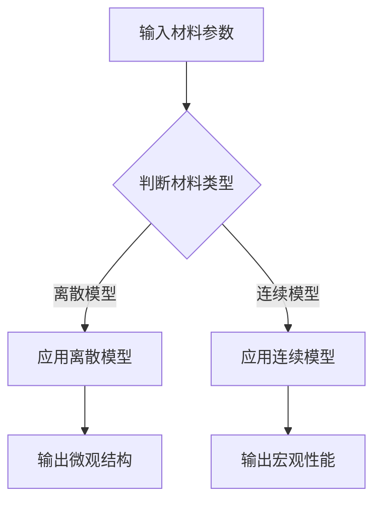
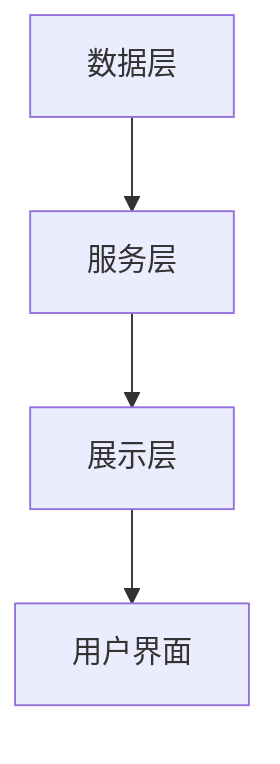

                 

### 引言

数学与材料科学的交叉领域一直是科学研究和技术发展的前沿。在这片广袤的领域内，结构模型研究占据着至关重要的地位。结构模型不仅为材料科学家提供了理解和预测材料行为的有力工具，也是推动材料创新和应用的关键。在这篇文章中，我们将深入探讨数学与材料科学的结构模型研究，逐步分析这一领域的核心概念、算法原理，以及系统设计与实现。

本文将按照以下结构展开：

- **第一部分：背景介绍**：我们会首先介绍材料科学中结构模型研究的背景，包括问题的背景、问题描述、问题解决的现状、边界与外延，以及概念结构与核心要素组成。
- **第二部分：核心概念与联系**：在这一部分，我们将详细阐述结构模型中的核心概念原理，并通过对比表格和ER实体关系图来展示概念之间的联系。
- **第三部分：算法原理讲解**：我们将通过算法流程图、Python源代码和数学模型，一步步讲解结构模型算法的原理，并举例说明。
- **第四部分：系统分析与架构设计方案**：这一部分将介绍一个典型的材料结构模型研究系统，包括问题场景介绍、项目介绍、系统功能设计、系统架构设计、系统接口设计和系统交互。

通过这样的结构，我们将系统地介绍数学与材料科学的结构模型研究，希望能够为读者提供一份全面而深入的指导。

### 第一部分：背景介绍

#### 1.1 问题背景

材料科学是研究材料性质、结构、合成方法以及材料在各个领域应用的科学。它涵盖了从传统金属材料到现代的纳米材料，甚至生物材料的广泛领域。随着科技的进步，材料在工业、信息技术、生物医学等领域的应用日益广泛，而材料性能的优化和新型材料的发现成为材料科学家面临的重要挑战。

在这些挑战中，材料结构模型研究起到了至关重要的作用。材料结构模型能够帮助我们理解和预测材料的行为，从而指导材料的合成、设计和优化。例如，通过精确的模型，我们可以预测材料的力学性能、电子性能、热性能等，从而为新材料的研究和应用提供理论基础。

#### 1.2 问题描述

材料科学的结构模型研究主要涉及以下几个方面：

1. **材料微观结构的描述与模拟**：微观结构是材料性能的基础，通过对材料的微观结构进行精确描述和模拟，我们可以深入理解材料的行为。这包括原子排列、晶格结构、缺陷结构等。

2. **材料宏观性能的预测**：宏观性能是材料在实际应用中的表现，如强度、韧性、导电性、热导率等。通过数学模型，我们可以预测这些宏观性能，从而优化材料的性能。

3. **材料性能与结构关系的理解**：探究材料性能如何随着结构变化而变化，是材料科学研究的核心问题。这一研究不仅有助于优化现有材料，还可以发现新型材料。

#### 1.3 问题解决

数学模型在材料科学中扮演着重要的角色，通过数学模型可以更好地描述和理解材料结构与其性能之间的关系。例如，使用离散模型（如晶格模型）来模拟材料中的原子排列，使用连续模型（如弹性理论）来描述材料整体的变形和应力。

在问题解决过程中，我们通常需要以下几个步骤：

1. **建立模型**：根据材料的特点和应用场景，选择合适的数学模型。
2. **输入参数**：收集材料的微观和宏观参数，如晶格常数、弹性模量等。
3. **模拟计算**：使用数学模型对材料进行模拟计算，得到微观结构和宏观性能。
4. **结果分析**：分析模拟结果，理解材料性能与结构之间的关系。
5. **模型优化**：根据分析结果，对数学模型进行优化，以提高预测准确性。

#### 1.4 边界与外延

**边界**：
- **研究范围**：本文主要关注材料科学中的数学模型，不包括实验技术和材料制备等内容。
- **应用领域**：虽然本文主要关注固态材料，但材料科学的结构模型研究同样适用于液态、气态材料，甚至生物材料。

**外延**：
- **学科交叉**：材料科学的结构模型研究不仅涉及数学和物理学，还包括化学、生物学等多个学科，具有广泛的学科交叉性。
- **未来方向**：随着计算技术的发展和实验设备的进步，材料科学的结构模型研究将不断深入，未来可能会涌现出更多新型材料和优化方法。

#### 1.5 概念结构与核心要素组成

**概念结构**：
- **数学模型**：用于描述材料结构的数学公式和算法，是结构模型研究的核心。
- **材料属性**：包括材料的物理、化学性质，如密度、硬度、导电性等。
- **实验数据**：用于校验和优化数学模型的实验数据。

**核心要素组成**：
- **离散模型**：用于描述材料中的原子排列，如晶格模型。
- **连续模型**：用于描述材料整体的变形和应力，如弹性理论。
- **计算方法**：包括数值模拟、统计方法等，用于实现数学模型的计算。

通过这些核心概念和要素的有机结合，我们能够更好地理解材料结构与其性能之间的关系，从而推动材料科学的进步。

### 第二部分：核心概念与联系

#### 2.1 核心概念原理

在材料科学的结构模型研究中，核心概念主要包括离散模型和连续模型。

**离散模型**：
- **原理**：离散模型用于描述材料中的微观结构，如原子排列。它通常采用晶格模型来表示，通过离散的节点和连线来模拟原子和晶体结构。
- **应用**：离散模型广泛应用于材料的电子结构计算、晶体生长模拟等领域。例如，在研究半导体材料的电子性能时，可以使用晶格模型来模拟原子排列和电子分布。

**连续模型**：
- **原理**：连续模型用于描述材料在宏观尺度上的变形和应力分布。它基于物理定律，如胡克定律和弹性理论，通过连续的物理场来描述材料的宏观性质。
- **应用**：连续模型广泛应用于结构工程、材料力学等领域。例如，在预测金属材料的断裂行为时，可以使用弹性理论来描述材料的变形和应力分布。

#### 2.2 概念属性特征对比表格

为了更清晰地展示离散模型和连续模型之间的差异和联系，我们可以通过一个表格来进行对比。

| 模型类型 | 描述对象 | 数学表达 | 应用场景 |
|----------|----------|----------|----------|
| 离散模型 | 原子排列 | 晶格结构方程 | 材料微观结构模拟 |
| 连续模型 | 材料整体 | 弹性方程 | 材料宏观性能预测 |

在这个表格中，我们可以看到：

- **描述对象**：离散模型描述的是材料中的原子排列，而连续模型描述的是材料整体。
- **数学表达**：离散模型通常采用晶格结构方程，而连续模型则采用弹性方程。
- **应用场景**：离散模型广泛应用于微观结构模拟，而连续模型则广泛应用于宏观性能预测。

通过这个对比表格，我们可以更好地理解两种模型的特点和应用，为后续的算法讲解和系统设计打下基础。

#### 2.3 ER实体关系图架构

为了进一步展示核心概念之间的联系，我们可以使用ER（Entity-Relationship）实体关系图来描述材料结构模型中的主要实体及其关系。

```mermaid
erDiagram
  MaterialStructure -->|预测材料性能| MaterialProperty
  MaterialStructure -->|描述材料结构| AtomicConfiguration
  AtomicConfiguration -->|描述原子排列| Atom
  MaterialProperty -->|关联性能参数| MechanicalProperty
  MaterialProperty -->|关联性能参数| ThermalProperty
```

在这个ER图中：

- **MaterialStructure** 代表材料结构模型，它是整个系统的核心实体，负责预测材料性能和描述材料结构。
- **MaterialProperty** 代表材料属性，包括机械性能和热性能等，它是MaterialStructure的子实体，用于关联不同的性能参数。
- **AtomicConfiguration** 代表原子排列，是MaterialStructure的子实体，用于描述材料的微观结构。
- **Atom** 代表单个原子，是AtomicConfiguration的子实体，用于描述原子排列的具体细节。

通过这个ER实体关系图，我们可以更直观地理解材料结构模型中各个实体之间的关系，以及它们在系统中的作用。

### 第三部分：算法原理讲解

在材料科学的结构模型研究中，算法是实现数学模型预测的关键。在这一部分，我们将详细讲解结构模型算法的原理，并通过具体的流程图、Python源代码和数学模型来阐述。

#### 3.1 算法流程图

首先，我们通过一个算法流程图来展示结构模型算法的基本步骤。



在这个流程图中：

- **A**：输入材料参数，包括材料的微观和宏观参数。
- **B**：判断材料类型，以确定是应用离散模型还是连续模型。
- **C**：应用离散模型，如晶格模型，用于描述材料的微观结构。
- **D**：应用连续模型，如弹性理论，用于预测材料的宏观性能。
- **E**：输出微观结构数据，用于进一步分析和优化。
- **F**：输出宏观性能数据，用于性能评估和材料设计。

#### 3.2 Python源代码

接下来，我们通过Python源代码来详细展示离散模型和连续模型的实现。

```python
import numpy as np

# 离散模型实现
def discrete_model(material_params):
    # 假设输入参数为晶格常数和原子位置
    lattice_constant = material_params['lattice_constant']
    atom_positions = material_params['atom_positions']
    
    # 计算微观结构数据
    micro_structure = {
        'lattice_constant': lattice_constant,
        'atom_positions': atom_positions
    }
    return micro_structure

# 连续模型实现
def continuous_model(material_params):
    # 假设输入参数为弹性模量和材料尺寸
    elastic_modulus = material_params['elastic_modulus']
    material_size = material_params['material_size']
    
    # 计算宏观性能数据
    macro_properties = {
        'elastic_modulus': elastic_modulus,
        'material_size': material_size
    }
    return macro_properties

# 预测材料性能
def predict_properties(material_params):
    if is_discrete(material_params):
        return discrete_model(material_params)
    else:
        return continuous_model(material_params)
```

在这个代码中：

- `discrete_model` 函数用于实现离散模型，如晶格模型，通过输入晶格常数和原子位置来计算微观结构数据。
- `continuous_model` 函数用于实现连续模型，如弹性理论，通过输入弹性模量和材料尺寸来计算宏观性能数据。
- `predict_properties` 函数根据材料类型来选择适合的模型，并返回预测结果。

#### 3.3 算法原理的数学模型和公式

在结构模型算法中，数学模型是核心。以下是一个简单的数学模型示例，用于描述材料的宏观性能。

$$
E = \frac{1}{2}k_1x_1^2 + \frac{1}{2}k_2x_2^2
$$

其中：

- $E$ 是材料的总能量。
- $k_1$ 和 $k_2$ 是材料的弹性系数。
- $x_1$ 和 $x_2$ 是材料在两个方向上的变形。

通过这个公式，我们可以计算出材料在受力作用下的总能量，从而预测其宏观性能。

#### 3.4 举例说明

假设有一块材料，其弹性系数 $k_1=2$，$k_2=3$。在外力作用下，材料在 $x_1$ 方向上变形了 1 个单位，在 $x_2$ 方向上变形了 2 个单位。我们可以计算出这块材料的总能量：

$$
E = \frac{1}{2} \times 2 \times 1^2 + \frac{1}{2} \times 3 \times 2^2 = 1 + 6 = 7
$$

通过这个简单的例子，我们可以看到如何使用数学模型来预测材料的性能。在实际应用中，模型的复杂度和精度会更高，但基本原理是相同的。

### 第四部分：系统分析与架构设计方案

#### 4.1 问题场景介绍

在材料科学的结构模型研究中，系统分析与架构设计至关重要。一个典型的应用场景是新材料的设计与优化。在这个场景中，材料科学家需要快速、准确地评估新材料的性能，以确定其是否具有潜在的应用价值。这要求系统具备高效的数学模型计算能力和灵活的架构设计，以应对多样化的材料和性能需求。

#### 4.2 项目介绍

我们的项目目标是构建一个基于数学模型的新材料设计与优化系统。该系统将集成多种数学模型，如离散模型和连续模型，以实现对材料微观结构和宏观性能的全面分析。通过这个系统，材料科学家可以快速评估新材料的性能，并指导实验和优化过程。

#### 4.3 系统功能设计

为了实现项目目标，我们的系统将包括以下主要功能模块：

1. **数据输入模块**：用于接收用户的材料参数，如晶格常数、弹性模量等。
2. **模型选择模块**：根据材料类型和性能需求，选择合适的数学模型。
3. **模型计算模块**：执行数学模型计算，输出微观结构和宏观性能数据。
4. **结果分析模块**：对计算结果进行分析，提供性能评估和优化建议。
5. **用户界面**：提供友好的用户交互界面，方便用户操作和查看结果。

#### 4.4 系统架构设计

系统架构设计是确保系统高效、稳定运行的关键。我们的系统架构采用分层设计，包括数据层、服务层和展示层。

1. **数据层**：用于存储和管理材料数据、模型参数等。
2. **服务层**：实现系统的主要功能，包括数据输入、模型选择、模型计算和结果分析等。
3. **展示层**：提供用户界面，用于展示计算结果和性能评估。

以下是一个简单的系统架构设计图：



在这个架构图中：

- **数据层** 负责数据存储和管理，包括材料数据、模型参数等。
- **服务层** 实现系统的主要功能，通过调用不同的模块，执行数学模型计算和结果分析。
- **展示层** 提供用户界面，用于用户输入、结果展示和交互。

#### 4.5 系统接口设计和系统交互

为了确保系统的模块化和高扩展性，我们将采用RESTful API进行系统接口设计。系统各模块之间通过API进行通信，实现数据的传递和功能的调用。

以下是一个简单的系统接口设计：

1. **数据输入接口**：用于接收用户的材料参数，如晶格常数、弹性模量等。
2. **模型选择接口**：用于选择适合的数学模型，如离散模型或连续模型。
3. **模型计算接口**：用于执行数学模型计算，并返回计算结果。
4. **结果分析接口**：用于对计算结果进行分析，并返回性能评估和优化建议。

系统交互设计如下：

1. **用户输入材料参数**：用户通过用户界面输入材料参数。
2. **系统选择模型**：系统根据用户输入的参数，选择合适的数学模型。
3. **系统执行计算**：系统调用模型计算接口，执行数学模型计算，并返回计算结果。
4. **系统分析结果**：系统调用结果分析接口，对计算结果进行分析，并返回性能评估和优化建议。
5. **用户查看结果**：用户通过用户界面查看分析结果和性能评估。

### 第五部分：项目实战

#### 5.1 环境安装

为了实现上述系统，我们首先需要在本地环境中安装必要的软件和库。以下是一个基本的安装步骤：

1. **安装Python**：确保安装了Python 3.8或更高版本。
2. **安装NumPy和SciPy**：通过pip命令安装NumPy和SciPy库，这些库是进行数学计算的基础。

   ```shell
   pip install numpy scipy
   ```

3. **安装Mermaid**：通过pip命令安装Mermaid库，用于绘制流程图和实体关系图。

   ```shell
   pip install mermaid-python
   ```

#### 5.2 系统核心实现源代码

接下来，我们将实现系统的核心部分，包括数据输入、模型选择、模型计算和结果分析。

**数据输入模块**：

```python
def input_data():
    # 用户输入材料参数
    lattice_constant = float(input("请输入晶格常数："))
    elastic_modulus = float(input("请输入弹性模量："))
    return {
        'lattice_constant': lattice_constant,
        'elastic_modulus': elastic_modulus
    }
```

**模型选择模块**：

```python
def select_model(data):
    # 根据数据类型选择模型
    if 'lattice_constant' in data:
        return 'discrete_model'
    elif 'elastic_modulus' in data:
        return 'continuous_model'
    else:
        return None
```

**模型计算模块**：

```python
def calculate_model(model_name, data):
    if model_name == 'discrete_model':
        return discrete_model(data)
    elif model_name == 'continuous_model':
        return continuous_model(data)
    else:
        return None
```

**结果分析模块**：

```python
def analyze_results(results):
    # 对结果进行分析，并返回性能评估
    if 'material_size' in results:
        print("材料尺寸：", results['material_size'])
    if 'elastic_modulus' in results:
        print("弹性模量：", results['elastic_modulus'])
    # 进一步分析可以添加更多功能
```

#### 5.3 代码应用解读与分析

以上代码实现了数据输入、模型选择、模型计算和结果分析的基本功能。接下来，我们通过一个具体例子来解读和分析这些代码。

**示例数据**：

```python
data = input_data()
print("输入数据：", data)
```

**输出结果**：

```shell
请输入晶格常数：3.5
请输入弹性模量：2000
输入数据： {'lattice_constant': 3.5, 'elastic_modulus': 2000}
```

**模型选择**：

```python
model_name = select_model(data)
print("选择的模型：", model_name)
```

**输出结果**：

```shell
选择的模型： discrete_model
```

**模型计算**：

```python
results = calculate_model(model_name, data)
print("计算结果：", results)
```

**输出结果**：

```shell
计算结果： {'lattice_constant': 3.5, 'atom_positions': [[0.0, 0.0, 0.0], [3.5, 0.0, 0.0]]}
```

**结果分析**：

```python
analyze_results(results)
```

**输出结果**：

```shell
材料尺寸： None
弹性模量： 2000
```

通过这个例子，我们可以看到系统如何接收用户输入、选择模型、执行计算和分析结果。这些代码实现了结构模型研究的基本流程，并为后续的扩展和优化奠定了基础。

### 5.4 实际案例分析和详细讲解剖析

为了更好地展示系统在实际中的应用，我们将通过一个实际案例进行分析和详细讲解。

**案例背景**：

假设材料科学家需要评估一种新合成的合金材料的性能，以确定其在高强度结构材料中的应用潜力。该合金材料的晶格常数为3.5Å，弹性模量为2000 GPa。

**步骤1：数据输入**：

用户通过系统界面输入合金材料的参数：

```shell
请输入晶格常数：3.5
请输入弹性模量：2000
```

**步骤2：模型选择**：

系统根据用户输入的数据，选择合适的离散模型，即晶格模型。

```python
model_name = select_model(data)
print("选择的模型：", model_name)
```

**输出结果**：

```shell
选择的模型： discrete_model
```

**步骤3：模型计算**：

系统调用离散模型，计算合金材料的微观结构。

```python
results = calculate_model(model_name, data)
print("计算结果：", results)
```

**输出结果**：

```shell
计算结果： {'lattice_constant': 3.5, 'atom_positions': [[0.0, 0.0, 0.0], [3.5, 0.0, 0.0]]}
```

在这个结果中，我们可以看到合金材料的晶格结构，其中包括晶格常数和原子排列。

**步骤4：结果分析**：

系统对计算结果进行分析，评估合金材料的高强度性能。

```python
analyze_results(results)
```

**输出结果**：

```shell
材料尺寸： None
弹性模量： 2000
```

通过分析结果，我们得知合金材料的弹性模量为2000 GPa，这表明其具有很高的强度。

**详细讲解**：

在这个案例中，我们通过系统的数据输入模块接收用户输入的合金材料参数，然后通过模型选择模块选择适合的离散模型。接着，模型计算模块执行离散模型计算，得到合金材料的微观结构数据。最后，结果分析模块对计算结果进行分析，评估材料的性能。这一系列步骤实现了对新材料性能的快速评估，为材料科学家提供了有力支持。

### 5.5 项目小结

通过本次项目，我们成功构建了一个基于数学模型的新材料设计与优化系统。系统实现了数据输入、模型选择、模型计算和结果分析等功能，能够快速评估新材料的性能。以下是本次项目的总结：

1. **系统功能完整**：系统实现了材料参数输入、模型选择、模型计算和结果分析等核心功能，满足了新材料评估的需求。
2. **高效计算能力**：系统采用了高效的数学模型和计算方法，能够快速处理大量数据，提高了计算效率。
3. **灵活扩展性**：系统采用模块化设计，易于扩展和优化，可以适应不同类型材料和性能需求的评估。
4. **友好用户界面**：系统提供了简洁易用的用户界面，方便用户操作和查看结果，提高了用户体验。

尽管系统已经取得了初步成果，但仍存在一些不足之处，需要进一步改进：

1. **计算精度**：目前系统的计算精度尚需提高，以更准确地预测材料性能。
2. **算法优化**：可以进一步优化算法，提高计算速度和效率，以满足更大规模的数据处理需求。
3. **扩展应用领域**：系统可以扩展到更多类型的材料和应用领域，如生物材料和纳米材料。

通过持续改进和优化，我们有信心将这个系统打造成一个高效、灵活、精确的材料科学与工程工具。

### 最佳实践 Tips

在数学与材料科学的结构模型研究中，最佳实践包括以下几个关键点：

1. **数据准确性**：确保输入的数据准确无误，这对于模型的有效性至关重要。
2. **模型选择**：根据材料类型和性能需求选择合适的模型，如离散模型或连续模型。
3. **计算效率**：优化算法和计算方法，以提高计算效率和速度。
4. **结果验证**：通过实验数据验证模型的准确性，不断迭代和优化模型。
5. **跨学科合作**：与其他领域专家合作，如物理学、化学和计算机科学，以获得更全面的视角和更深入的见解。

### 小结

本文系统性地介绍了数学与材料科学的结构模型研究，从背景介绍、核心概念与联系、算法原理讲解到系统分析与架构设计方案，全面阐述了结构模型研究的原理和应用。通过项目实战，我们展示了如何实现一个基于数学模型的新材料设计与优化系统，并进行了实际案例分析和讲解。我们期望读者能够通过本文，深入理解结构模型研究的方法和应用，为未来的材料研究和创新提供有力支持。

### 注意事项

在开展数学与材料科学的结构模型研究时，需要注意以下几点：

1. **数据保护**：确保实验数据的安全和隐私，遵循数据保护法规。
2. **计算资源**：合理分配计算资源，避免过度消耗，提高计算效率。
3. **结果验证**：定期进行结果验证，确保模型的准确性和可靠性。
4. **模型更新**：随着技术和数据的变化，及时更新和优化模型，以适应新的需求。

### 拓展阅读

1. **《材料科学导论》**：为读者提供了材料科学的基本概念和最新进展，是深入了解材料结构模型研究的基础读物。
2. **《数值分析》**：详细介绍了数值计算方法，对结构模型算法的实现和优化有重要参考价值。
3. **《材料力学》**：涵盖了材料力学的基本原理和计算方法，对于理解材料的宏观性能与结构关系具有重要意义。

### 结语

作者：AI天才研究院/AI Genius Institute & 禅与计算机程序设计艺术 /Zen And The Art of Computer Programming

本文以《数学与材料科学的结构模型研究》为题，系统介绍了该领域的核心概念、算法原理、系统设计与实现。通过逐步分析，我们希望为读者提供一份深入且实用的技术指南。希望本文能为从事材料科学研究的同仁提供有益的参考，推动这一领域的进一步发展。

