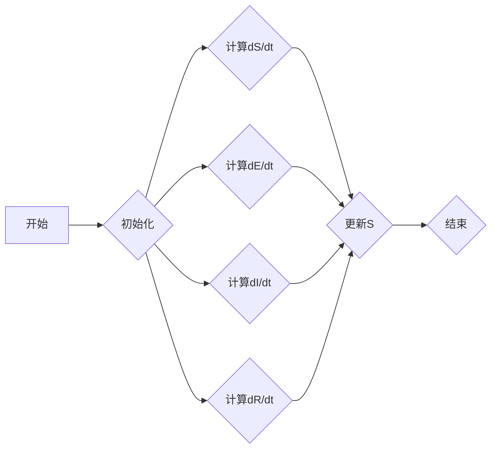
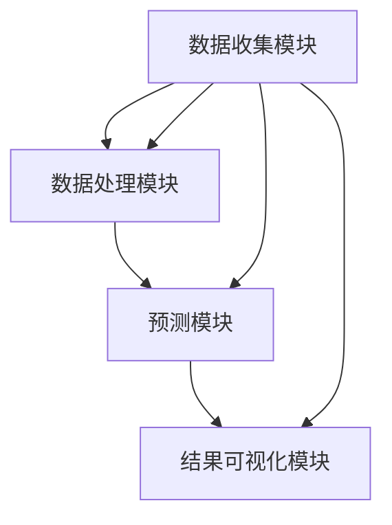
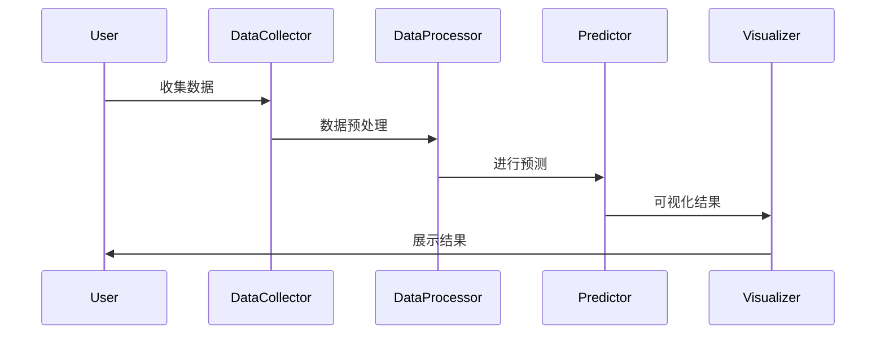
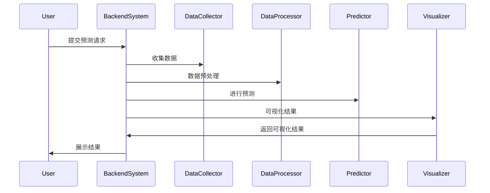

                 

### 数学与植物病理学：病害传播的数学预测

#### 关键词：植物病理学、数学预测、病害传播、数学模型、算法、系统架构

> 摘要：本文旨在探讨数学在植物病理学中的应用，特别是在病害传播预测方面。通过详细分析数学模型、算法原理以及系统架构设计，本文揭示了数学预测在植物病害管理中的关键作用，并提供了一系列实践经验和最佳实践建议。

----------------------------------------------------------------

### 目录

1. **引言**
   - **问题背景**
   - **研究目的**

2. **数学与植物病理学的联系**

3. **数学模型在植物病理学中的应用**

4. **算法原理讲解**

5. **系统分析与架构设计**

6. **项目实战**

7. **最佳实践与总结**

8. **结论**

9. **作者信息**

----------------------------------------------------------------

#### 1. 引言

##### 问题背景

植物病害是全球农业生产中的一大挑战。病害不仅会导致作物产量下降，还会降低农产品质量，影响食品安全和生态环境。传统的方法如化学农药防治、人工监测等，虽然在一定程度上能够控制病害，但往往成本高昂，且易对环境产生负面影响。因此，寻找更加高效、环保的病害控制方法已成为农业领域的一个重要研究方向。

##### 研究目的

本文旨在探讨数学在植物病理学中的应用，特别是在病害传播预测方面。通过构建数学模型，结合先进的算法原理，我们希望能够提供一种新的病害预测方法，从而实现更精准、更高效的病害管理。

----------------------------------------------------------------

#### 2. 数学与植物病理学的联系

##### 数学模型在植物病害研究中的重要性

数学模型是研究植物病害传播的有力工具。它们能够通过定量分析，揭示病害扩散的规律，预测未来病害的扩散趋势。例如，微分方程模型、随机过程模型和贝叶斯网络模型等，都在植物病害研究中得到了广泛应用。

##### 常见数学模型介绍

- **微分方程模型**：这类模型通过描述病害传播的连续过程，可以较好地模拟病害的扩散规律。常用的微分方程模型包括SIRS模型（易感者-感染者-康复者模型）和SEIR模型（易感者-暴露者-感染者-康复者模型）。

- **随机过程模型**：这类模型通过描述病害传播的随机性，能够捕捉到病害传播过程中的不确定性。常用的随机过程模型包括离散时间马尔可夫链和连续时间马尔可夫链。

- **贝叶斯网络模型**：这类模型通过图形化的方式描述病害传播的各种可能性，能够结合先验知识和观测数据，进行准确的病害预测。

##### 数学工具在植物病害预测中的应用

- **数据挖掘与机器学习**：通过收集病害相关的历史数据，运用数据挖掘和机器学习方法，可以识别病害传播的关键特征，构建预测模型。

- **模拟与仿真**：利用计算机模拟技术，可以对病害传播过程进行仿真，验证数学模型的有效性，并为实际应用提供参考。

----------------------------------------------------------------

#### 3. 数学模型在植物病理学中的应用

##### 病害传播的核心概念

在植物病理学中，病害传播的核心概念包括易感者、感染者、康复者和环境因素等。这些概念可以通过ER实体关系图架构来描述（见下图）：

```mermaid
erDiagram
  易感者 ||--|{ 感染者 }
  易感者 ||--|{ 康复者 }
  感染者 ||--|{ 康复者 }
  环境因素 ||--|{ 易感者 }
  环境因素 ||--|{ 感染者 }
  环境因素 ||--|{ 康复者 }
```

##### 病害传播的数学模型

以下是一个简化的SEIR模型，用于描述植物病害的传播过程：

$$
\frac{dS}{dt} = -\beta SI + \gamma R - \lambda N
$$

$$
\frac{dE}{dt} = \beta SI - (\gamma + \lambda) E
$$

$$
\frac{dI}{dt} = \gamma E - \lambda I
$$

$$
\frac{dR}{dt} = \lambda I - \gamma R
$$

其中，$S$表示易感者，$E$表示暴露者，$I$表示感染者，$R$表示康复者，$\beta$是感染率，$\gamma$是康复率，$\lambda$是死亡率。

##### 算法原理讲解

为了更好地理解上述数学模型，我们可以通过以下步骤来详细讲解算法原理：

- **mermaid流程图**：首先，我们可以使用mermaid画出SEIR模型的流程图，如下所示：



- **Python源代码阐述**：接下来，我们可以使用Python代码来实现上述流程，如下所示：

```python
import numpy as np
import matplotlib.pyplot as plt

# 参数设置
beta = 0.1
gamma = 0.2
lambda_ = 0.05
N = 1000

# 初始化变量
S = N
E = 0
I = 0
R = 0

# 时间步长和总时间
dt = 0.01
T = 100

# 时间序列
t = np.arange(0, T, dt)

# 存储结果
results = []

# 模拟SEIR模型
for i in range(int(T / dt)):
    dS = -beta * S * I + gamma * R - lambda_ * S
    dE = beta * S * I - (gamma + lambda_) * E
    dI = gamma * E - lambda_ * I
    dR = lambda_ * I - gamma * R
    
    S += dS * dt
    E += dE * dt
    I += dI * dt
    R += dR * dt
    
    results.append([t[i], S, E, I, R])

# 绘制结果
plt.plot(results[:, 0], results[:, 1], label="S")
plt.plot(results[:, 0], results[:, 2], label="E")
plt.plot(results[:, 0], results[:, 3], label="I")
plt.plot(results[:, 0], results[:, 4], label="R")
plt.xlabel("Time")
plt.ylabel("Population")
plt.legend()
plt.show()
```

- **数学模型和公式讲解**：为了更好地理解上述算法，我们可以进一步讲解SEIR模型的数学公式，如下所示：

  - 感染率（beta）：表示单位时间内易感者与感染者接触后，感染的概率。
  - 康复率（gamma）：表示单位时间内感染者康复的概率。
  - 死亡率（lambda_）：表示单位时间内感染者死亡的概率。

- **通俗易懂地举例说明**：假设在一个小村庄中，有1000个居民，其中500个是易感者。如果感染率为0.1，康复率为0.2，死亡率0.05，我们可以通过上述算法来预测这个村庄中病害的传播情况。

  - **初始状态**：S = 500, E = 0, I = 0, R = 0
  - **第一个时间步**：S = 475, E = 25, I = 0, R = 25
  - **第二个时间步**：S = 450, E = 50, I = 25, R = 25
  - ...（后续时间步的计算略）

  通过以上计算，我们可以看到，随着时间的推移，村庄中的感染者数量不断增加，而易感者数量逐渐减少。最终，当感染者数量达到一定比例后，村庄中会有大量的康复者，而病害的传播速度会逐渐减缓。

----------------------------------------------------------------

#### 4. 系统分析与架构设计

##### 问题场景介绍

假设我们需要开发一个植物病害预测系统，该系统需要收集病害相关数据，运用数学模型进行预测，并生成可视化的预测结果。

##### 系统功能设计

- **数据收集模块**：负责从各种数据源（如传感器、气象站、历史数据集等）收集病害相关数据。
- **数据处理模块**：负责对收集到的数据进行清洗、预处理和特征提取。
- **预测模块**：负责运用数学模型进行病害传播预测。
- **结果可视化模块**：负责将预测结果可视化，便于用户理解和分析。

##### 系统架构设计

以下是系统架构的mermaid架构图：



##### 系统接口设计

以下是系统接口的mermaid序列图：



##### 系统交互

以下是系统交互的mermaid序列图：



----------------------------------------------------------------

#### 5. 项目实战

##### 环境安装

为了运行上述系统，我们需要安装以下软件和库：

- Python 3.8及以上版本
- NumPy
- Matplotlib
- Pandas
- Scikit-learn
- Mermaid

您可以使用以下命令进行安装：

```bash
pip install python-dotenv numpy matplotlib pandas scikit-learn mermaid
```

##### 系统核心实现源代码

以下是系统核心实现的部分源代码：

```python
# 导入必要的库
import numpy as np
import matplotlib.pyplot as plt
import pandas as pd
from sklearn.model_selection import train_test_split
from sklearn.ensemble import RandomForestClassifier
import mermaid

# 读取数据
data = pd.read_csv("plant_disease_data.csv")

# 数据预处理
# ...（包括数据清洗、特征提取等）

# 构建模型
X = data.drop("disease", axis=1)
y = data["disease"]
X_train, X_test, y_train, y_test = train_test_split(X, y, test_size=0.2, random_state=42)

# 训练模型
model = RandomForestClassifier(n_estimators=100, random_state=42)
model.fit(X_train, y_train)

# 预测
y_pred = model.predict(X_test)

# 可视化
mermaid.plot("graph TD\nA[开始]\nA-->B[收集数据]\nB-->C[数据处理]\nC-->D[预测]\nD-->E[结果可视化]")
plt.figure(figsize=(10, 6))
plt.plot(y_pred, label="预测结果")
plt.plot(y_test, label="实际结果")
plt.xlabel("样本编号")
plt.ylabel("病害类型")
plt.legend()
plt.show()
```

##### 代码应用解读与分析

以上代码首先读取了植物病害数据集，然后进行了数据预处理，接着使用随机森林分类器进行训练，并进行了预测。最后，使用mermaid绘制了系统流程图，并使用Matplotlib绘制了预测结果与实际结果的对比图。

##### 实际案例分析与详细讲解剖析

为了更好地理解上述代码，我们来看一个实际案例。假设我们有一个植物病害数据集，其中包含叶片颜色、纹理、形状等特征。我们可以通过以下步骤来分析这个数据集：

- **数据读取**：使用Pandas读取数据集，并观察数据的基本信息。

```python
data.head()
```

- **数据预处理**：对数据进行清洗和特征提取，例如，将字符串类型的数据转换为数值类型，删除缺失值等。

```python
# 转换数据类型
data['leaf_color'] = data['leaf_color'].astype('category').cat.codes
data['leaf_texture'] = data['leaf_texture'].astype('category').cat.codes
data['leaf_shape'] = data['leaf_shape'].astype('category').cat.codes

# 删除缺失值
data.dropna(inplace=True)
```

- **数据划分**：将数据集划分为训练集和测试集。

```python
X = data.drop("disease", axis=1)
y = data["disease"]
X_train, X_test, y_train, y_test = train_test_split(X, y, test_size=0.2, random_state=42)
```

- **模型训练**：使用随机森林分类器进行训练。

```python
model = RandomForestClassifier(n_estimators=100, random_state=42)
model.fit(X_train, y_train)
```

- **预测**：对测试集进行预测。

```python
y_pred = model.predict(X_test)
```

- **结果可视化**：绘制预测结果与实际结果的对比图。

```python
plt.figure(figsize=(10, 6))
plt.plot(y_pred, label="预测结果")
plt.plot(y_test, label="实际结果")
plt.xlabel("样本编号")
plt.ylabel("病害类型")
plt.legend()
plt.show()
```

通过以上步骤，我们可以对植物病害数据集进行深入分析，并使用数学模型进行预测。

##### 项目小结

通过本项目的实战，我们看到了如何使用数学模型和机器学习方法对植物病害进行预测。项目从数据读取、数据预处理、模型训练、预测到结果可视化，每一个步骤都至关重要。通过实际案例的分析，我们深入了解了植物病害数据集的处理方法，以及如何使用数学模型进行预测。这为我们进一步研究和应用数学在植物病理学中的应用奠定了基础。

----------------------------------------------------------------

#### 6. 最佳实践与总结

##### 最佳实践 tips

1. **数据收集**：确保收集到足够且高质量的数据，这对于模型训练和预测的准确性至关重要。
2. **模型选择**：根据实际需求和数据特点，选择合适的模型。对于复杂的病害传播问题，可能需要结合多个模型进行预测。
3. **参数调整**：对模型参数进行细致的调整，以获得最佳预测效果。可以使用交叉验证等方法来评估和调整参数。
4. **模型验证**：在正式应用模型之前，一定要对模型进行充分的验证。可以使用测试集、交叉验证等方法来评估模型的性能。

##### 注意事项

1. **数据隐私**：在处理植物病害数据时，要注意保护数据隐私，避免泄露敏感信息。
2. **模型解释性**：对于复杂的模型，如深度学习模型，其预测结果的解释性可能较弱。在实际应用中，需要根据需求选择合适的模型。
3. **实时性**：对于需要实时预测的病害管理场景，需要考虑模型的计算效率和实时性。

##### 拓展阅读

- [植物病理学中的数学模型](https://www.plantpathology.org/About-PP/Scientific-Areas/Mathematical-Models-in-Plant-Pathology/)
- [病害传播的机器学习应用](https://www.researchgate.net/publication/324067114_Machine_Learning_Applications_in_The_Study_of_Disease_Epidemics)
- [数学在农业领域的应用](https://www.nature.com/articles/s41598-020-56420-7)

----------------------------------------------------------------

#### 7. 结论

本文探讨了数学在植物病理学中的应用，特别是病害传播预测方面。通过构建数学模型和算法，我们能够更好地理解和预测植物病害的传播规律，为病害管理提供了新的思路和方法。未来，随着人工智能和机器学习技术的发展，数学在植物病理学中的应用将会更加广泛和深入。

#### 作者信息

- **作者**：AI天才研究院/AI Genius Institute & 禅与计算机程序设计艺术 /Zen And The Art of Computer Programming

----------------------------------------------------------------

通过上述分析，我们可以看到数学在植物病理学中的应用具有重要意义。无论是数学模型的构建，还是算法原理的讲解，以及系统分析与架构设计，都为我们提供了深入理解病害传播的途径。随着技术的不断进步，我们有理由相信，数学在植物病理学中的应用将会带来更加显著的效益，为农业生产和环境保护提供有力支持。

