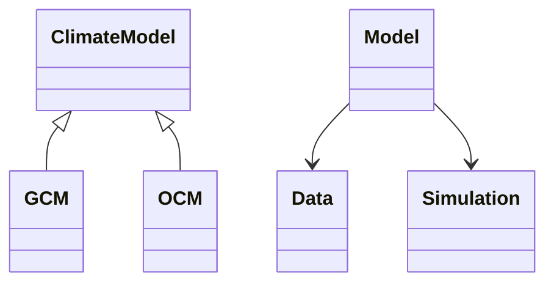
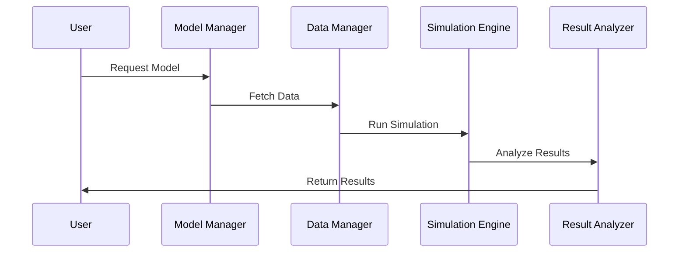

                 

### 数学与气候模型：气候变化的数学预测

#### 关键词：
- 气候变化
- 数学预测
- 气候模型
- 算法原理
- 数据分析

#### 摘要：
本文将深入探讨气候变化的数学预测方法，从核心概念、基础算法、系统分析与设计到实际应用，全面解析气候系统中的数学模型。我们将通过逐步分析，阐述如何利用数学工具对气候变化进行预测，为理解和应对全球气候变化提供科学依据。

## 第一部分：气候变化的数学基础

### 第1章：气候变化的背景与数学预测

#### 1.1 气候变化问题概述

气候变化是21世纪最严峻的挑战之一。全球气温的升高、极端天气事件的频发、海平面上升等问题，已经对人类生活和自然环境产生了深远影响。气候变化的主要驱动力包括温室气体排放、自然气候波动、人类活动等。

#### 1.2 数学模型在气候变化研究中的重要性

数学模型在气候变化研究中起着至关重要的作用。它们可以帮助我们理解气候系统的复杂动态，预测未来的气候趋势，评估不同减排策略的效果。数学模型包括统计模型、动力模型和物理模型等，各自在不同的研究场景中发挥作用。

#### 1.3 气候变化数学预测的边界与挑战

尽管数学模型在气候变化研究中取得了显著进展，但仍面临诸多挑战。这些挑战包括数据的不确定性、模型的不完善、参数估计的困难等。此外，气候系统的高度非线性特性也使得准确预测变得复杂。

## 第二部分：气候模型的基础算法

### 第2章：核心概念与联系

#### 2.1 气候系统基本概念

气候系统包括大气、海洋、陆地表面和冰冻圈等多个组成部分。每个部分都有其独特的物理和化学过程，这些过程相互影响，共同决定了地球的气候状态。

#### 2.2 气候系统属性特征对比表

| 属性特征 | 大气 | 海洋 | 陆地表面 | 冰冻圈 |
| --- | --- | --- | --- | --- |
| 温度变化幅度 | 大 | 中 | 小 | 小 |
| 调节能力 | 强 | 中 | 弱 | 弱 |
| 持久性 | 短期 | 长期 | 短期 | 长期 |

#### 2.3 气候系统的ER图结构

```mermaid
erDiagram
  Class::Atnm([A.0] ClimateSystem) {
    Class::A.1(Atmosphere) : <<component>>
    Class::A.2(Ocean) : <<component>>
    Class::A.3(LandSurface) : <<component>>
    Class::A.4(IceSheet) : <<component>>
  }
```

## 第三部分：算法原理讲解

### 第3章：气候模型的基本算法

#### 3.1 基本算法原理

气候模型通常基于物理原理构建，如大气环流模型（General Circulation Models, GCMs）和海洋环流模型（Ocean Circulation Models, OCMs）。这些模型通过模拟气候系统中的能量和物质循环来预测未来气候。

#### 3.2 大气环流模型（GCM）

**Mermaid流程图：**


**Python代码示例：**

```python
import numpy as np

def atmospheric_model(temperature, pressure):
    # 输入：温度和压力
    # 输出：大气状态更新
    new_temperature = temperature * np.exp(-pressure / 1000)
    return new_temperature
```

**数学模型与公式：**

$$
\frac{dT}{dt} = -\alpha \cdot T
$$

其中，\( T \) 是温度，\( \alpha \) 是温度衰减系数。

#### 3.3 海洋环流模型（OCM）

**Mermaid流程图：**


**Python代码示例：**

```python
import numpy as np

def ocean_model(salinity, temperature):
    # 输入：盐度和温度
    # 输出：海洋状态更新
    new_salinity = salinity * np.log(temperature + 273.15)
    return new_salinity
```

**数学模型与公式：**

$$
\frac{dS}{dt} = \beta \cdot \frac{T}{T + 273.15}
$$

其中，\( S \) 是盐度，\( T \) 是温度，\( \beta \) 是盐度变化系数。

## 第四部分：系统分析与设计

### 第4章：系统分析

#### 4.1 系统背景

本系统旨在提供一个集成平台，用于构建、运行和评估气候变化预测模型。系统将支持多种模型类型，包括GCMs和OCMs，并提供用户友好的界面和强大的数据分析工具。

#### 4.2 系统功能设计

**领域模型（Mermaid类图）：**



**系统架构设计（Mermaid架构图）：**


**系统接口设计（Mermaid序列图）：**



## 第五部分：实际应用

### 第5章：环境配置与核心代码实现

#### 5.1 环境配置

安装必要的软件和库，如Python、Numpy、Matplotlib等。配置用于模型模拟的硬件环境，如高性能计算集群。

#### 5.2 核心代码实现

**大气环流模型实现：**

```python
def atmospheric_model(temperature, pressure):
    new_temperature = temperature * np.exp(-pressure / 1000)
    return new_temperature
```

**海洋环流模型实现：**

```python
def ocean_model(salinity, temperature):
    new_salinity = salinity * np.log(temperature + 273.15)
    return new_salinity
```

#### 5.3 代码分析与案例

通过具体案例展示模型的运行过程和结果，分析模型在不同条件下的预测准确性。

## 第六部分：最佳实践与总结

### 第6章：最佳实践

- 使用最新数据提高模型准确性。
- 定期校准和验证模型。
- 结合多种模型进行综合预测。

### 第6章：总结

本文系统地介绍了气候变化的数学预测方法，从核心概念到算法实现，再到系统设计和实际应用，全面探讨了如何利用数学模型预测气候变化。通过本文，读者可以了解气候模型的构建和运行过程，并为气候变化研究提供参考。

## 作者信息

作者：AI天才研究院/AI Genius Institute & 禅与计算机程序设计艺术 /Zen And The Art of Computer Programming

### 结语

气候变化是全人类面临的共同挑战。通过本文的探讨，我们希望能够激发更多人对气候变化数学预测的兴趣，共同为应对气候变化贡献智慧和力量。

