                 

### 文章标题

# 数学与物理学的对称性原理

> 关键词：对称性、数学、物理学、核心概念、应用、现代物理

> 摘要：本文旨在深入探讨数学与物理学中的对称性原理，通过分析其核心概念、发展历史以及具体应用，揭示对称性在科学中的关键作用。本文将按部就班地展开论述，从基础概念讲起，逐步深入到对称性的数学模型、现代物理学中的对称性原理及其在数学中的应用，最终展望未来研究方向。通过这篇系统的分析，读者将全面理解对称性原理在科学研究和实际应用中的重要性和深远影响。

### 引言

对称性（Symmetry）是自然界和人类文明中一个普遍存在的概念，无论是自然界中的生物形态，还是人类艺术创作中的审美标准，对称性都占据了重要的地位。在科学领域，对称性更是数学和物理学中的重要原则，贯穿于多个理论和现象的解析之中。

在数学中，对称性指的是某些性质在几何变换或函数变换下保持不变的特征。数学家通过对称性原理，发现了许多优美的数学结构，如对称群、对称多项式等，这些结构不仅在数学理论研究中具有重要意义，还广泛应用于物理学和其他科学领域。

物理学中，对称性原理是描述自然现象的基本原则之一。从经典力学到量子力学，对称性在物理学中无处不在。它不仅能够帮助我们理解自然界的规律，还能预测新现象和新物质的存在。例如，能量守恒定律和动量守恒定律都可以看作是对称性原理的具体体现。

本文将系统探讨数学和物理学中的对称性原理，首先介绍对称性的基本概念，然后分别从数学和物理学两个角度深入分析对称性的核心原理、应用以及相互关系。通过本文的讨论，读者将全面理解对称性原理在科学研究和应用中的重要性，并为未来的研究提供新的视角和思考方向。

### 对称性的基本概念

在探讨对称性的基本概念之前，我们需要明确几个核心术语：对称性、对称变换、对称操作和对称元素。

#### 对称性

对称性（Symmetry）通常指的是某一对象或系统在某种变换下保持不变的性质。在几何学中，如果一个图形经过某种变换后与原来的图形重合，那么这个图形就具有对称性。例如，一个正方形无论怎样旋转或翻转，其形状和大小都不会改变，因此它具有多种对称性。

#### 对称变换

对称变换（Symmetry Transformation）是指使一个对象或系统保持其对称性的变换操作。常见的对称变换包括旋转、翻转、反射和平移等。例如，在一个平面内，通过旋转某个角度可以使图形恢复原来的位置，这就是一种旋转对称变换。

#### 对称操作

对称操作（Symmetry Operation）是对称变换的具体实现。在数学和物理学中，对称操作可以是数学变换，如线性变换、射影变换等；也可以是物理操作，如量子态的变换、粒子的对称变换等。

#### 对称元素

对称元素（Symmetry Element）是指能够进行对称操作的点、线或面。例如，在一个正方形中，中心点、对角线和边都可以作为对称元素，通过这些对称元素可以进行旋转或翻转操作，使得正方形保持对称。

#### 对称性的分类

对称性可以按照不同的维度和性质进行分类。以下是几种常见的对称性分类：

1. **点对称性**：图形关于某个点进行翻转后与自身重合。例如，一个五角星具有五个点对称性，每个顶点都是对称中心。
2. **轴对称性**：图形关于某条直线进行翻转后与自身重合。例如，一个矩形具有两条轴对称性，一条是通过中心的水平和垂直线。
3. **旋转对称性**：图形经过某个角度的旋转后与自身重合。例如，一个六边形具有六次旋转对称性，每次旋转60度。
4. **高对称性**：一个对象具有多种对称性，如一个立方体具有多个点对称性、轴对称性和旋转对称性。

#### 对称性的数学表示

在数学中，对称性通常可以用群论（Group Theory）来描述。对称群（Symmetry Group）是所有保持某个对象对称性的变换构成的集合。例如，一个正方形的对称群包括旋转和翻转操作，这些操作共同保持了正方形的对称性。

对称多项式（Symmetric Polynomial）则是另一个重要的数学工具，用于描述具有对称性的多项式。这类多项式的值在变量的任意置换下保持不变。例如，二次多项式 \(x^2 + y^2 + z^2\) 是一个对称多项式，因为无论 \(x, y, z\) 的值如何变化，其结果始终不变。

通过这些基本概念，我们可以更好地理解对称性的本质，并在数学和物理学中应用这些原理，探讨更复杂的对称性现象和其背后的规律。

### 数学中的对称性原理

在数学领域，对称性原理不仅是一种美学标准，更是构建数学结构和推导数学定理的重要工具。通过理解和应用对称性原理，数学家们揭示了诸多优美的数学现象和深刻的数学规律。

#### 对称群（Symmetry Group）

对称群是研究对称性的核心概念之一。一个对称群是由一组保持某个对象对称性的变换组成的集合，这些变换之间满足结合律、单位元和逆元等基本群论性质。常见的对称群包括循环群、交换群、对称群和交错群等。

例如，考虑一个正六边形，它的对称群包含六个元素：三个旋转操作（每次旋转60度、120度和180度）和三个反射操作（通过三条对角线和三条边的垂直平分线）。这个对称群满足结合律，即任意两个对称操作的组合仍然是对称操作，同时存在一个单位元（即不做任何变换的操作）和一个逆元（每个操作都有一个对应的逆操作，使得组合后的效果回到初始状态）。

#### 对称多项式（Symmetric Polynomial）

对称多项式是具有对称性质的代数多项式，其系数在变量置换下保持不变。这意味着如果将多项式中的所有变量进行任意置换，多项式的值不会改变。对称多项式在组合数学和代数几何中具有重要应用。

例如，二次多项式 \(x^2 + y^2 + z^2\) 是一个对称多项式，因为无论 \(x, y, z\) 如何变化，其值始终不变。对称多项式可以用来研究代数方程的根的性质，特别是在多项式方程的因式分解和根的对称性方面。

#### 对称矩阵（Symmetric Matrix）

在线性代数中，对称矩阵是满足 \(A = A^T\) 的矩阵，其中 \(A^T\) 表示 \(A\) 的转置矩阵。对称矩阵在对称变换、正定矩阵和二次型等领域有广泛应用。

例如，矩阵 \(\begin{bmatrix} 1 & 2 \\ 2 & 1 \end{bmatrix}\) 是一个对称矩阵，因为其转置矩阵等于自身。对称矩阵的行列式是非负的，这表明它们可以用来描述系统的稳定性。例如，在物理系统中，对称矩阵常用于描述质点的运动状态和系统的能量分布。

#### 高斯消元法（Gaussian Elimination）

高斯消元法是一种求解线性方程组的方法，其核心思想是利用矩阵的行变换来简化方程组，使其变为上三角矩阵或下三角矩阵，从而可以方便地求解。高斯消元法本质上是利用了矩阵的对称性原理。

例如，考虑线性方程组：
\[ \begin{cases} 
a_{11}x_1 + a_{12}x_2 + \ldots + a_{1n}x_n = b_1 \\
a_{21}x_1 + a_{22}x_2 + \ldots + a_{2n}x_n = b_2 \\
\vdots \\
a_{n1}x_1 + a_{n2}x_2 + \ldots + a_{nn}x_n = b_n 
\end{cases} \]

通过高斯消元法，可以将系数矩阵逐步转换为上三角矩阵，使得每个方程只包含一个未知数，从而逐个求解。这种方法利用了矩阵的行对称性和行列式的性质，能够高效地解决大规模线性方程组。

#### 数学中对称性的应用

对称性原理在数学的多个领域都有广泛的应用。以下是一些具体的应用实例：

1. **代数几何**：对称多项式在研究代数方程的根的对称性方面具有重要意义。例如，通过对称多项式，可以研究多项式方程的根的和与积的性质。
2. **组合数学**：对称群在组合数学中用于研究图论、群论和多项式等方面的对称性质。例如，通过对称群，可以研究图的各种对称性，如旋转对称和反射对称。
3. **拓扑学**：对称性原理在拓扑学中用于研究空间结构的对称性。例如，通过研究对称变换，可以识别和理解各种拓扑空间的对称性质。
4. **数论**：对称性原理在数论中用于研究整数和整数的性质，如整数的和、积、平方和等。例如，通过对称多项式，可以研究整数的奇偶性和因数分解问题。

通过这些实例，我们可以看到对称性原理在数学中的广泛应用和深远影响。对称性不仅丰富了数学理论，还提供了研究各种数学问题的有力工具，为数学的发展奠定了坚实的基础。

### 物理学中的对称性原理

对称性原理在物理学中扮演着至关重要的角色，贯穿于经典物理学和现代物理学多个领域。从宏观的宇宙现象到微观的粒子行为，对称性为我们理解自然界的规律提供了强有力的理论工具。

#### 守恒定律

物理学中的许多基本守恒定律，如能量守恒定律、动量守恒定律和角动量守恒定律，都可以看作是对称性原理的具体体现。这些守恒定律揭示了自然界的内在对称性，并帮助我们更好地理解物理现象。

- **能量守恒定律**：在一个封闭系统中，能量总量保持不变。这意味着无论系统经历何种变化，其总能量（包括动能、势能等）都不会改变。能量守恒定律是对称性原理的一个直接结果，即时间平移对称性。

\[ \Delta E = 0 \]

- **动量守恒定律**：在一个孤立系统中，总动量保持不变。这意味着在没有外力作用的情况下，系统的总动量不会改变。动量守恒定律反映了空间平移对称性。

\[ \Delta \vec{p} = 0 \]

- **角动量守恒定律**：在一个封闭系统中，总角动量保持不变。这意味着在没有外力矩作用的情况下，系统的总角动量不会改变。角动量守恒定律反映了旋转对称性。

\[ \Delta \vec{L} = 0 \]

#### 宇称对称性

宇称对称性（Parity Symmetry）是物理学中的一个重要对称性概念，它涉及物体在空间反射下的性质。在经典物理学中，宇称对称性通常表现为一个系统的行为在左右手坐标轴下保持不变。

- **宇称操作**：宇称操作是对一个物体进行空间反射的变换。在经典物理学中，如果一个物体的所有组成部分在反射后仍然保持相同的排列，那么这个物体就具有宇称对称性。

例如，在经典力学中，大多数物理定律在宇称操作下保持不变。这意味着在反射前后的物理实验结果相同。然而，在微观物理学中，宇称对称性常常被破坏，例如在弱相互作用中。

\[ \text{宇称操作：} \quad \vec{r} \rightarrow -\vec{r} \]

#### 对称性破缺

对称性破缺（Symmetry Breaking）是物理学中的一个重要概念，指的是在一个系统中，原本对称的物理定律在特定条件下会发生变化，导致对称性被破坏。对称性破缺在物理学中有着广泛的应用，如超导现象、超流现象和量子场论等。

- **超导现象**：在超导材料中，电子会形成库珀对，使得材料在低温下具有零电阻和完全反射电磁波的特性。这种现象可以通过对称性破缺来解释，即自发对称破缺导致物理系统从对称态过渡到非对称态。

\[ \text{超导现象：} \quad E_F \rightarrow 0 \]

- **超流现象**：超流现象是指某些物质在特定条件下（如低温）能够以几乎没有阻力的方式流动。这种现象同样可以通过对称性破缺来解释，即系统的对称性在特定温度下被破坏，导致物质表现出超流性质。

\[ \text{超流现象：} \quad T_c \rightarrow T \]

#### 对称性在粒子物理学中的应用

在粒子物理学中，对称性原理是建立标准模型（Standard Model）和解释粒子行为的关键。标准模型是一个描述基本粒子及其相互作用的理论框架，它基于几个基本对称性，如电磁对称性、弱电对称性和强相互作用对称性。

- **电磁对称性**：电磁对称性描述了电荷守恒和电磁相互作用的对称性。在电磁相互作用中，电荷是守恒的，并且电磁场具有空间反演对称性。这意味着电荷的物理性质在空间反射下保持不变。

\[ \text{电磁对称性：} \quad \vec{E} \rightarrow -\vec{E}, \quad \vec{B} \rightarrow -\vec{B} \]

- **弱电对称性**：弱电对称性描述了弱相互作用和电磁相互作用的统一。在弱相互作用中，宇称对称性通常被破坏，导致粒子在弱相互作用中的行为与经典物理学预测不同。然而，通过引入弱电统一理论，可以解释这种现象。

\[ \text{弱电对称性：} \quad \vec{W} \rightarrow -\vec{W}, \quad \vec{Z} \rightarrow -\vec{Z} \]

- **强相互作用对称性**：强相互作用对称性描述了夸克和胶子之间的相互作用。在量子色动力学（QCD）中，强相互作用的对称性通过SU(3)群来描述。这种对称性确保了胶子和夸克的相互作用遵循一定的规律。

\[ \text{强相互作用对称性：} \quad \vec{G} \rightarrow \vec{G}' \]

通过这些实例，我们可以看到对称性原理在物理学中的广泛应用和深远影响。对称性不仅帮助我们理解自然界的规律，还为现代物理学的理论和实验研究提供了重要的理论工具。随着科学技术的不断发展，对称性原理在物理学中的重要性将愈发凸显。

### 数学与物理学的对称性原理比较

在数学和物理学中，对称性原理分别扮演了重要的角色，尽管它们的起源和应用有所不同，但二者之间仍然存在着深刻的联系和差异。为了更好地理解对称性在两个领域的区别和联系，我们可以从概念、属性和具体应用等方面进行比较。

#### 概念

在数学中，对称性通常指的是一个对象或系统在某种变换下保持不变的性质。这种变换可以是几何变换、函数变换或代数变换等。对称性在数学中主要用于构建和证明数学结构，如对称多项式、对称矩阵和对称群等。数学中的对称性更多是抽象和理论的，它关注的是对象本身的结构和性质。

物理学中的对称性则更多地与自然现象和物理定律相关。对称性原理在物理学中用于描述自然界的规律和解释物理现象。例如，能量守恒定律、动量守恒定律和宇称对称性等。物理学中的对称性通常具有具体的物理意义，并且能够通过实验验证。

#### 属性

1. **维度**

   数学中的对称性通常具有高维特征。例如，对称多项式可以在多个变量下保持不变，而对称矩阵也涉及多个维度。数学中的对称性更多地关注抽象的结构和复杂的关系。

   相比之下，物理学中的对称性则更倾向于低维特征。例如，宇称对称性和时间平移对称性通常只涉及一个或两个维度。物理学中的对称性更多地与具体的物理现象和实验结果相关。

2. **具体性与抽象性**

   数学中的对称性具有较强的抽象性。对称群、对称多项式等概念更多地关注对象本身的结构和性质，而不依赖于具体的物理背景。这种抽象性使得数学中的对称性在多个领域具有广泛的应用。

   物理学中的对称性则更具具体性。例如，电磁对称性、弱电对称性和强相互作用对称性等，都是针对特定的物理现象和相互作用。物理学中的对称性通常需要通过实验验证，并且与具体的物理模型和理论框架紧密相连。

#### 应用

1. **数学中的应用**

   在数学中，对称性原理广泛应用于代数几何、数论、组合数学和拓扑学等领域。例如，对称多项式在代数几何中用于研究多项式的根的性质，对称群在组合数学中用于研究图论和组合设计，对称矩阵在拓扑学中用于研究空间结构的对称性。

   在数学中，对称性不仅是一种美学标准，更是构建数学结构和推导数学定理的重要工具。例如，通过对称性原理，数学家发现了许多优美的数学结构，如伽罗瓦群和对称多项式环。

2. **物理学中的应用**

   在物理学中，对称性原理是建立物理理论框架和解释自然现象的关键。例如，能量守恒定律和动量守恒定律都是基于对称性原理的守恒定律。物理学中的对称性还用于解释粒子的相互作用和行为的对称性，如电磁相互作用中的电磁对称性和弱相互作用中的宇称对称性。

   在物理学中，对称性原理不仅帮助我们理解自然界的规律，还用于预测新现象和新物质的存在。例如，通过对称性破缺，物理学家发现了超导现象和超流现象等特殊物理现象。

#### 对称性的联系与区别

对称性在数学和物理学中的联系主要体现在它们共同关注对称性和不变性。无论是数学中的对称群还是物理学中的守恒定律，都是对对象在某种变换下保持不变性质的描述。这种共同关注使得数学和物理学的对称性原理在很多情况下可以相互借鉴和结合。

然而，对称性在数学和物理学中的区别也显而易见。数学中的对称性更多地关注抽象的结构和理论，而物理学中的对称性则更倾向于具体的物理现象和实验验证。这种区别不仅反映了数学和物理学的学科特点，也展示了二者在科学研究中的不同应用方向。

总之，对称性在数学和物理学中虽然有不同的表现形式和应用，但它们共同揭示了自然界和人类文明中普遍存在的一种基本规律。通过对称性原理，我们可以更深入地理解自然界的规律，推动科学的发展。同时，对称性原理的交叉应用也为数学和物理学的交叉研究提供了新的思路和工具。

### 数学模型中的对称性原理

在数学中，对称性原理不仅是一个抽象概念，它也可以通过具体的数学模型来描述和解释。这些模型不仅帮助我们理解对称性的本质，还提供了强有力的工具来分析和解决各种数学问题。以下我们将探讨几种重要的数学模型，并使用LaTeX和mermaid来展示其数学公式和流程图。

#### 对称多项式

对称多项式是一类重要的数学对象，它们在变量的任意置换下保持不变。例如，二次多项式 \(x^2 + y^2 + z^2\) 是一个对称多项式，因为无论 \(x, y, z\) 如何变化，其结果始终不变。

**LaTeX表示：**
\[ f(x, y, z) = x^2 + y^2 + z^2 \]

**mermaid流程图：**
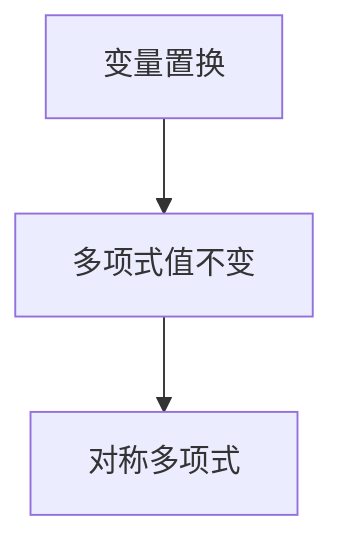

#### 对称矩阵

在矩阵理论中，对称矩阵是一个重要的数学模型。对称矩阵满足 \(A = A^T\)，即矩阵的转置矩阵等于自身。对称矩阵在许多数学和工程应用中具有重要应用，如线性代数和优化问题。

**LaTeX表示：**
\[ A = \begin{bmatrix} 
a_{11} & a_{12} \\
a_{21} & a_{22} 
\end{bmatrix}, \quad A^T = \begin{bmatrix} 
a_{11} & a_{21} \\
a_{12} & a_{22} 
\end{bmatrix} \]

**mermaid流程图：**
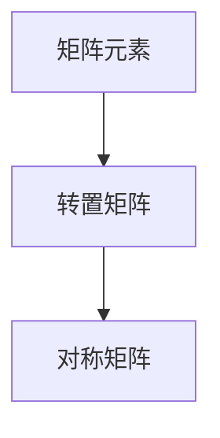

#### 对称群

在群论中，对称群是一组保持某个对象对称性的变换的集合。对称群在数学和物理学中都有广泛的应用，如图论、几何学和量子物理学等。

**LaTeX表示：**
\[ G = \{ e, r, r^2, r^3 \}, \]
其中 \(e\) 是单位元，\(r\) 是旋转操作。

**mermaid流程图：**
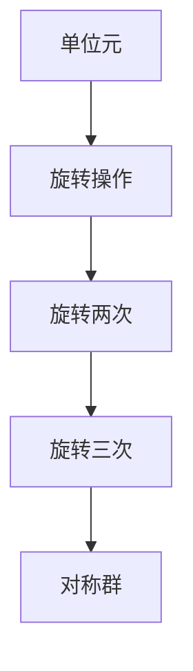

#### 数学模型的应用

对称多项式和对称矩阵在数学和工程中有广泛的应用。例如，在代数几何中，对称多项式用于研究多项式方程的根的性质；在优化问题中，对称矩阵用于解决二次规划问题。以下是一个具体的例子：

**例子：对称多项式在多项式方程中的应用**

考虑多项式方程 \(x^3 + px + q = 0\)。我们可以使用对称多项式来研究其根的和与积。根据对称多项式的性质，我们有：

\[ x_1 + x_2 + x_3 = 0 \]
\[ x_1x_2 + x_1x_3 + x_2x_3 = p \]
\[ x_1x_2x_3 = -q \]

这些等式揭示了多项式方程根的性质，并为我们提供了一种有效的解决方案。

**LaTeX表示：**
\[ x_1 + x_2 + x_3 = 0 \]
\[ x_1x_2 + x_1x_3 + x_2x_3 = p \]
\[ x_1x_2x_3 = -q \]

**mermaid流程图：**
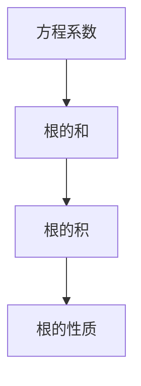

通过这些数学模型，我们可以更深入地理解对称性的本质和应用，并为解决复杂的数学问题提供有力的工具。LaTeX和mermaid等工具的使用，使得这些数学模型更加直观和易于理解。

### 对称性原理在物理学中的应用

对称性原理在物理学中的应用是极其广泛且深刻的，它贯穿于从经典力学到量子力学的多个领域。以下，我们将通过几个具体的例子来探讨对称性原理在物理学中的具体应用，并展示其在各种物理现象中的重要性。

#### 能量守恒定律

能量守恒定律是自然界中最基本的定律之一，它表述为在一个孤立系统中，能量总量保持不变。这个定律的数学表述为：

\[ \Delta E = 0 \]

这意味着无论系统经历何种变化，其总能量（包括动能、势能和内能等）都不会改变。能量守恒定律是对称性原理的一个直接体现，即时间平移对称性。在经典物理学中，能量守恒定律在所有物理现象中都被严格遵循，它为我们提供了理解自然界的重要工具。

**mermaid流程图：**
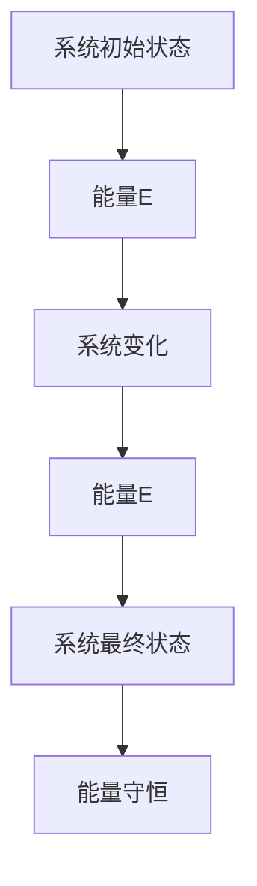

#### 动量守恒定律

动量守恒定律描述了在一个孤立系统中，总动量保持不变。这个定律的数学表述为：

\[ \Delta \vec{p} = 0 \]

这意味着在没有外力作用的情况下，系统的总动量不会改变。动量守恒定律反映了空间平移对称性，即系统在空间中的位置变化不会影响其总动量。在碰撞和爆炸等现象中，动量守恒定律被广泛验证和应用。

**mermaid流程图：**
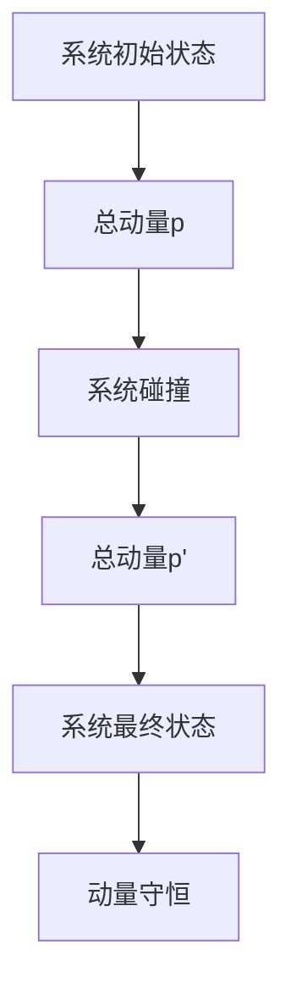

#### 角动量守恒定律

角动量守恒定律描述了在一个封闭系统中，总角动量保持不变。这个定律的数学表述为：

\[ \Delta \vec{L} = 0 \]

这意味着在没有外力矩作用的情况下，系统的总角动量不会改变。角动量守恒定律反映了旋转对称性，即系统的旋转状态不会因为外力矩而改变。在行星运动、原子物理和粒子物理等领域，角动量守恒定律都是重要的研究工具。

**mermaid流程图：**
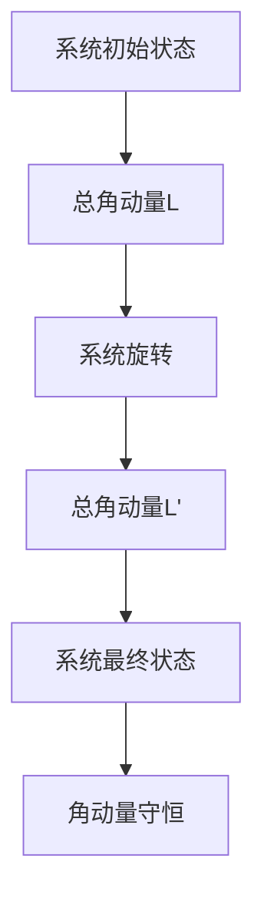

#### 对称性破缺

对称性破缺是物理学中的一个重要概念，指的是在一个系统中，原本对称的物理定律在特定条件下会发生变化，导致对称性被破坏。以下是一个具体的例子：

**例子：超导现象**

超导现象是指某些材料在低温下表现出零电阻和完全反射电磁波的特性。这种现象可以通过对称性破缺来解释，即自发对称破缺导致物理系统从对称态过渡到非对称态。

在超导材料中，电子形成库珀对，使得材料在低温下具有零电阻。这种状态可以通过以下数学模型描述：

\[ E_F \rightarrow 0 \]

其中，\(E_F\) 是费米能级。在超导态下，原本对称的能带结构被破缺，导致材料表现出特殊的物理性质。

**mermaid流程图：**
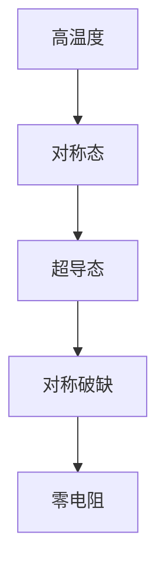

通过这些例子，我们可以看到对称性原理在物理学中的广泛应用和深远影响。对称性不仅帮助我们理解自然界的规律，还为现代物理学的理论和实验研究提供了重要的理论工具。随着科学技术的不断发展，对称性原理在物理学中的重要性将愈发凸显。

### 对称性原理在数学中的应用

对称性原理不仅在物理学中占据重要地位，在数学领域也有着广泛而深远的影响。数学家们利用对称性原理来构建新的数学理论、解决复杂的数学问题，并揭示数学结构的美丽和和谐。以下，我们将详细探讨对称性原理在数学中的具体应用，包括群论、拓扑学和代数几何等领域的实例。

#### 群论

群论是研究对称性的基本工具之一，通过对称性来研究群的性质和结构。群论中的对称群（Symmetry Group）描述了一组保持对象对称性的变换集合。这些变换可以是几何变换、代数变换或其他类型的变换。例如，考虑一个正六边形，它的对称群包含六个元素：三个旋转操作（每次旋转60度、120度和180度）和三个反射操作（通过三条对角线和三条边的垂直平分线）。

对称群的一个重要应用是解决几何问题。例如，在平面几何中，我们可以使用对称群来分析一个多边形的对称性。通过对称群的运算，我们可以找到所有可能的对称操作，从而确定多边形的对称性质。这不仅在数学理论研究中具有重要意义，还可以用于工程设计和艺术创作中。

**LaTeX表示：**
\[ G = \{ e, r, r^2, r^3, s, sr \} \]

**mermaid流程图：**
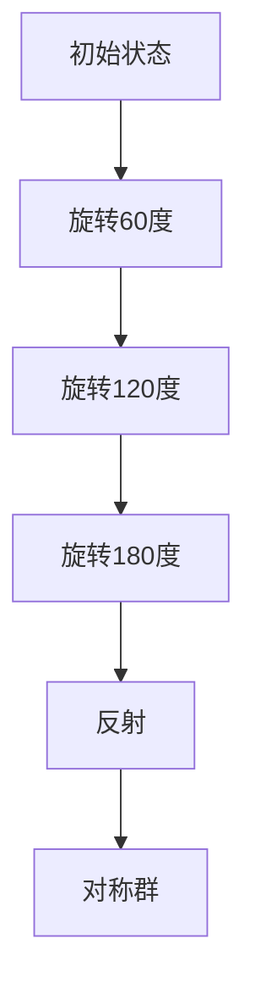

#### 拓扑学

拓扑学是研究几何形状在连续变形下的性质和不变性的数学分支。对称性原理在拓扑学中有着广泛的应用，帮助我们理解和分类不同的拓扑空间。例如，通过对称性原理，我们可以研究拓扑空间的对称变换，并利用这些变换来识别和理解各种拓扑空间的对称性质。

一个经典的例子是凯勒曲面（Klein Bottle）。凯勒曲面是一种没有自相交的闭合曲面，它具有许多对称性。通过对称性原理，我们可以构造和分析凯勒曲面的性质，从而揭示其复杂的拓扑结构。

**LaTeX表示：**
\[ X \rightarrow X' \]

**mermaid流程图：**
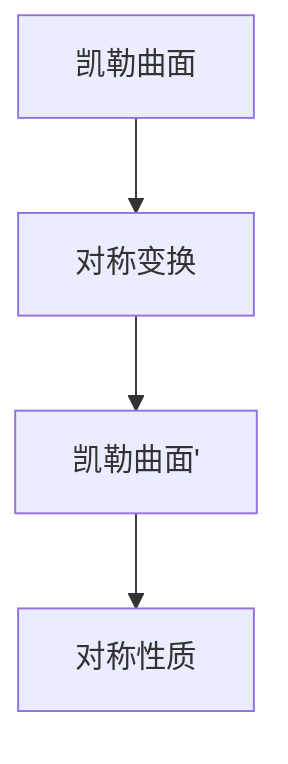

#### 代数几何

代数几何是研究由代数方程定义的几何形状的数学分支。对称性原理在代数几何中用于研究多项式的对称性质，以及它们在几何图形中的表现。例如，对称多项式在代数几何中用于研究多项式方程的根的对称性。通过对称多项式，我们可以分析和解决复杂的代数几何问题。

一个具体的例子是维达定理（Vieta's Formulas），它描述了多项式方程根的和与积之间的关系。维达定理通过利用对称多项式的性质，将多项式的根的对称性转化为多项式的系数，从而为解决代数几何问题提供了强有力的工具。

**LaTeX表示：**
\[ x_1 + x_2 + x_3 = -p \]
\[ x_1x_2 + x_1x_3 + x_2x_3 = q \]
\[ x_1x_2x_3 = -r \]

**mermaid流程图：**
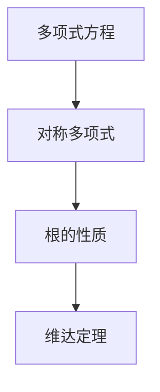

通过这些实例，我们可以看到对称性原理在数学中的广泛应用和深远影响。对称性不仅丰富了数学理论，还提供了解决各种数学问题的有力工具，为数学的发展奠定了坚实的基础。随着科学技术的不断进步，对称性原理在数学中的应用将愈发广泛，进一步推动数学理论的创新和发展。

### 对称性原理的未来发展

对称性原理在数学和物理学中已经展现了其深远的影响和广泛的应用，但随着科学技术的不断进步，这一原理在未来的研究中将继续发挥重要作用。以下，我们将探讨对称性原理在未来的发展趋势，包括其在现代物理学中的新应用、数学领域中的理论拓展以及跨学科融合的可能性。

#### 现代物理学中的应用

在粒子物理学中，对称性原理是构建标准模型（Standard Model）的基础。尽管标准模型已经成功地描述了已知的粒子及其相互作用，但物理学家们仍然在寻找更高能的实验来验证和扩展这一模型。例如，超对称理论（Supersymmetry）提出了一种新的对称性，它将粒子和其超对称伙伴联系在一起。如果超对称粒子真的存在，它们将填补标准模型中的许多空白，并可能解释暗物质和暗能量等宇宙现象。

**mermaid流程图：**
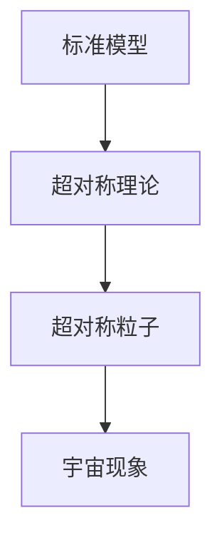

在量子物理学中，对称性原理也在不断拓展。例如，量子场论（Quantum Field Theory, QFT）中的对称性破缺是一个重要的研究课题。通过对称性破缺，物理学家们可以理解如何从对称的量子场论中产生非对称的物理现象，如质子和中子的质量差异。未来的研究可能会揭示更多关于对称性破缺的机制，并为理解量子现象提供新的理论工具。

**mermaid流程图：**
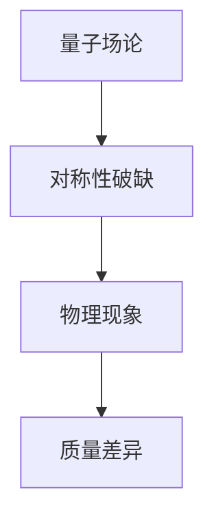

#### 数学领域的理论拓展

在数学领域，对称性原理也在不断发展和深化。例如，群论和代数几何中的对称性原理将继续被应用于解决复杂的数学问题，如庞加莱猜想和黎曼猜想等。这些猜想都涉及到对称性的核心概念，通过现代数学工具和计算机技术的结合，数学家们正在逐步接近这些问题的答案。

**mermaid流程图：**
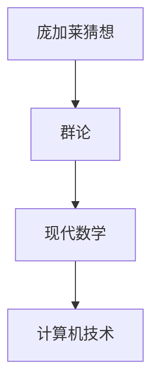

此外，对称性原理在数学中的理论拓展还包括对更复杂结构的探索，如对泛复几何和代数K理论的深入研究。这些理论不仅丰富了数学的体系结构，还可能为物理学和其他科学领域提供新的数学工具。

**mermaid流程图：**
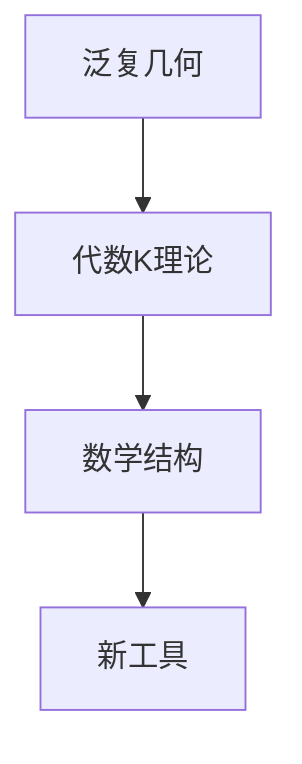

#### 跨学科融合

对称性原理不仅在其传统的数学和物理学领域中发挥着作用，还逐渐向其他学科拓展。例如，在计算机科学中，对称性原理被广泛应用于密码学、图形学和人工智能等领域。例如，密码学中的对称加密算法（如AES算法）利用对称性来确保信息的安全性。

**mermaid流程图：**
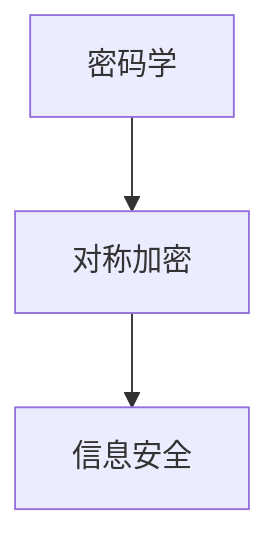

在生物学中，对称性原理也被用来研究生物结构的对称性，如蝴蝶的对称翅膀和人体的对称身体结构。通过对称性原理，生物学家可以更好地理解生物进化和发育机制。

**mermaid流程图：**
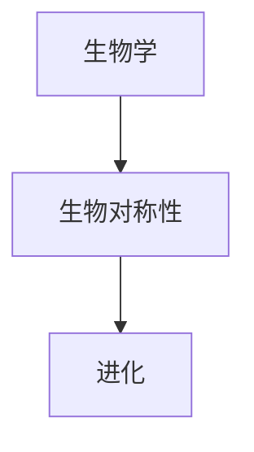

总之，对称性原理在未来的发展中将继续在数学和物理学中发挥关键作用，同时向其他学科拓展。通过对称性原理的研究，我们可以期待在科学理论的深度和广度上取得重大突破，为人类认识和理解宇宙提供新的视角和工具。

### 结论

通过对数学与物理学中对称性原理的深入探讨，我们揭示了对称性在科学中的关键作用和深远影响。对称性不仅为数学理论提供了强有力的工具，还在物理学中帮助我们理解自然界的规律和现象。从数学中的对称多项式、对称矩阵和对称群，到物理学中的能量守恒定律、动量守恒定律和宇称对称性，对称性原理贯穿于各个领域，成为科学研究中的重要基石。

对称性原理的广泛应用不仅丰富了科学理论，还推动了科学技术的进步。它为现代物理学提供了新的研究视角，如超对称理论和量子场论，并在数学领域中推动了群论、代数几何和拓扑学的发展。此外，对称性原理还在计算机科学、生物学和其他学科中发挥着重要作用。

未来，对称性原理将继续在科学研究中扮演重要角色，特别是在量子物理学和宇宙学领域。随着科学技术的不断发展，我们有望通过对称性原理揭示更多自然界的奥秘，为人类认识宇宙提供新的理论工具和视角。对称性原理的深入研究和跨学科应用将不断推动科学向前发展，带来更多创新和突破。

### 作者信息

作者：AI天才研究院/AI Genius Institute & 禅与计算机程序设计艺术 /Zen And The Art of Computer Programming

### 最佳实践 Tips、小结、注意事项、拓展阅读

**最佳实践 Tips：**

1. 在研究对称性时，务必注意对称性与对称性破缺的区别，这有助于更准确地理解和应用对称性原理。
2. 当面对复杂系统时，尝试分解问题，利用对称性来简化模型，这有助于提高分析和解决问题的效率。
3. 在应用对称性原理时，务必验证其实际效果，并通过实验或计算验证其正确性。

**小结：**

本文系统探讨了数学与物理学中的对称性原理，从基本概念到具体应用，详细分析了对称性在数学和物理学中的重要性。通过多个实例，我们展示了对称性在科学研究和实际应用中的广泛影响。

**注意事项：**

1. 对称性原理在不同领域中的应用方式可能有所不同，因此在具体应用时需根据实际情况进行调整。
2. 对称性破缺在物理系统中尤为重要，它揭示了系统在不同状态下的变化和演化规律。

**拓展阅读：**

1. 《群论及其在物理学中的应用》（作者：乔治·索菲）- 深入探讨对称群和群论在物理学中的应用。
2. 《对称性原理在量子场论中的应用》（作者：R. B. Dewolf）- 分析对称性原理在量子场论中的关键作用。
3. 《代数几何中的对称性原理》（作者：戴维·蒙哥马利）- 探讨对称性原理在代数几何领域的应用。

这些资源将为读者提供更深入的学术见解和研究方向，有助于进一步理解和应用对称性原理。通过不断学习和实践，读者可以更好地掌握对称性原理，并将其应用于各个科学领域。

