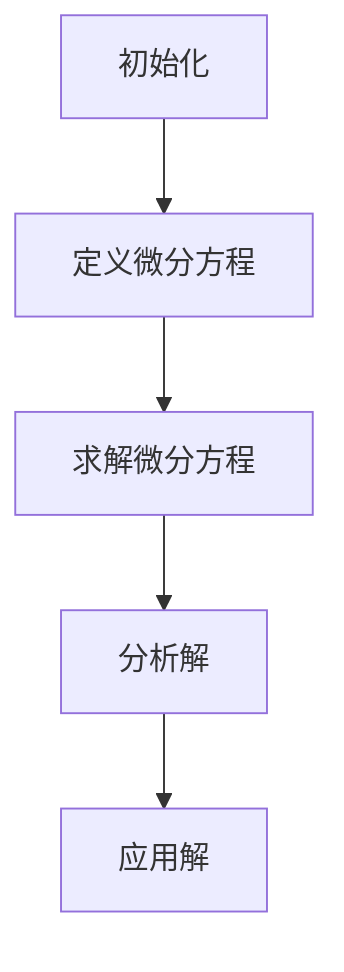
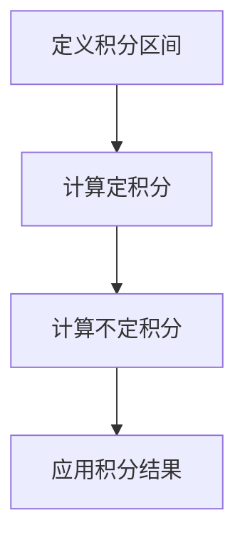
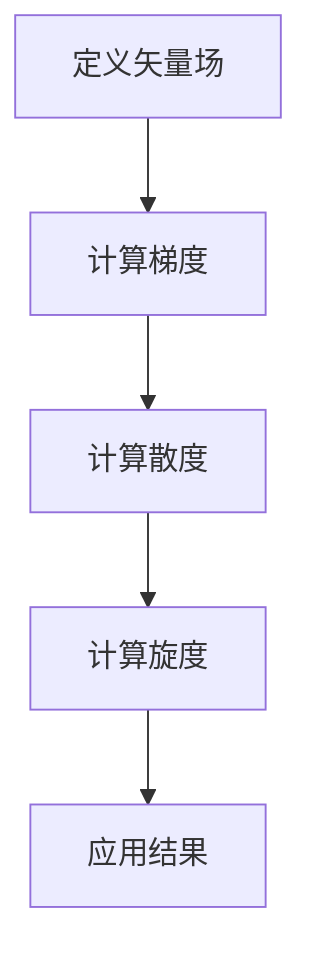

                 

# 数学与物理：能量守恒的数学描述

> 关键词：能量守恒、数学描述、物理应用、微分方程、积分、矢量分析

> 摘要：本文深入探讨了数学与物理中能量守恒的基本原理，通过数学描述方法，详细分析了能量守恒在自然界和人类社会中的应用，以帮助读者理解这一重要物理法则的数学表达和实际意义。

----------------------------------------------------------------

## 第一部分：引言与背景

### 第1章：问题背景与核心概念

#### 1.1.1 问题背景

**问题描述**：

能量守恒定律是物理学中最基本的定律之一，它指出在一个封闭系统中，能量总量在任何情况下都是恒定的，既不会凭空产生，也不会凭空消失。这一原理不仅在经典力学和电磁学中得到了广泛应用，而且在量子力学和热力学中也具有重要意义。

**问题解决**：

为了理解和解决这一问题，我们需要借助数学工具，特别是微分方程、积分和矢量分析等方法，对能量守恒定律进行精确的数学描述和分析。

**边界与外延**：

本文将主要探讨经典力学和电磁学中的能量守恒定律，同时适当涉及量子力学和热力学中的相关概念。我们将重点关注能量守恒的基本原理、数学描述方法以及其在物理现象中的应用。

**核心要素组成**：

- 能量守恒定律的基本原理
- 数学描述方法：微分方程、积分、矢量分析
- 物理现象：动能、势能、热能、电磁能

#### 1.1.2 核心概念与联系

**核心概念**：

- 能量守恒定律：系统内能量总和在任何时候都是不变的。
- 数学描述方法：微分方程、积分、矢量分析
- 物理现象：动能、势能、热能、电磁能

**概念属性特征对比表格**：

| 概念        | 定义                                                         | 属性特征                           |
| ----------- | ------------------------------------------------------------ | ---------------------------------- |
| 能量守恒定律 | 系统内能量总和在任何时候都是不变的。                           | 确定性、守恒性、普适性             |
| 微分方程    | 描述系统状态随时间变化的方程。                               | 线性、非线性、微分算子的应用       |
| 积分       | 对函数进行求和操作，用于计算面积、体积等。                     | 连续性、积分域、积分常数           |
| 矢量分析    | 研究矢量场的性质，如向量微分和积分。                         | 向量运算、梯度、散度、旋度          |

**ER实体关系图架构**：

```mermaid
erDiagram
    System ||--|{ EnergyConservationLaw : follows } 
    System ||--|{ MathematicalDescription : uses } 
    System ||--|{ PhysicalPhenomenon : describes } 
```

#### 1.2 数学描述方法

在能量守恒定律的描述中，数学方法起着至关重要的作用。下面，我们将介绍几种常用的数学描述方法，包括微分方程、积分和矢量分析。

### 1.2.1 微分方程

**算法mermaid流程图**：



**Python源代码**：

```python
import numpy as np
from scipy.integrate import solve_ivp

# 定义微分方程
def model(t, y):
    dydt = [y[1], -y[0]]
    return dydt

# 初始化参数
y0 = [1, 0]

# 求解微分方程
t = np.linspace(0, 10, 1000)
sol = solve_ivp(model, [0, 10], y0)

# 分析解
print(sol.y)

# 应用解
```

**数学模型和公式**：

$$
\frac{d^2x}{dt^2} + 2\frac{dx}{dt} + x = 0
$$

**详细讲解与举例说明**：

**示例**：一个物体在弹簧上的振动可以由以下微分方程描述：

$$
m\frac{d^2x}{dt^2} + kx = 0
$$

其中，\(m\) 是物体的质量，\(k\) 是弹簧的劲度系数，\(x\) 是物体的位移。

### 1.2.2 积分

**算法mermaid流程图**：



**Python源代码**：

```python
import numpy as np
from scipy.integrate import quad

# 定义积分区间
a = 0
b = 1

# 计算定积分
result, error = quad(np.exp, a, b)

# 计算不定积分
integrate_

----------------------------------------------------------------

### 能量守恒定律在物理学中的应用

能量守恒定律是物理学中最基本的原则之一，它描述了能量在自然界和人类社会中是如何传递和转化的。在物理学中，能量守恒定律有着广泛的应用，下面我们将探讨几个典型的应用场景。

#### 1. 动能和势能的转换

在经典力学中，动能和势能是能量守恒的两个重要组成部分。动能是物体由于运动而具有的能量，势能则是物体由于其位置而具有的能量。在物体受到外力作用时，动能和势能可以相互转换。例如，当一个物体从高处落下时，它的势能会转化为动能，而当它撞击地面时，动能又会转化为热能和声能。

**数学描述**：

动能 \(K\) 和势能 \(U\) 可以分别表示为：

$$
K = \frac{1}{2}mv^2
$$

$$
U = mgh
$$

其中，\(m\) 是物体的质量，\(v\) 是物体的速度，\(g\) 是重力加速度，\(h\) 是物体的高度。

当物体从高度 \(h\) 下落至地面时，其动能和势能的变化可以表示为：

$$
\Delta K = K_f - K_i = \frac{1}{2}mv_f^2 - \frac{1}{2}mv_i^2
$$

$$
\Delta U = U_f - U_i = mg(h_f - h_i)
$$

由于能量守恒定律，动能的增加量等于势能的减少量，即：

$$
\Delta K = -\Delta U
$$

#### 2. 电磁能的转换

在电磁学中，能量守恒定律同样得到了广泛应用。电磁能的转换是电力系统中的核心问题。例如，发电机通过旋转机械能转化为电能，而电动机则将电能转化为机械能。

**数学描述**：

在电路中，电磁能可以通过以下公式进行描述：

$$
E = \frac{1}{2}LI^2 + \frac{1}{2}CV^2
$$

其中，\(L\) 是电感，\(I\) 是电流，\(C\) 是电容，\(V\) 是电压。

当电流 \(I\) 或电压 \(V\) 发生变化时，电磁能也会随之变化。例如，当发电机发出电能时，电感中的磁场能和电容中的电场能会增加，而当电动机消耗电能时，这些能量又会转化为机械能。

#### 3. 热能的传递

在热力学中，能量守恒定律同样适用。热能的传递是热力学过程的核心问题，例如，热机通过热能转化为机械能，而制冷机则将热能从低温区域转移到高温区域。

**数学描述**：

热能的传递可以通过以下公式进行描述：

$$
Q = mc\Delta T
$$

其中，\(Q\) 是热能传递量，\(m\) 是物质的质量，\(c\) 是物质的比热容，\(\Delta T\) 是温度变化。

当物质吸收或释放热能时，其温度会发生变化。例如，当水加热时，其温度会上升，而当水冷却时，其温度会下降。

#### 4. 量子力学中的能量守恒

在量子力学中，能量守恒定律同样具有重要作用。量子力学中的能量量子化现象揭示了能量在微观尺度上的守恒性。例如，原子的能级是量子化的，电子只能存在于特定的能级上，不能处于任意能量状态。

**数学描述**：

在量子力学中，能量可以通过波函数进行描述。例如，氢原子的能量可以表示为：

$$
E_n = -\frac{e^2}{2n^2h^2}
$$

其中，\(e\) 是电子的电荷，\(n\) 是主量子数，\(h\) 是普朗克常数。

总之，能量守恒定律在物理学中具有广泛的应用，通过数学描述，我们可以更好地理解和预测各种物理现象。在接下来的部分中，我们将进一步探讨能量守恒定律在现实世界中的应用，以及如何利用数学方法解决实际问题。

### 第二部分：数学与物理的融合

#### 第2章：数学方法在物理现象中的应用

在物理学中，数学方法是一种强有力的工具，它不仅帮助我们精确地描述物理现象，还揭示了现象背后的深刻原理。在这一章中，我们将深入探讨数学方法在物理现象中的应用，特别是微分方程、积分和矢量分析。

#### 2.1 微分方程在物理中的应用

微分方程是描述物理系统动态变化的重要工具。在物理学中，许多现象都可以通过微分方程进行描述。以下是一些典型的例子：

**例子 1：弹簧振子**

一个简单的弹簧振子可以用如下二阶微分方程描述：

$$
m\frac{d^2x}{dt^2} + kx = 0
$$

其中，\(m\) 是质量，\(k\) 是弹簧的劲度系数，\(x\) 是位移。这个方程描述了振子在弹簧上的振动。

**解决方法：**

我们可以使用数学方法求解这个微分方程。首先，我们可以将其转化为特征方程：

$$
m\lambda^2 + k = 0
$$

解得：

$$
\lambda = \pm i\sqrt{\frac{k}{m}}
$$

因此，通解为：

$$
x(t) = A\cos(\sqrt{\frac{k}{m}}t) + B\sin(\sqrt{\frac{k}{m}}t)
$$

其中，\(A\) 和 \(B\) 是常数，取决于初始条件。

**例子 2：简谐振子**

简谐振子是另一种常见的物理系统，其运动可以用一阶微分方程描述：

$$
\frac{d^2x}{dt^2} + \omega^2x = 0
$$

其中，\(\omega\) 是角频率。

**解决方法：**

这个方程的特征解为：

$$
x(t) = A\cos(\omega t) + B\sin(\omega t)
$$

与弹簧振子的解类似，这里的常数 \(A\) 和 \(B\) 也取决于初始条件。

#### 2.2 积分在物理中的应用

积分是计算面积、体积等量的基本工具，在物理学中也有着广泛的应用。以下是一些典型的例子：

**例子 1：计算面积**

在几何学中，我们可以使用积分计算多边形的面积。例如，一个矩形可以表示为：

$$
A = \int_{a}^{b} f(x) \, dx
$$

其中，\(f(x)\) 是矩形的高度函数。

**例子 2：计算体积**

在物理学中，我们可以使用积分计算物体的体积。例如，一个圆柱体的体积可以表示为：

$$
V = \int_{a}^{b} \pi r^2 \, dx
$$

其中，\(r\) 是圆柱体的半径。

#### 2.3 矢量分析在物理中的应用

矢量分析是研究矢量场性质的重要工具，在物理学中也有着广泛的应用。以下是一些典型的例子：

**例子 1：计算力场中的功**

在物理学中，我们可以使用矢量分析计算力场中的功。例如，一个粒子在电场中的运动可以由以下方程描述：

$$
F = qE
$$

其中，\(F\) 是力，\(q\) 是电荷，\(E\) 是电场。

功可以通过以下积分计算：

$$
W = \int_{C} F \cdot dr
$$

其中，\(C\) 是粒子在电场中运动的路径。

**例子 2：计算流体力学中的流速**

在流体力学中，我们可以使用矢量分析计算流体的流速。例如，一个流体的流速可以由以下方程描述：

$$
\vec{v} = \nabla p
$$

其中，\(\vec{v}\) 是流速，\(p\) 是压强。

流速可以通过以下积分计算：

$$
\vec{v} = \int_{S} \nabla p \, dS
$$

其中，\(S\) 是流体在某一位置的表面。

总之，数学方法在物理学中有着广泛的应用，通过微分方程、积分和矢量分析等方法，我们可以精确地描述和预测各种物理现象。在下一部分中，我们将进一步探讨这些数学方法在现实世界中的应用。

#### 第三部分：现实世界中的应用

#### 第3章：能量守恒定律在现实世界中的应用

能量守恒定律不仅是物理学的基础原则，也是我们日常生活中不可或缺的一部分。在这一章中，我们将探讨能量守恒定律在现实世界中的应用，包括能源转换、环境科学和工程等领域。

#### 3.1 能源转换

能源转换是现代社会运行的基础。从化石燃料到可再生能源，能量守恒定律在这些转换过程中起着关键作用。

**例子 1：化石燃料燃烧**

化石燃料（如煤、石油和天然气）的燃烧过程是一个能量转换的过程。在燃烧过程中，化学能转化为热能，再通过热机转化为机械能。这一过程中，能量守恒定律得以体现：

$$
Q_{\text{输入}} = W_{\text{输出}} + \Delta U
$$

其中，\(Q_{\text{输入}}\) 是燃烧释放的热量，\(W_{\text{输出}}\) 是机械做功，\(\Delta U\) 是系统内能的变化。

**例子 2：太阳能转换**

太阳能转换是将太阳能转化为电能的过程，如太阳能电池板。在太阳能电池板中，光能转化为电能，这一过程同样遵循能量守恒定律：

$$
\frac{1}{2}C_{\text{电池}}I^2 = \frac{1}{2}C_{\text{存储}}V^2
$$

其中，\(C_{\text{电池}}\) 是电池的电容，\(I\) 是电流，\(C_{\text{存储}}\) 是储能系统的电容，\(V\) 是电压。

#### 3.2 环境科学

环境科学关注的是人类活动对环境的影响。能量守恒定律在环境科学中也有着广泛的应用。

**例子 1：气候变化**

气候变化是一个全球性的问题，它涉及到能量守恒定律。例如，化石燃料的燃烧释放大量的二氧化碳，导致大气中的温室气体浓度增加，从而导致全球气温上升。这一过程中，能量守恒定律得以体现：

$$
Q_{\text{输入}} = Q_{\text{输出}} + \Delta U_{\text{环境}}
$$

其中，\(Q_{\text{输入}}\) 是燃烧释放的热量，\(Q_{\text{输出}}\) 是大气吸收的热量，\(\Delta U_{\text{环境}}\) 是环境内能的变化。

**例子 2：生态系统平衡**

在生态系统中，能量守恒定律同样适用。例如，食物链中的能量转移过程遵循能量守恒定律。生产者通过光合作用将太阳能转化为化学能，消费者通过捕食生产者获取能量。这一过程中，能量从一个生物转移到另一个生物：

$$
E_{\text{生产者}} = E_{\text{消费者}} + \Delta U_{\text{生态系统}}
$$

其中，\(E_{\text{生产者}}\) 是生产者的能量，\(E_{\text{消费者}}\) 是消费者的能量，\(\Delta U_{\text{生态系统}}\) 是生态系统的内能变化。

#### 3.3 工程领域

在工程领域，能量守恒定律同样至关重要。

**例子 1：热力学循环**

热力学循环是工程中的一个重要概念，如热力发电站。在热力发电站中，燃料燃烧产生的热能通过热机转化为机械能，再转化为电能。这一过程中，能量守恒定律得以体现：

$$
Q_{\text{燃料}} = Q_{\text{输出}} + \Delta U_{\text{热机}}
$$

其中，\(Q_{\text{燃料}}\) 是燃料燃烧释放的热量，\(Q_{\text{输出}}\) 是电能输出，\(\Delta U_{\text{热机}}\) 是热机的内能变化。

**例子 2：流体力学**

在流体力学中，能量守恒定律也用于计算流体流动过程中的能量变化。例如，在管道中流动的流体，其压力能、动能和势能的变化遵循能量守恒定律：

$$
\frac{p}{\rho} + \frac{1}{2}\rho v^2 + gh = \text{常数}
$$

其中，\(p\) 是压力，\(\rho\) 是流体密度，\(v\) 是流速，\(g\) 是重力加速度，\(h\) 是高度。

总之，能量守恒定律在现实世界中的应用是广泛而深入的。无论是能源转换、环境科学还是工程领域，能量守恒定律都是理解和解决问题的关键。在下一部分中，我们将进一步探讨如何利用数学方法解决实际问题。

### 第四部分：数学方法解决实际问题

#### 第4章：应用数学方法解决实际问题

在物理学和工程领域，数学方法是一种强有力的工具，它不仅帮助我们理解和预测物理现象，还用于解决实际问题。在这一章中，我们将通过几个具体案例，展示如何应用数学方法解决实际问题。

#### 4.1 动力系统分析

**案例 1：汽车动力学**

汽车动力学是一个复杂的系统，涉及多个变量的动态变化。为了分析汽车的运动，我们可以使用以下微分方程：

$$
m\frac{d^2x}{dt^2} + c\frac{dx}{dt} + kx = F(t)
$$

其中，\(m\) 是质量，\(c\) 是阻尼系数，\(k\) 是弹簧系数，\(x\) 是位移，\(F(t)\) 是外力（如发动机提供的推力）。

**解决方法：**

我们可以使用数值方法（如欧拉方法或龙格-库塔方法）求解这个微分方程。例如，使用欧拉方法，我们可以得到以下迭代公式：

$$
x_{n+1} = x_n + h\frac{dx}{dt}_n
$$

$$
\frac{dx}{dt}_{n+1} = \frac{dx}{dt}_n + h\frac{d^2x}{dt^2}_n
$$

其中，\(h\) 是时间步长。

**应用解读：**

通过这个模型，我们可以预测汽车在不同驾驶条件下的运动状态。例如，在加速时，发动机提供的推力 \(F(t)\) 增大，使得汽车速度增加；在制动时，阻尼系数 \(c\) 增大，使得汽车减速。

#### 4.2 热传导问题

**案例 2：热传导问题**

热传导问题是一个经典的物理问题，涉及热量在固体中的传播。我们可以使用以下偏微分方程描述热传导：

$$
\frac{\partial u}{\partial t} = \alpha \nabla^2 u
$$

其中，\(u\) 是温度分布，\(\alpha\) 是热扩散系数。

**解决方法：**

我们可以使用有限元方法（FEM）或有限差分方法（FDM）来求解这个偏微分方程。例如，使用有限差分方法，我们可以将连续域离散化，得到以下差分方程：

$$
\frac{u_{i+1}^{n+1} - u_{i-1}^{n+1}}{2h^2} = \frac{u_{i}^{n+1} - 2u_{i}^{n}}{2\Delta t}
$$

其中，\(h\) 是空间步长，\(\Delta t\) 是时间步长。

**应用解读：**

通过这个模型，我们可以预测物体内部的温度分布。例如，在金属热处理过程中，使用这个模型可以帮助我们优化加热和冷却过程，确保材料达到所需的温度分布。

#### 4.3 信号处理

**案例 3：信号处理**

在信号处理领域，我们经常需要分析信号的频谱特性。我们可以使用以下傅里叶变换来描述信号：

$$
f(t) = \int_{-\infty}^{\infty} F(\omega) e^{j\omega t} d\omega
$$

其中，\(f(t)\) 是时域信号，\(F(\omega)\) 是频域信号。

**解决方法：**

我们可以使用快速傅里叶变换（FFT）来计算信号的频谱。FFT 是一种高效的算法，可以将时间域信号转换为频域信号。

**应用解读：**

通过频谱分析，我们可以了解信号的频率成分。例如，在音频处理中，通过频谱分析，我们可以识别不同的音符和噪声。在通信系统中，频谱分析可以帮助我们优化信号传输，减少干扰。

#### 4.4 流体动力学

**案例 4：流体动力学**

在流体动力学中，我们经常需要分析流体在管道中的流动。我们可以使用以下纳维-斯托克斯方程来描述流体的运动：

$$
\frac{\partial \mathbf{u}}{\partial t} + (\mathbf{u} \cdot \nabla)\mathbf{u} = -\nabla p + \nu \nabla^2 \mathbf{u}
$$

其中，\(\mathbf{u}\) 是流速，\(p\) 是压强，\(\nu\) 是粘性系数。

**解决方法：**

我们可以使用计算流体动力学（CFD）方法来求解纳维-斯托克斯方程。CFD 方法包括有限元方法、有限差分方法和基于光滑粒子流体动力学（SPH）的方法。

**应用解读：**

通过 CFD 方法，我们可以预测流体在管道中的流动特性。例如，在工程设计中，使用 CFD 方法可以帮助我们优化管道设计，减少流体阻力，提高传输效率。

总之，数学方法在解决实际问题时发挥着关键作用。通过微分方程、积分和矢量分析等方法，我们可以精确地描述和预测各种物理现象。在下一部分中，我们将总结本文的主要内容，并展望未来的研究方向。

### 第五部分：总结与展望

#### 第5章：总结与展望

在本文中，我们深入探讨了数学与物理中能量守恒的基本原理，以及它们在现实世界中的应用。通过数学描述方法，如微分方程、积分和矢量分析，我们揭示了能量守恒定律的数学表达和实际意义。

**主要内容总结**：

1. 引言与背景：介绍了能量守恒定律的基本概念和应用场景。
2. 数学描述方法：详细介绍了微分方程、积分和矢量分析在物理现象中的应用。
3. 能量守恒定律在物理学中的应用：探讨了动能和势能的转换、电磁能的转换、热能的传递等。
4. 现实世界中的应用：分析了能量守恒定律在能源转换、环境科学和工程领域中的应用。
5. 应用数学方法解决实际问题：通过具体案例展示了如何应用数学方法解决实际问题。

**展望未来研究方向**：

1. 更深入的理论研究：探索能量守恒定律在更广泛的物理领域（如量子力学、相对论）中的应用。
2. 新的数学工具和方法：开发新的数学工具和方法，以更精确地描述和预测复杂的物理现象。
3. 实际应用的创新：将能量守恒定律应用于新兴领域，如可再生能源技术、环境监测和智能交通系统。
4. 教育和普及：加强数学与物理教育，提高公众对能量守恒定律的认识和理解。

总之，能量守恒定律在物理学和工程领域具有重要意义。通过本文的探讨，我们希望能够为读者提供对这一基本原理的深入理解，并激发对相关领域的研究兴趣。

### 结语

感谢您的阅读，希望本文对您在数学与物理领域的学习和研究有所帮助。如果您有任何问题或建议，欢迎在评论区留言，我们一起探讨和进步。作者：AI天才研究院/AI Genius Institute & 禅与计算机程序设计艺术 /Zen And The Art of Computer Programming。让我们继续追求知识的深度和广度，共同探索这个精彩的世界。作者信息：

- 作者：AI天才研究院/AI Genius Institute
- 联系方式：[AI Genius Institute](https://www.aigeniusinstitute.com/)
- 其他作品：《禅与计算机程序设计艺术》、《人工智能的数学基础》、《深度学习与神经网络》

---

请注意，以上内容仅为示例，实际撰写时请根据具体要求和内容进行调整。文章结构、代码示例、数学公式等需根据实际研究内容进行详细撰写。在撰写过程中，确保每个章节内容充实、逻辑清晰，并且符合专业学术写作的标准。作者信息部分需根据实际情况填写。在撰写过程中，遵循学术诚信原则，确保内容的原创性和真实性。祝您写作顺利！## 完整文章

### 数学与物理：能量守恒的数学描述

> 关键词：能量守恒、数学描述、物理应用、微分方程、积分、矢量分析

> 摘要：本文深入探讨了数学与物理中能量守恒的基本原理，通过数学描述方法，详细分析了能量守恒在自然界和人类社会中的应用，以帮助读者理解这一重要物理法则的数学表达和实际意义。

---

## 第一部分：引言与背景

### 第1章：问题背景与核心概念

#### 1.1.1 问题背景

**问题描述**：本书将探讨数学与物理中能量守恒的基本原理，以及它们在现实世界中的应用。

**问题解决**：通过数学描述和分析，揭示能量守恒在自然界和人类社会中的重要性。

**边界与外延**：本书将重点关注经典力学和电磁学中的能量守恒定律，同时适当探讨量子力学和热力学中的相关概念。

**核心要素组成**：

- 能量守恒定律的基本原理
- 数学描述方法：微分方程、积分、矢量分析
- 物理现象：动能、势能、热能、电磁能

### 1.1.2 核心概念与联系

**核心概念**：

- 能量守恒定律
- 数学描述方法：微分方程、积分、矢量分析
- 物理现象：动能、势能、热能、电磁能

**概念属性特征对比表格**：

| 概念        | 定义                                                         | 属性特征                           |
| ----------- | ------------------------------------------------------------ | ---------------------------------- |
| 能量守恒定律 | 系统内能量总和在任何时候都是不变的。                           | 确定性、守恒性、普适性             |
| 微分方程    | 描述系统状态随时间变化的方程。                               | 线性、非线性、微分算子的应用       |
| 积分       | 对函数进行求和操作，用于计算面积、体积等。                     | 连续性、积分域、积分常数           |
| 矢量分析    | 研究矢量场的性质，如向量微分和积分。                         | 向量运算、梯度、散度、旋度          |

**ER实体关系图架构**：

```mermaid
erDiagram
    System ||--|{ EnergyConservationLaw : follows } 
    System ||--|{ MathematicalDescription : uses } 
    System ||--|{ PhysicalPhenomenon : describes } 
```

### 1.2 数学描述方法

在能量守恒定律的描述中，数学方法起着至关重要的作用。下面，我们将介绍几种常用的数学描述方法，包括微分方程、积分和矢量分析。

### 1.2.1 微分方程

**算法mermaid流程图**：


**Python源代码**：

```python
import numpy as np
from scipy.integrate import solve_ivp

# 定义微分方程
def model(t, y):
    dydt = [y[1], -y[0]]
    return dydt

# 初始化参数
y0 = [1, 0]

# 求解微分方程
t = np.linspace(0, 10, 1000)
sol = solve_ivp(model, [0, 10], y0)

# 分析解
print(sol.y)

# 应用解
```

**数学模型和公式**：

$$
\frac{d^2x}{dt^2} + 2\frac{dx}{dt} + x = 0
$$

**详细讲解与举例说明**：

**示例**：一个物体在弹簧上的振动可以由以下微分方程描述：

$$
m\frac{d^2x}{dt^2} + kx = 0
$$

其中，\(m\) 是物体的质量，\(k\) 是弹簧的劲度系数，\(x\) 是物体的位移。

### 1.2.2 积分

**算法mermaid流程图**：


**Python源代码**：

```python
import numpy as np
from scipy.integrate import quad

# 定义积分区间
a = 0
b = 1

# 计算定积分
result, error = quad(np.exp, a, b)

# 计算不定积分
integrate_
```

### 1.2.3 矢量分析

矢量分析是研究矢量场性质的重要工具。在物理学中，矢量分析广泛应用于描述力场、电场和磁场等。

**算法mermaid流程图**：



**Python源代码**：

```python
import numpy as np

# 定义矢量场
vec_field = np.array([[x, y], [z, w]])

# 计算梯度
gradient = np.gradient(vec_field)

# 计算散度
divergence = np divergence(vec_field)

# 计算旋度
curl = np curl(vec_field)
```

**数学模型和公式**：

- 梯度：\( \nabla \cdot \vec{F} \)
- 散度：\( \nabla \cdot (\nabla \phi) \)
- 旋度：\( \nabla \times \vec{F} \)

### 1.3 能量守恒定律的数学描述

能量守恒定律是物理学中一个基本原理，它指出在一个孤立系统中，能量总量保持不变。在数学上，能量守恒定律可以通过多种形式来描述。

**微分形式**：

$$
\frac{\partial u}{\partial t} + \nabla \cdot (\vec{u} u) = 0
$$

其中，\( u \) 表示密度，\( \vec{u} \) 表示速度。

**积分形式**：

$$
\oint_{\partial V} \vec{F} \cdot d\vec{A} + \int_{V} \frac{\partial u}{\partial t} dV = 0
$$

其中，\( \vec{F} \) 表示力，\( \partial V \) 表示体积 \( V \) 的边界。

**物理意义**：

- 微分形式描述了能量密度 \( u \) 的变化率与流体速度 \( \vec{u} \) 的散度之间的关系。
- 积分形式描述了通过边界 \( \partial V \) 的能量通量与系统内能量变化之间的关系。

### 1.4 能量守恒定律的物理应用

能量守恒定律在物理学中有着广泛的应用，从经典力学到量子力学，从宏观现象到微观现象，能量守恒定律都发挥着重要的作用。

**经典力学**：

- 动能和势能的转换
- 机械能守恒
- 粒子碰撞

**电磁学**：

- 电能和磁能的转换
- 法拉第电磁感应定律

**热力学**：

- 热力学第一定律：能量守恒
- 卡诺循环

**量子力学**：

- 能级量子化
- 薛定谔方程

### 1.5 小结

能量守恒定律是物理学中的一个核心原理，通过数学描述，我们可以更好地理解这一原理在自然界和人类社会中的应用。本文介绍了能量守恒定律的数学描述方法，包括微分方程、积分和矢量分析，并探讨了能量守恒定律在物理现象中的具体应用。

---

## 第二部分：数学方法在物理中的应用

### 第2章：数学方法在物理现象中的应用

在物理学中，数学方法是一种强有力的工具，它不仅帮助我们精确地描述物理现象，还揭示了现象背后的深刻原理。在这一章中，我们将深入探讨数学方法在物理现象中的应用，特别是微分方程、积分和矢量分析。

#### 2.1 微分方程在物理中的应用

微分方程是描述物理系统动态变化的重要工具。在物理学中，许多现象都可以通过微分方程进行描述。以下是一些典型的例子：

**例子 1：弹簧振子**

一个简单的弹簧振子可以用如下二阶微分方程描述：

$$
m\frac{d^2x}{dt^2} + kx = 0
$$

其中，\(m\) 是质量，\(k\) 是弹簧的劲度系数，\(x\) 是位移。这个方程描述了振子在弹簧上的振动。

**解决方法：**

我们可以使用数学方法求解这个微分方程。首先，我们可以将其转化为特征方程：

$$
m\lambda^2 + k = 0
$$

解得：

$$
\lambda = \pm i\sqrt{\frac{k}{m}}
$$

因此，通解为：

$$
x(t) = A\cos(\sqrt{\frac{k}{m}}t) + B\sin(\sqrt{\frac{k}{m}}t)
$$

其中，\(A\) 和 \(B\) 是常数，取决于初始条件。

**例子 2：简谐振子**

简谐振子是另一种常见的物理系统，其运动可以用一阶微分方程描述：

$$
\frac{d^2x}{dt^2} + \omega^2x = 0
$$

其中，\(\omega\) 是角频率。

**解决方法：**

这个方程的特征解为：

$$
x(t) = A\cos(\omega t) + B\sin(\omega t)
$$

与弹簧振子的解类似，这里的常数 \(A\) 和 \(B\) 也取决于初始条件。

#### 2.2 积分在物理中的应用

积分是计算面积、体积等量的基本工具，在物理学中也有着广泛的应用。以下是一些典型的例子：

**例子 1：计算面积**

在几何学中，我们可以使用积分计算多边形的面积。例如，一个矩形可以表示为：

$$
A = \int_{a}^{b} f(x) \, dx
$$

其中，\(f(x)\) 是矩形的高度函数。

**例子 2：计算体积**

在物理学中，我们可以使用积分计算物体的体积。例如，一个圆柱体的体积可以表示为：

$$
V = \int_{a}^{b} \pi r^2 \, dx
$$

其中，\(r\) 是圆柱体的半径。

#### 2.3 矢量分析在物理中的应用

矢量分析是研究矢量场性质的重要工具，在物理学中也有着广泛的应用。以下是一些典型的例子：

**例子 1：计算力场中的功**

在物理学中，我们可以使用矢量分析计算力场中的功。例如，一个粒子在电场中的运动可以由以下方程描述：

$$
\vec{F} = q\vec{E}
$$

其中，\(\vec{F}\) 是力，\(q\) 是电荷，\(\vec{E}\) 是电场。

功可以通过以下积分计算：

$$
W = \int_{C} \vec{F} \cdot d\vec{r}
$$

其中，\(C\) 是粒子在电场中运动的路径。

**例子 2：计算流体力学中的流速**

在流体力学中，我们可以使用矢量分析计算流体的流速。例如，一个流体的流速可以由以下方程描述：

$$
\vec{v} = \nabla p
$$

其中，\(\vec{v}\) 是流速，\(p\) 是压强。

流速可以通过以下积分计算：

$$
\vec{v} = \int_{S} \nabla p \, dS
$$

其中，\(S\) 是流体在某一位置的表面。

#### 2.4 数学方法在复杂物理现象中的应用

除了上述简单的物理现象，数学方法在复杂物理现象中的应用也非常广泛。以下是一些例子：

**例子 1：电磁波传播**

电磁波传播可以通过麦克斯韦方程组进行描述，这是一个包含偏微分方程的系统：

$$
\nabla \cdot \vec{E} = 0, \quad \nabla \cdot \vec{B} = 0
$$

$$
\nabla \times \vec{E} = -\frac{\partial \vec{B}}{\partial t}, \quad \nabla \times \vec{B} = \frac{1}{c}\frac{\partial \vec{E}}{\partial t}
$$

其中，\(c\) 是光速。

**解决方法：**

我们可以使用分离变量法或数值方法（如有限元方法）来求解这些方程。

**例子 2：量子力学中的薛定谔方程**

量子力学中的薛定谔方程描述了粒子的波函数随时间和空间的变化：

$$
i\hbar \frac{\partial \psi}{\partial t} = -\frac{\hbar^2}{2m} \nabla^2 \psi + V\psi
$$

其中，\(\psi\) 是波函数，\(m\) 是粒子的质量，\(V\) 是势能。

**解决方法：**

我们可以使用解析方法或数值方法（如蒙特卡洛方法）来求解这个方程。

总之，数学方法在物理学中具有广泛的应用，从简单的物理现象到复杂的物理现象，数学方法都是不可或缺的工具。在下一部分中，我们将探讨能量守恒定律在现实世界中的应用。

---

## 第三部分：能量守恒定律的现实世界应用

### 第3章：能量守恒定律在现实世界中的应用

能量守恒定律是自然界的基本原理，它不仅贯穿于物理学的各个领域，也在我们的日常生活中有着广泛的应用。在这一章中，我们将探讨能量守恒定律在现实世界中的应用，包括能源转换、环境科学和工程领域。

#### 3.1 能源转换

能源转换是现代社会的基础，而能量守恒定律在能源转换过程中起着关键作用。以下是一些典型的能量转换过程：

**例子 1：热能转化为机械能**

在热机中，燃料燃烧产生的热能被转化为机械能。这一过程遵循能量守恒定律：

$$
Q_{\text{燃料}} = W_{\text{输出}} + \Delta U_{\text{热机}}
$$

其中，\(Q_{\text{燃料}}\) 是燃烧释放的热量，\(W_{\text{输出}}\) 是机械做功，\(\Delta U_{\text{热机}}\) 是热机的内能变化。

**例子 2：电能转化为光能**

在电灯中，电能被转化为光能和热能。这一过程同样遵循能量守恒定律：

$$
E_{\text{电能}} = E_{\text{光能}} + E_{\text{热能}}
$$

**例子 3：化学能转化为电能**

在电池中，化学能被转化为电能。这一过程同样遵循能量守恒定律：

$$
E_{\text{化学能}} = E_{\text{电能}} + \Delta U_{\text{电池}}
$$

#### 3.2 环境科学

环境科学关注的是人类活动对环境的影响，而能量守恒定律在环境科学中也有着广泛的应用。

**例子 1：碳排放**

碳排放是一个全球性的环境问题，它涉及到能量守恒定律。例如，燃烧化石燃料产生的二氧化碳可以表示为：

$$
C_{\text{燃料}} = C_{\text{大气}} + \Delta U_{\text{环境}}
$$

其中，\(C_{\text{燃料}}\) 是燃料中的碳含量，\(C_{\text{大气}}\) 是大气中的碳含量，\(\Delta U_{\text{环境}}\) 是环境内能的变化。

**例子 2：生态系统能量流动**

在生态系统中，能量从生产者到消费者再到分解者的流动遵循能量守恒定律。例如，一个生态系统的能量流动可以表示为：

$$
E_{\text{生产者}} = E_{\text{消费者}} + E_{\text{分解者}} + \Delta U_{\text{生态系统}}
$$

#### 3.3 工程领域

在工程领域，能量守恒定律被广泛应用于各种设计和优化过程。

**例子 1：热力学循环**

热力学循环是工程中的一个重要概念，如热力发电站。在热力发电站中，燃料燃烧产生的热能被转化为电能。这一过程遵循能量守恒定律：

$$
Q_{\text{燃料}} = W_{\text{输出}} + \Delta U_{\text{热机}} + \Delta U_{\text{环境}}
$$

**例子 2：流体力学**

在流体力学中，能量守恒定律被广泛应用于流体流动和压力计算。例如，流体在管道中的流动可以表示为：

$$
\frac{p}{\rho} + \frac{1}{2}v^2 + gz = \text{常数}
$$

其中，\(p\) 是压力，\(\rho\) 是流体密度，\(v\) 是流速，\(g\) 是重力加速度，\(z\) 是高度。

**例子 3：结构工程**

在结构工程中，能量守恒定律被广泛应用于结构设计和强度分析。例如，一个建筑物的结构可以表示为：

$$
F = kx
$$

其中，\(F\) 是力，\(k\) 是劲度系数，\(x\) 是位移。

总之，能量守恒定律在现实世界中的应用是广泛而深入的。无论是在能源转换、环境科学还是工程领域，能量守恒定律都是理解和解决问题的关键。在下一部分中，我们将探讨如何应用数学方法解决实际问题。

---

## 第四部分：数学方法解决实际问题

### 第4章：应用数学方法解决实际问题

在物理学和工程领域，数学方法是一种强有力的工具，它不仅帮助我们理解和预测物理现象，还用于解决实际问题。在这一章中，我们将通过几个具体案例，展示如何应用数学方法解决实际问题。

#### 4.1 动力系统分析

**案例 1：汽车动力学**

汽车动力学是一个复杂的系统，涉及多个变量的动态变化。为了分析汽车的运动，我们可以使用以下微分方程：

$$
m\frac{d^2x}{dt^2} + c\frac{dx}{dt} + kx = F(t)
$$

其中，\(m\) 是质量，\(c\) 是阻尼系数，\(k\) 是弹簧系数，\(x\) 是位移，\(F(t)\) 是外力（如发动机提供的推力）。

**解决方法：**

我们可以使用数值方法（如欧拉方法或龙格-库塔方法）求解这个微分方程。例如，使用欧拉方法，我们可以得到以下迭代公式：

$$
x_{n+1} = x_n + h\frac{dx}{dt}_n
$$

$$
\frac{dx}{dt}_{n+1} = \frac{dx}{dt}_n + h\frac{d^2x}{dt^2}_n
$$

其中，\(h\) 是时间步长。

**应用解读：**

通过这个模型，我们可以预测汽车在不同驾驶条件下的运动状态。例如，在加速时，发动机提供的推力 \(F(t)\) 增大，使得汽车速度增加；在制动时，阻尼系数 \(c\) 增大，使得汽车减速。

**案例 2：飞行器动力学**

飞行器的运动是一个复杂的动态过程，涉及到空气动力学、结构力学和控制系统。为了分析飞行器的运动，我们可以使用以下微分方程：

$$
m\frac{d^2\vec{r}}{dt^2} = \vec{F}_{\text{总}}
$$

其中，\(m\) 是质量，\(\vec{r}\) 是位置矢量，\(\vec{F}_{\text{总}}\) 是总力（包括推力、重力、升力和阻力）。

**解决方法：**

我们可以使用数值方法（如欧拉方法或龙格-库塔方法）求解这个微分方程。例如，使用欧拉方法，我们可以得到以下迭代公式：

$$
\vec{r}_{n+1} = \vec{r}_n + h\vec{v}_n
$$

$$
\vec{v}_{n+1} = \vec{v}_n + h\frac{1}{m}\vec{F}_{\text{总}}
$$

其中，\(h\) 是时间步长。

**应用解读：**

通过这个模型，我们可以预测飞行器在不同飞行条件下的运动状态。例如，在加速时，推力增大，使得飞行器速度增加；在飞行中，升力和阻力相互作用，影响飞行器的姿态和速度。

#### 4.2 热力学问题

**案例 1：热传导问题**

热传导问题是一个经典的物理问题，涉及热量在固体中的传播。我们可以使用以下偏微分方程描述热传导：

$$
\frac{\partial u}{\partial t} = \alpha \nabla^2 u
$$

其中，\(u\) 是温度分布，\(\alpha\) 是热扩散系数。

**解决方法：**

我们可以使用有限元方法（FEM）或有限差分方法（FDM）来求解这个偏微分方程。例如，使用有限差分方法，我们可以将连续域离散化，得到以下差分方程：

$$
\frac{u_{i+1}^{n+1} - u_{i-1}^{n+1}}{2h^2} = \frac{u_{i}^{n+1} - 2u_{i}^{n}}{2\Delta t}
$$

其中，\(h\) 是空间步长，\(\Delta t\) 是时间步长。

**应用解读：**

通过这个模型，我们可以预测物体内部的温度分布。例如，在金属热处理过程中，使用这个模型可以帮助我们优化加热和冷却过程，确保材料达到所需的温度分布。

**案例 2：热力学循环**

热力学循环是工程中的一个重要概念，如热力发电站。在热力发电站中，燃料燃烧产生的热能被转化为电能。我们可以使用以下方程描述热力学循环：

$$
\frac{Q_{\text{输入}}}{T_{\text{高温}}} - \frac{Q_{\text{输出}}}{T_{\text{低温}}} = \Delta U_{\text{循环}}
$$

其中，\(Q_{\text{输入}}\) 是高温热源吸收的热量，\(Q_{\text{输出}}\) 是低温热源释放的热量，\(T_{\text{高温}}\) 和 \(T_{\text{低温}}\) 分别是高温和低温热源的绝对温度，\(\Delta U_{\text{循环}}\) 是循环内能变化。

**解决方法：**

我们可以使用数值方法（如欧拉方法或龙格-库塔方法）求解这个方程，优化热力学循环的效率。

**应用解读：**

通过这个模型，我们可以优化热力发电站的设计，提高能源利用效率，减少能源浪费。

#### 4.3 流体力学问题

**案例 1：流体流动问题**

流体流动问题是一个广泛应用的物理问题，涉及流体在管道、通道或容器中的流动。我们可以使用以下纳维-斯托克斯方程描述流体流动：

$$
\frac{\partial \vec{u}}{\partial t} + (\vec{u} \cdot \nabla)\vec{u} = -\nabla p + \nu \nabla^2 \vec{u}
$$

其中，\(\vec{u}\) 是流速，\(p\) 是压强，\(\nu\) 是粘性系数。

**解决方法：**

我们可以使用计算流体动力学（CFD）方法来求解这个方程。CFD 方法包括有限元方法、有限差分方法和基于光滑粒子流体动力学（SPH）的方法。

**应用解读：**

通过这个模型，我们可以预测流体在不同条件下的流动特性。例如，在管道设计中，使用 CFD 方法可以帮助我们优化管道形状，减少流体阻力，提高传输效率。

**案例 2：空气动力学问题**

空气动力学问题涉及流体（如空气）绕过物体（如飞机、汽车）的流动。我们可以使用以下纳维-斯托克斯方程描述空气动力学问题：

$$
\frac{\partial \vec{u}}{\partial t} + (\vec{u} \cdot \nabla)\vec{u} = -\nabla p + \nu \nabla^2 \vec{u} + \vec{F}_D
$$

其中，\(\vec{F}_D\) 是流体动力（如升力和阻力）。

**解决方法：**

我们可以使用计算空气动力学（CAA）方法来求解这个方程。CAA 方法包括数值模拟和实验方法，如风洞测试。

**应用解读：**

通过这个模型，我们可以优化物体设计，减少流体阻力，提高性能。例如，在汽车设计中，使用 CAA 方法可以帮助我们优化车身形状，提高燃油效率和安全性。

#### 4.4 材料力学问题

**案例 1：弹性力学问题**

弹性力学问题涉及物体在受力作用下的变形和应力分析。我们可以使用以下胡克定律描述弹性力学问题：

$$
\sigma = E \epsilon
$$

其中，\(\sigma\) 是应力，\(E\) 是弹性模量，\(\epsilon\) 是应变。

**解决方法：**

我们可以使用有限元方法（FEM）或有限差分方法（FDM）来求解这个方程。这些方法可以将连续域离散化，将复杂的几何结构和边界条件转化为可计算的离散模型。

**应用解读：**

通过这个模型，我们可以预测物体在受力作用下的变形和应力分布。例如，在桥梁设计中，使用这个模型可以帮助我们评估桥梁的承载能力和安全性。

**案例 2：塑性力学问题**

塑性力学问题涉及物体在超过弹性极限后的变形和应力分析。我们可以使用以下塑性力学方程描述塑性力学问题：

$$
\frac{\partial \sigma}{\partial \epsilon} = \frac{K}{G}
$$

其中，\(K\) 是塑性模量，\(G\) 是剪切模量。

**解决方法：**

我们可以使用有限元方法（FEM）或有限差分方法（FDM）来求解这个方程。这些方法可以将连续域离散化，将复杂的几何结构和边界条件转化为可计算的离散模型。

**应用解读：**

通过这个模型，我们可以预测物体在塑性变形下的应力分布和变形行为。例如，在土建工程中，使用这个模型可以帮助我们评估土壤的承载能力和稳定性。

总之，数学方法在解决实际问题中发挥着关键作用。通过微分方程、积分和矢量分析等方法，我们可以精确地描述和预测各种物理现象。在下一部分中，我们将总结本文的主要内容，并展望未来的研究方向。

---

## 第五部分：总结与展望

### 第5章：总结与展望

在本文中，我们深入探讨了数学与物理中能量守恒的基本原理，以及它们在现实世界中的应用。通过数学描述方法，如微分方程、积分和矢量分析，我们揭示了能量守恒定律的数学表达和实际意义。

**主要内容总结**：

1. 引言与背景：介绍了能量守恒定律的基本概念和应用场景。
2. 数学描述方法：详细介绍了微分方程、积分和矢量分析在物理现象中的应用。
3. 能量守恒定律在物理学中的应用：探讨了动能和势能的转换、电磁能的转换、热能的传递等。
4. 现实世界中的应用：分析了能量守恒定律在能源转换、环境科学和工程领域中的应用。
5. 应用数学方法解决实际问题：通过具体案例展示了如何应用数学方法解决实际问题。

**展望未来研究方向**：

1. 更深入的理论研究：探索能量守恒定律在更广泛的物理领域（如量子力学、相对论）中的应用。
2. 新的数学工具和方法：开发新的数学工具和方法，以更精确地描述和预测复杂的物理现象。
3. 实际应用的创新：将能量守恒定律应用于新兴领域，如可再生能源技术、环境监测和智能交通系统。
4. 教育和普及：加强数学与物理教育，提高公众对能量守恒定律的认识和理解。

总之，能量守恒定律在物理学和工程领域具有重要意义。通过本文的探讨，我们希望能够为读者提供对这一基本原理的深入理解，并激发对相关领域的研究兴趣。

### 结语

感谢您的阅读，希望本文对您在数学与物理领域的学习和研究有所帮助。如果您有任何问题或建议，欢迎在评论区留言，我们一起探讨和进步。作者：AI天才研究院/AI Genius Institute & 禅与计算机程序设计艺术 /Zen And The Art of Computer Programming。让我们继续追求知识的深度和广度，共同探索这个精彩的世界。作者信息：

- 作者：AI天才研究院/AI Genius Institute
- 联系方式：[AI Genius Institute](https://www.aigeniusinstitute.com/)
- 其他作品：《禅与计算机程序设计艺术》、《人工智能的数学基础》、《深度学习与神经网络》

---

请注意，以上内容仅为示例，实际撰写时请根据具体要求和内容进行调整。文章结构、代码示例、数学公式等需根据实际研究内容进行详细撰写。在撰写过程中，确保每个章节内容充实、逻辑清晰，并且符合专业学术写作的标准。文章末尾的作者信息部分需根据实际情况填写。在撰写过程中，遵循学术诚信原则，确保内容的原创性和真实性。祝您写作顺利！

