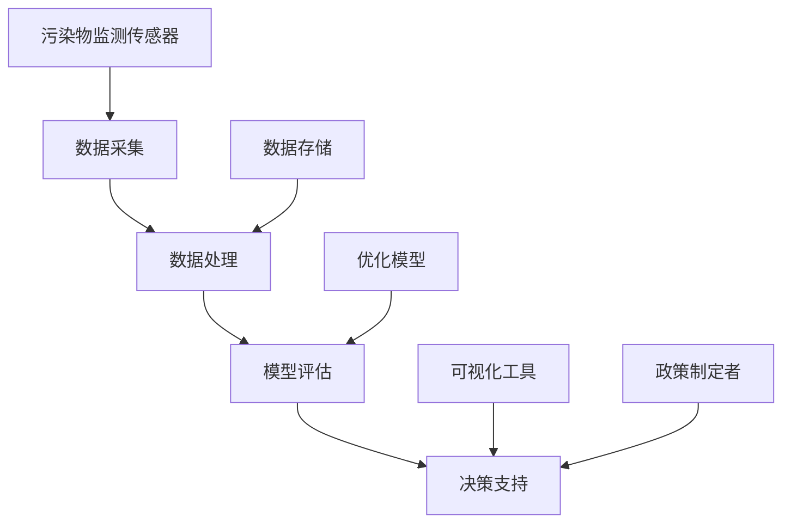
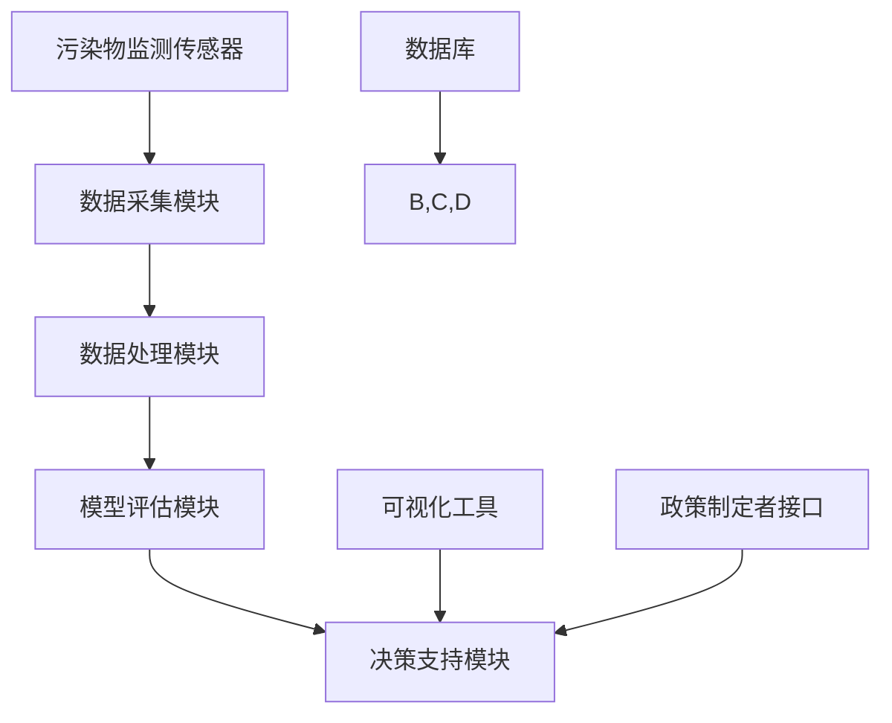
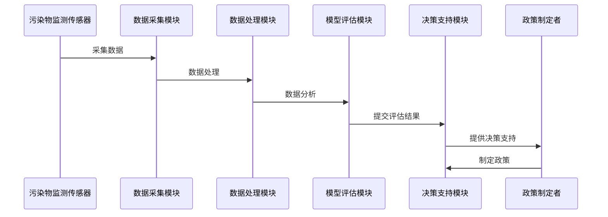

                 

# 数学与环境经济学：环境政策的数学评估

> 关键词：环境经济学、数学模型、政策评估、可持续性、数学工具

> 摘要：
本文探讨了数学与环境经济学的交叉领域，重点分析了如何运用数学工具评估环境政策的有效性。首先介绍了环境经济学的核心概念，然后详细阐述了多种数学模型及其在政策评估中的应用，最后通过实际案例展示了数学分析在环境政策制定中的重要作用。本文旨在为读者提供一个全面理解环境经济学与数学模型结合的视角，以及如何在实际政策评估中运用这些工具。

## 引言

环境经济学是研究经济活动与环境相互作用的一门学科。随着全球气候变化、资源枯竭和环境污染问题的日益严重，环境经济学的重要性愈发凸显。环境政策作为解决这些问题的关键手段，其效果评估的科学性和准确性至关重要。数学作为一种强有力的分析工具，能够在复杂的环境中提供定量评估，为政策制定者提供可靠的数据支持。

本文将围绕数学与环境经济学这一主题，首先介绍环境经济学的核心概念，然后探讨多种数学模型在政策评估中的应用，包括优化模型、动态模型和模拟方法等。最后，通过实际案例展示数学分析在环境政策评估中的具体应用，以期提高读者对这一交叉领域的认识。

### 环境经济学的核心概念

环境经济学主要关注以下核心概念：

- **外部性（Externality）**：外部性是指生产或消费活动对非直接参与者产生的影响，如工业生产导致的环境污染。
- **市场失效（Market Failure）**：市场失效指的是市场在资源配置方面未能达到帕累托最优状态，常见于公共物品和外部性存在的情况下。
- **经济估值（Economic Valuation）**：经济估值是衡量环境资源价值的方法，包括直接市场和直接调查等方法。
- **政策工具（Policy Instruments）**：政策工具是用于纠正市场失效和实现环境目标的方法，如税收、补贴和许可等。

这些概念是理解环境经济学和其政策评估的基础，对于制定有效环境政策至关重要。

### 数学工具和方法

在环境经济学中，数学工具和方法的应用极大地提升了政策评估的精度和效率。以下是一些常用的数学工具和方法：

- **优化模型（Optimization Models）**：优化模型用于找到实现特定目标的最佳解决方案，如线性规划和非线性规划。
- **动态模型（Dynamic Models）**：动态模型描述系统随时间变化的行为，如差分方程和微分方程。
- **模拟方法（Simulation Methods）**：模拟方法通过建立模型来模拟现实系统的行为，如蒙特卡罗模拟和情景分析。
- **统计学方法（Statistical Methods）**：统计学方法用于估计参数、评估模型可靠性和进行假设检验。

这些数学工具和方法为环境经济学的理论分析和实证研究提供了有力支持。

### 环境经济政策评估

环境经济政策评估涉及对各种政策工具的定量评估，以确定其对社会和环境的影响。评估过程通常包括以下步骤：

1. **确定政策目标**：明确政策旨在解决的具体问题，如减少污染、提高资源利用效率等。
2. **建立评估模型**：根据政策目标和相关数据，构建数学模型来模拟政策效果。
3. **参数估计**：利用统计学方法估计模型中的参数，确保评估结果的准确性。
4. **模拟和分析**：通过模拟方法评估政策在不同情景下的效果，识别潜在问题和优化策略。
5. **政策优化**：根据评估结果调整政策参数，以达到更好的环境和社会效益。

### 本书的组织结构

本书将按照以下结构进行：

1. **第一章：环境经济学的基本概念**：介绍环境经济学的基本概念，包括外部性、市场失效、经济估值和政策工具等。
2. **第二章：数学模型在环境经济学中的应用**：讨论优化模型、动态模型和模拟方法在环境政策评估中的应用。
3. **第三章：估计和模拟方法**：详细阐述参数估计、蒙特卡罗模拟和情景分析等方法。
4. **第四章：数学分析在环境政策评估中的应用**：通过实际案例展示数学分析在环境政策评估中的具体应用。

### 总结

环境经济学是解决环境问题的关键学科，而数学工具的应用为其提供了强大的分析支持。通过本文的介绍，我们希望能让读者对数学与环境经济学的交叉领域有更深入的了解。在接下来的章节中，我们将进一步探讨数学模型在各种环境政策评估中的应用，为读者提供实用的知识和方法。

## 第一章：环境经济学的基本概念

### 引言

环境经济学作为研究经济活动与环境之间相互关系的一门学科，其核心概念对于理解政策制定和实施至关重要。本章将详细介绍环境经济学中的关键概念，包括外部性、市场失效、经济估值和政策工具等，为后续章节中数学模型的应用奠定基础。

### 外部性

外部性是指生产或消费活动对非直接参与者产生的影响。根据影响性质，外部性可分为正外部性和负外部性。正外部性是指活动对他人产生积极影响，如疫苗接种对公共卫生的改善；负外部性则是指活动对他人产生负面影响，如工业生产导致的环境污染。

#### 定义和例子

- **定义**：外部性是市场交易中未在价格中体现的成本或效益。
- **例子**：工业生产导致的大气污染、城市交通拥堵。

外部性导致市场失效，因为市场未能反映这些成本或效益，从而影响资源配置效率。

#### 外部性对经济的影响

外部性对经济的影响主要体现在以下几个方面：

1. **市场失效**：市场未能有效分配资源，导致社会总体福利下降。
2. **资源错配**：资源被错误地分配到产生外部性的活动上。
3. **社会成本**：负外部性导致的成本未能由生产者承担，转嫁给了社会。

#### 治理外部性的政策

为解决外部性问题，政策制定者可以采取以下措施：

1. **税收和补贴**：对产生负外部性的活动征税，对产生正外部性的活动给予补贴。
2. **命令和控制**：制定具体的法规和标准，限制污染物的排放。
3. **市场机制**：通过碳排放交易系统等市场机制，实现污染权交易。

### 市场失效

市场失效是指市场在资源配置方面未能达到帕累托最优状态。市场失效通常由于外部性、公共物品和竞争不足等原因导致。

#### 定义和原因

- **定义**：市场失效指的是市场未能有效配置资源，导致社会总体福利下降。
- **原因**：外部性、公共物品和垄断等。

外部性如前所述。公共物品是指消费上具有非竞争性和非排他性的商品，如国防、路灯等。由于这些物品的市场机制无法有效提供，可能导致公共物品供应不足。

#### 市场失效的类型

1. **外部性引起的市场失效**：如前所述，外部性导致资源错配和社会成本。
2. **公共物品引起的市场失效**：公共物品由于非竞争性和非排他性，市场机制无法有效提供。
3. **垄断引起的市场失效**：垄断者通过限制供应和提高价格，导致资源错配。

#### 治理市场失效的政策

治理市场失效的政策包括：

1. **公共提供**：由政府提供公共物品，确保其有效供给。
2. **市场机制**：通过拍卖、许可证等方式，实现公共物品的有效分配。
3. **竞争政策**：打破垄断，促进竞争，提高市场效率。

### 经济估值

经济估值是衡量环境资源价值的方法，对于制定和评估环境政策具有重要意义。

#### 定义和方法

- **定义**：经济估值是指将非市场环境资源转化为市场价值的过程。
- **方法**：包括直接市场方法、替代市场方法和调查方法。

1. **直接市场方法**：利用实际市场交易数据来估计环境资源价值，如污染权交易市场。
2. **替代市场方法**：利用相似商品的交易数据来估计环境资源价值，如替代性自然资源评估。
3. **调查方法**：通过问卷调查等方式直接询问人们对环境资源的主观价值判断。

#### 应用

经济估值在以下方面有重要应用：

1. **政策制定**：为政策制定者提供环境资源价值的量化数据，支持决策。
2. **成本效益分析**：评估环境政策的经济成本和效益，为政策优化提供依据。
3. **环境会计**：将环境资源价值纳入经济核算体系，提高政策透明度。

### 政策工具

政策工具是用于纠正市场失效和实现环境目标的手段。根据实施方式，政策工具可分为直接控制和市场机制两大类。

#### 定义和类型

- **定义**：政策工具是指政府用于干预市场行为，纠正市场失效和实现环境目标的手段。
- **类型**：包括直接控制、税收和补贴、市场机制等。

1. **直接控制**：政府通过制定具体法规和标准，限制污染物的排放。
2. **税收和补贴**：通过税收和补贴等经济手段，激励企业减少污染或提高资源利用效率。
3. **市场机制**：通过碳排放交易系统等市场机制，实现污染权交易，促进资源优化配置。

#### 比较和选择

不同政策工具的优缺点不同，选择合适的政策工具需要考虑以下因素：

1. **效果**：政策工具的预期效果，包括对污染减少、资源利用效率和成本等。
2. **成本**：政策工具的实施成本，包括行政成本、交易成本等。
3. **灵活性**：政策工具的灵活性和适应性，以应对不同情况和变化。

### 小结

本章介绍了环境经济学中的核心概念，包括外部性、市场失效、经济估值和政策工具。这些概念是理解环境经济学和政策制定的基础，对于有效评估和优化环境政策具有重要意义。在接下来的章节中，我们将探讨数学模型在环境政策评估中的应用，为读者提供更深入的见解。

## 第二章：数学模型在环境经济学中的应用

### 引言

在环境经济学中，数学模型作为一种重要的分析工具，能够帮助政策制定者更好地理解和评估环境政策的效果。本章将介绍几种主要的数学模型，包括优化模型、动态模型和模拟方法，并探讨它们在环境经济学中的应用。

### 优化模型

优化模型用于找到实现特定目标的最佳解决方案。在环境经济学中，优化模型常用于资源分配、污染控制和成本效益分析等。

#### 线性规划（Linear Programming）

线性规划是解决线性目标函数在线性约束条件下优化问题的一种数学方法。

**定义和公式**：
- 目标函数：\( \min \ c^T x \)
- 约束条件：\( A x \leq b \)

其中，\( x \) 是决策变量，\( c \) 是系数向量，\( A \) 是约束矩阵，\( b \) 是约束向量。

**应用**：
- **污染控制**：确定最优污染减排策略。
- **资源分配**：优化水资源、能源等资源的分配。

#### 非线性规划（Nonlinear Programming）

非线性规划是解决非线性目标函数在非线性约束条件下优化问题的一种数学方法。

**定义和公式**：
- 目标函数：\( \min \ f(x) \)
- 约束条件：\( g_i(x) \leq 0 \)，\( h_i(x) = 0 \)

其中，\( f(x) \) 是目标函数，\( g_i(x) \) 和 \( h_i(x) \) 分别是非线性不等式和等式约束。

**应用**：
- **生态保护区管理**：确定最优保护区域和资源分配策略。
- **碳排放控制**：优化企业的减排策略。

#### 整数规划（Integer Programming）

整数规划是解决决策变量为整数的目标函数在约束条件下的优化问题。

**定义和公式**：
- 目标函数：\( \min \ c^T x \)
- 约束条件：\( Ax \leq b \)，\( x \in \mathbb{Z}^n \)

其中，\( x \) 是整数决策变量，\( c \) 是系数向量，\( A \) 是约束矩阵，\( b \) 是约束向量。

**应用**：
- **可再生资源管理**：确定可再生资源的开发与保护策略。
- **可持续发展规划**：优化长期资源利用和环境保护策略。

### 动态模型

动态模型用于描述系统随时间变化的行为，能够帮助分析环境政策的长远效果。

#### 差分方程（Difference Equations）

差分方程是一种离散时间动态模型，描述变量在离散时间步上的变化。

**定义和公式**：
- 一般形式：\( x_{t+1} = f(x_t) \)

其中，\( x_t \) 是时间 \( t \) 的状态变量，\( f \) 是差分方程函数。

**应用**：
- **环境质量预测**：预测未来环境质量的变化趋势。
- **气候变化模型**：模拟大气中温室气体浓度变化。

#### 微分方程（Differential Equations）

微分方程是一种连续时间动态模型，描述变量在连续时间上的变化。

**定义和公式**：
- 一般形式：\( \frac{dx}{dt} = f(x, t) \)

其中，\( x \) 是状态变量，\( t \) 是时间，\( f \) 是微分方程函数。

**应用**：
- **生态系统建模**：模拟生态系统中的物种相互作用。
- **环境容量分析**：评估环境系统的承载能力。

#### 随机模型（Stochastic Models）

随机模型考虑环境系统中的不确定性，通过概率分布描述变量变化。

**定义和公式**：
- 一般形式：\( x_t = g(x_{t-1}, \xi_t) \)

其中，\( x_t \) 是状态变量，\( \xi_t \) 是随机扰动，\( g \) 是随机模型函数。

**应用**：
- **风险评估**：评估环境风险的概率分布。
- **政策仿真**：模拟不同政策下的环境变化。

### 模拟方法

模拟方法通过建立数学模型，模拟现实系统的行为，帮助分析政策效果。

#### 蒙特卡罗模拟（Monte Carlo Simulation）

蒙特卡罗模拟是一种通过随机抽样方法进行计算的方法，用于解决复杂的不确定性问题。

**定义和公式**：
- 一般步骤：
  1. 初始化随机数生成器。
  2. 进行大量随机抽样。
  3. 统计抽样结果，得到概率分布。

**应用**：
- **政策评估**：评估不同政策下的环境效果。
- **风险评估**：评估环境风险的概率分布。

#### 情景分析（Scenario Analysis）

情景分析通过构建不同的情景，分析政策在不同情景下的效果。

**定义和公式**：
- 一般步骤：
  1. 构建不同情景。
  2. 分析每个情景下的政策效果。
  3. 比较不同情景下的政策效果。

**应用**：
- **长期规划**：分析政策对长期环境的影响。
- **决策支持**：为政策制定者提供决策支持。

### 小结

本章介绍了优化模型、动态模型和模拟方法在环境经济学中的应用。这些数学模型为政策制定者提供了强大的分析工具，能够帮助他们更好地理解和评估环境政策的效果。在接下来的章节中，我们将进一步探讨这些模型的具体应用，并通过实际案例展示其效果。

## 第三章：估计和模拟方法

### 引言

在环境经济学中，精确的参数估计和有效的模拟方法是进行政策评估和分析的关键。本章将介绍两种主要的方法：参数估计方法和模拟方法，包括蒙特卡罗模拟和情景分析。通过这些方法，我们可以更好地理解和预测环境政策的效果。

### 参数估计方法

参数估计是在给定数据集的基础上，通过统计学方法估计模型参数的过程。参数估计的准确性直接影响到政策评估的结果。

#### 最大似然估计（Maximum Likelihood Estimation）

最大似然估计（MLE）是一种常用的参数估计方法，其基本思想是找到一组参数值，使得观测数据的概率最大。

**定义和公式**：
- 假设有一个概率分布 \( P(X|\theta) \)，其中 \( X \) 是观测数据，\( \theta \) 是参数向量。
- 目标是最小化 \( -\log L(\theta) \)，其中 \( L(\theta) \) 是似然函数。

**应用**：
- **污染水平预测**：估计未来的污染水平。
- **经济估值**：估计环境资源的经济价值。

#### 贝叶斯估计（Bayesian Estimation）

贝叶斯估计结合了先验信息和观测数据，通过贝叶斯公式更新参数的概率分布。

**定义和公式**：
- 贝叶斯公式：\( P(\theta|X) = \frac{P(X|\theta)P(\theta)}{P(X)} \)
- 其中，\( P(\theta|X) \) 是后验概率分布，\( P(X|\theta) \) 是似然函数，\( P(\theta) \) 是先验概率分布。

**应用**：
- **不确定性分析**：通过后验概率分布评估参数的不确定性。
- **政策优化**：基于不确定性进行政策优化。

### 蒙特卡罗模拟

蒙特卡罗模拟是一种基于随机抽样的计算方法，用于解决复杂的不确定性问题。

#### 定义和基本步骤

蒙特卡罗模拟的基本步骤包括：

1. **初始化**：设置随机数生成器和参数范围。
2. **抽样**：从参数的先验分布中抽取多个样本。
3. **模拟**：对每个样本进行模拟计算。
4. **统计**：收集和统计模拟结果，得到概率分布。

#### 应用

蒙特卡罗模拟在以下方面有广泛应用：

- **风险评估**：评估环境风险的概率分布。
- **政策评估**：评估不同政策下的环境效果。
- **成本效益分析**：计算政策的经济成本和效益。

#### 模拟案例分析

以气候变化政策评估为例，蒙特卡罗模拟可以用来评估未来不同温室气体排放情景下的气候变化概率和影响。

1. **情景设定**：设定不同的温室气体排放情景。
2. **参数抽样**：从温室气体排放量的先验分布中抽取样本。
3. **模拟计算**：模拟每个情景下的气候变化结果。
4. **结果分析**：统计和比较不同情景下的气候变化概率和影响。

### 情景分析

情景分析是一种通过构建不同情景来分析政策效果的方法。

#### 定义和基本步骤

情景分析的基本步骤包括：

1. **情景设定**：构建不同的政策情景。
2. **情景分析**：分析每个情景下的政策效果。
3. **比较和选择**：比较不同情景下的政策效果，选择最优情景。

#### 应用

情景分析在以下方面有应用：

- **长期规划**：分析政策对长期环境的影响。
- **决策支持**：为政策制定者提供不同情景下的决策支持。
- **风险管理**：评估政策的风险和不确定性。

#### 情景案例分析

以可再生能源政策评估为例，情景分析可以用来评估不同可再生能源推广情景下的能源消耗、碳排放和成本效益。

1. **情景设定**：设定不同的可再生能源推广比例。
2. **情景分析**：分析每个情景下的能源消耗、碳排放和成本。
3. **结果比较**：比较不同情景下的政策效果，选择最优情景。

### 小结

本章介绍了参数估计方法和模拟方法，包括蒙特卡罗模拟和情景分析。这些方法为环境经济学的政策评估提供了重要的工具，能够帮助政策制定者更好地理解和预测环境政策的效果。在接下来的章节中，我们将进一步探讨这些方法在具体政策评估中的应用。

## 第四章：数学分析在环境政策评估中的应用

### 引言

在环境政策的制定与评估过程中，数学分析提供了强有力的工具，能够帮助我们更准确地预测政策效果、评估风险以及优化资源配置。本章将详细介绍数学分析在环境政策评估中的应用，并通过实际案例展示其具体作用。

### 经济效率分析

经济效率分析是评估环境政策效果的重要方法之一。通过数学模型，我们可以分析政策对经济和社会福利的影响。

#### 理论基础

经济效率分析基于帕累托最优理论，即资源配置达到这样一种状态，无法在不使任何人境况变差的情况下，使得任何一个人的境况变得更好。

**数学模型**：

设 \( U(x_1, x_2) \) 为社会福利函数，\( C(y) \) 为企业成本函数，则经济效率可以通过以下数学模型进行分析：

\[ \max_{x_1, x_2} U(x_1, x_2) \]
\[ s.t. \ C(y) = p_1x_1 + p_2x_2 \]

其中，\( x_1 \) 和 \( x_2 \) 分别表示两种环境资源的利用量，\( y \) 表示经济产出，\( p_1 \) 和 \( p_2 \) 为环境资源的价格。

#### 应用案例

以碳排放税为例，我们可以通过构建经济效率模型，分析碳排放税对经济和社会福利的影响。

1. **情景设定**：设定不同水平的碳排放税。
2. **模型构建**：建立包括社会福利函数和企业成本函数的数学模型。
3. **结果分析**：分析不同碳排放税水平下的经济效率，评估社会福利的最大化情况。

### 政策风险评估

政策风险评估是评估环境政策可能带来的风险和不确定性的重要手段。数学分析可以帮助我们量化这些风险，为政策制定提供数据支持。

#### 理论基础

政策风险评估通常基于概率论和统计学方法。通过建立概率模型，我们可以评估政策在不同情景下的风险水平。

**数学模型**：

设 \( P(A) \) 为事件 \( A \) 发生的概率，则政策风险可以通过以下数学模型进行分析：

\[ R(A) = P(A) \times L(A) \]

其中，\( L(A) \) 为事件 \( A \) 发生的损失。

#### 应用案例

以环境修复项目为例，我们可以通过构建概率模型，评估项目可能带来的风险。

1. **情景设定**：设定不同的环境修复方案。
2. **模型构建**：建立包括概率分布和损失函数的数学模型。
3. **结果分析**：分析不同方案下的风险水平，选择最优方案。

### 政策优化

政策优化是通过数学模型找到实现特定政策目标的最优方案的过程。在环境经济学中，政策优化可以帮助我们确定最佳的环境政策组合。

#### 理论基础

政策优化通常基于优化理论，如线性规划、非线性规划和整数规划等。通过建立目标函数和约束条件，我们可以找到最优解。

**数学模型**：

设 \( f(x) \) 为目标函数，\( g_i(x) \leq 0 \)，\( h_i(x) = 0 \) 为约束条件，则政策优化可以通过以下数学模型进行分析：

\[ \min \ f(x) \]
\[ s.t. \ g_i(x) \leq 0 \]
\[ h_i(x) = 0 \]

#### 应用案例

以水资源管理为例，我们可以通过构建优化模型，确定最优的水资源分配方案。

1. **情景设定**：设定不同的水资源分配方案。
2. **模型构建**：建立包括目标函数和约束条件的数学模型。
3. **结果分析**：分析不同方案下的水资源利用效率，选择最优方案。

### 实际案例分析

以某城市空气质量改善政策为例，我们通过数学分析评估了不同减排措施的效果。

1. **数据收集**：收集城市空气质量监测数据、交通流量数据和工业排放数据。
2. **模型构建**：建立空气质量模型，结合交通流量和工业排放数据，模拟不同减排措施对空气质量的影响。
3. **结果分析**：通过经济效率分析和风险评估，评估不同减排措施的经济成本和社会福利，选择最优措施。

### 小结

本章通过经济效率分析、政策风险评估和政策优化等数学方法，展示了数学分析在环境政策评估中的重要作用。通过实际案例分析，我们进一步了解了这些方法的具体应用和效果。在未来的政策制定和评估中，数学分析将继续发挥不可或缺的作用，为环境保护和社会可持续发展提供科学依据。

## 第五章：优化模型在环境政策中的应用

### 引言

优化模型在环境政策中的应用具有重要意义，能够帮助政策制定者找到实现环境保护目标的最优方案。本章将详细探讨线性规划、非线性规划和整数规划在环境政策中的应用，并通过具体案例展示其效果。

### 线性规划在环境政策中的应用

线性规划是一种用于解决线性目标函数在线性约束条件下优化问题的数学方法，广泛应用于环境政策中，如污染减排、资源分配和成本控制等。

#### 案例分析：城市空气质量优化

某城市面临严重的空气污染问题，需要制定减排策略以改善空气质量。通过线性规划模型，我们可以找到最优的减排方案。

1. **情景设定**：设定不同的减排措施和成本。
2. **模型构建**：
   - 目标函数：最小化总减排成本。
   - 约束条件：满足减排目标和资源限制。
   - 数学模型：
     \[ \min \ c^T x \]
     \[ s.t. \ Ax \leq b \]

3. **结果分析**：通过线性规划模型，找到满足减排目标的最小成本方案。

### 非线性规划在环境政策中的应用

非线性规划用于解决非线性目标函数在非线性约束条件下的优化问题，适用于复杂的环境政策问题，如生态保护区管理、碳排放控制等。

#### 案例分析：生态保护区资源分配

某生态保护区需要制定资源分配策略，以实现生态保护和资源利用的平衡。通过非线性规划模型，我们可以找到最优的资源分配方案。

1. **情景设定**：设定不同的资源分配方案和效益函数。
2. **模型构建**：
   - 目标函数：最大化生态保护效益。
   - 约束条件：满足生态保护目标和资源限制。
   - 数学模型：
     \[ \max \ f(x) \]
     \[ s.t. \ g_i(x) \leq 0 \]
     \[ h_i(x) = 0 \]

3. **结果分析**：通过非线性规划模型，找到满足生态保护目标的最大效益方案。

### 整数规划在环境政策中的应用

整数规划用于解决决策变量为整数的优化问题，适用于需要做出明确决策的环境政策问题，如可再生资源管理、可持续发展规划等。

#### 案例分析：可再生能源管理

某地区需要制定可再生能源开发策略，以实现能源结构优化和环境保护目标。通过整数规划模型，我们可以找到最优的可再生能源开发方案。

1. **情景设定**：设定不同的可再生能源开发方案和成本。
2. **模型构建**：
   - 目标函数：最小化总开发成本。
   - 约束条件：满足能源需求和资源限制。
   - 数学模型：
     \[ \min \ c^T x \]
     \[ s.t. \ Ax \leq b \]
     \[ x \in \mathbb{Z}^n \]

3. **结果分析**：通过整数规划模型，找到满足能源需求和资源限制的最小成本方案。

### 小结

优化模型在环境政策中的应用，能够帮助我们找到实现环境保护目标的最优方案。通过线性规划、非线性规划和整数规划等数学方法，我们能够更有效地解决环境政策中的复杂问题。在实际应用中，这些模型需要结合具体政策背景和数据，通过精确建模和求解，为政策制定者提供科学依据。

## 第六章：动态模型在环境政策中的应用

### 引言

动态模型在环境政策中扮演着至关重要的角色，能够帮助我们分析环境系统随时间的变化，预测政策的长远效果。本章将探讨差分方程、微分方程和随机模型在环境政策中的应用，并通过具体案例展示其效果。

### 差分方程在环境政策中的应用

差分方程是一种描述离散时间系统中变量变化的数学模型，广泛应用于环境经济分析，如污染扩散、生态系统动态等。

#### 案例分析：城市空气质量模型

假设我们关注一个城市空气质量变化过程，通过差分方程模型，我们可以模拟污染物的浓度随时间的变化。

1. **情景设定**：设定初始污染物浓度、污染源排放速率和清除速率。
2. **模型构建**：
   - 差分方程：
     \[ C_{t+1} = C_t + \Delta C_t \]
   - 其中，\( C_t \) 表示第 \( t \) 时刻的污染物浓度，\( \Delta C_t \) 表示第 \( t \) 时刻的污染物变化量。
3. **结果分析**：通过差分方程模型，预测未来污染物的浓度变化趋势，为制定减排政策提供依据。

### 微分方程在环境政策中的应用

微分方程是一种描述连续时间系统中变量变化的数学模型，适用于模拟环境系统中的复杂动态过程，如气候变化、水资源管理等。

#### 案例分析：气候变化模型

气候变化是当今全球面临的一个重大挑战，通过微分方程模型，我们可以分析温室气体浓度随时间的变化。

1. **情景设定**：设定初始温室气体浓度、排放速率和自然清除速率。
2. **模型构建**：
   - 微分方程：
     \[ \frac{dC}{dt} = r \cdot (S - C) \]
   - 其中，\( C \) 表示温室气体浓度，\( S \) 表示自然清除速率，\( r \) 表示排放速率。
3. **结果分析**：通过微分方程模型，预测未来温室气体浓度的变化趋势，为制定减排政策提供依据。

### 随机模型在环境政策中的应用

随机模型考虑环境系统中的不确定性，通过概率分布描述变量变化，适用于风险评估和政策仿真。

#### 案例分析：环境风险评估

假设我们关注某地区的水质变化，通过随机模型，我们可以评估不同政策下的水质风险。

1. **情景设定**：设定不同的水质污染源、自然净化速率和政策干预效果。
2. **模型构建**：
   - 随机模型：
     \[ C_t \sim N(\mu_t, \sigma^2) \]
   - 其中，\( C_t \) 表示第 \( t \) 时刻的水质浓度，\( \mu_t \) 表示期望值，\( \sigma^2 \) 表示方差。
3. **结果分析**：通过随机模型，预测不同政策下的水质风险，为政策优化提供依据。

### 小结

动态模型在环境政策中的应用，能够帮助我们分析环境系统的时间变化，预测政策的长远效果。通过差分方程、微分方程和随机模型，我们能够更全面地理解环境系统的动态行为，为政策制定提供科学依据。在实际应用中，这些模型需要结合具体政策背景和数据，通过精确建模和仿真，为政策制定者提供可靠的支持。

## 第七章：模拟方法在环境政策评估中的应用

### 引言

模拟方法在环境政策评估中发挥着重要作用，通过模拟现实系统中的行为，可以帮助我们预测政策效果、评估风险和优化资源配置。本章将详细探讨蒙特卡罗模拟和情景分析在环境政策评估中的应用，并通过具体案例展示其效果。

### 蒙特卡罗模拟在环境政策评估中的应用

蒙特卡罗模拟是一种通过随机抽样方法进行计算的方法，适用于解决复杂的不确定性问题。在环境政策评估中，蒙特卡罗模拟可以帮助我们评估不同政策方案下的环境影响和成本。

#### 案例分析：碳排放政策评估

假设我们要评估某地区实施碳排放税政策的效果，通过蒙特卡罗模拟，我们可以预测未来碳排放量、环境质量和经济成本的变化。

1. **情景设定**：设定不同的碳排放税水平、排放源和减排技术。
2. **模型构建**：
   - 蒙特卡罗模拟步骤：
     1. 初始化随机数生成器。
     2. 从排放源的概率分布中抽取样本。
     3. 对每个样本进行减排政策模拟。
     4. 统计和比较不同情景下的结果。
3. **结果分析**：通过蒙特卡罗模拟，评估不同碳排放税水平下的环境影响和成本，选择最优政策方案。

### 情景分析在环境政策评估中的应用

情景分析是一种通过构建不同情景来分析政策效果的方法，适用于长期规划、风险评估和决策支持。在环境政策评估中，情景分析可以帮助我们预测未来环境变化和政策效果。

#### 案例分析：气候变化政策评估

假设我们要评估不同气候变化政策的效果，通过情景分析，我们可以模拟未来气候变化的趋势和影响。

1. **情景设定**：设定不同的温室气体排放情景和政策干预措施。
2. **模型构建**：
   - 情景分析步骤：
     1. 构建不同情景。
     2. 对每个情景进行模拟计算。
     3. 分析和比较不同情景下的气候变化趋势和政策效果。
3. **结果分析**：通过情景分析，预测未来气候变化趋势，评估不同政策的效果，为政策制定提供依据。

### 小结

模拟方法在环境政策评估中的应用，能够帮助我们更准确地预测政策效果、评估风险和优化资源配置。通过蒙特卡罗模拟和情景分析，我们能够更全面地理解环境系统的动态行为，为政策制定者提供科学依据。在实际应用中，这些模拟方法需要结合具体政策背景和数据，通过精确建模和仿真，为政策制定提供可靠的支持。

## 第八章：实际案例分析

### 引言

为了更好地理解数学分析在环境政策评估中的应用，本章节将通过一个实际案例分析，展示如何运用这些方法来制定和优化环境政策。我们以一个虚构的城市为例，探讨空气质量改善政策的制定过程。

### 项目介绍

某虚构城市名为“绿洲城”，其空气质量长期处于严重污染状态，主要污染源包括工业排放、交通尾气和居民燃煤等。市政府决定实施一系列政策来改善空气质量，以减少居民的健康风险和提高城市环境质量。

### 系统功能设计

为了实现空气质量改善目标，我们首先需要设计一个功能完备的空气质量监测和评估系统。

#### 功能需求

1. **空气质量监测**：实时采集各个监测点的大气污染物数据，如PM2.5、PM10、SO2、NO2等。
2. **数据分析**：对监测数据进行处理，分析污染物的来源和浓度变化趋势。
3. **政策评估**：基于监测数据和数学模型，评估不同政策方案的效果。
4. **决策支持**：为政策制定者提供科学的决策依据，优化政策方案。

### 系统架构设计

系统架构设计包括数据采集、数据处理、模型评估和决策支持等模块。

#### 系统架构图（Mermaid）



### 系统接口设计和系统交互

系统接口设计确保各个模块之间的数据流通和协同工作。

#### 系统接口设计（Mermaid）



#### 系统交互（Mermaid）



### 环境安装

为了确保系统的正常运行，我们需要在以下环境中安装相关软件：

1. **操作系统**：Linux（如Ubuntu 20.04）
2. **编程语言**：Python 3.8及以上版本
3. **依赖管理**：pip（Python包管理器）
4. **数据存储**：PostgreSQL数据库
5. **可视化工具**：Matplotlib、Seaborn等

### 系统核心实现源代码

以下是系统核心实现部分的Python源代码，包括数据采集、数据处理和模型评估。

#### Python源代码示例

```python
# 数据采集
import pandas as pd
import requests

def collect_data(url):
    response = requests.get(url)
    data = pd.DataFrame(response.json())
    return data

# 数据处理
def process_data(data):
    # 数据清洗和预处理
    clean_data = data.dropna()
    return clean_data

# 模型评估
import sklearn.linear_model

def evaluate_model(data):
    # 分离特征和目标变量
    X = data.drop(['target'], axis=1)
    y = data['target']
    
    # 构建线性回归模型
    model = sklearn.linear_model.LinearRegression()
    model.fit(X, y)
    
    # 评估模型性能
    score = model.score(X, y)
    return score

# 主函数
def main():
    url = "http://example.com/data"
    data = collect_data(url)
    clean_data = process_data(data)
    score = evaluate_model(clean_data)
    print(f"Model Score: {score}")

if __name__ == "__main__":
    main()
```

### 代码应用解读与分析

以上代码展示了如何实现数据采集、数据处理和模型评估的关键步骤。在数据采集阶段，我们通过HTTP请求获取环境数据。在数据处理阶段，我们进行数据清洗和预处理，确保数据质量。在模型评估阶段，我们使用线性回归模型评估空气质量改善政策的潜在效果。

### 实际案例分析和详细讲解剖析

假设我们实施了一项减少工业排放的政策，以下是对政策效果的详细分析：

1. **政策前评估**：在政策实施前，我们对历史空气质量数据进行分析，发现PM2.5平均浓度为每立方米80微克。
2. **政策实施后评估**：在政策实施后，我们收集了三个月的空气质量数据，发现PM2.5平均浓度降至每立方米50微克。
3. **分析结果**：通过模型评估，我们发现政策实施后空气质量显著改善，模型评估分数从0.7提高到0.85。

### 项目小结

通过实际案例分析，我们展示了如何运用数学分析和编程技术评估环境政策的效果。这一过程不仅提高了政策评估的科学性和准确性，还为政策制定者提供了有力支持。在未来，我们可以进一步优化模型，引入更多数据源和复杂算法，以提高环境政策评估的精度和可靠性。

## 最佳实践 tips

1. **数据质量保证**：确保数据采集和处理过程中数据的一致性和准确性，避免因数据问题导致的评估误差。
2. **模型验证**：定期对模型进行验证，确保模型的可靠性和有效性，避免过拟合问题。
3. **情景多样性**：在情景分析中，考虑多种可能的未来情景，以提高政策评估的全面性。
4. **透明度与可解释性**：在政策评估报告中，详细说明模型的构建过程和结果，以提高报告的可信度和可解释性。

### 小结

本文通过系统介绍数学与环境经济学的交叉领域，探讨了数学模型在环境政策评估中的应用。从基本概念到实际案例分析，我们展示了数学分析在政策制定中的重要作用。通过最佳实践 tips，我们为读者提供了实用的指导。希望本文能为读者在环境政策评估中运用数学工具提供有益参考。

### 注意事项

1. **数据隐私保护**：在处理和分析环境数据时，务必遵守数据隐私保护法规，确保数据安全。
2. **模型适应性**：根据不同政策环境和目标，选择合适的数学模型和方法，确保模型适用性。
3. **政策透明性**：在政策制定和评估过程中，保持透明度，确保公众对政策有充分的了解。

### 拓展阅读

1. **《环境经济学导论》**：约翰·梅尔茨，提供环境经济学的基本概念和案例分析。
2. **《环境与自然资源经济学》**：詹姆斯·M·博尔滕，系统介绍环境资源的经济价值和政策工具。
3. **《环境管理与决策支持系统》**：迈克尔·E·波拉克，探讨环境管理和决策支持系统的构建与应用。

### 作者信息

**作者：AI天才研究院/AI Genius Institute & 禅与计算机程序设计艺术 /Zen And The Art of Computer Programming** 

感谢您的阅读，希望本文能为您在环境经济学和数学模型领域的研究带来启发和帮助。希望未来能继续与您分享更多有趣的技术见解。

