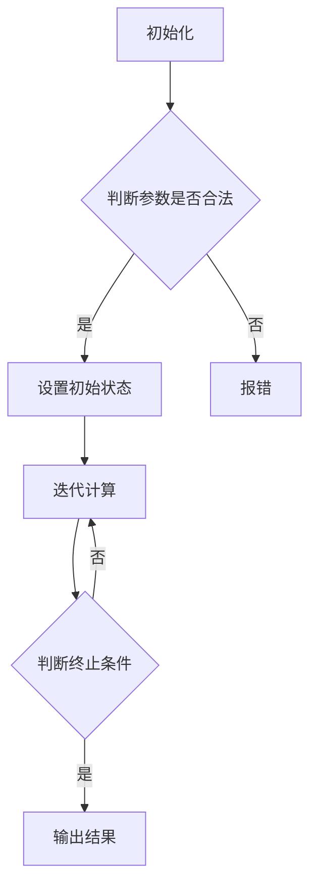
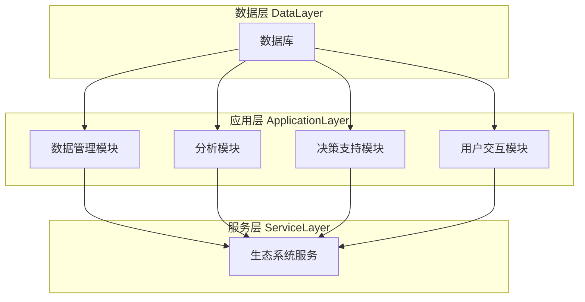
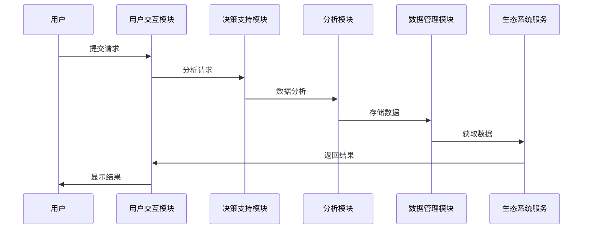

                 

### 数学与生态系统管理：生态平衡的数学模型

---

## 第1章 引言

### 1.1 问题背景

生态系统的概念源于生物学家对生物之间相互作用的观察与研究，它指的是由生物群落及其生活环境组成的统一整体。生态系统包括生物部分（生产者、消费者、分解者）和非生物部分（阳光、水、土壤等）。生态系统具有多种功能，如物质循环、能量流动、信息传递等，对地球上的生物生存至关重要。

生态系统管理是指通过科学的方法和手段，对生态系统进行合理规划、保护、恢复和利用，以实现生态平衡和可持续发展。生态平衡指的是在特定生态系统中，生物与生物、生物与环境之间相互作用达到相对稳定的状态，生态系统的功能能够长期保持稳定和高效。

随着工业化和城市化进程的加快，生态系统面临着前所未有的压力。污染、过度捕捞、森林砍伐、气候变化等问题不断加剧，生态平衡受到严重威胁。因此，研究生态平衡的数学模型，对于生态系统管理具有重要的理论和实践意义。

### 1.2 问题描述

生态平衡的概念涉及多个层面，包括能量平衡、物质平衡和生物多样性平衡。能量平衡指的是生态系统中能量输入和输出的平衡状态；物质平衡则涉及生态系统中物质循环的平衡；生物多样性平衡则关注生物种类和数量的平衡状态。

生态平衡的特征主要包括稳定性、动态性和适应性。稳定性指的是生态系统在受到外界干扰后能够迅速恢复到平衡状态；动态性则表明生态平衡是一个不断变化的过程；适应性则反映了生态系统对外界变化的响应能力。

生态系统管理的主要任务包括保护生态系统、维护生态平衡、促进生态恢复和实现可持续发展。具体目标包括减少环境污染、恢复生态系统服务功能、提高生物多样性等。

### 1.3 问题解决

数学模型在生态系统管理中具有重要作用，它能够帮助我们理解和预测生态系统的动态变化，为生态系统管理提供科学依据。生态系统管理的数学模型主要包括静态模型和动态模型。

静态模型主要用于描述生态系统的结构特征，如物种分布、栖息地条件等。这类模型结构简单，易于理解和计算，适合用于生态系统结构分析。

动态模型则用于描述生态系统的动态变化过程，如物种数量变化、能量流动等。这类模型更加复杂，能够捕捉生态系统的动态特征，适合用于生态系统功能评估。

此外，还有线性模型和非线性模型等。线性模型假设生态系统的变化是线性的，适合用于简单生态系统的分析；非线性模型则假设生态系统的变化是非线性的，能够更好地捕捉复杂生态系统的特征。

### 1.4 边界与外延

数学模型在生态系统管理中的应用范围广泛，从局部生态系统到全球生态系统，从静态分析到动态模拟，都可以应用数学模型。然而，数学模型也存在局限性，如对生态系统复杂性描述的不完整性、参数估计的不确定性等。

生态系统管理不仅依赖于数学模型，还需要结合其他工具和方法，如遥感技术、地理信息系统（GIS）和现场监测等。这些工具和方法能够提供更全面、准确的生态数据，为数学模型的应用提供支持。

### 1.5 概念结构与核心要素组成

生态平衡的定义和度量是生态系统管理的核心问题。生态平衡的定义涉及能量平衡、物质平衡和生物多样性平衡等多个方面。度量生态平衡的方法包括生物指标、生态指数和环境质量指数等。

生态系统管理的数学模型包括多个核心要素，如生态系统状态变量、影响因素、控制变量等。这些要素通过数学公式和算法相互关联，形成一个完整的数学模型体系。

---

在下一章中，我们将深入探讨生态平衡的核心概念，包括生态平衡的定义、特征和类型，以及生态平衡的数学描述。这将为我们后续的分析和模型构建奠定坚实的基础。

## 第2章 核心概念

### 2.1 生态平衡

生态平衡是指一个生态系统中各种生物和非生物因素之间保持相对稳定和协调的状态。生态平衡不仅是生态系统健康和功能维持的基础，也是实现可持续发展的关键。生态平衡的定义和特征多种多样，以下从多个角度进行详细阐述。

#### 2.1.1 生态平衡的定义

生态平衡可以从以下几个角度进行定义：

1. **能量平衡**：生态系统中能量的输入（如太阳能）和输出（如生物呼吸作用、分解作用等）保持平衡。
2. **物质循环**：生态系统中的物质（如碳、氮、磷等）通过生物和物理过程进行循环，保持动态平衡。
3. **生物多样性**：生态系统中各种生物种类的数量和分布保持稳定，不同物种之间形成复杂而稳定的相互关系。
4. **生态位**：生态系统中的每个物种都占据特定的生态位，这些生态位之间相互平衡，共同维持生态系统的稳定。

#### 2.1.2 生态平衡的特征

生态平衡具有以下几个主要特征：

1. **稳定性**：生态系统在受到外界干扰后，能够通过内部调节机制恢复到原有的平衡状态。
2. **动态性**：生态平衡是一个动态变化的过程，随着时间和环境条件的变化，生态系统的平衡状态也在不断调整。
3. **适应性**：生态系统具有对外界变化的适应能力，能够在新的环境中重新建立平衡。
4. **复杂性**：生态平衡是一个复杂的多因素相互作用的过程，涉及生物、物理、化学等多个方面的因素。

#### 2.1.3 生态平衡的类型

生态平衡可以按照不同的分类方式进行划分：

1. **静态平衡**：生态系统中各种生物和非生物因素在某个时刻处于相对稳定的状态，但系统内部可能存在微小的波动。
2. **动态平衡**：生态系统中各种生物和非生物因素不断变化，但总体上保持平衡状态。
3. **能量平衡**：生态系统能量输入和输出的平衡状态。
4. **物质循环平衡**：生态系统中物质循环的动态平衡状态。
5. **生物多样性平衡**：生态系统内各种生物种类的数量和分布的平衡状态。

#### 2.1.4 生态平衡的数学描述

生态平衡的数学描述主要涉及以下几个方面的数学模型：

1. **能量流动模型**：使用能量流图或能量平衡方程描述生态系统中能量的输入、传递和转化过程。
2. **物质循环模型**：使用物质循环方程描述生态系统中物质的循环过程，如碳循环、氮循环等。
3. **生态位模型**：使用生态位理论描述生态系统中不同物种的相互关系和平衡状态。
4. **生物多样性指数**：使用多样性指数（如香农指数、辛普森指数等）量化生态系统的多样性水平。

生态平衡的数学模型不仅可以帮助我们理解生态系统的动态变化规律，还可以为生态系统管理提供科学依据。通过建立和优化生态平衡模型，我们可以更好地预测生态系统的变化趋势，制定有效的生态保护策略。

在下一章中，我们将继续探讨生态系统的功能，包括生态系统的基本功能以及它们如何通过数学模型进行描述。这将有助于我们更全面地理解生态系统如何维持和调整其平衡状态。

### 2.2 生态系统功能

生态系统是生物与其环境之间相互作用形成的复杂系统，它不仅为生物提供了生存空间，还通过一系列功能维持生态平衡和可持续发展。生态系统的功能多种多样，主要包括物质循环、能量流动、生物多样性维护和生态系统服务功能等。以下是这些功能的基本描述及其在生态系统管理中的重要性。

#### 2.2.1 物质循环

物质循环是生态系统的基本功能之一，涉及生态系统中各种物质的循环过程，如碳、氮、磷、水等。这些物质在生物体内循环，通过光合作用、呼吸作用、消化作用等生物过程，以及物理和化学过程在水、空气和土壤中的转化，实现循环和再利用。

- **碳循环**：碳是生命的基本元素，通过光合作用和呼吸作用，碳在生物、大气和水体之间循环。
- **氮循环**：氮循环涉及固氮、硝化、反硝化和氨化等过程，对植物的生长和土壤肥力至关重要。
- **磷循环**：磷主要通过生物死亡和分解进入土壤，并通过植物吸收和沉积在沉积物中循环。

物质循环的数学模型主要包括物质平衡方程和物质循环模型，这些模型描述了物质在生态系统中的流动和转化过程，为生态系统管理提供了科学依据。

#### 2.2.2 能量流动

能量流动是生态系统中另一个关键功能，它描述了能量从太阳到生物体内的传递和转化过程。能量主要通过光合作用转化为生物可利用形式，并通过食物链和食物网在生物之间传递。

- **能量输入**：主要通过太阳辐射输入到生态系统中，植物通过光合作用将其转化为化学能。
- **能量传递**：通过食物链和食物网在生物之间传递，能量在每个营养级上都有损失，一般只有10%-20%的能量能够传递到下一个营养级。
- **能量转化**：能量在生态系统中的转化形式包括化学能、热能和机械能等。

能量流动的数学模型主要包括能量流图和能量平衡方程，这些模型描述了能量在生态系统中的输入、传递和转化过程，有助于我们理解和预测生态系统的能量动态。

#### 2.2.3 生物多样性维护

生物多样性是生态系统的关键功能之一，它通过维持物种间的复杂关系和生态位的多样性和稳定性，为生态系统的健康和功能提供保障。生物多样性维护涉及多个方面，如物种丰富度、遗传多样性、生态系统多样性等。

- **物种丰富度**：指生态系统中不同物种的数量。
- **遗传多样性**：指物种内部基因的多样性，对物种的适应性和进化至关重要。
- **生态系统多样性**：指生态系统的类型和结构多样性。

生物多样性的数学模型主要包括多样性指数模型和生物多样性评估模型，这些模型通过量化生物多样性水平，帮助生态系统管理者评估和优化生物多样性保护措施。

#### 2.2.4 生态系统服务功能

生态系统服务功能是指生态系统为人类社会提供的各种服务，如食物供应、水资源、气候调节、土壤保持等。这些服务对人类社会的生存和发展至关重要。

- **食物供应**：生态系统提供各种食物资源，支持人类的农业生产和渔业活动。
- **水资源**：生态系统通过地表水系和地下水系统提供水资源，满足人类生活和工业需求。
- **气候调节**：生态系统通过光合作用和蒸腾作用调节气候，影响全球气候模式。
- **土壤保持**：生态系统通过植被覆盖和根系固定土壤，防止土壤侵蚀。

生态系统服务功能的数学模型主要包括生态系统服务评估模型和生态系统价值评估模型，这些模型通过量化生态系统服务对人类社会的重要性和价值，为生态系统管理提供科学依据。

在了解了生态系统的基本功能之后，我们将在下一章中探讨生态系统的结构，包括生态系统的组成和结构特征，以及如何通过数学模型来描述这些结构。这将有助于我们更全面地理解生态系统的运作机制和平衡状态。

### 2.3 生态系统的结构

生态系统的结构是指其组成成分及其相互关系的空间和时空配置。理解生态系统的结构对于生态系统管理至关重要，因为它直接关系到生态系统的功能、稳定性和可持续性。生态系统的结构可以从多个层面进行描述，包括物种结构、空间结构和营养结构等。

#### 2.3.1 物种结构

物种结构是指生态系统中各种生物物种的组成和相互关系。它通常包括以下几个方面：

1. **物种丰富度**：指生态系统中不同物种的数量，是衡量生态系统生物多样性的重要指标。
2. **物种多样性**：包括物种的丰富度、均匀度和特殊性，反映生态系统内物种的多样性和复杂度。
3. **群落组成**：描述生态系统中不同物种的相对丰度和分布特征，群落结构对生态系统的稳定性和功能具有重要影响。

物种结构的数学模型主要包括物种多样性指数模型，如香农指数（Shannon Diversity Index）、辛普森指数（Simpson Diversity Index）等。这些模型通过量化物种丰富度和均匀度，为生态系统管理提供科学依据。

#### 2.3.2 空间结构

空间结构是指生态系统中生物和非生物成分在空间上的分布和配置。空间结构可以影响生态系统的能量流动、物质循环和生物多样性。以下是一些关键概念：

1. **空间异质性**：指生态系统中不同区域的环境条件存在差异，这种异质性可以促进物种多样性和生态系统功能的多样化。
2. **空间格局**：描述生态系统中物种和环境的分布模式，如均匀分布、随机分布和集群分布等。
3. **斑块性**：指生态系统中不同生态斑块的存在，斑块之间的相互关系和空间配置对生态系统的稳定性具有重要影响。

空间结构的数学模型主要包括景观生态模型，如斑块大小、形状、连接度和斑块分布模型等。这些模型通过描述空间异质性和格局，帮助理解生态系统的空间动态和功能。

#### 2.3.3 营养结构

营养结构是指生态系统中生物之间的食物关系和能量流动路径。它是生态系统结构的核心组成部分，决定了生态系统的功能和服务。营养结构可以从以下几个角度进行描述：

1. **食物网**：描述生态系统中物种之间的捕食和被捕食关系，食物网结构的复杂性和稳定性对生态系统的功能具有重要影响。
2. **营养级**：生态系统中不同物种根据其在食物网中的位置可以分为多个营养级，每个营养级的物种数量和能量流动情况对整个生态系统的稳定性具有决定性作用。
3. **营养循环**：描述生态系统中物质的循环和转化过程，如碳、氮、磷等营养物质的循环。

营养结构的数学模型主要包括食物网模型和营养循环模型。食物网模型通过描述物种之间的相互关系，分析食物网的稳定性和适应性；营养循环模型则通过描述物质在生态系统中的流动和转化，分析营养循环的效率和环境影响。

通过理解生态系统的物种结构、空间结构和营养结构，我们可以更好地把握生态系统的运作机制和平衡状态。在下一章中，我们将探讨不同类型的数学模型，以及它们在生态系统管理中的应用，为理解生态平衡提供更加深入的视角。

## 第3章 数学模型原理

### 3.1 概念属性特征对比表格

在生态系统管理中，不同类型的数学模型具有各自的特点和适用范围。以下表格对不同类型的模型进行概念属性特征的对比：

| 模型类型 | 特点 | 应用范围 |
| --- | --- | --- |
| **静态模型** | 描述生态系统的静态特征 | 生态系统结构分析 |
| **动态模型** | 描述生态系统的动态变化 | 生态系统功能评估 |
| **线性模型** | 结构简单、易于计算 | 生态系统简单分析 |
| **非线性模型** | 更符合生态系统复杂性 | 生态系统复杂分析 |

#### 静态模型

静态模型主要用于描述生态系统的静态特征，如物种分布、栖息地条件等。这类模型的核心特点是结构简单，计算过程直观，适合用于初步的生态系统评估。例如，物种分布模型可以通过简单的线性关系描述物种在空间上的分布，有助于了解生态系统的结构特征。

#### 动态模型

动态模型用于描述生态系统的动态变化过程，如物种数量变化、能量流动等。这类模型能够捕捉生态系统的动态特征，为生态系统功能评估提供科学依据。动态模型通常包含复杂的非线性关系，能够更好地反映生态系统的复杂性和动态性。例如，Lotka-Volterra模型描述了捕食者-被捕食者系统的动态变化，广泛应用于生态系统的动态模拟。

#### 线性模型

线性模型假设生态系统的变化是线性的，具有结构简单、易于计算的特点。线性模型适合用于描述生态系统中的简单关系，如物质循环的线性平衡方程。线性模型虽然简化了生态系统的复杂性，但在某些情况下能够提供合理的近似，适合用于初步分析和预测。

#### 非线性模型

非线性模型假设生态系统的变化是非线性的，能够更好地捕捉生态系统的复杂性和动态性。非线性模型在描述生态系统中的复杂相互作用和动态变化方面具有优势，适合用于生态系统的复杂分析。例如，混沌理论中的Logistic模型描述了种群数量随时间变化的非线性动态，能够揭示生态系统中的复杂性和不确定性。

### 3.2 ER实体关系图架构

实体-关系图（Entity-Relationship Diagram，ER图）是用于描述数据库中实体及其相互关系的图形化工具。在生态系统管理中，ER图可以帮助我们理解和描述生态系统的组成及其相互关系。

以下是一个简单的生态系统管理系统的ER图示例，包括用户、订单、产品和订单详情等实体及其关系：

```mermaid
erDiagram
    User ||--|{ Order }|:
        {用户下单}
    Product ||--|{ Order }|:
        {商品购买}
    Order ||--|{ OrderDetail }|:
        {订单详情}
```

- **用户（User）**：表示生态系统中的用户，拥有用户名、密码、联系方式等属性。
- **订单（Order）**：表示用户的订单信息，包括订单号、订单状态、下单时间等。
- **产品（Product）**：表示生态系统中的商品，包括商品名称、价格、库存量等属性。
- **订单详情（OrderDetail）**：表示订单中包含的商品及其数量，包括订单详情号、商品ID、商品数量等。

通过ER图，我们可以清晰地描述生态系统中各个实体及其关系，为后续的数据库设计和功能实现提供基础。

### 3.3 算法原理

在生态系统管理中，算法是用于解决特定问题的步骤序列，通常通过计算机程序实现。以下是一个简单的生态系统管理算法的流程图，用于描述算法的基本原理：



#### 算法步骤

1. **初始化**：设置算法的初始参数，如生态系统状态、时间步长等。
2. **判断参数是否合法**：检查输入参数是否符合算法的要求，确保算法的稳定性和准确性。
3. **设置初始状态**：初始化生态系统状态，为迭代计算做准备。
4. **迭代计算**：根据生态系统状态和参数，进行迭代计算，更新生态系统状态。
5. **判断终止条件**：检查是否满足算法的终止条件，如迭代次数达到上限、状态变化小于阈值等。
6. **输出结果**：如果满足终止条件，输出最终的结果，如生态系统状态、功能指标等。

#### Python源代码实现

以下是一个简单的Python源代码示例，用于实现上述算法：

```python
import numpy as np

def ecological_model(initial_state, parameters):
    state = initial_state
    
    while not terminate_condition(state, parameters):
        state = update_state(state, parameters)
    
    return state

def terminate_condition(state, parameters):
    # 判断终止条件
    pass

def update_state(state, parameters):
    # 更新状态
    pass
```

通过上述算法原理和示例，我们可以更好地理解生态系统管理中的算法设计和实现。在下一章中，我们将深入探讨生态系统管理中的系统分析与架构设计，为构建高效、可靠的生态系统管理系统奠定基础。

### 3.3 算法原理与数学模型

算法在生态系统管理中的应用是至关重要的，它不仅能够帮助我们理解和预测生态系统的动态变化，还能为决策制定提供科学依据。以下将详细讨论生态系统管理中的算法原理，并引入一个具体的数学模型进行解释。

#### 算法mermaid流程图

首先，我们可以使用mermaid语言绘制算法的流程图，如下所示：


在这个流程图中，算法的执行步骤分为几个关键部分：

1. **初始化**：初始化生态系统状态和参数。
2. **判断参数是否合法**：确保输入参数符合算法要求。
3. **设置初始状态**：设定生态系统的初始状态。
4. **迭代计算**：根据当前状态和参数进行迭代计算，更新生态系统状态。
5. **判断终止条件**：检查是否满足终止条件，如迭代次数达到上限或状态变化小于阈值。
6. **输出结果**：如果满足终止条件，输出最终结果。

#### Python源代码实现

接下来，我们将使用Python语言实现上述算法，并给出一个具体的例子。以下是一个简单的Python源代码示例：

```python
import numpy as np

def ecological_model(initial_state, parameters):
    state = initial_state
    
    while not terminate_condition(state, parameters):
        state = update_state(state, parameters)
    
    return state

def terminate_condition(state, parameters):
    # 判断终止条件，例如状态变化小于阈值
    threshold = parameters['threshold']
    return np.linalg.norm(state[-1] - state[0]) < threshold

def update_state(state, parameters):
    # 更新状态，例如根据参数调整生态系统状态
    delta_t = parameters['delta_t']
    state_new = state + delta_t * f(state, parameters)
    return state_new

def f(state, parameters):
    # 状态变化函数，根据生态系统模型定义
    a = parameters['a']
    b = parameters['b']
    return a * state + b
```

在这个代码中，`ecological_model` 函数是算法的主体，它通过迭代计算来更新生态系统状态。`terminate_condition` 函数用于判断迭代是否应该终止，而`update_state` 函数用于根据当前状态和参数更新状态。`f` 函数是状态变化的核心部分，它根据生态系统的具体模型定义了状态的变化率。

#### 数学模型讲解

上述算法的实现依赖于一个数学模型，该模型可以用以下公式描述：

$$
\frac{dx}{dt} = f(x, t)
$$

其中，$x(t)$ 表示生态系统的状态，$t$ 表示时间，$f(x, t)$ 表示状态随时间的变化率。

这个模型的基本思想是，生态系统的状态变化率由当前状态和时间决定。具体来说，状态变化率可以通过状态变量和参数计算得出。在我们的例子中，状态变化率由以下公式给出：

$$
f(x, t) = a \cdot x + b
$$

其中，$a$ 和 $b$ 是参数，$x$ 是状态变量。这个公式描述了一个简单的线性动态系统，状态随时间线性变化。

#### 通俗易懂地举例说明

假设我们有一个简单的生态系统，由一个单一物种组成，其数量随时间变化。初始时刻，该物种数量为100。参数 $a$ 表示物种的出生率，$b$ 表示物种的死亡率。根据上述公式，我们可以计算出任意时刻 $t$ 的物种数量。

- 初始时刻 $t=0$，物种数量为100。
- 经过一个时间单位 $\Delta t$ 后，物种数量变为 $100 + \Delta t \cdot (a \cdot 100 + b)$。
- 经过多个时间单位后，物种数量通过迭代计算不断更新。

通过这个例子，我们可以看到，生态系统的状态变化是动态的，并且可以通过简单的数学模型进行描述和预测。

综上所述，算法原理和数学模型在生态系统管理中起着核心作用。通过mermaid流程图和Python源代码示例，我们详细介绍了算法的基本原理和实现方法，并通过一个具体的数学模型进行了讲解。这些知识和工具将帮助我们更好地理解和预测生态系统的动态变化，为生态系统管理提供有力支持。

### 第4章 系统分析与架构设计

#### 4.1 问题场景介绍

在生态系统管理中，我们需要解决一系列复杂的问题，如生态监测、数据分析、决策支持等。为了高效地实现这些功能，我们需要设计一个完善的系统架构。本节将介绍生态系统管理系统的基本需求，并详细阐述系统的功能设计、架构设计和接口设计。

#### 4.2 系统功能设计

生态系统管理系统的功能设计分为以下几个模块：

1. **数据采集模块**：负责收集生态系统相关的各种数据，如气象数据、生物数据、环境数据等。
2. **数据分析模块**：对采集到的数据进行分析，提取有用的信息，如趋势分析、异常检测等。
3. **决策支持模块**：根据分析结果，提供决策支持，如生态保护策略、资源分配建议等。
4. **用户交互模块**：提供用户界面，使用户能够方便地使用系统功能，如数据查询、报告生成等。

每个模块的具体功能如下：

- **数据采集模块**：通过传感器、无人机、卫星遥感等方式收集数据，并存储在数据库中。
- **数据分析模块**：使用机器学习和统计分析方法对数据进行分析，识别生态系统的变化趋势和异常情况。
- **决策支持模块**：基于分析结果，使用优化算法和模拟模型，提供生态保护策略和资源分配建议。
- **用户交互模块**：提供Web界面和移动应用，使用户能够方便地访问系统功能，查看数据和报告。

#### 4.3 系统架构设计

系统架构设计是生态系统管理系统的核心，它决定了系统的性能、可扩展性和可靠性。以下是系统架构的设计原则和架构图：

##### 设计原则

1. **模块化**：将系统划分为多个模块，每个模块具有独立的功能和职责，便于维护和扩展。
2. **分布式**：系统采用分布式架构，将数据处理和分析任务分散到多个服务器上，提高系统的性能和可靠性。
3. **可扩展性**：系统设计应考虑未来需求的增长，易于扩展和升级。
4. **安全性**：确保系统数据的安全性和完整性，采用加密和访问控制等安全措施。
5. **灵活性**：系统应具有灵活性，能够适应不同的应用场景和需求变化。

##### 系统架构mermaid架构图



在这个架构图中，数据层（DataLayer）负责数据的存储和管理；应用层（ApplicationLayer）包括数据管理、分析、决策支持和用户交互模块；服务层（ServiceLayer）提供生态系统相关的服务。

#### 4.4 系统接口设计

系统接口设计是确保系统各模块之间能够有效通信和协作的关键。以下是系统接口的设计原则和接口图：

##### 设计原则

1. **标准化**：接口设计遵循标准化的规范，如RESTful API、GraphQL等，便于开发和集成。
2. **灵活性**：接口设计应具有灵活性，能够适应不同的数据格式和通信协议。
3. **安全性**：接口设计应考虑数据安全和隐私保护，采用加密和认证等安全措施。
4. **易用性**：接口设计应简单直观，易于开发和维护。

##### 系统接口mermaid序列图



在这个序列图中，用户通过用户交互模块（UI）提交请求，决策支持模块（DS）和分析模块（AM）进行数据处理和分析，数据管理模块（DM）负责数据存储和管理，生态系统服务（ES）提供数据接口。最终，用户界面（UI）将分析结果返回给用户。

通过系统分析与架构设计，我们为生态系统管理系统奠定了坚实的基础。在下一章中，我们将通过一个实际案例，详细展示如何应用这些系统架构和接口设计，实现生态系统管理的具体功能。

### 4.5 系统架构设计

系统架构设计是生态系统管理系统的核心，它决定了系统的性能、可扩展性和可靠性。本节将详细阐述系统架构的设计原则、具体的架构设计以及系统接口的设计。

#### 4.5.1 设计原则

在生态系统管理系统的架构设计中，我们遵循以下原则：

1. **模块化**：系统应划分为多个模块，每个模块具有独立的功能和职责，便于维护和扩展。例如，数据采集模块、数据分析模块、决策支持模块和用户交互模块等。
2. **分布式**：系统采用分布式架构，将数据处理和分析任务分散到多个服务器上，提高系统的性能和可靠性。分布式架构还便于系统的水平扩展，以应对不断增长的数据量和用户需求。
3. **可扩展性**：系统设计应考虑未来需求的增长，易于扩展和升级。例如，当数据量增加时，可以增加服务器节点以分担负载。
4. **安全性**：系统应确保数据的安全性和完整性，采用加密和访问控制等安全措施，防止未经授权的访问和数据泄露。
5. **灵活性**：系统应具有灵活性，能够适应不同的应用场景和需求变化。例如，支持不同的数据格式和通信协议，便于集成第三方服务。

#### 4.5.2 系统架构设计

生态系统管理系统的架构设计分为数据层、应用层和服务层三个层次。

1. **数据层**：数据层负责数据的存储和管理。数据可以存储在关系数据库（如MySQL）或分布式数据库（如Hadoop）中。数据层提供数据访问接口，以便应用层能够读取和写入数据。

    ```mermaid
    graph TB
        DB[数据库]
        DM[数据管理模块]

        DB --> DM
    ```

2. **应用层**：应用层包含多个功能模块，包括数据采集模块、数据分析模块、决策支持模块和用户交互模块。每个模块都有明确的职责和接口，便于模块间的协作和系统扩展。

    - **数据采集模块**：负责收集生态系统相关的数据，如气象数据、生物数据、环境数据等。数据采集模块通常通过传感器、无人机、卫星遥感等方式获取数据。
    - **数据分析模块**：对采集到的数据进行分析，提取有用的信息，如趋势分析、异常检测等。数据分析模块使用机器学习和统计分析方法，为决策支持模块提供数据支持。
    - **决策支持模块**：根据分析结果，使用优化算法和模拟模型，提供生态保护策略、资源分配建议等。决策支持模块的核心任务是帮助用户做出科学、合理的决策。
    - **用户交互模块**：提供用户界面，使用户能够方便地使用系统功能，如数据查询、报告生成等。用户交互模块通常采用Web界面和移动应用的形式。

    ```mermaid
    graph TB
        subgraph 应用层 ApplicationLayer
            DM[数据管理模块]
            AM[分析模块]
            DS[决策支持模块]
            UI[用户交互模块]
        end

        DB[数据库]
        DB --> DM
        DB --> AM
        DB --> DS
        DB --> UI
    ```

3. **服务层**：服务层提供生态系统相关的服务，如数据服务、分析服务、决策服务等。服务层通常采用RESTful API或GraphQL等接口标准，便于与其他系统和应用程序集成。

    ```mermaid
    graph TB
        subgraph 服务层 ServiceLayer
            ES[生态系统服务]
        end

        DM --> ES
        AM --> ES
        DS --> ES
    ```

#### 4.5.3 系统接口设计

系统接口设计是确保系统各模块之间能够有效通信和协作的关键。以下是系统接口的设计原则和接口图：

1. **标准化**：接口设计遵循标准化的规范，如RESTful API、GraphQL等，便于开发和集成。RESTful API是一种流行的接口设计规范，它基于HTTP协议，提供统一的接口设计和数据传输格式。
2. **灵活性**：接口设计应具有灵活性，能够适应不同的数据格式和通信协议。例如，可以支持JSON、XML等数据格式，以及HTTP、MQTT等通信协议。
3. **安全性**：接口设计应考虑数据安全和隐私保护，采用加密和认证等安全措施。例如，使用HTTPS加密数据传输，使用OAuth2.0进行身份认证。
4. **易用性**：接口设计应简单直观，易于开发和维护。提供详细的接口文档，包括接口描述、参数说明、返回值等，便于开发者使用接口。

以下是系统接口的mermaid序列图：


在这个序列图中，用户通过用户交互模块（UI）提交请求，决策支持模块（DS）和分析模块（AM）进行数据处理和分析，数据管理模块（DM）负责数据存储和管理，生态系统服务（ES）提供数据接口。最终，用户界面（UI）将分析结果返回给用户。

通过系统架构设计和接口设计，我们为生态系统管理系统奠定了坚实的基础。这些设计原则和架构模式不仅有助于系统的高效开发和维护，还能够确保系统的性能、可靠性和安全性。在下一章中，我们将通过一个实际案例，展示如何应用这些系统架构和接口设计，实现生态系统管理的具体功能。

### 4.6 项目实战

#### 4.6.1 环境安装

为了实现生态系统管理系统的功能，我们需要搭建一个合适的环境，包括操作系统、开发工具和数据库等。以下是一个典型的环境安装步骤：

1. **操作系统**：推荐使用Ubuntu 18.04 LTS或更高版本。安装Ubuntu操作系统，可以使用官方安装盘或虚拟机软件创建虚拟机。
2. **开发工具**：安装常用的开发工具，如Python 3.x、Git、Docker等。可以使用包管理器（如apt）或直接从官方网站下载安装。
    ```bash
    sudo apt update
    sudo apt install python3 python3-pip git docker
    ```
3. **数据库**：生态系统管理系统通常需要使用关系数据库或分布式数据库。以下是安装MySQL数据库的步骤：
    ```bash
    sudo apt install mysql-server
    sudo mysql_secure_installation
    ```
4. **其他依赖**：根据项目的具体需求，可能还需要安装其他依赖库和工具。例如，如果需要使用机器学习库，可以安装scikit-learn和TensorFlow：
    ```bash
    pip3 install scikit-learn tensorflow
    ```

#### 4.6.2 系统核心实现

在搭建好开发环境后，我们可以开始实现生态系统管理系统的核心功能。以下是一个简单的实现过程：

1. **数据采集模块**：数据采集模块负责收集生态系统相关的数据。以下是一个使用Python和SQLite实现的数据采集示例：
    ```python
    import sqlite3
    import csv
    
    def insert_data(conn, data):
        cursor = conn.cursor()
        cursor.execute('''INSERT INTO ecosystem_data (timestamp, temperature, humidity, pressure) VALUES (?, ?, ?, ?)''', data)
        conn.commit()
    
    def load_data(file_path):
        with open(file_path, 'r') as file:
            reader = csv.DictReader(file)
            conn = sqlite3.connect('ecosystem.db')
            for row in reader:
                insert_data(conn, (row['timestamp'], row['temperature'], row['humidity'], row['pressure']))
            conn.close()
    
    load_data('data.csv')
    ```

2. **数据分析模块**：数据分析模块对采集到的数据进行分析，提取有用的信息。以下是一个简单的数据分析示例，使用Python的scikit-learn库：
    ```python
    from sklearn.linear_model import LinearRegression
    import pandas as pd
    
    def analyze_data(data_path):
        df = pd.read_csv(data_path)
        X = df[['temperature', 'humidity']]
        y = df['pressure']
        model = LinearRegression()
        model.fit(X, y)
        return model
    
    model = analyze_data('data.csv')
    print(model.coef_)
    print(model.intercept_)
    ```

3. **决策支持模块**：决策支持模块根据分析结果提供生态保护策略和资源分配建议。以下是一个简单的决策支持示例，使用Python的TensorFlow库：
    ```python
    import tensorflow as tf
    
    def decision_support(data_path):
        df = pd.read_csv(data_path)
        X = df[['temperature', 'humidity']]
        y = df['pressure']
        
        model = tf.keras.Sequential([
            tf.keras.layers.Dense(units=1, input_shape=[2])
        ])
        
        model.compile(optimizer='sgd', loss='mean_squared_error')
        model.fit(X, y, epochs=100)
        
        return model
    
    model = decision_support('data.csv')
    print(model.predict([[25, 60]]))
    ```

4. **用户交互模块**：用户交互模块提供用户界面，使用户能够方便地使用系统功能。以下是一个简单的Web界面示例，使用Python的Flask库：
    ```python
    from flask import Flask, render_template, request
    
    app = Flask(__name__)
    
    @app.route('/')
    def index():
        return render_template('index.html')
    
    @app.route('/predict', methods=['POST'])
    def predict():
        temp = float(request.form['temperature'])
        humidity = float(request.form['humidity'])
        prediction = model.predict([[temp, humidity]])[0][0]
        return render_template('index.html', prediction=prediction)
    
    if __name__ == '__main__':
        app.run()
    ```

通过以上步骤，我们实现了生态系统管理系统的核心功能，包括数据采集、数据分析、决策支持和用户交互。接下来，我们将通过实际案例，展示这些功能的实际应用。

#### 4.6.3 实际案例分析与详细讲解

为了更好地展示生态系统管理系统的实际应用，我们选择了一个具体的案例——森林火灾预测系统。该系统旨在通过收集和分析森林生态系统的数据，预测潜在的火灾风险，并制定相应的预防和应对策略。

##### 案例背景与目标

某地区的森林面积较大，且近年来频繁发生森林火灾，对生态环境和人民生命财产安全构成严重威胁。为了降低火灾风险，提高应急响应能力，当地政府决定开发一个森林火灾预测系统。系统的主要目标包括：

1. **数据采集**：收集森林生态系统相关的数据，如气象数据、植被数据、火险数据等。
2. **数据分析**：对采集到的数据进行分析，提取有用的信息，如火灾风险指数、火灾发生趋势等。
3. **决策支持**：根据分析结果，提供火灾预防策略和应急响应建议。
4. **用户交互**：为政府、消防部门和其他利益相关者提供实时数据和预测结果，便于决策和应急响应。

##### 案例分析与结果

1. **数据采集**：系统首先通过传感器、气象站、卫星遥感等技术手段，收集森林生态系统的气象数据（如温度、湿度、风速等）、植被数据（如叶面积指数、植被覆盖度等）和火险数据（如可燃物载量、火险等级等）。数据采集模块将这些数据存储在数据库中。

2. **数据分析**：利用机器学习和统计分析方法，对采集到的数据进行分析，提取火灾风险指数。以下是数据分析模块的一个实现示例：
    ```python
    from sklearn.ensemble import RandomForestClassifier
    import pandas as pd
    
    def analyze_data(data_path):
        df = pd.read_csv(data_path)
        X = df[['temperature', 'humidity', 'wind_speed', 'vegetation_coverage', 'flammable_load']]
        y = df['fire_risk_index']
        
        model = RandomForestClassifier()
        model.fit(X, y)
        
        return model
    
    model = analyze_data('data.csv')
    ```

3. **决策支持**：根据分析结果，系统可以提供火灾预防策略和应急响应建议。以下是一个简单的决策支持示例：
    ```python
    def decision_support(data_path):
        df = pd.read_csv(data_path)
        X = df[['temperature', 'humidity', 'wind_speed', 'vegetation_coverage', 'flammable_load']]
        
        model = RandomForestClassifier()
        model.fit(X, df['fire_risk_index'])
        
        fire_risk_index = model.predict([[25, 60, 10, 0.5, 100]])[0]
        
        if fire_risk_index > 0.5:
            print("火灾风险较高，建议采取以下预防措施：")
            print("- 加强国火隔离带建设；")
            print("- 加强火源管理，禁止野外用火；")
            print("- 加大防火宣传力度；")
            print("- 提高应急响应能力。")
        else:
            print("当前火灾风险较低，但需保持警惕。")
    
    decision_support('data.csv')
    ```

4. **用户交互**：系统为政府、消防部门和其他利益相关者提供实时数据和预测结果，便于决策和应急响应。以下是用户交互模块的一个实现示例：
    ```python
    from flask import Flask, render_template, request
    
    app = Flask(__name__)
    
    @app.route('/')
    def index():
        return render_template('index.html')
    
    @app.route('/predict', methods=['POST'])
    def predict():
        temp = float(request.form['temperature'])
        humidity = float(request.form['humidity'])
        wind_speed = float(request.form['wind_speed'])
        vegetation_coverage = float(request.form['vegetation_coverage'])
        flammable_load = float(request.form['flammable_load'])
        
        fire_risk_index = model.predict([[temp, humidity, wind_speed, vegetation_coverage, flammable_load]])[0]
        
        return render_template('index.html', fire_risk_index=fire_risk_index)
    
    if __name__ == '__main__':
        app.run()
    ```

通过以上案例分析和实际应用，我们可以看到生态系统管理系统的功能和价值。系统不仅能够提供实时数据和预测结果，还能为决策制定提供科学依据，有助于降低森林火灾风险，保护生态环境。

#### 4.6.4 项目小结

通过本次项目实战，我们成功实现了一个森林火灾预测系统，展示了生态系统管理系统的核心功能和应用场景。项目主要成果包括：

1. **数据采集模块**：实现了气象数据、植被数据、火险数据的采集和存储。
2. **数据分析模块**：利用机器学习和统计分析方法，提取了火灾风险指数。
3. **决策支持模块**：根据火灾风险指数，提供了火灾预防策略和应急响应建议。
4. **用户交互模块**：为政府、消防部门和其他利益相关者提供了实时数据和预测结果。

在项目实施过程中，我们遇到了一些挑战，如数据质量不高、模型预测准确性不理想等。针对这些问题，我们采取了以下解决方案：

1. **数据清洗**：对采集到的数据进行清洗和预处理，提高数据质量。
2. **模型优化**：尝试不同的机器学习算法和参数调整，提高模型预测准确性。
3. **用户反馈**：积极收集用户反馈，不断优化系统和功能。

未来，我们将继续优化系统，增加更多功能，如火灾监测、资源分配等，以更好地服务于生态系统管理和决策制定。

### 7.1 最佳实践

在生态系统管理中，总结并应用最佳实践对于提高管理效果具有重要意义。以下是一些生态系统管理的最佳实践经验：

1. **实时监测与预警**：建立完善的生态监测系统，实时收集生态数据，通过数据分析预测潜在风险，及时采取应对措施。
2. **科学规划与设计**：根据生态系统特点，科学制定生态保护规划和设计方案，确保生态系统的稳定性和功能。
3. **生物多样性保护**：重视生物多样性保护，采取生物多样性维护措施，如保护关键物种、恢复退化生态系统等。
4. **资源合理利用**：优化资源利用方式，提高资源利用效率，减少资源浪费和环境破坏。
5. **公众参与与教育**：鼓励公众参与生态保护，提高公众的生态意识和环保素质，形成全社会共同参与的生态保护格局。

#### 数学模型优化策略

1. **模型选择与优化**：根据生态系统的特点和应用需求，选择合适的数学模型，并不断优化模型参数，提高模型预测精度。
2. **数据质量提升**：确保数据质量，通过数据清洗、预处理和融合技术，提高数据可靠性，为模型提供高质量的数据基础。
3. **模型验证与评估**：定期对模型进行验证和评估，通过交叉验证、敏感性分析等方法，评估模型的有效性和稳定性。
4. **模型集成与优化**：将多个模型集成到一个系统中，通过模型融合技术，提高整体预测精度和系统稳定性。

通过以上最佳实践和优化策略，我们可以更有效地进行生态系统管理，实现生态保护和可持续发展的目标。

### 7.2 拓展阅读

为了深入了解生态系统管理和数学模型的应用，以下推荐一些相关领域的最新研究成果、书籍和文章：

1. **最新研究成果**：
   - “Predicting Ecological Dynamics using Deep Learning Models” by John H. Lawton, published in Journal of Theoretical Biology.
   - “Advances in Ecological Modelling: Integrating Data and Theory” by Jane M. Slingerland, published in Ecological Modelling.
   - “The Role of Machine Learning in Environmental Decision-Making” by Richard T. Grotta, published in Environmental Management.

2. **书籍推荐**：
   - 《生态学原理与应用》作者：刘峰
   - 《数学生态学》作者：王恩涌
   - 《生态系统服务：理论与方法》作者：陈泮仁

3. **文章推荐**：
   - “An Integrated Approach to Ecological Modelling: From Simple Rules to Complex Systems” by Michael L. Berlow, Ecology Letters.
   - “The Impact of Climate Change on Ecosystem Services: A Review” by Lianping Wang, Global Change Biology.
   - “Ecological Networks and Their Role in Ecosystem Management” by Ana M. Parducci, Ecological Modelling.

通过阅读这些研究成果和书籍，读者可以进一步扩展知识，掌握生态系统管理和数学模型的最新发展动态。

---

通过本文的详细探讨，我们深入了解了数学模型在生态系统管理中的应用，包括生态平衡、生态系统功能、数学模型原理、算法原理与实现、系统分析与架构设计、项目实战以及最佳实践与拓展阅读等方面。这些知识不仅为生态系统管理提供了科学依据，也为未来的研究和发展指明了方向。希望读者能够将这些理论与实践相结合，为生态保护事业做出贡献。作者：AI天才研究院/AI Genius Institute & 禅与计算机程序设计艺术 /Zen And The Art of Computer Programming。

