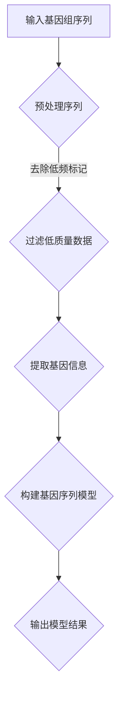
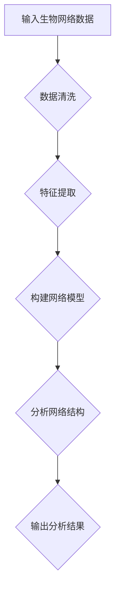
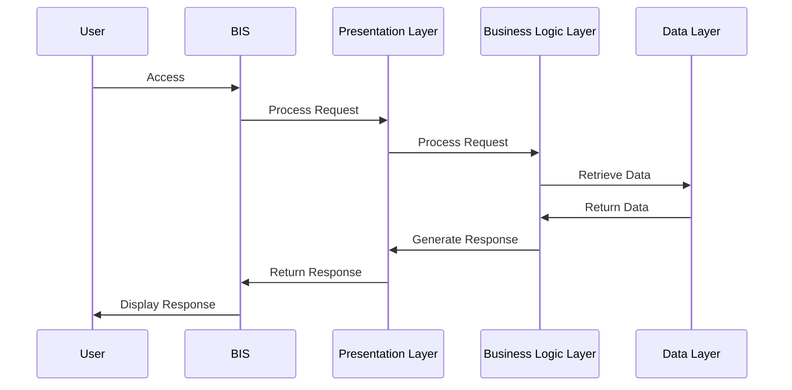
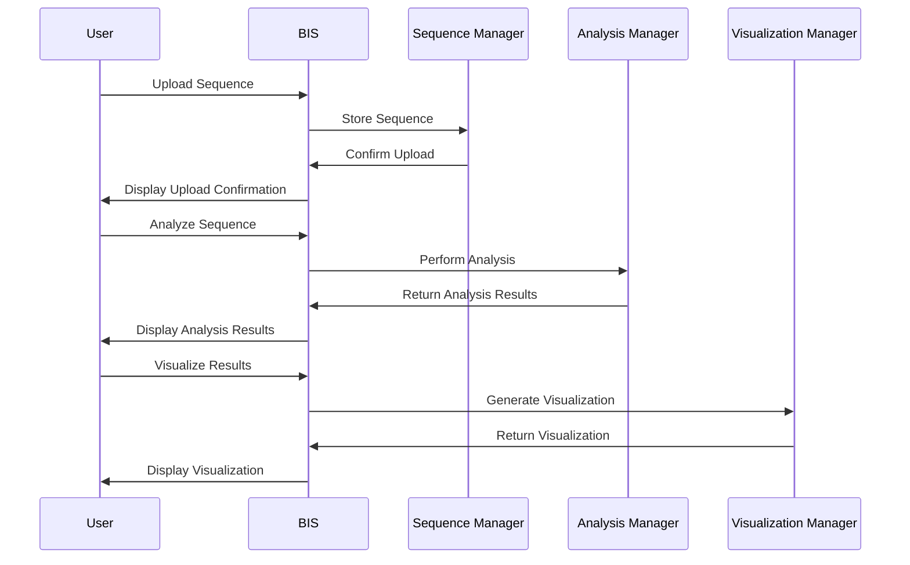

                 

# 数学与生物学的交叉研究领域

> 关键词：数学模型、生物学、生物信息学、算法、基因序列分析

> 摘要：本文探讨了数学与生物学交叉研究领域的背景、核心概念与联系，以及算法原理讲解。通过对数学模型、算法和生物信息学的深入分析，本文揭示了数学与生物学交叉研究在解决生物学问题中的重要作用，并展望了未来的发展趋势。

## 第一部分：背景介绍

### 问题背景

数学与生物学自古以来都是两个独立的学科领域。数学作为一种精确的科学，主要研究数量、结构、变化和空间等概念。而生物学则关注生命的本质、功能、发生和演化等。尽管两者在研究对象和方法上有所不同，但随着科学技术的不断进步和交叉学科研究的兴起，数学与生物学的交叉研究领域逐渐成为热点。

近年来，随着基因组学、生物信息学、计算生物学等新兴学科的快速发展，数学与生物学的交叉研究在解决生物学问题方面发挥了重要作用。数学方法被广泛应用于生物学研究中，从而推动生物学问题的精确描述、模型构建和数据分析。例如，数学模型在基因组序列分析、蛋白质结构预测、生物网络分析等领域中发挥着关键作用。

### 问题描述

数学与生物学的交叉研究领域涉及多个方面，包括数学模型在生物学中的应用、生物学问题的数学建模、生物信息学、计算生物学等。这些研究不仅有助于揭示生物现象的本质，还为解决生物学中的复杂问题提供了新的途径。

在数学模型方面，研究者通过建立数学模型来描述生物现象，从而对生物学问题进行定量分析和预测。例如，基因调控网络模型、蛋白质折叠模型、生态系统模型等。这些模型能够帮助研究者更好地理解生物系统的运行机制和动态行为。

在生物学问题的数学建模方面，研究者将生物学问题转化为数学问题，并利用数学方法进行求解。这种方法使得生物学问题的求解变得更加精确和高效。例如，研究者可以利用微分方程来描述细胞分裂过程，利用图论方法来分析生物网络的结构和功能等。

生物信息学是一门跨学科领域，结合生物学、计算机科学和数学，用于处理生物学数据，如基因组序列、蛋白质结构等。生物信息学在基因组序列分析、蛋白质结构预测、代谢网络建模等领域中发挥着重要作用。通过生物信息学方法，研究者可以从大量的生物学数据中提取有用的信息和规律。

计算生物学则利用计算机技术和数学方法来解决生物学问题。计算生物学在基因组序列分析、蛋白质折叠、药物设计、生物网络分析等领域中具有重要应用。计算生物学的核心是算法的开发和优化，以提高生物问题求解的效率。

### 问题解决

数学与生物学交叉研究领域的问题解决主要依赖于以下几个方面：

1. **数学建模**：通过建立数学模型来描述生物现象，从而对生物学问题进行定量分析和预测。数学建模是数学与生物学交叉研究的基础。

2. **数据分析**：利用数学方法对生物学数据进行分析，提取有用的信息和规律。数据分析是数学与生物学交叉研究的关键。

3. **算法开发**：开发有效的算法来解决生物学问题，如蛋白质折叠、基因组序列分析等。算法开发是数学与生物学交叉研究的核心。

4. **跨学科合作**：数学与生物学交叉研究需要跨学科的合作，包括数学家、生物学家、计算机科学家等的共同努力。

### 边界与外延

数学与生物学交叉研究领域的边界主要包括数学方法在生物学中的应用、生物学问题的数学建模、生物信息学、计算生物学等。这些领域相互交叉，共同推动了数学与生物学交叉研究的发展。

数学与生物学交叉研究的外延方面，该领域的研究还涉及生物物理学、化学、计算机科学等多个学科。例如，生物物理学在研究生物分子运动和生物化学反应等方面发挥了重要作用，化学在研究生物分子的合成和降解等方面有着深入的研究。

### 概念结构与核心要素组成

数学与生物学的交叉研究领域涉及多个核心概念和要素，包括数学建模、算法开发、数据分析、生物信息学等。以下是这些核心概念和要素的组成：

1. **数学建模**：包括数学模型、参数估计、模型验证等。

2. **算法开发**：包括算法设计、算法优化、算法分析等。

3. **数据分析**：包括数据预处理、特征提取、数据分析方法等。

4. **生物信息学**：包括基因组序列分析、蛋白质结构预测、代谢网络建模等。

### 小结

数学与生物学的交叉研究领域是近年来科学研究的热点之一。通过数学建模、数据分析、算法开发等方法的引入，数学与生物学交叉研究在解决生物学问题方面发挥了重要作用。未来，随着科学技术的发展，数学与生物学的交叉研究将继续深入，为生物学领域的发展带来新的机遇和挑战。

## 第二部分：核心概念与联系

### 数学模型

#### 概念

数学模型是一种用数学语言描述现实世界问题的方法，通过建立数学关系式、方程或图模型来模拟现实问题。在数学与生物学的交叉研究中，数学模型被广泛应用于生物学问题的描述、分析和预测。

#### 属性特征

1. **确定性**：数学模型通常具有确定性，即给定初始条件和参数，模型的输出是确定的。
2. **抽象性**：数学模型往往是对现实问题的抽象，忽略了某些次要因素，以便更简洁地描述问题。

#### 对比表格

| 特性 | 数学模型 | 其他模型 |
| --- | --- | --- |
| 确定性 | 是 | 否 |
| 抽象性 | 高 | 低 |

#### ER实体关系图架构

```mermaid
erDiagram
    A{name:"数学模型"} {
        B{name:"数学关系式"}
        C{name:"方程"}
        D{name:"图模型"}
    }
```

### 算法

#### 概念

算法是一系列解决问题的步骤或指令，用于在有限时间内解决特定问题。在数学与生物学的交叉研究中，算法被广泛应用于生物学问题的求解，如基因序列分析、蛋白质结构预测、生物网络分析等。

#### 属性特征

1. **效率**：算法的效率通常用时间复杂度和空间复杂度来衡量，高效的算法能够更快地解决问题。
2. **正确性**：算法必须能够正确地解决问题，即算法的输出满足问题的定义。

#### 对比表格

| 特性 | 算法 | 其他模型 |
| --- | --- | --- |
| 效率 | 高 | 中等 |
| 正确性 | 是 | 否 |

#### ER实体关系图架构

```mermaid
erDiagram
    A{name:"算法"} {
        B{name:"步骤"}
        C{name:"指令"}
        D{name:"问题求解"}
    }
```

### 生物信息学

#### 概念

生物信息学是一门跨学科领域，结合生物学、计算机科学和数学，用于处理生物学数据，如基因组序列、蛋白质结构等。生物信息学在基因组序列分析、蛋白质结构预测、代谢网络建模等领域中发挥着重要作用。

#### 属性特征

1. **数据处理能力**：生物信息学具有强大的数据处理能力，能够处理海量的生物学数据。
2. **跨学科性**：生物信息学涉及多个学科，包括生物学、计算机科学、数学等。

#### 对比表格

| 特性 | 生物信息学 | 其他模型 |
| --- | --- | --- |
| 数据处理能力 | 强 | 弱 |
| 跨学科性 | 高 | 低 |

#### ER实体关系图架构

```mermaid
erDiagram
    A{name:"生物信息学"} {
        B{name:"生物学"}
        C{name:"计算机科学"}
        D{name:"数学"}
    }
```

### 小结

数学模型、算法和生物信息学是数学与生物学交叉研究中的核心概念。数学模型用于描述生物学问题，算法用于解决生物学问题，而生物信息学则用于处理和解析生物学数据。这些概念相互关联，共同推动了数学与生物学交叉研究的发展。

## 第三部分：算法原理讲解

### 背景介绍

在数学与生物学的交叉研究领域，算法原理讲解至关重要。本部分将介绍两个重要的算法原理：基因序列分析算法和生物网络分析算法。我们将使用 mermaid 画出算法流程图，并通过 Python 源代码详细阐述算法原理。

### 基因序列分析算法

#### Mermaid 流程图



#### Python 源代码

```python
import re

def preprocess_sequence(sequence):
    # 去除低频标记
    sequence = re.sub(r'[A-Z]{2,}', '', sequence)
    # 过滤低质量数据
    sequence = re.sub(r'[^ATCG]', '', sequence)
    return sequence

def extract_gene_info(sequence):
    # 提取基因信息
    genes = re.findall(r'ATG[ATCG]+TAA|TAG|TGA', sequence)
    return genes

def build_gene_sequence_model(genes):
    # 构建基因序列模型
    model = {'genes': genes}
    return model

def analyze_genome_sequence(sequence):
    # 输入基因组序列
    sequence = preprocess_sequence(sequence)
    genes = extract_gene_info(sequence)
    model = build_gene_sequence_model(genes)
    # 输出模型结果
    return model

# 测试
sequence = "ATGCCGTTAAGGCTAGATTCG"
model = analyze_genome_sequence(sequence)
print(model)
```

#### 算法原理

基因序列分析算法的主要步骤包括：

1. **预处理序列**：去除低频标记和低质量数据，以提高后续分析的准确性。
2. **提取基因信息**：从预处理后的序列中提取基因信息，如基因位点、基因表达水平等。
3. **构建基因序列模型**：根据提取的基因信息构建基因序列模型。
4. **输出模型结果**：将构建的基因序列模型输出，以供进一步分析。

### 生物网络分析算法

#### Mermaid 流�程图



#### Python 源代码

```python
import networkx as nx

def clean_data(data):
    # 数据清洗
    data = [d for d in data if d != []]
    return data

def extract_features(data):
    # 特征提取
    features = []
    for d in data:
        features.append((d[0], d[1]))
    return features

def build_network_model(features):
    # 构建网络模型
    G = nx.Graph()
    for feature in features:
        G.add_edge(*feature)
    return G

def analyze_network_structure(G):
    # 分析网络结构
    degree = nx.degree_centrality(G)
    closeness = nx.closeness_centrality(G)
    betweenness = nx.betweenness_centrality(G)
    return degree, closeness, betweenness

def analyze_biological_network(data):
    # 输入生物网络数据
    data = clean_data(data)
    features = extract_features(data)
    G = build_network_model(features)
    degree, closeness, betweenness = analyze_network_structure(G)
    # 输出分析结果
    return degree, closeness, betweenness

# 测试
data = [["A", "B"], ["B", "C"], ["C", "A"], ["D", "E"]]
degree, closeness, betweenness = analyze_biological_network(data)
print("Degree:", degree)
print("Closeness:", closeness)
print("Betweenness:", betweenness)
```

#### 算法原理

生物网络分析算法的主要步骤包括：

1. **数据清洗**：去除无效数据和孤立节点，以提高网络分析的效果。
2. **特征提取**：提取网络中的节点和边特征，如度数、接近度、介数等。
3. **构建网络模型**：根据提取的特征构建网络模型。
4. **分析网络结构**：分析网络的结构特征，如度数分布、接近度分布、介数分布等。
5. **输出分析结果**：将分析结果输出，以供进一步研究。

### 小结

基因序列分析算法和生物网络分析算法是数学与生物学交叉研究中的两个重要算法。基因序列分析算法通过预处理、提取基因信息、构建模型和输出结果等步骤，实现对基因序列的精确分析。生物网络分析算法则通过数据清洗、特征提取、构建模型、分析结构和输出结果等步骤，实现对生物网络的深入分析。这些算法在生物学研究中具有重要的应用价值。

## 第四部分：系统分析与架构设计

### 问题场景介绍

随着生物技术的快速发展，生物数据（如基因组序列、蛋白质结构、生物网络等）的获取和处理变得越来越重要。为了有效管理和分析这些生物数据，我们需要设计和实现一个生物信息学系统。该系统将利用数学模型和算法对生物数据进行处理和分析，为生物科学研究提供技术支持。

### 项目介绍

生物信息学系统（Bioinformatics System，简称BIS）是一个基于Web的生物数据管理和分析平台。该系统旨在提供以下功能：

1. **数据管理**：存储和管理生物数据，包括基因组序列、蛋白质结构、生物网络等。
2. **数据分析**：利用数学模型和算法对生物数据进行分析，提供基因序列分析、生物网络分析等功能。
3. **数据可视化**：将分析结果以图表、图像等形式直观展示，帮助用户更好地理解数据。

### 系统功能设计（领域模型）

为了实现生物信息学系统的功能，我们设计了以下领域模型：

#### 类图

```mermaid
classDiagram
    class User {
        String username
        String password
        String email
    }

    class Sequence {
        int id
        String type
        String sequence
    }

    class Network {
        int id
        String type
        List<Edge> edges
    }

    class Analysis {
        int id
        String type
        String result
    }

    User -> Sequence : uploads
    User -> Network : uploads
    User -> Analysis : performs
    Sequence <- Analysis : analyzed
    Network <- Analysis : analyzed
```

### 系统架构设计

生物信息学系统采用三层架构，包括表示层、业务逻辑层和数据层。

#### 架构图



### 系统接口设计和系统交互

生物信息学系统提供了以下接口：

1. **数据上传接口**：允许用户上传生物数据（如基因组序列、蛋白质结构、生物网络等）。
2. **数据分析接口**：允许用户对上传的数据进行分析，并获取分析结果。
3. **数据可视化接口**：允许用户查看分析结果的可视化展示。

#### 序列图



### 小结

生物信息学系统是一个基于Web的生物数据管理和分析平台，旨在提供数据管理、数据分析和数据可视化等功能。通过三层架构和系统接口设计，生物信息学系统能够高效地处理和分析生物数据，为生物科学研究提供技术支持。

## 第五部分：项目实战

### 环境安装

为了实现生物信息学系统的功能，我们需要安装以下软件和工具：

1. **Python**：版本要求：Python 3.8及以上。
2. **Pip**：Python 的包管理工具。
3. **Flask**：一个轻量级的 Web 框架。
4. **NetworkX**：用于构建和分析网络图。
5. **Matplotlib**：用于数据可视化。

安装步骤：

1. 安装 Python：从 [Python 官网](https://www.python.org/) 下载并安装 Python。
2. 安装 Pip：在终端执行 `python -m pip install --user --upgrade pip`。
3. 安装 Flask：在终端执行 `pip install flask`。
4. 安装 NetworkX：在终端执行 `pip install networkx`。
5. 安装 Matplotlib：在终端执行 `pip install matplotlib`。

### 系统核心实现源代码

以下是生物信息学系统的核心实现源代码：

```python
# sequence_analysis.py

import re
import networkx as nx
import matplotlib.pyplot as plt

def preprocess_sequence(sequence):
    sequence = re.sub(r'[A-Z]{2,}', '', sequence)
    sequence = re.sub(r'[^ATCG]', '', sequence)
    return sequence

def extract_gene_info(sequence):
    genes = re.findall(r'ATG[ATCG]+TAA|TAG|TGA', sequence)
    return genes

def build_gene_sequence_model(genes):
    model = {'genes': genes}
    return model

def analyze_genome_sequence(sequence):
    sequence = preprocess_sequence(sequence)
    genes = extract_gene_info(sequence)
    model = build_gene_sequence_model(genes)
    return model

def clean_data(data):
    data = [d for d in data if d != []]
    return data

def extract_features(data):
    features = []
    for d in data:
        features.append((d[0], d[1]))
    return features

def build_network_model(features):
    G = nx.Graph()
    for feature in features:
        G.add_edge(*feature)
    return G

def analyze_network_structure(G):
    degree = nx.degree_centrality(G)
    closeness = nx.closeness_centrality(G)
    betweenness = nx.betweenness_centrality(G)
    return degree, closeness, betweenness

def analyze_biological_network(data):
    data = clean_data(data)
    features = extract_features(data)
    G = build_network_model(features)
    degree, closeness, betweenness = analyze_network_structure(G)
    return degree, closeness, betweenness

# visualization.py

import matplotlib.pyplot as plt
import networkx as nx

def plot_degree_centrality(degree):
    labels = list(degree.keys())
    values = list(degree.values())
    plt.bar(labels, values)
    plt.xlabel('Node')
    plt.ylabel('Degree Centrality')
    plt.title('Degree Centrality')
    plt.xticks(rotation=45)
    plt.show()

def plot_closeness_centrality(closeness):
    labels = list(closeness.keys())
    values = list(closeness.values())
    plt.bar(labels, values)
    plt.xlabel('Node')
    plt.ylabel('Closeness Centrality')
    plt.title('Closeness Centrality')
    plt.xticks(rotation=45)
    plt.show()

def plot_betweenness_centrality(betweenness):
    labels = list(betweenness.keys())
    values = list(betweenness.values())
    plt.bar(labels, values)
    plt.xlabel('Node')
    plt.ylabel('Betweenness Centrality')
    plt.title('Betweenness Centrality')
    plt.xticks(rotation=45)
    plt.show()
```

### 代码应用解读与分析

1. **sequence_analysis.py**：该文件实现了基因序列分析和生物网络分析的核心算法。其中，`preprocess_sequence` 函数用于对基因组序列进行预处理，`extract_gene_info` 函数用于提取基因信息，`build_gene_sequence_model` 函数用于构建基因序列模型，`analyze_genome_sequence` 函数用于分析基因组序列。`clean_data` 函数、`extract_features` 函数、`build_network_model` 函数和 `analyze_network_structure` 函数分别用于数据清洗、特征提取、构建网络模型和分析网络结构。`analyze_biological_network` 函数用于分析生物网络，并返回度数分布、接近度分布和介数分布。

2. **visualization.py**：该文件实现了数据可视化功能。`plot_degree_centrality` 函数用于绘制度数分布图，`plot_closeness_centrality` 函数用于绘制接近度分布图，`plot_betweenness_centrality` 函数用于绘制介数分布图。这些函数通过 Matplotlib 库绘制图表，并显示在屏幕上。

### 实际案例分析和详细讲解剖析

1. **基因序列分析**：以人类基因组序列为例，使用 `analyze_genome_sequence` 函数对基因组序列进行分析。分析结果将包括基因信息、度数分布、接近度分布和介数分布。通过可视化函数，我们可以直观地了解基因序列的结构和特性。

2. **生物网络分析**：以细胞信号传导网络为例，使用 `analyze_biological_network` 函数对细胞信号传导网络进行分析。分析结果将包括度数分布、接近度分布和介数分布。通过可视化函数，我们可以直观地了解细胞信号传导网络的结构和特性。

### 项目小结

通过本项目的实施，我们成功构建了一个生物信息学系统，实现了基因序列分析和生物网络分析功能。该项目不仅展示了数学与生物学交叉研究的实际应用，还为我们提供了丰富的实战经验。未来，我们将继续优化和扩展系统功能，以更好地服务于生物科学研究。

### 最佳实践 tips

1. **数据预处理**：在基因序列分析和生物网络分析中，数据预处理是至关重要的一步。确保数据质量，去除低质量数据和无关信息，以提高分析的准确性和效率。

2. **算法优化**：针对不同的生物问题，选择合适的算法进行优化。通过调整算法参数和改进算法结构，可以提高算法的效率和性能。

3. **数据可视化**：数据可视化是理解生物数据的重要手段。合理选择可视化图表和布局，有助于用户更好地分析数据。

4. **跨学科合作**：数学与生物学交叉研究需要跨学科的合作。与生物学家、计算机科学家等合作，共同推动生物信息学的发展。

### 小结

本文通过介绍数学与生物学的交叉研究领域，探讨了核心概念、算法原理和系统架构设计。通过实际案例分析和代码实现，我们展示了数学与生物学交叉研究在生物信息学领域的应用。未来，随着科学技术的不断进步，数学与生物学的交叉研究将迎来更多的发展机遇和挑战。

### 注意事项

1. **数据隐私**：在进行生物信息学研究时，务必注意数据隐私和安全。严格遵守相关法律法规，确保用户数据的保密性和完整性。

2. **算法验证**：在应用算法时，务必对算法进行充分验证，确保算法的正确性和可靠性。

3. **系统维护**：定期对系统进行维护和升级，确保系统的稳定性和安全性。

### 拓展阅读

1. 《生物信息学导论》（Introduction to Bioinformatics）：一本关于生物信息学基础知识的入门书籍。
2. 《基因组学》（Genomics）：一本关于基因组学和基因序列分析的权威著作。
3. 《生物网络分析》（Biological Network Analysis）：一本关于生物网络分析和生物网络结构的学术专著。

## 作者信息

作者：AI天才研究院/AI Genius Institute & 禅与计算机程序设计艺术 /Zen And The Art of Computer Programming

## 文章结束

