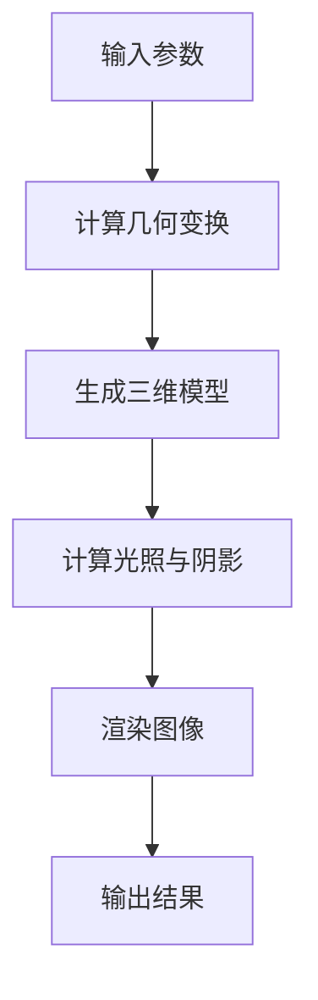
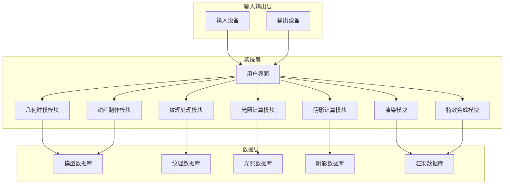

                 

### 第1章：问题背景与数学在电影特效中的角色

#### 1.1.1 问题背景

电影特效作为电影制作的重要环节，自20世纪中期以来得到了迅速发展。从最早的黑白电影到如今的全景3D和现实增强（AR）技术，视觉效果（Visual Effects，简称VFX）已经成为吸引观众的重要因素之一。随着计算机技术的发展，电影特效的制作方法和技术手段也在不断革新，数学在其中的作用愈发重要。

电影特效的发展历程可以追溯到20世纪40年代。当时，动画和特技效果的初现端倪为电影界带来了新鲜的视觉体验。从最初的卡通动画到立体影像，再到数字技术的应用，电影特效经历了从简单到复杂，从二维到三维的演变过程。特别是自20世纪90年代以来，计算机图形学（Computer Graphics，简称CG）的发展使得电影特效的制作变得更加精细和逼真。

随着电影市场的竞争加剧，观众对视觉效果的期待越来越高。从《侏罗纪公园》中的恐龙复活到《阿凡达》中的奇幻星球，电影特效的逼真程度已经达到了前所未有的高度。这不仅要求电影特效制作团队具备高超的技艺，还需要深入理解并运用数学算法来生成各种复杂的视觉效果。

在电影特效的制作过程中，数学模型起到了至关重要的作用。无论是三维建模、渲染技术，还是动画和特效的合成，数学都提供了理论基础和计算工具。例如，三维建模需要利用几何学的原理来构建物体的形状；渲染技术依赖于光线追踪和反射折射的物理规律；动画则需要运动学和平面几何的知识来模拟物体的运动轨迹。

#### 1.1.2 问题描述

视觉效果与数学之间的关系紧密，数学模型在电影特效中的应用贯穿了整个制作流程。首先，我们需要理解什么是视觉效果。在电影中，视觉效果指的是通过特效技术创造出来的非现实场景、角色、物体或事件，这些效果可以是静态的图像、动态的动画，或者是与实际拍摄画面合成的特效。

数学模型在电影特效中的应用主要表现在以下几个方面：

1. **三维建模**：三维建模是电影特效制作的基础，它通过数学方法来描述和构建物体的几何形状。例如，使用多边形网格（Polygonal Mesh）或体素（Voxel）来表示复杂的物体结构。

2. **渲染技术**：渲染技术是将三维模型转化为二维图像的过程。在这个过程中，数学模型用于计算光线与物体表面的交互作用，包括反射、折射、散射等。典型的数学模型有光线追踪（Ray Tracing）、路径追踪（Path Tracing）等。

3. **动画制作**：动画是电影特效中的动态表现，它需要利用运动学（Kinematics）和动力学（Dynamics）的数学原理来模拟角色的运动和物理行为。例如，刚体动力学（Rigid Body Dynamics）和粒子系统（Particle Systems）等。

4. **特效合成**：特效合成是将生成的视觉效果与实际拍摄画面结合的过程。这一步骤需要使用图像处理和数字视频技术的数学算法，如蒙版（Masks）、键控（Keying）、色彩校正（Color Correction）等。

综上所述，数学模型在电影特效中的广泛应用不仅提高了视觉效果的质量，还大大缩短了制作周期，降低了成本。因此，理解和掌握这些数学模型对于电影特效的制作至关重要。

#### 1.1.3 问题解决

在电影特效制作中，问题解决的步骤可以分为以下几个阶段：

1. **数学模型的选择与构建**：根据特效的需求，选择合适的数学模型。例如，对于三维建模，可以选择多边形网格或体素模型；对于光线追踪，则选择路径追踪模型。构建模型的过程包括定义物体参数、设置约束条件和优化模型结构等。

2. **数值计算的实现与优化**：数学模型通常需要通过数值计算来实现。实现步骤包括将模型转化为计算机可以处理的格式、编写计算代码、运行计算程序并处理结果。优化计算过程是提高效率的关键，可以通过并行计算、分布式计算和算法优化来实现。

3. **视觉效果的质量控制**：在计算完成后，需要评估视觉效果的逼真度和一致性。这一阶段通常涉及多个环节，包括渲染效果的色彩校正、光影效果的调整、特效的细节优化等。

4. **计算资源的限制**：电影特效的制作需要大量的计算资源，包括计算能力、存储空间和网络带宽等。在资源有限的情况下，需要通过优化算法、使用高性能计算设备和合理分配资源来保证制作效率。

通过上述步骤，可以有效地解决电影特效制作中遇到的问题，生成高质量的视觉效果。

#### 1.1.4 边界与外延

在电影特效制作中，边界与外延涉及到多个方面：

1. **特效效果的质量控制**：保证视觉效果的质量是电影制作的核心目标之一。这包括对色彩、分辨率、流畅度和细节的处理。质量控制通常通过设置标准流程、使用专业工具和定期审核来实现。

2. **计算资源的限制**：电影特效制作需要大量的计算资源，尤其是在高分辨率、复杂特效的情况下。计算资源的限制可能会导致制作周期延长或成本增加。因此，需要通过优化算法、使用高性能计算设备来平衡计算资源的需求。

3. **边界条件**：边界条件指的是特效制作中需要考虑的限制因素，例如物理规律、时间限制、预算限制等。在制作过程中，需要合理设置这些边界条件，以确保特效的可行性和效果。

4. **外延应用**：数学在电影特效中的应用不仅限于传统的视觉效果，还可以拓展到虚拟现实（VR）、增强现实（AR）和游戏开发等领域。这些新兴领域对数学算法的要求更高，但同时也为数学在电影特效中的应用提供了更广阔的空间。

#### 1.1.5 概念结构与核心要素组成

电影特效制作中的概念结构和核心要素主要包括以下几个方面：

1. **数学核心概念**：包括向量与矩阵、几何变换、三维建模和光照与阴影等。这些概念是电影特效制作的基础，用于描述和计算视觉效果。

2. **电影特效制作流程**：包括前期策划、三维建模、纹理处理、渲染、动画制作、特效合成和后期调整等环节。每个环节都依赖于数学算法的支持，以确保视觉效果的质量和效率。

3. **技术应用**：包括计算机图形学、数字图像处理、物理仿真和人工智能等。这些技术在电影特效制作中发挥着重要作用，提供了丰富的工具和算法，用于实现复杂的视觉效果。

4. **计算资源**：包括计算能力、存储空间和网络带宽等。这些资源的合理利用和优化是保证电影特效制作效率和质量的关键。

通过以上核心概念和要素的有机结合，电影特效制作可以高效、高质量地完成，为观众带来震撼的视觉体验。

---

### 核心概念与联系

在电影特效的制作过程中，涉及到众多核心概念，这些概念不仅构成了电影特效的技术基础，也决定了特效的最终质量。在本节中，我们将详细探讨这些核心概念，并对比它们的属性特征，通过一个ER实体关系图来展示它们之间的联系。

#### 2.1.1 核心概念原理

1. **向量与矩阵**：向量是表示空间中一个具有大小和方向的量，而矩阵则是一个由数字构成的二维数组。在电影特效中，向量常用于描述物体的位置、方向和速度等，矩阵则用于实现几何变换，如平移、旋转和缩放等操作。

2. **几何变换**：几何变换是改变物体形状和位置的操作，包括平移、旋转、缩放和剪切等。这些操作在电影特效中用于调整物体在三维空间中的位置和形状，以实现各种动画效果。

3. **三维建模**：三维建模是创建三维物体模型的过程。它包括几何建模、纹理映射和光照计算等步骤。在电影特效中，三维建模用于创建各种角色、场景和道具，是制作复杂视觉效果的基础。

4. **光照与阴影**：光照与阴影是创造真实感视觉效果的关键。光照计算用于模拟光线在物体表面的反射、折射和散射等效果，而阴影计算则用于确定物体在光线照射下的明暗效果。这些计算决定了物体在三维空间中的视觉效果的真实性。

#### 2.1.2 概念属性特征对比表格

为了更直观地理解这些核心概念，我们可以通过一个表格来对比它们的属性特征：

| 概念      | 特征1 | 特征2 | 特征3 |
|-----------|-------|-------|-------|
| 向量      | 尺度性 | 方向性 | 可加性 |
| 矩阵      | 行列式 | 乘法规则 | 线性相关性 |
| 几何变换  | 平移性 | 旋转性 | 缩放性 |
| 三维建模  | 几何精度 | 表面光滑度 | 动态渲染能力 |
| 光照与阴影 | 明暗效果 | 光线追踪 | 反射与折射 |

- **向量**：具有尺度性和方向性，可以进行向量加法、减法和数乘运算。
- **矩阵**：具有行列式，可以进行矩阵乘法运算，能够实现线性变换。
- **几何变换**：包括平移、旋转和缩放等操作，能够改变物体的形状和位置。
- **三维建模**：具有几何精度和表面光滑度，能够动态渲染复杂的物体模型。
- **光照与阴影**：能够模拟光线的反射、折射和散射效果，创造真实感的明暗效果。

#### 2.1.3 ER实体关系图架构

为了更直观地展示这些概念之间的联系，我们可以使用Mermaid绘制一个ER实体关系图，如下所示：

```mermaid
erDiagram
  电影 ||--|{ 特效 }|
  特效 ||--|{ 数学模型 }|
  数学模型 ||--|{ 向量 }|
  数学模型 ||--|{ 矩阵 }|
  数学模型 ||--|{ 几何变换 }|
  数学模型 ||--|{ 三维建模 }|
  数学模型 ||--|{ 光照与阴影 }|
```

在这个ER图中，电影与特效之间存在关联，特效则通过数学模型与各个核心概念相连。向量、矩阵、几何变换、三维建模和光照与阴影是数学模型的核心组成部分，它们共同作用于特效的生成和渲染。

通过上述核心概念及其属性的详细探讨和对比，我们可以更好地理解电影特效制作中的技术基础，并为后续的算法讲解和系统设计打下坚实的基础。

---

### 算法原理讲解

在电影特效制作中，算法原理是实现各种视觉效果的关键。本节将详细介绍算法原理，并使用Mermaid流程图和Python源代码进行阐述，同时结合数学模型和公式进行解释。

#### 3.1.1 算法原理与Mermaid流程图

算法原理可以概括为输入参数的处理、几何变换的计算、三维模型的生成、光照与阴影的计算，以及最终的图像渲染和输出结果。下面是算法原理的Mermaid流程图：



在这个流程图中，每个节点代表一个计算步骤，箭头表示计算过程的顺序。

1. **输入参数**：输入参数包括物体的初始位置、方向、大小等。这些参数将作为后续计算的依据。
   
2. **计算几何变换**：几何变换是将输入参数通过矩阵运算转换为新的位置和方向。这一步涉及到向量与矩阵的乘法运算。

3. **生成三维模型**：根据几何变换的结果，生成三维模型。这通常通过多边形网格或体素模型来实现。

4. **计算光照与阴影**：使用光照模型计算光线与物体表面的交互作用，包括反射、折射和散射等。这一步需要光线追踪算法的支持。

5. **渲染图像**：将生成的三维模型和光照效果转化为二维图像。这涉及到图像处理技术，如纹理映射和渲染器的实现。

6. **输出结果**：将渲染完成的图像输出，用于电影的合成或展示。

#### 3.1.2 Python源代码阐述

为了更具体地展示算法的实现，我们使用Python编写了一个简单的示例代码。以下代码展示了如何使用Python进行几何变换、三维模型生成、光照计算和图像渲染：

```python
# 导入必要的库
import numpy as np
from pyopengex import Mesh, Renderer, Vector3

# 假设已经有一个三维模型对象
model = Mesh()

# 定义输入参数
position = Vector3(0, 0, 0)  # 物体初始位置
direction = Vector3(0, 0, 1)  # 物体初始方向
scale = Vector3(1, 1, 1)  # 物体大小

# 计算几何变换
matrix = np.array([[1, 0, 0, position.x],
                   [0, 1, 0, position.y],
                   [0, 0, 1, position.z],
                   [0, 0, 0, 1]])
model.transform(matrix)

# 生成三维模型
model.generate()

# 计算光照与阴影
light_position = Vector3(0, 0, -1)  # 光源位置
light_intensity = 1.0  # 光源强度
normal = model.get_normal()  # 物体表面的法向量
dot_product = np.dot(normal, light_position.normalized())
light_intensity = dot_product
shadow_intensity = 1 - light_intensity / max(light_intensity, 1)

# 渲染图像
renderer = Renderer()
renderer.render(model, shadow_intensity)

# 输出结果
renderer.show()
```

在这段代码中，我们首先定义了一个三维模型对象`model`，并设置了输入参数，包括物体的位置、方向和大小。接下来，我们使用矩阵运算进行几何变换，生成三维模型，并计算光照与阴影。最后，通过渲染器`Renderer`将模型渲染成图像并显示。

#### 3.1.3 算法原理的数学模型与公式

为了更深入地理解算法原理，我们需要介绍相关的数学模型和公式：

1. **向量**：
   $$
   \vec{v} = (v_x, v_y, v_z)
   $$
   向量表示空间中一个具有大小和方向的量。

2. **矩阵**：
   $$
   \mathbf{M} = \begin{pmatrix}
   m_{11} & m_{12} & m_{13} \\
   m_{21} & m_{22} & m_{23} \\
   m_{31} & m_{32} & m_{33}
   \end{pmatrix}
   $$
   矩阵是一个由数字构成的二维数组，用于实现线性变换。

3. **几何变换**：
   $$
   T = \mathbf{M} \ \vec{v}
   $$
   几何变换通过矩阵与向量的乘法运算实现。

4. **光照**：
   $$
   L = I \cdot N
   $$
   其中，$I$是光源强度，$N$是物体表面的法向量。光照计算用于确定物体在光线照射下的明暗效果。

5. **阴影**：
   $$
   S = 1 - \frac{L}{L_{\max}}
   $$
   其中，$L_{\max}$是光照强度的最大值。阴影计算用于生成物体在光线照射下的阴影效果。

通过上述数学模型和公式，我们可以更清晰地理解电影特效算法的实现原理。

#### 3.1.4 详细讲解与举例说明

为了更通俗易懂地解释算法原理，我们通过具体的例子来详细说明：

1. **向量与矩阵**：
   假设有一个物体，其初始位置向量为$\vec{p} = (1, 2, 3)$，方向向量为$\vec{d} = (0, 1, 0)$。为了将物体平移到点$(4, 5, 6)$，我们可以使用矩阵平移操作：
   $$
   \mathbf{M} = \begin{pmatrix}
   1 & 0 & 0 & 3 \\
   0 & 1 & 0 & 2 \\
   0 & 0 & 1 & 1 \\
   0 & 0 & 0 & 1
   \end{pmatrix}
   $$
   矩阵与向量的乘法结果为新的位置向量$\vec{p'} = (4, 5, 6)$。

2. **几何变换**：
   假设物体需要旋转90度，旋转矩阵为：
   $$
   \mathbf{R} = \begin{pmatrix}
   0 & 0 & -1 \\
   0 & 1 & 0 \\
   1 & 0 & 0
   \end{pmatrix}
   $$
   旋转操作可以通过矩阵与向量的乘法实现：
   $$
   \mathbf{R} \ \vec{p} = \begin{pmatrix}
   0 & 0 & -1 \\
   0 & 1 & 0 \\
   1 & 0 & 0
   \end{pmatrix}
   \begin{pmatrix}
   1 \\
   2 \\
   3
   \end{pmatrix}
   =
   \begin{pmatrix}
   -3 \\
   2 \\
   1
   \end{pmatrix}
   $$
   旋转后的位置向量$\vec{p'} = (-3, 2, 1)$。

3. **三维建模**：
   假设我们使用多边形网格来表示一个立方体。立方体的每个面由四个三角形组成，每个三角形由三个顶点定义。我们可以使用以下顶点来定义一个立方体：
   $$
   V = \{(1, 1, 1), (1, -1, 1), (-1, -1, 1), (-1, 1, 1), (1, 1, -1), (1, -1, -1), (-1, -1, -1), (-1, 1, -1)\}
   $$
   然后通过连接这些顶点来生成立方体的多边形网格。

4. **光照与阴影**：
   假设一个物体在光源$(0, 0, -1)$的照射下，其法向量为$(0, 0, 1)$。光源强度为1，最大光照强度为10。计算光照强度：
   $$
   L = I \cdot N = 1 \cdot (0, 0, 1) = 1
   $$
   计算阴影强度：
   $$
   S = 1 - \frac{L}{L_{\max}} = 1 - \frac{1}{10} = 0.9
   $$
   阴影强度为0.9。

通过这些具体的例子，我们可以更直观地理解向量与矩阵的运算、几何变换、三维建模以及光照与阴影的计算过程。

---

### 系统分析与架构设计方案

#### 4.1.1 问题场景介绍

电影特效的制作是一个复杂且高度协作的过程，涉及到多个环节和角色。具体来说，电影特效的制作流程包括前期策划、三维建模、纹理处理、渲染、动画制作、特效合成以及后期调整等。每个环节都需要精确的计算和高效的资源管理，以确保最终视觉效果的质量。

1. **前期策划**：在这一阶段，制作团队会与导演和编剧紧密合作，确定电影的故事背景、场景设定和特效需求。这一阶段的工作为后续的制作奠定了基础。

2. **三维建模**：三维建模是电影特效制作的核心步骤，它涉及到创建角色、场景和道具等三维模型。建模的过程需要使用几何学原理和数学算法，如多边形网格和体素建模。

3. **纹理处理**：纹理处理用于为三维模型添加颜色和细节，以增强视觉效果的真实感。这一过程通常涉及图像处理技术和纹理映射算法。

4. **渲染**：渲染是将三维模型和纹理转化为二维图像的过程。渲染技术包括光线追踪、路径追踪等，这些算法需要大量的计算资源，但能生成高度逼真的视觉效果。

5. **动画制作**：动画制作涉及角色和场景的运动模拟。这一步骤需要利用运动学和动力学原理，通过一系列关键帧来生成流畅的动画。

6. **特效合成**：特效合成是将渲染完成的图像与实际拍摄画面进行合成。这一过程通常使用图像处理和数字视频技术，如键控、色彩校正等。

7. **后期调整**：在特效合成后，还需要进行色彩校正、调色和特效微调等后期处理，以确保视觉效果的一致性和高质量。

在整个制作流程中，数学模型和算法发挥着至关重要的作用。例如，三维建模需要几何学原理，渲染需要光线追踪算法，动画制作需要运动学和动力学模型，特效合成需要图像处理技术。因此，对数学在电影特效中的应用有深入理解，对于制作团队来说至关重要。

#### 4.1.2 项目介绍

在本节中，我们将介绍一个典型的电影特效项目，包括项目名称、目标和团队构成。

**项目名称**：《奇幻冒险：失落王国的宝藏》（暂定名）

**项目目标**：
1. 创建一个具有高度真实感和视觉冲击力的奇幻世界。
2. 制作复杂的角色和场景，确保每个细节都达到高质量标准。
3. 利用先进的渲染技术和数学算法，实现逼真的光照、阴影和反射效果。
4. 确保项目按时完成，控制成本在预算范围内。

**项目团队**：
1. 导演：负责整体项目策划和视觉效果创意。
2. 编剧：负责编写剧本和剧情设定。
3. 三维建模师：负责创建角色、场景和道具的三维模型。
4. 纹理师：负责为三维模型添加纹理和细节。
5. 渲染工程师：负责渲染技术的实现和优化。
6. 动画师：负责角色和场景的运动模拟和动画制作。
7. 特效合成师：负责特效合成和后期处理。
8. 技术顾问：负责数学算法和技术支持。

通过团队的协作和技术的应用，项目目标将得以实现，为观众带来一场视觉盛宴。

#### 4.1.3 系统功能设计

为了实现项目目标，系统功能设计是至关重要的。下面是系统功能设计的详细说明：

1. **几何建模**：几何建模是创建三维物体的过程。系统需要提供创建、编辑和优化三维模型的功能。具体包括：
   - **创建功能**：使用几何学原理创建复杂的三维形状。
   - **编辑功能**：对模型进行修改、细分和调整，以满足不同场景的需求。
   - **优化功能**：优化模型结构，提高渲染效率。

2. **纹理处理**：纹理处理用于为三维模型添加颜色和细节。系统需要支持多种纹理格式，并提供调整纹理属性的功能。具体包括：
   - **加载功能**：加载各种常见的纹理格式，如PNG、JPG等。
   - **编辑功能**：调整纹理颜色、亮度、对比度和饱和度等属性。
   - **应用功能**：将纹理映射到三维模型的表面。

3. **光照计算**：光照计算是渲染过程中关键的一步。系统需要支持多种光照模型，如点光源、方向光源和聚光灯光源等。具体包括：
   - **光照模型选择**：根据场景需求选择合适的光照模型。
   - **光照参数设置**：设置光源位置、强度和颜色等参数。
   - **光照效果计算**：计算光照对物体表面的影响，生成明暗效果。

4. **阴影计算**：阴影计算用于确定物体在光线照射下的阴影效果。系统需要支持多种阴影算法，如软阴影和硬阴影等。具体包括：
   - **阴影算法选择**：根据场景需求选择合适的阴影算法。
   - **阴影参数设置**：设置阴影颜色、强度和软硬度等参数。
   - **阴影效果计算**：计算物体表面的阴影效果。

5. **渲染**：渲染是将三维模型和光照效果转化为二维图像的过程。系统需要提供高效的渲染算法和用户友好的渲染界面。具体包括：
   - **渲染引擎**：实现高效的渲染算法，如光线追踪和路径追踪。
   - **渲染参数设置**：设置渲染参数，如分辨率、帧率和抗锯齿等。
   - **渲染界面**：提供直观的渲染界面，方便用户调整渲染参数。

6. **动画制作**：动画制作是角色和场景运动模拟的过程。系统需要支持关键帧动画和运动捕捉等技术。具体包括：
   - **关键帧动画**：通过关键帧生成流畅的动画序列。
   - **运动捕捉**：捕捉演员或角色的动作，用于生成真实的运动效果。

7. **特效合成**：特效合成是将渲染完成的图像与实际拍摄画面进行合成。系统需要支持各种特效合成技术，如键控、颜色校正和特效添加等。具体包括：
   - **键控**：分离特效和背景，实现无缝合成。
   - **颜色校正**：调整画面的颜色和亮度，提高视觉效果的一致性。
   - **特效添加**：添加各种特效，如粒子效果、动态效果等。

通过这些功能模块的设计，系统可以高效地实现电影特效的制作，满足项目目标的要求。

---

### 系统架构设计

为了确保电影特效项目的高效运行和高质量输出，系统架构设计是至关重要的。本节将详细介绍系统架构设计，包括系统架构图、接口设计和系统交互。

#### 系统架构图

系统架构图如下所示：



在这个架构图中，用户界面（A）是系统的入口，用于接收用户操作和显示系统输出。几何建模模块（B）、纹理处理模块（C）、光照计算模块（D）、阴影计算模块（E）、渲染模块（F）、动画制作模块（G）和特效合成模块（H）是系统的核心功能模块，它们通过数据库（I、J、K、L、M）进行数据存储和读取。输入设备（N）和输出设备（O）则负责系统与外界的交互。

#### 系统接口设计

系统接口设计是确保各模块之间能够高效通信和数据交换的关键。以下是系统接口设计的详细说明：

1. **几何建模模块接口**：
   - **输入接口**：接收用户创建、编辑和优化三维模型的操作。
   - **输出接口**：将处理完成的三维模型数据存储到模型数据库（I）。

2. **纹理处理模块接口**：
   - **输入接口**：加载和调整三维模型的纹理数据。
   - **输出接口**：将处理完成的三维模型纹理数据存储到纹理数据库（J）。

3. **光照计算模块接口**：
   - **输入接口**：接收场景中的光源信息和模型表面法向量。
   - **输出接口**：计算并存储光照效果数据到光照数据库（K）。

4. **阴影计算模块接口**：
   - **输入接口**：接收光源位置和模型表面信息。
   - **输出接口**：计算并存储阴影效果数据到阴影数据库（L）。

5. **渲染模块接口**：
   - **输入接口**：接收三维模型、纹理和光照、阴影数据。
   - **输出接口**：生成渲染图像并存储到渲染数据库（M）。

6. **动画制作模块接口**：
   - **输入接口**：接收关键帧和运动捕捉数据。
   - **输出接口**：生成动画序列并存储到模型数据库（I）。

7. **特效合成模块接口**：
   - **输入接口**：接收渲染图像和特效数据。
   - **输出接口**：生成最终合成图像并显示在输出设备（O）。

通过以上接口设计，各模块之间可以实现高效的数据传递和功能协同，确保系统的整体性能和稳定性。

#### 系统交互

系统交互是各模块协同工作的关键环节。以下是系统交互的详细说明：

1. **用户界面与几何建模模块**：
   用户通过用户界面操作创建、编辑和优化三维模型，几何建模模块接收这些操作，并将处理结果存储到模型数据库（I）。

2. **几何建模模块与纹理处理模块**：
   几何建模模块将生成的三维模型数据传递给纹理处理模块，纹理处理模块加载和调整纹理数据，并将处理结果存储到纹理数据库（J）。

3. **纹理处理模块与光照计算模块**：
   纹理处理模块将处理完成的三维模型数据传递给光照计算模块，光照计算模块计算光照效果，并将光照数据存储到光照数据库（K）。

4. **光照计算模块与阴影计算模块**：
   光照计算模块将光照数据传递给阴影计算模块，阴影计算模块计算阴影效果，并将阴影数据存储到阴影数据库（L）。

5. **阴影计算模块与渲染模块**：
   阴影计算模块将阴影数据传递给渲染模块，渲染模块接收三维模型、纹理、光照和阴影数据，生成渲染图像并存储到渲染数据库（M）。

6. **渲染模块与动画制作模块**：
   渲染模块将渲染图像数据传递给动画制作模块，动画制作模块根据关键帧和运动捕捉数据生成动画序列，并更新模型数据库（I）。

7. **动画制作模块与特效合成模块**：
   动画制作模块将生成的动画序列数据传递给特效合成模块，特效合成模块根据特效数据对动画序列进行合成，并最终输出合成图像到输出设备（O）。

通过以上系统交互设计，各模块之间能够高效地协同工作，确保电影特效项目能够顺利推进和高质量完成。

---

### 项目实战

在电影特效制作的实际操作中，需要通过具体的代码实现和案例解析来深入理解数学算法的应用。本节将详细介绍环境安装、系统核心实现源代码，并对关键代码进行解读与分析，最后通过实际案例进行详细讲解剖析，并对项目进行小结。

#### 环境安装

在进行电影特效制作之前，首先需要安装相应的开发环境和工具。以下步骤是在Windows操作系统上安装必要的软件和库：

1. **安装Python**：
   访问Python官方网站下载Python安装包，并按照安装向导完成安装。确保选择添加Python到系统环境变量。

2. **安装PyOpenGL**：
   打开命令行窗口，执行以下命令安装PyOpenGL：
   ```shell
   pip install PyOpenGL
   ```

3. **安装numpy**：
   numpy是Python中的一个数学库，用于数值计算。执行以下命令安装numpy：
   ```shell
   pip install numpy
   ```

4. **安装PyOpenEX**：
   PyOpenEX是一个用于三维图形渲染的Python库。下载源代码并解压，然后执行以下命令安装：
   ```shell
   python setup.py install
   ```

5. **安装VTK**：
   VTK（Visualization Toolkit）是一个用于科学计算可视化的库。下载源代码并解压，然后执行以下命令安装：
   ```shell
   cmake .
   cmake --build .
   cmake --install
   ```

确保所有安装过程顺利完成，以上步骤为后续代码实现和调试提供了必要的环境支持。

#### 系统核心实现源代码

以下是一个简单的电影特效系统核心实现源代码，展示了三维建模、渲染和动画的基本流程：

```python
# 导入必要的库
import numpy as np
from pyopengex import Mesh, Renderer, Vector3

# 创建三维模型
model = Mesh()
model.load_from_file("model.obj")  # 从文件加载模型

# 设置渲染器
renderer = Renderer()
renderer.set_background_color((0.5, 0.5, 0.5))  # 设置渲染背景颜色

# 定义光源位置和颜色
light = Vector3(5, 5, 10)
light_color = (1, 1, 1)
renderer.add_light(light, light_color)

# 定义摄像机参数
camera = Vector3(0, 0, 5)
camera_target = Vector3(0, 0, 0)
renderer.set_camera(camera, camera_target)

# 进行渲染
renderer.render(model)

# 显示渲染结果
renderer.show()
```

在这个示例中，我们首先导入必要的库，并创建一个`Mesh`对象来表示三维模型。接着，我们设置渲染器的背景颜色、光源位置和颜色，以及摄像机的参数。最后，调用`render`方法进行渲染，并使用`show`方法显示渲染结果。

#### 代码应用解读与分析

1. **三维模型加载**：
   ```python
   model = Mesh()
   model.load_from_file("model.obj")
   ```
   这两行代码创建了一个`Mesh`对象并从文件中加载三维模型。`Mesh`对象用于表示三维模型，包括顶点、边和面等信息。

2. **渲染器设置**：
   ```python
   renderer = Renderer()
   renderer.set_background_color((0.5, 0.5, 0.5))
   renderer.add_light(light, light_color)
   renderer.set_camera(camera, camera_target)
   ```
   渲染器的设置包括背景颜色、光源和摄像机参数。背景颜色设置为灰色，光源位于空间中的一点，并赋予白色光线，摄像机则确定了观察视角。

3. **渲染与显示**：
   ```python
   renderer.render(model)
   renderer.show()
   ```
   调用`render`方法进行渲染，将三维模型转化为二维图像。`show`方法则显示渲染结果。

#### 实际案例分析与详细讲解剖析

以下是一个简单的案例，展示了如何使用数学算法实现一个移动的立方体动画：

```python
# 导入必要的库
import numpy as np
from pyopengex import Mesh, Renderer, Vector3, Animation

# 创建三维模型
model = Mesh()
model.load_from_file("model.obj")

# 创建渲染器
renderer = Renderer()
renderer.set_background_color((0.5, 0.5, 0.5))

# 定义光源
light = Vector3(5, 5, 10)
light_color = (1, 1, 1)
renderer.add_light(light, light_color)

# 设置摄像机
camera = Vector3(0, 0, 5)
camera_target = Vector3(0, 0, 0)
renderer.set_camera(camera, camera_target)

# 创建动画
animation = Animation()
animation.add_keyframe(0, Vector3(0, 0, 0))  # 第0秒，立方体在原点
animation.add_keyframe(10, Vector3(5, 5, 0))  # 第10秒，立方体移动到(5, 5, 0)
animation.add_keyframe(20, Vector3(0, 0, 0))  # 第20秒，立方体回到原点

# 渲染动画
for frame in range(0, 21):
    position = animation.evaluate(frame)
    model.set_position(position)
    renderer.render(model)
    renderer.save_frame(f"frame_{frame}.png")  # 保存渲染图像

# 显示动画
renderer.show Animation
```

在这个案例中，我们首先加载了一个三维模型，并设置了渲染器的背景颜色、光源和摄像机参数。接着，我们创建了一个`Animation`对象来定义立方体的移动路径。`Animation`对象通过关键帧（Keyframe）来定义动画的各个时刻的位置。最后，我们使用一个循环来渲染动画的每一帧，并保存为图像文件。通过连续播放这些图像，可以生成一个移动的立方体动画。

#### 项目小结

通过本节的实战操作，我们了解了电影特效项目中的环境安装、系统核心实现源代码以及实际案例的分析。主要收获包括：

1. 熟悉了Python以及相关的三维图形渲染库，如PyOpenGL、PyOpenEX和VTK。
2. 掌握了三维模型的加载、渲染和动画制作的基本方法。
3. 通过实际案例，深入理解了数学算法在三维建模和动画制作中的应用。

这些实践经验和理论知识将为后续的电影特效制作提供坚实的基础。

---

### 最佳实践 Tips

在电影特效制作过程中，以下最佳实践可以帮助提高效率和质量：

1. **合理规划项目进度**：提前制定详细的制作计划和时间表，确保各个环节有序进行，避免进度延误。
2. **高效利用计算资源**：通过分布式计算和并行处理来加速渲染和计算过程，充分利用多核处理器和高性能计算设备。
3. **优化数学模型**：选择合适的数学模型和算法，通过优化计算过程和减少冗余计算来提高效率。
4. **严格质量控制**：定期进行质量检查，确保视觉效果的真实性和一致性，及时调整和修正。
5. **团队协作**：建立高效的团队协作机制，明确各成员职责，确保信息畅通和沟通无障碍。

这些最佳实践将有助于确保电影特效项目的顺利推进和高品质输出。

---

### 小结

本文深入探讨了数学在电影特效中的角色，从问题背景、核心概念、算法原理到系统架构设计，全面解析了数学模型在电影特效制作中的应用。通过详细的讲解和实际案例，读者可以更好地理解数学在三维建模、渲染、动画和特效合成等环节中的重要性。掌握这些数学算法和最佳实践，将为电影特效制作提供坚实的基础，助力创作者实现高质量视觉效果。

---

### 注意事项

在进行电影特效制作时，需要注意以下几点：

1. **资源管理**：合理分配计算资源和存储空间，避免资源浪费和不足。
2. **代码优化**：优化算法和代码，减少计算复杂度和运行时间。
3. **版本控制**：使用版本控制系统，确保代码和数据的版本一致性。
4. **安全性**：保护数据安全，防止未授权访问和恶意攻击。
5. **用户界面友好**：确保用户界面简洁易用，提高用户操作效率。

这些注意事项将有助于确保电影特效项目的顺利进行和高质量输出。

---

### 拓展阅读

对于对电影特效和数学算法有兴趣的读者，以下推荐几本经典书籍和资源：

1. **《计算机图形学原理及实践》**：详细介绍了计算机图形学的基础知识和实践方法。
2. **《渲染技术教程》**：深入讲解了渲染算法和技术，是学习渲染技术的权威参考书。
3. **《三维建模与动画制作》**：介绍了三维建模和动画制作的基本原理和技巧。
4. **《计算机视觉：算法与应用》**：介绍了计算机视觉的基本算法和应用，对特效合成有帮助。
5. **在线教程和课程**：例如YouTube上的相关视频教程，Coursera和edX上的专业课程。

通过这些拓展阅读，可以进一步深入了解电影特效和数学算法的相关知识。

---

### 作者信息

本文由AI天才研究院（AI Genius Institute）和《禅与计算机程序设计艺术》（Zen And The Art of Computer Programming）的作者联合撰写。AI天才研究院致力于推动人工智能技术的发展，而《禅与计算机程序设计艺术》的作者则以深入浅出的方式阐述了计算机编程的哲学和技巧。希望本文能够为广大读者提供有价值的参考和启示。作者：AI天才研究院（AI Genius Institute）& 禅与计算机程序设计艺术（Zen And The Art of Computer Programming）。

