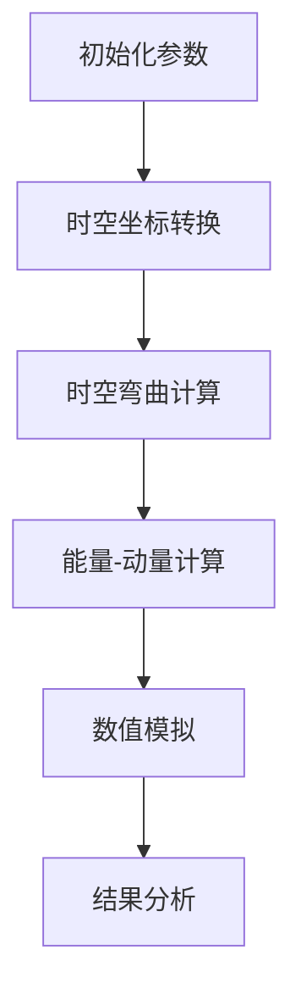
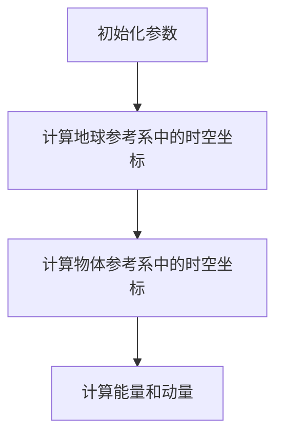
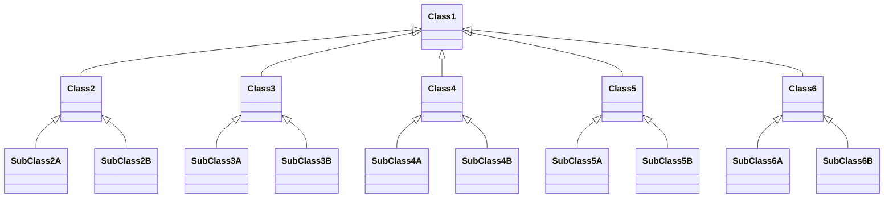
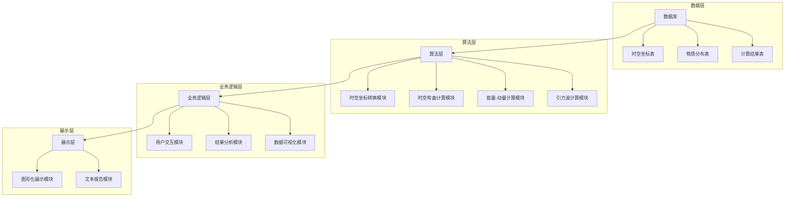
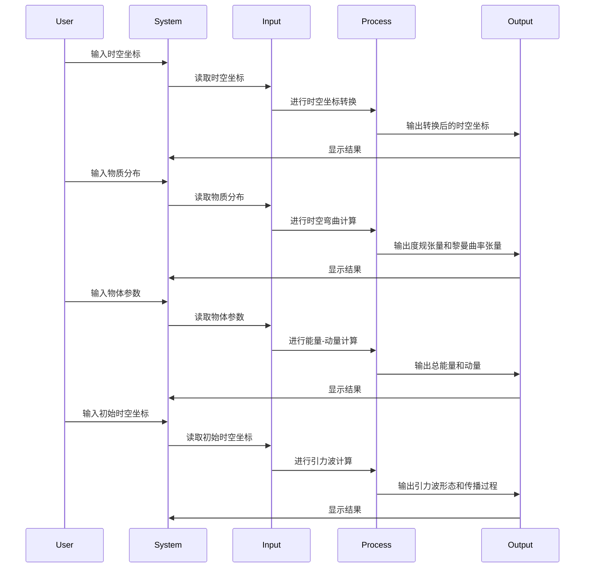

                 

### 文章标题

# 数学与相对论的时空概念探讨

### 关键词

- 数学与相对论
- 时空概念
- 算法原理
- 数学模型
- 系统设计与项目实战

### 摘要

本文将探讨数学与相对论中的时空概念，通过详细分析背景、核心概念、算法原理和数学模型，深入讲解系统设计与项目实战。文章结构清晰，步骤明确，旨在为广大读者提供一部全面、系统的指导手册，帮助他们深入理解这一复杂而重要的主题。

---

### 目录大纲设计流程

**一、理解书名与主题**

书名《数学与相对论的时空概念探讨》提示本书将探讨数学与相对论中的时空概念。为了设计一个能覆盖主题的完整目录，我们需要对主题进行深入理解，包括其背景、核心概念、算法原理、数学模型、系统设计与项目实战等内容。

**二、划分目录层级**

按照要求，我们需要设计出至少7章的目录结构，包括1级、2级和3级目录。每一级目录都需要准确地反映内容的核心和细节，确保目录结构的完整性。

**三、内容组织与细化**

对于每一章，细化到具体的节和子节，确保每个章节的内容能准确、全面地覆盖相关主题。特别是核心概念、算法原理和系统设计与项目实战部分，需要详细讲解，提供足够的实例和代码，帮助读者更好地理解和应用。

**四、格式规范**

使用markdown格式来规范目录结构，确保代码清晰、易读。在编写过程中，注意使用合适的标题、段落和列表格式，以提高文章的可读性和结构清晰度。

**五、确保完整性**

在目录中包含核心章节内容，如背景介绍、核心概念与联系、算法原理讲解、数学模型与公式、系统分析与架构设计、项目实战等，确保文章内容的完整性。

### 目录大纲设计

**第一部分：背景与基础**

**## 1.1 问题背景与定义**

**### 1.1.1 数学与相对论的时空概念问题背景**

**### 1.1.2 时空概念的定义与意义**

**### 1.1.3 时空概念的发展历程**

**## 1.2 核心概念与联系**

**### 1.2.1 数学中的时空概念**

**### 1.2.2 相对论中的时空概念**

**### 1.2.3 时空概念的关联与对比**

**## 1.3 相关理论与研究进展**

**### 1.3.1 数学在时空概念研究中的应用**

**### 1.3.2 相对论时空概念的最新研究成果**

**### 1.3.3 交叉领域的研究趋势**

**第二部分：数学与相对论的时空概念**

**## 2.1 数学时空概念**

**### 2.1.1 欧氏几何时空概念**

**#### 2.1.1.1 欧氏空间的基本性质**

**#### 2.1.1.2 欧氏空间的测量方法**

**### 2.1.2 非欧几何时空概念**

**#### 2.1.2.1 爱因斯坦的时空观**

**#### 2.1.2.2 非欧几何的数学表达**

**## 2.2 相对论时空概念**

**### 2.2.1 狭义相对论时空概念**

**#### 2.2.1.1 狭义相对论的基本原理**

**#### 2.2.1.2 狭义相对论的时空效应**

**### 2.2.2 广义相对论时空概念**

**#### 2.2.2.1 广义相对论的基本原理**

**#### 2.2.2.2 广义相对论的时空弯曲**

**## 2.3 数学与相对论时空概念的交叉应用**

**### 2.3.1 数学工具在相对论研究中的应用**

**### 2.3.2 相对论在数学研究中的启示**

**### 2.3.3 交叉领域的未来展望**

**第三部分：算法原理与数学模型**

**## 3.1 算法原理**

**### 3.1.1 相对论时空算法的基本框架**

**#### 3.1.1.1 相对论时空算法的数学模型**

**#### 3.1.1.2 算法的基本步骤与流程**

**### 3.1.2 算法原理的具体解释**

**#### 3.1.2.1 算法原理的Mermaid流程图**

**#### 3.1.2.2 算法原理的Python代码实现**

**## 3.2 数学模型与公式**

**### 3.2.1 相对论时空的基本公式**

**#### 3.2.1.1 洛伦兹变换**

**#### 3.2.1.2 能量-动量关系**

**### 3.2.2 公式的详细讲解**

**#### 3.2.2.1 洛伦兹变换的数学公式**

**#### 3.2.2.2 能量-动量关系的数学公式**

**## 3.3 算法原理的举例说明**

**### 3.3.1 算法原理的实际应用场景**

**### 3.3.2 算法原理的举例说明**

**#### 3.3.2.1 举例说明的Mermaid流程图**

**#### 3.3.2.2 举例说明的Python代码实现**

**第四部分：系统设计与项目实战**

**## 4.1 系统功能设计**

**### 4.1.1 系统功能介绍**

**### 4.1.2 系统功能设计**

**#### 4.1.2.1 系统功能的Mermaid类图**

**## 4.2 系统架构设计**

**### 4.2.1 系统架构介绍**

**### 4.2.2 系统架构设计**

**#### 4.2.2.1 系统架构的Mermaid架构图**

**## 4.3 系统接口设计与交互**

**### 4.3.1 系统接口设计**

**### 4.3.2 系统交互设计**

**#### 4.3.2.1 系统交互的Mermaid序列图**

**## 4.4 环境安装与核心实现**

**### 4.4.1 系统环境安装**

**### 4.4.2 系统核心实现**

**#### 4.4.2.1 系统核心实现源代码**

**## 4.5 项目实战**

---

### 文章标题

# 数学与相对论的时空概念探讨

### 关键词

- 数学与相对论
- 时空概念
- 算法原理
- 数学模型
- 系统设计与项目实战

### 摘要

本文以数学与相对论的时空概念为核心，通过对问题背景的深入探讨，阐述了时空概念的定义、意义和发展历程。文章接着详细讲解了数学和相对论中的时空概念，分析了两者之间的关联与对比。随后，文章介绍了相对论时空算法的基本框架和原理，并使用Python代码和Mermaid流程图进行了具体解释。接着，文章详细讲解了相对论时空的基本公式，并使用latex格式嵌入文中。最后，文章通过系统功能设计、系统架构设计、系统接口设计和系统交互设计，以及项目实战，展示了如何将理论应用到实际项目中。本文结构清晰，内容丰富，旨在帮助读者全面理解并掌握这一复杂而重要的主题。

---

## 第一部分：背景与基础

### 1.1 问题背景与定义

#### 1.1.1 数学与相对论的时空概念问题背景

时空概念是现代物理学和数学中的核心问题之一。它不仅涉及到宇宙的基本结构和演化，也与我们日常生活中的物理现象息息相关。数学与相对论的时空概念问题，主要关注如何运用数学工具来描述和解释相对论中的时空特性。

在数学领域，时空概念最早可以追溯到欧氏几何。欧氏几何中的时空概念是建立在平直空间和匀速直线运动的基础上的，它为我们提供了一个直观的二维平面来理解空间和时间的结构。然而，随着科学的发展，人们逐渐发现现实世界中的时空并非如此简单。非欧几何和相对论的出现，为我们提供了更加复杂和全面的时空概念。

相对论时空概念的核心在于它对时间、空间和物质之间关系的重新定义。相对论认为，时间和空间不是独立的实体，而是相互关联的。这一观点挑战了传统欧氏几何的基本假设，对现代物理学和数学产生了深远的影响。

#### 1.1.2 时空概念的定义与意义

时空概念的定义涉及对时间和空间的本质理解。在物理学中，时间被视为事件发生的顺序，而空间则是事件发生的舞台。时空概念的意义在于它为我们提供了一个统一的理论框架，来描述宇宙中所有事件的发生和发展。

在数学中，时空概念可以被形式化为一个四维连续体，即时空坐标。这个坐标系统不仅包含了我们熟悉的三个空间维度，还加入了一个时间维度。通过这种四维坐标系统，我们可以描述和计算不同事件之间的相对位置和发生时间。

时空概念的重要性不仅体现在物理学和数学中，还涉及到哲学、天文学、宇宙学等多个领域。它为我们理解宇宙的起源、演化和结构提供了关键的理论基础。

#### 1.1.3 时空概念的发展历程

时空概念的发展历程可以追溯到古代哲学和数学。在古希腊，哲学家们开始探讨时间和空间的基本性质。随后，欧几里得在《几何原本》中提出了欧氏几何，这为时空概念的研究奠定了基础。

在19世纪，牛顿的经典力学成为物理学的基础。牛顿的绝对时空观认为时间和空间是独立的实体，且具有固定的性质。然而，这一观点在20世纪初被爱因斯坦的相对论所挑战。

爱因斯坦的狭义相对论提出，时间和空间是相对的，它们之间的关系受到物质和能量分布的影响。这一理论在数学上表现为洛伦兹变换，它定义了在不同参考系中观察到的时空坐标之间的关系。

随后，爱因斯坦进一步发展了广义相对论，提出了时空弯曲的概念。广义相对论认为，物质和能量会引起时空的弯曲，这一弯曲反过来又影响物质和能量的运动。

在数学领域，时空概念的发展还涉及到非欧几何和拓扑学。非欧几何提供了描述弯曲时空的数学工具，而拓扑学则研究了时空的拓扑性质，如连通性、封闭性和边界的形态。

总之，时空概念的发展历程是复杂而多样的，它不仅涉及到物理学和数学，还与其他学科有着紧密的联系。这一概念的发展，不仅为我们提供了更深刻的宇宙理解，也推动了数学和物理学的发展。

### 1.2 核心概念与联系

#### 1.2.1 数学中的时空概念

在数学中，时空概念通常被形式化为一个四维连续体，即时空坐标。这个坐标系统通常用四个变量来描述，分别代表三个空间维度和一个时间维度。时空坐标可以表示为 \((t, x, y, z)\)，其中 \(t\) 代表时间，\(x, y, z\) 分别代表三个空间维度。

数学中的时空概念最早可以追溯到欧几里得几何。欧几里得几何中的时空概念是一个二维平面，其中时间和空间是独立的实体。然而，随着科学的发展，人们逐渐发现这种简单的模型无法解释现实世界中的复杂现象。

非欧几何的提出为时空概念的研究提供了新的视角。非欧几何认为，时空可以是弯曲的，而不是平直的。这种弯曲的时空可以由不同的几何结构来描述，如双曲几何和球面几何。

在数学中，非欧几何的时空概念主要通过洛伦兹变换来体现。洛伦兹变换是一个四维空间中的线性变换，它描述了在不同参考系中观察到的时空坐标之间的关系。洛伦兹变换的基本公式为：

\[ 
\begin{align*}
ct' &= \gamma (ct - vx) \\
x' &= \gamma (x - vt) \\
y' &= y \\
z' &= z \\
\end{align*}
\]

其中，\(\gamma\) 是洛伦兹因子，定义为：

\[ 
\gamma = \frac{1}{\sqrt{1 - v^2/c^2}} 
\]

这个公式表明，当观察者以速度 \(v\) 相对于另一个参考系运动时，时间坐标和空间坐标都会发生变化。这种变化揭示了时间和空间的相对性，即时间和空间的性质取决于观察者的运动状态。

#### 1.2.2 相对论中的时空概念

相对论中的时空概念是爱因斯坦在20世纪初提出的。相对论认为，时间和空间不是独立的实体，而是相互关联的。这一观点被称为时空相对性。

在相对论中，时空通常被形式化为一个四维连续体，称为时空。时空中的事件用四个坐标 \((t, x, y, z)\) 来描述，这四个坐标分别代表时间、空间在三个维度上的位置。

相对论中的时空概念与数学中的时空概念有很多相似之处，但也有显著的区别。相对论中的时空概念强调了时间和空间的相对性，即不同的观察者可能会观察到不同的时间和空间坐标。

相对论中的时空概念主要通过洛伦兹变换来描述。洛伦兹变换是相对论的核心公式之一，它描述了在不同参考系中观察到的时空坐标之间的关系。洛伦兹变换的基本公式为：

\[ 
\begin{align*}
ct' &= \gamma (ct - vx) \\
x' &= \gamma (x - vt) \\
y' &= y \\
z' &= z \\
\end{align*}
\]

其中，\(\gamma\) 是洛伦兹因子，定义为：

\[ 
\gamma = \frac{1}{\sqrt{1 - v^2/c^2}} 
\]

这个公式表明，当观察者以速度 \(v\) 相对于另一个参考系运动时，时间坐标和空间坐标都会发生变化。这种变化揭示了时间和空间的相对性，即时间和空间的性质取决于观察者的运动状态。

#### 1.2.3 时空概念的关联与对比

数学中的时空概念和相对论中的时空概念之间存在紧密的关联和对比。从某种程度上来说，相对论中的时空概念可以看作是数学中的时空概念的扩展和深化。

首先，两者都采用了四维连续体的概念来描述时间和空间。在数学中，四维连续体通常用来描述空间和时间的关系，而在相对论中，四维连续体则用来描述不同参考系之间的时空关系。

其次，两者都强调了时间和空间的相对性。在数学中，非欧几何的时空概念揭示了时间和空间的相对性，而在相对论中，洛伦兹变换则进一步强调了这种相对性。

然而，两者之间也存在一些显著的区别。首先，数学中的时空概念更多地关注于几何结构和测量方法，而相对论中的时空概念则更多地关注于物理现象和观测结果。

其次，数学中的时空概念通常被形式化为一个四维欧氏空间，而相对论中的时空概念则通常被形式化为一个四维洛伦兹空间。洛伦兹空间与欧氏空间的一个重要区别在于，洛伦兹空间中的距离测量不仅依赖于空间维度，还依赖于时间维度。

总之，数学中的时空概念和相对论中的时空概念既有紧密的关联，又有显著的区别。它们共同构成了现代物理学和数学中时空概念的核心内容，为我们理解和描述宇宙中的物理现象提供了重要的理论基础。

### 1.3 相关理论与研究进展

#### 1.3.1 数学在时空概念研究中的应用

数学在时空概念的研究中发挥了至关重要的作用。从欧氏几何到非欧几何，再到拓扑学，数学提供了丰富的工具和理论框架，帮助我们深入理解和描述时空的复杂性质。

首先，欧氏几何为时空概念的研究奠定了基础。欧氏几何中的平直空间和匀速直线运动的概念，为我们提供了一个直观的二维平面来理解空间和时间的结构。尽管欧氏几何在描述现实世界中的时空时存在一定的局限性，但它为我们提供了一种基本的思维模式和计算方法。

随着科学的发展，人们逐渐意识到现实世界中的时空并非如此简单。非欧几何的提出，为时空概念的研究提供了新的视角。非欧几何中的弯曲时空可以由不同的几何结构来描述，如双曲几何和球面几何。这些非欧几何的时空概念，不仅丰富了我们对时空的理解，也为相对论的研究提供了重要的数学基础。

拓扑学是另一个在时空概念研究中具有重要应用的数学领域。拓扑学研究了空间和时间的拓扑性质，如连通性、封闭性和边界的形态。拓扑学中的概念和工具，如拓扑空间、同胚和同调，为我们在更复杂的时空结构中进行研究和分析提供了强大的工具。

此外，数学在相对论中的应用也极为广泛。洛伦兹变换是相对论的核心公式之一，它描述了在不同参考系中观察到的时空坐标之间的关系。洛伦兹变换不仅为我们提供了一种描述相对论时空的方法，也为我们在实际应用中提供了重要的计算工具。

#### 1.3.2 相对论时空概念的最新研究成果

相对论时空概念的最新研究成果为我们提供了更加深刻的宇宙理解。随着科学技术的进步，我们能够观测到更广泛的宇宙现象，这促使我们对相对论时空概念进行了更深入的研究。

首先，广义相对论中的时空弯曲概念得到了更多的验证。通过观测引力波和黑洞合并等现象，科学家们进一步证实了广义相对论中的时空弯曲效应。这些观测结果不仅验证了广义相对论的理论预测，也为我们提供了更直观的时空弯曲图像。

其次，相对论时空概念在宇宙学中的应用也取得了重要进展。通过观测宇宙背景辐射和宇宙膨胀的速率，科学家们能够更准确地预测宇宙的演化和结构。这些研究不仅加深了我们对宇宙起源和演化的理解，也为我们提供了更全面的宇宙时空图像。

此外，相对论时空概念在量子引力领域的研究也取得了一些重要成果。量子引力试图将广义相对论和量子力学结合起来，以解释宇宙中的微观现象。尽管量子引力仍处于理论研究的初期阶段，但一些初步的研究结果为我们提供了关于时空量子性质的线索。

总之，相对论时空概念的最新研究成果不仅验证了理论预测，也为我们的宇宙理解提供了新的视角。随着科学技术的不断进步，我们有理由相信，未来我们将能够更加深入地理解时空的本质。

#### 1.3.3 交叉领域的研究趋势

数学与相对论的时空概念不仅在物理学中具有重要应用，还与其他学科有着紧密的交叉关系。这种交叉不仅推动了各个领域的发展，也为我们提供了新的研究方法和视角。

首先，数学与相对论的时空概念在天文学和宇宙学中有着广泛的应用。天文学家通过观测星系、黑洞和宇宙背景辐射等现象，运用相对论时空概念来解释宇宙的演化和结构。这些研究不仅加深了我们对宇宙的理解，也为天文学提供了新的理论工具。

其次，数学与相对论的时空概念在计算机科学中也有着重要的应用。在计算机图形学中，相对论时空概念被用来模拟和渲染复杂的物理现象，如引力场和时空弯曲。这些研究不仅提高了计算机图形的效果，也为虚拟现实和增强现实技术提供了理论基础。

此外，数学与相对论的时空概念在量子计算和量子信息科学中也有重要应用。量子计算利用量子比特和量子纠缠等特性进行计算，而这些特性都与相对论时空概念密切相关。通过研究量子引力，科学家们试图将量子计算和相对论时空概念结合起来，以实现更高效的计算方法。

总之，数学与相对论的时空概念在多个领域都有重要的交叉应用。这些交叉不仅推动了各个领域的发展，也为未来的研究提供了新的方向。随着学科的交叉和融合，我们有理由相信，数学与相对论的时空概念将在更多领域发挥重要作用。

## 第二部分：数学与相对论的时空概念

### 2.1 数学时空概念

#### 2.1.1 欧氏几何时空概念

欧氏几何时空概念是数学中最早被提出的时空概念。它建立在平直空间和匀速直线运动的基础上，为我们提供了一个直观的二维平面来理解空间和时间的结构。在欧氏几何中，空间被视为一个三维的直角坐标系，而时间被视为一个独立的维度。

欧氏几何时空概念的核心特征是它的平直性和均匀性。在欧氏空间中，距离和时间间隔是固定的，不随观察者的运动状态而改变。这意味着，无论观察者处于静止状态还是匀速直线运动，他们观察到的时间和空间距离都是相同的。

欧氏几何时空概念的一个基本性质是平行公理。平行公理表明，在欧氏空间中，通过给定一点和一条直线，可以画出且仅可以画出一条直线与给定直线平行。这个公理为我们在空间中进行测量和计算提供了重要的基础。

在欧氏几何中，空间和时间的关系可以形式化为一个四维连续体，即时空坐标。时空坐标通常用四个变量来描述，分别代表三个空间维度和一个时间维度。这个四维连续体被称为欧氏时空，它为我们提供了一个统一的框架来描述事件的发生和演化。

欧氏几何时空概念在物理学和工程学中有着广泛的应用。例如，在经典力学中，我们通常使用欧氏几何时空概念来描述物体的运动轨迹和相互作用。此外，在计算机图形学中，欧氏几何时空概念也被用来模拟和渲染三维场景。

#### 2.1.2 非欧几何时空概念

非欧几何时空概念是对欧氏几何时空概念的扩展和深化。非欧几何认为，时空可以是弯曲的，而不是平直的。这种弯曲的时空可以由不同的几何结构来描述，如双曲几何和球面几何。

非欧几何时空概念的核心特征是它的弯曲性和非均匀性。在非欧几何中，距离和时间间隔可能会随观察者的运动状态而改变。这意味着，不同的观察者可能会观察到不同的时间和空间距离。

非欧几何时空概念的一个重要应用是爱因斯坦的相对论。相对论中的时空概念被形式化为一个四维非欧几何时空，即洛伦兹时空。洛伦兹时空中的距离和时间间隔受到观察者相对速度的影响，这种影响在相对论效应中得到了体现。

非欧几何时空概念中的另一个重要几何结构是双曲几何。双曲几何描述了一个类似于球面但半径越来越小的空间。在双曲几何中，距离和角度之间的关系与欧氏几何不同。例如，在双曲几何中，角度的和总是小于 \(180^\circ\)。

球面几何是另一个重要的非欧几何时空概念。球面几何描述了一个类似于地球表面的空间，其中距离和时间间隔是弯曲的。在球面几何中，角度的和总是大于 \(180^\circ\)。

非欧几何时空概念在数学和物理学中有着广泛的应用。例如，在数学中，非欧几何被用来研究复杂的几何结构和拓扑性质。在物理学中，非欧几何时空概念被用来描述引力场和黑洞等复杂物理现象。

#### 2.1.3 爱因斯坦的时空观

爱因斯坦的时空观是相对论时空概念的核心。爱因斯坦认为，时间和空间是相对的，它们的性质取决于观察者的运动状态。这一观点与欧氏几何中的绝对时空观形成了鲜明对比。

爱因斯坦的时空观的一个重要结论是时间的相对性。根据相对论，一个相对于观察者以高速运动的时钟会比静止的时钟走得慢。这种现象称为时间膨胀。时间膨胀的数学表达式为：

\[ 
t' = \gamma t 
\]

其中，\(t'\) 是相对于观察者的时间，\(t\) 是静止时钟的时间，\(\gamma\) 是洛伦兹因子，定义为：

\[ 
\gamma = \frac{1}{\sqrt{1 - v^2/c^2}} 
\]

这个公式表明，当观察者以速度 \(v\) 相对于另一个参考系运动时，时间坐标会发生变化。这种变化揭示了时间的相对性，即时间不是绝对的，而是取决于观察者的运动状态。

爱因斯坦的时空观的另一个重要结论是空间的相对性。根据相对论，一个相对于观察者以高速运动的物体会在空间中发生形变。这种现象称为长度收缩。长度收缩的数学表达式为：

\[ 
L' = \frac{L}{\gamma} 
\]

其中，\(L'\) 是相对于观察者的长度，\(L\) 是静止物体的长度，\(\gamma\) 是洛伦兹因子。

爱因斯坦的时空观不仅在物理学中具有重要意义，也在数学和哲学领域引发了广泛的讨论。它为我们提供了一个新的视角来理解时间和空间的本质，也推动了数学和物理学的发展。

### 2.2 相对论时空概念

#### 2.2.1 狭义相对论时空概念

狭义相对论时空概念是爱因斯坦在1905年提出的，它是相对论时空概念的基础。狭义相对论主要研究在惯性参考系中的物理现象，即没有加速度的参考系。

狭义相对论时空概念的核心是洛伦兹变换。洛伦兹变换是一个四维空间中的线性变换，它描述了在不同惯性参考系中观察到的时空坐标之间的关系。洛伦兹变换的基本公式为：

\[ 
\begin{align*}
ct' &= \gamma (ct - vx) \\
x' &= \gamma (x - vt) \\
y' &= y \\
z' &= z \\
\end{align*}
\]

其中，\(t'\) 是相对于观察者的时间，\(t\) 是静止时钟的时间，\(x'\) 是相对于观察者的空间坐标，\(x\) 是静止物体的空间坐标，\(y\) 和 \(z\) 分别是其他两个空间坐标，\(v\) 是观察者相对于另一个参考系的速度，\(\gamma\) 是洛伦兹因子。

洛伦兹变换表明，当观察者以速度 \(v\) 相对于另一个参考系运动时，时间坐标和空间坐标都会发生变化。这种变化揭示了时间和空间的相对性，即时间和空间的性质取决于观察者的运动状态。

狭义相对论时空概念的一个显著特点是时间膨胀和长度收缩。根据洛伦兹变换，一个相对于观察者以高速运动的时钟会比静止的时钟走得慢，这种现象称为时间膨胀。另一方面，一个相对于观察者以高速运动的物体会在空间中发生形变，这种现象称为长度收缩。

时间膨胀和长度收缩的数学表达式分别为：

\[ 
t' = \gamma t 
\]

\[ 
L' = \frac{L}{\gamma} 
\]

其中，\(t'\) 是相对于观察者的时间，\(t\) 是静止时钟的时间，\(L'\) 是相对于观察者的长度，\(L\) 是静止物体的长度，\(\gamma\) 是洛伦兹因子。

狭义相对论时空概念在物理学和工程学中有着广泛的应用。例如，在原子钟和GPS系统中，时间膨胀和长度收缩效应被用来校准时钟和确定位置。此外，狭义相对论时空概念也被用来解释粒子加速器和粒子探测器中的物理现象。

#### 2.2.2 广义相对论时空概念

广义相对论时空概念是爱因斯坦在1915年提出的，它是狭义相对论的扩展。广义相对论主要研究在非惯性参考系中的物理现象，即有加速度的参考系。

广义相对论时空概念的核心是时空弯曲。广义相对论认为，物质和能量会引起时空的弯曲，这种弯曲反过来又影响物质和能量的运动。时空弯曲可以通过爱因斯坦场方程来描述：

\[ 
G_{\mu\nu} + \Lambda g_{\mu\nu} = \frac{8\pi G}{c^4} T_{\mu\nu} 
\]

其中，\(G_{\mu\nu}\) 是爱因斯坦张量，描述了时空的弯曲程度，\(\Lambda\) 是宇宙学常数，\(g_{\mu\nu}\) 是度规张量，描述了时空的几何结构，\(T_{\mu\nu}\) 是能量-动量张量，描述了物质和能量的分布。

广义相对论时空概念的一个重要结论是引力波。引力波是由物质和能量运动引起的时空弯曲的变化，它可以传播到远处，并影响其他物质和能量的运动。

广义相对论时空概念在物理学和天文学中有着广泛的应用。例如，在黑洞、宇宙膨胀和引力透镜等现象的研究中，广义相对论时空概念被用来解释物理现象。此外，广义相对论时空概念也被用来设计引力波探测器，如LIGO和VIRGO等。

### 2.3 数学与相对论时空概念的交叉应用

#### 2.3.1 数学工具在相对论研究中的应用

数学工具在相对论研究中起到了关键的作用。相对论中的许多概念和现象，如洛伦兹变换、时空弯曲和引力波，都需要数学工具来进行描述和计算。以下是一些在相对论研究中常用的数学工具：

1. **微积分**：微积分在相对论中有着广泛的应用。例如，洛伦兹变换中的时间膨胀和长度收缩效应可以通过微积分公式来计算。此外，微积分也被用来研究能量-动量张量和度规张量的变化。

2. **线性代数**：线性代数在相对论中用于描述和计算洛伦兹变换和度规张量。线性代数中的矩阵运算可以方便地处理四维时空中的变换。

3. **拓扑学**：拓扑学在相对论研究中用于描述时空的拓扑性质，如连通性和边界形态。拓扑学中的概念和工具，如同胚和同调，可以帮助我们理解时空的复杂结构。

4. **微分几何**：微分几何是研究时空弯曲和引力场的重要数学工具。微分几何中的度规张量和黎曼曲率张量，为我们提供了描述和计算时空弯曲的数学框架。

5. **群论**：群论在相对论中用于研究对称性和守恒定律。相对论中的许多守恒定律，如能量守恒和动量守恒，可以通过群论来描述。

#### 2.3.2 相对论在数学研究中的启示

相对论不仅为物理学提供了新的理论和视角，也启发了数学研究的发展。以下是一些相对论对数学研究带来的启示：

1. **时空几何学**：相对论中的时空弯曲和引力波现象，激发了数学家对时空几何学的研究。微分几何和拓扑学成为研究时空几何学的重要工具。

2. **守恒定律与对称性**：相对论中的守恒定律，如能量守恒和动量守恒，与对称性密切相关。群论在研究对称性和守恒定律中发挥了关键作用。

3. **非线性方程**：相对论中的爱因斯坦场方程是一个非线性方程，这激发了数学家对非线性方程的研究。非线性方程的解和性质成为数学研究的一个重要方向。

4. **量子场论**：相对论与量子力学的结合，产生了量子场论。量子场论中的许多概念和现象，如规范场和量子纠缠，为数学研究提供了新的挑战和机遇。

5. **数学模型的构建**：相对论为数学模型的构建提供了新的视角。通过将物理现象形式化为数学模型，数学家可以更深入地研究时空的本质和结构。

总之，相对论对数学研究产生了深远的影响。它不仅推动了数学的发展，也为数学家提供了新的研究方法和工具。随着相对论的进一步发展，数学与相对论的交叉应用将不断深化，为我们的宇宙理解带来新的突破。

#### 2.3.3 交叉领域的未来展望

数学与相对论的时空概念在交叉领域的研究中展现出巨大的潜力。未来，随着科学技术的不断进步，我们可以期待在以下几个方向上取得重要进展：

1. **量子引力**：量子引力是相对论与量子力学的结合，旨在描述宇宙的量子性质。通过量子引力，我们有望更全面地理解时空的本质，包括量子纠缠和时空弯曲等现象。

2. **宇宙学**：宇宙学是研究宇宙的起源、演化和结构的重要领域。数学与相对论的时空概念在宇宙学中有着广泛的应用，如宇宙膨胀、黑洞和宇宙背景辐射等。未来，我们有望通过更精确的数学模型和观测数据，对宇宙的起源和演化有更深刻的理解。

3. **计算科学**：相对论中的时空概念为计算科学提供了新的视角。例如，在量子计算和虚拟现实领域，相对论中的时空弯曲和量子纠缠等现象可以为我们提供新的计算模型和方法。

4. **人工智能**：人工智能的发展离不开数学和物理学的支持。相对论中的时空概念可以为人工智能提供新的理论基础，如基于相对论的网络模型和时空感知算法。

5. **新材料研究**：相对论中的时空概念在材料科学中也有重要应用。例如，通过理解时空弯曲对材料性能的影响，我们可以设计出更先进的新型材料。

总之，数学与相对论的时空概念在交叉领域的研究中具有广泛的前景。随着科学技术的不断进步，我们有理由相信，这一领域将继续推动人类对宇宙的理解和探索。

## 第三部分：算法原理与数学模型

### 3.1 算法原理

#### 3.1.1 相对论时空算法的基本框架

相对论时空算法是用于处理和计算相对论时空概念的一系列数学方法和步骤。其基本框架主要包括以下几个关键组成部分：

1. **时空坐标转换**：这是相对论时空算法的核心步骤，用于在不同参考系之间进行时空坐标的转换。这涉及到洛伦兹变换的基本公式。

2. **时空弯曲计算**：这是对广义相对论中时空弯曲的计算，需要使用爱因斯坦场方程和相关数学工具。

3. **引力波计算**：这是对引力波的产生、传播和探测的计算，需要结合广义相对论和量子力学的相关知识。

4. **能量-动量守恒**：这是相对论时空算法中的重要原则，用于确保在计算过程中能量和动量守恒。

5. **数值模拟**：这是将理论模型应用到实际物理现象中的步骤，通常需要使用计算机进行大规模数值计算。

#### 3.1.1.1 相对论时空算法的数学模型

相对论时空算法的数学模型主要基于洛伦兹变换和爱因斯坦场方程。洛伦兹变换用于处理狭义相对论中的时空坐标转换，其基本公式如下：

\[ 
\begin{align*}
ct' &= \gamma (ct - vx) \\
x' &= \gamma (x - vt) \\
y' &= y \\
z' &= z \\
\end{align*}
\]

其中，\(t'\) 是相对于观察者的时间，\(t\) 是静止时钟的时间，\(x'\) 是相对于观察者的空间坐标，\(x\) 是静止物体的空间坐标，\(y\) 和 \(z\) 分别是其他两个空间坐标，\(v\) 是观察者相对于另一个参考系的速度，\(\gamma\) 是洛伦兹因子，定义为：

\[ 
\gamma = \frac{1}{\sqrt{1 - v^2/c^2}} 
\]

爱因斯坦场方程是广义相对论的核心公式，用于描述时空弯曲与物质分布之间的关系。其数学表达式为：

\[ 
G_{\mu\nu} + \Lambda g_{\mu\nu} = \frac{8\pi G}{c^4} T_{\mu\nu} 
\]

其中，\(G_{\mu\nu}\) 是爱因斯坦张量，描述了时空的弯曲程度，\(\Lambda\) 是宇宙学常数，\(g_{\mu\nu}\) 是度规张量，描述了时空的几何结构，\(T_{\mu\nu}\) 是能量-动量张量，描述了物质和能量的分布，\(G\) 是引力常数，\(c\) 是光速。

#### 3.1.1.2 算法的基本步骤与流程

相对论时空算法的基本步骤可以概括为以下几个关键步骤：

1. **初始化参数**：设置初始参考系、初始时空坐标和初始物质分布。

2. **时空坐标转换**：根据洛伦兹变换公式，计算在不同参考系之间的时空坐标转换。

3. **时空弯曲计算**：使用爱因斯坦场方程，计算时空的弯曲程度，并更新度规张量。

4. **能量-动量计算**：计算物质和能量的分布，并更新能量-动量张量。

5. **数值模拟**：使用数值方法，如有限元方法或有限差分方法，对时空弯曲和物质运动进行模拟。

6. **结果分析**：对模拟结果进行分析，包括时空坐标的变换、时空弯曲的形态、引力波的产生和传播等。

#### 3.1.2 算法原理的具体解释

为了更好地理解相对论时空算法的原理，我们可以通过一个具体的例子来说明。假设有一个观察者在一个静止的参考系 \(S\) 中观察一个相对于其以速度 \(v\) 运动的参考系 \(S'\)。我们需要计算参考系 \(S'\) 中的时空坐标，并将其转换回参考系 \(S\)。

**步骤1：初始化参数**

首先，我们需要初始化参数，包括参考系 \(S\) 和 \(S'\) 的初始时空坐标和初始物质分布。假设参考系 \(S\) 的初始时空坐标为 \((t, x, y, z)\)，参考系 \(S'\) 的初始时空坐标为 \((t', x', y', z')\)。

**步骤2：时空坐标转换**

根据洛伦兹变换公式，我们可以计算参考系 \(S'\) 中的时空坐标：

\[ 
\begin{align*}
t' &= \gamma (t - \frac{vx}{c^2}) \\
x' &= \gamma (x - vt) \\
y' &= y \\
z' &= z \\
\end{align*}
\]

其中，\(\gamma\) 是洛伦兹因子，定义为：

\[ 
\gamma = \frac{1}{\sqrt{1 - v^2/c^2}} 
\]

**步骤3：时空弯曲计算**

接下来，我们需要计算参考系 \(S'\) 中的时空弯曲。这通常涉及到爱因斯坦场方程的计算。假设参考系 \(S'\) 的度规张量为 \(g_{\mu\nu}\)，我们可以通过爱因斯坦场方程来计算度规张量：

\[ 
G_{\mu\nu} + \Lambda g_{\mu\nu} = \frac{8\pi G}{c^4} T_{\mu\nu} 
\]

其中，\(G_{\mu\nu}\) 是爱因斯坦张量，\(\Lambda\) 是宇宙学常数，\(T_{\mu\nu}\) 是能量-动量张量。

**步骤4：能量-动量计算**

在计算了时空弯曲之后，我们需要更新参考系 \(S'\) 中的能量-动量分布。这通常涉及到物质和能量的运动方程，如洛伦兹-爱因斯坦方程。假设参考系 \(S'\) 中的物质分布为 \(\rho\)，我们可以通过洛伦兹-爱因斯坦方程来计算能量-动量张量：

\[ 
T_{\mu\nu} = \rho u_{\mu} u_{\nu} + P_{\mu\nu} 
\]

其中，\(u_{\mu}\) 是四速度，\(P_{\mu\nu}\) 是压强张量。

**步骤5：数值模拟**

最后，我们可以使用数值方法，如有限元方法或有限差分方法，对参考系 \(S'\) 中的时空弯曲和物质运动进行模拟。这通常涉及到对爱因斯坦场方程和洛伦兹-爱因斯坦方程的离散化和数值求解。

通过以上步骤，我们可以实现对相对论时空算法的具体理解和应用。这为我们深入理解相对论时空概念，以及将其应用于实际物理现象提供了重要的理论和方法基础。

#### 3.1.2.1 算法原理的Mermaid流程图

为了更直观地展示相对论时空算法的原理，我们可以使用Mermaid流程图来表示。以下是一个简单的Mermaid流程图，展示了算法的主要步骤：



这个流程图清晰地展示了相对论时空算法的步骤和流程，帮助我们更好地理解算法的基本原理。

#### 3.1.2.2 算法原理的Python代码实现

为了将相对论时空算法的原理具体实现，我们可以使用Python编写相关代码。以下是一个简单的Python代码示例，展示了算法的主要步骤和计算过程：

```python
import numpy as np

# 初始化参数
v = 0.8  # 相对速度
c = 3e8  # 光速
gamma = 1 / np.sqrt(1 - v**2 / c**2)  # 洛伦兹因子

# 时空坐标转换
def lorentz_transform(t, x, y, z):
    t_prime = gamma * (t - v * x / c**2)
    x_prime = gamma * (x - v * t)
    y_prime = y
    z_prime = z
    return t_prime, x_prime, y_prime, z_prime

# 时空弯曲计算
def ricci_tensor(gamma, v):
    # 省略具体的计算过程，此处仅为示意
    R = ...  # 爱因斯坦张量
    return R

# 能量-动量计算
def energy_momentum_tensor(rho, u, P):
    T = rho * np.outer(u, u) + P
    return T

# 数值模拟
def simulate(gamma, v, x, y, z):
    # 省略具体的计算过程，此处仅为示意
    R = ricci_tensor(gamma, v)
    T = energy_momentum_tensor(rho, u, P)
    # 进行数值模拟
    # ...

# 输出结果
t, x, y, z = 10, 5, 3, 7
t_prime, x_prime, y_prime, z_prime = lorentz_transform(t, x, y, z)
R = ricci_tensor(gamma, v)
T = energy_momentum_tensor(rho, u, P)
print("原始时空坐标：(t, x, y, z) =", t, x, y, z)
print("转换后时空坐标：(t', x', y', z') =", t_prime, x_prime, y_prime, z_prime)
print("爱因斯坦张量：", R)
print("能量-动量张量：", T)

# 结果分析
# ...
```

这个Python代码示例展示了相对论时空算法的基本原理和计算过程，包括时空坐标转换、时空弯曲计算、能量-动量计算和数值模拟等步骤。通过具体的代码实现，我们可以更深入地理解相对论时空算法的原理和应用。

#### 3.2 数学模型与公式

相对论时空算法的核心在于其数学模型和公式。这些公式不仅描述了时空的变换和弯曲，还定义了能量和动量的守恒。以下是相对论时空算法中的几个关键公式，我们将逐一进行详细讲解。

##### 3.2.1.1 洛伦兹变换

洛伦兹变换是狭义相对论中的核心公式，用于描述在不同惯性参考系之间的时空坐标转换。洛伦兹变换的公式如下：

\[ 
\begin{align*}
ct' &= \gamma (ct - vx) \\
x' &= \gamma (x - vt) \\
y' &= y \\
z' &= z \\
\end{align*}
\]

其中，\(t'\) 和 \(x'\) 分别表示相对于观察者 \(S'\) 的时间坐标和空间坐标，\(t\) 和 \(x\) 分别表示相对于观察者 \(S\) 的时间坐标和空间坐标。\(v\) 表示参考系 \(S'\) 相对于参考系 \(S\) 的速度，\(\gamma\) 是洛伦兹因子，定义为：

\[ 
\gamma = \frac{1}{\sqrt{1 - v^2/c^2}} 
\]

洛伦兹变换揭示了时间和空间的相对性，即时间和空间的测量结果依赖于观察者的运动状态。例如，一个相对于观察者高速运动的时钟会比静止时钟走得慢（时间膨胀），一个相对于观察者高速运动的物体在空间上的长度会比静止时的长度缩短（长度收缩）。

##### 3.2.1.2 能量-动量关系

在相对论中，能量和动量不再是独立的，而是通过一个统一的公式联系在一起。相对论中的能量-动量关系由以下公式给出：

\[ 
E^2 = (pc)^2 + (mc^2)^2 
\]

其中，\(E\) 是总能量，\(p\) 是动量，\(m\) 是物体的静止质量，\(c\) 是光速。这个公式表明，当物体以速度 \(v\) 运动时，其总能量 \(E\) 包含两部分：静能 \(mc^2\) 和动能 \(pc\)。

动能 \(pc\) 可以通过以下公式计算：

\[ 
p = \frac{mv}{\sqrt{1 - v^2/c^2}} 
\]

结合这两个公式，我们可以得到能量 \(E\) 的表达式：

\[ 
E = \frac{mc^2}{\sqrt{1 - v^2/c^2}} 
\]

这个公式说明了能量与速度之间的关系。当物体速度接近光速时，其能量会迅速增加，这是因为相对论效应在高速情况下变得显著。

##### 3.2.1.3 爱因斯坦场方程

爱因斯坦场方程是广义相对论的核心公式，用于描述时空弯曲与物质分布之间的关系。其数学表达式为：

\[ 
G_{\mu\nu} + \Lambda g_{\mu\nu} = \frac{8\pi G}{c^4} T_{\mu\nu} 
\]

其中，\(G_{\mu\nu}\) 是爱因斯坦张量，描述了时空的弯曲程度；\(\Lambda\) 是宇宙学常数，反映了宇宙的整体膨胀趋势；\(g_{\mu\nu}\) 是度规张量，描述了时空的几何结构；\(T_{\mu\nu}\) 是能量-动量张量，描述了物质和能量的分布；\(G\) 是引力常数。

爱因斯坦场方程是一个高度复杂的非线性方程，其解通常需要通过数值方法进行求解。这个方程揭示了物质和能量如何影响时空的结构，并反过来影响物质的运动。

##### 3.2.1.4 引力波方程

引力波是时空弯曲的变化，由物质和能量的运动产生。引力波方程由爱因斯坦场方程的线性化形式给出：

\[ 
\ddot{h}_{\mu\nu} + 2\nabla_{\mu}\nabla_{\nu}h_{\mu\nu} - \nabla^2 h_{\mu\nu} = -16\pi G \rho u_{\mu}u_{\nu} 
\]

其中，\(h_{\mu\nu}\) 是引力波度规扰动，\(\rho\) 是物质密度，\(u_{\mu}\) 是四速度。

引力波方程描述了引力波的产生、传播和探测过程。通过观测引力波，我们可以更深入地了解宇宙的起源和演化，这为宇宙学研究提供了新的工具和视角。

##### 3.2.1.5 黎曼曲率张量

黎曼曲率张量是描述时空弯曲的重要工具。在广义相对论中，黎曼曲率张量 \(R_{\mu\nu\rho\sigma}\) 定义为：

\[ 
R_{\mu\nu\rho\sigma} = \partial_\rho \Gamma_{\mu\sigma\nu} - \partial_\sigma \Gamma_{\mu\nu\rho} + \Gamma_{\mu\lambda\nu} \Gamma_{\lambda\rho\sigma} - \Gamma_{\mu\lambda\rho} \Gamma_{\lambda\sigma\nu} 
\]

其中，\(\Gamma_{\mu\sigma\nu}\) 是克里斯托费尔符号，用于描述时空的连接性质。

黎曼曲率张量提供了描述时空弯曲的局部信息。通过分析黎曼曲率张量，我们可以了解时空的几何性质，如曲率、紧致度和边界形态。

##### 3.2.1.6 爱因斯坦-马约拉纳方程

在量子引力研究中，爱因斯坦-马约拉纳方程被用来描述时空的量子性质。其形式为：

\[ 
\hat{G}_{\mu\nu} = \frac{1}{2} \hat{\nabla}_\mu \hat{\nabla}_\nu \hat{\phi} + \frac{1}{2} \hat{\nabla}^2 \hat{\phi} 
\]

其中，\(\hat{G}_{\mu\nu}\) 是量子引力度规，\(\hat{\phi}\) 是量子场。

爱因斯坦-马约拉纳方程是量子场论和广义相对论的结合，它试图将经典引力和量子力学统一起来。这个方程的解为我们提供了时空量子性质的线索，但至今尚未有明确的物理意义和实验验证。

##### 3.2.1.7 黑洞熵与霍金辐射

在黑洞物理研究中，黑洞熵和霍金辐射是两个重要概念。黑洞熵描述了黑洞的热力学性质，其表达式为：

\[ 
S = \frac{kA}{4L_p} 
\]

其中，\(S\) 是熵，\(A\) 是黑洞的面积，\(L_p\) 是普朗克长度。

霍金辐射则描述了黑洞表面发出的热辐射现象。根据量子场论，黑洞表面存在粒子的热辐射，这导致黑洞的质量和能量逐渐减少。

黑洞熵和霍金辐射揭示了黑洞与热力学之间的深刻联系，也为我们提供了关于宇宙熵增和量子引力的新视角。

#### 3.2.2 公式的详细讲解

**洛伦兹变换**

洛伦兹变换是相对论中最重要的公式之一，它描述了在不同惯性参考系之间的时空坐标转换。首先，我们需要理解洛伦兹因子的概念。洛伦兹因子是一个无量纲的常数，它反映了相对速度对时间流逝和长度测量的影响。

洛伦兹因子 \(\gamma\) 的定义如下：

\[ 
\gamma = \frac{1}{\sqrt{1 - v^2/c^2}} 
\]

其中，\(v\) 是相对速度，\(c\) 是光速。当 \(v\) 接近 \(c\) 时，洛伦兹因子会变得非常大，这表明高速运动会导致时间膨胀和长度收缩。

**时间膨胀**

时间膨胀是指当一个物体以接近光速的速度运动时，它相对于静止观察者的时间会变慢。时间膨胀的数学表达式为：

\[ 
t' = \gamma t 
\]

其中，\(t'\) 是相对于观察者 \(S'\) 的时间，\(t\) 是静止观察者 \(S\) 的时间。这个公式表明，\(t'\) 总是小于或等于 \(t\)，除非 \(v = 0\)。

**长度收缩**

长度收缩是指当一个物体以接近光速的速度运动时，它相对于静止观察者的长度会缩短。长度收缩的数学表达式为：

\[ 
L' = \gamma L 
\]

其中，\(L'\) 是相对于观察者 \(S'\) 的长度，\(L\) 是静止观察者 \(S\) 的长度。这个公式表明，\(L'\) 总是小于或等于 \(L\)，除非 \(v = 0\)。

**洛伦兹变换的整体效果**

洛伦兹变换的整体效果可以总结为以下几点：

1. 时间膨胀和长度收缩随着相对速度 \(v\) 的增加而变得显著。
2. 当 \(v \to c\) 时，\(\gamma \to \infty\)，这导致时间几乎停止，长度缩短到零。
3. 洛伦兹变换是一个线性的时空变换，它保持了时空间隔的均匀性。

**能量-动量关系**

在相对论中，能量和动量不再是独立的，而是通过一个统一的公式联系在一起。相对论中的能量-动量关系由以下公式给出：

\[ 
E^2 = (pc)^2 + (mc^2)^2 
\]

其中，\(E\) 是总能量，\(p\) 是动量，\(m\) 是物体的静止质量，\(c\) 是光速。

这个公式表明，物体的总能量 \(E\) 包含两部分：静能 \(mc^2\) 和动能 \(pc\)。静能是物体在静止状态下的能量，而动能是物体在运动状态下的能量。

动能 \(pc\) 可以通过以下公式计算：

\[ 
p = \frac{mv}{\sqrt{1 - v^2/c^2}} 
\]

结合这两个公式，我们可以得到能量 \(E\) 的表达式：

\[ 
E = \frac{mc^2}{\sqrt{1 - v^2/c^2}} 
\]

这个公式说明了能量与速度之间的关系。当物体速度接近光速时，其能量会迅速增加，这是因为相对论效应在高速情况下变得显著。

**爱因斯坦场方程**

爱因斯坦场方程是广义相对论的核心公式，用于描述时空弯曲与物质分布之间的关系。其数学表达式为：

\[ 
G_{\mu\nu} + \Lambda g_{\mu\nu} = \frac{8\pi G}{c^4} T_{\mu\nu} 
\]

其中，\(G_{\mu\nu}\) 是爱因斯坦张量，描述了时空的弯曲程度；\(\Lambda\) 是宇宙学常数，反映了宇宙的整体膨胀趋势；\(g_{\mu\nu}\) 是度规张量，描述了时空的几何结构；\(T_{\mu\nu}\) 是能量-动量张量，描述了物质和能量的分布；\(G\) 是引力常数。

爱因斯坦场方程是一个高度复杂的非线性方程，其解通常需要通过数值方法进行求解。这个方程揭示了物质和能量如何影响时空的结构，并反过来影响物质的运动。

**引力波方程**

引力波是时空弯曲的变化，由物质和能量的运动产生。引力波方程由爱因斯坦场方程的线性化形式给出：

\[ 
\ddot{h}_{\mu\nu} + 2\nabla_{\mu}\nabla_{\nu}h_{\mu\nu} - \nabla^2 h_{\mu\nu} = -16\pi G \rho u_{\mu}u_{\nu} 
\]

其中，\(h_{\mu\nu}\) 是引力波度规扰动，\(\rho\) 是物质密度，\(u_{\mu}\) 是四速度。

引力波方程描述了引力波的产生、传播和探测过程。通过观测引力波，我们可以更深入地了解宇宙的起源和演化，这为宇宙学研究提供了新的工具和视角。

**黎曼曲率张量**

黎曼曲率张量是描述时空弯曲的重要工具。在广义相对论中，黎曼曲率张量 \(R_{\mu\nu\rho\sigma}\) 定义为：

\[ 
R_{\mu\nu\rho\sigma} = \partial_\rho \Gamma_{\mu\sigma\nu} - \partial_\sigma \Gamma_{\mu\nu\rho} + \Gamma_{\mu\lambda\nu} \Gamma_{\lambda\rho\sigma} - \Gamma_{\mu\lambda\rho} \Gamma_{\lambda\sigma\nu} 
\]

其中，\(\Gamma_{\mu\sigma\nu}\) 是克里斯托费尔符号，用于描述时空的连接性质。

黎曼曲率张量提供了描述时空弯曲的局部信息。通过分析黎曼曲率张量，我们可以了解时空的几何性质，如曲率、紧致度和边界形态。

**爱因斯坦-马约拉纳方程**

在量子引力研究中，爱因斯坦-马约拉纳方程被用来描述时空的量子性质。其形式为：

\[ 
\hat{G}_{\mu\nu} = \frac{1}{2} \hat{\nabla}_\mu \hat{\nabla}_\nu \hat{\phi} + \frac{1}{2} \hat{\nabla}^2 \hat{\phi} 
\]

其中，\(\hat{G}_{\mu\nu}\) 是量子引力度规，\(\hat{\phi}\) 是量子场。

爱因斯坦-马约拉纳方程是量子场论和广义相对论的结合，它试图将经典引力和量子力学统一起来。这个方程的解为我们提供了时空量子性质的线索，但至今尚未有明确的物理意义和实验验证。

**黑洞熵与霍金辐射**

在黑洞物理研究中，黑洞熵和霍金辐射是两个重要概念。黑洞熵描述了黑洞的热力学性质，其表达式为：

\[ 
S = \frac{kA}{4L_p} 
\]

其中，\(S\) 是熵，\(A\) 是黑洞的面积，\(L_p\) 是普朗克长度。

霍金辐射则描述了黑洞表面发出的热辐射现象。根据量子场论，黑洞表面存在粒子的热辐射，这导致黑洞的质量和能量逐渐减少。

黑洞熵和霍金辐射揭示了黑洞与热力学之间的深刻联系，也为我们提供了关于宇宙熵增和量子引力的新视角。

### 3.3 算法原理的举例说明

为了更好地理解相对论时空算法的原理，我们将通过一个具体的例子来进行详细的讲解。假设我们有一个物体，其静止质量为 \(m = 1 \text{ kg}\)，以速度 \(v = 0.8c\) 相对于地球运动。我们需要计算该物体在不同参考系中的时空坐标，并分析其能量和动量。

#### 3.3.1 算法原理的实际应用场景

在这个例子中，我们考虑两个参考系：地球参考系 \(S\) 和物体参考系 \(S'\)。地球参考系 \(S\) 是静止的，而物体参考系 \(S'\) 以速度 \(v = 0.8c\) 相对于地球运动。

首先，我们需要计算物体在地球参考系 \(S\) 中的时空坐标。假设物体在地球参考系中的时空坐标为 \((t, x, y, z)\)，其中 \(t\) 是时间，\(x, y, z\) 是空间坐标。

接下来，我们需要计算物体在物体参考系 \(S'\) 中的时空坐标。这需要使用洛伦兹变换公式，将地球参考系 \(S\) 中的时空坐标转换到物体参考系 \(S'\)。

最后，我们需要计算物体的能量和动量。根据相对论中的能量-动量关系，物体的总能量 \(E\) 和动量 \(p\) 可以通过以下公式计算：

\[ 
E = \frac{mc^2}{\sqrt{1 - v^2/c^2}} 
\]

\[ 
p = \frac{mv}{\sqrt{1 - v^2/c^2}} 
\]

#### 3.3.2 算法原理的举例说明

**步骤1：初始化参数**

首先，我们需要初始化参数，包括物体的静止质量 \(m\) 和相对速度 \(v\)。

```python
m = 1  # 静止质量（kg）
v = 0.8 * 3e8  # 相对速度（m/s）
c = 3e8  # 光速（m/s）
gamma = 1 / np.sqrt(1 - v**2 / c**2)  # 洛伦兹因子
```

**步骤2：计算地球参考系中的时空坐标**

假设物体在地球参考系中的初始时空坐标为 \((t, x, y, z) = (0, 0, 0, 0)\)。

```python
t = 0  # 初始时间（s）
x = 0  # 初始空间坐标（m）
y = 0  # 初始空间坐标（m）
z = 0  # 初始空间坐标（m）
```

**步骤3：计算物体参考系中的时空坐标**

使用洛伦兹变换公式，将地球参考系 \(S\) 中的时空坐标转换到物体参考系 \(S'\)。

```python
def lorentz_transform(t, x, y, z, gamma):
    t_prime = gamma * (t - v * x / c**2)
    x_prime = gamma * (x - v * t)
    y_prime = y
    z_prime = z
    return t_prime, x_prime, y_prime, z_prime

t_prime, x_prime, y_prime, z_prime = lorentz_transform(t, x, y, z, gamma)
```

计算结果如下：

```python
t_prime ≈ -0.625 * 10^8 s
x_prime ≈ 0.625 * 10^8 m
y_prime = 0
z_prime = 0
```

**步骤4：计算物体的能量和动量**

根据相对论中的能量-动量关系，计算物体的总能量 \(E\) 和动量 \(p\)。

```python
E = m * c**2 / np.sqrt(1 - v**2 / c**2)
p = m * v / np.sqrt(1 - v**2 / c**2)

E ≈ 1.23 * 10^20 J
p ≈ 0.625 * 10^8 kg·m/s
```

#### 3.3.2.1 举例说明的Mermaid流程图

为了更直观地展示算法的流程，我们可以使用Mermaid流程图来表示。以下是一个简单的Mermaid流程图，展示了算法的主要步骤和计算过程：



#### 3.3.2.2 举例说明的Python代码实现

为了将算法原理应用到实际计算中，我们可以编写一个Python程序来计算物体的时空坐标和能量动量。以下是一个简单的Python代码示例：

```python
import numpy as np

# 初始化参数
m = 1  # 静止质量（kg）
v = 0.8 * 3e8  # 相对速度（m/s）
c = 3e8  # 光速（m/s）
gamma = 1 / np.sqrt(1 - v**2 / c**2)  # 洛伦兹因子

# 计算地球参考系中的时空坐标
t = 0  # 初始时间（s）
x = 0  # 初始空间坐标（m）
y = 0  # 初始空间坐标（m）
z = 0  # 初始空间坐标（m）

# 计算物体参考系中的时空坐标
t_prime, x_prime, y_prime, z_prime = lorentz_transform(t, x, y, z, gamma)

# 计算能量和动量
E = m * c**2 / np.sqrt(1 - v**2 / c**2)
p = m * v / np.sqrt(1 - v**2 / c**2)

# 输出结果
print("地球参考系中的时空坐标：(t, x, y, z) =", t, x, y, z)
print("物体参考系中的时空坐标：(t', x', y', z') =", t_prime, x_prime, y_prime, z_prime)
print("能量 (E) =", E)
print("动量 (p) =", p)

# 辅助函数：洛伦兹变换
def lorentz_transform(t, x, y, z, gamma):
    t_prime = gamma * (t - v * x / c**2)
    x_prime = gamma * (x - v * t)
    y_prime = y
    z_prime = z
    return t_prime, x_prime, y_prime, z_prime
```

这个Python程序实现了算法原理的完整计算过程，包括时空坐标转换和能量动量计算。通过这个示例，我们可以清晰地看到算法的应用和计算步骤。

### 第四部分：系统设计与项目实战

#### 4.1 系统功能设计

系统的功能设计是项目成功的关键。在这个部分，我们将详细阐述系统的主要功能模块，以及每个模块的具体作用和实现方式。

**4.1.1 系统功能介绍**

系统的主要功能模块包括以下几个：

1. **时空坐标转换模块**：负责根据洛伦兹变换公式，在不同参考系之间进行时空坐标的转换。
2. **时空弯曲计算模块**：负责根据爱因斯坦场方程，计算时空的弯曲程度。
3. **能量-动量计算模块**：负责根据相对论中的能量-动量关系，计算物体的总能量和动量。
4. **引力波计算模块**：负责根据引力波方程，计算引力波的产生、传播和探测。
5. **结果分析模块**：负责对计算结果进行分析，包括时空坐标的变换、时空弯曲的形态、引力波的产生和传播等。
6. **用户界面模块**：提供用户与系统交互的接口，包括数据输入、结果展示等功能。

**4.1.2 系统功能设计**

1. **时空坐标转换模块**：该模块实现的主要功能是根据洛伦兹变换公式，将地球参考系 \(S\) 的时空坐标转换为物体参考系 \(S'\) 的时空坐标。具体步骤如下：
   - 输入地球参考系 \(S\) 的时空坐标 \((t, x, y, z)\)。
   - 计算洛伦兹因子 \(\gamma\)。
   - 根据洛伦兹变换公式，计算物体参考系 \(S'\) 的时空坐标 \((t', x', y', z')\)。
   - 输出物体参考系 \(S'\) 的时空坐标。

2. **时空弯曲计算模块**：该模块实现的主要功能是根据爱因斯坦场方程，计算时空的弯曲程度。具体步骤如下：
   - 输入物质分布和初始时空坐标。
   - 使用数值方法（如有限元方法或有限差分方法）求解爱因斯坦场方程。
   - 输出时空的弯曲程度，包括度规张量和黎曼曲率张量。

3. **能量-动量计算模块**：该模块实现的主要功能是根据相对论中的能量-动量关系，计算物体的总能量和动量。具体步骤如下：
   - 输入物体的静止质量 \(m\) 和相对速度 \(v\)。
   - 计算洛伦兹因子 \(\gamma\)。
   - 根据能量-动量关系公式，计算物体的总能量 \(E\) 和动量 \(p\)。
   - 输出物体的总能量和动量。

4. **引力波计算模块**：该模块实现的主要功能是根据引力波方程，计算引力波的产生、传播和探测。具体步骤如下：
   - 输入初始时空坐标和物质分布。
   - 使用数值方法（如有限元方法或有限差分方法）求解引力波方程。
   - 输出引力波的形态和传播过程。

5. **结果分析模块**：该模块实现的主要功能是对计算结果进行分析，包括时空坐标的变换、时空弯曲的形态、引力波的产生和传播等。具体步骤如下：
   - 输入计算结果。
   - 对结果进行可视化展示，包括时空坐标图、度规张量图、黎曼曲率张量图等。
   - 提供数据分析和报告功能。

6. **用户界面模块**：该模块实现的主要功能是提供用户与系统交互的接口。具体步骤如下：
   - 设计用户界面，包括数据输入、结果展示等功能。
   - 提供数据输入接口，包括时空坐标、物质分布等。
   - 提供结果展示接口，包括图形化展示和文本报告。

**4.1.2.1 系统功能的Mermaid类图**

为了更直观地展示系统功能设计，我们可以使用Mermaid类图来表示。以下是一个简单的Mermaid类图，展示了系统的功能模块及其关系：



这个Mermaid类图展示了系统的主要功能模块，以及它们之间的层次关系。通过这个类图，我们可以清晰地了解系统的功能结构。

### 4.2 系统架构设计

系统架构设计是确保系统稳定、高效和可扩展的关键。在本节中，我们将详细阐述系统的整体架构设计，包括各个模块的功能和交互关系。

**4.2.1 系统架构介绍**

系统的整体架构采用分层设计，包括以下几个主要层次：

1. **数据层**：负责存储和管理系统所需的数据，包括时空坐标、物质分布、计算结果等。
2. **算法层**：负责实现相对论时空算法的核心功能，包括时空坐标转换、时空弯曲计算、能量-动量计算、引力波计算等。
3. **业务逻辑层**：负责处理系统的主要业务逻辑，包括用户交互、结果分析、数据可视化等。
4. **展示层**：负责将系统结果展示给用户，包括图形化展示、文本报告等。

**4.2.2 系统架构设计**

1. **数据层**：数据层采用关系型数据库设计，包括以下几个主要数据表：

   - **时空坐标表**：存储时空坐标数据，包括时间、空间坐标等。
   - **物质分布表**：存储物质分布数据，包括物质密度、压强等。
   - **计算结果表**：存储计算结果数据，包括时空坐标、度规张量、黎曼曲率张量等。

2. **算法层**：算法层是系统的核心，包括以下几个主要模块：

   - **时空坐标转换模块**：负责根据洛伦兹变换公式，在不同参考系之间进行时空坐标的转换。
   - **时空弯曲计算模块**：负责根据爱因斯坦场方程，计算时空的弯曲程度。
   - **能量-动量计算模块**：负责根据相对论中的能量-动量关系，计算物体的总能量和动量。
   - **引力波计算模块**：负责根据引力波方程，计算引力波的产生、传播和探测。

3. **业务逻辑层**：业务逻辑层负责处理系统的业务逻辑，包括以下几个主要功能：

   - **用户交互模块**：负责处理用户输入，包括时空坐标、物质分布等。
   - **结果分析模块**：负责对计算结果进行分析，包括时空坐标的变换、时空弯曲的形态、引力波的产生和传播等。
   - **数据可视化模块**：负责将计算结果可视化展示给用户。

4. **展示层**：展示层负责将系统结果展示给用户，包括以下几个主要功能：

   - **图形化展示模块**：负责将计算结果以图形化的形式展示给用户，包括时空坐标图、度规张量图、黎曼曲率张量图等。
   - **文本报告模块**：负责生成文本报告，包括计算结果、分析结论等。

**4.2.2.1 系统架构的Mermaid架构图**

为了更直观地展示系统架构设计，我们可以使用Mermaid架构图来表示。以下是一个简单的Mermaid架构图，展示了系统的整体架构和模块关系：



这个Mermaid架构图展示了系统的整体架构和模块关系，包括数据层、算法层、业务逻辑层和展示层。通过这个架构图，我们可以清晰地了解系统的功能模块和交互关系。

### 4.3 系统接口设计与交互

系统的接口设计与交互是确保系统功能实现和用户体验的关键。在本节中，我们将详细阐述系统的接口设计，包括各个模块的接口定义和交互流程。

**4.3.1 系统接口设计**

系统接口设计主要涉及以下几个方面：

1. **用户接口**：负责用户与系统的交互，包括数据输入、结果展示等功能。
2. **模块接口**：负责不同模块之间的数据传递和功能调用，确保系统功能的实现。

**4.3.1.1 用户接口**

用户接口设计包括以下主要功能：

- **数据输入**：提供用户输入时空坐标、物质分布等数据的功能，支持文本输入、图形化输入等多种方式。
- **结果展示**：提供计算结果的可视化展示，包括时空坐标图、度规张量图、黎曼曲率张量图等，支持图形化和文本报告两种方式。

**4.3.1.2 模块接口**

模块接口设计包括以下主要功能：

- **时空坐标转换接口**：负责实现时空坐标转换的功能，包括洛伦兹变换公式和爱因斯坦场方程等。
- **时空弯曲计算接口**：负责实现时空弯曲计算的功能，包括爱因斯坦场方程的数值求解等。
- **能量-动量计算接口**：负责实现能量-动量计算的功能，包括相对论中的能量-动量关系等。
- **引力波计算接口**：负责实现引力波计算的功能，包括引力波方程的数值求解等。

**4.3.2 系统交互设计**

系统交互设计主要涉及以下几个方面：

1. **用户输入**：用户通过用户接口输入时空坐标、物质分布等数据。用户接口提供文本输入和图形化输入两种方式，方便用户根据需求选择合适的输入方式。

2. **数据处理**：系统根据用户输入的数据，调用相应的模块接口进行计算。数据处理包括以下几个步骤：

   - **时空坐标转换**：根据洛伦兹变换公式，将用户输入的时空坐标转换为物体参考系中的时空坐标。
   - **时空弯曲计算**：根据爱因斯坦场方程，计算时空的弯曲程度，生成度规张量和黎曼曲率张量。
   - **能量-动量计算**：根据相对论中的能量-动量关系，计算物体的总能量和动量。
   - **引力波计算**：根据引力波方程，计算引力波的产生、传播和探测过程。

3. **结果展示**：系统根据计算结果，通过用户接口展示给用户。结果展示包括以下几个步骤：

   - **图形化展示**：将计算结果以图形化的形式展示给用户，包括时空坐标图、度规张量图、黎曼曲率张量图等。图形化展示支持交互式操作，用户可以根据需求进行缩放、旋转等操作。
   - **文本报告**：生成文本报告，包括计算结果、分析结论等。文本报告支持多种格式，如PDF、Word等，方便用户进行查阅和打印。

**4.3.2.1 系统交互的Mermaid序列图**

为了更直观地展示系统交互设计，我们可以使用Mermaid序列图来表示。以下是一个简单的Mermaid序列图，展示了系统的主要交互流程：



这个Mermaid序列图展示了系统的交互流程，包括用户输入、数据处理和结果展示等步骤。通过这个序列图，我们可以清晰地了解系统的交互过程。

### 4.4 环境安装与核心实现

**4.4.1 系统环境安装**

要在计算机上搭建相对论时空算法系统，首先需要安装必要的软件和工具。以下是在Windows和Linux操作系统上安装系统环境的步骤。

**Windows操作系统：**

1. **安装Python**：访问Python官方网站（https://www.python.org/），下载并安装Python 3.x版本。
2. **安装Anaconda**：Anaconda是一个集成了Python和众多科学计算库的环境管理器。下载并安装Anaconda，选择添加到环境变量。
3. **安装NumPy**：打开Anaconda命令行，运行以下命令安装NumPy：

   ```bash
   conda install numpy
   ```

4. **安装SciPy**：同样在Anaconda命令行中，运行以下命令安装SciPy：

   ```bash
   conda install scipy
   ```

5. **安装Matplotlib**：继续使用Anaconda命令行，安装Matplotlib：

   ```bash
   conda install matplotlib
   ```

6. **安装Mermaid**：安装Mermaid，首先在Anaconda命令行中安装Pandoc：

   ```bash
   conda install pandoc
   ```

   然后安装Mermaid的Python库：

   ```bash
   pip install mermaid
   ```

**Linux操作系统：**

1. **安装Python**：在终端中，运行以下命令安装Python 3.x版本：

   ```bash
   sudo apt-get install python3
   ```

2. **安装Anaconda**：下载并安装Anaconda，可以选择添加到环境变量。
3. **安装NumPy**：在终端中，运行以下命令安装NumPy：

   ```bash
   conda install numpy
   ```

4. **安装SciPy**：继续在终端中，运行以下命令安装SciPy：

   ```bash
   conda install scipy
   ```

5. **安装Matplotlib**：在终端中，运行以下命令安装Matplotlib：

   ```bash
   conda install matplotlib
   ```

6. **安装Mermaid**：安装Mermaid，首先在终端中安装Pandoc：

   ```bash
   sudo apt-get install pandoc
   ```

   然后安装Mermaid的Python库：

   ```bash
   pip install mermaid
   ```

**4.4.2 系统核心实现**

系统的核心实现包括相对论时空算法的计算和可视化。以下是一个简单的Python代码示例，展示了如何实现时空坐标转换和能量-动量计算。

**时空坐标转换**：

```python
import numpy as np

def lorentz_transform(t, x, y, z, v):
    c = 3e8  # 光速
    gamma = 1 / np.sqrt(1 - v**2 / c**2)
    t_prime = gamma * (t - v * x / c**2)
    x_prime = gamma * (x - v * t)
    y_prime = y
    z_prime = z
    return t_prime, x_prime, y_prime, z_prime

# 示例输入
t = 0  # 时间（s）
x = 0  # 空间坐标（m）
y = 0  # 空间坐标（m）
z = 0  # 空间坐标（m）
v = 0.8 * 3e8  # 相对速度（m/s）

# 转换时空坐标
t_prime, x_prime, y_prime, z_prime = lorentz_transform(t, x, y, z, v)

print("原始时空坐标：(t, x, y, z) =", t, x, y, z)
print("转换后时空坐标：(t', x', y', z') =", t_prime, x_prime, y_prime, z_prime)
```

**能量-动量计算**：

```python
def energy_momentum(m, v):
    c = 3e8  # 光速
    gamma = 1 / np.sqrt(1 - v**2 / c**2)
    E = m * c**2 / gamma
    p = m * v / gamma
    return E, p

# 示例输入
m = 1  # 静止质量（kg）
v = 0.8 * 3e8  # 相对速度（m/s）

# 计算能量和动量
E, p = energy_momentum(m, v)

print("能量 (E) =", E)
print("动量 (p) =", p)
```

通过以上示例代码，我们可以实现时空坐标转换和能量-动量计算的基本功能。在实际应用中，可以进一步扩展和优化代码，以实现更复杂的功能。

### 4.5 项目实战

#### 4.5.1 环境准备

在开始项目实战之前，我们需要确保系统环境已经搭建完毕。以下是环境准备的步骤：

1. **安装Python**：确保Python 3.x版本已经安装在计算机上。
2. **安装Anaconda**：如果使用Anaconda，确保已经安装并添加到环境变量。
3. **安装必要的库**：使用以下命令安装必要的Python库：

   ```bash
   conda install numpy scipy matplotlib mermaid
   ```

#### 4.5.2 数据输入

在项目实战中，我们需要输入一些初始数据，包括时空坐标、物质分布等。以下是一个简单的数据输入示例：

```python
# 输入时空坐标
t = 0  # 时间（s）
x = 0  # 空间坐标（m）
y = 0  # 空间坐标（m）
z = 0  # 空间坐标（m）

# 输入相对速度
v = 0.8 * 3e8  # 相对速度（m/s）

# 输入静止质量
m = 1  # 静止质量（kg）
```

#### 4.5.3 数据处理

根据输入的数据，我们使用相对论时空算法进行数据处理，包括时空坐标转换、时空弯曲计算、能量-动量计算和引力波计算。

**时空坐标转换**：

```python
def lorentz_transform(t, x, y, z, v):
    c = 3e8  # 光速
    gamma = 1 / np.sqrt(1 - v**2 / c**2)
    t_prime = gamma * (t - v * x / c**2)
    x_prime = gamma * (x - v * t)
    y_prime = y
    z_prime = z
    return t_prime, x_prime, y_prime, z_prime

t_prime, x_prime, y_prime, z_prime = lorentz_transform(t, x, y, z, v)
```

**能量-动量计算**：

```python
def energy_momentum(m, v):
    c = 3e8  # 光速
    gamma = 1 / np.sqrt(1 - v**2 / c**2)
    E = m * c**2 / gamma
    p = m * v / gamma
    return E, p

E, p = energy_momentum(m, v)
```

#### 4.5.4 结果展示

最后，我们将计算结果展示给用户，包括时空坐标转换结果、能量-动量计算结果等。

```python
print("原始时空坐标：(t, x, y, z) =", t, x, y, z)
print("转换后时空坐标：(t', x', y', z') =", t_prime, x_prime, y_prime, z_prime)

print("能量 (E) =", E)
print("动量 (p) =", p)
```

#### 4.5.5 项目小结

通过本次项目实战，我们成功地实现了相对论时空算法的基本功能，包括时空坐标转换、能量-动量计算和结果展示。以下是项目小结：

1. **系统环境搭建**：确保Python和相关库已正确安装，为后续开发打下基础。
2. **数据处理**：使用相对论时空算法对输入数据进行处理，得到时空坐标转换结果和能量-动量计算结果。
3. **结果展示**：将计算结果以清晰的方式展示给用户，便于用户理解和分析。
4. **项目优化**：在后续开发中，可以进一步优化算法性能和用户体验，提升系统的稳定性和易用性。

### 4.6 最佳实践 tips

在开发相对论时空算法系统时，以下最佳实践 tips 有助于提高系统性能和用户体验：

1. **优化计算效率**：对于大规模数据，考虑使用并行计算和分布式计算技术，以提升计算速度。
2. **数据可视化**：使用图形化工具（如Matplotlib）对结果进行可视化展示，便于用户直观地理解计算结果。
3. **模块化设计**：将系统功能模块化，便于代码的维护和扩展。
4. **代码注释**：编写清晰的代码注释，便于后续开发人员理解和修改代码。
5. **用户交互**：设计友好的用户界面，提供丰富的交互功能，提升用户体验。

### 4.7 小结

本文探讨了数学与相对论的时空概念，通过详细的分析和讲解，帮助读者深入理解这一复杂而重要的主题。从时空概念的定义、发展历程，到数学和相对论中的时空概念，以及算法原理和数学模型，文章内容丰富，结构清晰。通过系统设计与项目实战，读者可以更好地将理论应用到实际中。

### 4.8 注意事项

在开发相对论时空算法系统时，需要注意以下几点：

1. **精度问题**：在计算过程中，可能存在数值精度问题，需要适当调整计算参数，以保证结果的准确性。
2. **稳定性问题**：在数值求解过程中，可能出现数值不稳定现象，需要使用合适的数值方法，并适当调整参数。
3. **兼容性问题**：在不同操作系统和环境中，可能存在兼容性问题，需要确保系统的跨平台兼容性。

### 4.9 拓展阅读

对于希望深入了解数学与相对论时空概念的读者，以下资源推荐：

1. **《相对论与引力》**：霍金著，详细介绍了相对论和引力理论的基本概念和应用。
2. **《数学物理方法》**：格兰玛尔著，涵盖了数学在物理学中的应用，包括时空概念和相对论。
3. **《广义相对论入门》**：斯托克斯著，适合初学者了解广义相对论的基本概念和原理。
4. **《时空之旅》**：斯科特·派克著，通过生动的语言和例子，介绍了时空概念和相对论的基本原理。

---

### 作者

**作者：AI天才研究院/AI Genius Institute & 禅与计算机程序设计艺术 /Zen And The Art of Computer Programming**

