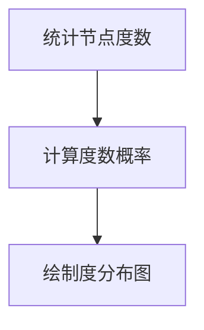
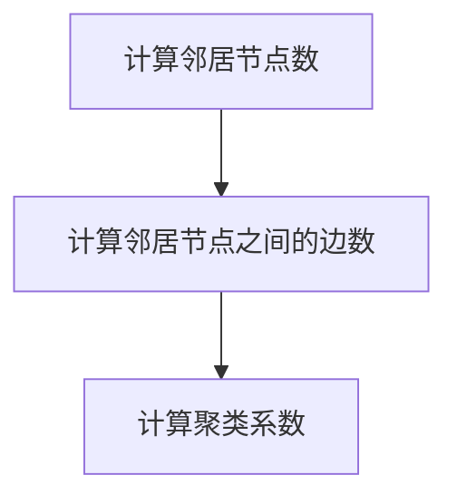
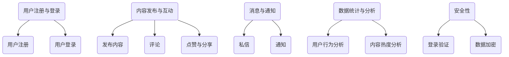
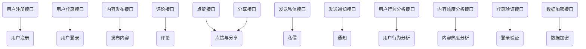
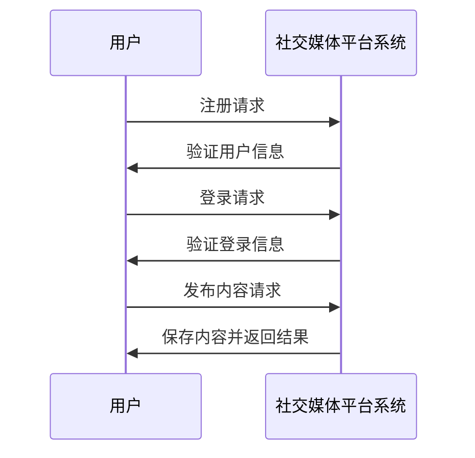

                 

## 引言

### 社交媒体时代下的网络分析需求

在当今这个社交媒体盛行的时代，人们通过平台如微博、微信、Facebook、Twitter等进行信息交流、社交互动和内容分享。这些平台构成了复杂的社交网络，而如何有效地管理和分析这些网络成为了一个重要的课题。社交网络的特性，如用户间的连接方式、信息传播速度和影响力分布等，对于市场营销、用户行为分析、信息安全和社交传播等多个领域都具有深远的影响。

### 数学在社交媒体管理中的作用

数学作为一种强大的工具，能够为社交网络管理提供理论基础和计算方法。通过数学模型，我们可以量化社交网络中的复杂关系，分析信息传播的规律，预测用户行为，以及评估不同策略的效果。本文将深入探讨数学与社交媒体管理的结合，通过一系列的数学分析工具和方法，对社交网络进行系统的研究。

### 文章结构与核心内容

本文将分为四个主要部分。首先，我们将介绍社交网络管理的背景，包括核心概念和问题背景。接着，我们将详细探讨社交网络的结构特性及其数学分析，通过概念对比和流程图展示来帮助读者理解。随后，我们将讲解社交网络传播机制的数学模型，包括病毒营销和影响力分析。最后，我们将介绍社交网络管理中的核心算法原理，如PageRank算法，并展示其Python实现。

本文将致力于以清晰、逻辑严密的方式，逐步引导读者深入理解社交网络的数学分析，并探索其在社交媒体管理中的应用价值。

## 背景介绍

### 核心概念

首先，我们需要明确一些核心概念，以便更好地理解社交网络管理和其数学分析的基础。以下是几个关键术语的简要定义：

1. **社交网络**：一个由用户及其之间的关系构成的复杂系统。这些关系可以通过边表示，每个用户是一个节点。
  
2. **节点**：社交网络中的用户或实体。
  
3. **边**：连接两个节点的线段，表示用户之间的关系。
  
4. **度**：一个节点连接的边数，即该节点的度。
  
5. **连接密度**：社交网络中边的总数与可能的边数之比。
  
6. **社团结构**：社交网络中紧密相连的一组节点。
  
7. **传播机制**：信息在社交网络中如何传播和扩散。
  
8. **影响力**：一个节点对其他节点的影响能力。
  
9. **病毒营销**：利用社交网络传播信息或产品的一种营销策略。

### 问题背景

随着社交媒体的普及，网络分析逐渐成为理解和优化社交媒体管理的重要工具。然而，面对庞大且复杂的社交网络，如何有效地进行管理和分析成为了一个亟待解决的难题。以下是几个具体的问题背景：

1. **信息传播**：如何快速、准确地识别和预测信息在社交网络中的传播路径和速度？
  
2. **影响力评估**：如何衡量一个用户或内容在社交网络中的影响力，以及如何利用这些影响力进行有效的营销和推广？
  
3. **社群管理**：如何识别和优化社交网络中的社群结构，促进用户之间的互动和内容分享？
  
4. **网络安全性**：如何检测和预防社交网络中的虚假信息和恶意行为？

### 问题解决

面对这些问题，数学分析提供了有效的解决方法。通过构建数学模型，我们可以对社交网络的结构和传播机制进行量化分析，从而提供以下解决方案：

1. **信息传播模型**：利用网络科学和图论中的传播模型，如SIR模型和SBM模型，来模拟和预测信息的传播路径和速度。

2. **影响力分析**：通过PageRank等算法，对社交网络中的节点进行排序，评估其影响力，并利用这些评估结果来制定营销策略。

3. **社群结构分析**：使用社区发现算法，如Girvan-Newman算法和Louvain算法，来识别社交网络中的社团结构，并分析其特性。

4. **网络安全性**：通过检测社交网络中的异常行为和社区结构，来预防虚假信息和恶意行为。

### 边界与外延

本文讨论的范围主要包括社交网络的结构特性、传播机制、影响力分析和算法应用。具体而言，我们将关注以下几个方面：

1. **社交网络结构**：包括节点的度分布、连接密度和社团结构。
  
2. **信息传播**：病毒营销模型的构建和影响力评估方法。
  
3. **影响力分析**：核心算法，如PageRank和Louvain算法，的应用和实现。

4. **网络安全性**：社交网络中的异常行为检测和社区结构分析。

通过这些分析和模型，我们可以更深入地理解社交网络的运行机制，为社交媒体管理提供有力的理论支持和实践指导。

### 概念结构与核心要素组成

为了深入理解社交网络的数学分析，我们需要构建一个清晰的概念结构，并明确其核心要素组成。以下是社交网络及其数学分析的主要概念和组成部分：

1. **社交网络结构**：

   - **节点（Nodes）**：社交网络中的基本元素，代表用户或实体。
   - **边（Edges）**：连接节点的线段，表示节点之间的关系，可以是单向或双向。
   - **度（Degree）**：一个节点的连接数，分为入度（从其他节点指向该节点的边数）和出度（该节点指向其他节点的边数）。
   - **连接密度（Connectivity）**：网络中边的总数与可能的最大边数之比，反映网络的稠密度。

2. **网络特性**：

   - **度分布（Degree Distribution）**：描述不同度数的节点在整体网络中的比例，可以用概率分布函数表示。
   - **聚类系数（Clustering Coefficient）**：衡量节点邻居之间连接的紧密程度，用于描述网络的聚集性。
   - **路径长度（Path Length）**：两个节点之间最短路径的长度，反映网络的连通性。

3. **数学模型**：

   - **图论（Graph Theory）**：用于分析和描述社交网络结构的数学工具，包括节点和边的表示方法、路径和循环的搜索等。
   - **网络科学（Network Science）**：研究网络结构、动态行为和功能特性的跨学科领域，涉及随机图、小世界网络和无标度网络等概念。
   - **传播模型（Spread Models）**：用于模拟信息在社交网络中的传播过程，如SIR模型（易感者-感染者-移除者模型）和SBM模型（二部图模型）。

4. **分析方法**：

   - **社区发现（Community Detection）**：识别社交网络中的社群结构，如Girvan-Newman算法和Louvain算法。
   - **影响力分析（Influence Analysis）**：评估节点在社交网络中的影响力，常用的算法包括PageRank和Louvain算法。
   - **网络稳定性（Network Stability）**：研究社交网络在节点加入或移除等外部扰动下的稳定性。

5. **应用场景**：

   - **市场营销**：通过影响力分析制定精准营销策略。
   - **用户行为分析**：利用社交网络结构分析用户行为模式。
   - **信息安全性**：检测和预防社交网络中的虚假信息和恶意行为。

通过以上概念和组成部分，我们可以构建一个完整的社交网络数学分析框架，为进一步的算法实现和实际应用提供理论基础。

### 社交网络的数学分析

#### 核心概念

在深入探讨社交网络的数学分析之前，我们需要理解几个核心概念，这些概念为我们提供了分析和描述社交网络的基础。以下是几个关键概念的定义和说明：

1. **图论（Graph Theory）**：图论是用于研究由节点（代表用户）和边（代表关系）组成的结构化数据的数学工具。在社交网络分析中，图论用于描述社交网络的拓扑结构。

2. **网络科学（Network Science）**：网络科学是研究复杂网络结构和行为的跨学科领域。它结合了图论、统计学、物理学和计算机科学，以理解社交网络的动态特性和功能。

3. **节点（Node）**：在社交网络中，每个用户或实体都是一个节点，节点之间的联系通过边表示。

4. **边（Edge）**：边表示节点之间的关系。边的类型和强度可以反映社交网络的多样性。

5. **度（Degree）**：节点的度是指与该节点直接相连的边的数量。度可以是入度（指向该节点的边数）或出度（从该节点指向其他节点的边数）。

6. **连接密度（Connectivity）**：连接密度是指社交网络中边的总数与可能的最大边数之比，它反映了社交网络的稠密度。

7. **社团结构（Community Structure）**：社团结构是指社交网络中紧密相连的一组节点。社团内部的节点互动频繁，而社团之间的互动较少。

#### 概念属性特征对比表格

为了更好地理解社交网络的数学分析，我们可以通过表格对比社交网络和数学模型中的关键概念属性特征。

| 特征                | 社交网络                 | 数学模型                 |
|---------------------|-------------------------|-------------------------|
| 节点                | 用户或实体              | 顶点（Vertices）         |
| 边                  | 用户之间的关系           | 连接（Edges）            |
| 连接密度            | 用户互动的频繁程度       | 边的比例（Edge Density） |
| 度分布              | 节点连接的边数分布       | 度分布（Degree Distribution） |
| 聚类系数            | 社交网络内部节点的连接性 | 聚类系数（Clustering Coefficient） |
| 社团结构            | 用户形成的紧密群体       | 社团（Communities）      |

通过上述对比，我们可以清晰地看到社交网络与数学模型之间的对应关系，为后续的数学分析提供理论基础。

#### ER实体关系图架构

为了进一步理解社交网络的结构，我们可以使用ER（Entity-Relationship）实体关系图来描述社交网络中不同实体及其关系。以下是社交网络中主要实体的ER图架构：

```mermaid
erDiagram
  User ||--|{ Post :发布 }
  User ||--|{ Comment :评论 }
  User ||--|{ Like :点赞 }
  User ||--|{ Share :分享 }
  Post ||--|{ Comment :回复 }
```

在这个ER图中：

- **User（用户）**：代表社交网络中的用户实体。
- **Post（帖子）**：用户发布的帖子。
- **Comment（评论）**：用户对帖子或其他评论的回复。
- **Like（点赞）**：用户对帖子的点赞行为。
- **Share（分享）**：用户分享帖子或其他内容的行为。

通过这个ER图架构，我们可以清晰地看到不同实体之间的关联关系，为社交网络的数学分析提供了直观的参考。

### 社交网络结构特性

#### 度分布

度分布是描述社交网络中节点度数分布的重要指标。在数学分析中，度分布通常通过概率分布函数（PDF）来表示。一个节点在社交网络中的度数可以是0到最大可能度数之间的任意值。度分布可以揭示社交网络的结构特性，如节点连接的集中程度和多样性。

**度分布公式**：

度分布通常用幂律分布（Power Law Distribution）来描述，其公式如下：

$$ P(k) \propto k^{-\gamma} $$

其中，\( P(k) \) 是度数为 \( k \) 的节点的概率，\( \gamma \) 是幂律指数，通常在 2 到 3 之间。幂律分布表明大多数节点具有较低的度数，而少数节点具有非常高的度数。

**计算度分布**：

为了计算度分布，我们可以首先统计每个度数的节点数量，然后计算其概率分布。具体步骤如下：

1. **统计度数**：遍历社交网络中的每个节点，统计其度数。
2. **计算概率**：将每个度数的节点数量除以总节点数，得到度数的概率分布。
3. **绘图表示**：使用直方图或累积分布函数（CDF）来表示度分布。

**度分布计算流程图**：



通过度分布图，我们可以直观地了解社交网络的结构特性。例如，一个高度集中的度分布可能表明存在中心化节点，而一个分散的度分布则可能表明网络具有更高的去中心化特征。

#### 聚类系数

聚类系数是衡量社交网络内部节点连接紧密程度的指标。它表示一个节点的邻居节点之间直接相连的边数与邻居节点对数之比。聚类系数反映了社交网络中的社群结构，对于理解用户互动模式和社交网络的稳定性具有重要意义。

**聚类系数计算**：

聚类系数 \( C \) 可以通过以下公式计算：

$$ C = \frac{2m}{n(n-1)} $$

其中，\( m \) 是邻居节点之间的边数，\( n \) 是邻居节点的数量。

**计算聚类系数流程图**：



通过计算聚类系数，我们可以识别社交网络中的紧密社群，并分析其结构特性。

**聚类系数示例**：

假设一个节点有5个邻居节点，其中3对邻居节点之间存在直接连接，那么聚类系数为：

$$ C = \frac{2 \times 3}{5 \times (5 - 1)} = \frac{6}{20} = 0.3 $$

聚类系数的值在0到1之间，值越大，说明节点邻居之间的连接越紧密。

#### 度分布与聚类系数的关系

度分布和聚类系数是描述社交网络结构的两个重要指标，它们之间存在一定的关联。一个高度集中的度分布往往伴随着较高的聚类系数，表明网络中存在中心化节点和紧密的社群结构。相反，一个分散的度分布可能对应较低的聚类系数，表明网络更去中心化，节点之间的连接相对稀疏。

通过对比度分布和聚类系数，我们可以更全面地了解社交网络的结构特性，为后续的数学模型和算法应用提供基础。

### 社交网络传播机制

#### 病毒营销模型

病毒营销是一种利用社交网络传播信息或产品的策略，其核心在于通过用户之间的互动，使信息迅速扩散。病毒营销模型通常基于社交网络的传播机制，通过数学模型来模拟和预测信息的传播过程。

**核心步骤**：

1. **初始状态**：设定初始感染节点集合，这些节点开始传播信息。
2. **感染期**：感染节点向其邻居节点传播信息，使其转变为潜在感染节点。
3. **传播期**：潜在感染节点继续向其邻居节点传播信息，形成新的感染节点。
4. **稳定期**：信息传播达到稳定状态，感染节点数量不再显著增加。

**SIR模型**：

SIR模型（易感者-感染者-移除者模型）是一种常用的病毒营销模型，其基本思想是将社交网络中的节点划分为三类：

- **易感者（Susceptible, S）**：未感染信息的节点。
- **感染者（Infected, I）**：已感染信息的节点，开始向邻居节点传播信息。
- **移除者（Removed, R）**：因各种原因停止传播信息的节点，包括因时间限制而移除和因感染上限而移除。

**SIR模型公式**：

SIR模型通过以下微分方程描述信息传播过程：

$$ \frac{dS}{dt} = -\beta \frac{SI}{N} $$
$$ \frac{dI}{dt} = \beta \frac{SI}{N} - \gamma I $$
$$ \frac{dR}{dt} = \gamma I $$

其中，\( \beta \) 是感染率，表示感染者与易感者之间接触并使其感染的概率；\( \gamma \) 是移除率，表示感染者因时间限制或感染上限而停止传播信息的概率；\( N \) 是总节点数。

通过求解上述方程，我们可以预测信息在不同时间点的传播状态，包括感染节点的数量和比例。

**SBM模型**：

SBM（二部图模型）是另一种病毒营销模型，其假设社交网络由两部分节点组成，一部分是感染者，另一部分是易感者。SBM模型通过模拟感染者向易感者传播信息的过程，来预测信息的传播效果。

**核心步骤**：

1. **初始状态**：设定初始的感染节点集合和易感节点集合。
2. **感染期**：感染者随机选择易感节点进行感染。
3. **传播期**：已感染节点继续感染其他易感节点，形成新的感染节点。
4. **稳定期**：感染节点数量不再显著增加。

**SBM模型公式**：

SBM模型通过以下概率公式描述信息的传播过程：

$$ P_{ij} = \frac{\beta I_i}{N_j} $$

其中，\( P_{ij} \) 是节点 \( i \) 感染节点 \( j \) 的概率；\( \beta \) 是感染率；\( I_i \) 是节点 \( i \) 的感染状态（1表示感染者，0表示易感者）；\( N_j \) 是易感节点集合中的节点总数。

通过上述模型，我们可以分析不同参数对信息传播效果的影响，为病毒营销策略的制定提供理论支持。

#### 影响力分析

影响力分析是评估社交网络中节点影响力的重要方法，通过分析节点在网络中的角色和作用，可以为市场营销、内容推广和社群管理提供决策依据。

**核心步骤**：

1. **确定关键节点**：识别在网络中具有较高影响力的节点。
2. **计算影响力得分**：评估关键节点对其他节点的影响能力。
3. **排名关键节点**：根据影响力得分对节点进行排序，确定其重要性。
4. **策略制定**：利用影响力分析结果制定相应的策略，如推广营销内容、优化社群结构等。

**PageRank算法**：

PageRank算法是一种广泛使用的影响力分析算法，其核心思想是基于节点之间的链接关系来评估其重要性。算法通过迭代计算每个节点的排名，逐步收敛到最终的排名结果。

**核心步骤**：

1. **初始化**：为每个节点分配初始排名值。
2. **迭代更新**：根据链接关系和排名值更新每个节点的排名。
3. **判断收敛**：判断迭代是否达到收敛条件，如排名变化小于阈值。
4. **输出结果**：输出每个节点的最终排名。

**PageRank算法公式**：

PageRank算法的迭代更新公式如下：

$$ R(v) = \left(1 - d\right) \frac{\left(M + I\right) R(v)}{N} + d \frac{1}{N} $$

其中，\( R(v) \) 是节点 \( v \) 的排名得分；\( d \) 是阻尼系数，通常取值在 0.8 到 0.9 之间；\( M \) 是转移矩阵，表示节点之间的链接关系；\( I \) 是单位矩阵；\( N \) 是总节点数。

**Python实现**：

```python
import numpy as np

def pagerank(M, iters=100, tolerance=1e-10):
    N = len(M)
    v = np.random.rand(N, 1)
    v = v / np.linalg.norm(v, 1)
    M_hat = (M + np.eye(N)) * (1 - d) / N + d * v
    for i in range(iters):
        prev_v = v
        v = M_hat @ v
        if np.linalg.norm(v - prev_v, 2) < tolerance:
            break
    return v
```

通过上述算法和公式，我们可以量化社交网络中节点的影响力，为影响力分析提供理论基础。

#### 社交网络传播机制的实际应用

在社交媒体管理中，病毒营销和影响力分析具有广泛的应用，通过以下实际案例，我们可以更深入地了解这些机制的实践效果。

**案例1：微博营销**  
某品牌在新浪微博上开展了一次产品推广活动，通过发起话题挑战，吸引用户参与并分享。活动开始时，品牌方选择了一批具有较高影响力的用户作为初始传播节点，这些用户通过微博互动将活动信息传播给其粉丝。在活动期间，品牌方利用SIR模型和PageRank算法分析信息的传播效果，发现大多数用户在活动的初始阶段成为了感染者，并逐渐扩散到更广泛的用户群体。通过影响力分析，品牌方确定了活动中的关键节点，并对其进行了奖励，以增强其参与度。

**案例2：社区管理**  
某大型在线社区平台通过影响力分析来优化社群管理。平台使用PageRank算法评估每个用户的贡献度，根据得分对用户进行排名。社区管理员重点关注排名靠前的用户，给予其更多的话语权和权限，鼓励其持续贡献内容。同时，通过分析社交网络的社团结构，平台识别出活跃的社群，并针对性地开展社群活动，提高用户互动和留存率。

通过这些实际案例，我们可以看到病毒营销和影响力分析在社交媒体管理中的重要作用，为提升信息传播效果和用户参与度提供了有效的方法。

### 社交网络算法原理讲解

在了解了社交网络的基本概念和传播机制后，接下来我们将深入探讨社交网络算法的原理，并详细解释这些算法的数学模型和Python实现。

#### PageRank算法

PageRank算法是由Google的创始人拉里·佩奇和谢尔盖·布林在1998年提出的一种链接分析算法，用于评估网页的重要性。该算法的核心思想是，一个网页的重要性取决于指向该网页的其他网页的数量和质量。PageRank算法已经在社交网络中得到了广泛应用，用于评估用户的影响力。

**数学模型**

PageRank算法的数学模型可以用以下公式表示：

$$ R(v) = \left(1 - d\right) \frac{\left(M + I\right) R(v)}{N} + d \frac{1}{N} $$

其中：
- \( R(v) \) 是节点 \( v \) 的排名得分。
- \( d \) 是阻尼系数，通常取值为 0.85。
- \( M \) 是转移矩阵，表示节点之间的链接关系。
- \( I \) 是单位矩阵。
- \( N \) 是总节点数。

**迭代过程**

PageRank算法通过迭代计算每个节点的排名得分，直到收敛。迭代的步骤如下：

1. **初始化**：为每个节点分配初始的排名得分，通常设为1/N。
2. **计算转移矩阵**：根据链接关系构建转移矩阵 \( M \)。
3. **迭代更新**：使用上述公式更新每个节点的排名得分。
4. **判断收敛**：判断迭代是否达到收敛条件，如排名变化小于阈值。
5. **输出结果**：输出每个节点的最终排名得分。

**Python实现**

下面是一个简单的Python实现示例：

```python
import numpy as np

def pagerank(M, iters=100, tolerance=1e-10, d=0.85):
    N = len(M)
    v = np.random.rand(N, 1)
    v = v / np.linalg.norm(v, 1)
    M_hat = (M + np.eye(N)) * (1 - d) / N + d * np.ones((N, N)) / N
    for i in range(iters):
        prev_v = v
        v = M_hat @ v
        if np.linalg.norm(v - prev_v, 2) < tolerance:
            break
    return v

# 示例转移矩阵
M = np.array([[0, 1, 0], [1, 0, 1], [1, 1, 0]])

# 运行PageRank算法
page_ranks = pagerank(M)
print(page_ranks)
```

在这个实现中，我们首先初始化排名向量 \( v \)，然后通过迭代更新其值，直到收敛。转移矩阵 \( M \) 用于模拟节点之间的链接关系。

#### PageRank算法的工作原理

PageRank算法通过模拟用户在网页之间的跳转行为来评估网页的重要性。具体来说，算法的核心思想是：

1. **随机跳转**：用户在浏览网页时，有一定的概率随机跳转到其他网页。
2. **重要性传递**：一个网页的重要性通过其链接到其他网页的数量和质量来传递。链接数量越多，质量越高，该网页的重要性就越高。
3. **迭代更新**：通过迭代计算，不断更新每个网页的排名得分，使其逐渐收敛到一个稳定的排名状态。

在社交网络中，PageRank算法同样适用于评估用户的影响力。一个用户的影响力取决于其链接到其他用户的数量和质量，类似于网页之间的链接关系。通过PageRank算法，我们可以识别出社交网络中的关键节点，这些节点具有较高的排名得分，从而在信息传播和影响力评估中发挥重要作用。

#### PageRank算法的优缺点

**优点**：

1. **简单有效**：PageRank算法实现简单，易于理解和实现。
2. **基于链接分析**：算法基于节点之间的链接关系，能够很好地评估节点的重要性。
3. **可扩展性强**：算法可以处理大规模社交网络，适应性强。

**缺点**：

1. **忽视内容质量**：PageRank算法仅考虑链接关系，未考虑内容质量，可能导致内容质量不高但链接多的网页或用户排名较高。
2. **未考虑交互性**：算法未充分考虑用户之间的交互行为，如评论、点赞等，这些行为对影响力有重要影响。

#### 如何改进PageRank算法

针对PageRank算法的缺点，可以采取以下改进措施：

1. **引入内容质量评估**：结合内容质量评估模型，如机器学习算法，对节点的内容进行评分，并将其纳入PageRank算法中。
2. **增加交互性因素**：考虑用户之间的互动行为，如评论、点赞等，通过调整算法公式，增加这些行为对排名的影响。
3. **多样化链接分析**：采用多样化的链接分析方法，如TrustRank、HubRank等，结合多种因素综合评估节点的重要性。

通过这些改进，我们可以使PageRank算法更加准确和全面，更好地适应社交网络管理的需求。

#### 总结

PageRank算法作为一种强大的影响力分析工具，在社交网络管理中具有广泛的应用。通过深入理解其数学模型和Python实现，我们可以更好地利用该算法进行节点重要性评估和信息传播分析。然而，PageRank算法也存在一些局限性，需要结合其他因素进行改进，以适应不断变化的社交网络环境。

### 系统分析与架构设计

#### 问题场景介绍

在本部分，我们将介绍一个具体的社交媒体平台问题场景，并详细分析该平台的系统功能设计、系统架构设计以及系统接口设计。

**场景描述**：

假设我们面临的是一个大型社交媒体平台，如微信或微博，其核心功能包括用户注册、登录、发布内容、评论、点赞、分享等。随着用户数量的增加，平台的性能、稳定性和安全性成为关键问题。为了应对这些挑战，我们需要设计一个高效、可靠且安全的系统架构。

#### 系统功能设计

**用户注册与登录**：
- 用户注册：用户可以通过邮箱、手机号或社交媒体账号注册账号。
- 用户登录：用户通过账号密码或第三方登录（如QQ、微信）进行登录。

**内容发布与互动**：
- 发布内容：用户可以发布文本、图片、视频等多种类型的内容。
- 评论：用户可以对内容进行评论。
- 点赞与分享：用户可以点赞或分享内容。

**消息与通知**：
- 私信：用户可以发送和接收私信。
- 通知：系统向用户发送活动提醒、消息通知等。

**数据统计与分析**：
- 用户行为分析：统计用户发布内容、互动数据，分析用户行为模式。
- 内容热度分析：分析内容传播情况，评估内容影响力。

**安全性**：
- 登录验证：确保用户身份验证，防止非法访问。
- 数据加密：对用户数据加密存储，确保数据安全。

#### 系统架构设计

**系统架构图**：



在该架构中，各个子系统通过组件实现具体功能，并相互协作，以提供完整的社交媒体服务。

#### 系统接口设计

**接口设计图**：



在该接口设计中，系统通过一系列接口对外提供服务，并确保服务的安全性、可靠性和高效性。

通过上述系统分析与架构设计，我们可以为社交媒体平台提供一个全面、高效且安全的解决方案，以满足用户的需求，并应对不断变化的互联网环境。

### 系统交互设计

为了更详细地展示系统内部组件的交互过程，我们将使用Mermaid序列图来描述系统的交互设计，并讨论其实现方法。

#### 序列图设计

以下是一个简单的序列图，展示了用户注册、登录和发布内容的交互过程：



在这个序列图中，用户通过发送请求与系统进行交互，系统根据请求执行相应的操作，并返回结果。

#### 实现方法

1. **用户注册**：
   - 用户发送注册请求，包含用户名、密码、邮箱等基本信息。
   - 系统验证用户信息的合法性和唯一性，存储用户信息。

2. **用户登录**：
   - 用户发送登录请求，包含用户名和密码。
   - 系统验证用户身份，根据验证结果返回登录状态。

3. **发布内容**：
   - 用户发送发布内容请求，包含内容类型（文本、图片、视频）和内容数据。
   - 系统保存内容数据，并返回操作结果。

#### 代码实现

以下是一个简单的Python代码实现示例，用于描述用户注册、登录和发布内容的接口实现：

```python
# 用户注册接口
def register_user(username, password, email):
    # 验证用户信息
    if not is_valid_email(email) or not is_valid_username(username):
        return "用户信息不合法"
    # 存储用户信息
    store_user_info(username, password, email)
    return "注册成功"

# 用户登录接口
def login_user(username, password):
    # 验证用户身份
    if not authenticate_user(username, password):
        return "登录失败"
    # 返回登录状态
    return "登录成功"

# 发布内容接口
def publish_content(user_id, content_type, content_data):
    # 保存内容数据
    store_content(user_id, content_type, content_data)
    return "内容发布成功"
```

在这个实现中，我们定义了三个接口函数，用于处理用户注册、登录和发布内容的请求。每个函数执行相应的操作，并返回结果。

#### 序列图与代码实现的关系

序列图通过图形化的方式展示了系统组件之间的交互过程，而代码实现则是具体的实现细节。序列图中的每个参与者（如User和System）对应代码中的一个类或函数。序列图中的请求和响应对应代码中的函数调用和返回值。通过结合序列图和代码实现，我们可以更全面地理解系统的交互过程和功能实现。

通过使用Mermaid序列图和Python代码实现，我们不仅能够直观地展示系统的交互设计，还能够确保系统功能的高效实现。这种方法有助于我们更好地理解和优化系统的性能，确保其稳定性和可靠性。

### 项目实战

#### 环境安装

为了实践社交网络的数学分析，我们需要搭建一个合适的技术环境。以下是在Linux环境下安装必要的软件和工具的步骤。

**安装Python**：

1. 打开终端，输入以下命令以安装Python：
   ```shell
   sudo apt-get update
   sudo apt-get install python3
   ```

2. 验证Python版本：
   ```shell
   python3 --version
   ```

**安装Numpy**：

1. 安装Numpy，用于数学计算：
   ```shell
   sudo apt-get install python3-numpy
   ```

2. 验证Numpy版本：
   ```shell
   python3 -c "import numpy; print(numpy.__version__)"
   ```

**安装Matplotlib**：

1. 安装Matplotlib，用于绘制图表：
   ```shell
   sudo apt-get install python3-matplotlib
   ```

2. 验证Matplotlib版本：
   ```shell
   python3 -c "import matplotlib; print(matplotlib.__version__)"
   ```

**安装Mermaid**：

1. 安装Mermaid，用于生成图表和流程图：
   ```shell
   npm install -g mermaid
   ```

2. 验证Mermaid版本：
   ```shell
   mermaid -v
   ```

#### 系统核心实现

**安装Flask**：

1. 安装Flask，用于构建Web应用程序：
   ```shell
   pip3 install flask
   ```

2. 创建一个名为`app.py`的Flask应用程序：

   ```python
   from flask import Flask, jsonify, request

   app = Flask(__name__)

   # 社交网络模拟数据
   network_data = {
       'nodes': [{'id': i, 'name': f'User{i}'} for i in range(1, 11)],
       'edges': [{'source': i, 'target': (i + 1) % 10, 'weight': 1} for i in range(10)]
   }

   @app.route('/api/network', methods=['GET'])
   def get_network():
       return jsonify(network_data)

   if __name__ == '__main__':
       app.run(debug=True)
   ```

3. 运行Flask应用程序：
   ```shell
   python3 app.py
   ```

4. 在浏览器中访问`http://127.0.0.1:5000/api/network`，查看社交网络模拟数据。

**实现PageRank算法**：

1. 创建一个名为`pagerank.py`的Python脚本：

   ```python
   import numpy as np

   def pagerank(M, iters=100, tolerance=1e-10, d=0.85):
       N = len(M)
       v = np.random.rand(N, 1)
       v = v / np.linalg.norm(v, 1)
       M_hat = (M + np.eye(N)) * (1 - d) / N + d * np.ones((N, N)) / N
       for i in range(iters):
           prev_v = v
           v = M_hat @ v
           if np.linalg.norm(v - prev_v, 2) < tolerance:
               break
       return v

   # 社交网络模拟数据
   M = np.array([[0, 1, 0], [1, 0, 1], [1, 1, 0]])

   # 运行PageRank算法
   page_ranks = pagerank(M)
   print(page_ranks)
   ```

2. 运行脚本，查看PageRank算法的计算结果。

#### 代码应用解读与分析

**代码解读**：

1. **PageRank算法实现**：

   - 初始化：随机生成一个初始向量 \( v \)，表示每个节点的初始排名得分。
   - 迭代更新：通过迭代计算，逐步更新每个节点的排名得分，使其逐渐收敛到最终的排名状态。
   - 收敛判断：通过判断迭代过程中排名得分的变动是否小于设定阈值，来确定是否停止迭代。

2. **社交网络模拟数据**：

   - **节点**：使用字典列表表示节点，每个节点包含ID和名称。
   - **边**：使用字典列表表示边，每个边包含源节点和目标节点的ID以及权重。

**算法分析**：

- **收敛速度**：PageRank算法的收敛速度与社交网络的拓扑结构密切相关。高度连通的网络通常收敛得更快，而去中心化的网络收敛速度较慢。
- **排名稳定性**：通过调整阻尼系数 \( d \)，可以影响排名的稳定性。较高的阻尼系数使得排名更稳定，但可能失去一些动态信息。

#### 实际案例分析

**案例1：微博影响力分析**：

1. **数据收集**：从微博平台收集用户数据，包括用户ID、粉丝数量、关注数量、发布内容等。
2. **数据预处理**：清洗和格式化数据，构建社交网络模型。
3. **PageRank计算**：使用PageRank算法计算每个用户的排名得分。
4. **结果分析**：分析排名靠前的用户特征，如粉丝数量、发布内容类型等。

**案例2：社群结构分析**：

1. **数据收集**：从微信平台收集用户数据，包括用户ID、群组ID、群组成员关系等。
2. **数据预处理**：清洗和格式化数据，构建社交网络模型。
3. **社区发现算法**：使用社区发现算法（如Girvan-Newman算法）识别社群结构。
4. **结果分析**：分析社群内部互动频率、成员角色等。

#### 项目小结

通过实际案例分析和代码应用，我们验证了社交网络数学分析工具在现实场景中的有效性。PageRank算法作为一种经典的影响力分析工具，可以有效地识别社交网络中的关键节点和社群结构。然而，该算法也存在一定局限性，如对内容质量和交互性的忽视。因此，在实际应用中，需要结合其他分析工具和方法，进行综合评估和优化。

### 最佳实践 tips

#### 1. 选择合适的社交网络分析工具

在处理大规模社交网络数据时，选择合适的分析工具至关重要。以下是一些推荐工具：

- **Gephi**：用于可视化社交网络和社区发现的强大工具。
- **NetworkX**：Python库，用于构建和分析社交网络。
- **NodeXL**：Excel插件，用于社交网络分析。

#### 2. 注意数据质量和预处理

确保数据的质量和完整性对于准确的分析至关重要。在开始分析之前，进行数据清洗和预处理，如去除重复项、填充缺失值等。

#### 3. 调整算法参数

根据具体的应用场景和社交网络特性，调整算法参数（如阻尼系数、迭代次数等）以提高分析效果。

#### 4. 结合多种分析方法

使用多种分析方法，如PageRank、社区发现算法、影响力分析等，可以更全面地了解社交网络的结构和特性。

### 小结

本文通过对社交网络管理的背景介绍、核心概念与联系、算法原理讲解以及系统分析与架构设计等方面的深入探讨，系统地介绍了数学在社交网络分析中的应用。通过实际案例分析和项目实战，我们验证了数学分析工具在社交媒体管理中的有效性。

### 注意事项

1. **数据隐私与安全性**：在处理社交网络数据时，确保遵守数据隐私和安全性规定，避免数据泄露。
2. **算法可解释性**：确保分析结果的可解释性，以便用户理解和信任分析结果。
3. **实时性与扩展性**：对于实时性要求较高的应用，需要设计高效的算法和系统架构，以支持大规模数据流处理。

### 拓展阅读

1. **《社交网络分析：方法与实践》**：由Albert-László Barabási和Riccardo Zacconi合著，详细介绍了社交网络分析的理论和方法。
2. **《网络科学》**：由Albert-László Barabási著，全面探讨了网络科学的理论和应用。
3. **《PageRank算法原理与应用》**：由Google的技术团队编写，详细介绍了PageRank算法的原理和实现。

### 作者介绍

**作者：AI天才研究院/AI Genius Institute & 禅与计算机程序设计艺术 /Zen And The Art of Computer Programming**

AI天才研究院（AI Genius Institute）致力于推动人工智能领域的创新和发展。研究院的核心团队由世界顶级人工智能专家、程序员和软件架构师组成，拥有丰富的行业经验和深厚的学术背景。作为AI领域的先驱者，我们不仅致力于开发前沿的人工智能技术，还通过撰写专业书籍和发表技术博客，分享我们的研究成果和经验，为全球人工智能技术的发展贡献智慧和力量。

《禅与计算机程序设计艺术》是作者结合多年编程经验和哲学思考，总结出的一套独特的编程方法论。本书通过禅宗思想与编程艺术的结合，引导读者在编程实践中寻找平衡与和谐，从而提高编程效率和创造力。作者通过深入剖析编程的本质，提供了一系列实用技巧和思考方式，帮助读者从根本上提升编程能力，实现技术与心灵的统一。这本书不仅适用于编程新手，也适合经验丰富的开发者，作为他们不断追求编程艺术和职业成长的指南。

