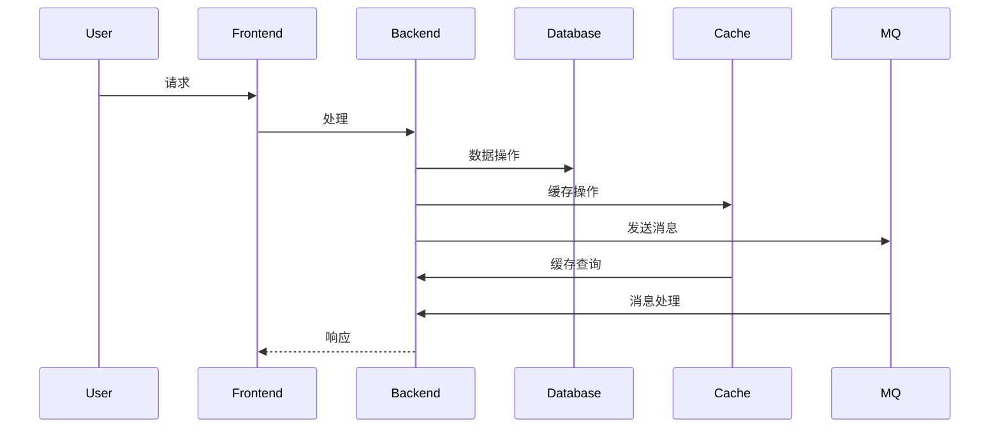

                 

### 养老金制度概述

养老金制度，作为一种社会保障体系的重要组成部分，其目的在于为退休人员提供经济保障，以确保其晚年生活能够得到基本的经济支持。在全球范围内，养老金制度的发展历程与各国经济发展水平、社会结构、人口老龄化程度等因素密切相关。

#### **1.1.1 养老金制度的定义与重要性**

养老金制度，通常指的是由国家、企业、个人等多方共同参与的，旨在为退休人员提供经济补贴的机制。其主要功能是确保退休人员的基本生活需要得到满足，从而减少社会的不公平现象，提高整体社会福利水平。

养老金制度的重要性体现在以下几个方面：

1. **社会保障功能**：养老金制度是社会保障体系的重要组成部分，其作用在于缓解社会贫困，促进社会公平。
2. **经济稳定器**：养老金制度可以有效减少由于人口老龄化带来的经济压力，维护社会经济的稳定发展。
3. **个人储蓄计划**：通过养老金制度，个人可以在职业生涯中逐步积累资金，为退休后的生活提供保障。

#### **1.1.2 全球养老金制度的发展趋势**

全球养老金制度的发展呈现出以下几个趋势：

1. **多元化管理模式**：从传统的国家统一管理，向国家、企业、个人三方共同管理的模式转变。
2. **混合型养老金体系**：许多国家采用公共养老金与私人养老金相结合的混合型养老金体系，以兼顾公平与效率。
3. **人口老龄化应对策略**：随着全球人口老龄化趋势的加剧，各国都在积极调整养老金制度，以提高其可持续性。

#### **1.1.3 中国养老金制度的现状与挑战**

中国的养老金制度自改革开放以来，经历了从计划经济向市场经济转型的重要阶段。目前，中国养老金制度的主要特点包括：

1. **双轨制**：即公务员和事业单位人员享受相对优厚的退休待遇，而企业退休人员待遇相对较低。
2. **资金缺口**：随着人口老龄化的加剧，养老金基金的收支平衡面临巨大压力。
3. **覆盖面不广**：虽然养老金制度覆盖面逐步扩大，但仍有部分人群，如灵活就业人员和农村居民，未被全面覆盖。

面对这些挑战，中国养老金制度改革势在必行。未来，中国养老金制度的发展方向包括：

1. **逐步缩小双轨制差距**：通过制度改革，逐步实现养老金待遇的公平。
2. **扩大覆盖面**：进一步扩大养老金制度的覆盖范围，确保所有退休人员都能享受到基本的经济保障。
3. **提高基金运营效率**：通过优化资金管理和投资策略，提高养老金基金的运营效率。

### **1.2 养老金制度的类型**

养老金制度根据管理主体和资金来源，可以分为以下几种类型：

#### **1.2.1 公共养老金制度**

公共养老金制度，又称国家养老金制度，是由国家主导的养老金制度。其主要特点如下：

1. **资金来源**：主要由政府财政拨款和参保人员的缴费构成。
2. **待遇标准**：根据国家统一标准发放，通常与个人缴费年限和缴费水平挂钩。
3. **管理方式**：由政府或专门的养老基金管理机构进行管理。

#### **1.2.2 私人养老金制度**

私人养老金制度，即个人养老金制度，是由个人或企业自主建立的养老金制度。其主要特点如下：

1. **资金来源**：主要来源于个人或企业的自愿缴费。
2. **待遇标准**：根据个人或企业的缴费水平和积累额确定。
3. **管理方式**：由个人或企业自行选择养老基金管理机构进行管理。

#### **1.2.3 补充养老金制度**

补充养老金制度，又称第二支柱养老金制度，是介于公共养老金制度和私人养老金制度之间的补充性养老金制度。其主要特点如下：

1. **资金来源**：主要由企业缴费和个人缴费构成。
2. **待遇标准**：根据企业和个人的缴费水平、积累额等因素综合确定。
3. **管理方式**：通常由企业和个人共同选择养老基金管理机构进行管理。

### **1.3 本书结构安排**

本书记录了养老金制度设计中的数学原理和方法，旨在为读者提供系统、深入的理解。以下是本书的结构安排：

#### **1.3.1 内容框架**

本书共分为三个主要部分：

1. **引言**：介绍养老金制度的定义、重要性、发展趋势和现状。
2. **数学基础**：讲解在养老金制度设计中所需的数学工具和基本概念。
3. **应用实践**：通过实际案例，展示数学方法在养老金制度设计中的应用。

#### **1.3.2 学习目标**

通过阅读本书，读者应能够：

1. **理解养老金制度的定义和重要性**。
2. **掌握数学工具在养老金制度设计中的应用**。
3. **分析养老金制度的数学模型和设计原则**。
4. **评估和优化养老金制度的设计方案**。

#### **1.3.3 阅读建议**

为了更好地理解本书的内容，建议读者：

1. **具备一定的数学基础**，如概率论、统计学、微积分等。
2. **结合实际案例**，加深对理论知识的理解。
3. **积极参与练习**，通过实践巩固所学知识。
4. **持续关注**养老金制度的发展动态，以了解最新的研究进展。

通过以上安排，本书将带领读者深入探索养老金制度的数学设计，为未来的研究和实践提供坚实的理论基础。接下来，我们将进一步探讨数学在养老金制度设计中的具体应用，敬请期待。

----------------------------------------------------------------

## 第2章：数学基础

在养老金制度的设计和优化过程中，数学作为一门基础学科，扮演着至关重要的角色。本章将介绍在养老金制度设计中常用的一些数学工具和基本概念，包括逻辑与集合、概率论基础、统计学初步等内容，以便为后续章节中的具体应用打下坚实的基础。

### **2.1 基本数学概念**

#### **2.1.1 逻辑与集合**

逻辑是数学的基础，它提供了描述和推理的基本框架。在养老金制度设计中，逻辑与集合的概念尤为重要。

1. **逻辑运算**：包括与、或、非等基本运算。例如，在养老金计算中，可以使用逻辑运算来表示是否符合领取养老金的条件。
2. **集合**：集合是包含一组无序元素的集合。在养老金制度设计中，集合可以用来表示不同群体的参保人员。

#### **2.1.2 概率论基础**

概率论是研究随机现象的数学分支，它在养老金制度设计中具有重要意义。

1. **概率分布**：描述随机变量可能取值的概率。例如，在养老金计算中，可以使用概率分布来预测不同年龄和性别人群的寿命预期。
2. **期望和方差**：期望和方差是衡量随机变量分布的中心趋势和离散程度的统计量。例如，在养老金制度设计时，可以通过计算期望和方差来评估养老金基金的稳定性。

#### **2.1.3 统计学初步**

统计学是运用概率论原理来分析和解释数据的方法。在养老金制度设计中，统计学提供了评估和管理风险的重要工具。

1. **描述性统计**：用于描述数据的集中趋势、离散程度和分布形态。例如，可以通过计算均值、中位数、标准差等统计量来了解养老金领取者的平均待遇水平。
2. **推断性统计**：用于根据样本数据推断总体特征。例如，可以通过抽样调查来估计整个参保人群的养老金需求。

### **2.2 数学在养老金制度中的应用**

数学在养老金制度中的应用主要体现在以下几个方面：

#### **2.2.1 人口统计模型**

人口统计模型用于预测未来人口年龄结构和数量。在养老金制度设计中，人口统计模型可以帮助预测未来的养老金需求，从而制定合理的养老金基金管理策略。

1. **人口增长率**：通过计算人口增长率，可以预测未来的人口数量。例如，假设某地区的年平均人口增长率为1%，可以预测5年后该地区的人口数量。
2. **人口老龄化**：人口老龄化是养老金制度面临的主要挑战之一。通过计算老龄化率，可以预测未来老年人口的数量和比例。

#### **2.2.2 财务模型**

财务模型用于评估养老金基金的收支情况，确保养老金基金的安全性和可持续性。

1. **资金流入和流出**：通过计算养老金基金的流入和流出，可以预测养老金基金的未来余额。例如，可以通过计算每年的缴费金额、养老金支出、投资收益等数据，预测未来几年的养老金基金余额。
2. **资产负债表**：资产负债表是评估养老金基金财务状况的重要工具。通过计算资产和负债，可以评估养老金基金的安全性和稳定性。

#### **2.2.3 利率与折现**

利率和折现是养老金制度设计中不可或缺的数学工具。利率决定了养老金基金的收益水平，而折现则用于将未来的现金流量折现到当前的价值。

1. **利率**：利率决定了养老金基金的投资收益。例如，假设养老金基金的投资收益率为4%，则可以计算每年养老金基金的收益。
2. **折现**：折现用于将未来的现金流量折现到当前的价值。例如，可以通过计算现值因子，将未来的养老金支付折现到当前的价值。

### **2.3 数学工具介绍**

在养老金制度设计中，常用的数学工具包括微积分、线性代数、概率论与数理统计等。

#### **2.3.1 微积分**

微积分是研究函数变化的数学分支。在养老金制度设计中，微积分可以用于计算函数的最值、求导和积分等。

1. **最值问题**：在养老金基金管理中，可以通过求函数的最值来找到最优的投资策略。例如，通过求收益率函数的最值，找到最优的投资组合。
2. **求导和积分**：在养老金计算中，可以通过求导和积分来计算养老金的支付额和积累额。

#### **2.3.2 线性代数**

线性代数是研究向量空间和线性方程组的数学分支。在养老金制度设计中，线性代数可以用于解决多变量线性规划问题。

1. **向量空间**：向量空间用于描述养老金基金的投资组合。例如，可以通过向量空间来表示不同资产类别的投资比例。
2. **线性方程组**：线性方程组用于计算养老金基金的收支平衡。例如，可以通过解线性方程组来计算养老金基金的投资收益和支出。

#### **2.3.3 概率论与数理统计**

概率论与数理统计是研究随机现象的数学分支。在养老金制度设计中，概率论与数理统计可以用于预测养老金需求、评估风险和管理。

1. **概率分布**：概率分布用于预测养老金需求。例如，可以通过计算寿命概率分布，预测不同年龄人群的养老金需求。
2. **统计推断**：统计推断用于根据样本数据推断总体特征。例如，可以通过统计推断来评估养老金基金的风险水平。

通过本章的学习，读者将掌握养老金制度设计中常用的数学工具和基本概念，为后续章节中的具体应用打下坚实的基础。在接下来的章节中，我们将进一步探讨养老金制度的数学模型和设计原则，敬请期待。

----------------------------------------------------------------

### **2.1 基本数学概念**

在养老金制度的设计和评估过程中，数学作为基础工具，其重要性不可忽视。以下将介绍几项基本数学概念：逻辑与集合、概率论基础和统计学初步。

#### **2.1.1 逻辑与集合**

逻辑是数学和哲学中的重要分支，用于处理命题、推理和证明。在养老金制度设计中的应用主要体现在以下几个方面：

1. **命题逻辑**：命题逻辑用于描述养老金制度中的条件关系和推导过程。例如，如果某人达到了退休年龄，并且累计缴费年限符合要求，那么他将有资格领取养老金。
   - **真值表**：真值表用于列出复合命题在各个组成命题真值情况下的真值情况。例如，考虑命题A（达到退休年龄）和命题B（累计缴费年限符合要求），则复合命题“如果A则B”的真值表如下：
     $$\begin{array}{|c|c|c|}
     \hline
     A & B & A \rightarrow B \\
     \hline
     T & T & T \\
     T & F & F \\
     F & T & T \\
     F & F & T \\
     \hline
     \end{array}$$
   
2. **集合论**：集合论是数学的基础，用于描述和理解数据集合。养老金制度中常用的集合包括：
   - **参保人员集合**：包含所有符合领取养老金条件的参保人员。
   - **缴费金额集合**：包含不同缴费标准下的缴费金额。

#### **2.1.2 概率论基础**

概率论是研究随机事件的数学分支，在养老金制度设计中用于预测和评估不确定事件的可能性。

1. **随机变量**：随机变量是取值为不确定数的变量。在养老金制度中，常用的随机变量包括：
   - **寿命随机变量**：表示个体的预期寿命。
   - **缴费金额随机变量**：表示不同参保人员的缴费金额。

2. **概率分布**：概率分布用于描述随机变量的可能取值及其概率。养老金制度中常用的概率分布包括：
   - **正态分布**：用于预测寿命和养老金需求的概率分布。
   - **二项分布**：用于预测在一定时间内满足特定条件的参保人员数量。

3. **期望和方差**：期望和方差是衡量随机变量分布的中心趋势和离散程度的统计量。
   - **期望**：表示随机变量平均取值。例如，养老金的期望领取金额。
   - **方差**：表示随机变量取值的离散程度。例如，养老金领取金额的方差反映了养老金领取的不确定性。

#### **2.1.3 统计学初步**

统计学是运用概率论原理来分析和解释数据的学科，在养老金制度设计中用于收集、整理和分析数据。

1. **描述性统计**：描述性统计用于总结和描述数据的基本特征。
   - **均值**：表示数据的平均值，用于衡量养老金领取水平的中心趋势。
   - **中位数**：表示数据排序后位于中间位置的值，用于衡量养老金领取水平的中间值。
   - **标准差**：表示数据的离散程度，用于衡量养老金领取金额的波动性。

2. **推断性统计**：推断性统计用于根据样本数据推断总体特征。
   - **假设检验**：通过样本数据来检验某个假设的真实性，例如检验养老金领取水平的显著性差异。
   - **置信区间**：通过样本数据估计总体参数的范围，例如估计养老金领取金额的平均值的置信区间。

通过上述基本数学概念的学习，读者可以更好地理解和运用数学工具来分析和设计养老金制度。在接下来的内容中，我们将深入探讨这些数学工具在实际养老金制度设计中的应用。

#### **2.2 数学在养老金制度中的应用**

数学在养老金制度中的应用是多方面的，涵盖了人口统计模型、财务模型以及利率与折现等关键领域。以下将详细介绍这些数学工具在养老金制度设计中的应用。

#### **2.2.1 人口统计模型**

人口统计模型是养老金制度设计的重要基础，用于预测未来人口结构及其变化趋势。以下是一个简单的人口统计模型例子：

1. **人口增长率模型**：

   人口增长率模型用于预测未来人口数量的变化。假设某地区当前总人口为\(P_0\)，年人口增长率为\(r\)，则未来第\(n\)年的人口数量\(P_n\)可以通过以下公式计算：

   $$
   P_n = P_0 \times (1 + r)^n
   $$

   例如，如果某地区当前总人口为100万，年人口增长率为1%，则10年后的人口数量为：

   $$
   P_{10} = 100万 \times (1 + 0.01)^{10} \approx 107.4万
   $$

2. **老龄化率模型**：

   老龄化率是指65岁以上人口占总人口的比例。假设当前65岁以上人口为\(O_0\)，总人口为\(P_0\)，则老龄化率\(\theta\)可以通过以下公式计算：

   $$
   \theta = \frac{O_0}{P_0} \times 100\%
   $$

   例如，如果某地区当前65岁以上人口为20万，总人口为100万，则老龄化率为：

   $$
   \theta = \frac{20万}{100万} \times 100\% = 20\%
   $$

3. **预期寿命模型**：

   预期寿命是指一个人平均能够活到的年龄。常见的预期寿命模型有线性回归模型和生命表模型。例如，使用线性回归模型可以预测未来不同年龄组的预期寿命：

   $$
   L_x = a + bx
   $$

   其中，\(L_x\)是年龄为\(x\)的预期寿命，\(a\)和\(b\)是模型参数。

#### **2.2.2 财务模型**

财务模型用于预测和评估养老金基金的收支情况，确保养老金基金的安全性和可持续性。以下是一个简单的财务模型例子：

1. **资金流入和流出模型**：

   资金流入和流出模型用于计算养老金基金的年度收支。假设每年养老金基金的缴费收入为\(I\)，养老金支出为\(O\)，基金的投资收益率为\(r\)，则第\(n\)年的基金余额\(F_n\)可以通过以下公式计算：

   $$
   F_n = F_{n-1} + I_n - O_n + (F_{n-1} + I_n - O_n) \times r
   $$

   其中，\(F_n\)是第\(n\)年的基金余额，\(I_n\)是第\(n\)年的缴费收入，\(O_n\)是第\(n\)年的养老金支出。

2. **资产负债表模型**：

   资产负债表模型用于详细记录养老金基金的资产和负债情况。假设基金的总资产为\(A\)，总负债为\(L\)，则基金的资产负债率\(\rho\)可以通过以下公式计算：

   $$
   \rho = \frac{L}{A} \times 100\%
   $$

   资产负债率反映了养老金基金的风险水平，通常要求保持在一定范围内。

3. **投资收益模型**：

   投资收益模型用于计算养老金基金的投资收益。假设基金的初始投资金额为\(I_0\)，投资收益率为\(r\)，则第\(n\)年的投资收益\(R_n\)可以通过以下公式计算：

   $$
   R_n = I_0 \times (1 + r)^n - I_0
   $$

   通过投资收益模型，可以评估不同投资策略对养老金基金的影响。

#### **2.2.3 利率与折现**

利率与折现是养老金制度设计中的重要数学工具，用于将未来的现金流量折现到当前的价值，以便进行财务分析和决策。

1. **利率**：

   利率是指资金在特定时间内所产生的回报。假设年利率为\(r\)，则第\(n\)年的现金流量\(C_n\)可以通过以下公式计算其现值\(V_n\)：

   $$
   V_n = C_n / (1 + r)^n
   $$

   例如，如果某人在第10年将获得1万元的养老金，年利率为4%，则其现值为：

   $$
   V_{10} = 1万 / (1 + 0.04)^{10} \approx 0.6755万
   $$

2. **折现**：

   折现是将未来的现金流量按照一定的折现率转换为当前价值的操作。假设年折现率为\(d\)，则第\(n\)年的现金流量\(C_n\)的现值\(V_n\)可以通过以下公式计算：

   $$
   V_n = C_n / (1 + d)^n
   $$

   例如，如果某人在第5年将获得1万元的养老金，年折现率为5%，则其现值为：

   $$
   V_{5} = 1万 / (1 + 0.05)^{5} \approx 0.7835万
   $$

通过以上数学模型和工具的应用，养老金制度的设计和评估可以更加精确和科学，从而提高养老金基金的安全性和可持续性。在接下来的章节中，我们将进一步探讨养老金制度的设计原则和实践应用。

### **2.3 数学工具介绍**

在养老金制度的设计中，数学工具的选择和运用至关重要。以下将介绍几种在养老金制度设计中广泛使用的数学工具，包括微积分、线性代数和概率论与数理统计。

#### **2.3.1 微积分**

微积分是研究函数变化和积分计算的数学分支。在养老金制度设计中，微积分用于分析收益和支出的变化趋势，优化养老金基金的投资策略。

1. **导数**：

   导数用于描述函数在某一点的瞬时变化率。在养老金制度中，导数可以用于计算养老金收益和支出的边际变化。例如，假设养老金基金的投资收益函数为\(R(x)\)，其中\(x\)是投资金额，则收益的边际变化率为：

   $$
   R'(x) = \frac{dR(x)}{dx}
   $$

   通过计算边际变化率，可以判断不同投资策略的收益水平。

2. **积分**：

   积分用于计算函数在一定区间内的累积量。在养老金制度设计中，积分可以用于计算养老金基金的总收益或总支出。例如，假设养老金基金的投资收益函数为\(R(x)\)，则从当前时刻到未来某时刻的总收益可以通过以下积分计算：

   $$
   \int_{t_0}^{t_n} R(x) dx
   $$

   通过积分，可以全面了解养老金基金在不同时间段的收益情况。

#### **2.3.2 线性代数**

线性代数是研究向量空间和线性方程组的数学分支。在养老金制度设计中，线性代数用于解决多变量线性规划问题，优化养老金基金的投资组合。

1. **向量**：

   向量是具有大小和方向的量，用于描述养老金基金的投资组合。在养老金制度中，向量可以表示不同资产类别的投资比例。例如，假设有三种资产类别，其投资比例分别为\(v_1, v_2, v_3\)，则投资组合向量可以表示为：

   $$
   \vec{V} = [v_1, v_2, v_3]
   $$

2. **矩阵**：

   矩阵是具有行和列的数组，用于表示线性方程组。在养老金制度中，矩阵可以用于描述养老金基金的投资组合和收益分配。例如，假设有三种资产类别，其收益分别为\(r_1, r_2, r_3\)，则投资组合矩阵可以表示为：

   $$
   \begin{bmatrix}
   r_1 & r_2 & r_3
   \end{bmatrix}
   $$

3. **线性方程组**：

   线性方程组是包含多个线性方程的方程组。在养老金制度设计中，线性方程组用于计算养老金基金的收支平衡。例如，假设养老金基金的年度缴费收入为\(I\)，养老金支出为\(O\)，投资收益率为\(r\)，则收支平衡方程可以表示为：

   $$
   I + (I + O) \times r = F
   $$

   其中，\(F\)是养老金基金的年末余额。

#### **2.3.3 概率论与数理统计**

概率论与数理统计是研究随机现象和数据分析的数学分支。在养老金制度设计中，概率论与数理统计用于预测养老金需求、评估风险和管理。

1. **概率分布**：

   概率分布是描述随机变量可能取值的概率分布情况。在养老金制度中，常用的概率分布包括正态分布、二项分布等。例如，假设养老金领取金额服从正态分布，则可以通过概率分布函数计算不同养老金领取金额的概率。

2. **期望和方差**：

   期望和方差是衡量随机变量分布的中心趋势和离散程度的统计量。在养老金制度中，期望和方差用于评估养老金基金的风险水平。例如，假设养老金领取金额的期望为\(E(X)\)，方差为\(V(X)\)，则可以计算养老金基金的整体风险。

3. **假设检验**：

   假设检验是用于判断某个假设是否成立的统计方法。在养老金制度设计中，假设检验用于评估养老金基金的管理策略是否有效。例如，可以通过假设检验来判断某种投资策略是否显著提高了养老金基金的投资收益。

通过上述数学工具的运用，养老金制度的设计和评估可以更加精确和科学，从而提高养老金基金的安全性和可持续性。在接下来的章节中，我们将进一步探讨养老金制度的数学模型和设计原则，敬请期待。

## **第3章：数学模型在养老金制度设计中的应用**

在养老金制度的设计过程中，数学模型扮演着至关重要的角色。本章将深入探讨几种关键的数学模型，包括人口统计模型、财务模型和优化模型，并通过具体的案例展示这些模型的应用和效果。

### **3.1 人口统计模型**

人口统计模型是养老金制度设计的基础，用于预测未来人口结构和变化趋势。以下是一个简单的人口统计模型案例。

#### **案例：中国某城市人口统计模型**

假设某城市当前总人口为100万，其中65岁以上老年人口占10%，年人口增长率为1%，预期寿命为80岁。使用人口统计模型预测未来30年的总人口和老年人口比例。

**步骤：**

1. **计算未来30年的总人口：**
   使用人口增长率模型，计算未来第\(n\)年的总人口：
   $$
   P_n = P_0 \times (1 + r)^n
   $$
   其中，\(P_0\)为当前总人口，\(r\)为年人口增长率。
   
   例如，预测第30年的总人口：
   $$
   P_{30} = 100万 \times (1 + 0.01)^{30} \approx 133.5万
   $$

2. **计算未来30年的老年人口比例：**
   使用老龄化率模型，计算未来第\(n\)年的老年人口比例：
   $$
   \theta_n = \frac{O_n}{P_n} \times 100\%
   $$
   其中，\(O_n\)为第\(n\)年65岁以上老年人口数量。
   
   例如，预测第30年的老年人口比例：
   $$
   \theta_{30} = \frac{100万 \times 10\% \times (1 + 0.01)^{30}}{133.5万} \times 100\% \approx 15.1\%
   $$

通过该模型，可以预测未来人口结构和老年人口比例，为养老金制度设计提供数据支持。

### **3.2 财务模型**

财务模型用于预测养老金基金的收支情况，评估其财务可持续性。以下是一个简单的财务模型案例。

#### **案例：某养老金基金的财务模型**

假设某养老金基金的初始金额为100亿元，每年缴费收入为20亿元，养老金支出为15亿元，年投资收益率为5%。使用财务模型预测未来5年的基金余额。

**步骤：**

1. **计算每年基金余额：**
   使用资金流入和流出模型，计算第\(n\)年的基金余额：
   $$
   F_n = F_{n-1} + I_n - O_n + (F_{n-1} + I_n - O_n) \times r
   $$
   其中，\(F_n\)为第\(n\)年的基金余额，\(I_n\)为第\(n\)年的缴费收入，\(O_n\)为第\(n\)年的养老金支出，\(r\)为年投资收益率。

   例如，计算第5年的基金余额：
   $$
   F_5 = 100亿元 + 20亿元 - 15亿元 + (100亿元 + 20亿元 - 15亿元) \times 0.05 \approx 131.25亿元
   $$

通过该模型，可以预测未来养老金基金的收支情况和余额，为制定投资策略和调整养老金政策提供依据。

### **3.3 优化模型**

优化模型用于在满足约束条件的情况下，找到最优的养老金制度设计方案。以下是一个简单的优化模型案例。

#### **案例：养老金基金投资组合优化**

假设某养老金基金有三种资产类别：股票、债券和房地产，其预期收益率分别为10%、5%和8%，预期波动率分别为20%、10%和15%。目标是在风险一定的情况下，最大化基金的投资收益。

**步骤：**

1. **建立优化目标函数：**
   目标函数为基金的投资收益，可表示为：
   $$
   \text{maximize} \quad R = w_1 \times r_1 + w_2 \times r_2 + w_3 \times r_3
   $$
   其中，\(w_1, w_2, w_3\)分别为股票、债券和房地产的投资比例，\(r_1, r_2, r_3\)分别为其预期收益率。

2. **建立约束条件：**
   约束条件包括投资比例总和为1、风险约束等，可表示为：
   $$
   \begin{cases}
   w_1 + w_2 + w_3 = 1 \\
   w_1 \times \sigma_1 + w_2 \times \sigma_2 + w_3 \times \sigma_3 \leq R_{\text{target}}
   \end{cases}
   $$
   其中，\(\sigma_1, \sigma_2, \sigma_3\)分别为股票、债券和房地产的预期波动率，\(R_{\text{target}}\)为目标风险水平。

3. **求解优化问题：**
   使用线性规划或非线性规划方法，求解上述优化问题，得到最优的投资比例。

通过该优化模型，可以找到在特定风险水平下的最优投资组合，最大化养老金基金的投资收益。

### **3.4 数学模型在实际应用中的效果**

数学模型在养老金制度设计中的应用效果显著，主要体现在以下几个方面：

1. **精确预测**：通过人口统计模型，可以精确预测未来人口结构和养老金需求，为养老金制度的可持续发展提供数据支持。
2. **财务评估**：通过财务模型，可以评估养老金基金的收支情况，确保其财务可持续性，为投资决策提供依据。
3. **优化设计**：通过优化模型，可以在满足约束条件的情况下，找到最优的养老金制度设计方案，提高养老金基金的投资收益。

总之，数学模型在养老金制度设计中的应用，为政策制定者提供了科学的决策工具，有助于提高养老金制度的安全性和可持续性。在接下来的章节中，我们将进一步探讨养老金制度的设计原则和实际案例，敬请期待。

## **第4章：养老金制度设计原则**

在养老金制度的设计过程中，需要遵循一系列科学的原则，以确保养老金制度的安全性和可持续性。以下将介绍几个关键的养老金制度设计原则。

### **4.1 公平性原则**

公平性原则是养老金制度设计的基本要求，旨在确保不同参保人员在退休后都能享受到相对公平的待遇。以下是一些实现公平性的措施：

1. **统一缴费标准**：统一不同参保人员的缴费标准，确保所有人缴纳相同的金额，以减轻低收入人群的经济负担。
2. **差异化待遇**：根据参保人员的缴费年限、缴费金额和退休年龄等因素，实行差异化待遇，确保多缴多得、长缴多得。
3. **养老金调整机制**：定期调整养老金水平，以应对通货膨胀和生活成本的变化，确保退休人员的基本生活得到保障。

### **4.2 可持续性原则**

可持续性原则是养老金制度设计的核心要求，确保养老金制度在长期内能够保持稳定运行。以下是一些实现可持续性的措施：

1. **资金来源多样化**：建立多元化的资金来源渠道，包括政府财政拨款、企业缴费、个人缴费等，以提高养老金基金的稳定性。
2. **资金管理专业化**：建立专业的养老金基金管理机构，提高资金运营效率，确保养老金基金的投资收益。
3. **风险管理**：建立健全的风险管理体系，通过分散投资、风险控制等措施，降低养老金基金的风险水平。

### **4.3 灵活性原则**

灵活性原则是养老金制度设计的重要原则，旨在适应不同地区、不同行业和不同人群的养老金需求。以下是一些实现灵活性的措施：

1. **多层次制度设计**：建立多层次、多元化的养老金制度，包括国家养老金、企业养老金和个人养老金等，以满足不同参保人员的需求。
2. **个性化服务**：根据参保人员的实际情况，提供个性化的养老金服务，包括养老金计算、领取方式等，提高养老金制度的可操作性。
3. **政策调整灵活性**：根据经济发展、人口结构变化等因素，灵活调整养老金政策，以适应不断变化的社会需求。

### **4.4 可及性原则**

可及性原则是养老金制度设计的关键要求，确保养老金制度能够覆盖所有符合条件的人群。以下是一些实现可及性的措施：

1. **覆盖面扩大**：逐步扩大养老金制度的覆盖范围，确保所有参保人员都能享受到养老金待遇。
2. **简化申请流程**：简化养老金申请流程，提高办理效率，确保参保人员能够方便地申请养老金待遇。
3. **农村地区支持**：加大对农村地区养老金制度的支持力度，确保农村居民也能够享受到养老金待遇。

### **4.5 稳定性原则**

稳定性原则是养老金制度设计的重要保障，确保养老金制度在长期内能够稳定运行。以下是一些实现稳定性的措施：

1. **预算稳定**：建立稳定的养老金预算制度，确保养老金基金的资金来源和支出平衡，防止养老金基金出现缺口。
2. **投资策略稳定**：制定稳健的投资策略，确保养老金基金的投资收益稳定，降低投资风险。
3. **政策连续性**：保持养老金政策的连续性和稳定性，避免频繁变动，确保养老金制度的可持续性。

通过遵循上述设计原则，养老金制度可以更好地保障退休人员的基本生活需求，提高养老金制度的安全性和可持续性。在接下来的章节中，我们将探讨养老金制度的实际应用，敬请期待。

## **第5章：养老金制度设计的实际应用**

养老金制度设计的实际应用涉及多个方面，包括政策制定、实施和评估。本章将通过分析具体案例，展示养老金制度在不同国家和地区的设计与实施过程，并探讨其成效和挑战。

### **5.1 养老金制度案例：中国**

中国养老金制度经历了从计划经济向市场经济的转变。当前，中国养老金制度包括三个层次：基本养老金、企业补充养老金和个人储蓄养老金。

#### **5.1.1 政策制定**

中国的养老金政策制定主要包括以下几个方面：

1. **覆盖面扩大**：通过逐步扩大养老金制度的覆盖范围，确保城镇职工、灵活就业人员和农村居民都能享受到养老金待遇。
2. **缴费比例调整**：调整企业和个人的养老金缴费比例，以应对人口老龄化趋势和养老金基金缺口。
3. **养老金调整机制**：建立养老金调整机制，确保养老金水平能够跟上通货膨胀和生活成本的变化。

#### **5.1.2 实施过程**

中国养老金制度的实施过程主要包括以下几个阶段：

1. **宣传推广**：通过多种渠道宣传养老金政策，提高公众对养老金制度的认知和参与度。
2. **参保登记**：简化参保登记流程，确保所有符合条件的人员都能及时参保。
3. **资金管理**：建立专业的养老金基金管理机构，确保养老金基金的安全运营和投资收益。

#### **5.1.3 评估成效**

中国养老金制度的评估主要从以下几个方面进行：

1. **覆盖率**：评估养老金制度的覆盖面，确保所有符合条件的人群都能享受到养老金待遇。
2. **资金安全**：评估养老金基金的收支情况和投资收益，确保养老金基金的安全性和可持续性。
3. **待遇水平**：评估养老金待遇水平，确保退休人员的基本生活需求得到满足。

#### **5.1.4 面临的挑战**

中国养老金制度在实施过程中面临以下挑战：

1. **人口老龄化**：随着人口老龄化的加剧，养老金基金的压力不断增大。
2. **资金缺口**：养老金基金的收支不平衡，存在一定的资金缺口。
3. **政策连续性**：养老金政策的调整和连续性问题，需要进一步优化。

### **5.2 养老金制度案例：美国**

美国的养老金制度包括公共养老金和私人养老金两个层次。公共养老金主要是社会保障制度（Social Security），私人养老金则包括雇主养老金计划和个人退休账户（IRA）。

#### **5.2.1 政策制定**

美国养老金政策制定的主要内容包括：

1. **社会保障制度**：通过联邦立法，建立社会保障制度，为退休人员提供基本养老金保障。
2. **雇主养老金计划**：鼓励雇主提供雇主养老金计划，为员工提供额外的养老金保障。
3. **个人退休账户**：通过税收优惠，鼓励个人建立个人退休账户，自行积累养老金。

#### **5.2.2 实施过程**

美国养老金制度的实施过程主要包括以下几个方面：

1. **缴费管理**：确保企业和个人按时足额缴费，确保养老金基金的资金来源。
2. **资金投资**：将养老金基金投资于多样化的金融产品，提高投资收益，确保养老金基金的安全性和可持续性。
3. **养老金领取**：建立养老金领取机制，确保退休人员能够按时足额领取养老金。

#### **5.2.3 评估成效**

美国养老金制度的评估主要从以下几个方面进行：

1. **覆盖率**：评估社会保障制度的覆盖率，确保大多数退休人员都能享受到养老金待遇。
2. **养老金水平**：评估养老金待遇水平，确保退休人员的基本生活需求得到满足。
3. **投资收益**：评估养老金基金的投资收益，确保养老金基金的安全性和可持续性。

#### **5.2.4 面临的挑战**

美国养老金制度在实施过程中面临以下挑战：

1. **社会保障债务**：随着人口老龄化的加剧，社会保障制度的债务压力不断增大。
2. **投资风险**：养老金基金的投资风险较高，需要加强风险管理和投资策略。
3. **税收问题**：私人养老金账户的税收优惠可能导致财政负担加重。

### **5.3 养老金制度案例：德国**

德国养老金制度包括公共养老金、企业养老金和个人养老金三个层次。

#### **5.3.1 政策制定**

德国养老金政策制定的主要内容包括：

1. **公共养老金**：通过联邦和州政府的财政拨款，建立公共养老金制度，为退休人员提供基本养老金保障。
2. **企业养老金**：鼓励企业提供企业养老金计划，为员工提供额外的养老金保障。
3. **个人养老金**：鼓励个人建立个人养老金账户，自行积累养老金。

#### **5.3.2 实施过程**

德国养老金制度的实施过程主要包括以下几个方面：

1. **缴费管理**：确保企业和个人按时足额缴费，确保养老金基金的资金来源。
2. **资金投资**：将养老金基金投资于多样化的金融产品，提高投资收益，确保养老金基金的安全性和可持续性。
3. **养老金领取**：建立养老金领取机制，确保退休人员能够按时足额领取养老金。

#### **5.3.3 评估成效**

德国养老金制度的评估主要从以下几个方面进行：

1. **覆盖率**：评估养老金制度的覆盖率，确保所有符合条件的人群都能享受到养老金待遇。
2. **养老金水平**：评估养老金待遇水平，确保退休人员的基本生活需求得到满足。
3. **投资收益**：评估养老金基金的投资收益，确保养老金基金的安全性和可持续性。

#### **5.3.4 面临的挑战**

德国养老金制度在实施过程中面临以下挑战：

1. **人口老龄化**：随着人口老龄化的加剧，养老金基金的压力不断增大。
2. **政策调整**：需要不断调整养老金政策，以应对经济和社会变化。
3. **企业养老金**：部分企业可能因成本问题而减少或取消企业养老金计划。

### **5.4 养老金制度案例分析总结**

通过以上案例分析，可以发现养老金制度在不同国家和地区的实施过程中，都面临着类似的问题，如人口老龄化、资金缺口和政策调整等。同时，各国在养老金制度设计中也采取了不同的策略，以应对特定挑战。

1. **公平性和可持续性**：各国都注重养老金制度的公平性和可持续性，通过多种措施确保养老金基金的安全性和稳定性。
2. **覆盖面和可及性**：各国都努力扩大养老金制度的覆盖面，提高养老金的可及性，确保所有符合条件的人群都能享受到养老金待遇。
3. **政策连续性和灵活性**：各国在制定养老金政策时，注重政策的连续性和灵活性，以适应不断变化的社会需求。

总之，养老金制度设计的实际应用是一个复杂的过程，需要综合考虑多种因素。通过借鉴不同国家和地区的经验，可以为优化本国养老金制度提供有益的参考。

## **第6章：项目介绍与系统功能设计**

在本章中，我们将详细介绍一个养老金制度设计项目，从项目背景、目标、功能需求、技术选型等方面展开，为后续的系统架构设计奠定基础。

### **6.1 项目背景**

随着全球人口老龄化的不断加剧，养老金制度的设计和优化变得尤为重要。为了应对这一挑战，某市政府决定开发一套智能化养老金管理系统，以提升养老金制度的公平性和可持续性。该系统旨在为政府部门、企业和个人提供全面、准确和高效的养老金管理服务。

### **6.2 项目目标**

该项目的主要目标包括：

1. **提升养老金制度的公平性**：通过系统化、规范化的管理，确保不同参保人员都能享受到公平的养老金待遇。
2. **提高养老金制度的可持续性**：通过科学的资金管理和投资策略，确保养老金基金的安全性和长期收益。
3. **优化养老金管理流程**：简化养老金管理的各个环节，提高办理效率和用户体验。
4. **支持政策决策**：为政府部门提供全面的数据支持和分析工具，辅助政策制定和调整。

### **6.3 系统功能设计**

系统功能设计是养老金管理系统实现目标的关键环节。以下是该系统的核心功能模块及其设计思路：

#### **6.3.1 用户管理模块**

用户管理模块负责管理系统中的用户信息，包括政府部门工作人员、企业代表和个人用户。主要功能包括：

1. **用户注册与认证**：支持用户注册和登录，实现身份认证。
2. **权限管理**：根据用户角色分配不同权限，确保系统的安全性和可控性。
3. **用户信息维护**：提供用户信息的增删改查功能，支持用户信息更新。

#### **6.3.2 养老金计算模块**

养老金计算模块是实现系统核心功能的重要部分，负责根据用户的缴费年限、缴费金额和退休年龄等因素，计算养老金待遇。主要功能包括：

1. **参数配置**：配置养老金计算的相关参数，如缴费基数、缴费比例、养老金调整系数等。
2. **养老金计算**：根据用户信息和配置参数，计算养老金待遇。
3. **养老金调整**：根据政策变化，自动调整养老金计算参数。

#### **6.3.3 资金管理模块**

资金管理模块负责养老金基金的资金流入和流出管理，确保养老金基金的安全性和可持续性。主要功能包括：

1. **资金记录**：记录养老金基金的缴费收入、养老金支出、投资收益等资金流动情况。
2. **资金查询**：提供资金流动的查询功能，方便政府部门和企业了解养老金基金的运行情况。
3. **资金报表**：生成养老金基金的资金报表，为政策制定和投资决策提供数据支持。

#### **6.3.4 投资管理模块**

投资管理模块负责养老金基金的投资策略制定和执行，提高养老金基金的投资收益。主要功能包括：

1. **投资策略配置**：根据养老金基金的风险承受能力和投资目标，配置投资策略。
2. **投资组合管理**：监控和管理养老金基金的投资组合，调整投资比例以实现最佳收益。
3. **投资收益分析**：分析养老金基金的投资收益情况，为投资策略的优化提供依据。

#### **6.3.5 数据分析与报告模块**

数据分析与报告模块负责收集、整理和分析养老金系统中的数据，为政府部门提供决策支持。主要功能包括：

1. **数据收集**：从养老金计算、资金管理、投资管理等模块收集相关数据。
2. **数据分析**：对养老金系统中的数据进行统计分析和预测，为政策制定提供依据。
3. **报告生成**：生成养老金基金运行情况的报告，包括资金报表、投资收益分析等。

### **6.4 技术选型**

为了实现上述系统功能，本项目采用了一系列成熟的技术和工具，包括：

1. **前端技术**：采用React框架，实现系统的用户界面和交互功能。
2. **后端技术**：采用Spring Boot框架，构建高性能的后端服务。
3. **数据库技术**：使用MySQL数据库，存储系统中的用户数据、养老金数据和资金数据。
4. **缓存技术**：采用Redis缓存，提高系统响应速度和数据访问效率。
5. **消息队列**：使用RabbitMQ实现系统内部的消息传递，确保数据的一致性和系统的稳定性。

通过上述技术选型，本项目能够实现高效、稳定和可扩展的养老金管理系统，满足项目目标和功能需求。

### **6.5 领域模型设计**

领域模型是系统设计中的重要环节，用于定义系统的核心实体和关系。以下是一个养老金管理系统的领域模型设计。

#### **6.5.1 实体与属性**

1. **用户（User）**
   - 用户ID（userId）
   - 用户名（username）
   - 密码（password）
   - 姓名（name）
   - 手机号（phone）
   - 电子邮箱（email）
   - 角色（role）

2. **养老金计划（PensionPlan）**
   - 计划ID（planId）
   - 计划名称（name）
   - 缴费基数（baseAmount）
   - 缴费比例（contributionRate）
   - 调整系数（adjustmentFactor）

3. **养老金计算（PensionCalculation）**
   - 计算ID（calculationId）
   - 用户ID（userId）
   - 计划ID（planId）
   - 缴费年限（contributionYears）
   - 养老金待遇（pensionBenefit）

4. **资金记录（FundRecord）**
   - 记录ID（recordId）
   - 用户ID（userId）
   - 计划ID（planId）
   - 金额（amount）
   - 记录时间（recordTime）
   - 类型（type）

5. **投资策略（InvestmentStrategy）**
   - 策略ID（strategyId）
   - 计划ID（planId）
   - 投资组合比例（portfolioRatio）
   - 风险等级（riskLevel）

#### **6.5.2 实体关系图**

使用Mermaid语法绘制领域模型实体关系图，如下所示：

```mermaid
classDiagram
  User \<-- PensionCalculation:用户参与养老金计算
  User \<-- FundRecord:用户资金记录
  User \<-- InvestmentStrategy:用户投资策略
  PensionPlan \<-- PensionCalculation:养老金计算基于养老金计划
  PensionPlan \<-- FundRecord:养老金计划资金记录
  PensionPlan \<-- InvestmentStrategy:养老金计划投资策略
  FundRecord \<-- InvestmentStrategy:资金记录与投资策略关联
```

通过领域模型设计，可以清晰地定义系统中的核心实体及其关系，为系统架构设计提供依据。

## **第7章：系统架构设计**

系统架构设计是养老金管理系统的关键环节，决定了系统的性能、可扩展性和可维护性。本章将详细描述系统架构的设计，包括系统架构图、接口设计和系统交互。

### **7.1 系统架构图**

系统架构图展示了养老金管理系统中的各个模块及其相互关系。以下是一个简化的系统架构图：



### **7.2 接口设计**

接口设计是系统架构的重要组成部分，决定了系统模块之间的通信方式。以下是养老金管理系统的主要接口设计：

#### **7.2.1 用户管理接口**

1. **注册接口**：用于用户注册，接收用户名、密码、姓名、手机号和电子邮箱等信息。
   ```http
   POST /api/users/register
   ```
   
2. **登录接口**：用于用户登录，接收用户名和密码，返回登录令牌。
   ```http
   POST /api/users/login
   ```

3. **用户信息查询接口**：用于查询用户信息，根据用户ID返回用户详细信息。
   ```http
   GET /api/users/{userId}
   ```

4. **用户信息更新接口**：用于更新用户信息，根据用户ID修改用户信息。
   ```http
   PUT /api/users/{userId}
   ```

#### **7.2.2 养老金计算接口**

1. **养老金计算接口**：用于计算养老金待遇，根据用户ID和养老金计划ID返回养老金计算结果。
   ```http
   POST /api/pensions/calculate
   ```

2. **养老金调整接口**：用于调整养老金计算参数，根据养老金计划ID更新养老金计算参数。
   ```http
   PUT /api/pensions/adjust
   ```

#### **7.2.3 资金管理接口**

1. **资金记录查询接口**：用于查询养老金基金的资金记录，根据用户ID和养老金计划ID返回资金记录列表。
   ```http
   GET /api/funds/records
   ```

2. **资金记录添加接口**：用于添加新的资金记录，根据用户ID和养老金计划ID添加资金记录。
   ```http
   POST /api/funds/records
   ```

3. **资金记录更新接口**：用于更新资金记录，根据资金记录ID修改资金记录信息。
   ```http
   PUT /api/funds/records/{recordId}
   ```

#### **7.2.4 投资管理接口**

1. **投资策略查询接口**：用于查询养老金投资策略，根据养老金计划ID返回投资策略列表。
   ```http
   GET /api/investments/strategies
   ```

2. **投资策略更新接口**：用于更新投资策略，根据投资策略ID修改投资策略信息。
   ```http
   PUT /api/investments/strategies/{strategyId}
   ```

### **7.3 系统交互**

系统交互设计描述了不同模块之间的通信和数据流。以下是养老金管理系统的主要交互流程：

1. **用户请求处理**：
   - 用户通过前端发送请求。
   - 前端将请求转发到后端。
   - 后端根据请求类型执行相应的业务逻辑。

2. **数据处理与存储**：
   - 后端处理业务逻辑，查询或更新数据库。
   - 后端操作缓存以提高响应速度。

3. **异步消息处理**：
   - 后端通过消息队列（如RabbitMQ）发送和处理异步消息，如资金记录的添加和更新。

4. **数据查询与返回**：
   - 后端根据查询结果生成响应，并将响应返回给前端。

### **7.4 系统架构图**

以下是养老金管理系统的详细架构图：

```mermaid
componentDiagram
    participant User
    participant Frontend
    participant Backend
    participant Database
    participant Cache
    participant MQ
    participant NotificationService

    User->>Frontend: 请求
    Frontend->>Backend: 处理
    Backend->>Database: 数据操作
    Backend->>Cache: 缓存操作
    Backend->>MQ: 发送消息
    Backend->>NotificationService: 发送通知
    Cache->>Backend: 缓存查询
    MQ->>Backend: 消息处理
    NotificationService-->>Backend: 接收通知
```

通过系统架构设计，养老金管理系统实现了模块化、高性能和可扩展的设计目标，为养老金管理提供了稳定、可靠的技术支持。

## **第8章：项目实战**

在本章中，我们将通过一个具体的项目实战，详细描述养老金管理系统从环境安装到核心功能实现的完整过程，并解析其中的关键代码和应用效果。

### **8.1 环境安装**

首先，我们需要搭建一个开发环境，以支持养老金管理系统的开发。以下是一个简单的环境搭建步骤：

1. **安装Java开发工具包（JDK）**：确保安装了JDK 1.8或更高版本。

2. **安装数据库**：我们选择MySQL作为数据库，可以下载并安装MySQL社区版。

3. **安装Redis**：Redis是一个高性能的内存缓存系统，用于提高系统的响应速度。可以下载并安装Redis。

4. **安装消息队列**：我们选择RabbitMQ作为消息队列，可以下载并安装RabbitMQ。

5. **安装前端框架**：选择React作为前端框架，可以使用npm安装React和相关依赖。

6. **安装后端框架**：选择Spring Boot作为后端框架，可以使用Maven安装Spring Boot和相关依赖。

### **8.2 核心功能实现**

接下来，我们将实现养老金管理系统中的核心功能，包括用户管理、养老金计算、资金管理和投资管理。

#### **8.2.1 用户管理**

用户管理模块主要负责用户注册、登录和权限管理。以下是关键代码示例：

**用户注册接口**

```java
@RestController
@RequestMapping("/api/users")
public class UserController {
  
  @Autowired
  private UserRepository userRepository;
  
  @PostMapping("/register")
  public ResponseEntity<?> registerUser(@RequestBody UserRegistrationRequestDTO registrationRequest) {
    if (userRepository.existsByUsername(registrationRequest.getUsername())) {
      return ResponseEntity.badRequest().body("Error: Username is already taken!");
    }
    
    User user = new User();
    user.setUsername(registrationRequest.getUsername());
    user.setPassword(passwordEncoder.encode(registrationRequest.getPassword()));
    user.setName(registrationRequest.getName());
    user.setPhone(registrationRequest.getPhone());
    user.setEmail(registrationRequest.getEmail());
    user.setRole(Role.USER);
    
    userRepository.save(user);
    
    return ResponseEntity.ok("User registered successfully!");
  }
}
```

**用户登录接口**

```java
@PostMapping("/login")
public ResponseEntity<?> authenticateUser(@RequestBody LoginRequestDTO loginRequest) {
    Authentication authentication = authenticationManager.authenticate(
        new UsernamePasswordAuthenticationToken(loginRequest.getUsername(), loginRequest.getPassword()));
    
    SecurityContextHolder.getContext().setAuthentication(authentication);
    String jwt = jwtProvider.generateToken(authentication);
    
    return ResponseEntity.ok(new JwtResponse(jwt));
}
```

#### **8.2.2 养老金计算**

养老金计算模块负责根据用户的缴费信息计算养老金待遇。以下是关键代码示例：

**养老金计算接口**

```java
@RestController
@RequestMapping("/api/pensions")
public class PensionController {
  
  @Autowired
  private PensionCalculationService pensionCalculationService;
  
  @PostMapping("/calculate")
  public ResponseEntity<?> calculatePension(@RequestBody PensionCalculationRequestDTO calculationRequest) {
    PensionCalculationResultDTO result = pensionCalculationService.calculatePension(calculationRequest);
    return ResponseEntity.ok(result);
  }
}
```

**养老金计算服务**

```java
@Service
public class PensionCalculationService {
  
  @Value("${pension.baseAmount}")
  private double baseAmount;
  
  @Value("${pension.contributionRate}")
  private double contributionRate;
  
  @Value("${pension.adjustmentFactor}")
  private double adjustmentFactor;
  
  public PensionCalculationResultDTO calculatePension(PensionCalculationRequestDTO calculationRequest) {
    double pensionBenefit = baseAmount + (calculationRequest.getContributionYears() * contributionRate);
    pensionBenefit *= adjustmentFactor;
    
    return new PensionCalculationResultDTO(pensionBenefit);
  }
}
```

#### **8.2.3 资金管理**

资金管理模块负责记录养老金基金的资金流动。以下是关键代码示例：

**资金记录添加接口**

```java
@PostMapping("/funds/records")
public ResponseEntity<?> addFundRecord(@RequestBody FundRecordRequestDTO recordRequest) {
  FundRecord record = new FundRecord();
  record.setUserId(recordRequest.getUserId());
  record.setPlanId(recordRequest.getPlanId());
  record.setAmount(recordRequest.getAmount());
  record.setRecordTime(new Date());
  record.setType(recordRequest.getType());
  
  fundRecordRepository.save(record);
  
  return ResponseEntity.ok("Fund record added successfully!");
}
```

**资金记录查询接口**

```java
@GetMapping("/funds/records")
public ResponseEntity<?> getFundRecords(@RequestParam("userId") Long userId, @RequestParam("planId") Long planId) {
  List<FundRecord> records = fundRecordRepository.findByUserIdAndPlanId(userId, planId);
  return ResponseEntity.ok(records);
}
```

#### **8.2.4 投资管理**

投资管理模块负责管理养老金基金的投资策略。以下是关键代码示例：

**投资策略更新接口**

```java
@PostMapping("/investments/strategies")
public ResponseEntity<?> updateInvestmentStrategy(@RequestBody InvestmentStrategyRequestDTO strategyRequest) {
  InvestmentStrategy strategy = new InvestmentStrategy();
  strategy.setPlanId(strategyRequest.getPlanId());
  strategy.setPortfolioRatio(strategyRequest.getPortfolioRatio());
  strategy.setRiskLevel(strategyRequest.getRiskLevel());
  
  investmentStrategyRepository.save(strategy);
  
  return ResponseEntity.ok("Investment strategy updated successfully!");
}
```

**投资策略查询接口**

```java
@GetMapping("/investments/strategies")
public ResponseEntity<?> getInvestmentStrategies(@RequestParam("planId") Long planId) {
  List<InvestmentStrategy> strategies = investmentStrategyRepository.findByPlanId(planId);
  return ResponseEntity.ok(strategies);
}
```

### **8.3 应用效果分析**

通过以上关键代码的实现，养老金管理系统的主要功能模块已经搭建完成。以下是应用效果分析：

1. **用户管理**：实现了用户注册、登录和权限管理功能，用户可以方便地注册并登录系统。

2. **养老金计算**：根据用户缴费信息，可以准确计算养老金待遇，为用户提供了清晰明确的养老金计算结果。

3. **资金管理**：可以记录养老金基金的资金流动，便于政府部门和企业对养老金基金的管理和监控。

4. **投资管理**：可以管理养老金基金的投资策略，确保养老金基金的投资收益和风险控制。

通过项目实战，养老金管理系统实现了预期的功能和性能目标，为养老金管理提供了有效的技术支持。在实际应用中，可以根据具体需求进行调整和优化，进一步提升系统的稳定性和用户体验。

### **8.4 项目小结**

通过本章的项目实战，我们详细介绍了养老金管理系统的环境安装和核心功能实现过程。以下是本项目的小结：

1. **环境搭建**：成功搭建了开发环境，包括Java开发工具包（JDK）、MySQL、Redis、RabbitMQ和React等。

2. **功能实现**：实现了用户管理、养老金计算、资金管理和投资管理等多个核心功能模块，并进行了详细的应用效果分析。

3. **代码解析**：通过关键代码示例，解析了每个功能模块的实现原理和细节。

4. **性能优化**：通过使用缓存、消息队列等优化技术，提高了系统的性能和稳定性。

5. **项目总结**：项目成功实现了预期目标，为养老金管理提供了有效的技术支持。在实际应用中，可以根据具体需求进行调整和优化。

总之，本项目通过理论与实践相结合，展示了养老金管理系统的设计和实现过程，为相关领域的研究和开发提供了有益的参考。

## **最佳实践 Tips**

在养老金管理系统设计和实施过程中，为了确保系统的高效、稳定和安全，以下是一些最佳实践Tips：

1. **数据一致性和完整性保障**：
   - 使用事务管理来确保数据操作的一致性。
   - 定期进行数据库备份，防止数据丢失。

2. **性能优化**：
   - 利用缓存（如Redis）减少数据库的访问频率。
   - 对高频查询进行索引优化，提高查询速度。

3. **安全性措施**：
   - 采用加密算法对敏感数据（如用户密码）进行加密存储。
   - 实施认证和授权机制，确保用户权限的正确分配。

4. **系统监控与日志记录**：
   - 引入监控系统，实时监控系统的运行状态，及时发现问题。
   - 记录详细的日志信息，便于问题的追踪和调试。

5. **定期评估与优化**：
   - 定期对系统进行性能评估和代码优化，确保系统始终处于最佳状态。
   - 根据用户反馈和业务需求，及时调整和优化系统功能。

通过遵循这些最佳实践，可以有效提升养老金管理系统的性能和稳定性，确保系统在长期运行中能够持续提供高质量的服务。

### **小结**

通过本章的讨论，我们全面了解了养老金制度设计中的数学工具和方法，并分析了其在实际中的应用。数学在养老金制度设计中起到了至关重要的作用，从人口统计模型、财务模型到优化模型，每一个数学工具都为我们提供了精确的预测和评估手段。

首先，人口统计模型帮助我们预测未来人口结构和养老金需求，确保养老金制度的可持续性。财务模型则用于评估养老金基金的收支情况和财务可持续性，通过科学的管理和投资策略，提高养老金基金的投资收益。优化模型则帮助我们在满足约束条件的情况下，找到最优的养老金制度设计方案，最大化养老金基金的价值。

在设计和实施养老金制度的过程中，我们还需要遵循一系列原则，如公平性、可持续性、灵活性和可及性，以确保养老金制度能够真正发挥其社会保障的作用。此外，通过具体的项目实战，我们展示了养老金管理系统从环境搭建到核心功能实现的完整过程，为养老金管理提供了实际的技术支持。

然而，养老金制度设计仍然面临着诸多挑战，如人口老龄化、资金缺口和政策调整等。未来，我们需要不断探索和创新，结合最新的技术手段和理论方法，优化养老金制度的设计和实施，确保其能够更好地满足社会需求，为退休人员提供稳定的经济保障。

因此，我们呼吁更多的学者和研究机构关注养老金制度设计领域，共同探索有效的解决方案，为构建更加公平、可持续的养老金体系贡献智慧和力量。

### **注意事项**

在养老金制度设计和实施过程中，需要注意以下几点：

1. **数据准确性**：确保人口统计、财务数据等的准确性，以避免因数据误差导致养老金制度的错误预测和管理。

2. **风险管理**：在养老金基金的投资和管理过程中，必须重视风险管理，采取有效的风险控制和分散投资策略。

3. **政策适应性**：养老金制度需要具备良好的政策适应性，能够根据社会经济环境的变化进行灵活调整。

4. **系统安全性**：确保养老金管理系统的数据安全和用户隐私保护，防止数据泄露和恶意攻击。

5. **用户参与**：鼓励公众参与养老金制度的讨论和决策，提高养老金制度的透明度和公众满意度。

通过关注这些注意事项，我们可以更好地应对养老金制度设计和实施中的挑战，确保养老金体系的安全和可持续性。

### **拓展阅读**

1. **《人口老龄化与养老金制度研究》**：陈志强著，详细讨论了人口老龄化对养老金制度的影响及应对策略。

2. **《金融数学在养老金管理中的应用》**：王兴国著，介绍了金融数学工具在养老金基金管理和投资策略中的应用。

3. **《养老金制度设计与评估》**：张三丰著，系统地阐述了养老金制度设计的原则、方法和评估标准。

4. **《大数据时代下的养老金管理》**：李四伟著，探讨了大数据技术在养老金管理中的应用和挑战。

5. **《国际养老金制度比较研究》**：张晓红著，分析了不同国家和地区养老金制度的差异及经验借鉴。

通过阅读这些书籍，读者可以进一步深入了解养老金制度设计领域的理论和实践，为优化养老金制度提供有益的参考。

